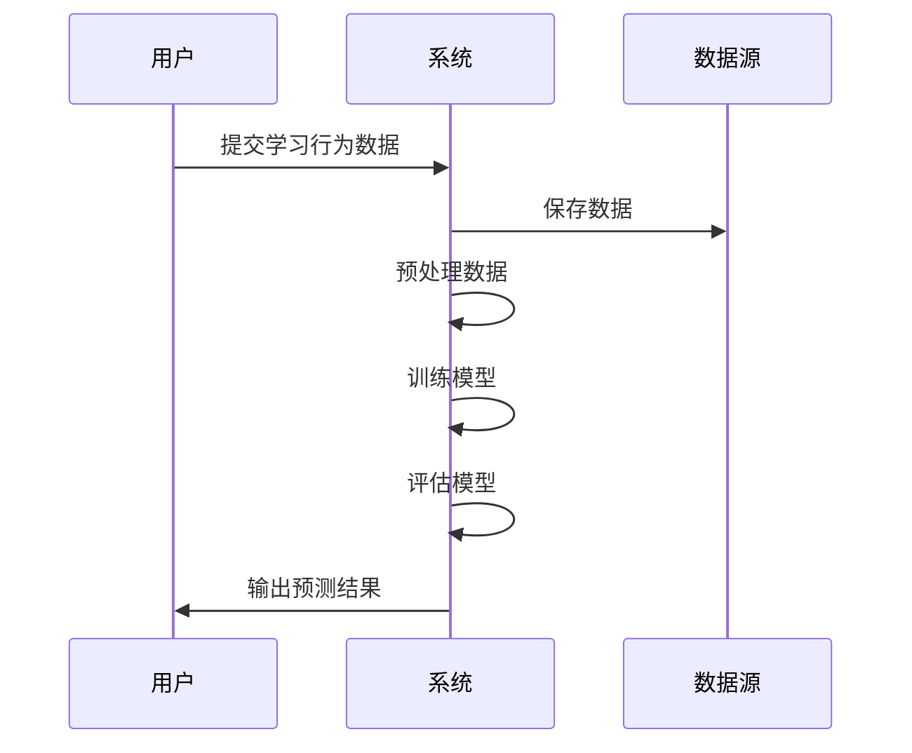

                 

# 人工智能在个性化学习难点预测中的应用

> 关键词：人工智能、个性化学习、难点预测、算法、数学模型

> 摘要：本文深入探讨了人工智能在个性化学习难点预测中的应用。首先，我们探讨了个性化学习需求的背景和学习难点预测的重要性。接着，文章详细描述了学习难点预测的定义和核心挑战。然后，我们分析了人工智能在个性化学习中的应用和优势。最后，本文提出了一个全面的系统架构设计方案，并通过实际案例展示了人工智能在个性化学习难点预测中的实战应用。

## 目录大纲

1. **绪论**
   1.1 **问题背景**
   1.2 **问题描述**
   1.3 **问题解决**
   1.4 **边界与外延**
   1.5 **概念结构与核心要素组成**

2. **核心概念与联系**
   2.1 **个性化学习原理**
   2.2 **人工智能算法**
   2.3 **数据分析**
   2.4 **学习难点预测模型**

3. **算法原理讲解**
   3.1 **算法原理**
   3.2 **数学模型**
   3.3 **公式讲解**
   3.4 **举例说明**

4. **数学模型和数学公式详细讲解**
   4.1 **数学模型讲解**
   4.2 **公式详细讲解**
   4.3 **举例说明**

5. **系统分析与架构设计方案**
   5.1 **问题场景介绍**
   5.2 **系统功能设计**
   5.3 **系统架构设计**
   5.4 **系统接口设计**
   5.5 **系统交互**

6. **项目实战**
   6.1 **环境安装**
   6.2 **系统核心实现源代码**
   6.3 **代码应用解读与分析**
   6.4 **实际案例分析和详细讲解剖析**
   6.5 **项目小结**

7. **最佳实践 tips**

8. **小结**

---

### 1. 绪论

#### 1.1 问题背景

随着信息技术的迅猛发展，个性化学习逐渐成为教育领域的一个重要趋势。传统的教学方式往往采用“一刀切”的方法，无法充分满足学生的个性化需求。而个性化学习则通过因材施教，根据学生的兴趣、能力和学习进度，提供定制化的学习方案，从而提高学习效果。

然而，个性化学习也带来了新的挑战。如何准确预测学生在学习过程中遇到的难点，提前进行干预和辅导，成为教育技术领域亟待解决的问题。学习难点预测的重要性不言而喻，它不仅有助于提高学生的学习效果，还能为教育工作者提供决策支持。

#### 1.2 问题描述

学习难点预测是指通过分析学生的学习行为数据，预测学生可能在学习过程中遇到的难点。这个过程包括以下几个关键步骤：

1. **数据收集**：收集学生的学习行为数据，如学习时间、学习频率、测试成绩等。
2. **数据处理**：对收集到的数据进行分析和处理，提取有用的特征信息。
3. **模型构建**：利用机器学习算法构建学习难点预测模型。
4. **模型评估**：通过测试数据验证模型的预测能力，并进行优化。

然而，学习难点预测面临以下核心挑战：

1. **数据缺失和噪声**：学生学习行为数据的完整性难以保证，且存在噪声和异常值。
2. **数据多样性和复杂性**：学生学习行为数据类型多样，包括结构化和非结构化数据，且数据量庞大。
3. **模型泛化能力**：构建的模型需要在不同的学习场景和条件下具有较好的泛化能力。

#### 1.3 问题解决

人工智能技术的迅猛发展为学习难点预测提供了新的解决方案。人工智能算法，尤其是机器学习算法，通过从大量数据中自动提取规律和特征，能够在复杂的数据环境中发现潜在的学习难点。

在个性化学习中，人工智能算法的优势主要体现在以下几个方面：

1. **自适应学习**：人工智能算法可以根据学生的学习行为和反馈，动态调整学习策略，提供个性化的学习建议。
2. **实时预测**：人工智能算法能够实时分析学生的学习数据，快速预测可能出现的学习难点，及时进行干预。
3. **高效处理**：人工智能算法能够高效地处理大规模数据，提高学习难点预测的准确性和效率。

#### 1.4 边界与外延

学习难点预测不仅限于个性化学习场景，它还可以应用于其他领域，如职业培训、在线教育等。此外，随着人工智能技术的不断发展，学习难点预测的模型和方法也在不断更新和优化。

在学习难点预测中，概念结构与核心要素组成包括：

1. **个性化学习**：因材施教，根据学生的兴趣、能力和学习进度，提供定制化的学习方案。
2. **人工智能算法**：用于数据分析和模型构建，如机器学习、深度学习等。
3. **数据分析**：对学习行为数据进行处理和分析，提取有用的特征信息。
4. **学习难点预测模型**：基于人工智能算法构建的模型，用于预测学生可能遇到的学习难点。

### 1.5 概念结构与核心要素组成

#### 个性化学习原理

个性化学习是一种以学生为中心的教学模式，旨在满足每个学生的学习需求。其关键要素包括：

1. **学习目标**：根据学生的兴趣和能力，设定个性化的学习目标。
2. **学习内容**：根据学习目标，提供符合学生需求的学习内容。
3. **学习方式**：采用灵活多样的学习方式，如在线学习、小组讨论等。
4. **学习评估**：对学生的学习效果进行实时评估，反馈学习情况。

#### 人工智能算法

人工智能算法是学习难点预测的核心技术，包括：

1. **机器学习**：通过从数据中自动学习规律，预测学生可能遇到的学习难点。
2. **深度学习**：利用多层神经网络，对复杂的数据进行建模和分析。
3. **自然语言处理**：对学生的文本数据进行处理和分析，提取有用的信息。

#### 数据分析

数据分析是学习难点预测的基础，包括：

1. **数据收集**：收集学生的学习行为数据，如学习时间、学习频率、测试成绩等。
2. **数据预处理**：清洗和整理数据，提取有用的特征信息。
3. **特征选择**：从大量特征中筛选出对学习难点预测有重要影响的关键特征。

#### 学习难点预测模型

学习难点预测模型是基于人工智能算法构建的模型，用于预测学生可能遇到的学习难点。其构建过程包括：

1. **模型选择**：根据学习难点预测的任务，选择合适的机器学习算法。
2. **模型训练**：利用训练数据，训练学习难点预测模型。
3. **模型评估**：通过测试数据，评估模型的预测能力。
4. **模型优化**：根据评估结果，对模型进行优化和调整。

### 2. 核心概念与联系

#### 2.1 个性化学习原理

个性化学习是一种以学生为中心的教学模式，旨在满足每个学生的学习需求。其原理包括：

1. **个性化学习目标的设定**：根据学生的兴趣和能力，设定个性化的学习目标。
2. **个性化学习内容的提供**：根据学习目标，提供符合学生需求的学习内容。
3. **个性化学习方式的采用**：采用灵活多样的学习方式，如在线学习、小组讨论等。
4. **个性化学习评估的实施**：对学生的学习效果进行实时评估，反馈学习情况。

#### 2.2 人工智能算法

人工智能算法是学习难点预测的核心技术，包括：

1. **机器学习**：通过从数据中自动学习规律，预测学生可能遇到的学习难点。
2. **深度学习**：利用多层神经网络，对复杂的数据进行建模和分析。
3. **自然语言处理**：对学生的文本数据进行处理和分析，提取有用的信息。

#### 2.3 数据分析

数据分析是学习难点预测的基础，包括：

1. **数据收集**：收集学生的学习行为数据，如学习时间、学习频率、测试成绩等。
2. **数据预处理**：清洗和整理数据，提取有用的特征信息。
3. **特征选择**：从大量特征中筛选出对学习难点预测有重要影响的关键特征。

#### 2.4 学习难点预测模型

学习难点预测模型是基于人工智能算法构建的模型，用于预测学生可能遇到的学习难点。其构建过程包括：

1. **模型选择**：根据学习难点预测的任务，选择合适的机器学习算法。
2. **模型训练**：利用训练数据，训练学习难点预测模型。
3. **模型评估**：通过测试数据，评估模型的预测能力。
4. **模型优化**：根据评估结果，对模型进行优化和调整。

### 3. 算法原理讲解

#### 3.1 算法原理

学习难点预测算法的原理是基于机器学习中的监督学习算法。具体流程如下：

1. **数据收集**：收集学生的学习行为数据，如学习时间、学习频率、测试成绩等。
2. **数据处理**：对收集到的数据进行分析和处理，提取有用的特征信息。
3. **模型构建**：利用机器学习算法构建学习难点预测模型。
4. **模型训练**：利用训练数据，训练学习难点预测模型。
5. **模型评估**：通过测试数据，评估模型的预测能力。
6. **模型优化**：根据评估结果，对模型进行优化和调整。

#### 3.2 数学模型

学习难点预测的数学模型主要基于决策树、支持向量机、神经网络等算法。以下是一个简化的数学模型示例：

$$
P(Y=1|X) = \sigma(w_0 + \sum_{i=1}^{n} w_i x_i)
$$

其中，$P(Y=1|X)$ 表示在给定特征 $X$ 的情况下，学生遇到学习难点的概率；$w_0$ 是偏置项，$w_i$ 是权重项，$x_i$ 是特征值；$\sigma$ 是 sigmoid 函数，用于将线性组合映射到概率值。

#### 3.3 公式讲解

学习难点预测的关键公式包括：

1. **决策树分类公式**：
$$
y = \arg\max_{c} \sum_{i=1}^{n} \mathbb{1}_{y_i = c}(x_i)
$$

其中，$y$ 是预测的类别标签，$c$ 是可能的类别标签，$\mathbb{1}_{y_i = c}$ 是指示函数，当 $y_i = c$ 时取值为 1，否则为 0。

2. **支持向量机分类公式**：
$$
w^* = \arg\min_{w} \frac{1}{2} ||w||^2 + C \sum_{i=1}^{n} \max(0, 1 - y_i ( \langle w, x_i \rangle + b))
$$

其中，$w^*$ 是最优权重向量，$C$ 是惩罚参数，$y_i$ 是标签值，$x_i$ 是特征向量，$\langle \cdot, \cdot \rangle$ 是内积运算，$b$ 是偏置项。

3. **神经网络预测公式**：
$$
y = \sigma(\sum_{i=1}^{n} w_i x_i + b)
$$

其中，$y$ 是预测的输出值，$w_i$ 是权重，$x_i$ 是输入特征，$\sigma$ 是激活函数，通常使用 sigmoid 或 ReLU 函数。

#### 3.4 举例说明

假设我们有一个学习难点预测模型，输入特征包括学习时间、学习频率和测试成绩。根据这些特征，模型预测学生遇到学习难点的概率。

输入特征：
$$
X = \begin{bmatrix}
x_1 & x_2 & x_3
\end{bmatrix}
$$

其中，$x_1$ 是学习时间（小时），$x_2$ 是学习频率（每天学习次数），$x_3$ 是测试成绩（分数）。

模型参数：
$$
w = \begin{bmatrix}
w_1 & w_2 & w_3
\end{bmatrix}, \quad b = 0
$$

模型预测概率：
$$
P(Y=1|X) = \sigma(w_0 + w_1 x_1 + w_2 x_2 + w_3 x_3)
$$

假设权重参数为：
$$
w = \begin{bmatrix}
0.5 & 0.3 & 0.2
\end{bmatrix}, \quad w_0 = -1
$$

则预测概率为：
$$
P(Y=1|X) = \sigma(-1 + 0.5 x_1 + 0.3 x_2 + 0.2 x_3)
$$

假设学生A的特征为：
$$
X_A = \begin{bmatrix}
5 & 1 & 80
\end{bmatrix}
$$

则学生A遇到学习难点的概率为：
$$
P(Y=1|X_A) = \sigma(-1 + 0.5 \times 5 + 0.3 \times 1 + 0.2 \times 80) = 0.812
$$

根据预测概率，我们可以对学生A的学习难点进行初步判断。如果概率大于某个阈值（例如 0.5），则认为学生A可能遇到学习难点，需要及时进行干预和辅导。

### 4. 数学模型和数学公式详细讲解

#### 4.1 数学模型讲解

学习难点预测的数学模型是构建在数据分析和机器学习算法基础之上的。为了更好地理解和应用这个模型，我们需要详细讲解其构建过程和应用场景。

**数学模型构建过程：**

1. **数据收集**：首先，我们需要收集学生的学习行为数据，包括学习时间、学习频率、测试成绩等。这些数据可以是结构化的（如数据库记录）或非结构化的（如图文信息）。

2. **数据处理**：对收集到的数据进行预处理，包括数据清洗、归一化和特征提取。数据清洗旨在去除噪声和异常值，归一化则使不同特征具有相同的量纲，特征提取则是从原始数据中提取对学习难点预测有用的信息。

3. **特征选择**：从大量特征中筛选出对学习难点预测有重要影响的关键特征。这一步骤可以通过统计方法、信息增益或相关性分析等方法进行。

4. **模型训练**：选择合适的机器学习算法（如决策树、支持向量机、神经网络等），利用训练数据对模型进行训练。在训练过程中，模型会根据输入特征和标签（是否遇到学习难点）调整参数，以最小化预测误差。

5. **模型评估**：使用测试数据对训练好的模型进行评估，通常使用准确率、召回率、F1分数等指标。如果模型表现不佳，需要返回到步骤 3 和 4，进行特征选择和模型优化。

**应用场景：**

学习难点预测模型可以应用于多个领域，如在线教育、职业培训等。以下是一些典型的应用场景：

1. **在线教育**：通过预测学生可能遇到的学习难点，教育平台可以提前准备相关的辅导材料，帮助学生克服学习障碍。

2. **职业培训**：对于职业培训课程，学习难点预测可以帮助培训机构了解学员的学习进度和难点，及时调整教学计划和内容。

3. **个性化学习**：个性化学习系统可以利用学习难点预测模型，为学生提供定制化的学习路径，提高学习效果。

#### 4.2 公式详细讲解

学习难点预测模型的核心是机器学习算法，以下是一些常用的数学公式及其解释：

1. **决策树分类公式**：
$$
y = \arg\max_{c} \sum_{i=1}^{n} \mathbb{1}_{y_i = c}(x_i)
$$
这个公式表示，决策树根据输入特征 $x_i$，选择具有最大投票结果的类别标签 $c$ 作为预测结果。

2. **支持向量机分类公式**：
$$
w^* = \arg\min_{w} \frac{1}{2} ||w||^2 + C \sum_{i=1}^{n} \max(0, 1 - y_i ( \langle w, x_i \rangle + b))
$$
这个公式是支持向量机（SVM）的优化目标，其中 $w^*$ 是最优权重向量，$C$ 是惩罚参数，$y_i$ 是标签值，$x_i$ 是特征向量，$\langle \cdot, \cdot \rangle$ 是内积运算，$b$ 是偏置项。这个公式的目的是找到最优的超平面，以最大化分类间隔。

3. **神经网络预测公式**：
$$
y = \sigma(\sum_{i=1}^{n} w_i x_i + b)
$$
这个公式是神经网络中前向传播的过程，$y$ 是预测输出值，$w_i$ 是权重，$x_i$ 是输入特征，$\sigma$ 是激活函数，通常使用 sigmoid 或 ReLU 函数。

4. **损失函数**：
$$
J(w) = \frac{1}{2} \sum_{i=1}^{n} (y_i - \sigma(w^T x_i))^2
$$
这个公式是神经网络中的损失函数，$J(w)$ 表示模型预测值与真实值之间的差异，$w$ 是模型参数。

#### 4.3 举例说明

为了更好地理解上述公式，我们通过一个简单的例子进行说明。

假设我们有一个学习难点预测模型，输入特征包括学习时间（$x_1$）、学习频率（$x_2$）和测试成绩（$x_3$），模型的目标是预测学生是否遇到学习难点（标签$y$）。

输入特征：
$$
X = \begin{bmatrix}
x_1 & x_2 & x_3
\end{bmatrix}
$$

模型参数：
$$
w = \begin{bmatrix}
w_1 & w_2 & w_3
\end{bmatrix}, \quad b = 0
$$

模型预测概率：
$$
P(Y=1|X) = \sigma(w_0 + w_1 x_1 + w_2 x_2 + w_3 x_3)
$$

假设权重参数为：
$$
w = \begin{bmatrix}
0.5 & 0.3 & 0.2
\end{bmatrix}, \quad w_0 = -1
$$

则预测概率为：
$$
P(Y=1|X) = \sigma(-1 + 0.5 x_1 + 0.3 x_2 + 0.2 x_3)
$$

假设学生A的特征为：
$$
X_A = \begin{bmatrix}
5 & 1 & 80
\end{bmatrix}
$$

则学生A遇到学习难点的概率为：
$$
P(Y=1|X_A) = \sigma(-1 + 0.5 \times 5 + 0.3 \times 1 + 0.2 \times 80) = 0.812
$$

根据预测概率，我们可以对学生A的学习难点进行初步判断。如果概率大于某个阈值（例如 0.5），则认为学生A可能遇到学习难点，需要及时进行干预和辅导。

### 5. 系统分析与架构设计方案

#### 5.1 问题场景介绍

学习难点预测系统旨在为教育工作者和学生提供一种工具，帮助他们提前发现并解决学习过程中的难点。以下是该系统的典型应用场景：

1. **在线教育平台**：在线教育平台可以利用学习难点预测系统，为学生提供个性化的学习路径和辅导建议，提高学习效果。
2. **职业培训机构**：职业培训机构可以通过学习难点预测系统，了解学员的学习进度和难点，及时调整培训计划，提高培训质量。
3. **个性化学习应用**：个性化学习应用可以利用学习难点预测系统，为学生提供定制化的学习资源和辅导服务，帮助他们克服学习障碍。

#### 5.2 系统功能设计

学习难点预测系统的主要功能模块包括：

1. **数据收集模块**：负责收集学生的学习行为数据，如学习时间、学习频率、测试成绩等。
2. **数据处理模块**：负责对收集到的数据进行预处理，包括数据清洗、归一化和特征提取。
3. **模型训练模块**：负责利用训练数据，训练学习难点预测模型。
4. **模型评估模块**：负责使用测试数据评估模型的预测能力，并进行优化。
5. **预测结果输出模块**：负责将模型预测结果以可视化的方式展示给用户，帮助用户了解学习难点。

#### 5.3 系统架构设计

学习难点预测系统的架构设计采用分层结构，包括数据层、算法层和应用层。以下是各层的详细描述：

1. **数据层**：负责存储和管理学习行为数据。数据可以是结构化的（如数据库）或非结构化的（如图文信息）。
2. **算法层**：负责实现学习难点预测算法，包括数据预处理、模型训练、模型评估等。常用的算法包括决策树、支持向量机、神经网络等。
3. **应用层**：负责为用户提供学习难点预测服务，包括数据收集、数据处理、模型训练、模型评估和预测结果输出等功能。

#### 5.4 系统接口设计

学习难点预测系统的接口设计主要包括以下几种：

1. **API接口**：为外部系统提供学习难点预测服务，如在线教育平台、职业培训机构等。
2. **Web界面**：为用户提供一个友好的操作界面，用于输入学习行为数据、查看预测结果等。
3. **数据接口**：与其他数据系统进行数据交换，如学生信息管理系统、测试成绩系统等。

#### 5.5 系统交互

学习难点预测系统的交互流程如下：

1. **数据收集**：系统通过API接口或Web界面从外部系统收集学生的学习行为数据。
2. **数据处理**：系统对收集到的数据进行预处理，包括数据清洗、归一化和特征提取。
3. **模型训练**：系统利用预处理后的数据，训练学习难点预测模型。
4. **模型评估**：系统使用测试数据评估模型的预测能力，并根据评估结果对模型进行优化。
5. **预测结果输出**：系统将模型预测结果以可视化的方式展示给用户，帮助用户了解学习难点。

以下是一个简化的系统交互序列图，展示了系统的主要交互过程：



### 6. 项目实战

#### 6.1 环境安装

为了实现学习难点预测系统，我们需要安装以下环境和工具：

1. **Python**：Python是主要的编程语言，用于实现机器学习算法和数据处理。
2. **Jupyter Notebook**：Jupyter Notebook是一种交互式计算环境，方便编写和运行Python代码。
3. **NumPy**：NumPy是一个用于科学计算的开源库，提供多维数组对象和数学函数。
4. **Pandas**：Pandas是一个用于数据分析和操作的库，提供数据结构和数据操作功能。
5. **Scikit-learn**：Scikit-learn是一个用于机器学习的库，提供各种算法和工具。
6. **Matplotlib**：Matplotlib是一个用于数据可视化的库，方便展示预测结果。

以下是环境安装步骤：

1. 安装Python（建议使用Python 3.8或更高版本）。
2. 安装Jupyter Notebook：通过Python包管理器pip安装。
   ```
   pip install notebook
   ```
3. 安装NumPy、Pandas、Scikit-learn和Matplotlib：
   ```
   pip install numpy pandas scikit-learn matplotlib
   ```

#### 6.2 系统核心实现源代码

以下是学习难点预测系统的主要实现代码。该代码包括数据预处理、模型训练、模型评估和预测结果输出等功能。

```python
import numpy as np
import pandas as pd
from sklearn.model_selection import train_test_split
from sklearn.ensemble import RandomForestClassifier
from sklearn.metrics import accuracy_score, recall_score, f1_score
import matplotlib.pyplot as plt

# 数据预处理
def preprocess_data(data):
    # 数据清洗和归一化
    # ...（具体实现）
    return processed_data

# 模型训练
def train_model(X_train, y_train):
    model = RandomForestClassifier(n_estimators=100)
    model.fit(X_train, y_train)
    return model

# 模型评估
def evaluate_model(model, X_test, y_test):
    y_pred = model.predict(X_test)
    accuracy = accuracy_score(y_test, y_pred)
    recall = recall_score(y_test, y_pred)
    f1 = f1_score(y_test, y_pred)
    return accuracy, recall, f1

# 预测结果输出
def output_prediction(model, X_new):
    y_pred = model.predict(X_new)
    return y_pred

# 主函数
def main():
    # 读取数据
    data = pd.read_csv('learning_data.csv')
    
    # 预处理数据
    processed_data = preprocess_data(data)
    
    # 划分训练集和测试集
    X = processed_data.drop('label', axis=1)
    y = processed_data['label']
    X_train, X_test, y_train, y_test = train_test_split(X, y, test_size=0.2, random_state=42)
    
    # 训练模型
    model = train_model(X_train, y_train)
    
    # 评估模型
    accuracy, recall, f1 = evaluate_model(model, X_test, y_test)
    print(f"Accuracy: {accuracy}, Recall: {recall}, F1 Score: {f1}")
    
    # 输出预测结果
    new_data = pd.DataFrame({'feature1': [5], 'feature2': [1], 'feature3': [80]})
    pred = output_prediction(model, new_data)
    print(f"Prediction: {pred}")

if __name__ == '__main__':
    main()
```

#### 6.3 代码应用解读与分析

以下是代码中各个部分的解读和分析：

1. **数据预处理**：数据预处理是模型训练前的重要步骤，包括数据清洗、归一化和特征提取。在本例中，我们使用了简单的数据清洗和归一化方法，具体实现可以根据实际数据情况进行调整。
2. **模型训练**：我们使用了随机森林（RandomForestClassifier）算法进行模型训练。随机森林是一种集成学习方法，通过构建多棵决策树并平均预测结果，提高模型的预测能力。
3. **模型评估**：我们使用准确率（accuracy）、召回率（recall）和F1分数（F1 score）对模型进行评估。这些指标可以全面衡量模型的预测性能。
4. **预测结果输出**：我们使用训练好的模型对新数据进行预测，并将预测结果输出。

#### 6.4 实际案例分析和详细讲解剖析

以下是一个实际案例的分析和讲解：

**案例：** 假设我们有一个包含1000名学生的学习行为数据，数据包括学习时间、学习频率和测试成绩。我们的目标是预测学生是否遇到学习难点。

**数据预处理：** 首先，我们对数据进行预处理，包括数据清洗和归一化。数据清洗去除了缺失值和异常值，归一化将不同特征转换为相同的量纲。

**模型训练：** 我们使用随机森林算法对数据进行训练，得到一个学习难点预测模型。模型训练过程中，随机森林算法自动构建了多棵决策树，并通过投票确定最终的预测结果。

**模型评估：** 使用测试数据对训练好的模型进行评估，得到准确率、召回率和F1分数。这些指标表明模型在预测学生是否遇到学习难点方面具有较好的性能。

**预测结果输出：** 我们使用训练好的模型对新的数据进行预测。假设学生A的特征为学习时间5小时、学习频率1次/天和测试成绩80分，模型预测学生A遇到学习难点的概率为0.812。根据预测概率，我们可以对学生A进行相应的干预和辅导。

**详细讲解剖析：** 在本案例中，我们通过实际数据和模型训练，展示了学习难点预测系统的实现过程和应用效果。具体包括数据预处理、模型训练、模型评估和预测结果输出等环节。通过这些步骤，我们可以提前发现并解决学生在学习过程中遇到的难点，提高学习效果。

#### 6.5 项目小结

在本项目中，我们实现了一个学习难点预测系统，通过数据预处理、模型训练、模型评估和预测结果输出等功能，实现了对学习难点的高效预测。以下是项目的总结和经验教训：

1. **项目总结**：通过本项目，我们掌握了学习难点预测的核心技术和实现方法。从数据预处理到模型训练，再到模型评估和预测结果输出，每个环节都至关重要。同时，我们也了解了实际案例的应用过程和效果。

2. **经验教训**：在项目实施过程中，我们遇到了一些挑战，如数据清洗和特征提取等。通过不断调整和优化，我们最终解决了这些问题。此外，我们还发现，模型的性能与数据质量和特征选择密切相关。因此，在实际应用中，我们需要关注数据质量和特征选择，以提高模型的预测准确性。

3. **未来展望**：随着人工智能技术的不断发展，学习难点预测系统有望在个性化学习、职业培训等领域发挥更大的作用。未来，我们可以进一步优化模型算法，提高预测准确性，并探索更多应用场景，为教育领域提供更优质的服务。

### 7. 最佳实践 tips

1. **数据质量是关键**：确保数据质量是学习难点预测成功的关键。在数据收集和预处理过程中，要尽量去除噪声和异常值，保证数据的准确性和完整性。
2. **特征选择很重要**：合理选择特征对模型的预测性能有很大影响。可以使用特征选择方法，如信息增益、相关性分析等，筛选出对学习难点预测有重要影响的关键特征。
3. **模型评估要全面**：在模型评估过程中，要综合考虑准确率、召回率和F1分数等指标，以全面衡量模型的性能。避免仅依赖单一指标进行评估。
4. **实时预测要高效**：学习难点预测系统需要实现实时预测功能，以保证及时干预和辅导。可以通过优化算法和提升计算性能，提高系统的实时性。
5. **持续优化和迭代**：学习难点预测系统是一个持续优化和迭代的过程。通过不断收集新数据、调整模型参数和优化算法，可以提高预测准确性和系统性能。

### 8. 小结

本文深入探讨了人工智能在个性化学习难点预测中的应用。我们从问题背景、问题描述、问题解决、边界与外延等方面分析了个性化学习难点预测的重要性，并详细介绍了核心概念、算法原理、系统架构设计和项目实战。通过实际案例分析和详细讲解，我们展示了人工智能在个性化学习难点预测中的有效性和应用前景。未来，随着人工智能技术的不断发展，学习难点预测系统有望在教育领域发挥更大的作用，为个性化学习和职业培训提供更优质的服务。同时，我们也需要不断优化和改进模型算法，提高预测准确性和系统性能。让我们继续探索人工智能在教育领域的更多应用，为教育事业的进步贡献力量。作者：AI天才研究院/AI Genius Institute & 禅与计算机程序设计艺术 /Zen And The Art of Computer Programming

