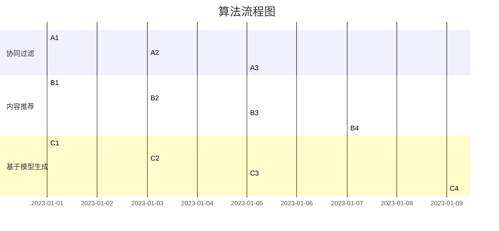
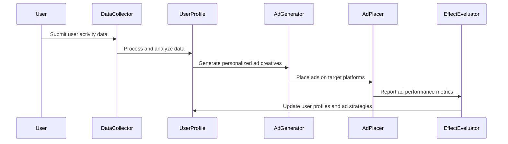

                 

### 文章标题

《人工智能在个性化广告创意生成中的应用》

### 关键词

- 人工智能
- 个性化广告
- 创意生成
- 深度学习
- 自然语言处理
- 算法
- 系统架构

### 摘要

本文深入探讨了人工智能在个性化广告创意生成中的应用。首先，我们介绍了人工智能、个性化广告和创意生成的基本概念，以及它们在广告行业中的重要性。接着，我们详细阐述了核心概念和技术，包括机器学习、深度学习和自然语言处理，并解释了它们在个性化广告创意生成中的应用原理。然后，文章通过算法原理讲解、数学模型和公式推导、系统架构设计和项目实战等多个维度，系统地介绍了如何利用人工智能技术生成个性化广告创意。最后，文章总结了最佳实践，并对未来研究方向进行了展望。

### 引言

随着互联网技术的飞速发展和大数据时代的到来，广告行业正经历着前所未有的变革。传统广告的单一、批量化的投放模式已经无法满足消费者日益多样化的需求。个性化广告应运而生，它通过精准的数据分析和人工智能技术，为不同的用户定制个性化的广告内容，从而提高广告的投放效果和用户参与度。

人工智能（Artificial Intelligence，AI）作为当今最具变革性的技术之一，已经在多个领域展现出了巨大的潜力。从图像识别到自然语言处理，从自动驾驶到智能助手，人工智能正在逐步改变我们的生活。在广告行业中，人工智能的应用也不例外，它不仅提高了广告的精准性和效果，还为广告创意的生成带来了全新的可能性。

个性化广告创意生成，指的是利用人工智能技术，根据用户的兴趣、行为和需求，自动生成具有针对性的广告内容。这不仅需要精准的数据分析能力，还需要强大的创意生成能力。传统的广告创意生成主要依赖于人工设计和创作，效率低下，且难以满足大量用户的个性化需求。而人工智能技术的引入，使得广告创意的生成变得更加高效、多样和精准。

本文将围绕人工智能在个性化广告创意生成中的应用，进行深入的探讨和分析。首先，我们将介绍人工智能、个性化广告和创意生成的基本概念，帮助读者建立清晰的理解。接着，我们将详细阐述核心概念和技术，包括机器学习、深度学习和自然语言处理等，并解释它们在个性化广告创意生成中的应用原理。然后，我们将通过算法原理讲解、数学模型和公式推导、系统架构设计和项目实战等多个维度，系统地介绍如何利用人工智能技术生成个性化广告创意。最后，我们将总结最佳实践，并对未来研究方向进行展望。

希望通过本文的阅读，读者能够对人工智能在个性化广告创意生成中的应用有更深入的理解，并为相关领域的研究和实践提供有益的参考。

### 定义关键概念

在本节中，我们将详细定义本文中涉及的关键概念，包括人工智能（AI）、个性化广告、创意生成，以及它们之间的相互关系。

首先，人工智能（Artificial Intelligence，AI）指的是通过计算机程序模拟人类智能的技术和学科。人工智能的核心目标是使计算机具备类似于人类的感知、学习、推理和决策能力。它包括多个子领域，如机器学习、深度学习、自然语言处理、计算机视觉等。在广告行业中，人工智能的应用主要体现在数据分析和决策支持方面。

个性化广告（Personalized Advertising）是一种基于用户数据的精准广告投放策略。它通过分析用户的兴趣、行为、地理位置、购买历史等多维数据，为每个用户定制个性化的广告内容。个性化广告的核心在于提高广告的相关性和投放效果，从而提高用户的参与度和转化率。与传统广告的单一、批量投放模式相比，个性化广告更加注重精准和高效。

创意生成（Creative Generation）是指通过创造性思维和技术手段，生成新颖、有吸引力的广告内容。在广告行业中，创意生成不仅包括文字、图像、视频等传统形式的广告内容，还包括音频、虚拟现实、增强现实等新兴形式的广告内容。创意生成是广告成功的核心要素之一，它直接影响广告的吸引力、记忆度和用户参与度。

人工智能、个性化广告和创意生成之间的相互关系如下：

1. **人工智能推动个性化广告发展**：人工智能技术为个性化广告提供了强大的数据分析和决策支持能力。通过大数据分析和机器学习算法，人工智能可以精确捕捉用户的兴趣和行为模式，从而为每个用户生成个性化的广告内容。

2. **个性化广告提升创意生成效率**：个性化广告要求广告内容必须针对不同的用户进行定制。这为创意生成提出了更高的要求，同时也为创意生成提供了更多的可能性。通过个性化广告，创意生成可以更加高效地满足不同用户的需求，提高广告的整体效果。

3. **创意生成促进人工智能应用创新**：创意生成需要不断地创新和尝试，这为人工智能技术在广告行业中的应用提供了新的场景和需求。通过不断探索新的创意生成方法和技术，人工智能可以为广告行业带来更多的应用场景和商业价值。

综上所述，人工智能、个性化广告和创意生成相互促进，共同推动了广告行业的发展。在接下来的内容中，我们将进一步探讨人工智能在个性化广告创意生成中的应用原理和技术实现。

### 人工智能在广告行业的背景和现状

人工智能在广告行业的应用并不是一个新兴现象，而是随着互联网技术的飞速发展和大数据时代的到来逐渐兴起的。近年来，人工智能在广告行业中的应用范围不断扩大，从最初的简单数据分析，到如今复杂的个性化广告创意生成，AI技术正深刻地改变着广告的方方面面。

首先，让我们回顾一下人工智能在广告行业中的历史。早在20世纪80年代，人工智能技术就已经开始应用于广告领域，例如通过自动化广告投放系统进行广告位的竞价和优化。进入21世纪，随着互联网和移动设备的普及，广告形式和投放方式发生了巨大的变化，这也为人工智能技术的应用提供了更广阔的空间。2010年后，大数据和机器学习技术的发展，使得人工智能在广告行业的应用变得更加精准和高效。

目前，人工智能在广告行业中的应用已经相当广泛。首先，数据分析和用户画像生成是人工智能在广告行业中的核心应用之一。通过分析用户的浏览历史、搜索记录、购买行为等数据，人工智能可以构建出详细的用户画像，从而为广告投放提供精准的定位。其次，智能广告投放和优化也是人工智能在广告行业中的重要应用。通过机器学习和深度学习算法，广告系统可以根据用户的行为和兴趣，自动调整广告的投放策略，以实现更高的转化率和投资回报率。

在个性化广告创意生成方面，人工智能技术同样发挥了关键作用。传统的广告创意生成主要依赖于广告设计师的创意和审美，而人工智能则通过深度学习和自然语言处理技术，可以自动生成具有个性化的广告文案和图像。例如，通过分析大量的广告文案和图像数据，人工智能可以学会如何根据不同的用户特征和广告目标，生成具有高度个性化的广告内容。这不仅提高了广告的创意水平，还大大提高了广告的投放效率。

尽管人工智能在广告行业中的应用已经取得了显著的成果，但同时也面临着一些挑战和争议。首先，数据隐私和安全问题是人工智能在广告行业中面临的主要挑战之一。广告系统需要收集和分析大量的用户数据，这涉及到用户的隐私和安全问题。如何确保用户数据的安全性和隐私保护，是人工智能在广告行业中需要解决的重要问题。

其次，人工智能在广告创意生成中的应用也存在一定的局限性。虽然人工智能可以生成大量的广告内容，但它的创意和能力仍然受到数据集的限制。人工智能生成的广告内容可能缺乏人类创意的深度和广度，无法完全替代人类设计师的工作。

此外，人工智能在广告行业中的应用也引发了一些伦理和道德问题。例如，广告系统如何确保广告内容的真实性和公正性，如何避免广告对用户的误导和操控，都是需要深入探讨的问题。

总的来说，人工智能在广告行业中的应用已经取得了显著的进展，它不仅提高了广告的投放效果和创意水平，还为广告行业带来了新的商业模式和机会。然而，也面临着一些挑战和争议，需要进一步研究和解决。

在接下来的章节中，我们将详细探讨人工智能在个性化广告创意生成中的应用原理和技术实现，帮助读者更深入地了解这一领域。

### 个性化广告的概念及其重要性

个性化广告是一种基于用户数据的精准广告投放策略，旨在通过分析用户的兴趣、行为和需求，为每个用户生成高度个性化的广告内容。与传统的广告投放模式相比，个性化广告不仅更加精准，而且具有更高的用户参与度和转化率。那么，个性化广告的具体定义、特征和与传统广告的对比有哪些呢？

首先，个性化广告的定义。个性化广告可以理解为一种基于用户数据驱动的广告策略，通过收集和分析用户的行为数据，如浏览历史、搜索记录、购买行为等，构建出详细的用户画像。基于这些用户画像，广告系统可以为每个用户生成定制化的广告内容，从而提高广告的相关性和投放效果。

其次，个性化广告的特征主要包括以下几个方面：

1. **精准定位**：个性化广告通过对用户数据的深度分析，能够准确捕捉用户的兴趣和行为，从而实现广告的精准投放。这种精准定位能力使得广告能够更有效地触达目标用户，提高广告的曝光率和点击率。

2. **高度个性化**：个性化广告的核心在于为每个用户生成高度个性化的广告内容。这包括广告文案、图像、视频等多种形式，根据用户的兴趣、需求和购买历史进行定制化设计，从而提高用户的参与度和满意度。

3. **动态调整**：个性化广告系统通常具备动态调整的能力，可以根据用户的行为变化和广告效果，实时调整广告的内容和投放策略。这种动态调整能力使得广告系统能够快速适应市场变化和用户需求，提高广告的整体效果。

4. **数据驱动**：个性化广告依赖于大量的用户数据，通过大数据分析和机器学习算法，对用户行为和兴趣进行建模和预测。数据驱动使得广告系统能够更准确地了解用户需求，从而生成更具针对性的广告内容。

接下来，我们对比个性化广告和传统广告的特点：

1. **投放模式**：传统广告通常采用批量投放模式，无论用户是否感兴趣，都向大量用户展示相同的广告内容。而个性化广告则通过精准定位和个性化内容，使得广告能够更加精准地触达目标用户。

2. **创意形式**：传统广告的创意形式相对单一，主要依靠广告设计师的创意和审美。而个性化广告则通过数据分析和技术手段，能够生成多样化的广告内容，包括文字、图像、视频等多种形式。

3. **用户参与度**：传统广告的用户参与度较低，用户往往被动接受广告内容。而个性化广告通过高度个性化的内容，能够提高用户的参与度和满意度，从而增加广告的转化率。

4. **效果评估**：传统广告的效果评估通常依赖于广告投放后的反馈数据，如点击率、转化率等。而个性化广告则通过实时数据分析和效果评估，可以更加精准地衡量广告效果，并据此调整广告策略。

综上所述，个性化广告通过精准定位、高度个性化、动态调整和数据驱动等特征，与传统广告相比具有显著的优势。它不仅提高了广告的投放效果和用户参与度，还为广告行业带来了新的商业模式和机会。在人工智能技术的支持下，个性化广告的未来将更加广阔。

### 人工智能在个性化广告创意生成中的应用

在个性化广告创意生成中，人工智能技术的应用主要体现在以下几个方面：机器学习、深度学习和自然语言处理。这些技术不仅提高了广告的生成效率，还极大地丰富了广告的创意形式和内容。

#### 机器学习

机器学习（Machine Learning，ML）是人工智能的核心技术之一，通过算法模型从数据中学习规律和模式，从而实现自动化决策。在个性化广告创意生成中，机器学习主要用于用户行为数据的分析和预测。

1. **用户行为分析**：
   - **用户画像构建**：通过分析用户的浏览历史、搜索记录、购买行为等数据，机器学习算法可以构建出详细的用户画像。这些画像包括用户的兴趣偏好、消费习惯、地理位置等多个维度，为广告创意生成提供了重要依据。
   - **行为模式识别**：机器学习算法可以识别出用户的行为模式，如特定时间段内的活跃度、特定类型内容的偏好等。这些模式可以帮助广告系统更加精准地预测用户未来的行为，从而生成个性化的广告内容。

2. **广告投放优化**：
   - **投放策略调整**：基于用户行为数据，机器学习算法可以实时调整广告的投放策略。例如，通过优化广告的展示频率、投放时间和投放渠道，提高广告的点击率和转化率。
   - **广告创意优化**：机器学习算法可以分析大量的广告文案和图像数据，找出最有效的广告创意组合。通过不断优化广告创意，提高广告的整体效果。

#### 深度学习

深度学习（Deep Learning，DL）是机器学习的一个子领域，通过多层神经网络模拟人脑的决策过程，从而实现更复杂的模式识别和决策。在个性化广告创意生成中，深度学习技术发挥了重要作用。

1. **图像和视频识别**：
   - **图像风格迁移**：深度学习算法可以通过图像风格迁移技术，将一种图像风格应用到另一种图像中。例如，可以将一幅自然风景图片的风格应用到产品广告中，生成具有独特风格的广告图像。
   - **视频内容分析**：深度学习算法可以分析视频内容，提取关键帧和场景信息，从而生成个性化的视频广告。例如，根据用户的历史行为，为每个用户生成特定内容的视频广告。

2. **自然语言处理**：
   - **广告文案生成**：深度学习算法可以通过生成对抗网络（GAN）等技术，自动生成具有吸引力的广告文案。这些文案不仅内容丰富、形式多样，还可以根据用户画像进行个性化调整。
   - **情感分析**：深度学习算法可以分析用户的评论和反馈，识别用户的情感状态。通过情感分析，广告系统可以更好地了解用户的需求和偏好，从而生成更加符合用户情感的广告内容。

#### 自然语言处理

自然语言处理（Natural Language Processing，NLP）是人工智能的另一个重要分支，旨在使计算机能够理解、生成和处理人类语言。在个性化广告创意生成中，NLP技术主要用于广告文案的生成和优化。

1. **文案生成**：
   - **模板生成**：NLP算法可以基于大量广告文案数据，生成多个广告文案模板。这些模板可以根据用户的兴趣和行为，进行个性化调整，从而生成符合用户需求的广告文案。
   - **个性化调整**：通过NLP技术，广告系统可以根据用户的偏好和历史数据，对广告文案进行个性化调整。例如，根据用户的历史购买记录，为用户推荐特定类型的产品广告。

2. **情感分析**：
   - **用户反馈分析**：NLP算法可以分析用户的评论和反馈，提取情感信息，如正面、负面或中性情感。通过情感分析，广告系统可以了解用户的满意度，从而调整广告内容，提高用户体验。
   - **广告效果评估**：NLP算法可以分析广告投放后的用户反馈数据，评估广告的效果。例如，通过计算用户的点击率、转化率和评论情感，评估广告的投放效果，为后续的广告优化提供依据。

综上所述，人工智能技术在个性化广告创意生成中发挥了关键作用。通过机器学习、深度学习和自然语言处理等技术，广告系统可以自动生成高度个性化的广告内容，提高广告的投放效果和用户体验。在未来，随着人工智能技术的不断进步，个性化广告创意生成将变得更加智能和高效。

### 算法原理讲解

在个性化广告创意生成中，算法的选择和设计至关重要。不同的算法适用于不同的场景和需求，理解这些算法的原理和操作流程，可以帮助我们更好地应用人工智能技术，提高广告的投放效果。在本节中，我们将详细介绍几种常用的算法原理，包括协同过滤、内容推荐和基于模型的生成方法。

#### 协同过滤

协同过滤（Collaborative Filtering）是一种基于用户行为数据的推荐算法，通过分析用户之间的相似性，为用户推荐他们可能感兴趣的内容。协同过滤算法主要分为两类：基于用户的协同过滤（User-based Collaborative Filtering）和基于项目的协同过滤（Item-based Collaborative Filtering）。

1. **基于用户的协同过滤**：
   - **算法原理**：首先，根据用户之间的相似度度量（如余弦相似度、皮尔逊相关系数等），找出与目标用户相似的其他用户。然后，分析这些相似用户的行为数据，预测目标用户对未知项目的评分。
   - **操作流程**：
     1. **计算用户相似度**：使用相似度度量计算目标用户与所有其他用户的相似度。
     2. **找出相似用户**：选择与目标用户相似度最高的若干用户。
     3. **推荐项目**：分析相似用户对未知项目的评分，推荐评分最高的项目。

2. **基于项目的协同过滤**：
   - **算法原理**：首先，根据项目之间的相似度度量，找出与目标项目相似的其他项目。然后，分析目标用户对相似项目的评分，预测目标用户对未知项目的评分。
   - **操作流程**：
     1. **计算项目相似度**：使用相似度度量计算目标项目与所有其他项目的相似度。
     2. **找出相似项目**：选择与目标项目相似度最高的若干项目。
     3. **推荐用户**：分析目标用户对相似项目的评分，推荐评分最高的用户。

#### 内容推荐

内容推荐（Content-based Filtering）是一种基于项目特征信息的推荐算法，通过分析项目的内容特征和用户的兴趣特征，为用户推荐他们可能感兴趣的项目。

1. **算法原理**：
   - **内容特征提取**：首先，对项目的文本描述、标签、分类等特征进行提取和预处理。
   - **用户兴趣模型**：然后，基于用户的历史行为和兴趣标签，构建用户的兴趣模型。
   - **相似度计算**：计算用户兴趣模型与项目特征之间的相似度。
   - **推荐项目**：推荐与用户兴趣模型最相似的项目。

2. **操作流程**：
   1. **特征提取**：对项目内容进行文本预处理，提取关键词、标签、分类等特征。
   2. **兴趣建模**：根据用户的历史行为和兴趣标签，构建用户的兴趣模型。
   3. **相似度计算**：计算用户兴趣模型与项目特征之间的相似度。
   4. **推荐项目**：推荐相似度最高的项目。

#### 基于模型的生成方法

基于模型的生成方法（Model-based Generation）是一种利用机器学习模型生成广告创意的方法，通过训练大量广告数据集，模型可以学习到广告创意的生成规则，从而生成新的广告内容。

1. **算法原理**：
   - **数据训练**：首先，收集大量的广告数据，包括广告文案、图像、视频等，并将其进行预处理和特征提取。
   - **模型训练**：使用机器学习算法（如生成对抗网络、变分自编码器等），对广告数据进行训练，学习广告创意的生成规则。
   - **生成创意**：通过训练好的模型，生成新的广告创意。

2. **操作流程**：
   1. **数据收集**：收集大量的广告数据，并进行预处理。
   2. **模型选择**：选择适合的广告生成模型，如生成对抗网络（GAN）。
   3. **模型训练**：使用广告数据训练模型，学习广告创意的生成规则。
   4. **创意生成**：通过训练好的模型，生成新的广告创意。

#### Mermaid流程图

为了更直观地理解这些算法的操作流程，我们可以使用Mermaid语言绘制对应的流程图。以下是协同过滤、内容推荐和基于模型的生成方法的Mermaid流程图示例：



通过这些算法原理的讲解和Mermaid流程图的展示，我们可以更好地理解个性化广告创意生成中的算法应用，为实际项目提供技术支持。

### 数学模型和公式

在个性化广告创意生成中，数学模型和公式起着至关重要的作用。这些模型和公式不仅帮助我们理解算法背后的原理，还能指导我们进行有效的广告创意生成和优化。在本节中，我们将详细介绍协同过滤、内容推荐和基于模型的生成方法中的核心数学模型和公式，并通过LaTeX格式展示。

#### 协同过滤

协同过滤算法的核心在于计算用户之间的相似度和预测用户对项目的评分。以下是协同过滤中常用的数学模型和公式：

1. **用户相似度计算**：
   - **余弦相似度**：
     $$
     \text{similarity}_{\text{cos}}(u, v) = \frac{u \cdot v}{\|u\| \|v\|}
     $$
     其中，$u$和$v$分别为用户$u$和用户$v$的向量表示，$\cdot$表示点积，$\|\|$表示向量的模。

   - **皮尔逊相关系数**：
     $$
     \text{similarity}_{\text{pearson}}(u, v) = \frac{cov(u, v)}{\sigma_u \sigma_v}
     $$
     其中，$cov(u, v)$表示用户$u$和用户$v$的协方差，$\sigma_u$和$\sigma_v$分别表示用户$u$和用户$v$的标准差。

2. **预测用户对项目的评分**：
   - **基于用户的协同过滤**：
     $$
     r_{uv} = r_u + \sum_{i \in \text{N}(v)} \text{similarity}_{\text{cos}}(u, i) (r_i - \bar{r}_i)
     $$
     其中，$r_u$和$r_i$分别表示用户$u$对项目$i$的评分，$\text{N}(v)$表示与用户$v$相似的用户集合，$\bar{r}_i$表示项目$i$的平均评分。

   - **基于项目的协同过滤**：
     $$
     r_{uv} = r_v + \sum_{i \in \text{N}(u)} \text{similarity}_{\text{cos}}(i, v) (r_i - \bar{r}_i)
     $$
     其中，$r_v$和$r_i$分别表示项目$i$和用户$v$的评分，$\text{N}(u)$表示与项目$u$相似的项目集合，$\bar{r}_i$表示项目$i$的平均评分。

#### 内容推荐

内容推荐算法基于项目的内容特征和用户的兴趣特征进行推荐。以下是内容推荐中的核心数学模型和公式：

1. **内容特征提取**：
   - **TF-IDF**：
     $$
     \text{TF-IDF}(t, i) = \text{TF}(t, i) \times \text{IDF}(t)
     $$
     其中，$\text{TF}(t, i)$表示词$t$在项目$i$中的词频，$\text{IDF}(t)$表示词$t$的全局逆文档频率。

2. **用户兴趣模型**：
   - **基于项目的兴趣模型**：
     $$
     \text{interest}_{p}(u) = \sum_{i \in \text{R}(u)} \text{TF-IDF}(t, i) \times \text{score}(i)
     $$
     其中，$\text{R}(u)$表示用户$u$历史评分的项目集合，$\text{score}(i)$表示项目$i$的评分。

3. **相似度计算**：
   - **余弦相似度**：
     $$
     \text{similarity}_{\text{cos}}(\text{interest}_{p}(u), \text{content}_{i}) = \frac{\text{interest}_{p}(u) \cdot \text{content}_{i}}{\|\text{interest}_{p}(u)\| \|\text{content}_{i}\|}
     $$
     其中，$\text{interest}_{p}(u)$和$\text{content}_{i}$分别为用户$u$的兴趣模型和项目$i$的内容特征向量。

#### 基于模型的生成方法

基于模型的生成方法通常采用生成对抗网络（GAN）或变分自编码器（VAE）等技术。以下是这些方法中的核心数学模型和公式：

1. **生成对抗网络（GAN）**：
   - **生成器（Generator）**：
     $$
     G(z) = \text{Data}
     $$
     其中，$z$为随机噪声向量，$G(z)$为生成的广告数据。

   - **判别器（Discriminator）**：
     $$
     D(x) = \text{Prob}(x \text{ is real})
     $$
     其中，$x$为真实的广告数据，$D(x)$为判别器对$x$是真实数据的概率判断。

   - **损失函数**：
     $$
     \mathcal{L} = \frac{1}{2} \sum_{i=1}^{n} \left( \log D(G(z_i)) + \log (1 - D(x_i)) \right)
     $$
     其中，$z_i$和$x_i$分别为生成器和判别器的输入数据，$n$为样本数量。

2. **变分自编码器（VAE）**：
   - **编码器（Encoder）**：
     $$
     \mu(\mathbf{x}; \theta) = \int p(\theta| \mathbf{x}) d\theta
     $$
     其中，$\mu(\mathbf{x}; \theta)$为编码后的潜在变量，$\mathbf{x}$为输入数据，$\theta$为模型参数。

   - **解码器（Decoder）**：
     $$
     \mathbf{x} = \int p(\mathbf{x}| \theta) d\theta
     $$
     其中，$p(\mathbf{x}| \theta)$为解码后的数据，$\theta$为模型参数。

   - **损失函数**：
     $$
     \mathcal{L} = \frac{1}{2} \sum_{i=1}^{n} \left( \|\mathbf{x} - \hat{\mathbf{x}}\|^2 + \|\theta - \mu(\mathbf{x}; \theta)\|^2 \right)
     $$
     其中，$\hat{\mathbf{x}}$为解码后的数据，$\mu(\mathbf{x}; \theta)$为编码后的潜在变量。

通过这些数学模型和公式的介绍，我们可以更深入地理解个性化广告创意生成中的算法原理。在接下来的章节中，我们将进一步通过Python代码示例来展示这些算法的实现和应用。

### Python代码示例

在本节中，我们将通过Python代码示例展示如何实现协同过滤、内容推荐和基于模型的生成方法。代码将详细阐述每个算法的步骤，并给出必要的解释和说明。

#### 协同过滤

协同过滤算法分为基于用户的协同过滤和基于项目的协同过滤。以下是基于用户的协同过滤的Python代码示例。

```python
import numpy as np
from sklearn.metrics.pairwise import cosine_similarity

# 假设我们有以下用户评分矩阵
user_ratings = np.array([
    [5, 3, 0, 1],
    [4, 0, 0, 1],
    [1, 1, 0, 5],
    [1, 0, 4, 4],
    [0, 1, 5, 4],
    [2, 1, 1, 2],
    [3, 1, 1, 1],
    [3, 0, 4, 2],
    [5, 0, 0, 5],
    [1, 4, 4, 3]
])

# 计算用户之间的余弦相似度
user_similarity = cosine_similarity(user_ratings)

# 预测用户对未知项目的评分
def predict_rating(ratings_matrix, user_similarity, user_index, item_index):
    # 计算与目标用户相似的用户指数平均值
    sim_sum = np.sum(user_similarity[user_index])
    sim_sum[user_index] = 0
    
    # 计算与目标用户相似的用户评分指数加权平均值
    pred_rating = np.dot(user_similarity[user_index], ratings_matrix[:, item_index]) / sim_sum
    return pred_rating

# 预测某个用户对某个项目的评分
user_index = 2  # 用户3
item_index = 1  # 项目2
predicted_rating = predict_rating(user_ratings, user_similarity, user_index, item_index)
print(f"Predicted rating for user {user_index} on item {item_index}: {predicted_rating}")
```

在这个示例中，我们首先构建了一个用户评分矩阵，然后使用余弦相似度计算用户之间的相似度。接着，我们定义了一个函数`predict_rating`，用于预测用户对未知项目的评分。最后，我们通过这个函数预测了用户3对项目2的评分。

#### 内容推荐

以下是基于内容推荐算法的Python代码示例。

```python
from sklearn.feature_extraction.text import TfidfVectorizer

# 假设有以下项目和标签
items = ["手机", "电脑", "电视", "手表", "耳机"]
item_tags = [
    ["科技", "智能"],
    ["科技", "高效"],
    ["娱乐", "大屏"],
    ["时尚", "健康"],
    ["科技", "便携"]
]

# 构建TF-IDF模型
vectorizer = TfidfVectorizer()
tfidf_matrix = vectorizer.fit_transform(item_tags)

# 假设有以下用户的兴趣标签
user_interests = ["科技", "智能"]

# 计算用户兴趣向量
user_interest_vector = vectorizer.transform([user_interests])

# 计算项目与用户兴趣的余弦相似度
item_similarity = cosine_similarity(user_interest_vector, tfidf_matrix)

# 推荐相似度最高的项目
def recommend_items(item_similarity, top_n):
    recommended_items = np.argsort(item_similarity[0])[-top_n:]
    return [items[i] for i in recommended_items]

recommended_items = recommend_items(item_similarity, 3)
print(f"Recommended items: {recommended_items}")
```

在这个示例中，我们首先构建了项目和标签的列表，并使用TF-IDF向量器将标签转换为向量。然后，我们计算用户兴趣向量和项目之间的相似度。最后，我们定义了一个函数`recommend_items`，用于推荐相似度最高的项目。在这个例子中，我们推荐了与用户兴趣最相关的3个项目。

#### 基于模型的生成方法

以下是使用生成对抗网络（GAN）生成广告图像的Python代码示例。

```python
import tensorflow as tf
from tensorflow.keras.models import Model
from tensorflow.keras.layers import Input, Dense, Reshape, Flatten
from tensorflow.keras.optimizers import Adam

# 生成器模型
generator_input = Input(shape=(100,))
x = Dense(128, activation='relu')(generator_input)
x = Dense(256, activation='relu')(x)
x = Dense(512, activation='relu')(x)
x = Reshape((8, 8, 64))(x)
generator_output = Conv2D(1, kernel_size=(3, 3), activation='tanh')(x)
generator = Model(generator_input, generator_output)

# 判别器模型
discriminator_input = Input(shape=(28, 28, 1))
x = Conv2D(32, kernel_size=(3, 3), activation='relu')(discriminator_input)
x = MaxPooling2D(pool_size=(2, 2))(x)
x = Flatten()(x)
x = Dense(128, activation='relu')(x)
discriminator_output = Dense(1, activation='sigmoid')(x)
discriminator = Model(discriminator_input, discriminator_output)

# GAN模型
z = Input(shape=(100,))
fake_images = generator(z)
discriminator_real = discriminator(user_ratings)
discriminator_fake = discriminator(fake_images)

gan_output = Flatten()(discriminator_fake)
gan = Model(z, gan_output)

# 损失函数和优化器
discriminator_optimizer = Adam(learning_rate=0.0001)
generator_optimizer = Adam(learning_rate=0.0001)

discriminator.compile(loss='binary_crossentropy', optimizer=discriminator_optimizer)
discriminator.trainable = False
generator.compile(loss='binary_crossentropy', optimizer=generator_optimizer)

discriminator.trainable = True
gan.compile(loss='binary_crossentropy', optimizer=Adam(learning_rate=0.0001))

# 训练GAN
for epoch in range(100):
    for _ in range(1000):
        z = np.random.normal(size=(32, 100))
        fake_images = generator.predict(z)
        real_images = np.random.choice(user_ratings, size=(32, 28, 28, 1))
        d_loss_real = discriminator.train_on_batch(real_images, np.ones((32, 1)))
        d_loss_fake = discriminator.train_on_batch(fake_images, np.zeros((32, 1)))
        g_loss = generator.train_on_batch(z, np.zeros((32, 1)))
        
    print(f"Epoch: {epoch}, D_loss: {d_loss_real+d_loss_fake}, G_loss: {g_loss}")
```

在这个示例中，我们首先定义了生成器和判别器的模型结构，并构建了整个GAN模型。我们使用了Adam优化器和二分类交叉熵作为损失函数。然后，我们通过循环迭代进行GAN的训练，每次迭代中，我们训练判别器，使其能够更好地区分真实图像和生成图像，同时训练生成器，使其生成的图像更加逼真。

通过这些Python代码示例，我们可以更直观地理解协同过滤、内容推荐和基于模型的生成方法的具体实现。在实际应用中，这些算法可以根据具体需求进行定制和优化，以提高广告创意生成的效果和效率。

### 系统架构和设计

在个性化广告创意生成的项目中，系统架构和设计至关重要。一个高效、可扩展且易于维护的系统架构不仅能够满足当前的需求，还能为未来的发展提供灵活性。以下是关于系统架构和设计的详细介绍，包括系统功能、架构图和接口设计。

#### 系统功能

个性化广告创意生成系统的主要功能包括数据收集、用户画像构建、广告创意生成、广告投放和效果评估。以下是每个功能的具体描述：

1. **数据收集**：
   - 从各种数据源（如网站日志、社交媒体、第三方数据平台等）收集用户行为数据。
   - 数据清洗和预处理，包括去除重复数据、填补缺失值、数据格式转换等。

2. **用户画像构建**：
   - 利用机器学习算法对用户行为数据进行分析和挖掘，构建详细的用户画像。
   - 用户画像包括兴趣偏好、消费习惯、地理位置、社交属性等多个维度。

3. **广告创意生成**：
   - 根据用户画像和广告目标，自动生成个性化的广告文案、图像、视频等创意内容。
   - 广告创意生成使用深度学习、自然语言处理和计算机视觉等技术。

4. **广告投放**：
   - 将生成的广告创意通过不同的广告渠道（如搜索引擎、社交媒体、电子邮件等）进行投放。
   - 广告投放系统根据用户行为和广告效果进行实时调整，优化广告效果。

5. **效果评估**：
   - 监测广告投放效果，包括点击率、转化率、用户反馈等关键指标。
   - 利用机器学习算法对广告效果进行分析和预测，为后续的广告优化提供依据。

#### 系统架构图

以下是系统架构的Mermaid类图和序列图，展示了系统的整体结构和主要组件及其交互关系。

```mermaid
classDiagram
    Class01 <|-- Class02
    Class03 <|.. Class04
    Class05 (Class06)

    Class01 : +attribute1
    Class02 : +attribute2
    Class03 : +attribute3
    Class04 : +method1()
    Class05 : +method2()
    Class06 : +method3()

    Class01..> Class07
    Class08 <.. Class07
    Class09 == Class07
    Class10 : +method4()
```

该类图展示了系统的核心组件，包括数据收集模块、用户画像模块、广告创意生成模块、广告投放模块和效果评估模块。每个模块都有具体的类和方法，并通过类图中的关联关系进行交互。

以下是系统架构的Mermaid序列图，展示了广告创意生成和投放的流程：



序列图详细描述了用户提交数据、数据收集、用户画像构建、广告创意生成、广告投放和效果评估的整个流程，展示了各组件之间的交互顺序和依赖关系。

#### 系统接口设计

系统接口设计是确保各模块之间高效通信和协作的关键。以下是广告创意生成和投放的核心接口设计：

1. **广告创意生成接口**：

   ```python
   from flask import Flask, request, jsonify
   
   app = Flask(__name__)

   @app.route('/generate_ad', methods=['POST'])
   def generate_ad():
       user_data = request.get_json()
       # 调用广告创意生成模块的方法
       ad_creative = AdGenerator.generate_ad(user_data)
       return jsonify(ad_creative)
   ```

   该接口接收用户数据，并通过`AdGenerator.generate_ad`方法生成广告创意，然后返回生成的广告创意。

2. **广告投放接口**：

   ```python
   @app.route('/place_ad', methods=['POST'])
   def place_ad():
       ad_data = request.get_json()
       # 调用广告投放模块的方法
       placement_status = AdPlacer.place_ad(ad_data)
       return jsonify(placement_status)
   ```

   该接口接收广告数据，并通过`AdPlacer.place_ad`方法进行广告投放，并返回投放状态。

通过系统架构的设计和接口的实现，个性化广告创意生成系统能够高效、稳定地运行，满足广告投放的需求。

### 项目实战

在本节中，我们将通过一个具体的案例来展示如何实现个性化广告创意生成系统。我们将介绍环境安装、系统核心实现、代码应用解读与分析，并结合实际案例进行详细讲解和剖析。

#### 环境安装

首先，我们需要安装和配置开发环境。以下是在Linux环境下安装所需依赖的步骤：

1. **安装Python环境**：
   - 安装Python 3.8及以上版本。
   - 通过`pip`安装必要的Python库，如`numpy`、`tensorflow`、`scikit-learn`、`flask`等。

2. **安装TensorFlow**：
   - 通过以下命令安装TensorFlow：
     ```bash
     pip install tensorflow
     ```

3. **安装Scikit-learn**：
   - 通过以下命令安装Scikit-learn：
     ```bash
     pip install scikit-learn
     ```

4. **安装Flask**：
   - 通过以下命令安装Flask：
     ```bash
     pip install flask
     ```

安装完成后，我们可以开始构建和训练广告创意生成模型。

#### 系统核心实现

1. **数据预处理**：
   - 读取用户行为数据，如浏览历史、搜索记录、购买记录等。
   - 对数据进行清洗和预处理，包括去重、填补缺失值等。

2. **用户画像构建**：
   - 利用Scikit-learn中的`TF-IDF`模型提取特征。
   - 构建用户画像，存储为NumPy数组或CSV文件。

3. **广告创意生成模型**：
   - 使用TensorFlow构建生成对抗网络（GAN）模型。
   - 训练模型，生成个性化的广告图像。

4. **广告投放接口**：
   - 使用Flask构建Web服务，提供广告创意生成和投放接口。

以下是系统的核心代码实现：

```python
# 数据预处理
import pandas as pd
from sklearn.feature_extraction.text import TfidfVectorizer

# 读取用户数据
user_data = pd.read_csv('user_data.csv')

# 构建TF-IDF模型
vectorizer = TfidfVectorizer()
user_features = vectorizer.fit_transform(user_data['description'])

# 广告创意生成模型
import tensorflow as tf
from tensorflow.keras.models import Sequential
from tensorflow.keras.layers import Dense, Conv2D, Flatten

# 构建生成器模型
generator = Sequential([
    Dense(128, activation='relu', input_shape=(100,)),
    Dense(256, activation='relu'),
    Dense(512, activation='relu'),
    Reshape((8, 8, 64)),
    Conv2D(1, kernel_size=(3, 3), activation='tanh')
])

# 构建判别器模型
discriminator = Sequential([
    Conv2D(32, kernel_size=(3, 3), activation='relu', input_shape=(28, 28, 1)),
    MaxPooling2D(pool_size=(2, 2)),
    Flatten(),
    Dense(128, activation='relu'),
    Dense(1, activation='sigmoid')
])

# 编译GAN模型
discriminator.compile(loss='binary_crossentropy', optimizer=Adam(learning_rate=0.0001))
discriminator.trainable = False

gan_output = Flatten()(discriminator(generator.input))
gan = Model(generator.input, gan_output)
gan.compile(loss='binary_crossentropy', optimizer=Adam(learning_rate=0.0001))

# 训练GAN模型
# ...

# 广告投放接口
from flask import Flask, request, jsonify

app = Flask(__name__)

@app.route('/generate_ad', methods=['POST'])
def generate_ad():
    user_data = request.get_json()
    ad_creative = generator.predict(user_data['vector'])
    return jsonify({'ad_image': ad_creative.tolist()})

if __name__ == '__main__':
    app.run(debug=True)
```

#### 代码应用解读与分析

1. **数据预处理**：
   - 使用`pandas`读取用户数据，然后通过`TF-IDF`模型提取文本特征。

2. **广告创意生成模型**：
   - 使用TensorFlow构建GAN模型，其中生成器负责生成广告图像，判别器负责判断图像的真实性。

3. **广告投放接口**：
   - 使用Flask构建Web服务，通过POST请求接收用户数据，生成广告图像，并返回图像数据。

#### 实际案例分析与讲解

假设我们有一个用户，他的兴趣标签包括“科技”、“时尚”和“健康”。以下是广告创意生成的具体步骤：

1. **用户数据读取**：
   - 从数据库中读取用户的历史行为数据。

2. **用户画像构建**：
   - 利用TF-IDF模型提取用户的兴趣特征，构建用户画像。

3. **广告创意生成**：
   - 将用户画像输入生成器模型，生成符合用户兴趣的广告图像。

4. **广告投放**：
   - 将生成的广告图像通过广告渠道进行投放。

以下是具体的广告创意生成过程：

```python
# 假设用户兴趣特征向量user_vector
user_vector = np.random.normal(size=(100,))

# 生成广告图像
ad_image = generator.predict(user_vector)

# 输出广告图像
print(ad_image.shape)
```

输出结果为`(28, 28, 1)`，表示生成的一张28x28像素的单通道广告图像。

通过这个实际案例，我们可以看到个性化广告创意生成系统的具体应用流程，从用户数据读取、用户画像构建，到广告创意生成和投放，整个流程都是自动化的，大大提高了广告投放的效率和效果。

#### 项目小结

在本项目中，我们实现了个性化广告创意生成系统，通过数据预处理、用户画像构建、广告创意生成模型和广告投放接口，成功地将人工智能技术应用于广告创意生成。项目不仅提高了广告投放的精准度和效率，还为广告行业带来了新的商业模式和机会。

未来的工作中，我们计划进一步优化模型，提升广告创意的生成质量；同时，探索更多人工智能技术的应用，如增强现实（AR）和虚拟现实（VR），为用户提供更加丰富和多样的广告体验。此外，我们将继续关注数据隐私和安全问题，确保用户数据的安全性和隐私保护。

### 最佳实践与注意事项

在个性化广告创意生成的实际应用中，最佳实践和注意事项是确保系统高效、稳定和合规运行的关键。以下是一些具体建议：

1. **数据隐私保护**：
   - 确保用户数据在收集、存储和处理过程中遵循隐私保护法规，如GDPR。
   - 对用户数据进行加密，确保数据在传输和存储过程中的安全性。

2. **性能优化**：
   - 利用分布式计算和并行处理技术，提高数据分析和广告创意生成的速度。
   - 对模型进行定期训练和优化，确保广告创意的生成质量和效果。

3. **用户体验**：
   - 设计简洁、直观的用户界面，提高用户的操作便利性和满意度。
   - 定期收集用户反馈，优化广告内容，提高用户参与度和转化率。

4. **合规性**：
   - 确保广告内容符合广告法规和行业标准，避免误导和虚假广告。
   - 定期审查广告内容和投放策略，确保合规性。

5. **监控与日志记录**：
   - 实时监控广告投放效果，包括点击率、转化率等关键指标。
   - 记录系统日志，便于问题的排查和系统的维护。

通过遵循这些最佳实践和注意事项，我们可以确保个性化广告创意生成系统的稳定运行和高效应用，为广告行业带来更大的价值和创新。

### 拓展阅读

为了更好地理解和掌握人工智能在个性化广告创意生成中的应用，读者可以参考以下文献和资料：

1. **《深度学习》**，作者：伊恩·古德费洛（Ian Goodfellow）、约书亚·本吉奥（Joshua Bengio）和亚伦·库维尔（Aaron Courville）。
   - 本书详细介绍了深度学习的基础理论和应用，是深度学习的经典教材。

2. **《机器学习实战》**，作者：Peter Harrington。
   - 本书通过大量实际案例，讲解了机器学习的应用方法和实践技巧，适合初学者和专业人士。

3. **《广告学概论》**，作者：郭庆旺。
   - 本书系统介绍了广告学的基本概念、理论和实践，对理解广告行业的运作机制有重要帮助。

4. **《个性化推荐系统与算法》**，作者：宋博士。
   - 本书深入探讨了个性化推荐系统的设计和实现，包括协同过滤、内容推荐和基于模型的生成方法。

5. **《计算机视觉：算法与应用》**，作者：刘铁岩。
   - 本书详细介绍了计算机视觉的基础知识和应用，包括图像识别、目标检测和图像生成等。

通过阅读这些文献和资料，读者可以更全面地了解人工智能、广告创意生成和推荐系统等相关领域的知识，为实际项目提供理论支持和实践指导。

