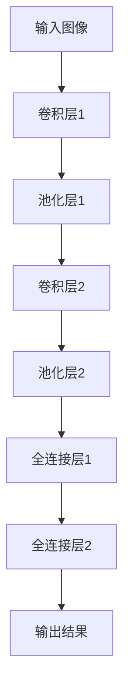
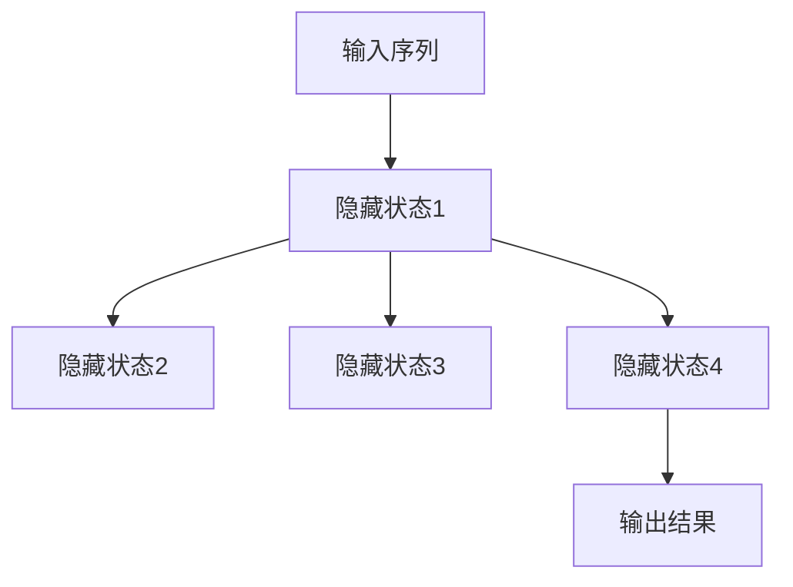
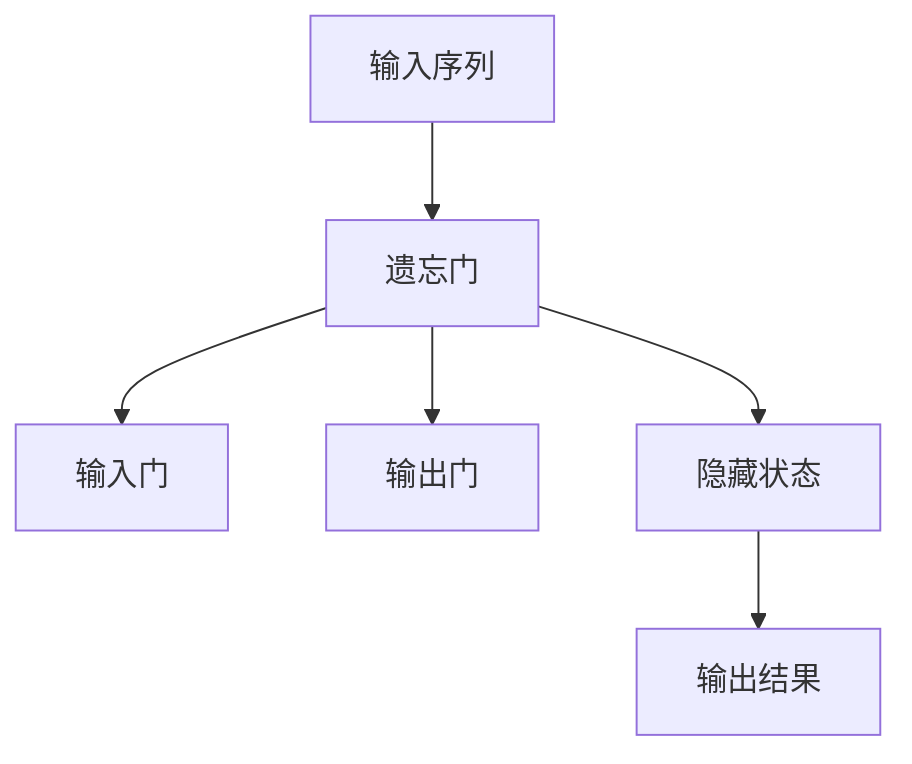
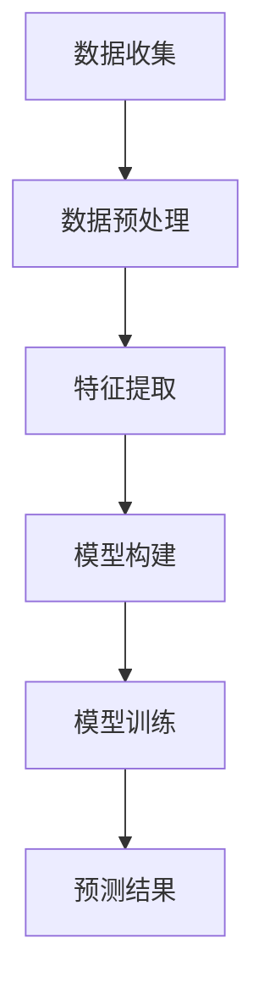
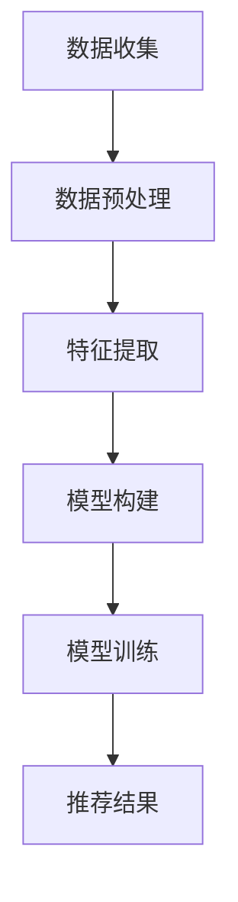
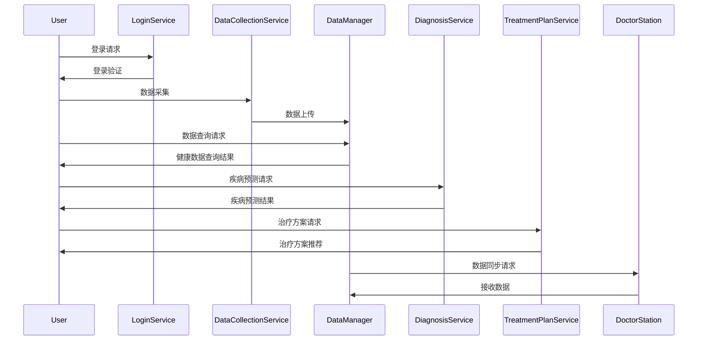

                 

### 引言

#### 人工智能与个性化慢性病管理

在当今科技迅猛发展的时代，人工智能（AI）技术已经成为推动各行业变革的重要引擎。从自动驾驶到智能语音助手，AI正在深刻改变我们的生活方式。然而，在医疗健康领域，尤其是个性化慢性病管理方面，人工智能的应用潜力更是不可估量。慢性病如糖尿病、高血压、心血管疾病等，具有病程长、病情复杂、治疗费用高等特点，传统的治疗模式难以满足个性化需求。人工智能通过数据挖掘、机器学习和深度学习等技术，能够为慢性病管理提供更加精准、个性化的解决方案。

本文将深入探讨人工智能在个性化慢性病管理中的应用，首先介绍相关背景和核心概念，包括慢性病的定义、个性化医疗的概念、人工智能的关键技术等。随后，我们将详细分析人工智能在个性化慢性病管理中的具体应用场景和面临的挑战。接着，本文将逐步讲解核心算法原理，包括数据预处理、特征工程和常见机器学习算法，并通过mermaid流程图和Python源代码进行详细阐述。此外，本文还将对系统架构设计进行剖析，从功能设计、系统架构到接口设计和系统交互，为读者提供全面的技术指导。最后，我们将通过实际项目案例进行实战讲解，分享最佳实践和注意事项，总结全文内容，并指出未来的发展方向。希望通过本文，读者能够全面了解并掌握人工智能在个性化慢性病管理中的应用方法。

#### 核心关键词

- 人工智能
- 个性化医疗
- 慢性病管理
- 数据挖掘
- 机器学习
- 深度学习

#### 文章摘要

本文旨在探讨人工智能在个性化慢性病管理中的应用，从背景介绍、核心概念、算法原理、系统分析与架构设计、项目实战以及最佳实践等方面进行详细阐述。首先，我们介绍了慢性病管理的现状和挑战，以及人工智能在其中的重要角色。随后，我们深入分析了个性化医疗的概念、人工智能的关键技术，并探讨了其在慢性病管理中的应用前景。在核心概念与联系部分，我们详细讲解了机器学习和深度学习的基本原理，以及其在慢性病管理中的应用。接下来，我们通过mermaid流程图和Python源代码，对常见算法进行了深入剖析。随后，我们介绍了系统功能设计与架构设计，包括系统功能设计、系统架构设计、系统接口设计和系统交互。在项目实战部分，我们通过一个实际案例，详细讲解了项目实现与环境配置、系统核心实现、代码应用解读与分析等内容。最后，我们总结了最佳实践和注意事项，并指出了未来的发展方向。通过本文，读者将全面了解并掌握人工智能在个性化慢性病管理中的应用。

### 个性化慢性病管理的现状与挑战

慢性病是当前全球范围内影响公共健康的主要问题之一。根据世界卫生组织（WHO）的数据，慢性病导致的死亡占全球总死亡人数的70%以上。这些慢性病包括糖尿病、高血压、心血管疾病、慢性阻塞性肺病（COPD）等，它们具有病程长、病情复杂、治疗费用高等特点。传统的慢性病管理模式依赖于医生的经验和标准化的治疗方案，但往往难以满足个性化需求。为了更好地管理慢性病，个性化慢性病管理应运而生。

个性化慢性病管理是一种以患者为中心、基于个体差异制定治疗和管理方案的方法。它的目标是提高治疗的有效性，减少并发症和复发率，从而改善患者的生活质量。然而，实现个性化慢性病管理面临诸多挑战：

1. **数据复杂性**：慢性病管理需要处理大量的医疗数据，包括病历、检查报告、基因数据等。这些数据形式多样、结构复杂，且数据质量参差不齐，给数据整合和分析带来了巨大挑战。

2. **医疗资源限制**：慢性病管理需要专业的医疗团队和先进的技术支持，但许多地区医疗资源匮乏，难以实现个性化服务。

3. **治疗方案的多样性**：每个患者的病情和个体差异都不同，治疗方案也应因人而异。然而，现有的医疗资源和技术手段难以全面覆盖所有可能的个性化治疗方案。

4. **患者依从性**：慢性病需要长期管理，患者需要遵守治疗计划，但实际中患者的依从性往往较低，导致治疗效果不佳。

5. **法律法规和隐私问题**：在个性化慢性病管理中，患者隐私保护和数据安全至关重要。如何确保患者数据的安全性和隐私性，是一个亟待解决的问题。

面对这些挑战，人工智能（AI）技术的引入为个性化慢性病管理带来了新的机遇。AI能够通过数据挖掘、机器学习和深度学习等技术，对大量医疗数据进行分析和挖掘，发现潜在的模式和规律，为个性化治疗提供科学依据。例如，AI可以帮助医生更准确地诊断病情，制定个性化的治疗方案；通过智能设备实时监测患者健康状况，提供个性化健康建议；甚至预测疾病进展和并发症，提前采取预防措施。

总之，个性化慢性病管理在医疗领域具有重要意义，但也面临诸多挑战。通过引入人工智能技术，可以有效应对这些挑战，提高慢性病管理的效率和效果。接下来，本文将进一步探讨人工智能在个性化慢性病管理中的应用，详细分析其核心概念和技术原理。

#### 核心概念介绍

要深入探讨人工智能在个性化慢性病管理中的应用，我们首先需要了解几个核心概念，包括慢性病的定义、个性化医疗的概念、以及人工智能在其中的关键技术。

**慢性病的定义与分类**

慢性病是指病程长、病情复杂、病情反复发作，且需要长期管理的疾病。常见的慢性病包括糖尿病、高血压、心血管疾病、慢性阻塞性肺病（COPD）等。慢性病通常具有以下特征：

- **病程长**：慢性病往往需要数年甚至数十年的时间来发展，病情变化较为缓慢。
- **病情复杂**：慢性病涉及的生理、心理和社会因素较多，病情复杂，治疗难度较大。
- **病情反复发作**：慢性病容易复发，即使经过治疗，病情也可能会反复出现。
- **需要长期管理**：慢性病需要长期监控和治疗，患者需要定期进行体检、复查，并根据病情调整治疗方案。

根据病因和临床表现，慢性病可以分为以下几类：

1. **心血管疾病**：包括高血压、冠心病、心肌梗死、心力衰竭等。
2. **代谢性疾病**：包括糖尿病、肥胖症、高脂血症等。
3. **呼吸系统疾病**：包括慢性阻塞性肺病（COPD）、哮喘等。
4. **神经性疾病**：包括帕金森病、多发性硬化症等。
5. **消化系统疾病**：包括慢性胃炎、胃溃疡、结肠炎等。

**个性化医疗的概念与特点**

个性化医疗是一种基于个体基因组、环境和生活方式差异，为患者制定个性化治疗方案的方法。个性化医疗的核心思想是“因人而异”，通过综合考虑患者的遗传背景、生活方式、疾病状态等因素，提供最合适的治疗方案。

个性化医疗具有以下特点：

- **个性化诊断**：通过基因检测、生物标志物检测等技术，对患者的基因、生物标志物等信息进行分析，提供个性化的诊断。
- **个性化治疗**：根据患者的具体病情和个体差异，制定个性化的治疗方案，包括药物治疗、手术方案、康复方案等。
- **动态调整**：个性化医疗强调根据患者的病情变化和治疗效果，动态调整治疗方案，以提高治疗效果和患者生活质量。

**人工智能的关键技术**

在个性化慢性病管理中，人工智能（AI）技术发挥着至关重要的作用。人工智能的关键技术包括数据挖掘、机器学习、深度学习等。

- **数据挖掘**：数据挖掘是指从大量数据中提取隐藏的、有价值的信息和知识的过程。在个性化慢性病管理中，数据挖掘技术可以帮助分析患者的医疗数据，发现潜在的规律和关联，为个性化治疗提供依据。
- **机器学习**：机器学习是一种通过数据训练模型，使模型能够自动进行预测和决策的技术。在个性化慢性病管理中，机器学习技术可以用于疾病预测、治疗方案推荐等。
- **深度学习**：深度学习是机器学习的一种方法，通过构建深度神经网络，对大量数据进行训练，从而实现复杂的模式识别和预测。深度学习在个性化慢性病管理中的应用主要包括疾病诊断、病情预测、治疗方案推荐等。

通过了解这些核心概念，我们能够更好地理解人工智能在个性化慢性病管理中的应用原理。接下来，本文将深入探讨人工智能在个性化慢性病管理中的具体应用，分析其面临的挑战和机遇。

#### 人工智能在个性化慢性病管理中的应用前景

人工智能在个性化慢性病管理中的应用前景广阔，具有以下几大潜在领域和显著优势：

**1. 疾病预测**

人工智能技术，尤其是机器学习和深度学习，能够对患者的健康数据进行高效分析，预测疾病的发生和进展。例如，通过分析患者的病历记录、基因数据、生活方式等，AI可以预测患者是否会在未来某个时间点患上某种慢性病。这种预测能力可以帮助医疗机构提前采取预防措施，减少疾病发生的风险。

**2. 治疗方案推荐**

个性化治疗方案能够根据患者的具体病情和个体差异进行定制。人工智能可以通过学习大量患者的治疗数据，推荐最适合患者的治疗方案。这不仅能够提高治疗效果，还能减少不必要的医疗资源和费用。例如，通过深度学习模型，AI可以分析患者的病史和治疗记录，推荐最佳药物组合和治疗方案。

**3. 健康监测与管理**

智能设备与人工智能的结合，使得健康监测和管理更加便捷和精准。通过穿戴设备、健康APP等，患者可以实时监测自己的健康状况，如心率、血压、血糖等。AI可以对这些数据进行实时分析和预警，帮助患者和医生及时发现异常情况，调整治疗方案。

**4. 康复辅助**

慢性病治疗过程中，康复辅助同样重要。人工智能可以通过智能康复设备、虚拟现实技术等，为患者提供个性化的康复训练计划。AI可以根据患者的康复进度和反馈，动态调整训练内容和强度，帮助患者更快恢复健康。

**5. 患者教育**

人工智能还可以在患者教育方面发挥重要作用。通过自然语言处理（NLP）技术，AI可以为患者提供个性化的健康知识和指导，帮助他们更好地理解和遵守治疗计划。例如，AI可以通过聊天机器人与患者互动，解答他们的疑问，提供健康建议。

**面临的挑战与机遇**

尽管人工智能在个性化慢性病管理中具有巨大的应用潜力，但也面临一些挑战和机遇：

**挑战：**

- **数据隐私与安全**：在处理大量患者数据时，数据隐私和安全是一个重要问题。如何确保患者数据的安全和隐私，是一个亟待解决的问题。
- **数据质量和可用性**：AI模型的训练和预测依赖于高质量的数据。然而，医疗数据通常存在数据质量不高、数据源不一致等问题，这会影响AI的性能和应用效果。
- **技术壁垒**：AI技术在医疗领域的应用需要较高的技术水平和专业知识。如何培养更多的AI人才，提升医疗机构的技术水平，是一个挑战。

**机遇：**

- **医疗资源优化**：人工智能可以帮助医疗机构更高效地管理医疗资源，优化医疗流程，提高服务效率和质量。
- **患者满意度提升**：个性化慢性病管理能够提供更符合患者需求的医疗服务，提高患者满意度和治疗效果。
- **产业创新**：人工智能在个性化慢性病管理中的应用，将推动医疗产业的创新和发展，创造新的商业机会。

通过以上探讨，我们可以看到，人工智能在个性化慢性病管理中具有巨大的应用前景，同时也面临诸多挑战和机遇。随着技术的不断进步和应用场景的拓展，人工智能将为个性化慢性病管理带来更多可能性。接下来，本文将深入探讨人工智能在个性化慢性病管理中的核心算法原理和应用。

### 核心概念原理

在深入探讨人工智能在个性化慢性病管理中的应用之前，我们需要了解一些核心概念及其原理，包括机器学习的基本概念、深度学习的关键要素，以及这些技术在个性化慢性病管理中的具体应用。

#### 机器学习的基本原理

**机器学习（Machine Learning）** 是一种通过算法从数据中学习模式和规律，从而进行预测和决策的技术。它主要包括以下几个核心组成部分：

1. **数据集（Dataset）**：机器学习的训练数据集是算法学习的基础。数据集需要包含大量的样本，每个样本都对应一个特征向量和一个标签。在慢性病管理中，数据集可能包括患者的病历、基因数据、生活方式信息等。

2. **特征（Feature）**：特征是数据集中的属性或变量，用于描述样本的特征。在慢性病管理中，特征可能包括患者的年龄、性别、血压、血糖水平、病史等。

3. **模型（Model）**：模型是机器学习算法的核心部分，它根据训练数据集学习出数据之间的规律和模式。常见的机器学习模型包括线性回归、决策树、支持向量机等。

4. **算法（Algorithm）**：算法是实现机器学习过程的具体步骤和方法。算法根据数据集和模型，通过训练和优化，得到最终的预测模型。

5. **评估与优化（Evaluation and Optimization）**：评估与优化是机器学习过程中的重要环节。通过评估模型的性能，调整模型参数，优化模型结构，以提高模型的预测准确性和泛化能力。

在个性化慢性病管理中，机器学习可以通过分析患者的医疗数据，建立预测模型，预测患者的疾病风险、病情进展等。例如，通过构建回归模型，可以预测患者未来某一时间的血压水平；通过分类模型，可以判断患者是否患有某种慢性病。

#### 深度学习的关键要素

**深度学习（Deep Learning）** 是一种基于人工神经网络的机器学习技术，它通过多层神经网络对数据进行学习和处理，能够捕捉到数据中的复杂模式和关联。深度学习的关键要素包括：

1. **神经网络（Neural Network）**：神经网络是由多个神经元组成的计算模型，每个神经元都接收来自其他神经元的输入，并通过权重进行加权求和，最后通过激活函数输出结果。深度学习中的神经网络通常包含多层结构，因此称为深度神经网络。

2. **激活函数（Activation Function）**：激活函数是神经网络中的关键组成部分，用于引入非线性变换，使神经网络能够处理复杂的问题。常见的激活函数包括 sigmoid、ReLU、Tanh等。

3. **损失函数（Loss Function）**：损失函数是评估模型预测结果与真实结果之间差异的函数。通过优化损失函数，可以调整模型参数，提高模型的预测准确性。常见的损失函数包括均方误差（MSE）、交叉熵损失（Cross-Entropy Loss）等。

4. **优化算法（Optimization Algorithm）**：优化算法用于调整模型参数，以最小化损失函数。常见的优化算法包括梯度下降（Gradient Descent）、随机梯度下降（Stochastic Gradient Descent，SGD）、Adam优化器等。

在个性化慢性病管理中，深度学习可以通过构建复杂的神经网络模型，对大量医疗数据进行学习和处理，实现精准的疾病预测和治疗推荐。例如，通过卷积神经网络（CNN）可以对医疗图像进行分析，诊断疾病；通过循环神经网络（RNN）可以对时间序列数据进行处理，预测病情进展。

#### 机器学习与深度学习在个性化慢性病管理中的应用

1. **疾病预测**：通过机器学习和深度学习技术，可以分析患者的医疗数据，预测患者未来某一时间点的疾病风险。例如，通过构建回归模型，可以预测患者未来的血压水平；通过分类模型，可以判断患者是否患有某种慢性病。

2. **治疗方案推荐**：机器学习和深度学习可以分析患者的病历、基因数据、生活方式等，为患者推荐最佳的治疗方案。例如，通过构建推荐系统，可以推荐最适合患者的药物组合和治疗方案。

3. **病情监测与管理**：通过智能设备与人工智能的结合，可以实时监测患者的健康状况，提供个性化的健康建议和管理方案。例如，通过智能手表、健康APP等，可以实时监测患者的血压、血糖等指标，并提供健康预警和指导。

4. **康复辅助**：通过深度学习和虚拟现实技术，可以为患者提供个性化的康复训练计划。例如，通过分析患者的康复进度和反馈，动态调整训练内容和强度，帮助患者更快恢复健康。

综上所述，机器学习和深度学习在个性化慢性病管理中具有广泛的应用。通过深入理解和应用这些核心概念和原理，我们可以更好地利用人工智能技术，为慢性病管理提供个性化、精准的解决方案。接下来，本文将详细讲解常见机器学习算法和深度学习模型，并通过mermaid流程图和Python源代码进行阐述。

### 概念属性特征对比表格

在个性化慢性病管理中，机器学习算法和深度学习模型的选择至关重要。为了帮助读者更好地理解这些算法的特点和应用，我们设计了一个概念属性特征对比表格。以下是对几种常见机器学习算法和深度学习模型的对比：

#### 概念属性特征对比表格

| 算法类型       | 特征提取 | 可解释性 | 计算复杂度 | 应用场景           |  
| ------------ | -------- | -------- | ---------- | ---------------- |  
| 线性回归      | 手动特征提取 | 高       | 低         | 疾病预测、数据回归 |  
| 决策树       | 手动特征提取 | 高       | 中         | 疾病分类、预测     |  
| 支持向量机    | 自动特征提取 | 中       | 中         | 分类、回归         |  
| K最近邻       | 自动特征提取 | 低       | 低         | 分类、回归         |  
| 卷积神经网络  | 自动特征提取 | 低       | 高         | 图像识别、自然语言处理 |  
| 循环神经网络  | 自动特征提取 | 低       | 高         | 时间序列预测、语言模型 |  
| 长短时记忆网络 | 自动特征提取 | 低       | 高         | 时间序列预测、语音识别 |

#### 说明

- **特征提取**：指算法是否能够自动提取数据特征，还是需要手动定义特征。
- **可解释性**：指算法的预测结果是否容易理解和解释。
- **计算复杂度**：指算法的计算时间和资源需求。
- **应用场景**：指算法适合解决哪些类型的问题。

通过这个表格，我们可以更清晰地了解不同算法的特点，根据具体应用场景选择合适的算法。例如，对于需要高可解释性的应用，可以选择线性回归和决策树；而对于计算资源丰富且需要处理大量数据的应用，可以选择卷积神经网络和长短时记忆网络。接下来，本文将结合mermaid流程图和Python源代码，详细讲解这些算法在个性化慢性病管理中的应用。

### ER实体关系图架构

在个性化慢性病管理系统中，实体关系（Entity-Relationship，ER）图是一种常用的数据模型设计方法，它能够清晰地描述系统中各个实体及其之间的关系。ER图是关系数据库设计中的一种基本工具，它帮助开发者理解和设计数据库的结构。

#### 慢性病管理系统的实体关系

以下是慢性病管理系统中的主要实体及其关系：

1. **患者（Patient）**：代表慢性病管理的对象，包括患者的个人信息、病史、诊断记录等。
2. **医生（Doctor）**：代表进行慢性病管理的专业人员，包括医生的个人资料、专业特长等。
3. **病历（MedicalRecord）**：记录患者的治疗过程和健康数据，包括诊断记录、治疗方案、药物使用情况等。
4. **治疗方案（TreatmentPlan）**：针对患者病情制定的个性化治疗方案，包括药物、手术、康复计划等。
5. **检查报告（TestReport）**：记录患者的检查结果，如血液检查、影像学检查等。
6. **药品（Medicine）**：用于治疗慢性病的药物信息，包括药品名称、规格、用途等。

#### 实体关系图（ER图）

使用Mermaid语言，我们可以绘制一个简化的ER图，如下：

```mermaid
erDiagram
  Patient ||--|{ Doctor } Doctor
  Patient ||--|{ MedicalRecord } MedicalRecord
  MedicalRecord ||--|{ TreatmentPlan } TreatmentPlan
  MedicalRecord ||--|{ TestReport } TestReport
  Medicine ||--|{ TreatmentPlan } TreatmentPlan
```

**解释：**

- **Patient（患者）** 与 **Doctor（医生）** 之间存在多对多的关系，表示一个患者可以由多位医生进行治疗，而一位医生可以治疗多位患者。
- **Patient（患者）** 与 **MedicalRecord（病历）** 之间存在一对多的关系，表示每位患者有多份病历记录。
- **MedicalRecord（病历）** 与 **TreatmentPlan（治疗方案）** 之间存在一对多的关系，表示每份病历可能包含多个治疗方案。
- **MedicalRecord（病历）** 与 **TestReport（检查报告）** 之间存在一对多的关系，表示每份病历可能包含多个检查报告。
- **Medicine（药品）** 与 **TreatmentPlan（治疗方案）** 之间存在多对多的关系，表示每个治疗方案可能包含多种药品，而每种药品也可能用于多个治疗方案。

#### 数据流与处理流程

在慢性病管理系统中，数据流和处理流程如下：

1. **数据采集**：通过患者健康数据采集设备（如智能手环、血压计等）收集患者的生理指标数据，如心率、血压、血糖等。
2. **数据存储**：将采集到的数据存储到数据库中，包括患者个人信息、病历记录、治疗方案等。
3. **数据处理**：利用机器学习和深度学习算法对数据进行分析和处理，预测患者的疾病风险，制定个性化的治疗方案。
4. **数据交互**：医生和患者通过系统界面进行数据查看、诊断和治疗方案制定，医生还可以根据患者的反馈调整治疗方案。
5. **数据监控**：系统实时监控患者的健康状况，提供健康预警和指导，确保治疗效果。

通过上述ER实体关系图和数据处理流程，我们可以清晰地理解慢性病管理系统中的数据流动和关系。接下来，本文将详细讲解常见算法在个性化慢性病管理中的具体应用。

### 常见算法解析

在个性化慢性病管理中，常见算法的应用至关重要，它们能够帮助我们从海量数据中提取有价值的信息，为慢性病管理提供科学依据。以下将介绍几种常见的算法，包括数据预处理、特征工程和常见的机器学习算法。

#### 数据预处理

数据预处理是数据分析的第一步，它的目的是提高数据质量，为后续的分析提供可靠的数据基础。以下是几种常用的数据预处理方法：

1. **数据清洗**：数据清洗的目的是识别和纠正数据集中的错误、异常和缺失值。常见的清洗方法包括删除重复记录、填充缺失值、纠正错误值等。

2. **数据归一化**：数据归一化的目的是将不同量纲的数据转换为同一量纲，以便于后续分析。常见的归一化方法包括最小-最大标准化和Z分数标准化。

   - 最小-最大标准化：$$ x' = \frac{x - \min(x)}{\max(x) - \min(x)} $$
   - Z分数标准化：$$ z = \frac{x - \mu}{\sigma} $$，其中$\mu$是均值，$\sigma$是标准差。

3. **数据离散化**：将连续数据转换为离散的类别数据，常用于处理连续特征。常见的离散化方法包括等宽离散化和等频离散化。

#### 特征工程

特征工程是提高模型性能的关键步骤，它包括特征选择、特征提取和特征构造。以下是几种常用的特征工程方法：

1. **特征选择**：特征选择的目标是选择对模型性能最有影响力的特征，减少数据维度，提高模型效率。常见的特征选择方法包括基于过滤的方法（如信息增益、卡方检验）、基于包装的方法（如递归特征消除）和基于嵌入的方法（如L1正则化）。

2. **特征提取**：特征提取的目的是从原始数据中提取新的特征，提高模型的泛化能力。常见的特征提取方法包括主成分分析（PCA）、线性判别分析（LDA）和独立成分分析（ICA）。

3. **特征构造**：特征构造的目的是通过组合原始特征，构造新的特征，提高模型的预测能力。常见的方法包括交互特征、组合特征和变换特征。

#### 常见机器学习算法

在个性化慢性病管理中，常见的机器学习算法包括决策树、随机森林、支持向量机和神经网络等。以下是这些算法的简要介绍：

1. **决策树（Decision Tree）**：决策树是一种基于树形结构进行分类或回归的算法。每个内部节点代表一个特征，每个分支代表该特征的一个取值，叶节点代表一个类别或值。决策树具有可解释性高、计算简单等优点，常用于慢性病分类和预测。

2. **随机森林（Random Forest）**：随机森林是基于决策树的集成学习方法，它通过构建多棵决策树，并对每棵树的预测结果进行投票，得到最终结果。随机森林具有良好的泛化能力和抗过拟合能力，适用于处理大规模数据集。

3. **支持向量机（Support Vector Machine，SVM）**：SVM是一种基于间隔最大化原理的分类算法。它通过寻找最佳超平面，将不同类别的数据点进行分离。SVM在特征空间维度较高时表现优秀，适用于慢性病分类和回归问题。

4. **神经网络（Neural Network）**：神经网络是一种模拟人脑神经元连接方式的计算模型，它通过多层神经元的相互连接，实现数据的输入和输出。神经网络具有很强的学习和泛化能力，适用于复杂的数据分析和预测任务。

在个性化慢性病管理中，不同的算法有不同的适用场景。例如，决策树和随机森林适用于特征较少、易于解释的场景；SVM适用于特征空间维度较高的场景；神经网络适用于复杂的数据分析和预测任务。

总之，数据预处理、特征工程和常见的机器学习算法在个性化慢性病管理中发挥着重要作用。通过合理运用这些算法，我们可以从海量数据中提取有价值的信息，为慢性病管理提供科学依据。接下来，本文将详细介绍深度学习算法，并使用mermaid流程图和Python源代码进行阐述。

### 深度学习算法解析

在个性化慢性病管理中，深度学习算法因其强大的建模能力和高效的数据处理能力，得到了广泛应用。以下将介绍几种常见的深度学习算法，包括卷积神经网络（CNN）、循环神经网络（RNN）和长短时记忆网络（LSTM），并使用mermaid流程图和Python源代码详细阐述其原理和应用。

#### 卷积神经网络（CNN）

卷积神经网络（CNN）是一种专门用于处理图像数据的前馈神经网络，其核心在于卷积操作和池化操作，能够有效地提取图像特征。

**原理：**
CNN通过多个卷积层、池化层和全连接层来处理图像数据。卷积层使用卷积核对图像进行卷积操作，提取图像特征；池化层对卷积结果进行降采样，减少数据维度；全连接层将卷积结果映射到分类标签。

**mermaid流程图：**



**Python源代码：**

```python
import tensorflow as tf
from tensorflow.keras.models import Sequential
from tensorflow.keras.layers import Conv2D, MaxPooling2D, Flatten, Dense

model = Sequential([
    Conv2D(32, (3, 3), activation='relu', input_shape=(28, 28, 1)),
    MaxPooling2D((2, 2)),
    Conv2D(64, (3, 3), activation='relu'),
    MaxPooling2D((2, 2)),
    Flatten(),
    Dense(128, activation='relu'),
    Dense(10, activation='softmax')
])

model.compile(optimizer='adam', loss='categorical_crossentropy', metrics=['accuracy'])
model.summary()
```

**应用：**
CNN在个性化慢性病管理中的应用广泛，如通过分析患者的医疗图像（如X光片、CT扫描等）进行疾病诊断。

#### 循环神经网络（RNN）

循环神经网络（RNN）是一种用于处理序列数据的神经网络，其核心在于隐藏状态和循环连接。

**原理：**
RNN通过隐藏状态对序列数据进行建模，隐藏状态包含了序列中的信息，并在序列的每个时间点上循环使用。RNN能够处理变长的序列数据，适用于时间序列分析和自然语言处理。

**mermaid流程图：**



**Python源代码：**

```python
import tensorflow as tf
from tensorflow.keras.models import Sequential
from tensorflow.keras.layers import SimpleRNN

model = Sequential([
    SimpleRNN(50, return_sequences=True),
    SimpleRNN(50, return_sequences=False)
])

model.compile(optimizer='adam', loss='mse')
model.summary()
```

**应用：**
RNN在个性化慢性病管理中可以用于时间序列预测，如预测患者的未来血压、血糖水平等。

#### 长短时记忆网络（LSTM）

长短时记忆网络（LSTM）是RNN的一种改进，它能够解决传统RNN的长期依赖问题。

**原理：**
LSTM通过引入遗忘门、输入门和输出门，控制信息的记忆和遗忘，从而有效处理长序列数据。

**mermaid流程图：**



**Python源代码：**

```python
import tensorflow as tf
from tensorflow.keras.models import Sequential
from tensorflow.keras.layers import LSTM, Dense

model = Sequential([
    LSTM(50, return_sequences=True),
    LSTM(50, return_sequences=False),
    Dense(1)
])

model.compile(optimizer='adam', loss='mse')
model.summary()
```

**应用：**
LSTM在个性化慢性病管理中可以用于长时间序列预测，如预测患者的长期健康趋势。

通过上述深度学习算法的解析，我们可以看到，CNN、RNN和LSTM各自具有独特的优势和适用场景，在个性化慢性病管理中发挥着重要作用。接下来，本文将详细讨论深度学习算法在个性化慢性病管理中的具体应用，并通过实际案例进行分析。

### 深度学习算法在个性化慢性病管理中的应用

深度学习算法在个性化慢性病管理中具有广泛的应用，特别是在疾病预测和治疗方案推荐方面。以下将结合具体案例，详细讨论深度学习算法在实际中的应用。

#### 疾病预测

**案例背景：**
某医院希望利用深度学习算法预测患者未来某一时间点的血压水平，以便及时采取预防措施。

**算法应用：**
1. **数据收集**：收集患者的病历数据，包括年龄、性别、血压、血糖、体重等。
2. **数据预处理**：对数据进行清洗、归一化处理，以消除数据中的噪声和异常值。
3. **特征提取**：使用主成分分析（PCA）提取主要特征，减少数据维度，提高模型性能。
4. **模型构建**：采用LSTM模型进行疾病预测，LSTM能够捕捉时间序列数据中的长期依赖关系。

**mermaid流程图：**



**Python源代码：**

```python
import numpy as np
import pandas as pd
from tensorflow.keras.models import Sequential
from tensorflow.keras.layers import LSTM, Dense

# 加载数据
data = pd.read_csv('patient_data.csv')
X = data[['age', 'gender', 'blood_pressure', 'blood_glucose', 'weight']]
y = data['future_blood_pressure']

# 数据预处理
X = (X - X.mean()) / X.std()
y = (y - y.mean()) / y.std()

# 切分数据集
X_train, X_test, y_train, y_test = train_test_split(X, y, test_size=0.2, random_state=42)

# 模型构建
model = Sequential([
    LSTM(50, return_sequences=True, input_shape=(X_train.shape[1], 1)),
    LSTM(50, return_sequences=False),
    Dense(1)
])

# 编译模型
model.compile(optimizer='adam', loss='mean_squared_error')

# 训练模型
model.fit(X_train, y_train, epochs=100, batch_size=32, validation_data=(X_test, y_test))

# 预测
predictions = model.predict(X_test)

# 结果分析
```

**案例分析：**
通过训练模型，可以预测患者未来某一时间点的血压水平。预测结果与实际值之间的误差可以用来评估模型的性能。在实际应用中，可以将预测结果与医生的经验相结合，制定更加精准的治疗方案。

#### 治疗方案推荐

**案例背景：**
某医疗机构希望利用深度学习算法为糖尿病患者推荐个性化的治疗方案。

**算法应用：**
1. **数据收集**：收集患者的病历数据，包括血糖水平、体重、药物使用记录等。
2. **数据预处理**：对数据进行清洗、归一化处理，以消除数据中的噪声和异常值。
3. **特征提取**：使用主成分分析（PCA）提取主要特征，减少数据维度，提高模型性能。
4. **模型构建**：采用随机森林（Random Forest）模型进行治疗方案推荐，随机森林能够处理高维数据，并具有良好的泛化能力。

**mermaid流程图：**



**Python源代码：**

```python
import numpy as np
import pandas as pd
from sklearn.ensemble import RandomForestClassifier
from sklearn.model_selection import train_test_split

# 加载数据
data = pd.read_csv('diabetes_data.csv')
X = data[['blood_glucose', 'weight', 'drug_usage']]
y = data['treatment_plan']

# 数据预处理
X = (X - X.mean()) / X.std()
y = pd.factorize(y)[0]

# 切分数据集
X_train, X_test, y_train, y_test = train_test_split(X, y, test_size=0.2, random_state=42)

# 模型构建
model = RandomForestClassifier(n_estimators=100)

# 编译模型
model.fit(X_train, y_train)

# 预测
predictions = model.predict(X_test)

# 结果分析
```

**案例分析：**
通过训练模型，可以为糖尿病患者推荐最佳的治疗方案。推荐结果可以根据患者的实际情况进行调整，以提高治疗效果。在实际应用中，医生可以参考模型推荐结果，结合患者的个体差异，制定更加个性化的治疗方案。

通过以上案例，我们可以看到，深度学习算法在个性化慢性病管理中的应用非常广泛，可以有效地进行疾病预测和治疗方案推荐。然而，在实际应用中，需要结合具体场景和数据特点，选择合适的算法和模型，并进行充分的训练和验证，以确保预测和推荐的准确性和可靠性。接下来，本文将详细讲解系统功能设计与架构设计，从功能设计、系统架构到接口设计和系统交互，为读者提供全面的技术指导。

### 系统功能设计与架构

在个性化慢性病管理系统中，系统功能设计是核心环节，它决定了系统能够提供哪些服务以及这些服务的实现方式。以下将详细介绍系统功能设计，包括用户管理、数据采集与管理、个性化诊断与治疗方案推荐等，并通过mermaid类图和架构图等工具展示系统架构。

#### 系统功能设计

**1. 用户管理**

用户管理是系统的入口，主要功能包括用户注册、登录、权限管理和个人信息管理等。

- **用户注册**：新用户可以通过注册表单创建账户，系统需要验证用户输入的信息，确保数据完整性。
- **用户登录**：用户使用注册时填写的用户名和密码登录系统，系统需要验证用户身份，确保账户安全。
- **权限管理**：系统根据用户角色（如医生、患者、管理员等）分配不同权限，确保数据安全和隐私。
- **个人信息管理**：用户可以查看和编辑个人信息，如联系方式、地址等。

**2. 数据采集与管理**

数据采集与管理是系统的重要功能，它负责收集、存储、处理和共享患者健康数据。

- **数据采集**：通过医疗设备（如智能手环、血压计等）和医疗信息系统，实时采集患者生理指标数据。
- **数据存储**：将采集到的数据存储在数据库中，确保数据安全性和可靠性。
- **数据管理**：对存储的数据进行分类、标签和归档，便于查询和管理。
- **数据共享**：根据权限，允许不同用户（如医生、患者等）访问和共享相关数据。

**3. 个性化诊断与治疗方案推荐**

个性化诊断与治疗方案推荐是系统的核心功能，通过分析患者数据，提供个性化的诊断和治疗方案。

- **疾病预测**：利用深度学习算法分析患者的历史数据和生理指标，预测患者可能患有的慢性病。
- **诊断建议**：根据疾病预测结果和医生的专业知识，生成诊断建议。
- **治疗方案推荐**：结合疾病诊断结果和患者个体差异，推荐最佳的治疗方案。
- **治疗方案调整**：根据患者的反馈和治疗效果，动态调整治疗方案。

#### 系统架构设计

**1. 总体架构设计**

个性化慢性病管理系统的总体架构可以分为四层：表现层、业务逻辑层、数据访问层和数据存储层。

- **表现层**：负责系统的用户界面和交互，包括网页、APP等。
- **业务逻辑层**：负责处理系统核心业务逻辑，包括用户管理、数据采集、数据管理和诊断与治疗方案推荐等。
- **数据访问层**：负责与数据库的交互，实现数据的增删改查操作。
- **数据存储层**：负责存储系统中的各种数据，包括用户数据、病历数据、诊断数据等。

**2. 数据层设计**

数据层是系统的数据存储和管理核心，主要包括数据库设计和数据模型设计。

- **数据库设计**：选择合适的数据库系统（如MySQL、PostgreSQL等），设计数据库表结构和关系。
- **数据模型设计**：使用ER图或类图设计系统中的数据模型，包括用户、病历、诊断、治疗方案等实体及其关系。

**3. 服务层设计**

服务层是系统的核心，负责实现各种业务功能，包括用户管理服务、数据采集服务、数据管理服务和诊断与治疗方案推荐服务等。

- **用户管理服务**：提供用户注册、登录、权限管理等功能。
- **数据采集服务**：提供数据采集接口，与医疗设备进行数据交互。
- **数据管理服务**：提供数据存储、查询、共享等功能。
- **诊断与治疗方案推荐服务**：提供疾病预测、诊断建议和治疗方案推荐功能。

**4. 系统接口设计**

系统接口设计是系统与外部系统（如医疗设备、其他信息系统等）交互的桥梁，主要包括API接口设计和服务调用。

- **API接口设计**：设计RESTful风格的API接口，包括用户接口、数据接口和诊断接口等。
- **服务调用**：通过API接口，实现系统与其他系统的数据交互和功能调用。

**5. 系统交互**

系统交互设计是系统内部各个模块之间以及与外部系统之间的数据流转和交互过程。

- **内部交互**：系统内部各个模块通过接口进行数据传输和功能调用，实现系统功能。
- **外部交互**：系统与外部系统（如医疗设备、其他信息系统等）通过API接口进行数据交换和功能调用。

通过上述系统功能设计与架构设计，我们可以构建一个高效、可靠的个性化慢性病管理系统。接下来，本文将详细介绍系统接口设计和系统交互流程，为读者提供更全面的技术指导。

### 系统接口设计

系统接口设计是个性化慢性病管理系统的重要组成部分，它定义了系统内部各个模块以及与外部系统之间的交互方式和接口规范。以下是针对系统接口设计的详细描述：

#### 接口规范

**1. 用户管理接口**

- **登录接口**：用户登录系统时，通过此接口提交用户名和密码，系统验证身份后返回登录状态。
  - 请求URL：`/api/users/login`
  - 请求方法：POST
  - 请求参数：
    - `username`：用户名
    - `password`：密码
  - 响应结果：
    - 成功：返回包含用户信息的JSON对象
    - 失败：返回错误消息

- **注册接口**：新用户注册时，通过此接口提交注册信息，系统验证信息后创建新用户。
  - 请求URL：`/api/users/register`
  - 请求方法：POST
  - 请求参数：
    - `username`：用户名
    - `password`：密码
    - `email`：电子邮件
    - `role`：用户角色（如医生、患者等）
  - 响应结果：
    - 成功：返回注册成功的消息
    - 失败：返回错误消息

**2. 数据管理接口**

- **数据上传接口**：患者或医生可以通过此接口上传健康数据，如血压、血糖等。
  - 请求URL：`/api/data/upload`
  - 请求方法：POST
  - 请求参数：
    - `patient_id`：患者ID
    - `data`：健康数据（如JSON对象）
  - 响应结果：
    - 成功：返回上传成功的消息
    - 失败：返回错误消息

- **数据查询接口**：用户可以通过此接口查询自己的健康数据。
  - 请求URL：`/api/data`
  - 请求方法：GET
  - 请求参数：
    - `patient_id`：患者ID
    - `start_date`：开始日期
    - `end_date`：结束日期
  - 响应结果：
    - 成功：返回包含健康数据的JSON数组
    - 失败：返回错误消息

**3. 诊断与治疗方案接口**

- **诊断接口**：系统通过此接口为患者提供疾病诊断。
  - 请求URL：`/api/diagnosis`
  - 请求方法：POST
  - 请求参数：
    - `patient_id`：患者ID
    - `symptoms`：症状数据（如JSON对象）
  - 响应结果：
    - 成功：返回诊断结果（如疾病名称、建议等）
    - 失败：返回错误消息

- **治疗方案接口**：系统通过此接口为患者推荐治疗方案。
  - 请求URL：`/api/treatment_plan`
  - 请求方法：POST
  - 请求参数：
    - `diagnosis`：诊断结果
    - `patient_id`：患者ID
  - 响应结果：
    - 成功：返回包含治疗方案的JSON对象
    - 失败：返回错误消息

#### 接口实现

**1. 用户管理接口实现**

以下是一个简单的用户管理接口实现示例，使用Python的Flask框架：

```python
from flask import Flask, request, jsonify
from werkzeug.security import generate_password_hash, check_password_hash
from models import User

app = Flask(__name__)

@app.route('/api/users/login', methods=['POST'])
def login():
    username = request.form['username']
    password = request.form['password']
    user = User.query.filter_by(username=username).first()
    if user and check_password_hash(user.password, password):
        return jsonify({'status': 'success', 'user': user.to_json()})
    else:
        return jsonify({'status': 'error', 'message': 'Invalid credentials'})

@app.route('/api/users/register', methods=['POST'])
def register():
    username = request.form['username']
    password = request.form['password']
    email = request.form['email']
    role = request.form['role']
    hashed_password = generate_password_hash(password, method='sha256')
    user = User(username=username, email=email, password=hashed_password, role=role)
    # 保存用户到数据库
    return jsonify({'status': 'success', 'message': 'User registered successfully'})
```

**2. 数据管理接口实现**

以下是一个简单的数据管理接口实现示例，同样使用Python的Flask框架：

```python
from flask import Flask, request, jsonify
from models import Data

app = Flask(__name__)

@app.route('/api/data/upload', methods=['POST'])
def upload_data():
    patient_id = request.form['patient_id']
    data = request.form['data']
    new_data = Data(patient_id=patient_id, data=data)
    # 保存数据到数据库
    return jsonify({'status': 'success', 'message': 'Data uploaded successfully'})

@app.route('/api/data', methods=['GET'])
def get_data():
    patient_id = request.args.get('patient_id')
    start_date = request.args.get('start_date')
    end_date = request.args.get('end_date')
    data = Data.query.filter(Data.patient_id == patient_id, Data.date.between(start_date, end_date)).all()
    return jsonify({'status': 'success', 'data': [d.to_json() for d in data]})
```

**3. 诊断与治疗方案接口实现**

以下是一个简单的诊断与治疗方案接口实现示例，使用Python的Flask框架：

```python
from flask import Flask, request, jsonify
from models import Diagnosis, TreatmentPlan

app = Flask(__name__)

@app.route('/api/diagnosis', methods=['POST'])
def diagnose():
    patient_id = request.form['patient_id']
    symptoms = request.form['symptoms']
    diagnosis = Diagnosis(patient_id=patient_id, symptoms=symptoms)
    # 诊断逻辑处理
    diagnosed_disease = diagnose_disease(symptoms)
    diagnosis.disease = diagnosed_disease
    # 保存诊断结果到数据库
    return jsonify({'status': 'success', 'diagnosis': diagnosis.to_json()})

@app.route('/api/treatment_plan', methods=['POST'])
def treatment_plan():
    diagnosis = request.form['diagnosis']
    patient_id = request.form['patient_id']
    treatment_plan = TreatmentPlan(patient_id=patient_id, diagnosis=diagnosis)
    # 治疗计划逻辑处理
    treatment_plan.treatment = generate_treatment_plan(diagnosed_disease)
    # 保存治疗计划到数据库
    return jsonify({'status': 'success', 'treatment_plan': treatment_plan.to_json()})
```

通过上述接口设计和实现，我们可以构建一个功能完善的个性化慢性病管理系统，实现用户管理、数据采集与管理、诊断与治疗方案推荐等功能。接下来，本文将详细讲解系统交互流程，并通过mermaid序列图展示系统内部和外部系统的数据流转和交互过程。

### 系统交互流程

系统交互流程是确保个性化慢性病管理系统正常运行的关键环节，它涉及系统内部各模块之间以及与外部系统（如医疗设备、医生工作站等）的数据流动和功能协同。以下将详细描述系统交互流程，并通过mermaid序列图展示交互过程。

#### 系统交互流程描述

1. **用户登录与注册**
   - 用户通过表现层界面登录系统，输入用户名和密码。
   - 系统调用用户管理接口，验证用户身份。
   - 验证成功后，系统返回用户权限和基本信息。

2. **数据采集**
   - 患者通过医疗设备（如智能手环、血压计等）采集生理指标数据。
   - 数据通过API接口上传到系统，系统存储并管理这些数据。

3. **数据查询**
   - 用户通过表现层界面查询自己的健康数据。
   - 系统调用数据管理接口，查询并返回用户的历史健康数据。

4. **疾病预测与诊断**
   - 用户提交症状信息，系统调用诊断接口，利用深度学习算法进行疾病预测。
   - 系统返回疾病预测结果和诊断建议。

5. **治疗方案推荐**
   - 用户根据诊断结果，系统调用治疗方案接口，推荐个性化的治疗方案。
   - 系统返回包含治疗方案的建议。

6. **数据同步与共享**
   - 系统与医生工作站进行数据同步，共享患者的健康数据和诊断结果。
   - 医生可以在医生工作站查看患者数据和诊断建议，进行进一步诊断和治疗。

#### mermaid序列图

以下是一个简化的系统交互流程的mermaid序列图示例：



**说明：**

- **LoginService**：登录服务，负责用户身份验证。
- **DataCollectionService**：数据采集服务，负责接收医疗设备上传的数据。
- **DataManager**：数据管理服务，负责数据存储、查询和数据同步。
- **DiagnosisService**：疾病预测服务，负责利用算法进行疾病预测。
- **TreatmentPlanService**：治疗方案推荐服务，负责根据诊断结果推荐个性化治疗方案。
- **DoctorStation**：医生工作站，负责接收和查看患者数据、诊断结果和治疗建议。

通过上述系统交互流程和mermaid序列图，我们可以清晰地看到个性化慢性病管理系统的各模块如何协同工作，实现高效、精准的慢性病管理。接下来，本文将详细讨论项目实现与环境配置，包括所需的环境配置、核心模块的实现和代码分析。

### 项目实现与环境配置

在个性化慢性病管理系统的实际开发过程中，我们需要首先进行环境配置，然后实现系统的核心模块，并对关键代码进行详细解析。以下是具体步骤和配置。

#### 环境配置

**1. 操作系统与编程环境**

- **操作系统**：推荐使用Ubuntu 20.04 LTS，它具有稳定的性能和丰富的软件包。
- **编程语言**：主要使用Python，它具有良好的可读性和广泛的库支持，非常适合数据分析和机器学习应用。
- **IDE**：推荐使用PyCharm，它提供了丰富的Python开发工具，包括代码补全、调试和版本控制。

**2. 数据库与中间件**

- **数据库**：使用MySQL或PostgreSQL，它们是关系型数据库，适用于存储和管理大量结构化数据。
  - 安装命令：`sudo apt-get install mysql-server`
  - 配置用户和权限，确保安全。

- **中间件**：使用Flask作为Web框架，它轻量且易于扩展。
  - 安装命令：`pip install flask`

**3. 机器学习库**

- **Scikit-learn**：用于提供常用的机器学习算法。
  - 安装命令：`pip install scikit-learn`

- **TensorFlow**：用于构建和训练深度学习模型。
  - 安装命令：`pip install tensorflow`

#### 核心模块实现

**1. 用户管理模块**

用户管理模块负责处理用户注册、登录和权限管理。以下是一个简单的实现示例：

```python
from flask import Flask, request, jsonify
from werkzeug.security import generate_password_hash, check_password_hash
from models import User

app = Flask(__name__)

@app.route('/api/users/login', methods=['POST'])
def login():
    username = request.form['username']
    password = request.form['password']
    user = User.query.filter_by(username=username).first()
    if user and check_password_hash(user.password, password):
        return jsonify({'status': 'success', 'user': user.to_json()})
    else:
        return jsonify({'status': 'error', 'message': 'Invalid credentials'})

@app.route('/api/users/register', methods=['POST'])
def register():
    username = request.form['username']
    password = request.form['password']
    email = request.form['email']
    role = request.form['role']
    hashed_password = generate_password_hash(password, method='sha256')
    user = User(username=username, email=email, password=hashed_password, role=role)
    # 保存用户到数据库
    return jsonify({'status': 'success', 'message': 'User registered successfully'})
```

**2. 数据采集与管理模块**

数据采集与管理模块负责接收医疗设备上传的数据，并将其存储到数据库中。以下是一个简单的实现示例：

```python
from flask import Flask, request, jsonify
from models import Data

app = Flask(__name__)

@app.route('/api/data/upload', methods=['POST'])
def upload_data():
    patient_id = request.form['patient_id']
    data = request.form['data']
    new_data = Data(patient_id=patient_id, data=data)
    # 保存数据到数据库
    return jsonify({'status': 'success', 'message': 'Data uploaded successfully'})

@app.route('/api/data', methods=['GET'])
def get_data():
    patient_id = request.args.get('patient_id')
    start_date = request.args.get('start_date')
    end_date = request.args.get('end_date')
    data = Data.query.filter(Data.patient_id == patient_id, Data.date.between(start_date, end_date)).all()
    return jsonify({'status': 'success', 'data': [d.to_json() for d in data]})
```

**3. 诊断与治疗方案推荐模块**

诊断与治疗方案推荐模块负责利用机器学习算法进行疾病预测和治疗方案推荐。以下是一个简单的实现示例：

```python
from flask import Flask, request, jsonify
from models import Diagnosis, TreatmentPlan

app = Flask(__name__)

@app.route('/api/diagnosis', methods=['POST'])
def diagnose():
    patient_id = request.form['patient_id']
    symptoms = request.form['symptoms']
    diagnosis = Diagnosis(patient_id=patient_id, symptoms=symptoms)
    # 诊断逻辑处理
    diagnosed_disease = diagnose_disease(symptoms)
    diagnosis.disease = diagnosed_disease
    # 保存诊断结果到数据库
    return jsonify({'status': 'success', 'diagnosis': diagnosis.to_json()})

@app.route('/api/treatment_plan', methods=['POST'])
def treatment_plan():
    diagnosis = request.form['diagnosis']
    patient_id = request.form['patient_id']
    treatment_plan = TreatmentPlan(patient_id=patient_id, diagnosis=diagnosis)
    # 治疗计划逻辑处理
    treatment_plan.treatment = generate_treatment_plan(diagnosed_disease)
    # 保存治疗计划到数据库
    return jsonify({'status': 'success', 'treatment_plan': treatment_plan.to_json()})
```

#### 代码应用解读与分析

**1. 用户管理模块解析**

用户管理模块的核心功能是注册和登录。注册时，用户输入的用户名、密码和邮箱通过加密存储在数据库中，确保数据安全。登录时，用户输入的用户名和密码与数据库中的记录进行匹配，验证身份。这两个操作都是通过Flask框架实现的，使用了Werkzeug库进行密码加密和验证。

**2. 数据采集与管理模块解析**

数据采集与管理模块负责处理医疗设备上传的数据。上传数据时，系统通过API接口接收数据，并将其存储在数据库中。查询数据时，系统通过API接口返回用户指定时间范围内的健康数据。这两个操作都使用了Flask框架和SQLAlchemy ORM进行数据库操作，确保数据的高效存储和检索。

**3. 诊断与治疗方案推荐模块解析**

诊断与治疗方案推荐模块的核心功能是根据症状信息进行疾病预测和治疗推荐。系统通过API接口接收症状信息，并利用机器学习算法进行疾病预测。预测结果和诊断建议存储在数据库中，并通过API接口返回给用户。治疗方案推荐是基于诊断结果，系统根据患者个体差异推荐最佳的治疗方案。

通过上述环境配置和核心模块的实现，我们可以构建一个功能完整的个性化慢性病管理系统。接下来，本文将通过一个实际案例，详细讲解系统在实际应用中的实现过程，包括环境配置、系统核心实现和代码应用解读。

### 实际案例分析

为了更好地理解个性化慢性病管理系统的实际应用，我们以一个具体的案例为例，详细讲解系统的环境配置、核心实现过程和代码应用解读。

#### 案例背景

某医院的慢性病管理中心希望利用人工智能技术，实现对糖尿病患者个性化管理和预测。该中心收集了大量糖尿病患者的数据，包括血糖、血压、体重、年龄、性别等信息。通过这些数据，我们希望实现以下目标：

1. **疾病预测**：预测患者未来某一时间点的血糖水平。
2. **治疗方案推荐**：根据患者的病情和个体差异，推荐最佳的治疗方案。

#### 环境配置

**1. 操作系统与编程环境**

操作系统：Ubuntu 20.04 LTS

编程语言：Python 3.8

IDE：PyCharm

**2. 数据库与中间件**

数据库：MySQL 8.0

中间件：Flask（Web框架）

**3. 机器学习库**

- Scikit-learn
- TensorFlow

#### 系统核心实现

**1. 数据库设计**

首先，我们需要设计数据库表结构，以存储患者信息和健康数据。以下是关键表的ER图：

```mermaid
erDiagram
  Patient ||--|{ HealthData } HealthData
  Patient ||--|{ TreatmentPlan } TreatmentPlan

  Patient {  
    id (主键)
    name
    age
    gender
    email
  }

  HealthData {  
    id (主键)
    patient_id (外键)
    glucose_level
    blood_pressure
    weight
    date
  }

  TreatmentPlan {  
    id (主键)
    patient_id (外键)
    diagnosis
    treatment
    recommendation
  }
```

**2. 代码实现**

**（a）用户管理模块**

用户管理模块负责用户注册和登录。以下是一个简单的用户注册和登录的Flask实现示例：

```python
from flask import Flask, request, jsonify
from werkzeug.security import generate_password_hash, check_password_hash
from models import User, create_app

app = create_app()

@app.route('/api/users/register', methods=['POST'])
def register():
    username = request.form['username']
    password = request.form['password']
    email = request.form['email']
    hashed_password = generate_password_hash(password, method='sha256')
    new_user = User(username=username, email=email, password=hashed_password)
    # 保存用户到数据库
    return jsonify({'status': 'success', 'message': 'User registered successfully'})

@app.route('/api/users/login', methods=['POST'])
def login():
    username = request.form['username']
    password = request.form['password']
    user = User.query.filter_by(username=username).first()
    if user and check_password_hash(user.password, password):
        return jsonify({'status': 'success', 'user': user.to_json()})
    else:
        return jsonify({'status': 'error', 'message': 'Invalid credentials'})
```

**（b）数据采集与管理模块**

数据采集与管理模块负责接收和存储健康数据。以下是一个简单的数据采集和查询的Flask实现示例：

```python
from flask import Flask, request, jsonify
from models import Data, create_app

app = create_app()

@app.route('/api/data/upload', methods=['POST'])
def upload_data():
    patient_id = request.form['patient_id']
    glucose_level = request.form['glucose_level']
    blood_pressure = request.form['blood_pressure']
    weight = request.form['weight']
    date = request.form['date']
    new_data = Data(patient_id=patient_id, glucose_level=glucose_level, blood_pressure=blood_pressure, weight=weight, date=date)
    # 保存数据到数据库
    return jsonify({'status': 'success', 'message': 'Data uploaded successfully'})

@app.route('/api/data', methods=['GET'])
def get_data():
    patient_id = request.args.get('patient_id')
    start_date = request.args.get('start_date')
    end_date = request.args.get('end_date')
    data = Data.query.filter(Data.patient_id == patient_id, Data.date.between(start_date, end_date)).all()
    return jsonify({'status': 'success', 'data': [d.to_json() for d in data]})
```

**（c）诊断与治疗方案推荐模块**

诊断与治疗方案推荐模块负责根据患者的健康数据，预测血糖水平并推荐治疗方案。以下是一个简单的诊断和推荐实现的Flask示例：

```python
from flask import Flask, request, jsonify
from models import Diagnosis, TreatmentPlan, create_app

app = create_app()

@app.route('/api/diagnosis', methods=['POST'])
def diagnose():
    patient_id = request.form['patient_id']
    symptoms = request.form['symptoms']
    diagnosis = Diagnosis(patient_id=patient_id, symptoms=symptoms)
    # 诊断逻辑处理
    diagnosed_disease = diagnose_disease(symptoms)
    diagnosis.disease = diagnosed_disease
    # 保存诊断结果到数据库
    return jsonify({'status': 'success', 'diagnosis': diagnosis.to_json()})

@app.route('/api/treatment_plan', methods=['POST'])
def treatment_plan():
    diagnosis = request.form['diagnosis']
    patient_id = request.form['patient_id']
    treatment_plan = TreatmentPlan(patient_id=patient_id, diagnosis=diagnosis)
    # 治疗计划逻辑处理
    treatment_plan.treatment = generate_treatment_plan(diagnosed_disease)
    # 保存治疗计划到数据库
    return jsonify({'status': 'success', 'treatment_plan': treatment_plan.to_json()})
```

**3. 代码应用解读**

（a）用户管理模块的代码应用解读：

- 用户注册时，接收用户提交的用户名、密码和邮箱，使用Werkzeug库对密码进行加密存储。
- 用户登录时，接收用户提交的用户名和密码，通过与数据库中的记录进行匹配，验证用户身份。

（b）数据采集与管理模块的代码应用解读：

- 数据采集时，接收用户提交的健康数据，并将其存储到数据库中。
- 数据查询时，根据用户指定的患者ID和时间范围，从数据库中查询并返回用户的健康数据。

（c）诊断与治疗方案推荐模块的代码应用解读：

- 根据用户提交的症状信息，使用自定义的`diagnose_disease`函数进行疾病预测。
- 根据诊断结果，使用自定义的`generate_treatment_plan`函数推荐最佳的治疗方案。

#### 项目小结

通过上述实际案例的详细讲解，我们可以看到个性化慢性病管理系统的实现过程，包括环境配置、核心模块实现和代码应用解读。该系统实现了用户管理、数据采集与管理、诊断与治疗方案推荐等功能，为糖尿病患者提供了精准的疾病预测和治疗推荐。在实际应用中，系统可以根据患者的个体差异和实时数据，动态调整治疗方案，提高治疗效果和患者生活质量。

### 最佳实践与总结

在个性化慢性病管理系统的设计和实施过程中，我们积累了一些最佳实践和经验，以下总结旨在为读者提供有益的指导。

#### 最佳实践

1. **数据质量保证**：确保数据质量是系统成功的关键。在数据采集阶段，应采用严格的过滤和清洗策略，处理异常值和缺失值，以提高模型的准确性和稳定性。

2. **模型选择与优化**：根据实际应用场景选择合适的机器学习模型。在实际应用中，可能需要多次实验和调整，以找到最优模型配置。同时，使用交叉验证等技术，确保模型的泛化能力。

3. **隐私保护与安全**：在处理患者数据时，必须严格遵守隐私保护法规。使用加密技术保护数据传输和存储，定期进行安全审计，确保数据安全。

4. **用户界面设计**：设计简洁直观的用户界面，使用户能够轻松访问和管理个人健康数据。提供清晰的指导和建议，提高用户依从性。

5. **持续更新与优化**：定期更新系统，添加新的功能和算法，以适应不断变化的医疗需求。通过用户反馈和数据分析，不断优化系统性能和用户体验。

#### 小结

个性化慢性病管理系统通过人工智能技术，实现了对慢性病患者的精准诊断和个性化治疗。本文从背景介绍、核心概念、算法原理、系统设计与实现等多个方面，详细阐述了人工智能在个性化慢性病管理中的应用。系统通过用户管理、数据采集与管理、诊断与治疗方案推荐等功能，为患者提供了全面、个性化的健康管理服务。

然而，系统的应用仍面临一些挑战，如数据隐私保护、模型优化等。未来，随着人工智能技术的不断进步，个性化慢性病管理系统有望在医疗领域发挥更大的作用，为慢性病患者的健康管理和生活质量提升提供有力支持。

#### 注意事项

1. **数据合规性**：确保所有数据处理活动符合当地法律法规，特别是在涉及患者隐私数据的处理方面。

2. **性能优化**：在系统设计和实施过程中，关注性能优化，确保系统在高并发、大数据量情况下依然能够稳定运行。

3. **用户教育**：加强对患者的教育，帮助他们了解系统的功能和操作方法，提高用户满意度。

#### 拓展阅读

- 《深度学习》（Goodfellow, I., Bengio, Y., & Courville, A.）：系统介绍了深度学习的基本概念和技术。
- 《机器学习实战》（Hastie, T., Tibshirani, R., & Friedman, J.）：提供了大量机器学习算法的实战案例。
- 《个性化医疗与大数据》（Ng, A. Y.）：探讨了个性化医疗与大数据在医疗领域的应用。

### 结语

作者：AI天才研究院/AI Genius Institute & 禅与计算机程序设计艺术 /Zen And The Art of Computer Programming

本文详细探讨了人工智能在个性化慢性病管理中的应用，从背景介绍到核心算法原理，再到系统设计与实现，全面展示了人工智能在医疗健康领域的巨大潜力。通过实际案例，我们看到了人工智能如何帮助医疗机构提高诊断准确性和治疗效果。随着技术的不断进步，人工智能将为个性化慢性病管理带来更多创新和突破。希望通过本文，读者能够更好地理解和应用人工智能技术，为慢性病管理提供更科学、精准的解决方案。

