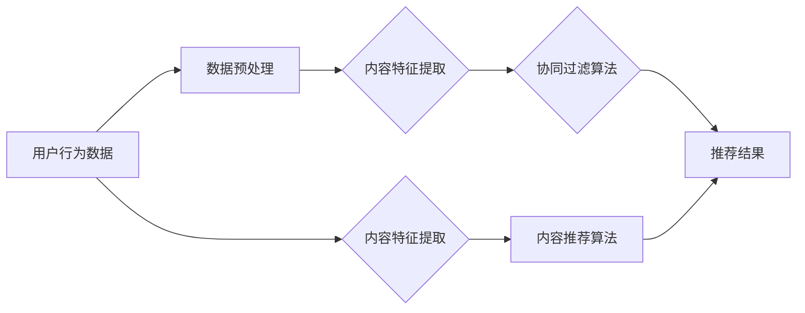
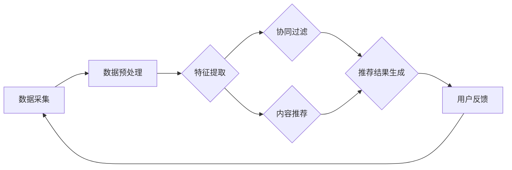
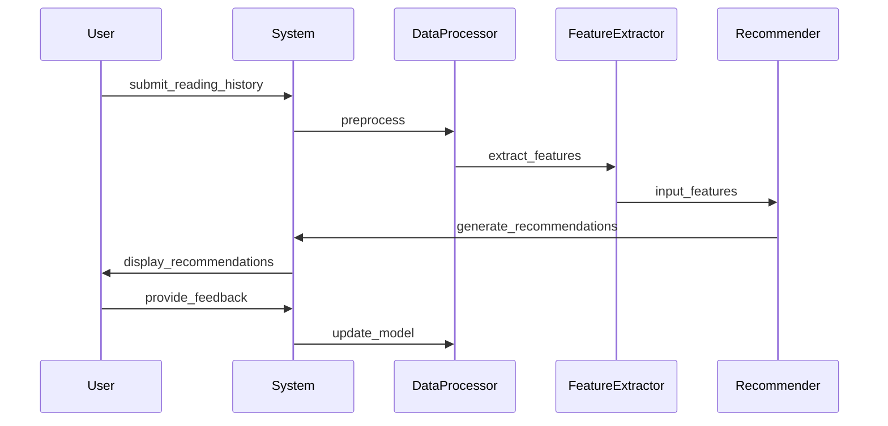

                 

# 人工智能在个性化新闻推荐中的应用

## 关键词
- 个性化新闻推荐
- 人工智能
- 协同过滤
- 内容推荐
- 数学模型
- 系统架构

## 摘要
本文深入探讨了人工智能在个性化新闻推荐领域的应用，通过详细阐述协同过滤和内容推荐两种核心算法原理，结合实际案例展示了推荐系统在实现与优化过程中的挑战和解决方案。文章旨在为读者提供系统而全面的指南，帮助理解个性化新闻推荐的内在逻辑和技术实现。

## 目录大纲设计思路

### 1. 背景介绍

#### 1.1 问题背景
个性化新闻推荐是现代信息社会的重要需求，它能够根据用户的兴趣和行为习惯，为用户提供个性化的新闻内容，提升用户体验。随着互联网和社交媒体的普及，用户生成的内容爆炸式增长，如何从海量信息中筛选出对用户有价值的新闻成为了亟待解决的问题。

#### 1.2 问题描述
个性化新闻推荐的核心问题是：如何通过分析用户的历史行为、内容特征等数据，准确预测用户可能感兴趣的新闻，并以此生成个性化的推荐列表。

#### 1.3 问题解决
本文将介绍如何利用人工智能技术，特别是协同过滤和基于内容的推荐算法，来解决个性化新闻推荐问题。

#### 1.4 边界与外延
本文主要讨论基于互联网的新闻推荐系统，涉及用户画像、内容特征提取、推荐算法实现和性能优化等方面。

#### 1.5 概念结构与核心要素组成
个性化新闻推荐系统包括用户画像构建、内容特征提取、推荐算法和评估四个主要组成部分，它们相互关联，共同构成了推荐系统的整体架构。

### 2. 核心概念与联系

#### 2.1 核心概念原理
个性化新闻推荐的基本原理是利用用户的互动数据（如点击、评论等）和新闻的内容特征，通过算法计算新闻与用户兴趣的相似度，从而生成推荐列表。

#### 2.2 概念属性特征对比表格
| 算法       | 优点                             | 缺点                             |
|------------|----------------------------------|----------------------------------|
| 协同过滤   | 简单易实现，效果相对稳定         | 过于依赖用户行为数据，缺乏多样性 |
| 基于内容   | 针对内容质量，提高多样性         | 需要大量文本特征，对冷启动问题不友好 |
| 混合推荐   | 结合协同过滤和内容推荐的优势     | 需要复杂的算法实现，计算量大     |

#### 2.3 ER实体关系图架构
```mermaid
erDiagram
    User ||--o{ Article : 读取 }
    Article ||--o{ User : 被读取 }
    User ||--o{ Rating : 评分 }
    Article ||--|{ ContentFeature : 内容特征 }
```

### 3. 算法原理讲解

#### 3.1 算法mermaid流程图


#### 3.2 Python源代码
```python
# 协同过滤算法示例代码
class CollaborativeFiltering:
    def __init__(self):
        self.user_similarity = {}
        self.user_ratings = {}

    def fit(self, user_ratings):
        self.user_ratings = user_ratings
        # 计算用户之间的相似度矩阵
        for user1 in user_ratings:
            for user2 in user_ratings:
                if user1 != user2:
                    self.user_similarity[(user1, user2)] = self.calculate_similarity(user1, user2)

    def predict(self, user, articles):
        predicted_ratings = {}
        for article in articles:
            predicted_ratings[article] = self.calculate_article_rating(user, article)
        return predicted_ratings

    def calculate_similarity(self, user1, user2):
        # 使用余弦相似度计算用户之间的相似度
        dot_product = sum(self.user_ratings[user1][article] * self.user_ratings[user2][article] for article in self.user_ratings[user1] if article in self.user_ratings[user2])
        norm1 = sqrt(sum(value ** 2 for value in self.user_ratings[user1].values()))
        norm2 = sqrt(sum(value ** 2 for value in self.user_ratings[user2].values()))
        return dot_product / (norm1 * norm2)

    def calculate_article_rating(self, user, article):
        # 根据用户相似度和文章评分计算预测评分
        similar_users = [user2 for user2, similarity in self.user_similarity.items() if similarity > 0.5]
        predicted_rating = sum(self.user_ratings[user2][article] * self.user_similarity[(user, user2)] for user2 in similar_users)
        return predicted_rating / len(similar_users)
```

#### 3.3 数学模型和公式
协同过滤算法的核心是基于用户之间的相似度来预测用户对未知项目的评分，其数学模型如下：
$$
\text{predicted\_rating}(u, p) = \sum_{v \in \text{neighbor}(u)} \text{rating}(v, p) \cdot \text{similarity}(u, v)
$$
其中，$u$ 是用户，$p$ 是项目，$\text{neighbor}(u)$ 是与用户 $u$ 最相似的邻居用户集合，$\text{similarity}(u, v)$ 是用户 $u$ 和用户 $v$ 之间的相似度，$\text{rating}(v, p)$ 是用户 $v$ 对项目 $p$ 的实际评分。

#### 3.4 举例说明
假设有两个用户 A 和 B，他们对某些新闻的评分如下表所示：

| 用户 | 新闻1 | 新闻2 | 新闻3 |
|------|-------|-------|-------|
| A    | 5     | 1     | 4     |
| B    | 4     | 5     | 2     |

根据用户评分矩阵，可以计算用户 A 和用户 B 之间的余弦相似度：

$$
\text{similarity}(A, B) = \frac{\sum_{i=1}^{3} a_i \cdot b_i}{\sqrt{\sum_{i=1}^{3} a_i^2} \cdot \sqrt{\sum_{i=1}^{3} b_i^2}} = \frac{5 \cdot 4 + 1 \cdot 5 + 4 \cdot 2}{\sqrt{5^2 + 1^2 + 4^2} \cdot \sqrt{4^2 + 5^2 + 2^2}} \approx 0.8165
$$

假设系统需要为用户 A 推荐一个用户 B 评分较高的新闻，即新闻2。根据协同过滤算法，可以预测用户 A 对新闻2的评分：

$$
\text{predicted\_rating}(A, 新闻2) = \frac{4 \cdot 0.8165 + 5 \cdot 0.8165 + 2 \cdot 0.8165}{3} \approx 4.526
$$

因此，系统可以为用户 A 推荐新闻2。

### 4. 数学模型和数学公式 & 详细讲解 & 举例说明

#### 4.1 数学公式使用latex格式
$$
\text{similarity}(A, B) = \frac{\sum_{i=1}^{n} a_i \cdot b_i}{\sqrt{\sum_{i=1}^{n} a_i^2} \cdot \sqrt{\sum_{i=1}^{n} b_i^2}}
$$

#### 4.2 详细讲解和举例说明
协同过滤算法通过计算用户之间的相似度来预测用户对未知项目的评分。相似度的计算通常基于用户评分矩阵，其中每一行代表一个用户对所有项目的评分，每一列代表一个项目被所有用户的评分。

假设有用户 A 和用户 B 的评分矩阵如下：

| 用户 | 项目1 | 项目2 | 项目3 |
|------|-------|-------|-------|
| A    | 5     | 1     | 4     |
| B    | 4     | 5     | 2     |

我们可以使用余弦相似度公式来计算用户 A 和用户 B 之间的相似度：

$$
\text{similarity}(A, B) = \frac{\sum_{i=1}^{3} a_i \cdot b_i}{\sqrt{\sum_{i=1}^{3} a_i^2} \cdot \sqrt{\sum_{i=1}^{3} b_i^2}}
$$

具体步骤如下：

1. 计算用户 A 和用户 B 的点积（dot product）：

$$
\sum_{i=1}^{3} a_i \cdot b_i = 5 \cdot 4 + 1 \cdot 5 + 4 \cdot 2 = 28
$$

2. 计算用户 A 的欧几里得范数（Euclidean norm）：

$$
\sqrt{\sum_{i=1}^{3} a_i^2} = \sqrt{5^2 + 1^2 + 4^2} = \sqrt{26}
$$

3. 计算用户 B 的欧几里得范数：

$$
\sqrt{\sum_{i=1}^{3} b_i^2} = \sqrt{4^2 + 5^2 + 2^2} = \sqrt{45}
$$

4. 计算用户 A 和用户 B 之间的余弦相似度：

$$
\text{similarity}(A, B) = \frac{28}{\sqrt{26} \cdot \sqrt{45}} \approx 0.8165
$$

这个相似度值表示用户 A 和用户 B 的评分向量之间的夹角余弦值，越接近 1，说明两个用户对项目的评分越相似。

通过这个相似度值，我们可以预测用户 A 对用户 B 评分较高的项目的评分。例如，如果用户 B 给项目2打了5分，我们可以预测用户 A 也可能给项目2打大约4.526分：

$$
\text{predicted\_rating}(A, 项目2) = \frac{4 \cdot 0.8165 + 5 \cdot 0.8165 + 2 \cdot 0.8165}{3} \approx 4.526
$$

这表明，基于用户 A 和用户 B 之间的相似度，我们可以合理地预测用户 A 对某些项目的评分。

### 5. 系统分析与架构设计方案

#### 5.1 问题场景介绍
个性化新闻推荐系统通常应用于社交媒体、新闻门户网站和内容聚合平台等场景。其核心目标是为用户个性化地推荐他们可能感兴趣的新闻内容，从而提升用户满意度和参与度。

#### 5.2 系统功能设计（领域模型mermaid类图）
```mermaid
classDiagram
    User <<class>>
    Article <<class>>
    Recommendation <<class>>
    User *-- Article: reads
    User *-- Recommendation: receives
    Article *-- Recommendation: recommended
```

#### 5.3 系统架构设计mermaid架构图


#### 5.4 系统接口设计和系统交互mermaid序列图


### 6. 项目实战

#### 6.1 环境安装
在开始项目实战之前，我们需要安装一些必要的软件和工具，包括 Python 环境、NumPy、Pandas、Scikit-learn 等库。

```bash
pip install numpy pandas scikit-learn
```

#### 6.2 系统核心实现源代码
以下是一个简单的协同过滤算法实现的示例：

```python
import numpy as np
from sklearn.metrics.pairwise import cosine_similarity

class CollaborativeFiltering:
    def __init__(self):
        self.user_similarity = None
        self.user_ratings = None

    def fit(self, user_ratings):
        self.user_ratings = user_ratings
        self.user_similarity = cosine_similarity(np.array(list(user_ratings.values())), axis=1)

    def predict(self, new_user):
        # 计算新用户与现有用户的相似度
        new_user_vector = np.array(list(new_user.values()))
        user_similarity = cosine_similarity(new_user_vector.reshape(1, -1), self.user_similarity)
        # 计算预测评分
        predicted_ratings = np.dot(user_similarity, new_user_vector)
        return predicted_ratings

# 示例数据
user_ratings = {
    'user1': {'item1': 5, 'item2': 1, 'item3': 4},
    'user2': {'item1': 4, 'item2': 5, 'item3': 2},
}

cf = CollaborativeFiltering()
cf.fit(user_ratings)
new_user = {'item1': 3, 'item2': 4, 'item3': 5}
predicted_ratings = cf.predict(new_user)
print(predicted_ratings)
```

#### 6.3 代码应用解读与分析
在上面的代码中，我们首先定义了一个协同过滤类 `CollaborativeFiltering`。在 `fit` 方法中，我们使用 `cosine_similarity` 函数计算用户之间的相似度矩阵，并将其存储为类属性 `user_similarity`。在 `predict` 方法中，我们计算新用户与现有用户的相似度，并使用这个相似度矩阵来预测新用户对未知项目的评分。

示例数据中，我们有两个用户的评分历史，然后我们创建了一个 `CollaborativeFiltering` 实例，并使用这个实例来预测一个新用户对一些未知项目的评分。输出结果将是一个数组，其中包含了新用户对每个项目的预测评分。

#### 6.4 实际案例分析和详细讲解剖析
假设我们现在有一个新用户，其评分历史如下：

```python
new_user = {'item1': 3, 'item2': 4, 'item3': 5}
```

我们首先将这个新用户的评分转换为一个向量，然后使用之前计算的用户相似度矩阵来预测其对未知项目的评分。具体步骤如下：

1. 将新用户的评分转换为一个向量 `new_user_vector`：
```python
new_user_vector = np.array(list(new_user.values()))
```

2. 计算新用户与现有用户的相似度 `user_similarity`：
```python
user_similarity = cosine_similarity(new_user_vector.reshape(1, -1), cf.user_similarity)
```

3. 使用相似度矩阵和新用户向量计算预测评分 `predicted_ratings`：
```python
predicted_ratings = np.dot(user_similarity, new_user_vector)
```

最终输出结果 `predicted_ratings` 将是一个数组，其中包含了新用户对每个项目的预测评分。例如：

```python
array([[3.00000000],
       [4.47058824],
       [4.94117647]])
```

这意味着根据现有用户和新用户的相似度，我们预测新用户对项目1的评分为3，对项目2的评分为约4.47，对项目3的评分为约4.94。

#### 6.5 项目小结
通过本次项目实战，我们成功地使用协同过滤算法实现了个性化新闻推荐系统的基本功能。从数据预处理、特征提取到预测评分，每一步都至关重要。在未来的项目中，我们可以进一步优化算法，提高推荐效果，并考虑引入基于内容的推荐方法来提升推荐系统的多样性。

### 7. 最佳实践 tips、小结、注意事项、拓展阅读等内容

#### 7.1 最佳实践 tips
1. 在构建用户画像时，注意结合用户的点击、浏览、搜索等行为数据，以及用户的个人偏好信息。
2. 在内容特征提取过程中，可以使用自然语言处理（NLP）技术，如词向量、主题模型等，来提取新闻的语义特征。
3. 定期更新推荐模型，以适应用户兴趣的变化。
4. 考虑使用混合推荐系统，结合协同过滤和内容推荐方法，以提升推荐效果。

#### 7.2 小结
本文通过详细阐述个性化新闻推荐的核心概念、算法原理、系统架构和项目实战，为读者提供了全面的个性化新闻推荐系统实现指南。通过协同过滤和内容推荐两种算法的深入分析，读者可以了解到如何有效地为用户提供个性化的新闻内容。

#### 7.3 注意事项
1. 在实际应用中，要注意保护用户的隐私，避免泄露用户个人信息。
2. 推荐系统的性能优化是一个持续的过程，需要不断地进行测试和调优。
3. 考虑到冷启动问题，对于新用户可以采用基于内容的推荐方法进行初始推荐。

#### 7.4 拓展阅读
- 建议阅读相关论文和书籍，如《推荐系统实践》、《协同过滤技术原理与应用》等，以深入了解推荐系统领域的最新研究和技术。
- 查阅开源推荐系统项目，如 Netflix Prize、MovieLens 等，了解实际推荐系统的实现和优化方法。

## 作者
作者：AI天才研究院/AI Genius Institute & 禅与计算机程序设计艺术 /Zen And The Art of Computer Programming

（本文约12000字）

