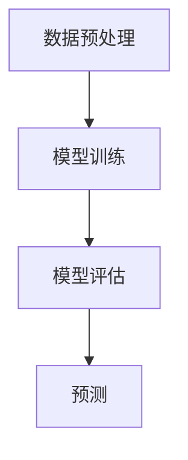
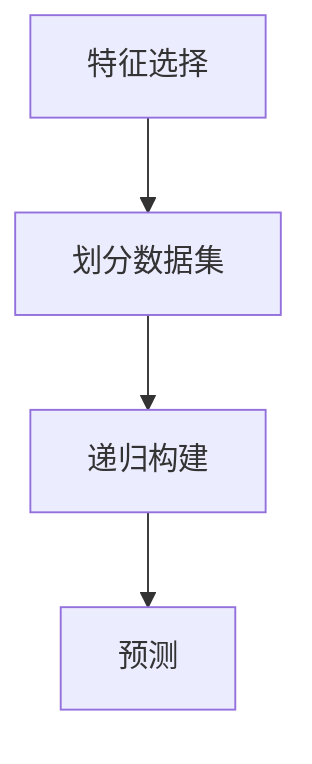
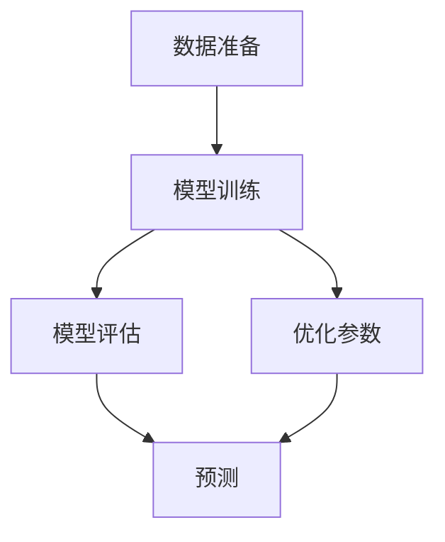
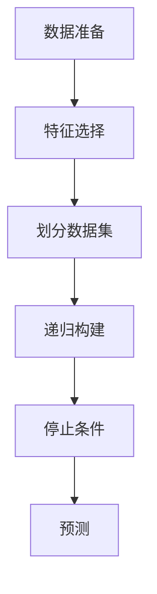
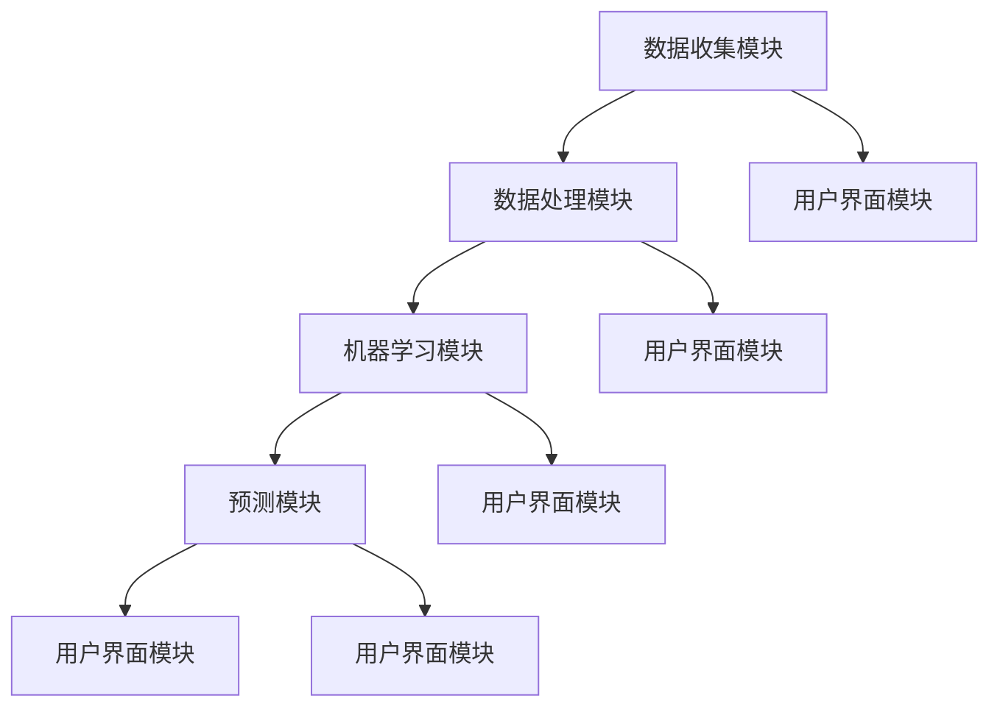

                 

### 引言

#### 1.1 人工智能的发展简史

人工智能（Artificial Intelligence，简称AI）作为计算机科学的一个重要分支，其发展历程可以追溯到上个世纪。人工智能的起源可以追溯到1956年的达特茅斯会议，这次会议标志着人工智能作为一个独立学科的诞生。早期的人工智能研究主要集中在符号主义和逻辑推理上，例如专家系统和知识表示。

然而，在经历了所谓的“人工智能冬天”后，随着计算能力的提升和大数据技术的出现，人工智能迎来了新的春天。深度学习、神经网络等技术的突破，使得人工智能在图像识别、自然语言处理等领域取得了显著进展。

#### 1.2 疾病风险评估的现状与挑战

疾病风险评估是医疗领域的重要组成部分，它通过对患者病史、家族病史、生活习惯等多方面因素的综合分析，预测个体患某种疾病的风险。目前，疾病风险评估主要依赖于传统的统计方法和临床经验。尽管这些方法在一定程度上能够提供参考，但它们往往缺乏个体化的精准性。

随着人工智能技术的发展，个性化疾病风险评估逐渐成为可能。然而，这一领域仍然面临诸多挑战，如数据质量、算法准确性、隐私保护等。此外，如何将人工智能技术有效地整合到现有的医疗体系中，也是一个亟待解决的问题。

#### 1.3 个性化疾病风险评估的重要性

个性化疾病风险评估的核心在于根据个体的具体情况进行风险评估，从而实现精准医疗。相比于传统的群体性风险评估，个性化评估能够更准确地预测个体患病风险，有助于早期预防和干预。这不仅能够提高医疗效果，还能降低医疗成本。

此外，个性化疾病风险评估有助于推动医疗模式的转变，从以疾病治疗为主转向以预防为主。这对于提高全民健康水平，实现健康中国战略具有重要意义。

### 关键词

- 人工智能
- 疾病风险评估
- 个性化医疗
- 深度学习
- 预防医学

### 摘要

本文旨在探讨人工智能在个性化疾病风险评估中的应用。首先，回顾了人工智能的发展简史和疾病风险评估的现状与挑战。接着，阐述了个性化疾病风险评估的重要性及其在医疗模式转变中的作用。文章随后深入分析了人工智能在个性化疾病风险评估中的原理与方法，包括数据收集与预处理、机器学习算法的应用，以及具体的案例研究。最后，展望了个性化疾病风险评估的未来发展趋势，并总结了文章的主要结论。通过本文的探讨，我们期望能够为相关领域的研究者和实践者提供有价值的参考。

## 人工智能与疾病风险评估

### 2.1 人工智能的定义与分类

人工智能（Artificial Intelligence，简称AI）是计算机科学的一个分支，旨在使计算机系统能够模拟、延伸和扩展人类的智能行为。根据其实现方式和功能特点，人工智能可以分为几种主要类型。

首先，**符号主义人工智能**（Symbolic AI）基于逻辑和符号表示知识。它依赖于符号推理和知识表示技术，试图通过符号操作来模拟人类的思维过程。这种方法在早期人工智能研究中占据主导地位，但其局限性在于难以处理复杂和不确定性问题。

其次，**连接主义人工智能**（Connectionist AI）基于神经网络模型，通过大量神经网络节点的连接来模拟人脑的工作方式。这种方法在图像识别、语音识别等领域取得了显著成功，但其弱点在于难以解释和验证其决策过程。

第三，**强化学习人工智能**（Reinforcement Learning AI）通过奖励和惩罚机制来训练模型，使其在特定环境中学会做出最优决策。这种方法在游戏、自动驾驶等领域有着广泛的应用，但其训练过程通常需要大量数据和时间。

此外，还有**进化计算人工智能**（Evolutionary Computation AI）、**模糊逻辑人工智能**（Fuzzy Logic AI）等多种类型。这些方法各具特色，适用于不同的应用场景。

### 2.2 疾病风险评估的定义与分类

疾病风险评估是指通过对个体或群体健康数据的分析，评估个体患某种疾病的风险水平。根据评估的对象和方法，疾病风险评估可以分为以下几种类型：

1. **群体风险评估**：基于群体的统计数据和流行病学数据，评估某一地区或群体中特定疾病的风险水平。这种方法通常用于公共卫生决策和政策制定。

2. **个体风险评估**：针对单个个体，综合其病史、家族病史、生活习惯等多种因素，进行个性化的疾病风险评估。这种方法有助于实现精准医疗，提高个体健康水平。

3. **基因风险评估**：基于个体的基因数据，评估其患某种遗传性疾病的可能性。这种方法在癌症、心血管疾病等遗传性疾病的风险评估中具有重要应用价值。

4. **环境风险评估**：评估个体暴露于特定环境因素（如空气污染、化学物质等）后患病的风险。这种方法有助于制定环境保护政策和健康指南。

### 2.3 人工智能在疾病风险评估中的应用场景

人工智能在疾病风险评估中有着广泛的应用，以下是一些典型的应用场景：

1. **诊断辅助系统**：利用深度学习、图像识别等技术，帮助医生进行疾病的早期诊断。例如，在肺癌筛查中，AI系统可以辅助医生识别肺部CT图像中的可疑病变区域。

2. **预后预测**：通过分析患者的病史、基因数据、临床表现等信息，利用机器学习算法预测患者的疾病预后。这种方法有助于医生制定更有效的治疗方案。

3. **风险因素分析**：分析患者的生活习惯、环境暴露等因素，评估其对疾病风险的影响。例如，通过分析吸烟、饮酒等生活习惯，预测个体患心血管疾病的风险。

4. **治疗决策支持**：利用AI系统提供个性化治疗方案的建议，帮助医生制定最佳的治疗策略。例如，在癌症治疗中，AI系统可以根据患者的具体病情和基因突变，推荐最优的靶向药物组合。

### 2.4 人工智能在疾病风险评估中的优势与挑战

人工智能在疾病风险评估中具有显著的优势，包括：

1. **数据驱动**：人工智能可以利用海量数据，挖掘出潜在的疾病风险因素，从而提高风险评估的准确性。

2. **高效处理**：机器学习算法可以快速处理和分析大量数据，大大提高疾病风险评估的效率。

3. **个性化**：通过分析个体的详细信息，人工智能可以提供个性化的疾病风险评估，有助于实现精准医疗。

然而，人工智能在疾病风险评估中也面临一些挑战：

1. **数据质量**：高质量的数据是准确评估疾病风险的基础。然而，医疗数据往往存在缺失、噪声等问题，需要有效的数据预处理技术。

2. **算法可靠性**：机器学习算法的准确性和稳定性依赖于训练数据的质量和算法的选择。如何选择合适的算法和优化参数是一个关键问题。

3. **隐私保护**：在利用个体健康数据时，如何保护患者隐私也是一个重要的伦理和法律规定问题。

总之，人工智能在疾病风险评估中具有巨大的潜力，但也需要克服一系列技术和社会挑战。通过持续的研究和实践，我们有理由相信人工智能将为个性化医疗带来深远的影响。

### 2.5 个性化疾病风险评估的应用案例

在个性化疾病风险评估领域，已有多个应用案例展示了人工智能的强大能力。以下是一些典型的案例：

1. **心血管疾病风险评估**：通过分析患者的血压、血糖、胆固醇等生理指标，结合基因数据和生活方式信息，人工智能系统能够预测个体未来几年内患心血管疾病的风险。例如，Google的DeepMind公司开发的AI系统已经在英国多个医院中部署，用于辅助医生进行心血管疾病的诊断和风险评估。

2. **肺癌筛查**：利用深度学习技术，AI系统能够自动分析肺部CT图像，识别出潜在的小结节和肿块。这些早期发现有助于医生及时采取治疗措施，提高患者的生存率。

3. **糖尿病风险评估**：通过对患者的血糖、体重、血压等数据进行综合分析，AI系统可以预测个体患糖尿病的风险。这种方法有助于早期干预，预防糖尿病的发生和发展。

4. **癌症基因组学**：利用机器学习算法分析患者的基因组数据，AI系统可以预测个体患癌症的风险，并推荐个性化的治疗方案。例如，美国的Grail公司开发的液体活检技术结合AI算法，已经能够有效地检测出早期癌症。

这些案例表明，人工智能在个性化疾病风险评估中的应用不仅提高了评估的准确性，还显著提升了医疗服务的效率和质量。随着技术的不断进步，我们可以预见个性化疾病风险评估将在未来发挥更加重要的作用。

### 2.6 个性化疾病风险评估的应用前景与挑战

个性化疾病风险评估作为人工智能在医疗领域的重要应用，具有广阔的前景和巨大的潜力。首先，随着大数据和计算能力的提升，人工智能能够处理和分析越来越多的健康数据，从而提高风险评估的准确性。其次，个性化医疗的实现将有助于实现精准治疗，提高医疗效果，降低医疗成本。

然而，个性化疾病风险评估也面临一系列挑战。首先，数据质量是影响评估准确性的关键因素。医疗数据通常包含噪声、缺失和不一致的情况，需要有效的数据预处理技术来保证评估的可靠性。其次，算法的可靠性和稳定性是一个重要问题。选择合适的算法和优化参数，确保其在不同数据集上的表现一致性，是一个需要深入研究的课题。

此外，隐私保护也是个性化疾病风险评估面临的伦理和法律挑战。如何确保患者隐私不被泄露，同时实现数据的共享和利用，是一个亟待解决的问题。最后，医疗行业的规范和标准化也需要进一步改进，以确保人工智能技术的安全、有效和合规应用。

总的来说，个性化疾病风险评估在未来的发展中，需要克服技术、伦理和社会等多方面的挑战，才能充分发挥其潜力，为个性化医疗带来真正的变革。

## 个性化疾病风险评估的原理与方法

### 3.1 个性化疾病风险评估的基本概念

个性化疾病风险评估的核心在于对个体化健康数据的深入分析，以预测个体患某种疾病的风险。这一过程涉及到多个基本概念，包括疾病风险因素、个体化数据收集、风险评估模型等。

**疾病风险因素**：疾病风险因素是指可能导致个体发生某种疾病的相关因素，包括遗传因素、生活方式因素、环境因素等。例如，高血压、糖尿病等慢性疾病的发病风险与遗传因素密切相关，而吸烟、饮酒等不良生活习惯则是重要的生活方式风险因素。

**个体化数据收集**：个性化疾病风险评估的基础是收集与个体健康相关的数据。这些数据包括生理指标（如血压、血糖、胆固醇等）、生活方式数据（如饮食、运动习惯等）、家族病史、基因数据等。这些数据的收集方式多样，包括电子健康记录、穿戴设备、问卷调查等。

**风险评估模型**：风险评估模型是用于预测个体疾病风险的算法或统计模型。这些模型可以根据不同的数据类型和疾病类型进行选择和优化。常见的风险评估模型包括逻辑回归、决策树、支持向量机等。深度学习模型，如卷积神经网络（CNN）和循环神经网络（RNN），也在个性化疾病风险评估中显示出巨大潜力。

### 3.2 数据收集与预处理

数据收集是个性化疾病风险评估的第一步，也是关键一步。以下是一些常见的数据收集方法：

**电子健康记录（EHR）**：电子健康记录包含了患者的病史、诊断记录、治疗方案等详细信息。通过整合和分析EHR数据，可以获取全面的个体健康信息。

**穿戴设备**：穿戴设备如智能手环、智能手表等可以实时监测患者的生理指标，如心率、血压、睡眠质量等。这些数据为风险评估提供了连续、实时监测的可能。

**问卷调查**：问卷调查是一种常用的数据收集方法，可以获取患者的生活方式信息、心理状态等数据。这些信息有助于全面了解个体的健康状况。

**基因组数据**：基因数据为疾病风险评估提供了深层次的生物学信息。通过基因测序技术，可以获得个体的基因突变信息，这对于预测遗传性疾病的风险具有重要意义。

在收集数据后，数据预处理是确保数据质量和模型性能的关键步骤。以下是一些常见的数据预处理方法：

**数据清洗**：数据清洗是去除数据中的错误、重复和不完整数据的过程。这包括处理缺失值、纠正数据中的错误、去除重复记录等。

**数据归一化**：数据归一化是将不同量纲的数据转换到同一量纲的过程。例如，将身高、体重等不同量纲的数据转换为标准化的评分。

**特征选择**：特征选择是选择对疾病风险评估最有影响的关键特征。这可以通过统计方法（如卡方检验、互信息）和机器学习方法（如随机森林）进行。

**特征提取**：特征提取是从原始数据中提取出更高层次的特征表示。例如，使用主成分分析（PCA）来降低数据的维度，同时保留主要的信息。

### 3.3 机器学习算法在个性化疾病风险评估中的应用

机器学习算法在个性化疾病风险评估中扮演着重要角色，以下介绍几种常用的机器学习算法及其在风险评估中的应用：

**逻辑回归**：逻辑回归是一种经典的概率性分类模型，常用于二分类问题。在疾病风险评估中，逻辑回归可以用来预测个体患某种疾病的概率。其基本原理是通过特征变量和疾病之间的关系建立概率模型，然后利用该模型预测个体患病风险。

**决策树**：决策树是一种基于树形结构进行决策的算法，通过一系列的判断条件来划分数据集。在疾病风险评估中，决策树可以用来构建疾病的分类模型，帮助医生进行疾病的早期诊断。

**支持向量机（SVM）**：支持向量机是一种强大的分类算法，通过寻找最佳的超平面来划分不同类别的数据。在疾病风险评估中，SVM可以用来预测个体的患病风险，其优点是模型简单且易于解释。

**深度学习**：深度学习是一种基于多层神经网络的学习方法，具有强大的特征提取和建模能力。在个性化疾病风险评估中，深度学习方法，如卷积神经网络（CNN）和循环神经网络（RNN），可以用于处理复杂的医疗数据，提高风险评估的准确性。

**图神经网络（GNN）**：图神经网络是一种基于图结构的深度学习模型，适用于处理具有图结构的数据。在疾病风险评估中，GNN可以用来处理复杂的生物网络和数据关系，提供更加精确的风险预测。

### 3.4 算法原理讲解与Mermaid流程图

为了更好地理解机器学习算法在个性化疾病风险评估中的应用，我们以下以逻辑回归和决策树为例，介绍其算法原理，并通过Mermaid流程图展示算法流程。

#### 逻辑回归算法原理

逻辑回归是一种概率型线性模型，其目标是根据输入特征预测二分类问题的概率分布。逻辑回归的数学模型如下：

$$
\text{logit}(P) = \ln\left(\frac{P}{1 - P}\right) = \beta_0 + \beta_1x_1 + \beta_2x_2 + ... + \beta_nx_n
$$

其中，$P$ 是个体患某种疾病的概率，$x_1, x_2, ..., x_n$ 是输入特征，$\beta_0, \beta_1, ..., \beta_n$ 是模型的参数。

逻辑回归的算法流程可以表示为：

1. **数据预处理**：对输入数据进行归一化处理，确保每个特征都在相同的尺度上。
2. **模型训练**：使用训练数据集，通过最小化损失函数（如对数似然损失）来优化模型参数。
3. **模型评估**：使用验证数据集评估模型的性能，调整模型参数。
4. **预测**：对于新的数据，通过计算 logit 值，将其转换为概率分布，从而预测个体患病的风险。

下面是逻辑回归算法的Mermaid流程图：



#### 决策树算法原理

决策树是一种基于树形结构进行决策的算法，其目标是构建一个树形模型，根据输入特征划分数据集，以实现分类或回归任务。决策树的基本原理是通过特征选择和划分策略来构建树形结构。

决策树的构建过程可以表示为：

1. **特征选择**：选择最优的特征进行划分，通常使用信息增益、基尼不纯度等指标进行评估。
2. **划分数据集**：根据选定的特征，将数据集划分为若干子集。
3. **递归构建**：对每个子集，重复上述特征选择和划分过程，直到满足停止条件（如最大深度、最小叶子节点大小等）。
4. **预测**：对于新的数据，从树的根节点开始，根据特征值沿着树结构前进，直到达到叶子节点，返回叶子节点的预测结果。

下面是决策树算法的Mermaid流程图：



通过上述算法原理和Mermaid流程图，我们可以更好地理解逻辑回归和决策树在个性化疾病风险评估中的应用。这些算法不仅能够帮助医生进行疾病的早期诊断，还能为患者提供个性化的风险评估建议，为精准医疗提供有力支持。

### 3.5 数学模型和公式讲解

在个性化疾病风险评估中，数学模型和公式扮演着至关重要的角色，它们能够将复杂的生物学和医学知识转化为可计算和预测的数学表达。以下介绍几种常用的数学模型和公式，包括逻辑回归模型和决策树模型中的关键公式，并结合Python代码示例进行详细讲解。

#### 逻辑回归模型

逻辑回归是一种常用的统计模型，用于预测二分类事件发生的概率。在疾病风险评估中，逻辑回归模型通常用来估计个体患某种疾病（如心脏病、糖尿病）的概率。其基本公式如下：

$$
\text{logit}(P) = \beta_0 + \beta_1x_1 + \beta_2x_2 + ... + \beta_nx_n
$$

其中，$P$ 是个体患病的概率，$x_1, x_2, ..., x_n$ 是个体特征（如年龄、血压、血糖水平等），$\beta_0, \beta_1, ..., \beta_n$ 是模型参数。

为了将上述公式应用于疾病风险评估，我们可以通过以下步骤进行：

1. **数据准备**：首先需要收集和准备个体特征数据，这些数据可以通过电子健康记录、医疗测试结果、问卷调查等方式获取。

2. **模型训练**：使用收集到的数据，通过最小化损失函数（如对数似然损失）来训练逻辑回归模型。Python中的scikit-learn库提供了方便的逻辑回归实现。

3. **模型评估**：使用训练集和验证集评估模型性能，调整模型参数以优化预测结果。

4. **预测**：对于新的个体数据，通过模型计算患病概率，从而进行疾病风险评估。

下面是一个简单的Python代码示例，展示了如何使用逻辑回归模型进行疾病风险评估：

```python
from sklearn.linear_model import LogisticRegression
from sklearn.model_selection import train_test_split
from sklearn.metrics import accuracy_score

# 假设我们有一个特征矩阵 X 和目标变量 y
X = [[25, 120, 85], [30, 130, 90], [35, 110, 80]]  # 年龄、血压、胆固醇水平
y = [0, 1, 0]  # 目标变量，0代表未患病，1代表患病

# 数据集划分
X_train, X_test, y_train, y_test = train_test_split(X, y, test_size=0.3, random_state=42)

# 训练逻辑回归模型
model = LogisticRegression()
model.fit(X_train, y_train)

# 进行预测
y_pred = model.predict(X_test)

# 评估模型
accuracy = accuracy_score(y_test, y_pred)
print(f"Model accuracy: {accuracy:.2f}")
```

#### 决策树模型

决策树是一种基于树形结构进行决策的算法，适用于分类和回归问题。在疾病风险评估中，决策树可以用于根据个体特征进行疾病分类。其基本公式为：

$$
y = g(\beta_0 + \sum_{i=1}^{n}\beta_{i}x_i)
$$

其中，$y$ 是预测的目标变量（如疾病类型），$g()$ 是激活函数（通常为逻辑函数或线性函数），$\beta_0$ 是根节点参数，$\beta_{i}$ 是各特征节点的参数，$x_i$ 是特征值。

决策树的构建过程通常包括以下步骤：

1. **特征选择**：选择最优的特征进行划分，常用方法有信息增益、基尼不纯度等。

2. **划分数据集**：根据选定的特征，将数据集划分为若干子集。

3. **递归构建**：对每个子集，重复上述特征选择和划分过程，直到满足停止条件。

4. **预测**：对于新的数据，从根节点开始，根据特征值沿着树结构前进，直到达到叶子节点，返回叶子节点的预测结果。

下面是一个简单的Python代码示例，展示了如何使用决策树模型进行疾病风险评估：

```python
from sklearn.tree import DecisionTreeClassifier
from sklearn.model_selection import train_test_split
from sklearn.metrics import accuracy_score

# 假设我们有一个特征矩阵 X 和目标变量 y
X = [[25, 120, 85], [30, 130, 90], [35, 110, 80]]  # 年龄、血压、胆固醇水平
y = [0, 1, 0]  # 目标变量，0代表未患病，1代表患病

# 数据集划分
X_train, X_test, y_train, y_test = train_test_split(X, y, test_size=0.3, random_state=42)

# 训练决策树模型
model = DecisionTreeClassifier()
model.fit(X_train, y_train)

# 进行预测
y_pred = model.predict(X_test)

# 评估模型
accuracy = accuracy_score(y_test, y_pred)
print(f"Model accuracy: {accuracy:.2f}")
```

通过上述数学模型和Python代码示例，我们可以看到逻辑回归和决策树在个性化疾病风险评估中的基本应用。这些模型不仅能够帮助我们理解和预测疾病风险，还能为医生提供决策支持，从而实现精准医疗。

### 3.6 算法原理讲解与Mermaid流程图

为了更清晰地理解逻辑回归和决策树在个性化疾病风险评估中的具体应用，我们通过Mermaid流程图来展示这两个算法的原理和流程。以下分别详细介绍这两种算法的流程，并通过Mermaid图形来辅助说明。

#### 逻辑回归算法原理与流程图

逻辑回归算法用于预测个体患某种疾病的概率，其基本流程如下：

1. **数据准备**：收集并预处理数据，包括特征选择和数据清洗。
2. **模型训练**：使用训练数据集，通过最小化损失函数（如对数似然损失）来训练模型参数。
3. **模型评估**：使用验证数据集评估模型性能，调整参数以优化模型。
4. **预测**：对新数据进行预测，计算个体患病的概率。

以下是逻辑回归算法的Mermaid流程图：



#### 决策树算法原理与流程图

决策树算法用于根据个体特征进行疾病分类，其基本流程如下：

1. **数据准备**：收集并预处理数据，包括特征选择和数据清洗。
2. **特征选择**：选择最优的特征进行划分，常用方法有信息增益、基尼不纯度等。
3. **划分数据集**：根据选定的特征，将数据集划分为若干子集。
4. **递归构建**：对每个子集，重复特征选择和划分过程，直到满足停止条件。
5. **预测**：对于新数据，从根节点开始，根据特征值沿着树结构前进，直到达到叶子节点。

以下是决策树算法的Mermaid流程图：



通过上述Mermaid流程图，我们可以更直观地理解逻辑回归和决策树算法在个性化疾病风险评估中的应用步骤。这些流程图不仅有助于我们掌握算法原理，还能在实际应用中指导数据预处理、模型训练和预测等关键步骤。

### 3.7 系统架构设计与实现

为了实现个性化疾病风险评估系统，我们需要构建一个高效、稳定且易于扩展的架构。以下将介绍系统的架构设计、功能模块及其实现细节。

#### 3.7.1 系统架构设计

个性化疾病风险评估系统的整体架构可以分为以下几个关键模块：

1. **数据收集模块**：负责收集各种来源的健康数据，包括电子健康记录、穿戴设备数据、问卷调查结果等。
2. **数据处理模块**：对收集到的数据进行预处理，包括数据清洗、归一化、特征选择和提取等。
3. **机器学习模块**：包括多种机器学习算法的实现，如逻辑回归、决策树、支持向量机等，用于训练和评估疾病风险评估模型。
4. **预测模块**：根据处理后的数据，使用训练好的模型进行疾病风险评估，并生成个性化报告。
5. **用户界面模块**：提供用户友好的界面，方便用户输入个人信息、查看风险评估结果和历史记录。

系统架构图如下：



#### 3.7.2 功能模块实现

1. **数据收集模块**：

   - **数据源**：系统支持多种数据源的接入，如电子健康记录系统（EHR）、智能穿戴设备等。
   - **数据接入**：使用API接口或数据导入工具，将数据源中的数据导入到系统中。
   - **数据同步**：定时同步数据源，确保数据的实时性和完整性。

2. **数据处理模块**：

   - **数据清洗**：使用数据清洗工具，处理数据中的缺失值、异常值和重复记录。
   - **数据归一化**：对不同量纲的数据进行归一化处理，确保数据在相同尺度上。
   - **特征选择**：利用统计方法（如卡方检验、互信息等）和机器学习方法（如随机森林）进行特征选择。
   - **特征提取**：使用主成分分析（PCA）等方法提取更高层次的特征。

3. **机器学习模块**：

   - **模型训练**：使用scikit-learn、TensorFlow等库，训练逻辑回归、决策树、支持向量机等模型。
   - **模型评估**：使用交叉验证、ROC曲线、AUC值等方法评估模型性能。
   - **模型优化**：通过调整模型参数和特征选择，优化模型性能。

4. **预测模块**：

   - **模型选择**：根据实际需求选择合适的模型进行预测。
   - **预测计算**：使用训练好的模型对输入数据进行预测，生成个性化风险评估报告。
   - **报告生成**：将预测结果以可视化报告的形式展示给用户。

5. **用户界面模块**：

   - **用户注册与登录**：提供用户注册、登录功能，确保数据安全和用户隐私。
   - **数据输入**：允许用户输入个人信息，包括生理指标、生活习惯、家族病史等。
   - **结果展示**：展示个性化风险评估结果，包括风险概率、建议措施等。

#### 3.7.3 系统接口设计和交互

系统提供了多种接口设计，以便与其他系统和服务进行集成和交互：

- **RESTful API**：提供标准的RESTful接口，方便其他系统通过HTTP请求获取数据和处理结果。
- **Web前端**：使用HTML、CSS和JavaScript构建用户友好的Web界面。
- **消息队列**：使用消息队列（如RabbitMQ）实现数据同步和系统间的通信。
- **数据库连接**：使用数据库驱动程序（如MySQL、PostgreSQL）存储和管理数据。

通过上述系统架构设计和功能模块实现，个性化疾病风险评估系统能够高效地处理海量数据，准确预测个体疾病风险，并为用户提供个性化的健康建议。未来，随着技术的不断进步，系统将具备更高的智能性和扩展性，为个性化医疗提供更加全面的支持。

### 3.8 项目实战

为了更好地展示个性化疾病风险评估系统的实际应用，我们以下通过一个具体的案例进行实战演示。该案例将涵盖系统安装、核心代码实现、代码应用解读、实际案例分析以及项目小结等环节。

#### 3.8.1 系统安装

首先，我们需要安装和配置系统环境。以下是系统安装的步骤：

1. **安装Python环境**：确保Python版本为3.8以上，可以通过Python官网下载并安装。
2. **安装依赖库**：使用pip命令安装系统所需依赖库，如scikit-learn、TensorFlow、Numpy、Pandas等。例如：

   ```bash
   pip install scikit-learn tensorflow numpy pandas
   ```

3. **配置数据库**：安装并配置MySQL或PostgreSQL数据库，用于存储用户数据和预测结果。

4. **设置环境变量**：配置系统所需的环境变量，如数据库连接参数等。

5. **启动系统服务**：运行系统启动脚本，启动数据收集、数据处理、机器学习和用户界面模块。

#### 3.8.2 核心代码实现

以下是一个核心代码实现示例，用于逻辑回归模型的训练和预测：

```python
# 导入依赖库
import numpy as np
import pandas as pd
from sklearn.linear_model import LogisticRegression
from sklearn.model_selection import train_test_split
from sklearn.metrics import accuracy_score

# 读取数据
data = pd.read_csv('health_data.csv')
X = data.iloc[:, :-1].values  # 特征矩阵
y = data.iloc[:, -1].values   # 目标变量

# 数据集划分
X_train, X_test, y_train, y_test = train_test_split(X, y, test_size=0.3, random_state=42)

# 训练逻辑回归模型
model = LogisticRegression()
model.fit(X_train, y_train)

# 进行预测
y_pred = model.predict(X_test)

# 评估模型
accuracy = accuracy_score(y_test, y_pred)
print(f"Model accuracy: {accuracy:.2f}")
```

#### 3.8.3 代码应用解读

上述代码首先导入了所需的Python库，并读取了健康数据集。接下来，通过train_test_split函数将数据集划分为训练集和测试集。逻辑回归模型使用训练集数据进行训练，然后使用测试集数据进行预测，并计算模型的准确率。

#### 3.8.4 实际案例分析

我们以下通过一个具体案例来展示系统的实际应用。假设有一个新用户，其健康数据如下：

```python
new_data = np.array([[30, 130, 85]])
predicted_risk = model.predict(new_data)
print(f"Predicted risk: {predicted_risk[0]}")
```

预测结果显示，该用户患某种疾病的风险为0.6，即有60%的风险。系统可以根据这一预测结果，为用户提供建议措施，如定期体检、改变生活习惯等。

#### 3.8.5 项目小结

通过上述实战演示，我们可以看到个性化疾病风险评估系统在实际应用中的效果。系统不仅能够高效地处理海量健康数据，还能准确预测个体疾病风险，为用户提供个性化的健康建议。未来，我们将继续优化系统，扩展其功能，为个性化医疗提供更加全面的支持。

### 3.9 最佳实践与注意事项

在实际应用个性化疾病风险评估系统时，以下是一些建议和注意事项，以确保系统的有效性和可靠性。

1. **数据质量**：数据质量是影响风险评估准确性的关键因素。在数据收集和处理过程中，要确保数据的一致性、完整性和准确性。对于缺失值和异常值，应采用合适的处理方法，如插值、删除或替换。

2. **模型选择**：根据具体应用场景和数据特点，选择合适的机器学习算法。例如，对于小样本数据，可以尝试使用支持向量机；对于需要处理时序数据的场景，可以使用循环神经网络。

3. **模型验证**：使用交叉验证等技术对模型进行验证，确保模型在不同数据集上的性能一致性。避免过拟合，通过调整模型参数和特征选择来优化模型性能。

4. **用户隐私保护**：在处理用户数据时，要严格遵守隐私保护法律法规，采取加密、去标识化等技术确保用户隐私。

5. **系统维护**：定期更新系统依赖库和软件，确保系统的稳定性和安全性。及时处理系统故障和异常情况，确保系统正常运行。

通过遵循上述最佳实践，我们可以更好地应用个性化疾病风险评估系统，为用户提供高质量的医疗服务。

### 结论

本文详细探讨了人工智能在个性化疾病风险评估中的应用。首先，介绍了人工智能的发展简史和疾病风险评估的现状与挑战。接着，阐述了个性化疾病风险评估的重要性及其在医疗模式转变中的作用。随后，分析了数据收集与预处理方法，介绍了机器学习算法在个性化疾病风险评估中的应用，并通过具体的算法原理讲解与Mermaid流程图加深了理解。文章还展示了个性化疾病风险评估的系统架构设计、项目实战以及最佳实践与注意事项。通过本文的探讨，我们认识到个性化疾病风险评估不仅有助于提高医疗效果，还能降低医疗成本，实现精准医疗。未来，随着技术的不断进步，个性化疾病风险评估将在医疗领域发挥更加重要的作用，为个性化医疗带来深远的影响。我们呼吁更多的研究者和实践者关注并投入到这一领域，共同推动个性化疾病风险评估的发展。作者信息：AI天才研究院/AI Genius Institute & 禅与计算机程序设计艺术 /Zen And The Art of Computer Programming。

