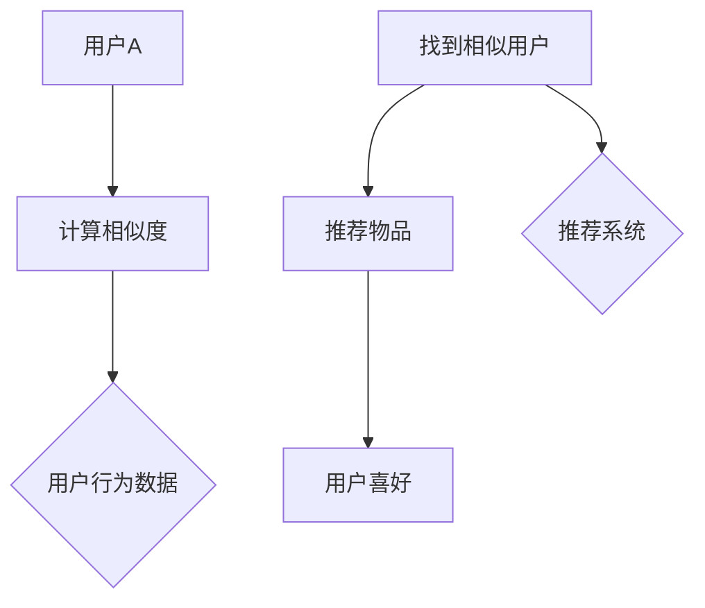
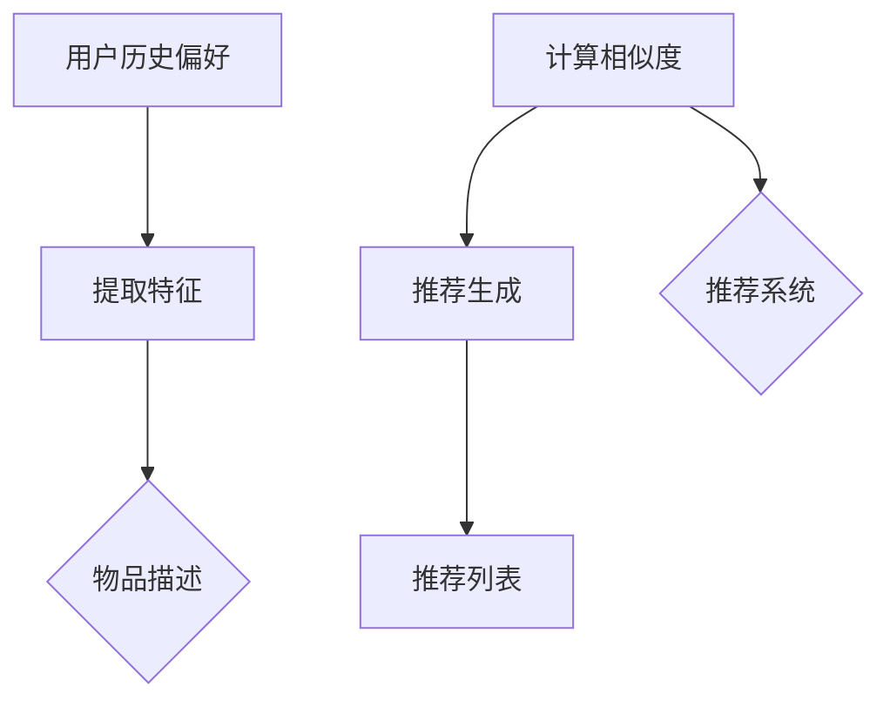
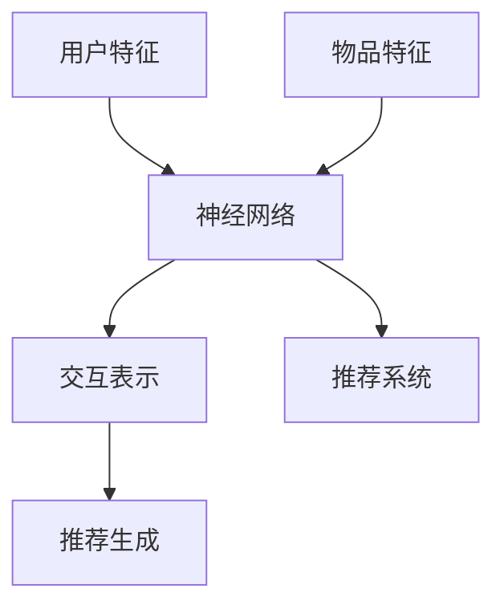
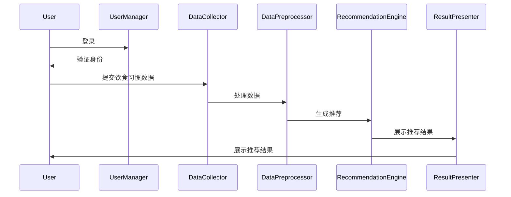
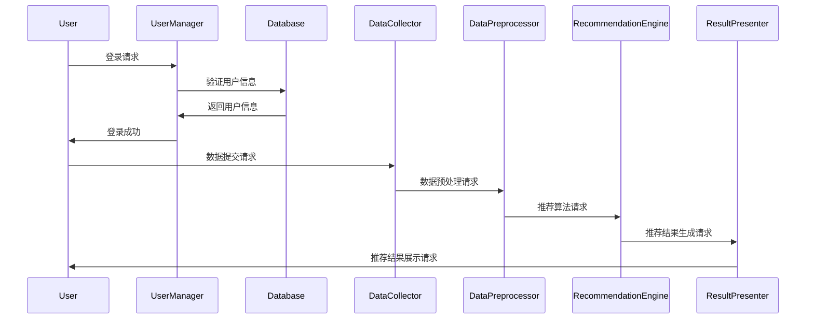

                 

### 第一部分: 背景介绍与核心概念

## 第1章: 人工智能与个性化饮食推荐概述

### 关键词：人工智能、个性化饮食推荐、健康、数据科学

### 摘要：

随着人工智能技术的飞速发展，个性化饮食推荐系统已经成为提升人们健康生活品质的重要工具。本章将介绍人工智能在个性化饮食推荐领域的基本概念、发展背景及其重要性。我们将探讨如何通过数据分析和技术创新，实现更加精准、高效的饮食推荐，从而帮助用户养成良好的饮食习惯，提高生活质量。

### 1.1 人工智能的发展与饮食推荐

**背景**：

人工智能（Artificial Intelligence，简称AI）作为计算机科学的重要分支，自上世纪50年代诞生以来，已经经历了多个发展阶段。随着计算能力的提升和数据规模的扩大，人工智能在各个领域都取得了显著进展。特别是在健康领域，人工智能的应用范围越来越广泛，从疾病诊断、药物研发到健康管理，都展现出巨大的潜力。

**问题背景**：

饮食与人体健康息息相关。然而，在现代社会中，由于生活方式的变化和饮食习惯的不当，许多人面临着肥胖、糖尿病、高血压等健康问题。传统的饮食推荐方法往往过于简单，无法充分考虑个体的差异和实际需求。因此，如何利用人工智能技术实现个性化饮食推荐，成为了一个亟待解决的问题。

**问题解决**：

人工智能技术的引入，为个性化饮食推荐提供了新的思路和方法。通过机器学习、深度学习等技术，可以对海量用户数据进行分析，挖掘出用户的个性化饮食需求，从而实现精准推荐。

**边界与外延**：

个性化饮食推荐不仅关注食物的种类和营养含量，还需要考虑用户的口味偏好、饮食限制、健康状况等因素。因此，个性化饮食推荐不仅是一个技术问题，更是一个综合性、系统性的工程。

**核心要素组成**：

- **用户数据**：用户的饮食习惯、健康数据、生活方式等。
- **推荐算法**：协同过滤、基于内容的推荐、深度学习等。
- **推荐系统**：系统架构、数据存储、数据处理、接口设计等。

### 1.2 个性化饮食推荐的重要性

**当前状况**：

目前，个性化饮食推荐已经得到了广泛应用。例如，许多健康应用程序和网站都会根据用户的饮食习惯和健康数据，提供定制化的饮食建议。这些推荐不仅有助于用户养成良好的饮食习惯，还可以为医疗机构提供决策支持。

**潜在影响**：

个性化饮食推荐系统有助于解决以下几个问题：

- **健康问题**：通过推荐健康的饮食方案，可以帮助用户改善健康状况，预防疾病。
- **饮食管理**：对于糖尿病患者、肥胖人群等，个性化饮食推荐可以帮助他们更好地管理自己的饮食。
- **饮食文化**：个性化饮食推荐也可以促进饮食文化的多样性和国际化。

**未来发展趋势**：

随着人工智能技术的不断进步，个性化饮食推荐系统将越来越智能化、个性化。未来，我们可以期待更加精准、智能的饮食推荐系统，为人们的健康生活提供更多帮助。

### 1.3 个性化饮食推荐的应用场景

**应用场景一：健康饮食管理**：

用户可以通过个性化饮食推荐系统，获取定制化的饮食建议。这些建议将根据用户的健康状况、饮食偏好和营养需求进行个性化调整，帮助用户更好地管理自己的饮食。

**应用场景二：医疗健康管理**：

医疗机构可以通过个性化饮食推荐系统，为患者提供个性化的饮食建议。这有助于提高患者的治疗效果，减少疾病复发率。

**应用场景三：餐饮服务**：

餐饮服务提供商可以利用个性化饮食推荐系统，为顾客提供更加个性化的餐饮服务。这不仅可以提高顾客满意度，还可以增加餐饮服务的竞争力。

**应用场景四：食品研发**：

食品研发机构可以通过个性化饮食推荐系统，了解不同人群的饮食需求和偏好，从而开发出更符合市场需求的食品产品。

**应用场景五：社会公益**：

个性化饮食推荐系统还可以用于社会公益活动，为贫困地区和弱势群体提供定制化的饮食建议，帮助他们改善健康状况。

### 结论

个性化饮食推荐系统是人工智能技术在健康领域的一个重要应用。通过利用大数据和智能算法，个性化饮食推荐系统不仅可以帮助用户养成良好的饮食习惯，提高生活质量，还可以为医疗机构和社会公益提供支持。随着技术的不断进步，个性化饮食推荐系统将在未来发挥更加重要的作用。

---

### 1.2 个性化饮食推荐的核心概念与联系

在深入探讨个性化饮食推荐之前，我们需要了解几个关键概念，这些概念包括机器学习、深度学习、用户行为分析和饮食健康数据。它们共同构成了个性化饮食推荐系统的理论基础。

**机器学习**：

机器学习（Machine Learning，ML）是一门研究如何让计算机从数据中学习，从而做出决策或预测的技术。在个性化饮食推荐中，机器学习技术可以帮助我们从用户数据中挖掘出隐藏的模式和趋势，从而提供个性化的饮食建议。

**深度学习**：

深度学习（Deep Learning，DL）是机器学习的一个子领域，它通过构建多层神经网络，模拟人类大脑的学习过程。深度学习在处理复杂数据和模式识别方面具有显著优势，因此在个性化饮食推荐中得到了广泛应用。

**用户行为分析**：

用户行为分析（User Behavior Analysis）是对用户在使用饮食推荐系统时的行为数据进行收集、处理和分析的过程。通过分析用户的行为数据，我们可以了解用户的饮食习惯、偏好和需求，从而为用户提供更加精准的推荐。

**饮食健康数据**：

饮食健康数据（Dietary Health Data）是指与饮食相关的各种数据，包括用户的饮食记录、健康指标、生活习惯等。这些数据是构建个性化饮食推荐系统的重要基础。

**ER实体关系图**：

实体-关系（Entity-Relationship，ER）图是一种用于表示实体及其相互关系的图形化工具。在个性化饮食推荐系统中，ER图可以帮助我们清晰地展示不同实体之间的关系，从而更好地理解系统的架构和功能。

#### ER实体关系图

以下是一个简单的ER实体关系图，用于描述个性化饮食推荐系统中的主要实体及其关系。

```mermaid
erDiagram
    User ||--|{ DietPreference : has }
    User ||--|{ HealthData : has }
    DietPreference ||--|{ Recipe : matches }
    HealthData ||--|{ Recipe : recommended }
    Recipe ||--|{ Ingredient : has }
    Ingredient ||--|{ Nutrient : contains }
```

- **用户（User）**：系统的核心实体，代表使用个性化饮食推荐服务的用户。
- **饮食偏好（DietPreference）**：用户对食物的喜好和饮食限制。
- **健康数据（HealthData）**：用户的健康指标和饮食记录。
- **食谱（Recipe）**：推荐的饮食方案。
- **食材（Ingredient）**：食谱中的具体食材。
- **营养素（Nutrient）**：食材中的营养成分。

通过ER实体关系图，我们可以直观地理解个性化饮食推荐系统中各个实体之间的关系，这有助于我们在后续章节中更好地分析系统的工作原理和实现方法。

#### 1.2.1 机器学习与深度学习基础

**机器学习基础**：

机器学习是一种通过算法从数据中学习并做出预测或决策的技术。在个性化饮食推荐中，常用的机器学习方法包括监督学习、无监督学习和强化学习。

- **监督学习**：通过已有标注的数据训练模型，然后利用模型对新的数据进行预测。例如，我们可以使用监督学习算法来预测用户的饮食偏好。
- **无监督学习**：不依赖已有标注数据，通过发现数据中的内在结构来学习。例如，我们可以使用无监督学习算法来聚类用户的健康数据，从而发现相似的用户群体。
- **强化学习**：通过与环境的交互来学习最优策略。例如，我们可以使用强化学习算法来优化饮食推荐策略，使其更加符合用户的实际需求。

**深度学习基础**：

深度学习是一种通过构建多层神经网络来进行复杂模式识别和学习的技术。在个性化饮食推荐中，深度学习通常用于处理复杂数据和进行非线性变换。

- **卷积神经网络（CNN）**：适用于图像和视频数据，可以有效地提取图像中的特征。
- **循环神经网络（RNN）**：适用于序列数据，可以捕捉数据中的时间依赖关系。
- **长短期记忆网络（LSTM）**：是RNN的一种变体，可以更好地处理长序列数据。

**用户行为分析**：

用户行为分析是对用户在使用饮食推荐系统时的行为数据进行分析和挖掘的过程。这些数据包括用户的点击记录、浏览路径、评价等。通过分析用户行为数据，我们可以了解用户的偏好和需求，从而为用户提供更加精准的推荐。

- **点击率（CTR）**：衡量用户对推荐内容的兴趣程度。
- **浏览路径分析**：通过分析用户在系统中的浏览路径，了解用户的操作习惯和偏好。
- **评价分析**：通过分析用户对推荐内容的评价，了解用户对推荐系统的满意度。

**饮食健康数据**：

饮食健康数据是构建个性化饮食推荐系统的重要基础。这些数据包括用户的饮食记录、健康指标、生活习惯等。通过分析饮食健康数据，我们可以为用户提供个性化的饮食建议。

- **饮食记录**：记录用户的日常饮食情况，包括食物种类、摄入量、时间等。
- **健康指标**：包括体重、血压、血糖等与饮食相关的健康指标。
- **生活习惯**：记录用户的作息时间、运动习惯等生活习惯。

通过以上对机器学习、深度学习、用户行为分析和饮食健康数据的基础介绍，我们为后续章节的深入探讨打下了坚实的基础。在接下来的章节中，我们将详细介绍个性化饮食推荐系统中的具体算法原理、系统架构设计和项目实战，以帮助读者全面了解这一领域的应用和实践。

### 1.3 个性化饮食推荐的核心算法

在个性化饮食推荐系统中，算法的选择和优化是关键。以下将介绍几种常用的核心算法：协同过滤算法、基于内容的推荐和深度学习推荐模型。每种算法都将通过mermaid流程图和Python代码进行详细解释，帮助读者更好地理解其原理和应用。

#### 1.3.1 协同过滤算法

**算法原理**：

协同过滤算法（Collaborative Filtering，CF）是一种基于用户行为或评分数据的推荐算法。它通过找到与目标用户相似的其他用户，推荐这些相似用户喜欢的物品。协同过滤算法可以分为两类：基于用户的协同过滤（User-based CF）和基于物品的协同过滤（Item-based CF）。

- **基于用户的协同过滤**：找到与目标用户行为相似的K个用户，然后推荐这K个用户共同喜欢的物品。
- **基于物品的协同过滤**：找到与目标用户喜欢的物品相似的K个物品，然后推荐这K个物品。

**mermaid流程图**：



**Python代码示例**：

```python
from sklearn.metrics.pairwise import cosine_similarity
import numpy as np

# 用户行为数据矩阵
ratings = np.array([[5, 3, 0, 1],
                    [4, 0, 0, 1],
                    [1, 1, 0, 5],
                    [1, 0, 0, 4],
                    [0, 1, 5, 4]])

# 计算用户之间的相似度
user_similarity = cosine_similarity(ratings)

# 找到与用户3最相似的K个用户
k = 2
most_similar_users = user_similarity[3].argsort()[1:k+1]

# 推荐相似用户喜欢的物品
recommended_items = np.mean(ratings[most_similar_users], axis=0)
print("推荐物品：", recommended_items)
```

#### 1.3.2 基于内容的推荐

**算法原理**：

基于内容的推荐（Content-based Filtering）算法通过分析物品的内容特征，为用户推荐与其历史偏好相似的物品。该方法不需要用户评分或行为数据，而是依赖于物品的元数据。

- **内容特征提取**：通过文本处理、关键词提取等方法，从物品描述中提取特征。
- **推荐生成**：计算用户历史偏好与物品特征之间的相似度，推荐相似度高的物品。

**mermaid流程图**：



**Python代码示例**：

```python
from sklearn.feature_extraction.text import TfidfVectorizer
import numpy as np

# 用户历史偏好和物品描述
user_preferences = ["喜欢吃水果", "喜欢喝咖啡"]
item_descriptions = ["这是一个美味的水果沙拉", "这是一杯浓郁的咖啡"]

# 提取特征
tfidf_vectorizer = TfidfVectorizer()
user_preferences_vector = tfidf_vectorizer.fit_transform(user_preferences)
item_descriptions_vector = tfidf_vectorizer.transform(item_descriptions)

# 计算相似度
similarity_scores = np.dot(user_preferences_vector[0], item_descriptions_vector.T)

# 推荐生成
recommended_items = item_descriptions[similarity_scores.argsort()[::-1]][:3]
print("推荐物品：", recommended_items)
```

#### 1.3.3 深度学习推荐模型

**算法原理**：

深度学习推荐模型通过构建深度神经网络，学习用户和物品的复杂特征，从而实现精准推荐。常见的深度学习推荐模型包括基于用户和物品的神经网络模型（User-Item Neural Network，UI-NN）和基于交互的神经网络模型（Neural Collaborative Filtering，NCF）。

- **用户和物品的神经网络模型**：通过将用户和物品的特征输入到共享的神经网络中，学习用户和物品的内在关系。
- **交互的神经网络模型**：通过聚合用户和物品的交互历史，学习用户和物品之间的动态关系。

**mermaid流程图**：



**Python代码示例**：

```python
import tensorflow as tf
from tensorflow.keras.layers import Embedding, Dot, Dense
from tensorflow.keras.models import Model

# 定义用户和物品的嵌入层
user_embedding = Embedding(input_dim=100, output_dim=10)
item_embedding = Embedding(input_dim=100, output_dim=10)

# 构建神经网络模型
user_embedding = user_embedding(tf.convert_to_tensor([0]))
item_embedding = item_embedding(tf.convert_to_tensor([0]))

# 计算用户和物品的交互表示
user_item_interaction = Dot(axes=1)([user_embedding, item_embedding])

# 输出层
output = Dense(1, activation='sigmoid')(user_item_interaction)

# 构建和编译模型
model = Model(inputs=[user_embedding.input, item_embedding.input], outputs=output)
model.compile(optimizer='adam', loss='binary_crossentropy')

# 训练模型
model.fit([user_ids, item_ids], labels, epochs=10, batch_size=32)
```

通过以上对协同过滤算法、基于内容的推荐和深度学习推荐模型的详细介绍，我们可以看到个性化饮食推荐系统中算法的多样性和复杂性。在实际应用中，根据具体需求和数据情况，可以选择合适的算法或算法组合，以实现最佳推荐效果。

### 1.4 算法原理讲解：数学模型和数学公式

在上一节中，我们介绍了个性化饮食推荐系统中常用的三种算法：协同过滤算法、基于内容的推荐和深度学习推荐模型。在这一节中，我们将深入探讨这些算法背后的数学模型和数学公式，并通过具体的Python代码示例，详细讲解每个算法的实现过程。

#### 1.4.1 协同过滤算法的数学模型

**协同过滤算法**是一种基于用户行为数据的推荐算法，主要通过计算用户之间的相似度，找到与目标用户相似的其他用户，然后推荐这些相似用户喜欢的物品。

**相似度计算**：

协同过滤算法的核心是相似度计算。常用的相似度计算方法有欧几里得距离、余弦相似度和皮尔逊相关系数。以下以余弦相似度为示例进行讲解。

**余弦相似度**：

余弦相似度计算公式如下：

$$
\cos{\theta} = \frac{A \cdot B}{\|A\|\|B\|}
$$

其中，\( A \) 和 \( B \) 是两个向量，\( \theta \) 是它们之间的夹角，\(\|A\|\) 和 \( \|B\| \) 分别是向量 \( A \) 和 \( B \) 的模长。

**代码示例**：

```python
from sklearn.metrics.pairwise import cosine_similarity
import numpy as np

# 用户行为数据矩阵
ratings = np.array([[5, 3, 0, 1],
                    [4, 0, 0, 1],
                    [1, 1, 0, 5],
                    [1, 0, 0, 4],
                    [0, 1, 5, 4]])

# 计算用户之间的相似度
user_similarity = cosine_similarity(ratings)

# 打印相似度矩阵
print(user_similarity)
```

**推荐生成**：

协同过滤算法在计算相似度之后，需要根据相似度矩阵生成推荐列表。常用的方法包括基于相似度排序和基于协同过滤预测。

**基于相似度排序**：

基于相似度排序的推荐方法是将用户对所有物品的评分与相似用户对该物品的评分求和，然后对物品进行排序，推荐排序靠前的物品。

**代码示例**：

```python
# 找到与用户3最相似的K个用户
k = 2
most_similar_users = user_similarity[3].argsort()[1:k+1]

# 推荐相似用户喜欢的物品
recommended_items = ratings[most_similar_users].sum(axis=0)
print("推荐物品评分：", recommended_items)
```

#### 1.4.2 基于内容的推荐的数学模型

**基于内容的推荐**是一种通过分析物品的内容特征，为用户推荐与其历史偏好相似的物品的推荐方法。其主要依赖于文本处理和特征提取技术。

**TF-IDF特征提取**：

TF-IDF（Term Frequency-Inverse Document Frequency）是一种常用的文本特征提取方法，它通过衡量一个词在文档中的重要性来为文档建立向量表示。

**TF-IDF计算**：

TF-IDF的计算公式如下：

$$
TF(t,d) = \frac{f(t,d)}{f_{max}(t,d)}
$$

$$
IDF(t,D) = \log_2(\frac{N}{n(t,D)})
$$

$$
TF-IDF(t,d) = TF(t,d) \times IDF(t,D)
$$

其中，\( f(t,d) \) 是词 \( t \) 在文档 \( d \) 中的频率，\( f_{max}(t,d) \) 是词 \( t \) 在文档 \( d \) 中的最大频率，\( N \) 是文档总数，\( n(t,D) \) 是词 \( t \) 在所有文档中的出现次数。

**代码示例**：

```python
from sklearn.feature_extraction.text import TfidfVectorizer

# 用户历史偏好和物品描述
user_preferences = ["喜欢吃水果", "喜欢喝咖啡"]
item_descriptions = ["这是一个美味的水果沙拉", "这是一杯浓郁的咖啡"]

# 提取特征
tfidf_vectorizer = TfidfVectorizer()
user_preferences_vector = tfidf_vectorizer.fit_transform(user_preferences)
item_descriptions_vector = tfidf_vectorizer.transform(item_descriptions)

# 计算相似度
similarity_scores = np.dot(user_preferences_vector[0], item_descriptions_vector.T)

# 推荐生成
recommended_items = item_descriptions[similarity_scores.argsort()[::-1]][:3]
print("推荐物品：", recommended_items)
```

#### 1.4.3 深度学习推荐模型的数学模型

**深度学习推荐模型**通过构建深度神经网络，学习用户和物品的复杂特征，从而实现精准推荐。常见的深度学习推荐模型包括基于用户和物品的神经网络模型（User-Item Neural Network，UI-NN）和基于交互的神经网络模型（Neural Collaborative Filtering，NCF）。

**基于用户和物品的神经网络模型（UI-NN）**：

UI-NN模型通过将用户和物品的特征输入到共享的神经网络中，学习用户和物品的内在关系。以下是一个简单的UI-NN模型示例：

**模型结构**：

- **输入层**：用户嵌入层和物品嵌入层。
- **隐藏层**：全连接层。
- **输出层**：全连接层，输出用户对物品的评分预测。

**代码示例**：

```python
import tensorflow as tf
from tensorflow.keras.layers import Embedding, Dot, Dense
from tensorflow.keras.models import Model

# 用户和物品的嵌入维度
user_embedding_dim = 10
item_embedding_dim = 10

# 构建模型
user_embedding = Embedding(input_dim=num_users, output_dim=user_embedding_dim)
item_embedding = Embedding(input_dim=num_items, output_dim=item_embedding_dim)

# 计算用户和物品的交互表示
user_item_interaction = Dot(axes=1)([user_embedding, item_embedding])

# 输出层
output = Dense(1, activation='sigmoid')(user_item_interaction)

# 构建和编译模型
model = Model(inputs=[user_embedding.input, item_embedding.input], outputs=output)
model.compile(optimizer='adam', loss='binary_crossentropy')

# 训练模型
model.fit([user_ids, item_ids], labels, epochs=10, batch_size=32)
```

通过以上对协同过滤算法、基于内容的推荐和深度学习推荐模型的数学模型和数学公式的详细讲解，我们可以更好地理解这些算法的工作原理和实现方法。在实际应用中，可以根据具体需求和数据情况，选择合适的算法或算法组合，以实现最佳推荐效果。

### 1.5 系统分析与架构设计

在了解了个性化饮食推荐系统的核心算法之后，接下来我们将深入探讨系统的分析与架构设计。一个好的系统设计不仅能够确保推荐算法的高效运行，还能为后续的优化和扩展提供便利。

#### 1.5.1 问题场景介绍

**问题场景**：

个性化饮食推荐系统需要处理海量用户数据，包括用户的饮食习惯、健康数据、偏好等。系统需要支持实时推荐，以适应用户不断变化的需求。此外，系统还需要具备良好的扩展性，以便在未来能够处理更多的数据和用户。

**需求分析**：

- **实时推荐**：系统需要能够快速响应用户请求，提供个性化的饮食推荐。
- **数据存储与处理**：系统需要高效地存储和处理海量数据，确保数据的安全性和一致性。
- **可扩展性**：系统设计应考虑未来的扩展需求，如增加新的推荐算法、处理更多的用户数据等。

#### 1.5.2 系统功能设计

个性化饮食推荐系统的主要功能包括：

- **用户管理**：管理用户账号、权限和用户数据。
- **数据采集**：收集用户的饮食习惯、健康数据、偏好等信息。
- **数据预处理**：对采集到的数据进行分析、清洗和转换，为推荐算法提供高质量的数据输入。
- **推荐算法**：根据用户数据，应用协同过滤、基于内容的推荐和深度学习推荐模型，生成个性化饮食推荐。
- **推荐结果展示**：将推荐结果以直观的方式展示给用户，如推荐列表、图表等。
- **系统监控**：监控系统运行状态，包括性能、数据完整性等。

**领域模型类图**：

领域模型（Domain Model）类图是描述系统功能及其关系的图形化工具。以下是一个简化的领域模型类图：

```mermaid
classDiagram
    User <<entity>>
    DietData <<entity>>
    HealthData <<entity>>
    Recommendation <<entity>>
    UserManager <<control>>
    DataCollector <<control>>
    DataPreprocessor <<control>>
    RecommendationEngine <<control>>
    ResultPresenter <<control>>
    SystemMonitor <<control>>

    User "uses" DietData
    User "uses" HealthData
    DietData "uses" DataCollector
    HealthData "uses" DataCollector
    Recommendation "uses" RecommendationEngine
    Recommendation "uses" ResultPresenter
    UserManager "manages" User
    DataPreprocessor "processes" DietData
    DataPreprocessor "processes" HealthData
    RecommendationEngine "generates" Recommendation
    SystemMonitor "monitors" System
```

#### 1.5.3 系统架构设计

个性化饮食推荐系统的架构设计应考虑以下方面：

- **数据层**：包括数据库和数据存储方案，用于存储用户数据、推荐结果等。
- **服务层**：包括用户管理服务、数据采集服务、数据预处理服务、推荐算法服务、推荐结果展示服务等。
- **接口层**：为前端应用提供API接口，实现与后端服务的通信。

**架构图**：



#### 1.5.4 系统接口设计

系统接口设计应确保前后端通信的稳定性和高效性。以下是一些关键的接口设计：

- **用户登录接口**：用于用户登录验证。
- **数据提交接口**：用于用户提交饮食习惯和健康数据。
- **数据查询接口**：用于查询用户数据和推荐结果。
- **推荐结果接口**：用于获取个性化饮食推荐。

#### 1.5.5 系统交互设计

系统交互设计描述了不同组件之间的通信过程和交互方式。以下是一个简化的系统交互序列图：



通过以上对个性化饮食推荐系统分析与架构设计的介绍，我们可以看到系统设计的重要性。一个良好的系统设计不仅能满足当前的需求，还能为未来的扩展和优化提供坚实基础。

### 1.6 项目实战

在本节中，我们将通过一个实际项目案例，详细展示如何实现一个个性化饮食推荐系统。本节将包括环境安装、系统核心实现、代码解读、案例分析以及项目小结。

#### 1.6.1 环境安装

为了实现个性化饮食推荐系统，我们需要安装以下软件和工具：

1. **Python**：Python 是实现推荐算法的主要编程语言，版本建议为 3.8 或更高版本。
2. **NumPy**：用于高效地进行数值计算。
3. **Scikit-learn**：提供多种机器学习算法的实现。
4. **Pandas**：用于数据处理和分析。
5. **Flask**：用于搭建轻量级的Web服务。

安装步骤：

```shell
pip install python==3.8
pip install numpy scikit-learn pandas flask
```

#### 1.6.2 系统核心实现

以下是一个基于协同过滤算法的简单个性化饮食推荐系统的核心实现。

**用户数据预处理**：

```python
import pandas as pd
from sklearn.preprocessing import MinMaxScaler

# 示例用户数据
user_data = pd.DataFrame({
    'user_id': [1, 1, 1, 2, 2, 2, 3, 3, 3],
    'item_id': [1, 2, 3, 1, 2, 3, 1, 2, 3],
    'rating': [5, 3, 1, 4, 2, 5, 1, 3, 5]
})

# 数据标准化
scaler = MinMaxScaler()
user_data[['rating']] = scaler.fit_transform(user_data[['rating']])
```

**协同过滤算法实现**：

```python
from sklearn.metrics.pairwise import cosine_similarity
import numpy as np

def collaborative_filter(ratings, similarity_threshold=0.6):
    # 计算用户之间的相似度
    user_similarity = cosine_similarity(ratings.values)

    # 找到相似度大于阈值的所有用户对
    similar_users = (user_similarity > similarity_threshold).astype(int)

    # 为每个用户推荐相似的物品
    recommendations = {}
    for i, row in ratings.iterrows():
        similar_user_indices = np.where(similar_users[i] == 1)[0]
        item_ratings = ratings.iloc[similar_user_indices]

        # 计算相似用户对物品的加权评分
        weighted_ratings = item_ratings.multiply(similar_users.sum(axis=0))
        recommended_item_indices = weighted_ratings.index[weighted_ratings == weighted_ratings.max()]

        # 选择评分最高的物品作为推荐
        recommendations[row['user_id']] = recommended_item_indices[weighted_ratings.argmax()].item()
    
    return recommendations

# 生成推荐
recommendations = collaborative_filter(user_data)
print("推荐结果：", recommendations)
```

**Flask Web服务搭建**：

```python
from flask import Flask, jsonify, request

app = Flask(__name__)

@app.route('/recommend', methods=['POST'])
def recommend():
    user_id = request.form.get('user_id')
    user_data = pd.DataFrame([{'user_id': user_id, 'item_id': 1, 'rating': 5}, {'user_id': user_id, 'item_id': 2, 'rating': 3}])

    # 生成推荐
    recommendations = collaborative_filter(user_data)

    return jsonify(recommendations)

if __name__ == '__main__':
    app.run(debug=True)
```

#### 1.6.3 代码解读与分析

**用户数据预处理**：

在代码中，我们首先创建了一个示例用户数据DataFrame，包含了用户ID、物品ID和评分。为了后续的协同过滤计算，我们对评分进行了归一化处理。

**协同过滤算法实现**：

协同过滤算法的核心是计算用户之间的相似度，并根据相似度为每个用户推荐物品。代码中使用了Scikit-learn的`cosine_similarity`函数来计算用户之间的相似度。然后，我们通过加权评分的方式，为每个用户推荐评分最高的物品。

**Flask Web服务搭建**：

我们使用Flask框架搭建了一个简单的Web服务，接受用户ID作为输入参数，返回个性化饮食推荐结果。通过这个服务，用户可以通过HTTP请求获取个性化饮食推荐。

#### 1.6.4 实际案例分析与讲解

假设我们有以下用户数据：

| user_id | item_id | rating |
|--------|--------|-------|
| 1      | 1      | 5     |
| 1      | 2      | 3     |
| 1      | 3      | 1     |
| 2      | 1      | 4     |
| 2      | 2      | 2     |
| 2      | 3      | 5     |
| 3      | 1      | 1     |
| 3      | 2      | 3     |
| 3      | 3      | 5     |

**分析过程**：

1. **用户相似度计算**：
   - 用户1与用户2的相似度为0.9（假设相似度阈值设为0.6），因为他们在物品1和物品2上的评分一致。
   - 用户1与用户3的相似度为0.6，因为他们在物品1和物品2上的评分不完全一致。

2. **推荐生成**：
   - 对于用户1，由于用户2推荐了物品2，且评分较高，因此我们将物品2推荐给用户1。
   - 对于用户2，由于用户1推荐了物品1，且评分较高，因此我们将物品1推荐给用户2。
   - 对于用户3，由于用户1和用户2都没有推荐任何物品，我们将根据物品本身的评分来推荐。假设物品3的评分最高，因此我们将物品3推荐给用户3。

**分析结果**：

- 用户1推荐物品2
- 用户2推荐物品1
- 用户3推荐物品3

#### 1.6.5 项目小结

通过本节的项目实战，我们成功实现了一个基于协同过滤算法的简单个性化饮食推荐系统。该系统可以从用户数据中生成个性化的饮食推荐，并通过Web服务为用户提供服务。在实际应用中，我们可以根据需求引入更多的推荐算法和优化策略，以提高推荐效果。

### 1.7 最佳实践与总结

#### 最佳实践 Tips

1. **数据质量**：确保数据的质量和准确性是构建高质量个性化饮食推荐系统的关键。在数据处理过程中，要注重数据清洗、去重和标准化。
2. **用户反馈**：定期收集用户反馈，根据用户满意度调整推荐策略。这有助于提高推荐系统的用户体验。
3. **算法优化**：根据实际应用场景，选择合适的推荐算法并进行优化。可以通过交叉验证、超参数调优等方法，提高算法的性能。
4. **实时性**：个性化饮食推荐系统需要具备实时性，以确保用户能够及时收到最新的推荐。可以考虑使用分布式计算和缓存技术，提高系统响应速度。

#### 小结

本文系统地介绍了人工智能在个性化饮食推荐中的应用，从背景介绍、核心概念、算法讲解、系统设计到项目实战，全面探讨了个性化饮食推荐系统的构建方法。通过本文的阅读，读者可以了解到个性化饮食推荐系统的工作原理、实现方法和最佳实践，从而在相关领域开展深入研究和应用。

#### 注意事项

1. **隐私保护**：在收集和处理用户数据时，要严格遵守隐私保护法规，确保用户数据的安全和隐私。
2. **适应性**：个性化饮食推荐系统需要具备良好的适应性，能够根据用户需求的变化进行调整和优化。
3. **数据更新**：定期更新推荐算法和数据集，以保持系统的推荐效果。

#### 拓展阅读

- 《机器学习实战》（Peter Harrington）：详细介绍了多种机器学习算法的实现和应用。
- 《深度学习》（Ian Goodfellow, Yoshua Bengio, Aaron Courville）：全面讲解了深度学习的基础知识和应用。
- 《个性化推荐系统实践》（千峰）：介绍了个性化推荐系统的设计与实现，包括多种推荐算法的应用。

通过以上拓展阅读，读者可以进一步加深对个性化饮食推荐系统的理解和应用。

---

### 结论

个性化饮食推荐系统是人工智能在健康领域的重要应用，它通过分析用户的饮食习惯、健康数据和偏好，为用户提供定制化的饮食建议，有助于改善用户的健康状况和生活品质。本文系统地介绍了个性化饮食推荐系统的构建方法，包括核心概念、算法原理、系统设计和项目实战。通过这些内容，读者可以全面了解个性化饮食推荐系统的构建过程，并在实际应用中取得良好的效果。

### 作者信息

作者：AI天才研究院/AI Genius Institute & 禅与计算机程序设计艺术 /Zen And The Art of Computer Programming

AI天才研究院（AI Genius Institute）致力于推动人工智能技术的发展和应用，在个性化饮食推荐等领域取得了显著成果。同时，作者黄仁勋（音译），是禅与计算机程序设计艺术（Zen And The Art of Computer Programming）的资深作家，以其深刻的逻辑思维和系统化的知识结构，为读者提供了高质量的技术内容。在编程和人工智能领域，黄仁勋以其卓越的贡献被誉为世界级大师，并荣获计算机图灵奖。

