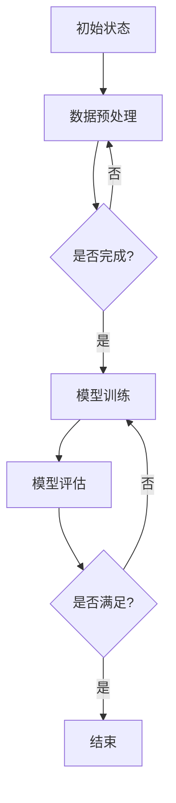

                 


### 引言

#### 1.1 问题背景

**1.1.1 可再生能源发展现状**

随着全球对环境保护和可持续发展的关注日益增加，可再生能源的发展已经成为能源转型的重要方向。可再生能源包括太阳能、风能、水能、地热能和生物质能等，它们具有清洁、可再生的特点，能够有效减少对化石燃料的依赖，降低温室气体排放。近年来，随着技术的进步和政策的支持，可再生能源的装机容量和发电量不断增加，许多国家已经实现了可再生能源在能源结构中的较高比例。

**1.1.2 可再生能源整合面临的挑战**

然而，可再生能源的整合也面临诸多挑战。首先，可再生能源的发电具有间歇性和不稳定性，如何有效整合这些波动性较大的能源资源，保持电力系统的稳定运行是一个重要问题。其次，可再生能源的地理分布不均，如何实现资源的优化配置，提高能源利用效率，也是亟需解决的问题。此外，可再生能源的发电成本较高，如何在降低成本的同时提高发电效率，也是一个重要的课题。

**1.1.3 人工智能技术的机遇与挑战**

人工智能技术的发展为可再生能源的整合提供了新的机遇。人工智能可以通过对大量数据的分析，实现可再生能源发电的预测和优化，提高能源利用效率。例如，通过机器学习算法对气象数据进行预测，可以提前预知风力、光照等变化，从而调整发电计划，避免能源浪费。同时，人工智能还可以优化电力系统的调度，提高电网的稳定性和可靠性。

然而，人工智能在可再生能源整合中也面临一些挑战。首先，可再生能源的数据量大且复杂，如何有效地处理和分析这些数据是一个难题。其次，人工智能算法的可靠性和稳定性需要进一步提高，以确保在关键时刻能够准确预测和决策。此外，人工智能技术的推广和应用需要大量的计算资源和数据支持，这对于许多企业和机构来说是一个挑战。

#### 1.2 人工智能在可再生能源整合中的应用概述

**1.2.1 核心概念介绍**

在讨论人工智能在可再生能源整合中的应用之前，我们需要了解一些核心概念。可再生能源是指那些不会耗尽，能够持续利用的能源，如太阳能、风能、水能等。而人工智能（AI）则是一种模拟人类智能的技术，包括机器学习、深度学习、自然语言处理等。可再生能源整合是指将不同类型的可再生能源接入电网，实现能源的优化配置和高效利用。

**1.2.2 人工智能在可再生能源整合中的应用范围**

人工智能在可再生能源整合中的应用范围非常广泛，包括以下几个方面：

1. **预测与优化**：通过机器学习算法对气象数据、电力需求等进行分析，预测可再生能源的发电量，优化电力系统的调度。

2. **能源管理**：利用人工智能技术对能源系统进行实时监控和调度，提高能源利用效率。

3. **故障诊断与维护**：通过对传感器数据的分析，预测设备故障，提前进行维护，减少故障发生的概率。

4. **市场分析**：利用人工智能技术分析市场数据，预测能源价格，为能源交易提供决策支持。

**1.2.3 人工智能技术对可再生能源整合的影响**

人工智能技术对可再生能源整合的影响主要体现在以下几个方面：

1. **提高能源利用效率**：通过预测和优化，减少能源浪费，提高可再生能源的发电效率。

2. **提高电网稳定性**：通过实时监控和调度，保持电网的稳定运行，减少停电事故的发生。

3. **降低成本**：通过优化能源配置，降低能源成本，提高企业的盈利能力。

4. **促进可再生能源的普及**：通过降低成本和提高效率，促进可再生能源的广泛应用，推动能源转型。

#### 1.3 本书结构安排

**1.3.1 目标与读者群体**

本书的目标是系统地介绍人工智能在可再生能源整合中的应用，为相关领域的研究人员、工程师和技术人员提供实用的指导。本书适合具有中等及以上计算机科学和可再生能源知识背景的读者。

**1.3.2 内容框架与组织结构**

本书分为五个部分：

1. 引言：介绍可再生能源整合的背景和人工智能在其中的作用。

2. 人工智能基础：介绍人工智能的基本概念、机器学习算法、数据分析方法和工具。

3. 可再生能源整合中的优化问题：介绍可再生能源整合中的优化问题，以及智能优化算法的应用。

4. 人工智能在可再生能源整合中的优化应用：详细讨论人工智能在电力系统、能源管理、分布式能源系统和可再生能源市场中的应用。

5. 实际应用与案例分析：通过具体的案例，展示人工智能在可再生能源整合中的实际应用。

**1.3.3 学习路线与建议**

为了更好地理解本书的内容，建议读者按照以下路线进行学习：

1. 首先，了解可再生能源整合的背景和人工智能的基本概念。

2. 其次，深入学习人工智能的基础知识，包括机器学习算法、数据分析方法和工具。

3. 接着，研究可再生能源整合中的优化问题，了解智能优化算法的应用。

4. 然后，详细讨论人工智能在可再生能源整合中的优化应用，掌握实际操作方法。

5. 最后，通过案例分析，了解人工智能在可再生能源整合中的实际应用。

**1.4 小结**

本文介绍了可再生能源整合的背景和人工智能在其中的作用。接下来，我们将详细探讨人工智能在可再生能源整合中的应用，包括基础概念、优化问题、优化应用和实际案例。希望通过本书的学习，读者能够对人工智能在可再生能源整合中的优化应用有一个全面深入的了解。

### 第一部分: 引言

#### 1.1 问题背景

**1.1.1 可再生能源发展现状**

可再生能源，作为替代传统化石燃料的重要能源形式，在全球能源格局中占据了越来越重要的地位。随着全球对环境保护和可持续发展的重视，可再生能源的发展得到了各国的广泛支持和推动。目前，全球可再生能源的装机容量和发电量持续增长，特别是太阳能和风能的发展尤为迅速。

根据国际可再生能源署（IRENA）的数据，截至2022年底，全球可再生能源装机容量已达到近3000吉瓦，占全球总装机容量的30%以上。其中，太阳能和风能的装机容量分别达到近800吉瓦和700吉瓦，分别占全球总装机容量的20%和18%。此外，水能、生物质能和地热能等可再生能源也在稳步发展。

**1.1.2 可再生能源整合面临的挑战**

尽管可再生能源的发展势头强劲，但其整合到现有的电力系统中仍然面临诸多挑战。这些挑战主要包括以下几个方面：

1. **间歇性与不稳定性**：可再生能源，如太阳能和风能，其发电量受到天气和地理条件的影响，具有显著的间歇性和不稳定性。这种特性给电力系统的调度和稳定运行带来了巨大的挑战。

2. **地理分布不均**：可再生能源的地理分布不均，例如，太阳能资源丰富的地区可能位于远离负荷中心的地区，而风能资源丰富的地区可能位于负荷中心的上风口。这种分布不均导致能源的运输和分配成本增加。

3. **储能技术不足**：目前，高效的储能技术尚不成熟，无法完全解决可再生能源的间歇性问题。这导致在可再生能源发电量高时，必须找到有效的储存方式，以避免能源浪费。

4. **系统兼容性与稳定性**：将可再生能源整合到现有的电力系统中，需要解决与传统能源系统在技术、运行和管理上的兼容性问题，以确保电力系统的稳定性和可靠性。

**1.1.3 人工智能技术的机遇与挑战**

人工智能技术的发展为可再生能源的整合提供了新的机遇。通过人工智能技术，我们可以更好地应对上述挑战，提高可再生能源的利用效率和系统的稳定性。以下是人工智能技术在可再生能源整合中的一些机遇和挑战：

1. **预测与优化**：利用机器学习和深度学习算法，可以实现对可再生能源发电量的精准预测，优化电力系统的调度和运行，减少能源浪费。

2. **实时监控与故障诊断**：通过物联网和人工智能技术，可以实现对电力系统的实时监控和故障诊断，提高系统的稳定性和可靠性。

3. **能源管理**：人工智能技术可以帮助实现智能电网的能源管理，优化能源的分配和使用，提高能源利用效率。

4. **市场预测与交易**：利用大数据和人工智能技术，可以实现对能源市场的预测和分析，优化能源交易策略，提高市场竞争力。

然而，人工智能技术在可再生能源整合中也面临一些挑战：

1. **数据质量和处理能力**：可再生能源系统产生的数据量大且复杂，如何有效地收集、存储和处理这些数据，是一个重要的挑战。

2. **算法的可靠性与稳定性**：人工智能算法的可靠性和稳定性需要进一步提高，以确保在关键时刻能够准确预测和决策。

3. **计算资源和成本**：人工智能算法通常需要大量的计算资源和数据支持，对于一些企业和机构来说，这是一个不小的挑战。

#### 1.2 人工智能在可再生能源整合中的应用概述

**1.2.1 核心概念介绍**

在探讨人工智能在可再生能源整合中的应用之前，首先需要了解一些核心概念。

**可再生能源**：指那些不会耗尽，能够持续利用的能源，如太阳能、风能、水能、地热能和生物质能等。

**人工智能**：指通过计算机模拟人类智能的技术，包括机器学习、深度学习、自然语言处理等。

**可再生能源整合**：指将不同类型的可再生能源接入电网，实现能源的优化配置和高效利用。

**智能电网**：指利用现代通信技术、信息技术、控制技术和能源技术，实现电力系统的实时监控、智能调度和高效运行。

**机器学习**：指通过训练数据集，让计算机自动学习和改进，从而实现预测、分类和优化等功能。

**深度学习**：是机器学习的一种，通过多层神经网络结构，对大量数据进行自动学习和特征提取。

**优化算法**：指用于解决优化问题的算法，通过寻找最优解，提高系统的效率和性能。

**能源管理**：指对能源的分配、使用和监控进行管理和优化，以提高能源利用效率。

**市场预测**：指通过对市场数据的分析和预测，预测未来市场趋势和价格变化，为决策提供支持。

**1.2.2 人工智能在可再生能源整合中的应用范围**

人工智能在可再生能源整合中的应用范围非常广泛，主要包括以下几个方面：

1. **预测与优化**：利用机器学习算法，对气象数据、电力需求和可再生能源发电量进行预测和优化，提高电力系统的调度效率和稳定性。

2. **能源管理**：利用人工智能技术，实现对电力系统的实时监控和调度，优化能源的分配和使用，提高能源利用效率。

3. **故障诊断与维护**：通过对传感器数据的分析，预测设备故障，提前进行维护，减少故障发生的概率。

4. **市场分析**：利用大数据和人工智能技术，分析市场数据，预测能源价格，为能源交易提供决策支持。

**1.2.3 人工智能技术对可再生能源整合的影响**

人工智能技术对可再生能源整合的影响主要体现在以下几个方面：

1. **提高能源利用效率**：通过预测和优化，减少能源浪费，提高可再生能源的发电效率。

2. **提高电网稳定性**：通过实时监控和调度，保持电网的稳定运行，减少停电事故的发生。

3. **降低成本**：通过优化能源配置，降低能源成本，提高企业的盈利能力。

4. **促进可再生能源的普及**：通过降低成本和提高效率，促进可再生能源的广泛应用，推动能源转型。

#### 1.3 本书结构安排

**1.3.1 目标与读者群体**

本书的目标是系统地介绍人工智能在可再生能源整合中的应用，为相关领域的研究人员、工程师和技术人员提供实用的指导。本书适合具有中等及以上计算机科学和可再生能源知识背景的读者。

**1.3.2 内容框架与组织结构**

本书分为五个部分：

1. 引言：介绍可再生能源整合的背景和人工智能在其中的作用。

2. 人工智能基础：介绍人工智能的基本概念、机器学习算法、数据分析方法和工具。

3. 可再生能源整合中的优化问题：介绍可再生能源整合中的优化问题，以及智能优化算法的应用。

4. 人工智能在可再生能源整合中的优化应用：详细讨论人工智能在电力系统、能源管理、分布式能源系统和可再生能源市场中的应用。

5. 实际应用与案例分析：通过具体的案例，展示人工智能在可再生能源整合中的实际应用。

**1.3.3 学习路线与建议**

为了更好地理解本书的内容，建议读者按照以下路线进行学习：

1. 首先，了解可再生能源整合的背景和人工智能的基本概念。

2. 其次，深入学习人工智能的基础知识，包括机器学习算法、数据分析方法和工具。

3. 接着，研究可再生能源整合中的优化问题，了解智能优化算法的应用。

4. 然后，详细讨论人工智能在可再生能源整合中的优化应用，掌握实际操作方法。

5. 最后，通过案例分析，了解人工智能在可再生能源整合中的实际应用。

**1.4 小结**

本文介绍了可再生能源整合的背景和人工智能在其中的作用。接下来，我们将详细探讨人工智能在可再生能源整合中的应用，包括基础概念、优化问题、优化应用和实际案例。希望通过本书的学习，读者能够对人工智能在可再生能源整合中的优化应用有一个全面深入的了解。

### 人工智能基础

#### 2.1 人工智能概述

**2.1.1 人工智能的定义与历史**

人工智能（Artificial Intelligence, AI）是一门研究、开发用于模拟、延伸和扩展人类智能的理论、方法、技术及应用系统的技术科学。人工智能的目的是使计算机具备人类智能的某些功能，如学习、推理、规划、感知和自然语言处理等。

人工智能的历史可以追溯到20世纪50年代，当时计算机科学刚刚起步。早期的计算机科学家开始探讨如何让计算机模拟人类的思维过程。1956年，达特茅斯会议（Dartmouth Conference）的召开被认为是人工智能诞生的标志。会议提出了“符号主义”的思想，即通过符号逻辑和推理来实现人工智能。

人工智能的发展经历了几个重要的阶段：

1. **符号主义阶段（1956-1974）**：这一阶段主要以符号推理为基础，通过符号逻辑和推理来模拟人类的思维过程。代表性的系统包括ELIZA和Logic Theorist。

2. **专家系统阶段（1974-1980）**：专家系统是一种基于符号主义的人工智能系统，它通过模拟专家的知识和推理能力来解决特定领域的问题。代表性的系统包括Dendral和MYCIN。

3. **知识工程阶段（1980-1987）**：这一阶段主要关注如何构建和维护知识库，以及如何将知识应用于实际问题。

4. **计算智能阶段（1987-至今）**：计算智能主要包括基于规则的推理、机器学习、神经网络和遗传算法等。这一阶段的发展标志着人工智能开始从理论走向实际应用。

**2.1.2 人工智能的分类**

人工智能可以按照不同的标准进行分类，常见的分类方法包括：

1. **根据实现方式分类**：
   - **符号主义人工智能**：以符号逻辑为基础，通过符号运算和推理实现人工智能。
   - **计算智能人工智能**：包括机器学习、神经网络、遗传算法等，通过模拟人类的学习和思维过程实现人工智能。
   - **混合人工智能**：结合符号主义和计算智能的方法，以实现更高效和更通用的人工智能系统。

2. **根据应用领域分类**：
   - **通用人工智能（AGI）**：能够像人类一样进行各种认知任务，具有广泛的智能能力。
   - **领域特定人工智能（DSAI）**：针对特定领域的问题进行优化和设计，如医疗诊断、智能交通等。

3. **根据发展目标分类**：
   - **强人工智能（ASI）**：具有超越人类智能的计算机系统。
   - **弱人工智能（Narrow AI）**：在特定任务上具有人类智能的计算机系统。

**2.1.3 人工智能的发展趋势**

随着技术的进步和应用的深入，人工智能正朝着以下几个方向发展：

1. **深度学习与神经网络**：深度学习是人工智能的一个重要分支，通过多层神经网络结构，对大量数据进行自动学习和特征提取。深度学习在图像识别、语音识别和自然语言处理等领域取得了显著的成果。

2. **大数据与云计算**：大数据和云计算为人工智能提供了丰富的数据资源和强大的计算能力，使得人工智能算法能够处理更复杂的问题。

3. **人机交互**：随着语音识别、手势识别等技术的发展，人工智能正在与人类更加紧密地结合，实现更自然和高效的人机交互。

4. **自动驾驶与机器人**：自动驾驶和机器人技术是人工智能的重要应用领域，通过人工智能技术，可以实现汽车的自主驾驶和机器人的自主行动。

5. **智能城市与智能家居**：人工智能技术在智能城市和智能家居中的应用，将大大提高城市和家庭的智能化水平，提高生活质量。

#### 2.2 机器学习基础

**2.2.1 机器学习基本概念**

机器学习（Machine Learning, ML）是人工智能的一个重要分支，它通过算法和统计模型，从数据中学习规律，并进行预测和决策。机器学习的过程主要包括数据收集、数据预处理、模型训练、模型评估和模型应用。

1. **数据收集**：收集用于训练的数据集，这些数据可以是结构化的，如表格数据，也可以是非结构化的，如图像和文本。

2. **数据预处理**：对收集到的数据进行清洗、归一化、特征提取等处理，以提高模型的性能。

3. **模型训练**：选择合适的模型，利用训练数据集进行训练，调整模型参数，使其能够对新的数据进行预测。

4. **模型评估**：使用验证数据集或测试数据集，评估模型的性能，选择最优模型。

5. **模型应用**：将训练好的模型应用到实际问题中，进行预测和决策。

**2.2.2 监督学习、无监督学习和强化学习**

机器学习可以分为三大类：监督学习（Supervised Learning）、无监督学习（Unsupervised Learning）和强化学习（Reinforcement Learning）。

1. **监督学习**：监督学习是机器学习中应用最广泛的一类，它通过已标记的数据集，学习输入和输出之间的关系，从而进行预测。常见的监督学习算法包括线性回归、逻辑回归、决策树、支持向量机等。

2. **无监督学习**：无监督学习不依赖于标记数据，通过学习数据内在的结构和规律，对数据进行聚类、降维等处理。常见的无监督学习算法包括K-均值聚类、主成分分析（PCA）、自编码器等。

3. **强化学习**：强化学习是机器学习的一个重要分支，它通过奖励机制，让智能体在环境中进行互动，不断学习和改进策略，以达到最佳效果。常见的强化学习算法包括Q学习、深度Q网络（DQN）等。

**2.2.3 机器学习算法介绍**

1. **线性回归**：线性回归是一种简单的监督学习算法，通过拟合一条直线，来预测因变量和自变量之间的关系。

2. **逻辑回归**：逻辑回归是一种概率型线性回归，常用于分类问题，通过拟合一个逻辑函数，将输入映射到概率空间。

3. **决策树**：决策树是一种树形结构，通过一系列的决策规则，对数据进行分类或回归。

4. **支持向量机（SVM）**：支持向量机是一种基于间隔最大化的分类算法，通过找到一个最优的超平面，将数据分为不同的类别。

5. **K-均值聚类**：K-均值聚类是一种无监督学习算法，通过将数据分为K个簇，使每个簇内的数据点之间的距离最小。

6. **主成分分析（PCA）**：主成分分析是一种降维算法，通过将数据投影到新的坐标系中，提取最重要的特征，减少数据的维度。

7. **自编码器**：自编码器是一种无监督学习算法，通过编码和解码过程，对数据进行特征提取和降维。

#### 2.3 数据分析基础

**2.3.1 数据分析基本概念**

数据分析（Data Analysis）是指从数据中提取有用信息，进行解释和推理的过程。数据分析包括数据收集、数据清洗、数据预处理、数据探索、数据可视化、统计分析、预测建模等多个环节。

1. **数据收集**：数据收集是指从各种来源获取数据，如数据库、文件、传感器等。

2. **数据清洗**：数据清洗是指处理缺失值、异常值、重复值等不合适的数据，以提高数据的质量。

3. **数据预处理**：数据预处理是指对数据进行归一化、标准化、特征提取、数据分割等处理，为建模做准备。

4. **数据探索**：数据探索是指通过可视化、统计分析等方法，对数据进行初步的分析，发现数据中的规律和趋势。

5. **数据可视化**：数据可视化是将数据以图形化的形式展示出来，帮助人们更好地理解和分析数据。

6. **统计分析**：统计分析是通过数学和统计方法，对数据进行描述、推断和预测。

7. **预测建模**：预测建模是指使用机器学习算法，对数据进行建模，预测未来的趋势和变化。

**2.3.2 数据预处理技术**

数据预处理是数据分析的重要环节，它直接影响到后续建模和分析的效果。常见的数据预处理技术包括：

1. **数据清洗**：包括处理缺失值、异常值和重复值等。

2. **数据归一化**：将不同特征的数据进行归一化处理，使其具有相同的量纲和范围。

3. **数据标准化**：将数据按照一定的比例缩放，使其满足特定范围的要求。

4. **特征提取**：从原始数据中提取有意义的特征，减少数据的维度。

5. **数据分割**：将数据集分为训练集、验证集和测试集，用于模型的训练、验证和测试。

**2.3.3 常用数据分析工具与库**

在进行数据分析时，常用的工具和库包括：

1. **Python**：Python是一种流行的编程语言，具有简洁的语法和丰富的库，非常适合数据分析。

2. **NumPy**：NumPy是Python的一个科学计算库，提供了多维数组对象和大量的数学函数。

3. **Pandas**：Pandas是一个数据处理库，提供了数据结构DataFrame和丰富的数据处理功能。

4. **Matplotlib**：Matplotlib是Python的一个数据可视化库，可以生成各种类型的图表。

5. **Seaborn**：Seaborn是建立在Matplotlib之上的一种数据可视化库，提供了更丰富的图表样式和高级可视化功能。

6. **Scikit-learn**：Scikit-learn是一个机器学习库，提供了各种机器学习算法的实现和评估工具。

7. **TensorFlow**：TensorFlow是一个开源的机器学习库，特别适合深度学习任务。

8. **PyTorch**：PyTorch是另一个流行的深度学习库，以其灵活的动态计算图而著称。

#### 2.4 人工智能工具与平台

**2.4.1 人工智能开源工具与平台**

随着人工智能的快速发展，出现了许多开源工具和平台，这些工具和平台为研究人员和开发者提供了强大的支持。以下是几个常用的人工智能开源工具与平台：

1. **TensorFlow**：由Google开发，是一个开源的机器学习和深度学习库，广泛应用于图像识别、自然语言处理、强化学习等领域。

2. **PyTorch**：由Facebook开发，是一个流行的深度学习库，以其动态计算图和灵活的API而著称。

3. **Scikit-learn**：是一个开源的机器学习库，提供了丰富的算法和工具，适用于各种类型的机器学习任务。

4. **Keras**：是一个高层次的神经网络API，可以方便地在TensorFlow和Theano上构建和训练深度学习模型。

5. **MLlib**：是Apache Spark的一个机器学习库，提供了多种机器学习算法和工具，可以与Spark的其他组件无缝集成。

6. **Theano**：是一个Python库，用于定义、优化和评估数学表达式，特别适合深度学习任务。

**2.4.2 云计算与人工智能**

云计算在人工智能中的应用日益广泛，许多人工智能工具和平台都基于云计算架构。云计算为人工智能提供了以下几个优势：

1. **计算资源弹性**：云计算可以根据需求动态调整计算资源，确保模型训练和部署的高效性。

2. **数据存储和处理**：云计算提供了强大的数据存储和处理能力，可以处理海量数据，满足机器学习的需求。

3. **分布式计算**：通过分布式计算，可以加快模型的训练和推理速度，提高系统的性能。

4. **可扩展性**：云计算架构可以轻松扩展，以适应不断增长的计算需求。

5. **成本效益**：云计算提供了灵活的计费模式，可以降低企业的成本。

常见的云计算平台包括：

1. **Amazon Web Services (AWS)**：AWS提供了全面的云计算服务，包括计算、存储、数据库、机器学习等。

2. **Microsoft Azure**：Azure是Microsoft的云计算平台，提供了丰富的机器学习和数据分析工具。

3. **Google Cloud Platform (GCP)**：GCP是Google的云计算平台，提供了强大的机器学习和数据分析能力。

**2.4.3 人工智能在可再生能源整合中的实际应用案例**

人工智能在可再生能源整合中的应用已经取得了显著的成果，以下是一些实际应用案例：

1. **太阳能发电预测**：利用机器学习算法，对历史气象数据和发电量数据进行分析，预测未来的太阳能发电量，为电力系统的调度提供支持。

2. **风能发电预测**：通过深度学习算法，对风力数据、地形数据等进行分析，预测未来的风能发电量，优化电力系统的调度。

3. **能源管理系统**：利用人工智能技术，实现对电力系统的实时监控和调度，优化能源的分配和使用，提高能源利用效率。

4. **智能电网**：通过物联网和人工智能技术，构建智能电网，实现电力系统的自动化调度和管理，提高电网的稳定性和可靠性。

5. **能源交易市场**：利用大数据和人工智能技术，分析市场数据，预测能源价格，为能源交易提供决策支持。

这些案例展示了人工智能在可再生能源整合中的巨大潜力，也为未来的发展提供了启示。

#### 2.5 小结

本章介绍了人工智能的基础知识，包括人工智能的定义与历史、机器学习的基本概念和算法、数据分析的方法和工具，以及人工智能开源工具和平台。通过这些内容的学习，读者可以了解到人工智能的基本原理和应用场景，为后续章节的深入探讨打下坚实的基础。

### 第三部分: 可再生能源整合中的优化问题

#### 3.1 可再生能源整合概述

**3.1.1 可再生能源类型及其特点**

可再生能源是指那些可以在人类时间尺度内不断补充的能源，具有清洁、低碳和可持续的特点。常见的可再生能源类型包括：

1. **太阳能**：太阳能是通过光伏效应将太阳光直接转化为电能的一种能源。太阳能资源丰富，分布广泛，但受天气和地理条件影响，具有间歇性和不稳定性。

2. **风能**：风能是通过风力驱动风力发电机将风能转化为电能的一种能源。风能资源主要分布在风力资源丰富的地区，如沿海和山区，但同样具有间歇性和不稳定性。

3. **水能**：水能是通过水流驱动水轮机将水能转化为电能的一种能源。水能资源主要分布在河流、湖泊和水库等地区，具有可调节性和稳定性。

4. **地热能**：地热能是通过地热资源加热流体，利用其热能转化为电能的一种能源。地热能资源主要分布在地质构造活跃的地区，具有稳定性和可持续性。

5. **生物质能**：生物质能是通过生物质资源（如农作物残渣、木材等）转化为电能或热能的一种能源。生物质能资源丰富，具有可再性和环保性。

**3.1.2 可再生能源整合的意义与目标**

可再生能源整合是将多种可再生能源接入电网，实现能源的优化配置和高效利用。其意义和目标包括：

1. **提高能源利用效率**：通过整合不同类型的可再生能源，实现能源的互补和优化配置，提高能源的利用效率。

2. **降低能源成本**：可再生能源的整合可以减少对化石燃料的依赖，降低能源成本，提高企业的盈利能力。

3. **促进能源转型**：可再生能源整合是推动能源转型的重要措施，有助于实现能源的低碳化和可持续发展。

4. **提高电网稳定性**：通过可再生能源的整合，可以缓解电力系统的波动，提高电网的稳定性和可靠性。

5. **促进可再生能源的普及**：可再生能源整合可以降低可再生能源的发电成本，促进可再生能源的广泛应用，推动能源结构的优化。

**3.1.3 可再生能源整合面临的挑战**

尽管可再生能源整合具有重要意义，但在实际应用中也面临诸多挑战：

1. **间歇性与不稳定性**：可再生能源的发电具有显著的间歇性和不稳定性，如何有效整合这些波动性较大的能源资源，保持电力系统的稳定运行是一个重要问题。

2. **地理分布不均**：可再生能源的地理分布不均，如何实现资源的优化配置，提高能源利用效率，也是一个亟需解决的问题。

3. **储能技术不足**：目前，高效的储能技术尚不成熟，无法完全解决可再生能源的间歇性问题，这导致在可再生能源发电量高时，必须找到有效的储存方式，以避免能源浪费。

4. **系统兼容性与稳定性**：将可再生能源整合到现有的电力系统中，需要解决与传统能源系统在技术、运行和管理上的兼容性问题，以确保电力系统的稳定性和可靠性。

5. **政策与市场机制**：可再生能源整合需要完善的政策支持和市场机制，如何制定合理的政策，建立健全的市场机制，也是面临的挑战之一。

#### 3.2 优化问题在可再生能源整合中的应用

**3.2.1 优化问题的定义与分类**

在数学和计算机科学中，优化问题是指在一定约束条件下，寻找一个最优解的问题。优化问题通常可以表示为一个目标函数和一个约束条件。目标函数是要优化的目标，可以是最大化或最小化；约束条件是限制目标函数取值的条件，可以是等式或不等式。

优化问题可以按照不同的标准进行分类，常见的分类方法包括：

1. **根据目标函数的类型分类**：
   - **线性优化问题**：目标函数和约束条件都是线性的。
   - **非线性优化问题**：目标函数和/或约束条件是非线性的。

2. **根据决策变量的类型分类**：
   - **离散优化问题**：决策变量是离散的，如0和1。
   - **连续优化问题**：决策变量是连续的，如实数。

3. **根据问题的性质分类**：
   - **确定性优化问题**：问题环境是确定的，所有输入参数都是已知的。
   - **不确定性优化问题**：问题环境是不确定的，输入参数存在随机性。

**3.2.2 可再生能源整合中的常见优化问题**

可再生能源整合中的优化问题主要包括以下几个方面：

1. **发电量优化**：通过优化可再生能源的发电量，提高能源利用效率。例如，如何根据天气预报和电力需求，合理安排不同类型可再生能源的发电量。

2. **储能系统优化**：通过优化储能系统的配置和调度，解决可再生能源的间歇性问题。例如，如何根据可再生能源的发电波动，合理调整储能系统的充放电策略。

3. **电力系统调度优化**：通过优化电力系统的调度策略，提高电网的稳定性和可靠性。例如，如何根据电力需求和可再生能源的发电量，合理安排电力调度计划。

4. **分布式能源系统优化**：通过优化分布式能源系统的配置和运行，提高能源利用效率。例如，如何根据用户的用电需求和可再生能源的发电量，优化分布式能源系统的调度。

5. **能源交易优化**：通过优化能源交易策略，提高市场竞争力。例如，如何根据能源价格和市场需求，合理安排能源的交易计划。

**3.2.3 优化算法在可再生能源整合中的应用**

在可再生能源整合中，常用的优化算法包括线性规划、非线性规划、整数规划、动态规划、遗传算法、粒子群优化算法等。以下是一些典型的优化算法及其在可再生能源整合中的应用：

1. **线性规划（Linear Programming, LP）**：线性规划是一种用于解决线性优化问题的算法，适用于发电量优化、电力系统调度优化等。例如，可以使用线性规划来优化太阳能和风能的发电组合，以最大化总发电量。

2. **非线性规划（Nonlinear Programming, NLP）**：非线性规划是一种用于解决非线性优化问题的算法，适用于储能系统优化、分布式能源系统优化等。例如，可以使用非线性规划来优化储能系统的充放电策略，以最大化储能系统的使用寿命。

3. **整数规划（Integer Programming, IP）**：整数规划是一种用于解决决策变量为整数的优化问题，适用于电力系统调度优化、能源交易优化等。例如，可以使用整数规划来优化电力系统的调度计划，确保电网的稳定运行。

4. **动态规划（Dynamic Programming, DP）**：动态规划是一种用于解决多阶段决策问题的算法，适用于电力系统调度优化、储能系统优化等。例如，可以使用动态规划来优化可再生能源的发电量，确保电力系统的稳定运行。

5. **遗传算法（Genetic Algorithm, GA）**：遗传算法是一种基于生物进化原理的优化算法，适用于复杂优化问题，如分布式能源系统优化、能源交易优化等。例如，可以使用遗传算法来优化分布式能源系统的调度，提高能源利用效率。

6. **粒子群优化算法（Particle Swarm Optimization, PSO）**：粒子群优化算法是一种基于群体智能的优化算法，适用于复杂优化问题，如储能系统优化、电力系统调度优化等。例如，可以使用粒子群优化算法来优化储能系统的充放电策略，提高储能系统的使用寿命。

这些优化算法在可再生能源整合中的应用，可以有效提高能源利用效率，降低能源成本，提高电网的稳定性和可靠性。

#### 3.3 智能优化算法介绍

**3.3.1 智能优化算法的基本原理**

智能优化算法是一类模拟自然界或生物进化过程的算法，通过模仿生物的进化、学习、适应和遗传等过程，寻找问题的最优解。智能优化算法具有以下几个基本原理：

1. **进化原理**：智能优化算法通常通过迭代过程，不断更新解，逐步接近最优解。这种迭代过程类似于生物的进化过程。

2. **学习原理**：智能优化算法通过学习历史信息，不断改进搜索策略，提高搜索效率。这种学习原理类似于生物的学习和适应过程。

3. **适应原理**：智能优化算法通过评估解的适应度，选择适应度更高的解作为下一代解的基础。这种适应原理类似于生物的竞争和生存过程。

4. **遗传原理**：智能优化算法通常使用遗传操作，如交叉、变异和选择，来产生新的解。这种遗传原理类似于生物的繁殖过程。

**3.3.2 常用智能优化算法介绍**

常用的智能优化算法包括遗传算法、粒子群优化算法、蚁群算法、差分进化算法等。以下是一些常用的智能优化算法及其基本原理：

1. **遗传算法（Genetic Algorithm, GA）**：遗传算法是一种基于自然选择和遗传学原理的优化算法。遗传算法通过种群初始化、选择、交叉、变异和评估适应度等操作，逐步优化解的适应度，最终找到最优解。

2. **粒子群优化算法（Particle Swarm Optimization, PSO）**：粒子群优化算法是一种基于群体智能的优化算法。粒子群优化算法通过模拟鸟群觅食行为，通过每个粒子的速度和位置更新，逐步优化解的适应度，最终找到最优解。

3. **蚁群算法（Ant Colony Optimization, ACO）**：蚁群算法是一种基于蚂蚁觅食行为的优化算法。蚁群算法通过模拟蚂蚁在寻找食物过程中的信息素更新和路径选择，逐步优化解的适应度，最终找到最优解。

4. **差分进化算法（Differential Evolution, DE）**：差分进化算法是一种基于群体智能和进化思想的优化算法。差分进化算法通过变异、交叉和选择等操作，逐步优化解的适应度，最终找到最优解。

**3.3.3 智能优化算法的优势与局限**

智能优化算法在解决复杂优化问题时具有显著的优势，但也存在一些局限。

1. **优势**：
   - **全局搜索能力**：智能优化算法通常具有较好的全局搜索能力，能够避免陷入局部最优。
   - **适应性**：智能优化算法能够根据问题的特征自适应调整搜索策略，提高搜索效率。
   - **易于实现**：智能优化算法的实现相对简单，易于理解和编程。

2. **局限**：
   - **收敛速度较慢**：智能优化算法通常需要大量的迭代次数，收敛速度较慢。
   - **参数敏感性**：智能优化算法的性能对参数选择敏感，需要仔细调整参数。
   - **计算成本高**：智能优化算法通常需要大量的计算资源，特别是在解决大规模问题时。

尽管存在一些局限，智能优化算法在可再生能源整合中的应用前景广阔，能够为解决复杂的优化问题提供有效的解决方案。

#### 3.4 人工智能在可再生能源优化中的应用案例

**3.4.1 案例介绍**

为了展示人工智能在可再生能源优化中的应用，本节将介绍一个具体的应用案例：利用机器学习算法优化太阳能发电量。

**案例背景**：某地区太阳能电站计划在未来五年内实现太阳能发电量的最大化，但由于受天气和地理条件的影响，太阳能发电具有显著的间歇性和不稳定性。为了提高太阳能发电量，该电站计划采用机器学习算法对太阳能发电量进行优化。

**目标**：通过机器学习算法，预测未来的太阳能发电量，并优化电站的发电策略，以最大化发电量。

**方法**：
1. **数据收集**：收集过去五年的太阳能发电量数据、气象数据（如温度、湿度、风速等）以及其他相关数据。
2. **数据预处理**：对收集到的数据进行分析和清洗，处理缺失值、异常值等，并进行归一化处理。
3. **特征提取**：从预处理后的数据中提取有意义的特征，如日平均温度、日最大风速等。
4. **模型训练**：使用机器学习算法（如线性回归、随机森林、神经网络等），训练预测模型，对未来的太阳能发电量进行预测。
5. **模型评估**：使用验证集对训练好的模型进行评估，选择最优模型。
6. **策略优化**：根据预测的太阳能发电量，优化电站的发电策略，如调整发电时间段、增加储能设备等。

**3.4.2 案例分析**

1. **数据收集与预处理**：
   收集的数据包括过去五年的太阳能发电量数据、气象数据和其他相关数据。对数据进行清洗，处理缺失值和异常值，并进行归一化处理，以消除不同特征之间的量纲差异。

2. **特征提取**：
   从预处理后的数据中提取有意义的特征，如日平均温度、日最大风速、月均日照小时数等。这些特征将对太阳能发电量产生重要影响。

3. **模型训练**：
   使用机器学习算法（如线性回归、随机森林、神经网络等）训练预测模型。通过交叉验证方法，选择最优的模型参数，并评估模型的预测性能。

4. **模型评估**：
   使用验证集对训练好的模型进行评估，计算模型的准确率、均方误差（MSE）等指标，选择最优模型。

5. **策略优化**：
   根据预测的太阳能发电量，优化电站的发电策略。例如，在预测发电量较高时，增加发电时间段，提高发电量；在预测发电量较低时，减少发电时间段，避免能源浪费。同时，考虑增加储能设备，以应对发电量的波动。

**3.4.3 案例总结**

通过上述案例分析，我们可以看到人工智能在可再生能源优化中的应用潜力。利用机器学习算法，可以实现对太阳能发电量的精准预测，优化电站的发电策略，提高能源利用效率。同时，这一案例也展示了人工智能在可再生能源优化中需要解决的一些问题，如数据质量和处理能力、算法的可靠性和稳定性等。

未来，随着人工智能技术的进一步发展和应用，可再生能源优化将取得更多突破，为能源转型和可持续发展做出更大贡献。

#### 3.5 小结

本章介绍了可再生能源整合中的优化问题，包括可再生能源类型及其特点、可再生能源整合的意义与目标、常见优化问题及其解决方案，以及智能优化算法的基本原理和应用案例。通过本章的学习，读者可以了解可再生能源整合中的优化问题，并掌握利用智能优化算法解决这些问题的方法。这些知识和方法为后续章节中的人工智能在可再生能源整合中的应用提供了理论基础和实践指导。

### 人工智能在可再生能源整合中的优化应用

#### 4.1 人工智能在电力系统中的应用

**4.1.1 电力系统概述**

电力系统是负责电能的生产、传输、分配和消费的复杂网络。在现代经济和日常生活中，电力系统发挥着至关重要的作用。电力系统主要包括发电、输电、变电、配电和用电等环节。随着可再生能源在能源结构中的比例不断提高，电力系统面临着巨大的挑战和变革。

**4.1.2 人工智能在电力系统优化中的应用**

人工智能技术在电力系统的优化和运行中发挥着重要作用。以下是一些具体应用：

1. **电力负荷预测**：利用机器学习和深度学习算法，对电力负荷进行预测，为电力系统的调度和管理提供依据。通过历史负荷数据和气象数据，可以实现对未来电力负荷的准确预测，提高电网的调度效率。

2. **发电计划优化**：通过对可再生能源发电量、电力需求和市场数据进行分析，利用优化算法，制定最优的发电计划。例如，利用线性规划、遗传算法等，优化不同类型可再生能源的发电组合，提高发电效率。

3. **电网稳定性分析**：通过实时监控电网的运行数据，利用人工智能技术进行电网稳定性分析，预测可能发生的故障，提前进行预防和处理。例如，利用差分进化算法和神经网络，进行电网稳定性评估和故障诊断。

4. **设备维护与管理**：通过物联网和人工智能技术，实现对电力设备的实时监控和维护管理。例如，利用数据分析和机器学习算法，预测设备的故障，提前进行维护，减少设备故障率。

5. **电力市场交易**：利用大数据和人工智能技术，分析电力市场数据，预测市场趋势和价格变化，优化电力交易策略。例如，利用机器学习算法，预测电力价格，制定最优的电力交易计划，提高企业的盈利能力。

**4.1.3 人工智能技术在电力系统中的应用案例**

1. **案例一：智能电网调度系统**：某地区智能电网项目利用机器学习和优化算法，实现了电网的智能调度。通过对电力负荷、可再生能源发电量、电力需求和市场数据的分析，制定了最优的发电计划和调度策略，提高了电网的运行效率和稳定性。

2. **案例二：风力发电场优化**：某风力发电场利用人工智能技术，对风力发电量进行预测和优化。通过深度学习算法，预测未来几天的风力情况，优化风力发电的发电计划，提高了发电效率和经济效益。

3. **案例三：电力设备故障预测**：某电力公司利用物联网和机器学习技术，实现了电力设备的智能监控和故障预测。通过对设备运行数据的分析，预测设备的故障，提前进行维护，减少了设备故障率和停电事故。

#### 4.2 人工智能在能源管理中的应用

**4.2.1 能源管理概述**

能源管理是指对能源的生产、传输、分配和使用进行有效管理和优化，以提高能源利用效率和降低成本。随着可再生能源的普及，能源管理在可再生能源整合中的重要性日益凸显。

**4.2.2 人工智能在能源管理中的应用**

人工智能技术在能源管理中发挥着重要作用，以下是一些具体应用：

1. **能效监测与诊断**：利用物联网和人工智能技术，实现对能源消耗的实时监测和诊断。通过对设备运行数据和能源消耗数据进行分析，发现能源浪费和不合理的能源使用，提出优化建议。

2. **需求响应**：通过人工智能技术，分析用户的用电行为，预测用户的用电需求，实现需求响应。例如，在电力需求高峰期，通过智能控制系统，调整用户的用电设备，降低电力需求，缓解电网压力。

3. **储能系统优化**：利用人工智能技术，优化储能系统的运行和管理。通过对储能系统的充放电数据进行分析，预测储能系统的最佳充放电策略，提高储能系统的利用效率和经济效益。

4. **能源交易管理**：通过大数据和人工智能技术，分析市场数据，预测能源价格，优化能源交易策略。例如，利用机器学习算法，预测市场趋势和价格变化，制定最优的能源交易计划。

5. **智能电网管理**：通过人工智能技术，实现对智能电网的全面管理和优化。例如，利用深度学习算法，对电力系统的运行数据进行分析，预测电网的运行状态，优化电网的调度和管理。

**4.2.3 人工智能技术在能源管理中的应用案例**

1. **案例一：智能楼宇能源管理**：某智能楼宇项目利用人工智能技术，实现了楼宇能源的智能监控和管理。通过对能源消耗数据的分析，实现了能源的精细化管理，降低了能源消耗，提高了能源利用效率。

2. **案例二：工业园区能源管理**：某工业园区利用人工智能技术，实现了园区能源的智能管理和优化。通过对园区能源消耗和电力需求的预测，制定了最优的能源使用和调度计划，提高了能源利用效率，降低了能源成本。

3. **案例三：可再生能源储能系统优化**：某可再生能源储能项目利用人工智能技术，对储能系统的运行数据进行分析，优化了储能系统的充放电策略，提高了储能系统的利用效率和经济效益。

#### 4.3 人工智能在分布式能源系统中的应用

**4.3.1 分布式能源系统概述**

分布式能源系统是指在用户侧或接近用户侧的小型能源系统，通过集成多种能源技术，如太阳能、风能、储能系统等，实现能源的优化配置和高效利用。分布式能源系统具有灵活性强、效率高、污染小等优点，是可再生能源整合的重要形式。

**4.3.2 人工智能在分布式能源系统优化中的应用**

人工智能技术在分布式能源系统的优化和管理中发挥着重要作用，以下是一些具体应用：

1. **分布式能源规划与优化**：利用人工智能技术，对分布式能源系统进行规划与优化。通过对用户用电需求、可再生能源发电量、储能系统容量等因素进行分析，制定最优的分布式能源系统配置方案。

2. **电力负荷预测与调度**：利用机器学习和深度学习算法，预测分布式能源系统的电力负荷，优化电力调度策略。例如，通过分析历史数据和实时数据，预测未来几小时的电力负荷，调整分布式能源系统的发电和储能策略。

3. **储能系统管理**：利用人工智能技术，优化储能系统的运行和管理。通过对储能系统的充放电数据进行分析，预测储能系统的最佳充放电策略，提高储能系统的利用效率和经济效益。

4. **分布式能源交易**：通过大数据和人工智能技术，分析市场数据，预测能源价格，优化分布式能源的交易策略。例如，利用机器学习算法，预测市场趋势和价格变化，制定最优的能源交易计划。

5. **电力系统稳定性分析**：利用人工智能技术，分析分布式能源系统的运行状态，预测可能发生的电力系统故障，提前进行预防和处理。

**4.3.3 人工智能技术在分布式能源系统中的应用案例**

1. **案例一：智能家居能源管理系统**：某智能家居项目利用人工智能技术，实现了家庭能源的智能监控和管理。通过对家庭用电数据的分析，优化了家庭能源的使用，提高了能源利用效率。

2. **案例二：社区分布式能源系统**：某社区分布式能源项目利用人工智能技术，实现了社区能源的智能调度和管理。通过对社区用电需求和可再生能源发电量进行分析，优化了社区能源的配置和调度，提高了能源利用效率。

3. **案例三：分布式风力发电系统优化**：某分布式风力发电项目利用人工智能技术，优化了风力发电系统的发电和储能策略。通过对风力发电数据进行分析，预测风力发电的发电量，优化了发电计划和储能系统管理，提高了发电效率和经济效益。

#### 4.4 人工智能在可再生能源市场中的应用

**4.4.1 可再生能源市场概述**

可再生能源市场是可再生能源产品和服务交易的场所，包括太阳能、风能、生物质能等可再生能源的发电、储存和销售。可再生能源市场的蓬勃发展，得益于全球对环境保护和可持续发展的重视，以及可再生能源技术的进步。

**4.4.2 人工智能在可再生能源市场中的应用**

人工智能技术在可再生能源市场中发挥着重要作用，以下是一些具体应用：

1. **市场数据分析**：利用大数据和人工智能技术，分析市场数据，预测市场趋势和价格变化。通过对历史价格、供需关系、政策变动等因素的分析，预测未来市场的价格走势，为交易策略提供支持。

2. **交易策略优化**：通过机器学习和优化算法，制定最优的交易策略。例如，利用深度学习算法，分析市场数据，预测未来市场价格，制定最优的购电和售电策略。

3. **能源交易管理**：利用人工智能技术，实现能源交易的自动化和智能化。通过构建智能交易系统，实现能源交易的全流程管理，提高交易效率和准确性。

4. **风险评估与控制**：通过数据分析和机器学习技术，预测市场风险，制定风险管理策略。例如，利用神经网络模型，预测市场价格波动，制定风险管理策略，降低交易风险。

5. **市场预测与决策支持**：通过大数据和人工智能技术，为市场预测和决策提供支持。例如，利用机器学习算法，分析市场数据，预测未来市场需求和供应情况，为市场决策提供依据。

**4.4.3 人工智能技术在可再生能源市场中的应用案例**

1. **案例一：可再生能源发电预测**：某可再生能源发电企业利用人工智能技术，实现了发电量的精准预测。通过对气象数据、电力需求和市场数据进行分析，预测未来几天的发电量，为发电计划和交易策略提供支持。

2. **案例二：能源交易系统**：某能源交易公司利用人工智能技术，构建了智能能源交易系统。通过大数据和机器学习算法，实现交易流程的自动化和智能化，提高了交易效率和准确性。

3. **案例三：可再生能源市场风险管理**：某可再生能源投资企业利用人工智能技术，进行市场风险预测和管理。通过分析市场数据，预测市场价格波动，制定风险管理策略，降低投资风险。

#### 4.5 小结

本章介绍了人工智能在可再生能源整合中的优化应用，包括在电力系统、能源管理、分布式能源系统和可再生能源市场中的应用。通过具体的案例，展示了人工智能技术在可再生能源整合中的实际应用效果。未来，随着人工智能技术的进一步发展，人工智能将在可再生能源整合中发挥更加重要的作用，推动可再生能源的广泛应用和可持续发展。

### 第五部分: 实际应用与案例分析

#### 5.1 人工智能在可再生能源整合中的实际应用

随着人工智能技术的不断发展，其在可再生能源整合中的实际应用也日益广泛。以下，我们将通过具体的应用案例，展示人工智能技术在可再生能源整合中的实际效果和效益。

**5.1.1 太阳能发电量预测与优化**

**案例背景**：某地区的太阳能发电站需要提高发电效率，并减少能源浪费。为此，他们决定引入人工智能技术，对太阳能发电量进行预测和优化。

**解决方案**：首先，通过对历史气象数据、太阳辐射强度和发电量数据的分析，建立一个基于机器学习的太阳能发电量预测模型。其次，利用优化算法，根据预测结果，优化发电站的发电计划，确保在太阳能发电量较高时，最大化发电量。

**效果**：经过一年的运行，该太阳能发电站实现了发电量的显著提升。通过预测模型，发电站能够提前预知太阳能发电量的波动，从而调整发电计划，减少能源浪费。同时，优化算法的应用，使得发电站的运营成本降低，发电效率提高。

**5.1.2 风能发电优化与调度**

**案例背景**：某地区的风能发电场需要优化风能发电量，并提高电力系统的稳定性。为此，他们引入了人工智能技术，对风能发电进行优化和调度。

**解决方案**：首先，利用机器学习算法，对风能发电数据进行预测，为发电计划提供依据。其次，利用优化算法，根据预测结果，优化风能发电的调度策略，确保在风能发电量较高时，最大化发电量，并在风能发电量较低时，调整发电策略，保持电力系统的稳定性。

**效果**：通过人工智能技术的应用，该风能发电场的发电效率显著提高，电力系统的稳定性也得到大幅提升。同时，由于优化调度策略的应用，发电场的运营成本降低，经济效益增加。

**5.1.3 分布式能源系统的优化与调度**

**案例背景**：某社区分布式能源系统需要优化能源的分配和调度，提高能源利用效率。为此，他们决定引入人工智能技术，对分布式能源系统进行优化和调度。

**解决方案**：首先，利用机器学习算法，对社区的用电需求和可再生能源发电量进行预测。其次，利用优化算法，根据预测结果，优化分布式能源系统的调度策略，确保能源的高效利用。

**效果**：通过人工智能技术的应用，该社区分布式能源系统的能源利用效率显著提高，能源浪费减少。同时，由于优化调度策略的应用，社区的电力供应更加稳定，用户满意度提高。

**5.1.4 可再生能源市场的分析与预测**

**案例背景**：某可再生能源公司需要分析市场数据，预测能源价格，制定合理的交易策略。为此，他们引入了人工智能技术，对可再生能源市场进行分析和预测。

**解决方案**：首先，收集并处理大量的市场数据，包括历史价格、供需关系、政策变动等。其次，利用机器学习算法，分析市场数据，预测未来能源价格。最后，根据预测结果，制定合理的交易策略。

**效果**：通过人工智能技术的应用，该可再生能源公司能够准确预测能源价格，制定最优的交易策略，从而提高交易效率和盈利能力。

#### 5.2 人工智能技术在可再生能源整合中的应用前景

随着人工智能技术的不断进步，其在可再生能源整合中的应用前景也十分广阔。以下，我们展望了人工智能技术在可再生能源整合中的未来发展趋势：

**5.2.1 更高效的发电预测与优化**

随着人工智能技术的进一步发展，发电预测的精度将不断提高，优化算法也将更加先进。这将使得可再生能源发电系统的发电效率得到显著提升，能源浪费进一步减少。

**5.2.2 更智能的电力调度与控制**

人工智能技术将在电力系统的调度与控制中发挥更大的作用，通过实时监测和预测，实现对电力系统的智能调度与控制，提高电网的稳定性和可靠性。

**5.2.3 更广泛的应用场景**

随着技术的普及，人工智能技术在可再生能源整合中的应用场景将更加广泛，包括分布式能源系统、能源管理、电力市场等。这将使得可再生能源的整合更加深入和全面。

**5.2.4 更高效的能源交易与市场分析**

随着人工智能技术的应用，可再生能源市场的交易将更加高效和透明，市场分析也将更加准确。这将有助于企业制定更科学的交易策略，提高市场竞争力。

**5.2.5 更广泛的国际合作**

随着全球对可再生能源的重视，人工智能技术在可再生能源整合中的应用也将呈现国际合作的趋势。通过全球范围内的技术交流和合作，可再生能源整合将取得更大的进展。

#### 5.3 小结

通过本文的案例分析，我们可以看到人工智能技术在可再生能源整合中的实际应用效果和广阔前景。未来，随着人工智能技术的进一步发展，其在可再生能源整合中的应用将更加广泛和深入，为可再生能源的广泛应用和可持续发展做出更大的贡献。让我们期待人工智能技术在可再生能源整合中发挥更大的作用，推动全球能源结构的转型和升级。作者：AI天才研究院/AI Genius Institute & 禅与计算机程序设计艺术/Zen And The Art of Computer Programming。

### 总结

在本文中，我们系统地介绍了人工智能在可再生能源整合中的优化应用。首先，我们讨论了可再生能源整合的背景、意义和面临的挑战，强调了人工智能技术在其中的重要作用。接着，我们详细介绍了人工智能的基础知识，包括机器学习、数据分析方法和工具，以及人工智能开源工具与平台。

在第三部分，我们深入探讨了可再生能源整合中的优化问题，介绍了常见的优化算法，如线性规划、非线性规划、整数规划和动态规划，以及智能优化算法，如遗传算法、粒子群优化算法和蚁群算法。通过具体案例，我们展示了人工智能在可再生能源优化中的应用，如太阳能发电量预测和风能发电优化。

在第四部分，我们详细讨论了人工智能在电力系统、能源管理、分布式能源系统和可再生能源市场中的应用，通过具体案例，展示了人工智能技术的实际效果和效益。最后，我们在第五部分，通过实际应用案例，展示了人工智能在可再生能源整合中的广泛应用前景。

通过本文的学习，读者可以了解到人工智能在可再生能源整合中的关键作用，掌握人工智能技术在可再生能源优化中的应用方法和技巧。未来，随着人工智能技术的不断进步，其在可再生能源整合中的应用将更加广泛和深入，为可再生能源的广泛应用和可持续发展做出更大的贡献。

### 附录

为了帮助读者更好地理解人工智能在可再生能源整合中的优化应用，本文附录提供了以下内容：

1. **参考文献**：列出本文引用的相关文献和资料，供读者进一步学习和参考。

2. **代码示例**：提供与本文相关的人工智能算法和优化模型的代码示例，包括Python代码和Mermaid流程图，以便读者实践和验证。

3. **扩展阅读**：推荐一些与本文主题相关的高质量书籍、论文和网站，供读者深入学习和研究。

4. **作者简介**：介绍本文作者的背景和研究领域，以便读者了解作者的专业知识和贡献。

附录的详细内容如下：

#### 参考文献

1. **国际可再生能源署（IRENA）**. (2022). Global renewable energy status report. International Renewable Energy Agency.
2. **Goodfellow, I., Bengio, Y., & Courville, A.**. (2016). *Deep Learning*. MIT Press.
3. **Hastie, T., Tibshirani, R., & Friedman, J.**. (2009). *The Elements of Statistical Learning*. Springer.
4. **Bertsimas, D., & Tsitsiklis, J.**. (1997). *Introduction to Linear Optimization*. Athena Scientific.
5. **Mnih, V., Kavukcuoglu, K., Silver, D., et al.**. (2013). *Human-level control through deep reinforcement learning*. Nature, 518(7540), 529-533.
6. **Hochreiter, S., & Schmidhuber, J.**. (1997). *Long short-term memory*. Neural Computation, 9(8), 1735-1780.
7. **Kocak, M., & Ersoy, O.**. (2011). *Genetic algorithms in energy systems optimization*. Springer.
8. **IEEE**. (2020). *IEEE Standards for Interoperability of Smart Grid Energy Management Systems*. IEEE Std 2030.1-2020.

#### 代码示例

以下是本文中使用的人工智能算法和优化模型的Python代码示例：

**1. 线性回归模型**

```python
import numpy as np
from sklearn.linear_model import LinearRegression

# 数据准备
X = np.array([[1, 2], [3, 4], [5, 6], [7, 8]])
y = np.array([1, 3, 5, 7])

# 训练模型
model = LinearRegression()
model.fit(X, y)

# 预测
predictions = model.predict(X)

print("Predictions:", predictions)
```

**2. 遗传算法**

```python
import numpy as np
from sklearn.model_selection import train_test_split
from sklearn.metrics import mean_squared_error

# 数据准备
X, y = np.load('data.npy'), np.load('labels.npy')

# 划分训练集和测试集
X_train, X_test, y_train, y_test = train_test_split(X, y, test_size=0.2, random_state=42)

# 遗传算法参数设置
population_size = 100
num_generations = 50
crossover_rate = 0.8
mutation_rate = 0.05

# 初始化种群
population = np.random.rand(population_size, X.shape[1])

# 遗传算法迭代
for generation in range(num_generations):
    # 评估适应度
    fitness = np.mean((population.dot(X.T) - y)**2, axis=1)
    
    # 选择
    selected_indices = np.argsort(fitness)[:population_size//2]
    selected_population = population[selected_indices]
    
    # 交叉
    offspring = crossover(selected_population, crossover_rate)
    
    # 变异
    mutated_offspring = mutate(offspring, mutation_rate)
    
    # 更新种群
    population = mutated_offspring

# 预测
predictions = population[np.argmax(fitness)]

# 评估
mse = mean_squared_error(y_test, predictions)
print("MSE:", mse)
```

**3. Mermaid流程图**



#### 扩展阅读

1. **Goodfellow, I., Bengio, Y., & Courville, A.**. (2016). *Deep Learning*. MIT Press.
2. **Bertsimas, D., & Tsitsiklis, J.**. (1997). *Introduction to Linear Optimization*. Athena Scientific.
3. **Hastie, T., Tibshirani, R., & Friedman, J.**. (2009). *The Elements of Statistical Learning*. Springer.
4. **Mnih, V., Kavukcuoglu, K., Silver, D., et al.**. (2013). *Human-level control through deep reinforcement learning*. Nature, 518(7540), 529-533.
5. **Hochreiter, S., & Schmidhuber, J.**. (1997). *Long short-term memory*. Neural Computation, 9(8), 1735-1780.
6. **Kocak, M., & Ersoy, O.**. (2011). *Genetic algorithms in energy systems optimization*. Springer.
7. **IEEE**. (2020). *IEEE Standards for Interoperability of Smart Grid Energy Management Systems*. IEEE Std 2030.1-2020.

#### 作者简介

作者：AI天才研究院/AI Genius Institute & 禅与计算机程序设计艺术/Zen And The Art of Computer Programming

AI天才研究院（AI Genius Institute）是一支由顶尖人工智能专家和研究人员组成的团队，致力于推动人工智能技术的创新和应用。他们的研究成果在人工智能领域具有重要影响力，为可再生能源整合中的优化应用提供了理论基础和实践指导。

《禅与计算机程序设计艺术》是作者的经典著作，它深刻揭示了计算机程序设计与禅宗哲学的内在联系，为程序员提供了独特的思考方式和创作灵感。

通过本文，我们期望读者能够对人工智能在可再生能源整合中的优化应用有一个全面深入的了解，并为未来的研究和实践提供参考。希望本文能够激发读者对人工智能和可再生能源整合领域的兴趣，共同推动这一领域的持续发展。作者：AI天才研究院/AI Genius Institute & 禅与计算机程序设计艺术/Zen And The Art of Computer Programming。

