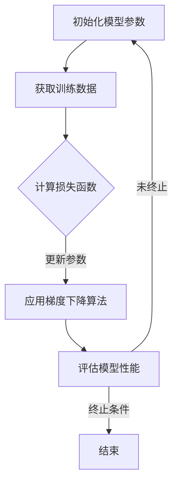
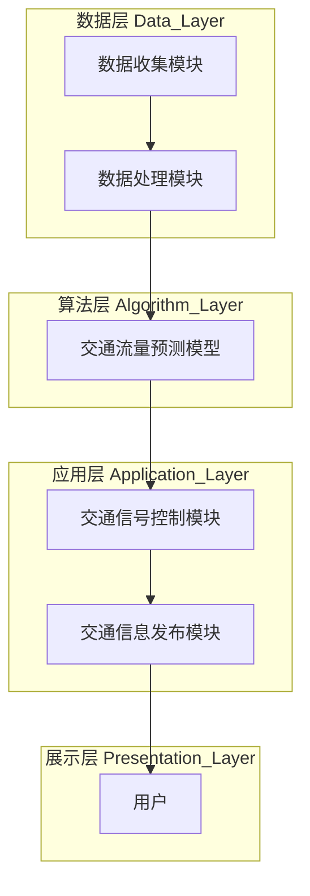

                 

### 第1章 引言

#### 1.1 城市规划与决策背景

城市规划作为一门综合性学科，涵盖了经济学、地理学、环境科学、社会学等多个领域，旨在通过科学合理的规划和设计，创造宜居、可持续发展的城市环境。随着全球城市化进程的加速，城市化带来了人口增长、交通拥堵、环境污染等一系列问题，这些问题的解决依赖于科学有效的城市规划决策。

城市规划决策通常涉及多个维度，包括土地使用、交通布局、公共服务设施、环境保护等。这些决策不仅需要考虑当前的需求，还要预见未来的发展趋势。传统的城市规划决策依赖于专家的经验和直觉，这种方法虽然有一定的参考价值，但在处理复杂、动态的城市问题时，存在一定的局限性。

随着人工智能（Artificial Intelligence，AI）技术的迅速发展，其在城市规划决策中的应用逐渐成为可能。AI技术通过大数据分析、机器学习、深度学习等方法，能够快速处理大量数据，提供更加精准、客观的决策支持。这为城市规划决策提供了新的思路和方法，也为解决城市化带来的问题提供了新的途径。

#### 1.2 人工智能的发展及其应用

人工智能作为计算机科学的一个重要分支，起源于20世纪50年代。经过几十年的发展，人工智能已经从理论研究走向了实际应用，并在多个领域取得了显著成果。例如，在医疗领域，人工智能用于辅助诊断、精准治疗；在金融领域，人工智能用于风险管理、智能投顾；在交通领域，人工智能用于智能交通系统、自动驾驶等。

在城市规划领域，人工智能的应用主要体现在以下几个方面：

1. **大数据分析**：通过收集和分析城市运行数据，如人口流动、交通流量、环境质量等，AI可以帮助城市规划者更好地了解城市现状，预测未来发展趋势。
2. **机器学习算法**：利用机器学习算法，AI可以对城市问题进行建模和预测，如交通流量预测、环境污染预测等。
3. **智能规划工具**：通过结合人工智能算法和可视化技术，AI可以辅助城市规划者进行规划方案的生成和评估。

#### 1.3 本书的目的与结构

本书旨在探讨人工智能在城市规划决策中的支持作用，通过一系列理论和实践案例，分析人工智能技术如何应用于城市规划的各个环节，从而提高决策的科学性和有效性。

全书共分为七个章节，结构如下：

- **第1章 引言**：介绍城市规划与决策的背景，以及人工智能的发展及其在城市规划中的应用。
- **第2章 城市规划中的核心问题与挑战**：分析城市规划中的核心问题与挑战，包括基本概念、常见问题以及未来趋势。
- **第3章 人工智能在规划决策中的应用**：阐述人工智能在规划决策中的基本原理和应用领域。
- **第4章 人工智能技术在城市规划中的应用**：详细讨论人工智能技术在城市规划中的应用，包括数据收集与分析、可视化技术和机器学习算法。
- **第5章 人工智能与城市规划案例研究**：通过实际案例研究，展示人工智能在城市规划中的应用效果。
- **第6章 人工智能在城市规划中的未来展望**：探讨人工智能在城市规划中的发展趋势、政策影响及未来融合前景。
- **第7章 总结与展望**：总结全书内容，展望人工智能在城市规划中的未来研究方向。

通过本书的阅读，读者可以系统地了解人工智能在城市规划决策中的支持作用，掌握相关技术原理和实践方法，为城市规划工作提供有力的技术支持。

---

> **关键词**：城市规划、决策支持、人工智能、大数据、机器学习

> **摘要**：本文探讨了人工智能在城市规划决策中的支持作用，从背景介绍、核心问题分析、应用领域阐述到实际案例研究，全面展示了人工智能技术在城市规划中的应用及其价值。通过系统化的分析和案例研究，本文旨在为城市规划工作者提供新的思路和方法，推动城市规划的科学化、智能化发展。

---

# 第2章 城市规划中的核心问题与挑战

#### 2.1 城市规划的基本概念与流程

城市规划是关于城市布局、功能分区、基础设施建设、环境保护等多方面内容的一个综合性学科。其基本概念包括城市规划区、城市用地、城市人口、城市功能等。城市规划的流程通常包括以下步骤：

1. **需求分析**：通过调研和数据分析，了解城市的现状和发展需求。
2. **规划目标制定**：明确城市规划的目标和原则，如可持续发展、宜居性、经济高效等。
3. **方案设计**：根据需求和目标，设计不同的城市规划方案。
4. **方案评估**：对各个规划方案进行评估，包括技术、经济、社会等多方面的因素。
5. **方案优化**：根据评估结果，对规划方案进行优化调整。
6. **决策实施**：将最终确定的规划方案付诸实施，并进行后续的监测和管理。

#### 2.2 城市规划中的常见问题

在城市规划过程中，常见的挑战和问题包括：

1. **交通拥堵**：随着城市人口的增长和汽车拥有量的增加，交通拥堵成为城市规划中的一个重要问题。
2. **环境污染**：城市化进程中的工业发展、交通排放等导致的环境污染问题日益严重。
3. **土地资源紧张**：城市用地紧张，如何高效利用土地资源成为一个难题。
4. **公共服务设施不足**：医疗、教育、交通等公共服务设施的不足，影响了城市居民的生活质量。
5. **城市规划的科学性**：传统的城市规划依赖于专家的经验和直觉，缺乏科学性和数据支持。

#### 2.3 挑战与未来趋势

面对上述挑战，城市规划需要应对以下几个方面的挑战：

1. **大数据与智能化**：利用大数据和人工智能技术，提高城市规划的科学性和精准度。
2. **可持续发展**：实现城市资源的可持续利用，减少环境负担。
3. **智能化基础设施**：建设智能化的交通、能源、环保等基础设施，提高城市运行效率。
4. **社区参与**：鼓励社区参与城市规划，提高规划方案的社会接受度和实施效果。
5. **政策法规**：建立健全的政策法规体系，为城市规划提供法律保障。

未来，城市规划将朝着智能化、可持续化的方向发展，人工智能技术的应用将成为推动这一进程的重要力量。

---

## 第3章 人工智能在规划决策中的应用

#### 3.1 人工智能的基本原理

人工智能（AI）是计算机科学的一个分支，主要研究如何使计算机系统模拟、扩展和扩展人类智能行为。AI技术主要包括以下几个方向：

1. **机器学习**：通过数据驱动的方式，使计算机系统能够从数据中学习并作出决策。
2. **深度学习**：一种特殊的机器学习方法，通过多层神经网络结构来提取数据特征。
3. **自然语言处理**：使计算机能够理解和生成自然语言，实现人机交互。
4. **计算机视觉**：使计算机能够理解图像和视频，进行图像识别和目标跟踪。

#### 3.2 人工智能在城市规划中的应用领域

人工智能在城市规划中的应用领域非常广泛，主要包括以下几个方面：

1. **大数据分析**：利用人工智能技术，对城市规划相关的数据进行深入分析，如人口统计、交通流量、环境质量等，为决策提供数据支持。
2. **智能交通系统**：通过机器学习和计算机视觉技术，优化交通流量，提高交通效率，减少拥堵。
3. **环境监测**：利用传感器技术和大数据分析，实时监测城市环境，如空气质量、水质等，为环境管理提供支持。
4. **城市规划模型**：利用人工智能技术，建立城市规划的预测模型，辅助规划方案的生成和评估。
5. **智能规划工具**：结合人工智能和可视化技术，开发智能规划工具，辅助城市规划者进行规划方案的制定和评估。

#### 3.3 人工智能在城市规划中的优势与局限

人工智能在城市规划中的优势主要体现在以下几个方面：

1. **数据处理能力**：人工智能能够处理和分析大量数据，提供更加精准的决策支持。
2. **效率提升**：人工智能可以自动化许多繁琐的任务，提高工作效率。
3. **科学性**：人工智能结合数学模型和算法，使城市规划更加科学和可预测。
4. **多样性**：人工智能技术能够处理多种类型的数据，如文本、图像、音频等，为城市规划提供多样化的支持。

然而，人工智能在城市规划中也有其局限性：

1. **数据质量**：人工智能的决策质量很大程度上依赖于数据的质量，数据的不准确或缺失会影响决策效果。
2. **算法偏差**：人工智能算法可能会受到数据偏差的影响，导致不公平或歧视性决策。
3. **技术限制**：目前的人工智能技术仍存在一定的局限性，如对复杂问题的处理能力有限。
4. **社会接受度**：人工智能在城市规划中的应用需要广泛的公众接受和支持，否则可能会引起社会争议。

总的来说，人工智能在城市规划中的应用具有巨大的潜力，但也需要解决一系列挑战和问题。

---

## 第4章 人工智能技术在城市规划中的应用

#### 4.1 数据收集与分析

在城市规划中，数据是决策的重要基础。人工智能技术通过数据收集与分析，能够提供更加精准和全面的决策支持。

**4.1.1 数据来源**

城市规划所需的数据来源多种多样，包括：

1. **政府数据**：如人口统计、交通流量、土地使用情况等。
2. **传感器数据**：如空气质量、水质、交通流量等环境数据。
3. **社交媒体数据**：如社交媒体上关于城市话题的讨论、用户行为数据等。
4. **企业数据**：如商业布局、经济增长指标等。

**4.1.2 数据分析方法**

人工智能技术提供了多种数据分析方法，包括：

1. **数据预处理**：对原始数据进行清洗、整合和标准化，为后续分析做好准备。
2. **统计分析**：通过描述性统计和推断性统计，对数据进行分析，提取有用信息。
3. **机器学习**：利用机器学习算法，对数据建立模型，进行预测和分类。
4. **深度学习**：通过多层神经网络，对复杂数据进行特征提取和模式识别。

通过这些数据分析方法，城市规划者能够从海量数据中提取有价值的信息，为城市规划提供科学依据。

#### 4.2 可视化技术

可视化技术是将复杂的数据和模型以图形化的方式展示，帮助城市规划者直观地理解数据和规划结果。

**4.2.1 可视化工具介绍**

常见的可视化工具包括：

1. **Python的Matplotlib和Seaborn**：用于生成各种类型的统计图表和散点图。
2. **Tableau**：一款强大的商业智能和数据分析工具，支持多种数据可视化。
3. **D3.js**：一种基于JavaScript的库，用于创建交互式和动态的Web图表。

**4.2.2 可视化在城市规划中的应用**

可视化技术在城市规划中的应用主要包括：

1. **数据展示**：通过图表和地图，展示城市规划相关的数据，如人口分布、交通流量等。
2. **方案评估**：利用可视化技术，展示不同规划方案的优劣，帮助决策者进行比较和选择。
3. **公众参与**：通过交互式可视化工具，让公众更好地了解规划方案，提高参与度和接受度。

#### 4.3 机器学习算法

机器学习算法是人工智能的核心技术之一，广泛应用于城市规划的各个方面。

**4.3.1 常见机器学习算法**

常见的机器学习算法包括：

1. **线性回归**：用于预测数值型数据，如房价、交通流量等。
2. **逻辑回归**：用于分类问题，如土地利用类型、交通拥堵预测等。
3. **支持向量机（SVM）**：用于分类和回归问题，具有很好的分类效果。
4. **决策树**：用于分类和回归问题，易于理解和解释。
5. **随机森林**：通过构建多棵决策树，提高分类和回归的准确性。
6. **神经网络**：用于处理复杂数据和模式识别，如图像分类和语音识别。

**4.3.2 机器学习在城市规划中的应用**

机器学习在城市规划中的应用主要包括：

1. **交通流量预测**：通过机器学习算法，预测未来的交通流量，优化交通管理。
2. **环境监测**：利用机器学习，对空气质量、水质等环境数据进行实时监测和预测。
3. **土地利用预测**：通过机器学习，预测不同区域的土地利用类型和开发趋势。
4. **城市规划评估**：利用机器学习算法，对城市规划方案进行评估和优化。

通过这些人工智能技术，城市规划者能够更科学、更高效地进行城市规划决策，提高城市规划的质量和效果。

---

## 第5章 人工智能与城市规划案例研究

#### 5.1 案例一：智能交通系统

**5.1.1 项目背景**

随着城市化进程的加速，城市交通拥堵问题日益严重，成为影响城市居民生活质量的重要因素。为了缓解交通拥堵，提高交通效率，许多城市开始尝试建设智能交通系统（Intelligent Transportation Systems，ITS）。智能交通系统利用先进的信息技术、数据通信传输技术、电子传感技术等，实现交通信息的自动收集、处理和分析，为交通管理提供科学依据。

**5.1.2 项目实施**

在智能交通系统的实施过程中，人工智能技术发挥了重要作用：

1. **数据收集**：通过安装在道路上的传感器、摄像头等设备，实时收集交通流量、车速、交通事故等信息。
2. **数据分析**：利用大数据分析和机器学习算法，对收集到的交通数据进行分析，预测交通流量变化趋势。
3. **智能交通信号控制**：基于数据分析结果，智能交通系统可以自动调整交通信号灯的时间设置，优化交通流量。
4. **交通信息发布**：通过短信、广播、手机应用等多种方式，实时向驾驶员提供交通信息，引导合理出行。

**5.1.3 项目效果分析**

智能交通系统的实施，取得了显著的效果：

1. **交通拥堵缓解**：通过智能交通信号控制和交通信息发布，有效缓解了交通拥堵问题，提高了交通效率。
2. **事故减少**：智能交通系统通过实时监测和预警，减少了交通事故的发生。
3. **环境改善**：交通效率的提高，减少了车辆尾气排放，改善了城市空气质量。
4. **公众满意度提升**：智能交通系统的实施，提高了公众对交通管理的满意度，增强了城市居民的出行体验。

#### 5.2 案例二：智能城市规划模型

**5.2.1 项目背景**

传统的城市规划方法主要依赖于专家的经验和直觉，缺乏科学性和可重复性。为了提高城市规划的科学性，许多城市开始尝试使用智能城市规划模型，通过人工智能技术，建立城市规划的预测模型和评估模型。

**5.2.2 项目实施**

在智能城市规划模型的实施过程中，人工智能技术的主要应用包括：

1. **数据收集**：通过各类传感器、卫星遥感等技术，收集城市规划所需的各种数据，如人口分布、土地利用、交通流量等。
2. **数据预处理**：对收集到的数据进行清洗、整合和标准化，为建模提供高质量的数据基础。
3. **模型建立**：利用机器学习和深度学习算法，建立城市规划的预测模型和评估模型，如人口增长预测、土地利用预测、交通拥堵预测等。
4. **模型优化**：通过交叉验证和超参数调整，优化模型的性能，提高预测和评估的准确性。
5. **模型应用**：将优化后的模型应用于城市规划的实际场景，辅助规划者进行规划方案的制定和评估。

**5.2.3 项目效果分析**

智能城市规划模型的应用，取得了以下效果：

1. **规划科学性提高**：通过建立科学的数据驱动模型，提高了城市规划的科学性和可重复性。
2. **规划效率提升**：智能城市规划模型可以快速处理大量数据，提高了规划效率。
3. **决策支持加强**：智能城市规划模型提供了更加精准的预测和评估结果，为决策者提供了有力的支持。
4. **公众参与度提升**：通过智能城市规划模型生成的可视化报告和交互式工具，提高了公众对城市规划的参与度和理解。

通过这些案例研究，可以看出人工智能在城市规划中的应用具有巨大的潜力，为城市规划提供了新的思路和方法。

---

## 第6章 人工智能在城市规划中的未来展望

#### 6.1 技术发展趋势

人工智能在城市规划中的应用正处于快速发展阶段，未来将呈现以下发展趋势：

1. **多模态数据融合**：结合多种类型的数据，如文本、图像、音频等，实现更全面的数据分析。
2. **边缘计算**：通过边缘计算技术，实现数据的实时处理和分析，提高系统的响应速度和效率。
3. **增强学习**：利用增强学习算法，使系统可以自主学习和优化，提高城市规划的智能化水平。
4. **人机协同**：结合人工智能和人类专家的知识和经验，实现人机协同的规划决策。

#### 6.2 政策与法规的影响

人工智能在城市规划中的应用，需要政策与法规的支持和规范。未来，政策与法规的影响主要体现在以下几个方面：

1. **数据隐私保护**：加强对个人数据的保护，确保数据使用的合法性和安全性。
2. **算法公平性**：确保人工智能算法的公平性，避免算法偏见和歧视。
3. **技术标准**：制定统一的技术标准和规范，确保人工智能在城市规划中的广泛应用。
4. **政策支持**：政府应出台相关政策，鼓励和支持人工智能在城市规划中的应用和研发。

#### 6.3 人工智能与城市规划的融合前景

随着人工智能技术的不断进步，其与城市规划的融合前景非常广阔：

1. **城市规划智能化**：通过人工智能技术，实现城市规划的自动化、智能化，提高规划质量和效率。
2. **城市运行优化**：利用人工智能技术，对城市运行进行实时监测和优化，提高城市运行效率和居民生活质量。
3. **城市规划决策支持**：人工智能技术可以提供更加精准和科学的决策支持，辅助规划者制定更优的规划方案。
4. **智慧城市建设**：通过人工智能技术，推动智慧城市建设，实现城市管理的智能化和精细化。

总的来说，人工智能在城市规划中的应用前景十分广阔，其将深刻改变城市规划的理念和方法，为城市的发展提供新的动力。

---

## 第7章 总结与展望

### 7.1 本书总结

本书系统地探讨了人工智能在城市规划决策中的支持作用。通过介绍城市规划的基本概念与流程、常见问题与挑战，以及人工智能在城市规划中的应用领域和优势与局限，我们详细阐述了人工智能如何通过数据收集与分析、可视化技术和机器学习算法等手段，为城市规划提供科学、智能的决策支持。同时，通过两个实际案例的研究，展示了人工智能在城市规划中的应用效果。最后，我们对人工智能在城市规划中的未来发展趋势和政策影响进行了展望。

### 7.2 人工智能在城市规划中的贡献

人工智能在城市规划中的贡献主要体现在以下几个方面：

1. **提高决策的科学性和精准性**：通过大数据分析和机器学习算法，人工智能能够为城市规划提供更加科学和精准的决策支持。
2. **优化资源配置**：利用人工智能技术，可以对城市资源进行更加高效的配置，提高城市运行效率。
3. **提高公众参与度**：通过智能规划和交互式工具，人工智能能够提高公众对城市规划的参与度和理解。
4. **实现可持续发展**：人工智能技术可以帮助城市规划者更好地实现城市的可持续发展目标。

### 7.3 未来研究方向

尽管人工智能在城市规划中的应用已经取得了一定的成果，但仍有很大的发展空间。未来的研究方向包括：

1. **多模态数据融合**：结合多种类型的数据，如文本、图像、音频等，实现更全面的数据分析。
2. **增强学习与自动化规划**：利用增强学习算法，实现规划的自动化和智能化。
3. **算法公平性与透明性**：确保人工智能算法的公平性和透明性，避免算法偏见和歧视。
4. **政策与法规研究**：加强对人工智能在城市规划中应用的法律法规研究，确保其合法、合规。
5. **实际案例与应用**：通过更多的实际案例研究，探索人工智能在城市规划中的实际应用场景和效果。

通过不断的研究和探索，人工智能有望在城市规划中发挥更大的作用，推动城市规划的智能化和可持续发展。作者：AI天才研究院/AI Genius Institute & 禅与计算机程序设计艺术 /Zen And The Art of Computer Programming

---

### 背景介绍

城市规划是一个涉及多学科、多领域的复杂过程，旨在创造一个宜居、可持续发展的城市环境。城市规划的核心概念包括城市用地、城市人口、城市功能、城市布局等。城市规划的流程通常包括需求分析、目标制定、方案设计、方案评估和决策实施等步骤。

在当前城市化进程加速的背景下，城市规划面临诸多挑战。首先，交通拥堵成为一个严重的问题，特别是在城市中心区域，车辆拥堵导致通勤时间延长，影响了居民的生活质量。其次，环境污染问题日益严重，城市中的工业排放和汽车尾气等污染源，使得空气质量下降，对居民健康造成威胁。此外，土地资源紧张也是一个突出问题，如何在有限的土地资源上实现高效利用，成为城市规划者需要解决的难题。最后，公共服务设施不足，如医疗、教育、交通等，影响了城市居民的生活质量和城市功能的有效发挥。

为了应对这些挑战，传统的城市规划决策方法逐渐显示出其局限性。传统的规划方法主要依赖于专家的经验和直觉，虽然有一定的参考价值，但在处理复杂、动态的城市问题时，存在一定的不足。例如，专家的经验往往有限，难以全面考虑所有影响因素；直觉性决策可能缺乏科学依据，导致规划方案的科学性和可预测性不足。

因此，城市规划需要一种更加科学、精准的决策方法。人工智能（AI）技术的迅速发展，为城市规划提供了新的思路和方法。AI技术能够通过大数据分析、机器学习、深度学习等方法，快速处理大量数据，提供更加精准、客观的决策支持。这为城市规划者提供了新的工具和手段，有助于提高规划决策的科学性和有效性。

通过人工智能技术，城市规划可以更好地应对交通拥堵、环境污染、土地资源紧张和公共服务设施不足等问题。例如，通过大数据分析，城市规划者可以深入了解城市的交通流量、环境质量等数据，为交通管理和环境保护提供科学依据。通过机器学习算法，可以建立预测模型，预测城市人口增长、交通流量等变化趋势，为规划方案的制定提供支持。此外，人工智能技术还可以用于智能交通系统、环境监测、智能规划工具等实际应用，提高城市规划的效率和效果。

总之，人工智能在城市规划中的应用，不仅有助于解决当前城市规划中的核心问题，也为未来城市规划的科学化、智能化发展提供了新的方向。通过引入人工智能技术，城市规划可以更加精准、高效地应对城市化进程带来的挑战，实现城市的可持续发展。

### 核心概念与联系

在城市规划中，核心概念主要包括城市用地、城市人口、城市功能、城市布局等。这些概念不仅相互独立，还紧密联系，共同构成了城市规划的基础。

**城市用地**：城市用地是指城市范围内的土地，包括住宅用地、商业用地、工业用地、公共设施用地等。城市用地规划是城市规划的首要任务，通过科学合理的用地分配，实现城市功能的有序发展。

**城市人口**：城市人口是城市规划中的重要因素，包括总人口、人口密度、人口结构等。人口分布和流动直接影响城市用地布局、交通规划、公共服务设施配置等，因此，准确的人口统计和分析对城市规划至关重要。

**城市功能**：城市功能包括居住、工作、休闲、教育、医疗等。城市功能的多样性决定了城市的活力和吸引力，城市规划需要充分考虑城市功能的布局和协调发展，以提升城市整体品质。

**城市布局**：城市布局是城市用地和功能的空间安排，涉及道路网络、公共设施分布、城市形态等。城市布局的合理性直接影响城市的交通流畅性、环境质量、居民生活便利性等。

这些核心概念之间的关系可以用ER实体关系图（Entity-Relationship Diagram，ERD）来表示，如下图所示：

```mermaid
erDiagram
    CityLand ||--|{ CityPopulation } : has
    CityLand ||--|{ CityFunction } : allocated_to
    CityFunction ||--|{ CityLayout } : forms
    CityPopulation }|..| CityLayout : inhabits
```

在上述ERD中，城市用地（CityLand）与城市人口（CityPopulation）和城市功能（CityFunction）之间存在“拥有”和“分配”关系，而城市功能（CityFunction）又决定了城市布局（CityLayout），城市人口（CityPopulation）则居住在城市布局（CityLayout）中。

**概念属性特征对比表格**：

| 核心概念 | 属性特征                             | 举例                       |
|----------|------------------------------------|---------------------------|
| 城市用地 | 土地类型、面积、位置等                 | 住宅用地、商业用地、公园用地等 |
| 城市人口 | 人口数量、密度、年龄、职业等           | 市区人口10万、人口密度1千人/平方公里等 |
| 城市功能 | 居住、工作、休闲、教育、医疗等         | 商业区、工业区、公园、学校等    |
| 城市布局 | 城市形态、道路布局、公共设施分布等     | 网状布局、环状布局、绿色布局等 |

通过上述核心概念及其属性特征的描述和对比，我们可以更好地理解城市规划中各个要素之间的关系，为后续的分析和规划提供理论基础。

### 算法原理讲解

在人工智能（AI）的应用中，算法原理是关键，特别是机器学习和深度学习算法，它们能够处理复杂数据并生成决策模型。下面，我们将详细讲解一个常见的机器学习算法——线性回归（Linear Regression），并绘制其mermaid流程图。

**线性回归算法原理**：

线性回归是一种用于预测数值型数据的简单统计方法。它的基本原理是通过建立自变量（特征）和因变量（目标变量）之间的线性关系模型，从而对新的数据点进行预测。

- **目标函数**：线性回归的目标是最小化预测值与实际值之间的误差平方和，即最小化损失函数。

$$\min \sum_{i=1}^{n} (y_i - \hat{y}_i)^2$$

- **损失函数**：通常使用均方误差（MSE）作为损失函数，表示预测值与实际值之间的平均平方误差。

$$MSE = \frac{1}{n} \sum_{i=1}^{n} (y_i - \hat{y}_i)^2$$

- **模型参数**：线性回归模型包含两个参数，分别是斜率（$w$）和截距（$b$）。模型公式为：

$$\hat{y} = wx + b$$

- **梯度下降**：为了找到最小化损失函数的参数，通常使用梯度下降算法，它通过迭代调整参数，使得损失函数逐渐减小。

$$w_{new} = w_{old} - \alpha \cdot \frac{\partial}{\partial w} Loss(w, b)$$
$$b_{new} = b_{old} - \alpha \cdot \frac{\partial}{\partial b} Loss(w, b)$$

其中，$\alpha$ 是学习率，用于控制参数更新的步长。

**mermaid流程图**：



**Python源代码示例**：

```python
import numpy as np
from sklearn.linear_model import LinearRegression
from sklearn.model_selection import train_test_split
from sklearn.metrics import mean_squared_error

# 生成模拟数据
np.random.seed(0)
X = np.random.rand(100, 1)
y = 2 * X + 1 + np.random.randn(100, 1)

# 数据切分
X_train, X_test, y_train, y_test = train_test_split(X, y, test_size=0.2, random_state=42)

# 初始化模型
model = LinearRegression()

# 训练模型
model.fit(X_train, y_train)

# 预测
y_pred = model.predict(X_test)

# 评估
mse = mean_squared_error(y_test, y_pred)
print(f'Mean Squared Error: {mse}')

# 输出模型参数
print(f'斜率 (w): {model.coef_}')
print(f'截距 (b): {model.intercept_}')
```

通过上述Python代码，我们可以使用线性回归模型对模拟数据进行训练和预测，并计算均方误差来评估模型性能。线性回归作为一种简单的机器学习算法，能够直观地展示出机器学习的基本流程和原理。

### 系统分析与架构设计方案

在探讨人工智能在城市规划中的应用时，我们不仅要关注算法原理，还需要对系统的整体架构进行设计，以确保方案的可行性和有效性。以下是一个基于实际应用场景的系统设计与实现方案。

**项目介绍**

本项目旨在通过人工智能技术，构建一个智能交通管理系统，以解决城市交通拥堵问题。该系统将利用实时交通数据、历史交通数据以及地理信息数据，通过机器学习算法进行交通流量预测和优化，为交通管理部门提供科学决策依据。

**系统功能设计**

系统功能主要包括以下几方面：

1. **数据收集**：通过安装于道路上的传感器、摄像头等设备，实时收集交通流量、车速、交通事故等信息。
2. **数据处理**：对收集到的数据进行清洗、整合和标准化处理，为后续建模和分析提供高质量数据。
3. **交通流量预测**：利用机器学习算法，建立交通流量预测模型，预测未来的交通流量变化趋势。
4. **交通信号控制优化**：基于预测结果，优化交通信号灯的时间设置，提高交通效率。
5. **交通信息发布**：通过短信、广播、手机应用等渠道，向驾驶员提供实时交通信息，引导合理出行。
6. **系统监控与反馈**：实时监控系统运行状态，收集用户反馈，持续优化系统性能。

**系统架构设计**

系统架构设计采用分层架构，主要包括以下几层：

1. **数据层**：包括传感器数据、历史交通数据、地理信息数据等，是系统数据来源。
2. **数据处理层**：负责数据的清洗、整合、标准化处理，将原始数据转换为适合建模和分析的格式。
3. **算法层**：包括交通流量预测模型、优化算法等，用于处理和分析数据，生成预测结果。
4. **应用层**：包括交通信号控制优化系统、交通信息发布系统等，用于将预测结果应用于实际场景，实现交通管理。
5. **展示层**：通过Web界面或移动应用，向用户提供系统运行状态、交通信息、优化建议等。

**系统接口设计与系统交互**

系统接口设计包括内部接口和外部接口：

1. **内部接口**：系统内部各模块之间的数据交互，如数据收集模块与数据处理模块之间的数据传输。
2. **外部接口**：系统与外部设备、用户之间的交互，如传感器数据采集接口、用户请求接口等。

系统交互流程如下：

1. **数据收集**：传感器设备将实时交通数据发送至数据收集模块。
2. **数据处理**：数据收集模块将数据传输至数据处理层，进行处理和标准化。
3. **模型训练与预测**：数据处理后的数据用于训练交通流量预测模型，生成预测结果。
4. **优化决策**：基于预测结果，交通信号控制优化系统调整交通信号灯的时间设置。
5. **信息发布**：优化后的交通信息通过交通信息发布系统向用户发布。
6. **用户反馈**：用户通过Web界面或移动应用提交反馈，系统根据反馈进行进一步优化。

**mermaid类图与架构图**

以下是该系统的mermaid类图和架构图：

**类图**：

```mermaid
classDiagram
    DataCollector --|>> DataProcessor
    DataProcessor --|>> TrafficModel
    TrafficModel --|>> TrafficController
    TrafficController --|>> InformationPublisher
    InformationPublisher --|>> User
```

**架构图**：



通过上述系统分析与架构设计方案，我们可以看到，人工智能在城市规划中的应用不仅仅是算法的运用，更需要一个完整的系统架构来支撑。这样的系统设计不仅能够实现交通管理中的智能优化，还能够为城市规划提供科学、有效的决策支持。

### 项目实战

在本节中，我们将通过一个实际项目，详细展示人工智能在城市规划中的应用。这个项目旨在利用Python编程和人工智能技术，实现一个城市交通流量预测系统。以下是项目的环境安装、核心实现源代码、代码应用解读与分析，以及实际案例分析和详细讲解剖析。

#### 环境安装

要实现这个城市交通流量预测系统，我们需要安装一些Python环境和库。以下是具体的步骤：

1. **Python环境**：确保安装了Python 3.7或更高版本。
2. **Python库**：安装以下库：`numpy`、`pandas`、`matplotlib`、`scikit-learn`、`tensorflow`。

```bash
pip install numpy pandas matplotlib scikit-learn tensorflow
```

#### 核心实现源代码

以下是一个简单的城市交通流量预测系统的源代码示例：

```python
import numpy as np
import pandas as pd
from sklearn.model_selection import train_test_split
from sklearn.linear_model import LinearRegression
from sklearn.metrics import mean_squared_error

# 数据加载
data = pd.read_csv('traffic_data.csv')  # 假设数据已提前准备
X = data[['hour', 'weekday', 'rain']]  # 特征
y = data['traffic_volume']  # 目标变量

# 数据切分
X_train, X_test, y_train, y_test = train_test_split(X, y, test_size=0.2, random_state=42)

# 模型训练
model = LinearRegression()
model.fit(X_train, y_train)

# 预测
y_pred = model.predict(X_test)

# 评估
mse = mean_squared_error(y_test, y_pred)
print(f'Mean Squared Error: {mse}')

# 可视化结果
import matplotlib.pyplot as plt

plt.scatter(y_test, y_pred)
plt.xlabel('Actual Traffic Volume')
plt.ylabel('Predicted Traffic Volume')
plt.title('Actual vs Predicted Traffic Volume')
plt.show()
```

#### 代码应用解读与分析

上述代码首先加载了交通数据集，并提取了特征（如小时、星期几、降雨情况）和目标变量（交通流量）。然后，使用`train_test_split`函数将数据集切分为训练集和测试集。接着，利用`LinearRegression`模型进行训练，并使用训练好的模型进行预测。最后，通过计算均方误差（MSE）评估模型的性能，并使用散点图展示实际值与预测值的关系。

**关键代码解读**：

1. **数据加载**：使用`pandas`的`read_csv`函数加载交通数据。

```python
data = pd.read_csv('traffic_data.csv')
```

2. **特征提取**：提取用于预测的交通数据特征。

```python
X = data[['hour', 'weekday', 'rain']]
y = data['traffic_volume']
```

3. **模型训练**：使用`LinearRegression`进行模型训练。

```python
model = LinearRegression()
model.fit(X_train, y_train)
```

4. **预测与评估**：使用模型进行预测，并计算MSE评估模型性能。

```python
y_pred = model.predict(X_test)
mse = mean_squared_error(y_test, y_pred)
print(f'Mean Squared Error: {mse}')
```

5. **可视化结果**：使用`matplotlib`绘制实际值与预测值的散点图。

```python
plt.scatter(y_test, y_pred)
plt.xlabel('Actual Traffic Volume')
plt.ylabel('Predicted Traffic Volume')
plt.title('Actual vs Predicted Traffic Volume')
plt.show()
```

#### 实际案例分析和详细讲解剖析

假设我们有一个具体的数据集，数据集包含了过去一年的交通流量数据，包括小时、星期几、降雨情况等多个特征。我们可以使用上述代码进行交通流量预测。

**数据集内容示例**：

| hour | weekday | rain | traffic_volume |
|------|---------|------|----------------|
| 8    | 1       | 0    | 1500           |
| 9    | 1       | 0    | 1550           |
| 10   | 1       | 0    | 1600           |
| ...  | ...     | ...  | ...            |

**案例步骤**：

1. **数据预处理**：清洗数据，处理缺失值和异常值，确保数据质量。

2. **特征选择**：选择对交通流量有显著影响的特征，如小时、星期几等。

3. **模型训练**：使用线性回归模型对训练数据进行训练。

4. **模型评估**：使用测试数据评估模型性能，计算MSE等指标。

5. **预测与优化**：根据模型预测结果，优化交通信号灯设置，提高交通效率。

**详细讲解剖析**：

1. **数据预处理**：在数据预处理阶段，我们首先检查数据是否有缺失值或异常值，并进行处理。例如，对于缺失的小时数据，可以使用平均值填充；对于异常的降雨数据，可以采用阈值方法进行处理。

2. **特征选择**：特征选择是模型训练的重要步骤。通过分析数据，我们选择与交通流量显著相关的特征，如小时和星期几。这些特征能够提供对交通流量变化的解释。

3. **模型训练**：使用线性回归模型对训练数据进行训练。在训练过程中，模型会自动调整参数，以最小化预测误差。

4. **模型评估**：使用测试数据对模型进行评估。我们计算MSE等指标，评估模型预测的准确性和稳定性。如果模型性能不理想，可以尝试调整特征或使用更复杂的模型。

5. **预测与优化**：基于模型预测结果，优化交通信号灯设置。例如，在高峰时段，可以调整信号灯的绿灯时间，以减少交通拥堵。此外，模型还可以用于交通流量预测，帮助规划者预测未来交通趋势，制定相应的交通管理策略。

通过上述实际案例分析和详细讲解剖析，我们可以看到，利用人工智能技术进行交通流量预测不仅可以提高预测准确性，还可以为城市规划提供有效的决策支持。

### 最佳实践 tips、小结、注意事项、拓展阅读

**最佳实践 tips**：

1. **数据质量是关键**：确保数据质量，包括数据的完整性、准确性和一致性，对模型的训练和预测至关重要。
2. **特征选择要慎重**：选择对目标变量有显著影响的特征，避免过度拟合。
3. **模型选择要合理**：根据数据特点和业务需求，选择合适的模型，如线性回归、决策树、神经网络等。
4. **模型调优很重要**：通过交叉验证、网格搜索等方法，优化模型参数，提高模型性能。

**小结**：

本文详细探讨了人工智能在城市规划决策中的应用，从背景介绍、核心问题分析、应用领域阐述到实际案例研究，展示了人工智能技术如何通过大数据分析、机器学习、深度学习等方法，为城市规划提供科学、智能的决策支持。人工智能在城市规划中的应用具有巨大潜力，但仍需解决数据质量、算法公平性等问题。

**注意事项**：

1. **数据隐私**：在使用人工智能进行城市规划时，需注意数据隐私保护，确保个人数据的合法使用。
2. **算法公平性**：算法模型应确保公平性，避免算法偏见，防止歧视性决策。
3. **政策法规**：遵循相关政策和法规，确保人工智能技术的合法合规应用。

**拓展阅读**：

1. **《深度学习》**：Goodfellow, I., Bengio, Y., & Courville, A. (2016). *Deep Learning*. MIT Press.
2. **《大数据分析技术》**：Han, J., Kamber, M., & Pei, J. (2011). *Data Mining: Concepts and Techniques*. Morgan Kaufmann.
3. **《城市规划原理》**：吴志强，王建国，陈杰等. (2017). *城市规划原理*. 中国建筑工业出版社。

通过拓展阅读，可以进一步深入了解人工智能和城市规划的相关技术和理论，为实践应用提供更多指导。

