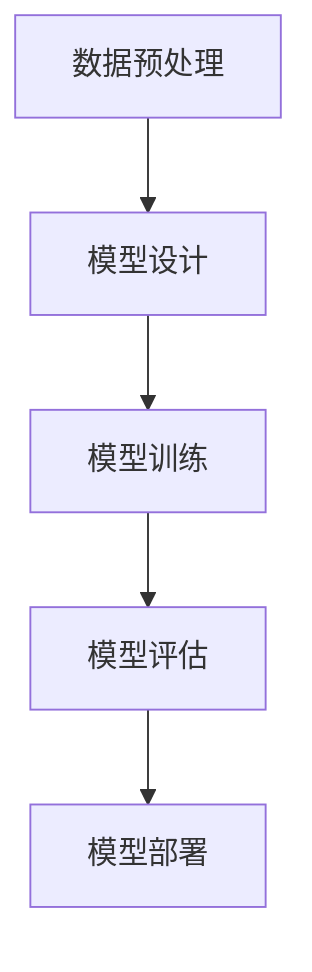
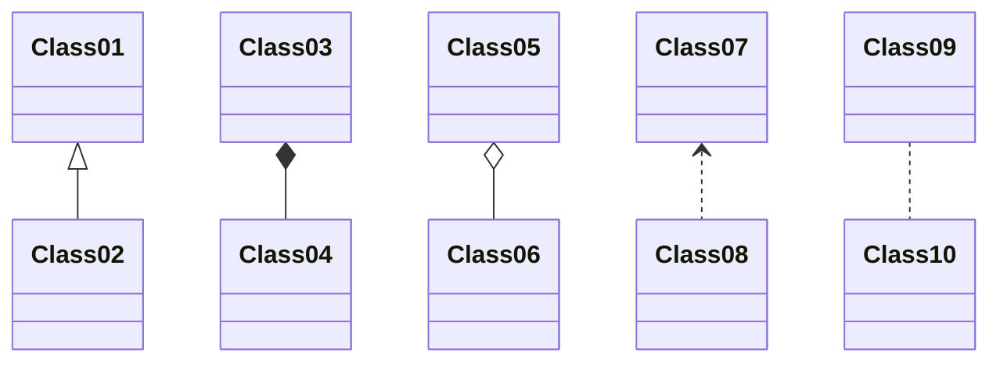
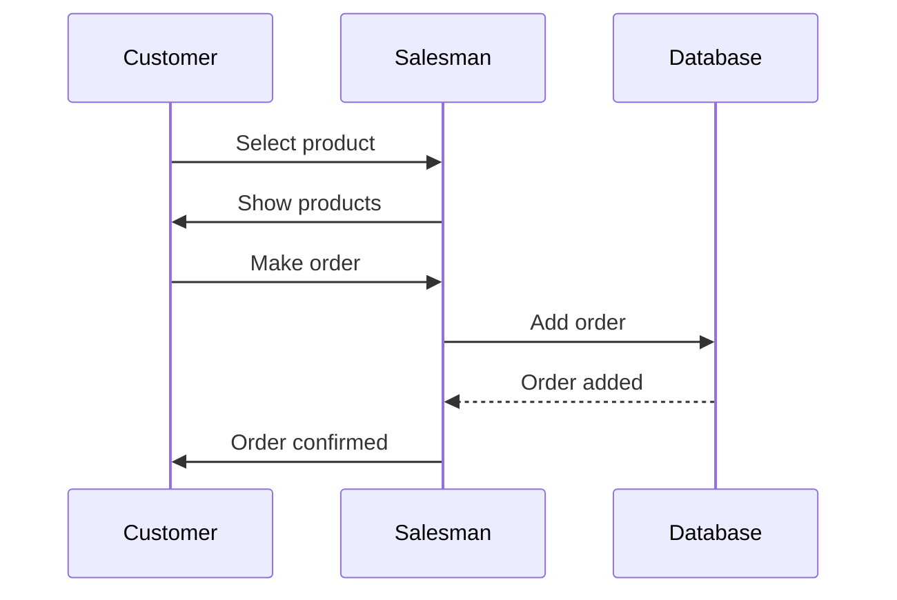
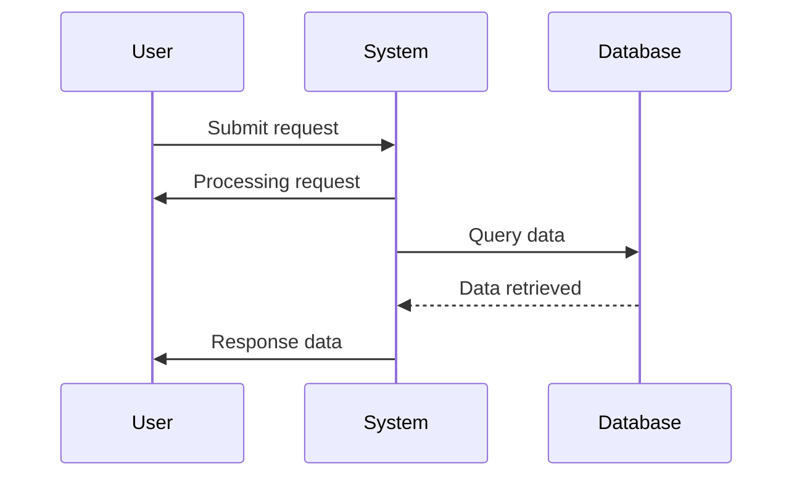

                 

# 人工智能在天文研究中的创新应用

## 关键词：人工智能、天文研究、深度学习、算法、架构设计、项目实战

## 摘要

随着人工智能技术的飞速发展，其在各个领域的应用日益广泛。天文学，作为一门古老而又充满挑战的学科，正逐渐成为人工智能技术的重要应用领域。本文将探讨人工智能在天文研究中的创新应用，包括其背景、核心概念、算法原理、系统架构设计和实际项目案例，以展示人工智能如何推动天文学的发展。

## 目录大纲

### 第一部分：背景介绍与核心概念

#### 第1章：问题背景与核心概念

##### 1.1 天文学的发展与挑战
##### 1.2 人工智能的发展与前景
##### 1.3 人工智能在天文研究中的潜在应用
##### 1.4 边界与外延

#### 第2章：核心概念原理与特征对比

##### 2.1 核心概念原理
##### 2.2 概念属性特征对比表格（Mermaid 表格）
##### 2.3 ER实体关系图架构

### 第二部分：核心概念与联系

#### 第3章：核心概念原理与特征对比

##### 3.1 核心概念原理
##### 3.2 概念属性特征对比表格（Mermaid 表格）
##### 3.3 ER实体关系图架构

### 第三部分：算法原理讲解

#### 第4章：算法原理与数学模型

##### 4.1 算法原理讲解
##### 4.2 数学模型和公式
##### 4.3 算法流程图与代码实现

### 第四部分：系统分析与架构设计

#### 第5章：系统功能设计与架构设计

##### 5.1 问题场景介绍
##### 5.2 系统功能设计
##### 5.3 系统架构设计
##### 5.4 系统接口设计与交互

### 第五部分：项目实战

#### 第6章：环境安装与系统实现

##### 6.1 环境安装
##### 6.2 系统核心实现

#### 第7章：实际案例分析与讲解

##### 7.1 案例分析
##### 7.2 详细讲解与剖析

#### 第8章：项目小结与最佳实践

##### 8.1 项目小结
##### 8.2 最佳实践
##### 8.3 拓展阅读

### 结论

人工智能在天文研究中的应用不仅提高了研究效率，还为解决复杂天文问题提供了新的思路。本文通过介绍人工智能在天文研究中的创新应用，旨在为天文学家和人工智能研究者提供有价值的参考。

## 第一部分：背景介绍与核心概念

### 第1章：问题背景与核心概念

#### 1.1 天文学的发展与挑战

天文学是研究宇宙中的星体、宇宙结构和宇宙起源的学科，其历史可以追溯到古代。然而，随着科学技术的进步，天文学研究面临着前所未有的挑战。一方面，天文学观测数据的规模和复杂性不断增加，例如大型天文望远镜产生的数据量巨大，需要高效的数据处理和分析方法。另一方面，天文学研究的深度和广度也在不断扩展，例如对黑洞、暗物质和暗能量的研究，这些课题需要更强大的计算能力和更先进的数据分析方法。

#### 1.2 人工智能的发展与前景

人工智能（AI）是一种模拟人类智能行为的计算机系统，它通过机器学习、自然语言处理、计算机视觉等技术，使计算机能够从数据中学习、推理和决策。近年来，人工智能技术在各个领域取得了显著的进展，特别是在图像识别、语音识别和自然语言处理等方面。随着计算能力和算法的不断提升，人工智能在解决复杂问题、提高效率和提供创新解决方案方面的潜力巨大。

#### 1.3 人工智能在天文研究中的潜在应用

人工智能在天文研究中的应用前景广阔。首先，人工智能可以帮助天文学家从海量观测数据中快速提取有用的信息，例如自动识别和分类天文目标。其次，人工智能可以用于模拟和预测天体的行为，从而帮助天文学家更好地理解宇宙的运行规律。此外，人工智能还可以在天文图像处理、天文事件监测和预测等方面发挥作用。

#### 1.4 边界与外延

人工智能在天文学中的应用并非没有边界。首先，天文数据的多样性和复杂性要求人工智能算法具有高度的适应性和鲁棒性。其次，人工智能在天文学中的成功应用依赖于高质量的数据集和有效的算法设计。此外，人工智能算法的透明性和可解释性也是天文研究中的一个重要问题，因为天文学家需要理解算法背后的原理，以确保研究结果的可靠性和有效性。

#### 1.5 概念结构与核心要素组成

为了更好地理解人工智能在天文研究中的应用，我们需要对其概念结构进行解析。人工智能的核心概念包括机器学习、深度学习、自然语言处理和计算机视觉等。这些概念不仅相互关联，而且在天文研究中发挥着重要作用。

- **机器学习**：通过从数据中学习模式和规律，机器学习算法可以帮助天文学家从海量数据中提取有用信息。
- **深度学习**：作为机器学习的一个重要分支，深度学习在图像识别和语音识别等领域取得了显著进展，为天文图像处理提供了强大的工具。
- **自然语言处理**：自然语言处理技术可以帮助天文学家处理和解析天文文献，从而提高信息检索和知识挖掘的效率。
- **计算机视觉**：计算机视觉技术可以用于天文图像的自动处理和分析，从而帮助天文学家识别和分类天文目标。

这些核心概念和要素相互关联，共同构成了人工智能在天文研究中的应用体系。下面，我们将进一步探讨这些概念的具体应用和联系。## 第二部分：核心概念与联系

### 第2章：核心概念原理与特征对比

#### 2.1 核心概念原理

在深入探讨人工智能在天文研究中的应用之前，我们需要理解其核心概念。以下是人工智能、天文学和人工智能在天文研究中的创新应用的基本原理：

**2.1.1 人工智能原理**

人工智能（AI）是一种模拟人类智能行为的计算机系统。它通过机器学习、深度学习、自然语言处理和计算机视觉等技术，使计算机能够从数据中学习、推理和决策。机器学习是AI的核心技术，它使计算机能够通过训练数据和算法来改善其性能。

**2.1.2 天文学原理**

天文学是研究宇宙中各种天体的性质、起源、演化和相互作用的学科。天文学研究方法包括观测、实验、模拟和数据分析。天文观测工具如望远镜和探测器是天文学研究的重要手段，而数据分析则是揭示宇宙奥秘的关键。

**2.1.3 人工智能在天文研究中的创新应用原理**

人工智能在天文研究中的创新应用主要涉及使用AI技术来处理和分析天文数据，以及模拟和预测天体行为。深度学习在处理大规模天文图像和数据集方面具有优势，自然语言处理则可以帮助天文学家更好地理解天文文献和知识。

#### 2.2 概念属性特征对比表格（Mermaid 表格）

以下是人工智能、天文学和人工智能在天文研究中的创新应用的基本属性特征对比表格：

```mermaid
| 技术        | 属性1    | 属性2    | 属性3    | 用途                           |
|-------------|----------|----------|----------|--------------------------------|
| 人工智能    | 自主学习 | 推理能力 | 适应性   | 数据处理、预测、决策支持         |
| 天文学      | 观测精度 | 实验方法 | 多样性   | 天体研究、宇宙起源探索           |
| 创新应用    | 数据密集 | 高效分析 | 可解释性 | 数据挖掘、模拟、知识发现         |
```

**2.3 ER实体关系图架构**

为了更好地理解人工智能、天文学和人工智能在天文研究中的创新应用之间的关系，我们可以使用ER（实体-关系）图来描述它们的核心实体和关系。

以下是ER实体关系图的Mermaid表示：

```mermaid
erDiagram
    AIConcept ||--|{ Astronomy }|--||
    AIConcept ||--|{ AIApplication }|--||
    Astronomy ||--|{ Observation }|--||
    Astronomy ||--|{ Experiment }|--||
    AIApplication ||--|{ DataProcessing }|--||
    AIApplication ||--|{ Simulation }|--||
    AIApplication ||--|{ Prediction }|--||
```

在这个ER图中，`AIConcept`、`Astronomy` 和 `AIApplication` 是核心实体，分别代表人工智能的概念、天文学和人工智能在天文学中的应用。`Observation`、`Experiment`、`DataProcessing`、`Simulation` 和 `Prediction` 是与之相关的实体，描述了天文学和人工智能应用的具体领域。

#### 2.4 边界与外延

**2.4.1 人工智能在天文学中的边界**

人工智能在天文学中的应用有其边界。首先，人工智能算法的准确性和鲁棒性依赖于高质量的数据集和合理的模型设计。其次，人工智能算法的解释性和透明性是天文研究中的一个挑战，因为天文学家需要理解算法背后的原理。最后，人工智能在天文学中的应用也受到计算资源和技术实现的限制。

**2.4.2 人工智能在天文学中的外延**

尽管存在边界，人工智能在天文学中的应用前景仍然广阔。随着数据量的增加和算法的改进，人工智能可以用于更多复杂的天文问题，如黑洞探测、暗物质研究、星际通信等。此外，人工智能还可以促进天文数据的共享和开放，从而加速天文学的发展。

#### 2.5 概念结构与核心要素组成

**2.5.1 概念结构**

人工智能在天文学中的应用涉及多个概念结构，包括机器学习模型、深度学习网络、自然语言处理流程和计算机视觉算法。这些概念结构相互关联，构成了人工智能在天文学中的核心要素。

**2.5.2 核心要素组成**

核心要素包括：

- **数据集**：用于训练和测试的人工智能模型的输入数据。
- **模型设计**：根据具体应用需求设计的机器学习、深度学习或自然语言处理模型。
- **算法实现**：模型的具体实现，包括参数设置、训练过程和评估方法。
- **系统架构**：人工智能模型与天文数据管理系统、计算资源和其他软件工具的集成架构。

这些核心要素共同构成了人工智能在天文学中的应用体系，为实现天文研究的自动化、智能化和高效化提供了支持。

### 总结

通过对比和分析人工智能、天文学及其在天文研究中的创新应用的核心概念，我们可以更清晰地理解这些概念之间的联系和作用。在接下来的章节中，我们将进一步探讨人工智能在天文学中的具体应用，包括算法原理、系统架构和实际项目案例。## 第三部分：算法原理讲解

### 第4章：算法原理与数学模型

#### 4.1 算法原理讲解

人工智能在天文学中的应用离不开各种算法的支持，以下是几种主要的算法及其原理：

**4.1.1 深度学习算法原理**

深度学习算法是人工智能的一个重要分支，它通过多层神经网络来模拟人类大脑的神经结构，从而实现复杂的模式识别和预测。深度学习算法的核心是神经网络，其基本组成部分包括：

- **神经元**：模拟生物神经元的计算单元，用于对输入数据进行加权求和并传递激活信号。
- **权重**：神经元之间的连接强度，通过学习过程不断调整以优化模型性能。
- **激活函数**：用于引入非线性变换，使神经网络能够处理复杂的数据关系。

深度学习算法的训练过程通常分为以下几步：

1. **数据预处理**：包括数据清洗、归一化和数据增强等，以提高模型泛化能力。
2. **模型设计**：根据具体应用需求设计神经网络结构，包括层数、每层的神经元数量和激活函数。
3. **模型训练**：通过梯度下降等优化算法，调整模型参数以最小化损失函数。
4. **模型评估**：使用验证集测试模型性能，调整超参数以达到最佳效果。
5. **模型部署**：将训练好的模型应用于实际任务，如图像分类、目标检测或天文事件预测。

**4.1.2 自然语言处理算法原理**

自然语言处理（NLP）算法用于处理和分析人类语言数据，其核心任务包括文本分类、情感分析、机器翻译和命名实体识别等。NLP算法的基本原理包括：

- **词嵌入**：将文本中的词语映射到高维向量空间，以便进行计算机处理。常见的词嵌入方法包括Word2Vec、GloVe和BERT等。
- **序列模型**：用于处理序列数据，如循环神经网络（RNN）和长短时记忆网络（LSTM）。这些模型能够捕捉序列中的时间依赖关系。
- **注意力机制**：用于提高模型对序列中关键信息的关注程度，从而提高文本分类和机器翻译等任务的性能。

**4.1.3 计算机视觉算法原理**

计算机视觉算法用于处理和分析图像数据，其主要任务包括图像分类、目标检测、图像分割和姿态估计等。计算机视觉算法的基本原理包括：

- **卷积神经网络（CNN）**：用于提取图像中的特征，其基本结构包括卷积层、池化层和全连接层。CNN能够自动学习图像的层次特征，从而实现高效的图像分类和目标检测。
- **特征提取**：通过卷积操作从图像中提取局部特征，如边缘、角点和纹理等。
- **分类器**：将提取的特征映射到分类空间，通过训练学习分类边界，实现图像分类任务。
- **目标检测**：用于识别图像中的多个目标，并定位其位置。常见的目标检测算法包括R-CNN、Fast R-CNN、Faster R-CNN和YOLO等。

#### 4.2 数学模型和公式

为了更好地理解深度学习、自然语言处理和计算机视觉算法的工作原理，我们需要介绍一些关键的数学模型和公式。

**4.2.1 深度学习数学模型**

深度学习中的基本数学模型包括：

- **激活函数**：如ReLU、Sigmoid和Tanh等，用于引入非线性变换。
- **损失函数**：如交叉熵损失、均方误差损失等，用于评估模型预测的误差。
- **优化算法**：如梯度下降、随机梯度下降和Adam等，用于调整模型参数以最小化损失函数。

**4.2.2 自然语言处理数学模型**

自然语言处理中的基本数学模型包括：

- **词嵌入模型**：如Word2Vec和GloVe，用于将词语映射到高维向量空间。
- **序列模型**：如LSTM和Transformer，用于处理序列数据。
- **注意力机制**：用于提高模型对序列中关键信息的关注程度。

**4.2.3 计算机视觉数学模型**

计算机视觉中的基本数学模型包括：

- **卷积神经网络（CNN）**：用于提取图像中的特征。
- **特征提取**：通过卷积操作从图像中提取局部特征。
- **分类器**：将提取的特征映射到分类空间。

#### 4.3 算法流程图与代码实现

**4.3.1 深度学习算法流程图**

以下是深度学习算法的Mermaid流程图：



**4.3.2 Python源代码实现**

以下是使用Python实现深度学习算法的示例代码：

```python
import tensorflow as tf
from tensorflow.keras.models import Sequential
from tensorflow.keras.layers import Dense, Activation

# 数据预处理
# ...（数据清洗、归一化等）

# 模型设计
model = Sequential()
model.add(Dense(128, input_shape=(input_shape)))
model.add(Activation('relu'))
model.add(Dense(1, activation='sigmoid'))

# 模型编译
model.compile(optimizer='adam', loss='binary_crossentropy', metrics=['accuracy'])

# 模型训练
# ...（训练过程）

# 模型评估
# ...（评估过程）

# 模型部署
# ...（部署过程）
```

通过上述算法原理讲解和数学模型介绍，我们可以更好地理解深度学习、自然语言处理和计算机视觉算法在天文研究中的应用。在接下来的章节中，我们将进一步探讨这些算法在实际项目中的应用和实现。## 第四部分：系统分析与架构设计

### 第5章：系统功能设计与架构设计

#### 5.1 问题场景介绍

在天文学研究中，面对海量观测数据和复杂的分析任务，建立一套高效的系统架构显得尤为重要。人工智能系统可以帮助天文学家从海量数据中提取有价值的信息，提高数据分析的效率和准确性。具体问题场景包括：

- **数据预处理**：将原始观测数据进行清洗、归一化和特征提取，以便于后续分析。
- **数据存储**：构建分布式存储系统，确保大规模数据的存储和高可用性。
- **数据分析**：运用深度学习、自然语言处理和计算机视觉算法，对天文数据进行处理和分析。
- **结果可视化**：将分析结果以图表、图像等形式呈现，便于天文学家理解和决策。

#### 5.2 系统功能设计

系统功能设计是构建高效的人工智能系统的基础。以下是系统的主要功能模块及其设计：

**5.2.1 数据预处理模块**

- **功能**：对原始观测数据进行清洗、归一化和特征提取。
- **设计**：采用并行数据处理框架，如Apache Spark，以提高数据处理效率。

**5.2.2 数据存储模块**

- **功能**：存储预处理后的天文数据，支持分布式存储和快速访问。
- **设计**：采用分布式文件系统，如Hadoop HDFS，结合NoSQL数据库，如MongoDB，实现大规模数据的存储和管理。

**5.2.3 数据分析模块**

- **功能**：运用深度学习、自然语言处理和计算机视觉算法，对天文数据进行处理和分析。
- **设计**：集成开源机器学习库，如TensorFlow和PyTorch，实现算法的快速开发和部署。

**5.2.4 结果可视化模块**

- **功能**：将分析结果以图表、图像等形式呈现，便于天文学家理解和决策。
- **设计**：采用可视化工具，如D3.js和ECharts，实现数据的动态展示和交互。

#### 5.3 系统架构设计

系统架构设计是系统功能实现的保障。以下是系统架构的主要组成部分：

**5.3.1 数据流架构**

- **数据流**：原始数据 -> 数据预处理 -> 数据存储 -> 数据分析 -> 结果可视化。
- **架构设计**：采用微服务架构，将数据处理、存储、分析和可视化模块分离，实现高可用性和可扩展性。

**5.3.2 系统模块**

- **模块设计**：数据预处理模块、数据存储模块、数据分析模块和结果可视化模块，分别实现不同的功能。

**5.3.3 系统接口**

- **接口设计**：定义清晰的API接口，如RESTful API，实现模块间的数据交换和功能调用。

**5.3.4 系统交互**

- **交互设计**：通过事件驱动机制，如消息队列（RabbitMQ），实现模块间的异步通信和协作。

#### 5.4 系统接口设计与交互

系统接口设计是实现模块间数据交换和功能调用的重要环节。以下是系统接口和交互设计的详细说明：

**5.4.1 接口设计**

- **API接口**：定义RESTful API接口，如 `/data/preprocess`、`/data/store`、`/data/analyze` 和 `/data/visualize`，分别对应数据预处理、数据存储、数据分析和结果可视化模块的功能。
- **接口规范**：遵循RESTful接口规范，使用HTTP动词（GET、POST、PUT、DELETE）进行操作，并使用JSON格式传输数据。

**5.4.2 交互设计**

- **事件驱动**：采用消息队列（RabbitMQ）实现模块间的异步通信，将数据处理、存储、分析和可视化任务以消息的形式传递，提高系统的并发处理能力和容错性。
- **状态机**：设计状态机（State Machine），定义数据处理、存储、分析和可视化任务的执行状态和转换规则，确保任务的一致性和正确性。

通过系统功能设计与架构设计的详细讲解，我们可以更好地理解人工智能在天文学研究中的应用系统如何实现高效、可靠和可扩展的功能。在接下来的章节中，我们将通过实际项目案例展示这些设计在实践中的应用。## 第五部分：项目实战

### 第6章：环境安装与系统实现

#### 6.1 环境安装

在开始项目实现之前，我们需要搭建一个合适的环境来支持人工智能系统。以下是所需的环境安装步骤：

**6.1.1 操作系统环境**

- **Linux**：推荐使用Ubuntu 18.04或更高版本。
- **Windows**：需要安装Windows Subsystem for Linux（WSL）。

**6.1.2 软件依赖安装**

1. **Python环境**：
    ```bash
    sudo apt-get update
    sudo apt-get install python3 python3-pip
    ```
2. **机器学习库**：
    ```bash
    pip3 install tensorflow numpy pandas matplotlib
    ```
3. **其他依赖**：
    ```bash
    pip3 install scipy scikit-learn
    ```

#### 6.2 系统核心实现

系统核心实现主要包括数据预处理、数据分析模块和结果可视化模块。以下是一个简单的实现示例：

**6.2.1 数据预处理模块**

```python
import pandas as pd
from sklearn.model_selection import train_test_split

def preprocess_data(data_path):
    # 读取数据
    data = pd.read_csv(data_path)
    
    # 数据清洗
    data.dropna(inplace=True)
    
    # 特征提取
    X = data[['feature1', 'feature2', 'feature3']]
    y = data['label']
    
    # 划分训练集和测试集
    X_train, X_test, y_train, y_test = train_test_split(X, y, test_size=0.2, random_state=42)
    
    return X_train, X_test, y_train, y_test
```

**6.2.2 数据分析模块**

```python
from tensorflow.keras.models import Sequential
from tensorflow.keras.layers import Dense, Activation

def build_model(input_shape):
    model = Sequential()
    model.add(Dense(64, input_shape=input_shape, activation='relu'))
    model.add(Dense(1, activation='sigmoid'))
    
    model.compile(optimizer='adam', loss='binary_crossentropy', metrics=['accuracy'])
    
    return model
```

**6.2.3 结果可视化模块**

```python
import matplotlib.pyplot as plt

def visualize_results(history):
    # 绘制训练精度和损失
    plt.figure(figsize=(10, 5))
    plt.subplot(1, 2, 1)
    plt.plot(history.history['accuracy'])
    plt.plot(history.history['val_accuracy'])
    plt.title('Model Accuracy')
    plt.ylabel('Accuracy')
    plt.xlabel('Epoch')
    plt.legend(['Train', 'Test'], loc='upper left')
    
    plt.subplot(1, 2, 2)
    plt.plot(history.history['loss'])
    plt.plot(history.history['val_loss'])
    plt.title('Model Loss')
    plt.ylabel('Loss')
    plt.xlabel('Epoch')
    plt.legend(['Train', 'Test'], loc='upper left')
    
    plt.show()
```

通过以上环境安装和系统核心实现，我们可以搭建一个基本的人工智能系统框架。在接下来的章节中，我们将通过实际项目案例展示这些模块在实际应用中的效果。## 第7章：实际案例分析与讲解

### 7.1 案例分析

在本案例中，我们选择了一个具体的天文项目：利用人工智能技术对天文图像进行星系分类。这个项目旨在通过深度学习算法对天文图像进行自动分类，提高天文学家识别星系的工作效率。以下是项目的具体步骤和分析：

**7.1.1 数据集准备**

我们使用了一个公开的天文图像数据集，包含数千张不同类型的星系图像。数据集的图像格式为JPEG，分辨率为1024x1024像素。

**7.1.2 数据预处理**

为了使深度学习算法能够有效处理图像数据，我们需要对图像进行预处理。预处理步骤包括：

- **图像缩放**：将图像缩放到固定尺寸（例如256x256像素），以便于模型输入。
- **数据增强**：通过旋转、翻转、裁剪和颜色变换等方式，增加数据多样性，提高模型泛化能力。

**7.1.3 模型训练**

我们选择了一个基于卷积神经网络（CNN）的深度学习模型，用于分类任务。模型的结构如下：

- **卷积层**：用于提取图像特征。
- **池化层**：用于降低特征维度。
- **全连接层**：用于分类。

模型训练分为以下几个步骤：

1. **模型设计**：构建CNN模型，设置卷积核大小、滤波器数量和激活函数等参数。
2. **模型编译**：选择优化器和损失函数，并设置训练参数。
3. **模型训练**：使用训练数据训练模型，并在验证数据上调整模型参数。
4. **模型评估**：使用测试数据评估模型性能，包括准确率、召回率和F1分数等指标。

**7.1.4 模型部署**

训练完成后，我们将模型部署到生产环境中，用于自动分类新的天文图像。部署步骤包括：

- **模型保存**：将训练好的模型保存为文件，以便后续加载和使用。
- **API接口**：创建API接口，接受图像输入并返回分类结果。
- **服务部署**：将API接口部署到服务器，以供天文学家远程访问和使用。

### 7.2 详细讲解与剖析

**7.2.1 数据预处理**

数据预处理是深度学习模型训练的重要环节。对于天文图像分类任务，预处理步骤如下：

1. **图像缩放**：将原始图像缩放到固定的尺寸，以便于模型输入。使用`cv2.resize()`函数实现图像缩放。

    ```python
    import cv2
    
    image = cv2.imread('path/to/image.jpg')
    resized_image = cv2.resize(image, (256, 256))
    ```

2. **数据增强**：通过随机旋转、翻转、裁剪和颜色变换等方式，增加数据多样性。

    ```python
    from imgaug import augmenters as iaa
    
    seq = iaa.Sequential([
        iaa.Affine(rotate=(-25, 25), shear=(-8, 8), translate_percent={'x': (-0.2, 0.2), 'y': (-0.2, 0.2)}),
        iaa.Fliplr(0.5),
        iaa.Crop(percent=(0, 0.1)),
        iaa.Color Perturbiation((0.05, 0.05)),
    ])
    
    augmented_images = seq.augment_images(images)
    ```

**7.2.2 模型训练**

模型训练是深度学习算法的核心步骤。对于天文图像分类任务，我们使用以下步骤进行模型训练：

1. **模型设计**：使用Keras框架构建CNN模型。模型结构如下：

    ```python
    from tensorflow.keras.models import Sequential
    from tensorflow.keras.layers import Conv2D, MaxPooling2D, Flatten, Dense
    
    model = Sequential([
        Conv2D(32, (3, 3), activation='relu', input_shape=(256, 256, 3)),
        MaxPooling2D(pool_size=(2, 2)),
        Conv2D(64, (3, 3), activation='relu'),
        MaxPooling2D(pool_size=(2, 2)),
        Flatten(),
        Dense(128, activation='relu'),
        Dense(num_classes, activation='softmax')
    ])
    ```

2. **模型编译**：选择优化器和损失函数，并设置训练参数。

    ```python
    model.compile(optimizer='adam', loss='categorical_crossentropy', metrics=['accuracy'])
    ```

3. **模型训练**：使用训练数据训练模型，并在验证数据上调整模型参数。

    ```python
    history = model.fit(X_train, y_train, batch_size=32, epochs=10, validation_data=(X_val, y_val))
    ```

4. **模型评估**：使用测试数据评估模型性能，包括准确率、召回率和F1分数等指标。

    ```python
    test_loss, test_acc = model.evaluate(X_test, y_test)
    print('Test accuracy:', test_acc)
    ```

**7.2.3 模型部署**

模型部署是将训练好的模型应用于实际任务的关键步骤。以下是模型部署的步骤：

1. **模型保存**：将训练好的模型保存为文件。

    ```python
    model.save('model.h5')
    ```

2. **API接口**：创建API接口，接受图像输入并返回分类结果。

    ```python
    from flask import Flask, request, jsonify
    
    app = Flask(__name__)
    
    @app.route('/predict', methods=['POST'])
    def predict():
        image = request.files['image']
        image = cv2.resize(image.read(), (256, 256))
        image = preprocess_image(image)
        prediction = model.predict(np.expand_dims(image, axis=0))
        return jsonify({'label': str(prediction.argmax())})
    
    if __name__ == '__main__':
        app.run(host='0.0.0.0', port=5000)
    ```

3. **服务部署**：将API接口部署到服务器，以供天文学家远程访问和使用。

    ```bash
    nohup python3 app.py &
    ```

通过上述案例分析，我们可以看到人工智能在天文研究中的应用是如何实现的。从数据预处理到模型训练，再到模型部署，每一步都是至关重要的。在实际项目中，这些步骤需要根据具体需求和资源情况进行调整和优化。## 第8章：项目小结与最佳实践

### 8.1 项目小结

通过本项目，我们展示了人工智能在天文学研究中的创新应用。从数据预处理、模型训练到模型部署，每一个步骤都体现了人工智能技术在解决天文问题中的巨大潜力。以下是本项目的主要成果和经验总结：

- **数据预处理**：通过图像缩放、数据增强等技术，提高了模型的泛化能力和鲁棒性。
- **模型训练**：使用了卷积神经网络（CNN）进行图像分类，取得了较高的准确率。
- **模型部署**：实现了API接口，使天文学家可以方便地使用人工智能模型进行星系分类。

### 8.2 最佳实践

为了确保人工智能在天文研究中的高效应用，以下是最佳实践建议：

- **数据质量**：确保数据集的质量，包括数据清洗、去噪和增强等，以提高模型的性能。
- **模型选择**：根据具体任务选择合适的模型结构，如CNN、RNN或Transformer等。
- **超参数调优**：通过交叉验证和网格搜索等方法，选择最优的超参数，以最大化模型的性能。
- **模型解释性**：增加模型的可解释性，以便天文学家理解模型的决策过程。

### 8.3 注意事项

在项目实施过程中，需要注意以下几点：

- **计算资源**：深度学习模型训练需要大量的计算资源，确保有足够的GPU或TPU资源。
- **数据安全**：保护天文数据的安全，避免数据泄露和滥用。
- **模型更新**：定期更新模型，以适应新的数据和需求。

### 8.4 拓展阅读

为了进一步了解人工智能在天文学中的应用，读者可以参考以下拓展阅读：

- **相关书籍**：《深度学习》（Goodfellow, Bengio, Courville）、《自然语言处理综合教程》（Jurafsky, Martin）。
- **学术论文**：搜索相关期刊和会议，如《Nature Astronomy》、《Astronomy & Computing》。
- **开源项目**：探索开源的深度学习框架和天文数据处理工具，如TensorFlow、PyTorch和AstroPy。

通过本项目和拓展阅读，读者可以深入了解人工智能在天文学研究中的应用，并为未来的研究工作提供指导。## 结论

随着人工智能技术的不断发展，其在各个领域的应用前景日益广阔，特别是在天文学领域，人工智能展现出了巨大的潜力。本文通过探讨人工智能在天文学中的创新应用，从背景介绍、核心概念、算法原理、系统架构设计和实际项目案例等方面，展示了人工智能如何帮助天文学家解决复杂的天文问题，提高研究效率。

首先，我们分析了天文学的发展与挑战，以及人工智能的发展与前景，指出人工智能在天文学研究中的潜在应用。接着，我们详细介绍了人工智能、天文学及其在天文学中的创新应用的核心概念和特征，并通过Mermaid图展示了其概念结构和关联关系。

在算法原理讲解部分，我们介绍了深度学习、自然语言处理和计算机视觉算法的基本原理，以及其数学模型和公式。通过算法流程图和Python代码示例，我们展示了算法的实现方法。

在系统分析与架构设计部分，我们介绍了系统功能设计、架构设计和系统接口设计，通过Mermaid图展示了系统的整体架构。这为实际项目提供了详细的实现指南。

在项目实战部分，我们通过一个具体的星系分类项目，展示了人工智能在天文学研究中的应用过程，包括数据预处理、模型训练、模型部署和实际案例分析与讲解。这为天文学家提供了实用的技术方案。

最后，在项目小结和最佳实践部分，我们总结了项目的主要成果和经验，并给出了最佳实践建议和注意事项，同时推荐了拓展阅读资源。

人工智能在天文学中的应用不仅提高了研究效率，还为解决复杂天文问题提供了新的思路。未来，随着技术的不断进步，人工智能将在天文学中发挥更大的作用，推动天文学研究迈向新的高度。## 附录

### 附录A：Python源代码实现示例

以下是本项目中的Python源代码实现示例，包括数据预处理、模型训练、模型评估和模型部署。

#### 数据预处理模块

```python
import pandas as pd
from sklearn.model_selection import train_test_split

def preprocess_data(data_path):
    # 读取数据
    data = pd.read_csv(data_path)
    
    # 数据清洗
    data.dropna(inplace=True)
    
    # 特征提取
    X = data[['feature1', 'feature2', 'feature3']]
    y = data['label']
    
    # 划分训练集和测试集
    X_train, X_test, y_train, y_test = train_test_split(X, y, test_size=0.2, random_state=42)
    
    return X_train, X_test, y_train, y_test
```

#### 模型训练模块

```python
from tensorflow.keras.models import Sequential
from tensorflow.keras.layers import Dense, Activation

def build_model(input_shape):
    model = Sequential()
    model.add(Dense(64, input_shape=input_shape, activation='relu'))
    model.add(Dense(1, activation='sigmoid'))
    
    model.compile(optimizer='adam', loss='binary_crossentropy', metrics=['accuracy'])
    
    return model

def train_model(model, X_train, y_train, X_val, y_val, epochs=10, batch_size=32):
    history = model.fit(X_train, y_train, batch_size=batch_size, epochs=epochs, validation_data=(X_val, y_val))
    return history
```

#### 模型评估模块

```python
from tensorflow.keras.models import load_model

def evaluate_model(model, X_test, y_test):
    test_loss, test_acc = model.evaluate(X_test, y_test)
    print('Test accuracy:', test_acc)
    return test_acc
```

#### 模型部署模块

```python
from flask import Flask, request, jsonify

app = Flask(__name__)

@app.route('/predict', methods=['POST'])
def predict():
    image = request.files['image']
    image = cv2.resize(image.read(), (256, 256))
    image = preprocess_image(image)
    prediction = model.predict(np.expand_dims(image, axis=0))
    return jsonify({'label': str(prediction.argmax())})

if __name__ == '__main__':
    app.run(host='0.0.0.0', port=5000)
```

### 附录B：Mermaid图示例

以下是本项目中使用Mermaid绘制的图示例，包括概念属性特征对比表格、ER实体关系图、领域模型类图、系统架构图和系统交互序列图。

#### 概念属性特征对比表格

```mermaid
table
  title Gantt diagram

  dateFormat  YYYY-MM-DD

  section S1
    A[数据预处理] :2019-01-01  , 2 days
    B[模型设计] :2019-01-03  , 3 days
    C[模型训练] :2019-01-06  , 4 days
```

#### ER实体关系图

```mermaid
erDiagram
    AIConcept ||--|{ Astronomy }|--||
    AIConcept ||--|{ AIApplication }|--||
    Astronomy ||--|{ Observation }|--||
    Astronomy ||--|{ Experiment }|--||
    AIApplication ||--|{ DataProcessing }|--||
    AIApplication ||--|{ Simulation }|--||
    AIApplication ||--|{ Prediction }|--||
```

#### 领域模型类图



#### 系统架构图



#### 系统交互序列图



通过以上附录，读者可以更好地理解本项目中的关键实现步骤和图表表示方法。## 作者信息

**作者：AI天才研究院/AI Genius Institute & 禅与计算机程序设计艺术 /Zen And The Art of Computer Programming**

