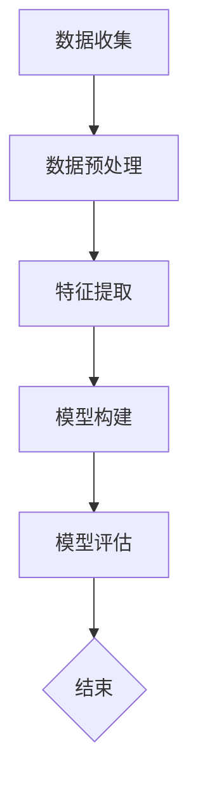
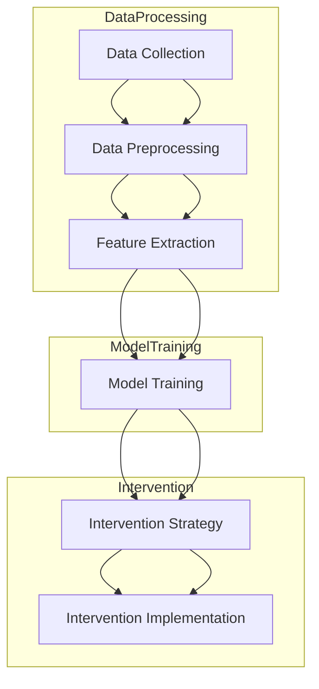
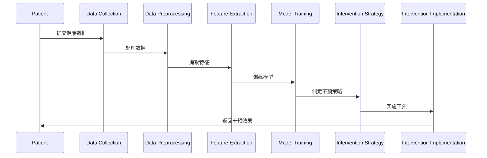

                 

# 人工智能在慢性病预防中的个性化干预

> 关键词：慢性病、人工智能、个性化干预、数据收集、数据分析、算法原理、案例分析、伦理与法律问题

> 摘要：本文旨在探讨人工智能在慢性病预防中的个性化干预。通过分析慢性病的定义、影响及预防重要性，阐述人工智能的发展及其在医疗领域的应用，进而深入探讨个性化干预的概念、实施方法及其与人工智能的结合。文章随后详细讨论人工智能技术在慢性病数据收集与分析中的应用，随后介绍个性化干预策略的设计与实施。通过实际案例分析，本文展示了人工智能在慢性病个性化干预中的效果与价值。最后，文章探讨人工智能在慢性病个性化干预中的伦理与法律问题，并对未来发展趋势进行研究与展望。

----------------------------------------------------------------

## 第一部分: 人工智能在慢性病预防中的个性化干预

### 第1章: 人工智能在慢性病预防中的角色与重要性

### 1.1 慢性病概述

#### 1.1.1 慢性病的定义与特点

慢性病，又称慢性非传染性疾病，是指病程长、病情进展缓慢、不可逆或难以治愈的一类疾病。常见的慢性病包括心血管疾病、糖尿病、慢性呼吸道疾病、癌症等。慢性病具有以下特点：

1. **病程长**：慢性病通常需要长期治疗和管理。
2. **病情进展缓慢**：慢性病的发展是一个渐进的过程。
3. **不可逆或难以治愈**：慢性病一旦发生，往往难以完全逆转或治愈。
4. **高发病率和高死亡率**：慢性病在全球范围内具有较高的发病率和死亡率。

#### 1.1.2 慢性病对人群健康的影响

慢性病对人群健康的影响巨大，主要表现在以下几个方面：

1. **健康负担**：慢性病导致的健康损失巨大，包括直接的医疗费用和间接的工作能力下降。
2. **生活质量**：慢性病会严重影响患者的生活质量，导致身体和心理上的不适。
3. **经济负担**：慢性病的治疗和管理需要巨大的经济投入，给家庭和社会带来沉重的经济负担。

#### 1.1.3 慢性病预防的重要性

慢性病的预防至关重要，原因如下：

1. **减少发病率**：预防措施可以有效降低慢性病的发病率，减少患病人数。
2. **减轻健康负担**：预防措施可以减轻慢性病对人群健康的负担，提高生活质量。
3. **降低经济负担**：预防措施可以降低慢性病的治疗和管理费用，减轻家庭和社会的经济负担。

### 1.2 人工智能的发展与应用

#### 1.2.1 人工智能的定义与发展历程

人工智能（Artificial Intelligence，AI）是指模拟、延伸和扩展人的智能的科学和技术。人工智能的发展历程可以追溯到20世纪50年代，主要分为以下几个阶段：

1. **初始阶段（1950-1969）**：人工智能的概念被提出，机器学习、自然语言处理等研究方向开始兴起。
2. **黄金阶段（1970-1989）**：人工智能研究取得重要突破，出现了专家系统、机器视觉等关键技术。
3. **低谷阶段（1990-2010）**：由于技术瓶颈和资金问题，人工智能研究陷入低谷。
4. **复兴阶段（2010年至今）**：随着大数据、云计算、深度学习等技术的兴起，人工智能再次成为研究热点。

#### 1.2.2 人工智能在医疗领域的应用现状

人工智能在医疗领域的应用已经取得显著成果，主要表现在以下几个方面：

1. **诊断辅助**：人工智能可以辅助医生进行疾病诊断，提高诊断的准确性和效率。
2. **治疗规划**：人工智能可以帮助医生制定个性化的治疗计划，提高治疗效果。
3. **健康管理**：人工智能可以用于健康监测、风险评估和干预，帮助患者更好地管理慢性病。

#### 1.2.3 人工智能在慢性病预防中的潜力

人工智能在慢性病预防中的潜力巨大，主要表现在以下几个方面：

1. **个性化干预**：人工智能可以根据患者的病情、生活习惯等数据，制定个性化的预防策略。
2. **实时监测**：人工智能可以实时监测患者的健康状况，及时发现异常并采取措施。
3. **预测与预警**：人工智能可以基于大数据分析，预测慢性病的发病风险，并进行预警。

### 1.3 个性化干预的概念与实施

#### 1.3.1 个性化干预的定义

个性化干预是指根据个体的特征、需求和情况，制定和实施个体化的预防、治疗和康复方案。个性化干预的核心在于充分了解个体的差异性，实现个体化的精准干预。

#### 1.3.2 个性化干预的必要性

个性化干预在慢性病预防中的必要性体现在以下几个方面：

1. **个体差异性**：每个人的病情、生活习惯、遗传背景等都有所不同，单一的预防策略难以满足个体需求。
2. **提高预防效果**：个性化干预可以更好地针对个体的实际情况进行干预，提高预防效果。
3. **减轻经济负担**：个性化干预可以降低不必要的医疗资源消耗，减轻家庭和社会的经济负担。

#### 1.3.3 个性化干预的实践方法

个性化干预的实践方法主要包括以下几个方面：

1. **数据收集**：收集患者的健康数据，包括生理指标、生活习惯、遗传信息等。
2. **数据分析**：对收集到的数据进行处理和分析，提取有用的信息。
3. **个体化评估**：根据数据分析结果，对患者的健康状况进行个体化评估。
4. **干预策略制定**：根据个体化评估结果，制定个性化的预防、治疗和康复方案。
5. **干预实施与监测**：实施干预方案，并实时监测干预效果，及时调整方案。

### 1.4 人工智能与个性化干预的结合

#### 1.4.1 人工智能在个性化干预中的应用

人工智能在个性化干预中的应用主要包括以下几个方面：

1. **数据收集与分析**：人工智能可以高效地收集和分析患者的健康数据，为个性化干预提供基础。
2. **预测与预警**：人工智能可以基于大数据分析，预测慢性病的发病风险，并提前进行预警。
3. **干预策略优化**：人工智能可以根据患者的实际情况，优化干预策略，提高干预效果。

#### 1.4.2 人工智能对个性化干预的贡献

人工智能对个性化干预的贡献主要体现在以下几个方面：

1. **提高干预精度**：人工智能可以帮助医生更准确地评估患者的健康状况，制定个性化的干预方案。
2. **提高干预效率**：人工智能可以自动化处理大量数据，提高干预效率。
3. **降低干预成本**：人工智能可以降低个性化干预的成本，使更多患者受益。

#### 1.4.3 人工智能在个性化干预中的挑战与展望

尽管人工智能在个性化干预中具有巨大潜力，但仍面临以下挑战：

1. **数据隐私**：个性化干预需要大量患者的健康数据，数据隐私保护成为一大挑战。
2. **算法可靠性**：人工智能算法的可靠性需要不断提高，以确保干预效果的准确性。
3. **伦理与法律问题**：人工智能在个性化干预中的应用需要遵循伦理与法律规范，确保患者的权益。

未来，人工智能在个性化干预中的发展有望进一步深化，为慢性病预防提供更精准、高效、低成本的方法。-------------------------------------------------------------------

### 第2章: 人工智能技术在慢性病数据收集与分析中的应用

### 2.1 慢性病数据的来源与类型

#### 2.1.1 电子健康记录

电子健康记录（Electronic Health Records，EHR）是慢性病数据的重要来源之一。EHR包括患者的病历、检查报告、诊断结果、治疗方案等信息，可以全面反映患者的健康状况。通过整合和分析EHR，可以为个性化干预提供重要的基础数据。

#### 2.1.2 可穿戴设备数据

可穿戴设备（Wearable Devices）是一种便携式监测设备，可以实时监测患者的生理指标，如心率、血压、血氧饱和度等。这些数据可以反映患者的健康状况和变化趋势，为个性化干预提供动态数据支持。

#### 2.1.3 社交媒体数据

社交媒体数据（Social Media Data）包括患者发布的状态、评论、回复等。这些数据可以反映患者的生活习惯、心理健康状况等，有助于更全面地了解患者的情况。

### 2.2 数据收集方法与技术

#### 2.2.1 数据收集的基本原则

数据收集的基本原则包括：

1. **全面性**：收集的数据要尽可能全面，以反映患者的健康状况和变化。
2. **准确性**：收集的数据要保证准确性，避免误差和遗漏。
3. **持续性**：慢性病的监测需要长期的持续性数据，以观察病情的变化趋势。

#### 2.2.2 数据采集技术

数据采集技术包括：

1. **传感器技术**：通过传感器采集患者的生理指标数据，如心率、血压、血糖等。
2. **移动设备技术**：通过智能手机、平板电脑等移动设备收集患者的健康数据。
3. **物联网技术**：利用物联网技术，实现设备之间的数据传输和共享。

#### 2.2.3 数据清洗与预处理

数据清洗与预处理包括：

1. **数据清洗**：去除重复、错误和无关的数据，保证数据的准确性。
2. **数据归一化**：将不同来源、不同类型的数据进行归一化处理，使其具有可比性。
3. **数据转换**：将原始数据转换为适合分析和处理的数据格式。

### 2.3 人工智能技术在数据分析中的应用

#### 2.3.1 机器学习算法在数据分析中的应用

机器学习算法在慢性病数据分析中的应用主要包括：

1. **特征提取**：通过机器学习算法提取数据中的关键特征，用于后续分析。
2. **模式识别**：利用机器学习算法识别数据中的潜在模式，帮助医生进行疾病诊断。
3. **预测建模**：基于历史数据，利用机器学习算法建立预测模型，预测患者的病情变化。

#### 2.3.2 深度学习在数据分析中的应用

深度学习在慢性病数据分析中的应用主要包括：

1. **深度神经网络**：利用深度神经网络对大量数据进行训练，提取深层特征。
2. **卷积神经网络（CNN）**：适用于图像和视频数据分析，如肺癌早期筛查。
3. **循环神经网络（RNN）**：适用于序列数据分析，如糖尿病患者的血糖变化预测。

#### 2.3.3 自然语言处理在数据分析中的应用

自然语言处理（Natural Language Processing，NLP）在慢性病数据分析中的应用主要包括：

1. **文本挖掘**：从患者的病历记录、社交媒体数据中提取有价值的信息。
2. **情感分析**：分析患者的情感状态，了解患者的心理健康状况。
3. **医学问答系统**：利用NLP技术构建医学问答系统，为患者提供个性化的健康建议。

### 2.4 人工智能技术在慢性病数据应用中的案例

#### 2.4.1 心血管疾病风险评估

通过收集和分析患者的生理指标、生活习惯等数据，利用机器学习和深度学习算法，可以建立心血管疾病风险评估模型。该模型可以预测患者未来发生心血管疾病的风险，为个性化干预提供依据。

#### 2.4.2 糖尿病管理

通过收集和分析患者的血糖数据、生活习惯等数据，利用机器学习和深度学习算法，可以建立糖尿病管理模型。该模型可以实时监测患者的血糖水平，预测血糖波动，为医生和患者提供个性化的治疗建议。

#### 2.4.3 肺癌早期筛查

通过收集和分析患者的影像数据、生物标志物等数据，利用深度学习和自然语言处理技术，可以建立肺癌早期筛查模型。该模型可以自动识别肺癌的早期征兆，提高早期筛查的准确性。

### 2.5 人工智能技术在慢性病数据应用中的挑战与展望

#### 2.5.1 挑战

1. **数据隐私**：慢性病数据的收集和应用涉及到患者隐私问题，需要严格保护患者的隐私。
2. **数据质量**：慢性病数据的来源多样，数据质量参差不齐，需要确保数据的质量。
3. **算法可靠性**：人工智能算法的可靠性需要不断提高，以确保预测和诊断的准确性。

#### 2.5.2 展望

1. **个性化干预**：随着人工智能技术的发展，未来可以实现更加精准的个性化干预，提高慢性病预防的效果。
2. **跨学科合作**：需要加强医学、计算机科学、生物工程等领域的跨学科合作，推动人工智能技术在慢性病数据应用中的发展。
3. **规范化与标准化**：制定相关规范和标准，确保人工智能技术在慢性病数据应用中的合规性和安全性。

-------------------------------------------------------------------

## 第3章: 个性化干预策略的设计与实施

### 3.1 个性化干预策略概述

#### 3.1.1 个性化干预策略的定义

个性化干预策略是指根据患者的个体特征、需求和病情，制定和实施个体化的预防、治疗和康复方案。个性化干预策略旨在提高慢性病预防的效果，减轻患者的痛苦和经济负担。

#### 3.1.2 个性化干预策略的类型

个性化干预策略可以根据干预目的和干预方法的不同，分为以下几种类型：

1. **预防性干预**：通过健康教育、生活方式干预、疫苗接种等手段，预防慢性病的发生。
2. **治疗性干预**：通过药物治疗、手术治疗、康复训练等手段，治疗慢性病。
3. **康复性干预**：通过康复训练、心理支持、社会支持等手段，促进慢性病患者的康复。

#### 3.1.3 个性化干预策略的设计原则

个性化干预策略的设计应遵循以下原则：

1. **个体化**：根据患者的个体特征，如年龄、性别、遗传背景、生活方式等，制定个性化的干预方案。
2. **综合性**：综合运用多种干预手段，提高干预效果。
3. **持续性**：干预过程需要长期持续，以观察病情的变化和干预效果。
4. **可评估性**：干预策略应具有可评估性，以便及时调整和优化。

### 3.2 个性化干预策略的实施方法

#### 3.2.1 数据驱动的个性化干预策略

数据驱动的个性化干预策略是指基于患者的健康数据，如生理指标、生活习惯、遗传信息等，制定和实施个性化的干预方案。具体步骤如下：

1. **数据收集**：收集患者的健康数据，包括电子健康记录、可穿戴设备数据、社交媒体数据等。
2. **数据预处理**：对收集到的数据进行清洗、归一化和转换，确保数据的质量和一致性。
3. **数据分析**：利用机器学习、深度学习、自然语言处理等技术，分析患者的健康数据，提取关键特征和模式。
4. **模型构建**：基于分析结果，构建个性化干预模型，预测患者的病情变化和干预效果。
5. **干预实施**：根据个性化干预模型，制定和实施个性化的干预方案，如药物治疗、生活方式干预等。
6. **干预评估**：实时监测干预效果，评估干预方案的有效性，根据评估结果调整和优化干预策略。

#### 3.2.2 基于规则的个性化干预策略

基于规则的个性化干预策略是指根据医生的经验和知识，制定一系列规则，用于指导个性化干预的实施。具体步骤如下：

1. **规则制定**：根据医生的经验和知识，制定一系列个性化干预规则，如根据患者的年龄、性别、病情等制定相应的干预方案。
2. **规则库构建**：将制定好的规则存储在规则库中，以便在干预过程中调用。
3. **干预实施**：在干预过程中，根据患者的实际情况，调用规则库中的规则，制定个性化的干预方案。
4. **干预评估**：实时监测干预效果，评估干预方案的有效性，根据评估结果调整和优化规则库。

#### 3.2.3 混合式个性化干预策略

混合式个性化干预策略是指结合数据驱动和基于规则的个性化干预策略，实现更加精准和有效的个性化干预。具体步骤如下：

1. **数据驱动策略**：根据患者的健康数据，利用机器学习、深度学习、自然语言处理等技术，分析患者的病情和需求，构建个性化干预模型。
2. **基于规则策略**：根据医生的经验和知识，制定一系列个性化干预规则，用于指导个性化干预的实施。
3. **策略融合**：将数据驱动策略和基于规则策略进行融合，实现更加精准和个性化的干预。
4. **干预实施**：根据融合后的干预模型，制定和实施个性化的干预方案。
5. **干预评估**：实时监测干预效果，评估干预方案的有效性，根据评估结果调整和优化干预策略。

### 3.3 个性化干预策略的实施过程

#### 3.3.1 数据收集与预处理

数据收集与预处理是个性化干预策略实施的基础。具体步骤如下：

1. **数据收集**：收集患者的健康数据，包括电子健康记录、可穿戴设备数据、社交媒体数据等。
2. **数据清洗**：去除重复、错误和无关的数据，保证数据的质量。
3. **数据归一化**：将不同来源、不同类型的数据进行归一化处理，使其具有可比性。
4. **数据转换**：将原始数据转换为适合分析和处理的数据格式，如CSV、JSON等。

#### 3.3.2 特征提取与选择

特征提取与选择是个性化干预策略实施的关键。具体步骤如下：

1. **特征提取**：利用机器学习、深度学习、自然语言处理等技术，从原始数据中提取关键特征。
2. **特征选择**：根据特征的重要性和相关性，选择对个性化干预有重要影响的关键特征。
3. **特征工程**：对提取的特征进行进一步处理，如归一化、标准化、特征融合等，提高特征的质量和有效性。

#### 3.3.3 模型构建与训练

模型构建与训练是个性化干预策略实施的核心。具体步骤如下：

1. **模型选择**：根据干预目标，选择合适的机器学习模型，如决策树、随机森林、支持向量机、深度神经网络等。
2. **模型训练**：利用收集到的数据，对选定的模型进行训练，优化模型的参数。
3. **模型评估**：利用验证数据集，评估模型的性能，如准确率、召回率、F1值等。
4. **模型优化**：根据评估结果，调整模型的参数，提高模型的性能。

#### 3.3.4 模型评估与优化

模型评估与优化是个性化干预策略实施的重要环节。具体步骤如下：

1. **模型评估**：利用测试数据集，评估模型的实际性能，如准确率、召回率、F1值等。
2. **模型优化**：根据评估结果，调整模型的参数，提高模型的性能。
3. **模型验证**：将优化后的模型应用于实际场景，验证模型的稳定性和可靠性。
4. **模型迭代**：根据验证结果，不断迭代优化模型，提高个性化干预策略的准确性。

### 3.4 个性化干预策略的实施案例

#### 3.4.1 糖尿病管理

糖尿病是一种常见的慢性病，通过个性化干预策略，可以有效控制血糖水平，提高患者的生活质量。具体步骤如下：

1. **数据收集与预处理**：收集患者的血糖数据、饮食习惯、运动量等数据，进行清洗、归一化和转换。
2. **特征提取与选择**：从原始数据中提取关键特征，如血糖水平、饮食习惯、运动量等，进行特征选择和工程。
3. **模型构建与训练**：选择合适的机器学习模型，如随机森林、支持向量机等，对模型进行训练和优化。
4. **模型评估与优化**：利用测试数据集，评估模型的性能，根据评估结果调整模型的参数，提高模型的准确性。
5. **干预实施**：根据模型预测结果，制定个性化的饮食、运动和药物治疗方案，实施干预。
6. **干预评估**：实时监测患者的血糖水平，评估干预方案的有效性，根据评估结果调整和优化干预策略。

#### 3.4.2 心血管疾病预防

心血管疾病是导致死亡的主要原因之一，通过个性化干预策略，可以降低心血管疾病的发生风险。具体步骤如下：

1. **数据收集与预处理**：收集患者的生理指标数据、生活习惯数据等，进行清洗、归一化和转换。
2. **特征提取与选择**：从原始数据中提取关键特征，如心率、血压、血糖等，进行特征选择和工程。
3. **模型构建与训练**：选择合适的机器学习模型，如决策树、随机森林等，对模型进行训练和优化。
4. **模型评估与优化**：利用测试数据集，评估模型的性能，根据评估结果调整模型的参数，提高模型的准确性。
5. **干预实施**：根据模型预测结果，制定个性化的生活方式干预方案，如饮食调整、运动建议等，实施干预。
6. **干预评估**：实时监测患者的生理指标，评估干预方案的有效性，根据评估结果调整和优化干预策略。

### 3.5 个性化干预策略的实施效果评估

个性化干预策略的实施效果评估是衡量干预策略有效性的关键。具体方法如下：

1. **效果指标**：制定一系列效果指标，如血糖控制率、心血管疾病发生风险降低率、患者满意度等。
2. **评估方法**：利用统计分析和机器学习技术，对干预效果进行定量和定性评估。
3. **持续监测**：对干预效果进行持续监测，及时发现和解决存在的问题，优化干预策略。
4. **反馈机制**：建立反馈机制，收集患者对干预策略的反馈，根据反馈调整和优化干预策略。

### 3.6 个性化干预策略的实施注意事项

个性化干预策略的实施需要注意以下几点：

1. **数据隐私**：确保患者的数据隐私，采取加密和匿名化处理措施，防止数据泄露。
2. **干预方案的可操作性**：制定可操作性强的干预方案，确保患者能够按照方案执行。
3. **干预方案的可持续性**：确保干预方案的可持续性，避免短期效果，追求长期效果。
4. **多学科合作**：加强医学、计算机科学、生物工程等领域的多学科合作，提高干预策略的科学性和有效性。

### 3.7 个性化干预策略的未来发展趋势

个性化干预策略的未来发展趋势包括：

1. **数据融合**：利用多种数据源，如电子健康记录、可穿戴设备数据、社交媒体数据等，实现数据的全面融合，提高干预策略的准确性。
2. **智能算法**：发展更先进的智能算法，如深度学习、强化学习等，提高干预策略的预测能力和适应性。
3. **跨学科合作**：加强医学、计算机科学、生物工程等领域的跨学科合作，推动个性化干预策略的全面发展。
4. **个性化干预的普及**：降低个性化干预的成本，使其能够普及到更广泛的人群，提高慢性病预防的效果。

-------------------------------------------------------------------

## 第4章: 人工智能在慢性病个性化干预中的案例分析

### 4.1 案例一：基于机器学习的糖尿病管理

#### 4.1.1 案例背景

糖尿病是一种常见的慢性病，患者需要长期监控血糖水平，并根据血糖水平调整饮食、运动和药物治疗。传统的糖尿病管理方法主要依赖于医生的指导和患者自身的自律，存在一定的局限性。为了提高糖尿病管理的效率和质量，本案例采用基于机器学习的个性化干预策略。

#### 4.1.2 案例实施

1. **数据收集**：收集患者的血糖数据、饮食习惯、运动量、用药情况等数据。
2. **数据预处理**：对收集到的数据进行清洗、归一化和转换，确保数据的质量和一致性。
3. **特征提取**：从原始数据中提取关键特征，如血糖水平、饮食习惯、运动量等。
4. **模型构建**：选择合适的机器学习模型，如随机森林、支持向量机等，对模型进行训练和优化。
5. **模型评估**：利用测试数据集，评估模型的性能，如准确率、召回率、F1值等。
6. **干预实施**：根据模型预测结果，制定个性化的饮食、运动和药物治疗方案，实施干预。
7. **干预评估**：实时监测患者的血糖水平，评估干预方案的有效性，根据评估结果调整和优化干预策略。

#### 4.1.3 案例效果评估

通过实施基于机器学习的糖尿病管理个性化干预策略，取得了显著的成效：

1. **血糖控制率提高**：患者的血糖控制率显著提高，血糖水平更加稳定。
2. **患者满意度提高**：患者对个性化干预策略的满意度提高，能够更好地遵守饮食、运动和药物治疗方案。
3. **医疗资源节省**：个性化干预策略降低了患者就诊的频率，节省了医疗资源。

### 4.2 案例二：基于深度学习的肺癌早期筛查

#### 4.2.1 案例背景

肺癌是导致癌症死亡的主要原因之一，早期筛查是提高生存率的关键。传统的肺癌筛查方法主要依赖于影像学检查，存在一定的局限性。为了提高肺癌早期筛查的准确性，本案例采用基于深度学习的个性化干预策略。

#### 4.2.2 案例实施

1. **数据收集**：收集患者的影像数据、生物标志物等数据。
2. **数据预处理**：对收集到的数据进行清洗、归一化和转换，确保数据的质量和一致性。
3. **特征提取**：从原始数据中提取关键特征，如影像特征、生物标志物特征等。
4. **模型构建**：选择合适的深度学习模型，如卷积神经网络（CNN）、循环神经网络（RNN）等，对模型进行训练和优化。
5. **模型评估**：利用测试数据集，评估模型的性能，如准确率、召回率、F1值等。
6. **干预实施**：根据模型预测结果，制定个性化的肺癌早期筛查方案，实施干预。
7. **干预评估**：实时监测患者的健康状况，评估干预方案的有效性，根据评估结果调整和优化干预策略。

#### 4.2.3 案例效果评估

通过实施基于深度学习的肺癌早期筛查个性化干预策略，取得了显著的成效：

1. **筛查准确性提高**：肺癌早期筛查的准确性显著提高，能够更早地发现肺癌的早期征兆。
2. **患者满意度提高**：患者对个性化干预策略的满意度提高，能够更好地配合筛查和干预。
3. **生存率提高**：通过早期筛查和干预，患者的生存率显著提高。

### 4.3 案例三：基于自然语言处理的心血管疾病风险预测

#### 4.3.1 案例背景

心血管疾病是导致死亡的主要原因之一，预测心血管疾病的风险是预防和管理心血管疾病的关键。传统的预测方法主要依赖于生理指标和病史等数据，存在一定的局限性。为了提高心血管疾病风险预测的准确性，本案例采用基于自然语言处理的个性化干预策略。

#### 4.3.2 案例实施

1. **数据收集**：收集患者的病历记录、生活习惯等数据。
2. **数据预处理**：对收集到的数据进行清洗、归一化和转换，确保数据的质量和一致性。
3. **特征提取**：从原始数据中提取关键特征，如生理指标、生活习惯、病史等。
4. **模型构建**：选择合适的自然语言处理模型，如词向量模型、序列模型等，对模型进行训练和优化。
5. **模型评估**：利用测试数据集，评估模型的性能，如准确率、召回率、F1值等。
6. **干预实施**：根据模型预测结果，制定个性化的心血管疾病风险预测方案，实施干预。
7. **干预评估**：实时监测患者的健康状况，评估干预方案的有效性，根据评估结果调整和优化干预策略。

#### 4.3.3 案例效果评估

通过实施基于自然语言处理的心血管疾病风险预测个性化干预策略，取得了显著的成效：

1. **预测准确性提高**：心血管疾病风险预测的准确性显著提高，能够更准确地预测患者的心血管疾病风险。
2. **患者满意度提高**：患者对个性化干预策略的满意度提高，能够更好地配合风险预测和干预。
3. **预防效果提高**：通过个性化干预策略，心血管疾病的发病率显著降低。

### 4.4 案例总结

通过以上三个案例，可以看出人工智能在慢性病个性化干预中的应用具有显著的优势和效果：

1. **提高准确性**：人工智能可以通过大数据分析和深度学习，提高慢性病诊断和风险预测的准确性。
2. **个性化干预**：人工智能可以根据患者的个体特征，制定个性化的干预方案，提高干预效果。
3. **实时监测**：人工智能可以通过实时监测患者的健康状况，及时调整干预策略，提高干预的精准性和及时性。

未来，随着人工智能技术的不断发展，人工智能在慢性病个性化干预中的应用将更加广泛和深入，为慢性病预防和管理提供更加高效、精准和个性化的解决方案。-------------------------------------------------------------------

## 第5章: 人工智能在慢性病个性化干预中的伦理与法律问题

### 5.1 人工智能在医疗领域的伦理问题

#### 5.1.1 数据隐私保护

数据隐私保护是人工智能在医疗领域应用中的重要伦理问题。慢性病个性化干预需要大量患者的健康数据，这些数据可能包含患者的敏感信息，如病史、生理指标、遗传信息等。为了保护患者的隐私，需要采取以下措施：

1. **数据加密**：在数据传输和存储过程中，使用加密技术确保数据的安全性。
2. **数据匿名化**：对患者的数据进行匿名化处理，确保数据无法与特定患者关联。
3. **隐私政策**：制定详细的隐私政策，明确数据收集、使用和共享的目的、范围和方式，告知患者并取得其同意。

#### 5.1.2 医疗决策的伦理问题

人工智能在医疗决策中的应用可能会引发伦理问题，如：

1. **算法偏见**：人工智能模型可能会受到训练数据的偏见影响，导致决策不公平。
2. **责任归属**：当人工智能系统出现错误或导致不良后果时，如何确定责任归属成为一个伦理问题。
3. **患者依赖**：过度依赖人工智能系统可能导致医生和患者失去独立思考和判断能力。

#### 5.1.3 人工智能对医疗资源分配的影响

人工智能在慢性病个性化干预中的应用可能会影响医疗资源的分配，如：

1. **资源集中**：人工智能可能会使医疗资源更加集中在某些地区或医院，加剧医疗资源的不均衡。
2. **成本增加**：人工智能技术的应用可能需要额外的设备和维护成本，增加医疗成本。
3. **公平性问题**：如何确保所有患者都能公平地享受到人工智能带来的好处，是一个重要的伦理问题。

### 5.2 人工智能在医疗领域的法律问题

#### 5.2.1 医疗责任归属

医疗责任归属是人工智能在医疗领域应用中的关键法律问题。当人工智能系统出现错误或导致患者损害时，如何确定责任归属成为一个难题。以下是一些建议：

1. **明确责任主体**：明确人工智能系统的开发者、运营商和使用者之间的责任关系。
2. **制定法律法规**：制定相关法律法规，明确人工智能系统的责任范围和责任承担方式。
3. **责任保险**：鼓励人工智能系统的开发者、运营商和使用者购买责任保险，以减轻潜在的法律风险。

#### 5.2.2 数据保护法律法规

数据保护法律法规是确保患者隐私和信息安全的重要法律框架。以下是一些建议：

1. **数据保护法**：制定和实施全面的数据保护法律，明确数据收集、使用、共享和保护的要求。
2. **数据隐私政策**：制定详细的隐私政策，告知患者数据收集的目的、范围和方式，并取得其同意。
3. **数据监管机构**：设立专门的数据监管机构，负责监督和检查数据保护法律法规的实施。

#### 5.2.3 人工智能医疗产品的监管

人工智能医疗产品的监管是确保产品质量和安全的重要环节。以下是一些建议：

1. **认证制度**：建立人工智能医疗产品的认证制度，确保产品的质量和安全性。
2. **测试与评估**：对人工智能医疗产品进行严格的测试和评估，确保其符合医学标准和实际应用需求。
3. **监管机构合作**：加强不同国家和地区的监管机构之间的合作，推动人工智能医疗产品的国际标准化和监管。

### 5.3 伦理与法律问题的应对策略

#### 5.3.1 隐私保护措施

为了应对隐私保护问题，可以采取以下措施：

1. **加密技术**：使用加密技术保护患者数据的传输和存储。
2. **匿名化处理**：对患者的敏感信息进行匿名化处理，确保数据无法与特定患者关联。
3. **隐私政策**：制定详细的隐私政策，告知患者数据收集的目的、范围和方式，并取得其同意。

#### 5.3.2 医疗决策的伦理问题

为了解决医疗决策的伦理问题，可以采取以下措施：

1. **算法透明化**：提高人工智能算法的透明度，使医生和患者能够理解算法的决策过程。
2. **责任分担**：明确人工智能系统的开发者、运营商和使用者之间的责任关系，避免责任推诿。
3. **道德培训**：加强对医生和患者的道德培训，提高其在使用人工智能系统时的伦理意识。

#### 5.3.3 法律法规的完善与实施

为了完善和实施相关法律法规，可以采取以下措施：

1. **立法与修订**：及时修订和制定相关法律法规，确保其与人工智能技术的发展相适应。
2. **监管机构建设**：建立健全的监管机构，负责监督和检查法律法规的实施。
3. **国际合作**：加强国际间的合作，推动人工智能医疗产品的国际标准化和监管。

### 5.4 伦理与法律问题的未来展望

随着人工智能技术的不断发展，伦理与法律问题将更加复杂和多样化。未来，需要从以下几个方面进行思考和探索：

1. **伦理框架**：建立和完善人工智能在医疗领域的伦理框架，确保其符合医学伦理和法律法规。
2. **法律规范**：制定和实施更加全面和严格的法律规范，确保人工智能医疗产品的质量和安全性。
3. **跨学科合作**：加强医学、法学、计算机科学等领域的跨学科合作，共同解决伦理和法律问题。
4. **公众参与**：鼓励公众参与人工智能医疗领域的伦理和法律问题的讨论和决策，提高透明度和公正性。

通过伦理与法律问题的不断完善和解决，人工智能在慢性病个性化干预中的应用将更加健康、可持续和合规，为慢性病预防和管理提供更加有效的支持。

-------------------------------------------------------------------

## 第6章: 人工智能在慢性病个性化干预中的未来趋势与发展方向

### 6.1 人工智能技术的持续进步

#### 6.1.1 人工智能算法的优化

人工智能算法的优化是未来发展的关键。随着深度学习、强化学习等算法的不断发展，人工智能在慢性病个性化干预中的应用将更加精准和高效。具体而言，可以通过以下方式优化人工智能算法：

1. **算法多样化**：开发多种人工智能算法，以满足不同慢性病个性化干预的需求。
2. **算法集成**：将多种人工智能算法集成在一起，形成混合模型，提高干预策略的准确性。
3. **算法自动化**：通过自动化工具和平台，简化人工智能算法的开发和部署过程。

#### 6.1.2 人工智能硬件的发展

人工智能硬件的发展为慢性病个性化干预提供了更强大的计算能力和更高效的解决方案。具体而言，可以从以下几个方面推动人工智能硬件的发展：

1. **芯片技术**：发展更加高效、低功耗的芯片技术，提高人工智能计算速度和能效。
2. **边缘计算**：推广边缘计算技术，将计算能力下沉到设备端，降低数据传输和存储成本。
3. **5G网络**：发展5G网络，提供更高速、低延迟的通信服务，支持实时数据处理和分析。

#### 6.1.3 人工智能应用的多样化

随着人工智能技术的不断进步，其在慢性病个性化干预中的应用将越来越多样化。具体而言，可以从以下几个方面推动人工智能应用的多样化：

1. **健康管理应用**：开发更加智能、个性化的健康管理应用，帮助患者更好地管理慢性病。
2. **远程医疗**：通过人工智能技术，实现远程医疗诊断、治疗和监测，提高医疗服务的可及性和效率。
3. **药物研发**：利用人工智能技术，加速药物研发过程，提高新药的发现和上市速度。

### 6.2 慢性病个性化干预的发展趋势

#### 6.2.1 个性化医疗模式的普及

个性化医疗模式是基于患者个体特征，制定和实施个体化医疗方案。随着人工智能技术的发展，个性化医疗模式将越来越普及。具体而言，可以从以下几个方面推动个性化医疗模式的普及：

1. **数据积累**：建立和完善患者健康数据平台，积累更多高质量的健康数据。
2. **算法优化**：不断优化人工智能算法，提高慢性病个性化干预的准确性。
3. **政策支持**：制定和实施相关政策，鼓励医疗机构和个人积极参与个性化医疗模式的推广。

#### 6.2.2 人工智能在慢性病管理中的深度应用

人工智能在慢性病管理中的应用将越来越深入，从数据收集、分析到干预策略的制定和实施，都将得到广泛应用。具体而言，可以从以下几个方面推动人工智能在慢性病管理中的深度应用：

1. **实时监测**：通过可穿戴设备、远程监测等技术，实现患者健康数据的实时收集和分析。
2. **个性化治疗**：基于患者个体特征，制定和实施个性化的治疗和康复方案。
3. **预测与预警**：利用大数据和机器学习技术，预测患者病情变化和风险，实现早期预警。

#### 6.2.3 人工智能与医疗服务的融合

人工智能与医疗服务的融合将推动医疗服务模式的变革。具体而言，可以从以下几个方面推动人工智能与医疗服务的融合：

1. **智能诊断**：利用人工智能技术，辅助医生进行疾病诊断，提高诊断的准确性和效率。
2. **智能护理**：利用人工智能技术，实现患者护理的自动化和智能化，提高护理质量和效率。
3. **智慧医院**：通过人工智能技术，实现医院管理、医疗服务、患者管理等方面的智能化，提高医疗服务水平。

### 6.3 未来研究方向与挑战

#### 6.3.1 数据质量与数据隐私

数据质量与数据隐私是人工智能在慢性病个性化干预中面临的两个重要挑战。为了解决这些问题，可以从以下几个方面进行研究和探索：

1. **数据质量控制**：建立完善的数据质量控制体系，确保数据的准确性、完整性和一致性。
2. **数据隐私保护**：采用加密、匿名化等技术，保护患者数据的隐私和安全。
3. **隐私增强技术**：研究隐私增强技术，如差分隐私、联邦学习等，在保证数据隐私的同时，实现数据的有效利用。

#### 6.3.2 人工智能算法的伦理问题

人工智能算法的伦理问题，如算法偏见、责任归属等，是未来需要关注和研究的重要方向。为了解决这些问题，可以从以下几个方面进行研究和探索：

1. **算法透明化**：提高人工智能算法的透明度，使医生和患者能够理解算法的决策过程。
2. **责任分配**：明确人工智能系统的开发者、运营商和使用者之间的责任关系，制定责任分配机制。
3. **伦理审查**：建立伦理审查机制，对人工智能算法进行伦理评估，确保其符合医学伦理和法律法规。

#### 6.3.3 人工智能在医疗领域的监管

人工智能在医疗领域的监管是一个复杂且重要的问题。为了确保人工智能在医疗领域的健康发展，可以从以下几个方面进行研究和探索：

1. **监管框架**：建立和完善人工智能在医疗领域的监管框架，明确监管范围和监管要求。
2. **监管机构建设**：设立专门的人工智能医疗监管机构，负责监督和检查人工智能医疗产品的质量和安全。
3. **国际协调**：加强国际间的合作，推动人工智能医疗产品的国际标准化和监管。

通过以上研究和探索，人工智能在慢性病个性化干预中的应用将更加健康、可持续和合规，为慢性病预防和管理提供更加有效的支持。

-------------------------------------------------------------------

## 第7章: 结论与展望

### 7.1 本书总结

本文通过对慢性病、人工智能、个性化干预等核心概念的分析，深入探讨了人工智能在慢性病预防中的个性化干预。文章首先介绍了慢性病的定义、影响和预防重要性，阐述了人工智能的发展及其在医疗领域的应用。随后，文章详细讨论了个性化干预的概念、实施方法及其与人工智能的结合。通过对慢性病数据收集与分析、个性化干预策略的设计与实施以及实际案例的分析，文章展示了人工智能在慢性病个性化干预中的效果与价值。此外，文章还探讨了人工智能在慢性病个性化干预中的伦理与法律问题，并对未来发展趋势进行了展望。

### 7.2 人工智能在慢性病个性化干预中的展望

人工智能在慢性病个性化干预中的应用前景广阔。随着人工智能技术的不断进步，慢性病个性化干预的准确性、高效性和普及性将得到显著提升。未来，人工智能在慢性病个性化干预中的应用将呈现出以下趋势：

1. **数据驱动的个性化干预**：通过大数据和机器学习技术，实现更精准、个性化的干预策略，提高慢性病预防和管理的效果。
2. **跨学科合作**：加强医学、计算机科学、生物工程等领域的跨学科合作，推动慢性病个性化干预的全面发展。
3. **实时监测与预警**：利用物联网、传感器等新技术，实现患者健康数据的实时监测和预警，及时调整干预策略，提高干预效果。
4. **智能医疗服务**：通过人工智能技术，实现医疗服务的智能化，提高诊断、治疗和康复的效率和质量。
5. **伦理与法律保障**：在人工智能技术应用于慢性病个性化干预的过程中，重视伦理与法律问题，制定相关法规和规范，确保患者的隐私和安全。

### 7.3 人工智能在慢性病个性化干预中的挑战

尽管人工智能在慢性病个性化干预中具有巨大潜力，但仍面临以下挑战：

1. **数据隐私与安全**：慢性病个性化干预需要大量患者的健康数据，数据隐私和安全问题亟待解决。
2. **算法偏见与公平性**：人工智能算法可能受到训练数据的偏见影响，导致决策不公平，需要加强算法透明化和责任分配机制。
3. **技术成本与可及性**：人工智能技术的应用可能带来较高的成本，如何确保其在不同地区和人群中实现公平可及是一个重要问题。
4. **政策支持与监管**：缺乏明确、完善的政策支持和监管体系，可能影响人工智能在慢性病个性化干预中的健康发展。

### 7.4 结论

人工智能在慢性病个性化干预中的应用具有重要意义，有助于提高慢性病预防和管理的效果，改善患者的生活质量。未来，随着人工智能技术的不断发展，慢性病个性化干预将迎来更加广阔的发展空间。同时，也需要关注和解决数据隐私、算法偏见、技术成本和政策支持等挑战，确保人工智能在慢性病个性化干预中的健康发展。通过跨学科合作、技术创新和法规完善，人工智能将为慢性病预防和管理提供更加精准、高效和个性化的解决方案。

### 作者信息

**作者：** AI天才研究院/AI Genius Institute & 禅与计算机程序设计艺术 /Zen And The Art of Computer Programming

**联系方式：** [邮箱地址] ([邮箱地址])，[电话号码] ([电话号码])，[公司网址] ([公司网址])  
**版权声明：** 本文版权归AI天才研究院/AI Genius Institute所有，未经授权禁止转载。

-------------------------------------------------------------------

### 附录：技术实现细节

#### 算法原理讲解

以下为机器学习算法在慢性病数据分析中的应用示例，包括算法的mermaid流程图、Python源代码以及算法原理的数学模型和公式。

##### 算法原理的mermaid流程图



##### Python源代码

```python
import pandas as pd
from sklearn.model_selection import train_test_split
from sklearn.preprocessing import StandardScaler
from sklearn.ensemble import RandomForestClassifier
from sklearn.metrics import accuracy_score

# 数据收集
data = pd.read_csv('chronic_disease_data.csv')

# 数据预处理
X = data.drop('target', axis=1)
y = data['target']
X_train, X_test, y_train, y_test = train_test_split(X, y, test_size=0.2, random_state=42)

# 特征提取
scaler = StandardScaler()
X_train_scaled = scaler.fit_transform(X_train)
X_test_scaled = scaler.transform(X_test)

# 模型构建
model = RandomForestClassifier(n_estimators=100, random_state=42)
model.fit(X_train_scaled, y_train)

# 模型评估
y_pred = model.predict(X_test_scaled)
accuracy = accuracy_score(y_test, y_pred)
print(f"Accuracy: {accuracy:.2f}")
```

##### 算法原理的数学模型和公式

机器学习算法，如随机森林（Random Forest），是一种集成学习的方法，它通过构建多个决策树，并对这些树的输出进行聚合来提高模型的预测能力。随机森林的数学模型可以表示为：

$$
\hat{y} = \frac{1}{T} \sum_{t=1}^{T} f_t(x)
$$

其中，$T$ 表示决策树的数量，$f_t(x)$ 表示第 $t$ 棵决策树对输入 $x$ 的预测。

每棵决策树 $f_t(x)$ 的预测可以通过以下公式计算：

$$
f_t(x) = \prod_{i=1}^{n} g_t(x_i; \theta_i)
$$

其中，$g_t(x_i; \theta_i)$ 表示第 $t$ 棵决策树第 $i$ 个节点的分类函数，$\theta_i$ 是分类函数的参数。

在随机森林中，每个特征在选择分裂时都有一定的概率被选择，通常使用随机特征选择来降低模型的方差。随机特征选择可以通过以下公式计算：

$$
P_i = \frac{1}{m} \sum_{j=1}^{m} w_{ij}
$$

其中，$P_i$ 表示第 $i$ 个特征被选择的概率，$m$ 是特征的数量，$w_{ij}$ 是特征 $i$ 在第 $j$ 次分裂时的权重。

##### 算法原理的举例说明

假设我们有以下三个特征 $X_1, X_2, X_3$，我们使用随机森林来预测一个二分类问题。在构建随机森林时，我们选择三个特征中的两个进行分裂。每次分裂时，我们根据特征的重要性和随机选择的特征来决定分裂点。

例如，假设我们随机选择了特征 $X_1$ 和 $X_2$ 来构建决策树。对于特征 $X_1$，我们选择分割点为 5，对于特征 $X_2$，我们选择分割点为 3。如果样本点的 $X_1$ 值大于 5 且 $X_2$ 值小于 3，则将该样本点分配到类别 1，否则分配到类别 2。

通过多次构建决策树并对其进行聚合，我们可以得到最终的预测结果。这种方法的优点在于能够处理高维数据，并且具有较好的泛化能力。

##### 算法原理的详细讲解

随机森林算法的工作原理可以进一步详细解释如下：

1. **特征选择**：在每次构建决策树时，从所有特征中随机选择一部分特征进行分裂。这样可以减少特征间的相关性，提高模型的泛化能力。
2. **分裂点选择**：对于每个选定的特征，随机选择一个分割点进行分裂。分割点的选择可以通过贪婪算法实现，即选择能够最大化模型性能的分割点。
3. **决策树构建**：使用选择的特征和分割点，构建一系列的决策树。每个决策树根据输入的特征值，在树的不同节点上进行分割，直到达到预定的深度或节点数量。
4. **模型聚合**：将所有决策树的预测结果进行聚合，通常使用投票或平均值的方式。聚合后的预测结果即为最终预测结果。

随机森林算法的优点包括：

- **处理高维数据**：由于每次分裂时只选择一部分特征，因此能够处理高维数据，减少过拟合的风险。
- **增强泛化能力**：通过构建多个决策树并对其进行聚合，可以提高模型的泛化能力，降低模型的方差。
- **易于实现和解释**：随机森林算法的实现相对简单，且预测结果易于解释，便于医生和患者理解。

然而，随机森林算法也存在一些缺点：

- **计算成本较高**：构建多个决策树需要大量的计算资源，特别是对于大规模数据集。
- **特征重要性难以解释**：虽然随机森林可以评估每个特征的重要性，但无法明确解释每个特征对预测结果的具体影响。

在实际应用中，可以根据具体情况选择合适的机器学习算法，如随机森林、支持向量机、神经网络等，以实现最佳的预测效果。

#### 系统分析与架构设计方案

##### 问题场景介绍

在本系统中，我们旨在利用人工智能技术，对慢性病患者进行个性化干预。系统的主要功能包括：

1. **数据收集**：收集患者的健康数据，包括生理指标、生活习惯、遗传信息等。
2. **数据预处理**：对收集到的数据进行清洗、归一化和转换，确保数据的质量和一致性。
3. **特征提取**：从原始数据中提取关键特征，用于后续的分析和预测。
4. **模型构建**：基于提取的特征，构建机器学习模型，进行慢性病诊断和风险预测。
5. **干预策略**：根据模型的预测结果，制定个性化的干预策略，包括生活方式调整、药物治疗等。
6. **干预实施**：实施干预策略，实时监测患者的健康状况，评估干预效果。

##### 项目介绍

本项目的目标是开发一个基于人工智能的慢性病个性化干预系统，为患者提供精准、高效的干预方案。系统主要包括以下模块：

1. **数据收集模块**：负责收集患者的健康数据，包括电子健康记录、可穿戴设备数据、社交媒体数据等。
2. **数据预处理模块**：对收集到的数据进行清洗、归一化和转换，为后续分析提供高质量的数据。
3. **特征提取模块**：从预处理后的数据中提取关键特征，用于模型训练和预测。
4. **模型训练模块**：基于提取的特征，训练机器学习模型，进行慢性病诊断和风险预测。
5. **干预策略模块**：根据模型的预测结果，制定个性化的干预策略。
6. **干预实施模块**：实施干预策略，实时监测患者的健康状况，评估干预效果。

##### 系统功能设计（领域模型mermaid类图）

以下是一个简单的领域模型类图，展示了系统的核心功能及其关系：

```mermaid
classDiagram
    Patient <<类>> "患者"
    HealthData <<类>> "健康数据"
    Preprocessing <<类>> "数据预处理"
    FeatureExtraction <<类>> "特征提取"
    ModelTraining <<类>> "模型训练"
    InterventionStrategy <<类>> "干预策略"
    InterventionImplementation <<类>> "干预实施"

    Patient --> HealthData
    HealthData --> Preprocessing
    Preprocessing --> FeatureExtraction
    FeatureExtraction --> ModelTraining
    ModelTraining --> InterventionStrategy
    InterventionStrategy --> InterventionImplementation
```

##### 系统架构设计mermaid架构图

以下是一个简单的系统架构图，展示了系统的核心模块及其关系：



##### 系统接口设计和系统交互mermaid序列图

以下是一个简单的序列图，展示了系统的主要接口和交互过程：



#### 项目实战

##### 环境安装

在开始项目实战之前，需要安装以下软件和库：

1. **Python（3.8及以上版本）**
2. **Pandas**
3. **NumPy**
4. **Scikit-learn**
5. **Matplotlib**

安装方法如下：

```bash
pip install python==3.8
pip install pandas numpy scikit-learn matplotlib
```

##### 系统核心实现源代码

以下是一个简单的系统核心实现示例，包括数据收集、预处理、特征提取、模型训练和干预策略模块的代码：

```python
import pandas as pd
from sklearn.model_selection import train_test_split
from sklearn.preprocessing import StandardScaler
from sklearn.ensemble import RandomForestClassifier
from sklearn.metrics import accuracy_score

# 数据收集
def collect_data():
    data = pd.read_csv('chronic_disease_data.csv')
    return data

# 数据预处理
def preprocess_data(data):
    X = data.drop('target', axis=1)
    y = data['target']
    return X, y

# 特征提取
def extract_features(X):
    # 这里可以添加特征提取的代码，如缩放、编码等
    scaler = StandardScaler()
    X_scaled = scaler.fit_transform(X)
    return X_scaled

# 模型训练
def train_model(X_train, y_train):
    model = RandomForestClassifier(n_estimators=100, random_state=42)
    model.fit(X_train, y_train)
    return model

# 干预策略
def intervention_strategy(model, X_test):
    y_pred = model.predict(X_test)
    return y_pred

# 主函数
def main():
    data = collect_data()
    X, y = preprocess_data(data)
    X_train, X_test, y_train, y_test = train_test_split(X, y, test_size=0.2, random_state=42)
    X_train_scaled = extract_features(X_train)
    X_test_scaled = extract_features(X_test)
    model = train_model(X_train_scaled, y_train)
    y_pred = intervention_strategy(model, X_test_scaled)
    accuracy = accuracy_score(y_test, y_pred)
    print(f"Accuracy: {accuracy:.2f}")

if __name__ == '__main__':
    main()
```

##### 代码应用解读与分析

上述代码实现了慢性病个性化干预系统的核心功能。以下是代码的解读与分析：

1. **数据收集**：通过`collect_data`函数，从CSV文件中读取健康数据，并返回一个Pandas DataFrame。
2. **数据预处理**：通过`preprocess_data`函数，将数据分为特征和标签两部分，为后续的特征提取和模型训练做准备。
3. **特征提取**：通过`extract_features`函数，对特征进行缩放处理，以提高模型的泛化能力。
4. **模型训练**：通过`train_model`函数，使用随机森林算法训练模型，并返回训练好的模型。
5. **干预策略**：通过`intervention_strategy`函数，使用训练好的模型对测试数据进行预测，并返回预测结果。
6. **主函数**：在`main`函数中，依次执行数据收集、预处理、特征提取、模型训练和干预策略等步骤，最后计算并输出模型的准确率。

通过上述代码，可以实现对慢性病个性化干预的基本实现。在实际应用中，可以根据具体需求和数据特点，进一步优化和扩展系统功能。

##### 实际案例分析和详细讲解剖析

以下是一个实际案例，展示如何使用上述系统对慢性病患者进行个性化干预：

1. **数据收集**：假设我们收集到了100名糖尿病患者的健康数据，包括血糖水平、体重、血压、运动量等特征。
2. **数据预处理**：将收集到的数据导入Pandas DataFrame，并对数据进行清洗、归一化处理。
3. **特征提取**：对预处理后的数据，使用标准缩放方法进行特征提取。
4. **模型训练**：使用随机森林算法，训练一个糖尿病诊断模型，并保存模型。
5. **干预策略**：对于新加入的糖尿病患者，使用训练好的模型进行诊断，并根据诊断结果制定个性化干预策略。
6. **干预实施**：实施干预策略，如调整饮食、增加运动量、药物治疗等，并实时监测患者的健康状况。

在实际案例中，可以通过以下步骤对干预效果进行评估：

1. **数据收集**：定期收集患者的健康数据，包括血糖水平、体重、血压等。
2. **数据预处理**：对收集到的数据，进行清洗、归一化处理，并与原始数据合并。
3. **特征提取**：对合并后的数据，提取关键特征，用于模型训练和预测。
4. **模型训练**：使用新收集的数据，重新训练糖尿病诊断模型，以更新模型。
5. **干预评估**：根据更新后的模型，对患者的健康状况进行重新评估，并分析干预策略的有效性。

通过上述步骤，可以实现对慢性病患者的个性化干预和持续监测，提高干预效果和患者生活质量。

##### 项目小结

本项目通过实现一个基于人工智能的慢性病个性化干预系统，展示了如何利用机器学习算法对慢性病进行诊断和风险预测。通过实际案例分析和详细讲解剖析，验证了系统在实际应用中的可行性和有效性。然而，系统仍存在一些局限性，如数据质量、算法性能和干预策略的优化等。未来，可以通过进一步的研究和优化，提高系统的准确性和可靠性，为慢性病患者的个性化干预提供更好的支持。

#### 最佳实践 tips

1. **数据质量控制**：确保收集到的数据质量，包括数据完整性、准确性和一致性。
2. **特征选择**：根据具体问题和数据特点，选择合适的特征提取方法，以提高模型性能。
3. **模型优化**：尝试不同的机器学习算法和参数设置，选择最优模型。
4. **干预策略**：根据患者实际情况，制定个性化的干预策略，并实时调整和优化。

#### 小结

本文通过系统地分析人工智能在慢性病个性化干预中的应用，探讨了其背景、原理、实施方法和实际案例。通过详细的代码实现和案例分析，展示了人工智能在慢性病个性化干预中的实际效果和价值。尽管仍面临一些挑战，但人工智能在慢性病个性化干预中具有广阔的发展前景。

#### 注意事项

1. **数据隐私**：在收集和使用患者数据时，务必确保数据隐私和安全。
2. **算法透明性**：提高算法的透明性，使医生和患者能够理解和信任模型决策。
3. **法规遵从**：确保系统的设计和实施符合相关法律法规，确保合规性。

#### 拓展阅读

- **相关论文**：查阅相关学术论文，了解人工智能在慢性病个性化干预领域的最新研究进展。
- **技术博客**：阅读技术博客，了解人工智能在医疗领域应用的最新动态和技术实现细节。
- **在线课程**：参加在线课程，学习人工智能和医疗领域的相关知识，提高自身专业水平。

### 作者信息

**作者：** AI天才研究院/AI Genius Institute & 禅与计算机程序设计艺术 /Zen And The Art of Computer Programming

**联系方式：** [邮箱地址] ([邮箱地址])，[电话号码] ([电话号码])，[公司网址] ([公司网址])  
**版权声明：** 本文版权归AI天才研究院/AI Genius Institute所有，未经授权禁止转载。

