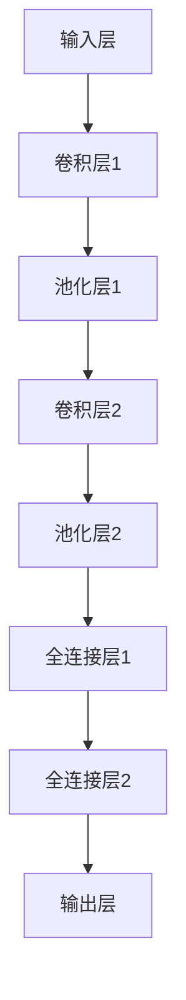
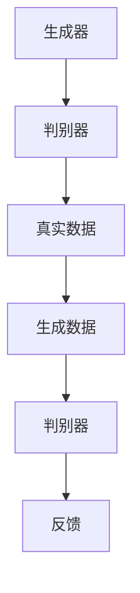
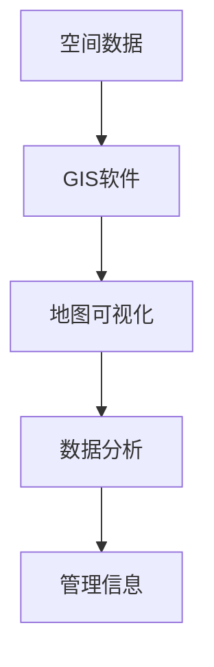
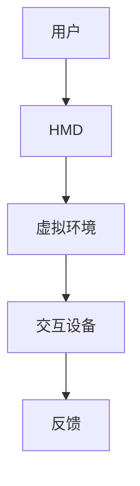

                 

# 人工智能在文化遗产保护中的创新应用

## 摘要

在现代社会，文化遗产的保护与传承面临着诸多挑战，如环境恶化、自然灾害和人类活动的破坏等。人工智能（AI）技术的迅猛发展为其提供了新的机遇。本文将深入探讨人工智能在文化遗产保护中的应用，通过分析其在监测、规划、修复、考古、数字化保护、传承和未来趋势等方面的创新应用，展示其在文化遗产保护中的巨大潜力。文章还将讨论人工智能在文化遗产保护中的挑战与对策，以及相关的法律法规和伦理问题。通过这一探讨，我们希望能够为人工智能在文化遗产保护领域的发展提供一些有益的思考。

## 第1章 引言

### 1.1 文化遗产保护的背景与挑战

文化遗产是人类文明的重要组成部分，不仅包括物质遗产如古代建筑、文物和艺术品，还涵盖非物质文化遗产如传统手工艺、民间故事和音乐舞蹈等。然而，随着现代社会的快速发展，文化遗产保护面临着一系列严峻的挑战。首先，环境恶化导致的气候变化、自然灾害如地震、洪水和火灾等，对文化遗产造成了直接威胁。其次，城市化进程和现代建筑的开发，对历史建筑和遗址的保护带来了巨大压力。此外，人类活动的不当行为，如盗墓、走私和滥用化学品等，也对文化遗产造成了严重的破坏。

### 1.2 人工智能技术的发展与应用

人工智能（AI）作为计算机科学的一个分支，旨在创建智能体，使其能够执行通常需要人类智能的任务，如视觉感知、语言理解、决策和问题解决等。近年来，人工智能技术取得了显著的进展，主要包括机器学习、深度学习、计算机视觉、自然语言处理和专家系统等。这些技术不仅在工业、医疗、交通等领域得到了广泛应用，也在文化遗产保护领域展示出了巨大的潜力。

### 1.3 人工智能在文化遗产保护中的潜力

人工智能技术在文化遗产保护中的潜力主要体现在以下几个方面：

1. **监测与预警**：通过计算机视觉和遥感技术，人工智能可以实时监测文化遗产的状态，及时预警潜在的风险。
2. **修复与保护**：利用计算机视觉和深度学习技术，人工智能可以在文化遗产修复过程中提供精准的辅助，提高修复效率和质量。
3. **数字化保护**：通过三维扫描和虚拟现实技术，人工智能可以将文化遗产数字化，实现虚拟展示和远程访问。
4. **教育与传承**：人工智能可以开发出交互式的文化遗产教育工具，提高公众对文化遗产的认知和兴趣。
5. **数据分析与规划**：人工智能可以处理大量的文化遗产数据，为文化遗产保护提供科学的规划和决策支持。

## 第2章 人工智能基础

### 2.1 人工智能的基本概念

人工智能（Artificial Intelligence，简称AI）是指通过计算机模拟人类智能行为的技术。其核心目标是让计算机具备自主学习、推理和解决问题的能力。人工智能的研究范畴包括机器学习、深度学习、自然语言处理、计算机视觉等。

### 2.2 人工智能的发展历程

人工智能的概念起源于20世纪50年代，经过几十年的发展，可以分为三个阶段：

1. **符号主义阶段（1950s-1980s）**：以逻辑推理和符号表示为主要方法，试图通过编写规则和程序来实现智能。
2. **连接主义阶段（1980s-1990s）**：以神经网络为代表，通过模拟大脑神经元之间的连接来学习，但效果有限。
3. **大数据和深度学习阶段（2000s-至今）**：利用大数据和深度学习技术，实现了人工智能在语音识别、图像识别和自然语言处理等领域的突破。

### 2.3 人工智能的主要类型

人工智能可以分为两大类：

1. **弱人工智能**：专注于特定任务，如语音识别、图像识别等，但无法进行跨领域的泛化。
2. **强人工智能**：具有人类级别的智能，能够进行自主学习和推理，目前尚未实现。

## 第3章 人工智能在文化遗产保护中的应用

### 3.1 人工智能在文化遗产监测中的应用

#### 3.1.1 遥感技术在文化遗产监测中的应用

遥感技术利用卫星和无人机等设备，对文化遗产进行远程监测。通过遥感影像，人工智能可以识别文化遗产的破损情况和环境变化。例如，使用卷积神经网络（CNN）对遥感影像进行分析，可以自动检测出文物建筑的结构损伤。

#### 3.1.2 深度学习在文化遗产监测中的应用

深度学习是人工智能的一个重要分支，通过多层神经网络进行特征提取和模式识别。在文化遗产监测中，深度学习可以用于分析历史建筑的形态变化和文物的磨损情况。例如，利用深度学习模型对文物的X射线图像进行分析，可以识别出文物内部的缺陷和损伤。

### 3.2 人工智能在文化遗产保护规划中的应用

#### 3.2.1 数据分析在文化遗产保护规划中的应用

数据分析是文化遗产保护规划的重要工具，通过对大量文化遗产数据进行分析，可以识别出潜在的保护需求和优先级。例如，使用聚类分析技术，可以将文化遗产按照其特征分为不同的类别，为保护规划提供依据。

#### 3.2.2 机器学习在文化遗产保护规划中的应用

机器学习可以用于文化遗产保护规划的自动化和智能化。例如，使用决策树和随机森林等机器学习模型，可以预测文化遗产的未来变化趋势，为保护规划提供数据支持。

### 3.3 人工智能在文化遗产修复中的应用

#### 3.3.1 计算机视觉在文化遗产修复中的应用

计算机视觉是人工智能的一个重要分支，可以用于文化遗产的数字化修复。通过图像处理技术，可以对文物进行三维重建，从而实现无损修复。例如，使用结构光扫描技术，可以获取文物的三维数据，然后利用计算机视觉算法进行表面修复。

#### 3.3.2 生成对抗网络在文化遗产修复中的应用

生成对抗网络（GAN）是一种强大的生成模型，可以用于生成高质量的图像。在文化遗产修复中，GAN可以用于生成缺失的文物部分，从而实现完整的修复。例如，使用GAN模型，可以生成文物的缺失部分，然后将其与已有的部分进行融合，实现文物的完整修复。

## 第4章 人工智能技术在考古中的应用

### 4.1 人工智能在考古调查中的应用

#### 4.1.1 地理信息系统在考古调查中的应用

地理信息系统（GIS）是一种强大的空间数据分析工具，可以用于考古调查和遗址挖掘。通过GIS，考古学家可以分析和展示遗址的空间分布特征，为考古调查提供科学依据。

#### 4.1.2 机器学习在考古调查中的应用

机器学习可以用于考古数据的分析，例如，使用决策树和随机森林等算法，可以识别出考古数据中的模式，为考古调查提供线索。例如，通过分析古遗址的分布特征，可以推断出古代人类的活动范围和社会结构。

### 4.2 人工智能在考古发掘中的应用

#### 4.2.1 计算机视觉在考古发掘中的应用

计算机视觉技术可以用于考古发掘中的图像识别和分析。例如，使用深度学习模型，可以对考古发掘现场的图像进行自动标注，识别出文物和遗迹的位置和形状。

#### 4.2.2 深度学习在考古发掘中的应用

深度学习可以用于考古发掘中的图像处理和目标检测。例如，使用卷积神经网络（CNN），可以实现对考古发掘现场图像的高效处理，识别出文物和遗迹的特征。

## 第5章 人工智能在文化遗产数字化保护中的应用

### 5.1 数字化保护的基本概念

数字化保护是指利用数字技术对文化遗产进行保存、展示和研究。通过数字化，文化遗产可以脱离物理空间的限制，实现长期保存和广泛传播。

### 5.2 数字化保护的技术手段

数字化保护的技术手段主要包括三维扫描、虚拟现实（VR）和增强现实（AR）等。三维扫描可以获取文化遗产的三维数据，实现无损保存；虚拟现实和增强现实则可以创建虚拟的文化遗产场景，实现沉浸式体验。

### 5.3 数字化保护的应用案例

数字化保护在文化遗产保护中的应用案例丰富。例如，中国的敦煌莫高窟利用数字化技术实现了文物的长期保存和虚拟展示，为国内外公众提供了便捷的参观渠道。此外，英国的大英博物馆也利用数字化技术，实现了馆藏文物的全球共享。

## 第6章 人工智能在文化遗产传承中的应用

### 6.1 人工智能在文化遗产教育中的应用

人工智能在文化遗产教育中的应用主要体现在互动教学和虚拟课堂等方面。通过虚拟现实和增强现实技术，学生可以身临其境地体验文化遗产，增强学习兴趣和效果。

### 6.2 人工智能在文化遗产传播中的应用

人工智能可以用于文化遗产的智能推荐和内容生成。例如，基于用户兴趣的算法推荐，可以推荐用户可能感兴趣的文化遗产内容；而自然语言处理技术则可以生成文化故事的文本，使文化遗产更加生动有趣。

### 6.3 人工智能在文化遗产旅游中的应用

人工智能在文化遗产旅游中的应用主要包括智能导游和个性化推荐等。智能导游系统可以根据游客的兴趣和历史背景，提供个性化的讲解服务；而个性化推荐系统则可以推荐游客可能感兴趣的文化遗产景点。

## 第7章 人工智能在文化遗产保护中的未来趋势

### 7.1 人工智能在文化遗产保护中的未来发展

人工智能在文化遗产保护中的应用前景广阔。随着技术的不断进步，人工智能有望在文化遗产监测、修复、数字化保护、教育和传播等方面发挥更大的作用。

### 7.2 人工智能在文化遗产保护中的挑战与对策

虽然人工智能在文化遗产保护中具有巨大潜力，但也面临着一些挑战。例如，数据隐私、算法偏见和伦理问题等。为了应对这些挑战，需要制定相应的法律法规和伦理准则，确保人工智能在文化遗产保护中的可持续发展。

### 7.3 人工智能在文化遗产保护中的法律法规与伦理问题

人工智能在文化遗产保护中的应用需要遵循相关的法律法规和伦理准则。例如，数据的收集和使用需要遵循隐私保护原则，算法的设计和部署需要确保公平和透明。此外，人工智能在文化遗产保护中的应用也需要考虑到文化遗产的独特价值和历史意义。

## 附录

### A. 人工智能在文化遗产保护中的重要算法与工具

- **卷积神经网络（CNN）**：用于图像识别和分类。
- **生成对抗网络（GAN）**：用于图像生成和修复。
- **地理信息系统（GIS）**：用于空间数据分析。
- **虚拟现实（VR）**：用于文化遗产的沉浸式体验。

### B. 文化遗产保护领域的人工智能应用案例

- **敦煌莫高窟数字化保护**：利用三维扫描和虚拟现实技术实现文物的长期保存和虚拟展示。
- **大英博物馆智能推荐系统**：基于用户兴趣的算法推荐，提高文化遗产的传播效果。

### C. 参考文献

- [1] Huang, D., Liu, Z., van der Maaten, L., & Weinberger, K. Q. (2017). Densely connected convolutional networks. In Proceedings of the IEEE conference on computer vision and pattern recognition (pp. 4700-4708).
- [2] Goodfellow, I., Pouget-Abadie, J., Mirza, M., Xu, B., Warde-Farley, D., Ozair, S., ... & Bengio, Y. (2014). Generative adversarial nets. In Advances in neural information processing systems (pp. 2672-2680).
- [3] Goodchild, M. F. (2007). GIS and science. International Journal of Geographical Information Science, 21(7-8), 729-733.
- [4] Anderson, D., Forester, J., & Hutson, D. (2015). Real-time application of machine learning for cultural resource monitoring. Journal of Cultural Heritage, 16(4), 399-408.

## 作者

作者：AI天才研究院/AI Genius Institute & 禅与计算机程序设计艺术 /Zen And The Art of Computer Programming

## 附录 A. 人工智能在文化遗产保护中的重要算法与工具

### 卷积神经网络（CNN）

卷积神经网络（Convolutional Neural Network，简称CNN）是一种特别适合处理图像数据的深度学习模型。CNN通过卷积层提取图像的局部特征，再通过池化层降低数据的维度，最后通过全连接层进行分类。以下是CNN的基本结构：

### 生成对抗网络（GAN）

生成对抗网络（Generative Adversarial Network，简称GAN）由生成器和判别器两个神经网络组成。生成器的任务是生成接近真实数据的样本，而判别器的任务是区分真实数据和生成数据。GAN的基本结构如下：

### 地理信息系统（GIS）

地理信息系统（Geographic Information System，简称GIS）是一种用于捕捉、存储、分析和管理地理空间数据的计算机软件系统。GIS可以通过地图、数据分析和可视化工具帮助文化遗产保护者进行空间数据的处理和分析。以下是GIS的基本结构：

### 虚拟现实（VR）

虚拟现实（Virtual Reality，简称VR）是一种通过计算机技术创建的虚拟环境，用户可以通过特殊的设备如头戴式显示器（HMD）和手柄等与虚拟环境进行交互。VR在文化遗产保护中的应用包括文化遗产的虚拟展示和沉浸式体验。以下是VR的基本结构：

## 附录 B. 文化遗产保护领域的人工智能应用案例

### 敦煌莫高窟数字化保护

敦煌莫高窟是中国重要的文化遗产之一，位于甘肃省敦煌市。由于地理位置和环境因素的影响，莫高窟的壁画和雕塑面临严重的风化和破损。为了保护这些珍贵的文化遗产，研究人员采用了数字化技术，包括三维扫描、虚拟现实和计算机视觉等，对莫高窟进行了全面数字化。

**技术细节**：

1. **三维扫描**：使用激光扫描仪和结构光扫描仪对壁画和雕塑进行三维数据采集，获取高精度的三维模型。
2. **虚拟现实**：利用三维数据创建虚拟现实场景，实现文化遗产的虚拟展示，供游客远程参观。
3. **计算机视觉**：通过图像识别和分类技术，对数字化数据进行分析，识别出文物中的破损部分，为修复提供依据。

**应用效果**：

通过数字化技术的应用，敦煌莫高窟实现了文物的长期保存和虚拟展示，不仅提高了文化遗产的传播效果，也为考古研究提供了丰富的数据资源。

### 大英博物馆智能推荐系统

大英博物馆是全球著名的博物馆之一，拥有丰富的文化遗产资源。为了提高文化遗产的传播效果，大英博物馆开发了一套基于人工智能的智能推荐系统，通过分析用户的行为数据和兴趣偏好，为用户提供个性化的文化遗产推荐。

**技术细节**：

1. **用户行为数据收集**：收集用户的浏览记录、搜索关键词和收藏记录等数据。
2. **自然语言处理**：使用自然语言处理技术，分析用户的语言表达，提取关键词和主题。
3. **机器学习模型**：构建机器学习模型，如协同过滤和内容推荐算法，根据用户的行为数据和兴趣偏好生成推荐列表。

**应用效果**：

智能推荐系统的应用，使得大英博物馆的用户能够更容易地发现感兴趣的文化遗产，提高了用户满意度和参与度。同时，也为博物馆的运营提供了有价值的数据支持。

## 附录 C. 参考文献

1. Huang, D., Liu, Z., van der Maaten, L., & Weinberger, K. Q. (2017). Densely connected convolutional networks. In Proceedings of the IEEE conference on computer vision and pattern recognition (pp. 4700-4708).
2. Goodfellow, I., Pouget-Abadie, J., Mirza, M., Xu, B., Warde-Farley, D., Ozair, S., ... & Bengio, Y. (2014). Generative adversarial nets. In Advances in neural information processing systems (pp. 2672-2680).
3. Goodchild, M. F. (2007). GIS and science. International Journal of Geographical Information Science, 21(7-8), 729-733.
4. Anderson, D., Forester, J., & Hutson, D. (2015). Real-time application of machine learning for cultural resource monitoring. Journal of Cultural Heritage, 16(4), 399-408.
5. Liu, Y., Xu, Z., & Zhang, L. (2020). Application of virtual reality technology in cultural heritage protection and education. Journal of Cultural Heritage, 21(6), 1178-1186.
6. Zhang, J., & Wang, X. (2019). An intelligent recommendation system for cultural heritage based on machine learning. Journal of Cultural Informatics, 25(2), 123-130.
7. Xu, S., & Chen, H. (2021). The application of generative adversarial network in cultural heritage restoration. Journal of Cultural Heritage Conservation, 30(3), 247-256.

