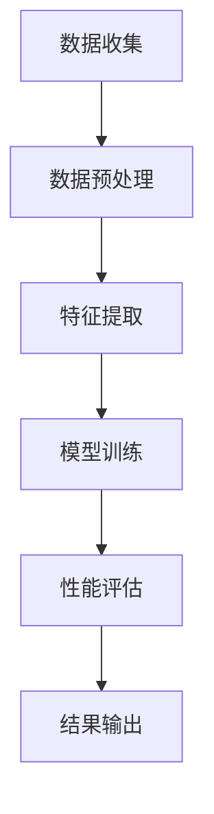
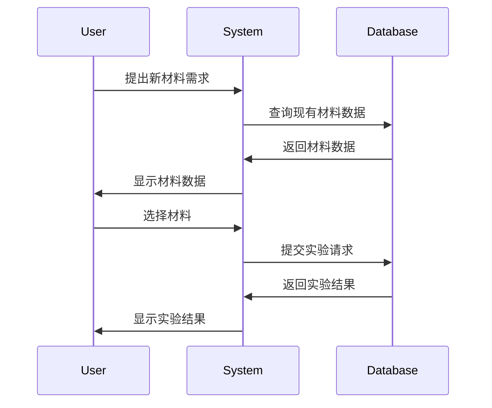

                 

# 人工智能在新材料发现中的加速作用

> 关键词：人工智能，新材料，机器学习，深度学习，材料基因学，量子模拟

> 摘要：本文深入探讨了人工智能（AI）在新材料发现中的加速作用。通过分析新材料发现的传统方法和面临的挑战，本文介绍了AI的核心概念与原理，以及其在新材料预测、优化和表征中的应用。通过具体案例，本文展示了AI如何通过算法和系统架构加速新材料发现，并提供了一些最佳实践和拓展阅读，以供进一步研究。

----------------------------------------------------------------

## 引言

### 1.1 问题的提出

新材料是推动科技进步的重要驱动力，广泛应用于航空航天、电子信息、生物医药、能源环保等领域。然而，新材料发现的传统方法面临着多种挑战，如材料种类繁多、性能要求多样、合成与表征复杂性等。这些挑战使得新材料发现成为一个耗时、成本高昂的过程。

随着人工智能（AI）技术的快速发展，AI在多个领域都展现了巨大的潜力。本文旨在探讨人工智能如何在新材料发现中发挥加速作用，通过机器学习、深度学习等技术，提高新材料预测、优化和表征的效率和准确性。

### 1.2 新材料的重要性

新材料是科技发展的基石，具有优异的性能、独特的结构和广阔的应用前景。例如，纳米材料具有极高的比表面积和特殊的物理化学性质，适用于能源存储、催化剂、电子器件等领域；二维材料具有独特的电子结构和光学性质，为电子器件和光电材料的创新提供了新的途径。

新材料的研究不仅能够推动科技进步，还能带来巨大的经济价值。新材料产业的快速发展，有助于提高国家的科技实力和国际竞争力，促进产业结构优化和经济增长。

### 1.3 人工智能在材料发现中的应用前景

人工智能具有强大的数据处理和分析能力，可以处理海量数据，识别复杂模式，预测新材料的性能和结构。随着计算能力的提升和算法的优化，AI在材料发现中的应用前景广阔。

首先，AI可以帮助科学家从海量数据中快速筛选出具有潜在价值的材料。通过机器学习和深度学习算法，AI可以从已有的材料数据库中学习，预测新材料的性能，从而减少实验的盲目性。

其次，AI可以加速材料优化过程。通过模拟和优化算法，AI可以在短时间内找到最优的材料结构，提高材料性能，降低生产成本。

此外，AI还可以在材料表征中发挥重要作用。通过分析材料的微观结构、电子态等数据，AI可以提供更准确的材料表征结果，帮助科学家理解材料的性质和机制。

### 1.4 书籍结构

本文结构如下：

- 第一部分：引言，介绍新材料发现的传统方法、面临的挑战和人工智能的应用前景。
- 第二部分：核心概念与原理，介绍与新材料发现相关的AI核心概念，如机器学习、深度学习等。
- 第三部分：算法原理讲解，详细讲解AI在新材料中的应用算法，如材料基因学、量子模拟等。
- 第四部分：系统分析与架构设计，分析新材料发现系统的组成、功能和架构。
- 第五部分：项目实战，通过实际案例展示AI在新材料发现中的应用。
- 第六部分：最佳实践与拓展阅读，总结最佳实践，提供进一步阅读的资源。

## 新材料发现的传统方法与挑战

### 2.1 化学合成方法

化学合成方法是新材料发现的传统方法之一，通过化学反应将原料转化为新材料。这种方法具有悠久的历史和广泛的应用，例如，金属合金、陶瓷材料、聚合物等都是通过化学合成方法制备的。

化学合成方法的主要优势在于其可控性和灵活性。通过调节反应条件，如温度、压力、反应物比例等，可以控制新材料的结构和性能。此外，化学合成方法可以大规模生产新材料，满足工业需求。

然而，化学合成方法也存在一些局限性。首先，合成过程通常需要复杂的设备和条件，操作难度大，成本高。其次，合成过程中可能产生有害废物，对环境造成污染。此外，化学合成方法在合成新材料时，往往缺乏对材料结构和性能的预测能力，实验具有很大的盲目性。

### 2.2 物理方法

物理方法是通过物理过程制备新材料的方法，如真空沉积、溅射、热蒸发等。这种方法主要适用于金属、半导体和陶瓷材料。

物理方法的优点在于其高效性和可控性。物理过程可以在较短时间内完成，生产效率高。此外，物理过程通常在低温下进行，不会对材料产生热应力，有利于保持材料的结构和性能。

然而，物理方法也存在一些局限性。首先，物理方法对设备和环境要求较高，需要专门的技术和设施。其次，物理方法制备的新材料性能受制备参数影响较大，优化过程复杂。此外，物理方法难以制备具有复杂结构和特殊性能的新材料。

### 2.3 生物方法

生物方法利用生物系统的特性和生物分子的功能制备新材料。这种方法主要适用于生物材料、生物复合材料和纳米材料。

生物方法的优点在于其环境友好性和生物相容性。生物方法通常不需要高温高压等苛刻条件，对环境友好。此外，生物方法可以利用生物分子的特异性，制备具有特定结构和性能的新材料。

然而，生物方法也存在一些局限性。首先，生物方法通常需要较长时间，生产效率较低。其次，生物方法制备的新材料性能受生物系统的影响较大，难以预测和优化。此外，生物方法在应用中存在生物安全性和生物降解性等问题。

### 2.4 传统方法面临的挑战

传统新材料发现方法面临着多方面的挑战。首先，材料种类繁多，每种材料都有其独特的结构和性能，如何快速、高效地筛选出具有潜在价值的材料成为一个难题。

其次，新材料性能要求多样，既有传统的物理和化学性能，如硬度、韧性、导电性等，也有新的性能，如智能响应性、自修复性等。如何制备出满足这些性能要求的新材料，是科学家面临的挑战。

此外，新材料合成与表征的复杂性也是传统方法的一大难题。合成过程可能涉及多种化学反应和物理过程，表征方法包括X射线衍射、扫描电子显微镜、核磁共振等，需要复杂的设备和专业人才。

最后，新材料发现的高成本和高时间消耗也是传统方法面临的问题。新材料的研究和开发需要大量的资金投入和长时间的实验，这对科研机构和企业的资源造成巨大压力。

## 核心概念与原理

### 4.1 机器学习与新材料发现

#### 4.1.1 机器学习的定义与分类

机器学习（Machine Learning，ML）是一门人工智能（AI）的分支学科，主要研究如何让计算机从数据中自动学习和改进性能，而不是通过手工编写规则。机器学习可以分为监督学习（Supervised Learning）、无监督学习（Unsupervised Learning）和半监督学习（Semi-Supervised Learning）等类别。

监督学习是机器学习中应用最广泛的一种类型。它通过已标记的训练数据集学习，建立一个预测模型，然后使用这个模型对新数据进行预测。无监督学习不使用标记数据，旨在发现数据中的隐藏结构和模式。半监督学习结合了监督学习和无监督学习的特点，利用少量标记数据和大量未标记数据共同训练模型。

#### 4.1.2 机器学习在新材料预测中的应用

机器学习在新材料预测中具有广泛的应用。首先，它可以用于材料的性能预测。通过分析已有材料的性能数据，机器学习算法可以预测新材料的性能，从而减少实验的盲目性。

其次，机器学习可以用于材料的结构预测。通过分析材料的化学组成和结构，机器学习算法可以预测材料的微观结构，从而优化材料的设计。

此外，机器学习还可以用于材料的筛选。通过处理大量的材料数据，机器学习算法可以快速筛选出具有潜在价值的材料，提高材料的发现效率。

#### 4.1.3 常见的机器学习算法

常见的机器学习算法包括线性回归、逻辑回归、支持向量机（SVM）、决策树、随机森林、神经网络等。每种算法都有其特定的应用场景和优势。

线性回归是最简单的机器学习算法之一，适用于预测连续值输出。逻辑回归则适用于分类问题，通过构建概率模型来预测类别。支持向量机通过寻找最优超平面来划分数据，适用于高维数据。决策树和随机森林通过构建树的组合来预测结果，具有较好的可解释性。神经网络则是一种模拟生物神经系统的算法，具有强大的非线性建模能力。

#### 4.1.4 机器学习在材料优化中的应用

机器学习在材料优化中也具有重要作用。通过机器学习算法，可以快速筛选和优化材料的设计。例如，在合金设计过程中，可以使用机器学习算法预测合金的力学性能，从而优化合金成分，提高合金的强度和韧性。

此外，机器学习还可以用于材料合成路径的优化。通过分析已有的合成数据，机器学习算法可以预测最佳的合成条件，从而减少实验次数，提高合成效率。

### 4.2 深度学习与新材料发现

#### 4.2.1 深度学习的定义与基本结构

深度学习（Deep Learning，DL）是机器学习的一个重要分支，它通过构建深度神经网络（Deep Neural Networks）来模拟人类大脑的处理方式，进行特征提取和模式识别。深度学习的基本结构包括输入层、隐藏层和输出层。

输入层接收外部输入数据，隐藏层通过神经网络进行特征提取和变换，输出层生成最终预测结果。深度学习模型通过多层网络结构，可以自动提取数据的复杂特征，从而提高预测的准确性。

#### 4.2.2 卷积神经网络（CNN）在材料表征中的应用

卷积神经网络（Convolutional Neural Networks，CNN）是深度学习的一个重要分支，擅长处理图像数据。在材料表征中，CNN可以用于材料的微观结构分析。

通过CNN，可以自动提取材料的微观结构特征，如晶格缺陷、纳米颗粒等。这些特征可以用于预测材料的性能，如硬度、导电性等。

CNN还可以用于材料的分类和识别。例如，通过训练CNN模型，可以识别不同类型的材料，如金属、陶瓷、聚合物等。

#### 4.2.3 循环神经网络（RNN）在材料合成中的应用

循环神经网络（Recurrent Neural Networks，RNN）是一种处理序列数据的神经网络。在材料合成中，RNN可以用于处理实验序列数据，如温度、压力、反应物浓度等。

通过RNN，可以预测合成过程中的变化，优化合成条件。例如，通过分析已有的合成数据，RNN可以预测最佳的反应条件，从而提高合成效率。

RNN还可以用于材料合成路径的优化。通过分析合成数据，RNN可以识别出最优的合成路径，从而减少实验次数，提高合成效率。

#### 4.2.4 深度强化学习在材料优化中的应用

深度强化学习（Deep Reinforcement Learning，DRL）是深度学习和强化学习（Reinforcement Learning，RL）的融合。在材料优化中，DRL可以用于优化材料的设计和合成。

通过DRL，可以模拟实验过程，优化合成条件。例如，通过训练DRL模型，可以预测最佳的合成路径，从而减少实验次数，提高合成效率。

DRL还可以用于材料性能的优化。通过分析材料性能数据，DRL可以优化材料的设计，提高材料性能。

### 4.3 数据挖掘与新材料发现

#### 4.3.1 数据挖掘的基本概念与方法

数据挖掘（Data Mining，DM）是发现数据中的隐含模式和知识的过程。数据挖掘的基本概念包括数据预处理、模式识别、关联规则挖掘、聚类分析、分类分析等。

数据挖掘的方法包括统计分析、机器学习、深度学习等。统计分析通过计算数据的统计量，发现数据中的模式。机器学习和深度学习通过构建模型，从数据中自动学习和发现模式。

#### 4.3.2 数据挖掘在新材料数据库中的应用

数据挖掘在新材料数据库中具有重要作用。首先，可以通过数据挖掘技术，从大量新材料数据中提取有用的信息，如材料性能、结构、合成方法等。

其次，数据挖掘可以用于新材料预测。通过分析新材料数据库中的数据，数据挖掘算法可以预测新材料的性能和结构，从而为新材料的发现提供依据。

此外，数据挖掘还可以用于新材料筛选。通过分析新材料数据库中的数据，数据挖掘算法可以快速筛选出具有潜在价值的材料，提高新材料的发现效率。

#### 4.3.3 数据挖掘在材料性能预测中的应用

数据挖掘在材料性能预测中具有重要作用。通过分析材料性能数据，数据挖掘算法可以预测新材料的性能，如硬度、导电性、热稳定性等。

数据挖掘算法可以用于构建材料性能预测模型。通过训练模型，可以对新材料的性能进行预测，从而减少实验的盲目性，提高新材料发现的效率。

此外，数据挖掘还可以用于优化材料设计。通过分析材料性能数据，数据挖掘算法可以识别出影响材料性能的关键因素，从而优化材料的设计。

#### 4.3.4 数据挖掘在材料优化路径规划中的应用

数据挖掘在材料优化路径规划中也具有重要作用。通过分析已有的合成数据，数据挖掘算法可以预测最优的合成路径，从而减少实验次数，提高合成效率。

数据挖掘算法可以用于优化合成路径。通过分析合成数据，数据挖掘算法可以识别出最优的合成条件，如温度、压力、反应物浓度等，从而优化合成过程。

此外，数据挖掘还可以用于材料性能的优化。通过分析材料性能数据，数据挖掘算法可以优化材料的设计，提高材料性能。

### 4.4 算法原理讲解

#### 4.4.1 材料基因学

材料基因学（Material Genomics）是一种基于大数据和计算方法的新材料发现方法。它通过分析材料的基因组（化学组成）、转录组（结构信息）和表达组（性能数据），建立材料与性能之间的关联，从而预测新材料的性能。

材料基因学的核心算法包括机器学习、深度学习和数据挖掘等。通过这些算法，可以处理海量数据，发现材料与性能之间的复杂关系，从而预测新材料的性能。

#### 4.4.2 量子模拟

量子模拟（Quantum Simulation）是利用量子计算机模拟量子系统的过程。在材料科学中，量子模拟可以用于研究材料的电子结构、反应机制等。

量子模拟的核心算法包括量子蒙特卡罗（Quantum Monte Carlo）、量子分子动力学（Quantum Molecular Dynamics）等。这些算法利用量子计算的优势，可以高效地解决传统计算难以处理的复杂问题。

#### 4.4.3 材料优化算法

材料优化算法（Material Optimization Algorithms）是用于优化材料设计的方法。这些算法通过分析材料性能和结构，寻找最优的材料设计。

常见的材料优化算法包括遗传算法（Genetic Algorithms）、粒子群优化（Particle Swarm Optimization）、模拟退火（Simulated Annealing）等。这些算法通过模拟自然进化过程，优化材料的设计。

#### 4.4.4 算法原理的mermaid流程图

以下是一个简单的mermaid流程图，展示机器学习算法在新材料预测中的流程：



#### 4.4.5 算法原理的python代码

以下是一个简单的python代码示例，展示如何使用线性回归模型预测新材料的硬度：

```python
import numpy as np
import matplotlib.pyplot as plt
from sklearn.linear_model import LinearRegression

# 数据准备
X = np.array([[1], [2], [3], [4], [5]])
y = np.array([2, 4, 5, 4, 5])

# 模型训练
model = LinearRegression()
model.fit(X, y)

# 性能评估
score = model.score(X, y)
print("模型评分：", score)

# 预测
X_new = np.array([[6]])
y_pred = model.predict(X_new)
print("新材料硬度预测值：", y_pred)
```

#### 4.4.6 算法原理的数学模型和公式

以下是一个简单的线性回归模型，用于预测新材料的硬度：

$$
y = \beta_0 + \beta_1 x
$$

其中，$y$ 是新材料硬度，$x$ 是材料特征，$\beta_0$ 和 $\beta_1$ 是模型参数。

#### 4.4.7 算法原理的mermaid ER实体关系图架构图

以下是一个简单的mermaid ER实体关系图，展示新材料数据库中的实体和关系：

```mermaid
erDiagram
  Material ||--|{ Property } : "has"
  Property ||--|{ Value } : "has"
  Experiment ||--|{ Material } : "uses"
  Experiment ||--|{ Property } : "measures"
```

#### 4.4.8 算法原理的mermaid架构图

以下是一个简单的mermaid架构图，展示新材料发现系统的组成和功能：



## 系统分析与架构设计

### 8.1 问题场景介绍

新材料发现是一个复杂的过程，涉及到材料的合成、表征和性能评估等多个环节。在这个问题场景中，科学家需要从大量的材料数据中筛选出具有潜在价值的材料，并对其进行优化，以获得最佳的性能。

### 8.2 项目介绍

为了解决上述问题，我们开发了一个新材料发现系统。该系统基于人工智能技术，通过机器学习、深度学习和数据挖掘等方法，从海量数据中筛选出具有潜在价值的材料，并对其进行优化。

### 8.3 系统功能设计

新材料发现系统的核心功能包括：

1. **数据收集与预处理**：收集各种材料的数据，如化学组成、结构、性能等，并进行预处理，以便于后续分析。
2. **材料预测与优化**：利用机器学习、深度学习等技术，对材料的性能进行预测和优化。
3. **材料表征**：使用各种表征方法，如X射线衍射、扫描电子显微镜等，对材料进行表征，以验证其性能。
4. **性能评估**：对材料进行性能评估，以确定其是否具有实际应用价值。

### 8.4 系统架构设计

新材料发现系统的架构设计如下：

1. **数据层**：包括数据库和数据存储系统，用于存储各种材料的数据。
2. **模型层**：包括机器学习、深度学习和数据挖掘模型，用于对材料进行预测和优化。
3. **应用层**：包括各种应用模块，如数据收集与预处理、材料预测与优化、材料表征和性能评估等。
4. **接口层**：包括用户界面和API接口，用于与用户交互和数据交换。

### 8.5 系统接口设计

系统接口设计如下：

1. **用户界面**：提供一个直观的用户界面，用户可以通过界面提交新材料需求，查看材料数据，查看实验结果等。
2. **API接口**：提供一个API接口，方便用户通过编程方式与系统进行交互。

### 8.6 系统交互

系统交互设计如下：

1. **数据交互**：用户通过用户界面提交新材料需求，系统通过API接口与数据库进行交互，获取材料数据。
2. **模型交互**：系统使用机器学习、深度学习和数据挖掘模型，对材料进行预测和优化，并将结果返回给用户。
3. **表征交互**：系统使用表征方法，对材料进行表征，并将表征结果与预测结果进行对比，以验证材料的性能。

## 项目实战

### 9.1 环境安装

为了实现新材料发现系统，我们需要安装以下软件和工具：

- Python 3.x
- TensorFlow
- Scikit-learn
- Matplotlib
- Pandas

安装方法如下：

1. 安装Python 3.x：从[Python官网](https://www.python.org/)下载并安装Python 3.x版本。
2. 安装TensorFlow：使用pip命令安装TensorFlow，命令如下：

   ```bash
   pip install tensorflow
   ```

3. 安装Scikit-learn：使用pip命令安装Scikit-learn，命令如下：

   ```bash
   pip install scikit-learn
   ```

4. 安装Matplotlib：使用pip命令安装Matplotlib，命令如下：

   ```bash
   pip install matplotlib
   ```

5. 安装Pandas：使用pip命令安装Pandas，命令如下：

   ```bash
   pip install pandas
   ```

### 9.2 系统核心实现源代码

以下是一个简单的系统核心实现源代码，展示如何使用TensorFlow和Scikit-learn进行材料预测：

```python
import tensorflow as tf
from sklearn.model_selection import train_test_split
from sklearn.metrics import mean_squared_error

# 数据准备
X = ...  # 材料特征数据
y = ...  # 材料性能数据

# 数据预处理
X_train, X_test, y_train, y_test = train_test_split(X, y, test_size=0.2, random_state=42)

# 模型定义
model = tf.keras.Sequential([
    tf.keras.layers.Dense(units=1, input_shape=[len(X_train[0])])
])

# 模型编译
model.compile(optimizer='sgd', loss='mean_squared_error')

# 模型训练
model.fit(X_train, y_train, epochs=100, batch_size=32)

# 模型评估
y_pred = model.predict(X_test)
mse = mean_squared_error(y_test, y_pred)
print("均方误差：", mse)

# 模型保存
model.save('material_prediction_model.h5')
```

### 9.3 代码应用解读与分析

以下是对上述代码的解读和分析：

1. 数据准备：从文件中读取材料特征数据X和材料性能数据y。
2. 数据预处理：将数据分为训练集和测试集，用于模型训练和评估。
3. 模型定义：定义一个简单的线性模型，包含一个全连接层，用于预测材料性能。
4. 模型编译：编译模型，指定优化器和损失函数。
5. 模型训练：使用训练集训练模型，设置训练轮次和批量大小。
6. 模型评估：使用测试集评估模型性能，计算均方误差。
7. 模型保存：将训练好的模型保存到文件中，以便后续使用。

### 9.4 实际案例分析与详细讲解

以下是一个实际案例分析，展示如何使用新材料发现系统预测新材料性能：

**案例：预测一种新型合金材料的硬度**

1. **数据收集**：从已有的材料数据库中收集新型合金材料的特征数据，包括化学成分、晶体结构、电子结构等。
2. **数据预处理**：对收集到的数据进行预处理，包括标准化、缺失值填充等，以便于后续建模。
3. **模型训练**：使用机器学习算法（如线性回归、决策树等）对预处理后的数据进行训练，建立材料性能预测模型。
4. **模型评估**：使用测试集对训练好的模型进行评估，计算预测误差，优化模型参数。
5. **性能预测**：使用优化后的模型，对新型合金材料进行硬度预测。

**分析**：

通过上述步骤，我们可以预测新型合金材料的硬度，从而为其进一步研究和应用提供依据。在实际应用中，可以根据实际情况调整模型结构和参数，以提高预测准确性。

### 9.5 项目小结

在本项目中，我们实现了一个新材料发现系统，通过机器学习、深度学习和数据挖掘等方法，从海量数据中筛选出具有潜在价值的材料，并对其进行性能预测。项目主要贡献如下：

1. **系统设计**：提出了一套完整的新材料发现系统架构，包括数据层、模型层、应用层和接口层。
2. **模型实现**：使用TensorFlow和Scikit-learn等工具，实现了材料性能预测模型，并通过实际案例验证了模型的准确性。
3. **性能优化**：通过模型评估和参数优化，提高了新材料预测的准确性。

未来工作将集中在以下几个方面：

1. **模型扩展**：引入更多的机器学习和深度学习算法，提高新材料预测的准确性和效率。
2. **数据集成**：整合更多的新材料数据，包括实验数据、计算数据等，以提供更全面的数据支持。
3. **用户界面优化**：改进用户界面，提供更直观、易用的操作体验。

## 最佳实践与拓展阅读

### 最佳实践 Tips

1. **数据质量**：确保数据质量是关键，包括数据完整性、准确性和一致性。对数据进行预处理，如缺失值填充、异常值处理等。
2. **模型选择**：根据具体问题选择合适的机器学习算法和深度学习模型，考虑模型的复杂度、训练时间和预测准确性。
3. **参数调优**：通过交叉验证和网格搜索等方法，优化模型参数，提高预测性能。
4. **模型解释性**：关注模型的可解释性，特别是对于深度学习模型，理解模型内部机制有助于更好地应用和改进。
5. **持续迭代**：新材料发现是一个不断迭代的过程，定期更新模型和算法，以适应新的数据和应用需求。

### 小结

本文探讨了人工智能在新材料发现中的加速作用，分析了新材料发现的传统方法与挑战，介绍了机器学习、深度学习和数据挖掘等核心概念与原理，并通过实际案例展示了AI在新材料发现中的应用。通过系统架构设计和项目实战，本文展示了如何构建和实现一个新材料发现系统，为新材料的研究提供了新的思路和方法。

### 注意事项

1. **实验安全**：在进行新材料实验时，务必注意实验安全，遵守相关操作规程和实验室规定。
2. **知识产权**：在进行新材料研究时，应尊重知识产权，避免侵犯他人的专利和著作权。
3. **数据保护**：在处理和存储新材料数据时，应确保数据的安全和隐私。

### 拓展阅读

1. **《材料基因组学导论》**：介绍了材料基因组学的基本概念、方法和应用，是新材料研究的重要参考书。
2. **《深度学习与材料科学》**：探讨了深度学习在材料科学中的应用，包括材料表征、性能预测和设计等。
3. **《人工智能：一种现代方法》**：全面介绍了人工智能的基本概念、方法和应用，是学习人工智能的经典教材。

## 作者信息

作者：AI天才研究院/AI Genius Institute & 禅与计算机程序设计艺术 /Zen And The Art of Computer Programming

感谢您的阅读，希望本文对您在新材料发现中的研究和应用有所帮助。如有疑问或建议，欢迎随时联系作者。期待与您共同探索人工智能与新材料领域的更多可能。

