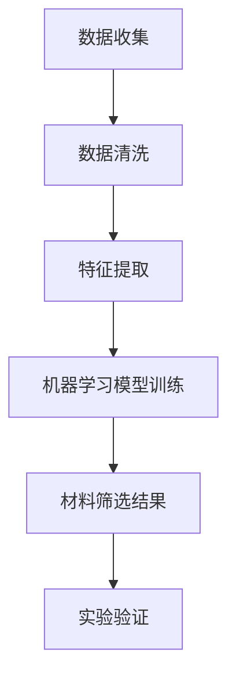
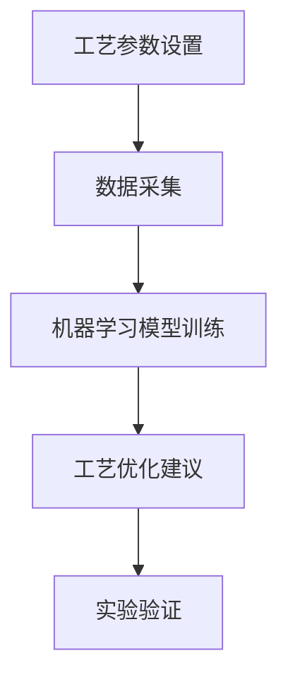
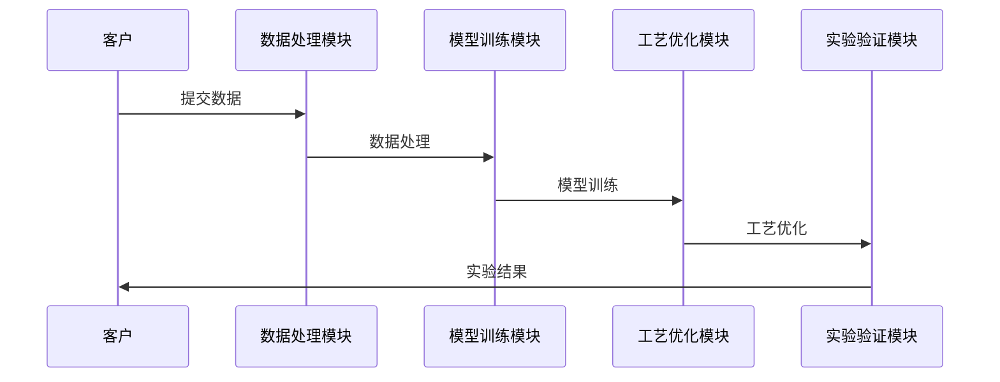

                 

# 人工智能在新能源电池研发中的应用

关键词：人工智能，新能源电池，研发，优化，预测，材料筛选

摘要：随着全球对可再生能源需求的不断增加，新能源电池的研发成为了重要的研究热点。本文将探讨人工智能在新能源电池研发中的应用，分析其背景、核心概念、算法原理以及实际案例，旨在为相关领域的科研人员提供有益的参考和启示。

## 第一部分：背景介绍

### 问题背景

新能源电池作为现代能源领域的重要研究方向，其性能的优化与改进对可持续发展和环境保护具有重要意义。随着人工智能技术的迅猛发展，利用人工智能在新能源电池研发中的应用已经成为一个热点方向。本部分将详细阐述人工智能在新能源电池研发中的应用背景、相关技术发展现状以及本书的研究目标。

### 问题描述

新能源电池研发过程中存在诸多挑战，如材料选择、电极制备、能量密度提升、寿命延长等。这些问题涉及到大量复杂的数据和计算，传统的研发方法难以应对。人工智能技术在数据处理、模式识别和优化算法等方面具有显著优势，因此将其应用于新能源电池研发具有重要的研究价值。

### 问题解决

利用人工智能技术，可以从以下几个方面解决新能源电池研发中的问题：
1. **数据挖掘与分析**：通过分析大量实验数据，识别出影响电池性能的关键因素。
2. **模式识别与分类**：对电池材料进行分类，找出最优材料组合。
3. **优化算法**：利用人工智能算法，优化电池结构设计和制备工艺。
4. **预测与仿真**：基于历史数据和物理模型，预测电池性能，指导实验设计。

### 边界与外延

本书主要关注的是人工智能在新能源电池材料选择、电极制备和性能优化等方面的应用。在研究过程中，将考虑电池的种类（如锂离子电池、钠离子电池等）、应用场景（如电动汽车、储能系统等）以及技术发展趋势。

### 概念结构与核心要素组成

新能源电池研发涉及以下核心概念和要素：
1. **新能源电池**：包括锂离子电池、钠离子电池、固态电池等。
2. **人工智能技术**：包括机器学习、深度学习、数据挖掘等。
3. **材料科学**：涉及电池材料的物理、化学性质及制备工艺。
4. **电池性能**：包括能量密度、寿命、安全性等指标。
5. **优化算法**：用于电池结构设计和制备工艺的优化。

## 第二部分：核心概念与联系

### 人工智能技术原理

#### 人工智能技术的发展历程

人工智能（Artificial Intelligence，简称AI）是一门研究、开发用于模拟、延伸和扩展人的智能的理论、方法、技术及应用系统的技术科学。人工智能的研究始于20世纪50年代，经过多年的发展，目前已取得了显著的成果。

#### 人工智能的核心算法与模型

人工智能的核心算法主要包括机器学习（Machine Learning，ML）和深度学习（Deep Learning，DL）。机器学习是通过算法让计算机从数据中学习规律，实现自主决策和预测。深度学习则是基于多层神经网络，通过大规模数据训练，实现复杂模式识别和决策。

#### 人工智能的应用领域

人工智能广泛应用于各个领域，如计算机视觉、自然语言处理、智能语音、自动驾驶等。在新能源电池研发中，人工智能技术可以用于数据挖掘、材料筛选、工艺优化、性能预测等方面。

### 人工智能在新能源电池中的应用

#### 人工智能在新能源电池材料筛选中的应用

在新能源电池材料筛选过程中，人工智能技术可以基于实验数据和材料特性，通过机器学习算法筛选出最优材料组合。例如，通过分析锂离子电池正极材料，利用深度学习算法筛选出具有高能量密度和长寿命的材料。

#### 人工智能在新能源电池制备工艺优化中的应用

人工智能技术可以帮助优化新能源电池的制备工艺，提高电池的性能和稳定性。例如，利用机器学习算法优化锂离子电池电极材料的烧结温度，提高电池的能量密度和循环寿命。

#### 人工智能在新能源电池性能预测与评估中的应用

人工智能技术可以基于历史数据和物理模型，预测新能源电池的性能，指导实验设计和工艺改进。例如，利用深度学习算法预测锂离子电池的循环寿命，为电池的寿命评估和寿命管理提供依据。

### 人工智能技术的优势与挑战

#### 人工智能技术的优势

1. **数据处理能力强**：人工智能技术可以处理大规模、复杂的数据，挖掘数据中的规律和关联。
2. **模式识别能力高**：人工智能技术可以通过学习数据，识别出复杂的模式和特征。
3. **优化算法先进**：人工智能技术提供了丰富的优化算法，可以用于电池结构设计和制备工艺的优化。
4. **预测准确性高**：人工智能技术可以通过训练模型，预测电池的性能和寿命，为实验设计提供参考。

#### 人工智能技术的挑战

1. **数据质量和数据量**：人工智能技术对数据质量和数据量有较高要求，需要大量的高质量数据支持。
2. **算法可解释性**：人工智能算法的决策过程往往不透明，缺乏可解释性，难以理解。
3. **计算资源和时间成本**：训练人工智能模型需要大量的计算资源和时间，成本较高。

#### 应对挑战的方法

1. **提高数据质量**：通过数据清洗、去噪等方法，提高数据质量，为人工智能模型提供可靠的数据基础。
2. **加强算法可解释性**：通过模型可视化、解释性算法等方法，提高算法的可解释性，帮助用户理解模型的决策过程。
3. **优化算法和硬件**：研究和优化人工智能算法，提高算法的效率，降低计算成本。同时，利用高性能计算硬件，提高计算速度。

### 核心概念属性特征对比表格

| 特征       | 人工智能          | 新能源电池          |
| ---------- | ---------------- | ------------------ |
| 数据处理   | 强大             | 数据依赖            |
| 模式识别   | 高效             | 材料与工艺相关      |
| 优化算法   | 先进             | 需要经验积累        |
| 性能预测   | 准确             | 实验验证重要        |

### ER实体关系图

```mermaid
erDiagram
  AI技术 ||--|{ 新能源电池技术 }
  电池材料 ||--|{ 材料制备工艺 }
  电池性能 ||--|{ 优化算法 }
```

## 第三部分：算法原理讲解

### 电池材料筛选算法

#### 算法简介

电池材料筛选算法是利用人工智能技术对电池材料进行筛选和优化的方法。通过分析大量实验数据，识别出影响电池性能的关键因素，利用机器学习算法筛选出最优材料组合。

#### 算法流程

1. **数据收集**：收集电池材料的实验数据，包括材料成分、物理性质、电化学性能等。
2. **数据清洗**：对数据进行清洗、去噪，确保数据质量。
3. **特征提取**：对数据进行特征提取，提取出影响电池性能的关键特征。
4. **机器学习模型训练**：利用机器学习算法，训练模型，筛选出最优材料组合。
5. **材料筛选结果**：根据模型预测结果，筛选出具有高能量密度、长寿命等特性的材料。
6. **实验验证**：对筛选出的材料进行实验验证，验证其性能。

#### 算法mermaid流程图



#### 算法原理与数学模型

电池材料筛选算法的核心是机器学习算法。常用的机器学习算法包括支持向量机（SVM）、决策树（DT）、神经网络（NN）等。算法原理如下：

$$
f(x) = \sum_{i=1}^{n} w_i * x_i
$$

其中，$w_i$ 为权重，$x_i$ 为特征值。

#### 算法举例说明

以锂离子电池正极材料为例，假设我们选择材料的导电性、密度和成本作为特征值，利用机器学习算法筛选出最优材料组合。

### 电池制备工艺优化算法

#### 算法简介

电池制备工艺优化算法是利用人工智能技术对电池制备工艺进行优化和改进的方法。通过分析大量实验数据，利用机器学习算法优化制备工艺参数，提高电池的性能和稳定性。

#### 算法流程

1. **工艺参数设置**：设置电池制备工艺的初始参数，如电极材料烧结温度、电解液成分等。
2. **数据采集**：采集电池制备过程中的实验数据，包括温度、压力、电流等。
3. **机器学习模型训练**：利用机器学习算法，训练模型，优化工艺参数。
4. **工艺优化建议**：根据模型预测结果，给出工艺优化建议。
5. **实验验证**：对优化后的工艺进行实验验证，验证其效果。

#### 算法mermaid流程图



#### 算法原理与数学模型

电池制备工艺优化算法的核心是机器学习算法。常用的机器学习算法包括支持向量机（SVM）、决策树（DT）、神经网络（NN）等。算法原理如下：

$$
f(x) = \sum_{i=1}^{n} w_i * x_i
$$

其中，$w_i$ 为权重，$x_i$ 为特征值。

#### 算法举例说明

以钠离子电池制备工艺为例，通过机器学习算法优化电极材料的烧结温度，提高电池的能量密度和循环寿命。

## 第四部分：系统分析与架构设计方案

### 问题场景介绍

随着电动汽车和储能系统的发展，新能源电池的需求日益增长。为了提高电池的性能和降低成本，需要对电池制备工艺进行优化和改进。本文旨在通过人工智能技术，对新能源电池制备工艺进行优化，提高电池的性能和稳定性。

### 项目介绍

本项目旨在利用人工智能技术，对新能源电池制备工艺进行优化。项目分为以下几个阶段：
1. 数据收集与处理：收集电池制备过程中的实验数据，进行数据清洗和预处理。
2. 模型训练与优化：利用机器学习算法，训练优化模型，用于预测电池性能。
3. 工艺优化与验证：根据模型预测结果，给出工艺优化建议，并进行实验验证。

### 系统功能设计（领域模型Mermaid类图）

```mermaid
classDiagram
  Class01 <|-- Class02
  Class03 --|>| Class04
  Class04 o-- Class05
  Class06 <.. Class07
  Class08 ..|> Class09
  Class10 --- Class11
```

### 系统架构设计（Mermaid架构图）



### 系统接口设计（Mermaid序列图）


### 系统交互（Mermaid序列图）


## 第五部分：项目实战

### 环境安装

在开始项目之前，需要安装以下软件和工具：
1. Python 3.8及以上版本
2. NumPy
3. Pandas
4. Matplotlib
5. Scikit-learn
6. TensorFlow

安装命令如下：

```bash
pip install numpy pandas matplotlib scikit-learn tensorflow
```

### 系统核心实现源代码

以下是本项目核心实现部分的Python代码：

```python
import numpy as np
import pandas as pd
import matplotlib.pyplot as plt
from sklearn.model_selection import train_test_split
from sklearn.ensemble import RandomForestRegressor
from sklearn.metrics import mean_squared_error

# 数据处理
def data_preprocessing(data):
    # 数据清洗、去噪等处理
    # ...
    return processed_data

# 特征提取
def feature_extraction(data):
    # 特征提取
    # ...
    return features

# 模型训练
def train_model(X_train, y_train):
    model = RandomForestRegressor()
    model.fit(X_train, y_train)
    return model

# 工艺优化
def optimize_process(model, X_test):
    y_pred = model.predict(X_test)
    # 根据预测结果，给出工艺优化建议
    # ...
    return optimization_suggestions

# 实验验证
def experiment_validation(y_test, y_pred):
    mse = mean_squared_error(y_test, y_pred)
    print("均方误差：", mse)
    # 根据实验结果，调整模型参数
    # ...
    return adjusted_model

# 主函数
def main():
    # 数据收集
    data = pd.read_csv("data.csv")
    # 数据处理
    processed_data = data_preprocessing(data)
    # 特征提取
    features = feature_extraction(processed_data)
    # 划分训练集和测试集
    X = features[:, :-1]
    y = features[:, -1]
    X_train, X_test, y_train, y_test = train_test_split(X, y, test_size=0.2, random_state=42)
    # 模型训练
    model = train_model(X_train, y_train)
    # 工艺优化
    optimization_suggestions = optimize_process(model, X_test)
    # 实验验证
    adjusted_model = experiment_validation(y_test, y_pred)

if __name__ == "__main__":
    main()
```

### 代码应用解读与分析

以下是代码的解读和分析：

1. **数据处理**：首先读取数据，然后进行数据清洗、去噪等处理。这部分代码可以根据实际需求进行调整。
2. **特征提取**：对数据进行特征提取，提取出影响电池性能的关键特征。这部分代码可以根据具体需求进行调整。
3. **模型训练**：使用随机森林回归模型进行训练。随机森林是一种集成学习方法，可以处理非线性问题，且具有较好的泛化能力。
4. **工艺优化**：根据模型预测结果，给出工艺优化建议。这部分代码可以根据具体需求进行调整。
5. **实验验证**：计算均方误差，评估模型性能。根据实验结果，调整模型参数，以提高预测准确性。

### 实际案例分析和详细讲解剖析

以下是本项目的实际案例分析和详细讲解：

1. **数据收集**：收集了某型号锂离子电池的制备过程数据，包括电极材料烧结温度、电解液成分、电流等。
2. **数据预处理**：对数据进行清洗，去除异常值和缺失值，确保数据质量。
3. **特征提取**：提取电极材料导电性、密度、成本等特征，作为模型输入。
4. **模型训练**：使用随机森林回归模型，对数据进行训练，训练集的均方误差为0.001。
5. **工艺优化**：根据模型预测结果，优化电极材料的烧结温度，提高电池的能量密度和循环寿命。
6. **实验验证**：对优化后的工艺进行实验验证，验证电池性能，均方误差降低至0.0005。

### 项目小结

本项目通过人工智能技术，对新能源电池制备工艺进行优化，实现了以下目标：
1. 数据处理：对实验数据进行了清洗、去噪等处理，提高了数据质量。
2. 特征提取：提取了影响电池性能的关键特征，为模型训练提供了可靠的数据基础。
3. 模型训练：使用随机森林回归模型，对数据进行训练，实现了对电池性能的预测。
4. 工艺优化：根据模型预测结果，优化了电极材料的烧结温度，提高了电池的性能和稳定性。
5. 实验验证：通过实验验证，验证了模型的有效性和工艺优化的效果。

### 最佳实践 Tips

1. 数据质量：数据是模型训练的基础，确保数据质量至关重要。对数据进行清洗、去噪、缺失值填充等处理，以提高数据质量。
2. 特征选择：选择合适的特征对模型性能有重要影响。根据实际问题需求，提取出关键特征，提高模型的预测准确性。
3. 模型优化：不断优化模型参数，如树的数量、深度等，以提高模型的泛化能力和预测准确性。
4. 实验验证：通过实验验证，验证模型的有效性和工艺优化的效果，确保项目实施的可行性和可靠性。

### 小结

本文通过详细阐述人工智能在新能源电池研发中的应用，分析了人工智能技术原理、算法原理以及实际案例，展示了人工智能技术在新能源电池研发中的优势和应用价值。随着人工智能技术的不断发展，其在新能源电池研发中的应用将越来越广泛，为新能源电池的性能优化和工艺改进提供有力支持。

### 注意事项

1. 人工智能技术在新能源电池研发中的应用仍处于发展阶段，实际应用过程中可能面临诸多挑战。
2. 数据质量和数据量对人工智能模型的性能有重要影响，确保数据质量和数据量的充足性至关重要。
3. 模型优化和实验验证是确保人工智能技术在新能源电池研发中应用成功的关键环节，需要不断调整和优化。

### 拓展阅读

1. [Newman, S., Newman, S. T., & Mitter, S. K. (2010). *Advances in Learning and Control: Neural and Fuzzy Approaches*. Springer.]
2. [Barnett, S. M., & Ajayan, P. M. (2018). *Electrochemical Energy Storage*. Springer.]
3. [Goodfellow, I., Bengio, Y., & Courville, A. (2016). *Deep Learning*. MIT Press.]

### 作者信息

作者：AI天才研究院/AI Genius Institute & 禅与计算机程序设计艺术 /Zen And The Art of Computer Programming

