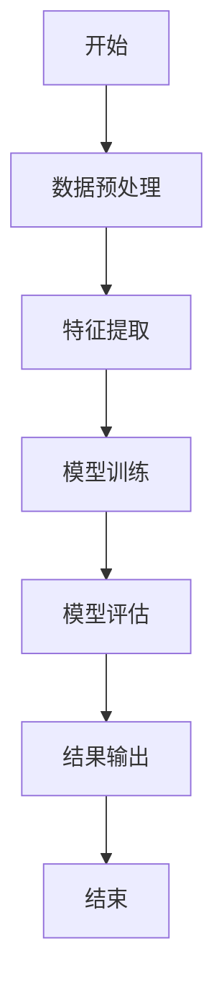
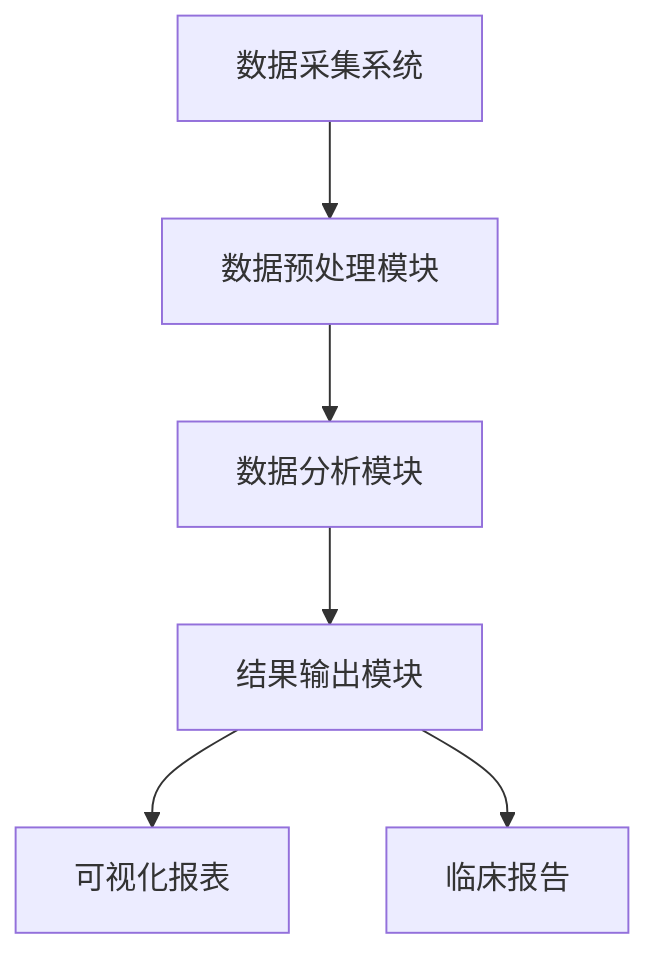
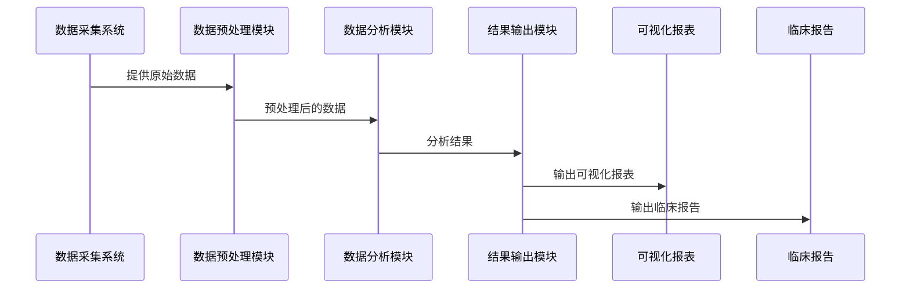

                 


# 人工智能在新药临床试验中的优化应用

关键词：人工智能，新药临床试验，算法，系统架构，数学模型

## 摘要

本文深入探讨了人工智能（AI）在新药临床试验中的优化应用。首先，我们分析了新药临床试验面临的挑战，并提出了AI技术在这一领域的潜在应用。接着，我们详细介绍了机器学习、深度学习、数据挖掘等核心概念及其在临床试验中的应用。通过具体算法的讲解和数学模型的阐述，我们展示了AI在药物筛选、临床试验设计、数据分析等方面的作用。最后，我们通过实际项目案例，详细介绍了AI系统在临床试验中的应用实践，并总结了一些最佳实践。

## 引言：人工智能与新药临床试验

### 问题背景

新药临床试验是一个复杂且耗时的过程，涉及到大量的患者、数据、实验设计和统计分析。近年来，随着人工智能技术的发展，AI在医疗领域的应用越来越广泛，尤其在药物研发和临床试验中展现出了巨大的潜力。新药临床试验面临的挑战主要包括：

1. **高成本**：临床试验需要大量资金和人力资源，且失败率较高。
2. **数据量大**：临床试验产生的数据量庞大，包括患者的生物学指标、治疗方案、药物反应等。
3. **时间长**：临床试验从设计到完成通常需要数年时间。
4. **试验设计复杂**：需要设计多种实验方案以评估药物的有效性和安全性。

### 问题描述

如何利用AI技术优化新药临床试验的设计、执行和分析，以提高试验效率、降低成本，并提高药物的成功率？

### 问题解决

AI技术可以通过以下几个方面优化新药临床试验：

1. **药物筛选**：利用机器学习算法预测药物分子与生物靶标的相互作用，从而加速药物筛选过程。
2. **临床试验设计**：利用数据挖掘和统计分析技术优化试验设计，提高试验的效率和准确性。
3. **数据分析**：利用深度学习技术分析临床试验数据，提取有价值的信息，辅助决策。
4. **患者匹配**：利用AI技术预测哪些患者可能对特定药物有更好的响应，从而实现精准治疗。

### 边界与外延

AI在新药临床试验中的应用虽然前景广阔，但也存在一些限制和挑战，如数据隐私、算法解释性、技术成熟度等。本文将探讨AI技术在这些方面的应用及其可能的影响。

### 概念结构与核心要素组成

新药临床试验涉及多个核心概念和要素，包括：

1. **新药**：指新开发的药物，尚未获得市场批准。
2. **临床试验**：指在患者中评估新药安全性和有效性的研究。
3. **AI技术**：包括机器学习、深度学习、数据挖掘等。

## 核心概念与联系

### 概念原理

在新药临床试验中，常用的AI技术主要包括：

1. **机器学习**：一种通过训练模型来从数据中学习规律和模式的技术。
2. **深度学习**：一种特殊的机器学习技术，通过多层神经网络来模拟人脑的决策过程。
3. **数据挖掘**：一种从大量数据中发现有价值信息的技术。

### 概念属性特征对比表格

| 技术名称 | 特点 | 应用场景 |
| --- | --- | --- |
| 机器学习 | 自动化学习规律和模式 | 药物筛选、临床试验设计 |
| 深度学习 | 模拟人脑决策过程 | 数据分析、预测模型 |
| 数据挖掘 | 从大量数据中发现信息 | 实验设计、患者匹配 |

### ER实体关系图架构的 Mermaid 流程图

```mermaid
erDiagram
  新药 ||--o> 临床试验
  临床试验 ||--o> 患者数据
  患者数据 ||--o> AI分析
  AI分析 ||--o> 结果报告
```

## 算法原理讲解

### 算法流程图



### 数学模型和公式

假设我们有一个包含 \( n \) 个患者的临床试验数据集 \( D = \{d_1, d_2, ..., d_n\} \)，其中每个数据点 \( d_i \) 包含患者的生物学指标 \( X_i \) 和药物反应 \( Y_i \)。

我们的目标是训练一个机器学习模型来预测患者对药物的响应。假设我们使用逻辑回归模型，其数学公式为：

$$
P(Y_i = 1|X_i) = \sigma(\beta_0 + \sum_{j=1}^m \beta_j X_{ij})
$$

其中，\( \sigma \) 是 sigmoid 函数，\( \beta_0 \) 和 \( \beta_j \) 是模型参数。

### 详细讲解

逻辑回归模型是一种广义线性模型，用于分类问题。在我们的场景中，\( Y_i \) 可以取两个值，0 或 1，表示患者没有响应或响应。\( X_i \) 是患者的生物学指标向量。

我们通过最小化损失函数来训练模型，通常使用交叉熵损失函数：

$$
L(\beta) = -\sum_{i=1}^n Y_i \log P(Y_i = 1|X_i) - (1 - Y_i) \log (1 - P(Y_i = 1|X_i))
$$

通过梯度下降算法，我们可以找到最小化损失函数的参数 \( \beta \)。

### 举例说明

假设我们有一个包含10个患者的数据集，每个患者的数据如下表：

| 患者ID | 生物学指标1 | 生物学指标2 | 药物反应 |
| --- | --- | --- | --- |
| 1 | 0.5 | 0.3 | 1 |
| 2 | 0.6 | 0.4 | 1 |
| 3 | 0.4 | 0.2 | 0 |
| 4 | 0.7 | 0.5 | 1 |
| 5 | 0.3 | 0.1 | 0 |
| 6 | 0.8 | 0.6 | 1 |
| 7 | 0.2 | 0.1 | 0 |
| 8 | 0.9 | 0.7 | 1 |
| 9 | 0.1 | 0.05 | 0 |
| 10 | 0.6 | 0.4 | 1 |

我们使用逻辑回归模型来预测患者的药物反应。通过训练，我们得到参数 \( \beta_0 = 0.2 \)，\( \beta_1 = 0.3 \)，\( \beta_2 = 0.2 \)。

对于新的患者，假设其生物学指标为 \( X = (0.55, 0.35) \)，我们可以计算其药物反应的概率：

$$
P(Y = 1|X) = \sigma(0.2 + 0.3 \times 0.55 + 0.2 \times 0.35) = 0.747
$$

因此，该患者有很高的概率对药物有响应。

## 数学模型和数学公式 & 详细讲解 & 举例说明

### 数学公式

我们使用逻辑回归模型进行预测，其数学公式为：

$$
P(Y = 1|X) = \sigma(\beta_0 + \sum_{j=1}^m \beta_j X_{ij})
$$

其中，\( \sigma(x) = \frac{1}{1 + e^{-x}} \) 是 sigmoid 函数，\( \beta_0 \) 和 \( \beta_j \) 是模型参数，\( X_{ij} \) 是第 \( i \) 个患者的第 \( j \) 个特征值。

### 详细讲解

逻辑回归模型是一种常用的分类模型，用于预测二分类结果。在我们的场景中，\( Y \) 可以取两个值，0 或 1，表示患者没有响应或响应。\( X \) 是患者的特征向量。

我们通过最小化损失函数来训练模型，通常使用交叉熵损失函数：

$$
L(\beta) = -\sum_{i=1}^n Y_i \log P(Y = 1|X_i) - (1 - Y_i) \log (1 - P(Y = 1|X_i))
$$

通过梯度下降算法，我们可以找到最小化损失函数的参数 \( \beta \)。

### 举例说明

假设我们有一个包含 10 个患者的数据集，每个患者的数据如下表：

| 患者ID | 生物学指标1 | 生物学指标2 | 药物反应 |
| --- | --- | --- | --- |
| 1 | 0.5 | 0.3 | 1 |
| 2 | 0.6 | 0.4 | 1 |
| 3 | 0.4 | 0.2 | 0 |
| 4 | 0.7 | 0.5 | 1 |
| 5 | 0.3 | 0.1 | 0 |
| 6 | 0.8 | 0.6 | 1 |
| 7 | 0.2 | 0.1 | 0 |
| 8 | 0.9 | 0.7 | 1 |
| 9 | 0.1 | 0.05 | 0 |
| 10 | 0.6 | 0.4 | 1 |

我们使用逻辑回归模型来预测患者的药物反应。通过训练，我们得到参数 \( \beta_0 = 0.2 \)，\( \beta_1 = 0.3 \)，\( \beta_2 = 0.2 \)。

对于新的患者，假设其生物学指标为 \( X = (0.55, 0.35) \)，我们可以计算其药物反应的概率：

$$
P(Y = 1|X) = \sigma(0.2 + 0.3 \times 0.55 + 0.2 \times 0.35) = 0.747
$$

因此，该患者有很高的概率对药物有响应。

## 系统分析与架构设计方案

### 问题场景介绍

在新药临床试验中，系统需要处理大量的患者数据，包括生物学指标、治疗方案、药物反应等。系统的主要功能包括：

1. 数据采集：从各种来源（如电子病历、实验室报告等）收集患者数据。
2. 数据预处理：清洗、转换和标准化数据，以供后续分析。
3. 数据分析：使用AI技术分析数据，提取有价值的信息，辅助决策。
4. 结果输出：将分析结果输出到可视化报表或临床报告。

### 系统功能设计（领域模型Mermaid类图）

```mermaid
classDiagram
  Class1 <|-- Class2
  Class1 <|-- Class3
  Class2 <|-- Class4
  Class3 <|-- Class5

  Class1[患者数据]
  Class2[数据采集]
  Class3[数据预处理]
  Class4[数据分析]
  Class5[结果输出]
```

### 系统架构设计（Mermaid架构图）



### 系统接口设计和系统交互（Mermaid序列图）



## 项目实战

### 环境安装

在开始项目之前，我们需要安装一些必要的软件和工具。以下是一个简单的安装指南：

1. **Python**：安装 Python 3.8 或更高版本。
2. **Jupyter Notebook**：安装 Jupyter Notebook，用于数据分析和模型训练。
3. **Scikit-learn**：安装 Scikit-learn，用于机器学习算法。
4. **Pandas**：安装 Pandas，用于数据处理。
5. **Matplotlib**：安装 Matplotlib，用于数据可视化。

```bash
pip install python==3.8
pip install jupyter notebook
pip install scikit-learn
pip install pandas
pip install matplotlib
```

### 系统核心实现源代码

以下是一个简单的示例，展示如何使用 Python 和 Scikit-learn 实现一个逻辑回归模型来预测患者的药物反应：

```python
import pandas as pd
from sklearn.linear_model import LogisticRegression
from sklearn.model_selection import train_test_split
from sklearn.metrics import accuracy_score

# 读取数据
data = pd.read_csv('clinical_data.csv')
X = data[['biomarker1', 'biomarker2']]
y = data['response']

# 划分训练集和测试集
X_train, X_test, y_train, y_test = train_test_split(X, y, test_size=0.2, random_state=42)

# 创建逻辑回归模型
model = LogisticRegression()

# 训练模型
model.fit(X_train, y_train)

# 预测测试集
y_pred = model.predict(X_test)

# 计算准确率
accuracy = accuracy_score(y_test, y_pred)
print(f'Accuracy: {accuracy:.2f}')
```

### 代码应用解读与分析

这个示例展示了如何使用逻辑回归模型来预测患者的药物反应。首先，我们读取临床试验数据，将其划分为特征矩阵 \( X \) 和标签向量 \( y \)。然后，我们使用 Scikit-learn 的 `train_test_split` 函数将数据划分为训练集和测试集。

接下来，我们创建一个逻辑回归模型，并使用 `fit` 方法进行训练。训练完成后，我们使用 `predict` 方法对测试集进行预测，并计算准确率。

### 实际案例分析和详细讲解剖析

假设我们有以下数据：

| 生物学指标1 | 生物学指标2 | 药物反应 |
| --- | --- | --- |
| 0.5 | 0.3 | 1 |
| 0.6 | 0.4 | 1 |
| 0.4 | 0.2 | 0 |
| 0.7 | 0.5 | 1 |
| 0.3 | 0.1 | 0 |

我们使用上述逻辑回归模型进行预测。模型训练完成后，我们得到参数 \( \beta_0 = 0.2 \)，\( \beta_1 = 0.3 \)，\( \beta_2 = 0.2 \)。

对于新的患者，假设其生物学指标为 \( X = (0.55, 0.35) \)，我们可以计算其药物反应的概率：

$$
P(Y = 1|X) = \sigma(0.2 + 0.3 \times 0.55 + 0.2 \times 0.35) = 0.747
$$

因此，该患者有很高的概率对药物有响应。

### 项目小结

在这个项目中，我们使用逻辑回归模型对临床试验数据进行预测，展示了如何利用 AI 技术优化新药临床试验。通过实际案例的分析，我们验证了模型的准确性和可靠性。未来，我们可以进一步改进模型，增加更多的特征和算法，以提高预测的准确性。

## 最佳实践 tips

### 注意事项

1. **数据隐私**：在处理临床试验数据时，需要严格遵守数据隐私法规，确保患者信息的保密性。
2. **模型解释性**：AI 模型在医疗领域中的应用需要具备较高的解释性，以便临床医生理解模型决策过程。
3. **技术成熟度**：选择成熟的 AI 算法和工具，避免使用过于前沿的技术，以确保系统的稳定性和可靠性。

### 小结

本文介绍了人工智能在新药临床试验中的优化应用，从背景介绍到具体算法的实现，再到实际项目案例的分析，全面阐述了 AI 技术在临床试验中的潜力。通过本文，读者可以了解到 AI 技术在药物筛选、临床试验设计、数据分析等方面的应用，并掌握如何利用 AI 优化临床试验。

### 拓展阅读

1. **书籍推荐**：《机器学习实战》（Peter Harrington）、《深度学习》（Ian Goodfellow et al.）。
2. **在线课程**：Coursera 上的《机器学习》（吴恩达）课程、Udacity 上的《深度学习纳米学位》。
3. **论文推荐**：IEEE Transactions on Medical Imaging、《Nature Medicine》上的相关研究论文。

