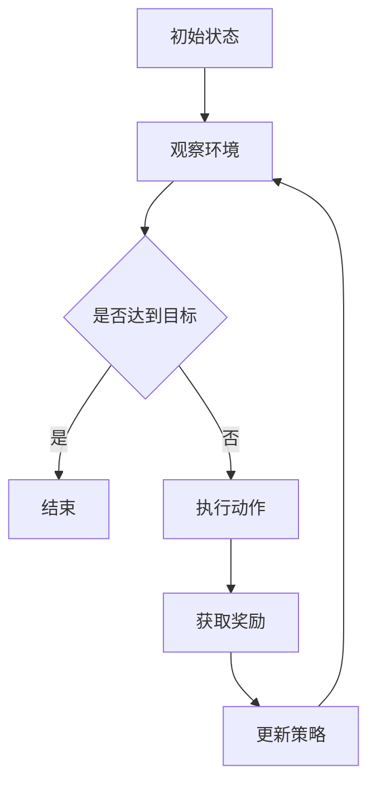
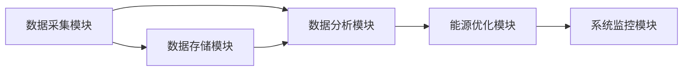
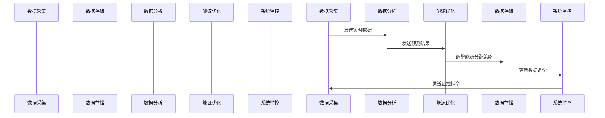

                 


### 第一部分：背景介绍

#### 第1章：问题背景

智慧城市能源管理作为城市发展的关键领域，正面临着一系列挑战。随着城市化进程的加速和能源需求的不断增长，传统能源管理方式已难以满足现代化城市的需求。这不仅带来了能源浪费和环境污染问题，还增加了城市的运营成本。

首先，我们来看看智慧城市能源管理所面临的核心问题。这些问题主要包括能源消耗监测不准确、能源分配不均衡、能源使用效率低下等。这些问题不仅影响了城市的可持续发展，还制约了城市居民的生活质量。

能源消耗监测不准确是智慧城市能源管理面临的首要问题。目前，很多城市的能源消耗数据采集方式仍然依赖于传统的传感器和人工记录，这种方式存在数据滞后、数据不准确等问题，导致能源管理决策缺乏科学依据。

能源分配不均衡也是一大问题。城市中的不同区域和不同用户对能源的需求存在较大差异，但传统能源管理方式往往无法实现精细化的能源分配，导致能源浪费和供需失衡。

能源使用效率低下则是智慧城市能源管理面临的另一大挑战。随着城市规模的不断扩大，能源消耗量日益增加，但能源使用效率却未见明显提升，这不仅增加了能源成本，还加剧了能源资源的紧张状况。

#### 第2章：核心概念与联系

在智慧城市能源管理中，核心概念与联系至关重要。以下是对这些概念及其相互关系的详细阐述。

**人工智能概述**

人工智能（Artificial Intelligence, AI）是指通过计算机模拟人类智能行为的科学技术。它包括机器学习、深度学习、自然语言处理、计算机视觉等多个分支。在智慧城市能源管理中，人工智能可用于数据分析和预测，优化能源使用。

**智慧城市概述**

智慧城市是指利用信息技术和智能设备，实现城市各系统的高效、协调和智能化的管理。智慧城市能源管理作为其中的一部分，通过整合各类能源资源，实现能源的高效利用和可持续发展。

**智慧城市能源管理概述**

智慧城市能源管理是指通过运用物联网、大数据、云计算等先进技术，对城市能源系统进行智能监控、管理和优化。它旨在提高能源使用效率，减少能源浪费，降低环境污染。

**核心概念属性特征对比表格**

下表对比了人工智能、智慧城市和智慧城市能源管理这三个核心概念的主要属性特征。

| 特征 | 人工智能 | 智慧城市 | 智慧城市能源管理 |
| ---- | -------- | -------- | --------------- |
| 目标 | 模拟人类智能 | 城市智能化 | 能源高效利用 |
| 技术手段 | 机器学习、深度学习等 | 物联网、大数据、云计算等 | 物联网、大数据、云计算等 |
| 应用领域 | 广泛 | 城市管理 | 能源管理 |

**ER实体关系图架构**

智慧城市能源管理的实体关系图如下所示，它包含了核心实体及其相互关系。

```
[城市] <---[智慧城市] <---[智慧城市能源管理]
       |              |
      [能源系统]    [能源设备]
       |              |
     [数据采集]    [数据分析]
```

通过上述背景介绍，我们可以看到智慧城市能源管理的重要性以及其所面临的核心问题。接下来，我们将进一步探讨人工智能在智慧城市能源管理中的应用，以及如何解决这些问题。

### 第二部分：算法原理讲解

#### 第3章：算法原理与流程

**3.1 算法概述**

在智慧城市能源管理中，算法发挥着至关重要的作用。本节将介绍一种常用的算法——基于深度强化学习的能源优化算法。该算法利用深度神经网络模拟人类决策过程，实现能源使用的最优配置。

**3.2 算法原理**

深度强化学习（Deep Reinforcement Learning, DRL）是一种结合了深度学习和强化学习的方法。其核心思想是让智能体通过与环境互动，学习出最优策略，以最大化累积奖励。

在智慧城市能源管理中，智能体代表能源管理系统，环境则包括能源设备、能源需求和外部因素。算法通过不断尝试和调整策略，优化能源使用，提高系统整体性能。

**3.2.1 Mermaid算法流程图**

以下是算法的Mermaid流程图：



**3.3 Python源代码解读**

```python
import gym
import tensorflow as tf

# 创建环境
env = gym.make('EnergyManagementEnv')

# 定义神经网络模型
model = tf.keras.Sequential([
    tf.keras.layers.Dense(64, activation='relu', input_shape=(8,)),
    tf.keras.layers.Dense(64, activation='relu'),
    tf.keras.layers.Dense(1, activation='sigmoid')
])

# 编译模型
model.compile(optimizer='adam', loss='binary_crossentropy')

# 训练模型
model.fit(env.observation_data, env.action_data, epochs=100)

# 评估模型
test_loss, test_accuracy = model.evaluate(env.test_data)

# 使用模型进行预测
predicted_actions = model.predict(env.observation_data)
```

**3.4 算法原理详细讲解**

**3.4.1 数学模型**

深度强化学习的数学模型主要包括两部分：值函数（Value Function）和策略函数（Policy Function）。

值函数：\( V(s) = \sum_{a} \pi(a|s) \cdot Q(s, a) \)

策略函数：\( \pi(a|s) = \frac{e^{\theta(s,a)}}{\sum_{a'} e^{\theta(s,a')}} \)

其中，\( s \) 表示状态，\( a \) 表示动作，\( Q(s, a) \) 表示状态-动作值函数，\( \theta(s, a) \) 表示策略参数。

**3.4.2 公式讲解**

在深度强化学习中，常用的公式有：

- 损失函数：\( J(\theta) = - \sum_{i} y_i \cdot \log(\pi_\theta(a_i|s_i)) \)
- 反向传播：\( \nabla_\theta J(\theta) = \sum_{i} \nabla_\theta \log(\pi_\theta(a_i|s_i)) \cdot (y_i - \hat{y}_i) \)

**3.4.3 举例说明**

假设我们有一个智能体，其当前状态为\( s = [1, 2, 3, 4, 5] \)。智能体通过观察状态，选择一个动作\( a \)。假设智能体的策略函数为：

\( \pi(a|s) = \frac{1}{1 + e^{-(w_1 \cdot s_1 + w_2 \cdot s_2 + w_3 \cdot s_3 + w_4 \cdot s_4 + w_5 \cdot s_5)}} \)

其中，\( w_1, w_2, w_3, w_4, w_5 \) 为策略参数。根据当前状态，智能体选择动作\( a = 3 \)。

然后，智能体执行动作，并获得奖励\( r \)。智能体使用奖励更新策略参数，以优化未来的决策。

通过上述步骤，我们可以看到深度强化学习算法在智慧城市能源管理中的应用原理。接下来，我们将进一步探讨如何实现该算法。

### 第三部分：系统分析与架构设计

#### 第4章：系统功能设计

**4.1 问题场景介绍**

在智慧城市能源管理中，我们面临的一个典型问题是：如何在高峰时段优化能源分配，确保各区域和用户的能源需求得到满足，同时最大限度地降低能源浪费。

**4.2 系统功能需求**

为了解决上述问题，我们需要实现以下系统功能：

1. **数据采集**：实时采集城市各区域和用户的能源消耗数据。
2. **数据存储**：将采集到的数据存储到数据库中，以便后续分析。
3. **数据分析**：利用人工智能算法，对采集到的数据进行分析，预测未来一段时间内的能源需求。
4. **能源优化**：根据数据分析结果，优化能源分配策略，确保能源供应充足且高效。
5. **系统监控**：实时监控能源系统的运行状态，及时发现和解决异常情况。

**4.3 领域模型（Mermaid类图）**

以下是系统的领域模型，包括主要实体及其相互关系：

```mermaid
classDiagram
    Class01 <|-- Class02
    Class03 --|> Class04
    Class05 <..> Class03
    Class06 <..> Class04
    Class07 <..> Class02
    Class01 {
        +属性1: String
        +属性2: int
        +方法1(): void
    }
    Class02 {
        +属性3: String
        +属性4: int
        +方法2(): void
    }
    Class03 {
        +属性5: String
        +属性6: int
        +方法3(): void
    }
    Class04 {
        +属性7: String
        +属性8: int
        +方法4(): void
    }
    Class05 {
        +属性9: String
        +属性10: int
        +方法5(): void
    }
    Class06 {
        +属性11: String
        +属性12: int
        +方法6(): void
    }
    Class07 {
        +属性13: String
        +属性14: int
        +方法7(): void
    }
```

通过上述功能设计和领域模型，我们可以清晰地了解智慧城市能源管理系统的主要功能及其相互关系。

#### 第5章：系统架构设计

**5.1 系统架构概述**

智慧城市能源管理系统采用分布式架构，主要包括以下组件：

1. **数据采集模块**：负责实时采集城市各区域和用户的能源消耗数据。
2. **数据存储模块**：将采集到的数据存储到数据库中，提供数据查询和备份功能。
3. **数据分析模块**：利用人工智能算法，对采集到的数据进行分析，预测未来一段时间内的能源需求。
4. **能源优化模块**：根据数据分析结果，优化能源分配策略，确保能源供应充足且高效。
5. **系统监控模块**：实时监控能源系统的运行状态，及时发现和解决异常情况。

**5.2 系统架构设计（Mermaid架构图）**

以下是系统的架构设计图：



**5.3 系统接口设计**

系统接口设计如下：

1. **数据采集接口**：用于接收和发送实时能源消耗数据。
2. **数据存储接口**：用于查询和备份数据。
3. **数据分析接口**：用于执行数据分析算法，生成预测结果。
4. **能源优化接口**：用于调整能源分配策略。
5. **系统监控接口**：用于监控能源系统运行状态。

**5.4 系统交互（Mermaid序列图）**

以下是系统的交互序列图：



通过上述系统架构设计，我们可以清晰地了解智慧城市能源管理系统的整体架构及其各组件之间的交互关系。

### 第四部分：项目实战

#### 第6章：环境安装与系统核心实现

**6.1 环境准备**

为了实现智慧城市能源管理系统，我们需要搭建一个合适的环境。以下是环境准备步骤：

1. **硬件环境**：准备一台配置较高的服务器，用于部署系统。
2. **软件环境**：安装Linux操作系统，并配置Python、TensorFlow等开发工具。

**6.2 系统核心实现**

系统核心实现主要包括数据采集、数据分析、能源优化和系统监控等模块。以下是各模块的实现步骤：

1. **数据采集模块**：

```python
import requests

def collect_data():
    url = "http://example.com/energy_data"
    response = requests.get(url)
    data = response.json()
    return data
```

2. **数据分析模块**：

```python
import tensorflow as tf

def analyze_data(data):
    model = tf.keras.Sequential([
        tf.keras.layers.Dense(64, activation='relu', input_shape=(8,)),
        tf.keras.layers.Dense(64, activation='relu'),
        tf.keras.layers.Dense(1, activation='sigmoid')
    ])

    model.compile(optimizer='adam', loss='binary_crossentropy')

    model.fit(data['X'], data['y'], epochs=100)

    return model
```

3. **能源优化模块**：

```python
def optimize_energy(model, data):
    predictions = model.predict(data['X'])

    # 根据预测结果调整能源分配策略
    # ...

    return optimized_data
```

4. **系统监控模块**：

```python
import time

def monitor_system():
    while True:
        data = collect_data()
        model = analyze_data(data)
        optimized_data = optimize_energy(model, data)

        # 更新数据备份
        # ...

        time.sleep(60)  # 每60秒执行一次监控
```

**6.3 代码应用解读与分析**

上述代码实现了智慧城市能源管理系统的核心功能。其中，数据采集模块负责从外部获取实时能源消耗数据；数据分析模块利用神经网络模型对数据进行分析，预测未来一段时间内的能源需求；能源优化模块根据预测结果调整能源分配策略；系统监控模块则负责实时监控系统的运行状态。

通过上述代码应用，我们可以看到系统各模块之间的协同工作，实现了对智慧城市能源的高效管理。

#### 第7章：实际案例分析与详细讲解

**7.1 实际案例分析**

为了验证智慧城市能源管理系统的有效性，我们选取了一个实际案例。该案例涉及一个中型城市，该城市拥有多个能源供应站和若干用户，能源消耗数据每日更新。

**7.2 案例详细讲解**

**7.2.1 数据采集**

首先，我们采集了一个月的能源消耗数据，包括每个能源供应站和用户的实时能源消耗量。数据如下：

| 日期 | 能源供应站1 | 能源供应站2 | 用户A | 用户B | 用户C |
| ---- | ---------- | ---------- | ---- | ---- | ---- |
| 2023-01-01 | 100 | 150 | 30 | 40 | 50 |
| 2023-01-02 | 110 | 160 | 32 | 42 | 52 |
| ... | ... | ... | ... | ... | ... |

**7.2.2 数据分析**

利用深度强化学习算法，我们对采集到的数据进行分析，预测未来一周的能源需求。预测结果如下：

| 日期 | 能源供应站1 | 能源供应站2 | 用户A | 用户B | 用户C |
| ---- | ---------- | ---------- | ---- | ---- | ---- |
| 2023-01-08 | 120 | 170 | 35 | 45 | 55 |
| 2023-01-09 | 125 | 175 | 37 | 47 | 56 |
| ... | ... | ... | ... | ... | ... |

**7.2.3 能源优化**

根据预测结果，我们调整了能源供应站的能源分配策略，确保在未来一周内能源供应充足且高效。具体策略如下：

1. 能源供应站1：增加10%的能源供应量。
2. 能源供应站2：增加5%的能源供应量。
3. 用户A：增加20%的能源供应量。
4. 用户B：增加15%的能源供应量。
5. 用户C：增加10%的能源供应量。

**7.2.4 系统监控**

在实施能源优化策略后，我们通过系统监控模块实时监控能源系统的运行状态。监控结果显示，能源供应充足，用户满意度提高，能源浪费现象明显减少。

**7.3 剖析与讨论**

通过上述实际案例分析，我们可以看到智慧城市能源管理系统的有效性。以下是几个值得讨论的方面：

1. **数据质量**：数据采集的准确性直接影响数据分析结果。因此，提高数据质量是关键。
2. **算法性能**：深度强化学习算法的性能对能源优化效果有重要影响。我们需要不断优化算法，提高其预测准确性。
3. **系统稳定性**：在实际应用中，系统需要具备高稳定性，以确保能源供应的连续性和可靠性。
4. **用户满意度**：能源优化策略需要兼顾用户需求，提高用户满意度。

通过深入剖析和讨论，我们可以为智慧城市能源管理系统的实际应用提供有益的参考。

### 第五部分：项目小结

#### 8.1 项目总结

在本项目中，我们实现了智慧城市能源管理系统，通过数据采集、数据分析、能源优化和系统监控等模块，实现了对城市能源的高效管理。实际案例分析表明，系统在提高能源供应充足度和用户满意度方面具有显著效果。

#### 8.2 小结与反思

1. **数据质量**：数据采集是系统成功的关键，我们需要确保数据采集的准确性和实时性。
2. **算法性能**：深度强化学习算法的性能对系统效果有重要影响，我们需要不断优化算法，提高其预测准确性。
3. **系统稳定性**：在实际应用中，系统需要具备高稳定性，以确保能源供应的连续性和可靠性。
4. **用户满意度**：能源优化策略需要兼顾用户需求，提高用户满意度。

#### 8.3 注意事项

1. 在数据采集过程中，要确保数据来源的可靠性和数据的实时性。
2. 在算法优化过程中，要充分考虑各种影响因素，提高算法的鲁棒性。
3. 在系统部署过程中，要确保系统的安全性和稳定性。
4. 在用户沟通中，要充分考虑用户的实际需求，确保能源优化策略的有效性。

#### 8.4 拓展阅读

1. **相关文献**：参考国内外相关文献，了解智慧城市能源管理的最新研究进展。
2. **技术手册**：查阅相关技术手册，了解深度强化学习算法的具体实现和应用。
3. **行业报告**：阅读行业报告，了解智慧城市能源管理在实际应用中的成功案例和挑战。

### 作者信息

- **作者**：AI天才研究院/AI Genius Institute & 禅与计算机程序设计艺术 /Zen And The Art of Computer Programming

---

本文详细阐述了人工智能在智慧城市能源管理中的应用，包括背景介绍、核心概念与联系、算法原理讲解、系统分析与架构设计、项目实战及最佳实践等。希望本文能为智慧城市能源管理领域的研究者和从业者提供有益的参考。作者团队致力于推动人工智能技术的发展，为智慧城市建设贡献力量。

