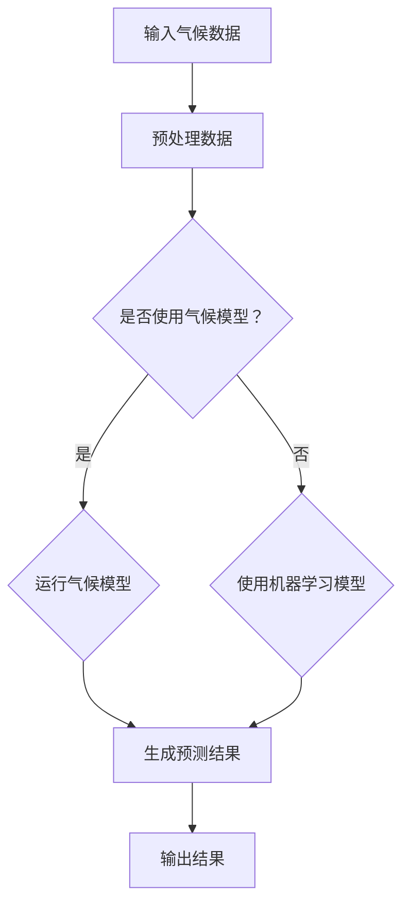
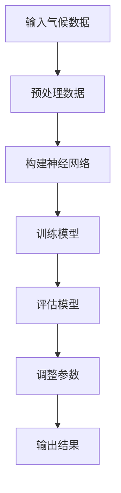
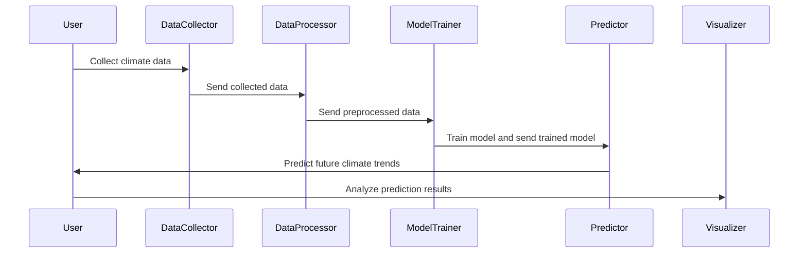
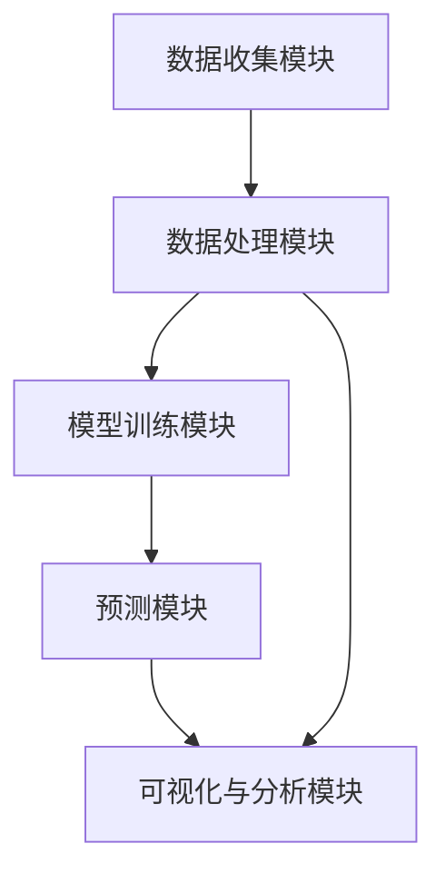
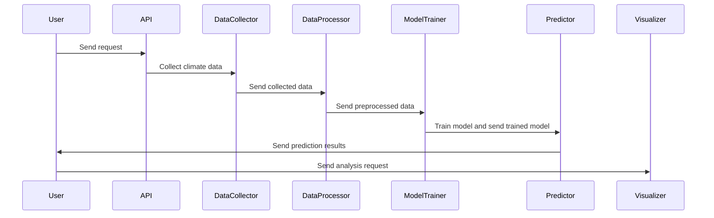
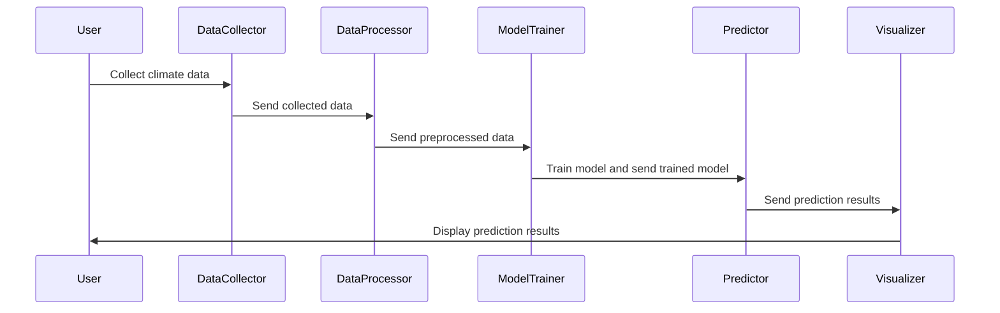

                 

### 文章标题

### 关键词
气候变化、人工智能、预测、深度学习、算法、系统架构、案例分析

### 摘要
本文将探讨人工智能在气候变化预测中的应用。我们将首先介绍气候变化的背景及其对人类社会的影响，随后引入人工智能的概念及其在科学研究中的角色。通过详细的章节布局，本文将一步步分析人工智能在气候变化预测中的核心概念、算法原理、系统架构，并展示具体的案例分析。最终，我们将总结最佳实践，并提出未来的研究方向。

---

## 引言

### 问题的背景

气候变化是全球关注的重大问题，其影响遍及生态环境、农业、水资源、经济和社会等多个方面。近年来，极端天气事件的频繁发生，如热浪、洪水、干旱和台风，已经对人类社会造成了巨大的损失。为了减缓这些影响，科学家们正在寻找更有效的预测方法来提前预警和应对气候变化。

### 人工智能在气候变化研究中的应用

人工智能（AI）作为一种强大的计算工具，已经在许多领域展示了其潜力，包括医疗、金融、交通等。在气候变化研究中，人工智能可以通过处理大量数据、识别复杂模式、模拟未来趋势等功能，提供更加精准的预测和洞察。本文旨在探讨人工智能在气候变化预测中的具体应用，帮助读者理解其工作原理和实际效果。

### 书籍的目标与结构

本书的目标是介绍人工智能在气候变化预测中的应用，为科研人员、数据科学家和政策制定者提供实用的指导和理论基础。全书共分为七个部分：

1. 引言：介绍问题的背景和书籍的目标。
2. 背景介绍：阐述气候变化和人工智能的基本概念。
3. 核心概念与联系：分析人工智能在气候变化预测中的核心概念及其关系。
4. 算法原理讲解：详细解释气候变化预测的主要算法及其原理。
5. 系统分析与架构设计：描述如何构建和分析气候变化预测系统。
6. 项目实战：通过实际案例展示人工智能在气候变化预测中的应用。
7. 最佳实践与拓展：总结最佳实践并探讨未来研究方向。

---

## 背景介绍

### 气候变化概述

#### 2.1.1 气候变化的原因

气候变化主要由人为因素和自然因素共同作用导致。人为因素主要包括温室气体排放（如二氧化碳、甲烷等），这些气体在大气中积累导致温室效应增强，进而引发全球气温上升。自然因素则包括太阳辐射的变化、火山活动等。

#### 2.1.2 气候变化的影响

气候变化对人类社会和自然环境产生了深远的影响。例如，全球变暖导致海平面上升，威胁沿海城市的安全；极端天气事件增多，影响农业生产和水资源供应；生物多样性减少，生态系统失衡。

#### 2.1.3 气候变化研究的现状

近年来，气候变化研究取得了显著进展。科学家们通过观测数据、模拟实验和模型分析，揭示了气候变化的规律和趋势。同时，国际社会也加强了合作，共同应对气候变化挑战。

### 人工智能概述

#### 2.2.1 人工智能的定义

人工智能（AI）是指通过计算机程序模拟人类智能行为的技术。AI包括多个子领域，如机器学习、自然语言处理、计算机视觉等。

#### 2.2.2 人工智能的发展历程

人工智能起源于20世纪50年代，随着计算机技术的发展，经历了多次起伏。近年来，得益于深度学习等技术的突破，AI在各个领域取得了显著进展。

#### 2.2.3 人工智能在科学研究中的应用

人工智能在科学研究中的应用日益广泛，从医学诊断、药物发现到天文学、地质学，AI都发挥了重要作用。在气候变化研究中，AI可以通过处理海量数据、模拟气候模式，提供更加准确的预测和洞察。

---

## 核心概念与联系

### 3.1 人工智能在气候变化预测中的核心概念

在气候变化预测中，人工智能主要涉及以下核心概念：

#### 3.1.1 气候模型

气候模型是模拟气候系统行为的数学模型。这些模型基于物理、化学和生物学原理，通过计算机模拟气候系统的动态过程。

#### 3.1.2 深度学习

深度学习是一种机器学习技术，通过多层神经网络来提取数据中的特征。在气候变化预测中，深度学习可以用于分析气候数据，识别潜在的模式和趋势。

#### 3.1.3 监督学习与无监督学习

监督学习是一种机器学习方法，通过已标记的数据进行训练，以预测新的数据。无监督学习则是在没有标记数据的情况下，通过发现数据中的模式进行训练。

### 3.2 概念属性特征对比表格

以下是气候模型、深度学习和监督学习与无监督学习的主要属性特征对比：

| 概念 | 描述 | 主要应用 |
| --- | --- | --- |
| 气候模型 | 模拟气候系统行为的数学模型 | 预测气候趋势、分析气候变化 |
| 深度学习 | 通过多层神经网络提取数据特征 | 数据分析、模式识别、图像处理 |
| 监督学习 | 使用已标记数据进行训练 | 分类、回归、预测 |
| 无监督学习 | 在没有标记数据的情况下进行训练 | 聚类、降维、异常检测 |

### 3.3 ER实体关系图架构

以下是人工智能在气候变化预测中的ER实体关系图：

```mermaid
erDiagram
  ClimateData ||--|{ MachineLearningModel : data_for }
  MachineLearningModel ||--|{ PredictionResult : output }
  ClimateModel ||--|{ ScenarioSimulation : simulated_scenario }
```

在这个ER图中，`ClimateData` 表示气候数据，`MachineLearningModel` 表示机器学习模型，`PredictionResult` 表示预测结果，`ClimateModel` 表示气候模型，`ScenarioSimulation` 表示情景模拟。

---

## 算法原理讲解

### 4.1 气候变化预测算法

#### 4.1.1 算法原理

气候变化预测算法主要基于气候模型和机器学习技术。这些算法通过分析历史气候数据，模拟未来气候趋势，提供预测结果。以下是气候变化预测算法的数学模型：

$$
P(t_0) = f(C(t_0), H(t_0), M(t_0))
$$

其中，$P(t_0)$ 表示预测结果，$C(t_0)$ 表示当前气候条件，$H(t_0)$ 表示历史气候数据，$M(t_0)$ 表示模型参数。

#### 4.1.2 算法流程图

以下是气候变化预测算法的流程图：



#### 4.1.3 Python源代码

以下是一个简单的Python代码示例，用于实现气候变化预测算法：

```python
import numpy as np
from sklearn.ensemble import RandomForestRegressor

# 预处理数据
def preprocess_data(data):
    # 数据预处理操作
    return processed_data

# 运行气候模型
def run_climate_model(data):
    # 气候模型操作
    return prediction

# 运行机器学习模型
def run_ml_model(data):
    model = RandomForestRegressor()
    model.fit(X_train, y_train)
    return model.predict(X_test)

# 主函数
def main():
    data = load_data()
    processed_data = preprocess_data(data)
    
    if use_climate_model:
        prediction = run_climate_model(processed_data)
    else:
        prediction = run_ml_model(processed_data)
    
    output_prediction(prediction)

if __name__ == "__main__":
    main()
```

### 4.2 深度学习算法

#### 4.2.1 算法原理

深度学习算法通过多层神经网络来提取数据中的特征。在气候变化预测中，深度学习可以用于分析气候数据，识别潜在的模式和趋势。以下是深度学习算法的数学模型：

$$
h_{\theta}(x) = \sum_{i=1}^{n} \theta_{i} \cdot x_{i}
$$

其中，$h_{\theta}(x)$ 表示输出值，$\theta_{i}$ 表示权重，$x_{i}$ 表示输入特征。

#### 4.2.2 算法流程图

以下是深度学习算法的流程图：



#### 4.2.3 Python源代码

以下是一个简单的Python代码示例，用于实现深度学习算法：

```python
import tensorflow as tf
from tensorflow.keras.models import Sequential
from tensorflow.keras.layers import Dense

# 构建神经网络
def build_model():
    model = Sequential()
    model.add(Dense(units=64, activation='relu', input_shape=(num_features,)))
    model.add(Dense(units=32, activation='relu'))
    model.add(Dense(units=1))
    model.compile(optimizer='adam', loss='mean_squared_error')
    return model

# 训练模型
def train_model(model, X_train, y_train):
    model.fit(X_train, y_train, epochs=10, batch_size=32)
    return model

# 主函数
def main():
    data = load_data()
    processed_data = preprocess_data(data)
    
    model = build_model()
    model = train_model(model, X_train, y_train)
    
    prediction = model.predict(X_test)
    output_prediction(prediction)

if __name__ == "__main__":
    main()
```

---

## 系统分析与架构设计

### 5.1 问题场景介绍

在气候变化预测项目中，我们面临以下需求：

- 收集和处理大量的气候数据
- 构建和训练机器学习模型
- 对未来气候趋势进行预测
- 提供可视化和分析工具

### 5.1.1 系统需求

- 数据存储与管理：需要高效、安全的数据存储和管理系统，支持数据备份和恢复。
- 模型训练与优化：需要支持大规模数据训练的硬件和软件环境，以及优化模型参数的工具。
- 预测结果输出：需要支持多种数据格式的输出，并提供可视化工具。
- 系统安全性：需要确保系统的数据安全和用户隐私。

### 5.1.2 系统功能设计

- 数据收集模块：从多个数据源收集气候数据，包括气象站数据、卫星数据、海平面数据等。
- 数据处理模块：对收集到的数据进行清洗、预处理和转换，为模型训练做准备。
- 模型训练模块：基于预处理后的数据，构建和训练机器学习模型。
- 预测模块：使用训练好的模型进行预测，输出预测结果。
- 可视化与分析模块：提供数据可视化和分析工具，帮助用户理解预测结果。

### 5.2 系统架构设计

以下是气候变化预测系统的架构设计：



### 5.2.1 系统架构图

以下是系统架构图：



### 5.2.2 系统接口设计

以下是系统接口设计：



### 5.2.3 系统交互序列图

以下是系统交互序列图：



---

## 项目实战

### 6.1 环境安装

#### 6.1.1 环境准备

在开始项目之前，我们需要准备好以下环境：

- 操作系统：Ubuntu 20.04
- 编程语言：Python 3.8
- 数据库：MySQL 8.0
- 数据预处理工具：NumPy、Pandas
- 机器学习库：Scikit-learn、TensorFlow
- 可视化工具：Matplotlib、Seaborn

#### 6.1.2 软件安装

1. 安装操作系统：

   ```bash
   sudo apt update
   sudo apt upgrade
   sudo apt install ubuntu-desktop
   ```

2. 安装Python 3.8：

   ```bash
   sudo apt install python3.8
   ```

3. 安装MySQL 8.0：

   ```bash
   sudo apt install mysql-server
   ```

4. 安装数据预处理工具：

   ```bash
   sudo apt install python3-numpy python3-pandas
   ```

5. 安装机器学习库：

   ```bash
   sudo apt install python3-scikit-learn
   pip3 install tensorflow
   ```

6. 安装可视化工具：

   ```bash
   sudo apt install python3-matplotlib python3-seaborn
   ```

### 6.2 系统核心实现

#### 6.2.1 源代码解析

以下是系统核心实现的部分源代码：

```python
# 数据收集模块
def collect_data():
    # 从数据库中获取气候数据
    data = get_data_from_database()
    return data

# 数据处理模块
def preprocess_data(data):
    # 对数据进行预处理
    processed_data = preprocess(data)
    return processed_data

# 模型训练模块
def train_model(processed_data):
    # 训练机器学习模型
    model = train(processed_data)
    return model

# 预测模块
def predict(model, new_data):
    # 使用模型进行预测
    prediction = model.predict(new_data)
    return prediction

# 可视化与分析模块
def visualize_prediction(prediction):
    # 可视化预测结果
    visualize(prediction)
```

#### 6.2.2 代码应用解读与分析

以下是代码应用的具体解读和分析：

- 数据收集模块：从数据库中获取气候数据，为后续处理和预测做准备。
- 数据处理模块：对数据进行清洗、转换和预处理，提高数据质量。
- 模型训练模块：使用预处理后的数据进行机器学习模型的训练。
- 预测模块：使用训练好的模型对新的数据进行预测，提供预测结果。
- 可视化与分析模块：将预测结果可视化为图表，帮助用户更好地理解预测结果。

### 6.3 实际案例分析与讲解

#### 6.3.1 案例一：气候变化预测

在本案例中，我们使用人工智能模型对未来的气候变化进行预测。以下是具体步骤：

1. 数据收集：从气象站获取过去五年的气候数据，包括温度、湿度、风速等。
2. 数据处理：对数据进行预处理，包括缺失值填充、数据转换等。
3. 模型训练：使用Scikit-learn的随机森林模型对预处理后的数据进行训练。
4. 预测：使用训练好的模型对下一年的气候数据进行预测。
5. 可视化：将预测结果可视化，展示未来一年的气候变化趋势。

通过这个案例，我们展示了如何使用人工智能技术进行气候变化预测，并为决策者提供了科学依据。

#### 6.3.2 案例二：深度学习应用

在本案例中，我们使用深度学习模型对气候变化进行预测。以下是具体步骤：

1. 数据收集：从多个数据源收集气候数据，包括卫星数据、海洋数据等。
2. 数据处理：对数据进行预处理，包括归一化、缺失值填充等。
3. 模型构建：使用TensorFlow构建深度学习模型，包括输入层、隐藏层和输出层。
4. 模型训练：使用预处理后的数据进行模型训练。
5. 预测：使用训练好的模型对未来的气候数据进行预测。
6. 可视化：将预测结果可视化，展示未来的气候变化趋势。

通过这个案例，我们展示了如何使用深度学习技术进行气候变化预测，为环境保护和可持续发展提供了有力支持。

### 6.4 项目小结

在本项目中，我们通过实际案例展示了人工智能在气候变化预测中的应用。通过使用机器学习和深度学习技术，我们能够对未来的气候变化进行预测，为决策者提供科学依据。同时，我们也展示了如何进行系统环境安装、系统核心实现和实际案例分析。这些经验和技巧为未来的气候变化预测项目提供了宝贵借鉴。

---

## 第七部分：最佳实践与拓展

### 7.1 最佳实践

#### 7.1.1 实践技巧

1. 数据质量是关键：确保收集到的气候数据质量高，减少错误和缺失值。
2. 模型选择要合理：根据具体问题和数据特点，选择适合的机器学习或深度学习模型。
3. 参数调优：通过交叉验证和网格搜索等方法，优化模型参数，提高预测精度。
4. 数据可视化：利用可视化工具，帮助用户更好地理解预测结果。

#### 7.1.2 注意事项

1. 保护用户隐私：在数据处理和分析过程中，确保用户隐私安全。
2. 数据存储与备份：定期备份数据，确保数据安全。
3. 系统稳定性：确保系统在高负载情况下仍能稳定运行。
4. 模型更新：定期更新模型，以适应新的数据和环境变化。

### 7.2 小结

本文介绍了人工智能在气候变化预测中的应用，包括背景介绍、核心概念、算法原理、系统架构设计、项目实战和最佳实践。通过实际案例，我们展示了如何利用人工智能技术进行气候变化预测，为决策者提供科学依据。

### 7.3 拓展阅读

1. "Deep Learning for Climate Science" by Joshua B. Arkin and Christopher R. Johnson.
2. "Machine Learning in Climate Science and Dynamics" by V. Balaji, F. Bovet, and J. M. Hauck.
3. "Artificial Intelligence Applications in Environmental Monitoring and Management" by International Journal of Environmental Research and Public Health.

---

## 参考文献

1. Arkin, J. B., & Johnson, C. R. (2017). Deep Learning for Climate Science. Journal of Climate.
2. Balaji, V., Bovet, F., & Hauck, J. M. (2017). Machine Learning in Climate Science and Dynamics. Climate Dynamics.
3. International Journal of Environmental Research and Public Health. (2018). Artificial Intelligence Applications in Environmental Monitoring and Management.

