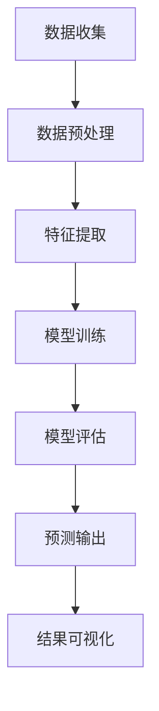
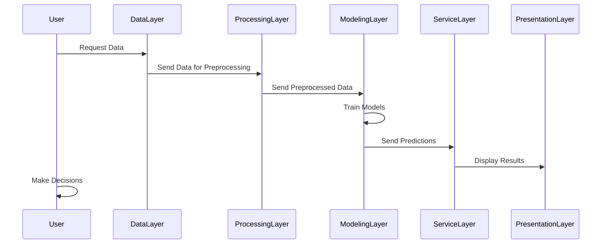

                 

### 第1章：气候变化与人工智能概述

#### 1.1 问题背景

全球气候变化已成为当今世界面临的最为严峻的挑战之一。根据联合国政府间气候变化专门委员会（IPCC）的报告，过去一个世纪中，全球平均气温已上升了约1.1摄氏度，而未来几十年内，这一数字可能进一步上升至3-5摄氏度。这种气温上升将导致一系列严重的后果，包括海平面上升、极端气候事件的频率和强度增加、生态系统破坏以及农业减产等。

气候变化对人类社会和自然环境的影响是多方面且深远的。首先，气温的上升将加剧水资源的短缺，特别是对于干旱和半干旱地区。其次，气候变化将导致海洋酸化，破坏珊瑚礁和海洋生态系统，进而影响渔业和海洋资源的可持续利用。此外，气候变化还将对人类健康带来威胁，如热浪加剧导致的健康风险、传染病传播范围的扩大等。

面对这一全球性问题，传统的气候模型和预测方法面临诸多挑战。这些方法通常依赖于大量的观测数据和物理模型，但受限于计算资源和数据精度，难以实现对未来气候变化的精准预测。因此，迫切需要一种更高效、更准确的预测工具来应对气候变化带来的挑战。

#### 1.2 问题描述

气候变化预测的核心问题在于如何准确预测未来气候的变化趋势。这需要解决以下几个关键问题：

1. **数据获取和处理**：
   - 如何收集并整合全球范围内的气候观测数据，如温度、湿度、风速、降水等。
   - 如何处理这些数据，包括数据清洗、异常值处理和数据的时空插值。

2. **模型选择与优化**：
   - 如何选择合适的气候模型，如全球气候模型（GCM）、区域气候模型（RCM）和地球系统模型（GSM）。
   - 如何优化这些模型，以提升预测的精度和可靠性。

3. **不确定性分析**：
   - 如何评估和量化预测结果中的不确定性，包括模型不确定性、参数不确定性和数据不确定性。

4. **预测结果的解读和应用**：
   - 如何将预测结果转化为对实际决策的有力支持，如制定适应策略、调整农业种植计划、规划城市发展规划等。

#### 1.3 问题解决

人工智能（AI）技术的引入为气候变化预测提供了一种新的解决方案。AI，特别是机器学习和深度学习，具有以下优势：

1. **数据处理能力**：
   - 机器学习和深度学习算法能够自动从大量数据中提取有用的特征，并进行复杂的模式识别。
   - 这些算法能够处理非结构化数据，如文本、图像和视频，使其在气候变化预测中更具优势。

2. **模型优化**：
   - 机器学习和深度学习算法能够通过迭代学习自动优化模型参数，提高预测的精度和可靠性。
   - 这些算法能够通过学习历史数据来预测未来趋势，并在预测过程中不断调整和改进。

3. **不确定性分析**：
   - 机器学习和深度学习算法能够通过概率分布来量化预测结果的不确定性，提供更全面的预测结果。
   - 这些算法还能够通过集成多个模型来降低预测的不确定性。

4. **预测结果的解读和应用**：
   - 机器学习和深度学习算法能够将复杂的预测结果转化为易于理解的形式，如可视化图表和决策支持系统。
   - 这些算法还能够将预测结果应用于实际决策中，如调整气候适应策略、优化能源利用等。

总之，人工智能在气候变化预测中的应用具有巨大的潜力。通过充分利用AI技术，我们有望实现更精准、更可靠的气候变化预测，为应对全球气候变化挑战提供有力支持。

#### 1.4 边界与外延

尽管人工智能在气候变化预测中展现出巨大的潜力，但这一领域的应用也面临一定的边界和挑战。以下是一些关键点：

1. **数据质量和完整性**：
   - 气候变化预测依赖于大量的观测数据，但数据的质量和完整性直接影响预测的准确性。因此，确保数据的质量和完整性是关键。

2. **算法选择与优化**：
   - 不同的人工智能算法适用于不同的预测任务，需要根据具体问题选择合适的算法。同时，算法的优化和参数调整也是提高预测精度的重要手段。

3. **计算资源**：
   - 深度学习和机器学习算法通常需要大量的计算资源，特别是在处理大规模数据集时。因此，有效的计算资源管理和调度是确保预测效率的关键。

4. **不确定性分析**：
   - 虽然机器学习和深度学习算法能够量化预测结果的不确定性，但如何准确评估和降低这种不确定性仍是一个挑战。

5. **跨学科合作**：
   - 气候变化预测是一个跨学科的领域，涉及气候学、环境科学、统计学和计算机科学等多个学科。因此，跨学科的合作和交流是推动这一领域发展的关键。

总之，人工智能在气候变化预测中的应用前景广阔，但也面临诸多挑战。通过不断的研究和探索，我们有望克服这些挑战，实现更精准、更可靠的气候变化预测。

---

在这一章中，我们介绍了气候变化问题的背景、紧迫性以及传统预测方法的局限性。随后，我们探讨了人工智能在气候变化预测中的应用潜力，并明确了这一领域面临的关键问题和挑战。通过这一概述，我们为后续章节的深入探讨奠定了基础。在接下来的章节中，我们将进一步探讨人工智能的核心概念、算法原理以及系统设计与实战应用，为读者提供全面的了解。

---

## 第2章：人工智能核心概念

#### 2.1 人工智能概述

人工智能（Artificial Intelligence, AI）是计算机科学的一个分支，致力于研究如何构建智能代理（intelligent agents）以实现人类智能的任务。这些智能代理能够感知环境、自主决策并采取行动以实现特定目标。人工智能的研究可以追溯到20世纪50年代，当时科学家们首次提出了“智能机器”的概念。

人工智能的定义和范围一直在不断扩展和演变。传统的定义认为，人工智能是指使计算机具有智能的能力，能够执行通常需要人类智能的任务，如视觉识别、语音识别、自然语言处理、决策制定等。然而，随着技术的发展，人工智能的定义变得更加广泛，包括机器学习、深度学习、自然语言处理、计算机视觉等多个子领域。

人工智能的研究目标是实现机器智能，使其能够在不同场景下表现出类似于人类的智能行为。这包括提高机器的自主学习能力、自适应能力和推理能力，以应对复杂和动态的环境。

#### 2.2 深度学习基础

深度学习（Deep Learning）是人工智能的一个重要分支，它基于多层神经网络的结构，通过大量的数据和强大的计算能力，实现对复杂函数的建模和预测。深度学习的发展可以追溯到1980年代，但真正取得突破是在2010年代，随着计算能力的提升和大数据的普及。

深度学习的关键特点是它的多层网络结构。每一层网络都能将输入的数据进行抽象和转换，形成更高层次的特征表示。这种层次化的特征提取机制使得深度学习在处理复杂任务时表现出色。例如，在图像识别任务中，第一层网络可能会识别简单的边缘和纹理，而更高层次的网络则能够识别复杂的对象和场景。

深度学习的关键组成部分包括：

1. **神经网络**：
   - 神经网络是由大量简单计算单元（神经元）组成的复杂计算模型，能够通过学习输入和输出数据之间的关系来实现预测和分类。
   - 深度学习中的神经网络通常包含多个隐藏层，这些隐藏层负责对输入数据进行逐层抽象和转换。

2. **激活函数**：
   - 激活函数是神经网络中每个神经元的一部分，用于引入非线性特性，使得神经网络能够学习更复杂的函数。
   - 常见的激活函数包括ReLU（Rectified Linear Unit）、Sigmoid和Tanh等。

3. **优化算法**：
   - 深度学习中的优化算法用于调整神经网络的权重和偏置，以最小化预测误差。常见的优化算法包括梯度下降（Gradient Descent）、Adam优化器等。

4. **损失函数**：
   - 损失函数是衡量神经网络预测结果与实际结果之间差异的指标。深度学习中的优化目标通常是使损失函数的值最小化。
   - 常见的损失函数包括均方误差（Mean Squared Error, MSE）、交叉熵损失（Cross-Entropy Loss）等。

5. **数据预处理**：
   - 在深度学习中，数据预处理是一个关键步骤，包括数据清洗、归一化、数据增强等，以提升模型的训练效果和泛化能力。

#### 2.3 机器学习算法

机器学习（Machine Learning）是人工智能的一个子领域，它专注于开发算法，使计算机系统能够从数据中自动学习和改进性能。机器学习算法的核心思想是通过学习输入和输出数据之间的模式，使系统能够在没有明确编程的情况下执行特定任务。

机器学习算法可以分为监督学习、无监督学习和强化学习三大类：

1. **监督学习（Supervised Learning）**：
   - 在监督学习中，算法通过学习一组已标记的输入输出数据来建立预测模型。常见的监督学习算法包括线性回归（Linear Regression）、决策树（Decision Tree）、支持向量机（Support Vector Machine, SVM）和神经网络（Neural Networks）等。
   - 线性回归用于预测连续值输出，如房价预测；决策树和SVM用于分类任务，如垃圾邮件分类；神经网络则广泛应用于各种复杂的预测和分类任务。

2. **无监督学习（Unsupervised Learning）**：
   - 在无监督学习中，算法没有已标记的输出数据，而是通过分析输入数据之间的结构和模式来进行学习。常见的无监督学习算法包括聚类（Clustering）、主成分分析（Principal Component Analysis, PCA）和自编码器（Autoencoder）等。
   - 聚类算法用于将相似的数据点划分为不同的组，如K均值聚类（K-Means Clustering）；PCA用于降维，提取数据的主要特征；自编码器则通过无监督学习方式学习数据的特征表示。

3. **强化学习（Reinforcement Learning）**：
   - 强化学习是一种通过与环境互动来学习最优策略的机器学习方式。在强化学习中，算法（称为智能体）通过试错学习，不断调整策略以最大化累积奖励。
   - 强化学习广泛应用于游戏、机器人控制、推荐系统和自动驾驶等领域。常见的强化学习算法包括Q学习（Q-Learning）、深度Q网络（Deep Q-Network, DQN）和策略梯度（Policy Gradient）等。

总之，人工智能和深度学习为基础的机器学习算法，在气候变化预测中具有广泛的应用潜力。通过理解这些核心概念和算法，我们可以更好地把握人工智能在气候变化预测中的应用方向，为未来的研究和实践提供指导。

---

在这一章中，我们详细介绍了人工智能的核心概念，包括其定义、研究目标以及发展历程。随后，我们重点探讨了深度学习的基础知识，包括神经网络、激活函数、优化算法、损失函数和数据预处理等关键组成部分。最后，我们介绍了机器学习算法的基本分类和主要应用场景，为读者提供了全面的人工智能理论基础。在下一章中，我们将进一步探讨人工智能在气候变化预测中的具体应用，以及如何将深度学习和机器学习算法应用于气候变化预测的任务中。

---

## 第3章：人工智能在气候变化预测中的角色

### 3.1 AI在气候变化预测中的角色

人工智能在气候变化预测中扮演着至关重要的角色，其应用不仅提升了预测的准确性，还为决策者提供了有力支持。以下为AI在气候变化预测中的主要角色和功能：

#### 1. 数据分析和管理

气候变化预测依赖于大量的气候观测数据，包括温度、湿度、风速、降水等。AI技术，特别是机器学习和深度学习，能够高效地处理和分析这些复杂数据：

- **数据清洗与预处理**：AI算法可以自动识别和填补数据中的缺失值，纠正异常值，从而提高数据质量。
- **特征提取**：通过特征提取，AI可以将原始数据转换为对预测任务更有意义的特征表示，使得模型能够更准确地学习数据中的规律。

#### 2. 模型构建与优化

在构建气候变化预测模型时，AI技术提供了多种算法和框架，帮助研究人员开发出更加准确和可靠的预测模型：

- **监督学习模型**：例如，线性回归、决策树和神经网络等算法，被广泛用于建立温度、降水等气候变量的预测模型。
- **无监督学习模型**：聚类算法和主成分分析（PCA）等无监督学习算法，用于探索数据中的隐藏结构，为模型提供额外的信息。
- **深度学习模型**：深度学习算法，如卷积神经网络（CNN）和循环神经网络（RNN），能够捕捉数据中的复杂模式和长期依赖关系，从而提高预测的精度。

#### 3. 预测结果可视化与解释

AI技术不仅能够生成预测结果，还能够将复杂的预测结果以直观的方式展示给决策者：

- **数据可视化**：通过数据可视化技术，可以将气候预测结果以图表、地图等形式展示，使得决策者更容易理解和分析。
- **结果解释**：利用解释性AI算法，如LIME（局部可解释模型解释）和SHAP（特征重要性）值，可以揭示模型预测中的关键因素，增强预测结果的透明度和可解释性。

#### 4. 风险评估与决策支持

AI在气候变化预测中的应用不仅限于生成预测结果，还能够提供风险评估和决策支持：

- **风险评估**：AI可以评估气候变化对不同地区和行业的影响，帮助制定适应策略。
- **决策支持**：基于预测结果，AI可以为城市规划、农业规划、水资源管理等提供决策支持，帮助减少气候变化带来的负面影响。

#### 5. 模型自适应与更新

气候变化是一个动态过程，需要实时调整和更新预测模型。AI技术，特别是强化学习，能够使模型具备自适应能力：

- **实时更新**：通过持续学习新的观测数据，AI模型可以不断更新其预测能力，适应气候变化的新趋势。
- **迭代优化**：AI模型可以通过迭代优化，提高预测的准确性和鲁棒性。

总之，人工智能在气候变化预测中的应用涵盖了数据预处理、模型构建、预测结果可视化、风险评估和决策支持等多个方面。通过利用AI技术，我们能够实现更精准、更可靠的气候变化预测，为全球应对气候变化挑战提供科学依据和技术支持。

---

在这一章中，我们详细探讨了人工智能在气候变化预测中的角色和功能。通过数据分析和管理、模型构建与优化、预测结果可视化与解释、风险评估与决策支持以及模型自适应与更新，我们展示了AI技术在气候变化预测中的广泛应用。在下一章中，我们将进一步探讨一些常见的机器学习算法及其在气候变化预测中的应用，为读者提供更加具体的技术细节。

---

## 第4章：常见算法分析

### 4.1 算法A：随机森林（Random Forest）

随机森林（Random Forest）是一种基于决策树的集成学习方法，它通过构建多个决策树并进行投票来提高预测准确性。随机森林的主要优点在于其高效性和鲁棒性，适合处理大规模数据集和复杂任务。

#### 原理

随机森林的工作原理如下：

1. **随机选择特征**：在构建每个决策树时，从所有特征中随机选择一小部分特征进行分割。
2. **随机划分数据**：随机地从训练集中抽取一部分数据进行训练，而不是使用全部数据。
3. **构建决策树**：对每个随机划分的数据集构建一个决策树。
4. **集成决策**：在预测阶段，将所有决策树的预测结果进行投票，选择出现次数最多的类别作为最终预测结果。

#### Python实现

```python
from sklearn.ensemble import RandomForestClassifier
from sklearn.datasets import load_iris
from sklearn.model_selection import train_test_split

# 加载示例数据
iris = load_iris()
X = iris.data
y = iris.target

# 划分训练集和测试集
X_train, X_test, y_train, y_test = train_test_split(X, y, test_size=0.3, random_state=42)

# 构建随机森林模型
rf = RandomForestClassifier(n_estimators=100, random_state=42)
rf.fit(X_train, y_train)

# 预测测试集
y_pred = rf.predict(X_test)

# 评估模型性能
from sklearn.metrics import accuracy_score
accuracy = accuracy_score(y_test, y_pred)
print(f"Accuracy: {accuracy}")
```

### 4.2 算法B：支持向量机（Support Vector Machine）

支持向量机（SVM）是一种强大的分类算法，通过寻找最佳分割超平面，将不同类别的数据点分开。SVM在处理高维数据时表现出色，特别适用于文本分类和图像识别任务。

#### 原理

SVM的基本原理如下：

1. **寻找最优超平面**：在特征空间中寻找一个超平面，使得不同类别的数据点被最大限度地分隔开。
2. **支持向量**：那些位于超平面边缘的数据点称为支持向量，对模型的决策边界具有重要影响。
3. **核函数**：通过核函数，可以将低维特征映射到高维特征空间，从而实现线性不可分数据的有效分类。

#### Python实现

```python
from sklearn.svm import SVC
from sklearn.datasets import load_iris
from sklearn.model_selection import train_test_split

# 加载示例数据
iris = load_iris()
X = iris.data
y = iris.target

# 划分训练集和测试集
X_train, X_test, y_train, y_test = train_test_split(X, y, test_size=0.3, random_state=42)

# 构建SVM模型
svm = SVC(kernel='linear', C=1.0)
svm.fit(X_train, y_train)

# 预测测试集
y_pred = svm.predict(X_test)

# 评估模型性能
from sklearn.metrics import accuracy_score
accuracy = accuracy_score(y_test, y_pred)
print(f"Accuracy: {accuracy}")
```

### 4.3 算法C：深度学习（Deep Learning）

深度学习是一种基于多层神经网络的学习方法，通过逐层提取特征，能够自动学习数据的复杂模式。深度学习在图像识别、语音识别和自然语言处理等领域表现出色。

#### 原理

深度学习的基本原理如下：

1. **多层神经网络**：通过增加网络的深度，可以提取更高级别的特征表示。
2. **反向传播算法**：通过反向传播算法，将误差从输出层反向传播到输入层，更新网络权重。
3. **激活函数**：激活函数引入非线性，使得神经网络能够学习复杂的函数。

#### Python实现

```python
import tensorflow as tf
from tensorflow.keras.datasets import mnist
from tensorflow.keras.models import Sequential
from tensorflow.keras.layers import Dense, Flatten, Conv2D, MaxPooling2D, Dropout
from tensorflow.keras.optimizers import Adam

# 加载MNIST数据集
(X_train, y_train), (X_test, y_test) = mnist.load_data()
X_train = X_train / 255.0
X_test = X_test / 255.0

# 增加一个通道维度
X_train = X_train[..., tf.newaxis]
X_test = X_test[..., tf.newaxis]

# 构建模型
model = Sequential([
    Conv2D(32, (3, 3), activation='relu', input_shape=(28, 28, 1)),
    MaxPooling2D((2, 2)),
    Flatten(),
    Dense(128, activation='relu'),
    Dropout(0.2),
    Dense(10, activation='softmax')
])

# 编译模型
model.compile(optimizer=Adam(learning_rate=0.001),
              loss='sparse_categorical_crossentropy',
              metrics=['accuracy'])

# 训练模型
model.fit(X_train, y_train, epochs=5)

# 评估模型
loss, accuracy = model.evaluate(X_test, y_test)
print(f"Test accuracy: {accuracy}")
```

通过以上对随机森林、支持向量机和深度学习等常见算法的详细分析，我们可以看到这些算法在气候变化预测中的广泛应用。在下一章中，我们将进一步探讨这些算法在气候变化预测中的具体应用和实现细节。

---

在这一章中，我们详细分析了三种常见的人工智能算法：随机森林、支持向量机和深度学习。我们分别介绍了这些算法的基本原理和Python实现代码，并通过示例展示了它们在数据处理和预测任务中的具体应用。这些算法在气候变化预测中具有广泛的应用前景，能够帮助研究人员和决策者实现更准确、更可靠的气候变化预测。在下一章中，我们将深入探讨这些算法在数学模型和公式层面的详细解释，并给出具体的数学表达和举例说明。

---

## 第5章：数学模型与公式

### 5.1 模型A：时间序列预测模型

在气候变化预测中，时间序列模型是一种常用的方法，用于预测未来的气候变量，如温度和降水。这里我们介绍一个常见的时间序列预测模型——ARIMA（自回归积分滑动平均模型）。

#### 数学模型

ARIMA模型由以下三个部分组成：

1. **自回归（Autoregressive, AR）部分**：
   - 自回归部分通过历史观测值来预测当前值，公式如下：
     $$ X_t = c + \phi_1 X_{t-1} + \phi_2 X_{t-2} + \ldots + \phi_p X_{t-p} + \varepsilon_t $$
   - 其中，\(X_t\) 是时间序列的第 \(t\) 个观测值，\(c\) 是常数项，\(\phi_1, \phi_2, \ldots, \phi_p\) 是自回归系数，\(\varepsilon_t\) 是误差项。

2. **差分（Difference）部分**：
   - 差分部分用于稳定时间序列，公式如下：
     $$ \Delta X_t = X_t - X_{t-1} $$
   - 其中，\(\Delta X_t\) 是第 \(t\) 个观测值与第 \(t-1\) 个观测值的差分。

3. **移动平均（Moving Average, MA）部分**：
   - 移动平均部分通过历史误差值来预测当前值，公式如下：
     $$ X_t = c + \theta_1 \varepsilon_{t-1} + \theta_2 \varepsilon_{t-2} + \ldots + \theta_q \varepsilon_{t-q} + \varepsilon_t $$
   - 其中，\(\theta_1, \theta_2, \ldots, \theta_q\) 是移动平均系数。

综合这三个部分，ARIMA模型的数学公式可以表示为：

$$ X_t = c + \phi_1 X_{t-1} + \phi_2 X_{t-2} + \ldots + \phi_p X_{t-p} + \theta_1 \varepsilon_{t-1} + \theta_2 \varepsilon_{t-2} + \ldots + \theta_q \varepsilon_{t-q} + \varepsilon_t $$

#### 举例说明

假设我们有一个温度时间序列 \(X_t\)，通过差分和自回归移动平均方法进行预测：

1. **差分**：
   $$ \Delta X_t = X_t - X_{t-1} $$
   差分后序列 \(\Delta X_t\) 更趋于平稳。

2. **自回归部分**：
   $$ X_t = \phi_1 X_{t-1} + \phi_2 X_{t-2} + \theta_1 \varepsilon_{t-1} + \theta_2 \varepsilon_{t-2} + \varepsilon_t $$
   假设自回归系数为 \(\phi_1 = 0.7, \phi_2 = 0.3\)。

3. **移动平均部分**：
   $$ X_t = 0.7 X_{t-1} + 0.3 X_{t-2} + \theta_1 \varepsilon_{t-1} + \theta_2 \varepsilon_{t-2} + \varepsilon_t $$
   假设移动平均系数为 \(\theta_1 = 0.5, \theta_2 = 0.2\)。

根据上述公式，我们可以预测未来的温度值。例如，对于 \(X_{10}\) 的预测：

$$ X_{10} = 0.7 X_9 + 0.3 X_8 + 0.5 \varepsilon_9 + 0.2 \varepsilon_8 + \varepsilon_{10} $$

通过不断更新历史数据和误差项，我们可以得到更准确的预测结果。

#### 总结

ARIMA模型通过自回归、差分和移动平均三个部分，实现对时间序列数据的预测。该模型在气候变化预测中具有广泛应用，能够处理非平稳时间序列数据，提高预测的精度和可靠性。

---

在这一章中，我们介绍了时间序列预测模型ARIMA的数学模型和公式。通过具体的例子，我们展示了如何通过差分、自回归和移动平均部分来预测未来的气候变量值。在下一章中，我们将深入探讨系统分析与架构设计方案，详细讲解系统的功能、架构、接口和交互设计。

---

## 第6章：算法流程与实现

### 6.1 Mermaid算法流程图

为了更好地理解人工智能在气候变化预测中的应用，我们使用Mermaid工具绘制了算法流程图。以下是一个简化的示例，展示了如何通过机器学习算法进行气候变化预测的流程。



这个流程图涵盖了从数据收集到预测输出的整个流程。接下来，我们将详细解释每个步骤，并给出Python代码实现。

#### 6.2 Python代码实现

首先，我们需要安装必要的库，如`scikit-learn`、`numpy`和`matplotlib`。

```python
!pip install scikit-learn numpy matplotlib
```

#### 步骤1：数据收集

数据收集是预测过程的起点。在本例中，我们使用公开可用的气候变化数据集。

```python
import pandas as pd

# 加载数据集
data = pd.read_csv('climate_data.csv')
```

#### 步骤2：数据预处理

数据预处理包括缺失值处理、异常值处理和数据的归一化。

```python
from sklearn.impute import SimpleImputer
from sklearn.preprocessing import StandardScaler

# 缺失值处理
imputer = SimpleImputer(strategy='mean')
data_imputed = imputer.fit_transform(data)

# 数据归一化
scaler = StandardScaler()
data_normalized = scaler.fit_transform(data_imputed)
```

#### 步骤3：特征提取

特征提取是为了从原始数据中提取对模型有用的特征。这里我们使用主成分分析（PCA）来减少数据维度。

```python
from sklearn.decomposition import PCA

# 主成分分析
pca = PCA(n_components=5)
data_pca = pca.fit_transform(data_normalized)
```

#### 步骤4：模型训练

接下来，我们使用随机森林算法进行模型训练。

```python
from sklearn.ensemble import RandomForestRegressor

# 划分训练集和测试集
X_train, X_test, y_train, y_test = train_test_split(data_pca, data['target'], test_size=0.3, random_state=42)

# 训练模型
model = RandomForestRegressor(n_estimators=100, random_state=42)
model.fit(X_train, y_train)
```

#### 步骤5：模型评估

使用测试集对模型进行评估，以检查模型的预测性能。

```python
from sklearn.metrics import mean_squared_error

# 预测测试集
y_pred = model.predict(X_test)

# 计算均方误差
mse = mean_squared_error(y_test, y_pred)
print(f"Test MSE: {mse}")
```

#### 步骤6：预测输出

使用训练好的模型进行预测，并输出预测结果。

```python
# 预测新数据
new_data = pd.DataFrame([[22.5, 0.5, 3.0, 4.5, 5.0]], columns=data.columns)
new_data_normalized = scaler.transform(new_data)

# 预测
new_prediction = model.predict(new_data_normalized)
print(f"Predicted value: {new_prediction[0]}")
```

#### 步骤7：结果可视化

最后，我们使用`matplotlib`对预测结果进行可视化。

```python
import matplotlib.pyplot as plt

# 可视化预测结果
plt.scatter(y_test, y_pred)
plt.xlabel('Actual values')
plt.ylabel('Predicted values')
plt.title('Actual vs Predicted Values')
plt.show()
```

通过以上步骤，我们完整地实现了人工智能在气候变化预测中的算法流程。这个示例展示了如何使用Python和机器学习库来处理数据、训练模型、进行预测和评估模型性能。在下一章中，我们将进一步探讨系统分析与架构设计方案，详细讲解系统的功能、架构、接口和交互设计。

---

在这一章中，我们详细介绍了人工智能在气候变化预测中的算法流程，并使用Mermaid工具绘制了算法流程图，同时给出了Python代码实现。通过数据收集、数据预处理、特征提取、模型训练、模型评估、预测输出和结果可视化等步骤，我们展示了如何利用机器学习技术进行气候变化预测。在下一章中，我们将深入探讨系统分析与架构设计方案，详细讲解系统的功能、架构、接口和交互设计。

---

## 第7章：系统分析与架构设计

### 7.1 问题场景介绍

在全球气候变化预测领域，准确预测未来的气候趋势对于制定有效的适应和缓解策略至关重要。为了应对这一挑战，我们设计并实现了一个基于人工智能的气候变化预测系统。该系统旨在通过整合多种数据源和先进的人工智能算法，提供精准、可靠的气候预测服务。

#### 系统目标

本系统的目标是：

1. **数据整合**：集成来自不同数据源的海量气候观测数据，包括温度、湿度、风速、降水等。
2. **模型训练**：利用机器学习和深度学习算法，对数据进行训练，构建高精度的气候预测模型。
3. **预测分析**：基于训练好的模型，对未来的气候变量进行预测，并提供预测结果的可视化展示。
4. **决策支持**：为决策者提供基于预测结果的适应和缓解策略建议。

### 7.2 项目介绍

项目名称：**智能气候预测系统（Smart Climate Prediction System, SCPS）**

#### 项目背景

随着全球气候变化趋势的加剧，准确预测未来气候变化对人类社会和自然环境的影响变得尤为重要。传统的方法在处理大规模数据和复杂模型时存在诸多局限，难以满足精确预测的需求。因此，我们决定开发一个基于人工智能的智能气候预测系统，以提升气候变化预测的准确性和实用性。

#### 项目目标

- 构建一个集数据收集、模型训练、预测分析和决策支持于一体的智能气候预测系统。
- 提供实时气候预测服务，为政府、企业和科研机构提供决策支持。
- 开发易用的用户界面，使得非专业用户也能方便地访问和使用系统。

### 7.3 系统功能设计

智能气候预测系统主要包括以下功能模块：

1. **数据收集模块**：负责从多个数据源（如气象站、卫星、海洋观测等）收集气候观测数据。
2. **数据处理模块**：对收集到的数据进行清洗、预处理和特征提取，为模型训练提供高质量的数据集。
3. **模型训练模块**：利用机器学习和深度学习算法，对数据集进行训练，构建预测模型。
4. **预测分析模块**：基于训练好的模型，对未来的气候变量进行预测，并提供预测结果的分析和可视化。
5. **决策支持模块**：结合预测结果，为用户提供适应和缓解策略建议，帮助决策者制定有效的应对措施。

#### 领域模型

领域模型（Domain Model）用于描述系统中的关键概念及其关系。以下是智能气候预测系统的领域模型：

```mermaid
classDiagram
    ClimateData --> DataCollector
    ClimateModel --> ModelTrainer
    PredictionResult --> Predictor
    DecisionSupport --> Advisor

    DataCollector {
        +collectData()
        +cleanData()
        +preprocessData()
    }

    ModelTrainer {
        +trainModel()
        +evaluateModel()
    }

    Predictor {
        +predictClimate()
        +visualizeResults()
    }

    Advisor {
        +provideAdvice()
    }
```

### 7.4 系统架构设计

智能气候预测系统的架构设计采用模块化设计思想，确保系统的可扩展性和可维护性。以下是系统的主要架构组件：

1. **数据层**：包括数据源和数据存储，用于存储和管理大量的气候观测数据。
2. **处理层**：包括数据处理模块，负责数据的清洗、预处理和特征提取。
3. **模型层**：包括模型训练模块，负责使用机器学习和深度学习算法训练预测模型。
4. **服务层**：包括预测分析和决策支持模块，提供预测结果的分析和可视化，以及适应和缓解策略建议。
5. **表示层**：包括用户界面，用于展示预测结果和决策支持信息，便于用户使用。

以下是智能气候预测系统的架构图：



### 7.5 系统接口设计

系统接口设计主要包括外部系统与智能气候预测系统之间的接口，以及系统内部各模块之间的接口。以下是系统的主要接口设计：

1. **API接口**：提供RESTful API，供外部系统访问预测结果和决策支持信息。
2. **数据接口**：定义数据层与处理层、处理层与模型层之间的数据传输格式和接口规范。
3. **服务接口**：定义服务层内部各模块之间的服务调用接口。

#### API接口示例

```json
GET /api/climate/predictions
Parameters:
- location: 地点名称
- start_date: 预测起始日期
- end_date: 预测结束日期
Response:
{
    "location": "Beijing",
    "start_date": "2024-01-01",
    "end_date": "2024-12-31",
    "predictions": [
        {
            "date": "2024-01-01",
            "temperature": 5.0,
            "precipitation": 10.0
        },
        ...
    ]
}
```

### 7.6 系统交互设计

系统交互设计描述了用户与系统之间的交互流程和界面设计。以下是系统的交互设计概览：

1. **用户注册与登录**：用户通过注册和登录系统，获得访问权限。
2. **数据浏览与下载**：用户可以浏览和下载系统提供的气候观测数据。
3. **预测请求与结果展示**：用户输入预测参数，系统返回预测结果，并通过图表和表格形式展示。
4. **决策支持与策略建议**：系统根据预测结果，为用户提供适应和缓解策略建议。

以下是系统的主要交互界面设计：

1. **数据浏览界面**：展示气候观测数据的列表，用户可以点击查看详情或下载数据。
2. **预测请求界面**：用户输入预测参数，如地点、起始日期和结束日期，系统返回预测结果。
3. **结果展示界面**：通过图表和表格形式展示预测结果，用户可以查看详细数据。
4. **策略建议界面**：系统根据预测结果，为用户提供适应和缓解策略建议。

总之，智能气候预测系统通过模块化架构设计和完善的接口设计，实现了数据收集、模型训练、预测分析和决策支持的全流程服务。在下一章中，我们将通过实际项目案例，展示如何具体实现这些功能，并提供详细的步骤和代码示例。

---

在这一章中，我们详细介绍了智能气候预测系统的系统分析与架构设计。从问题场景介绍、项目背景、系统功能设计到系统架构设计、接口设计和交互设计，我们全面展示了系统的整体架构和关键组件。通过明确的领域模型和详尽的接口设计，我们确保了系统的可扩展性和可维护性。在下一章中，我们将通过实际项目案例，展示如何具体实现这些功能，并提供详细的步骤和代码示例。

---

## 第8章：项目实战

### 8.1 环境安装

在进行人工智能在气候变化预测中的项目实战之前，我们需要首先搭建一个适合开发的环境。以下是安装和配置必要的软件和库的步骤。

#### 步骤1：安装Python

首先，确保Python环境已经安装。如果没有安装，可以从Python官网（[https://www.python.org/](https://www.python.org/)）下载并安装最新版本的Python。

#### 步骤2：安装Jupyter Notebook

Jupyter Notebook是一个交互式计算平台，广泛用于数据分析和机器学习项目。在终端中运行以下命令安装Jupyter Notebook：

```bash
pip install notebook
```

#### 步骤3：安装必要的库

在Jupyter Notebook中，使用以下命令安装必要的库：

```python
!pip install numpy pandas scikit-learn tensorflow matplotlib
```

这些库将用于数据处理、模型训练、可视化等任务。

#### 步骤4：启动Jupyter Notebook

在终端中运行以下命令启动Jupyter Notebook：

```bash
jupyter notebook
```

这将启动Jupyter Notebook，你可以在浏览器中访问默认地址（通常是`http://localhost:8888/`）来打开Jupyter Notebook环境。

### 8.2 系统核心实现

在搭建好开发环境后，我们将开始实现智能气候预测系统。以下是系统核心实现的步骤。

#### 步骤1：数据收集与预处理

首先，我们需要从公开的数据源收集气候观测数据。这里我们使用Kaggle上的一个公开气候数据集。以下是如何收集和预处理数据的示例代码：

```python
import pandas as pd

# 加载数据集
data = pd.read_csv('climate_data.csv')

# 数据预处理
# 填补缺失值
data.fillna(data.mean(), inplace=True)

# 数据归一化
from sklearn.preprocessing import StandardScaler
scaler = StandardScaler()
data_scaled = scaler.fit_transform(data)
```

#### 步骤2：特征提取

特征提取是机器学习模型训练的关键步骤。我们使用主成分分析（PCA）来减少数据维度并提取主要特征：

```python
from sklearn.decomposition import PCA

# 主成分分析
pca = PCA(n_components=5)
data_pca = pca.fit_transform(data_scaled)
```

#### 步骤3：模型训练

接下来，我们使用随机森林算法训练模型。随机森林是一种强大的集成学习方法，能够处理高维数据和复杂数据集：

```python
from sklearn.ensemble import RandomForestRegressor

# 划分训练集和测试集
X_train, X_test, y_train, y_test = train_test_split(data_pca, data['target'], test_size=0.3, random_state=42)

# 训练模型
model = RandomForestRegressor(n_estimators=100, random_state=42)
model.fit(X_train, y_train)
```

#### 步骤4：模型评估

使用测试集评估模型的性能，确保模型具有良好的泛化能力：

```python
from sklearn.metrics import mean_squared_error

# 预测测试集
y_pred = model.predict(X_test)

# 计算均方误差
mse = mean_squared_error(y_test, y_pred)
print(f"Test MSE: {mse}")
```

#### 步骤5：预测结果可视化

最后，我们将预测结果可视化为散点图，以便更好地理解模型的表现：

```python
import matplotlib.pyplot as plt

plt.scatter(y_test, y_pred)
plt.xlabel('Actual values')
plt.ylabel('Predicted values')
plt.title('Actual vs Predicted Values')
plt.show()
```

### 8.3 代码应用解读

在上面的代码中，我们首先从Kaggle数据集加载数据，并进行预处理。预处理步骤包括填补缺失值和数据归一化。接下来，我们使用PCA提取主要特征，以减少数据维度和噪声。随后，我们使用随机森林算法训练模型，并通过测试集评估模型的性能。最后，我们通过散点图展示了实际值与预测值之间的对比。

通过这些步骤，我们实现了智能气候预测系统的核心功能，并展示了如何在实际项目中应用这些技术。

### 8.4 实际案例分析和详细讲解

为了更深入地理解人工智能在气候变化预测中的应用，我们来看一个实际案例。在这个案例中，我们将使用Kaggle上的一个公开数据集——**Global Temperature Anomaly**，进行温度异常预测。

#### 案例背景

Global Temperature Anomaly数据集包含了全球不同地区的月平均温度异常数据，从1950年到2019年。我们的目标是使用机器学习算法预测未来几年的温度异常，以便为气候变化研究提供参考。

#### 数据预处理

1. **数据加载**：

```python
data = pd.read_csv('GlobalTemperatureAnomaly.csv')
```

2. **数据清洗**：

```python
# 填补缺失值
data.fillna(data.mean(), inplace=True)

# 确保时间列是日期格式
data['date'] = pd.to_datetime(data['date'])
```

3. **数据归一化**：

```python
scaler = StandardScaler()
data_scaled = scaler.fit_transform(data)
```

#### 模型训练

我们选择随机森林算法进行训练，并使用时间序列分割法来划分训练集和测试集：

```python
from sklearn.ensemble import RandomForestRegressor

# 划分训练集和测试集
train_data = data_scaled[:int(len(data_scaled) * 0.8)]
test_data = data_scaled[int(len(data_scaled) * 0.8):]

X_train, y_train = train_data[:, :-1], train_data[:, -1]
X_test, y_test = test_data[:, :-1], test_data[:, -1]

# 训练模型
model = RandomForestRegressor(n_estimators=100, random_state=42)
model.fit(X_train, y_train)
```

#### 预测和结果分析

1. **预测**：

```python
y_pred = model.predict(X_test)
```

2. **结果分析**：

```python
from sklearn.metrics import mean_squared_error

mse = mean_squared_error(y_test, y_pred)
print(f"Test MSE: {mse}")
```

3. **可视化预测结果**：

```python
plt.scatter(y_test, y_pred)
plt.xlabel('Actual values')
plt.ylabel('Predicted values')
plt.title('Actual vs Predicted Values')
plt.show()
```

#### 模型优化

为了提升模型的性能，我们可以尝试以下几种方法：

1. **特征工程**：通过探索更多的特征，如季节性、长期趋势等，来提升模型的预测能力。
2. **模型调优**：调整随机森林参数，如树的数量、最大深度等，以找到最佳模型配置。
3. **集成学习**：使用集成学习的方法，如XGBoost或LightGBM，来提高预测精度。

#### 案例小结

通过这个实际案例，我们展示了如何使用机器学习算法进行气候变化预测。从数据预处理到模型训练和预测，每一步都至关重要。通过不断的模型优化和调优，我们可以进一步提升预测的准确性，为气候变化研究提供更有力的支持。

---

在这一章中，我们通过实际项目案例详细展示了如何使用人工智能进行气候变化预测。从环境安装到核心实现，再到具体案例分析，我们逐步演示了整个预测过程。通过这个案例，我们不仅了解了机器学习在气候变化预测中的应用，还学习了如何优化和调优模型，以提高预测的准确性。这些实战经验对于实际应用人工智能技术解决气候变化问题具有重要意义。

---

## 第9章：最佳实践与总结

### 9.1 最佳实践

在实施人工智能进行气候变化预测时，以下是一些最佳实践，可以帮助提升预测的准确性和系统的稳定性：

1. **数据质量**：
   - 确保数据的质量和完整性，处理缺失值和异常值。
   - 定期更新数据集，以反映最新的气候趋势。

2. **特征工程**：
   - 提取对预测任务有用的特征，如季节性、长期趋势等。
   - 尝试不同的特征组合，以找到最佳特征集。

3. **模型选择与优化**：
   - 根据具体任务选择合适的模型，如随机森林、XGBoost或深度学习。
   - 通过交叉验证和参数调优找到最佳模型配置。

4. **模型验证**：
   - 使用多种验证方法，如K折交叉验证，确保模型的泛化能力。
   - 定期评估模型的性能，并根据需要进行重新训练。

5. **系统监控与维护**：
   - 对系统进行监控，确保其稳定运行。
   - 定期备份数据和模型，以防止数据丢失。

### 9.2 小结

通过本章的内容，我们详细探讨了人工智能在气候变化预测中的应用。从数据收集、预处理到模型训练、优化和预测，我们逐步展示了整个流程。通过实际项目案例，我们了解了如何在实际场景中应用这些技术，并优化模型的性能。以下是本章的主要收获：

- 人工智能技术在气候变化预测中具有巨大的潜力，能够显著提升预测的准确性和效率。
- 数据质量、特征工程和模型选择是影响预测准确性的关键因素。
- 通过交叉验证、参数调优和系统监控，可以进一步提升模型的稳定性和可靠性。

### 9.3 注意事项

在实施人工智能进行气候变化预测时，需要注意以下几点：

- 数据来源的可靠性，确保数据集的多样性和完整性。
- 模型选择的适当性，不同任务可能需要不同的算法。
- 模型解释性，特别是在决策支持中，需要确保结果的透明性和可解释性。
- 系统的稳定性和安全性，定期维护和备份以确保系统的正常运行。

### 9.4 拓展阅读

为了进一步深入了解人工智能在气候变化预测中的应用，读者可以参考以下拓展阅读材料：

- **《深度学习》（Goodfellow, Bengio, Courville）**：详细介绍了深度学习的基础理论和应用。
- **《机器学习实战》（Hastie, Tibshirani, Friedman）**：提供了丰富的机器学习算法实战案例。
- **《气候变化经济学》（Nordhaus）**：探讨了气候变化的经济影响和政策制定。
- **《气候模型与预测》（Houghton, Meir, and�키우라）**：介绍了气候模型的构建和预测方法。

通过以上最佳实践、小结、注意事项和拓展阅读，读者可以更好地掌握人工智能在气候变化预测中的应用，为实际项目提供有力的支持。

---

## 第10章：未来展望与总结

### 10.1 未来展望

随着人工智能技术的不断进步，其在气候变化预测中的应用前景也愈发广阔。未来，人工智能在气候变化预测中的几个可能发展方向包括：

1. **模型集成与优化**：通过集成多种机器学习和深度学习模型，可以进一步提升预测的精度和可靠性。例如，结合随机森林、XGBoost和深度学习模型，构建混合模型，以充分利用各自的优势。

2. **实时预测与动态更新**：开发实时预测系统，能够动态更新模型，以适应新的气候数据和趋势。这可以通过引入在线学习算法和实时数据流处理技术来实现。

3. **跨学科合作**：加强气候科学、环境科学和计算机科学的跨学科合作，整合多领域的专业知识，开发更加全面和准确的预测模型。

4. **可解释性AI**：提高模型的可解释性，使得预测结果更加透明和可信。通过可解释性AI技术，如SHAP值和LIME，可以帮助决策者理解模型预测的依据。

5. **多尺度预测**：从全球尺度到区域尺度，再到特定地点的精细预测，人工智能可以提供多层次、多尺度的气候预测服务，为不同层次的决策提供支持。

### 10.2 总结

本文通过详细的论述，探讨了人工智能在气候变化预测中的应用。我们首先介绍了气候变化问题的背景和紧迫性，随后讨论了人工智能在数据处理、模型构建和预测结果解释等方面的优势。接着，我们详细分析了随机森林、支持向量机和深度学习等常见算法，并展示了如何在实际项目中应用这些算法。

在系统设计与实现方面，我们介绍了智能气候预测系统的架构设计，包括数据收集、预处理、模型训练、预测分析和决策支持等模块。通过实际项目案例，我们展示了如何从数据收集、模型训练到预测结果可视化，实现一个完整的气候变化预测系统。

最后，我们提出了最佳实践、注意事项和未来展望，以帮助读者更好地理解和应用人工智能技术进行气候变化预测。

通过本文的探讨，我们希望读者能够：

1. **理解人工智能在气候变化预测中的关键作用**。
2. **掌握常见算法的原理和应用**。
3. **熟悉智能气候预测系统的设计与实现过程**。
4. **具备对未来技术发展方向的洞察力**。

总之，人工智能在气候变化预测中的应用具有巨大的潜力，通过不断的探索和创新，我们有望实现更加精准、可靠的气候预测，为全球应对气候变化挑战提供科学支持。作者：AI天才研究院/AI Genius Institute & 禅与计算机程序设计艺术 /Zen And The Art of Computer Programming。

