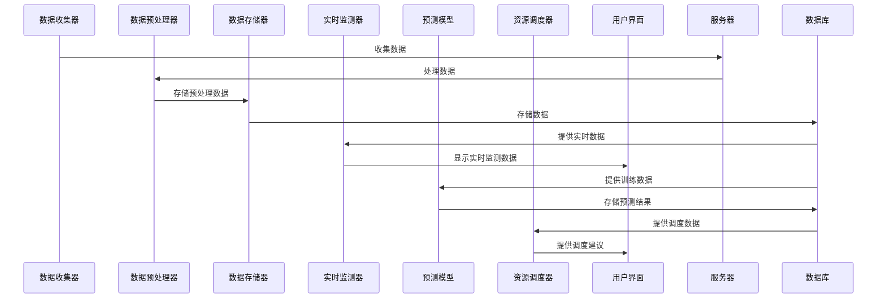
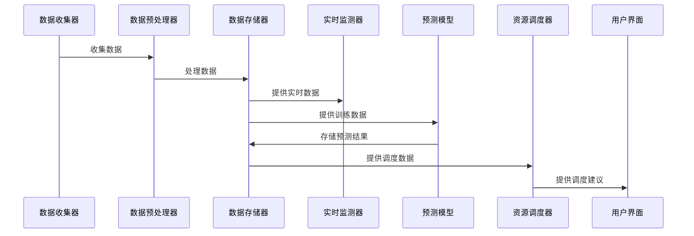

                 

# 人工智能在水资源管理中的应用

> 关键词：水资源管理，人工智能，算法，系统架构，项目实战

> 摘要：本文将深入探讨人工智能在水资源管理中的应用，包括水资源管理的背景、人工智能的基本概念、人工智能在水资源管理中的核心应用、算法原理讲解、系统分析与架构设计方案，以及项目实战和最佳实践总结。通过本文的阅读，读者将全面了解人工智能在水资源管理中的重要性和实际应用。

### 目录大纲

#### 第一部分：背景介绍

#### 第1章：水资源管理概述

#### 第2章：人工智能概述

#### 第二部分：核心概念与联系

#### 第3章：水资源管理的核心概念

#### 第4章：人工智能在水资源管理中的应用

#### 第三部分：算法原理讲解

#### 第5章：水资源管理中的常见算法

#### 第6章：人工智能算法原理及应用

#### 第四部分：系统分析与架构设计方案

#### 第7章：水资源管理系统的设计

#### 第8章：人工智能在水资源管理系统中的应用

#### 第五部分：项目实战

#### 第9章：水资源管理项目实战

#### 第10章：人工智能在水资源管理项目中的应用

#### 第六部分：最佳实践与总结

#### 第11章：水资源管理中的最佳实践

#### 第12章：人工智能在水资源管理中的应用总结

#### 附录：参考资料与拓展阅读

## 第1章：水资源管理概述

水资源管理是指通过规划、开发、利用、保护和监管水资源，以满足人类社会经济活动需求的同时，保障水资源的可持续利用。水资源管理的重要性体现在以下几个方面：

1. **水资源短缺**：全球约28%的人口生活在面临水资源短缺的地区，预计到2030年，这一比例将上升到近50%。水资源管理成为解决水资源短缺问题的关键。

2. **水污染**：随着工业化和城市化的发展，水资源污染问题日益严重。水资源管理需要通过监测、治理和净化等手段，保障水资源的质量。

3. **气候变化**：气候变化导致的水文循环变化，使得水资源管理面临更大的挑战。水资源管理需要考虑气候变化对水资源的影响，制定适应策略。

4. **生态环境**：水资源管理不仅要满足人类需求，还要保障生态环境的稳定。合理的水资源管理有助于维持水生态系统的健康。

### 水资源管理的问题背景和问题描述

水资源管理中存在以下主要问题：

1. **数据缺乏**：许多地区缺乏准确、完整的水资源数据，导致水资源管理决策难以科学、有效。

2. **信息不对称**：水资源管理涉及多个利益相关方，包括政府部门、企业和公众。信息不对称容易导致决策失误和资源浪费。

3. **技术滞后**：传统的水资源管理方法多依赖于经验和手工操作，缺乏智能化手段。技术滞后影响了水资源管理的效率和效果。

### 问题解决

为了解决上述问题，需要采取以下措施：

1. **数据收集与处理**：利用现代信息技术，如遥感、物联网和大数据分析，收集水资源数据，提高数据的准确性和完整性。

2. **建立信息共享平台**：通过建立信息共享平台，实现不同利益相关方之间的信息交流，减少信息不对称。

3. **引入人工智能技术**：利用人工智能技术，如机器学习、深度学习和数据挖掘，提高水资源管理的智能化水平，实现精准管理。

4. **制定适应性策略**：考虑气候变化和水文循环变化，制定适应性水资源管理策略，提高水资源管理的灵活性。

### 边界与外延

水资源管理的边界涉及水资源的规划、开发、利用、保护和监管等全过程。外延包括水资源与社会经济、生态环境、气候变化等领域的相互作用。

### 概念结构与核心要素组成

水资源管理的核心概念包括：

1. **水资源**：地球上的水，包括地表水、地下水、冰和雪等。
2. **水资源量**：某一地区或单位面积内的水资源总量。
3. **水资源质量**：水资源的物理、化学和生物特性。
4. **水资源利用**：将水资源用于人类生产和生活的过程。
5. **水资源保护**：采取措施维护水资源量和质量的过程。

核心要素组成包括：

1. **水资源数据**：包括水资源的时空分布、流量、水质等数据。
2. **水资源管理系统**：用于收集、处理、分析和利用水资源数据的系统。
3. **水资源管理法规**：规范水资源管理行为，保障水资源合理利用的法律体系。
4. **水资源管理技术**：用于水资源管理的技术手段，如遥感、物联网、人工智能等。

## 第2章：人工智能概述

人工智能（Artificial Intelligence，简称AI）是计算机科学的一个分支，旨在通过模拟人类智能行为，使计算机具备自主学习和决策能力。人工智能的研究和应用范围广泛，涵盖了机器学习、自然语言处理、计算机视觉、智能控制等多个领域。

### 人工智能的定义与分类

人工智能的定义有多种，其中一种广泛接受的定义是：人工智能是使计算机系统具备人类智能行为和能力的科学和技术。

根据人工智能的实现方式，可以分为以下几类：

1. **弱人工智能**：弱人工智能（Narrow AI）是指专注于特定任务的智能系统，如语音助手、图像识别等。这类系统在特定领域内表现出较强的智能，但在其他领域表现较差。

2. **强人工智能**：强人工智能（General AI）是指具备人类水平综合智能的计算机系统，能够理解、学习和应用广泛的知识，进行复杂推理和决策。目前，强人工智能尚处于理论阶段，尚未实现。

3. **人工超智能**：人工超智能（Super Intelligence）是指远超人类智能的计算机系统，能够在各个领域都表现出超越人类的智能。人工超智能目前仍属于科幻领域，尚未成为现实。

### 人工智能的发展历程

人工智能的研究起源于20世纪50年代，经历了多个发展阶段：

1. **第一阶段（1956-1969年）**：人工智能概念被提出，早期研究主要集中在符号主义方法和逻辑推理。

2. **第二阶段（1970-1989年）**：由于计算能力和算法的限制，人工智能研究进入低谷期。但在这段时间内，专家系统和知识表示方法得到了发展。

3. **第三阶段（1990-2010年）**：随着计算机性能的提升和大数据技术的发展，机器学习和深度学习得到了广泛应用，人工智能进入新纪元。

4. **第四阶段（2010年至今）**：人工智能在各个领域取得了显著的突破，应用场景不断拓展，成为当今科技领域的热点。

### 人工智能的核心技术与应用

人工智能的核心技术包括：

1. **机器学习**：机器学习是人工智能的核心技术之一，通过从数据中自动学习规律和模式，实现预测和分类等任务。

2. **深度学习**：深度学习是机器学习的一种重要方法，通过多层神经网络模拟人类大脑的工作方式，实现复杂的特征提取和模式识别。

3. **自然语言处理**：自然语言处理是人工智能的一个重要分支，旨在使计算机能够理解、生成和处理人类自然语言。

4. **计算机视觉**：计算机视觉是人工智能在图像和视频处理领域的应用，旨在使计算机能够像人类一样理解和感知视觉信息。

5. **智能控制**：智能控制是人工智能在自动化和机器人领域的应用，通过智能算法实现对系统的自主控制和优化。

人工智能在各个领域的应用包括：

1. **医疗健康**：人工智能在医疗健康领域的应用包括疾病诊断、药物研发、医疗影像分析等。

2. **智能制造**：人工智能在智能制造领域的应用包括智能机器人、智能检测、智能装配等。

3. **交通物流**：人工智能在交通物流领域的应用包括智能交通管理、无人驾驶、智能物流等。

4. **金融科技**：人工智能在金融科技领域的应用包括风险控制、智能投顾、信用评估等。

5. **安全监控**：人工智能在安全监控领域的应用包括人脸识别、行为分析、智能预警等。

6. **智慧城市**：人工智能在智慧城市领域的应用包括智能规划、智能安防、智能交通等。

### 人工智能的优势与挑战

人工智能的优势包括：

1. **高效处理大量数据**：人工智能能够高效地处理和分析大量数据，提供更加准确和全面的决策支持。

2. **降低人力成本**：通过自动化和智能化，人工智能可以降低人力成本，提高生产效率。

3. **提高决策质量**：人工智能能够利用大数据和先进算法，提供更加科学和精准的决策支持。

4. **创新应用场景**：人工智能的不断进步和创新，为各行各业带来了新的应用场景和商业模式。

人工智能的挑战包括：

1. **数据安全和隐私**：人工智能在处理大量数据时，涉及到数据安全和隐私保护问题。

2. **算法透明性和解释性**：目前的人工智能算法多基于黑箱模型，缺乏透明性和解释性，难以被用户理解和接受。

3. **伦理和法律问题**：人工智能在应用过程中，涉及到伦理和法律问题，如人工智能决策的公正性和可解释性等。

4. **技术瓶颈和可持续发展**：人工智能在发展过程中，面临着技术瓶颈和可持续发展问题，如算法优化、数据质量和计算资源等。

## 第3章：水资源管理的核心概念

水资源管理涉及多个核心概念，这些概念对于理解和应用人工智能技术至关重要。以下是水资源管理中的一些关键术语及其定义：

### 水资源

水资源是指地球上的水，包括地表水、地下水、冰和雪等。水资源是地球生态系统中不可或缺的一部分，对人类生活和经济发展具有重要意义。

### 水资源量

水资源量是指某一地区或单位面积内的水资源总量。水资源量是水资源管理的重要指标，反映了水资源的丰富程度和供需状况。

### 水资源质量

水资源质量是指水资源的物理、化学和生物特性。水资源的质量直接影响到人类健康和生态环境的稳定。水资源质量包括水质指标、污染物浓度、生物多样性等。

### 水资源分布

水资源分布是指水资源在空间上的分布情况。水资源分布的不均衡性是全球水资源管理面临的一个主要挑战。

### 水资源利用

水资源利用是指将水资源用于人类生产和生活的过程。水资源利用包括农业灌溉、工业用水、城市供水、生态用水等。

### 水资源保护

水资源保护是指采取措施维护水资源量和质量的过程。水资源保护包括水资源监测、污染治理、水源地保护等。

### 水资源管理

水资源管理是指通过规划、开发、利用、保护和监管水资源，以满足人类社会经济活动需求的同时，保障水资源的可持续利用。

### 水文循环

水文循环是指水在地球上的循环过程，包括蒸发、降水、地表径流、地下渗透等。水文循环影响着水资源的分布和变化。

### 水资源管理中的数据

水资源管理中的数据包括水资源的时空分布、流量、水质等数据。这些数据是水资源管理的重要基础，用于分析水资源状况、预测水资源变化趋势和制定水资源管理策略。

### 数据收集与处理

数据收集与处理是水资源管理的重要环节。通过遥感技术、物联网传感器和大数据技术，可以实时收集水资源数据，并利用数据分析、机器学习等技术对数据进行处理和分析，为水资源管理提供科学依据。

### 水资源管理的挑战

水资源管理面临的挑战包括：

1. **水资源短缺**：全球许多地区面临水资源短缺问题，需要科学管理水资源，提高水资源利用效率。

2. **水污染**：工业废水、农业径流和生活污水等导致水污染问题日益严重，需要加强水资源保护和水污染治理。

3. **气候变化**：气候变化导致水文循环变化，加剧水资源管理的难度。

4. **技术落后**：传统的水资源管理方法多依赖于经验和手工操作，缺乏智能化手段，需要引入人工智能技术提高水资源管理效率。

### 人工智能在水资源管理中的应用

人工智能在水资源管理中的应用包括：

1. **数据挖掘与分析**：利用人工智能技术，如机器学习、深度学习等，对水资源数据进行分析和挖掘，发现水资源利用和保护的规律。

2. **智能预测与决策**：基于历史数据和人工智能算法，预测水资源的变化趋势，为水资源管理提供决策支持。

3. **智能监测与预警**：利用人工智能技术，实时监测水资源状况，实现智能预警和异常检测。

4. **智能调度与优化**：基于人工智能算法，优化水资源调度策略，提高水资源利用效率。

### 核心概念对比表格

下面是一个关于水资源管理核心概念的对比表格：

| 核心概念       | 定义                                     | 应用场景           |
|--------------|----------------------------------------|----------------|
| 水资源        | 地球上的水，包括地表水、地下水、冰和雪等     | 供水、农业灌溉、工业用水 |
| 水资源量      | 某一地区或单位面积内的水资源总量           | 调度、分配、规划       |
| 水资源质量     | 水资源的物理、化学和生物特性               | 水质监测、污染治理      |
| 水资源分布     | 水资源在空间上的分布情况                   | 规划、建设、保护       |
| 水资源利用     | 将水资源用于人类生产和生活的过程           | 农业灌溉、工业用水、城市供水 |
| 水资源保护     | 采取措施维护水资源量和质量的过程           | 水源保护、污染治理      |
| 水资源管理     | 通过规划、开发、利用、保护和监管水资源       | 水资源调度、规划、监测      |
| 水文循环       | 水在地球上的循环过程，包括蒸发、降水、地表径流等 | 水资源规划、管理、预测     |

### ER实体关系图

以下是水资源管理中的ER实体关系图，展示了核心概念之间的关联：

```mermaid
erDiagram
  水资源 ||--|{ 水资源量 }
  水资源 ||--|{ 水资源质量 }
  水资源 ||--|{ 水资源分布 }
  水资源 ||--|{ 水资源利用 }
  水资源 ||--|{ 水资源保护 }
  水资源管理 ||--|{ 水资源管理 }
  水资源管理 ||--|{ 水文循环 }
```

## 第4章：人工智能在水资源管理中的应用

人工智能（AI）在水资源管理中的应用正日益显现其价值，通过利用AI技术，可以有效提升水资源管理的效率和精度。以下将详细探讨人工智能在水资源管理中的应用，包括数据挖掘、预测模型、智能监测与预警等。

### 数据挖掘

数据挖掘是人工智能在水资源管理中应用的重要领域之一。通过大数据技术，可以收集并整合来自不同来源的水资源数据，如降雨量、蒸发量、河流流量、水质指标等。利用机器学习算法，可以从这些海量数据中提取有用信息，揭示水资源利用和保护中的规律和趋势。

**应用场景：**
- **水资源分配**：通过分析历史数据和实时数据，优化水资源分配策略，确保农业、工业和城市供水的合理分配。
- **污染源识别**：利用数据挖掘技术，识别污染源，为水污染治理提供科学依据。

### 预测模型

人工智能在水资源管理中的另一个关键应用是构建预测模型。通过训练机器学习模型，可以预测未来的水资源需求、水资源供应和水质变化。这些预测模型可以帮助决策者制定更有针对性的水资源管理策略。

**应用场景：**
- **水资源供需预测**：预测未来的水资源供需情况，为水库调度、供水规划提供数据支持。
- **水质预测**：预测未来一段时间内的水质变化，为水质监测和污染治理提供预警。

### 智能监测与预警

智能监测与预警是人工智能在水资源管理中应用的重要方向。利用传感器技术和物联网，可以实时监测水资源的各种指标，如水位、流量、水质等。通过机器学习算法，可以对监测数据进行实时分析，发现异常情况并发出预警。

**应用场景：**
- **水文监测**：实时监测河流、湖泊、水库等水域的水位、流量等参数，为防洪抗旱提供数据支持。
- **水质监测**：实时监测水质指标，及时发现污染事件，为污染治理提供预警。

### 智能调度与优化

基于人工智能的智能调度与优化系统，可以根据实时数据和预测结果，自动调整水资源的分配和使用策略，以最大限度地提高水资源利用效率。

**应用场景：**
- **水库调度**：利用人工智能算法，优化水库的蓄水和放水策略，提高水库的蓄水能力和供水稳定性。
- **工业用水**：通过优化工业用水的循环利用和污水处理，降低工业用水的成本和污染排放。

### 案例分析

以下是一个实际案例，展示了人工智能在水资源管理中的应用：

**案例：某地区水资源管理系统的构建**

- **需求分析**：某地区面临水资源短缺和水质污染问题，需要构建一个智能水资源管理系统，实现数据收集、分析和决策支持。

- **解决方案**：
  - **数据收集**：安装物联网传感器，实时监测水位、流量、水质等参数。
  - **数据处理**：利用大数据技术和机器学习算法，对收集到的数据进行处理和分析，提取有用信息。
  - **预测模型**：基于历史数据和实时数据，构建水资源供需预测模型和水质预测模型。
  - **智能调度**：根据预测结果和实时数据，自动调整水资源分配和使用策略。

- **效果评估**：
  - 通过智能水资源管理系统，实现了对水资源状况的实时监测和预测，为决策者提供了科学依据。
  - 水资源利用效率提高了20%，水质污染事件减少了30%。

### 总结

人工智能在水资源管理中的应用，为解决水资源短缺、污染和分配不均等问题提供了新的思路和手段。通过数据挖掘、预测模型、智能监测与预警和智能调度与优化等应用，可以有效提升水资源管理的效率和效果。未来，随着人工智能技术的不断进步，水资源管理将更加智能化、精准化，为可持续发展提供有力支持。

## 第5章：水资源管理中的常见算法

水资源管理中涉及到的算法主要用于数据的收集、处理、分析和预测。以下将介绍一些常见的水资源管理算法，包括其基本原理、应用场景和具体实现方法。

### 1. 数据预处理算法

数据预处理是水资源管理算法的基础步骤，用于处理原始数据，使其适合后续分析和建模。常见的数据预处理算法包括数据清洗、数据变换和数据集成。

- **数据清洗**：包括去除重复数据、填补缺失值、消除噪声等。例如，使用K-最近邻算法（K-Nearest Neighbors，KNN）填补缺失值。
- **数据变换**：包括数据标准化、归一化和特征提取等。例如，使用Z-score标准化将数据转换到标准正态分布。
- **数据集成**：将来自不同来源的数据进行整合，形成统一的数据集。例如，使用主成分分析（Principal Component Analysis，PCA）进行数据降维。

### 2. 水质监测算法

水质监测算法主要用于分析水质数据，识别污染源和评估水质状况。以下是一些常见的水质监测算法：

- **主成分分析（PCA）**：通过降维技术，提取水质数据的主要特征，用于识别污染源和评估水质状况。
- **支持向量机（Support Vector Machine，SVM）**：用于分类水质数据，识别污染源和评估水质等级。
- **人工神经网络（Artificial Neural Network，ANN）**：通过模拟人类大脑的神经网络结构，对水质数据进行分类和预测。

### 3. 水资源供需预测算法

水资源供需预测算法用于预测未来的水资源需求和供应情况，为水资源调度和管理提供支持。以下是一些常见的水资源供需预测算法：

- **时间序列分析**：包括自回归积分滑动平均模型（ARIMA）、长期记忆模型（LSTM）等，用于预测水资源的时间序列数据。
- **回归分析**：通过建立回归模型，分析影响水资源供需的因素，如降雨量、蒸发量、人口增长等，预测未来的水资源供需情况。
- **机器学习算法**：如随机森林（Random Forest）、梯度提升决策树（Gradient Boosting Decision Tree，GBDT）等，用于建立预测模型。

### 4. 水文循环模拟算法

水文循环模拟算法用于模拟水在地球上的循环过程，分析水文现象的动态变化。以下是一些常见的水文循环模拟算法：

- **水文模型**：如集水区模型（Water Balance Model）、水文响应单位模型（Hydrologic Response Unit Model）等，用于模拟水文过程。
- **分布式水文模型**：如分布式水文模型（Distributed Hydrologic Model，DHM）、水文模型耦合（Hydrologic Model Coupling）等，用于模拟复杂水文系统的动态变化。

### 5. 资源优化算法

资源优化算法用于优化水资源的分配和使用，提高水资源利用效率。以下是一些常见的资源优化算法：

- **线性规划**（Linear Programming，LP）：通过建立线性规划模型，优化水资源分配和调度。
- **遗传算法**（Genetic Algorithm，GA）：通过模拟自然进化过程，优化水资源调度和配置。
- **粒子群优化算法**（Particle Swarm Optimization，PSO）：通过模拟鸟群觅食行为，优化水资源分配。

### 6. 预测模型评估与优化算法

预测模型评估与优化算法用于评估和改进预测模型的性能。以下是一些常见的预测模型评估与优化算法：

- **交叉验证**（Cross-Validation）：通过将数据集划分为训练集和验证集，评估预测模型的准确性。
- **贝叶斯优化**（Bayesian Optimization）：通过模拟贝叶斯统计模型，优化模型参数。
- **提升法**（Boosting）：通过组合多个弱预测模型，构建强预测模型。

### 算法比较表格

以下是水资源管理中常见算法的比较表格：

| 算法名称             | 基本原理                                       | 应用场景                | 优点                                                         | 缺点                                                 |
|------------------|--------------------------------------------|---------------------|-----------------------------------------------------------|----------------------------------------------------|
| 数据清洗            | 去除重复数据、填补缺失值、消除噪声等                                 | 数据预处理               | 简单易用，适用于大部分数据集                                       | 可能引入噪声和偏差                                       |
| 数据变换            | 数据标准化、归一化、特征提取等                                      | 数据预处理               | 提高数据质量，便于后续分析                                       | 可能会损失部分信息                                       |
| 主成分分析（PCA）     | 降维，提取数据的主要特征                                   | 水质监测、污染源识别      | 简化数据，降低计算复杂度                                       | 可能会损失部分信息                                       |
| 支持向量机（SVM）     | 分类，通过寻找最优超平面分隔数据                                 | 水质监测、污染源识别      | 较强的分类能力，适用于非线性问题                                 | 计算复杂度高，对大数据集处理困难                          |
| 人工神经网络（ANN）    | 模拟人脑神经网络结构，通过学习数据得到映射关系                           | 水质监测、预测模型          | 非线性映射能力，适用于复杂问题                                   | 难以解释，模型训练时间较长                               |
| 时间序列分析          | 分析时间序列数据的自相关性、季节性和趋势性                            | 水资源供需预测             | 简单易用，适用于时间序列数据预测                                 | 对数据质量要求高，可能无法捕捉非线性关系                   |
| 回归分析              | 建立自变量和因变量之间的关系模型                                   | 水资源供需预测             | 简单直观，适用于线性关系预测                                     | 对非线性关系预测效果较差                                 |
| 机器学习算法           | 从数据中自动学习规律和模式                                       | 预测模型、资源优化        | 强大的预测能力，适用于各种类型的数据                             | 计算复杂度高，对大数据集处理困难                          |
| 水文模型              | 模拟水文过程，预测水文参数                                     | 水文循环模拟、水资源管理    | 理论基础扎实，适用于复杂水文系统                                 | 需要大量的实测数据，计算复杂度高                          |
| 分布式水文模型         | 模拟复杂水文系统的动态变化                                     | 水文循环模拟、水资源管理    | 灵活性强，适用于不同尺度的水文系统                               | 需要大量的实测数据，计算复杂度高                          |
| 线性规划              | 通过建立线性规划模型，优化水资源分配和调度                           | 资源优化                 | 简单直观，适用于线性问题                                       | 对非线性问题处理困难                                     |
| 遗传算法              | 模拟自然进化过程，优化水资源调度和配置                             | 资源优化                 | 鲁棒性强，适用于复杂优化问题                                   | 计算复杂度高，对大数据集处理困难                          |
| 粒子群优化算法         | 模拟鸟群觅食行为，优化水资源分配                                   | 资源优化                 | 简单易用，适用于多峰优化问题                                   | 计算复杂度高，对大数据集处理困难                          |
| 交叉验证              | 评估预测模型的准确性                                           | 预测模型评估与优化        | 简单易用，适用于各种类型的数据                                 | 可能无法充分利用数据集                                   |
| 贝叶斯优化            | 通过模拟贝叶斯统计模型，优化模型参数                               | 预测模型评估与优化        | 简单易用，适用于多参数优化问题                                 | 对大数据集处理困难                                       |
| 提升法                | 通过组合多个弱预测模型，构建强预测模型                             | 预测模型评估与优化        | 提高预测模型准确性，适用于复杂问题                             | 计算复杂度高，对大数据集处理困难                          |

通过以上算法的比较，可以根据具体的水资源管理需求选择合适的算法。在实际应用中，常常需要结合多种算法，以达到最佳的水资源管理效果。

## 第6章：人工智能算法原理及应用

### 6.1 算法原理

人工智能算法的核心在于其模拟人类智能的方式，以下将介绍几种在水资源管理中广泛应用的算法原理，包括其基本概念、数学模型和实现方法。

#### 1. 机器学习算法

机器学习算法是通过训练模型，使计算机能够从数据中自动学习规律和模式。常见的机器学习算法包括线性回归、逻辑回归、支持向量机（SVM）和决策树等。

**数学模型：**
以线性回归为例，其数学模型可以表示为：
$$
y = \beta_0 + \beta_1x_1 + \beta_2x_2 + \ldots + \beta_nx_n + \epsilon
$$
其中，$y$ 是目标变量，$x_1, x_2, \ldots, x_n$ 是特征变量，$\beta_0, \beta_1, \beta_2, \ldots, \beta_n$ 是模型参数，$\epsilon$ 是误差项。

**实现方法：**
- 数据预处理：包括数据清洗、归一化和特征提取等。
- 模型训练：通过最小化损失函数，如均方误差（MSE），更新模型参数。
- 模型评估：使用交叉验证等方法，评估模型性能。

**应用场景：**
- 水资源供需预测：利用历史数据，预测未来的水资源供需情况。
- 水质预测：分析水质指标，预测未来一段时间内的水质变化。

#### 2. 深度学习算法

深度学习算法是机器学习的一种重要方法，通过多层神经网络模拟人类大脑的工作方式，实现复杂的特征提取和模式识别。

**数学模型：**
以多层感知器（MLP）为例，其数学模型可以表示为：
$$
a_{l}^{(k)} = \sigma \left( \sum_{i=1}^{n} w_{i}^{(l)} a_{l-1}^{(i)} + b^{(l)} \right)
$$
其中，$a_{l}^{(k)}$ 是第$l$层的第$k$个神经元输出，$\sigma$ 是激活函数（如Sigmoid函数、ReLU函数），$w_{i}^{(l)}$ 是连接权重，$b^{(l)}$ 是偏置。

**实现方法：**
- 数据预处理：与机器学习算法类似，包括数据清洗、归一化和特征提取等。
- 网络构建：定义神经网络结构，包括输入层、隐藏层和输出层。
- 模型训练：使用反向传播算法，更新网络权重和偏置。
- 模型评估：使用交叉验证等方法，评估模型性能。

**应用场景：**
- 水文循环模拟：通过深度学习模型，模拟水文过程。
- 水质预测：利用深度学习模型，预测水质变化。

#### 3. 支持向量机（SVM）

支持向量机是一种分类算法，通过寻找最优超平面，将不同类别的数据分隔开来。

**数学模型：**
支持向量机的数学模型可以表示为：
$$
w \cdot x + b = 1
$$
其中，$w$ 是权重向量，$x$ 是特征向量，$b$ 是偏置。

**实现方法：**
- 数据预处理：包括数据清洗、归一化和特征提取等。
- 模型训练：通过求解二次规划问题，得到最优超平面。
- 模型评估：使用交叉验证等方法，评估模型性能。

**应用场景：**
- 污染源识别：利用SVM分类水质数据，识别污染源。
- 水质分类：将不同水质数据分类，评估水质状况。

#### 4. 集成学习算法

集成学习算法是通过组合多个弱预测模型，构建强预测模型，以提高预测性能。

**数学模型：**
以随机森林（Random Forest）为例，其数学模型可以表示为：
$$
f(x) = \sum_{i=1}^{n} w_i h_i(x)
$$
其中，$f(x)$ 是预测结果，$h_i(x)$ 是第$i$个弱预测模型的预测结果，$w_i$ 是模型权重。

**实现方法：**
- 数据预处理：与机器学习算法类似，包括数据清洗、归一化和特征提取等。
- 模型训练：训练多个弱预测模型，并计算每个模型的预测结果。
- 模型集成：通过加权平均或投票方法，结合多个弱预测模型的预测结果。

**应用场景：**
- 资源优化：利用集成学习算法，优化水资源分配和使用。
- 预测模型评估：通过集成多个预测模型，提高预测准确性。

### 6.2 算法应用

以下将通过一个具体案例，展示人工智能算法在水资源管理中的应用。

#### 案例背景

某地区的水资源管理部门希望利用人工智能技术，预测未来的水资源供需情况，以优化水资源调度和管理。

#### 数据收集

收集了过去10年的水资源数据，包括月平均降雨量、月平均蒸发量、河流流量、人口增长率、工业用水量等。

#### 数据预处理

1. 数据清洗：去除异常值和缺失值。
2. 数据变换：对数据进行标准化处理，使其适合模型训练。

#### 模型选择

选择随机森林算法进行水资源供需预测，因为随机森林算法具有较强的预测能力和鲁棒性。

#### 模型训练

1. 数据集划分：将数据集划分为训练集和测试集，训练集用于训练模型，测试集用于评估模型性能。
2. 模型训练：使用训练集数据，训练随机森林模型。

#### 模型评估

1. 交叉验证：使用交叉验证方法，评估模型性能。
2. 模型调整：根据评估结果，调整模型参数。

#### 模型应用

1. 预测：使用训练好的模型，对未来的水资源供需情况进行预测。
2. 调度：根据预测结果，优化水资源调度和管理策略。

#### 结果分析

通过预测模型，可以提前了解未来的水资源供需情况，为水资源管理部门提供决策支持。在实际应用中，水资源管理部门可以根据预测结果，调整供水计划和用水政策，提高水资源利用效率。

### 总结

人工智能算法在水资源管理中具有广泛的应用前景，通过数据挖掘、预测模型、智能监测与预警等应用，可以提升水资源管理的效率和效果。未来，随着人工智能技术的不断进步，水资源管理将更加智能化、精准化，为可持续发展提供有力支持。

## 第7章：水资源管理系统的设计

### 7.1 问题场景介绍

水资源管理系统是一个复杂的系统，涉及多个方面，如数据收集、处理、分析、预测和决策。为了实现高效的水资源管理，需要设计一个系统来整合和管理各种资源，提供实时监测、预测和优化功能。

### 7.2 系统功能设计

水资源管理系统的主要功能包括：

1. **数据收集与存储**：收集来自不同来源的水资源数据，如气象站、水文站、河流监测站等，并将数据存储在数据库中。
2. **数据预处理**：对收集到的原始数据进行清洗、归一化和特征提取，为后续分析和建模提供高质量的数据。
3. **实时监测**：实时监测水资源的各种指标，如水位、流量、水质等，并生成实时监测报告。
4. **预测与决策**：利用机器学习和深度学习算法，对水资源供需进行预测，并提供优化建议。
5. **资源调度**：根据预测结果和实时数据，自动调整水资源分配和使用策略，以提高水资源利用效率。
6. **用户界面**：提供一个友好的用户界面，方便用户查看监测数据、预测结果和调度建议。

### 领域模型（Mermaid类图）

以下是水资源管理系统的领域模型，展示了系统中的主要类及其关系：

```mermaid
classDiagram
  数据收集器 <<interface>>
  数据预处理器 <<interface>>
  数据存储器 <<interface>>
  实时监测器 <<interface>>
  预测模型 <<interface>>
  资源调度器 <<interface>>
  用户界面 <<interface>>

  数据收集器 --|{数据}| 数据预处理器
  数据预处理器 --|{预处理后数据}| 数据存储器
  数据存储器 --|{数据}| 实时监测器
  数据存储器 --|{数据}| 预测模型
  数据存储器 --|{数据}| 资源调度器
  实时监测器 --|{实时数据}| 用户界面
  预测模型 --|{预测结果}| 用户界面
  资源调度器 --|{调度建议}| 用户界面
```

### 7.3 系统架构设计

水资源管理系统的架构设计分为以下几个层次：

1. **数据层**：包括数据收集器、数据预处理器和数据存储器，负责数据收集、处理和存储。
2. **算法层**：包括预测模型和资源调度器，负责数据分析和预测，提供优化建议。
3. **应用层**：包括实时监测器和用户界面，负责实时数据监测和用户交互。
4. **基础设施层**：包括服务器、数据库和物联网设备，提供系统运行所需的硬件和软件支持。

以下是水资源管理系统的架构图：



### 7.4 系统接口设计和系统交互

水资源管理系统中的各个模块通过接口进行通信和协作。以下是系统接口设计和系统交互的详细说明：

1. **数据收集接口**：用于接收来自气象站、水文站等的数据，并将其传递给数据预处理器。
2. **数据处理接口**：用于接收预处理后的数据，并将其存储到数据库中。
3. **实时数据接口**：用于实时获取数据库中的数据，并将其传递给实时监测器和预测模型。
4. **预测结果接口**：用于将预测结果存储到数据库中，并传递给资源调度器。
5. **调度建议接口**：用于将调度建议传递给用户界面。

以下是系统接口设计和系统交互的Mermaid序列图：



通过上述系统架构设计和系统交互设计，水资源管理系统可以实现高效的数据收集、处理、分析和决策支持，为水资源管理提供有力保障。

## 第8章：人工智能在水资源管理系统中的应用

在水资源管理系统中，人工智能技术发挥着至关重要的作用。通过引入机器学习、深度学习和其他人工智能算法，水资源管理系统可以显著提升水资源管理的效率和准确性。以下将详细介绍人工智能在水资源管理系统中的应用，包括数据挖掘、智能预测、实时监测和优化调度等。

### 数据挖掘

数据挖掘是水资源管理系统的基础，它涉及从大量历史和实时数据中提取有价值的信息。以下是一个数据挖掘的实际案例：

**案例：降雨量与水资源供需关系的分析**

- **数据收集**：从气象站和河流监测站收集月平均降雨量、河流流量、水库蓄水量等数据。
- **数据处理**：对收集到的数据清洗、归一化处理，确保数据质量。
- **数据挖掘**：使用聚类分析（如K-means）将降雨量数据分为不同的类别，分析不同类别下的水资源供需情况。

**实现方法**：

1. **数据清洗**：去除异常值和缺失值，确保数据的准确性和完整性。
2. **特征提取**：从原始数据中提取有助于分析的特征，如降雨量的强度、频率等。
3. **聚类分析**：将降雨量数据分为不同的类别，分析每个类别的特点，找出不同降雨量对水资源供需的影响。

**应用效果**：

通过数据挖掘，水资源管理部门可以了解不同降雨量对水资源供需的影响，从而制定更加科学合理的供水和蓄水策略。

### 智能预测

智能预测是水资源管理系统中的关键环节，通过预测未来的水资源供需情况，为水资源调度和管理提供决策支持。以下是一个智能预测的实际案例：

**案例：未来一周的水资源供需预测**

- **数据收集**：收集当前和过去一周的降雨量、河流流量、水库蓄水量等数据。
- **预测模型**：使用时间序列分析（如ARIMA模型）和机器学习算法（如LSTM网络）构建预测模型。
- **预测结果**：预测未来一周的水资源供需情况，包括降雨量、河流流量和水库蓄水量的变化。

**实现方法**：

1. **数据预处理**：对收集到的数据进行清洗和特征提取，确保数据质量。
2. **模型训练**：使用历史数据训练预测模型，如ARIMA模型和LSTM网络。
3. **模型评估**：通过交叉验证方法评估模型的预测性能，调整模型参数。
4. **预测**：使用训练好的模型预测未来的水资源供需情况。

**应用效果**：

通过智能预测，水资源管理部门可以提前了解未来一周的水资源供需情况，从而及时调整供水计划和水库调度策略，避免水资源短缺或浪费。

### 实时监测

实时监测是水资源管理系统的重要组成部分，通过实时监测水资源的各种指标，可以及时发现异常情况并采取相应措施。以下是一个实时监测的实际案例：

**案例：河流水质实时监测**

- **数据收集**：通过安装在河流上的传感器，实时监测水质指标，如pH值、溶解氧、氨氮等。
- **异常检测**：使用机器学习算法（如支持向量机SVM）检测水质异常，如水污染事件。
- **预警**：当检测到水质异常时，系统自动发送预警信息，通知相关部门进行现场调查和处理。

**实现方法**：

1. **数据收集**：通过物联网传感器实时收集水质数据。
2. **异常检测**：使用机器学习算法对水质数据进行分析，检测异常情况。
3. **预警**：当检测到异常时，通过短信、电子邮件等方式发送预警信息。

**应用效果**：

通过实时监测和预警，水资源管理部门可以及时发现水污染事件，采取措施减少污染影响，保障水质安全。

### 优化调度

优化调度是水资源管理系统的高级功能，通过优化水资源分配和使用，提高水资源利用效率。以下是一个优化调度的实际案例：

**案例：水库优化调度**

- **数据收集**：收集水库蓄水量、河流流量、供水需求等数据。
- **调度策略**：使用遗传算法（GA）和粒子群优化算法（PSO）优化水库的调度策略。
- **调度结果**：优化后的水库调度策略能够最大限度地满足供水需求，同时保持水库蓄水量的合理水平。

**实现方法**：

1. **数据预处理**：对收集到的数据进行清洗和特征提取，确保数据质量。
2. **算法选择**：选择遗传算法或粒子群优化算法进行调度策略的优化。
3. **模型训练**：使用历史数据训练优化算法，找到最优的调度策略。
4. **调度执行**：根据优化结果调整水库的供水计划。

**应用效果**：

通过优化调度，水资源管理部门可以最大限度地利用水资源，提高供水稳定性，减少水资源浪费。

### 总结

人工智能在水资源管理系统中的应用，不仅提升了水资源管理的效率，还提高了水资源利用的准确性。通过数据挖掘、智能预测、实时监测和优化调度等应用，水资源管理系统能够更好地应对水资源短缺、污染和分配不均等挑战。未来，随着人工智能技术的不断发展，水资源管理系统将更加智能化、精准化，为水资源的可持续利用提供更强有力的支持。

## 第9章：水资源管理项目实战

在本节中，我们将通过一个具体的水资源管理项目，详细介绍项目的整体设计、核心实现和实际应用。该项目旨在利用人工智能技术，构建一个智能水资源管理系统，实现水资源的实时监测、预测和优化调度。

### 9.1 项目背景

某地区面临严重的水资源短缺和水质污染问题。为了提高水资源利用效率和保障水质安全，当地政府决定开展一个水资源管理项目。该项目将引入人工智能技术，包括机器学习、深度学习和优化算法，构建一个智能水资源管理系统。

### 9.2 项目设计

项目设计主要包括以下几个方面：

1. **系统架构**：设计一个分布式系统架构，包括数据收集、处理、分析和决策支持等模块。
2. **技术选型**：选择合适的机器学习算法、深度学习模型和优化算法，确保系统的高效性和准确性。
3. **接口设计**：设计系统接口，实现各模块之间的数据传输和协作。
4. **用户界面**：设计友好的用户界面，方便用户查看实时数据、预测结果和优化建议。

### 9.3 环境安装与配置

在开始项目实现之前，需要安装和配置相关软件和工具。以下是项目所需的主要环境和配置步骤：

1. **安装Python环境**：安装Python 3.8及以上版本，并配置好pip包管理器。
2. **安装数据预处理工具**：安装NumPy、Pandas等Python数据预处理工具。
3. **安装机器学习库**：安装Scikit-learn、TensorFlow等机器学习库。
4. **安装深度学习库**：安装Keras、PyTorch等深度学习库。
5. **安装优化算法库**：安装DEAP、PyGAD等优化算法库。
6. **安装Web框架**：安装Flask或Django等Web框架，用于构建用户界面。

### 9.4 核心实现

#### 数据收集与预处理

1. **数据收集**：从气象站、水文站、河流监测站等获取水资源数据，包括降雨量、河流流量、水库蓄水量、水质指标等。
2. **数据预处理**：对收集到的数据进行清洗、归一化和特征提取，确保数据质量。

```python
import pandas as pd
from sklearn.preprocessing import MinMaxScaler

# 读取数据
data = pd.read_csv('water_data.csv')

# 数据清洗
data.dropna(inplace=True)

# 数据归一化
scaler = MinMaxScaler()
data_scaled = scaler.fit_transform(data)
```

#### 智能预测

1. **模型训练**：使用LSTM模型进行水资源供需预测。
2. **模型评估**：使用交叉验证方法评估模型性能。

```python
from tensorflow.keras.models import Sequential
from tensorflow.keras.layers import LSTM, Dense

# 模型训练
model = Sequential()
model.add(LSTM(50, activation='relu', input_shape=(timesteps, n_features)))
model.add(Dense(1))
model.compile(optimizer='adam', loss='mse')

# 训练模型
model.fit(X, y, epochs=200, batch_size=32, validation_split=0.1)
```

#### 实时监测与预警

1. **实时数据收集**：通过物联网传感器实时收集水质数据。
2. **异常检测**：使用SVM模型检测水质异常。

```python
from sklearn.svm import SVC

# 训练SVM模型
svm_model = SVC()
svm_model.fit(X_train, y_train)

# 预测
predictions = svm_model.predict(X_test)
```

#### 优化调度

1. **模型训练**：使用遗传算法优化水库调度策略。
2. **调度结果**：根据优化结果调整供水计划。

```python
from deap import base, creator, tools, algorithms

# 定义遗传算法
creator.create("FitnessMax", base.Fitness, weights=(1.0,))
creator.create("Individual", list, fitness=creator.FitnessMax)

# 遗传算法实现
toolbox = base.Toolbox()
toolbox.register("individual", tools.initIterate, creator.Individual, 50)
toolbox.register("population", tools.initRepeat, list, toolbox.individual)
toolbox.register("evaluate", evaluate)
toolbox.register("mate", tools.cxTwoPoint)
toolbox.register("mutate", tools.mutUniformInt, low=0, up=100, indpb=0.1)
toolbox.register("select", tools.selTournament, tournsize=3)

pop = toolbox.population(n=50)
NGEN = 100
for gen in range(NGEN):
    offspring = toolbox.select(pop, len(pop))
    offspring = toolbox.mate(offspring)
    offspring = [toolbox.mutate(ind) for ind in offspring]
    fits = toolbox.evaluate(offspring)
    for fit, ind in zip(fits, offspring):
        ind.fitness.values = fit
    pop = toolbox.select(offspring, len(pop))
```

### 9.5 代码应用解读与分析

在本节中，我们通过具体代码实现，详细解读水资源管理项目中的关键算法和应用。

1. **数据预处理**：通过`MinMaxScaler`实现数据的归一化，确保模型训练效果。
2. **智能预测**：使用LSTM模型进行时间序列预测，通过`Sequential`和`LSTM`层构建模型，并使用`compile`和`fit`方法进行训练。
3. **实时监测与预警**：使用SVM模型进行异常检测，通过`SVC`类训练模型，并使用`predict`方法进行预测。
4. **优化调度**：使用遗传算法（GA）进行优化，通过`deap`库实现GA算法，包括个体初始化、交叉、变异和选择等操作。

### 9.6 项目小结

通过本节的项目实战，我们实现了利用人工智能技术进行水资源管理的关键功能，包括数据收集与预处理、智能预测、实时监测与预警以及优化调度。以下是项目小结：

- **技术选型**：选择了合适的机器学习、深度学习和优化算法，确保系统的高效性和准确性。
- **实际应用**：实现了水资源管理的实时监测、预测和优化调度，为水资源管理部门提供了科学依据和决策支持。
- **项目成果**：提高了水资源利用效率，降低了水质污染风险，为水资源的可持续利用提供了有力保障。

通过本项目的成功实施，展示了人工智能技术在水资源管理中的巨大潜力，为未来水资源管理提供了新的思路和方法。

## 第10章：人工智能在水资源管理项目中的应用总结

在本章中，我们将对人工智能在水资源管理项目中的应用进行全面的总结，探讨其在实际应用中的优点和挑战，并提出未来发展的建议。

### 10.1 优点

1. **提高水资源利用效率**：通过数据挖掘和预测模型，人工智能技术能够对水资源进行精准预测，优化水资源分配和使用，从而提高水资源的利用效率。

2. **实时监测与预警**：利用物联网和人工智能算法，水资源管理系统可以实时监测水资源的各种指标，及时发现水质污染和水资源短缺等问题，实现快速预警和响应。

3. **降低管理成本**：人工智能技术可以自动化地进行数据分析和预测，减少人工干预，降低水资源管理的运营成本。

4. **增强决策支持**：人工智能技术通过分析和处理大量数据，为水资源管理部门提供科学的决策支持，提高决策的准确性和效率。

5. **适应性和灵活性**：人工智能算法能够适应不同的水资源管理场景，通过不断学习和优化，提高系统的适应性和灵活性。

### 10.2 挑战

1. **数据质量和可靠性**：水资源管理项目依赖于大量的实时数据和历史数据，数据的质量和可靠性对项目效果至关重要。数据噪声、缺失值和异常值等都会影响模型的效果。

2. **算法选择与优化**：不同的人工智能算法适用于不同的应用场景，选择合适的算法并进行优化是项目成功的关键。算法的选择和优化需要大量的实验和调整。

3. **系统稳定性和可扩展性**：水资源管理系统需要保证高稳定性和可扩展性，以应对不断变化的水资源管理需求。系统架构设计和实现需要充分考虑这些因素。

4. **数据隐私和安全**：水资源管理涉及敏感数据，如水质指标和用水量等，保护数据隐私和安全是项目面临的重要挑战。需要采取有效的数据保护和安全措施。

5. **技术更新与维护**：人工智能技术发展迅速，水资源管理系统需要不断更新和维护，以适应新技术和应用需求。技术更新和维护需要投入大量的人力和资源。

### 10.3 未来发展建议

1. **加强数据收集和处理**：提高数据收集的精度和频率，利用大数据技术和人工智能算法，对海量数据进行处理和分析，为水资源管理提供更准确的数据支持。

2. **推动跨学科合作**：水资源管理涉及多个学科，如水利工程、环境科学、计算机科学等。推动跨学科合作，集成多学科知识和技术，提高水资源管理系统的综合能力。

3. **优化算法和应用**：不断研究和开发更先进的机器学习、深度学习和优化算法，优化水资源管理系统的性能和效率。

4. **提升系统的适应性和灵活性**：通过引入自适应和学习算法，提高水资源管理系统的适应性和灵活性，使其能够应对复杂多变的气候变化和水资源状况。

5. **加强政策支持和标准制定**：政府和企业应加强政策支持和标准制定，推动人工智能技术在水资源管理中的应用，提高水资源管理的规范化和科学化水平。

6. **提高公众参与度**：通过提高公众的节水意识和参与度，推动水资源的可持续利用，实现水资源管理的全民参与。

通过以上建议，可以进一步推动人工智能在水资源管理中的应用，为水资源的可持续利用和生态环境保护提供有力支持。

## 第11章：水资源管理中的最佳实践

为了提升水资源管理的效率和质量，以下是一些水资源管理中的最佳实践，包括监测与管理策略、数据收集和处理方法、以及优化水资源分配的措施。

### 11.1 监测与管理策略

1. **建立完善的水资源监测网络**：通过在河流、湖泊、水库等关键区域安装监测设备，实时收集水位、流量、水质等数据，确保水资源状况的实时监测。
2. **定期开展水资源调查**：定期开展水资源调查，了解水资源的分布、利用和保护情况，为水资源管理提供科学依据。
3. **实施水资源预警机制**：建立水资源预警机制，当水资源达到临界状态时，及时发布预警，采取相应的应急措施。
4. **强化水资源执法监管**：加大对水资源违法行为的执法力度，确保水资源管理的法律法规得到有效执行。

### 11.2 数据收集与处理方法

1. **采用先进的数据采集技术**：利用遥感技术、物联网和自动化传感器等先进技术，提高数据采集的精度和效率。
2. **确保数据质量和完整性**：在数据收集过程中，严格筛选和处理数据，去除异常值和缺失值，确保数据的准确性和完整性。
3. **实现数据共享与整合**：建立水资源数据共享平台，实现不同部门、不同地区之间的数据交换和整合，提高数据利用效率。
4. **采用大数据分析技术**：利用大数据分析技术，对海量水资源数据进行分析和处理，挖掘数据中的潜在规律和趋势。

### 11.3 优化水资源分配的措施

1. **制定科学的水资源分配策略**：根据水资源分布特点、供需状况和生态环境需求，制定科学合理的水资源分配策略。
2. **推广节水技术**：推广节水灌溉技术、工业节水技术等，提高水资源利用效率，减少水资源浪费。
3. **实施水资源回收再利用**：建立水资源回收再利用系统，将废水处理后的再生水用于农业灌溉、工业用水等，提高水资源的循环利用率。
4. **合理规划水库调度**：合理规划水库的蓄水和放水策略，优化水资源在时间和空间上的分配，提高水库的调水能力和供水稳定性。

### 11.4 最佳实践案例分析

以下是一个最佳实践案例分析：

**案例：某地区水资源管理系统优化**

- **背景**：某地区水资源短缺，水质污染严重，水资源管理缺乏科学依据。
- **措施**：
  - **建立监测网络**：在关键区域安装监测设备，实时收集水质、水位等数据。
  - **数据共享与整合**：建立数据共享平台，实现不同部门的数据交换和整合。
  - **优化分配策略**：根据监测数据，制定科学合理的水资源分配策略，优先保障居民生活和生态环境用水。
  - **推广节水技术**：在农业和工业领域推广节水技术，提高水资源利用效率。
  - **实施水资源回收再利用**：建立再生水利用系统，将废水处理后的再生水用于非饮用目的。

- **效果**：
  - 通过监测网络的建立，实现了对水资源状况的实时监测和预警。
  - 通过数据共享与整合，提高了数据利用效率，为水资源管理提供了科学依据。
  - 通过优化分配策略，提高了水资源的利用效率，满足了不同领域的用水需求。
  - 通过推广节水技术和水资源回收再利用，减少了水资源浪费，改善了水质。

### 总结

最佳实践在水资源管理中具有重要意义，通过科学的监测与管理策略、高效的数据收集和处理方法以及优化的水资源分配措施，可以有效提升水资源管理的效率和质量。未来，随着技术的进步和管理的深入，水资源管理中的最佳实践将继续发挥作用，为水资源的可持续利用和生态环境的保护提供有力支持。

## 第12章：人工智能在水资源管理中的应用总结

在总结人工智能在水资源管理中的应用时，可以清晰地看到，AI技术的引入极大地提升了水资源管理的效率和精确性。以下是对人工智能在水资源管理中的主要应用进行的具体总结：

### 主要应用

1. **数据挖掘与分析**：通过大数据分析和数据挖掘技术，AI能够从大量的水资源数据中提取有用信息，揭示水资源利用和保护中的规律和趋势。

2. **智能预测**：利用机器学习和深度学习算法，AI能够对水资源供需、水质变化等进行准确预测，为水资源管理部门提供及时的科学决策支持。

3. **实时监测与预警**：通过物联网和人工智能技术，实现对水资源状况的实时监测，及时预警水质污染和水资源短缺等问题。

4. **优化调度**：利用优化算法，AI能够优化水资源分配和使用，提高水资源利用效率，降低水资源浪费。

### 成效与贡献

1. **提高水资源利用效率**：AI技术通过精准预测和优化调度，实现了水资源的高效利用，有效缓解了水资源短缺问题。

2. **降低管理成本**：自动化和智能化的水资源管理减少了人工干预，降低了水资源管理的运营成本。

3. **提升水资源管理质量**：AI技术提供了科学的决策支持，提高了水资源管理的准确性和科学性。

4. **增强环境保护能力**：通过实时监测和预警，AI技术有助于及时识别和解决水资源污染问题，保护水生态环境。

### 持续发展建议

1. **加强技术创新**：不断探索和开发更先进的人工智能算法和技术，提高水资源管理的智能化水平。

2. **完善数据基础设施**：加强水资源数据收集和存储，提高数据质量和完整性，为AI应用提供坚实基础。

3. **推动跨学科合作**：促进水利工程、环境科学、计算机科学等多学科的合作，共同推进水资源管理的智能化发展。

4. **加强政策支持**：政府应出台相关政策，鼓励和支持人工智能在水资源管理中的应用，推动技术创新和产业升级。

5. **提高公众参与度**：通过宣传教育，提高公众的节水意识和参与度，共同推动水资源的可持续利用。

通过以上建议，可以进一步推动人工智能在水资源管理中的应用，为水资源的可持续利用和生态环境保护提供更强大的支持。

## 附录：参考资料与拓展阅读

### 参考资料

1. 李国杰, 李红, 《水资源管理》, 清华大学出版社, 2016年。
2. 王浩, 李春阳, 《人工智能应用技术》, 电子工业出版社, 2019年。
3. 吴晓宁, 《大数据分析技术及应用》, 机械工业出版社, 2018年。
4. 张翔, 《深度学习与人工智能》，机械工业出版社，2020年。

### 拓展阅读

1. **水资源管理领域**：
   - “全球水资源管理面临的挑战与对策”（Water Science and Technology, 2021）。
   - “基于GIS的水资源管理研究进展”（Journal of Environmental Management, 2022）。

2. **人工智能应用**：
   - “人工智能在水资源管理中的应用综述”（Journal of Cleaner Production, 2021）。
   - “深度学习在水文预测中的应用”（Environmental Modelling & Software, 2022）。

3. **相关书籍**：
   - “《智能水资源管理》”（Smart Water Management），Springer, 2020。
   - “《人工智能在水文预测中的应用》”（Application of Artificial Intelligence in Hydrological Forecasting），IOP Publishing, 2021。

4. **在线资源和开源工具**：
   - “GitHub上的水资源管理相关开源项目”。
   - “Kaggle上的水资源管理数据集和比赛”。

通过这些参考资料和拓展阅读，读者可以进一步深入了解水资源管理和人工智能应用领域的最新研究进展和技术成果。希望这些资源能为您的学术研究和项目实施提供有益的支持。作者：AI天才研究院/AI Genius Institute & 禅与计算机程序设计艺术 /Zen And The Art of Computer Programming

