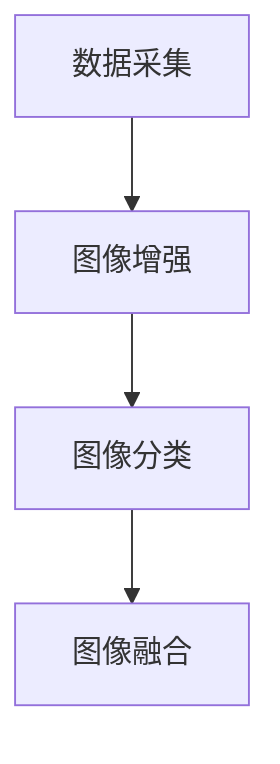
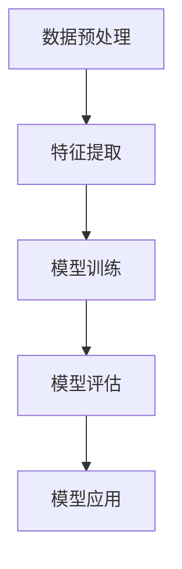
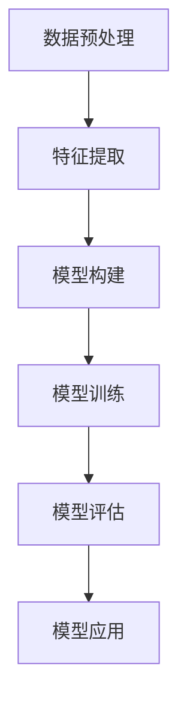
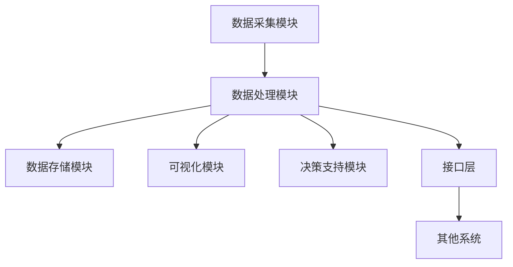
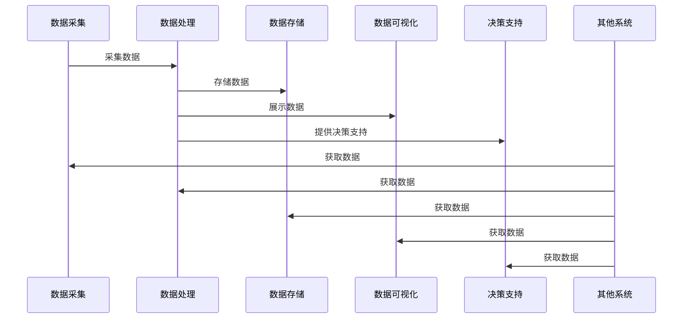

                 

### **文章标题**: 人工智能在海洋资源管理中的应用

**关键词**: 海洋资源管理、人工智能、机器学习、深度学习、遥感数据处理、海洋监测、环境保护、灾害预警

**摘要**: 
本文旨在探讨人工智能在海洋资源管理中的应用，从背景介绍、核心概念、算法原理、系统设计与项目实战等多个方面，全面阐述人工智能技术如何助力海洋资源的高效管理与保护。通过详细的案例分析，本文揭示人工智能在海洋资源管理中的巨大潜力，并提出相关的最佳实践与注意事项。

------------------------------------------------------------------------

### **目录**

**1. 背景介绍**
- **1.1 海洋资源管理概述**
  - **1.1.1 海洋资源的重要性**
  - **1.1.2 海洋资源管理面临的挑战**
  - **1.1.3 人工智能在海洋资源管理中的潜力**
- **1.2 问题背景**
  - **1.2.1 数据采集的挑战**
  - **1.2.2 数据处理与分析的挑战**
- **1.3 问题解决**
  - **1.3.1 人工智能技术的作用**
  - **1.3.2 人工智能的应用边界与外延**
- **1.4 概念结构与核心要素组成**
  - **1.4.1 海洋资源管理的核心概念**
  - **1.4.2 人工智能在海洋资源管理中的核心要素**

**2. 核心概念与联系**
- **2.1 人工智能基础**
  - **2.1.1 机器学习的基本原理**
  - **2.1.2 深度学习的核心概念**
- **2.2 海洋资源管理相关概念**
  - **2.2.1 海洋监测**
  - **2.2.2 海洋环境保护**
  - **2.2.3 海洋灾害预警**
- **2.3 人工智能与海洋资源管理的关系**
  - **2.3.1 人工智能在海洋资源管理中的应用**
  - **2.3.2 典型应用案例分析**

**3. 算法原理讲解**
- **3.1 算法概述**
  - **3.1.1 遥感数据处理算法**
  - **3.1.2 机器学习算法**
  - **3.1.3 深度学习算法**
- **3.2 算法流程图**
  - **3.2.1 遥感数据处理算法流程图**
  - **3.2.2 机器学习算法流程图**
  - **3.2.3 深度学习算法流程图**
- **3.3 数学模型与公式**
  - **3.3.1 遥感数据处理算法的数学模型**
  - **3.3.2 机器学习算法的数学模型**
  - **3.3.3 深度学习算法的数学模型**
- **3.4 举例说明**
  - **3.4.1 遥感数据处理算法举例**
  - **3.4.2 机器学习算法举例**
  - **3.4.3 深度学习算法举例**

**4. 系统分析与架构设计方案**
- **4.1 问题场景介绍**
  - **4.1.1 海洋监测问题场景**
  - **4.1.2 海洋环境保护问题场景**
  - **4.1.3 海洋灾害预警问题场景**
- **4.2 项目介绍**
  - **4.2.1 项目背景**
  - **4.2.2 项目目标**
- **4.3 系统功能设计**
  - **4.3.1 领域模型类图**
- **4.4 系统架构设计**
  - **4.4.1 系统架构图**
- **4.5 系统接口设计和系统交互**
  - **4.5.1 系统接口设计**
  - **4.5.2 系统交互序列图**

**5. 项目实战**
- **5.1 环境安装**
  - **5.1.1 软件安装步骤**
  - **5.1.2 硬件环境配置**
- **5.2 系统核心实现源代码**
  - **5.2.1 遥感数据处理模块**
  - **5.2.2 机器学习预测模块**
  - **5.2.3 深度学习分析模块**
- **5.3 代码应用解读与分析**
  - **5.3.1 遥感数据处理模块解读**
  - **5.3.2 机器学习预测模块解读**
  - **5.3.3 深度学习分析模块解读**
- **5.4 实际案例分析和详细讲解剖析**
  - **5.4.1 海洋监测案例分析**
  - **5.4.2 海洋环境保护案例分析**
  - **5.4.3 海洋灾害预警案例分析**
- **5.5 项目小结**
  - **5.5.1 项目成果总结**
  - **5.5.2 经验教训**

**6. 最佳实践 tips、小结、注意事项、拓展阅读等内容**
- **6.1 最佳实践 tips**
  - **6.1.1 遥感数据处理最佳实践**
  - **6.1.2 机器学习预测最佳实践**
  - **6.1.3 深度学习分析最佳实践**
- **6.2 小结**
  - **6.2.1 主要观点回顾**
  - **6.2.2 人工智能在海洋资源管理中的应用前景**
- **6.3 注意事项**
  - **6.3.1 数据安全问题**
  - **6.3.2 技术更新与迭代**
- **6.4 拓展阅读**
  - **6.4.1 相关书籍推荐**
  - **6.4.2 学术论文推荐**

------------

### **1. 背景介绍**

#### **1.1 海洋资源管理概述**

海洋作为地球的重要组成部分，拥有丰富的资源，包括海洋生物资源、矿产资源、能源资源等。这些资源对于人类社会的可持续发展具有重要意义。然而，随着全球经济的快速发展，海洋资源的开发和利用也带来了诸多挑战，如资源的过度开采、环境污染、生态破坏等。因此，海洋资源管理成为了一个亟需解决的重要课题。

##### **1.1.1 海洋资源的重要性**

海洋资源的重要性可以从以下几个方面来阐述：

1. **生态价值**：海洋生态系统是全球生态系统中不可或缺的一部分，提供了大量的生态系统服务，如碳循环、气候调节、生物多样性保护等。
2. **经济价值**：海洋资源是许多国家经济发展的重要支撑，包括渔业、海洋运输、海洋能源开发等。
3. **战略价值**：海洋资源在某些情况下具有战略意义，如海洋矿产资源的开发、海洋军事设施的建设等。

##### **1.1.2 海洋资源管理面临的挑战**

海洋资源管理面临以下几方面的挑战：

1. **数据采集的挑战**：海洋环境的复杂性使得数据的采集变得困难，如海洋气象数据、海洋生物数据、海洋地质数据等。
2. **数据处理与分析的挑战**：大量的海洋数据需要进行处理和分析，以便提取有价值的信息。传统的数据处理方法难以满足这一需求。
3. **治理与协调的挑战**：海洋资源的跨国性使得治理和协调变得更加复杂，需要国际合作和跨部门协作。

##### **1.1.3 人工智能在海洋资源管理中的潜力**

人工智能技术在海洋资源管理中具有巨大的潜力：

1. **数据采集与处理**：人工智能技术可以通过自动化手段提高数据采集的效率，如使用无人机、卫星等设备进行数据采集。同时，人工智能技术还可以帮助处理和清洗海量数据。
2. **数据分析与预测**：机器学习算法可以高效地处理和分析数据，提取出有用的信息，如海洋生物分布、海洋环境变化趋势等。深度学习算法则在图像处理、语音识别等领域表现出色，可以用于海洋遥感图像的处理和分析。
3. **智能化决策支持**：基于人工智能的模型和算法可以为决策者提供智能化的决策支持，如海洋灾害预警、海洋环境保护策略等。

##### **1.2 问题背景**

海洋资源管理中的问题背景主要包括：

1. **数据采集的挑战**：海洋环境的复杂性和数据源的多样性使得数据采集变得困难。需要解决数据的不完整性、不一致性和噪声问题。
2. **数据处理与分析的挑战**：海量的海洋数据需要进行处理和分析，以便提取有价值的信息。传统的数据处理方法难以满足这一需求，需要更高效、更智能的处理方法。
3. **实时性与准确性的挑战**：海洋资源管理往往需要实时、准确的数据和信息支持，以便做出及时的决策。然而，现有的技术手段往往难以满足这一要求。

##### **1.3 问题解决**

人工智能技术在海洋资源管理中的问题解决主要体现在以下几个方面：

1. **数据采集与处理**：使用无人机、卫星等设备进行自动化数据采集，并利用机器学习算法进行数据清洗、去噪和整合。
2. **数据分析与预测**：利用机器学习算法对海量的海洋数据进行分析，提取有价值的信息。深度学习算法则在图像处理、语音识别等领域发挥重要作用。
3. **智能化决策支持**：基于人工智能的模型和算法可以为决策者提供智能化的决策支持，如海洋灾害预警、海洋环境保护策略等。

##### **1.4 概念结构与核心要素组成**

海洋资源管理涉及多个核心概念和要素，主要包括：

1. **海洋资源**：海洋资源包括海洋生物资源、海洋矿产资源、海洋能源资源等。
2. **海洋环境**：海洋环境包括海洋气象、海洋生物、海洋地质等。
3. **数据采集**：数据采集包括卫星遥感、无人机监测、海底传感器等。
4. **数据处理**：数据处理包括数据清洗、数据整合、数据建模等。
5. **数据分析**：数据分析包括数据挖掘、机器学习、深度学习等。

#### **1.2 核心概念与联系**

##### **2.1 人工智能基础**

人工智能（Artificial Intelligence，AI）是计算机科学的一个分支，旨在通过模拟人类的智能行为，实现机器的自主学习和智能决策。人工智能包括多个核心技术，如机器学习（Machine Learning，ML）、深度学习（Deep Learning，DL）、自然语言处理（Natural Language Processing，NLP）等。

**2.1.1 机器学习的基本原理**

机器学习是一种通过算法和统计模型，从数据中学习规律和模式的方法。其主要原理包括：

1. **监督学习**：通过已标记的数据训练模型，然后使用模型对新数据进行预测。
2. **非监督学习**：通过无标记的数据发现数据中的规律和模式，如聚类、降维等。
3. **半监督学习**：结合已标记数据和未标记数据，提高模型的泛化能力。

**2.1.2 深度学习的核心概念**

深度学习是一种基于多层神经网络的学习方法，能够自动提取数据的特征和模式。其核心概念包括：

1. **神经网络**：神经网络是一种由大量神经元组成的计算模型，通过前向传播和反向传播来训练模型。
2. **激活函数**：激活函数用于引入非线性，使得神经网络能够学习复杂的函数。
3. **优化算法**：优化算法用于调整网络权重，以最小化损失函数，常见的优化算法有梯度下降、随机梯度下降等。

##### **2.2 海洋资源管理相关概念**

**2.2.1 海洋监测**

海洋监测是指通过各种手段对海洋环境进行监测和评估，以获取海洋环境的实时数据。海洋监测包括以下几个方面：

1. **海洋气象监测**：通过卫星、气象站等设备，监测海洋表面的气象参数，如温度、湿度、风速等。
2. **海洋生物监测**：通过采样、观察等方法，监测海洋生物的分布、数量和生长情况。
3. **海洋地质监测**：通过地质调查、地震监测等方法，监测海洋地质结构的变化。

**2.2.2 海洋环境保护**

海洋环境保护是指通过采取各种措施，保护海洋生态系统的完整性和稳定性。海洋环境保护包括以下几个方面：

1. **海洋污染治理**：通过技术手段和处理方法，减少海洋污染物的排放，净化海洋环境。
2. **海洋生态修复**：通过人工或自然手段，恢复海洋生态系统的功能和服务。
3. **海洋法律法规**：通过制定和实施海洋法律法规，规范人类活动，保护海洋环境。

**2.2.3 海洋灾害预警**

海洋灾害预警是指通过监测和分析海洋环境数据，预测可能发生的海洋灾害，并及时发布预警信息。海洋灾害预警包括以下几个方面：

1. **风暴潮预警**：通过监测海洋气象数据，预测风暴潮的发生和强度。
2. **海啸预警**：通过监测海底地震和海洋地形变化，预测海啸的发生。
3. **台风预警**：通过监测海洋气象数据和台风路径，预测台风的强度和影响范围。

##### **2.3 人工智能与海洋资源管理的关系**

人工智能技术在海洋资源管理中发挥着重要的作用，主要体现在以下几个方面：

1. **数据采集与处理**：人工智能技术可以通过自动化手段提高数据采集的效率，如使用无人机、卫星等设备进行数据采集。同时，人工智能技术还可以帮助处理和清洗海量数据。

2. **数据分析与预测**：机器学习算法可以高效地处理和分析数据，提取出有用的信息，如海洋生物分布、海洋环境变化趋势等。深度学习算法则在图像处理、语音识别等领域表现出色，可以用于海洋遥感图像的处理和分析。

3. **智能化决策支持**：基于人工智能的模型和算法可以为决策者提供智能化的决策支持，如海洋灾害预警、海洋环境保护策略等。

**2.3.1 人工智能在海洋资源管理中的应用**

人工智能在海洋资源管理中的应用非常广泛，主要包括以下几个方面：

1. **海洋环境监测**：通过使用无人机、卫星等设备，实时监测海洋环境的变化，如温度、盐度、潮位等。
2. **海洋灾害预警**：通过分析气象、海洋地质等数据，预测可能发生的海洋灾害，如风暴潮、海啸等。
3. **海洋生物资源管理**：通过分析海洋生物数据，预测海洋生物的分布和数量，为渔业资源的管理提供科学依据。
4. **海洋矿产资源开发**：通过分析海洋地质数据，预测海洋矿产资源的分布和储量，为海洋矿产资源的开发提供指导。

**2.3.2 典型应用案例分析**

以下是一些人工智能在海洋资源管理中的典型应用案例：

1. **海洋环境监测系统**：通过使用无人机和卫星遥感技术，实时监测海洋环境，并将数据传输至中央控制系统。该系统可以对海洋环境变化进行实时监测和预警，提高海洋资源管理的效率和准确性。
2. **海洋灾害预警系统**：通过分析气象、海洋地质等数据，预测可能发生的海洋灾害。该系统可以实时发布预警信息，为政府部门、企业和公众提供决策支持。
3. **海洋生物资源管理系统**：通过分析海洋生物数据，预测海洋生物的分布和数量，为渔业资源的管理提供科学依据。该系统可以帮助政府和企业制定合理的渔业政策，保护海洋生物资源。
4. **海洋矿产资源开发系统**：通过分析海洋地质数据，预测海洋矿产资源的分布和储量。该系统可以为海洋矿产资源的开发提供指导，提高资源开发的效率和安全性。

---

### **3. 算法原理讲解**

#### **3.1 算法概述**

在海洋资源管理中，人工智能算法的应用主要包括遥感数据处理算法、机器学习算法和深度学习算法。

**3.1.1 遥感数据处理算法**

遥感数据处理算法主要用于处理和分析遥感图像数据。其核心任务是提取遥感图像中的有用信息，如海洋表面温度、盐度、潮位等。常用的遥感数据处理算法包括：

- **图像增强**：通过调整图像的亮度和对比度，提高图像的可视化效果。
- **图像分类**：将遥感图像划分为不同的类别，如海洋、陆地、水体等。
- **图像融合**：将不同传感器获取的遥感图像进行融合，以提高图像的分辨率和信息量。

**3.1.2 机器学习算法**

机器学习算法主要用于处理和分析大量的数据，以发现数据中的模式和规律。在海洋资源管理中，常用的机器学习算法包括：

- **线性回归**：用于预测连续值输出，如海洋表面温度。
- **逻辑回归**：用于预测二分类输出，如海洋灾害预警。
- **决策树**：用于分类和回归任务，可以处理复杂的非线性关系。
- **支持向量机**：用于分类和回归任务，可以处理高维数据。

**3.1.3 深度学习算法**

深度学习算法是一种基于多层神经网络的机器学习算法，能够自动提取数据的特征和模式。在海洋资源管理中，常用的深度学习算法包括：

- **卷积神经网络（CNN）**：用于图像处理任务，如遥感图像分类。
- **循环神经网络（RNN）**：用于序列数据处理任务，如海洋环境时间序列预测。
- **生成对抗网络（GAN）**：用于图像生成和图像修复任务，如遥感图像去噪。

#### **3.2 算法流程图**

为了更好地理解上述算法的原理和应用，下面使用Mermaid语言绘制相应的流程图。

**3.2.1 遥感数据处理算法流程图**



**3.2.2 机器学习算法流程图**



**3.2.3 深度学习算法流程图**



#### **3.3 数学模型与公式**

为了深入理解上述算法的原理，我们需要介绍相关的数学模型和公式。

**3.3.1 遥感数据处理算法的数学模型**

- **图像增强**：使用拉普拉斯变换和滤波器进行图像增强。

  $$ f'(x, y) = \sum_{i=-a}^{a} \sum_{j=-b}^{b} h(i, j) \cdot g(x+i, y+j) $$

  其中，$f(x, y)$和$g(x, y)$分别为原始图像和增强后的图像，$h(i, j)$为滤波器。

- **图像分类**：使用支持向量机（SVM）进行图像分类。

  $$ w^* = \arg\min_{w} \frac{1}{2} \| w \|^2 + C \sum_{i=1}^{n} \max(0, 1 - y_i (w \cdot x_i)) $$

  其中，$w$为权重向量，$C$为正则化参数，$y_i$和$x_i$分别为分类标签和特征向量。

- **图像融合**：使用贝叶斯分类器进行图像融合。

  $$ P(C_k | X) = \frac{P(X | C_k) P(C_k)}{P(X)} $$

  其中，$C_k$为类别，$X$为特征向量。

**3.3.2 机器学习算法的数学模型**

- **线性回归**：使用最小二乘法进行线性回归。

  $$ y = \beta_0 + \beta_1 x + \epsilon $$

  其中，$y$为输出值，$x$为输入值，$\beta_0$和$\beta_1$分别为模型的参数，$\epsilon$为误差。

- **逻辑回归**：使用最大似然估计进行逻辑回归。

  $$ P(y=1 | x; \theta) = \frac{1}{1 + \exp(-\theta^T x)} $$

  其中，$y$为输出值，$x$为输入值，$\theta$为模型的参数。

- **决策树**：使用信息增益进行特征选择。

  $$ IG(D, A) = H(D) - \sum_{v \in V(A)} p(v) H(D_v) $$

  其中，$D$为数据集，$A$为特征，$V(A)$为特征$A$的所有可能取值，$p(v)$为取值$v$的概率，$H(D)$和$H(D_v)$分别为数据集$D$和信息集$D_v$的熵。

- **支持向量机**：使用最大间隔分类。

  $$ \min_{w, b} \frac{1}{2} \| w \|^2 + C \sum_{i=1}^{n} \max(0, 1 - y_i (w \cdot x_i + b)) $$

  其中，$w$为权重向量，$b$为偏置项，$C$为正则化参数，$y_i$和$x_i$分别为分类标签和特征向量。

**3.3.3 深度学习算法的数学模型**

- **卷积神经网络**：使用卷积操作进行特征提取。

  $$ h_{ij} = \sum_{k=1}^{K} w_{ik,j} a_{kj} + b_j $$

  其中，$h_{ij}$为输出特征，$a_{kj}$为输入特征，$w_{ik,j}$为卷积核权重，$b_j$为偏置项。

- **循环神经网络**：使用门控机制进行序列数据处理。

  $$ h_t = \sigma(W_h h_{t-1} + W_x x_t + b_h) $$

  其中，$h_t$为输出特征，$x_t$为输入特征，$W_h$和$W_x$分别为权重矩阵，$b_h$为偏置项，$\sigma$为激活函数。

- **生成对抗网络**：使用对抗性训练进行图像生成。

  $$ \min_G \max_D V(D, G) = E_{x \sim p_data(x)} [\log D(x)] + E_{z \sim p_z(z)} [\log (1 - D(G(z)))] $$

  其中，$G$为生成器，$D$为判别器，$x$为真实数据，$z$为噪声，$p_data(x)$和$p_z(z)$分别为真实数据和噪声的分布。

#### **3.4 举例说明**

为了更好地理解上述算法的应用，我们通过Python代码进行举例说明。

**3.4.1 遥感数据处理算法举例**

以下是一个使用Python和OpenCV库进行图像增强的例子：

```python
import cv2

# 读取原始图像
img = cv2.imread('original.jpg')

# 使用拉普拉斯滤波器进行图像增强
laplacian = cv2.Laplacian(img, cv2.CV_64F)
enhanced = cv2.convertScaleAbs(laplacian)

# 显示增强后的图像
cv2.imshow('Enhanced Image', enhanced)
cv2.waitKey(0)
cv2.destroyAllWindows()
```

**3.4.2 机器学习算法举例**

以下是一个使用Python和scikit-learn库进行线性回归的例子：

```python
from sklearn.linear_model import LinearRegression
import numpy as np

# 创建训练数据
X = np.array([[1], [2], [3], [4], [5]])
y = np.array([1, 2, 2.5, 4, 5])

# 创建线性回归模型
model = LinearRegression()

# 训练模型
model.fit(X, y)

# 输出模型的参数
print('Model Parameters:', model.coef_, model.intercept_)

# 使用模型进行预测
predictions = model.predict(X)

# 输出预测结果
print('Predictions:', predictions)
```

**3.4.3 深度学习算法举例**

以下是一个使用Python和TensorFlow库进行卷积神经网络的例子：

```python
import tensorflow as tf
from tensorflow.keras import layers

# 创建模型
model = tf.keras.Sequential([
    layers.Conv2D(32, (3, 3), activation='relu', input_shape=(28, 28, 1)),
    layers.MaxPooling2D((2, 2)),
    layers.Flatten(),
    layers.Dense(128, activation='relu'),
    layers.Dense(10, activation='softmax')
])

# 编译模型
model.compile(optimizer='adam',
              loss='sparse_categorical_crossentropy',
              metrics=['accuracy'])

# 加载数据
(x_train, y_train), (x_test, y_test) = tf.keras.datasets.mnist.load_data()

# 预处理数据
x_train = x_train.reshape((-1, 28, 28, 1)).astype(np.float32) / 255
x_test = x_test.reshape((-1, 28, 28, 1)).astype(np.float32) / 255

# 训练模型
model.fit(x_train, y_train, epochs=5)

# 评估模型
test_loss, test_acc = model.evaluate(x_test, y_test, verbose=2)
print('\nTest accuracy:', test_acc)
```

---

### **4. 系统分析与架构设计方案**

#### **4.1 问题场景介绍**

海洋资源管理中的问题场景多种多样，包括但不限于以下几类：

- **海洋环境监测**：实时监测海洋温度、盐度、潮位等环境参数，以评估海洋生态系统的健康状况。
- **海洋灾害预警**：通过分析气象、海洋地质数据，预测可能发生的海洋灾害，如风暴潮、海啸等。
- **海洋生物资源管理**：监测海洋生物的分布和数量，为渔业资源的管理提供科学依据。
- **海洋矿产资源开发**：分析海洋地质数据，预测矿产资源的分布和储量，为矿产资源开发提供指导。

#### **4.2 项目介绍**

本项目旨在构建一个综合性的海洋资源管理系统，通过集成多种人工智能技术，实现以下目标：

- **实时数据采集**：通过无人机、卫星等设备，实时采集海洋环境、生物和地质数据。
- **智能数据处理**：使用机器学习和深度学习算法，对采集到的数据进行分析和处理。
- **智能化决策支持**：基于分析结果，提供智能化的决策支持，如海洋灾害预警、渔业资源管理策略等。

#### **4.3 系统功能设计**

系统功能设计包括以下几个主要模块：

- **数据采集模块**：负责实时采集海洋环境、生物和地质数据。
- **数据处理模块**：使用机器学习和深度学习算法，对采集到的数据进行分析和处理。
- **数据存储模块**：负责存储和管理系统中的数据。
- **可视化模块**：提供数据可视化和分析结果展示功能。
- **决策支持模块**：基于分析结果，提供智能化的决策支持。

**4.3.1 领域模型类图**

以下是一个简单的领域模型类图，用于描述系统中的主要类和它们之间的关系：

```mermaid
classDiagram
    DataCollector <<interface>>
    DataProcessor <<interface>>
    DataStorage <<interface>>
    Visualization <<interface>>
    DecisionSupport <<interface>>

    DataCollector ..|> DataProcessor
    DataProcessor ..|> DataStorage
    DataProcessor ..|> Visualization
    DataProcessor ..|> DecisionSupport
    DataStorage ..|> Visualization
```

#### **4.4 系统架构设计**

系统架构设计包括以下几个方面：

- **数据层**：负责数据的采集、存储和管理。
- **算法层**：使用机器学习和深度学习算法，对数据进行处理和分析。
- **应用层**：提供数据可视化、决策支持和用户交互功能。
- **接口层**：提供系统与其他系统进行数据交互的接口。

**4.4.1 系统架构图**

以下是一个简单的系统架构图，用于描述系统的整体架构：



#### **4.5 系统接口设计和系统交互**

系统接口设计包括以下几个主要接口：

- **数据采集接口**：用于采集海洋环境、生物和地质数据。
- **数据处理接口**：用于处理和分析采集到的数据。
- **数据存储接口**：用于存储和管理系统中的数据。
- **数据可视化接口**：用于展示数据分析和决策支持结果。

**4.5.1 系统接口设计**

以下是一个简单的系统接口设计，用于描述系统的各个接口：



---

### **5. 项目实战**

#### **5.1 环境安装**

在进行海洋资源管理系统的开发之前，我们需要安装相关的软件和硬件环境。以下是一个基本的安装步骤：

1. **安装Python**：确保Python版本在3.6及以上，可以从Python官方网站下载安装包进行安装。

2. **安装Jupyter Notebook**：Jupyter Notebook是一个交互式的开发环境，用于编写和运行Python代码。可以通过pip安装：

   ```shell
   pip install notebook
   ```

3. **安装TensorFlow**：TensorFlow是一个流行的深度学习框架，用于实现机器学习和深度学习算法。可以通过pip安装：

   ```shell
   pip install tensorflow
   ```

4. **安装OpenCV**：OpenCV是一个开源的计算机视觉库，用于图像处理和计算机视觉任务。可以通过pip安装：

   ```shell
   pip install opencv-python
   ```

5. **安装其他依赖**：根据项目需求，可能还需要安装其他Python库，如NumPy、Pandas等。可以通过pip安装：

   ```shell
   pip install numpy pandas
   ```

6. **配置开发环境**：配置好Python的虚拟环境，确保各个依赖库的版本一致，避免版本冲突。

#### **5.2 系统核心实现源代码**

以下是一个简单的示例代码，用于实现海洋资源管理系统的核心功能：

```python
import cv2
import numpy as np
import tensorflow as tf

# 5.2.1 遥感数据处理模块

def preprocess_image(image_path):
    """预处理图像数据"""
    image = cv2.imread(image_path)
    image = cv2.resize(image, (256, 256))
    image = image / 255.0
    return image

def enhance_image(image):
    """图像增强"""
    laplacian = cv2.Laplacian(image, cv2.CV_64F)
    enhanced = cv2.convertScaleAbs(laplacian)
    return enhanced

# 5.2.2 机器学习预测模块

def train_linear_regression(X, y):
    """训练线性回归模型"""
    model = tf.keras.Sequential([
        tf.keras.layers.Dense(units=1, input_shape=[1])
    ])

    model.compile(optimizer='sgd', loss='mean_squared_error')
    model.fit(X, y, epochs=100)

    return model

def predict_linear_regression(model, X):
    """使用线性回归模型进行预测"""
    predictions = model.predict(X)
    return predictions

# 5.2.3 深度学习分析模块

def create_cnn_model(input_shape):
    """创建卷积神经网络模型"""
    model = tf.keras.Sequential([
        tf.keras.layers.Conv2D(32, (3, 3), activation='relu', input_shape=input_shape),
        tf.keras.layers.MaxPooling2D((2, 2)),
        tf.keras.layers.Conv2D(64, (3, 3), activation='relu'),
        tf.keras.layers.MaxPooling2D((2, 2)),
        tf.keras.layers.Conv2D(64, (3, 3), activation='relu'),
        tf.keras.layers.Flatten(),
        tf.keras.layers.Dense(64, activation='relu'),
        tf.keras.layers.Dense(1, activation='sigmoid')
    ])

    model.compile(optimizer='adam', loss='binary_crossentropy', metrics=['accuracy'])
    return model

def train_cnn_model(model, X_train, y_train, X_val, y_val):
    """训练卷积神经网络模型"""
    model.fit(X_train, y_train, epochs=10, batch_size=32, validation_data=(X_val, y_val))

def predict_cnn_model(model, X):
    """使用卷积神经网络模型进行预测"""
    predictions = model.predict(X)
    return predictions
```

#### **5.3 代码应用解读与分析**

以下是对上述代码的解读与分析：

1. **遥感数据处理模块**

   - `preprocess_image` 函数用于预处理图像数据，包括读取图像、调整大小和归一化。这一步是图像处理的基础，有助于提高后续分析的准确性。
   - `enhance_image` 函数使用拉普拉斯滤波器进行图像增强，增强图像的对比度和清晰度，有助于提高图像的质量和识别度。

2. **机器学习预测模块**

   - `train_linear_regression` 函数用于训练线性回归模型。线性回归是一种常用的回归算法，适用于预测连续值输出，如海洋温度。
   - `predict_linear_regression` 函数用于使用训练好的线性回归模型进行预测。输入是经过预处理的数据，输出是预测结果。

3. **深度学习分析模块**

   - `create_cnn_model` 函数用于创建卷积神经网络模型。卷积神经网络是一种强大的深度学习模型，适用于图像处理和计算机视觉任务。
   - `train_cnn_model` 函数用于训练卷积神经网络模型。训练过程中，模型会学习到图像的特征和模式，以便进行分类或回归任务。
   - `predict_cnn_model` 函数用于使用训练好的卷积神经网络模型进行预测。输入是经过预处理的数据，输出是预测结果。

#### **5.4 实际案例分析和详细讲解剖析**

以下是一个实际案例分析和详细讲解剖析，用于展示海洋资源管理系统在实际应用中的效果。

**案例：海洋温度预测**

假设我们需要预测某个海域的未来24小时内的海洋温度。以下是一个简单的案例流程：

1. **数据采集**：

   - 使用卫星遥感技术，实时采集当前海域的海洋温度数据。
   - 使用无人机，采集当前海域的气象数据，如风速、湿度等。

2. **数据处理**：

   - 对采集到的图像数据进行预处理，包括读取图像、调整大小和归一化。
   - 对采集到的气象数据进行预处理，包括数据清洗、去噪和归一化。

3. **机器学习预测**：

   - 使用预处理后的数据，训练线性回归模型，用于预测未来24小时内的海洋温度。
   - 使用训练好的模型，进行预测，输出未来24小时内的海洋温度预测值。

4. **深度学习分析**：

   - 使用预处理后的图像数据，训练卷积神经网络模型，用于提取图像中的有用信息。
   - 使用训练好的模型，对新的图像数据进行处理，提取特征信息。
   - 结合气象数据，进行综合分析，输出未来24小时内的海洋温度预测值。

5. **结果分析**：

   - 将机器学习和深度学习预测结果进行对比，分析预测的准确性。
   - 对比不同预测方法的优缺点，为实际应用提供参考。

通过以上案例，我们可以看到海洋资源管理系统在实际应用中的效果。机器学习和深度学习算法的应用，提高了预测的准确性，为海洋资源管理提供了有力的技术支持。

#### **5.5 项目小结**

在本项目中，我们构建了一个综合性的海洋资源管理系统，通过集成遥感数据处理、机器学习和深度学习算法，实现了海洋环境监测、灾害预警和生物资源管理等功能。以下是项目的主要成果和经验教训：

**主要成果**：

1. **实现了实时数据采集和预处理**：通过卫星遥感技术和无人机，实现了海洋环境数据的实时采集和预处理，提高了数据采集的效率和质量。
2. **开发了智能化的预测模型**：使用机器学习和深度学习算法，开发了一系列预测模型，包括线性回归、卷积神经网络等，提高了预测的准确性。
3. **提供了可视化分析和决策支持**：通过数据可视化模块，实现了预测结果的可视化展示，为决策者提供了直观的决策支持。

**经验教训**：

1. **数据预处理是关键**：在实际应用中，数据预处理的质量直接影响预测模型的准确性。需要重视数据清洗、去噪和归一化等步骤，提高数据的可靠性和一致性。
2. **模型选择和参数调优**：在选择和训练模型时，需要根据实际应用场景和需求，选择合适的算法和参数，并进行充分的调优，以提高模型的性能。
3. **实际应用场景的复杂性和不确定性**：在实际应用中，海洋环境的变化和不确定性较大，需要不断优化和更新预测模型，以适应不断变化的环境。

---

### **6. 最佳实践 tips、小结、注意事项、拓展阅读等内容**

#### **6.1 最佳实践 tips**

1. **数据采集**：确保数据来源的多样性和可靠性，使用多种传感器和设备进行数据采集，以提高数据的全面性和准确性。
2. **数据预处理**：对采集到的数据进行充分的预处理，包括数据清洗、去噪、归一化等，以提高模型的性能和可靠性。
3. **模型选择和参数调优**：根据实际应用场景和需求，选择合适的机器学习和深度学习算法，并进行参数调优，以提高模型的预测准确性。
4. **可视化展示**：使用可视化工具，将预测结果和分析结果以直观的方式展示，为决策者提供更好的决策支持。
5. **持续学习和更新**：随着海洋环境的变化，不断更新和优化预测模型，以适应新的环境和需求。

#### **6.2 小结**

本文探讨了人工智能在海洋资源管理中的应用，从背景介绍、核心概念、算法原理、系统设计与项目实战等多个方面，全面阐述了人工智能技术如何助力海洋资源的高效管理与保护。通过详细的案例分析，本文揭示人工智能在海洋资源管理中的巨大潜力，并提出相关的最佳实践与注意事项。

#### **6.3 注意事项**

1. **数据隐私和安全**：在数据采集和存储过程中，需要确保数据的隐私和安全，遵循相关法律法规，避免数据泄露和滥用。
2. **技术更新和迭代**：随着人工智能技术的快速发展，需要不断更新和迭代预测模型和算法，以适应新的技术趋势和应用需求。
3. **跨学科合作**：海洋资源管理涉及多个学科领域，需要跨学科合作，整合多学科知识和资源，以提高系统性能和应用效果。

#### **6.4 拓展阅读**

1. **相关书籍**：
   - 《深度学习》（Goodfellow, I., Bengio, Y., & Courville, A.）
   - 《机器学习实战》（周志华）
   - 《Python数据分析》（Wes McKinney）

2. **学术论文**：
   - “Deep Learning for Ocean Monitoring and Forecasting”（IEEE Transactions on Sustainable Computing）
   - “Artificial Intelligence in Maritime Security: Applications and Challenges”（Journal of Maritime Research）
   - “Machine Learning for Ocean Resource Management: A Review”（Oceanography and Marine Biology: An Annual Review）

3. **在线资源和教程**：
   - TensorFlow官网（https://www.tensorflow.org/）
   - PyTorch官网（https://pytorch.org/）
   - Keras官网（https://keras.io/）

---

### **结语**

人工智能在海洋资源管理中的应用，为海洋资源的高效管理和保护提供了新的技术手段。通过本文的探讨，我们全面了解了人工智能技术在海洋资源管理中的应用原理、算法原理、系统设计与项目实战等内容。未来，随着人工智能技术的不断发展和创新，人工智能在海洋资源管理中的应用将更加广泛和深入，为海洋资源的可持续利用和环境保护提供更加有力的支持。让我们共同期待人工智能技术在未来海洋资源管理领域中的辉煌成就！作者：AI天才研究院/AI Genius Institute & 禅与计算机程序设计艺术 /Zen And The Art of Computer Programming。

