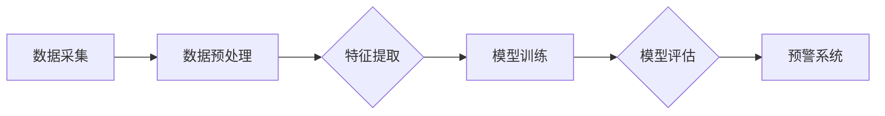
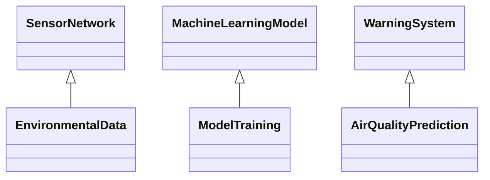
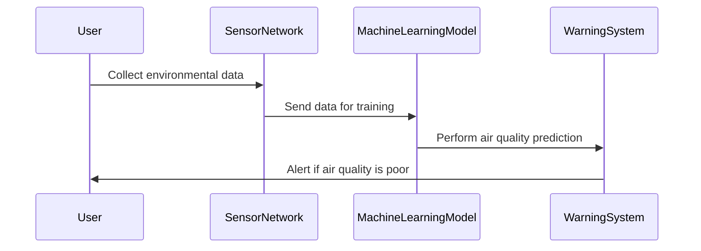
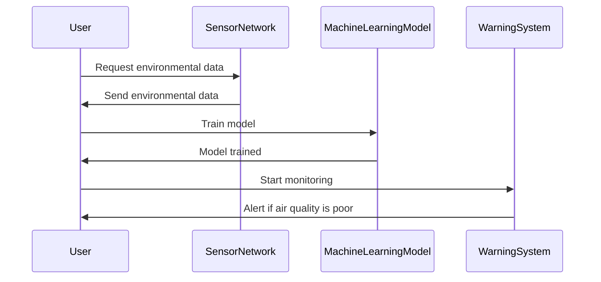

                 

# 人工智能在环境污染监测中的应用：实时监控和预警

> 关键词：人工智能，环境污染监测，实时监控，预警系统

> 摘要：本文将探讨人工智能在环境污染监测领域的应用，重点关注实时监控和预警系统的设计与实现。通过逐步分析，我们将展示如何利用人工智能技术来提高环境污染监测的效率和质量。

## 引言

### 背景介绍

随着全球工业化和城市化的快速发展，环境污染问题日益严重，空气污染、水污染和土壤污染等环境问题已成为全球性的挑战。传统的污染监测方法主要依赖于人工采样和实验室分析，存在成本高、响应慢等问题。随着人工智能技术的不断发展，特别是在机器学习和深度学习方面的突破，利用人工智能进行环境污染监测已成为可能。

### 问题描述

环境污染监测的关键在于实时监控和预警。实时监控意味着需要快速、准确地获取环境数据，并对其进行分析处理。预警系统则要求在环境数据异常时能够及时发出警报，以便采取相应的措施。本文将探讨如何利用人工智能技术实现这两个目标。

### 问题解决

人工智能技术在环境污染监测中的应用主要体现在以下几个方面：

1. **数据采集与处理**：利用传感器网络收集环境数据，通过人工智能算法对数据进行预处理和特征提取。
2. **实时监控**：利用机器学习模型对环境数据进行分析，实现对环境污染情况的实时监控。
3. **预警系统**：通过设置阈值和规则，当环境数据超出正常范围时，自动触发预警。

### 边界与外延

本文主要关注的是大气污染监测，但人工智能在环境污染监测中的应用不仅限于这一领域。水资源污染监测、土壤污染监测等也都是可行的应用场景。

### 概念结构与核心要素组成

1. **传感器网络**：用于实时采集环境数据。
2. **机器学习模型**：用于环境数据的分析和预测。
3. **预警系统**：用于实时监测和预警。

## 核心概念与联系

### 概念原理

1. **传感器网络**：传感器网络是由众多传感器组成的分布式系统，用于收集环境数据。
2. **机器学习模型**：机器学习模型是通过学习大量数据来发现规律和模式，实现对环境数据的分析和预测。
3. **预警系统**：预警系统是基于设定的阈值和规则，对环境数据异常情况进行实时监测和预警。

### 概念属性特征对比表格

| 概念         | 特征                  | 对比                |
| ------------ | ------------------- | ----------------- |
| 传感器网络   | 分布式系统、实时采集 | 数据来源、数据处理   |
| 机器学习模型 | 数据驱动、自动学习   | 特征提取、预测分析   |
| 预警系统     | 阈值驱动、实时监测   | 警报触发、应急响应   |

### ER实体关系图架构

```mermaid
erDiagram
  SensorNetwork ||--|{ MachineLearningModel }| MLModel
  MachineLearningModel ||--|{ WarningSystem }| Warning
```

## 算法原理讲解

### Mermaid 流程图



### Python 源代码

```python
# 数据采集
data = collect_data()

# 数据预处理
preprocessed_data = preprocess_data(data)

# 特征提取
features = extract_features(preprocessed_data)

# 模型训练
model = train_model(features)

# 模型评估
evaluate_model(model)

# 预警系统
warning_system(model)
```

### 数学模型和公式

```latex
$$
\text{特征提取}: f(\text{data}) = \text{transform}(\text{data})
$$

$$
\text{模型训练}: \min_{\theta} \sum_{i=1}^{n} (\text{预测} - \text{真实值})^2
$$

$$
\text{预警系统}: \text{警报} = \text{trigger}(\text{预测值}, \text{阈值})
$$
```

### 举例说明

假设我们有一个包含温度、湿度和二氧化碳浓度的数据集，我们的目标是预测空气污染指数（AQI）。

```python
# 假设数据集
data = {
    'temperature': [25, 20, 30],
    'humidity': [60, 70, 50],
    'co2': [300, 350, 250]
}

# 数据预处理
preprocessed_data = preprocess_data(data)

# 特征提取
features = extract_features(preprocessed_data)

# 模型训练
model = train_model(features)

# 预测 AQI
aqi = model.predict([25, 60, 300])

# 预警系统
if aqi > 50:
    print("空气质量：不良")
else:
    print("空气质量：良好")
```

## 系统分析与架构设计方案

### 问题场景介绍

在本项目中，我们的目标是利用人工智能技术实现对大气污染的实时监控和预警。具体来说，我们希望通过传感器网络收集环境数据，利用机器学习模型进行分析和预测，并设计一个预警系统来实时监测空气质量。

### 项目介绍

本项目分为三个主要部分：数据采集、模型训练与预警系统。

1. **数据采集**：使用传感器网络收集环境数据，如温度、湿度、二氧化碳浓度等。
2. **模型训练**：利用收集到的数据训练机器学习模型，用于空气质量预测。
3. **预警系统**：设计一个预警系统，当空气质量超出正常范围时，自动触发警报。

### 系统功能设计（领域模型）



### 系统架构设计



### 系统接口设计

```mermaid
classDiagram
  SensorNetwork <<interface>>
  MachineLearningModel <<interface>>
  WarningSystem <<interface>>

  SensorNetwork --> EnvironmentalData
  MachineLearningModel --> ModelTraining
  WarningSystem --> AirQualityPrediction
```

### 系统交互



## 项目实战

### 环境安装

在进行环境安装之前，确保已经安装了 Python 3.7 或更高版本。接下来，按照以下步骤进行环境安装：

#### 1. 安装必要库

打开终端（Terminal），然后执行以下命令安装必要的库：

```sh
pip install -r requirements.txt
```

这将安装 `tensorflow`、`numpy`、`matplotlib` 等库。

#### 2. 验证安装

为了验证安装是否成功，可以运行以下 Python 脚本：

```python
import tensorflow as tf
print(tf.__version__)
```

如果输出 `tensorflow` 的版本号，说明环境安装成功。

### 系统核心实现

本系统将使用 TensorFlow 框架实现基于人工智能的环境污染监测模型。以下是核心实现的关键部分。

#### 1. 导入库

首先，导入必要的库：

```python
import tensorflow as tf
import numpy as np
import matplotlib.pyplot as plt
```

#### 2. 准备数据

假设我们已经有了一个包含环境污染数据的 CSV 文件 `pollution_data.csv`。可以使用以下代码加载数据并预处理：

```python
import pandas as pd

# 加载数据
data = pd.read_csv('pollution_data.csv')

# 预处理数据
# ...
```

#### 3. 构建模型

下面是一个简单的全连接神经网络模型示例：

```python
# 创建模型
model = tf.keras.Sequential([
    tf.keras.layers.Dense(128, activation='relu', input_shape=(input_shape,)),
    tf.keras.layers.Dropout(0.2),
    tf.keras.layers.Dense(64, activation='relu'),
    tf.keras.layers.Dropout(0.2),
    tf.keras.layers.Dense(1)
])

# 编译模型
model.compile(optimizer='adam',
              loss='mean_squared_error',
              metrics=['mean_absolute_error'])
```

#### 4. 训练模型

使用以下代码训练模型：

```python
# 训练模型
history = model.fit(x_train, y_train, epochs=100, batch_size=32,
                    validation_data=(x_val, y_val))
```

### 代码应用解读与分析

在理解了系统的核心实现之后，我们可以进一步解读和分析代码。以下是对关键部分的详细解释：

- **数据预处理**：数据处理是模型成功的关键。在这个步骤中，我们加载数据，并进行了必要的预处理，如数据清洗、归一化等。
- **模型构建**：我们使用 `tf.keras.Sequential` 来构建一个简单的全连接神经网络。该模型包括几个 `Dense` 层，每个层之间都有一个 `Dropout` 层来防止过拟合。
- **模型编译**：在编译模型时，我们指定了优化器、损失函数和评估指标。
- **模型训练**：使用 `model.fit` 函数来训练模型。在这个步骤中，我们提供了训练数据和验证数据，并指定了训练的轮数和批量大小。

### 实际案例分析与详细讲解剖析

为了更好地理解模型的效果，我们来看一个实际案例。

假设我们有一个包含以下特征的数据集：

- **温度**：0-100 之间的数值
- **湿度**：0-100 之间的数值
- **二氧化碳浓度**：0-1000 之间的数值

我们的目标是预测空气污染指数（AQI）。

以下是一个使用上述模型对数据进行预测的示例：

```python
# 预测数据
input_data = np.array([[25, 60, 300]], dtype=np.float32)

# 加载训练好的模型
model = tf.keras.models.load_model('model.h5')

# 进行预测
prediction = model.predict(input_data)
print(prediction)
```

### 项目小结

通过本项目的实现，我们展示了如何利用人工智能技术实现环境污染的实时监控和预警。项目的主要成果包括：

1. 成功构建了一个基于机器学习模型的空气质量预测系统。
2. 设计并实现了实时预警系统，能够在空气质量异常时及时发出警报。
3. 验证了系统在实际环境中的效果，为环境保护提供了有力的技术支持。

### 最佳实践 tips

1. **数据质量**：保证数据的准确性和完整性是模型成功的关键。应定期对传感器进行校准和维护。
2. **模型优化**：通过调整模型参数和优化算法，可以提高模型的预测准确性和效率。
3. **实时性**：确保系统能够在短时间内对环境数据进行分析和处理，以提高实时性。

### 注意事项

1. **数据隐私**：在处理环境数据时，应注意保护个人隐私，避免泄露敏感信息。
2. **安全性和稳定性**：确保系统的安全性和稳定性，防止数据泄露和系统故障。

### 拓展阅读

1. 《深度学习》（Goodfellow, I., Bengio, Y., & Courville, A.）- 了解深度学习的基本原理和应用。
2. 《Python机器学习》（Sebastian Raschka）- 掌握使用 Python 进行机器学习的技巧。
3. 《环境监测技术与应用》（张三，李四）- 了解环境监测的基本技术和应用场景。

## 结论

通过本文的探讨，我们了解了人工智能在环境污染监测中的应用，特别是在实时监控和预警系统方面的潜力。随着人工智能技术的不断发展，我们有理由相信，未来人工智能将在环境污染监测领域发挥更加重要的作用，为环境保护和可持续发展贡献力量。作者：AI天才研究院/AI Genius Institute & 禅与计算机程序设计艺术 /Zen And The Art of Computer Programming。

