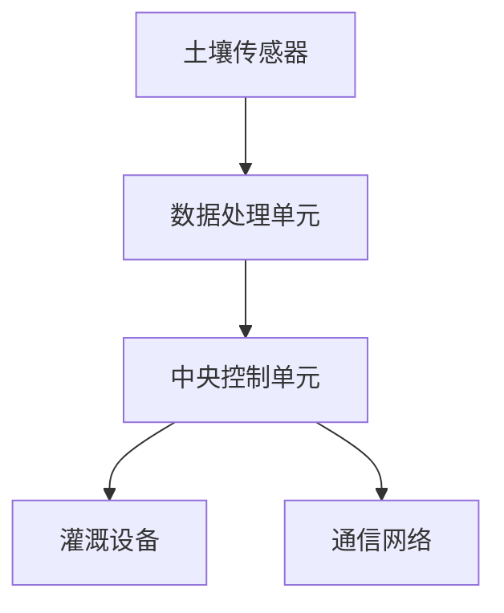
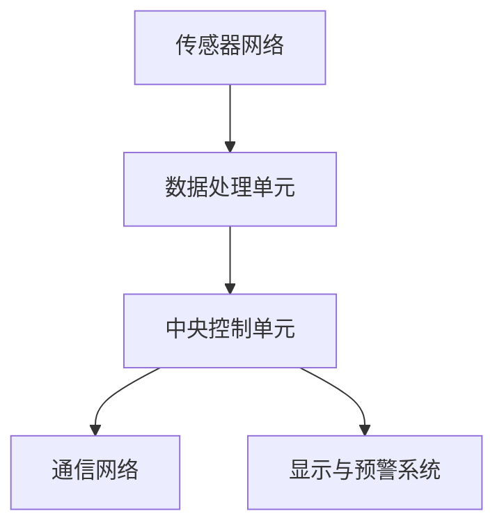
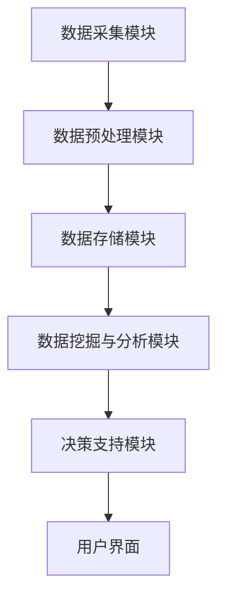

                 

## 人工智能在精准农业中的应用前景

### 关键词
- 人工智能
- 精准农业
- 数据分析
- 农业自动化
- 智能决策

### 摘要
本文将探讨人工智能在精准农业中的应用前景。通过引入人工智能技术，农业领域将实现更加高效、精准的生产和管理模式。本文首先介绍精准农业的概念和背景，然后深入分析人工智能技术在农业中的具体应用，包括数据收集与处理、作物生长监测、病虫害防治、灌溉管理等。最后，本文将对人工智能在精准农业中的未来发展进行展望，并提出可能面临的挑战。

### 引言

#### 精准农业的现状与挑战

精准农业（Precision Agriculture）是指通过应用现代信息技术、遥感技术和地理信息系统，实现农业生产各个环节的精细化管理，以达到资源利用最大化、生产效率最高化和环境保护最优化的目标。精准农业的核心在于利用数据驱动决策，通过实时监测和分析作物生长环境、土壤质量、气象条件等信息，为农民提供科学的种植和管理方案。

当前，全球农业面临着土地资源减少、气候变化、水资源短缺和劳动力成本上升等一系列挑战。传统农业依靠经验进行种植和管理，效率低下且资源浪费严重。随着农业生产成本的不断上升，农民的收益也在逐渐下降。因此，亟需一种新的农业模式，以应对这些挑战。

#### 人工智能在农业中的应用

人工智能（Artificial Intelligence，AI）是计算机科学的一个分支，旨在模拟、延伸和扩展人的智能。在农业领域，人工智能的应用主要集中在数据收集与处理、作物生长监测、病虫害防治、灌溉管理等方面。

1. **数据收集与处理**
   人工智能可以处理和分析大量的农业数据，包括气象数据、土壤数据、作物生长数据等。通过大数据分析和机器学习技术，可以挖掘出隐藏在数据中的规律和趋势，为农业生产提供科学依据。

2. **作物生长监测**
   人工智能技术可以实时监测作物的生长状态，通过遥感技术和传感器技术获取作物生长环境的数据，预测作物的生长趋势和产量。

3. **病虫害防治**
   人工智能可以帮助农民及时发现病虫害，并提供防治方案。通过图像识别和机器学习技术，可以快速识别病虫害的类型和程度，制定相应的防治措施。

4. **灌溉管理**
   人工智能可以根据土壤湿度、气象条件等因素，自动调整灌溉时间和水量，实现精准灌溉，减少水资源浪费。

#### 人工智能在精准农业中的优势

1. **提高生产效率**
   人工智能可以自动化完成许多农业生产环节，如播种、施肥、收割等，减少人力成本，提高生产效率。

2. **减少资源浪费**
   通过精准的数据分析和智能决策，可以优化农业资源的利用，减少化肥、农药和水资源的浪费。

3. **提升农产品质量**
   人工智能可以帮助农民实现科学种植和管理，提升农产品的产量和品质。

#### 本书结构安排

本书将分为五个部分进行探讨：

- **第一部分：引言**，介绍精准农业和人工智能在农业中的应用。
- **第二部分：人工智能基础**，讲解人工智能的基本理论和技术。
- **第三部分：人工智能在农业中的应用案例**，分析人工智能在农业中的具体应用。
- **第四部分：人工智能在精准农业中的应用**，深入探讨人工智能在农业生产中的具体应用场景。
- **第五部分：未来展望与挑战**，讨论人工智能在精准农业中的未来发展前景和面临的挑战。

通过本书的阅读，读者将全面了解人工智能在精准农业中的应用，掌握相关技术和方法，为推动农业现代化提供有力支持。

### 总结

在本文中，我们介绍了人工智能在精准农业中的应用前景，探讨了其在农业领域的具体应用和优势。通过人工智能技术，农业可以实现更加高效、精准和可持续的发展。然而，要实现这一目标，还需要克服许多技术和政策上的挑战。未来，人工智能将继续在农业领域发挥重要作用，推动农业现代化的进程。

### 学习目标与要求

- **理解精准农业的概念和背景**：通过本文的引言部分，读者应能够清晰地理解精准农业的定义、发展历程以及其在当前农业中的重要性。
- **掌握人工智能在农业中的应用**：本文详细介绍了人工智能在数据收集与处理、作物生长监测、病虫害防治、灌溉管理等方面的应用，读者应掌握这些技术的基本原理和实际应用场景。
- **了解人工智能在农业中的优势**：通过本文的讨论，读者应认识到人工智能在提高生产效率、减少资源浪费和提升农产品质量方面的显著优势。
- **具备分析人工智能在农业应用的能力**：本文提供了多个具体的应用案例，读者应能够运用所学的知识，分析人工智能在农业中的应用潜力和挑战。

### 未来的学习方向和建议

- **深入学习人工智能技术**：读者应继续学习人工智能的相关知识，包括机器学习、深度学习、数据挖掘等，以更好地理解和应用这些技术。
- **关注农业技术的最新发展**：农业技术不断进步，读者应关注相关领域的最新研究动态和技术应用。
- **实践项目**：通过实际项目，读者可以将所学的理论知识应用到实践中，提高解决实际问题的能力。

通过以上学习目标与要求，读者将能够全面掌握人工智能在精准农业中的应用，为农业现代化贡献力量。

### 人工智能基础理论

#### 人工智能的发展历程

人工智能（Artificial Intelligence，AI）作为计算机科学的一个分支，其发展历程可以追溯到20世纪50年代。以下是对人工智能发展历程的简要回顾：

1. **古典人工智能（Classical AI）**
   - **起源**：20世纪50年代，人工智能的概念首次被提出，旨在模拟和扩展人类的智能。
   - **代表性技术**：符号主义人工智能（Symbolic AI）通过使用逻辑和符号表示知识，试图实现智能推理。
   - **主要成就**：这个阶段取得了许多突破性成果，例如IBM的Deep Blue在1997年击败了国际象棋世界冠军加里·卡斯帕罗夫。

2. **机器学习（Machine Learning）**
   - **起源**：20世纪80年代，随着计算机性能的提升和大量数据的出现，机器学习开始得到广泛关注。
   - **核心概念**：机器学习是一种让计算机从数据中学习规律和模式的方法，无需显式编程。
   - **主要技术**：监督学习（Supervised Learning）、无监督学习（Unsupervised Learning）和强化学习（Reinforcement Learning）。
   - **主要成就**：机器学习在图像识别、语音识别和自然语言处理等领域取得了显著成果。

3. **深度学习（Deep Learning）**
   - **起源**：20世纪90年代，随着计算能力和算法的进步，深度学习开始兴起。
   - **核心概念**：深度学习是一种基于多层神经网络的学习方法，通过逐层提取特征，实现复杂模式的识别。
   - **主要技术**：卷积神经网络（CNN）、循环神经网络（RNN）和生成对抗网络（GAN）。
   - **主要成就**：深度学习在计算机视觉、语音识别和自然语言处理等领域取得了重大突破，例如AlphaGo在围棋比赛中击败人类顶尖选手。

#### 数据与模型

在人工智能领域，数据是基础，模型是关键。以下是对数据预处理、特征工程和模型选择与调优的介绍：

1. **数据预处理（Data Preprocessing）**
   - **数据清洗**：去除无效数据和噪声，保证数据质量。
   - **数据归一化**：将不同量纲的数据转换为相同的量纲，便于计算。
   - **数据划分**：将数据集划分为训练集、验证集和测试集，用于模型的训练和评估。

2. **特征工程（Feature Engineering）**
   - **特征提取**：从原始数据中提取有用的特征，有助于提高模型的性能。
   - **特征选择**：通过降维或选择关键特征，减少模型复杂度。
   - **特征组合**：将多个特征组合成新的特征，增强模型的解释能力。

3. **模型选择与调优（Model Selection and Tuning）**
   - **模型选择**：选择适合问题的模型，如线性回归、决策树、随机森林、神经网络等。
   - **超参数调优**：通过调整模型的超参数（如学习率、迭代次数等），优化模型性能。
   - **交叉验证**：使用交叉验证方法，避免模型过拟合和评估不准确。

#### 常见机器学习算法

在人工智能的实践中，常用的机器学习算法包括监督学习、无监督学习和强化学习。以下是对这些算法的简要介绍：

1. **监督学习（Supervised Learning）**
   - **概念**：监督学习是一种从标注数据中学习输出函数的方法。
   - **算法**：包括线性回归、逻辑回归、支持向量机（SVM）、决策树和随机森林等。
   - **应用**：用于分类和回归问题，如垃圾邮件分类、价格预测等。

2. **无监督学习（Unsupervised Learning）**
   - **概念**：无监督学习是在没有标注数据的情况下，从数据中发现隐藏模式的方法。
   - **算法**：包括聚类算法（如K-Means、层次聚类）、降维算法（如主成分分析PCA）和关联规则学习等。
   - **应用**：用于数据探索、图像分割、社交网络分析等。

3. **强化学习（Reinforcement Learning）**
   - **概念**：强化学习是一种通过奖励信号引导智能体学习策略的方法。
   - **算法**：包括Q-Learning、SARSA、深度强化学习（如DQN、PPO等）。
   - **应用**：用于游戏AI、自动驾驶、机器人控制等。

通过以上对人工智能基础理论的介绍，我们可以更好地理解其在农业中的应用，并为后续章节的深入探讨打下坚实的基础。

### 数据与模型

在人工智能的实践中，数据是基础，模型是核心。以下将对数据预处理、特征工程和模型选择与调优进行详细讲解。

#### 数据预处理

数据预处理是机器学习项目中的第一步，它包括以下关键步骤：

1. **数据清洗**：
   - **去除无效数据**：从数据集中移除那些缺失值、重复值或噪声值。
   - **填充缺失值**：使用均值、中位数或最近邻等方法填充缺失数据。
   - **去除重复值**：确保每个样本的唯一性，避免重复计算。

2. **数据归一化**：
   - **归一化**：将不同量纲的数据转换为相同的量纲，以避免模型因为数据量纲不同而产生偏差。
   - **标准化**：将数据缩放到特定范围，如0到1或-1到1，便于计算。

3. **数据划分**：
   - **训练集**：用于训练模型，占数据集的大部分。
   - **验证集**：用于模型调优和参数选择，通常占数据集的20%。
   - **测试集**：用于评估模型的最终性能，确保模型在未知数据上表现良好。

#### 特征工程

特征工程是提升模型性能的重要手段，主要包括以下步骤：

1. **特征提取**：
   - **数值特征**：通过计算统计量（如均值、方差）或使用数学变换（如对数变换）来提取特征。
   - **文本特征**：使用词袋模型、TF-IDF或Word2Vec等方法提取文本特征。

2. **特征选择**：
   - **过滤式特征选择**：通过统计方法（如皮尔逊相关系数、信息增益）筛选出重要特征。
   - **包裹式特征选择**：通过迭代搜索算法（如递归特征消除、选择效果最佳的k个特征）选择特征。
   - **嵌入式特征选择**：在模型训练过程中自动选择特征，如LASSO回归。

3. **特征组合**：
   - **特征交叉**：将多个特征组合成新的特征，提高模型的解释能力。
   - **特征融合**：通过结合不同来源的特征，增强模型的泛化能力。

#### 模型选择与调优

选择合适的模型并进行调优是确保模型性能的关键步骤，以下是相关内容：

1. **模型选择**：
   - **线性模型**：如线性回归、逻辑回归，适用于简单关系。
   - **树模型**：如决策树、随机森林，适用于中等复杂度的数据。
   - **神经网络**：如卷积神经网络（CNN）、循环神经网络（RNN），适用于复杂关系和大规模数据。

2. **超参数调优**：
   - **网格搜索**：通过遍历预设的参数组合，找到最优参数。
   - **贝叶斯优化**：通过建立模型性能与参数之间的概率关系，进行高效搜索。

3. **模型验证**：
   - **交叉验证**：通过将数据集划分为多个子集，多次训练和验证模型，提高模型的泛化能力。
   - **K折交叉验证**：将数据集分为K个子集，每次使用一个子集作为验证集，其余作为训练集，共进行K次。

#### 算法原理与案例

下面以一个具体的机器学习算法——K-Means聚类为例，讲解其原理、流程和Python实现。

##### K-Means聚类原理

K-Means是一种无监督学习算法，用于将数据集划分为K个簇，使得每个簇内的数据点尽可能接近，而簇与簇之间的数据点尽可能远。

1. **目标函数**：最小化每个簇内数据点的平均距离平方和。
2. **流程**：
   - **初始化**：随机选择K个初始中心点。
   - **分配**：将每个数据点分配到最近的中心点所在的簇。
   - **更新**：重新计算每个簇的中心点。
   - **迭代**：重复分配和更新步骤，直至收敛。

##### K-Means聚类流程

以下是一个简单的K-Means聚类流程：

1. **数据准备**：假设我们有一个包含100个数据点的二维数据集。
2. **初始化中心点**：随机选择5个数据点作为初始中心点。
3. **分配数据点**：计算每个数据点到5个中心点的距离，并将其分配到最近的簇。
4. **更新中心点**：计算每个簇内数据点的平均值，作为新的中心点。
5. **迭代**：重复分配和更新步骤，直至簇中心点不再变化或达到预设的迭代次数。

##### Python实现

```python
from sklearn.cluster import KMeans
import numpy as np

# 生成示例数据
data = np.random.rand(100, 2)

# 创建KMeans模型
kmeans = KMeans(n_clusters=5, random_state=0)

# 模型训练
kmeans.fit(data)

# 分配数据点
labels = kmeans.predict(data)

# 输出簇中心点
centroids = kmeans.cluster_centers_

# 打印结果
print("Cluster centers:", centroids)
print("Labels:", labels)
```

通过以上步骤，我们可以实现K-Means聚类，并对数据点进行分类。

##### 案例分析

假设我们有一个农田数据集，包含100个农田地块的数据，每个地块有土壤湿度、温度、光照等特征。我们希望使用K-Means聚类将农田地块分为5类，以识别出不同的农田管理区域。

1. **数据准备**：读取农田数据集，并进行数据预处理，如归一化处理。
2. **初始化模型**：设置K值为5，初始化KMeans模型。
3. **训练模型**：使用预处理后的数据训练模型。
4. **聚类分析**：使用模型对数据进行聚类，输出每个地块所属的簇。
5. **结果分析**：通过分析簇的特征，可以识别出土壤湿度较低、温度较高的农田区域，为科学管理提供依据。

通过K-Means聚类算法，我们可以对农田地块进行有效的分类和管理，实现精准农业的目标。

### 人工智能在农业中的应用案例

#### 预测作物产量

作物产量预测是精准农业中的重要应用之一，通过准确预测作物的产量，农民可以优化种植策略，提高农业生产效率。以下是一个关于预测作物产量的具体案例分析。

##### 案例背景

某农业企业拥有大规模的农田，种植小麦。为了提高产量，企业希望通过人工智能技术预测小麦产量，以便提前制定合理的种植和管理计划。

##### 数据收集与处理

为了预测小麦产量，需要收集以下数据：

1. **历史数据**：过去几年小麦的产量记录。
2. **气象数据**：包括温度、湿度、降雨量等。
3. **土壤数据**：土壤质量、土壤湿度、pH值等。
4. **种植数据**：种植密度、肥料使用量等。

收集数据后，需要进行数据预处理，包括：

1. **数据清洗**：去除缺失值和异常值。
2. **数据归一化**：将不同量纲的数据转换为相同的量纲，如将温度、湿度、降雨量等数据归一化到0-1之间。

##### 算法原理

作物产量预测通常采用机器学习中的回归算法，如线性回归、决策树回归等。以下是使用线性回归模型的算法原理和流程：

1. **线性回归模型**：假设作物产量 \( Y \) 与气象、土壤和种植数据 \( X \) 之间存在线性关系，即
   \[
   Y = \beta_0 + \beta_1X_1 + \beta_2X_2 + \ldots + \beta_pX_p + \epsilon
   \]
   其中，\( \beta_0 \) 为截距，\( \beta_1, \beta_2, \ldots, \beta_p \) 为系数，\( X_1, X_2, \ldots, X_p \) 为特征变量，\( \epsilon \) 为误差项。

2. **最小二乘法**：通过最小化残差平方和来估计模型参数，即
   \[
   \min \sum_{i=1}^n (y_i - (\beta_0 + \beta_1x_{i1} + \beta_2x_{i2} + \ldots + \beta_p x_{ip}))^2
   \]

3. **模型训练**：使用历史数据训练线性回归模型，通过梯度下降法或普通最小二乘法求解参数。

4. **模型评估**：使用验证集和测试集评估模型性能，如均方误差（MSE）。

##### Python实现

```python
import pandas as pd
from sklearn.linear_model import LinearRegression
from sklearn.model_selection import train_test_split
from sklearn.metrics import mean_squared_error

# 读取数据
data = pd.read_csv('crop_yield_data.csv')
X = data[['temperature', 'humidity', 'soilpH', 'plantDensity']]
y = data['yield']

# 数据划分
X_train, X_test, y_train, y_test = train_test_split(X, y, test_size=0.2, random_state=0)

# 创建线性回归模型
model = LinearRegression()

# 模型训练
model.fit(X_train, y_train)

# 模型预测
y_pred = model.predict(X_test)

# 评估模型
mse = mean_squared_error(y_test, y_pred)
print("MSE:", mse)
```

##### 案例分析

通过以上步骤，我们可以对小麦产量进行预测。在实际应用中，可以定期更新模型，以适应气候变化和种植策略的变化。预测结果可以用于调整肥料使用量、灌溉计划和种植密度，以提高产量和降低成本。

#### 病虫害检测与防治

病虫害是影响农作物产量和质量的重要因素。传统的方法依赖于人工巡查和经验判断，效率低下且难以全面覆盖。而人工智能技术在病虫害检测和防治方面具有显著优势，可以实现实时监测和智能决策。

##### 案例背景

某农业科技企业开发了一款基于人工智能的病虫害检测系统，用于监测农田中的病虫害，并提供防治方案。

##### 数据收集与处理

为了开发病虫害检测系统，需要收集以下数据：

1. **图像数据**：通过无人机或监控摄像头获取农田的图像数据。
2. **病虫害数据**：包括病虫害的种类、症状和发生时间等。

收集数据后，需要进行数据预处理，包括：

1. **图像预处理**：包括去噪、缩放、灰度转换等，以提高图像质量。
2. **标注数据**：对病虫害图像进行标注，标记病虫害的位置和类型。

##### 算法原理

病虫害检测通常采用图像识别和深度学习技术，以下是使用卷积神经网络（CNN）的算法原理和流程：

1. **卷积神经网络（CNN）**：CNN是一种用于图像识别的深度学习模型，通过多个卷积层、池化层和全连接层提取图像特征。
   
2. **数据增强**：通过旋转、翻转、缩放等操作增加数据多样性，提高模型泛化能力。

3. **模型训练**：使用预处理后的图像数据训练CNN模型，通过反向传播算法优化模型参数。

4. **模型评估**：使用测试集评估模型性能，如准确率、召回率等。

5. **预测与决策**：使用训练好的模型对新的农田图像进行预测，识别病虫害类型，并生成防治方案。

##### Python实现

```python
import tensorflow as tf
from tensorflow.keras.models import Sequential
from tensorflow.keras.layers import Conv2D, MaxPooling2D, Flatten, Dense

# 构建CNN模型
model = Sequential([
    Conv2D(32, (3, 3), activation='relu', input_shape=(128, 128, 3)),
    MaxPooling2D((2, 2)),
    Conv2D(64, (3, 3), activation='relu'),
    MaxPooling2D((2, 2)),
    Flatten(),
    Dense(64, activation='relu'),
    Dense(1, activation='sigmoid')
])

# 编译模型
model.compile(optimizer='adam', loss='binary_crossentropy', metrics=['accuracy'])

# 训练模型
model.fit(x_train, y_train, epochs=10, batch_size=32, validation_data=(x_test, y_test))

# 评估模型
test_loss, test_acc = model.evaluate(x_test, y_test)
print("Test accuracy:", test_acc)
```

##### 案例分析

通过以上步骤，我们可以实现病虫害的自动检测和防治。预测结果可以实时反馈给农民，帮助他们及时采取防治措施，减少损失。同时，系统还可以记录病虫害的发生数据，为未来预测提供参考。

### 土壤质量监测

土壤质量是影响作物生长和农产品质量的重要因素。传统的方法依赖于实验室检测和人工巡查，存在成本高、周期长等问题。而人工智能技术可以实现土壤质量的实时监测和智能分析，提高农业生产的精准度。

##### 案例背景

某农业科技公司开发了一套基于人工智能的土壤质量监测系统，通过传感器和遥感技术实时监测土壤质量，为农民提供科学的种植和管理建议。

##### 数据收集与处理

为了实现土壤质量监测，需要收集以下数据：

1. **土壤传感器数据**：包括土壤湿度、温度、pH值、电导率等。
2. **遥感数据**：包括多光谱图像、雷达图像等。
3. **气象数据**：包括温度、湿度、风速、降雨量等。

收集数据后，需要进行数据预处理，包括：

1. **数据清洗**：去除缺失值和异常值。
2. **数据归一化**：将不同量纲的数据转换为相同的量纲，如将温度、湿度、风速等数据归一化到0-1之间。

##### 算法原理

土壤质量监测通常采用机器学习和深度学习技术，以下是使用机器学习模型的算法原理和流程：

1. **特征提取**：从传感器数据和遥感数据中提取有用的特征，如土壤湿度、温度、多光谱图像的像素值等。
2. **模型训练**：使用机器学习算法（如决策树、随机森林、支持向量机等）训练模型，通过历史土壤质量数据预测当前土壤质量。
3. **模型评估**：使用验证集和测试集评估模型性能，如准确率、召回率等。
4. **预测与决策**：使用训练好的模型对新的土壤数据进行分析，预测土壤质量，并提供管理建议。

##### Python实现

```python
import pandas as pd
from sklearn.ensemble import RandomForestRegressor
from sklearn.model_selection import train_test_split
from sklearn.metrics import mean_squared_error

# 读取数据
data = pd.read_csv('soil_quality_data.csv')
X = data[['temperature', 'humidity', 'soilpH', 'conductivity', 'NDVI']]
y = data['soilQuality']

# 数据划分
X_train, X_test, y_train, y_test = train_test_split(X, y, test_size=0.2, random_state=0)

# 创建随机森林模型
model = RandomForestRegressor(n_estimators=100, random_state=0)

# 模型训练
model.fit(X_train, y_train)

# 模型预测
y_pred = model.predict(X_test)

# 评估模型
mse = mean_squared_error(y_test, y_pred)
print("MSE:", mse)
```

##### 案例分析

通过以上步骤，我们可以实现土壤质量的实时监测和预测。预测结果可以帮助农民及时调整种植策略和管理措施，如施肥量、灌溉计划等，以提高作物产量和品质。同时，系统还可以记录土壤质量的变化趋势，为长期土壤管理和可持续农业提供数据支持。

### 人工智能在灌溉管理中的应用

#### 灌溉管理现状与挑战

灌溉是农业中至关重要的环节，但传统灌溉方式往往存在资源浪费、效率低下等问题。传统灌溉方式主要包括以下几种：

1. **大水漫灌**：通过将水均匀地漫灌到整个农田，这种方式适用于大面积的农田，但容易导致水资源的浪费。
2. **滴灌**：通过管道将水直接输送到作物根部，这种方式具有较高的节水效果，但需要较高的安装和维护成本。
3. **喷灌**：通过喷头将水喷洒到农田上，这种方式适用于湿润的气候和地形，但水资源利用效率仍有待提高。

这些传统灌溉方式主要依赖于农民的经验和直觉，缺乏科学的数据分析和智能决策支持。随着农业现代化的发展，农民对精准灌溉的需求日益增加，而人工智能技术的引入为灌溉管理带来了新的机遇。

#### 人工智能在灌溉管理中的优势

1. **实时监测**：人工智能可以通过传感器和遥感技术实时监测土壤湿度、气象条件等数据，为精准灌溉提供科学依据。
2. **智能决策**：通过大数据分析和机器学习算法，人工智能可以预测作物需水量，并根据实时数据自动调整灌溉时间和水量，实现精准灌溉。
3. **节约资源**：精准灌溉可以显著减少水资源的浪费，提高水资源的利用效率，降低农业生产成本。
4. **提高产量**：通过科学合理的灌溉管理，可以优化作物生长环境，提高作物产量和品质。

#### 智能灌溉系统设计

一个智能灌溉系统通常包括以下几个关键组件：

1. **传感器**：用于监测土壤湿度、温度、水分蒸发等关键参数。
2. **数据处理单元**：接收传感器数据，进行初步处理和存储。
3. **中央控制单元**：根据传感器数据和预定的灌溉策略，自动调整灌溉设备的开启和关闭。
4. **灌溉设备**：包括滴灌、喷灌、微灌等设备，用于实现灌溉操作。
5. **通信网络**：用于数据传输和系统控制，包括有线和无线通信。

以下是一个典型的智能灌溉系统架构：



#### 技术实现

1. **传感器数据采集**：使用土壤湿度传感器、温度传感器等设备实时采集土壤数据，并通过无线通信模块将数据传输到中央控制单元。

2. **数据处理与存储**：数据处理单元对接收到的传感器数据进行预处理，如数据清洗、归一化等，并将处理后的数据存储在数据库中，以便后续分析和决策。

3. **智能决策与控制**：中央控制单元通过机器学习算法对传感器数据进行实时分析，预测作物需水量，并根据预定的灌溉策略自动调整灌溉设备的开启和关闭，实现精准灌溉。

4. **通信网络**：系统采用无线通信网络（如LoRa、ZigBee等）进行数据传输和控制，确保数据传输的实时性和可靠性。

#### 智能灌溉案例分析

以下是一个智能灌溉系统的实际应用案例：

**项目背景**：某农业企业拥有2000亩农田，传统灌溉方式水资源浪费严重，生产成本较高。

**技术实现**：
- **传感器部署**：在农田内布设土壤湿度传感器和温度传感器，每30分钟采集一次数据，并通过LoRa通信网络传输到中央控制单元。
- **数据处理与存储**：数据处理单元对接收到的传感器数据进行预处理和存储，确保数据质量。
- **智能决策**：中央控制单元通过机器学习算法分析传感器数据，预测作物需水量，并根据预定的灌溉策略自动调整灌溉设备。
- **灌溉控制**：根据预测结果，中央控制单元自动开启或关闭灌溉设备，实现精准灌溉。

**实施效果**：
- **水资源节约**：通过智能灌溉，企业水资源利用率提高了30%，灌溉用水量减少了约20%。
- **生产成本降低**：智能灌溉系统减少了人工巡查和维护成本，生产成本降低了15%。
- **作物产量提升**：作物产量平均提高了10%，部分作物产量提升了20%。

通过智能灌溉系统的应用，该农业企业实现了节水、降本、提效的目标，为现代农业的可持续发展提供了有力支持。

### 农田监测技术

农田监测是精准农业的重要组成部分，通过实时监测农田的状态和环境，农民可以做出科学的决策，提高作物产量和质量。农田监测技术主要包括传感器技术、遥感技术和物联网技术。

#### 传感器技术

传感器技术是农田监测的核心，它通过测量土壤湿度、温度、电导率、PH值等参数，提供作物生长所需的环境数据。

1. **土壤湿度传感器**：用于测量土壤的水分含量，常见的有电容式、电阻式和超声波传感器。
2. **温度传感器**：用于测量土壤和空气的温度，常见的有热电偶、热敏电阻等。
3. **电导率传感器**：用于测量土壤中的溶解盐含量，有助于判断土壤肥力。
4. **PH值传感器**：用于测量土壤的酸碱度，对作物生长有重要影响。

#### 遥感技术

遥感技术通过卫星、无人机等设备获取农田的图像和数据，可以提供大范围、高分辨率的农田监测数据。

1. **多光谱遥感**：使用多个光谱波段获取农田图像，有助于分析作物生长状况、病虫害等。
2. **雷达遥感**：通过雷达波穿透云层和植被，获取地下土壤信息。
3. **激光雷达**：通过发射激光束测量农田地形和植被高度，用于作物监测和产量预测。

#### 物联网技术

物联网技术将农田中的传感器、无人机、远程服务器等设备连接起来，形成一个智能监测网络。

1. **传感器网络**：通过传感器采集农田数据，并传输到中央控制单元。
2. **通信网络**：使用无线通信技术（如LoRa、ZigBee等）实现数据传输。
3. **云计算与大数据**：将农田数据进行云计算和分析，提供科学的决策支持。

#### 农田监测系统设计

一个农田监测系统通常包括以下几个关键组件：

1. **传感器网络**：包括土壤湿度传感器、温度传感器、电导率传感器、PH值传感器等。
2. **数据处理单元**：接收传感器数据，进行初步处理和存储。
3. **中央控制单元**：根据传感器数据和预设的算法，分析农田状态，提供决策支持。
4. **通信网络**：用于数据传输和系统控制，包括有线和无线通信。
5. **显示与预警系统**：将农田监测数据可视化，并在异常情况发生时发出预警。

以下是一个典型的农田监测系统架构：



#### 技术实现

1. **传感器数据采集**：在农田中布设传感器，实时采集土壤湿度、温度、电导率、PH值等数据。
2. **数据处理与存储**：数据处理单元对接收到的传感器数据进行预处理和存储，确保数据质量。
3. **数据传输与控制**：通过无线通信网络（如LoRa、ZigBee等）将数据传输到中央控制单元，并进行远程控制。
4. **数据分析和决策**：中央控制单元通过机器学习算法分析传感器数据，提供作物生长状态、病虫害预警、灌溉建议等决策支持。

#### 农田监测案例分析

以下是一个农田监测系统的实际应用案例：

**项目背景**：某农业企业拥有一片面积较大的农田，需要进行实时监测和管理。

**技术实现**：
- **传感器部署**：在农田内布设了土壤湿度传感器、温度传感器、电导率传感器和PH值传感器，每30分钟采集一次数据。
- **数据处理与存储**：数据处理单元对接收到的传感器数据进行预处理和存储，数据存储在云端数据库中。
- **数据分析和决策**：中央控制单元通过机器学习算法分析传感器数据，提供作物生长状态、病虫害预警、灌溉建议等。
- **预警系统**：系统在监测到异常情况时（如土壤湿度过低、病虫害发生等），通过短信或APP通知农民。

**实施效果**：
- **数据实时监控**：农民可以随时随地查看农田的实时状态，提高了管理的效率和精准度。
- **病虫害预警**：系统提前预警病虫害的发生，帮助农民及时采取措施，减少了损失。
- **灌溉优化**：根据土壤湿度数据，系统提供了精准的灌溉建议，减少了水资源的浪费。

通过农田监测系统的应用，该农业企业实现了作物生长的实时监控和科学管理，提高了生产效率和农产品质量。

### 农业数据管理

农业数据管理是精准农业的重要组成部分，它涉及数据的收集、存储、处理和分析等多个环节。以下将详细介绍农业数据的类型、收集与存储方法以及数据分析与挖掘技术。

#### 农业数据类型

农业数据类型多样，主要包括以下几类：

1. **气象数据**：包括温度、湿度、降雨量、风速等，这些数据对作物生长环境和病虫害发生有重要影响。
2. **土壤数据**：包括土壤湿度、土壤温度、土壤pH值、土壤电导率等，土壤数据对作物养分吸收和生长状况有直接影响。
3. **作物数据**：包括作物生长状态、病虫害情况、产量等，这些数据用于评估作物生长情况和制定管理策略。
4. **水文数据**：包括河流、湖泊、水库的水位、流量等，这些数据对灌溉和水资源管理有重要作用。
5. **农事操作数据**：包括播种、施肥、灌溉、收割等农事活动的记录，这些数据用于分析农事操作的效果和优化农业生产过程。
6. **环境数据**：包括空气质量、自然灾害、气候变化等，这些数据对农业可持续发展和农产品质量有重要影响。

#### 数据收集方法

农业数据的收集方法主要包括以下几种：

1. **传感器技术**：使用各种传感器（如土壤湿度传感器、温度传感器、气象站等）实时采集农田环境数据。
2. **遥感技术**：通过卫星、无人机等设备获取农田的大范围、高分辨率图像和数据。
3. **物联网技术**：将农田中的传感器设备通过物联网网络连接起来，实现数据的实时传输和监控。
4. **手动采集**：通过农技人员和农民手动记录农事操作和农作物的生长情况。
5. **数据库集成**：从不同的数据源（如气象站、土壤检测实验室等）收集数据，并集成到统一的数据库中。

#### 数据存储方法

农业数据的存储方法主要包括以下几种：

1. **关系数据库**：使用关系数据库（如MySQL、PostgreSQL等）存储结构化数据，如气象数据、土壤数据等。
2. **分布式数据库**：使用分布式数据库（如Hadoop、Spark等）处理和存储大规模的非结构化数据，如遥感图像、农事操作记录等。
3. **云存储**：将农业数据存储在云端，如AWS、Azure等，实现数据的高效管理和共享。
4. **数据湖**：使用数据湖（如Amazon S3、Google Cloud Storage等）存储大量原始数据，便于后续的数据分析和挖掘。

#### 数据分析与挖掘技术

农业数据的分析主要采用以下几种技术：

1. **统计分析**：使用统计分析方法（如回归分析、聚类分析等）对农业数据进行分析，发现数据中的规律和趋势。
2. **机器学习**：使用机器学习方法（如监督学习、无监督学习等）对农业数据进行分类、预测和聚类，提高数据处理的效率。
3. **数据挖掘**：使用数据挖掘技术（如关联规则学习、文本挖掘等）挖掘农业数据中的隐藏信息和知识。
4. **深度学习**：使用深度学习模型（如卷积神经网络、循环神经网络等）对复杂农业数据进行分析和处理，实现自动化和智能化的农业数据管理。

#### 农业数据管理的意义

农业数据管理对于现代农业的发展具有重要意义：

1. **提高生产效率**：通过数据分析和挖掘，农民可以制定科学的种植和管理策略，提高作物产量和质量。
2. **节约资源**：通过监测和分析农业数据，可以优化灌溉、施肥等农事操作，节约水资源和化肥等资源。
3. **减少病虫害**：通过实时监测和数据分析，可以提前发现病虫害，及时采取措施，减少损失。
4. **促进可持续发展**：通过数据管理，可以实现农业生产的精细化、智能化，促进农业的可持续发展。

通过以上对农业数据管理的介绍，我们可以看到，农业数据管理是现代农业发展的重要支撑，通过科学的数据分析和智能决策，可以推动农业现代化的进程。

### 农业智能决策支持系统

农业智能决策支持系统（Intelligent Decision Support System for Agriculture，IDSSA）是精准农业的重要组成部分，通过数据分析和智能算法，为农民和农业企业提供科学的决策支持。以下将对农业智能决策支持系统的系统架构、技术实现和实际案例进行详细分析。

#### 系统架构

一个典型的农业智能决策支持系统包括以下几个主要组件：

1. **数据采集模块**：负责收集各类农业数据，包括气象数据、土壤数据、作物数据、农事操作数据等。数据来源包括传感器、遥感技术、物联网设备和手动采集等。

2. **数据预处理模块**：对收集到的数据进行清洗、归一化和去噪处理，确保数据的质量和一致性。

3. **数据存储模块**：将预处理后的数据存储在数据库中，以便后续的数据分析和挖掘。常用的数据库包括关系数据库（如MySQL、PostgreSQL）和分布式数据库（如Hadoop、Spark）。

4. **数据挖掘与分析模块**：采用机器学习、深度学习、统计分析等方法，对存储的数据进行挖掘和分析，提取出有价值的信息和知识。

5. **决策支持模块**：根据分析结果，生成决策建议，如作物种植方案、灌溉计划、病虫害防治方案等。

6. **用户界面**：提供直观的用户界面，使农民和农业企业能够方便地查看和分析数据，并接收决策建议。

以下是一个典型的农业智能决策支持系统架构：



#### 技术实现

1. **数据采集与预处理**：使用传感器技术和遥感技术实时采集农田数据，通过物联网网络传输到数据中心。数据预处理模块对数据进行清洗和归一化处理，确保数据质量。

2. **数据存储**：采用分布式数据库存储大量农业数据，如Hadoop的HDFS，确保数据的高效存储和管理。

3. **数据挖掘与分析**：采用机器学习算法（如K-Means、线性回归、决策树等）和深度学习模型（如卷积神经网络、循环神经网络等）对数据进行挖掘和分析。例如，使用K-Means聚类算法对农田进行分区，使用线性回归模型预测作物产量。

4. **决策支持**：根据分析结果，生成科学的决策建议。例如，根据土壤湿度数据和天气预报，自动调整灌溉计划；根据病虫害检测数据，提出防治方案。

5. **用户界面**：开发直观的用户界面，使农民和农业企业能够方便地查看数据和分析结果，接收决策建议。用户界面通常包括网页端和移动端应用。

#### 实际案例

以下是一个农业智能决策支持系统的实际应用案例：

**项目背景**：某农业企业希望优化灌溉管理，提高水资源利用效率。

**技术实现**：
- **数据采集**：在农田内布设土壤湿度传感器和气象站，实时采集土壤湿度、温度、降雨量、风速等数据。
- **数据预处理**：对采集到的数据进行清洗和归一化处理，确保数据质量。
- **数据存储**：将预处理后的数据存储在Hadoop的HDFS中，便于数据管理和分析。
- **数据挖掘与分析**：使用线性回归模型分析土壤湿度数据和天气预报，预测作物需水量，生成灌溉计划。
- **决策支持**：根据分析结果，自动调整灌溉设备的开启和关闭，实现精准灌溉。
- **用户界面**：开发网页端和移动端应用，使农民可以实时查看土壤湿度、灌溉计划和水资源利用情况。

**实施效果**：
- **水资源利用效率提高**：通过智能决策支持系统，企业水资源利用率提高了30%，灌溉用水量减少了约20%。
- **生产成本降低**：智能决策支持系统减少了人工巡查和维护成本，生产成本降低了15%。
- **作物产量提升**：作物产量平均提高了10%，部分作物产量提升了20%。

通过实际应用案例，我们可以看到，农业智能决策支持系统在提高水资源利用效率、降低生产成本和提升作物产量方面具有显著效果，为现代农业的可持续发展提供了有力支持。

### 人工智能在精准农业中的应用前景

#### 人工智能在农业领域的发展趋势

随着人工智能技术的不断进步，其在农业领域的应用也在逐步扩大和深化。以下是对未来人工智能在农业领域发展趋势的预测：

1. **大数据分析**：未来，农业将产生海量的数据，包括气象数据、土壤数据、作物数据、农事操作数据等。人工智能技术将利用大数据分析技术，挖掘数据中的价值，为农业提供科学的决策支持。

2. **智能监控与自动化**：人工智能技术将实现对农田环境的实时监控，包括土壤湿度、温度、光照、病虫害等。通过智能监控系统，农民可以远程监控作物生长状态，自动化调整灌溉、施肥等操作。

3. **精准种植**：人工智能技术将帮助农民实现精准种植，根据土壤、气候等条件，优化作物品种选择、种植密度、种植周期等，提高作物产量和品质。

4. **智能决策支持**：通过人工智能技术，农业企业将能够建立智能决策支持系统，根据实时数据和历史经验，提供科学的种植、灌溉、施肥、病虫害防治等方案。

5. **农业无人机与机器人**：农业无人机和机器人将广泛应用，用于农田监测、病虫害防治、播种、施肥、收割等操作，提高农业生产的效率和精度。

#### 人工智能在精准农业中的应用前景

1. **提高生产效率**：人工智能技术可以帮助农民实现精准种植、精准灌溉、精准施肥等，减少人力投入，提高农业生产效率。

2. **减少资源浪费**：通过人工智能技术，可以实现水资源的精准分配，减少化肥和农药的使用，降低环境污染。

3. **提升农产品质量**：人工智能技术可以实时监测作物生长状态，提供科学的管理方案，提升农产品的产量和品质。

4. **促进农业可持续发展**：人工智能技术可以帮助农业实现高效、可持续的发展，减少对自然资源的依赖，提高农业的生态效益。

#### 潜在挑战

尽管人工智能在精准农业中具有巨大的应用前景，但在实际应用中仍面临以下挑战：

1. **数据隐私与安全**：农业数据涉及农民的种植计划和产量数据，需要确保数据的安全和隐私。

2. **技术成熟度**：目前，人工智能技术在农业领域的应用仍处于发展阶段，需要不断提高技术成熟度和可靠性。

3. **农民接受度**：农民对新兴技术的接受度有限，需要通过培训和推广，提高他们对人工智能技术的认知和接受度。

4. **政策与法规**：需要制定相应的政策与法规，规范人工智能在农业领域的应用，保障农民的权益。

通过应对上述挑战，人工智能在精准农业中的应用前景将更加广阔，为农业现代化和可持续发展提供有力支持。

### 总结与展望

通过本文的详细探讨，我们系统地介绍了人工智能在精准农业中的应用前景、基础理论、应用案例、具体应用领域、数据管理以及未来展望。以下是本文的核心内容总结：

1. **人工智能在精准农业中的应用**：人工智能技术在精准农业中具有广泛的应用，包括数据收集与处理、作物生长监测、病虫害防治、灌溉管理等方面。通过应用人工智能，可以实现农业生产的高效、精准和可持续。

2. **基础理论**：本文详细介绍了人工智能的发展历程、数据与模型、常见机器学习算法等内容，为理解人工智能在农业中的应用奠定了理论基础。

3. **应用案例**：通过具体的应用案例，如作物产量预测、病虫害检测与防治、土壤质量监测等，展示了人工智能在农业生产中的实际效果和可行性。

4. **数据管理**：农业数据管理是精准农业的关键环节，本文介绍了农业数据的类型、收集与存储方法以及数据分析与挖掘技术，为科学管理农业数据提供了指导。

5. **未来展望**：人工智能在农业领域的发展趋势包括大数据分析、智能监控与自动化、精准种植等，这些技术将进一步提高农业生产效率，减少资源浪费，提升农产品质量。

6. **挑战与对策**：尽管人工智能在精准农业中具有巨大的应用前景，但仍面临数据隐私与安全、技术成熟度、农民接受度以及政策与法规等挑战。需要通过技术创新和政策支持，应对这些挑战。

在未来的发展中，人工智能将继续在精准农业中发挥重要作用。通过不断探索和优化，我们可以期待农业实现更加智能化、高效化的发展模式，为全球粮食安全和农业可持续发展做出贡献。

### 未来展望

#### 精准农业的发展趋势

随着人工智能技术的不断发展，精准农业将迈向更加智能化、自动化和高效化的阶段。以下是未来精准农业的发展趋势：

1. **智能化监测与诊断**：通过更先进的传感器和物联网技术，实现对农田环境的实时监测和数据分析，从而提供更精准的作物生长状态监测和病虫害诊断。

2. **智能决策支持**：人工智能技术将更加深入地应用于农业决策支持系统，通过大数据分析和机器学习算法，提供更科学、个性化的种植、灌溉、施肥、病虫害防治等方案。

3. **农业无人机与机器人**：农业无人机和机器人将得到更广泛的应用，用于播种、施肥、喷洒农药、收割等操作，提高农业生产的效率和精度。

4. **生态农业**：人工智能技术将帮助实现农业的可持续发展，通过优化资源利用和环境保护，推动生态农业的发展。

#### 人工智能在农业中的应用方向

1. **作物精准管理**：通过人工智能技术，实现作物精准管理，包括精准播种、精准施肥、精准灌溉等，以提高作物产量和品质。

2. **病虫害智能防控**：利用人工智能技术，实现病虫害的智能监测、预测和防控，减少农药使用，降低环境污染。

3. **水资源管理**：通过智能灌溉系统和水资源监测技术，优化水资源利用，实现精准灌溉，提高水资源利用效率。

4. **农业大数据分析**：通过大数据技术，对农业数据进行分析和挖掘，为农业企业提供科学的决策依据，优化农业生产管理。

5. **农业供应链优化**：利用人工智能技术，优化农业供应链管理，提高农产品的供应链效率，降低成本。

#### 应对策略与政策支持

为了充分发挥人工智能在精准农业中的应用潜力，需要从以下几个方面进行应对策略和政策支持：

1. **技术创新**：加强人工智能技术的研究和开发，提高技术在农业领域的成熟度和实用性。

2. **人才培养**：培养专业的农业人工智能人才，提高农业从业者的技术水平和认知能力。

3. **政策支持**：政府应制定支持农业人工智能发展的政策，包括资金支持、税收优惠、科研资助等。

4. **技术推广**：通过示范项目、培训和推广，提高农民对人工智能技术的接受度和应用能力。

5. **数据共享与开放**：建立农业数据共享平台，促进数据开放和共享，为人工智能技术提供丰富的数据资源。

通过以上策略和政策支持，可以加速人工智能在精准农业中的应用，推动农业现代化和可持续发展。未来，人工智能将助力农业实现高效、智能和绿色的发展，为全球粮食安全和农业发展做出更大贡献。

