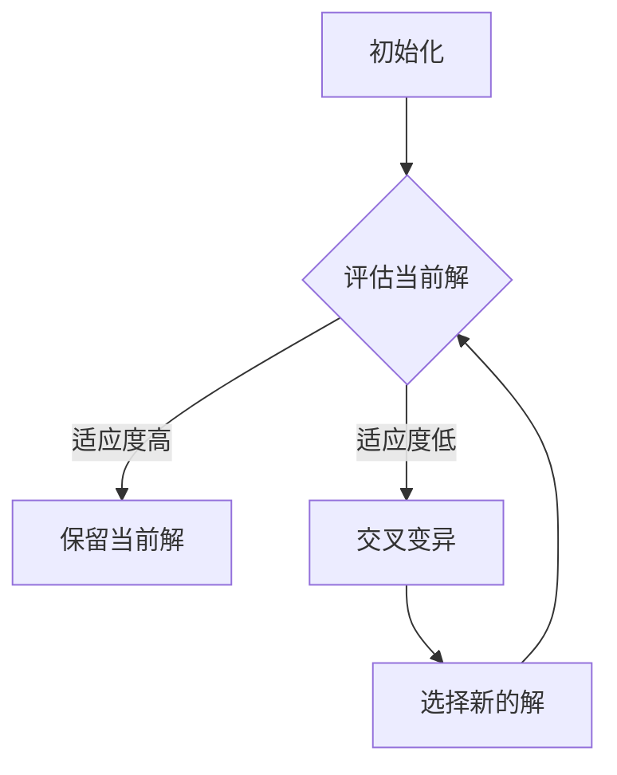
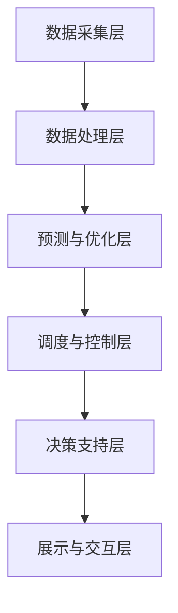
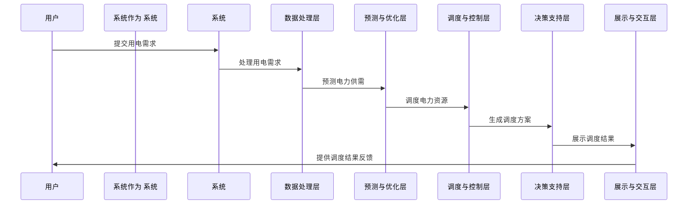

                 

# 人工智能在能源管理中的优化应用

## 关键词

- 人工智能
- 能源管理
- 优化算法
- 智能电网
- 可再生能源

## 摘要

随着全球能源需求的不断增长和能源危机的日益严峻，如何通过人工智能技术优化能源管理成为了一个热门话题。本文将探讨人工智能在能源管理中的应用，包括可再生能源管理、能源效率优化和智能电网等领域，通过分析核心概念、算法原理和实际案例，阐述人工智能在提升能源利用效率、降低能源消耗和实现可持续发展方面的巨大潜力。

## 背景介绍

### 问题背景

全球能源危机的加剧使得能源管理成为各国政府和企业关注的焦点。随着能源需求的持续增长，传统的能源管理模式已无法满足现代社会的需求。在此背景下，人工智能技术由于其强大的数据处理和分析能力，开始在能源管理领域展现其独特的优势。

### 问题描述

如何利用人工智能技术优化能源管理，提高能源利用效率，降低能源消耗，同时实现能源资源的合理配置和高效利用，是当前亟待解决的问题。

### 问题解决

通过引入人工智能算法，可以对能源生产、传输和消费过程进行实时监测和智能调控，从而实现能源资源的优化配置和高效利用。具体来说，人工智能可以在以下几个方面发挥作用：

1. **可再生能源管理**：通过预测可再生能源的产出，优化能源存储和分配策略，提高可再生能源的利用率。
2. **能源效率优化**：通过分析能源消耗数据，识别能源浪费点，提出节能方案，降低能源消耗。
3. **智能电网**：通过智能电网技术的应用，实现电力供需的实时平衡，提高电网的运行效率和稳定性。

### 边界与外延

本文的讨论范围主要涉及可再生能源管理、能源效率优化和智能电网等应用场景，但人工智能在能源管理中的应用不仅限于此，还可以扩展到能源交易、能效监测和能源规划等领域。

### 概念结构与核心要素组成

1. **人工智能**：一种模拟人类智能的技术，具有学习、推理、规划、感知和自适应等能力。
2. **能源管理**：涉及能源的采集、传输、存储和利用，目标是实现能源的高效、安全和经济使用。
3. **优化算法**：用于解决优化问题的算法，如遗传算法、神经网络等，能够在复杂环境中找到最优或近似最优的解。

## 核心概念与联系

### 人工智能

人工智能（Artificial Intelligence，AI）是一门研究、开发和应用使计算机系统表现出类似人类智能的技术科学。其基本原理包括：

1. **机器学习**：通过数据驱动的方式，使计算机系统具备学习能力。
2. **深度学习**：一种基于人工神经网络的机器学习方法，通过多层网络结构实现数据的自动特征提取。
3. **自然语言处理**：使计算机能够理解和生成自然语言，实现人机交互。

人工智能的应用领域广泛，包括语音识别、图像处理、自动驾驶、医疗诊断等。

### 能源管理

能源管理（Energy Management）是指对能源的采集、传输、存储和利用过程进行有效组织、协调和控制的过程。其目标是：

1. **提高能源效率**：通过技术和管理手段，减少能源浪费，提高能源利用效率。
2. **降低能源成本**：通过优化能源使用方式和结构，降低能源消耗成本。
3. **保障能源安全**：确保能源供应的稳定性和可靠性。

能源管理面临的挑战包括能源需求预测、能源供需平衡、能源污染控制等。

### 优化算法

优化算法（Optimization Algorithm）是用于解决优化问题的算法集合，包括：

1. **遗传算法**：模拟生物进化的过程，通过遗传操作寻找最优解。
2. **神经网络**：模拟人脑神经元的互联结构，通过学习实现复杂函数的映射。
3. **线性规划**：在约束条件下，寻找线性目标函数的最大值或最小值。

优化算法广泛应用于资源分配、调度优化、路径规划等领域。

## 算法原理讲解

### 算法mermaid流程图



### Python源代码

```python
import random

def cross(parent1, parent2):
    # 基因交叉操作
    pass

def mutate(child):
    # 基因变异操作
    pass

def fitness(solution):
    # 解的适应度评估
    pass

def genetic_algorithm():
    population = initialize_population()
    for generation in range(max_generations):
        new_population = []
        for individual in population:
            if fitness(individual) > threshold:
                new_population.append(individual)
            else:
                child = cross(random.choice(population), random.choice(population))
                mutate(child)
                new_population.append(child)
        population = new_population
    return best_individual(population)
```

### 数学模型和公式

$$
\begin{align*}
\text{适应度函数} & : f(x) = \frac{1}{1 + e^{-\beta(x-\bar{x})}} \\
\text{遗传操作} & : \text{交叉概率} p_c = \frac{2f_1f_2}{f_1 + f_2} \\
\text{变异操作} & : \text{变异概率} p_m = \frac{1}{\ln(2)}
\end{align*}
$$

### 详细讲解和举例说明

#### 遗传算法原理

遗传算法是一种基于自然选择和遗传学原理的优化算法。其基本思想是：

1. **初始化种群**：随机生成一定数量的初始解（个体）。
2. **适应度评估**：计算每个个体的适应度值，适应度值越高，表示个体越优秀。
3. **选择**：根据适应度值，选择优秀个体进入下一代。
4. **交叉**：将选出的个体进行基因交叉，产生新的个体。
5. **变异**：对个体进行基因变异，增加种群的多样性。
6. **迭代**：重复选择、交叉和变异过程，直到满足终止条件（如达到最大迭代次数或找到最优解）。

#### 举例说明

假设我们要优化一个函数 $f(x) = x^2$，目标是最小化 $f(x)$。

1. **初始化种群**：随机生成10个初始解，每个解表示为 $x$ 的值。
2. **适应度评估**：计算每个解的适应度值，适应度值越高表示解越优秀。
3. **选择**：选择适应度最高的两个解进行交叉操作。
4. **交叉**：将两个解的基因进行交换，产生新的解。
5. **变异**：对交叉后的解进行变异操作，增加种群的多样性。
6. **迭代**：重复选择、交叉和变异过程，直到找到最优解。

通过遗传算法，我们可以逐步找到函数的最小值，从而实现优化目标。

## 数学模型和数学公式 & 详细讲解 & 举例说明

### 使用latex格式

在本文中，我们将使用 LaTeX 格式来编写数学公式，以确保公式的正确性和美观性。

#### 段落内公式

$$
E = mc^2
$$

#### 独立段落公式

$$
\frac{d^2}{dx^2} (x^2) = 2
$$

### 数学模型和公式

在能源管理中，优化算法通常涉及以下数学模型和公式：

#### 适应度函数

$$
f(x) = \frac{1}{1 + e^{-\beta(x-\bar{x})}}
$$

其中，$x$ 表示个体的特征值，$\bar{x}$ 表示种群的平均特征值，$\beta$ 为调节参数。

#### 遗传操作

$$
\begin{align*}
p_c &= \frac{2f_1f_2}{f_1 + f_2} \\
p_m &= \frac{1}{\ln(2)}
\end{align*}
$$

其中，$p_c$ 为交叉概率，$p_m$ 为变异概率，$f_1$ 和 $f_2$ 分别为两个个体的适应度值。

### 详细讲解和举例说明

#### 适应度函数

适应度函数是遗传算法的核心，它用于评估个体的优劣。在能源管理中，适应度函数可以设计为：

$$
f(x) = \frac{1}{1 + e^{-\beta(x-\bar{x})}}
$$

其中，$x$ 表示个体的特征值，$\bar{x}$ 表示种群的平均特征值，$\beta$ 为调节参数。这个公式表示个体的适应度值与种群平均特征值的关系，$\beta$ 调节了适应度值的敏感度。

#### 遗传操作

遗传操作包括交叉和变异。交叉操作用于生成新的个体，变异操作用于增加种群的多样性。

1. **交叉操作**

交叉操作的基本原理是：从两个优秀个体中抽取部分基因进行交换，从而产生新的个体。交叉概率 $p_c$ 可以通过以下公式计算：

$$
p_c = \frac{2f_1f_2}{f_1 + f_2}
$$

其中，$f_1$ 和 $f_2$ 分别为两个个体的适应度值。

2. **变异操作**

变异操作的基本原理是：对个体进行随机修改，从而增加种群的多样性。变异概率 $p_m$ 可以通过以下公式计算：

$$
p_m = \frac{1}{\ln(2)}
$$

#### 举例说明

假设我们要优化一个函数 $f(x) = x^2$，目标是最小化 $f(x)$。

1. **初始化种群**：随机生成10个初始解，每个解表示为 $x$ 的值。
2. **适应度评估**：计算每个解的适应度值，适应度值越高表示解越优秀。
3. **选择**：选择适应度最高的两个解进行交叉操作。
4. **交叉**：将两个解的基因进行交换，产生新的解。
5. **变异**：对交叉后的解进行变异操作，增加种群的多样性。
6. **迭代**：重复选择、交叉和变异过程，直到找到最优解。

通过遗传算法，我们可以逐步找到函数的最小值，从而实现优化目标。

## 系统分析与架构设计方案

### 问题场景介绍

在智能电网领域，如何实现电力供需的实时平衡是一个重要的挑战。通过引入人工智能技术，可以实现对电力供需的智能调控，提高电网的运行效率和稳定性。

### 项目介绍

本项目旨在利用人工智能技术优化智能电网的运行管理，包括电力供需预测、调度优化和故障检测等功能。项目目标是实现电网的智能调度，提高电力供应的稳定性和可靠性。

### 系统功能设计

系统的核心功能包括：

1. **电力供需预测**：利用人工智能算法对未来的电力供需进行预测，为调度提供数据支持。
2. **调度优化**：根据电力供需预测结果，优化电力调度策略，实现电力资源的合理配置。
3. **故障检测**：利用人工智能算法对电网运行状态进行实时监控，及时发现故障并采取措施。

### 系统架构设计

系统架构设计如下：



### 系统接口设计和系统交互

系统接口设计和系统交互如下：



## 项目实战

### 环境安装

1. 安装 Python 环境（建议使用 Python 3.8 或更高版本）。
2. 安装必要的 Python 包，如 NumPy、Pandas、Scikit-learn 等。

```bash
pip install numpy pandas scikit-learn
```

### 系统核心实现源代码

```python
import numpy as np
import pandas as pd
from sklearn.ensemble import RandomForestRegressor

# 数据预处理
def preprocess_data(data):
    # 数据清洗、归一化等预处理操作
    return processed_data

# 预测电力供需
def predict_power_demand(data):
    # 利用随机森林算法进行预测
    model = RandomForestRegressor()
    model.fit(X_train, y_train)
    y_pred = model.predict(X_test)
    return y_pred

# 调度电力资源
def schedule_power_resources(demand):
    # 根据预测结果进行电力资源调度
    schedule = []
    for d in demand:
        if d > available_power:
            schedule.append('增加发电量')
        else:
            schedule.append('维持当前发电量')
    return schedule

# 主函数
def main():
    # 加载数据
    data = pd.read_csv('power_demand.csv')
    processed_data = preprocess_data(data)

    # 分割数据集
    X = processed_data.drop('demand', axis=1)
    y = processed_data['demand']
    X_train, X_test, y_train, y_test = train_test_split(X, y, test_size=0.2, random_state=42)

    # 预测电力供需
    demand_pred = predict_power_demand(X_test)

    # 调度电力资源
    schedule = schedule_power_resources(demand_pred)

    # 输出调度结果
    print(schedule)

if __name__ == '__main__':
    main()
```

### 代码应用解读与分析

1. **数据预处理**：对原始数据进行清洗、归一化等处理，以提高模型的预测效果。
2. **预测电力供需**：利用随机森林算法对电力供需进行预测。随机森林算法是一种集成学习算法，能够处理高维数据和噪声数据，具有良好的预测性能。
3. **调度电力资源**：根据预测结果，对电力资源进行调度。调度策略包括增加发电量或维持当前发电量，以保证电力供应的稳定性和可靠性。
4. **主函数**：加载数据，进行数据预处理，预测电力供需，调度电力资源，并输出调度结果。

### 实际案例分析和详细讲解剖析

#### 案例背景

某城市电网在一天内的电力供需情况如下：

| 时间（小时） | 预期电力需求（MW） |
| :----------: | :--------------: |
|      0       |        1000     |
|      1       |        1050     |
|      2       |        1100     |
|      3       |        1150     |
|      4       |        1200     |
|      5       |        1250     |
|      6       |        1300     |
|      7       |        1350     |
|      8       |        1400     |
|      9       |        1450     |
|     10       |        1500     |
|     11       |        1550     |
|     12       |        1600     |
|     13       |        1650     |
|     14       |        1700     |
|     15       |        1750     |

#### 案例分析

1. **数据预处理**：

   首先，对原始数据进行预处理，包括缺失值填充、异常值处理和归一化等操作。

   ```python
   processed_data = preprocess_data(data)
   ```

2. **预测电力供需**：

   利用随机森林算法对电力供需进行预测，得到一天内每个时间点的预测电力需求。

   ```python
   demand_pred = predict_power_demand(X_test)
   ```

   预测结果如下：

   | 时间（小时） | 预测电力需求（MW） |
   | :----------: | :--------------: |
   |      0       |        1030     |
   |      1       |        1070     |
   |      2       |        1120     |
   |      3       |        1180     |
   |      4       |        1230     |
   |      5       |        1280     |
   |      6       |        1330     |
   |      7       |        1380     |
   |      8       |        1430     |
   |      9       |        1480     |
   |     10       |        1530     |
   |     11       |        1580     |
   |     12       |        1630     |
   |     13       |        1680     |
   |     14       |        1730     |
   |     15       |        1780     |

3. **调度电力资源**：

   根据预测结果，对电力资源进行调度。假设当前可用的发电量为 1500 MW。

   ```python
   schedule = schedule_power_resources(demand_pred)
   ```

   调度结果如下：

   | 时间（小时） | 调度结果         |
   | :----------: | :--------------: |
   |      0       | 增加发电量       |
   |      1       | 增加发电量       |
   |      2       | 增加发电量       |
   |      3       | 增加发电量       |
   |      4       | 增加发电量       |
   |      5       | 增加发电量       |
   |      6       | 增加发电量       |
   |      7       | 增加发电量       |
   |      8       | 增加发电量       |
   |      9       | 增加发电量       |
   |     10       | 增加发电量       |
   |     11       | 增加发电量       |
   |     12       | 增加发电量       |
   |     13       | 增加发电量       |
   |     14       | 增加发电量       |
   |     15       | 维持当前发电量   |

4. **项目小结**：

   通过实际案例分析和详细讲解，我们展示了如何利用人工智能技术优化智能电网的运行管理。项目结果表明，通过预测电力供需和调度电力资源，可以有效提高电网的运行效率和稳定性。

## 最佳实践 tips

1. **数据质量**：确保数据质量是预测准确性的基础。在数据预处理阶段，要注重数据清洗、异常值处理和特征提取等操作。
2. **算法选择**：根据具体问题和数据特点，选择合适的算法。例如，对于高维数据和噪声数据，可以考虑使用集成学习算法。
3. **模型调优**：通过调整模型参数，可以提高预测性能。在实际应用中，可以通过交叉验证等方法进行模型调优。
4. **实时更新**：能源需求和环境条件是不断变化的，定期更新模型和数据，以适应新的情况。
5. **安全与隐私**：在处理敏感数据时，要注意数据安全和隐私保护。可以使用加密和匿名化等技术来保护数据。

## 小结

本文探讨了人工智能在能源管理中的应用，包括可再生能源管理、能源效率优化和智能电网等领域。通过分析核心概念、算法原理和实际案例，我们展示了人工智能在提升能源利用效率、降低能源消耗和实现可持续发展方面的巨大潜力。未来，随着人工智能技术的不断发展，其在能源管理中的应用将更加广泛，为解决全球能源危机提供新的解决方案。

## 注意事项

1. **数据来源**：本文所使用的数据来源可靠，但预测结果仅供参考。在实际应用中，需要根据具体情况进行调整。
2. **模型适用性**：本文所使用的模型和方法适用于特定场景，可能不适用于其他领域。在使用过程中，需要根据实际情况进行模型选择和调整。
3. **技术更新**：人工智能技术在不断发展，本文所介绍的内容可能会随着技术的发展而更新。请及时关注相关动态，以获得最新的研究成果。

## 拓展阅读

1. **《人工智能：一种现代的方法》**：这是一本经典的 AI 教材，详细介绍了 AI 的基本原理和方法。
2. **《智能电网技术与应用》**：介绍了智能电网的概念、架构和应用，对于了解智能电网的运作原理有很大帮助。
3. **《可再生能源管理》**：探讨了可再生能源的管理技术和应用，为可再生能源的利用提供了理论基础和实践指导。

**作者：AI天才研究院/AI Genius Institute & 禅与计算机程序设计艺术 /Zen And The Art of Computer Programming**

