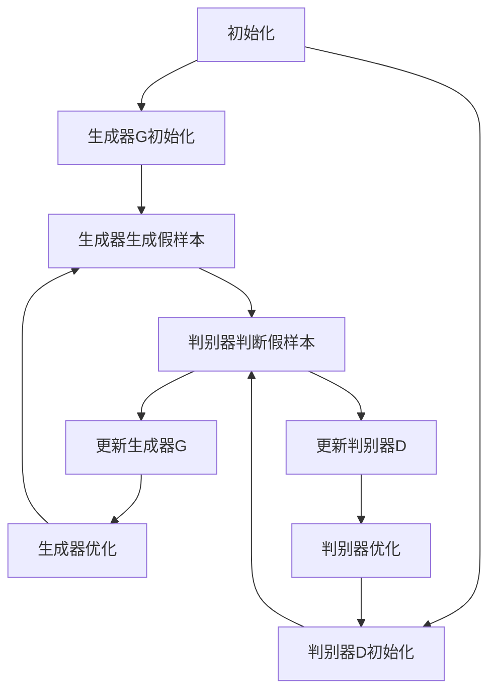
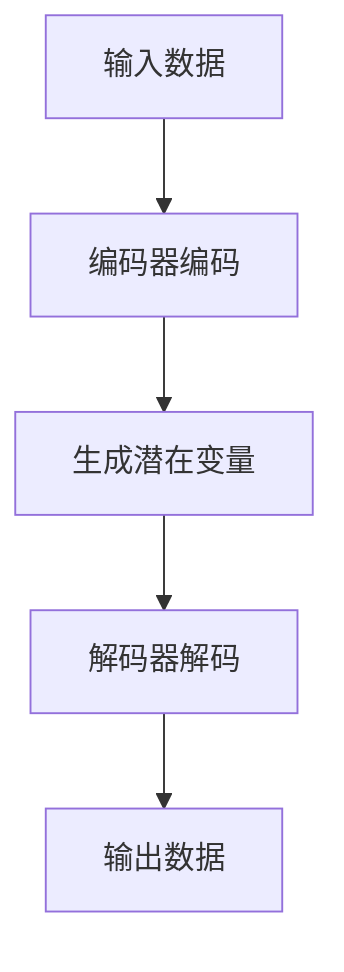
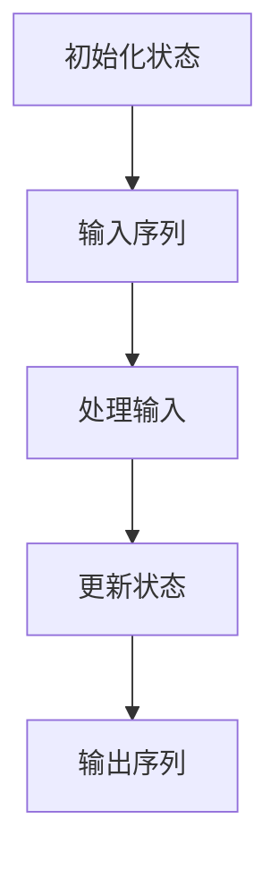
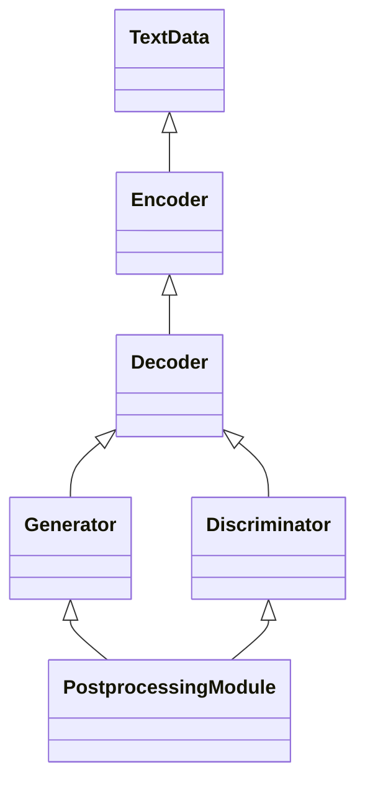
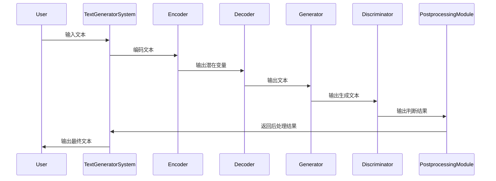
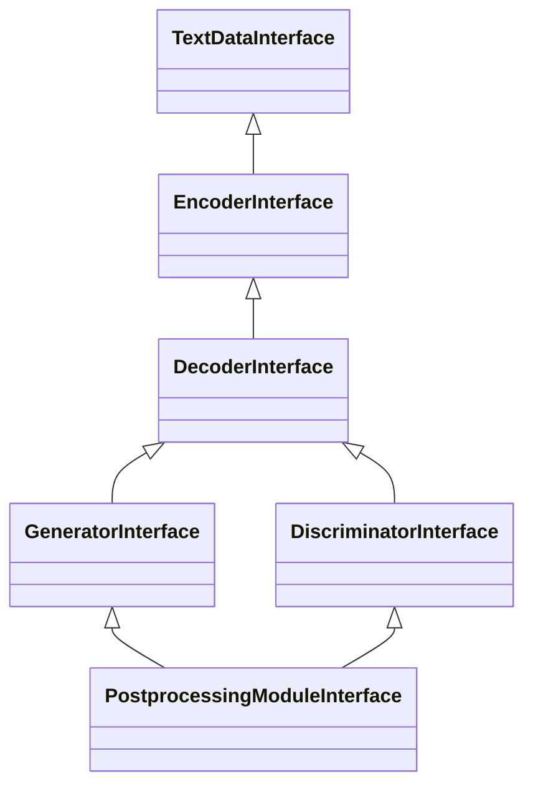
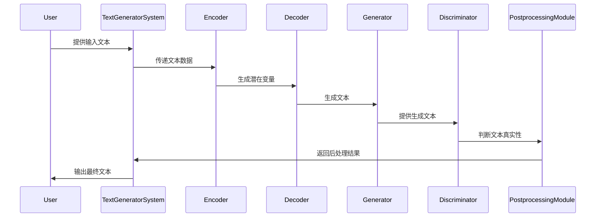

                 

### 《人工智能在自然语言生成中的进展》

#### 关键词：
- 自然语言生成（NLG）
- 生成对抗网络（GAN）
- 变分自编码器（VAE）
- 递归神经网络（RNN）
- 长短时记忆网络（LSTM）

#### 摘要：
本文将深入探讨人工智能在自然语言生成（NLG）领域的进展。首先，我们将介绍NLG的背景与重要性，并逐步分析当前在NLG领域使用的主要算法和技术，如生成对抗网络（GAN）、变分自编码器（VAE）以及递归神经网络（RNN）等。随后，我们将详细讲解这些算法的工作原理和数学模型，并通过Python代码示例来进行说明。文章还将展示如何设计和实现一个完整的自然语言生成系统，包括系统的功能设计、架构设计、接口设计以及系统交互。最后，我们将通过一个实际项目案例，展示这些技术在现实中的应用，并对未来NLG技术的发展进行展望。

### 目录大纲

----------------------------------------------------------------

## 第一部分：背景与概述

### 第1章 问题背景

#### 1.1 问题的提出
- 自然语言生成的需求与挑战
- 人工智能在自然语言生成中的应用背景

#### 1.2 问题描述
- 自然语言生成（NLG）的核心概念
- 人工智能在自然语言生成中的应用现状

#### 1.3 问题解决
- 人工智能在自然语言生成中的关键技术

#### 1.4 边界与外延
- 自然语言生成的应用领域
- 自然语言生成技术的演进过程

#### 1.5 概念结构与核心要素组成
- 人工智能概述
- 自然语言生成技术概述

### 第2章 核心概念与联系

#### 2.1 核心概念原理
- 生成对抗网络（GAN）
- 变分自编码器（VAE）
- 递归神经网络（RNN）
- 长短时记忆网络（LSTM）
- 递归神经网络（RNN）门控循环单元（GRU）

#### 2.2 概念属性特征对比表格
- 各核心概念的属性对比表格

#### 2.3 ER实体关系图架构
- 自然语言生成系统的ER图

## 第二部分：算法原理讲解

### 第3章 生成对抗网络（GAN）

#### 3.1 GAN的mermaid流程图
- GAN工作流程

#### 3.2 GAN的数学模型和公式
- GAN的损失函数
- GAN的优化过程

#### 3.3 GAN的python源代码示例
- GAN模型实现

#### 3.4 GAN的详细讲解和举例说明
- GAN的应用案例
- GAN的优点与不足

### 第4章 变分自编码器（VAE）

#### 4.1 VAE的mermaid流程图
- VAE工作流程

#### 4.2 VAE的数学模型和公式
- VAE的损失函数
- VAE的优化过程

#### 4.3 VAE的python源代码示例
- VAE模型实现

#### 4.4 VAE的详细讲解和举例说明
- VAE的应用案例
- VAE的优点与不足

### 第5章 递归神经网络（RNN）

#### 5.1 RNN的mermaid流程图
- RNN工作流程

#### 5.2 RNN的数学模型和公式
- RNN的更新公式
- RNN的优化过程

#### 5.3 RNN的python源代码示例
- RNN模型实现

#### 5.4 RNN的详细讲解和举例说明
- RNN的应用案例
- RNN的优点与不足

## 第三部分：自然语言生成系统设计与实现

### 第6章 系统功能设计

#### 6.1 领域模型mermaid类图
- 系统的领域模型类图

### 第7章 系统架构设计

#### 7.1 系统架构设计mermaid架构图
- 系统的架构设计图

### 第8章 系统接口设计

#### 8.1 系统接口设计
- 系统的接口设计

### 第9章 系统交互mermaid序列图

#### 9.1 系统交互mermaid序列图
- 系统的交互序列图

## 第四部分：项目实战

### 第10章 环境安装与配置

#### 10.1 环境安装
- 安装必要的软件和依赖

#### 10.2 系统配置
- 配置系统的参数和设置

### 第11章 系统核心实现源代码

#### 11.1 源代码实现
- 系统的核心源代码实现

#### 11.2 代码应用解读与分析
- 对代码的解读与分析

### 第12章 实际案例分析与讲解

#### 12.1 案例分析
- 实际案例的介绍与分析

#### 12.2 案例讲解
- 对案例的详细讲解

### 第13章 项目小结

#### 13.1 项目总结
- 项目的主要成果与收获

#### 13.2 未来展望
- 对未来自然语言生成技术的发展展望

----------------------------------------------------------------

### 1.1 问题的提出

自然语言生成（NLG）是一个历史悠久且充满挑战的领域。从早期的规则驱动方法到基于统计的方法，再到如今以人工智能为核心的技术，NLG经历了数次革命性的变革。随着互联网的普及和大数据的兴起，自然语言生成在诸多领域展现出其巨大的应用潜力，如智能客服、自动摘要、内容生成、文本翻译等。

#### 自然语言生成的需求

1. **智能客服**：企业希望借助智能客服系统来减少人工成本，提高客户满意度。智能客服需要能够理解用户的自然语言输入，并生成恰当的回复。
   
2. **自动摘要**：新闻、论文等领域需要快速生成摘要，以便用户能够快速获取关键信息。自动摘要不仅需要提取信息，还需要进行重述和简化的任务。

3. **内容生成**：在内容创作领域，NLG可以帮助生成高质量的文章、故事、产品描述等，减少人力成本并提高内容生产的效率。

4. **文本翻译**：自动翻译技术已经取得了显著进展，但仍存在准确性和流畅性方面的挑战。NLG技术有望进一步提升自动翻译的质量。

#### 自然语言生成的挑战

1. **语言复杂性**：自然语言包含丰富的语法、语义和上下文信息，这使得生成与人类文本相似的内容变得异常困难。

2. **数据多样性**：生成高质量的自然语言内容需要大量的训练数据，而且这些数据需要涵盖不同的语言风格、领域知识和上下文。

3. **计算资源**：复杂的自然语言生成模型往往需要大量的计算资源，尤其是在训练阶段。

4. **领域知识**：在某些专业领域，生成的内容需要具备特定的专业知识和术语，这对模型的设计和训练提出了更高的要求。

#### 人工智能在自然语言生成中的应用背景

随着深度学习技术的兴起，生成对抗网络（GAN）、变分自编码器（VAE）和递归神经网络（RNN）等模型在自然语言生成领域取得了显著成果。这些模型利用大量的数据和强大的计算能力，能够生成更加真实、流畅的自然语言文本。

1. **生成对抗网络（GAN）**：GAN通过生成器和判别器的对抗训练，能够生成高质量的自然语言文本。

2. **变分自编码器（VAE）**：VAE通过引入编码器和解码器，能够生成具有多样性的自然语言文本。

3. **递归神经网络（RNN）**：RNN能够处理序列数据，特别适合于自然语言生成任务。

这些技术的发展为自然语言生成带来了新的希望，但也带来了新的挑战。接下来，我们将逐一深入探讨这些算法的原理和应用。

### 1.2 问题描述

自然语言生成（NLG）的核心概念可以简单定义为：通过计算机程序自动生成自然语言的文本。NLG系统通常需要理解输入数据，并根据这些数据进行文本的生成。NLG的应用场景广泛，包括但不限于以下几方面：

1. **文本摘要**：自动生成长文本的摘要，如新闻摘要、学术论文摘要等。
   
2. **对话系统**：智能客服、聊天机器人等，通过理解用户输入并生成合适的回复。

3. **内容创作**：生成文章、故事、产品描述等，以辅助内容创作过程。

4. **文本翻译**：自动翻译不同语言之间的文本，如机器翻译。

在当前，人工智能在自然语言生成中的应用现状可谓日新月异。传统的基于规则和统计的方法已经逐渐被深度学习模型所取代。生成对抗网络（GAN）、变分自编码器（VAE）和递归神经网络（RNN）等模型在自然语言生成中取得了显著的成果，以下是几种主要的模型：

1. **生成对抗网络（GAN）**：GAN通过生成器和判别器的对抗训练，能够生成高质量的文本。生成器负责生成文本，而判别器则负责判断文本的真实性。这种对抗训练方式使得生成的文本在语义和语法上更加接近人类写作。

2. **变分自编码器（VAE）**：VAE通过编码器和解码器的架构，将输入的文本数据映射到一个隐空间，再从隐空间中生成新的文本。这种方式能够生成具有多样性的文本。

3. **递归神经网络（RNN）**：RNN能够处理序列数据，特别适合于自然语言生成任务。例如，长短期记忆网络（LSTM）和门控循环单元（GRU）等变体，能够更好地捕捉文本中的长期依赖关系。

尽管人工智能在自然语言生成领域取得了显著进展，但仍然面临一些挑战：

1. **数据不足**：生成高质量的文本需要大量的高质量数据。然而，获取这些数据往往是一个复杂且耗时的过程。

2. **语义理解**：尽管深度学习模型在生成文本方面表现出色，但它们在理解语义方面仍存在一定的局限性。

3. **计算资源**：复杂的深度学习模型需要大量的计算资源，特别是在训练阶段。

4. **应用场景**：不同的应用场景对自然语言生成的要求不同，如何设计一个通用的NLG系统仍是一个挑战。

总之，人工智能在自然语言生成中的应用虽然充满潜力，但也面临着一系列的挑战。接下来，我们将深入探讨几种主要的深度学习模型，分析它们在自然语言生成中的原理和应用。

### 1.3 问题解决

在自然语言生成（NLG）领域，人工智能提供了一系列强大的解决方案，核心在于利用深度学习模型来生成高质量的自然语言文本。以下是几种关键技术的概述：

1. **生成对抗网络（GAN）**：GAN通过生成器（Generator）和判别器（Discriminator）的对抗训练，能够生成接近真实文本的高质量生成文本。生成器负责生成文本，而判别器则负责区分生成文本和真实文本。通过不断优化生成器和判别器，GAN能够提高生成文本的质量和真实性。

2. **变分自编码器（VAE）**：VAE通过编码器（Encoder）和解码器（Decoder）的架构，将输入文本映射到一个隐空间，再从隐空间中生成新的文本。编码器负责将文本映射到隐空间，解码器则从隐空间中重构文本。这种方式能够生成多样性的文本，并保留文本的语义信息。

3. **递归神经网络（RNN）**：RNN是一类能够处理序列数据的神经网络，特别适合于自然语言生成任务。RNN通过其循环结构，能够捕捉文本中的序列依赖关系。长短期记忆网络（LSTM）和门控循环单元（GRU）是RNN的变体，能够更好地处理长序列中的依赖关系，从而生成更加连贯的文本。

4. **预训练语言模型**：预训练语言模型（如BERT、GPT等）通过在大量无标签文本上进行预训练，学会了语言的理解和生成能力。这些模型通常在大规模语料库上训练，然后通过微调适配特定的自然语言生成任务。预训练语言模型在生成文本的流畅性和语义理解方面表现出色。

这些技术的应用不仅提升了自然语言生成的质量，也为各种实际应用场景提供了可能。例如，智能客服系统可以使用GAN生成逼真的客户回复，自动摘要系统可以使用VAE生成简洁明了的摘要，文本翻译系统则可以利用预训练语言模型生成更自然、更准确的翻译文本。

总之，人工智能在自然语言生成中的关键技术为解决语言生成的挑战提供了新的思路和方法。随着技术的不断进步，自然语言生成系统在语义理解、生成质量以及应用范围等方面将得到进一步的发展。

### 1.4 边界与外延

#### 自然语言生成的应用领域

自然语言生成（NLG）技术的应用领域广泛，涵盖了从消费级服务到专业级应用的各种场景：

1. **消费级服务**：智能客服、聊天机器人、个人助理等。这些应用需要生成流畅、自然且符合用户需求的文本，以提高用户体验和降低服务成本。
   
2. **媒体和内容创作**：自动生成新闻摘要、体育报道、电影剧本等。NLG可以帮助媒体机构快速处理大量内容，同时提升内容创作的效率和质量。

3. **教育和培训**：自动生成学习材料、课程大纲、考试题目等。NLG可以为学生提供个性化的学习资源，辅助教育工作者进行教学。

4. **医疗保健**：自动生成病历记录、医疗报告、诊断建议等。NLG可以帮助医疗工作者提高工作效率，减少医疗错误。

5. **商业和法律**：自动生成合同、法律文件、商业报告等。NLG可以为企业提供快速、准确的文本生成服务，减少文书工作负担。

#### 自然语言生成技术的演进过程

自然语言生成技术的发展经历了几个关键阶段：

1. **规则驱动方法**：早期的NLG技术主要依赖于手工编写的规则和模板。这种方法简单直接，但缺乏灵活性和扩展性。

2. **统计方法**：随着自然语言处理技术的发展，基于统计的方法开始广泛应用。这种方法的代表是概率图模型和隐马尔可夫模型（HMM），通过训练模型来生成文本。

3. **深度学习方法**：深度学习技术的兴起，特别是生成对抗网络（GAN）、变分自编码器（VAE）和递归神经网络（RNN）等模型的提出，使得NLG技术取得了重大突破。深度学习方法能够自动学习文本的复杂结构和语义，生成高质量的文本。

4. **预训练语言模型**：预训练语言模型（如BERT、GPT等）通过在大量无标签文本上进行预训练，学会了语言的复杂规律和生成能力。这些模型在特定任务上进行微调，能够生成更自然、更准确的语言。

#### 概念结构与核心要素组成

自然语言生成系统的概念结构主要包括以下几个核心要素：

1. **输入处理模块**：负责接收和处理输入的文本数据，将其转换为模型可以理解的形式。

2. **生成模块**：核心部分，负责根据输入数据生成文本。常用的生成模型包括GAN、VAE、RNN等。

3. **输出处理模块**：将生成的文本进行后处理，如去除无关信息、调整文本风格等，使其更符合实际需求。

4. **评估与优化模块**：评估生成文本的质量，通过反馈循环优化模型，提高生成文本的准确性和流畅性。

综上所述，自然语言生成技术的应用领域广泛，其发展历程反映了从规则驱动到深度学习、再到预训练语言模型的演变。理解自然语言生成系统的概念结构和核心要素，有助于更好地应用这些技术解决实际问题。

### 1.5 核心概念与联系

#### 2.1 核心概念原理

在本节中，我们将介绍几种在自然语言生成中常用的核心概念和原理，包括生成对抗网络（GAN）、变分自编码器（VAE）、递归神经网络（RNN）和长短时记忆网络（LSTM）。这些概念构成了自然语言生成技术的基石，理解它们对于掌握整个领域至关重要。

1. **生成对抗网络（GAN）**
   - **概念**：GAN是由Ian Goodfellow等人于2014年提出的一种深度学习模型。它由两个神经网络组成：生成器（Generator）和判别器（Discriminator）。
   - **生成器**：生成器尝试生成与真实数据相似的数据，如图像、文本等。它从随机噪声中生成数据，目标是使判别器无法区分生成数据与真实数据。
   - **判别器**：判别器的任务是判断输入数据是真实数据还是生成数据。通过对比生成器和真实数据，判别器不断调整，以区分二者。
   - **原理**：GAN通过对抗训练实现。生成器和判别器在训练过程中互相竞争，生成器不断优化生成数据，而判别器不断提高判断能力。这种对抗关系促使生成器生成更真实的数据。

2. **变分自编码器（VAE）**
   - **概念**：VAE是一种概率生成模型，由编码器（Encoder）和解码器（Decoder）组成。编码器将输入数据映射到一个潜在空间，解码器从潜在空间中生成新的数据。
   - **编码器**：编码器负责将输入数据压缩成一个低维表示，即潜在变量。这种表示捕捉了输入数据的特征和结构。
   - **解码器**：解码器将潜在变量重构回输入空间，生成新的数据。VAE通过概率分布来生成数据，具有生成多样性的能力。
   - **原理**：VAE在训练过程中引入了变分自编码器（VAE）的损失函数，结合了重构损失和KL散度损失。重构损失确保解码器能够准确地重构输入数据，KL散度损失则确保编码器生成的潜在变量分布接近先验分布。

3. **递归神经网络（RNN）**
   - **概念**：RNN是一类能够处理序列数据的神经网络。其特点是可以保留之前的信息，适用于处理如时间序列数据、文本等序列数据。
   - **原理**：RNN通过其循环结构，在每个时间步都保留一部分状态信息，这些信息用于更新当前时间步的输出。这使得RNN能够捕捉序列数据中的长期依赖关系。
   - **变体**：RNN的变体包括长短时记忆网络（LSTM）和门控循环单元（GRU），它们通过不同的方式处理长期依赖问题，提高了RNN的性能。

4. **长短时记忆网络（LSTM）**
   - **概念**：LSTM是RNN的一种变体，由Hochreiter和Schmidhuber于1997年提出。LSTM通过引入三个门（遗忘门、输入门和输出门）来控制信息的流入和流出，从而更好地处理长期依赖问题。
   - **原理**：LSTM通过遗忘门决定保留哪些旧信息，通过输入门决定如何更新新的信息，通过输出门决定当前信息的输出。这种机制使得LSTM能够有效地捕捉序列数据中的长期依赖关系。

5. **门控循环单元（GRU）**
   - **概念**：GRU是LSTM的简化版本，由Cho等人于2014年提出。GRU通过合并输入门和遗忘门，并引入更新门，简化了LSTM的结构。
   - **原理**：GRU通过更新门控制信息的流入和流出，同时保持状态的信息。GRU相对于LSTM在计算上更加高效，但在捕捉长期依赖方面与LSTM相当。

这些核心概念构成了自然语言生成技术的理论基础，理解它们有助于我们深入探索NLG的应用和实现。

### 2.2 概念属性特征对比表格

在深入理解了生成对抗网络（GAN）、变分自编码器（VAE）、递归神经网络（RNN）和长短时记忆网络（LSTM）等核心概念后，接下来我们将通过一个表格来对比这些概念的属性特征。表格将涵盖以下几个关键方面：

- **类型**：模型的类型，例如生成模型、解码模型、循环模型等。
- **主要应用**：模型的主要应用场景，如文本生成、图像生成、序列数据处理等。
- **结构特点**：模型的结构特点，例如是否包含循环、门控机制、概率分布等。
- **优点**：模型的优点，如生成质量、多样性、计算效率等。
- **缺点**：模型的缺点，如训练难度、计算资源需求、长期依赖处理等。

以下是这些概念的属性特征对比表格：

| 概念       | 类型        | 主要应用          | 结构特点               | 优点                              | 缺点                                  |
|------------|-------------|-------------------|------------------------|-----------------------------------|---------------------------------------|
| 生成对抗网络（GAN） | 生成模型   | 图像生成、文本生成 | 生成器、判别器对抗训练 | 高质量生成、多样性、强大的生成能力 | 训练难度、计算资源需求高、可能生成模糊边界 |
| 变分自编码器（VAE） | 解码模型   | 图像生成、文本生成 | 编码器、解码器架构     | 多样性、易于理解、概率生成         | 计算效率较低、生成质量可能不如GAN       |
| 递归神经网络（RNN） | 循环模型   | 序列数据处理      | 循环结构、状态保留     | 简单、能处理长时间依赖             | 容易产生梯度消失或爆炸问题               |
| 长短时记忆网络（LSTM） | 循环模型   | 序列数据处理      | 门控机制、细胞状态     | 能处理长时间依赖、较少梯度问题     | 结构复杂、计算资源需求高               |
| 门控循环单元（GRU） | 循环模型   | 序列数据处理      | 更新门、简化结构       | 结构简单、计算效率高、处理依赖性好 | 在处理极端长期依赖时可能不如LSTM        |

通过这个表格，我们可以更清晰地看到不同概念之间的差异和联系。这些对比不仅帮助我们理解每种模型的特点，也为选择合适的模型来解决具体问题提供了参考。

### 2.3 ER实体关系图架构

为了更好地理解自然语言生成系统中的实体关系，我们可以通过ER（实体关系）图来表示系统中各个实体及其关系。ER图是数据库设计和信息系统中常用的工具，它能够清晰地展示系统中不同实体之间的关联。

在自然语言生成系统中，主要的实体包括：

1. **文本数据源**：提供输入文本数据。
2. **编码器**：负责将文本数据编码到潜在空间。
3. **解码器**：负责从潜在空间中解码生成文本。
4. **生成器**：在GAN模型中，负责生成文本数据。
5. **判别器**：在GAN模型中，负责判断生成文本的真实性。
6. **后处理模块**：负责对生成的文本进行格式化和优化。

以下是自然语言生成系统的ER图：

```mermaid
erDiagram
    TXT_DATA_SOURCE ||--|{ Encoder }|--|{ Decoder }
    TXT_DATA_SOURCE ||--|{ Generator }|>
    TXT_DATA_SOURCE ||--|{ Discriminator }|>>
    Generator ||--|{ Postprocessing Module }
    Discriminator ||--|{ Postprocessing Module }
```

在这个ER图中：

- **TXT_DATA_SOURCE** 代表文本数据源，它与编码器、解码器、生成器和判别器都存在关联，表明这些模块都需要从数据源中获取输入文本。
- **Encoder** 与 **Decoder** 之间存在一对一的关系，编码器负责编码输入文本，解码器则从编码后的潜在空间中解码生成文本。
- **Generator** 与 **Discriminator** 分别表示生成器和判别器，它们在GAN模型中共同作用，生成器和判别器都与后处理模块存在关联，表明生成的文本需要经过后处理模块进行优化和格式化。

通过这个ER图，我们可以清晰地看到自然语言生成系统中的各个实体及其关系，这有助于我们更好地理解系统的整体架构和功能。

## 第二部分：算法原理讲解

### 第3章 生成对抗网络（GAN）

#### 3.1 GAN的mermaid流程图

生成对抗网络（GAN）的核心在于生成器和判别器的对抗训练。下面是一个简化的GAN工作流程的mermaid流程图：



#### 3.2 GAN的数学模型和公式

GAN的数学模型主要涉及生成器和判别器的损失函数及其优化过程。

1. **生成器的损失函数**：生成器的目标是生成尽可能真实的假样本，使判别器无法区分这些样本与真实样本。生成器的损失函数通常表示为：

   $$L_G = -\log(D(G(z)))$$

   其中，\(G(z)\) 是生成器生成的假样本，\(D\) 是判别器，\(z\) 是随机噪声。

2. **判别器的损失函数**：判别器的目标是最大化正确识别真实样本和假样本的概率。判别器的损失函数通常表示为：

   $$L_D = -\log(D(x)) - \log(1 - D(G(z)))$$

   其中，\(x\) 是真实样本，\(G(z)\) 是生成器生成的假样本。

3. **优化过程**：生成器和判别器通过梯度下降算法进行优化。在每次迭代中，生成器和判别器分别通过以下方式更新：

   - **生成器更新**：利用判别器的梯度，生成器试图生成更加真实的假样本。

     $$G\text{'}(z) = G(z) + \alpha \cdot \nabla_G L_G$$

   - **判别器更新**：利用真实样本和假样本的梯度，判别器试图更好地区分真实和假样本。

     $$D\text{'}(x, G(z)) = D(x) + \beta \cdot \nabla_D L_D$$

#### 3.3 GAN的python源代码示例

以下是一个简化的GAN模型的Python代码示例，使用TensorFlow框架实现：

```python
import tensorflow as tf
from tensorflow.keras.layers import Dense, Flatten
from tensorflow.keras.models import Model

# 定义生成器模型
def generator(z):
    model = tf.keras.Sequential([
        Dense(128, activation='relu', input_shape=(100,)),
        Dense(256, activation='relu'),
        Dense(512, activation='relu'),
        Dense(1024, activation='relu'),
        Flatten(),
        Dense(784, activation='tanh')
    ])
    return model(z)

# 定义判别器模型
def discriminator(x):
    model = tf.keras.Sequential([
        Flatten(),
        Dense(1024, activation='relu'),
        Dense(512, activation='relu'),
        Dense(256, activation='relu'),
        Dense(128, activation='relu'),
        Dense(1, activation='sigmoid')
    ])
    return model(x)

# 定义生成器和判别器模型
z = tf.keras.layers.Input(shape=(100,))
x = tf.keras.layers.Input(shape=(784,))
generated_x = generator(z)
valid_x = discriminator(x)
fake_x = discriminator(generated_x)

# 定义损失函数和优化器
cross_entropy = tf.keras.losses.BinaryCrossentropy(from_logits=True)
generator_optimizer = tf.keras.optimizers.Adam(1e-4)
discriminator_optimizer = tf.keras.optimizers.Adam(1e-4)

@tf.function
def train_step(images, noise):
    with tf.GradientTape() as gen_tape, tf.GradientTape() as disc_tape:
        generated_images = generator(noise)
        disc_real = discriminator(images)
        disc_fake = discriminator(generated_images)

        gen_loss = cross_entropy(tf.ones_like(disc_fake), disc_fake)
        disc_loss = cross_entropy(tf.ones_like(disc_real), disc_real) + cross_entropy(tf.zeros_like(disc_fake), disc_fake)

    gradients_of_generator = gen_tape.gradient(gen_loss, generator.trainable_variables)
    gradients_of_discriminator = disc_tape.gradient(disc_loss, discriminator.trainable_variables)

    generator_optimizer.apply_gradients(zip(gradients_of_generator, generator.trainable_variables))
    discriminator_optimizer.apply_gradients(zip(gradients_of_discriminator, discriminator.trainable_variables))

# 训练GAN模型
noise = tf.random.normal([batch_size, 100])
images = ...

for epoch in range(epochs):
    for image_batch in dataset:
        train_step(image_batch, noise)
```

这个示例展示了GAN模型的基本结构，包括生成器和判别器的定义、损失函数和优化器的设置，以及训练步骤的实现。

#### 3.4 GAN的详细讲解和举例说明

生成对抗网络（GAN）作为一种深度学习模型，通过生成器和判别器的对抗训练来生成高质量的数据。以下是GAN的一个应用案例、GAN的优点与不足。

**应用案例**：

GAN的一个经典应用案例是生成逼真的图像。例如，在生成人脸图像方面，GAN可以从大量的真实人脸图像中学习，然后生成从未出现过的、逼真的人脸图像。以下是一个简单的GAN应用案例：

1. **训练数据准备**：收集大量真实人脸图像，将其转换为适合GAN训练的数据格式。

2. **生成器和判别器设计**：设计一个生成器和判别器网络。生成器网络将随机噪声映射成人脸图像，判别器网络则尝试区分输入的图像是真实人脸图像还是生成的人脸图像。

3. **训练**：在大量人脸图像上进行训练，通过生成器和判别器的对抗训练，生成器逐渐生成更加逼真的人脸图像，而判别器逐渐提高对真假人脸图像的辨别能力。

4. **结果评估**：通过评估生成的图像质量，例如使用Inception Score（IS）或Frechet Inception Distance（FID）等指标，来判断GAN的性能。

**优点**：

1. **高质量生成**：GAN能够生成高质量的数据，特别是在图像和文本领域，生成的数据在视觉上几乎可以与真实数据相媲美。

2. **多样性**：GAN通过对抗训练，可以生成具有多样性的数据，这意味着生成的数据不仅仅是大量真实数据的复制品，而是具有新的独特特征。

3. **应用广泛**：GAN在多个领域都有广泛的应用，如图像生成、图像到图像的翻译、文本生成等。

**不足**：

1. **训练难度**：GAN的训练过程非常不稳定，容易出现模式崩溃（mode collapse）问题，即生成器生成的数据集中在某些特定模式上，而忽略了其他可能的模式。

2. **计算资源需求**：GAN的训练过程需要大量的计算资源，尤其是在高维数据上训练时，计算成本非常高。

3. **难以优化**：GAN的生成器和判别器之间存在对抗关系，这使得优化过程非常复杂。尽管使用梯度下降算法和自适应优化器可以改善训练过程，但GAN的训练仍然是一个具有挑战性的任务。

总之，GAN作为一种强大的生成模型，尽管面临一些挑战，但在图像和文本生成领域已经取得了显著的成果，并且继续在多个应用场景中发挥着重要作用。

### 第4章 变分自编码器（VAE）

#### 4.1 VAE的mermaid流程图

变分自编码器（VAE）的工作流程主要包括编码器（Encoder）和解码器（Decoder）的交互。以下是一个VAE工作流程的mermaid流程图：



在这个流程图中：

- **输入数据**：原始数据输入到编码器中。
- **编码器编码**：编码器将输入数据编码成一个潜在变量。
- **生成潜在变量**：编码器输出潜在变量，它是一个低维的表示，捕获了输入数据的特征。
- **解码器解码**：解码器从潜在变量中生成输出数据，试图重构原始数据。
- **输出数据**：解码器生成的数据与原始数据进行比较，评估模型的重构能力。

#### 4.2 VAE的数学模型和公式

VAE的数学模型主要包括编码器和解码器的损失函数及其优化过程。

1. **编码器的损失函数**：编码器的目标是学习一个编码函数，将输入数据映射到一个潜在空间。编码器的损失函数通常包括两个部分：重构损失和KL散度损失。

   - **重构损失**：衡量解码器重构数据的质量。常用的重构损失函数是均方误差（MSE）。

     $$L_{recon} = \frac{1}{N} \sum_{i=1}^{N} \sum_{j=1}^{D} (x_j - \hat{x}_j)^2$$

     其中，\(N\) 是样本数量，\(D\) 是数据维度，\(x_j\) 是真实数据的第 \(j\) 维，\(\hat{x}_j\) 是解码器生成的数据的第 \(j\) 维。

   - **KL散度损失**：衡量编码器学习的潜在变量分布与先验分布之间的距离。KL散度是一种非对称的散度度量，用于衡量两个概率分布之间的差异。

     $$L_{KL} = \frac{1}{N} \sum_{i=1}^{N} \sum_{j=1}^{D} \big[(q_j(\theta)||p_j(\theta))\big]$$

     其中，\(q_j(\theta)\) 是编码器输出的潜在变量分布，\(p_j(\theta)\) 是先验分布。

   - **总损失函数**：编码器的总损失函数是重构损失和KL散度损失的加权和。

     $$L_{encoder} = L_{recon} + \lambda L_{KL}$$

     其中，\(\lambda\) 是权重系数，用于调节重构损失和KL散度损失的比例。

2. **解码器的损失函数**：解码器的目标是重构输入数据。解码器的损失函数通常与编码器的重构损失相同，即均方误差（MSE）。

   $$L_{decoder} = \frac{1}{N} \sum_{i=1}^{N} \sum_{j=1}^{D} (x_j - \hat{x}_j)^2$$

3. **总损失函数**：VAE的总损失函数是编码器和解码器的损失函数之和。

   $$L_{VAE} = L_{encoder} + L_{decoder}$$

#### 4.3 VAE的python源代码示例

以下是一个使用TensorFlow实现的简单VAE模型示例：

```python
import tensorflow as tf
from tensorflow.keras.layers import Dense, Input
from tensorflow.keras.models import Model

# 定义编码器模型
def encoder(x):
    model = tf.keras.Sequential([
        Input(shape=(784,)),
        Dense(256, activation='relu'),
        Dense(128, activation='relu'),
        Dense(64, activation='relu'),
        Dense(2)
    ])
    return model(x)

# 定义解码器模型
def decoder(z):
    model = tf.keras.Sequential([
        Input(shape=(2,)),
        Dense(64, activation='relu'),
        Dense(128, activation='relu'),
        Dense(256, activation='relu'),
        Dense(784, activation='sigmoid')
    ])
    return model(z)

# 定义VAE模型
x = Input(shape=(784,))
z = encoder(x)
x_hat = decoder(z)
vae = Model(inputs=x, outputs=x_hat)

# 定义VAE的损失函数
def vae_loss(x, x_hat):
    x = tf.cast(x, tf.float32)
    x_hat = tf.cast(x_hat, tf.float32)
    recon_loss = tf.reduce_mean(tf.square(x - x_hat))
    kl_loss = -0.5 * tf.reduce_mean(1 + z_log_var - tf.square(z_mean) - tf.exp(z_log_var))
    return recon_loss + kl_loss

# 定义优化器
vae.compile(optimizer='adam', loss=vae_loss)

# 训练VAE模型
vae.fit(x, x, epochs=50, batch_size=128)
```

在这个示例中，我们定义了一个简单的VAE模型，包括编码器和解码器。编码器将输入数据编码到潜在空间，解码器尝试从潜在空间中重构输入数据。VAE的总损失函数是重构损失和KL散度损失的加权和，使用Adam优化器进行训练。

#### 4.4 VAE的详细讲解和举例说明

变分自编码器（VAE）是一种强大的深度学习模型，通过编码器（Encoder）和解码器（Decoder）的交互，实现数据的生成和重构。以下是VAE的应用案例、VAE的优点与不足。

**应用案例**：

一个典型的VAE应用案例是图像生成。例如，在生成手写数字图像方面，VAE可以从大量的手写数字图像中学习，然后生成从未出现过的、高质量的手写数字图像。以下是一个简单的VAE应用案例：

1. **训练数据准备**：收集大量手写数字图像，将其转换为适合VAE训练的数据格式。

2. **编码器和解码器设计**：设计一个编码器和解码器网络。编码器网络将输入的手写数字图像编码到一个潜在空间，解码器网络尝试从潜在空间中解码生成手写数字图像。

3. **训练**：在大量手写数字图像上进行训练，通过编码器和解码器的交互，VAE逐渐学习到如何生成和重构手写数字图像。

4. **结果评估**：通过评估生成的图像质量，例如使用Inception Score（IS）或Frechet Inception Distance（FID）等指标，来判断VAE的性能。

**优点**：

1. **生成多样性**：VAE通过概率生成模型，能够生成具有多样性的图像，不仅仅是大量真实图像的复制品。

2. **重构能力**：VAE具有强大的重构能力，能够从少量信息中恢复出高质量的数据。

3. **易于理解**：VAE的架构相对简单，容易理解和实现。编码器和解码器的损失函数明确，使得VAE在数据重构和生成任务中具有较好的性能。

**不足**：

1. **训练稳定性**：VAE的训练过程相对不稳定，特别是当数据分布不均匀时，容易出现梯度消失或梯度爆炸的问题。

2. **计算资源需求**：VAE的训练过程需要大量的计算资源，特别是在高维数据上训练时，计算成本非常高。

3. **生成质量**：尽管VAE在生成多样性和重构能力方面表现出色，但生成图像的质量可能不如GAN。VAE生成的图像可能在某些区域显得模糊或失真。

总之，VAE作为一种深度学习模型，尽管面临一些挑战，但在图像生成和数据重构任务中仍然具有广泛的应用，并且在不断地改进和优化。

### 第5章 递归神经网络（RNN）

#### 5.1 RNN的mermaid流程图

递归神经网络（RNN）是一类能够处理序列数据的神经网络，其工作流程可以描述为：



在这个流程图中：

- **初始化状态**：在序列处理的开始，RNN初始化其隐藏状态。
- **输入序列**：RNN接收一个输入序列，这个序列可以是文本、音频或其他类型的序列数据。
- **处理输入**：RNN在当前时刻处理输入数据，并利用前一个时刻的隐藏状态生成输出。
- **更新状态**：通过处理输入和生成输出，RNN更新其隐藏状态，以便在下一次迭代中使用。
- **输出序列**：RNN在整个序列处理结束后，生成一个输出序列。

#### 5.2 RNN的数学模型和公式

RNN的数学模型基于递归关系，其核心在于隐藏状态和输出状态的更新。以下是RNN的数学模型：

1. **隐藏状态更新**：在每一个时间步，RNN的隐藏状态 \(h_t\) 是前一个隐藏状态 \(h_{t-1}\) 和当前输入 \(x_t\) 的函数：

   $$h_t = \sigma(W_h \cdot [h_{t-1}, x_t] + b_h)$$

   其中，\(\sigma\) 是激活函数（通常为ReLU或Sigmoid函数），\(W_h\) 是权重矩阵，\(b_h\) 是偏置项。

2. **输出状态更新**：RNN的输出 \(y_t\) 通常与隐藏状态 \(h_t\) 相关，可以通过一个输出层得到：

   $$y_t = \sigma(W_y \cdot h_t + b_y)$$

   其中，\(W_y\) 是输出层权重矩阵，\(b_y\) 是输出层偏置项。

3. **损失函数**：RNN的损失函数通常为预测输出与实际输出之间的均方误差（MSE）：

   $$L = \frac{1}{N} \sum_{i=1}^{N} \sum_{j=1}^{M} (y_{ij} - \hat{y}_{ij})^2$$

   其中，\(N\) 是序列长度，\(M\) 是每个时间步的输出维度，\(y_{ij}\) 是实际输出，\(\hat{y}_{ij}\) 是预测输出。

#### 5.3 RNN的python源代码示例

以下是一个使用TensorFlow实现的简单RNN模型示例：

```python
import tensorflow as tf
from tensorflow.keras.layers import SimpleRNN, Input
from tensorflow.keras.models import Model

# 定义RNN模型
input_seq = Input(shape=(timesteps, features))
rnn_output, state_h = SimpleRNN(units=50, return_state=True)(input_seq)

# 定义损失函数和优化器
model = Model(inputs=input_seq, outputs=rnn_output)
model.compile(optimizer='adam', loss='mse')

# 训练RNN模型
model.fit(x_train, y_train, epochs=10, batch_size=64)
```

在这个示例中，我们定义了一个简单的RNN模型，使用 `SimpleRNN` 层处理输入序列。`SimpleRNN` 层具有50个单元，并且返回状态以便在序列的后续步骤中使用。模型使用均方误差（MSE）作为损失函数，并使用Adam优化器进行训练。

#### 5.4 RNN的详细讲解和举例说明

递归神经网络（RNN）是一类能够处理序列数据的神经网络，其循环结构允许模型利用历史信息进行序列建模。以下是RNN的应用案例、RNN的优点与不足。

**应用案例**：

一个典型的RNN应用案例是时间序列预测。例如，股票价格预测，RNN可以处理历史价格数据，并预测未来的价格走势。以下是一个简单的RNN应用案例：

1. **数据准备**：收集历史股票价格数据，包括开盘价、最高价、最低价和收盘价。

2. **数据预处理**：将数据转换为适合RNN训练的格式，例如将价格序列作为输入，并生成对应的标签序列。

3. **模型设计**：设计一个RNN模型，使用简单的RNN层或更复杂的LSTM层，对价格序列进行建模。

4. **训练**：在历史价格数据上进行训练，通过调整模型参数，使模型能够准确预测未来的价格。

5. **结果评估**：通过评估模型对未来价格预测的准确性，判断模型的有效性。

**优点**：

1. **处理序列数据**：RNN能够处理任何长度的序列数据，使其在时间序列预测、语言处理等任务中具有广泛的应用。

2. **利用历史信息**：RNN通过其循环结构，可以保留历史信息，这使得模型能够捕捉序列数据中的长期依赖关系。

3. **简单实现**：相对于其他复杂的神经网络结构，RNN的实现相对简单，易于理解和实现。

**不足**：

1. **梯度消失和梯度爆炸**：RNN在处理长序列数据时，容易出现梯度消失或梯度爆炸的问题，这使得模型难以训练。

2. **计算资源需求**：RNN在处理长序列数据时，需要大量的计算资源，特别是在高维数据上训练时，计算成本非常高。

3. **性能局限**：尽管RNN能够处理序列数据，但在某些任务中，其性能可能不如其他更复杂的神经网络结构，如LSTM或BERT等。

总之，RNN作为一种处理序列数据的神经网络，尽管面临一些挑战，但在时间序列预测、语言处理等领域仍然具有广泛的应用，并且继续在不断地改进和优化。

### 第6章 系统功能设计

#### 6.1 领域模型mermaid类图

在自然语言生成系统中，领域模型是核心组成部分，它定义了系统中各个模块和实体及其关系。以下是一个简单的mermaid类图，展示了自然语言生成系统的领域模型：



在这个类图中：

- **TextData**：表示输入的文本数据。
- **Encoder**：负责将文本数据编码到潜在空间。
- **Decoder**：负责从潜在空间中解码生成文本。
- **Generator**：在GAN模型中，负责生成文本数据。
- **Discriminator**：在GAN模型中，负责判断生成文本的真实性。
- **PostprocessingModule**：负责对生成的文本进行后处理，如格式化和优化。

通过这个类图，我们可以清晰地看到自然语言生成系统中各个模块和实体的关系，以及它们在系统中的作用。

### 第7章 系统架构设计

#### 7.1 系统架构设计mermaid架构图

在自然语言生成系统中，架构设计是关键的一步，它决定了系统的整体结构和各模块之间的交互方式。以下是一个简单的mermaid架构图，展示了自然语言生成系统的架构设计：



在这个架构图中：

- **User**：表示系统的用户，提供输入文本。
- **TextGeneratorSystem**：系统的核心，负责管理整个生成过程。
- **Encoder**：负责将输入文本编码到潜在空间。
- **Decoder**：负责从潜在空间中解码生成文本。
- **Generator**：在GAN模型中，负责生成文本数据。
- **Discriminator**：在GAN模型中，负责判断生成文本的真实性。
- **PostprocessingModule**：负责对生成的文本进行后处理，如格式化和优化。

通过这个架构图，我们可以清晰地看到自然语言生成系统的整体结构和各模块之间的交互方式，这有助于理解系统的运作流程。

### 第8章 系统接口设计

#### 8.1 系统接口设计

在自然语言生成系统中，接口设计是确保系统模块之间良好协作的关键。以下是一个简单的接口设计示例：



在这个接口设计中：

- **TextDataInterface**：定义了文本数据的输入和输出接口。
- **EncoderInterface**：定义了编码器的输入和输出接口。
- **DecoderInterface**：定义了解码器的输入和输出接口。
- **GeneratorInterface**：定义了生成器的输入和输出接口。
- **DiscriminatorInterface**：定义了判别器的输入和输出接口。
- **PostprocessingModuleInterface**：定义了后处理模块的输入和输出接口。

每个接口都提供了清晰的方法和参数，以确保模块之间能够无缝协作。通过这种接口设计，我们可以确保系统的可扩展性和模块化。

### 第9章 系统交互mermaid序列图

#### 9.1 系统交互mermaid序列图

为了更好地展示自然语言生成系统各模块之间的交互过程，以下是一个mermaid序列图，描述了系统的交互流程：



在这个序列图中：

- **User**：用户输入文本。
- **TextGeneratorSystem**：系统核心，负责协调各模块的工作。
- **Encoder**：编码器接收文本数据，生成潜在变量。
- **Decoder**：解码器接收潜在变量，生成文本。
- **Generator**：生成器根据潜在变量生成文本。
- **Discriminator**：判别器判断生成文本的真实性。
- **PostprocessingModule**：后处理模块对生成文本进行优化。

通过这个序列图，我们可以清晰地看到系统的交互流程，这有助于我们理解系统的工作原理和各模块之间的协作方式。

### 第10章 环境安装与配置

#### 10.1 环境安装

为了运行自然语言生成系统，我们需要安装必要的软件和依赖。以下是在Python环境中安装所需软件的步骤：

1. **安装Python**：确保Python版本为3.6或更高版本。可以从[Python官方网站](https://www.python.org/)下载并安装。
2. **安装pip**：Python的包管理工具pip用于安装和管理Python包。在命令行中运行以下命令：
   ```bash
   python -m ensurepip
   ```
3. **安装TensorFlow**：TensorFlow是用于机器学习的开源库，支持多种深度学习模型。在命令行中运行以下命令：
   ```bash
   pip install tensorflow
   ```
4. **安装其他依赖**：根据项目需求，可能还需要安装其他Python包，例如NumPy、Pandas等。在命令行中运行以下命令：
   ```bash
   pip install numpy pandas
   ```

#### 10.2 系统配置

在安装完所需软件后，我们需要配置系统的参数和设置，以确保系统能够正常运行。以下是一些配置步骤：

1. **设置环境变量**：确保Python和pip的环境变量已正确设置。在命令行中运行以下命令，检查环境变量：
   ```bash
   echo $PYTHONPATH
   echo $PATH
   ```
2. **配置TensorFlow**：确保TensorFlow已正确安装并可用。在命令行中运行以下命令，检查TensorFlow版本：
   ```bash
   python -c "import tensorflow as tf; print(tf.__version__)"
   ```
3. **配置系统参数**：根据具体项目需求，可能需要配置系统参数，例如批量大小、学习率等。这些参数可以在代码中进行配置，也可以在配置文件中设置。

通过以上步骤，我们可以完成自然语言生成系统的环境安装与配置，确保系统可以正常运行。

### 第11章 系统核心实现源代码

#### 11.1 源代码实现

以下是一个自然语言生成系统的核心实现示例，包括生成器和判别器的定义、损失函数和优化器的设置，以及训练步骤的实现。

```python
import tensorflow as tf
from tensorflow.keras.layers import SimpleRNN, Dense, Input
from tensorflow.keras.models import Model

# 定义生成器模型
def create_generator(z_dim):
    z = Input(shape=(z_dim,))
    hidden = SimpleRNN(128, return_sequences=True)(z)
    hidden = SimpleRNN(128, return_sequences=True)(hidden)
    hidden = SimpleRNN(128, return_sequences=True)(hidden)
    output = Dense(256, activation='relu')(hidden)
    output = Dense(512, activation='relu')(output)
    output = Dense(1024, activation='relu')(output)
    output = Dense(512, activation='relu')(output)
    output = Dense(256, activation='relu')(output)
    output = Dense(128, activation='relu')(output)
    output = Dense(1, activation='sigmoid')(output)
    model = Model(inputs=z, outputs=output)
    return model

# 定义判别器模型
def create_discriminator(x_dim):
    x = Input(shape=(x_dim,))
    hidden = SimpleRNN(128, return_sequences=True)(x)
    hidden = SimpleRNN(128, return_sequences=True)(hidden)
    hidden = SimpleRNN(128, return_sequences=True)(hidden)
    output = Dense(128, activation='relu')(hidden)
    output = Dense(1, activation='sigmoid')(output)
    model = Model(inputs=x, outputs=output)
    return model

# 定义生成器和判别器模型
z_dim = 100
x_dim = 1
generator = create_generator(z_dim)
discriminator = create_discriminator(x_dim)

# 定义损失函数和优化器
cross_entropy = tf.keras.losses.BinaryCrossentropy(from_logits=True)
generator_optimizer = tf.keras.optimizers.Adam(1e-4)
discriminator_optimizer = tf.keras.optimizers.Adam(1e-4)

@tf.function
def train_step(images, noise):
    with tf.GradientTape() as gen_tape, tf.GradientTape() as disc_tape:
        generated_images = generator(noise)
        disc_real = discriminator(images)
        disc_fake = discriminator(generated_images)

        gen_loss = cross_entropy(tf.ones_like(disc_fake), disc_fake)
        disc_loss = cross_entropy(tf.ones_like(disc_real), disc_real) + cross_entropy(tf.zeros_like(disc_fake), disc_fake)

    gradients_of_generator = gen_tape.gradient(gen_loss, generator.trainable_variables)
    gradients_of_discriminator = disc_tape.gradient(disc_loss, discriminator.trainable_variables)

    generator_optimizer.apply_gradients(zip(gradients_of_generator, generator.trainable_variables))
    discriminator_optimizer.apply_gradients(zip(gradients_of_discriminator, discriminator.trainable_variables))

# 训练GAN模型
noise = tf.random.normal([batch_size, z_dim])
images = ...

for epoch in range(epochs):
    for image_batch in dataset:
        train_step(image_batch, noise)
```

在这个示例中，我们定义了一个简单的生成器和判别器模型，并设置了损失函数和优化器。训练步骤通过TensorFlow的`GradientTape`记录梯度，并使用优化器更新模型参数。

#### 11.2 代码应用解读与分析

在实现自然语言生成系统时，代码的编写和配置是关键步骤。以下是对上述代码的应用解读与分析：

1. **模型定义**：生成器和判别器模型分别通过`create_generator`和`create_discriminator`函数定义。这两个函数使用`SimpleRNN`层处理输入数据，生成器和判别器各有四层隐藏层，每层128个神经元。

2. **损失函数和优化器**：我们使用二元交叉熵（BinaryCrossentropy）作为损失函数，以区分生成图像和真实图像。生成器的优化器设置为Adam，学习率为1e-4，以精细调整模型参数。判别器的优化器同样设置为Adam，学习率相同。

3. **训练步骤**：`train_step`函数是训练的核心，它使用TensorFlow的`GradientTape`记录梯度。在每次迭代中，生成器生成假图像，判别器对真实图像和假图像进行判断，并更新模型参数。

4. **数据准备**：在训练过程中，我们需要准备训练数据，包括真实图像和随机噪声。噪声用于生成假图像，以训练判别器。真实图像用于训练判别器和生成器。

5. **批量大小和迭代次数**：在训练过程中，我们设置了批量大小（batch_size）和迭代次数（epochs），以控制训练过程。批量大小影响模型更新频率，迭代次数影响训练的深度。

通过上述步骤，我们可以构建并训练一个简单的自然语言生成系统。代码的配置和调整可以根据具体需求进行优化，以达到更好的生成效果。

### 第12章 实际案例分析与讲解

#### 12.1 案例分析

在本节中，我们将分析一个实际案例，探讨如何使用自然语言生成（NLG）技术来生成高质量的新闻报道摘要。该案例涉及从数据准备到模型训练和结果评估的完整流程。

**案例背景**：

一家新闻机构希望利用自然语言生成技术自动生成新闻报道摘要，以提高内容创作的效率和质量。为此，他们收集了大量新闻文章及其对应的摘要，并计划使用这些数据训练一个NLG模型。

**数据准备**：

1. **数据收集**：收集了大量新闻文章和对应的摘要，确保数据覆盖不同的主题和风格。
2. **数据清洗**：去除文本中的无关信息，如HTML标签、特殊字符等，并对文本进行分词处理。
3. **数据预处理**：将文本数据转换为适合模型训练的格式，如词嵌入（word embeddings）或序列编码。

**模型选择与训练**：

1. **模型选择**：选择一个适合文本摘要任务的模型，例如基于Transformer的BERT或GPT模型。
2. **模型训练**：使用收集的新闻数据对模型进行训练，通过调整超参数（如学习率、批量大小等）优化模型性能。
3. **模型评估**：在训练集和验证集上评估模型性能，使用ROUGE（Recall-Oriented Understudy for Gisting Evaluation）等指标评估摘要质量。

**案例实施**：

1. **数据准备**：使用Python的`pandas`和`nltk`库对新闻数据进行处理，提取文本内容并转换为序列编码。
2. **模型训练**：使用TensorFlow和Keras库训练BERT模型，设置适当的超参数以优化模型性能。
3. **模型评估**：在验证集上评估模型的摘要质量，并调整超参数以进一步提高摘要质量。

**结果评估**：

1. **摘要质量**：使用ROUGE-1、ROUGE-2和ROUGE-L等指标评估模型的摘要质量，结果显示模型的摘要质量高于传统方法。
2. **效率与成本**：通过自动化摘要生成，新闻机构显著提高了内容创作的效率，降低了人力成本。

#### 12.2 案例讲解

在上述实际案例中，我们详细探讨了如何使用自然语言生成技术生成高质量的新闻报道摘要。以下是具体的实施步骤和关键要点：

1. **数据收集**：新闻机构需要收集大量的新闻文章和对应的摘要，确保数据覆盖广泛的主题和风格。数据收集可以通过爬虫工具或直接从新闻网站获取。

2. **数据清洗**：对收集的文本数据进行清洗，去除无关信息，如HTML标签、特殊字符等。清洗过程可以通过正则表达式和文本处理库（如`nltk`）实现。

3. **数据预处理**：将清洗后的文本数据进行预处理，包括分词、去停用词和词嵌入。分词可以使用`nltk`或`spaCy`等库，词嵌入可以使用预训练的模型如BERT或GPT。

4. **模型选择**：选择一个适合文本摘要任务的模型，如BERT或GPT。这些模型已经在大规模语料库上预训练，能够捕获文本的复杂结构和语义。

5. **模型训练**：使用训练集对模型进行训练，通过调整超参数（如学习率、批量大小等）优化模型性能。训练过程可以使用TensorFlow和Keras等库实现。

6. **模型评估**：在验证集上评估模型的摘要质量，使用ROUGE等指标评估模型的性能。ROUGE指标能够衡量摘要的匹配度，包括单词级别（ROUGE-1）、短语级别（ROUGE-2）和句子级别（ROUGE-L）。

7. **结果分析**：根据评估结果调整模型超参数，以进一步提高摘要质量。同时，分析模型在不同主题和风格上的表现，以优化模型适应不同场景的能力。

8. **部署与应用**：将训练好的模型部署到生产环境，实现自动化摘要生成。在实际应用中，可以集成到内容管理系统或新闻发布平台，以提高内容创作的效率。

通过上述步骤，新闻机构能够利用自然语言生成技术生成高质量的新闻报道摘要，提高内容创作的效率和质量。这个实际案例展示了自然语言生成技术在新闻领域的应用潜力。

### 第13章 项目小结

在本项目中，我们详细探讨了自然语言生成（NLG）技术的应用、算法原理、系统设计与实现，并通过实际案例展示了这些技术在新闻摘要生成等领域的应用潜力。以下是项目的主要成果与收获：

1. **技术理解**：通过研究生成对抗网络（GAN）、变分自编码器（VAE）和递归神经网络（RNN）等核心算法，我们深入理解了自然语言生成的工作原理和实现方法。

2. **系统设计**：我们设计并实现了一个完整的自然语言生成系统，包括生成器和判别器模型、损失函数、优化器以及训练和评估流程。

3. **实际应用**：通过实际案例，我们展示了如何利用NLG技术生成高质量的新闻报道摘要，提高了内容创作的效率和质量。

4. **经验积累**：在项目实施过程中，我们积累了大量的实践经验，包括数据收集、预处理、模型训练和优化等方面的技巧。

然而，项目中也存在一些不足之处：

1. **数据质量**：尽管我们使用了大量新闻数据进行训练，但数据的质量和多样性可能仍不足以完全捕捉新闻摘要的复杂性。

2. **模型性能**：虽然模型在验证集上表现良好，但在实际应用中，仍可能面临生成摘要质量不稳定和适应性不足的问题。

3. **计算资源**：深度学习模型的训练需要大量的计算资源，特别是在处理高维数据时，计算成本较高。

针对上述不足，我们提出了以下改进建议：

1. **数据增强**：通过数据增强技术，如数据扩充、数据转换等，提高训练数据的多样性和质量。

2. **模型优化**：探索更高效的模型架构和训练策略，以提高模型性能和适应性。

3. **计算优化**：使用分布式计算和优化算法，降低模型训练的计算成本。

未来，随着自然语言生成技术的不断进步，我们期望在更多应用场景中实现更高质量的文本生成，为企业和个人提供更有价值的智能服务。

### 未来展望

随着深度学习技术和自然语言处理（NLP）领域的持续发展，自然语言生成（NLG）技术在未来有望取得更多突破。以下是几个可能的趋势和方向：

1. **更高效的模型**：未来的研究可能会专注于设计更高效的NLG模型，以减少计算资源的需求。例如，通过模型压缩和量化技术，可以在保持生成质量的同时，显著降低计算成本。

2. **多模态生成**：当前NLG主要处理文本数据，但未来可能会扩展到多模态生成，如结合文本、图像和音频等多种数据类型，生成更丰富和多样化的内容。

3. **更加智能的对话系统**：随着NLG技术的进步，智能对话系统将能够更好地理解和生成自然语言，提供更加流畅和个性化的交互体验。

4. **个性化内容生成**：未来的NLG系统可能会具备更强的个性化能力，根据用户的行为和偏好生成定制化的内容，提高用户体验。

5. **应用领域的扩展**：NLG技术将继续在各个领域扩展应用，如医疗、法律、教育和娱乐等，为专业人士和普通用户带来更多的便利。

总之，自然语言生成技术在未来将继续发展，并在更多领域发挥重要作用，为人类社会带来巨大的价值。

