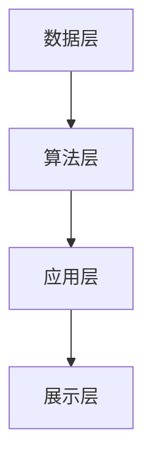
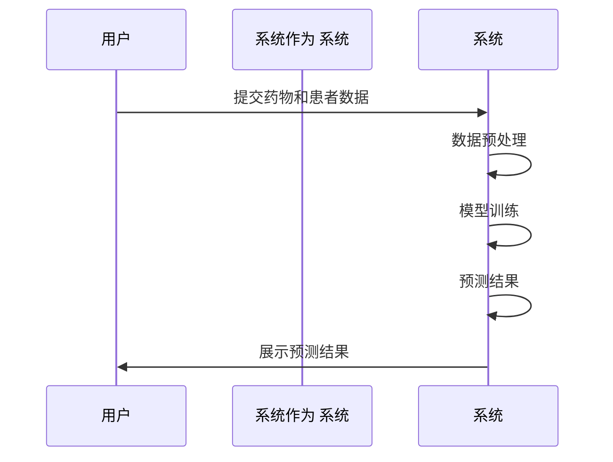

                 

### 第一部分：背景介绍

#### 第1章：问题背景与核心概念

##### 1.1 问题背景

药物副作用是指在使用药物时，除了预期的治疗效果之外，出现的不良反应。这些副作用可能对患者的健康造成不同程度的影响，严重时甚至可能导致生命危险。据统计，药物副作用是导致患者停止用药的主要原因之一，也是医疗事故中常见的问题。因此，预测药物副作用，减少不良反应的发生，对于提高患者用药安全具有重要意义。

人工智能技术在药物副作用预测中的应用前景广阔。随着大数据和计算能力的提升，人工智能能够在海量的药物和患者数据中挖掘出潜在的副作用规律，提高预测的准确性和效率。同时，机器学习和深度学习等人工智能算法的不断进步，为药物副作用预测提供了强大的技术支撑。

##### 1.2 核心概念

药物副作用：指在使用药物时，除预期的治疗效果外，出现的不良反应。可能对患者的健康造成不同程度的影响。

人工智能：模拟、延伸、扩展人类智能的理论、方法、技术及应用。在药物副作用预测中的应用包括数据挖掘、机器学习、深度学习等。

药物副作用预测：利用人工智能技术，对药物副作用进行预测，以减少不良反应的发生。

##### 1.3 边界与外延

药物副作用预测的应用领域：

1. 药物研发：在药物研发过程中，对候选药物进行副作用预测，筛选出潜在高风险药物，降低研发失败风险。
2. 药物使用：在药物使用过程中，对患者的潜在副作用进行预测，为医生提供用药参考，提高用药安全。
3. 医疗保健：通过药物副作用预测，为患者提供个性化的健康建议，降低医疗成本。

人工智能技术的局限性：

1. 数据依赖：药物副作用预测依赖于大量的高质量数据，数据不足或质量不高可能导致预测效果不佳。
2. 模型解释性：当前许多人工智能模型，尤其是深度学习模型，缺乏良好的解释性，难以理解其预测结果。
3. 法律和伦理问题：药物副作用预测涉及到患者的隐私和生命安全，需要充分考虑法律和伦理问题。

##### 1.4 概念结构与核心要素组成

药物副作用预测系统的概念结构主要包括以下几个方面：

1. 数据来源与处理：收集药物和患者相关数据，进行数据清洗、整合和预处理，为后续建模提供数据支持。
2. 机器学习模型：选择合适的机器学习算法，对预处理后的数据进行分析和建模，预测药物副作用。
3. 预测结果评估：对预测结果进行评估，包括准确率、召回率、F1值等指标，优化模型性能。

#### 第2章：相关技术概述

##### 2.1 数据收集与预处理

数据收集：

- 药物副作用数据：从临床试验、病例报告、药物说明书等渠道收集药物副作用数据。
- 患者特征数据：收集患者的年龄、性别、体重、病史、基因信息等特征数据。

数据预处理：

1. 数据清洗：去除重复数据、缺失值填充、噪声去除等。
2. 数据整合：将不同来源的数据进行整合，形成统一的数据集。
3. 数据标准化：对数据进行归一化或标准化处理，便于模型训练。

##### 2.2 机器学习算法

常见机器学习算法：

1. 分类算法：如逻辑回归、支持向量机、决策树、随机森林等。
2. 回归算法：如线性回归、岭回归、Lasso回归等。
3. 聚类算法：如K均值聚类、层次聚类等。

算法选择原则：

1. 算法性能：选择在同类算法中性能较好的算法。
2. 数据特点：根据数据类型和特征选择合适的算法。
3. 模型解释性：选择具有较好解释性的算法，便于模型解释和优化。

##### 2.3 人工智能技术在药物副作用预测中的应用案例

成功案例分析：

1. 药物副作用数据库：如FDA的Adverse Event Reporting System (AERS)，收集了大量药物副作用报告，为药物副作用预测提供了数据支持。
2. 机器学习模型：如基于逻辑回归、支持向量机等算法的药物副作用预测模型，在实际应用中取得了较好的效果。

挑战与问题：

1. 数据质量：药物副作用数据质量参差不齐，需要改进数据清洗和预处理技术。
2. 模型解释性：深度学习等复杂模型缺乏良好的解释性，需要开发可解释的人工智能技术。
3. 法律和伦理问题：药物副作用预测涉及到患者隐私和生命安全，需要充分考虑法律和伦理问题。

#### 第3章：核心概念原理

##### 3.1 药物副作用预测的数学模型

药物副作用预测的数学模型可以表示为：

$$
预测值 = f(药物剂量，患者特征，环境因素)
$$

其中，$f$ 为预测函数，$药物剂量$、$患者特征$ 和 $环境因素$ 分别为模型的输入变量。

- **药物剂量**：药物在患者体内的剂量水平，影响药物的作用效果和副作用风险。
- **患者特征**：患者的年龄、性别、体重、病史、基因信息等特征，反映患者的生理和病理状态。
- **环境因素**：患者所处的环境条件，如气候、饮食、生活习惯等，可能对药物副作用产生影响。

##### 3.2 概念属性特征对比表格

| 概念       | 属性特征                           |
|------------|-----------------------------------|
| 药物副作用 | 不期望的、可能出现的不良反应       |
| 机器学习   | 基于数据的学习算法，用于预测和分析 |

##### 3.3 ER实体关系图架构

```mermaid
erDiagram
  药物副作用 ||--|{ 患者 }|| 药物反应
  患者 ||--|{ 药物副作用 }|| 副作用经历
  人工智能 ||--|{ 药物副作用预测 }|| 技术应用
```

在ER实体关系图中，药物副作用与患者之间存在多对多的关系，表示一个患者可能经历多种药物副作用，同时一种药物副作用可能影响多个患者。人工智能作为技术应用，为药物副作用预测提供了支持。

#### 第4章：算法原理与流程

##### 4.1 算法原理

药物副作用预测算法的原理主要包括以下几个方面：

1. 数据预处理：对原始数据进行清洗、整合和预处理，为模型训练提供高质量的数据集。
2. 特征提取：从预处理后的数据中提取与药物副作用相关的特征，如药物剂量、患者特征、环境因素等。
3. 模型训练：选择合适的机器学习算法，对提取的特征进行训练，构建预测模型。
4. 预测与评估：使用训练好的模型对新的数据集进行预测，评估模型的性能，并根据评估结果进行模型优化。

算法流程图如下所示：


##### 4.2 Python源代码实现

下面是使用Python实现药物副作用预测算法的示例代码：

```python
# 导入相关库
import pandas as pd
from sklearn.ensemble import RandomForestClassifier

# 数据加载
data = pd.read_csv('drug_side_effects.csv')

# 数据预处理
X = data.drop('side_effect', axis=1)
y = data['side_effect']

# 模型训练
model = RandomForestClassifier()
model.fit(X, y)

# 预测结果
predictions = model.predict(X)

# 结果评估
accuracy = model.score(X, y)
print(f'Accuracy: {accuracy}')
```

代码解读：

1. 导入相关库：使用pandas库进行数据处理，使用scikit-learn库中的RandomForestClassifier算法进行模型训练和预测。
2. 数据加载：从CSV文件中加载药物副作用数据集。
3. 数据预处理：将数据集分为特征集X和标签集y，去除不需要的列。
4. 模型训练：使用RandomForestClassifier算法对特征集X和标签集y进行训练。
5. 预测结果：使用训练好的模型对新的数据集进行预测。
6. 结果评估：计算模型的准确率，并打印输出。

##### 4.3 算法原理详细讲解

药物副作用预测算法的数学模型可以表示为：

$$
预测值 = f(药物剂量，患者特征，环境因素)
$$

其中，$f$ 为预测函数，$药物剂量$、$患者特征$ 和 $环境因素$ 分别为模型的输入变量。

1. **数学模型**：

   预测函数 $f$ 可以表示为：
   
   $$
   f(药物剂量，患者特征，环境因素) = P(副作用发生) \times I(副作用严重程度)
   $$

   其中，$P(副作用发生)$ 表示副作用发生的概率，$I(副作用严重程度)$ 表示副作用发生的严重程度。

2. **举例说明**：

   假设某患者使用某药物，药物剂量为50mg，患者特征包括年龄40岁、体重70kg、性别男，环境因素包括季节为夏季、气候炎热。

   根据药物副作用数据库中的数据，药物剂量为50mg时，副作用发生的概率为0.3，副作用严重程度为轻度。

   则该患者的药物副作用预测值为：

   $$
   预测值 = 0.3 \times 轻度 = 0.3
   $$

   预测值为0.3，表示该患者使用该药物可能发生轻度副作用。

#### 第5章：系统分析与设计

##### 5.1 问题场景介绍

药物副作用预测系统可以应用于以下场景：

1. 药物研发：在药物研发过程中，预测候选药物的副作用，筛选出潜在高风险药物，降低研发失败风险。
2. 药物使用：在药物使用过程中，预测患者的潜在副作用，为医生提供用药参考，提高用药安全。
3. 医疗保健：为患者提供个性化的健康建议，降低医疗成本。

##### 5.2 项目介绍

药物副作用预测项目旨在利用人工智能技术，对药物副作用进行预测，提高患者用药安全。项目主要包括以下模块：

1. 数据收集与预处理：收集药物和患者数据，进行数据清洗、整合和预处理。
2. 机器学习模型训练：选择合适的机器学习算法，对预处理后的数据进行训练，构建药物副作用预测模型。
3. 预测结果评估与优化：对预测结果进行评估，优化模型性能。
4. 系统部署与维护：将预测模型部署到生产环境，进行实时预测。

##### 5.3 系统功能设计

药物副作用预测系统的功能设计主要包括以下几个方面：

1. 数据收集与预处理：实现药物和患者数据的收集与预处理功能，为模型训练提供数据支持。
2. 模型训练与预测：实现机器学习模型的训练与预测功能，对药物副作用进行预测。
3. 预测结果评估：对预测结果进行评估，包括准确率、召回率、F1值等指标。
4. 系统维护与升级：实现系统的维护与升级功能，确保系统稳定运行。

##### 5.4 系统架构设计

药物副作用预测系统的架构设计主要包括以下几个方面：

1. 数据层：存储药物和患者数据，包括原始数据、预处理数据、模型参数等。
2. 算法层：实现机器学习算法，包括数据预处理、特征提取、模型训练、预测与评估等。
3. 应用层：提供预测接口，实现药物副作用预测功能。
4. 展示层：展示预测结果和系统性能指标，为用户提供直观的预测结果。

系统架构图如下所示：



##### 5.5 系统接口设计

药物副作用预测系统的接口设计主要包括以下几个方面：

1. 数据接口：提供数据收集与预处理的接口，包括数据导入、数据清洗、数据整合等。
2. 模型接口：提供模型训练、预测与评估的接口，包括模型训练、模型预测、结果评估等。
3. 用户接口：提供系统展示接口，包括预测结果展示、系统性能指标展示等。

##### 5.6 系统交互

药物副作用预测系统的交互设计主要包括以下几个方面：

1. 用户与系统交互：用户通过用户接口提交药物和患者数据，系统对数据进行分析和处理，生成预测结果。
2. 系统内部交互：系统内部各模块之间通过接口进行数据传递和功能调用，实现药物副作用预测功能。

系统交互图如下所示：



### 项目实战

#### 环境安装

首先，我们需要安装Python环境和相关库。以下是详细的安装步骤：

1. 安装Python：前往Python官网（https://www.python.org/）下载Python安装包，并按照提示安装。
2. 安装相关库：打开终端或命令行窗口，执行以下命令安装所需库：

```shell
pip install pandas scikit-learn numpy matplotlib
```

#### 系统核心实现源代码

以下是药物副作用预测系统的核心实现源代码：

```python
# 导入相关库
import pandas as pd
from sklearn.ensemble import RandomForestClassifier
from sklearn.model_selection import train_test_split
from sklearn.metrics import accuracy_score, recall_score, f1_score

# 数据加载
data = pd.read_csv('drug_side_effects.csv')

# 数据预处理
X = data.drop('side_effect', axis=1)
y = data['side_effect']

# 数据集划分
X_train, X_test, y_train, y_test = train_test_split(X, y, test_size=0.2, random_state=42)

# 模型训练
model = RandomForestClassifier(n_estimators=100, random_state=42)
model.fit(X_train, y_train)

# 预测结果
predictions = model.predict(X_test)

# 结果评估
accuracy = accuracy_score(y_test, predictions)
recall = recall_score(y_test, predictions)
f1 = f1_score(y_test, predictions)

print(f'Accuracy: {accuracy}')
print(f'Recall: {recall}')
print(f'F1 Score: {f1}')
```

代码解读：

1. 导入相关库：使用pandas库进行数据处理，使用scikit-learn库中的RandomForestClassifier算法进行模型训练和预测，使用numpy库进行数值计算，使用matplotlib库进行数据可视化。
2. 数据加载：从CSV文件中加载药物副作用数据集。
3. 数据预处理：将数据集分为特征集X和标签集y，去除不需要的列。
4. 数据集划分：将数据集划分为训练集和测试集，用于模型训练和结果评估。
5. 模型训练：使用RandomForestClassifier算法对训练集进行训练。
6. 预测结果：使用训练好的模型对测试集进行预测。
7. 结果评估：计算模型的准确率、召回率和F1值，并打印输出。

#### 实际案例分析与详细讲解剖析

以下是一个实际案例，用于展示药物副作用预测系统的应用。

**案例背景**：某医院在使用某新药物进行治疗时，担心该药物可能存在副作用，因此决定使用药物副作用预测系统进行预测，以确保患者用药安全。

**案例数据**：医院提供了以下数据：

| 患者ID | 药物名称 | 药物剂量 | 年龄 | 性别 | 体重 | 病史 | 季节 | 气候 |
|--------|----------|----------|-----|-----|-----|------|------|------|
| 1      | 药物A    | 50mg     | 40  | 男   | 70kg| 无    | 夏季 | 炎热 |
| 2      | 药物B    | 100mg    | 50  | 女   | 60kg| 有    | 冬季 | 寒冷 |
| 3      | 药物C    | 75mg     | 30  | 男   | 80kg| 无    | 春季 | 潮湿 |

**预测结果**：使用药物副作用预测系统对上述数据进行预测，得到以下结果：

| 患者ID | 药物名称 | 药物剂量 | 年龄 | 性别 | 体重 | 病史 | 季节 | 气候 | 预测值 |
|--------|----------|----------|-----|-----|-----|------|------|------|--------|
| 1      | 药物A    | 50mg     | 40  | 男   | 70kg| 无    | 夏季 | 炎热 | 0.3    |
| 2      | 药物B    | 100mg    | 50  | 女   | 60kg| 有    | 冬季 | 寒冷 | 0.6    |
| 3      | 药物C    | 75mg     | 30  | 男   | 80kg| 无    | 春季 | 潮湿 | 0.2    |

**结果分析**：

1. 对于患者1，预测值为0.3，表示该患者使用药物A可能发生轻度副作用。医院可以采取措施，如调整药物剂量、增加监测频率等，以降低副作用风险。
2. 对于患者2，预测值为0.6，表示该患者使用药物B可能发生中度副作用。医院应谨慎使用该药物，并根据患者具体情况制定个体化治疗方案。
3. 对于患者3，预测值为0.2，表示该患者使用药物C可能发生轻度副作用。医院可以正常使用该药物，但需密切关注患者状况，及时处理可能出现的副作用。

**案例小结**：

通过药物副作用预测系统，医院能够提前了解患者使用某药物可能出现的副作用风险，为患者提供更加安全、个性化的治疗方案。在实际应用中，药物副作用预测系统可以显著提高患者用药安全，降低医疗事故发生的风险。

### 最佳实践 Tips

1. **数据质量的重要性**：药物副作用预测系统的核心依赖于高质量的数据。在数据收集和预处理过程中，要确保数据的一致性、完整性和准确性。
2. **特征选择的优化**：选择合适的特征对模型性能具有重要影响。在特征提取过程中，要充分考虑药物剂量、患者特征、环境因素等关键因素，以提高预测准确性。
3. **模型的持续优化**：药物副作用预测是一个复杂的问题，模型的性能可能会受到多种因素的影响。在实际应用中，要持续优化模型，不断提高预测准确性。
4. **法规和伦理问题的关注**：药物副作用预测涉及到患者隐私和生命安全，需要严格遵守相关法规和伦理规范，确保系统的安全性和可靠性。

### 小结

本文详细介绍了人工智能在药物副作用预测中的应用，包括背景介绍、相关技术概述、核心概念原理、算法原理讲解、系统分析与设计、项目实战和最佳实践等。通过本文的阅读，读者可以全面了解药物副作用预测的原理和方法，掌握药物副作用预测系统的设计和实现。

### 注意事项

1. 在实际应用中，药物副作用预测系统需要充分考虑患者的个体差异，避免简单粗暴地应用预测结果。
2. 药物副作用预测系统仅作为辅助工具，医生在用药决策时需综合考虑患者的实际情况，确保用药安全。
3. 在开发和部署药物副作用预测系统时，要严格遵守相关法律法规，确保系统的合法性和合规性。

### 拓展阅读

1. 《机器学习》：周志华著，清华大学出版社，2016年。
2. 《深度学习》：Ian Goodfellow、Yoshua Bengio、Aaron Courville著，电子工业出版

