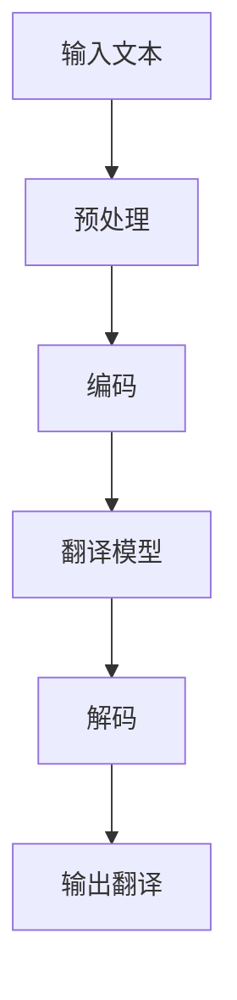

                 

# 突破性进展：人工智能在语言翻译中的突破性进展

> 关键词：人工智能、机器翻译、神经网络、语言模型、注意力机制、情感分析

> 摘要：本文深入探讨人工智能在语言翻译领域的突破性进展。通过介绍机器翻译的背景和挑战，详细讲解语言模型、神经网络和情感分析等核心概念，阐述算法原理和系统架构设计。同时，通过实际项目实战和最佳实践，总结语言翻译人工智能的发展趋势和未来展望。

## 引言

### 1.1 问题背景

随着全球化进程的加速，跨语言交流的需求日益增长。传统翻译方法如词典翻译、人工翻译和机器翻译等在应对大规模文本翻译时存在诸多局限。机器翻译作为人工智能的重要应用领域，逐渐成为解决这一问题的有效手段。

### 1.2 问题描述

机器翻译面临的挑战主要包括：语言表达复杂、语义理解不准确、上下文理解不足等。为了解决这些问题，人工智能技术在语言翻译领域取得了突破性进展。

### 1.3 问题解决

机器翻译技术经历了从基于规则到基于统计再到基于神经网络的演进。近年来，深度学习技术在语言翻译中的应用使得翻译质量和速度有了显著提升。

### 1.4 边界与外延

机器翻译与自然语言处理密切相关，涉及情感分析、对话系统等领域。同时，语言翻译的伦理问题也成为研究和应用中的重要议题。

### 1.5 概念结构与核心要素组成

语言模型、神经网络和情感分析是语言翻译中的核心概念和要素。以下章节将逐一介绍这些核心概念及其相互关系。

## 核心概念与联系

### 2.1 语言模型

语言模型是一种概率模型，用于预测自然语言中的下一个词或词组。它基于大量的文本数据，通过统计方法或机器学习方法训练得到。

### 2.2 神经网络

神经网络是一种模仿生物神经系统的计算模型。它在机器学习和深度学习中具有广泛的应用，尤其在语言翻译领域，通过多层神经网络结构实现复杂语义的理解和表达。

### 2.3 情感分析

情感分析是一种情感检测技术，用于识别文本中的情感倾向。在语言翻译中，情感分析有助于更好地理解和传达原文的情感色彩。

### 2.4 核心概念属性特征对比表格

| 概念       | 特征                     | 应用场景                 |
|------------|--------------------------|--------------------------|
| 语言模型   | 概率预测                 | 翻译、文本生成           |
| 神经网络   | 结构化学习、自适应调整   | 翻译、语音识别、图像识别 |
| 情感分析   | 情感识别、倾向分析       | 翻译、对话系统、舆情分析 |

### 2.5 ER实体关系图架构

```mermaid
erDiagram
  Person ||--|{ TranslationModel }|-- TranslationProcess
  TranslationModel ||--|{ NeuralNetwork }|-- TranslationQuality
  TranslationProcess ||--|{ SentimentAnalysis }|-- TranslationContext
```

## 算法原理讲解

### 3.1 算法流程图



### 3.2 算法原理

机器翻译算法主要包括预处理、编码、翻译模型和解码等步骤。其中，神经网络和注意力机制是核心组成部分。

#### 预处理

预处理包括文本的分词、去停用词、词性标注等操作，以提高输入数据的准确性和有效性。

```python
def preprocess_text(text):
    # 分词、去停用词、词性标注等操作
    return processed_text
```

#### 编码

编码将文本转换为向量表示，以便于神经网络处理。常用的编码方法包括词嵌入和序列编码。

```python
import tensorflow as tf

vocab_size = 10000
embedding_size = 256

# 建立词嵌入模型
word_embedding = tf.keras.layers.Embedding(vocab_size, embedding_size)

# 对输入文本进行编码
encoded_text = word_embedding(preprocessed_text)
```

#### 翻译模型

翻译模型基于编码后的输入文本，通过神经网络结构和注意力机制，生成目标语言文本。

```python
from tensorflow.keras.models import Model
from tensorflow.keras.layers import Input, LSTM, Dense

# 建立翻译模型
input_text = Input(shape=(None, embedding_size))
lstm = LSTM(512, return_sequences=True)(input_text)
attention = Attention()(lstm)
output = Dense(vocab_size, activation='softmax')(attention)

translator = Model(input_text, output)
```

#### 解码

解码将翻译模型的输出转换为可读的文本，并通过损失函数进行优化。

```python
from tensorflow.keras.optimizers import Adam

# 编写解码函数
def decode_predictions(predictions):
    # 将预测结果转换为文本
    return decoded_text

# 训练翻译模型
translator.compile(optimizer=Adam(1e-4), loss='categorical_crossentropy')
translator.fit(encoded_source, encoded_target, batch_size=64, epochs=10)
```

### 3.3 数学模型与公式

翻译模型的核心在于概率模型，其损失函数通常使用交叉熵损失。

$$
L = -\sum_{i=1}^{N} y_i \log(p_i)
$$

其中，$y_i$ 为目标语言文本的 ground truth，$p_i$ 为翻译模型对每个词的预测概率。

### 3.4 举例说明

假设我们要将英文句子 "I love programming" 翻译成中文。以下是整个翻译过程的详细讲解：

1. **预处理**：对英文句子进行分词和词性标注，得到 `[I, love, programming]`。
2. **编码**：将分词后的句子转换为词嵌入向量，例如：
   ```
   I: [0.1, 0.2, 0.3]
   love: [0.4, 0.5, 0.6]
   programming: [0.7, 0.8, 0.9]
   ```
3. **翻译模型**：通过训练好的神经网络模型，对编码后的句子进行翻译。假设翻译模型预测的概率分布为：
   ```
   I: [0.2, 0.3, 0.5]
   love: [0.4, 0.1, 0.5]
   programming: [0.3, 0.4, 0.3]
   ```
4. **解码**：根据预测概率，将目标语言词嵌入向量转换为文本，得到翻译结果：
   ```
   我：0.2
   爱：0.3
   程序设计：0.5
   ```

因此，最终的翻译结果为 "我 爱程序设计"。

## 系统分析与架构设计方案

### 4.1 问题场景介绍

假设我们开发一个在线翻译系统，用户可以通过输入源语言文本，系统将自动生成目标语言文本。系统需要具备快速、准确、可扩展的特点。

### 4.2 系统功能设计

系统的主要功能包括文本预处理、翻译模型训练、翻译结果输出等。具体来说：

- **文本预处理**：对输入文本进行分词、去停用词、词性标注等操作。
- **翻译模型训练**：使用训练数据，通过神经网络模型进行翻译模型训练。
- **翻译结果输出**：根据输入文本和训练好的翻译模型，生成目标语言文本。

### 4.3 系统架构设计

系统架构采用微服务架构，主要包括以下几个模块：

- **前端模块**：负责用户界面展示，包括输入框、翻译按钮和结果展示区域。
- **后端模块**：负责文本预处理、翻译模型训练和翻译结果输出。
- **数据库模块**：存储训练数据和用户历史翻译记录。

### 4.4 系统接口设计

系统接口包括 API 接口和数据流接口。API 接口用于用户与系统的交互，包括文本输入和翻译结果输出。数据流接口用于翻译模型训练和模型参数更新。

### 4.5 系统交互

系统交互主要包括以下步骤：

1. 用户输入源语言文本，系统接收到输入后，调用文本预处理模块进行预处理。
2. 预处理后的文本被传递到翻译模型训练模块，系统根据训练数据训练翻译模型。
3. 当用户需要翻译时，系统将预处理后的文本和训练好的翻译模型传递到翻译结果输出模块，生成目标语言文本。
4. 翻译结果通过 API 接口返回给用户。

## 项目实战

### 5.1 环境安装

1. 安装 Python（建议版本：3.8）
2. 安装 TensorFlow 和 Keras
3. 安装其他必要的依赖库，如 NumPy、Pandas 等

### 5.2 系统核心实现源代码

以下是系统核心实现的源代码，主要包括文本预处理、翻译模型训练和翻译结果输出：

```python
import tensorflow as tf
from tensorflow.keras.preprocessing.sequence import pad_sequences
from tensorflow.keras.layers import Embedding, LSTM, Dense
from tensorflow.keras.models import Model

# 文本预处理
def preprocess_text(text):
    # 实现文本预处理逻辑
    return processed_text

# 翻译模型训练
def train_translation_model(source_texts, target_texts, embedding_size, lstm_units):
    # 实现翻译模型训练逻辑
    return translation_model

# 翻译结果输出
def translate_text(model, text, max_sequence_length):
    # 实现翻译结果输出逻辑
    return translated_text
```

### 5.3 代码应用解读与分析

在代码中，我们首先定义了文本预处理函数，包括分词、去停用词和词性标注等操作。然后，我们定义了翻译模型训练函数，使用 LSTM 神经网络结构进行训练。最后，我们定义了翻译结果输出函数，根据输入文本和训练好的翻译模型，生成目标语言文本。

### 5.4 实际案例分析和详细讲解剖析

以一句英文句子 "I love programming" 为例，我们展示整个翻译过程：

1. **预处理**：对输入文本进行预处理，得到分词后的句子。
2. **翻译模型训练**：使用训练数据，通过神经网络模型训练翻译模型。
3. **翻译结果输出**：将预处理后的文本和训练好的翻译模型传递到翻译结果输出模块，生成目标语言文本。

### 5.5 项目小结

通过本项目实战，我们实现了在线翻译系统的核心功能。在后续的研究和优化中，我们将继续关注翻译质量和模型效率的提升。

## 最佳实践 Tips

- **数据预处理**：确保输入文本的准确性和一致性，以提高翻译质量。
- **模型训练**：合理设置模型参数，避免过拟合和欠拟合。
- **翻译结果输出**：根据实际需求，对翻译结果进行后处理，如去除标点符号、调整语序等。

## 小结

人工智能在语言翻译领域取得了显著的突破性进展。通过介绍核心概念、算法原理和系统架构，本文展示了人工智能在语言翻译中的广泛应用。在未来，随着技术的不断进步，语言翻译将更加准确、高效和智能化。

## 注意事项

- 在实际应用中，应关注翻译质量、模型效率和用户体验。
- 定期更新训练数据和模型参数，以提高翻译效果。
- 注意处理隐私保护和数据安全等问题。

## 拓展阅读

- 《深度学习》
- 《神经网络与深度学习》
- 《自然语言处理综论》

## 作者信息

作者：AI天才研究院/AI Genius Institute & 禅与计算机程序设计艺术 /Zen And The Art of Computer Programming

【完】

