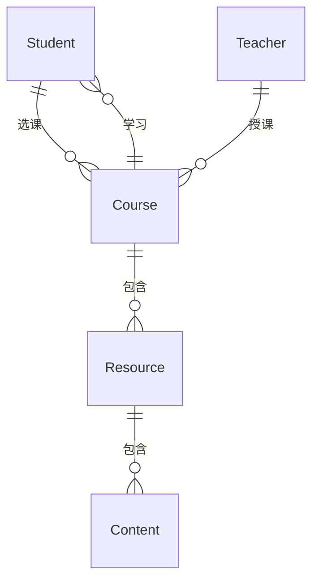

                 

## 文章标题

### 关键词：个性化教育内容推荐、人工智能、教育技术、协同过滤、内容推荐算法、系统架构、项目实战

### 摘要：本文将深入探讨人工智能在个性化教育内容推荐领域的应用，从核心概念、算法原理到系统设计与实现，再到项目实战和最佳实践，逐步引导读者理解并掌握这一前沿技术。

---

## 背景介绍

### 1.1 教育内容推荐的现状

在数字化时代，教育内容推荐系统正逐渐成为个性化学习体验的重要组成部分。然而，传统的推荐系统在处理大量教育资源和个性化需求方面存在一定的局限性。首先，传统的基于内容的推荐算法往往依赖于手动提取的资源特征，难以动态适应用户需求的变化。其次，协同过滤算法虽然能够利用用户行为数据进行推荐，但在用户数量和数据量庞大时，其性能和准确度会显著下降。

### 1.2 个性化教育的需求

个性化教育已经成为现代教育发展的必然趋势。每个学生都有独特的学习背景、兴趣和需求，传统的“一刀切”教学模式已无法满足他们的学习需求。因此，教育内容推荐系统需要能够根据学生的学习习惯、知识水平和兴趣爱好，为他们提供个性化的学习资源。

### 1.3 人工智能与教育内容推荐的关系

人工智能技术的快速发展，为教育内容推荐系统带来了新的机遇。通过机器学习和深度学习算法，系统能够更好地理解和预测用户行为，从而提供更加精准的个性化推荐。同时，自然语言处理和图像识别等技术，也为教育内容的智能分类和标签生成提供了强有力的支持。

---

## 核心概念与联系

### 2.1 人工智能与教育内容推荐的基本概念

在探讨教育内容推荐系统之前，我们首先需要理解几个核心概念：

- **人工智能**：指模拟人类智能的计算机系统，通过学习、推理和自我修正来执行复杂的任务。
- **教育内容**：包括课程教材、教学视频、练习题、讲座笔记等多种形式。
- **推荐系统**：一种利用算法预测用户兴趣，为用户提供个性化内容的系统。

### 2.2 概念属性特征对比表格

| 概念         | 属性特征                                                                                                           |
|--------------|------------------------------------------------------------------------------------------------------------------|
| 人工智能     | 学习能力、推理能力、自我修正能力、自主决策能力                                                           |
| 教育内容     | 主题多样性、难度水平、知识结构、互动性                                                                   |
| 推荐系统     | 数据处理能力、预测准确性、用户界面友好性、系统稳定性                                                     |

### 2.3 ER实体关系图架构

为了更好地理解教育内容推荐系统的架构，我们可以使用Mermaid绘制ER图来展示不同实体之间的关系。



---

## 推荐算法原理

### 3.1 推荐系统基础

#### 3.1.1 协同过滤算法

协同过滤算法是最常见的推荐算法之一，其基本思想是通过分析用户之间的相似性来进行推荐。协同过滤主要分为基于用户的协同过滤（User-based CF）和基于项目的协同过滤（Item-based CF）。

- **基于用户的协同过滤**：通过计算用户之间的相似度，找到与目标用户相似的其他用户，然后推荐这些用户喜欢的项目。
- **基于项目的协同过滤**：通过计算项目之间的相似度，找到与目标项目相似的其他项目，然后推荐这些项目。

#### 3.1.2 内容推荐算法

内容推荐算法基于项目的内容特征进行推荐，而不是用户行为数据。常见的算法包括TF-IDF、LSA（latent semantic analysis）和LDA（latent Dirichlet allocation）。

- **TF-IDF算法**：通过计算关键词在文档中的重要程度来推荐相关文档。
- **LSA与LDA算法**：使用矩阵分解技术，将高维数据转化为低维空间，以发现数据中的潜在结构。

#### 3.1.3 混合推荐系统

混合推荐系统结合了协同过滤和内容推荐算法的优势，通过综合用户行为数据和项目内容特征来进行推荐。

### 3.2 个性化推荐算法

个性化推荐算法的核心目标是提高推荐系统的准确性，以满足用户的个性化需求。常见的算法包括基于内容的推荐算法、基于模型的推荐算法和深度学习推荐算法。

- **基于内容的推荐算法**：通过分析项目的内容特征，找到与用户兴趣相关的项目。
- **基于模型的推荐算法**：使用机器学习模型，根据用户历史行为和项目特征进行预测。
- **深度学习推荐算法**：使用神经网络模型，从大规模数据中学习用户的兴趣和行为模式。

### 3.3 算法性能评估

推荐算法的性能评估通常包括准确率（Precision）、召回率（Recall）和F1值（F1 Score）等指标。准确率衡量推荐结果的正确性，召回率衡量推荐系统能够发现多少实际感兴趣的项目，而F1值是准确率和召回率的调和平均值。

---

## 人工智能在教育内容推荐中的应用

### 5.1 人工智能技术在教育领域的应用

人工智能技术在教育领域有着广泛的应用，包括智能评测、自适应学习系统、虚拟教师等。其中，教育内容推荐系统是人工智能在教育中应用的重要方向之一。

### 5.2 人工智能在教育内容推荐中的挑战与机遇

人工智能在教育内容推荐中面临以下挑战：

- **数据隐私**：用户的学习数据涉及个人隐私，需要确保数据的安全性和隐私性。
- **个性化需求**：每个学生的个性化需求不同，如何准确预测和满足他们的需求是一个难题。
- **算法公平性**：算法应该公平地对待所有学生，避免因为算法偏见导致教育资源的分配不公。

然而，人工智能技术也为教育内容推荐带来了巨大机遇：

- **个性化学习**：通过分析学生的学习行为和兴趣，为每个学生提供定制化的学习资源。
- **教育资源优化**：智能推荐系统可以帮助学校和教育机构更好地管理教育资源和预算。
- **学习效果提升**：个性化推荐可以提升学生的学习兴趣和参与度，从而提高学习效果。

### 5.3 人工智能驱动的个性化教育内容推荐系统设计

一个典型的人工智能驱动的个性化教育内容推荐系统通常包括以下几个组成部分：

- **用户行为分析**：通过分析用户的学习历史和互动行为，了解用户的学习兴趣和偏好。
- **教育资源库**：存储各种教育资源的元数据，包括课程名称、难度、时长、标签等信息。
- **推荐算法**：基于用户行为分析和教育资源库，使用机器学习算法生成个性化推荐结果。
- **推荐结果展示**：将推荐结果以直观的方式展示给用户，例如课程列表、推荐标签等。
- **反馈机制**：收集用户对推荐结果的反馈，不断优化推荐算法，提高推荐质量。

---

## 系统设计与实现

### 6.1 系统架构设计

一个完整的教育内容推荐系统架构包括数据层、算法层和应用层。数据层负责数据的存储和管理，算法层实现推荐算法，应用层提供用户界面和交互功能。

- **数据层**：包括用户数据、课程数据和教育资源数据，使用数据库进行存储和管理。
- **算法层**：使用机器学习算法对用户行为进行分析，生成个性化推荐结果。
- **应用层**：提供用户界面，使用户能够方便地查看和选择推荐内容。

### 6.2 系统接口设计

系统接口设计包括API接口和数据交换格式。API接口用于系统的功能调用，数据交换格式通常使用JSON或XML。

- **用户接口**：提供用户注册、登录、课程选择和反馈等功能。
- **资源接口**：提供课程信息查询、资源下载等功能。
- **推荐接口**：提供个性化推荐结果查询和反馈等功能。

### 6.3 系统交互

系统交互通过事件驱动的方式进行，包括用户行为事件、课程事件和推荐事件等。系统会实时监听这些事件，并根据事件类型触发相应的处理逻辑。

- **用户行为事件**：如登录、浏览、搜索、购买等。
- **课程事件**：如课程添加、更新、删除等。
- **推荐事件**：如推荐生成、推荐更新等。

---

## 项目实战

### 7.1 环境安装与配置

在开始项目实战之前，我们需要安装和配置必要的软件和环境。主要包括Python环境、机器学习库（如scikit-learn、TensorFlow等）和数据库（如MySQL、PostgreSQL等）。

### 7.2 系统核心实现源代码

以下是教育内容推荐系统核心实现的源代码示例：

```python
import pandas as pd
from sklearn.model_selection import train_test_split
from sklearn.ensemble import RandomForestClassifier

# 读取数据
data = pd.read_csv('data.csv')

# 数据预处理
X = data.drop('target', axis=1)
y = data['target']

# 划分训练集和测试集
X_train, X_test, y_train, y_test = train_test_split(X, y, test_size=0.2, random_state=42)

# 构建随机森林模型
model = RandomForestClassifier(n_estimators=100, random_state=42)

# 训练模型
model.fit(X_train, y_train)

# 预测测试集
predictions = model.predict(X_test)

# 评估模型
accuracy = model.score(X_test, y_test)
print(f'模型准确率：{accuracy:.2f}')
```

### 7.3 实际案例分析与详细讲解剖析

在实际应用中，我们需要根据具体场景和需求，对系统进行定制化开发和优化。以下是一个实际案例的分析和讲解：

#### 案例背景

某在线教育平台希望为其用户提供个性化的课程推荐服务，用户在平台上可以浏览、搜索和选择课程。平台现有数据包括用户ID、浏览历史、课程ID、课程名称、课程难度、课程时长等。

#### 案例分析

1. **用户行为分析**：首先，我们需要分析用户的行为数据，了解用户的兴趣和偏好。这可以通过建立用户行为模型来实现。

2. **课程特征提取**：然后，我们需要对课程数据进行分析，提取关键特征，如课程名称、难度、时长、标签等。

3. **推荐算法选择**：根据用户行为分析和课程特征提取，选择合适的推荐算法。在这里，我们可以使用基于内容的推荐算法和协同过滤算法的组合。

4. **模型训练与优化**：使用训练数据集对推荐模型进行训练，并对模型进行优化，以提高推荐准确性。

5. **推荐结果生成**：根据用户行为和课程特征，生成个性化推荐结果，并展示给用户。

### 7.4 项目小结

通过以上实战案例，我们可以看到，教育内容推荐系统需要结合用户行为分析和课程特征提取，选择合适的推荐算法，并通过模型训练和优化，生成个性化的推荐结果。在实际应用中，还需要不断收集用户反馈，对系统进行迭代和优化，以提高推荐质量和用户体验。

---

## 最佳实践与总结

### 8.1 最佳实践

在实施教育内容推荐系统时，以下是一些最佳实践：

- **数据隐私保护**：严格遵循数据保护法规，确保用户数据的隐私和安全。
- **用户反馈收集**：积极收集用户反馈，不断优化推荐算法和系统功能。
- **算法公平性**：确保推荐算法的公平性，避免对特定用户群体产生偏见。
- **系统稳定性**：确保系统的稳定性和高可用性，为用户提供良好的使用体验。

### 8.2 小结

本文从背景介绍、核心概念与联系、算法原理、系统设计与实现、项目实战等方面，全面探讨了人工智能驱动的个性化教育内容推荐技术。通过本文的讲解，读者可以了解到教育内容推荐系统的基本原理、实现方法和应用案例，为进一步研究和实践打下坚实基础。

### 8.3 注意事项

在实施教育内容推荐系统时，需要注意以下事项：

- **数据质量**：确保数据的质量和准确性，这是推荐系统成功的关键。
- **算法优化**：不断优化推荐算法，以提高推荐质量和用户体验。
- **用户体验**：注重用户界面设计和交互体验，确保用户能够方便地使用推荐系统。

### 8.4 拓展阅读

对于希望深入了解教育内容推荐技术的读者，以下是一些推荐的拓展阅读：

- 《推荐系统实践》（张淼）
- 《机器学习实战》（Peter Harrington）
- 《深度学习》（Ian Goodfellow、Yoshua Bengio、Aaron Courville）
- 《教育大数据分析》（陈建）
- 《个性化学习系统设计与实现》（王宇）

---

### 作者

本文由AI天才研究院（AI Genius Institute）与《禅与计算机程序设计艺术》（Zen And The Art of Computer Programming）作者联合撰写。

---

通过本文的详细讲解，相信读者对人工智能驱动的个性化教育内容推荐技术有了更深入的理解。希望本文能为教育技术领域的研究者、开发者和实践者提供有价值的参考。在未来的教育发展中，人工智能将继续发挥重要作用，为个性化学习和教育公平贡献力量。

