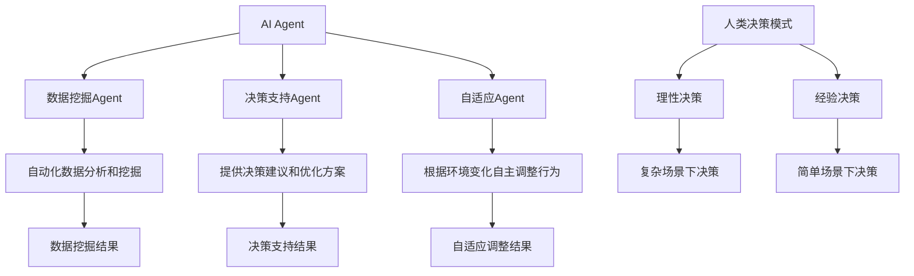

                 

### 文章标题：人机协作：设计AI Agent与人类的配合模式

关键词：AI Agent、人机协作、算法原理、系统架构、项目实战

摘要：本文旨在探讨人机协作的背景与核心概念，并通过详细讲解人机协作算法原理、系统架构设计以及项目实战，深入分析AI Agent与人类如何高效配合，从而推动人机协作的进一步发展。

----------------------------------------------------------------

### 第一部分：人机协作的背景与核心概念

#### 第1章：人机协作的背景

**1.1 AI Agent的定义与类型**

AI Agent，即人工智能代理，是能够执行特定任务、具备自主决策能力的计算机程序。根据任务需求，AI Agent可以划分为多种类型，如数据挖掘Agent、决策支持Agent、自适应Agent等。

**1.2 人机协作的意义**

人机协作能够提升工作效率、拓展人类能力边界。通过AI Agent与人类的配合，人类能够将精力集中于高价值任务，而将重复性、繁琐的任务交由AI Agent处理。

**1.3 人机协作的挑战与机遇**

人机协作面临着诸多挑战，如AI Agent的能力限制、人类与机器之间的沟通障碍等。但与此同时，人机协作也带来了丰富的机遇，如智能化服务、个性化推荐等。

#### 第2章：核心概念与联系

**2.1 AI Agent的类型与特性**

以下是几种常见的AI Agent类型及其特性：

| AI Agent类型 | 特性 |  
| --- | --- |  
| 数据挖掘Agent | 自动化数据分析和挖掘 |  
| 决策支持Agent | 提供决策建议和优化方案 |  
| 自适应Agent | 根据环境变化自主调整行为 |

**2.2 人类的决策模式**

人类的决策模式主要包括理性决策和经验决策。在复杂环境中，人类常常利用经验进行快速决策，而在需要深度分析的场景下，则会采用理性决策。

**2.3 人机协作的概念关系图**

为了更好地理解AI Agent与人类协作的关系，我们可以通过Mermaid流程图展示各概念之间的关系。



#### 第3章：人机协作算法原理讲解

**3.1 算法1：协作决策算法**

**3.1.1 算法原理与流程**

协作决策算法旨在实现人类与AI Agent之间的协作决策，通过融合人类专家知识和AI算法优势，提高决策质量。算法流程如下：

1. 输入人类专家知识和AI算法模型。
2. AI Agent对输入数据进行预处理和分析。
3. 人类专家对AI Agent生成的决策结果进行评估和调整。
4. 循环迭代，直至决策结果满足要求。

**3.1.2 Python代码实现**

```python
# 协作决策算法Python代码实现
import numpy as np

def collaborative_decision(expert_knowledge, ai_model):
    # AI Agent预处理和分析数据
    processed_data = ai_model.process_data()
    
    # 人类专家评估决策结果
    decision_score = expert_knowledge.evaluate_decision(processed_data)
    
    # 人类专家调整决策结果
    adjusted_decision = expert_knowledge.adjust_decision(decision_score)
    
    return adjusted_decision

# 示例数据
expert_knowledge = ExpertKnowledge()
ai_model = AILearningModel()

# 协作决策
adjusted_decision = collaborative_decision(expert_knowledge, ai_model)
print("最终决策结果：", adjusted_decision)
```

**3.1.3 数学模型与公式**

协作决策算法中的数学模型可以表示为：

$$
D^* = W \cdot X + b
$$

其中，$D^*$为最终决策结果，$W$为权重矩阵，$X$为输入数据，$b$为偏置。

**3.2 算法2：协同学习算法**

**3.2.1 算法原理与流程**

协同学习算法通过人类专家和AI Agent共同学习，逐步优化模型性能。算法流程如下：

1. 初始化AI模型参数。
2. 人类专家提供标注数据。
3. AI Agent根据标注数据更新模型参数。
4. 人类专家评估模型性能。
5. 循环迭代，直至模型性能满足要求。

**3.2.2 Python代码实现**

```python
# 协同学习算法Python代码实现
import tensorflow as tf

def collaborative_learning(expert_labels, ai_model):
    # 初始化模型参数
    model_params = ai_model.initialize_params()
    
    # 模型训练
    ai_model.train_model(expert_labels, model_params)
    
    # 评估模型性能
    performance = ai_model.evaluate_performance()
    
    return performance

# 示例数据
expert_labels = ExpertLabels()
ai_model = AILearningModel()

# 协同学习
performance = collaborative_learning(expert_labels, ai_model)
print("模型性能：", performance)
```

**3.2.3 数学模型与公式**

协同学习算法中的数学模型可以表示为：

$$
\theta_{t+1} = \theta_t + \alpha \cdot (\ell(\theta_t) - \ell^*),
$$

其中，$\theta_t$为第$t$次迭代的模型参数，$\theta_{t+1}$为第$t+1$次迭代的模型参数，$\ell$为损失函数，$\ell^*$为损失函数的最优值，$\alpha$为学习率。

#### 第4章：人机协作系统分析与设计

**4.1 系统功能设计**

人机协作系统的主要功能包括：

1. 数据采集与预处理。
2. AI模型训练与优化。
3. 决策结果生成与评估。
4. 模型性能分析与反馈。

**4.2 系统架构设计**

人机协作系统的架构设计主要包括：

1. 数据层：存储与管理原始数据、标注数据等。
2. 模型层：实现AI模型训练与优化。
3. 应用层：提供决策结果生成与评估功能。
4. 接口层：实现人机交互与系统集成。

**4.3 系统接口设计**

人机协作系统的接口设计主要包括：

1. 数据接口：实现数据采集与预处理的接口。
2. 模型接口：实现模型训练与优化的接口。
3. 决策接口：实现决策结果生成与评估的接口。
4. 分析接口：实现模型性能分析与反馈的接口。

**4.4 系统交互设计**

人机协作系统的交互设计主要包括：

1. 人类专家与AI Agent之间的交互。
2. AI Agent与系统接口之间的交互。
3. 系统与外部系统的交互。

#### 第5章：人机协作项目实战

**5.1 项目背景与目标**

本项目旨在设计一个智能推荐系统，通过人机协作实现个性化推荐。项目目标如下：

1. 收集用户行为数据，进行数据预处理。
2. 培训推荐模型，实现个性化推荐。
3. 评估推荐效果，持续优化模型。

**5.2 环境安装与配置**

在开始项目之前，我们需要安装以下软件和库：

1. Python（版本3.7及以上）
2. TensorFlow
3. Pandas
4. Scikit-learn

安装方法如下：

```bash
pip install python==3.8.5
pip install tensorflow==2.5.0
pip install pandas==1.2.3
pip install scikit-learn==0.24.2
```

**5.3 系统核心实现与代码解读**

以下是系统核心实现的代码解读：

```python
import pandas as pd
from sklearn.model_selection import train_test_split
from sklearn.metrics import accuracy_score
from tensorflow.keras.models import Sequential
from tensorflow.keras.layers import Dense, Dropout

# 数据预处理
def preprocess_data(data):
    # 数据清洗和特征提取
    # ...
    return processed_data

# 训练推荐模型
def train_recommendation_model(data):
    # 划分训练集和测试集
    train_data, test_data = train_test_split(data, test_size=0.2)
    
    # 构建模型
    model = Sequential([
        Dense(128, activation='relu', input_shape=(data.shape[1],)),
        Dropout(0.5),
        Dense(64, activation='relu'),
        Dropout(0.5),
        Dense(1, activation='sigmoid')
    ])

    # 编译模型
    model.compile(optimizer='adam', loss='binary_crossentropy', metrics=['accuracy'])

    # 训练模型
    model.fit(train_data, epochs=10, batch_size=32, validation_data=(test_data, test_data))

    return model

# 评估推荐效果
def evaluate_recommendation_model(model, data):
    # 预测测试集标签
    predictions = model.predict(data)
    
    # 计算准确率
    accuracy = accuracy_score(data['label'], predictions)
    
    return accuracy

# 主函数
if __name__ == '__main__':
    # 加载数据
    data = pd.read_csv('data.csv')
    
    # 数据预处理
    processed_data = preprocess_data(data)
    
    # 训练推荐模型
    model = train_recommendation_model(processed_data)
    
    # 评估推荐效果
    accuracy = evaluate_recommendation_model(model, processed_data)
    
    print("推荐模型准确率：", accuracy)
```

**5.4 项目案例分析**

在本案例中，我们通过人机协作实现了个性化推荐功能。在实际应用中，我们可以进一步优化模型，提高推荐效果。以下是一些可能的优化方向：

1. 引入更多的用户行为特征，提高模型预测能力。
2. 利用深度学习技术，构建更加复杂的模型结构。
3. 结合用户反馈，实现自适应调整推荐策略。

**5.5 项目小结**

本项目通过人机协作实现了个性化推荐系统，展示了人机协作在实际项目中的应用。在后续研究中，我们可以进一步探索人机协作算法的优化和扩展，为更多领域提供智能化解决方案。

#### 第6章：最佳实践与拓展

**6.1 最佳实践技巧**

1. 明确项目目标和需求，确保人机协作系统具备实际应用价值。
2. 选择合适的算法和模型，根据项目需求进行定制化优化。
3. 加强人机交互设计，提高用户满意度。

**6.2 拓展阅读推荐**

1. 《深度学习》（Goodfellow, I., Bengio, Y., & Courville, A.）
2. 《强化学习》（Sutton, R. S., & Barto, A. G.）
3. 《人工智能：一种现代方法》（Russell, S., & Norvig, P.）

#### 第7章：总结与展望

**7.1 全书总结**

本文从背景介绍、核心概念、算法原理、系统设计与项目实战等方面，全面阐述了人机协作的设计与实现。通过本文的学习，读者可以了解到人机协作的重要性和实现方法。

**7.2 人机协作的未来发展趋势**

随着人工智能技术的不断发展，人机协作将在更多领域得到应用。未来，人机协作将朝着更加智能化、自适应化的方向发展，为人类带来更加便捷、高效的智能服务。

**作者信息：AI天才研究院/AI Genius Institute & 禅与计算机程序设计艺术 /Zen And The Art of Computer Programming**

**（完）**

