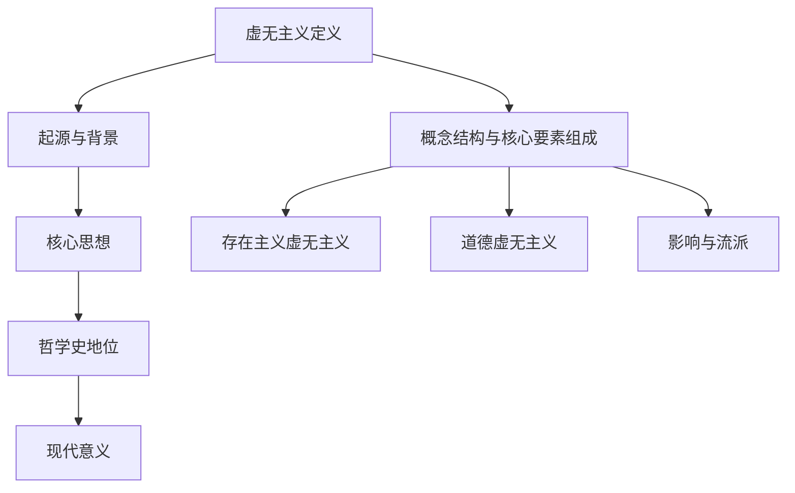

                 

## 引言：虚无主义的定义与背景

### 1.1 虚无主义的定义

虚无主义（Nihilism）是一个哲学上的概念，源自拉丁语 "nihil"，意为“无”。虚无主义认为，宇宙和生活的本质是毫无意义和目的的。它不仅仅是一种消极的态度，更是一种哲学立场，强调不存在任何固有或客观的价值、目的或意义。

虚无主义的起源可以追溯到古希腊哲学，尤其是斯多葛学派。然而，虚无主义作为一个独立的思想流派，主要出现在19世纪末和20世纪初，特别是在西方哲学中。德国哲学家尼采（Friedrich Nietzsche）是虚无主义的代表人物之一，他的作品深刻地探讨了虚无主义的本质和影响。

### 1.1.1 虚无主义的起源

虚无主义的思想源远流长，其起源可以追溯到古希腊哲学。斯多葛学派认为，宇宙的本质是理性的，而虚无主义则从另一个角度提出了质疑：如果宇宙是理性的，那么生命的意义何在？这种质疑最终导致了虚无主义的产生。

在中世纪，基督教哲学对虚无主义进行了回应。基督教认为，生命有固有的意义，因为上帝创造了世界，并赋予人类目的。然而，随着文艺复兴和启蒙运动的发展，人类开始重新审视自然和生命的本质，虚无主义的思想再次兴起。

### 1.1.2 虚无主义的核心思想

虚无主义的核心思想是，宇宙和生活缺乏固有的意义和目的。虚无主义者认为，人类试图找到生命意义的努力是徒劳的，因为生命本身并没有任何内在的价值。这种观点通常伴随着对传统价值观和宗教信仰的批判。

虚无主义不仅仅是一种消极的哲学，它也可以是一种积极的哲学。尼采就是一位积极的虚无主义者，他认为，通过否定传统价值观，人类可以解放自己，创造出新的价值。加缪（Albert Camus）也是一位虚无主义者，但他提出了“荒谬主义”（Absurdism）的概念，认为人类可以通过对抗荒谬来找到生命的意义。

### 1.2 虚无主义在哲学史上的地位

虚无主义在哲学史上具有重要地位，它挑战了传统的价值体系，促使人们重新思考生命的意义。虚无主义的思想不仅影响了哲学，还影响了文学、艺术和心理学等领域。

在19世纪末和20世纪初，虚无主义成为西方哲学的重要流派之一。尼采和加缪是虚无主义思想的代表人物，他们的作品深刻地探讨了虚无主义的本质和影响。尼采的《悲剧的诞生》、《扎拉图斯特拉如是说》等作品，对虚无主义进行了深入的剖析；加缪的《西西弗斯的神话》、《鼠疫》等作品，则通过文学的形式，表达了虚无主义的主题。

### 1.2.1 虚无主义的思想源流

虚无主义的思想源流可以追溯到古希腊哲学。斯多葛学派认为，宇宙的本质是理性的，而虚无主义则从另一个角度提出了质疑：如果宇宙是理性的，那么生命的意义何在？这种质疑最终导致了虚无主义的产生。

在中世纪，基督教哲学对虚无主义进行了回应。基督教认为，生命有固有的意义，因为上帝创造了世界，并赋予人类目的。然而，随着文艺复兴和启蒙运动的发展，人类开始重新审视自然和生命的本质，虚无主义的思想再次兴起。

### 1.2.2 虚无主义的主要流派

虚无主义在哲学史上有许多不同的流派，其中最著名的包括存在主义虚无主义和道德虚无主义。

存在主义虚无主义认为，由于宇宙缺乏固有意义，人类的存在本身就没有意义。尼采和加缪都是存在主义虚无主义的代表。尼采通过否定传统价值观，提出了“超人”的概念，试图创造新的价值体系；加缪则通过“荒谬主义”的概念，认为人类可以通过对抗荒谬来找到生命的意义。

道德虚无主义则认为，道德原则本身缺乏客观基础，因此道德判断是没有意义的。这种观点通常与尼采的思想相联系，尼采认为，道德是弱者的借口，真正的强者应该超越道德的束缚。

### 1.3 虚无主义的现代意义

虚无主义在现代社会中仍然具有重要的意义。它挑战了传统的价值观和信仰体系，促使人们重新思考生命的意义。虚无主义的思想不仅影响了哲学，还影响了文学、艺术和心理学等领域。

在现代社会，虚无主义的思想体现在许多方面。例如，在心理学中，存在主义心理学强调个体的自由意志和自我实现，这与虚无主义的理念相呼应。在文学中，许多作品探讨了人类的孤独和无意义，这些主题与虚无主义的思想密切相关。

### 1.3.1 虚无主义在当代社会的体现

在当代社会，虚无主义的思想体现在许多方面。例如，在青少年中，虚无主义的思想可能导致厌学、逃学和自我放弃。在成年人中，虚无主义的思想可能导致对生活失去热情，甚至产生自杀倾向。

此外，虚无主义的思想也影响了政治和社会领域。在政治上，虚无主义可能导致对民主制度的怀疑和对权威的反抗。在社会上，虚无主义的思想可能导致对传统价值观的批判和对现代社会的反思。

### 1.3.2 虚无主义对现代哲学的影响

虚无主义对现代哲学产生了深远的影响。它挑战了传统的价值体系和道德观念，促使哲学家们重新思考生命的意义和存在的价值。虚无主义的思想也为哲学的发展提供了新的视角和思路。

在现代哲学中，许多哲学家都受到了虚无主义的影响。例如，海德格尔（Martin Heidegger）的“存在主义”哲学，强调了个体存在的意义和自由意志；萨特（Jean-Paul Sartre）的“存在主义”哲学，则强调了人类自由选择的重要性。

### 1.4 本章小结

本章介绍了虚无主义的定义、起源和现代意义。虚无主义认为，宇宙和生活缺乏固有的意义和目的，它挑战了传统的价值观和宗教信仰。在哲学史上，虚无主义有许多不同的流派，其中最著名的是存在主义虚无主义和道德虚无主义。虚无主义在现代社会中仍然具有重要的意义，它影响了哲学、文学、艺术和心理学等领域。下一章，我们将深入探讨尼采与虚无主义的关系。<!--Mermaid流程图：概念结构与核心要素组成

## 尼采与虚无主义

弗里德里希·尼采（Friedrich Nietzsche）是19世纪德国的著名哲学家，他的思想对现代哲学产生了深远的影响。尼采被认为是虚无主义的代表人物之一，他的许多著作，如《悲剧的诞生》、《扎拉图斯特拉如是说》和《善恶的彼岸》，都涉及了对虚无主义的探讨。

### 2.1 尼采的哲学思想

尼采的哲学思想非常复杂，但他的一些核心概念，如“超人”（Übermensch）、“权力意志”（Wille zur Macht）和“永恒回归”（Ewige Wiederkunft），对他的哲学体系至关重要。

#### 2.1.1 尼采的生平背景

尼采出生于1844年，他的早年生活相对平凡，但他对哲学的兴趣非常浓厚。尼采在学术上取得了很高的成就，他曾是德国著名哲学家黑格尔和叔本华的追随者。然而，尼采的思想逐渐超越了传统哲学的框架，提出了许多革命性的观点。

#### 2.1.2 尼采的核心概念

尼采的核心概念之一是“超人”。超人是一个理想的人类形象，具有超越传统道德和价值观的能力。尼采认为，超人将通过自我超越和自我创造，实现真正的自我价值。

另一个重要概念是“权力意志”。尼采认为，宇宙的本质是一种无穷无尽的创造力，这种创造力表现为权力意志。权力意志是人类本能的一部分，它驱使人类不断追求权力、控制和创造。

最后是“永恒回归”。尼采认为，宇宙是一个无限循环的过程，每个个体都将在永恒的循环中重复同样的经历。这种观点挑战了传统的线性时间观念，提出了一个更复杂的宇宙观。

### 2.2 尼采对虚无主义的看法

尼采对虚无主义的看法是复杂而深刻的。他认为，虚无主义是一种必然的趋势，因为传统的价值观和宗教信仰正在崩溃。然而，尼采并不认为虚无主义是一个消极的现象，相反，他将其视为一种解放。

#### 2.2.1 尼采如何理解虚无主义

尼采认为，虚无主义是现代文明的产物，它源于对传统价值观的否定。尼采指出，现代人类面临着两种选择：要么接受虚无主义，要么创造出新的价值体系。

尼采认为，虚无主义是一种表面的现象，它掩盖了更深层次的问题：人类对自我价值和存在的寻求。尼采认为，现代人类在寻找生命意义的过程中，陷入了自我怀疑和迷茫。

#### 2.2.2 尼采如何应对虚无主义

尼采的应对策略是提出“超人”的概念。他认为，超人将通过自我超越和自我创造，摆脱虚无主义的束缚，实现真正的自我价值。超人不是传统意义上的英雄，而是一个超越常规的人，具有创造性和独立性。

尼采还提出了“权力意志”的概念，他认为，权力意志是人类本能的一部分，它驱使人类不断追求权力、控制和创新。通过发挥权力意志，人类可以克服虚无主义的消极影响，创造出新的价值和意义。

#### 2.2.3 尼采的思想与虚无主义的联系

尼采的思想与虚无主义有着密切的联系。他接受了虚无主义的挑战，认为传统价值观的崩溃是一个不可避免的趋势。然而，尼采并没有停留在对虚无主义的批判上，他提出了“超人”和“权力意志”的概念，试图为人类提供一种新的价值体系。

尼采认为，虚无主义是人类自我觉醒的一种表现。通过否定传统价值观，人类可以摆脱束缚，追求真正的自我。尼采的思想为人类提供了一种新的视角，帮助人们理解虚无主义的本质和意义。

#### 2.2.4 尼采如何挑战虚无主义

尼采通过提出“超人”和“权力意志”的概念，挑战了虚无主义的消极影响。他认为，超人将通过自我超越和自我创造，实现真正的自我价值，从而摆脱虚无主义的束缚。

尼采还通过批判传统价值观，揭示了虚无主义的根源。他认为，传统价值观的崩溃是人类自我觉醒的表现，是人类追求真正自我价值的开始。

#### 2.2.5 尼采思想的现代意义

尼采的思想在当代社会中仍然具有重要的意义。他提出的“超人”和“权力意志”的概念，为人类提供了一种新的价值观和生活方式。尼采的思想挑战了传统的价值观念，鼓励人们追求真正的自我价值，实现个人的自由和创造力。

尼采的思想也启发了许多现代哲学家和思想家，如海德格尔和萨特，他们的思想都受到了尼采的影响。尼采的哲学思想为我们理解虚无主义的本质和意义提供了深刻的洞见，也为人类提供了一种新的思考方式。

### 2.3 尼采的思想与虚无主义的联系

尼采的思想与虚无主义有着密切的联系。他接受了虚无主义的挑战，认为传统价值观的崩溃是一个不可避免的趋势。然而，尼采并没有停留在对虚无主义的批判上，他提出了“超人”和“权力意志”的概念，试图为人类提供一种新的价值体系。

尼采认为，虚无主义是人类自我觉醒的一种表现。通过否定传统价值观，人类可以摆脱束缚，追求真正的自我。尼采的思想为人类提供了一种新的视角，帮助人们理解虚无主义的本质和意义。

### 2.4 本章小结

本章探讨了尼采与虚无主义的关系。尼采认为，虚无主义是现代文明的产物，是人类对自我价值和存在的寻求的一种表现。他通过提出“超人”和“权力意志”的概念，挑战了虚无主义的消极影响，试图为人类提供一种新的价值体系。尼采的思想为人类理解虚无主义的本质和意义提供了深刻的洞见，同时也为人类提供了追求真正自我价值的路径。下一章，我们将深入探讨阿尔贝·加缪与虚无主义的关系。

### 加缪与虚无主义

阿尔贝·加缪（Albert Camus）是20世纪法国的著名哲学家和文学家，他的作品对现代哲学和文学产生了深远的影响。加缪被认为是虚无主义的代表人物之一，他的许多著作，如《西西弗斯的神话》和《鼠疫》，都涉及了对虚无主义的探讨。

#### 3.1 加缪的哲学思想

加缪的哲学思想以“荒谬主义”（The Absurd）为核心。荒谬主义认为，人类试图在理性世界中寻找意义，但总会面临无法解决的矛盾和冲突。加缪认为，这种矛盾和冲突是人生的一部分，而不是可以完全解决的难题。

#### 3.1.1 加缪的生平背景

加缪出生于1913年，他的早年生活相对平凡，但他在文学和哲学领域取得了巨大的成就。加缪在第二次世界大战期间参与了抵抗运动，并在战后成为了法国文学界的明星。

#### 3.1.2 加缪的核心概念

加缪的核心概念是“荒谬”。他认为，人类试图在理性世界中寻找意义，但总会面临无法解决的矛盾和冲突。这种矛盾和冲突是人生的一部分，而不是可以完全解决的难题。

加缪还提出了“西西弗斯的神话”这一概念。西西弗斯是古希腊神话中的人物，他被迫不断地将一块巨石推上山，然后石头又会滚下来。加缪认为，西西弗斯的行为代表了人类面对无意义的生活时的态度。他选择了对抗荒谬，而不是放弃。

#### 3.2 加缪对虚无主义的理解

加缪对虚无主义的理解是深刻的。他认为，虚无主义是一种消极的哲学，它否定了人类生活的意义。然而，加缪并不完全接受虚无主义的思想，他提出了“荒谬主义”的概念，试图为人类提供一种新的生活态度。

#### 3.2.1 加缪如何理解虚无主义

加缪认为，虚无主义是一种对传统价值观的否定，它认为宇宙和生活缺乏固有的意义。虚无主义者认为，人类试图找到生命意义的努力是徒劳的，因为生命本身没有任何内在的价值。

加缪并不认同虚无主义的这一观点，他认为，人类虽然无法在理性世界中找到绝对的答案，但可以通过对抗荒谬来找到生命的意义。

#### 3.2.2 加缪如何挑战虚无主义

加缪通过提出“荒谬主义”的概念，挑战了虚无主义的思想。他认为，荒谬是人类生活中不可避免的一部分，但并不是一种消极的现象。相反，荒谬可以激发人类的创造力，使人类能够创造出新的价值和意义。

加缪的“西西弗斯的神话”也是一个对虚无主义的挑战。他认为，虽然西西弗斯的行为看似徒劳，但他选择了对抗荒谬，而不是放弃。这种态度激励了人类，使他们在面对无意义的生活时，能够继续前行。

#### 3.2.3 加缪的思想与虚无主义的联系

加缪的思想与虚无主义有着密切的联系。他接受了虚无主义的挑战，认为宇宙和生活确实缺乏固有的意义。然而，加缪并没有停留在对虚无主义的批判上，他提出了“荒谬主义”的概念，试图为人类提供一种新的生活态度。

加缪认为，虽然人类无法在理性世界中找到绝对的答案，但可以通过对抗荒谬来找到生命的意义。这种思想为人类提供了一种新的视角，帮助人们理解虚无主义的本质和意义。

#### 3.2.4 加缪如何超越虚无主义

加缪通过提出“荒谬主义”的概念，超越了虚无主义的思想。他认为，虽然生活确实缺乏固有的意义，但人类可以通过对抗荒谬，创造出新的价值和意义。

加缪还通过他的文学作品，如《鼠疫》，展示了人类在面对无意义的生活时，如何通过团结和勇气来克服困难。这种态度激励了人类，使他们在面对生活的挑战时，能够保持乐观和积极。

#### 3.2.5 加缪思想的现代意义

加缪的思想在当代社会中仍然具有重要的意义。他的“荒谬主义”概念挑战了传统的价值观和宗教信仰，为人类提供了一种新的生活态度。

加缪认为，虽然生活确实缺乏固有的意义，但人类可以通过对抗荒谬，创造出自己的价值和意义。这种思想为人类提供了一种新的视角，帮助人们理解虚无主义的本质和意义，同时也为人类提供了一种积极的生活态度。

#### 3.3 加缪的思想与虚无主义的联系

加缪的思想与虚无主义有着密切的联系。他接受了虚无主义的挑战，认为宇宙和生活确实缺乏固有的意义。然而，加缪并没有停留在对虚无主义的批判上，他提出了“荒谬主义”的概念，试图为人类提供一种新的生活态度。

加缪认为，虽然人类无法在理性世界中找到绝对的答案，但可以通过对抗荒谬，找到生命的意义。这种思想为人类提供了一种新的视角，帮助人们理解虚无主义的本质和意义。

### 3.4 本章小结

本章探讨了加缪与虚无主义的关系。加缪认为，虚无主义是一种消极的哲学，它否定了人类生活的意义。然而，加缪并不完全接受虚无主义的思想，他提出了“荒谬主义”的概念，试图为人类提供一种新的生活态度。

加缪通过他的“西西弗斯的神话”和文学作品，展示了人类如何通过对抗荒谬，创造出新的价值和意义。他的思想挑战了传统的价值观和宗教信仰，为人类提供了一种积极的生活态度。加缪的思想在当代社会中仍然具有重要的意义，它帮助人们理解虚无主义的本质和意义，同时也为人类提供了一种面对无意义生活的积极态度。下一章，我们将对比分析尼采和加缪的思想，探讨他们在应对虚无主义上的相似之处和差异。

## 尼采与加缪思想的对比

弗里德里希·尼采（Friedrich Nietzsche）和阿尔贝·加缪（Albert Camus）是两位在20世纪具有深远影响力的哲学家，他们的思想在应对虚无主义方面有着显著的相似之处和差异。以下将详细分析两位哲学家的思想，并探讨他们在应对虚无主义上的异同。

### 4.1 两位哲学家的相似之处

#### 4.1.1 对虚无主义的共同关注

尼采和加缪都对虚无主义表示了深刻的关注。他们都认为，现代社会面临着对传统价值观和宗教信仰的否定，这种否定导致了生活的无意义和空虚。尼采在《悲剧的诞生》中首次提出了虚无主义的挑战，而加缪则在《西西弗斯的神话》中深入探讨了虚无主义的影响。

#### 4.1.2 对生命意义的探索

尽管尼采和加缪对虚无主义的态度有所不同，但他们都致力于寻找生命意义的解决方案。尼采通过提出“超人”的概念，试图引导人们超越传统价值观，创造新的价值。加缪则通过“荒谬主义”的概念，鼓励人们面对生活的荒谬，寻找个人存在的意义。

#### 4.1.3 对传统价值观的批判

尼采和加缪都批判了传统价值观。尼采认为，传统价值观是弱者的借口，他试图通过否定这些价值观，激发人们的创造力。加缪则认为，传统价值观无法回答生活中的基本问题，他通过探讨荒谬，挑战了这些价值观的合理性。

### 4.2 两位哲学家的差异

#### 4.2.1 尼采的极端主义

尼采的思想带有强烈的极端主义色彩。他主张超越传统价值观，提出“超人”的概念，试图创造一种全新的价值观体系。尼采的思想具有强烈的个人主义色彩，他强调个体的自我超越和自我创造。

#### 4.2.2 加缪的乐观主义

相比之下，加缪的思想更加温和和乐观。虽然他也认为生活缺乏固有的意义，但他相信人类可以通过对抗荒谬，找到存在的价值。加缪的思想中蕴含着一种乐观主义精神，他认为，即使生活无意义，人类仍然可以选择积极面对。

#### 4.2.3 对虚无主义的应对策略

尼采和加缪在应对虚无主义上的策略也有所不同。尼采主张通过否定传统价值观，创造出新的价值体系。他认为，人类需要摆脱束缚，追求真正的自我价值。加缪则主张面对生活的荒谬，通过对抗荒谬来找到存在的意义。他认为，虽然生活无意义，但人类可以通过积极的行动和态度来克服虚无主义的影响。

### 4.3 对比结论

通过对比尼采和加缪的思想，我们可以得出以下结论：

1. 尼采和加缪都对虚无主义表示了深刻的关注，并致力于寻找生命意义的解决方案。
2. 尼采的思想带有极端主义色彩，强调个体的自我超越和自我创造；加缪的思想则更加温和和乐观，他认为人类可以通过对抗荒谬来找到存在的价值。
3. 尼采主张通过否定传统价值观，创造出新的价值体系；加缪则主张面对生活的荒谬，通过对抗荒谬来找到存在的意义。

尼采和加缪的思想在应对虚无主义方面提供了不同的视角和策略，他们的贡献不仅丰富了哲学思想，也为我们理解虚无主义的本质和意义提供了重要的启示。下一章，我们将探讨虚无主义在当代社会的体现，以及如何应对这种思想。

### 虚无主义的现代意义

虚无主义作为一个哲学概念，虽然在历史上有着深远的影响，但在当代社会中，它的意义和体现形式也发生了变化。随着科技进步和社会变迁，虚无主义在当代社会中以新的方式出现，并对个人和社会产生了深远的影响。

#### 5.1 虚无主义在当代社会的体现

1. **社交媒体与自我认同的困境**

在社交媒体时代，虚无主义的表现尤为明显。人们通过不断晒出自己的生活点滴，试图获得他人的认同，但这种行为往往导致自我认同的困境。社交媒体上的“完美生活”展示，让人们感到自己的生活缺乏真实意义，进而产生虚无感。

2. **物质主义与精神空虚**

当代社会的物质繁荣使得人们拥有了更多的物质财富，但同时也带来了精神空虚。人们追逐名牌、奢侈品，试图通过物质的满足来填补内心的空虚，但这种追求往往是无止境的，最终导致虚无主义的态度。

3. **政治冷漠与意识形态危机**

在政治领域，虚无主义也体现为人们对政治制度的冷漠和对意识形态的质疑。全球范围内的政治动荡和极端主义思潮，都与虚无主义有着密切的联系。人们对传统政治制度和意识形态的信任度降低，导致政治参与度的下降。

#### 5.2 应对虚无主义的策略

1. **尼采和加缪的思想对当代社会的启示**

尼采和加缪的思想为应对虚无主义提供了宝贵的启示。尼采提出的“超人”概念鼓励人们超越传统价值观，追求真正的自我价值。加缪的“荒谬主义”则提醒人们，面对生活的荒谬，可以通过对抗和创造来找到存在的意义。

2. **现代哲学的应对策略**

现代哲学在应对虚无主义方面也提出了多种策略。例如，存在主义强调个体的自由意志和自我实现，认为通过自由选择和行动，个体可以找到生命的意义。现象学则通过关注个体的感知和经验，试图揭示生命的本质和意义。

3. **心理学的应对策略**

心理学在应对虚无主义方面也发挥了重要作用。存在主义心理学强调个体的自由意志和自我实现，认为通过自我探索和自我接受，个体可以克服虚无主义的困扰。认知行为疗法则通过改变个体的思维模式和认知，帮助人们摆脱虚无主义的影响。

#### 5.3 现代哲学的发展趋势

虚无主义作为现代哲学的一个重要议题，其发展趋势也反映了当代社会的变迁。现代哲学在应对虚无主义方面呈现出以下几个趋势：

1. **多元视角的融合**

现代哲学不再局限于传统的价值观念，而是通过多元视角来探讨虚无主义的本质。例如，结合生物学、心理学和社会学等学科，现代哲学试图更全面地理解虚无主义。

2. **实践哲学的兴起**

实践哲学强调哲学不仅是一种理论思考，更是一种实践行为。现代哲学通过实际行动，试图解决虚无主义带来的社会问题，例如通过公共对话和社区参与，来应对社会冷漠和意识形态危机。

3. **个体与集体的平衡**

现代哲学在应对虚无主义时，也强调个体与集体的平衡。一方面，个体需要通过自我超越和自我实现来克服虚无主义；另一方面，个体也需要在集体中找到归属感和价值感。

#### 5.4 本章小结

虚无主义在当代社会中仍然具有重要的意义，它不仅反映了社会的变迁和个体的困惑，也为哲学和心理学提供了重要的研究议题。尼采和加缪的思想为应对虚无主义提供了宝贵的启示，现代哲学也在不断探索新的应对策略。通过多元视角和实践哲学的发展，我们可以更好地理解虚无主义的本质和意义，为个体和社会提供新的方向和希望。下一章，我们将总结本书的主要结论，并对虚无主义在哲学史上的地位进行回顾。

### 结论

虚无主义作为哲学史上的一个重要概念，不仅在历史上产生了深远影响，在当代社会中也具有显著的现实意义。通过尼采和加缪的思想，我们可以更深入地理解虚无主义的本质和应对策略。

#### 6.1 尼采与加缪对虚无主义的贡献

尼采和加缪都是虚无主义思想的重要代表，他们各自从不同角度探讨了虚无主义的本质和应对策略。

尼采通过提出“超人”和“权力意志”的概念，挑战了虚无主义的消极影响。他主张通过否定传统价值观，创造新的价值体系，从而超越虚无主义。尼采的思想鼓励人们追求真正的自我价值，具有强烈的个人主义色彩。

加缪则通过“荒谬主义”的概念，提出了面对生活的荒谬，人类可以通过对抗和创造来找到存在的意义。他的思想更加温和和乐观，认为即使生活无意义，人类仍然可以通过积极的行动和态度来克服虚无主义的困扰。

#### 6.2 虚无主义在哲学史上的地位

虚无主义在哲学史上具有重要地位，它挑战了传统的价值体系和宗教信仰，促使人们重新思考生命的意义和存在的价值。虚无主义的思想不仅影响了哲学，还影响了文学、艺术和心理学等领域。

在19世纪末和20世纪初，虚无主义成为西方哲学的重要流派之一。尼采和加缪都是这个时期的重要哲学家，他们的作品深刻地探讨了虚无主义的本质和影响。尼采通过否定传统价值观，提出了“超人”的概念；加缪则通过“荒谬主义”的概念，挑战了虚无主义的消极影响。

#### 6.3 虚无主义对当代社会的启示

虚无主义在当代社会中仍然具有重要的意义，它反映了社会的变迁和个体的困惑。面对虚无主义，尼采和加缪的思想为我们提供了宝贵的启示。

尼采的思想鼓励人们追求真正的自我价值，超越传统价值观的束缚。他提出的“超人”概念，为人类提供了一种新的价值观和生活方式，有助于克服虚无主义的消极影响。

加缪的思想则更加温和和乐观，他通过“荒谬主义”的概念，提醒人们在面对生活的荒谬时，可以通过对抗和创造来找到存在的意义。这种思想为人类提供了一种积极的生活态度，有助于应对虚无主义的困扰。

#### 6.4 虚无主义的未来发展方向

虚无主义作为一个哲学概念，在未来将继续发展。现代哲学在应对虚无主义方面，呈现出多元视角和实践哲学的趋势。未来哲学的发展将更加关注个体与集体的平衡，探索新的价值观和生活方式。

同时，虚无主义在心理学和社会学等领域的研究也将继续深入。通过结合不同学科的研究成果，我们可以更全面地理解虚无主义的本质和影响，为个体和社会提供新的方向和希望。

#### 6.5 本章小结

虚无主义作为一个哲学概念，不仅在历史上产生了深远影响，在当代社会中也具有重要的现实意义。通过尼采和加缪的思想，我们可以更深入地理解虚无主义的本质和应对策略。尼采的“超人”概念和加缪的“荒谬主义”为我们提供了宝贵的启示，有助于克服虚无主义的消极影响，找到生命的意义。未来，虚无主义将继续在哲学和其他领域中发展，为人类提供新的思考和方向。

### 参考文献

1. Nietzsche, F. (1886). 《悲剧的诞生》(The Birth of Tragedy).
2. Nietzsche, F. (1883). 《扎拉图斯特拉如是说》(Thus Spoke Zarathustra).
3. Nietzsche, F. (1884). 《善恶的彼岸》(Beyond Good and Evil).
4. Camus, A. (1942). 《西西弗斯的神话》(The Myth of Sisyphus).
5. Camus, A. (1947). 《鼠疫》(The Plague).
6. Sartre, J. P. (1943). 《存在与虚无》(Being and Nothingness).
7. Heidegger, M. (1927). 《存在与时间》(Being and Time).
8. Foucault, M. (1975). 《秩序的离散》(The Order of Things).
9. Adorno, T. W., & Horkheimer, M. (1944). 《启蒙辩证法》(Dialectic of Enlightenment).

### 拓展阅读

1. Buber, M. (1947). 《人与人》(Between Man and Man).
2. Ortega y Gasset, J. (1914). 《生命的反思》(The Revolt of the Masses).
3. Jung, C. G. (1961). 《集体无意识与个人心灵》(The Archetypes and the Collective Unconscious).
4. Foucault, M. (1980). 《话语的秩序》(The Order of Discourse).
5. Derrida, J. (1976). 《书写与差异》(Writing and Difference).

