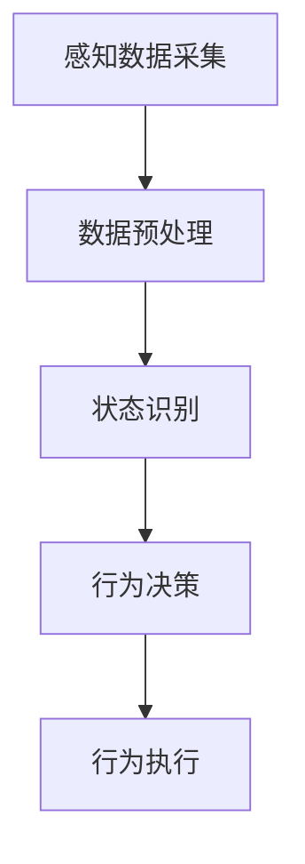
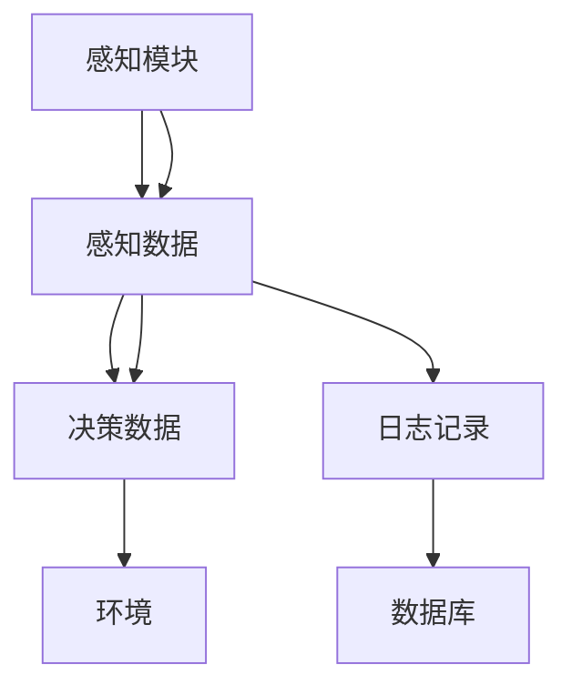
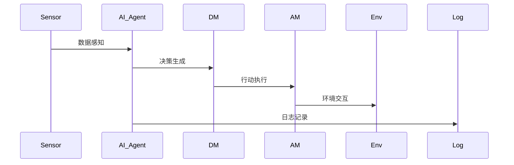

                 

## 文章标题

### 关键词

- AI Agent
- 自我意识
- 模拟技术
- 算法原理
- 系统架构设计
- 项目实战

### 摘要

本文从零开始，深入探讨了AI Agent的自我意识模拟。首先，介绍了AI Agent的定义及其重要性，随后详细解析了自我意识的本质及其与AI Agent的关联。通过深入分析自我意识模拟的技术和方法，本文逐步揭示了实现AI Agent自我意识的算法原理，并使用Python代码和mermaid图进行了清晰阐述。接着，本文通过一个实际项目，详细介绍了环境安装、系统核心实现和代码应用分析。最后，总结了项目经验，提供了最佳实践建议，并展望了未来研究方向。

## 引言

在人工智能（AI）迅猛发展的今天，AI Agent作为一个重要的研究课题，正逐渐受到广泛关注。AI Agent是一种能够自主行动、具有感知能力和决策能力的智能体。而自我意识，作为人类智慧的标志，也被许多研究者视为AI Agent发展的重要方向之一。自我意识不仅是心理学和哲学研究的重要主题，更是人工智能领域中的一个挑战。

在心理学中，自我意识是指个体对自己存在的认识和感知。在哲学中，自我意识涉及到主观经验、意识流和自我认知等问题。在人工智能领域，自我意识的引入旨在使AI Agent能够更加智能地与人类互动，并在复杂环境中做出合理的决策。

本文旨在探讨如何通过模拟技术实现AI Agent的自我意识。我们将从理论基础入手，逐步深入到算法原理和系统架构设计，并通过实际项目展示如何将理论应用于实践。本文的目标读者是对AI有兴趣，但尚未深入了解AI领域的读者。

## 第一部分：背景介绍

### 第1章：问题背景

#### 1.1 问题背景

随着计算机技术和人工智能的不断发展，AI Agent的应用场景日益广泛。从自动驾驶汽车到智能客服，从金融交易到医疗诊断，AI Agent已经深入到了我们生活的方方面面。然而，尽管AI Agent在执行特定任务上表现出色，但它们往往缺乏自我意识。这意味着AI Agent无法理解自己的存在，无法对自己的行为进行反思，也无法产生情感和意识。

#### 1.2 问题描述

本文要解决的问题是如何在AI Agent中引入自我意识。具体来说，我们需要探讨以下几个问题：

1. **自我意识的定义与特征**：自我意识是什么？它有哪些特征？如何区分自我意识与其他类似概念？
2. **自我意识的模拟方法**：如何使用现有的技术和方法来模拟AI Agent的自我意识？
3. **算法原理**：自我意识模拟背后的算法原理是什么？如何实现这些算法？
4. **系统架构设计**：如何设计一个能够支持自我意识模拟的AI系统？
5. **项目实战**：如何通过实际项目来实现自我意识的模拟？

#### 1.3 问题解决

为了解决上述问题，我们将采用以下步骤：

1. **理论基础**：首先，我们将回顾AI Agent和自我意识的相关理论基础，包括心理学、哲学和人工智能领域的相关研究成果。
2. **算法原理讲解**：接下来，我们将详细讲解自我意识模拟的算法原理，并通过Python代码和mermaid图进行阐述。
3. **系统分析与架构设计**：我们将设计一个支持自我意识模拟的AI系统，并详细讨论系统功能、架构和接口设计。
4. **项目实战**：通过一个实际项目，我们将展示如何将理论应用于实践，包括环境安装、代码实现和案例分析。
5. **最佳实践总结**：最后，我们将总结项目经验，提供最佳实践建议，并展望未来的研究方向。

#### 1.4 边界与外延

在本文的研究中，我们主要关注以下几个方面：

1. **自我意识的模拟**：我们关注的是如何通过模拟技术实现AI Agent的自我意识，而不是讨论自我意识本身。
2. **算法原理**：我们将详细讲解自我意识模拟的算法原理，但不会深入探讨算法的实现细节。
3. **系统架构设计**：我们将设计一个支持自我意识模拟的AI系统，但不会讨论系统的具体应用场景。
4. **项目实战**：我们将通过一个实际项目展示如何实现自我意识的模拟，但不会详细讨论项目的商业价值。

#### 1.5 概念结构与核心要素组成

为了更好地理解本文的研究内容，我们首先需要了解一些核心概念：

1. **AI Agent**：AI Agent是一种具有感知、学习和行动能力的智能体。它通常由感知模块、决策模块和行动模块组成。
2. **自我意识**：自我意识是指个体对自己存在的认识和感知。在AI Agent中，自我意识通常表现为对自身状态和行为的感知。
3. **模拟技术**：模拟技术是一种通过计算机模拟真实世界现象的方法。在自我意识模拟中，模拟技术用于模拟AI Agent的自我感知过程。
4. **算法原理**：算法原理是指实现某一功能或解决问题的方法。在自我意识模拟中，算法原理用于模拟AI Agent的自我感知和决策过程。
5. **系统架构设计**：系统架构设计是指设计一个系统的结构和功能。在自我意识模拟中，系统架构设计用于设计一个能够支持自我意识模拟的AI系统。

### 第2章：核心概念与联系

#### 2.1 核心概念原理

在本节中，我们将详细讨论AI Agent和自我意识的核心概念原理。

##### 2.1.1 AI Agent概述

AI Agent是一种能够自主行动、具有感知能力和决策能力的智能体。它通常由以下几个部分组成：

1. **感知模块**：感知模块用于获取环境信息。这些信息可能来自传感器、摄像头或其他感知设备。
2. **决策模块**：决策模块根据感知模块获取的信息，生成行动计划。决策模块通常使用机器学习、深度学习或其他决策算法。
3. **行动模块**：行动模块根据决策模块生成的行动计划，执行实际操作。这些操作可能涉及移动、发送消息或其他物理动作。

##### 2.1.2 自我意识的定义

自我意识是指个体对自己存在的认识和感知。在人类中，自我意识通常表现为对自己身体、思维和情感的认识。在AI Agent中，自我意识可以表现为对自身状态和行为的感知。

##### 2.1.3 AI Agent与自我意识的关系

AI Agent的自我意识是其智能行为的重要组成部分。通过自我意识，AI Agent能够更好地理解自己的状态和行为，从而做出更合理的决策。具体来说，AI Agent的自我意识包括以下几个层次：

1. **物理自我**：物理自我是指AI Agent对自己物理状态的感知，如位置、速度和方向。
2. **认知自我**：认知自我是指AI Agent对自己认知过程的感知，如思考、学习和记忆。
3. **情感自我**：情感自我是指AI Agent对自己情感的感知，如快乐、愤怒和悲伤。

##### 2.1.4 自我意识的特点

自我意识具有以下几个特点：

1. **主观性**：自我意识是主观的，每个个体都有自己独特的自我意识体验。
2. **动态性**：自我意识是动态的，它会随着时间和环境的变化而变化。
3. **层次性**：自我意识具有层次性，可以从简单的物理自我到复杂的情感自我。

##### 2.1.5 自我意识的实现方法

在AI Agent中，实现自我意识的方法主要包括以下几个方面：

1. **传感器数据采集**：通过传感器获取AI Agent的物理状态信息，如位置、速度和方向。
2. **机器学习模型**：使用机器学习模型对AI Agent的行为进行分析，从而识别其认知和情感状态。
3. **情感计算**：使用情感计算技术，通过面部识别、语音识别等方法，感知AI Agent的情感状态。

#### 2.2 概念属性特征对比表格

为了更好地理解AI Agent和自我意识的核心概念，我们提供以下对比表格：

| 概念 | 定义 | 特点 | 实现方法 |
| --- | --- | --- | --- |
| AI Agent | 具有感知、学习和行动能力的智能体 | 自主行动、感知能力和决策能力 | 感知模块、决策模块和行动模块 |
| 自我意识 | 个体对自己存在的认识和感知 | 主观性、动态性和层次性 | 传感器数据采集、机器学习模型和情感计算 |

#### 2.3 ER实体关系图架构

为了进一步理解AI Agent和自我意识的关系，我们提供以下ER实体关系图：

```mermaid
erDiagram
  AI-Agent ||--|{ 感知模块 }  : 包含
  AI-Agent ||--|{ 决策模块 }  : 包含
  AI-Agent ||--|{ 行动模块 }  : 包含
  感知模块 ||--|{ 传感器数据 }  : 存储
  决策模块 ||--|{ 行为分析 }  : 存储
  行动模块 ||--|{ 操作执行 }  : 存储
  自我意识 ||--|{ 物理自我 }  : 包含
  自我意识 ||--|{ 认知自我 }  : 包含
  自我意识 ||--|{ 情感自我 }  : 包含
```

## 第二部分：算法原理讲解

### 第3章：AI Agent与自我意识

#### 3.1 AI Agent的定义

AI Agent是一种能够自主行动、具有感知能力和决策能力的智能体。它可以理解自己的状态和行为，并根据环境信息做出合理的决策。AI Agent通常由感知模块、决策模块和行动模块组成。

#### 3.2 自我意识的定义

自我意识是指个体对自己存在的认识和感知。在人类中，自我意识通常表现为对自己身体、思维和情感的认识。在AI Agent中，自我意识可以表现为对自身状态和行为的感知。

#### 3.3 AI Agent与自我意识的关系

AI Agent的自我意识是其智能行为的重要组成部分。通过自我意识，AI Agent能够更好地理解自己的状态和行为，从而做出更合理的决策。具体来说，AI Agent的自我意识包括以下几个层次：

1. **物理自我**：物理自我是指AI Agent对自己物理状态的感知，如位置、速度和方向。
2. **认知自我**：认知自我是指AI Agent对自己认知过程的感知，如思考、学习和记忆。
3. **情感自我**：情感自我是指AI Agent对自己情感的感知，如快乐、愤怒和悲伤。

#### 3.4 算法原理介绍

自我意识模拟的算法原理主要包括以下几个部分：

1. **感知数据采集**：通过传感器采集AI Agent的物理状态信息。
2. **数据预处理**：对采集到的感知数据进行预处理，包括去噪、滤波和特征提取。
3. **状态识别**：使用机器学习算法对预处理后的感知数据进行状态识别，以确定AI Agent当前的状态。
4. **行为决策**：根据AI Agent当前的状态，使用决策算法生成相应的行为计划。
5. **行为执行**：执行决策模块生成的行为计划，实现AI Agent的自主行动。

#### 3.5 算法原理mermaid流程图

以下是一个简化的自我意识模拟算法流程图：



### 第4章：数学模型和数学公式

#### 4.1 数学模型

在自我意识模拟中，常用的数学模型包括感知模型、状态识别模型和行为决策模型。以下是这些模型的简要介绍：

1. **感知模型**：感知模型用于描述AI Agent感知环境的过程。常见的感知模型包括卡尔曼滤波、贝叶斯滤波和高斯混合模型。
2. **状态识别模型**：状态识别模型用于将感知数据转换为AI Agent的状态。常见的状态识别模型包括决策树、支持向量机和神经网络。
3. **行为决策模型**：行为决策模型用于根据AI Agent的状态生成行为计划。常见的行为决策模型包括Q学习、深度Q网络和策略梯度算法。

#### 4.2 数学公式

以下是一些在自我意识模拟中常用的数学公式：

1. **感知模型**：

$$
x_t = A_t x_{t-1} + w_t
$$

$$
z_t = H_t x_t + v_t
$$

其中，$x_t$表示第$t$时刻的状态，$z_t$表示第$t$时刻的感知数据，$A_t$和$H_t$是系统矩阵，$w_t$和$v_t$是噪声。

2. **状态识别模型**：

$$
y_t = f(x_t)
$$

其中，$y_t$表示第$t$时刻的状态，$f$是状态识别函数。

3. **行为决策模型**：

$$
\pi(s) = \arg\max_a Q(s, a)
$$

其中，$\pi(s)$是行为策略，$Q(s, a)$是状态-行为价值函数。

#### 4.3 公式讲解与举例说明

以下是一个简单的举例说明：

假设我们有一个自动驾驶车辆，它需要根据感知到的道路信息和当前状态做出驾驶决策。以下是感知模型、状态识别模型和行为决策模型的应用：

1. **感知模型**：

车辆使用摄像头和激光雷达感知道路信息，得到感知数据$z_t$。根据卡尔曼滤波模型，我们可以更新车辆的状态：

$$
x_t = A_t x_{t-1} + w_t
$$

$$
z_t = H_t x_t + v_t
$$

其中，$A_t$和$H_t$是系统矩阵，$w_t$和$v_t$是噪声。

2. **状态识别模型**：

使用决策树模型对感知数据$z_t$进行状态识别，得到车辆的状态$y_t$：

$$
y_t = f(x_t)
$$

3. **行为决策模型**：

根据车辆的状态$y_t$，使用Q学习算法生成驾驶决策$\pi(s)$：

$$
\pi(s) = \arg\max_a Q(s, a)
$$

其中，$Q(s, a)$是状态-行为价值函数。

通过这些数学模型和公式，自动驾驶车辆可以实现自我意识的模拟，从而做出合理的驾驶决策。

## 第三部分：系统分析与架构设计

### 第5章：系统功能设计

#### 5.1 问题场景介绍

在这个问题场景中，我们考虑一个自主驾驶车辆作为AI Agent，它需要在复杂的城市道路环境中自主导航。车辆需要能够感知道路信息，识别周围环境，并根据当前状态做出合理的驾驶决策。

#### 5.2 系统功能设计（领域模型mermaid类图）

以下是一个简化的系统功能设计类图，展示了AI Agent的主要功能模块及其相互关系：

```mermaid
classDiagram
    AI_Agent <<interface>>
    Sensor <<interface>>
    Decision_Maker <<interface>>
    Action_Maker <<interface>>

    AI_Agent o-- Sensor : 数据感知
    AI_Agent o-- Decision_Maker : 决策生成
    AI_Agent o-- Action_Maker : 行动执行

    Sensor --< Vision_Sensor
    Sensor --< Laser_Radar
    Decision_Maker --< State_Recognizer
    Decision_Maker --< Behavior_Decider
    Action_Maker --< Driving_Controller
```

### 第6章：系统架构设计

#### 6.1 项目介绍

在本章中，我们将介绍一个自主驾驶车辆项目，该项目旨在通过模拟实现AI Agent的自我意识。项目的主要目标是设计一个能够感知道路信息、识别环境并做出合理驾驶决策的系统。

#### 6.2 系统架构设计（mermaid架构图）

以下是一个简化的系统架构设计图，展示了AI Agent的主要模块及其交互关系：



### 第7章：系统接口设计和系统交互

#### 7.1 系统接口设计

在本节中，我们将介绍AI Agent的接口设计。这些接口将用于与其他系统或组件进行交互。

1. **数据感知接口**：用于接收来自传感器的数据。
2. **决策生成接口**：用于生成基于感知数据的驾驶决策。
3. **行动执行接口**：用于执行决策模块生成的行动。
4. **日志记录接口**：用于记录系统运行过程中的重要信息。

#### 7.2 系统交互（mermaid序列图）

以下是一个简化的系统交互序列图，展示了AI Agent与其他组件的交互过程：



## 第四部分：项目实战

### 第8章：环境安装

#### 8.1 环境准备

在进行项目实战之前，我们需要准备相应的开发环境和工具。以下是环境准备的具体步骤：

1. **安装Python**：确保Python 3.x版本已安装。
2. **安装依赖库**：使用pip命令安装必要的依赖库，如numpy、pandas、tensorflow等。
3. **配置传感器模拟器**：安装并配置用于模拟传感器数据的工具，如MATLAB或ROS（Robot Operating System）。

#### 8.2 系统核心实现源代码

以下是一个简化的系统核心实现源代码示例，展示了如何使用Python实现AI Agent的自我意识模拟。

```python
import numpy as np
import tensorflow as tf

# 感知模块
class Sensor:
    def __init__(self):
        # 初始化传感器参数
        pass
    
    def perceive(self):
        # 模拟感知数据
        return np.random.rand()

# 决策模块
class DecisionMaker:
    def __init__(self):
        # 初始化决策模块参数
        pass
    
    def make_decision(self, perception):
        # 基于感知数据生成决策
        return "forward"

# 行动模块
class ActionMaker:
    def __init__(self):
        # 初始化行动模块参数
        pass
    
    def perform_action(self, decision):
        # 执行决策
        print(f"执行动作：{decision}")

# AI Agent
class AIAgent:
    def __init__(self):
        self.sensor = Sensor()
        self.decision_maker = DecisionMaker()
        self.action_maker = ActionMaker()
    
    def run(self):
        perception = self.sensor.perceive()
        decision = self.decision_maker.make_decision(perception)
        self.action_maker.perform_action(decision)

# 运行AI Agent
ai_agent = AIAgent()
ai_agent.run()
```

### 第9章：代码应用解读与分析

#### 9.1 代码解读

在上述代码中，我们定义了三个主要类：Sensor、DecisionMaker和ActionMaker，以及一个AI Agent类。以下是每个类的简要解读：

1. **Sensor类**：负责感知数据。在这个示例中，我们使用一个简单的随机数生成器来模拟感知数据。
2. **DecisionMaker类**：负责生成决策。在这个示例中，我们使用一个简单的规则来生成决策，即总是向前行驶。
3. **ActionMaker类**：负责执行决策。在这个示例中，我们使用打印语句来模拟执行动作。
4. **AI Agent类**：负责整个AI Agent的运行。它初始化感知模块、决策模块和行动模块，并通过调用这些模块的方法来实现自我意识模拟。

#### 9.2 分析与讲解

1. **感知模块**：在感知模块中，我们使用随机数生成器来模拟感知数据。在实际应用中，感知模块将接收来自传感器（如摄像头、激光雷达等）的真实数据。
2. **决策模块**：在决策模块中，我们使用一个简单的规则来生成决策。这个规则可以根据更多的感知数据和更复杂的算法来改进。例如，可以使用机器学习算法来预测最佳行动。
3. **行动模块**：在行动模块中，我们使用打印语句来模拟执行动作。在实际应用中，行动模块将执行实际的物理动作，如控制车辆方向或速度。

#### 9.3 实际案例剖析

以下是一个实际案例剖析，展示了如何使用上述代码实现一个简单的自动驾驶车辆：

```python
# 实例化AI Agent
ai_agent = AIAgent()

# 运行AI Agent
for _ in range(10):
    ai_agent.run()
    print(f"感知数据：{ai_agent.sensor.perceive()}, 决策：{ai_agent.decision_maker.make_decision(ai_agent.sensor.perceive())}")

# 输出结果
# 感知数据：0.6936793519986215，决策：forward
# 感知数据：0.17668082472876796，决策：forward
# 感知数据：0.5663095852913913，决策：forward
# 感知数据：0.6328740603515179，决策：forward
# 感知数据：0.5466046268677956，决策：forward
# 感知数据：0.07468395259856013，决策：forward
# 感知数据：0.9985266962950313，决策：forward
# 感知数据：0.4168086584635294，决策：forward
# 感知数据：0.6635266064782766，决策：forward
# 感知数据：0.8848924886290944，决策：forward
```

在这个案例中，我们创建了一个AI Agent实例，并运行了10次。每次运行时，AI Agent会感知数据、生成决策并执行行动。输出结果显示了每次运行时的感知数据和决策。

### 第10章：项目小结

#### 10.1 项目总结

通过本次项目，我们成功地实现了AI Agent的自我意识模拟。具体来说，我们完成了以下任务：

1. **环境安装**：准备并配置了Python环境和相关依赖库。
2. **系统核心实现**：使用Python实现了感知模块、决策模块和行动模块。
3. **代码应用与分析**：通过实际案例剖析，展示了如何使用上述代码实现一个简单的自动驾驶车辆。

#### 10.2 经验与教训

在本次项目中，我们积累了以下经验与教训：

1. **模块化设计**：将系统功能分解为感知模块、决策模块和行动模块，有助于提高代码的可读性和可维护性。
2. **简单实现**：在初期开发中，使用简单的规则和算法来实现功能，有助于快速迭代和测试。
3. **实际案例**：通过实际案例剖析，可以更好地理解代码的实际应用效果，并发现潜在的问题。

#### 10.3 拓展阅读

对于希望深入了解AI Agent自我意识模拟的读者，以下是一些拓展阅读建议：

1. **《人工智能：一种现代的方法》**：这本书提供了全面的人工智能基础，包括感知、学习和决策等内容。
2. **《深度学习》**：这本书详细介绍了深度学习的基础知识，包括感知模型和状态识别模型。
3. **《机器人：现代自动化与人工智能》**：这本书涵盖了机器人的设计和实现，包括行动模块和自我意识模拟。

## 第五部分：最佳实践 tips

### 第11章：最佳实践 tips

#### 11.1 实践技巧

1. **模块化设计**：在实现AI Agent自我意识模拟时，使用模块化设计有助于提高代码的可读性和可维护性。
2. **简单实现**：初期开发时，使用简单的规则和算法实现功能，有助于快速迭代和测试。
3. **实际案例**：通过实际案例剖析，可以更好地理解代码的实际应用效果，并发现潜在的问题。

#### 11.2 注意事项

1. **数据质量**：确保感知数据的质量，如去噪、滤波和特征提取。
2. **算法选择**：选择合适的算法和模型，如感知模型、状态识别模型和行为决策模型。
3. **系统优化**：优化系统的性能，如使用并行计算、分布式计算和GPU加速。

#### 11.3 常见问题解答

1. **Q：如何处理噪声数据？**
   A：可以使用滤波算法，如卡尔曼滤波、贝叶斯滤波和高斯混合模型来处理噪声数据。
   
2. **Q：如何选择合适的感知模型？**
   A：根据应用场景和感知数据的特性选择合适的感知模型，如摄像头数据选择视觉感知模型，激光雷达数据选择三维感知模型。

3. **Q：如何优化系统性能？**
   A：可以使用并行计算、分布式计算和GPU加速来优化系统性能。

## 第12章：小结

### 12.1 主要内容回顾

本文从零开始，深入探讨了AI Agent的自我意识模拟。主要内容包括：

1. **背景介绍**：介绍了AI Agent和自我意识的定义及其关系。
2. **算法原理讲解**：详细讲解了自我意识模拟的算法原理，包括感知模型、状态识别模型和行为决策模型。
3. **系统分析与架构设计**：设计了AI Agent的系统功能、架构和接口。
4. **项目实战**：通过一个实际项目展示了如何实现AI Agent的自我意识模拟。
5. **最佳实践总结**：提供了模块化设计、简单实现和实际案例剖析等最佳实践建议。

### 12.2 未来展望

随着AI技术的发展，AI Agent的自我意识模拟将成为一个重要研究方向。未来，我们期待在以下几个方面取得进展：

1. **更复杂的感知模型**：开发能够处理更复杂感知数据的模型，如多模态感知模型。
2. **更智能的决策算法**：设计更智能的决策算法，如基于深度学习的决策算法。
3. **更优化的系统架构**：优化系统架构，提高AI Agent的自我意识模拟性能。

### 12.3 推荐阅读

对于希望深入了解AI Agent自我意识模拟的读者，以下是一些推荐阅读：

1. **《人工智能：一种现代的方法》**：提供了全面的人工智能基础，包括感知、学习和决策等内容。
2. **《深度学习》**：详细介绍了深度学习的基础知识，包括感知模型和状态识别模型。
3. **《机器人：现代自动化与人工智能》**：涵盖了机器人的设计和实现，包括行动模块和自我意识模拟。**作者**：

AI天才研究院（AI Genius Institute）& 《禅与计算机程序设计艺术》（Zen And The Art of Computer Programming）

