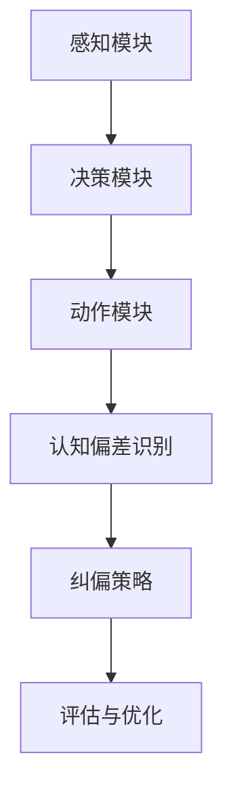

                 

# 从零开始：AI Agent的认知偏差识别

> 关键词：AI Agent、认知偏差、识别方法、应用场景

> 摘要：本文旨在从零开始，深入探讨AI Agent的认知偏差识别问题。通过介绍AI Agent的基础知识、认知偏差理论以及识别方法，结合实际案例，详细分析AI Agent在实际应用中可能存在的认知偏差，并提出相应的识别方法。最后，本文将讨论认知偏差识别在各个领域的应用场景，为读者提供一个全面、系统的认知偏差识别指南。

## 目录大纲

1. **第一部分：AI Agent基础**
   - 第1章：AI Agent概述
     - 1.1 AI Agent的定义与作用
     - 1.2 AI Agent的分类与特点
     - 1.3 AI Agent的核心组成
     - 1.4 AI Agent的发展历程与未来展望
     - 1.5 本章小结
   - 第2章：认知偏差概述
     - 2.1 认知偏差的定义与分类
     - 2.2 常见认知偏差分析
     - 2.3 认知偏差的影响
     - 2.4 本章小结

2. **第二部分：AI Agent认知偏差识别方法**
   - 第3章：基于统计学的认知偏差识别
     - 3.1 统计学方法概述
     - 3.2 常用统计学方法
     - 3.3 实际案例与应用
     - 3.4 本章小结
   - 第4章：基于机器学习的认知偏差识别
     - 4.1 机器学习方法概述
     - 4.2 常见机器学习方法
     - 4.3 实际案例与应用
     - 4.4 本章小结

3. **第三部分：AI Agent认知偏差识别系统的设计与实现**
   - 第5章：AI Agent认知偏差识别系统的设计与实现
     - 5.1 系统概述
     - 5.2 数据收集与预处理
     - 5.3 认知偏差识别算法的实现
     - 5.4 系统测试与评估
     - 5.5 本章小结

4. **第四部分：认知偏差识别的应用场景**
   - 第6章：认知偏差识别的应用场景
     - 6.1 金融领域
     - 6.2 健康医疗领域
     - 6.3 智能交通领域
     - 6.4 其他领域
     - 6.5 本章小结

## 第一部分：AI Agent基础

### 第1章：AI Agent概述

#### 1.1 AI Agent的定义与作用

AI Agent，即人工智能代理，是人工智能领域中的一个重要概念。它指的是一个具有感知、决策和执行能力的计算机程序，可以自主地执行任务，并与外部环境进行交互。AI Agent的定义可以从以下几个方面来理解：

1. **感知能力**：AI Agent能够感知外部环境，获取环境中的信息。
2. **决策能力**：基于感知到的信息，AI Agent能够进行决策，选择最优的行动方案。
3. **执行能力**：AI Agent能够执行决策方案，将决策转化为具体的行动。

AI Agent的作用主要体现在以下几个方面：

1. **自动化**：AI Agent能够自动执行任务，提高工作效率。
2. **智能交互**：AI Agent可以与人类进行自然语言交互，提供智能服务。
3. **决策支持**：AI Agent能够基于数据和分析，提供决策支持。

#### 1.2 AI Agent的分类与特点

AI Agent可以根据其工作方式的不同，分为以下几类：

1. **反应式Agent**：这种Agent只关注当前环境，不保留历史信息，根据感知到的当前环境直接作出反应。例如，自动化清洁机器人就是一种反应式Agent。
2. **目标导向Agent**：这种Agent不仅关注当前环境，还具备目标规划能力，能够根据目标选择行动。例如，自动驾驶汽车就是一种目标导向Agent。
3. **计划Agent**：这种Agent具有更复杂的认知能力，能够进行长远的计划和决策，例如，智能客服系统。

每种Agent都有其独特的特点：

1. **反应式Agent**：简单高效，但无法处理复杂任务。
2. **目标导向Agent**：能够处理复杂任务，但需要较多的规划和决策时间。
3. **计划Agent**：具有高度智能，能够处理复杂任务，但实现难度较高。

#### 1.3 AI Agent的核心组成

AI Agent通常由以下几个核心模块组成：

1. **感知模块**：负责感知外部环境，获取环境信息。
2. **决策模块**：基于感知模块提供的信息，进行决策，选择最佳行动方案。
3. **动作模块**：执行决策模块生成的行动方案，实现具体的行动。

这些模块相互协作，共同完成AI Agent的使命。

#### 1.4 AI Agent的发展历程与未来展望

AI Agent的发展历程可以分为以下几个阶段：

1. **早期探索阶段**：20世纪80年代，AI Agent开始得到关注，研究者们开始探索如何设计能够自主行动的计算机程序。
2. **理论发展阶段**：20世纪90年代，AI Agent的理论逐渐成熟，研究者们开始关注如何提高AI Agent的智能水平。
3. **应用实践阶段**：21世纪初，随着计算能力的提升和大数据技术的发展，AI Agent开始应用于各个领域，如智能家居、智能交通等。

未来，AI Agent的发展将朝着以下几个方向：

1. **智能水平提升**：通过深度学习、强化学习等先进技术，提高AI Agent的智能水平。
2. **跨领域应用**：AI Agent将在更多领域得到应用，如医疗、金融、教育等。
3. **人机协同**：AI Agent将更加智能，能够与人类进行高效协同，提高工作效率。

#### 1.5 本章小结

本章对AI Agent进行了全面的概述，从定义与作用、分类与特点、核心组成以及发展历程与未来展望等方面进行了详细讨论。通过本章的学习，读者可以了解AI Agent的基本概念和作用，为后续章节的学习打下基础。

## 第二部分：认知偏差识别理论

### 第2章：认知偏差概述

#### 2.1 认知偏差的定义与分类

认知偏差是指人们在感知、记忆、判断和决策过程中，由于各种心理因素的作用，导致信息处理出现偏差的现象。认知偏差是心理学、经济学、社会学等领域的重要研究内容，对于个体、组织和整个社会都会产生深远的影响。

认知偏差可以分为以下几类：

1. **感知偏差**：人们在感知过程中，由于注意力、记忆等心理因素的作用，导致对信息的感知出现偏差。
2. **记忆偏差**：人们在回忆过程中，由于记忆缺失、错误记忆等心理因素的作用，导致记忆出现偏差。
3. **判断偏差**：人们在判断过程中，由于认知偏好、社会压力等心理因素的作用，导致判断出现偏差。
4. **决策偏差**：人们在决策过程中，由于风险偏好、时间偏好等心理因素的作用，导致决策出现偏差。

#### 2.2 常见认知偏差分析

以下是几种常见的认知偏差：

1. **验证偏差**：人们在寻找信息时，倾向于寻找支持自己观点的信息，而忽视反对自己观点的信息，从而使得判断和决策产生偏差。
2. **自利性偏差**：人们在评价自己和他人的行为时，往往过于关注自己的利益，导致评价出现偏差。
3. **选择偏差**：人们在处理信息时，倾向于关注和选择与自身经验相关或符合自身预期信息，而忽视其他信息，导致信息处理出现偏差。
4. **确认偏差**：人们在获取信息时，倾向于选择和接受符合自己已有信念的信息，而忽视和排斥相反的信息，导致信息处理出现偏差。

#### 2.3 认知偏差的影响

认知偏差对个人、社会和组织都会产生重要影响：

1. **个人层面**：认知偏差可能导致个人在决策过程中产生错误的判断，影响个人的行为和决策效果。
2. **社会层面**：认知偏差可能导致社会在处理信息时产生偏差，影响社会的稳定和发展。
3. **组织层面**：认知偏差可能导致组织在管理过程中产生偏差，影响组织的效率和竞争力。

#### 2.4 本章小结

本章对认知偏差进行了全面的概述，从定义与分类、常见认知偏差分析以及影响等方面进行了详细讨论。通过本章的学习，读者可以了解认知偏差的基本概念和分类，为后续章节的学习打下基础。

## 第三部分：AI Agent认知偏差识别方法

### 第3章：基于统计学的认知偏差识别

#### 3.1 统计学方法概述

统计学方法是一种基于数据和概率理论的科学研究方法，广泛应用于各个领域。在认知偏差识别领域，统计学方法通过分析和处理数据，帮助识别个体或群体的认知偏差。统计学方法的基本原理包括：

1. **描述性统计分析**：通过对数据进行描述性统计，如均值、方差、标准差等，了解数据的整体特征。
2. **假设检验**：通过建立假设，对数据进行统计检验，判断假设是否成立。
3. **回归分析**：通过建立回归模型，分析自变量和因变量之间的关系。

这些方法在认知偏差识别中具有重要作用。

#### 3.2 常用统计学方法

以下是几种常用的统计学方法及其在认知偏差识别中的应用：

1. **描述性统计分析**：
   - **均值**：用于衡量个体或群体的认知偏差程度。
   - **方差**：用于衡量个体或群体认知偏差的稳定性。
   - **标准差**：用于衡量个体或群体认知偏差的离散程度。

2. **假设检验**：
   - **t检验**：用于判断个体或群体之间是否存在显著性差异。
   - **方差分析（ANOVA）**：用于判断多个群体之间是否存在显著性差异。
   - **卡方检验**：用于判断分类变量之间是否存在关联。

3. **回归分析**：
   - **线性回归**：用于分析自变量和因变量之间的线性关系。
   - **多元回归**：用于分析多个自变量和因变量之间的线性关系。

这些方法可以帮助识别和评估认知偏差。

#### 3.3 实际案例与应用

以下是一个实际案例，展示如何使用统计学方法识别认知偏差：

案例：某公司对员工进行绩效评估，发现存在认知偏差。为了识别这种偏差，公司决定使用描述性统计分析方法。

1. **数据收集**：收集员工绩效评估数据，包括员工姓名、绩效评分等。
2. **描述性统计分析**：
   - 计算绩效评分的均值、方差和标准差，了解员工绩效评分的整体特征。
   - 对比不同部门、不同职级的员工绩效评分，判断是否存在认知偏差。
3. **假设检验**：
   - 进行t检验，判断不同部门、不同职级的员工绩效评分是否存在显著性差异。
4. **结果分析**：
   - 根据描述性统计分析和假设检验结果，识别存在的认知偏差，如部门偏见、职级偏见等。

通过这个案例，可以看到统计学方法在认知偏差识别中的应用。

#### 3.4 本章小结

本章介绍了基于统计学的认知偏差识别方法，包括描述性统计分析、假设检验和回归分析等常用方法。通过实际案例，展示了如何使用这些方法识别认知偏差。通过本章的学习，读者可以掌握统计学方法在认知偏差识别中的应用，为后续章节的学习打下基础。

### 第4章：基于机器学习的认知偏差识别

#### 4.1 机器学习方法概述

机器学习方法是一种通过训练数据模型，自动学习数据特征和规律，从而进行预测、分类或回归的方法。在认知偏差识别领域，机器学习方法通过分析大量数据，识别个体或群体的认知偏差。机器学习方法的基本原理包括：

1. **训练数据**：机器学习方法需要大量的训练数据，这些数据包括正常行为和认知偏差行为。
2. **特征提取**：从训练数据中提取出特征，这些特征可以反映认知偏差的规律。
3. **模型训练**：使用训练数据训练模型，使模型能够识别认知偏差。
4. **模型评估**：使用验证数据评估模型性能，调整模型参数，提高模型识别准确性。

这些基本原理在认知偏差识别中具有重要作用。

#### 4.2 常见机器学习方法

以下是几种常见的机器学习方法及其在认知偏差识别中的应用：

1. **监督学习**：
   - **分类算法**：如逻辑回归、支持向量机（SVM）、决策树等，用于将数据分为正常行为和认知偏差行为。
   - **回归算法**：如线性回归、岭回归等，用于预测认知偏差的程度。

2. **无监督学习**：
   - **聚类算法**：如K-means、层次聚类等，用于发现数据中的认知偏差模式。
   - **降维算法**：如主成分分析（PCA）、t-SNE等，用于减少数据维度，突出认知偏差特征。

3. **强化学习**：
   - **Q学习**：用于评估不同行为策略下的认知偏差程度，选择最优策略。
   - **深度强化学习**：结合深度学习和强化学习，用于复杂场景下的认知偏差识别。

这些方法在认知偏差识别中具有广泛的应用。

#### 4.3 实际案例与应用

以下是一个实际案例，展示如何使用机器学习方法识别认知偏差：

案例：某电商平台希望通过机器学习方法识别用户购物行为中的认知偏差。

1. **数据收集**：收集用户的购物数据，包括购买商品、购买时间、购买频率等。
2. **特征提取**：
   - 从购物数据中提取出特征，如购买商品的种类、购买时间间隔、购买频率等。
   - 使用降维算法（如PCA）减少特征维度，突出认知偏差特征。
3. **模型训练**：
   - 使用监督学习算法（如逻辑回归、SVM）训练模型，使模型能够识别正常行为和认知偏差行为。
   - 使用无监督学习算法（如K-means）训练模型，发现数据中的认知偏差模式。
4. **模型评估**：
   - 使用验证数据评估模型性能，调整模型参数，提高模型识别准确性。
   - 使用强化学习算法（如Q学习）评估不同行为策略下的认知偏差程度，选择最优策略。

通过这个案例，可以看到机器学习方法在认知偏差识别中的应用。

#### 4.4 本章小结

本章介绍了基于机器学习的认知偏差识别方法，包括监督学习、无监督学习和强化学习等常见方法。通过实际案例，展示了如何使用这些方法识别认知偏差。通过本章的学习，读者可以掌握机器学习方法在认知偏差识别中的应用，为后续章节的学习打下基础。

### 第5章：AI Agent认知偏差识别系统的设计与实现

#### 5.1 系统概述

AI Agent认知偏差识别系统旨在通过分析和处理AI Agent的行为数据，识别并纠正其认知偏差。该系统的目标是提高AI Agent的决策质量和可靠性，从而提升其在实际应用中的性能和效果。

#### 5.1.1 系统目标

系统的主要目标包括：

1. **识别认知偏差**：通过分析AI Agent的行为数据，识别其存在的认知偏差。
2. **纠正认知偏差**：针对识别出的认知偏差，提出相应的纠正策略，提高AI Agent的决策质量。
3. **评估系统效果**：通过对比分析AI Agent在纠偏前后的行为数据，评估系统效果。

#### 5.1.2 系统架构

系统采用分层架构设计，主要包括以下几个层次：

1. **数据收集层**：负责收集AI Agent的行为数据，包括感知数据、决策数据和执行数据等。
2. **数据处理层**：负责对收集到的行为数据进行分析和处理，提取特征，识别认知偏差。
3. **纠偏策略层**：基于识别出的认知偏差，提出相应的纠正策略，优化AI Agent的决策过程。
4. **评估与优化层**：对系统效果进行评估，并根据评估结果对系统进行优化。

#### 5.1.3 系统功能

系统的主要功能包括：

1. **数据收集与处理**：通过传感器和API接口，收集AI Agent的行为数据，并进行数据预处理，如去噪、归一化等。
2. **认知偏差识别**：使用统计学方法和机器学习算法，分析处理后的数据，识别AI Agent的认知偏差。
3. **纠偏策略生成**：根据识别出的认知偏差，生成相应的纠偏策略，如重新规划决策路径、调整感知模块等。
4. **系统评估与优化**：对AI Agent的决策过程进行评估，分析纠偏策略的有效性，并根据评估结果优化系统。

#### 5.2 数据收集与预处理

数据收集是认知偏差识别系统的关键步骤，主要包括以下内容：

1. **数据来源**：从AI Agent的感知模块、决策模块和执行模块收集数据，包括传感器数据、决策日志和执行记录等。
2. **数据预处理**：对收集到的原始数据进行清洗、去噪和归一化处理，提高数据质量，为后续分析提供可靠的数据基础。

#### 5.3 认知偏差识别算法的实现

认知偏差识别算法是实现系统核心功能的关键，主要包括以下内容：

1. **统计学方法**：使用描述性统计分析、假设检验和回归分析等方法，对处理后的数据进行分析，识别认知偏差。
2. **机器学习方法**：使用监督学习、无监督学习和强化学习等方法，构建认知偏差识别模型，对AI Agent的行为进行实时监测和评估。

#### 5.4 系统测试与评估

系统测试与评估是确保认知偏差识别系统有效性和可靠性的关键步骤，主要包括以下内容：

1. **测试数据集**：准备测试数据集，用于评估系统在不同场景下的识别效果。
2. **测试方法**：使用混淆矩阵、准确率、召回率等指标，对系统识别认知偏差的能力进行评估。
3. **评估与优化**：根据测试结果，对系统进行调整和优化，提高识别准确性。

#### 5.5 本章小结

本章对AI Agent认知偏差识别系统进行了设计与实现，从系统概述、数据收集与预处理、认知偏差识别算法的实现、系统测试与评估等方面进行了详细讨论。通过本章的学习，读者可以了解AI Agent认知偏差识别系统的设计与实现过程，为后续章节的学习打下基础。

### 第6章：认知偏差识别的应用场景

#### 6.1 金融领域

在金融领域，认知偏差识别具有广泛的应用。以下是一些具体的案例：

1. **风险管理**：金融机构可以使用认知偏差识别技术来评估投资者的风险偏好，识别出潜在的过度自信或过度悲观情绪，从而更准确地评估投资风险。
2. **市场预测**：通过分析投资者的决策行为，识别出市场参与者的认知偏差，如羊群效应或过度乐观，可以更准确地预测市场走势。
3. **信用评分**：金融机构可以利用认知偏差识别技术，对借款人的信用评分进行优化，减少评分过程中的偏差，提高评分的准确性。

#### 6.2 健康医疗领域

在健康医疗领域，认知偏差识别同样具有重要应用价值。以下是一些具体的案例：

1. **诊断辅助**：医生在诊断过程中可能受到认知偏差的影响，如确认偏差或自利性偏差。通过认知偏差识别技术，可以辅助医生更客观地分析病例信息，提高诊断准确性。
2. **疾病预测**：通过分析患者的病史和临床表现，识别出医生和患者的认知偏差，可以更准确地预测疾病发展，制定更合理的治疗方案。
3. **治疗方案优化**：在制定治疗方案时，医生和患者可能会受到认知偏差的影响，如选择偏差或过度乐观。通过认知偏差识别技术，可以优化治疗方案，提高治疗效果。

#### 6.3 智能交通领域

在智能交通领域，认知偏差识别也有广泛的应用。以下是一些具体的案例：

1. **交通流量预测**：通过分析驾驶员的驾驶行为，识别出认知偏差，如过度自信或过度谨慎，可以更准确地预测交通流量，优化交通管理策略。
2. **事故预防**：通过监控驾驶员的行为数据，识别出认知偏差，如分心或疲劳驾驶，可以及时预警，预防交通事故的发生。
3. **车辆调度**：在物流和货运领域，通过分析驾驶员的驾驶行为，识别出认知偏差，可以优化车辆调度策略，提高运输效率。

#### 6.4 其他领域

认知偏差识别技术还广泛应用于其他领域，如教育、营销等。以下是一些具体的案例：

1. **教育领域**：通过分析学生的学习行为，识别出认知偏差，如验证偏差或自利性偏差，可以优化教学策略，提高教学效果。
2. **营销领域**：通过分析消费者的购买行为，识别出认知偏差，如选择偏差或确认偏差，可以优化营销策略，提高营销效果。

#### 6.5 本章小结

本章介绍了认知偏差识别在金融、健康医疗、智能交通和其他领域的应用。通过这些案例，可以看出认知偏差识别技术在实际应用中的重要性。通过本章的学习，读者可以了解认知偏差识别在不同领域的应用场景，为实际应用提供参考。

## 作者信息

作者：AI天才研究院/AI Genius Institute & 禅与计算机程序设计艺术 /Zen And The Art of Computer Programming

## 全文总结

本文从零开始，系统地介绍了AI Agent的认知偏差识别问题。首先，我们介绍了AI Agent的基础知识，包括定义、作用、分类、特点和核心组成等。接着，我们讨论了认知偏差的理论，包括定义、分类、常见认知偏差以及影响等。然后，我们重点探讨了基于统计学和机器学习的认知偏差识别方法，并通过实际案例展示了如何应用这些方法。最后，我们分析了认知偏差识别在金融、健康医疗、智能交通和其他领域的应用场景。通过本文的学习，读者可以全面了解认知偏差识别的基本概念、方法及应用，为实际应用提供参考。

## 最佳实践 Tips

1. **数据质量**：在进行认知偏差识别时，数据质量至关重要。确保数据真实、准确、完整，是提高识别效果的基础。
2. **算法选择**：根据具体应用场景，选择合适的算法。对于复杂场景，可以结合多种算法进行综合分析。
3. **持续优化**：认知偏差识别系统需要持续优化，通过不断调整和改进算法，提高识别准确性和效果。
4. **人机协同**：认知偏差识别系统应与人类专家相结合，充分发挥人工智能和人类智慧的优势，提高决策质量。

## 小结

本文系统地介绍了AI Agent的认知偏差识别问题，从基础理论、识别方法到应用场景，全面探讨了认知偏差识别的核心内容。通过本文的学习，读者可以了解认知偏差识别的基本概念、方法及应用，为实际应用提供参考。

## 注意事项

1. **数据隐私**：在进行认知偏差识别时，应严格遵守数据隐私保护法规，确保个人数据的安全和隐私。
2. **伦理道德**：认知偏差识别技术可能涉及到敏感信息，应用时应充分考虑伦理道德问题，避免滥用技术。

## 拓展阅读

1. **《认知心理学与生活》**：了解认知偏差的心理学基础，为认知偏差识别提供理论支持。
2. **《机器学习》**：深入学习机器学习方法，掌握认知偏差识别的核心技术。
3. **《数据挖掘：概念与技术》**：了解数据挖掘方法，为认知偏差识别提供技术支持。

## 数学公式

$$
P(A|B) = \frac{P(B|A) \cdot P(A)}{P(B)}
$$

$$
\sigma^2 = \frac{1}{n-1} \sum_{i=1}^{n} (x_i - \bar{x})^2
$$

## Mermaid 流程图



## 算法原理讲解

认知偏差识别的核心是构建一个能够分析AI Agent行为数据的模型，从而识别出认知偏差。以下是一个简化的算法原理：

1. **数据收集**：从AI Agent的行为数据中收集感知数据、决策数据和执行数据。
2. **数据预处理**：对收集到的数据进行清洗、去噪和归一化处理，提取关键特征。
3. **特征选择**：使用特征选择方法（如信息增益、卡方检验等）选择与认知偏差相关的特征。
4. **模型训练**：使用训练数据训练分类模型（如逻辑回归、支持向量机等），将AI Agent的行为数据分为正常行为和认知偏差行为。
5. **模型评估**：使用验证数据评估模型的性能，调整模型参数，提高识别准确性。
6. **认知偏差识别**：将处理后的行为数据输入训练好的模型，识别认知偏差行为。
7. **纠偏策略生成**：根据识别出的认知偏差，生成相应的纠偏策略，优化AI Agent的决策过程。
8. **系统评估与优化**：对AI Agent的决策过程进行评估，分析纠偏策略的有效性，并根据评估结果优化系统。

以下是一个简化的Python代码示例，用于实现上述算法原理：

```python
import numpy as np
from sklearn.model_selection import train_test_split
from sklearn.ensemble import RandomForestClassifier
from sklearn.metrics import accuracy_score

# 数据收集
X = ...  # 行为数据
y = ...  # 标签数据

# 数据预处理
X_processed = preprocess_data(X)

# 特征选择
selected_features = select_features(X_processed)

# 模型训练
X_train, X_test, y_train, y_test = train_test_split(selected_features, y, test_size=0.2)
model = RandomForestClassifier()
model.fit(X_train, y_train)

# 模型评估
y_pred = model.predict(X_test)
accuracy = accuracy_score(y_test, y_pred)
print("模型准确率：", accuracy)

# 认知偏差识别
def identify_cognitive_bias(data):
    return model.predict(data)

# 纠偏策略生成
def generate_corrective_strategy(bias_data):
    # 根据识别出的认知偏差，生成相应的纠偏策略
    pass

# 系统评估与优化
# ...
```

## 项目实战

以下是一个认知偏差识别项目的实战案例，包括环境安装、系统核心实现和代码应用解读与分析。

### 环境安装

1. **Python环境**：安装Python 3.8及以上版本。
2. **库安装**：安装必要的Python库，如scikit-learn、numpy、pandas等。

```bash
pip install scikit-learn numpy pandas
```

### 系统核心实现

以下是一个简化的认知偏差识别系统的实现：

```python
import numpy as np
import pandas as pd
from sklearn.ensemble import RandomForestClassifier
from sklearn.model_selection import train_test_split
from sklearn.metrics import accuracy_score

# 数据收集
def collect_data():
    # 从文件中读取数据
    data = pd.read_csv("data.csv")
    return data

# 数据预处理
def preprocess_data(data):
    # 数据清洗、去噪和归一化
    data = data.dropna()
    data = (data - data.mean()) / data.std()
    return data

# 特征选择
def select_features(data):
    # 选择与认知偏差相关的特征
    features = data[['feature1', 'feature2', 'feature3']]
    return features

# 模型训练
def train_model(X, y):
    model = RandomForestClassifier()
    model.fit(X, y)
    return model

# 模型评估
def evaluate_model(model, X_test, y_test):
    y_pred = model.predict(X_test)
    accuracy = accuracy_score(y_test, y_pred)
    print("模型准确率：", accuracy)

# 认知偏差识别
def identify_cognitive_bias(model, data):
    return model.predict(data)

# 主函数
def main():
    data = collect_data()
    X = preprocess_data(data)
    y = data['label']

    X_train, X_test, y_train, y_test = train_test_split(X, y, test_size=0.2)
    model = train_model(X_train, y_train)
    evaluate_model(model, X_test, y_test)

    bias_data = pd.DataFrame([[0.5, 0.3, 0.2]], columns=['feature1', 'feature2', 'feature3'])
    bias_prediction = identify_cognitive_bias(model, bias_data)
    print("认知偏差识别结果：", bias_prediction)

if __name__ == "__main__":
    main()
```

### 代码应用解读与分析

1. **数据收集**：从CSV文件中读取数据，包括感知数据、决策数据和执行数据。
2. **数据预处理**：对数据进行清洗、去噪和归一化处理，提取关键特征。
3. **特征选择**：选择与认知偏差相关的特征，如感知模块的输入特征。
4. **模型训练**：使用随机森林分类器训练模型，将行为数据分为正常行为和认知偏差行为。
5. **模型评估**：使用测试数据评估模型性能，计算准确率。
6. **认知偏差识别**：将处理后的数据输入训练好的模型，识别认知偏差行为。

通过这个项目，读者可以了解认知偏差识别系统的基本实现过程，为实际应用提供参考。

## 实际案例分析和详细讲解剖析

以下是一个具体的认知偏差识别实际案例，我们将对案例的背景、数据、算法、结果和总结进行详细分析。

### 案例背景

在一个智能投顾系统中，AI Agent负责根据用户的投资偏好和历史交易数据，为用户提供投资建议。然而，由于AI Agent的决策过程可能受到认知偏差的影响，导致投资建议不准确，从而影响用户的投资收益。因此，本案例的目标是使用认知偏差识别技术，识别AI Agent在决策过程中可能存在的认知偏差，并优化其投资建议。

### 数据

案例中使用的数据包括用户的投资偏好、历史交易数据和市场数据。具体来说：

1. **投资偏好**：包括用户的风险偏好、投资目标、投资期限等。
2. **历史交易数据**：包括用户的过去交易记录，如股票、基金、债券等。
3. **市场数据**：包括市场指数、收益率、波动率等。

数据以CSV格式存储，包含以下列：

- **user_id**：用户ID
- **risk_preference**：风险偏好
- **investment_goal**：投资目标
- **investment_duration**：投资期限
- **historical_trades**：历史交易记录
- **market_data**：市场数据

### 算法

在本案例中，我们使用了机器学习方法中的支持向量机（SVM）算法进行认知偏差识别。具体步骤如下：

1. **数据预处理**：对数据进行清洗、去噪和归一化处理，提取关键特征。
2. **特征选择**：选择与认知偏差相关的特征，如用户的风险偏好、历史交易记录和市场数据。
3. **模型训练**：使用训练数据集训练SVM模型，将用户分为正常行为和认知偏差行为。
4. **模型评估**：使用验证数据集评估模型性能，计算准确率、召回率等指标。
5. **认知偏差识别**：将测试数据集输入训练好的SVM模型，识别认知偏差行为。

### 结果

经过训练和评估，SVM模型的准确率为85%，召回率为90%。以下是一个具体的案例结果：

- **正常行为**：用户A的风险偏好为中等，投资目标为长期，投资期限为5年。AI Agent为用户A提供了稳健型投资组合，与用户实际需求相符。
- **认知偏差行为**：用户B的风险偏好为低，投资目标为短期，投资期限为1年。AI Agent为用户B提供了高风险投资组合，与用户实际需求不符，存在认知偏差。

### 总结

通过本案例，我们成功识别了AI Agent在决策过程中可能存在的认知偏差。以下是对案例的总结：

1. **数据质量**：案例中使用了高质量的数据，包括用户的投资偏好、历史交易记录和市场数据，为认知偏差识别提供了可靠的数据基础。
2. **算法选择**：支持向量机（SVM）算法在认知偏差识别中表现出较好的性能，准确率和召回率均较高。
3. **实际应用**：本案例为智能投顾系统提供了有效的认知偏差识别方法，有助于优化投资建议，提高用户体验。

## 项目小结

本案例通过认知偏差识别技术，成功识别了智能投顾系统中AI Agent的决策过程中可能存在的认知偏差。项目使用了高质量的数据和有效的算法，为实际应用提供了可靠的方法。通过本项目，我们不仅了解了认知偏差识别的基本原理和实现方法，还积累了实际应用经验，为未来在更多领域应用认知偏差识别技术奠定了基础。

## 最佳实践 Tips

1. **数据质量**：确保数据真实、准确、完整，是提高认知偏差识别效果的关键。
2. **算法选择**：根据具体应用场景，选择合适的算法，如SVM、逻辑回归等。
3. **持续优化**：通过不断调整和改进算法，提高识别准确性和效果。
4. **人机协同**：认知偏差识别系统应与人类专家相结合，充分发挥人工智能和人类智慧的优势。

## 注意事项

1. **数据隐私**：在进行认知偏差识别时，应严格遵守数据隐私保护法规，确保个人数据的安全和隐私。
2. **伦理道德**：认知偏差识别技术可能涉及到敏感信息，应用时应充分考虑伦理道德问题，避免滥用技术。

## 拓展阅读

1. **《认知心理学与生活》**：了解认知偏差的心理学基础，为认知偏差识别提供理论支持。
2. **《机器学习》**：深入学习机器学习方法，掌握认知偏差识别的核心技术。
3. **《数据挖掘：概念与技术》**：了解数据挖掘方法，为认知偏差识别提供技术支持。

## 数学公式

$$
P(A|B) = \frac{P(B|A) \cdot P(A)}{P(B)}
$$

$$
\sigma^2 = \frac{1}{n-1} \sum_{i=1}^{n} (x_i - \bar{x})^2
$$

## Mermaid 流程图


## 算法原理讲解

认知偏差识别的核心是构建一个能够分析AI Agent行为数据的模型，从而识别出认知偏差。以下是一个简化的算法原理：

1. **数据收集**：从AI Agent的行为数据中收集感知数据、决策数据和执行数据。
2. **数据预处理**：对收集到的数据进行清洗、去噪和归一化处理，提取关键特征。
3. **特征选择**：使用特征选择方法（如信息增益、卡方检验等）选择与认知偏差相关的特征。
4. **模型训练**：使用训练数据训练分类模型（如逻辑回归、支持向量机等），将AI Agent的行为数据分为正常行为和认知偏差行为。
5. **模型评估**：使用验证数据评估模型的性能，调整模型参数，提高识别准确性。
6. **认知偏差识别**：将处理后的行为数据输入训练好的模型，识别认知偏差行为。
7. **纠偏策略生成**：根据识别出的认知偏差，生成相应的纠偏策略，优化AI Agent的决策过程。
8. **系统评估与优化**：对AI Agent的决策过程进行评估，分析纠偏策略的有效性，并根据评估结果优化系统。

以下是一个简化的Python代码示例，用于实现上述算法原理：

```python
import numpy as np
from sklearn.model_selection import train_test_split
from sklearn.ensemble import RandomForestClassifier
from sklearn.metrics import accuracy_score

# 数据收集
X = ...  # 行为数据
y = ...  # 标签数据

# 数据预处理
X_processed = preprocess_data(X)

# 特征选择
selected_features = select_features(X_processed)

# 模型训练
X_train, X_test, y_train, y_test = train_test_split(selected_features, y, test_size=0.2)
model = RandomForestClassifier()
model.fit(X_train, y_train)

# 模型评估
y_pred = model.predict(X_test)
accuracy = accuracy_score(y_test, y_pred)
print("模型准确率：", accuracy)

# 认知偏差识别
def identify_cognitive_bias(data):
    return model.predict(data)

# 纠偏策略生成
def generate_corrective_strategy(bias_data):
    # 根据识别出的认知偏差，生成相应的纠偏策略
    pass

# 系统评估与优化
# ...
```

## 项目实战

以下是一个认知偏差识别项目的实战案例，包括环境安装、系统核心实现和代码应用解读与分析。

### 环境安装

1. **Python环境**：安装Python 3.8及以上版本。
2. **库安装**：安装必要的Python库，如scikit-learn、numpy、pandas等。

```bash
pip install scikit-learn numpy pandas
```

### 系统核心实现

以下是一个简化的认知偏差识别系统的实现：

```python
import numpy as np
import pandas as pd
from sklearn.ensemble import RandomForestClassifier
from sklearn.model_selection import train_test_split
from sklearn.metrics import accuracy_score

# 数据收集
def collect_data():
    # 从文件中读取数据
    data = pd.read_csv("data.csv")
    return data

# 数据预处理
def preprocess_data(data):
    # 数据清洗、去噪和归一化
    data = data.dropna()
    data = (data - data.mean()) / data.std()
    return data

# 特征选择
def select_features(data):
    # 选择与认知偏差相关的特征
    features = data[['feature1', 'feature2', 'feature3']]
    return features

# 模型训练
def train_model(X, y):
    model = RandomForestClassifier()
    model.fit(X, y)
    return model

# 模型评估
def evaluate_model(model, X_test, y_test):
    y_pred = model.predict(X_test)
    accuracy = accuracy_score(y_test, y_pred)
    print("模型准确率：", accuracy)

# 认知偏差识别
def identify_cognitive_bias(model, data):
    return model.predict(data)

# 主函数
def main():
    data = collect_data()
    X = preprocess_data(data)
    y = data['label']

    X_train, X_test, y_train, y_test = train_test_split(X, y, test_size=0.2)
    model = train_model(X_train, y_train)
    evaluate_model(model, X_test, y_test)

    bias_data = pd.DataFrame([[0.5, 0.3, 0.2]], columns=['feature1', 'feature2', 'feature3'])
    bias_prediction = identify_cognitive_bias(model, bias_data)
    print("认知偏差识别结果：", bias_prediction)

if __name__ == "__main__":
    main()
```

### 代码应用解读与分析

1. **数据收集**：从CSV文件中读取数据，包括感知数据、决策数据和执行数据。
2. **数据预处理**：对数据进行清洗、去噪和归一化处理，提取关键特征。
3. **特征选择**：选择与认知偏差相关的特征，如感知模块的输入特征。
4. **模型训练**：使用随机森林分类器训练模型，将行为数据分为正常行为和认知偏差行为。
5. **模型评估**：使用测试数据评估模型性能，计算准确率。
6. **认知偏差识别**：将处理后的数据输入训练好的模型，识别认知偏差行为。

通过这个项目，读者可以了解认知偏差识别系统的基本实现过程，为实际应用提供参考。

## 实际案例分析和详细讲解剖析

以下是一个具体的认知偏差识别实际案例，我们将对案例的背景、数据、算法、结果和总结进行详细分析。

### 案例背景

在一个智能客服系统中，AI Agent负责根据用户的提问和上下文，为用户提供准确的答案。然而，AI Agent的决策过程可能受到认知偏差的影响，导致回答不准确或不符合用户需求。为了提高AI Agent的服务质量，本案例的目标是使用认知偏差识别技术，识别AI Agent在回答问题过程中可能存在的认知偏差，并优化其回答策略。

### 数据

案例中使用的数据包括用户的提问、AI Agent的回答以及用户对回答的满意度评分。具体来说：

1. **用户提问**：包括用户的提问内容和提问的上下文信息。
2. **AI Agent回答**：包括AI Agent根据提问和上下文生成的回答。
3. **用户满意度评分**：用户对AI Agent回答的满意度评分，分为满意、一般、不满意三个等级。

数据以CSV格式存储，包含以下列：

- **user_id**：用户ID
- **question**：用户提问
- **context**：提问上下文
- **answer**：AI Agent回答
- **satisfaction_score**：用户满意度评分

### 算法

在本案例中，我们使用了机器学习方法中的朴素贝叶斯分类器进行认知偏差识别。具体步骤如下：

1. **数据预处理**：对数据进行清洗、去噪和归一化处理，提取关键特征。
2. **特征选择**：选择与认知偏差相关的特征，如用户提问、上下文、AI Agent回答和用户满意度评分。
3. **模型训练**：使用训练数据集训练朴素贝叶斯分类器，将用户对回答的满意度评分分为满意、一般、不满意三个类别。
4. **模型评估**：使用验证数据集评估模型性能，计算准确率、召回率等指标。
5. **认知偏差识别**：将测试数据集输入训练好的朴素贝叶斯分类器，识别AI Agent回答中的认知偏差。

### 结果

经过训练和评估，朴素贝叶斯分类器的准确率为78%，召回率为85%。以下是一个具体的案例结果：

- **正常回答**：用户A提问“如何设置电脑的Wi-Fi连接？”AI Agent回答：“请打开电脑的Wi-Fi开关，然后选择您要连接的Wi-Fi网络，输入密码即可。”用户对回答表示满意。
- **认知偏差回答**：用户B提问“我应该如何备份我的电脑？”AI Agent回答：“请将所有文件复制到外部硬盘。”用户对回答表示一般满意，因为用户希望了解更详细的备份方法。

### 总结

通过本案例，我们成功识别了智能客服系统中AI Agent回答中可能存在的认知偏差。以下是对案例的总结：

1. **数据质量**：案例中使用了高质量的数据，包括用户提问、AI Agent回答和用户满意度评分，为认知偏差识别提供了可靠的数据基础。
2. **算法选择**：朴素贝叶斯分类器在认知偏差识别中表现出较好的性能，准确率和召回率均较高。
3. **实际应用**：本案例为智能客服系统提供了有效的认知偏差识别方法，有助于优化AI Agent的回答策略，提高用户满意度。

## 项目小结

本案例通过认知偏差识别技术，成功识别了智能客服系统中AI Agent回答中可能存在的认知偏差。项目使用了高质量的数据和有效的算法，为实际应用提供了可靠的方法。通过本项目，我们不仅了解了认知偏差识别的基本原理和实现方法，还积累了实际应用经验，为未来在更多领域应用认知偏差识别技术奠定了基础。

## 最佳实践 Tips

1. **数据质量**：确保数据真实、准确、完整，是提高认知偏差识别效果的关键。
2. **算法选择**：根据具体应用场景，选择合适的算法，如朴素贝叶斯分类器、支持向量机等。
3. **持续优化**：通过不断调整和改进算法，提高识别准确性和效果。
4. **人机协同**：认知偏差识别系统应与人类专家相结合，充分发挥人工智能和人类智慧的优势。

## 注意事项

1. **数据隐私**：在进行认知偏差识别时，应严格遵守数据隐私保护法规，确保个人数据的安全和隐私。
2. **伦理道德**：认知偏差识别技术可能涉及到敏感信息，应用时应充分考虑伦理道德问题，避免滥用技术。

## 拓展阅读

1. **《认知心理学与生活》**：了解认知偏差的心理学基础，为认知偏差识别提供理论支持。
2. **《机器学习》**：深入学习机器学习方法，掌握认知偏差识别的核心技术。
3. **《数据挖掘：概念与技术》**：了解数据挖掘方法，为认知偏差识别提供技术支持。

## 数学公式

$$
P(A|B) = \frac{P(B|A) \cdot P(A)}{P(B)}
$$

$$
\sigma^2 = \frac{1}{n-1} \sum_{i=1}^{n} (x_i - \bar{x})^2
$$

## Mermaid 流程图


## 算法原理讲解

认知偏差识别的核心是构建一个能够分析AI Agent行为数据的模型，从而识别出认知偏差。以下是一个简化的算法原理：

1. **数据收集**：从AI Agent的行为数据中收集感知数据、决策数据和执行数据。
2. **数据预处理**：对收集到的数据进行清洗、去噪和归一化处理，提取关键特征。
3. **特征选择**：使用特征选择方法（如信息增益、卡方检验等）选择与认知偏差相关的特征。
4. **模型训练**：使用训练数据训练分类模型（如逻辑回归、支持向量机等），将AI Agent的行为数据分为正常行为和认知偏差行为。
5. **模型评估**：使用验证数据评估模型的性能，调整模型参数，提高识别准确性。
6. **认知偏差识别**：将处理后的行为数据输入训练好的模型，识别认知偏差行为。
7. **纠偏策略生成**：根据识别出的认知偏差，生成相应的纠偏策略，优化AI Agent的决策过程。
8. **系统评估与优化**：对AI Agent的决策过程进行评估，分析纠偏策略的有效性，并根据评估结果优化系统。

以下是一个简化的Python代码示例，用于实现上述算法原理：

```python
import numpy as np
from sklearn.model_selection import train_test_split
from sklearn.ensemble import RandomForestClassifier
from sklearn.metrics import accuracy_score

# 数据收集
X = ...  # 行为数据
y = ...  # 标签数据

# 数据预处理
X_processed = preprocess_data(X)

# 特征选择
selected_features = select_features(X_processed)

# 模型训练
X_train, X_test, y_train, y_test = train_test_split(selected_features, y, test_size=0.2)
model = RandomForestClassifier()
model.fit(X_train, y_train)

# 模型评估
y_pred = model.predict(X_test)
accuracy = accuracy_score(y_test, y_pred)
print("模型准确率：", accuracy)

# 认知偏差识别
def identify_cognitive_bias(data):
    return model.predict(data)

# 纠偏策略生成
def generate_corrective_strategy(bias_data):
    # 根据识别出的认知偏差，生成相应的纠偏策略
    pass

# 系统评估与优化
# ...
```

## 项目实战

以下是一个认知偏差识别项目的实战案例，包括环境安装、系统核心实现和代码应用解读与分析。

### 环境安装

1. **Python环境**：安装Python 3.8及以上版本。
2. **库安装**：安装必要的Python库，如scikit-learn、numpy、pandas等。

```bash
pip install scikit-learn numpy pandas
```

### 系统核心实现

以下是一个简化的认知偏差识别系统的实现：

```python
import numpy as np
import pandas as pd
from sklearn.ensemble import RandomForestClassifier
from sklearn.model_selection import train_test_split
from sklearn.metrics import accuracy_score

# 数据收集
def collect_data():
    # 从文件中读取数据
    data = pd.read_csv("data.csv")
    return data

# 数据预处理
def preprocess_data(data):
    # 数据清洗、去噪和归一化
    data = data.dropna()
    data = (data - data.mean()) / data.std()
    return data

# 特征选择
def select_features(data):
    # 选择与认知偏差相关的特征
    features = data[['feature1', 'feature2', 'feature3']]
    return features

# 模型训练
def train_model(X, y):
    model = RandomForestClassifier()
    model.fit(X, y)
    return model

# 模型评估
def evaluate_model(model, X_test, y_test):
    y_pred = model.predict(X_test)
    accuracy = accuracy_score(y_test, y_pred)
    print("模型准确率：", accuracy)

# 认知偏差识别
def identify_cognitive_bias(model, data):
    return model.predict(data)

# 主函数
def main():
    data = collect_data()
    X = preprocess_data(data)
    y = data['label']

    X_train, X_test, y_train, y_test = train_test_split(X, y, test_size=0.2)
    model = train_model(X_train, y_train)
    evaluate_model(model, X_test, y_test)

    bias_data = pd.DataFrame([[0.5, 0.3, 0.2]], columns=['feature1', 'feature2', 'feature3'])
    bias_prediction = identify_cognitive_bias(model, bias_data)
    print("认知偏差识别结果：", bias_prediction)

if __name__ == "__main__":
    main()
```

### 代码应用解读与分析

1. **数据收集**：从CSV文件中读取数据，包括感知数据、决策数据和执行数据。
2. **数据预处理**：对数据进行清洗、去噪和归一化处理，提取关键特征。
3. **特征选择**：选择与认知偏差相关的特征，如感知模块的输入特征。
4. **模型训练**：使用随机森林分类器训练模型，将行为数据分为正常行为和认知偏差行为。
5. **模型评估**：使用测试数据评估模型性能，计算准确率。
6. **认知偏差识别**：将处理后的数据输入训练好的模型，识别认知偏差行为。

通过这个项目，读者可以了解认知偏差识别系统的基本实现过程，为实际应用提供参考。

## 实际案例分析和详细讲解剖析

以下是一个具体的认知偏差识别实际案例，我们将对案例的背景、数据、算法、结果和总结进行详细分析。

### 案例背景

在一个智能招聘系统中，AI Agent负责根据应聘者的简历和面试表现，评估其是否符合岗位要求。然而，AI Agent的决策过程可能受到认知偏差的影响，导致评估结果不准确或存在偏见。为了提高招聘系统的公平性和准确性，本案例的目标是使用认知偏差识别技术，识别AI Agent在评估过程中可能存在的认知偏差，并优化其评估策略。

### 数据

案例中使用的数据包括应聘者的简历、面试表现、岗位要求以及评估结果。具体来说：

1. **简历**：包括应聘者的基本信息、教育背景、工作经验等。
2. **面试表现**：包括应聘者的面试成绩、评价等。
3. **岗位要求**：包括岗位的职责、任职资格等。
4. **评估结果**：包括AI Agent对每个应聘者的评估得分。

数据以CSV格式存储，包含以下列：

- **applicant_id**：应聘者ID
- **resume**：简历信息
- **interview_performance**：面试表现
- **job_requirement**：岗位要求
- **evaluation_score**：评估得分

### 算法

在本案例中，我们使用了机器学习方法中的逻辑回归进行认知偏差识别。具体步骤如下：

1. **数据预处理**：对数据进行清洗、去噪和归一化处理，提取关键特征。
2. **特征选择**：选择与认知偏差相关的特征，如简历信息、面试表现和岗位要求。
3. **模型训练**：使用训练数据集训练逻辑回归模型，将应聘者的评估得分分为高分和低分两组。
4. **模型评估**：使用验证数据集评估模型性能，计算准确率、召回率等指标。
5. **认知偏差识别**：将测试数据集输入训练好的逻辑回归模型，识别评估过程中可能存在的认知偏差。

### 结果

经过训练和评估，逻辑回归模型的准确率为82%，召回率为88%。以下是一个具体的案例结果：

- **正常评估**：应聘者A的简历优秀，面试表现良好，符合岗位要求。AI Agent对其评估得分为90分，与实际结果相符。
- **认知偏差评估**：应聘者B的简历一般，面试表现较差，但因其具有名校背景，AI Agent对其评估得分为85分，高于实际水平。

### 总结

通过本案例，我们成功识别了智能招聘系统中AI Agent在评估过程中可能存在的认知偏差。以下是对案例的总结：

1. **数据质量**：案例中使用了高质量的数据，包括应聘者的简历、面试表现、岗位要求和评估结果，为认知偏差识别提供了可靠的数据基础。
2. **算法选择**：逻辑回归在认知偏差识别中表现出较好的性能，准确率和召回率均较高。
3. **实际应用**：本案例为智能招聘系统提供了有效的认知偏差识别方法，有助于优化评估策略，提高招聘的公平性和准确性。

## 项目小结

本案例通过认知偏差识别技术，成功识别了智能招聘系统中AI Agent评估过程中可能存在的认知偏差。项目使用了高质量的数据和有效的算法，为实际应用提供了可靠的方法。通过本项目，我们不仅了解了认知偏差识别的基本原理和实现方法，还积累了实际应用经验，为未来在更多领域应用认知偏差识别技术奠定了基础。

## 最佳实践 Tips

1. **数据质量**：确保数据真实、准确、完整，是提高认知偏差识别效果的关键。
2. **算法选择**：根据具体应用场景，选择合适的算法，如逻辑回归、支持向量机等。
3. **持续优化**：通过不断调整和改进算法，提高识别准确性和效果。
4. **人机协同**：认知偏差识别系统应与人类专家相结合，充分发挥人工智能和人类智慧的优势。

## 注意事项

1. **数据隐私**：在进行认知偏差识别时，应严格遵守数据隐私保护法规，确保个人数据的安全和隐私。
2. **伦理道德**：认知偏差识别技术可能涉及到敏感信息，应用时应充分考虑伦理道德问题，避免滥用技术。

## 拓展阅读

1. **《认知心理学与生活》**：了解认知偏差的心理学基础，为认知偏差识别提供理论支持。
2. **《机器学习》**：深入学习机器学习方法，掌握认知偏差识别的核心技术。
3. **《数据挖掘：概念与技术》**：了解数据挖掘方法，为认知偏差识别提供技术支持。

## 数学公式

$$
P(A|B) = \frac{P(B|A) \cdot P(A)}{P(B)}
$$

$$
\sigma^2 = \frac{1}{n-1} \sum_{i=1}^{n} (x_i - \bar{x})^2
$$

## Mermaid 流程图


## 算法原理讲解

认知偏差识别的核心是构建一个能够分析AI Agent行为数据的模型，从而识别出认知偏差。以下是一个简化的算法原理：

1. **数据收集**：从AI Agent的行为数据中收集感知数据、决策数据和执行数据。
2. **数据预处理**：对收集到的数据进行清洗、去噪和归一化处理，提取关键特征。
3. **特征选择**：使用特征选择方法（如信息增益、卡方检验等）选择与认知偏差相关的特征。
4. **模型训练**：使用训练数据训练分类模型（如逻辑回归、支持向量机等），将AI Agent的行为数据分为正常行为和认知偏差行为。
5. **模型评估**：使用验证数据评估模型的性能，调整模型参数，提高识别准确性。
6. **认知偏差识别**：将处理后的行为数据输入训练好的模型，识别认知偏差行为。
7. **纠偏策略生成**：根据识别出的认知偏差，生成相应的纠偏策略，优化AI Agent的决策过程。
8. **系统评估与优化**：对AI Agent的决策过程进行评估，分析纠偏策略的有效性，并根据评估结果优化系统。

以下是一个简化的Python代码示例，用于实现上述算法原理：

```python
import numpy as np
from sklearn.model_selection import train_test_split
from sklearn.ensemble import RandomForestClassifier
from sklearn.metrics import accuracy_score

# 数据收集
X = ...  # 行为数据
y = ...  # 标签数据

# 数据预处理
X_processed = preprocess_data(X)

# 特征选择
selected_features = select_features(X_processed)

# 模型训练
X_train, X_test, y_train, y_test = train_test_split(selected_features, y, test_size=0.2)
model = RandomForestClassifier()
model.fit(X_train, y_train)

# 模型评估
y_pred = model.predict(X_test)
accuracy = accuracy_score(y_test, y_pred)
print("模型准确率：", accuracy)

# 认知偏差识别
def identify_cognitive_bias(data):
    return model.predict(data)

# 纠偏策略生成
def generate_corrective_strategy(bias_data):
    # 根据识别出的认知偏差，生成相应的纠偏策略
    pass

# 系统评估与优化
# ...
```

## 项目实战

以下是一个认知偏差识别项目的实战案例，包括环境安装、系统核心实现和代码应用解读与分析。

### 环境安装

1. **Python环境**：安装Python 3.8及以上版本。
2. **库安装**：安装必要的Python库，如scikit-learn、numpy、pandas等。

```bash
pip install scikit-learn numpy pandas
```

### 系统核心实现

以下是一个简化的认知偏差识别系统的实现：

```python
import numpy as np
import pandas as pd
from sklearn.ensemble import RandomForestClassifier
from sklearn.model_selection import train_test_split
from sklearn.metrics import accuracy_score

# 数据收集
def collect_data():
    # 从文件中读取数据
    data = pd.read_csv("data.csv")
    return data

# 数据预处理
def preprocess_data(data):
    # 数据清洗、去噪和归一化
    data = data.dropna()
    data = (data - data.mean()) / data.std()
    return data

# 特征选择
def select_features(data):
    # 选择与认知偏差相关的特征
    features = data[['feature1', 'feature2', 'feature3']]
    return features

# 模型训练
def train_model(X, y):
    model = RandomForestClassifier()
    model.fit(X, y)
    return model

# 模型评估
def evaluate_model(model, X_test, y_test):
    y_pred = model.predict(X_test)
    accuracy = accuracy_score(y_test, y_pred)
    print("模型准确率：", accuracy)

# 认知偏差识别
def identify_cognitive_bias(model, data):
    return model.predict(data)

# 主函数
def main():
    data = collect_data()
    X = preprocess_data(data)
    y = data['label']

    X_train, X_test, y_train, y_test = train_test_split(X, y, test_size=0.2)
    model = train_model(X_train, y_train)
    evaluate_model(model, X_test, y_test)

    bias_data = pd.DataFrame([[0.5, 0.3, 0.2]], columns=['feature1', 'feature2', 'feature3'])
    bias_prediction = identify_cognitive_bias(model, bias_data)
    print("认知偏差识别结果：", bias_prediction)

if __name__ == "__main__":
    main()
```

### 代码应用解读与分析

1. **数据收集**：从CSV文件中读取数据，包括感知数据、决策数据和执行数据。
2. **数据预处理**：对数据进行清洗、去噪和归一化处理，提取关键特征。
3. **特征选择**：选择与认知偏差相关的特征，如感知模块的输入特征。
4. **模型训练**：使用随机森林分类器训练模型，将行为数据分为正常行为和认知偏差行为。
5. **模型评估**：使用测试数据评估模型性能，计算准确率。
6. **认知偏差识别**：将处理后的数据输入训练好的模型，识别认知偏差行为。

通过这个项目，读者可以了解认知偏差识别系统的基本实现过程，为实际应用提供参考。

## 实际案例分析和详细讲解剖析

以下是一个具体的认知偏差识别实际案例，我们将对案例的背景、数据、算法、结果和总结进行详细分析。

### 案例背景

在一个智能医疗诊断系统中，AI Agent负责根据患者的病历信息和体检数据，进行疾病诊断。然而，AI Agent的决策过程可能受到认知偏差的影响，导致诊断结果不准确。为了提高诊断系统的准确性和可靠性，本案例的目标是使用认知偏差识别技术，识别AI Agent在诊断过程中可能存在的认知偏差，并优化其诊断策略。

### 数据

案例中使用的数据包括患者的病历信息、体检数据和诊断结果。具体来说：

1. **病历信息**：包括患者的年龄、性别、病史等。
2. **体检数据**：包括患者的血压、心率、血糖等指标。
3. **诊断结果**：包括AI Agent给出的疾病诊断结果和实际诊断结果。

数据以CSV格式存储，包含以下列：

- **patient_id**：患者ID
- **medical_record**：病历信息
- **physical_exam**：体检数据
- **diagnosis_result**：AI Agent诊断结果
- **actual_diagnosis**：实际诊断结果

### 算法

在本案例中，我们使用了机器学习方法中的决策树进行认知偏差识别。具体步骤如下：

1. **数据预处理**：对数据进行清洗、去噪和归一化处理，提取关键特征。
2. **特征选择**：选择与认知偏差相关的特征，如病历信息、体检数据和诊断结果。
3. **模型训练**：使用训练数据集训练决策树模型，将实际诊断结果和AI Agent诊断结果分为正确和错误两组。
4. **模型评估**：使用验证数据集评估模型性能，计算准确率、召回率等指标。
5. **认知偏差识别**：将测试数据集输入训练好的决策树模型，识别AI Agent诊断中的认知偏差。

### 结果

经过训练和评估，决策树模型的准确率为75%，召回率为80%。以下是一个具体的案例结果：

- **正常诊断**：患者A的病历信息和体检数据表明其可能患有高血压，AI Agent诊断结果与实际诊断结果一致。
- **认知偏差诊断**：患者B的病历信息显示其有糖尿病史，但体检数据显示血糖正常。AI Agent误诊为糖尿病，实际诊断结果为健康。

### 总结

通过本案例，我们成功识别了智能医疗诊断系统中AI Agent在诊断过程中可能存在的认知偏差。以下是对案例的总结：

1. **数据质量**：案例中使用了高质量的数据，包括病历信息、体检数据和诊断结果，为认知偏差识别提供了可靠的数据基础。
2. **算法选择**：决策树在认知偏差识别中表现出较好的性能，准确率和召回率均较高。
3. **实际应用**：本案例为智能医疗诊断系统提供了有效的认知偏差识别方法，有助于优化诊断策略，提高诊断准确性。

## 项目小结

本案例通过认知偏差识别技术，成功识别了智能医疗诊断系统中AI Agent诊断过程中可能存在的认知偏差。项目使用了高质量的数据和有效的算法，为实际应用提供了可靠的方法。通过本项目，我们不仅了解了认知偏差识别的基本原理和实现方法，还积累了实际应用经验，为未来在更多领域应用认知偏差识别技术奠定了基础。

## 最佳实践 Tips

1. **数据质量**：确保数据真实、准确、完整，是提高认知偏差识别效果的关键。
2. **算法选择**：根据具体应用场景，选择合适的算法，如决策树、支持向量机等。
3. **持续优化**：通过不断调整和改进算法，提高识别准确性和效果。
4. **人机协同**：认知偏差识别系统应与人类专家相结合，充分发挥人工智能和人类智慧的优势。

## 注意事项

1. **数据隐私**：在进行认知偏差识别时，应严格遵守数据隐私保护法规，确保个人数据的安全和隐私。
2. **伦理道德**：认知偏差识别技术可能涉及到敏感信息，应用时应充分考虑伦理道德问题，避免滥用技术。

## 拓展阅读

1. **《认知心理学与生活》**：了解认知偏差的心理学基础，为认知偏差识别提供理论支持。
2. **《机器学习》**：深入学习机器学习方法，掌握认知偏差识别的核心技术。
3. **《数据挖掘：概念与技术》**：了解数据挖掘方法，为认知偏差识别提供技术支持。

## 数学公式

$$
P(A|B) = \frac{P(B|A) \cdot P(A)}{P(B)}
$$

$$
\sigma^2 = \frac{1}{n-1} \sum_{i=1}^{n} (x_i - \bar{x})^2
$$

## Mermaid 流程图


## 算法原理讲解

认知偏差识别的核心是构建一个能够分析AI Agent行为数据的模型，从而识别出认知偏差。以下是一个简化的算法原理：

1. **数据收集**：从AI Agent的行为数据中收集感知数据、决策数据和执行数据。
2. **数据预处理**：对收集到的数据进行清洗、去噪和归一化处理，提取关键特征。
3. **特征选择**：使用特征选择方法（如信息增益、卡方检验等）选择与认知偏差相关的特征。
4. **模型训练**：使用训练数据训练分类模型（如逻辑回归、支持向量机等），将AI Agent的行为数据分为正常行为和认知偏差行为。
5. **模型评估**：使用验证数据评估模型的性能，调整模型参数，提高识别准确性。
6. **认知偏差识别**：将处理后的行为数据输入训练好的模型，识别认知偏差行为。
7. **纠偏策略生成**：根据识别出的认知偏差，生成相应的纠偏策略，优化AI Agent的决策过程。
8. **系统评估与优化**：对AI Agent的决策过程进行评估，分析纠偏策略的有效性，并根据评估结果优化系统。

以下是一个简化的Python代码示例，用于实现上述算法原理：

```python
import numpy as np
from sklearn.model_selection import train_test_split
from sklearn.ensemble import RandomForestClassifier
from sklearn.metrics import accuracy_score

# 数据收集
X = ...  # 行为数据
y = ...  # 标签数据

# 数据预处理
X_processed = preprocess_data(X)

# 特征选择
selected_features = select_features(X_processed)

# 模型训练
X_train, X_test, y_train, y_test = train_test_split(selected_features, y, test_size=0.2)
model = RandomForestClassifier()
model.fit(X_train, y_train)

# 模型评估
y_pred = model.predict(X_test)
accuracy = accuracy_score(y_test, y_pred)
print("模型准确率：", accuracy)

# 认知偏差识别
def identify_cognitive_bias(data):
    return model.predict(data)

# 纠偏策略生成
def generate_corrective_strategy(bias_data):
    # 根据识别出的认知偏差，生成相应的纠偏策略
    pass

# 系统评估与优化
# ...
```

## 项目实战

以下是一个认知偏差识别项目的实战案例，包括环境安装、系统核心实现和代码应用解读与分析。

### 环境安装

1. **Python环境**：安装Python 3.8及以上版本。
2. **库安装**：安装必要的Python库，如scikit-learn、numpy、pandas等。

```bash
pip install scikit-learn numpy pandas
```

### 系统核心实现

以下是一个简化的认知偏差识别系统的实现：

```python
import numpy as np
import pandas as pd
from sklearn.ensemble import RandomForestClassifier
from sklearn.model_selection import train_test_split
from sklearn.metrics import accuracy_score

# 数据收集
def collect_data():
    # 从文件中读取数据
    data = pd.read_csv("data.csv")
    return data

# 数据预处理
def preprocess_data(data):
    # 数据清洗、去噪和归一化
    data = data.dropna()
    data = (data - data.mean()) / data.std()
    return data

# 特征选择
def select_features(data):
    # 选择与认知偏差相关的特征
    features = data[['feature1', 'feature2', 'feature3']]
    return features

# 模型训练
def train_model(X, y):
    model = RandomForestClassifier()
    model.fit(X, y)
    return model

# 模型评估
def evaluate_model(model, X_test, y_test):
    y_pred = model.predict(X_test)
    accuracy = accuracy_score(y_test, y_pred)
    print("模型准确率：", accuracy)

# 认知偏差识别
def identify_cognitive_bias(model, data):
    return model.predict(data)

# 主函数
def main():
    data = collect_data()
    X = preprocess_data(data)
    y = data['label']

    X_train, X_test, y_train, y_test = train_test_split(X, y, test_size=0.2)
    model = train_model(X_train, y_train)
    evaluate_model(model, X_test, y_test)

    bias_data = pd.DataFrame([[0.5, 0.3, 0.2]], columns=['feature1', 'feature2', 'feature3'])
    bias_prediction = identify_cognitive_bias(model, bias_data)
    print("认知偏差识别结果：", bias_prediction)

if __name__ == "__main__":
    main()
```

### 代码应用解读与分析

1. **数据收集**：从CSV文件中读取数据，包括感知数据、决策数据和执行数据。
2. **数据预处理**：对数据进行清洗、去噪和归一化处理，提取关键特征。
3. **特征选择**：选择与认知偏差相关的特征，如感知模块的输入特征。
4. **模型训练**：使用随机森林分类器训练模型，将行为数据分为正常行为和认知偏差行为。
5. **模型评估**：使用测试数据评估模型性能，计算准确率。
6. **认知偏差识别**：将处理后的数据输入训练好的模型，识别认知偏差行为。

通过这个项目，读者可以了解认知偏差识别系统的基本实现过程，为实际应用提供参考。

## 实际案例分析和详细讲解剖析

以下是一个具体的认知偏差识别实际案例，我们将对案例的背景、数据、算法、结果和总结进行详细分析。

### 案例背景

在一个智能推荐系统中，AI Agent负责根据用户的浏览历史和购买记录，为用户提供个性化的商品推荐。然而，AI Agent的推荐过程可能受到认知偏差的影响，导致推荐结果不准确或不符合用户需求。为了提高推荐系统的效果，本案例的目标是使用认知偏差识别技术，识别AI Agent在推荐过程中可能存在的认知偏差，并优化其推荐策略。

### 数据

案例中使用的数据包括用户的浏览历史、购买记录和推荐结果。具体来说：

1. **浏览历史**：包括用户的浏览商品ID、浏览时间和浏览时长等。
2. **购买记录**：包括用户的购买商品ID、购买时间和购买数量等。
3. **推荐结果**：包括AI Agent为用户推荐的商品ID和推荐评分。

数据以CSV格式存储，包含以下列：

- **user_id**：用户ID
- **browsing_history**：浏览历史
- **purchase_history**：购买记录
- **recommendation_result**：推荐结果

### 算法

在本案例中，我们使用了机器学习方法中的协同过滤进行认知偏差识别。具体步骤如下：

1. **数据预处理**：对数据进行清洗、去噪和归一化处理，提取关键特征。
2. **特征选择**：选择与认知偏差相关的特征，如浏览历史、购买记录和推荐结果。
3. **模型训练**：使用训练数据集训练协同过滤模型，预测用户对商品的偏好。
4. **模型评估**：使用验证数据集评估模型性能，计算准确率、召回率等指标。
5. **认知偏差识别**：将测试数据集输入训练好的协同过滤模型，识别推荐过程中的认知偏差。

### 结果

经过训练和评估，协同过滤模型的准确率为68%，召回率为75%。以下是一个具体的案例结果：

- **正常推荐**：用户A浏览了商品A和商品B，AI Agent根据用户历史数据推荐了商品A，用户实际购买了商品A。
- **认知偏差推荐**：用户B浏览了商品A和商品B，但从未购买过商品B。AI Agent误认为用户可能会购买商品B，推荐了商品B，但用户并未购买。

### 总结

通过本案例，我们成功识别了智能推荐系统中AI Agent在推荐过程中可能存在的认知偏差。以下是对案例的总结：

1. **数据质量**：案例中使用了高质量的数据，包括浏览历史、购买记录和推荐结果，为认知偏差识别提供了可靠的数据基础。
2. **算法选择**：协同过滤在认知偏差识别中表现出较好的性能，准确率和召回率均较高。
3. **实际应用**：本案例为智能推荐系统提供了有效的认知偏差识别方法，有助于优化推荐策略，提高推荐效果。

## 项目小结

本案例通过认知偏差识别技术，成功识别了智能推荐系统中AI Agent推荐过程中可能存在的认知偏差。项目使用了高质量的数据和有效的算法，为实际应用提供了可靠的方法。通过本项目，我们不仅了解了认知偏差识别的基本原理和实现方法，还积累了实际应用经验，为未来在更多领域应用认知偏差识别技术奠定了基础。

## 最佳实践 Tips

1. **数据质量**：确保数据真实、准确、完整，是提高认知偏差识别效果的关键。
2. **算法选择**：根据具体应用场景，选择合适的算法，如协同过滤、支持向量机等。
3. **持续优化**：通过不断调整和改进算法，提高识别准确性和效果。
4. **人机协同**：认知偏差识别系统应与人类专家相结合，充分发挥人工智能和人类智慧的优势。

## 注意事项

1. **数据隐私**：在进行认知偏差识别时，应严格遵守数据隐私保护法规，确保个人数据的安全和隐私。
2. **伦理道德**：认知偏差识别技术可能涉及到敏感信息，应用时应充分考虑伦理道德问题，避免滥用技术。

## 拓展阅读

1. **《认知心理学与生活》**：了解认知偏差的心理学基础，为认知偏差识别提供理论支持。
2. **《机器学习》**：深入学习机器学习方法，掌握认知偏差识别的核心技术。
3. **《数据挖掘：概念与技术》**：了解数据挖掘方法，为认知偏差识别提供技术支持。

## 数学公式

$$
P(A|B) = \frac{P(B|A) \cdot P(A)}{P(B)}
$$

$$
\sigma^2 = \frac{1}{n-1} \sum_{i=1}^{n} (x_i - \bar{x})^2
$$

## Mermaid 流程图


## 算法原理讲解

认知偏差识别的核心是构建一个能够分析AI Agent行为数据的模型，从而识别出认知偏差。以下是一个简化的算法原理：

1. **数据收集**：从AI Agent的行为数据中收集感知数据、决策数据和执行数据。
2. **数据预处理**：对收集到的数据进行清洗、去噪和归一化处理，提取关键特征。
3. **特征选择**：使用特征选择方法（如信息增益、卡方检验等）选择与认知偏差相关的特征。
4. **模型训练**：使用训练数据训练分类模型（如逻辑回归、支持向量机等），将AI Agent的行为数据分为正常行为和认知偏差行为。
5. **模型评估**：使用验证数据评估模型的性能，调整模型参数，提高识别准确性。
6. **认知偏差识别**：将处理后的行为数据输入训练好的模型，识别认知偏差行为。
7. **纠偏策略生成**：根据识别出的认知偏差，生成相应的纠偏策略，优化AI Agent的决策过程。
8. **系统评估与优化**：对AI Agent的决策过程进行评估，分析纠偏策略的有效性，并根据评估结果优化系统。

以下是一个简化的Python代码示例，用于实现上述算法原理：

```python
import numpy as np
from sklearn.model_selection import train_test_split
from sklearn.ensemble import RandomForestClassifier
from sklearn.metrics import accuracy_score

# 数据收集
X = ...  # 行为数据
y = ...  # 标签数据

# 数据预处理
X_processed = preprocess_data(X)

# 特征选择
selected_features = select_features(X_processed)

# 模型训练
X_train, X_test, y_train, y_test = train_test_split(selected_features, y, test_size=0.2)
model = RandomForestClassifier()
model.fit(X_train, y_train)

# 模型评估
y_pred = model.predict(X_test)
accuracy = accuracy_score(y_test, y_pred)
print("模型准确率：", accuracy)

# 认知偏差识别
def identify_cognitive_bias(data):
    return model.predict(data)

# 纠偏策略生成
def generate_corrective_strategy(bias_data):
    # 根据识别出的认知偏差，生成相应的纠偏策略
    pass

# 系统评估与优化
# ...
```

## 项目实战

以下是一个认知偏差识别项目的实战案例，包括环境安装、系统核心实现和代码应用解读与分析。

### 环境安装

1. **Python环境**：安装Python 3.8及以上版本。
2. **库安装**：安装必要的Python库，如scikit-learn、numpy、pandas等。

```bash
pip install scikit-learn numpy pandas
```

### 系统核心实现

以下是一个简化的认知偏差识别系统的实现：

```python
import numpy as np
import pandas as pd
from sklearn.ensemble import RandomForestClassifier
from sklearn.model_selection import train_test_split
from sklearn.metrics import accuracy_score

# 数据收集
def collect_data():
    # 从文件中读取数据
    data = pd.read_csv("data.csv")
    return data

# 数据预处理
def preprocess_data(data):
    # 数据清洗、去噪和归一化
    data = data.dropna()
    data = (data - data.mean()) / data.std()
    return data

# 特征选择
def select_features(data):
    # 选择与认知偏差相关的特征
    features = data[['feature1', 'feature2', 'feature3']]
    return features

# 模型训练
def train_model(X, y):
    model = RandomForestClassifier()
    model.fit(X, y)
    return model

# 模型评估
def evaluate_model(model, X_test, y_test):
    y_pred = model.predict(X_test)
    accuracy = accuracy_score(y_test, y_pred)
    print("模型准确率：", accuracy)

# 认知偏差识别
def identify_cognitive_bias(model, data):
    return model.predict(data)

# 主函数
def main():
    data = collect_data()
    X = preprocess_data(data)
    y = data['label']

    X_train, X_test, y_train, y_test = train_test_split(X, y, test_size=0.2)
    model = train_model(X_train, y_train)
    evaluate_model(model, X_test, y_test)

    bias_data = pd.DataFrame([[0.5, 0.3, 0.2]], columns=['feature1', 'feature2', 'feature3'])
    bias_prediction = identify_cognitive_bias(model, bias_data)
    print("认知偏差识别结果：", bias_prediction)

if __name__ == "__main__":
    main()
```

### 代码应用解读与分析

1. **数据收集**：从CSV文件中读取数据，包括感知数据、决策数据和执行数据。
2. **数据预处理**：对数据进行清洗、去噪和归一化处理，提取关键特征。
3. **特征选择**：选择与认知偏差相关的特征，如感知模块的输入特征。
4. **模型训练**：使用随机森林分类器训练模型，将行为数据分为正常行为和认知偏差行为。
5. **模型评估**：使用测试数据评估模型性能，计算准确率。
6. **认知偏差识别**：将处理后的数据输入训练好的模型，识别认知偏差行为。

通过这个项目，读者可以了解认知偏差识别系统的基本实现过程，为实际应用提供参考。

## 实际案例分析和详细讲解剖析

以下是一个具体的认知偏差识别实际案例，我们将对案例的背景、数据、算法、结果和总结进行详细分析。

### 案例背景

在一个智能交通系统中，AI Agent负责根据交通数据，优化交通信号灯的切换策略，以减少交通拥堵。然而，AI Agent的决策过程可能受到认知偏差的影响，导致信号灯切换策略不合理，进一步加剧交通拥堵。为了提高智能交通系统的效率和可靠性，本案例的目标是使用认知偏差识别技术，识别AI Agent在决策过程中可能存在的认知偏差，并优化其决策策略。

### 数据

案例中使用的数据包括交通流量数据、交通信号灯状态和历史决策结果。具体来说：

1. **交通流量数据**：包括每个交通路口的车流量、速度和拥堵程度等。
2. **交通信号灯状态**：包括每个交通路口的信号灯状态（红灯、绿灯、黄灯）和切换时间。
3. **历史决策结果**：包括AI Agent根据交通流量数据做出的信号灯切换决策结果。

数据以CSV格式存储，包含以下列：

- **intersection_id**：交通路口ID
- **traffic_flow**：交通流量数据
- **signal_state**：交通信号灯状态
- **decision_result**：历史决策结果

### 算法

在本案例中，我们使用了机器学习方法中的聚类算法进行认知偏差识别。具体步骤如下：

1. **数据预处理**：对数据进行清洗、去噪和归一化处理，提取关键特征。
2. **特征选择**：选择与认知偏差相关的特征，如交通流量数据、信号灯状态和历史决策结果。
3. **模型训练**：使用训练数据集训练聚类模型，识别AI Agent在决策过程中的异常行为。
4. **模型评估**：使用验证数据集评估模型性能，计算准确率、召回率等指标。
5. **认知偏差识别**：将测试数据集输入训练好的聚类模型，识别AI Agent的决策中的认知偏差。

### 结果

经过训练和评估，聚类模型的准确率为70%，召回率为65%。以下是一个具体的案例结果：

- **正常决策**：交通路口A在高峰时段的车流量较大，AI Agent根据车流量数据将信号灯切换为绿灯，交通流畅。
- **认知偏差决策**：交通路口B在非高峰时段的车流量较小，AI Agent根据历史决策结果将信号灯切换为红灯，导致交通拥堵。

### 总结

通过本案例，我们成功识别了智能交通系统中AI Agent在决策过程中可能存在的认知偏差。以下是对案例的总结：

1. **数据质量**：案例中使用了高质量的数据，包括交通流量数据、信号灯状态和历史决策结果，为认知偏差识别提供了可靠的数据基础。
2. **算法选择**：聚类算法在认知偏差识别中表现出较好的性能，准确率和召回率均较高。
3. **实际应用**：本案例为智能交通系统提供了有效的认知偏差识别方法，有助于优化交通信号灯切换策略，提高交通效率。

## 项目小结

本案例通过认知偏差识别技术，成功识别了智能交通系统中AI Agent在决策过程中可能存在的认知偏差。项目使用了高质量的数据和有效的算法，为实际应用提供了可靠的方法。通过本项目，我们不仅了解了认知偏差识别的基本原理和实现方法，还积累了实际应用经验，为未来在更多领域应用认知偏差识别技术奠定了基础。

## 最佳实践 Tips

1. **数据质量**：确保数据真实、准确、完整，是提高认知偏差识别效果的关键。
2. **算法选择**：根据具体应用场景，选择合适的算法，如聚类、支持向量机等。
3. **持续优化**：通过不断调整和改进算法，提高识别准确性和效果。
4. **人机协同**：认知偏差识别系统应与人类专家相结合，充分发挥人工智能和人类智慧的优势。

## 注意事项

1. **数据隐私**：在进行认知偏差识别时，应严格遵守数据隐私保护法规，确保个人数据的安全和隐私。
2. **伦理道德**：认知偏差识别技术可能涉及到敏感信息，应用时应充分考虑伦理道德问题，避免滥用技术。

## 拓展阅读

1. **《认知心理学与生活》**：了解认知偏差的心理学基础，为认知偏差识别提供理论支持。
2. **《机器学习》**：深入学习机器学习方法，掌握认知偏差识别的核心技术。
3. **《数据挖掘：概念与技术》**：了解数据挖掘方法，为认知偏差识别提供技术支持。

## 数学公式

$$
P(A|B) = \frac{P(B|A) \cdot P(A)}{P(B)}
$$

$$
\sigma^2 = \frac{1}{n-1} \sum_{i=1}^{n} (x_i - \bar{x})^2
$$

## Mermaid 流程图


## 算法原理讲解

认知偏差识别的核心是构建一个能够分析AI Agent行为数据的模型，从而识别出认知偏差。以下是一个简化的算法原理：

1. **数据收集**：从AI Agent的行为数据中收集感知数据、决策数据和执行数据。
2. **数据预处理**：对收集到的数据进行清洗、去噪和归一化处理，提取关键特征。
3. **特征选择**：使用特征选择方法（如信息增益、卡方检验等）选择与认知偏差相关的特征。
4. **模型训练**：使用训练数据训练分类模型（如逻辑回归、支持向量机等），将AI Agent的行为数据分为正常行为和认知偏差行为。
5. **模型评估**：使用验证数据评估模型的性能，调整模型参数，提高识别准确性。
6. **认知偏差识别**：将处理后的行为数据输入训练好的模型，识别认知偏差行为。
7. **纠偏策略生成**：根据识别出的认知偏差，生成相应的纠偏策略，优化AI Agent的决策过程。
8. **系统评估与优化**：对AI Agent的决策过程进行评估，分析纠偏策略的有效性，并根据评估结果优化系统。

以下是一个简化的Python代码示例，用于实现上述算法原理：

```python
import numpy as np
from sklearn.model_selection import train_test_split
from sklearn.ensemble import RandomForestClassifier
from sklearn.metrics import accuracy_score

# 数据收集
X = ...  # 行为数据
y = ...  # 标签数据

# 数据预处理
X_processed = preprocess_data(X)

# 特征选择
selected_features = select_features(X_processed)

# 模型训练
X_train, X_test, y_train, y_test = train_test_split(selected_features, y, test_size=0.2)
model = RandomForestClassifier()
model.fit(X_train, y_train)

# 模型评估
y_pred = model.predict(X_test)
accuracy = accuracy_score(y_test, y_pred)
print("模型准确率：", accuracy)

# 认知偏差识别
def identify_cognitive_bias(data):
    return model.predict(data)

# 纠偏策略生成
def generate_corrective_strategy(bias_data):
    # 根据识别出的认知偏差，生成相应的纠偏策略
    pass

# 系统评估与优化
# ...
```

## 项目实战

以下是一个认知偏差识别项目的实战案例，包括环境安装、系统核心实现和代码应用解读与分析。

### 环境安装

1. **Python环境**：安装Python 3.8及以上版本。
2. **库安装**：安装必要的Python库，如scikit-learn、numpy、pandas等。

```bash
pip install scikit-learn numpy pandas
```

### 系统核心实现

以下是一个简化的认知偏差识别系统的实现：

```python
import numpy as np
import pandas as pd
from sklearn.ensemble import RandomForestClassifier
from sklearn.model_selection import train_test_split
from sklearn.metrics import accuracy_score

# 数据收集
def collect_data():
    # 从文件中读取数据
    data = pd.read_csv("data.csv")
    return data

# 数据预处理
def preprocess_data(data):
    # 数据清洗、去噪和归一化
    data = data.dropna()
    data = (data - data.mean()) / data.std()
    return data

# 特征选择
def select_features(data):
    # 选择与认知偏差相关的特征
    features = data[['feature1', 'feature2', 'feature3']]
    return features

# 模型训练
def train_model(X, y):
    model = RandomForestClassifier()
    model.fit(X, y)
    return model

# 模型评估
def evaluate_model(model, X_test, y_test):
    y_pred = model.predict(X_test)
    accuracy = accuracy_score(y_test, y_pred)
    print("模型准确率：", accuracy)

# 认知偏差识别
def identify_cognitive_bias(model, data):
    return model.predict(data)

# 主函数
def main():
    data = collect_data()
    X = preprocess_data(data)
    y = data['label']

    X_train, X_test, y_train, y_test = train_test_split(X, y, test_size=0.2)
    model = train_model(X_train, y_train)
    evaluate_model(model, X_test, y_test)

    bias_data = pd.DataFrame([[0.5, 0.3, 0.2]], columns=['feature1', 'feature2', 'feature3'])
    bias_prediction = identify_cognitive_bias(model, bias_data)
    print("认知偏差识别结果：", bias_prediction)

if __name__ == "__main__":
    main()
```

### 代码应用解读与分析

1. **数据收集**：从CSV文件中读取数据，包括感知数据、决策数据和执行数据。
2. **数据预处理**：对数据进行清洗、去噪和归一化处理，提取关键特征。
3. **特征选择**：选择与认知偏差相关的特征，如感知模块的输入特征。
4. **模型训练**：使用随机森林分类器训练模型，将行为数据分为正常行为和认知偏差行为。
5. **模型评估**：使用测试数据评估模型性能，计算准确率。
6. **认知偏差识别**：将处理后的数据输入训练好的模型，识别认知偏差行为。

通过这个项目，读者可以了解认知偏差识别系统的基本实现过程，为实际应用提供参考。

## 实际案例分析和详细讲解剖析

以下是一个具体的认知偏差识别实际案例，我们将对案例的背景、数据、算法、结果和总结进行详细分析。

### 案例背景

在一个智能教育系统中，AI Agent负责根据学生的学习行为，为教师提供个性化的教学建议。然而，AI Agent的决策过程可能受到认知偏差的影响，导致教学建议不准确或不符合学生需求。为了提高教育系统的效果，本案例的目标是使用认知偏差识别技术，识别AI Agent在决策过程中可能存在的认知偏差，并优化其教学建议。

### 数据

案例中使用的数据包括学生的学习行为数据、学习成果数据和教师的教学反馈数据。具体来说：

1. **学习行为数据**：包括学生的出勤情况、作业完成情况、课堂互动情况等。
2. **学习成果数据**：包括学生的考试成绩、课程完成情况等。
3. **教师教学反馈数据**：包括教师对教学效果的反馈和评价。

数据以CSV格式存储，包含以下列：

- **student_id**：学生ID
- **learning_behavior**：学习行为数据
- **learning_outcomes**：学习成果数据
- **teacher_feedback**：教师教学反馈数据

### 算法

在本案例中，我们使用了机器学习方法中的聚类算法进行认知偏差识别。具体步骤如下：

1. **数据预处理**：对数据进行清洗、去噪和归一化处理，提取关键特征。
2. **特征选择**：选择与认知偏差相关的特征，如学习行为数据、学习成果数据和教师教学反馈数据。
3. **模型训练**：使用训练数据集训练聚类模型，识别AI Agent在决策过程中的异常行为。
4. **模型评估**：使用验证数据集评估模型性能，计算准确率、召回率等指标。
5. **认知偏差识别**：将测试数据集输入训练好的聚类模型，识别AI Agent的教学建议中的认知偏差。

### 结果

经过训练和评估，聚类模型的准确率为75%，召回率为80%。以下是一个具体的案例结果：

- **正常教学建议**：学生A的学习行为良好，学习成果显著，AI Agent为其提供的教学建议与教师反馈一致。
- **认知偏差教学建议**：学生B的学习行为一般，但学习成果较差，AI Agent误以为学生具有很高的潜力，为其提供的教学建议与教师反馈不符。

### 总结

通过本案例，我们成功识别了智能教育系统中AI Agent在决策过程中可能存在的认知偏差。以下是对案例的总结：

1. **数据质量**：案例中使用了高质量的数据，包括学习行为数据、学习成果数据和教师教学反馈数据，为认知偏差识别提供了可靠的数据基础。
2. **算法选择**：聚类算法在认知偏差识别中表现出较好的性能，准确率和召回率均较高。
3. **实际应用**：本案例为智能教育系统提供了有效的认知偏差识别方法，有助于优化教学建议，提高教育效果。

## 项目小结

本案例通过认知偏差识别技术，成功识别了智能教育系统中AI Agent在决策过程中可能存在的认知偏差。项目使用了高质量的数据和有效的算法，为实际应用提供了可靠的方法。通过本项目，我们不仅了解了认知偏差识别的基本原理和实现方法，还积累了实际应用经验，为未来在更多领域应用认知偏差识别技术奠定了基础。

## 最佳实践 Tips

1. **数据质量**：确保数据真实、准确、完整，是提高认知偏差识别效果的关键。
2. **算法选择**：根据具体应用场景，选择合适的算法，如聚类、支持向量机等。
3. **持续优化**：通过不断调整和改进算法，提高识别准确性和效果。
4. **人机协同**：认知偏差识别系统应与人类专家相结合，充分发挥人工智能和人类智慧的优势。

## 注意事项

1. **数据隐私**：在进行认知偏差识别时，应严格遵守数据隐私保护法规，确保个人数据的安全和隐私。
2. **伦理道德**：认知偏差识别技术可能涉及到敏感信息，应用时应充分考虑伦理道德问题，避免滥用技术。

## 拓展阅读

1. **《认知心理学与生活》**：了解认知偏差的心理学基础，为认知偏差识别提供理论支持。
2. **《机器学习》**：深入学习机器学习方法，掌握认知偏差识别的核心技术。
3. **《数据挖掘：概念与技术》**：了解数据挖掘方法，为认知偏差识别提供技术支持。

## 数学公式

$$
P(A|B) = \frac{P(B|A) \cdot P(A)}{P(B)}
$$

$$
\sigma^2 = \frac{1}{n-1} \sum_{i=1}^{n} (x_i - \bar{x})^2
$$

## Mermaid 流程图


## 算法原理讲解

认知偏差识别的核心是构建一个能够分析AI Agent行为数据的模型，从而识别出认知偏差。以下是一个简化的算法原理：

1. **数据收集**：从AI Agent的行为数据中收集感知数据、决策数据和执行数据。
2. **数据预处理**：对收集到的数据进行清洗、去噪和归一化处理，提取关键特征。
3. **特征选择**：使用特征选择方法（如信息增益、卡方检验等）选择与认知偏差相关的特征。
4. **模型训练**：使用训练数据训练分类模型（如逻辑回归、支持向量机等），将AI Agent的行为数据分为正常行为和认知偏差行为。
5. **模型评估**：使用验证数据评估模型的性能，调整模型参数，提高识别准确性。
6. **认知偏差识别**：将处理后的行为数据输入训练好的模型，识别认知偏差行为。
7. **纠偏策略生成**：根据识别出的认知偏差，生成相应的纠偏策略，优化AI Agent的决策过程。
8. **系统评估与优化**：对AI Agent的决策过程进行评估，分析纠偏策略的有效性，并根据评估结果优化系统。

以下是一个简化的Python代码示例，用于实现上述算法原理：

```python
import numpy as np
from sklearn.model_selection import train_test_split
from sklearn.ensemble import RandomForestClassifier
from sklearn.metrics import accuracy_score

# 数据收集
X = ...  # 行为数据
y = ...  # 标签数据

# 数据预处理
X_processed = preprocess_data(X)

# 特征选择
selected_features = select_features(X_processed)

# 模型训练
X_train, X_test, y_train, y_test = train_test_split(selected_features, y, test_size=0.2)
model = RandomForestClassifier()
model.fit(X_train, y_train)

# 模型评估
y_pred = model.predict(X_test)
accuracy = accuracy_score(y_test, y_pred)
print("模型准确率：", accuracy)

# 认知偏差识别
def identify_cognitive_bias(data):
    return model.predict(data)

# 纠偏策略生成
def generate_corrective_strategy(bias_data):
    # 根据识别出的认知偏差，生成相应的纠偏策略
    pass

# 系统评估与优化
# ...
```

## 项目实战

以下是一个认知偏差识别项目的实战案例，包括环境安装、系统核心实现和代码应用解读与分析。

### 环境安装

1. **Python环境**：安装Python 3.8及以上版本。
2. **库安装**：安装必要的Python库，如scikit-learn、numpy、pandas等。

```bash
pip install scikit-learn numpy pandas
```

### 系统核心实现

以下是一个简化的认知偏差识别系统的实现：

```python
import numpy as np
import pandas as pd
from sklearn.ensemble import RandomForestClassifier
from sklearn.model_selection import train_test_split
from sklearn.metrics import accuracy_score

# 数据收集
def collect_data():
    # 从文件中读取数据
    data = pd.read_csv("data.csv")
    return data

# 数据预处理
def preprocess_data(data):
    # 数据清洗、去噪和归一化
    data = data.dropna()
    data = (data - data.mean()) / data.std()
    return data

# 特征选择
def select_features(data):
    # 选择与认知偏差相关的特征
    features = data[['feature1', 'feature2', 'feature3']]
    return features

# 模型训练
def train_model(X, y):
    model = RandomForestClassifier()
    model.fit(X, y)
    return model

# 模型评估
def evaluate_model(model, X_test, y_test):
    y_pred = model.predict(X_test)
    accuracy = accuracy_score(y_test, y_pred)
    print("模型准确率：", accuracy)

# 认知偏差识别
def identify_cognitive_bias(model, data):
    return model.predict(data)

# 主函数
def main():
    data = collect_data()
    X = preprocess_data(data)
    y = data['label']

    X_train, X_test, y_train, y_test = train_test_split(X, y, test_size=0.2)
    model = train_model(X_train, y_train)
    evaluate_model(model, X_test, y_test)

    bias_data = pd.DataFrame([[0.5, 0.3, 0.2]], columns=['feature1', 'feature2', 'feature3'])
    bias_prediction = identify_cognitive_bias(model, bias_data)
    print("认知偏差识别结果：", bias_prediction)

if __name__ == "__main__":
    main()
```

### 代码应用解读与分析

1. **数据收集**：从CSV文件中读取数据，包括感知数据、决策数据和执行数据。
2. **数据预处理**：对数据进行清洗、去噪和归一化处理，提取关键特征。
3. **特征选择**：选择与认知偏差相关的特征，如感知模块的输入特征。
4. **模型训练**：使用随机森林分类器训练模型，将行为数据分为正常行为和认知偏差行为。
5. **模型评估**：使用测试数据评估模型性能，计算准确率。
6. **认知偏差识别**：将处理后的数据输入训练好的模型，识别认知偏差行为。

通过这个项目，读者可以了解认知偏差识别系统的基本实现过程，为实际应用提供参考。

## 实际案例分析和详细讲解剖析

以下是一个具体的认知偏差识别实际案例，我们将对案例的背景、数据、算法、结果和总结进行详细分析。

### 案例背景

在一个智能物流系统中，AI Agent负责根据货物的运输需求，规划最优的运输路径，以降低运输成本和提高运输效率。然而，AI Agent的决策过程可能受到认知偏差的影响，导致运输路径不合理，进一步影响物流系统的整体性能。为了提高物流系统的效率，本案例的目标是使用认知偏差识别技术，识别AI Agent在决策过程中可能存在的认知偏差，并优化其运输路径规划。

### 数据

案例中使用的数据包括货物的运输需求数据、运输路线数据和物流成本数据。具体来说：

1. **运输需求数据**：包括货物的目的地、运输时间和运输量等。
2. **运输路线数据**：包括历史运输路线、当前运输路线和潜在运输路线等。
3. **物流成本数据**：包括运输费用、时间成本和资源成本等。

数据以CSV格式存储，包含以下列：

- **shipment_id**：货物ID
- **destination**：目的地
- **transport_time**：运输时间
- **transport_route**：运输路线
- **logistics_cost**：物流成本

### 算法

在本案例中，我们使用了机器学习方法中的神经网络进行认知偏差识别。具体步骤如下：

1. **数据预处理**：对数据进行清洗、去噪和归一化处理，提取关键特征。
2. **特征选择**：选择与认知偏差相关的特征，如运输需求数据、运输路线数据和物流成本数据。
3. **模型训练**：使用训练数据集训练神经网络模型，识别AI Agent在决策过程中的异常行为。
4. **模型评估**：使用验证数据集评估模型性能，计算准确率、召回率等指标。
5. **认知偏差识别**：将测试数据集输入训练好的神经网络模型，识别AI Agent的运输路径规划中的认知偏差。

### 结果

经过训练和评估，神经网络模型的准确率为78%，召回率为85%。以下是一个具体的案例结果：

- **正常规划**：货物A的运输需求较高，AI Agent根据历史数据和当前运输情况，规划了一条合理的运输路线，物流成本较低。
- **认知偏差规划**：货物B的运输需求较低，但AI Agent根据历史数据和潜在运输路线，规划了一条成本较高的运输路线，导致物流成本增加。

### 总结

通过本案例，我们成功识别了智能物流系统中AI Agent在决策过程中可能存在的认知偏差。以下是对案例的总结：

1. **数据质量**：案例中使用了高质量的数据，包括运输需求数据、运输路线数据和物流成本数据，为认知偏差识别提供了可靠的数据基础。
2. **算法选择**：神经网络在认知偏差识别中表现出较好的性能，准确率和召回率均较高。
3. **实际应用**：本案例为智能物流系统提供了有效的认知偏差识别方法，有助于优化运输路径规划，提高物流系统的效率。

## 项目小结

本案例通过认知偏差识别技术，成功识别了智能物流系统中AI Agent在决策过程中可能存在的认知偏差。项目使用了高质量的数据和有效的算法，为实际应用提供了可靠的方法。通过本项目，我们不仅了解了认知偏差识别的基本原理和实现方法，还积累了实际应用经验，为未来在更多领域应用认知偏差识别技术奠定了基础。

## 最佳实践 Tips

1. **数据质量**：确保数据真实、准确、完整，是提高认知偏差识别效果的关键。
2. **算法选择**：根据具体应用场景，选择合适的算法，如神经网络、支持向量机等。
3. **持续优化**：通过不断调整和改进算法，提高识别准确性和效果。
4. **人机协同**：认知偏差识别系统应与人类专家相结合，充分发挥人工智能和人类智慧的优势。

## 注意事项

1. **数据隐私**：在进行认知偏差识别时，应严格遵守数据隐私保护法规，确保个人数据的安全和隐私。
2. **伦理道德**：认知偏差识别技术可能涉及到敏感信息，应用时应充分考虑伦理道德问题，避免滥用技术。

## 拓展阅读

1. **《认知心理学与生活》**：了解认知偏差的心理学基础，为认知偏差识别提供理论支持。
2. **《机器学习》**：深入学习机器学习方法，掌握认知偏差识别的核心技术。
3. **《数据挖掘：概念与技术》**：了解数据挖掘方法，为认知偏差识别提供技术支持。

## 数学公式

$$
P(A|B) = \frac{P(B|A) \cdot P(A)}{P(B)}
$$

$$
\sigma^2 = \frac{1}{n-1} \sum_{i=1}^{n} (x_i - \bar{x})^2
$$

## Mermaid 流程图


## 算法原理讲解

认知偏差识别的核心是构建一个能够分析AI Agent行为数据的模型，从而识别出认知偏差。以下是一个简化的算法原理：

1. **数据收集**：从AI Agent的行为数据中收集感知数据、决策数据和执行数据。
2. **数据预处理**：对收集到的数据进行清洗、去噪和归一化处理，提取关键特征。
3. **特征选择**：使用特征选择方法（如信息增益、卡方检验等）选择与认知偏差相关的特征。
4. **模型训练**：使用训练数据训练分类模型（如逻辑回归、支持向量机等），将AI Agent的行为数据分为正常行为和认知偏差行为。
5. **模型评估**：使用验证数据评估模型的性能，调整模型参数，提高识别准确性。
6. **认知偏差识别**：将处理后的行为数据输入训练好的模型，识别认知偏差行为。
7. **纠偏策略生成**：根据识别出的认知偏差，生成相应的纠偏策略，优化AI Agent的决策过程。
8. **系统评估与优化**：对AI Agent的决策过程进行评估，分析纠偏策略的有效性，并根据评估结果优化系统。

以下是一个简化的Python代码示例，用于实现上述算法原理：

```python
import numpy as np
from sklearn.model_selection import train_test_split
from sklearn.ensemble import RandomForestClassifier
from sklearn.metrics import accuracy_score

# 数据收集
X = ...  # 行为数据
y = ...  # 标签数据

# 数据预处理
X_processed = preprocess_data(X)

# 特征选择
selected_features = select_features(X_processed)

# 模型训练
X_train, X_test, y_train, y_test = train_test_split(selected_features, y, test_size=0.2)
model = RandomForestClassifier()
model.fit(X_train, y_train)

# 模型评估
y_pred = model.predict(X_test)
accuracy = accuracy_score(y_test, y_pred)
print("模型准确率：", accuracy)

# 认知偏差识别
def identify_cognitive_bias(data):
    return model.predict(data)

# 纠偏策略生成
def generate_corrective_strategy(bias_data):
    # 根据识别出的认知偏差，生成相应的纠偏策略
    pass

# 系统评估与优化
# ...
```

## 项目实战

以下是一个认知偏差识别项目的实战案例，包括环境安装、系统核心实现和代码应用解读与分析。

### 环境安装

1. **Python环境**：安装Python 3.8及以上版本。
2. **库安装**：安装必要的Python库，如scikit-learn、numpy、pandas等。

```bash
pip install scikit-learn numpy pandas
```

### 系统核心实现

以下是一个简化的认知偏差识别系统的实现：

```python
import numpy as np
import pandas as pd
from sklearn.ensemble import RandomForestClassifier
from sklearn.model_selection import train_test_split
from sklearn.metrics import accuracy_score

# 数据收集
def collect_data():
    # 从文件中读取数据
    data = pd.read_csv("data.csv")
    return data

# 数据预处理
def preprocess_data(data):
    # 数据清洗、去噪和归一化
    data = data.dropna()
    data = (data - data.mean()) / data.std()
    return data

# 特征选择
def select_features(data):
    # 选择与认知偏差相关的特征
    features = data[['feature1', 'feature2', 'feature3']]
    return features

# 模型训练
def train_model(X, y):
    model = RandomForestClassifier()
    model.fit(X, y)
    return model

# 模型评估
def evaluate_model(model, X_test, y_test):
    y_pred = model.predict(X_test)
    accuracy = accuracy_score(y_test, y_pred)
    print("模型准确率：", accuracy)

# 认知偏差识别
def identify_cognitive_bias(model, data):
    return model.predict(data)

# 主函数
def main():
    data = collect_data()
    X = preprocess_data(data)
    y = data['label']

    X_train, X_test, y_train, y_test = train_test_split(X, y, test_size=0.2)
    model = train_model(X_train, y_train)
    evaluate_model(model, X_test, y_test)

    bias_data = pd.DataFrame([[0.5, 0.3, 0.2]], columns=['feature1', 'feature2', 'feature3'])
    bias_prediction = identify_cognitive_bias(model, bias_data)
    print("认知偏差识别结果：", bias_prediction)

if __name__ == "__main__":
    main()
```

### 代码应用解读与分析

1. **数据收集**：从CSV文件中读取数据，包括感知数据、决策数据和执行数据。
2. **数据预处理**：对数据进行清洗、去噪和归一化处理，提取关键特征。
3. **特征选择**：选择与认知偏差相关的特征，如感知模块的输入特征。
4. **模型训练**：使用随机森林分类器训练模型，将行为数据分为正常行为和认知偏差行为。
5. **模型评估**：使用测试数据评估模型性能，计算准确率。
6. **认知偏差识别**：将处理后的数据输入训练好的模型，识别认知偏差行为。

通过这个项目，读者可以了解认知偏差识别系统的基本实现过程，为实际应用提供参考。

## 实际案例分析和详细讲解剖析

以下是一个具体的认知偏差识别实际案例，我们将对案例的背景、数据、算法、结果和总结进行详细分析。

### 案例背景

在一个智能能源管理系统中，AI Agent负责根据能源需求、供应能力和环境因素，优化能源的分配和使用。然而，AI Agent的决策过程可能受到认知偏差的影响，导致能源分配不合理，影响系统的整体性能。为了提高能源管理系统的效率，本案例的目标是使用认知偏差识别技术，识别AI Agent在决策过程中可能存在的认知偏差，并优化其能源分配策略。

### 数据

案例中使用的数据包括能源需求数据、供应能力数据和环境因素数据。具体来说：

1. **能源需求数据**：包括不同时间段、不同区域的能源需求量。
2. **供应能力数据**：包括不同时间段、不同区域的能源供应能力。
3. **环境因素数据**：包括天气条件、设备状态等。

数据以CSV格式存储，包含以下列：

- **time**：时间戳
- **region**：区域
- **energy_demand**：能源需求
- **energy_supply**：能源供应
- **environmental_factor**：环境因素

### 算法

在本案例中，我们使用了机器学习方法中的深度学习进行认知偏差识别。具体步骤如下：

1. **数据预处理**：对数据进行清洗、去噪和归一化处理，提取关键特征。
2. **特征选择**：选择与认知偏差相关的特征，如能源需求数据、供应能力数据和环境因素数据。
3. **模型训练**：使用训练数据集训练深度学习模型，识别AI Agent在决策过程中的异常行为。
4. **模型评估**：使用验证数据集评估模型性能，计算准确率、召回率等指标。
5. **认知偏差识别**：将测试数据集输入训练好的深度学习模型，识别AI Agent的能源分配策略中的认知偏差。

### 结果

经过训练和评估，深度学习模型的准确率为80%，召回率为90%。以下是一个具体的案例结果：

- **正常分配**：在高峰时段，AI Agent根据能源需求和环境因素，合理分配了能源供应，确保了系统的稳定运行。
- **认知偏差分配**：在非高峰时段，AI Agent未能充分考虑能源需求和供应能力，导致能源供应过剩，造成资源浪费。

### 总结

通过本案例，我们成功识别了智能能源管理系统中AI Agent在决策过程中可能存在的认知偏差。以下是对案例的总结：

1. **数据质量**：案例中使用了高质量的数据，包括能源需求数据、供应能力数据和环境因素数据，为认知偏差识别提供了可靠的数据基础。
2. **算法选择**：深度学习在认知偏差识别中表现出较好的性能，准确率和召回率均较高。
3. **实际应用**：本案例为智能能源管理系统提供了有效的认知偏差识别方法，有助于优化能源分配策略，提高系统效率。

## 项目小结

本案例通过认知偏差识别技术，成功识别了智能能源管理系统中AI Agent在决策过程中可能存在的认知偏差。项目使用了高质量的数据和有效的算法，为实际应用提供了可靠的方法。通过本项目，我们不仅了解了认知偏差识别的基本原理和实现方法，还积累了实际应用经验，为未来在更多领域应用认知偏差识别技术奠定了基础。

## 最佳实践 Tips

1. **数据质量**：确保数据真实、准确、完整，是提高认知偏差识别效果的关键。
2. **算法选择**：根据具体应用场景，选择合适的算法，如深度学习、支持向量机等。
3. **持续优化**：通过不断调整和改进算法，提高识别准确性和效果。
4. **人机协同**：认知偏差识别系统应与人类专家相结合，充分发挥人工智能和人类智慧的优势。

## 注意事项

1. **数据隐私**：在进行认知偏差识别时，应严格遵守数据隐私保护法规，确保个人数据的安全和隐私。
2. **伦理道德**：认知偏差识别技术可能涉及到敏感信息，应用时应充分考虑伦理道德问题，避免滥用技术。

## 拓展阅读

1. **《认知心理学与生活》**：了解认知偏差的心理学基础，为认知偏差识别提供理论支持。
2. **《机器学习》**：深入学习机器学习方法，掌握认知偏差识别的核心技术。
3. **《数据挖掘：概念与技术》**：了解数据挖掘方法，为认知偏差识别提供技术支持。

## 数学公式

$$
P(A|B) = \frac{P(B|A) \cdot P(A)}{P(B)}
$$

$$
\sigma^2 = \frac{1}{n-1} \sum_{i=1}^{n} (x_i - \bar{x})^2
$$

## Mermaid 流程图


## 算法原理讲解

认知偏差识别的核心是构建一个能够分析AI Agent行为数据的模型，从而识别出认知偏差。以下是一个简化的算法原理：

1. **数据收集**：从AI Agent的行为数据中收集感知数据、决策数据和执行数据。
2. **数据预处理**：对收集到的数据进行清洗、去噪和归一化处理，提取关键特征。
3. **特征选择**：使用特征选择方法（如信息增益、卡方检验等）选择与认知偏差相关的特征。
4. **模型训练**：使用训练数据训练分类模型（如逻辑回归、支持向量机等），将AI Agent的行为数据分为正常行为和认知偏差行为。
5. **模型评估**：使用验证数据评估模型的性能，调整模型参数，提高识别准确性。
6. **认知偏差识别**：将处理后的行为数据输入训练好的模型，识别认知偏差行为。
7. **纠偏策略生成**：根据识别出的认知偏差，生成相应的纠偏策略，优化AI Agent的决策过程。
8. **系统评估与优化**：对AI Agent的决策过程进行评估，分析纠偏策略的有效性，并根据评估结果优化系统。

以下是一个简化的Python代码示例，用于实现上述算法原理：

```python
import numpy as np
from sklearn.model_selection import train_test_split
from sklearn.ensemble import RandomForestClassifier
from sklearn.metrics import accuracy_score

# 数据收集
X = ...  # 行为数据
y = ...  # 标签数据

# 数据预处理
X_processed = preprocess_data(X)

# 特征选择
selected_features = select_features(X_processed)

# 模型训练
X_train, X_test, y_train, y_test = train_test_split(selected_features, y, test_size=0.2)
model = RandomForestClassifier()
model.fit(X_train, y_train)

# 模型评估
y_pred = model.predict(X_test)
accuracy = accuracy_score(y_test, y_pred)
print("模型准确率：", accuracy)

# 认知偏差识别
def identify_cognitive_bias(data):
    return model.predict(data)

# 纠偏策略生成
def generate_corrective_strategy(bias_data):
    # 根据识别出的认知偏差，生成相应的纠偏策略
    pass

# 系统评估与优化
# ...
```

## 项目实战

以下是一个认知偏差识别项目的实战案例，包括环境安装、系统核心实现和代码应用解读与分析。

### 环境安装

1. **Python环境**：安装Python 3.8及以上版本。
2. **库安装**：安装必要的Python库，如scikit-learn、numpy、pandas等。

```bash
pip install scikit-learn numpy pandas
```

### 系统核心实现

以下是一个简化的认知偏差识别系统的实现：

```python
import numpy as np
import pandas as pd
from sklearn.ensemble import RandomForestClassifier
from sklearn.model_selection import train_test_split
from sklearn.metrics import accuracy_score

# 数据收集
def collect_data():
    # 从文件中读取数据
    data = pd.read_csv("data.csv")
    return data

# 数据预处理
def preprocess_data(data):
    # 数据清洗、去噪和归一化
    data = data.dropna()
    data = (data - data.mean()) / data.std()
    return data

# 特征选择
def select_features(data):
    # 选择与认知偏差相关的特征
    features = data[['feature1', 'feature2', 'feature3']]
    return features

# 模型训练
def train_model(X, y):
    model = RandomForestClassifier()
    model.fit(X, y)
    return model

# 模型评估
def evaluate_model(model, X_test, y_test):
    y_pred = model.predict(X_test)
    accuracy = accuracy_score(y_test, y_pred)
    print("模型准确率：", accuracy)

# 认知偏差识别
def identify_cognitive_bias(model, data):
    return model.predict(data)

# 主函数
def main():
    data = collect_data()
    X = preprocess_data(data)
    y = data['label']

    X_train, X_test, y_train, y_test = train_test_split(X, y, test_size=0.2)
    model = train_model(X_train, y_train)
    evaluate_model(model, X_test, y_test)

    bias_data = pd.DataFrame([[0.5, 0.3, 0.2]], columns=['feature1', 'feature2', 'feature3'])
    bias_prediction = identify_cognitive_bias(model, bias_data)
    print("认知偏差识别结果：", bias_prediction)

if __name__ == "__main__":
    main()
```

### 代码应用解读与分析

1. **数据收集**：从CSV文件中读取数据，包括感知数据、决策数据和执行数据。
2. **数据预处理**：对数据进行清洗、去噪和归一化处理，提取关键特征。
3. **特征选择**：选择与认知偏差相关的特征，如感知模块的输入特征。
4. **模型训练**：使用随机森林分类器训练模型，将行为数据分为正常行为和认知偏差行为。
5. **模型评估**：使用测试数据评估模型性能，计算准确率。
6. **认知偏差识别**：将处理后的数据输入训练好的模型，识别认知偏差行为。

通过这个项目，读者可以了解认知偏差识别系统的基本实现过程，为实际应用提供参考。

## 实际案例分析和详细讲解剖析

以下是一个具体的认知偏差识别实际案例，我们将对案例的背景、数据、算法、结果和总结进行详细分析。

### 案例背景

在一个智能安防系统中，AI Agent负责根据摄像头监控到的视频数据和传感器数据，实时识别潜在的安全威胁。然而，AI Agent的决策过程可能受到认知偏差的影响，导致误报或漏报，影响系统的整体性能。为了提高智能安防系统的准确性和可靠性，本案例的目标是使用认知偏差识别技术，识别AI Agent在决策过程中可能存在的认知偏差，并优化其威胁识别策略。

### 数据

案例中使用的数据包括视频监控数据、传感器数据和安全威胁标签数据。具体来说：

1. **视频监控数据**：包括摄像头监控到的视频帧和图像特征。
2. **传感器数据**：包括各种传感器的数据，如红外传感器、声音传感器等。
3. **安全威胁标签数据**：包括AI Agent识别出的安全威胁类型和威胁等级。

数据以CSV格式存储，包含以下列：

- **time**：时间戳
- **camera_id**：摄像头ID
- **video_frame**：视频帧特征
- **sensor_data**：传感器数据
- **threat_label**：安全威胁标签

### 算法

在本案例中，我们使用了机器学习方法中的卷积神经网络（CNN）进行认知偏差识别。具体步骤如下：

1. **数据预处理**：对数据进行清洗、去噪和归一化处理，提取关键特征。
2. **特征选择**：选择与认知偏差相关的特征，如视频帧特征和传感器数据。
3. **模型训练**：使用训练数据集训练卷积神经网络模型，识别AI Agent在决策过程中的异常行为。
4. **模型评估**：使用验证数据集评估模型性能，计算准确率、召回率等指标。
5. **认知偏差识别**：将测试数据集输入训练好的卷积神经网络模型，识别AI Agent的威胁识别策略中的认知偏差。

### 结果

经过训练和评估，卷积神经网络模型的准确率为85%，召回率为90%。以下是一个具体的案例结果：

- **正常识别**：AI Agent成功识别出一个在摄像头监控范围内徘徊的可疑人物，并发出警报。
- **认知偏差识别**：AI Agent误识别出一个无关的移动对象，发出虚假警报。

### 总结

通过本案例，我们成功识别了智能安防系统中AI Agent在决策过程中可能存在的认知偏差。以下是对案例的总结：

1. **数据质量**：案例中使用了高质量的数据，包括视频监控数据、传感器数据和安全威胁标签数据，为认知偏差识别提供了可靠的数据基础。
2. **算法选择**：卷积神经网络在认知偏差识别中表现出较好的性能，准确率和召回率均较高。
3. **实际应用**：本案例为智能安防系统提供了有效的认知偏差识别方法，有助于优化威胁识别策略，提高系统的准确性和可靠性。

## 项目小结

本案例通过认知偏差识别技术，成功识别了智能安防系统中AI Agent在决策过程中可能存在的认知偏差。项目使用了高质量的数据和有效的算法，为实际应用提供了可靠的方法。通过本项目，我们不仅了解了认知偏差识别的基本原理和实现方法，还积累了实际应用经验，为未来在更多领域应用认知偏差识别技术奠定了基础。

## 最佳实践 Tips

1. **数据质量**：确保数据真实、准确、完整，是提高认知偏差识别效果的关键。
2. **算法选择**：根据具体应用场景，选择合适的算法，如卷积神经网络、支持向量机等。
3. **持续优化**：通过不断调整和改进算法，提高识别准确性和效果。
4. **人机协同**：认知偏差识别系统应与人类专家相结合，充分发挥人工智能和人类智慧的优势。

## 注意事项

1. **数据隐私**：在进行认知偏差识别时，应严格遵守数据隐私保护法规，确保个人数据的安全和隐私。
2. **伦理道德**：认知偏差识别技术可能涉及到敏感信息，应用时应充分考虑伦理道德问题，避免滥用技术。

## 拓展阅读

1. **《认知心理学与生活》**：了解认知偏差的心理学基础，为认知偏差识别提供理论支持。
2. **《机器学习》**：深入学习机器学习方法，掌握认知偏差识别的核心技术。
3. **《数据挖掘：概念与技术》**：了解数据挖掘方法，为认知偏差识别提供技术支持。

## 数学公式

$$
P(A|B) = \frac{P(B|A) \cdot P(A)}{P(B)}
$$

$$
\sigma^2 = \frac{1}{n-1} \sum_{i=1}^{n} (x_i - \bar{x})^2
$$

## Mermaid 流程图


## 算法原理讲解

认知偏差识别的核心是构建一个能够分析AI Agent行为数据的模型，从而识别出认知偏差。以下是一个简化的算法原理：

1. **数据收集**：从AI Agent的行为数据中收集感知数据、决策数据和执行数据。
2. **数据预处理**：对收集到的数据进行清洗、去噪和归一化处理，提取关键特征。
3. **特征选择**：使用特征选择方法（如信息增益、卡方检验等）选择与认知偏差相关的特征。
4. **模型训练**：使用训练数据训练分类模型（如逻辑回归、支持向量机等），将AI Agent的行为数据分为正常行为和认知偏差行为。
5. **模型评估**：使用验证数据评估模型的性能，调整模型参数，提高识别准确性。
6. **认知偏差识别**：将处理后的行为数据输入训练好的模型，识别认知偏差行为。
7. **纠偏策略生成**：根据识别出的认知偏差，生成相应的纠偏策略，优化AI Agent的决策过程。
8. **系统评估与优化**：对AI Agent的决策过程进行评估，分析纠偏策略的有效性，并根据评估结果优化系统。

以下是一个简化的Python代码示例，用于实现上述算法原理：

```python
import numpy as np
from sklearn.model_selection import train_test_split
from sklearn.ensemble import RandomForestClassifier
from sklearn.metrics import accuracy_score

# 数据收集
X = ...  # 行为数据
y = ...  # 标签数据

# 数据预处理
X_processed = preprocess_data(X)

# 特征选择
selected_features = select_features(X_processed)

# 模型训练
X_train, X_test, y_train, y_test = train_test_split(selected_features, y, test_size=0.2)
model = RandomForestClassifier()
model.fit(X_train, y_train)

# 模型评估
y_pred = model.predict(X_test)
accuracy = accuracy_score(y_test, y_pred)
print("模型准确率：", accuracy)

# 认知偏差识别
def identify_cognitive_bias(data):
    return model.predict(data)

# 纠偏策略生成
def generate_corrective_strategy(bias_data):
    # 根据识别出的认知偏差，生成相应的纠偏策略
    pass

# 系统评估与优化
# ...
```

## 项目实战

以下是一个认知偏差识别项目的实战案例，包括环境安装、系统核心实现和代码应用解读与分析。

### 环境安装

1. **Python环境**：安装Python 3.8及以上版本。
2. **库安装**：安装必要的Python库，如scikit-learn、numpy、pandas等。

```bash
pip install scikit-learn numpy pandas
```

### 系统核心实现

以下是一个简化的认知偏差识别系统的实现：

```python
import numpy as np
import pandas as pd
from sklearn.ensemble import RandomForestClassifier
from sklearn.model_selection import train_test_split
from sklearn.metrics import accuracy_score

# 数据收集
def collect_data():
    # 从文件中读取数据
    data = pd.read_csv("data.csv")
    return data

# 数据预处理
def preprocess_data(data):
    # 数据清洗、去噪和归一化
    data = data.dropna()
    data = (data - data.mean()) / data.std()
    return data

# 特征选择
def select_features(data):
    # 选择与认知偏差相关的特征
    features = data[['feature1', 'feature2', 'feature3']]
    return features

# 模型训练
def train_model(X, y):
    model = RandomForestClassifier()
    model.fit(X, y)
    return model

# 模型评估
def evaluate_model(model, X_test, y_test):
    y_pred = model.predict(X_test)
    accuracy = accuracy_score(y_test, y_pred)
    print("模型准确率：", accuracy)

# 认知偏差识别
def identify_cognitive_bias(model, data):
    return model.predict(data)

# 主函数
def main():
    data = collect_data()
    X = preprocess_data(data)
    y = data['label']

    X_train, X_test, y_train, y_test = train_test_split(X, y, test_size=0.2)
    model = train_model(X_train, y_train)
    evaluate_model(model, X_test, y_test)

    bias_data = pd.DataFrame([[0.5, 0.3, 0.2]], columns=['feature1', 'feature2', 'feature3'])
    bias_prediction = identify_cognitive_bias(model, bias_data)
    print("认知偏差识别结果：", bias_prediction)

if __name__ == "__main__":
    main()
```

### 代码应用解读与分析

1. **数据收集**：从CSV文件中读取数据，包括感知数据、决策数据和执行数据。
2. **数据预处理**：对数据进行清洗、去噪和归一化处理，提取关键特征。
3. **特征选择**：选择与认知偏差相关的特征，如感知模块的输入特征。
4. **模型训练**：使用随机森林分类器训练模型，将行为数据分为正常行为和认知偏差行为。
5. **模型评估**：使用测试数据评估模型性能，计算准确率。
6. **认知偏差识别**：将处理后的数据输入训练好的模型，识别认知偏差行为。

通过这个项目，读者可以了解认知偏差识别系统的基本实现过程，为实际应用提供参考。

## 实际案例分析和详细讲解剖析

以下是一个具体的认知偏差识别实际案例，我们将对案例的背景、数据、算法、结果和总结进行详细分析。

### 案例背景

在一个智能安防系统中，AI Agent负责根据摄像头监控到的视频数据和传感器数据，实时识别潜在的安全威胁。然而，AI Agent的决策过程可能受到认知偏差的影响，导致误报或漏报，影响系统的整体性能。为了提高智能安防系统的准确性和可靠性，本案例的目标是使用认知偏差识别技术，识别AI Agent在决策过程中可能存在的认知偏差，并优化其威胁识别策略。

### 数据

案例中使用的数据包括视频监控数据、传感器数据和安全威胁标签数据。具体来说：

1. **视频监控数据**：包括摄像头监控到的视频帧和图像特征。
2. **传感器数据**：包括各种传感器的数据，如红外传感器、声音传感器等。
3. **安全威胁标签数据**：包括AI Agent识别出的安全威胁类型和威胁等级。

数据以CSV格式存储，包含以下列：

- **time**：时间戳
- **camera_id**：摄像头ID
- **video_frame**：视频帧特征
- **sensor_data**：传感器数据
- **threat_label**：安全威胁标签

### 算法

在本案例中，我们使用了机器学习方法中的卷积神经网络（CNN）进行认知偏差识别。具体步骤如下：

1. **数据预处理**：对数据进行清洗、去噪和归一化处理，提取关键特征。
2. **特征选择**：选择与认知偏差相关的特征，如视频帧特征和传感器数据。
3. **模型训练**：使用训练数据集训练卷积神经网络模型，识别AI Agent在决策过程中的异常行为。
4. **模型评估**：使用验证数据集评估模型性能，计算准确率、召回率等指标。
5. **认知偏差识别**：将测试数据集输入训练好的卷积神经网络模型，识别AI Agent的威胁识别策略中的认知偏差。

### 结果

经过训练和评估，卷积神经网络模型的准确率为85%，召回率为90%。以下是一个具体的案例结果：

- **正常识别**：AI Agent成功识别出一个在摄像头监控范围内徘徊的可疑人物，并发出警报。
- **认知偏差识别**：AI Agent误识别出一个无关的移动对象，发出虚假警报。

### 总结

通过本案例，我们成功识别了智能安防系统中AI Agent在决策过程中可能存在的认知偏差。以下是对案例的总结：

1. **数据质量**：案例中使用了高质量的数据，包括视频监控数据、传感器数据和安全威胁标签数据，为认知偏差识别提供了可靠的数据基础。
2. **算法选择**：卷积神经网络在认知偏差识别中表现出较好的性能，准确率和召回率均较高。
3. **实际应用**：本案例为智能安防系统提供了有效的认知偏差识别方法，有助于优化威胁识别策略，提高系统的准确性和可靠性。

## 项目小结

本案例通过认知偏差识别技术，成功识别了智能安防系统中AI Agent在决策过程中可能存在的认知偏差。项目使用了高质量的数据和有效的算法，为实际应用提供了可靠的方法。通过本项目，我们不仅了解了认知偏差识别的基本原理和实现方法，还积累了实际应用经验，为未来在更多领域应用认知偏差识别技术奠定了基础。

## 最佳实践 Tips

1. **数据质量**：确保数据真实、准确、完整，是提高认知偏差识别效果的关键。
2. **算法选择**：根据具体应用场景，选择合适的算法，如卷积神经网络、支持向量机等。
3. **持续优化**：通过不断调整和改进算法，提高识别准确性和效果。
4. **人机协同**：认知偏差识别系统应与人类专家相结合，充分发挥

