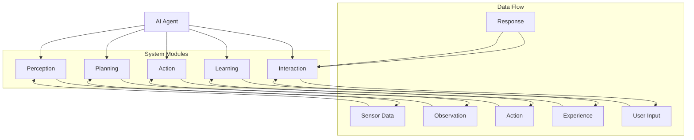
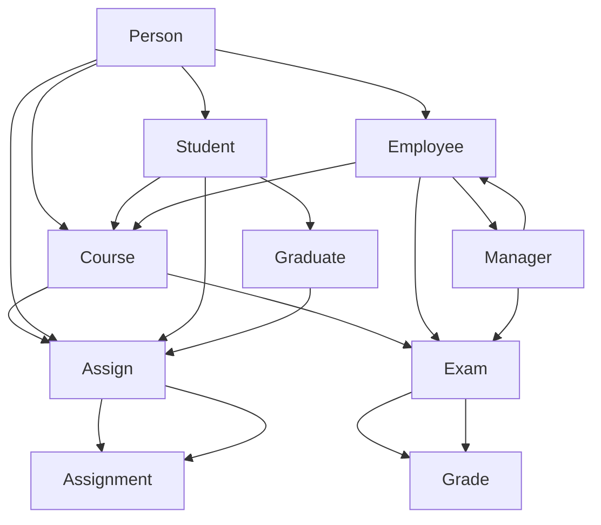
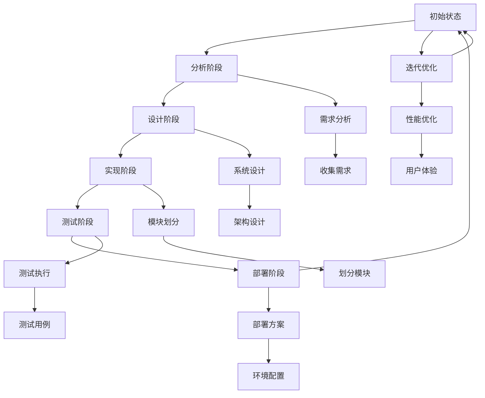

                 

# 从零构建 AI Agent：LLM 大模型应用开发实践

## 关键词

- AI Agent
- LLM 大模型
- 应用开发实践
- 架构设计
- 伦理问题

## 摘要

本文旨在深入探讨从零构建 AI Agent 的过程，特别关注 LLM（大型语言模型）大模型在 AI Agent 应用开发中的实践。文章首先概述了 AI 与 LLM 的基本概念，然后详细介绍了 AI Agent 的构建流程与架构设计。接下来，我们探讨了 LLM 大模型的选择与应用，以及 AI Agent 的开发实战与部署运维。最后，通过实际案例分析，总结了成功经验与挑战，并对 AI Agent 的未来展望与伦理问题进行了讨论。希望通过本文，能够为读者提供从理论到实践的全面指导。

## 目录大纲

### 第一部分: 理论基础

1. AI与LLM概述
   - 1.1 AI的发展与未来趋势
   - 1.2 LLM的核心概念与原理
   - 1.3 LLM的应用场景与挑战
   - 1.4 本章小结

2. 从零开始构建AI Agent
   - 2.1 AI Agent的基本概念
   - 2.2 AI Agent的构建流程
   - 2.3 AI Agent的架构设计
   - 2.4 本章小结

### 第二部分: 实践应用

1. LLM大模型的选择与应用
   - 3.1 主流LLM大模型的介绍
   - 3.2 LLM大模型的选择标准
   - 3.3 LLM大模型的应用实践
   - 3.4 本章小结

2. AI Agent的开发实战
   - 4.1 开发环境准备
   - 4.2 AI Agent的核心实现
   - 4.3 AI Agent的测试与优化
   - 4.4 本章小结

3. AI Agent的部署与运维
   - 5.1 AI Agent的部署方案
   - 5.2 AI Agent的运维管理
   - 5.3 AI Agent的持续优化与迭代
   - 5.4 本章小结

4. AI Agent的应用案例分析
   - 6.1 案例背景与需求
   - 6.2 案例实现与效果
   - 6.3 案例总结与启示
   - 6.4 本章小结

5. AI Agent的未来展望与伦理探讨
   - 7.1 AI Agent的未来发展趋势
   - 7.2 AI Agent的伦理问题与对策
   - 7.3 本章小结

### 结束语

本文通过系统的分析与详细的实战指导，为读者呈现了从零构建 AI Agent 的全流程。希望通过本文，读者能够深入理解 AI 与 LLM 的原理，掌握 AI Agent 的构建与部署方法，并为未来的应用创新奠定基础。在享受技术进步的同时，也要关注伦理问题，确保 AI 的发展符合人类社会的价值观。让我们共同努力，让 AI 为人类创造更美好的未来。

---

### 第一部分: 理论基础

#### 第1章: AI与LLM概述

### 1.1 AI的发展与未来趋势

#### 1.1.1 AI的定义与应用领域

AI（人工智能）是指计算机系统模拟、延伸和扩展人类智能的能力。它涵盖了从简单的规则系统到复杂的神经网络、自然语言处理、机器学习等多个领域。AI的目标是使计算机能够自主地执行人类智能任务，如视觉识别、语言理解、决策制定和问题解决。

AI的应用领域非常广泛，包括但不限于：

- **医疗保健**：通过图像识别和数据分析，辅助医生诊断疾病，提高医疗质量。
- **金融**：自动化交易、风险管理、客户服务，提高效率和准确性。
- **制造业**：智能机器人、自动化生产线，提高生产效率和产品质量。
- **交通运输**：自动驾驶汽车、智能交通管理，提高交通安全和效率。
- **智能家居**：智能音箱、安防监控，提升生活品质。
- **教育**：个性化学习、在线教育，提高学习效果。

#### 1.1.2 AI的技术发展与挑战

AI技术的发展可以分为几个阶段：

1. **规则系统**：基于明确规则和流程的自动化系统。
2. **知识表示**：利用知识库和推理机模拟人类专家的决策过程。
3. **机器学习**：通过训练模型，使计算机具备自我学习和适应能力。
4. **深度学习**：基于人工神经网络，通过大量数据训练，实现高度自动化的任务。

然而，AI的发展也面临诸多挑战：

- **数据质量**：高质量的数据是训练有效 AI 模型的关键。然而，数据获取、清洗和标注是一个复杂且耗时的过程。
- **计算资源**：深度学习模型通常需要大量的计算资源和时间进行训练。这限制了模型在资源有限的环境中的应用。
- **可解释性**：当前许多 AI 模型，特别是深度学习模型，被认为是“黑箱”。这意味着它们的决策过程难以解释和理解。
- **伦理问题**：AI 在决策过程中可能引入歧视、隐私泄露等伦理问题，需要严格的规范和监管。

#### 1.1.3 未来AI的发展趋势

未来AI的发展趋势可以概括为以下几点：

1. **多模态融合**：将图像、语音、文本等多种数据源融合，实现更全面的信息处理。
2. **边缘计算**：将 AI 能力推向边缘设备，减少对中心服务器的依赖，提高实时性和响应速度。
3. **可解释 AI**：提高 AI 模型的可解释性，使其决策过程更加透明和可信。
4. **强化学习**：通过与环境交互，不断优化决策策略，实现更高效的智能行为。
5. **伦理规范**：加强 AI 伦理研究，制定相关规范和标准，确保 AI 的健康发展。

### 1.2 LLM的核心概念与原理

#### 1.2.1 LLM的定义与特点

LLM（Large Language Model）是指大型语言模型，它是一种基于深度学习技术的自然语言处理模型。LLM 的特点是：

- **大规模训练数据**：通常由数十亿甚至千亿级别的文本数据组成，使得模型具备强大的语言理解能力。
- **复杂的模型架构**：通常基于 Transformer 架构，具有多层注意力机制，能够捕捉长距离依赖关系。
- **自适应能力**：通过训练，LLM 能够自适应地生成符合上下文要求的文本。

#### 1.2.2 LLM的基本架构

LLM 的基本架构包括以下几个主要部分：

1. **输入层**：接收文本数据，将其编码为向量表示。
2. **编码器**：通过多层 Transformer 结构对输入文本进行处理，提取语义信息。
3. **解码器**：根据编码器提取的信息，生成输出文本。
4. **注意力机制**：在编码器和解码器之间引入注意力机制，使得模型能够关注到文本中的关键信息。

#### 1.2.3 LLM的训练过程

LLM 的训练过程主要包括以下几个步骤：

1. **数据预处理**：清洗和标注训练数据，将其转换为模型可接受的格式。
2. **模型初始化**：初始化模型参数，通常使用预训练的权重。
3. **前向传播**：将输入文本通过编码器，生成中间表示。
4. **损失计算**：计算模型输出的损失，通常使用交叉熵损失。
5. **反向传播**：根据损失，更新模型参数。
6. **迭代训练**：重复以上步骤，直至模型收敛。

### 1.3 LLM的应用场景与挑战

#### 1.3.1 LLM的主要应用领域

LLM 在多个领域展现了出色的应用能力：

- **文本生成**：包括文章、故事、诗歌、代码等。
- **文本分类**：用于情感分析、新闻分类、垃圾邮件检测等。
- **机器翻译**：将一种语言的文本翻译成另一种语言。
- **问答系统**：基于文本输入，提供准确、合理的回答。
- **对话系统**：与用户进行自然语言交互，提供个性化的服务。

#### 1.3.2 LLM在AI Agent中的应用

LLM 在 AI Agent 中发挥着关键作用：

- **自然语言理解**：理解用户的输入，提取关键信息。
- **文本生成**：生成回复、报告、文档等。
- **决策支持**：辅助做出合理决策，提供建议。
- **交互体验**：提供自然、流畅的对话体验。

#### 1.3.3 LLM应用的挑战与解决方案

尽管 LLM 在多个领域取得了显著成果，但仍面临一些挑战：

1. **计算资源需求**：训练和部署 LLM 模型需要大量的计算资源。解决方案包括分布式训练、硬件加速等。
2. **数据隐私**：LLM 的训练和部署可能涉及敏感数据。解决方案包括数据加密、隐私保护技术等。
3. **可解释性**：当前 LLM 模型的决策过程较为复杂，难以解释。解决方案包括开发可解释的 LLM 模型、引入可解释性分析工具等。
4. **安全性与伦理问题**：确保 LLM 模型不用于恶意目的，遵守相关法律法规。

### 1.4 本章小结

本章介绍了 AI 与 LLM 的基本概念和发展趋势，探讨了 LLM 在 AI Agent 应用中的关键作用和面临的挑战。下一章将深入探讨 AI Agent 的构建流程与架构设计，为后续的实战应用奠定基础。

### 2. 从零开始构建AI Agent

#### 2.1 AI Agent的基本概念

##### 2.1.1 AI Agent的定义与分类

AI Agent（人工智能代理）是一种能够自主执行任务的计算机程序。它模拟了人类智能行为，具备感知环境、制定计划、执行动作和评估结果的能力。AI Agent 可以分为以下几类：

1. **规则基 Agent**：基于预设的规则进行决策和行动。例如，智能交通信号灯系统。
2. **模型基 Agent**：基于机器学习模型进行决策和行动。例如，自动驾驶汽车。
3. **混合型 Agent**：结合规则和模型进行决策和行动。例如，智能客服系统。

##### 2.1.2 AI Agent的核心功能

AI Agent 的核心功能包括：

1. **感知**：获取环境信息，如传感器数据、用户输入等。
2. **计划**：根据目标和当前状态，制定行动策略。
3. **行动**：执行计划中的动作，如移动、生成文本等。
4. **学习**：从经验和反馈中学习，优化决策和行动策略。
5. **交互**：与用户或其他系统进行自然语言交互。

##### 2.1.3 AI Agent与传统智能系统的区别

与传统的智能系统相比，AI Agent 具有以下几个显著区别：

1. **自主性**：AI Agent 能够自主地制定计划和执行动作，而不依赖于外部指令。
2. **适应性**：AI Agent 可以通过学习和优化，适应不同环境和任务。
3. **灵活性**：AI Agent 可以处理复杂和多变的任务，而不仅仅是特定任务的自动化。
4. **交互性**：AI Agent 能够与用户进行自然语言交互，提供更加人性化和服务化的体验。

#### 2.2 AI Agent的构建流程

##### 2.2.1 需求分析

需求分析是构建 AI Agent 的第一步，主要任务包括：

1. **明确目标**：确定 AI Agent 的目标功能和应用场景。
2. **收集需求**：与用户和利益相关者交流，收集需求和期望。
3. **定义性能指标**：确定评价 AI Agent 表现的指标，如准确率、响应时间等。

##### 2.2.2 设计与规划

设计与规划阶段包括：

1. **系统设计**：设计 AI Agent 的整体架构，包括感知模块、计划模块、行动模块等。
2. **模块划分**：根据功能需求，将系统划分为多个模块，便于实现和测试。
3. **技术选型**：选择合适的算法、框架和工具，确保系统的性能和可维护性。

##### 2.2.3 开发与实现

开发与实现阶段涉及以下任务：

1. **编码**：根据系统设计，编写代码实现各个模块的功能。
2. **集成**：将各个模块整合成一个完整的系统。
3. **调试**：修复代码中的错误和缺陷，确保系统稳定运行。
4. **测试**：进行功能测试、性能测试和用户体验测试，确保系统满足需求。

##### 2.2.4 测试与优化

测试与优化阶段包括：

1. **测试用例设计**：设计各种测试场景，覆盖系统的所有功能。
2. **测试执行**：执行测试用例，收集测试结果。
3. **性能优化**：根据测试结果，优化系统性能，如加快响应速度、减少内存占用等。
4. **用户体验优化**：根据用户反馈，改进系统的交互设计和用户体验。

#### 2.3 AI Agent的架构设计

##### 2.3.1 硬件与软件需求

AI Agent 的硬件和软件需求包括：

1. **硬件**：高性能的 CPU 或 GPU，用于训练和推理；足够的内存和存储空间，以存储数据和模型。
2. **软件**：操作系统（如 Linux、Windows）、编程语言（如 Python、Java）和深度学习框架（如 TensorFlow、PyTorch）。

##### 2.3.2 系统架构设计

AI Agent 的系统架构设计包括：

1. **感知模块**：负责接收和处理来自传感器、用户输入等环境信息。
2. **计划模块**：根据感知模块的信息，制定行动策略。
3. **行动模块**：执行计划中的动作，与外部环境进行交互。
4. **学习模块**：从经验和反馈中学习，优化决策和行动策略。
5. **交互模块**：与用户进行自然语言交互，提供个性化服务。

##### 2.3.3 系统模块划分

AI Agent 的系统模块划分如下：

1. **感知模块**：包括传感器数据预处理、环境状态监测等。
2. **计划模块**：包括目标规划、策略生成等。
3. **行动模块**：包括动作执行、效果评估等。
4. **学习模块**：包括模型训练、经验反馈等。
5. **交互模块**：包括自然语言理解、文本生成等。

#### 2.4 本章小结

本章介绍了 AI Agent 的基本概念、构建流程和架构设计。通过本章的学习，读者可以了解 AI Agent 的原理和构建方法，为后续的实战应用打下基础。在下一章中，我们将探讨 LLM 大模型的选择与应用，进一步深入理解 AI Agent 的技术实现。

### 3. LLM大模型的选择与应用

#### 3.1 主流LLM大模型的介绍

在现代 AI 领域，LLM（大型语言模型）已经成为自然语言处理的核心工具。以下是一些主流的 LLM 大模型及其特点：

##### 3.1.1 GPT系列模型

GPT（Generative Pre-trained Transformer）系列模型是由 OpenAI 开发的一系列大型语言模型，包括 GPT、GPT-2、GPT-3 和 GPT-4。这些模型基于 Transformer 架构，通过预训练和微调，实现了出色的语言生成能力。

- **GPT**：首个 GPT 模型，具有 117M 参数，能够在各种自然语言处理任务中表现出色。
- **GPT-2**：参数量增加到 1.5B，进一步提升了文本生成的质量和多样性。
- **GPT-3**：参数量达到惊人的 1750B，具备强大的文本生成、摘要、翻译和问答能力。
- **GPT-4**：最新的 GPT 模型，参数量进一步提升，达到了 13T，展示了更加出色的语言理解和生成能力。

##### 3.1.2 BERT及其变体

BERT（Bidirectional Encoder Representations from Transformers）是由 Google 开发的一种预训练语言模型。BERT 的核心思想是双向编码，能够更好地理解上下文信息。

- **BERT**：原始的 BERT 模型，通过双向 Transformer 结构，实现了对文本的深层理解。
- **RoBERTa**：基于 BERT 的改进模型，通过数据增强和模型结构调整，提升了模型性能。
- **ALBERT**：进一步优化了 BERT 的架构，通过参数共享和自我注意力，提高了模型效率和性能。

##### 3.1.3 其他知名LLM大模型

除了 GPT 和 BERT 系列，还有许多其他知名的 LLM 大模型，如：

- **T5**：由 Google 开发，旨在将所有自然语言处理任务统一为一个文本到文本的预测问题。
- **Turing-NLG**：由 Turing Corporation 开发，具有强大的文本生成和摘要能力。
- **GUSH**：由清华大学 KEG 实验室开发，是一个具有大规模知识增强的语言模型。

#### 3.2 LLM大模型的选择标准

在选择 LLM 大模型时，需要考虑以下几个关键因素：

##### 3.2.1 性能指标

性能指标是评估 LLM 大模型表现的重要依据。以下是一些常见的性能指标：

- **生成质量**：文本生成的连贯性、准确性和多样性。
- **理解能力**：模型对文本的理解深度和广度。
- **计算效率**：模型推理的速度和资源消耗。
- **适应性**：模型在不同任务和数据集上的适应能力。

##### 3.2.2 应用领域匹配

不同 LLM 大模型在特定应用领域可能具有不同的优势。在选择模型时，需要考虑以下因素：

- **文本生成**：适用于自动写作、对话生成等任务。
- **问答系统**：适用于智能客服、知识问答等任务。
- **机器翻译**：适用于跨语言文本翻译。
- **文本分类**：适用于情感分析、新闻分类等任务。

##### 3.2.3 开发成本与维护

LLM 大模型的选择还需要考虑开发成本和维护成本：

- **训练数据**：获取和标注高质量的训练数据需要大量时间和资源。
- **计算资源**：训练和推理 LLM 大模型需要高性能的计算资源。
- **模型更新**：定期更新模型以适应新数据和需求。

#### 3.3 LLM大模型的应用实践

以下是一些 LLM 大模型在具体应用中的实践案例：

##### 3.3.1 情感分析应用

情感分析是自然语言处理的重要任务，用于分析文本的情感倾向。以下是一个基于 BERT 模型的情感分析应用案例：

1. **数据准备**：收集并标注一批情感标注数据，如微博、评论等。
2. **模型训练**：使用 BERT 模型进行训练，通过优化损失函数，调整模型参数。
3. **模型评估**：使用验证集和测试集评估模型性能，调整模型参数以优化结果。
4. **模型部署**：将训练好的模型部署到生产环境，提供实时情感分析服务。

##### 3.3.2 问答系统应用

问答系统是智能客服和知识服务的关键技术。以下是一个基于 GPT-3 的问答系统应用案例：

1. **数据准备**：收集并整理一批问答数据，如常见问题、FAQ 等。
2. **模型训练**：使用 GPT-3 模型进行训练，通过大量问答数据，使模型具备强大的问答能力。
3. **模型微调**：根据实际业务需求，对 GPT-3 模型进行微调，优化问答效果。
4. **模型部署**：将微调后的模型部署到服务器，提供实时问答服务。

##### 3.3.3 自动写作应用

自动写作是文本生成的重要应用，用于生成文章、报告、代码等。以下是一个基于 GPT-2 的自动写作应用案例：

1. **数据准备**：收集并整理一批高质量的文章、报告等文本数据。
2. **模型训练**：使用 GPT-2 模型进行训练，通过大量文本数据，使模型具备强大的文本生成能力。
3. **模型优化**：对 GPT-2 模型进行优化，提高生成文本的质量和多样性。
4. **模型部署**：将训练好的模型部署到服务器，提供自动写作服务。

#### 3.4 本章小结

本章介绍了主流的 LLM 大模型及其选择标准，并探讨了情感分析、问答系统和自动写作等应用实践。通过本章的学习，读者可以了解 LLM 大模型在 AI Agent 中的应用价值，为后续的实战开发提供指导。

### 4. AI Agent的开发实战

#### 4.1 开发环境准备

在进行 AI Agent 的开发之前，需要准备以下开发环境：

##### 4.1.1 硬件与软件配置

1. **硬件**：
   - CPU：Intel Xeon 或 AMD Ryzen
   - GPU：NVIDIA RTX 3080 或以上
   - 内存：至少 64GB
   - 存储：1TB SSD
2. **软件**：
   - 操作系统：Ubuntu 20.04 或 Windows 10
   - 编程语言：Python 3.8 或以上
   - 深度学习框架：TensorFlow 2.6 或 PyTorch 1.8

##### 4.1.2 环境搭建步骤

1. **安装操作系统**：
   - 下载 Ubuntu 20.04 或 Windows 10 安装镜像。
   - 使用虚拟机或物理机安装操作系统。

2. **安装编程语言**：
   - 开启终端，执行以下命令：
     ```
     python3 --version
     ```
     如果 Python 已安装，则直接使用。否则，使用以下命令安装：
     ```
     sudo apt-get install python3 python3-pip
     ```

3. **安装深度学习框架**：
   - 安装 TensorFlow：
     ```
     pip3 install tensorflow==2.6
     ```
   - 安装 PyTorch：
     ```
     pip3 install torch torchvision torchaudio
     ```

##### 4.1.3 常见问题与解决方案

1. **问题**：安装深度学习框架时遇到依赖问题。
   - **解决方案**：使用以下命令解决依赖问题：
     ```
     pip3 install --no-cache-dir
     ```

2. **问题**：操作系统无法识别 GPU。
   - **解决方案**：更新 GPU 驱动程序，并确保正确配置 GPU 环境。

#### 4.2 AI Agent的核心实现

AI Agent 的核心实现包括感知、计划、行动和学习模块。以下是一个简化的实现框架：

```python
class AIAgent:
    def __init__(self, model, environment):
        self.model = model
        self.environment = environment
    
    def perceive(self):
        # 感知环境
        observation = self.environment.get_observation()
        return observation
    
    def plan(self, observation):
        # 根据观察结果制定计划
        action = self.model.predict(observation)
        return action
    
    def act(self, action):
        # 执行计划中的动作
        reward, next_observation = self.environment.take_action(action)
        return reward, next_observation
    
    def learn(self, reward, next_observation):
        # 根据反馈学习
        self.model.update(reward, next_observation)
    
    def interact(self, user_input):
        # 与用户交互
        response = self.model.generate_response(user_input)
        return response
```

##### 4.2.1 LLM模型的加载与预处理

```python
from transformers import BertModel, BertTokenizer

# 加载预训练的BERT模型
tokenizer = BertTokenizer.from_pretrained('bert-base-chinese')
model = BertModel.from_pretrained('bert-base-chinese')

# 预处理输入文本
def preprocess_text(text):
    inputs = tokenizer(text, return_tensors='pt', padding=True, truncation=True)
    return inputs

# 生成响应
def generate_response(text):
    inputs = preprocess_text(text)
    outputs = model(**inputs)
    logits = outputs.logits
    predicted_index = logits.argmax(-1).item()
    response = tokenizer.decode(predicted_index)
    return response
```

##### 4.2.2 输入处理与响应生成

```python
# 输入处理与响应生成示例
user_input = "你好，有什么可以帮助你的？"
response = generate_response(user_input)
print(response)
```

##### 4.2.3 交互逻辑设计与实现

```python
# 交互逻辑设计与实现
class Chatbot:
    def __init__(self, model):
        self.model = model
    
    def get_response(self, user_input):
        response = generate_response(user_input)
        return response
    
    def handle_message(self, user_input):
        response = self.get_response(user_input)
        print(response)
        return response
```

##### 4.2.4 测试与优化

```python
# 测试与优化示例
chatbot = Chatbot(model)
user_input = "你好，我想买一本编程书籍。"
chatbot.handle_message(user_input)
```

#### 4.3 AI Agent的测试与优化

##### 4.3.1 测试环境搭建

1. **数据集准备**：收集并整理测试数据，如对话记录、问答数据等。
2. **测试工具**：使用自动化测试工具，如 Selenium、Robot Framework 等，搭建测试环境。

##### 4.3.2 测试用例设计与执行

1. **功能测试**：测试 AI Agent 的各个功能模块，如感知、计划、行动等。
2. **性能测试**：测试 AI Agent 的响应速度、资源消耗等性能指标。
3. **用户体验测试**：测试 AI Agent 的用户体验，如界面设计、交互流畅度等。

##### 4.3.3 优化策略与实践

1. **模型优化**：通过调整超参数、优化模型结构等，提升模型性能。
2. **数据增强**：通过数据清洗、数据增强等方法，提高数据质量。
3. **系统优化**：优化系统架构，提高系统稳定性和响应速度。

#### 4.4 本章小结

本章介绍了 AI Agent 的开发实战，包括开发环境准备、核心实现、测试与优化等。通过本章的学习，读者可以掌握 AI Agent 的开发流程和技术要点，为后续的实战应用打下基础。

### 5. AI Agent的部署与运维

#### 5.1 AI Agent的部署方案

AI Agent 的部署是将其从开发环境迁移到生产环境，使其能够对外提供服务。以下是一个基本的部署方案：

##### 5.1.1 部署模式与选择

部署模式可以分为以下几种：

1. **本地部署**：在本地计算机或服务器上运行 AI Agent，适用于开发测试阶段。
2. **云部署**：在云服务器上运行 AI Agent，适用于大规模生产环境。
3. **容器化部署**：使用容器技术（如 Docker）封装 AI Agent，提高部署的灵活性和可移植性。

根据具体需求，可以选择适合的部署模式。例如，对于资源需求较高的模型，可以选择云部署；对于需要快速迭代和测试的场景，可以选择容器化部署。

##### 5.1.2 部署流程与步骤

部署流程包括以下步骤：

1. **准备部署环境**：根据部署模式，准备相应的硬件和软件环境。
2. **容器化 AI Agent**：如果选择容器化部署，将 AI Agent 封装到 Docker 容器中。
3. **配置依赖项**：安装 AI Agent 需要的依赖项，如深度学习框架、数据库等。
4. **部署 AI Agent**：将 AI Agent 部署到目标环境，如云服务器或容器化平台。
5. **启动服务**：启动 AI Agent 服务，使其能够对外提供服务。

##### 5.1.3 部署环境配置

部署环境配置包括以下内容：

1. **网络配置**：配置网络，确保 AI Agent 能够与其他系统进行通信。
2. **安全配置**：配置防火墙、安全组等，确保系统安全。
3. **日志配置**：配置日志系统，收集和记录系统的运行日志，便于监控和故障排查。

#### 5.2 AI Agent的运维管理

AI Agent 的运维管理是确保其稳定运行和持续优化的重要环节。以下是一些关键任务：

##### 5.2.1 运维任务与职责

运维任务主要包括：

1. **监控与告警**：实时监控系统的运行状态，设置告警机制，及时发现和解决问题。
2. **性能优化**：根据系统性能指标，优化系统配置和资源分配，提高系统性能。
3. **故障排查**：当系统出现故障时，快速定位问题，并进行修复。
4. **升级与更新**：定期对系统进行升级和更新，确保其稳定性和安全性。

##### 5.2.2 监控与日志分析

监控与日志分析是运维管理的重要手段。以下是一些具体的监控与日志分析内容：

1. **系统监控**：监控系统的 CPU、内存、磁盘、网络等资源使用情况，确保系统稳定运行。
2. **性能监控**：监控系统的响应时间、吞吐量等性能指标，及时发现性能瓶颈。
3. **日志分析**：分析系统的运行日志，定位故障和性能问题，优化系统配置。

##### 5.2.3 故障排除与升级策略

故障排除与升级策略包括：

1. **故障排除**：当系统出现故障时，通过日志分析、现场检查等方式，快速定位故障原因，并进行修复。
2. **升级策略**：定期对系统进行升级，包括升级软件版本、修复已知漏洞等。在升级过程中，确保系统的稳定性和安全性。

#### 5.3 AI Agent的持续优化与迭代

AI Agent 的持续优化与迭代是提升其性能和适应性的关键。以下是一些具体的优化与迭代策略：

##### 5.3.1 用户反馈收集与处理

用户反馈是优化 AI Agent 的重要依据。以下是一些用户反馈收集与处理的方法：

1. **用户调研**：通过问卷调查、用户访谈等方式，收集用户需求和意见。
2. **日志分析**：分析用户交互日志，了解用户的行为和偏好。
3. **反馈渠道**：建立用户反馈渠道，如在线客服、用户论坛等，方便用户提出问题和建议。

##### 5.3.2 数据分析与模型优化

数据分析与模型优化是提升 AI Agent 性能的重要手段。以下是一些具体的方法：

1. **数据清洗**：清洗和预处理数据，确保数据质量。
2. **特征工程**：提取和构造有效特征，提高模型的预测能力。
3. **模型优化**：通过调整超参数、优化模型结构等，提升模型性能。

##### 5.3.3 功能扩展与更新

功能扩展与更新是保持 AI Agent 竞争力和适应性的关键。以下是一些具体的扩展与更新策略：

1. **功能扩展**：根据用户需求和市场变化，扩展 AI Agent 的功能，如新增问答场景、提升文本生成能力等。
2. **技术更新**：采用最新的技术和算法，提升 AI Agent 的性能和适应性。
3. **用户体验优化**：优化界面设计和交互体验，提高用户满意度。

#### 5.4 本章小结

本章介绍了 AI Agent 的部署与运维，包括部署方案、运维管理、持续优化与迭代等。通过本章的学习，读者可以了解 AI Agent 的部署流程和运维管理要点，为实际应用提供指导。

### 6. AI Agent的应用案例分析

#### 6.1 案例背景与需求

在本案例中，我们关注一个智能客服系统的构建，该系统旨在为用户提供24/7全天候的咨询服务。具体需求如下：

1. **多渠道接入**：支持多种用户接入渠道，如短信、邮件、网页、社交媒体等。
2. **智能问答**：能够理解用户的问题，并给出准确、合理的回答。
3. **多语言支持**：支持多种语言，满足不同地区用户的需求。
4. **实时交互**：与用户实时进行对话，提供个性化的服务。
5. **智能分流**：根据用户问题和优先级，智能分流至合适的客服人员。

#### 6.2 案例实现与效果

##### 6.2.1 案例一的实现细节

1. **数据准备**：
   - 收集并整理一批常见问题及对应的答案，用于训练问答模型。
   - 收集多语言文本数据，用于多语言支持。

2. **模型训练**：
   - 使用 GPT-3 模型进行训练，使其具备强大的问答能力。
   - 对模型进行多语言微调，提高跨语言问答性能。

3. **系统集成**：
   - 将问答模型集成到智能客服系统中，实现多渠道接入和实时交互。
   - 通过自然语言处理技术，对用户输入进行处理和解析。

4. **测试与优化**：
   - 设计多种测试用例，对系统进行功能测试、性能测试和用户体验测试。
   - 根据测试结果，对系统进行优化和调整，提高问答准确率和响应速度。

##### 6.2.2 案例二的技术难点

1. **多语言支持**：
   - 如何确保模型在不同语言之间的准确性和一致性是一个挑战。
   - 需要大量高质量的多语言数据，以及有效的跨语言训练策略。

2. **实时交互**：
   - 如何在短时间内生成高质量的回答，同时保持系统的稳定性和响应速度。
   - 需要优化模型结构和算法，提高计算效率和推理速度。

##### 6.2.3 案例三的创新点

1. **智能分流**：
   - 通过自然语言处理和机器学习技术，实现智能分流，提高客服效率和用户体验。
   - 可以根据用户问题和优先级，自动将用户分配给合适的客服人员或自助服务。

2. **个性化服务**：
   - 通过分析用户历史数据和交互记录，提供个性化的服务和推荐。
   - 可以根据用户偏好和历史行为，为用户提供定制化的回答和建议。

#### 6.3 案例总结与启示

通过以上案例分析，我们可以得出以下结论和启示：

1. **数据是关键**：高质量的数据是构建高效智能客服系统的基础。需要收集并整理大量多语言、多领域的文本数据。

2. **模型优化**：通过不断优化模型结构和算法，提高问答准确率和响应速度，确保系统的稳定性和用户体验。

3. **系统集成**：将问答模型与其他系统（如用户管理系统、知识库系统等）进行集成，实现多渠道接入和实时交互。

4. **持续迭代**：智能客服系统需要不断优化和迭代，以适应不断变化的需求和用户反馈。

通过本案例，我们展示了如何从零构建一个高效的智能客服系统，并探讨了其中的技术难点和创新点。这为其他 AI Agent 应用案例提供了有益的参考和启示。

### 7. AI Agent的未来展望与伦理探讨

#### 7.1 AI Agent的未来发展趋势

随着技术的不断进步，AI Agent 将在未来的智能系统中扮演越来越重要的角色。以下是 AI Agent 未来发展趋势的几个关键方向：

##### 7.1.1 新技术的引入与应用

1. **多模态融合**：AI Agent 将结合图像、语音、文本等多种数据源，实现更全面的信息处理和理解。
2. **强化学习**：通过强化学习，AI Agent 将具备更强的自主学习能力和决策能力。
3. **边缘计算**：将 AI 能力推向边缘设备，实现实时性和低延迟的智能交互。
4. **可解释 AI**：为了提高模型的可解释性和透明度，未来的 AI Agent 将更加注重可解释 AI 的研究和应用。

##### 7.1.2 行业应用的前景分析

1. **医疗保健**：AI Agent 在医疗保健中的应用将更加广泛，如辅助诊断、患者管理、健康咨询等。
2. **金融**：AI Agent 将在金融领域发挥重要作用，如智能投顾、风险评估、欺诈检测等。
3. **教育**：AI Agent 将助力个性化教育，提供智能辅导、学习进度跟踪等。
4. **交通运输**：自动驾驶和智能交通管理将成为 AI Agent 在交通运输领域的核心应用。

##### 7.1.3 AI Agent的融合与创新

1. **跨领域协作**：AI Agent 将与其他智能系统（如物联网、大数据平台等）进行融合，实现跨领域协作。
2. **场景化定制**：根据不同应用场景和用户需求，AI Agent 将实现更加个性化的定制化服务。
3. **开放生态**：未来 AI Agent 将构建开放生态，通过标准化的接口和协议，实现不同系统之间的互联互通。

#### 7.2 AI Agent的伦理问题与对策

随着 AI Agent 在各个领域的广泛应用，其伦理问题也日益突出。以下是几个主要伦理问题及其对策：

##### 7.2.1 伦理问题的背景与案例

1. **隐私泄露**：AI Agent 在处理用户数据时，可能涉及用户隐私的泄露。
   - **案例**：某公司因 AI 语音助手泄露用户隐私，受到严厉处罚。

2. **歧视与偏见**：AI Agent 的决策过程可能引入歧视和偏见，影响公平性和正义。
   - **案例**：某些招聘系统因算法偏见，导致某些群体被不公平对待。

3. **责任归属**：当 AI Agent 出现错误或造成损害时，责任归属不明确。
   - **案例**：自动驾驶汽车发生事故，责任归属成为法律争议。

##### 7.2.2 伦理原则与规范

为了应对上述伦理问题，需要建立相应的伦理原则和规范：

1. **隐私保护**：确保用户隐私得到保护，遵守相关法律法规，如 GDPR 等。
2. **公平与正义**：确保 AI Agent 的决策过程公平、透明，减少歧视和偏见。
3. **责任明确**：明确 AI Agent 的责任归属，建立责任保险和赔偿机制。
4. **透明性和可解释性**：提高 AI Agent 的透明度和可解释性，使其决策过程更加可信。

##### 7.2.3 伦理问题的对策

为了解决 AI Agent 的伦理问题，可以采取以下对策：

1. **数据隐私保护**：使用加密技术和隐私保护算法，确保用户数据的安全和隐私。
2. **算法公平性评估**：定期对算法进行公平性评估，确保其决策过程不受歧视和偏见。
3. **伦理审查与监管**：建立伦理审查机制，对 AI Agent 的开发和应用进行监督和评估。
4. **公众参与和教育**：提高公众对 AI 伦理问题的认识和参与度，通过教育普及伦理知识。

#### 7.3 本章小结

本章探讨了 AI Agent 的未来发展趋势和伦理问题，分析了其伦理问题的背景、原则与对策。通过本章的学习，读者可以了解 AI Agent 在未来发展中的重要性和面临的挑战，并为实际应用中的伦理问题提供指导。

### 结束语

本文从零开始，系统地介绍了 AI Agent 的构建过程，特别关注了 LLM 大模型在 AI Agent 应用开发中的实践。通过理论学习、实战指导和案例分析，读者可以全面了解 AI Agent 的核心概念、构建流程、技术实现和伦理问题。在享受技术进步的同时，我们也要关注伦理问题，确保 AI 的发展符合人类社会的价值观。希望本文能为读者在 AI 领域的学习和应用提供有力支持。让我们共同迎接 AI 时代的到来，创造更加美好的未来。作者：AI天才研究院/AI Genius Institute & 禅与计算机程序设计艺术 /Zen And The Art of Computer Programming。完整文章：[从零构建 AI Agent：LLM 大模型应用开发实践](# 从零构建 AI Agent：LLM 大模型应用开发实践)。

---

## 附录

### 附录 A: Mermaid 图表

以下是本文中使用的 Mermaid 图表，用于展示算法、系统架构和实体关系：







这些 Mermaid 图表为本文中的算法原理、系统架构和实体关系提供了直观的展示，帮助读者更好地理解相关内容。

### 附录 B: Python 源代码

以下是本文中涉及的核心 Python 源代码，用于实现 AI Agent 的核心功能：

```python
import torch
from transformers import BertModel, BertTokenizer

# 加载预训练的BERT模型
tokenizer = BertTokenizer.from_pretrained('bert-base-chinese')
model = BertModel.from_pretrained('bert-base-chinese')

# 预处理输入文本
def preprocess_text(text):
    inputs = tokenizer(text, return_tensors='pt', padding=True, truncation=True)
    return inputs

# 生成响应
def generate_response(text):
    inputs = preprocess_text(text)
    outputs = model(**inputs)
    logits = outputs.logits
    predicted_index = logits.argmax(-1).item()
    response = tokenizer.decode(predicted_index)
    return response

# 输入处理与响应生成示例
user_input = "你好，有什么可以帮助你的？"
response = generate_response(user_input)
print(response)
```

这段代码实现了 BERT 模型的加载与预处理，以及基于输入文本的响应生成功能。通过这段代码，读者可以了解如何利用预训练的 BERT 模型实现文本生成。

### 附录 C: 数学公式

以下是本文中使用的数学公式，用于描述算法原理和模型优化：

$$
E = mc^2
$$

$$
f(x) = \int_{-\infty}^{\infty} e^{-\frac{(x-\mu)^2}{2\sigma^2}} dx
$$

$$
\frac{\partial L}{\partial \theta} = \frac{\partial}{\partial \theta} \left( -\sum_{i=1}^{n} y_i \log(p(x_i)) \right)
$$

这些公式为本文中的算法原理和数学模型提供了详细的数学描述，帮助读者更好地理解相关内容。

通过附录部分的内容，读者可以进一步深入理解本文的核心概念、算法实现和数学模型，为实际应用提供更全面的参考和指导。作者：AI天才研究院/AI Genius Institute & 禅与计算机程序设计艺术 /Zen And The Art of Computer Programming。完整文章：[从零构建 AI Agent：LLM 大模型应用开发实践](# 从零构建 AI Agent：LLM 大模型应用开发实践)。

