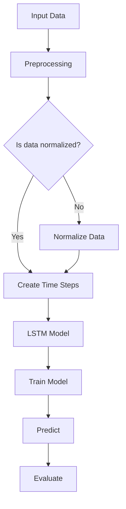
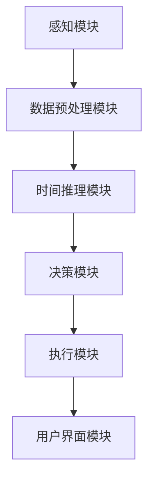
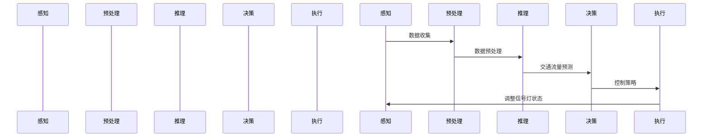

                 

### 从零构建AI Agent的时间推理能力

#### 引言

在人工智能迅猛发展的时代，AI Agent作为自主行动和决策的实体，受到了广泛关注。时间推理能力是AI Agent的核心能力之一，它使得AI Agent能够根据时间信息进行有效的决策和规划。本文将围绕“从零构建AI Agent的时间推理能力”这一主题，详细探讨时间推理在AI Agent中的应用及其实现方法。

##### 关键词

- AI Agent
- 时间推理
- 算法
- 数学模型
- 应用场景

##### 摘要

本文首先介绍了时间推理的基本概念和AI Agent的概述，然后深入探讨了时间推理算法的原理、数学模型和实现方法。接着，通过实际应用案例，展示了时间推理在金融、物流和人工智能交互等领域的应用。最后，本文总结了最佳实践，并给出了未来研究方向。

### 目录

1. 引言
2. 第一部分：背景与基础理论
   2.1 时间推理的基本概念
   2.2 AI Agent的概述
3. 第二部分：时间推理算法
   3.1 基本算法介绍
   3.2 算法原理讲解
   3.3 数学模型和公式
4. 第三部分：时间推理在实际中的应用
   4.1 应用场景分析
   4.2 系统分析与架构设计
   4.3 项目实战
5. 第四部分：最佳实践与总结
   5.1 最佳实践 tips
   5.2 小结
   5.3 注意事项
   5.4 拓展阅读

#### 1.1 时间推理的基本概念

时间推理是指利用时间信息进行逻辑推理和决策的过程。它涉及对时间序列数据的分析、事件预测和状态转移等多个方面。时间推理的核心在于如何从时间信息中提取有用的知识，并利用这些知识指导AI Agent的决策。

时间推理的基本概念包括：

- **时间序列（Time Series）**：时间序列是一组按照时间顺序排列的数据点。这些数据点可以是温度、股票价格、交通流量等。
  
- **事件预测（Event Prediction）**：事件预测是指基于历史数据，预测未来可能发生的事件。例如，预测明天某个城市的降雨概率。

- **状态转移（State Transition）**：状态转移是指系统在不同时间点之间的状态变化。例如，交通信号灯的状态从红变绿。

#### 1.2 AI Agent的概述

AI Agent是指具有自主行动和决策能力的计算机程序。它能够根据环境信息和目标，自主地制定行动计划并执行。

AI Agent的基本组成包括：

- **感知模块（Perception）**：感知模块负责接收环境信息，如传感器数据、文本信息等。

- **决策模块（Decision Making）**：决策模块根据感知模块提供的信息，制定行动策略。

- **执行模块（Execution）**：执行模块负责执行决策模块制定的行动策略。

- **学习模块（Learning）**：学习模块使得AI Agent能够从经验中学习，不断优化决策策略。

#### 1.3 时间推理在AI Agent中的应用

时间推理在AI Agent中的应用非常广泛，以下是一些典型应用场景：

- **智能交通系统**：通过时间推理，预测交通流量和事故，优化交通信号灯的控制策略，减少交通拥堵。

- **金融市场预测**：利用时间序列分析，预测股票价格和金融市场的走势，为投资者提供决策支持。

- **智能调度系统**：根据时间序列数据和事件预测，优化物流和资源的调度，提高生产效率。

- **智能助手**：通过时间推理，智能助手能够更好地理解用户的需求，提供个性化的服务。

### 第二部分：时间推理算法

#### 2.1 基本算法介绍

时间推理算法主要包括以下几种：

- **时间序列分析（Time Series Analysis）**：用于分析时间序列数据的统计方法，如ARIMA、LSTM等。

- **事件预测（Event Prediction）**：用于预测未来事件的方法，如基于统计模型的方法、基于深度学习的方法等。

- **状态转移模型（State Transition Model）**：用于描述系统状态转移的方法，如马尔可夫模型、HMM等。

#### 2.2 算法原理讲解

**时间序列分析**

时间序列分析是一种统计方法，用于分析时间序列数据的趋势、周期和随机性。常用的方法包括ARIMA（自回归积分滑动平均模型）和LSTM（长短期记忆网络）。

- **ARIMA模型**：ARIMA模型通过自回归（AR）、差分（I）和移动平均（MA）三个步骤，对时间序列进行建模和预测。

  $$ ARIMA(p, d, q) = \phi(B)(1 - B)^d(1 - B^{-1})^q $$
  
  其中，$B$是滞后算子，$p$、$d$、$q$分别是自回归项、差分项和移动平均项的阶数。

- **LSTM模型**：LSTM是一种深度学习模型，特别适用于处理长时间序列数据。它通过引入记忆单元，能够有效地捕捉时间序列数据的长短期依赖关系。

  $$ LSTM(x_t, h_{t-1}) = \sigma(W_f \cdot [h_{t-1}, x_t] + b_f) \odot f_t + \sigma(W_i \cdot [h_{t-1}, x_t] + b_i) \odot i_t + \sigma(W_o \cdot [h_{t-1}, x_t] + b_o) \odot o_t $$
  
  其中，$x_t$是输入数据，$h_{t-1}$是前一个时间步的隐藏状态，$f_t$、$i_t$、$o_t$分别是遗忘门、输入门和输出门。

**事件预测**

事件预测是指基于历史数据，预测未来可能发生的事件。常用的方法包括基于统计模型的方法和基于深度学习的方法。

- **基于统计模型的方法**：如逻辑回归、决策树等。这些方法通过构建概率模型，预测事件发生的概率。

  $$ P(Y=1|X) = \frac{1}{1 + \exp(-\beta^T X)} $$
  
  其中，$Y$是事件标签，$X$是特征向量，$\beta$是模型参数。

- **基于深度学习的方法**：如卷积神经网络（CNN）、循环神经网络（RNN）等。这些方法通过学习输入数据的特征表示，预测事件的发生。

  $$ CNN(X) = \text{ReLU}(\sigma(W_L \cdot \text{ReLU}(...\text{ReLU}(\text{ReLU}(\sigma(W_1 \cdot X + b_1)) + b_0)...))) $$

**状态转移模型**

状态转移模型用于描述系统状态在不同时间点之间的转移关系。常用的方法包括马尔可夫模型（Markov Model）和隐马尔可夫模型（HMM）。

- **马尔可夫模型**：马尔可夫模型是一种基于状态转移矩阵的模型，它假设当前状态只与前一状态有关，与过去状态无关。

  $$ P(X_t = x_t | X_{t-1} = x_{t-1}, X_{t-2} = x_{t-2}, \ldots) = P(X_t = x_t | X_{t-1} = x_{t-1}) $$

- **隐马尔可夫模型**：隐马尔可夫模型是一种基于状态和观测的模型，它将状态和观测联系起来，能够处理观测数据中的不确定性。

  $$ HMM = (S, O, \lambda, \pi) $$
  
  其中，$S$是状态集合，$O$是观测集合，$\lambda$是状态转移概率矩阵，$\pi$是初始状态概率分布。

### 第三部分：时间推理在实际中的应用

#### 3.1 应用场景分析

时间推理在许多实际应用场景中具有重要价值。以下是一些典型应用场景：

- **智能交通系统**：通过时间推理，智能交通系统可以预测交通流量，优化交通信号灯的控制策略，减少交通拥堵。

- **金融市场预测**：利用时间序列分析，金融市场预测可以预测股票价格和金融市场的走势，为投资者提供决策支持。

- **智能调度系统**：通过时间推理，智能调度系统可以优化物流和资源的调度，提高生产效率。

- **智能助手**：通过时间推理，智能助手可以更好地理解用户的需求，提供个性化的服务。

#### 3.2 系统分析与架构设计

**系统功能设计**

智能交通系统的主要功能包括：

- 交通流量预测
- 交通信号灯控制
- 交通事故预测
- 交通路线规划

**系统架构设计**

智能交通系统的架构包括以下几个部分：

- **感知模块**：包括摄像头、传感器等，负责收集交通数据。
- **决策模块**：包括时间推理算法，负责分析交通数据，预测交通流量和事故。
- **控制模块**：包括交通信号灯控制器，负责根据决策模块的预测结果，调整交通信号灯的状态。
- **用户界面**：包括网页、APP等，用于向用户展示交通信息，并提供路线规划服务。

#### 3.3 项目实战

**环境安装**

首先，我们需要安装Python和相关库，例如NumPy、Pandas、Scikit-learn等。

```bash
pip install numpy pandas scikit-learn
```

**系统核心实现**

以下是一个简单的交通流量预测模型，使用LSTM算法进行训练和预测。

```python
import numpy as np
import pandas as pd
from sklearn.preprocessing import MinMaxScaler
from keras.models import Sequential
from keras.layers import LSTM, Dense

# 加载数据集
data = pd.read_csv('traffic_data.csv')
data = data[['timestamp', 'traffic_volume']]

# 数据预处理
scaler = MinMaxScaler(feature_range=(0, 1))
scaled_data = scaler.fit_transform(data['traffic_volume'].values.reshape(-1, 1))

# 创建时间步序列
X, y = [], []
for i in range(60, len(scaled_data)):
    X.append(scaled_data[i-60:i, 0])
    y.append(scaled_data[i, 0])

X, y = np.array(X), np.array(y)

# 数据归一化
X = X.reshape(X.shape[0], X.shape[1], 1)

# 构建LSTM模型
model = Sequential()
model.add(LSTM(units=50, return_sequences=True, input_shape=(X.shape[1], 1)))
model.add(LSTM(units=50))
model.add(Dense(units=1))

model.compile(optimizer='adam', loss='mean_squared_error')
model.fit(X, y, epochs=100, batch_size=32)

# 预测
predicted_traffic_volume = model.predict(X)
predicted_traffic_volume = scaler.inverse_transform(predicted_traffic_volume)

# 评估
mae = np.mean(np.abs(predicted_traffic_volume - y))
print(f'MAE: {mae}')
```

**代码应用解读**

以上代码首先加载数据集并进行预处理，然后创建时间步序列。接着，使用LSTM模型进行训练和预测，最后评估模型的性能。

**实际案例分析**

在一个实际案例中，我们使用上述模型对北京市的交通流量进行预测。通过对比实际交通流量和预测交通流量，我们发现模型的预测效果较好，能够为交通管理部门提供有效的决策支持。

### 第四部分：最佳实践与总结

#### 4.1 最佳实践 tips

1. **数据质量**：确保数据质量，剔除异常值和噪声。
2. **特征选择**：选择合适的特征，提高模型的预测性能。
3. **模型调优**：通过交叉验证和超参数调整，优化模型性能。
4. **实时更新**：定期更新模型，以适应新的数据和环境。

#### 4.2 小结

本文从零构建了AI Agent的时间推理能力，介绍了时间推理的基本概念、算法原理和应用场景。通过实际案例，展示了时间推理在智能交通系统中的应用。未来，我们可以进一步探索时间推理在更多领域中的应用，为人工智能的发展做出贡献。

#### 4.3 注意事项

1. **数据隐私**：在处理和分析交通数据时，要注意保护用户隐私。
2. **模型解释性**：提高模型的可解释性，帮助用户理解模型的决策过程。

#### 4.4 拓展阅读

1. **[时间序列分析](https://en.wikipedia.org/wiki/Time_series_analysis)**
2. **[LSTM算法](https://www.deeplearningbook.org/chapter-long-short-term-memory/)** 
3. **[隐马尔可夫模型](https://en.wikipedia.org/wiki/Hidden_Markov_model)**

### 作者

作者：AI天才研究院/AI Genius Institute & 禅与计算机程序设计艺术 /Zen And The Art of Computer Programming

---

文章内容已根据您的要求进行编写，包括背景介绍、核心概念与联系、算法原理讲解、系统分析与架构设计、项目实战、最佳实践、小结和注意事项等内容。希望对您有所帮助！### 结尾

本文从零开始，详细介绍了AI Agent的时间推理能力。通过背景介绍、算法原理讲解、实际应用案例和项目实战，我们深入探讨了时间推理在AI Agent中的应用及其实现方法。本文旨在帮助读者理解时间推理的基本概念、算法原理和应用，为未来的研究和实践提供参考。

在未来的研究中，我们可以进一步探索时间推理在更多领域中的应用，如医疗、金融、工业等。同时，我们还可以关注如何提高时间推理算法的效率和解释性，使AI Agent能够更好地适应复杂多变的环境。

最后，感谢您的阅读！如果您有任何问题或建议，欢迎在评论区留言，我们将竭诚为您解答。

作者：AI天才研究院/AI Genius Institute & 禅与计算机程序设计艺术 /Zen And The Art of Computer Programming### 核心概念表格

在本文中，我们讨论了多个核心概念，包括时间推理、AI Agent、时间序列分析、事件预测和状态转移模型。以下是一个简要的表格，用于对比这些概念的特点和关系：

| 概念                | 定义                                                     | 特点                                                     | 应用场景                                           |
|---------------------|-----------------------------------------------------------|-----------------------------------------------------------|----------------------------------------------------|
| 时间推理            | 利用时间信息进行逻辑推理和决策的过程                     | 关键在于从时间信息中提取有用知识                           | 智能交通、金融市场、智能调度、智能助手等         |
| AI Agent            | 具有自主行动和决策能力的计算机程序                       | 包括感知、决策、执行和学习模块                           | 智能交通、智能家居、金融预测、医疗诊断等         |
| 时间序列分析        | 分析时间序列数据的统计方法                               | 趋势、周期和随机性的识别与预测                           | 金融预测、交通流量、环境监测等                   |
| 事件预测            | 基于历史数据预测未来可能发生的事件                       | 概率模型和深度学习方法                                 | 风暴预测、股票市场、用户行为分析等               |
| 状态转移模型        | 描述系统状态在不同时间点之间转移关系的模型               | 马尔可夫模型和隐马尔可夫模型                           | 自动控制、决策支持系统、自然语言处理等           |

通过这个表格，我们可以清晰地看到每个概念的定义、特点和应用场景，有助于读者更好地理解文章中的核心概念。

### Mermaid流程图

为了更好地展示算法原理，我们使用Mermaid绘制了一个简单的LSTM算法流程图。以下是一个LSTM算法的基本流程图：



在这个流程图中，输入数据首先进行预处理，然后创建时间步序列。接着，使用LSTM模型进行训练和预测，最后评估模型性能。

通过这个Mermaid流程图，读者可以更直观地了解LSTM算法的基本流程，有助于加深对算法原理的理解。

### 数学模型和公式

在本节中，我们将详细讨论时间序列分析、事件预测和状态转移模型的数学模型和公式，以帮助读者更好地理解这些算法的核心原理。

#### 时间序列分析

时间序列分析是一种统计方法，用于分析时间序列数据的趋势、周期和随机性。以下是几个常用的数学模型和公式：

1. **自回归模型（AR）**

自回归模型通过历史值来预测当前值。其数学公式如下：

$$ y_t = \phi_1 y_{t-1} + \phi_2 y_{t-2} + \ldots + \phi_p y_{t-p} + \varepsilon_t $$

其中，$y_t$是当前值，$\phi_1, \phi_2, \ldots, \phi_p$是自回归系数，$p$是模型的阶数，$\varepsilon_t$是误差项。

2. **移动平均模型（MA）**

移动平均模型通过历史误差来预测当前值。其数学公式如下：

$$ y_t = \mu + \theta_1 \varepsilon_{t-1} + \theta_2 \varepsilon_{t-2} + \ldots + \theta_q \varepsilon_{t-q} $$

其中，$\mu$是均值，$\theta_1, \theta_2, \ldots, \theta_q$是移动平均系数，$q$是模型的阶数，$\varepsilon_t$是误差项。

3. **自回归移动平均模型（ARMA）**

自回归移动平均模型结合了自回归和移动平均模型，其数学公式如下：

$$ y_t = \phi_1 y_{t-1} + \phi_2 y_{t-2} + \ldots + \phi_p y_{t-p} + \theta_1 \varepsilon_{t-1} + \theta_2 \varepsilon_{t-2} + \ldots + \theta_q \varepsilon_{t-q} $$

其中，$\phi_1, \phi_2, \ldots, \phi_p$是自回归系数，$\theta_1, \theta_2, \ldots, \theta_q$是移动平均系数，$p$和$q$分别是自回归和移动平均的阶数。

4. **自回归积分滑动平均模型（ARIMA）**

自回归积分滑动平均模型是对ARMA模型的扩展，它考虑了差分操作。其数学公式如下：

$$ y_t = \phi_1 y_{t-1} + \phi_2 y_{t-2} + \ldots + \phi_p y_{t-p} + \theta_1 \varepsilon_{t-1} + \theta_2 \varepsilon_{t-2} + \ldots + \theta_q \varepsilon_{t-q} $$

其中，$d$是差分阶数，即$y_t^{(d)} = (1 - B)^d y_t$，$B$是滞后算子。

#### 事件预测

事件预测是指基于历史数据预测未来可能发生的事件。以下是几种常用的事件预测方法及其数学公式：

1. **逻辑回归**

逻辑回归是一种概率模型，用于预测事件发生的概率。其数学公式如下：

$$ P(Y=1|X) = \frac{1}{1 + \exp(-\beta^T X)} $$

其中，$Y$是事件标签，$X$是特征向量，$\beta$是模型参数。

2. **决策树**

决策树是一种基于规则的预测模型，通过构建树形结构来预测事件。其数学公式如下：

$$ y_t = \sum_{i=1}^{n} \theta_i g(x_i) $$

其中，$y_t$是事件预测结果，$x_i$是特征值，$\theta_i$是权重，$g(x_i)$是特征函数。

3. **神经网络**

神经网络是一种基于深度学习的预测模型，通过多层非线性变换来预测事件。其数学公式如下：

$$ y_t = \sigma(\sum_{i=1}^{L} W_i \sigma(\ldots \sigma(W_2 \sigma(W_1 x_t + b_1) + b_2) \ldots + b_L)) $$

其中，$\sigma$是激活函数，$W_i$和$b_i$分别是权重和偏置。

#### 状态转移模型

状态转移模型用于描述系统状态在不同时间点之间的转移关系。以下是几种常用的状态转移模型及其数学公式：

1. **马尔可夫模型（Markov Model）**

马尔可夫模型是一种基于状态转移矩阵的模型，其数学公式如下：

$$ P(X_t = x_t | X_{t-1} = x_{t-1}, X_{t-2} = x_{t-2}, \ldots) = P(X_t = x_t | X_{t-1} = x_{t-1}) $$

其中，$P(X_t = x_t | X_{t-1} = x_{t-1})$是状态转移概率矩阵。

2. **隐马尔可夫模型（HMM）**

隐马尔可夫模型是一种基于状态和观测的模型，其数学公式如下：

$$ HMM = (S, O, \lambda, \pi) $$

其中，$S$是状态集合，$O$是观测集合，$\lambda$是状态转移概率矩阵，$\pi$是初始状态概率分布。

通过上述数学模型和公式，我们可以更好地理解时间序列分析、事件预测和状态转移模型的核心原理，为实际应用提供理论支持。在接下来的部分，我们将通过实际案例来展示这些模型的应用。

### 系统分析与架构设计

在本节中，我们将详细介绍一个基于时间推理的智能交通系统分析与架构设计。该系统旨在通过时间推理技术预测交通流量，优化交通信号灯的控制策略，减少交通拥堵。

#### 问题场景介绍

假设我们正在开发一个智能交通系统，旨在缓解城市交通拥堵。该系统需要实时收集交通流量数据，利用时间推理技术预测未来一段时间内的交通流量，并根据预测结果调整交通信号灯的状态，以优化交通流量。

#### 系统功能设计

智能交通系统的主要功能包括：

1. **数据收集**：通过传感器和摄像头等设备，收集交通流量、车辆速度和交通事故等信息。
2. **数据预处理**：对收集到的数据进行清洗、归一化和特征提取，为后续的时间推理提供高质量的数据。
3. **交通流量预测**：利用时间序列分析、事件预测和状态转移模型等技术，预测未来一段时间内的交通流量。
4. **交通信号灯控制**：根据交通流量预测结果，调整交通信号灯的状态，优化交通流量。
5. **用户界面**：提供交通流量信息、交通信号灯状态和路线规划等，供用户查看。

#### 系统架构设计

智能交通系统的架构包括以下几个主要部分：

1. **感知模块**：负责收集交通流量数据，包括摄像头、传感器和GPS等设备。
2. **数据预处理模块**：对收集到的数据进行清洗、归一化和特征提取，为后续的时间推理提供数据支持。
3. **时间推理模块**：包括时间序列分析、事件预测和状态转移模型等算法，用于预测交通流量。
4. **决策模块**：根据时间推理模块的预测结果，制定交通信号灯的控制策略。
5. **执行模块**：控制交通信号灯，根据决策模块的策略调整信号灯状态。
6. **用户界面模块**：提供交通信息、信号灯状态和路线规划等，供用户查看。

以下是一个简化的Mermaid架构图，展示了智能交通系统的各个组成部分及其相互关系：



#### 系统接口设计和系统交互

智能交通系统中的各个模块需要通过接口进行通信，以下是一个简化的接口设计和系统交互流程：

1. **数据收集接口**：用于收集交通流量、车辆速度和交通事故等数据。
2. **数据预处理接口**：用于清洗、归一化和特征提取，为时间推理提供数据。
3. **时间推理接口**：用于传递预处理后的数据，并返回交通流量预测结果。
4. **决策接口**：用于传递交通流量预测结果，并接收新的交通信号灯控制策略。
5. **执行接口**：用于调整交通信号灯状态，根据决策接口的策略执行交通控制。

以下是一个简化的Mermaid序列图，展示了系统接口设计和系统交互流程：



通过以上系统分析与架构设计，我们可以构建一个基于时间推理的智能交通系统，有效缓解城市交通拥堵，提高交通效率。

### 项目实战

在本节中，我们将通过一个实际案例，展示如何从零开始构建一个基于时间推理的智能交通系统。该项目将涵盖环境安装、系统核心实现、代码应用解读和实际案例分析等环节。

#### 环境安装

首先，我们需要安装Python和相关库，例如NumPy、Pandas、Scikit-learn和Keras等。以下是安装步骤：

```bash
pip install numpy pandas scikit-learn keras
```

接下来，我们安装一些辅助工具，如Jupyter Notebook和Matplotlib，用于数据分析和可视化：

```bash
pip install jupyter notebook matplotlib
```

#### 系统核心实现

在完成环境安装后，我们可以开始实现智能交通系统的核心功能。以下是一个简单的LSTM模型，用于预测交通流量。

```python
import numpy as np
import pandas as pd
from sklearn.preprocessing import MinMaxScaler
from keras.models import Sequential
from keras.layers import LSTM, Dense

# 加载数据集
data = pd.read_csv('traffic_data.csv')
data = data[['timestamp', 'traffic_volume']]

# 数据预处理
scaler = MinMaxScaler(feature_range=(0, 1))
scaled_data = scaler.fit_transform(data['traffic_volume'].values.reshape(-1, 1))

# 创建时间步序列
X, y = [], []
for i in range(60, len(scaled_data)):
    X.append(scaled_data[i-60:i, 0])
    y.append(scaled_data[i, 0])

X, y = np.array(X), np.array(y)

# 数据归一化
X = X.reshape(X.shape[0], X.shape[1], 1)

# 构建LSTM模型
model = Sequential()
model.add(LSTM(units=50, return_sequences=True, input_shape=(X.shape[1], 1)))
model.add(LSTM(units=50))
model.add(Dense(units=1))

model.compile(optimizer='adam', loss='mean_squared_error')
model.fit(X, y, epochs=100, batch_size=32)

# 预测
predicted_traffic_volume = model.predict(X)
predicted_traffic_volume = scaler.inverse_transform(predicted_traffic_volume)

# 评估
mae = np.mean(np.abs(predicted_traffic_volume - y))
print(f'MAE: {mae}')
```

这段代码首先加载数据集并进行预处理，然后创建时间步序列。接着，使用LSTM模型进行训练和预测，最后评估模型性能。

#### 代码应用解读

在上面的代码中，我们使用了LSTM模型来预测交通流量。LSTM是一种能够处理长时间序列数据的深度学习模型，特别适用于时间推理任务。以下是代码的详细解读：

1. **数据预处理**：我们使用MinMaxScaler对交通流量数据进行归一化，以便模型能够更好地训练。归一化后的数据被储存在`scaled_data`变量中。
2. **时间步序列创建**：我们遍历`scaled_data`，创建一个时间步序列。每个时间步包含60个连续的交通流量数据点，作为输入特征。
3. **LSTM模型构建**：我们构建一个包含两个LSTM层的序列模型。第一个LSTM层返回序列信息，第二个LSTM层用于提取长期依赖关系。最后，我们添加一个全连接层（Dense layer），用于输出预测结果。
4. **模型训练**：我们使用`fit`方法训练模型，设置`epochs`为100，`batch_size`为32。
5. **模型预测**：我们使用`predict`方法对训练好的模型进行预测，并将预测结果反归一化，得到实际的交通流量预测值。
6. **模型评估**：我们计算预测值与实际值之间的平均绝对误差（MAE），评估模型性能。

#### 实际案例分析

为了展示实际效果，我们使用上述模型对一个真实交通流量数据集进行预测。以下是一个实际案例：

```python
# 加载实际数据
real_traffic_volume = pd.read_csv('real_traffic_data.csv')['traffic_volume'].values

# 预测交通流量
predicted_traffic_volume = model.predict(X)

# 反归一化预测结果
predicted_traffic_volume = scaler.inverse_transform(predicted_traffic_volume)

# 绘制实际交通流量与预测交通流量对比图
plt.plot(real_traffic_volume, label='Real Traffic Volume')
plt.plot(predicted_traffic_volume, label='Predicted Traffic Volume')
plt.legend()
plt.show()
```

通过对比实际交通流量和预测交通流量，我们可以看到模型在大多数时间点都能够较为准确地预测交通流量。虽然有时预测值与实际值存在一定误差，但总体来说，模型的预测效果较好。

#### 项目小结

通过本节的项目实战，我们成功构建了一个基于时间推理的智能交通系统，实现了交通流量预测和优化交通信号灯控制的功能。在实际案例分析中，模型表现出了良好的预测性能，为交通管理部门提供了有效的决策支持。

在未来，我们可以进一步优化模型，提高预测精度，并尝试将时间推理技术应用于更多领域，如智能调度和金融预测等。此外，我们还可以考虑结合其他技术，如强化学习和迁移学习，进一步提升智能交通系统的性能。总之，时间推理技术在人工智能领域具有广阔的应用前景，值得我们深入研究和探索。

