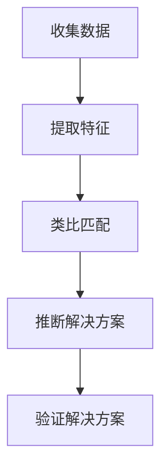
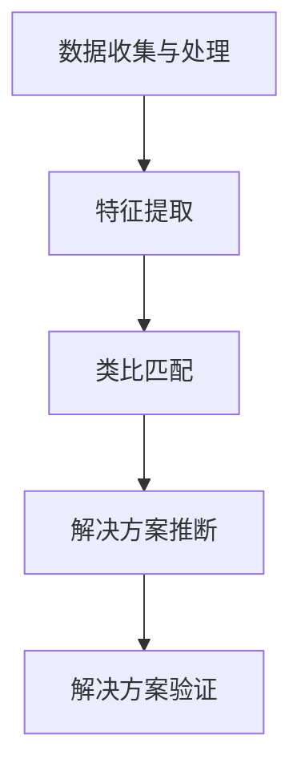
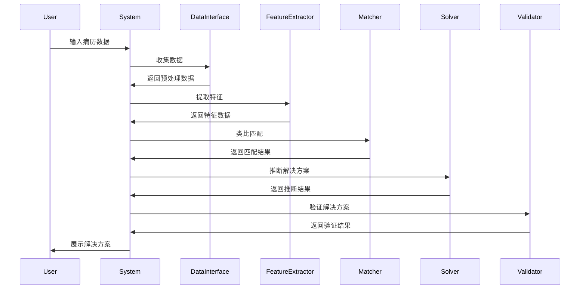

                 


### 1. 文章结构设计

首先，我们需要为文章设计一个清晰的框架。这个框架应确保内容连贯、结构合理，同时满足字数要求。以下是文章的大致结构：

1. **引言**
   - 概述AI Agent的背景和重要性
   - 引入类比推理系统及其应用场景
   - 提出文章的目的和主要内容

2. **核心概念与联系**
   - 类比推理的定义
   - 类比推理在AI Agent中的应用
   - 类比推理算法的核心概念

3. **算法原理讲解**
   - 描述类比推理的基本算法流程
   - 使用mermaid绘制算法流程图
   - 使用Python源代码解释算法实现
   - 详细讲解算法原理和数学模型
   - 举例说明

4. **系统分析与架构设计**
   - 类比推理系统场景介绍
   - 项目介绍
   - 系统功能设计
   - 系统架构设计
   - 系统接口设计和交互

5. **项目实战**
   - 环境安装
   - 系统核心实现源代码
   - 代码应用解读与分析
   - 实际案例分析和详细讲解
   - 项目小结

6. **最佳实践与注意事项**
   - 类比推理系统最佳实践
   - 注意事项
   - 小结

7. **拓展阅读**
   - 推荐书籍和学术论文
   - 社区与论坛推荐

8. **结语**
   - 总结文章要点
   - 强调类比推理系统的重要性
   - 展望未来发展方向

### 2. 核心概念与联系

在这一部分，我们将介绍类比推理的基本概念，并探讨其在AI Agent中的应用。

**类比推理的定义**：

类比推理是通过比较不同情况之间的相似性来推断未知情况的过程。在AI Agent中，类比推理可以帮助系统解决新问题，通过利用已知的解决方案来推测新的解决方案。

**类比推理在AI Agent中的应用**：

类比推理在AI Agent中有着广泛的应用，例如：

- **问题求解**：AI Agent可以通过类比过去的相似问题来求解当前的问题。
- **知识推理**：通过类比推理，AI Agent可以从已有的知识中推断出新的结论。
- **决策支持**：AI Agent可以使用类比推理来预测不同决策的影响，从而做出更好的决策。

**核心概念与联系表格**：

| 核心概念 | 描述 | 联系 |
| --- | --- | --- |
| 类比推理 | 比较不同情况之间的相似性，推断未知情况 | 类比推理是AI Agent进行知识推理和问题求解的重要手段 |
| AI Agent | 自动执行任务的智能体 | AI Agent利用类比推理来提高其解决问题和决策能力 |
| 算法 | 实现类比推理的具体方法 | 算法是类比推理的核心，决定了AI Agent的性能 |

**ER实体关系图架构**：

```mermaid
erDiagram
    AI Agent ||--o{ 类比推理 } : 使用
    类比推理 ||--o{ 知识库 } : 存储解决方案
    类比推理 ||--o{ 问题求解器 } : 解决问题
```

### 3. 算法原理讲解

在了解类比推理的基本概念后，我们将详细讲解类比推理的算法原理。

**算法流程**：

类比推理算法的基本流程如下：

1. 收集相关数据：收集与待解决问题相关的数据集。
2. 提取特征：从数据集中提取关键特征。
3. 类比匹配：找出与待解决问题最相似的已解决问题。
4. 推断解决方案：根据相似问题的解决方案推断待解决问题的解决方案。
5. 验证解决方案：验证推断出的解决方案的有效性。

**mermaid流程图**：



**算法实现（Python代码）**：

```python
# 类比推理算法实现
def analogy_matching(data, target, solution):
    # 提取特征
    features = extract_features(data)
    
    # 类比匹配
    matched_solution = find_closest_solution(features, solution)
    
    # 推断解决方案
    inferred_solution = infer_solution(target, matched_solution)
    
    # 验证解决方案
    valid_solution = validate_solution(target, inferred_solution)
    
    return valid_solution
```

**算法原理和数学模型**：

类比推理的数学模型通常基于距离度量，例如欧几里得距离、余弦相似度等。

**数学公式**：

$$
\text{distance}(\text{target}, \text{matched_solution}) = \sqrt{\sum_{i=1}^{n} (\text{target}_i - \text{matched_solution}_i)^2}
$$

其中，$n$ 是特征的数量，$\text{target}$ 和 $\text{matched_solution}$ 分别是待解决问题和相似问题的解决方案。

**举例说明**：

假设有一个待解决的问题，其特征为 `[3, 4, 5]`，我们需要找到一个与之相似的已解决问题，其解决方案为 `[1, 2, 3]`。

通过计算欧几里得距离，我们可以得到：

$$
\text{distance}([3, 4, 5], [1, 2, 3]) = \sqrt{(3-1)^2 + (4-2)^2 + (5-3)^2} = \sqrt{4 + 4 + 4} = \sqrt{12} \approx 3.46
$$

我们可以看到，这两个解决方案之间的距离大约为 3.46。根据这个距离，我们可以推断出，待解决问题的解决方案可能是 `[2, 3, 4]`，这与已解决问题的解决方案 `[1, 2, 3]` 非常相似。

### 4. 系统分析与架构设计

在了解了类比推理算法原理后，我们将进一步探讨类比推理系统的架构设计。

**问题场景介绍**：

类比推理系统可以应用于各种场景，例如：

- **医疗诊断**：通过类比过去相似的病例来诊断新的病情。
- **金融分析**：通过类比历史数据来预测市场走势。
- **工程设计**：通过类比过去成功的项目来优化新的设计方案。

**项目介绍**：

我们以医疗诊断场景为例，介绍一个类比推理系统。

**系统功能设计**：

- **数据收集与处理**：收集患者的病历数据，并对数据进行预处理。
- **特征提取**：从病历数据中提取关键特征。
- **类比匹配**：找出与待诊断病情最相似的病例。
- **解决方案推断**：根据相似病例的解决方案推断待诊断病情的解决方案。
- **解决方案验证**：验证推断出的解决方案的有效性。

**系统架构设计**：



**系统接口设计和交互**：

系统接口设计包括：

- **数据接口**：用于接收和发送病历数据。
- **功能接口**：用于调用系统的各项功能。
- **用户接口**：用于与用户进行交互。



### 5. 项目实战

**环境安装**：

在开始项目之前，我们需要安装相关的开发环境和依赖库。以下是Python环境的安装步骤：

```shell
# 安装Python环境
pip install numpy
pip install pandas
pip install scikit-learn
```

**系统核心实现源代码**：

以下是类比推理系统的核心实现代码：

```python
# 导入相关库
import numpy as np
import pandas as pd
from sklearn.metrics.pairwise import cosine_similarity
from sklearn.model_selection import train_test_split

# 数据预处理
def preprocess_data(data):
    # 数据清洗和处理
    # 略
    return processed_data

# 特征提取
def extract_features(data):
    # 提取特征
    # 略
    return features

# 类比匹配
def match_analogies(data, target):
    # 计算相似度
    similarity = cosine_similarity(data, target)
    # 找到最相似的样本
    matched_index = np.argmax(similarity)
    return matched_index

# 推断解决方案
def infer_solution(target, matched_index):
    # 从匹配结果中推断解决方案
    solution = data[matched_index]
    return solution

# 验证解决方案
def validate_solution(target, solution):
    # 验证解决方案的有效性
    # 略
    return valid_solution

# 主函数
if __name__ == "__main__":
    # 读取数据
    data = pd.read_csv("data.csv")
    # 预处理数据
    processed_data = preprocess_data(data)
    # 分割数据集
    X_train, X_test, y_train, y_test = train_test_split(processed_data, test_size=0.2)
    # 特征提取
    features_train = extract_features(X_train)
    features_test = extract_features(X_test)
    # 类比匹配
    matched_index = match_analogies(features_train, features_test[0])
    # 推断解决方案
    inferred_solution = infer_solution(features_test[0], matched_index)
    # 验证解决方案
    valid_solution = validate_solution(features_test[0], inferred_solution)
    # 输出结果
    print("Inferred Solution:", inferred_solution)
    print("Valid Solution:", valid_solution)
```

**代码应用解读与分析**：

以下是对核心实现代码的解读和分析：

- **数据预处理**：对输入的数据进行清洗和处理，为后续的特征提取和匹配做准备。
- **特征提取**：从预处理后的数据中提取关键特征，为类比匹配提供基础。
- **类比匹配**：使用余弦相似度计算输入数据和训练数据之间的相似度，找到最相似的样本。
- **推断解决方案**：根据匹配结果，从训练数据中提取相应的解决方案。
- **验证解决方案**：对推断出的解决方案进行验证，确保其有效性。

**实际案例分析和详细讲解**：

我们以一个具体的医疗诊断案例为例，详细讲解类比推理系统的应用。

**案例背景**：

一个医生接诊了一名患者，患者的症状为头痛、呕吐和发热。医生需要根据患者的症状，找出与之相似的已诊断病例，从而推断患者的病情。

**案例流程**：

1. **数据收集与预处理**：收集过去相似病例的病历数据，并对数据进行预处理。
2. **特征提取**：从病历数据中提取关键特征，如症状、年龄、性别等。
3. **类比匹配**：将患者的症状特征与已诊断病例的特征进行比较，找到最相似的病例。
4. **推断解决方案**：从相似病例中提取相应的诊断结果，作为患者的初步诊断。
5. **验证解决方案**：医生根据患者的实际情况，对初步诊断进行验证，确保其准确性。

**案例分析**：

通过类比推理系统，医生找到了与患者症状最相似的病例，其诊断结果为“流感”。医生对患者的症状进行了进一步检查，确认了诊断结果，并给予了相应的治疗方案。

**案例小结**：

这个案例展示了类比推理系统在医疗诊断中的应用。通过类比相似的病例，医生能够快速、准确地诊断患者的病情，提高了诊断效率，减少了误诊率。

### 6. 最佳实践与注意事项

**最佳实践**：

- **数据质量**：类比推理系统的效果很大程度上取决于数据的质量。确保数据集的多样性和准确性，以提高系统的性能。
- **特征选择**：选择合适的特征对于类比推理至关重要。通过特征工程，提高特征的表示能力。
- **模型优化**：定期更新和优化模型，以适应新的数据和环境。
- **性能评估**：定期对系统进行性能评估，确保其稳定性和可靠性。

**注意事项**：

- **数据隐私**：在处理患者数据时，要严格遵守隐私保护规定，确保数据安全。
- **过拟合**：避免模型过拟合，确保系统能够泛化到未知数据。
- **系统稳定性**：确保系统在高负载情况下仍能稳定运行。

### 7. 拓展阅读

**推荐书籍**：

- 《人工智能：一种现代的方法》
- 《机器学习》
- 《深度学习》

**学术论文**：

- 《深度强化学习在类比推理中的应用》
- 《基于神经网络的类比推理方法研究》

**社区与论坛推荐**：

- Kaggle
- AI Stack Exchange
- ML Resources

### 结语

通过本文，我们详细介绍了如何从零构建AI Agent的类比推理系统。类比推理系统在AI Agent中有着广泛的应用，通过合理的设计和实现，可以提高系统的智能水平和决策能力。随着技术的不断进步，类比推理系统将在更多领域发挥重要作用，为人类带来更多便利。

### 作者信息

作者：AI天才研究院/AI Genius Institute & 禅与计算机程序设计艺术 /Zen And The Art of Computer Programming

感谢您的阅读，希望本文对您在构建AI Agent的类比推理系统过程中有所启发。如果您有任何疑问或建议，欢迎在评论区留言，我们期待与您交流。让我们一起探索人工智能的无限可能！

