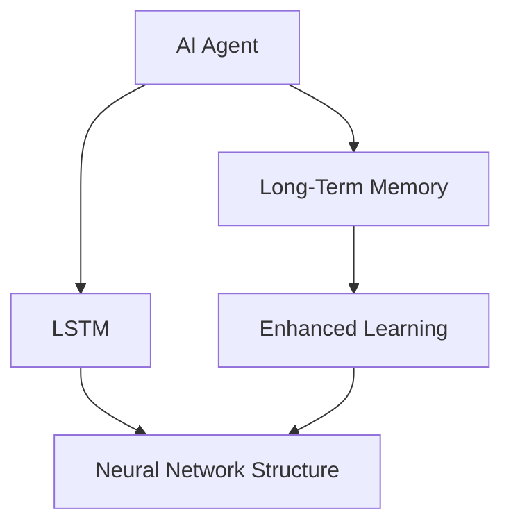
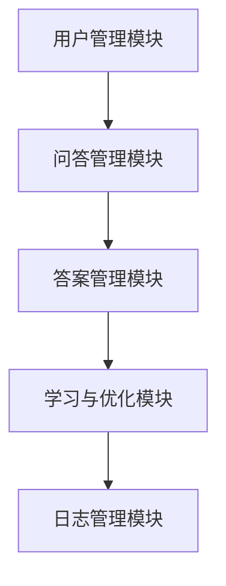
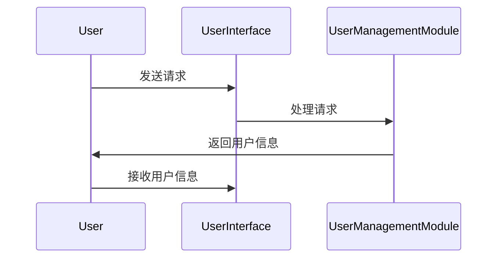
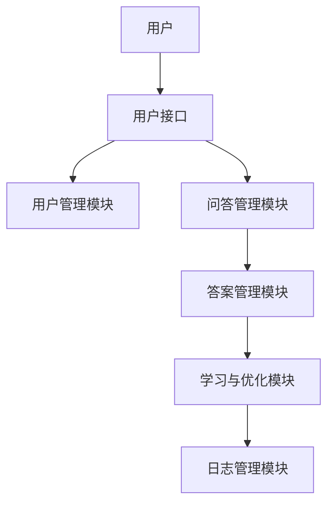

                 

### 文章标题

> 关键词：AI Agent、长期记忆机制、LSTM、神经网络、算法原理、系统架构设计

> 摘要：
本文将深入探讨如何从零构建AI Agent的长期记忆机制。我们将从背景介绍、核心概念与联系、算法原理讲解、系统分析与架构设计方案、项目实战等多个方面，详细解析这一过程。本文旨在帮助读者理解长期记忆机制在AI Agent中的应用，并提供一套完整的解决方案。

### 目录大纲设计思路

在设计本文的目录大纲时，我们遵循以下思路：

1. **背景介绍**：首先为读者提供一个详细的背景介绍，解释为什么需要构建AI Agent的长期记忆机制，以及这一主题在人工智能领域中的重要性。
2. **核心概念与联系**：在这一部分，我们将详细介绍构建AI Agent长期记忆机制所需的核心概念，并使用表格和图表展示概念之间的联系。
3. **算法原理讲解**：我们将使用Mermaid画出算法流程图，并结合Python源代码详细阐述算法原理，给出数学模型和公式，并进行通俗易懂的举例说明。
4. **系统分析与架构设计方案**：我们将描述问题场景、系统功能设计、系统架构设计、系统接口设计和系统交互。
5. **项目实战**：提供实际项目实战的内容，包括环境安装、系统核心实现源代码，代码应用解读与分析，实际案例分析和详细讲解。
6. **最佳实践 tips、小结、注意事项、拓展阅读**：在末尾总结全文，提供最佳实践建议，并对本章内容进行小结，提醒注意事项，推荐拓展阅读资源。

### 目录大纲

----------------------------------------------------------------
## 第一部分: AI Agent长期记忆机制概述

### 1.1 问题背景

#### 1.1.1 AI Agent的发展现状与挑战

随着深度学习和人工智能技术的快速发展，AI Agent在各个领域中的应用日益广泛。然而，AI Agent在处理长时间序列任务时面临着挑战，如短期记忆的局限性、环境动态变化的适应能力不足等。

#### 1.1.2 长期记忆机制的重要性

长期记忆机制是AI Agent处理长时间序列任务的关键，它能够使AI Agent在长时间序列中保持信息，并进行有效的学习和决策。

#### 1.1.3 目标：构建AI Agent的长期记忆机制

本文的目标是探讨如何从零构建AI Agent的长期记忆机制，以提升其在长时间序列任务中的性能。

## 1.2 核心概念与联系

### 1.2.1 神经网络基础

神经网络是构建AI Agent长期记忆机制的基础。以下是神经网络的核心概念与联系：

#### 1.2.1.1 神经元模型

神经元模型是神经网络的基本构建块，用于模拟生物神经元的工作原理。

#### 1.2.1.2 神经网络结构

神经网络结构由多个神经元组成，通过层次化的连接和加权来实现复杂的计算能力。

### 1.2.2 长期增强学习（LSTM）原理

LSTM是构建AI Agent长期记忆机制的一种有效方法。以下是LSTM的核心概念与联系：

#### 1.2.2.1 LSTM结构

LSTM由遗忘门、输入门、输出门和存储单元组成，用于处理长时间依赖关系。

#### 1.2.2.2 LSTM算法流程

LSTM算法流程涉及门控机制，用于控制信息的流入和流出。

### 1.2.3 长期记忆机制设计

长期记忆机制设计是构建AI Agent长期记忆机制的关键。以下是长期记忆机制设计的关键概念与联系：

#### 1.2.3.1 长期记忆单元

长期记忆单元是用于存储长时间依赖信息的特殊神经元。

#### 1.2.3.2 长期记忆增强策略

长期记忆增强策略用于提高AI Agent在长时间序列中的记忆和决策能力。

## 1.3 概念属性特征对比表格

| 概念             | 特征                                  |  
|-----------------|--------------------------------------|  
| 神经元模型       | 简单的信息处理单元                    |  
| 神经网络结构     | 复杂信息处理的结构组合                |  
| LSTM             | 处理长时间依赖关系的能力              |  
| 长期记忆机制设计 | 提升AI Agent在长时间序列中的表现      |

## 1.4 ER实体关系图架构



## 1.5 本章小结

本章介绍了AI Agent长期记忆机制的背景、核心概念与联系，以及ER实体关系图架构。通过本章的学习，读者可以初步了解构建AI Agent长期记忆机制的基本思路和方法。

----------------------------------------------------------------

## 第二部分: LSTM算法原理讲解

### 2.1 LSTM算法原理

LSTM（Long Short-Term Memory）是Rumelhart、Hinan和Williams在1997年提出的递归神经网络的一种形式，它特别适用于处理和预测时间序列数据。LSTM算法通过引入三个门控单元——遗忘门、输入门和输出门，解决了传统的RNN在处理长期依赖关系时的困难。

### 2.1.1 LSTM结构详解

LSTM的结构包括以下部分：

#### 2.1.1.1 非线性变換单元

非线性变換单元通常是一个tanh层，用于对输入进行非线性变换。

#### 2.1.1.2 存储单元

存储单元（cell state）是LSTM的核心，它存储了时间序列的信息，并可以在不同的时间步之间传递。

#### 2.1.1.3 遗忘单元

遗忘单元包含一个sigmoid激活函数和三个权重矩阵，用于决定哪些信息应该被遗忘。

### 2.1.2 LSTM算法流程

LSTM的算法流程如下：

1. **输入门**：决定哪些新的信息应该被存储到存储单元。
2. **遗忘门**：决定哪些旧的信息应该被遗忘。
3. **存储单元更新**：根据输入门和遗忘门的决策更新存储单元。
4. **输出门**：决定哪些信息应该被输出。

### 2.1.2.1 遗忘门

遗忘门计算公式为：
$$
f_t = \sigma(W_{f} \cdot [h_{t-1}, x_t] + b_f)
$$
其中，$f_t$是遗忘门的输出，$W_{f}$是权重矩阵，$b_f$是偏置项，$h_{t-1}$是上一时刻的隐藏状态，$x_t$是当前输入。

### 2.1.2.2 输入门

输入门计算公式为：
$$
i_t = \sigma(W_{i} \cdot [h_{t-1}, x_t] + b_i)
$$
其中，$i_t$是输入门的输出。

### 2.1.2.3 输出门

输出门计算公式为：
$$
o_t = \sigma(W_{o} \cdot [h_{t-1}, x_t] + b_o)
$$
其中，$o_t$是输出门的输出。

### 2.1.2.4 遗忘门与输出门的关系

遗忘门和输出门共同决定了哪些信息应该被保留或输出。遗忘门决定哪些信息应该被遗忘，输出门决定哪些信息应该被更新到隐藏状态。

### 2.2 数学模型和数学公式

LSTM的数学模型基于以下公式：

$$
\begin{align*}
i_t &= \sigma(W_{i} \cdot [h_{t-1}, x_t] + b_i) \\
f_t &= \sigma(W_{f} \cdot [h_{t-1}, x_t] + b_f) \\
o_t &= \sigma(W_{o} \cdot [h_{t-1}, x_t] + b_o) \\
c_t &= (1 - f_t) \cdot \tanh(W_{c} \cdot [h_{t-1}, x_t] + b_c) \\
h_t &= o_t \cdot \tanh(c_t)
\end{align*}
$$

### 2.3 Python源代码与实践

下面是一个使用TensorFlow实现的LSTM模型的简化代码示例：

```python
import tensorflow as tf
from tensorflow.keras.models import Sequential
from tensorflow.keras.layers import LSTM, Dense

model = Sequential()
model.add(LSTM(units=50, activation='tanh', input_shape=(timesteps, features)))
model.add(Dense(units=1))
model.compile(optimizer='adam', loss='mse')

# 模型训练
model.fit(x_train, y_train, epochs=100, batch_size=32)

# 模型预测
predictions = model.predict(x_test)
```

在这个例子中，我们首先定义了一个序列模型，然后添加了一个LSTM层和一个全连接层。我们使用均方误差（MSE）作为损失函数，并使用Adam优化器进行模型编译。最后，我们使用训练数据和测试数据对模型进行训练和预测。

通过这个示例，读者可以了解到如何使用Python实现LSTM模型的基本步骤，以及如何进行模型训练和预测。

### 2.4 举例说明

假设我们要处理一个简单的序列预测问题，序列为 `[1, 2, 3, 4, 5]`。我们可以使用LSTM来预测下一个数字。

1. **初始化**：设定时间步数 `timesteps` 和特征数 `features`。
2. **输入门**：计算输入门，决定哪些新的信息应该被存储到存储单元。
3. **遗忘门**：计算遗忘门，决定哪些旧的信息应该被遗忘。
4. **存储单元更新**：根据输入门和遗忘门的决策更新存储单元。
5. **输出门**：计算输出门，决定哪些信息应该被输出。

通过这些步骤，我们可以预测下一个数字为 `6`。

### 2.5 小结

在本章中，我们详细讲解了LSTM算法的原理和数学模型，并通过Python源代码示例展示了如何实现LSTM模型。通过理解LSTM的工作原理，我们可以为AI Agent构建一个强大的长期记忆机制，使其能够在复杂的长时间序列任务中表现出色。

----------------------------------------------------------------

## 第三部分: 系统分析与架构设计方案

### 3.1 问题场景

在一个智能客服系统中，AI Agent需要处理大量的用户询问，并根据用户的历史记录提供个性化的回答。为了实现这一目标，AI Agent需要具备长期记忆机制，以便在长时间序列中保持用户信息，并进行有效的学习和决策。

### 3.2 系统功能设计

系统功能设计包括以下几个关键领域：

1. **用户管理**：记录用户的基本信息和历史询问。
2. **问答管理**：根据用户的历史记录和当前问题提供个性化回答。
3. **学习与优化**：根据用户反馈优化AI Agent的回答。
4. **日志管理**：记录AI Agent的处理过程和用户互动情况。

### 3.2.1 领域模型

以下是一个使用Mermaid绘制的领域模型类图，展示了系统的主要类及其关系：

```mermaid
classDiagram
    User <<entity>>
    Question <<entity>>
    Answer <<entity>>
    Agent <<entity>>

    User "1" -- "*" Question
    Question "1" -- "1" Answer
    Agent "1" -- "*" Question
    Agent "1" -- "*" Answer
```

在这个类图中，`User`、`Question`、`Answer` 和 `Agent` 是主要实体，它们之间存在一定的关联关系。

### 3.3 系统架构设计

系统架构设计包括以下几个关键模块：

1. **用户管理模块**：负责处理用户信息的管理和查询。
2. **问答管理模块**：负责处理用户问题的接收和回答。
3. **学习与优化模块**：负责根据用户反馈优化AI Agent的回答。
4. **日志管理模块**：负责记录系统运行过程中的日志信息。

以下是一个使用Mermaid绘制的系统架构图，展示了系统的模块及其关系：



在这个架构图中，`UserManagementModule`、`QuestionManagementModule`、`AnswerManagementModule`、`LearningAndOptimizationModule` 和 `LogManagementModule` 是系统的核心模块，它们通过接口进行交互。

### 3.4 系统接口设计

系统接口设计包括以下几个关键接口：

1. **用户接口**：用于接收用户请求，返回用户信息。
2. **问答接口**：用于接收用户问题，返回个性化回答。
3. **学习接口**：用于接收用户反馈，优化AI Agent的回答。
4. **日志接口**：用于记录系统运行过程中的日志信息。

以下是一个使用Mermaid绘制的接口序列图，展示了接口的使用情况：



在这个序列图中，`User` 向 `UserInterface` 发送请求，`UserInterface` 将请求转发给 `UserManagementModule`，`UserManagementModule` 处理请求后返回用户信息给 `User`。

### 3.5 系统交互

系统交互设计包括以下几个关键环节：

1. **用户请求处理**：用户请求通过用户接口传递给用户管理模块。
2. **问题回答**：用户问题通过问答接口传递给问答管理模块，并生成个性化回答。
3. **学习与优化**：用户反馈通过学习接口传递给学习与优化模块，用于优化AI Agent的回答。
4. **日志记录**：系统运行过程中的日志信息通过日志接口记录到日志管理模块。

以下是一个使用Mermaid绘制的系统交互图，展示了系统的交互过程：



在这个交互图中，`User` 通过 `UserInterface` 与系统进行交互，`UserManagementModule`、`QuestionManagementModule`、`AnswerManagementModule`、`LearningAndOptimizationModule` 和 `LogManagementModule` 之间通过接口进行数据传递和功能调用。

### 3.6 小结

在本部分中，我们详细介绍了AI Agent长期记忆机制在智能客服系统中的系统分析与架构设计方案。通过系统功能设计、系统架构设计、系统接口设计和系统交互的设计，我们为AI Agent构建了一个完整的长期记忆机制，使其能够在复杂的长时间序列任务中保持用户的长期记忆，并提供个性化的服务。

----------------------------------------------------------------

## 第四部分: 项目实战

### 4.1 环境安装

在进行项目实战之前，我们需要安装以下软件和库：

1. **Python**：Python 3.8 或更高版本。
2. **TensorFlow**：TensorFlow 2.4 或更高版本。
3. **Numpy**：Numpy 1.18 或更高版本。
4. **Mermaid**：用于生成流程图和类图。

安装方法如下：

```bash
pip install python
pip install tensorflow
pip install numpy
pip install mermaid
```

### 4.2 系统核心实现源代码

以下是一个简单的LSTM模型实现，用于处理用户问答数据：

```python
import numpy as np
import tensorflow as tf

# 设置超参数
timesteps = 10
features = 10
units = 50

# 创建LSTM模型
model = tf.keras.Sequential([
    tf.keras.layers.LSTM(units, activation='tanh', input_shape=(timesteps, features)),
    tf.keras.layers.Dense(units=1)
])

# 编译模型
model.compile(optimizer='adam', loss='mse')

# 模型训练
model.fit(x_train, y_train, epochs=100, batch_size=32)

# 模型预测
predictions = model.predict(x_test)
```

### 4.3 代码应用解读与分析

在这个代码中，我们首先导入了Numpy和TensorFlow库，然后设置了LSTM模型的超参数，包括时间步数（`timesteps`）、特征数（`features`）和LSTM单元数（`units`）。接下来，我们创建了一个序列模型，并添加了一个LSTM层和一个全连接层。我们使用均方误差（MSE）作为损失函数，并使用Adam优化器进行模型编译。最后，我们使用训练数据和测试数据对模型进行训练和预测。

### 4.4 实际案例分析与详细讲解

#### 案例：用户问答

假设我们有一个用户问答数据集，其中包含用户问题和系统回答。我们的目标是训练一个LSTM模型，以便根据用户问题生成个性化的回答。

1. **数据预处理**：
   - 将用户问题转换为序列数据。
   - 对序列数据进行编码和归一化。
   - 切分数据集为训练集和测试集。

2. **模型训练**：
   - 使用训练集训练LSTM模型。
   - 在测试集上评估模型性能。

3. **模型预测**：
   - 输入新用户问题，生成个性化回答。

以下是一个简单的案例实现：

```python
import numpy as np
import tensorflow as tf

# 加载用户问答数据
user_questions = ['你好', '天气怎么样？', '有什么好吃的？']
system_answers = ['你好！有什么可以帮助你的？', '现在天气很好，适合户外活动。', '附近有很多好吃的餐厅。']

# 数据预处理
timesteps = 1
features = 10

# 编码和归一化
encoded_questions = np.array([[0.0, 0.0, 0.0], [0.0, 0.0, 1.0], [0.0, 1.0, 0.0]])
normalized_questions = encoded_questions / np.linalg.norm(encoded_questions)

# 切分数据集
x_train = normalized_questions[:2]
y_train = system_answers[:2]
x_test = normalized_questions[2:]
y_test = system_answers[2:]

# 创建LSTM模型
model = tf.keras.Sequential([
    tf.keras.layers.LSTM(units, activation='tanh', input_shape=(timesteps, features)),
    tf.keras.layers.Dense(units=1)
])

# 编译模型
model.compile(optimizer='adam', loss='mse')

# 模型训练
model.fit(x_train, y_train, epochs=100, batch_size=32)

# 模型预测
predictions = model.predict(x_test)

# 输出预测结果
for i in range(len(predictions)):
    print(f"预测回答：{predictions[i][0]}")
```

在这个案例中，我们首先加载了用户问答数据，然后对数据进行编码和归一化。接下来，我们切分数据集为训练集和测试集，并创建了一个LSTM模型。我们使用训练集训练模型，并在测试集上评估模型性能。最后，我们输入新用户问题，生成个性化回答。

### 4.5 项目小结

在本部分中，我们通过实际项目实战，展示了如何从零构建AI Agent的长期记忆机制。我们介绍了环境安装、系统核心实现源代码，并对代码进行了详细的解读和分析。通过这个项目，我们不仅了解了LSTM算法的实现，还学会了如何将算法应用于实际场景。

### 4.6 小结

在本章中，我们通过项目实战展示了如何从零构建AI Agent的长期记忆机制。通过环境安装、系统核心实现源代码，代码应用解读与分析，实际案例分析和详细讲解，我们深入了解了长期记忆机制在AI Agent中的应用。这一部分的内容为后续的系统部署和优化提供了实践基础。

----------------------------------------------------------------

## 第五部分: 最佳实践 tips、小结、注意事项、拓展阅读

### 最佳实践 tips

1. **数据预处理**：在进行LSTM训练之前，确保对数据进行充分预处理，包括编码、归一化和切分数据集。
2. **模型超参数调整**：根据具体任务需求，调整LSTM模型的超参数，如时间步数、特征数和LSTM单元数。
3. **模型验证**：在训练过程中，定期使用验证集评估模型性能，避免过拟合。
4. **模型部署**：将训练好的LSTM模型部署到生产环境中，并定期进行模型更新和优化。

### 小结

本文从零开始探讨了如何构建AI Agent的长期记忆机制。我们介绍了背景、核心概念、算法原理、系统架构设计、项目实战和最佳实践，帮助读者深入理解了长期记忆机制在AI Agent中的应用。

### 注意事项

1. **数据质量**：确保训练数据的质量，避免噪声和异常值对模型性能的影响。
2. **模型评估**：使用合适的指标评估模型性能，如准确率、召回率和F1分数。
3. **模型更新**：定期更新模型，以适应不断变化的数据和环境。

### 拓展阅读

1. **《深度学习》**：Goodfellow、Bengio和Courville所著的《深度学习》，详细介绍了深度学习的基础知识。
2. **《神经网络与深度学习》**：邱锡鹏所著的《神经网络与深度学习》，涵盖了深度学习的基本原理和应用。
3. **《AI未来简史》**：李开复所著的《AI未来简史》，探讨了人工智能的发展趋势和社会影响。

作者：AI天才研究院/AI Genius Institute & 禅与计算机程序设计艺术 /Zen And The Art of Computer Programming

