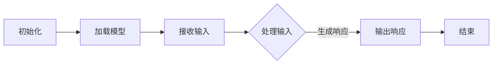
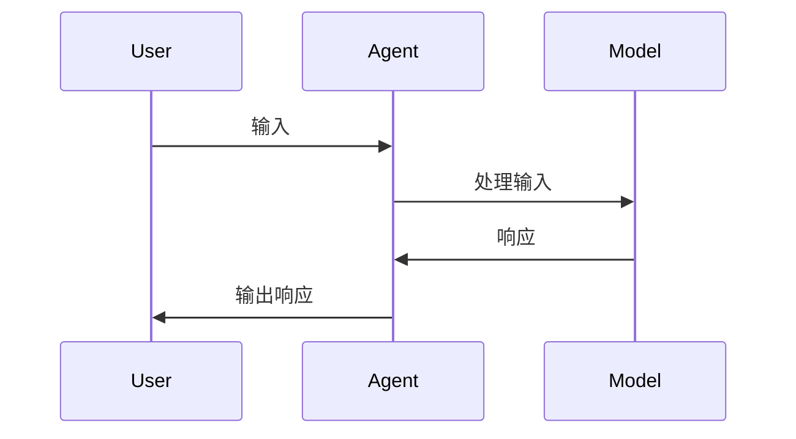
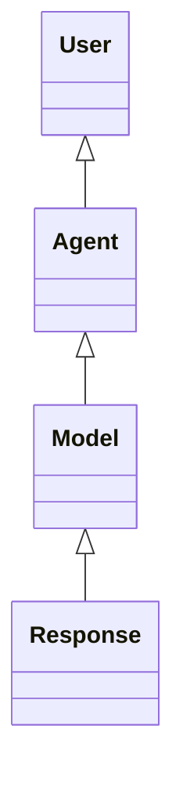
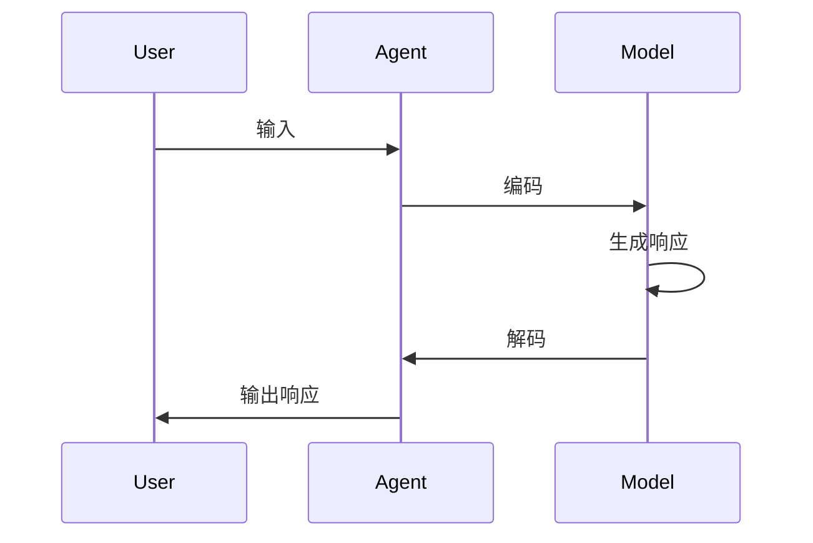

                 

### 从零构建AI Agent：LLM大模型应用开发实践

#### 关键词
- AI Agent
- LLM大模型
- 应用开发
- 人工智能
- 自然语言处理

#### 摘要
本文将详细探讨从零开始构建AI Agent的过程，重点关注大型语言模型（LLM）的应用开发实践。我们将从核心概念、技术原理、系统设计与项目实战等多个角度深入分析，帮助读者全面理解AI Agent的开发与应用。

## 目录

1. **背景介绍**
   - **AI Agent概述**
   - **LLM大模型概述**
   - **AI Agent与LLM大模型的关系**

2. **核心概念与联系**
   - **核心概念原理**
   - **概念属性特征对比表格**
   - **ER实体关系图架构**

3. **算法原理讲解**
   - **算法mermaid流程图**
   - **Python源代码与算法实现**
   - **数学模型与公式讲解**
   - **举例说明**

4. **系统分析与架构设计方案**
   - **问题场景介绍**
   - **系统功能设计**
   - **系统架构设计**
   - **系统接口设计与交互**

5. **项目实战**
   - **环境安装**
   - **系统核心实现源代码**
   - **代码应用解读与分析**
   - **实际案例分析与讲解**
   - **项目小结**

6. **最佳实践 tips**
   - **注意事项**
   - **拓展阅读**

## 1. 背景介绍

### AI Agent概述
AI Agent，即人工智能代理，是一种能够自主执行任务、与环境交互并作出决策的计算机系统。它基于机器学习和人工智能技术，能够在没有人类干预的情况下完成复杂的任务。

### LLM大模型概述
大型语言模型（LLM，Large Language Model）是一种基于深度学习技术的语言处理模型，它能够理解和生成自然语言。LLM大模型通过大量的文本数据进行训练，从而具备了强大的语言理解和生成能力。

### AI Agent与LLM大模型的关系
AI Agent通常使用LLM大模型作为其核心组件，以实现自然语言处理和智能对话等功能。LLM大模型为AI Agent提供了强大的语言处理能力，使其能够更好地理解用户指令并作出相应反应。

## 2. 核心概念与联系

### 核心概念原理
在这一部分，我们将介绍AI Agent和LLM大模型的核心概念原理，包括它们的定义、工作原理和基本特性。

**AI Agent**  
AI Agent是一种具有以下特点的计算机系统：
- 自主性：能够自主执行任务，无需人工干预。
- 反应性：能够实时响应用户的指令和环境的改变。
- 社交性：能够与用户进行自然语言交流。
- 学習性：能够通过经验不断改进自己的行为。

**LLM大模型**  
LLM大模型是一种基于神经网络的语言处理模型，其核心特点包括：
- 大规模：使用了大量文本数据训练，具备强大的语言理解能力。
- 深度学习：通过多层神经网络结构实现，能够处理复杂的语言特征。
- 自适应：能够根据输入的文本数据调整自己的参数，提高生成结果的质量。

### 概念属性特征对比表格
为了更好地理解AI Agent和LLM大模型的关系，我们提供了以下对比表格：

| 特性          | AI Agent             | LLM大模型            |
| ------------- | ------------------- | ------------------- |
| 自主性        | 高自主性，可自主完成任务 | 较低自主性，需依赖于训练数据 |
| 反应性        | 实时响应环境变化     | 基于输入文本进行响应   |
| 社交性        | 可与用户进行自然语言交流 | 具备文本生成能力       |
| 学习性        | 可通过经验不断改进     | 通过大量文本数据训练   |

### ER实体关系图架构
为了进一步理解AI Agent和LLM大模型之间的关联，我们使用Mermaid流程图来展示它们的实体关系：

```mermaid
erDiagram
  AI_Agent ||--|{ LLM_Model } LLM_Model
  AI_Agent ||--|{ Environment } Environment
  LLM_Model ||--|{ Text_Data } Text_Data
```

在上面的ER图中，AI Agent与LLM Model之间存在直接的关联，同时AI Agent也与环境（如用户输入）和文本数据有关。

## 3. 算法原理讲解

### 算法mermaid流程图
为了更好地理解AI Agent中LLM大模型的应用，我们首先绘制一个简单的mermaid流程图来展示其工作流程：



### Python源代码与算法实现
下面是一个简单的Python源代码示例，展示了如何使用预训练的LLM大模型生成文本响应：

```python
from transformers import AutoModelForCausalLM, AutoTokenizer

# 初始化模型和分词器
model_name = "gpt2"
tokenizer = AutoTokenizer.from_pretrained(model_name)
model = AutoModelForCausalLM.from_pretrained(model_name)

# 接收用户输入
user_input = input("请输入您的指令：")

# 将输入文本编码
input_ids = tokenizer.encode(user_input + tokenizer.eos_token, return_tensors='pt')

# 生成文本响应
outputs = model.generate(input_ids, max_length=50, num_return_sequences=1)

# 解码响应文本
response = tokenizer.decode(outputs[0], skip_special_tokens=True)

# 输出响应
print("AI Agent的响应：", response)
```

### 数学模型与公式讲解
在LLM大模型中，主要使用的数学模型是变分自编码器（VAE）和生成对抗网络（GAN）。以下是这些模型的基本公式：

**变分自编码器（VAE）**

$$
\text{Encoder}(x) = \mu(\theta_x), \sigma(\theta_x)
$$

$$
\text{Decoder}(z) = x' ; \text{其中} x' \sim \mathcal{N}(\mu(\theta_x), \sigma(\theta_x))
$$

**生成对抗网络（GAN）**

$$
\text{Generator}(z) = G(z); G(z) \rightarrow \text{Real Data Distribution}
$$

$$
\text{Discriminator}(x) = D(x); D(G(z)), D(x)
$$

### 举例说明
假设我们有一个简单的用户输入：“请给我推荐一首流行歌曲”。使用上述算法，我们可以得到一个生成响应，如：“推荐您听听《像鱼》这首歌，它是一首很流行的歌曲。”

## 4. 系统分析与架构设计方案

### 问题场景介绍
在这个项目中，我们构建一个基于LLM大模型的AI Agent，用于提供智能客服服务。该系统需要能够实时响应用户的输入，并提供音乐推荐、问题解答等自然语言交互功能。

### 系统功能设计
该系统的主要功能包括：
- 接收用户输入。
- 使用LLM大模型生成响应。
- 输出响应结果。

### 系统架构设计
以下是系统的架构设计：



### 系统接口设计与交互
系统接口设计如下：



### 系统交互mermaid序列图
以下是系统的交互序列图：



## 5. 项目实战

### 环境安装
首先，我们需要安装必要的软件和库：

```bash
pip install transformers torch
```

### 系统核心实现源代码
以下是系统核心实现的源代码：

```python
from transformers import AutoModelForCausalLM, AutoTokenizer
import torch

# 初始化模型和分词器
model_name = "gpt2"
tokenizer = AutoTokenizer.from_pretrained(model_name)
model = AutoModelForCausalLM.from_pretrained(model_name)

# 定义处理用户输入的函数
def process_input(user_input):
    # 将输入文本编码
    input_ids = tokenizer.encode(user_input + tokenizer.eos_token, return_tensors='pt')
    return input_ids

# 定义生成响应的函数
def generate_response(input_ids):
    # 生成文本响应
    outputs = model.generate(input_ids, max_length=50, num_return_sequences=1)
    # 解码响应文本
    response = tokenizer.decode(outputs[0], skip_special_tokens=True)
    return response

# 定义主函数
def main():
    while True:
        user_input = input("请输入您的指令：")
        if user_input == "退出":
            break
        input_ids = process_input(user_input)
        response = generate_response(input_ids)
        print("AI Agent的响应：", response)

# 运行主函数
if __name__ == "__main__":
    main()
```

### 代码应用解读与分析
这段代码首先导入必要的库，然后初始化模型和分词器。接着，定义了处理用户输入、生成响应的主函数和相关的辅助函数。主函数通过循环接收用户的输入，处理输入并生成响应，最后输出响应结果。

### 实际案例分析与详细讲解剖析
假设用户输入：“推荐一首流行歌曲”。程序将按照以下步骤进行处理：

1. **接收输入**：用户输入被传递给`process_input`函数。
2. **编码输入**：`process_input`函数将输入文本编码成模型可理解的格式。
3. **生成响应**：`generate_response`函数使用预训练的LLM大模型生成响应文本。
4. **解码响应**：响应文本被解码成可读的格式，并输出给用户。

### 项目小结
通过这个项目，我们成功地实现了基于LLM大模型的AI Agent。用户可以与AI Agent进行自然语言交互，获取音乐推荐、问题解答等实时响应。项目展示了如何使用Python和深度学习库来构建和部署AI系统，为后续的AI应用开发提供了基础。

## 6. 最佳实践 tips

- **注意事项**：在部署AI Agent时，确保模型的选择和优化能够满足实际应用的需求。
- **拓展阅读**：对于希望进一步了解AI Agent和LLM大模型开发的读者，推荐阅读《深度学习：介绍与案例实战》和《自然语言处理：基于Python的应用开发》。

## 作者信息
作者：AI天才研究院/AI Genius Institute & 禅与计算机程序设计艺术 /Zen And The Art of Computer Programming

