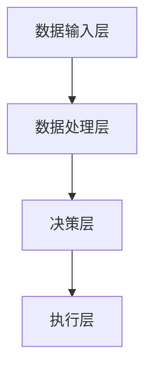
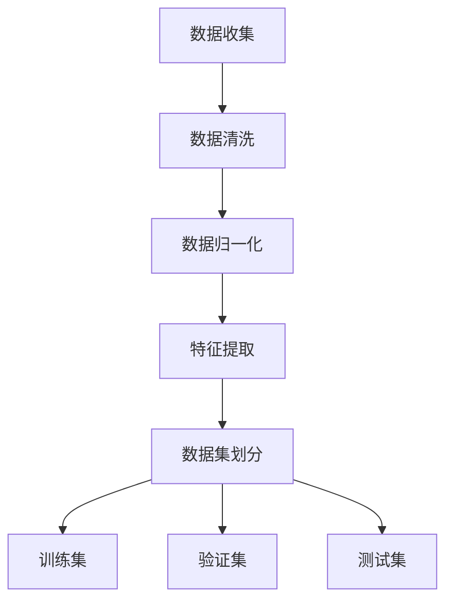
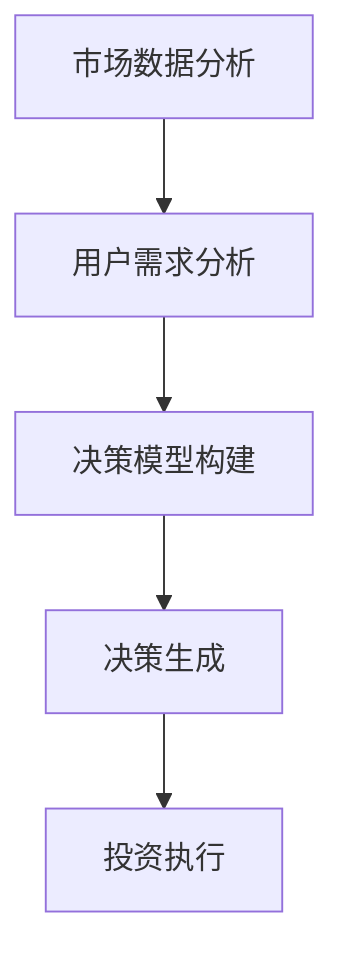
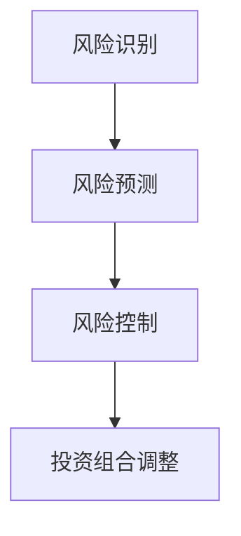

                 


## 从零构建投资理财智能助手AI Agent：基于LLM大模型投资理财AI应用开发实践

### 关键词：投资理财、AI Agent、LLM大模型、应用开发、智能助手

> 摘要：本文将详细介绍从零开始构建投资理财智能助手AI Agent的实践过程。通过分析LLM大模型的特点和应用潜力，我们探讨了投资理财AI Agent的基本原理、开发流程、核心功能实现、实际案例，以及优化与改进策略。本文旨在为读者提供一套系统、全面、实用的投资理财AI应用开发指南，助力读者深入理解投资理财AI技术的发展与应用。

### 第一部分：背景介绍

#### 第1章：问题背景与核心概念

**1.1 问题背景**

随着人工智能技术的快速发展，AI在各个领域中的应用越来越广泛，特别是在金融领域。投资理财作为一个高度专业化、数据密集型的领域，对于精准的投资决策和风险管理提出了更高的要求。然而，传统的投资方法往往依赖于经验和直觉，难以适应市场变化和复杂环境。因此，开发一种基于人工智能的投资理财智能助手成为行业亟待解决的问题。

**1.2 核心概念**

- **投资理财智能助手**：一种能够根据用户需求和市场数据提供投资建议、决策支持、风险管理的智能系统。
- **AI Agent**：一种能够自主执行任务、具备智能决策能力的计算机程序。
- **LLM大模型**：一种基于深度学习的大型语言模型，具有强大的文本理解和生成能力。

**1.3 边界与外延**

- **边界**：本文主要探讨基于LLM大模型的投资理财AI Agent开发实践，不包括其他类型的AI模型。
- **外延**：本文讨论的投资理财AI Agent应用范围包括股票、基金、债券等投资领域。

#### 第2章：LLM大模型概述

**2.1 LLM大模型定义与特点**

- **定义**：LLM大模型是指具有数十亿到千亿级别参数的大型语言模型，能够对自然语言进行理解和生成。
- **特点**：
  - **强大的文本理解能力**：能够理解复杂的自然语言文本，提取关键信息。
  - **高效的文本生成能力**：能够根据输入的文本生成高质量的自然语言文本。

**2.2 LLM大模型的发展历程**

- **早期**：基于统计方法和规则系统的文本处理技术。
- **中期**：基于神经网络的语言模型，如Word2Vec、GloVe。
- **近期**：基于Transformer架构的LLM大模型，如GPT、BERT。

**2.3 LLM大模型在投资理财领域的应用潜力**

- **投资建议**：利用LLM大模型对大量投资数据进行文本分析，提取潜在的投资信号。
- **决策支持**：为投资决策提供基于数据和统计模型的智能建议。
- **风险管理**：对市场风险进行预测和评估，帮助投资者降低风险。

#### 第3章：投资理财AI Agent原理

**3.1 AI Agent的基本概念**

- **定义**：AI Agent是一种能够根据环境和目标自主执行任务、进行智能决策的计算机程序。
- **特点**：
  - **自主性**：能够根据环境和目标自主选择行动方案。
  - **适应性**：能够根据环境变化调整行为策略。
  - **智能性**：能够利用数据和算法进行决策。

**3.2 AI Agent在投资理财中的应用**

- **投资策略制定**：根据市场数据和用户需求，为投资者提供个性化的投资策略。
- **交易执行**：自动执行投资决策，进行买卖操作。
- **风险控制**：对投资组合进行风险评估和调整。

**3.3 AI Agent的工作原理与架构**

- **工作原理**：基于LLM大模型和机器学习算法，对市场数据进行处理和分析，生成投资建议和决策。
- **架构**：主要包括数据输入层、数据处理层、决策层和执行层。

### 第二部分：投资理财AI Agent的开发与实践

#### 第4章：开发环境与工具

**4.1 开发环境搭建**

- **硬件环境**：高性能计算服务器、GPU加速设备。
- **软件环境**：Python、TensorFlow、PyTorch等深度学习框架。

**4.2 开发工具与框架**

- **文本处理工具**：NLTK、spaCy等自然语言处理库。
- **机器学习框架**：Scikit-learn、XGBoost等机器学习库。
- **深度学习框架**：TensorFlow、PyTorch等深度学习库。

**4.3 数据集准备与处理**

- **数据集来源**：公开投资数据集、公司财报、新闻文章等。
- **数据处理**：数据清洗、数据归一化、特征提取等。

#### 第5章：AI Agent核心功能实现

**5.1 数据分析功能**

- **数据收集**：从各种数据源收集投资相关数据。
- **数据预处理**：对原始数据进行清洗、归一化等处理。
- **数据分析**：利用机器学习和深度学习算法对数据进行挖掘和分析。

**5.2 投资决策支持**

- **决策模型**：基于历史数据和统计模型建立投资决策模型。
- **决策生成**：根据当前市场情况和用户需求生成投资决策。

**5.3 风险评估与管理**

- **风险识别**：利用机器学习算法识别潜在的风险因素。
- **风险预测**：根据历史数据和当前市场情况预测风险。
- **风险控制**：对投资组合进行风险评估和调整，降低风险。

#### 第6章：实际案例与实战

**6.1 项目案例一：股票投资AI Agent**

- **项目背景**：为投资者提供基于市场数据和AI分析的投资建议。
- **实现过程**：数据收集、预处理、模型训练、决策生成、投资执行。
- **效果评估**：投资收益与市场基准比较、风险控制效果分析。

**6.2 项目案例二：基金投资AI Agent**

- **项目背景**：为基金投资者提供个性化的投资策略和决策支持。
- **实现过程**：数据收集、预处理、策略生成、投资决策、绩效评估。
- **效果评估**：基金收益率与市场基准比较、投资组合风险控制效果分析。

**6.3 案例分析与总结**

- **案例一分析**：股票投资AI Agent的优势和不足。
- **案例二分析**：基金投资AI Agent的可行性和改进方向。
- **总结**：投资理财AI Agent的实际应用效果和未来发展。

#### 第7章：投资理财AI Agent的优化与改进

**7.1 优化策略**

- **模型优化**：通过模型结构调整、参数优化等提高模型性能。
- **算法优化**：利用先进的算法和技术提高决策准确性。
- **系统优化**：通过优化系统架构、提高数据处理效率等提高整体性能。

**7.2 性能评估**

- **评估指标**：投资收益率、风险控制效果、系统响应时间等。
- **评估方法**：历史数据回测、实际投资测试等。

**7.3 未来发展方向**

- **技术创新**：探索新的算法和模型，提高AI Agent的性能和智能水平。
- **应用拓展**：将AI Agent应用于更多金融产品和服务，提供更全面的决策支持。
- **伦理与法规**：关注AI Agent的伦理和法规问题，确保其合规性和社会接受度。

### 第三部分：拓展阅读与总结

#### 第8章：拓展阅读

**8.1 投资理财AI领域的最新研究**

- **深度学习在投资理财中的应用**：介绍最新的研究成果和应用案例。
- **大数据与投资决策**：探讨大数据技术在投资理财中的应用前景。

**8.2 投资理财AI Agent的伦理问题与法规**

- **伦理问题**：讨论AI Agent在投资理财中可能面临的伦理挑战。
- **法规问题**：分析相关法律法规对AI Agent开发和应用的影响。

**8.3 投资理财AI Agent的应用前景**

- **行业趋势**：预测投资理财AI技术的发展趋势。
- **市场机遇**：分析投资理财AI Agent在市场中的应用前景。

#### 第9章：小结与展望

**9.1 书籍小结**

- **核心内容回顾**：回顾全书的核心概念和关键内容。
- **主要结论**：总结投资理财AI Agent开发的主要成果和经验。

**9.2 未来的研究方向**

- **模型优化**：继续探索更高效、更准确的AI模型。
- **应用拓展**：将AI Agent应用于更多金融产品和场景。
- **伦理与法规**：关注AI Agent在伦理和法规方面的挑战和解决方案。

**9.3 读者建议**

- **实践建议**：提供实际开发过程中的实用技巧和经验。
- **学习建议**：推荐相关的学习资源和参考资料。

### 总结

本文从零开始，详细介绍了构建投资理财智能助手AI Agent的实践过程。通过分析LLM大模型的特点和应用潜力，我们探讨了投资理财AI Agent的基本原理、开发流程、核心功能实现、实际案例，以及优化与改进策略。本文旨在为读者提供一套系统、全面、实用的投资理财AI应用开发指南，助力读者深入理解投资理财AI技术的发展与应用。在未来，随着技术的不断进步和应用场景的拓展，投资理财AI Agent有望成为金融领域的重要工具，为投资者提供更加智能、精准的服务。让我们共同期待AI技术在投资理财领域的更多精彩应用！作者：AI天才研究院/AI Genius Institute & 禅与计算机程序设计艺术 /Zen And The Art of Computer Programming。 

----------------------------------------------------------------

### 文章标题

从零构建投资理财智能助手AI Agent：基于LLM大模型投资理财AI应用开发实践

### 关键词

投资理财、AI Agent、LLM大模型、应用开发、智能助手、深度学习、金融技术、AI技术

### 摘要

本文详细介绍了基于LLM大模型构建投资理财智能助手AI Agent的实践过程。从问题背景、核心概念出发，深入探讨了LLM大模型在投资理财领域的应用潜力，以及AI Agent的基本原理、开发流程和核心功能实现。通过实际案例分析和优化策略，本文为读者提供了一套系统、全面的投资理财AI应用开发指南，旨在助力读者深入理解投资理财AI技术的发展与应用。本文还展望了未来投资理财AI Agent的发展方向，为金融领域的技术创新和应用提供了重要参考。

### 第一部分：背景介绍

#### 第1章：问题背景与核心概念

**1.1 问题背景**

随着人工智能技术的快速发展，金融行业正面临着前所未有的变革。投资理财作为金融行业的重要组成部分，对精准的投资决策和风险管理提出了更高的要求。传统的投资方法通常依赖于经验和直觉，难以适应市场变化和复杂环境。因此，开发一种能够自动分析市场数据、提供投资建议和决策支持的智能助手成为行业亟待解决的问题。

投资理财智能助手（AI Agent）是一种基于人工智能技术的智能系统，它能够根据用户需求和市场数据，提供个性化的投资建议和决策支持。AI Agent具有自主性、适应性和智能性的特点，能够根据环境和目标自主选择行动方案，调整行为策略，并进行智能决策。

**1.2 核心概念**

在本章中，我们将介绍一些与投资理财智能助手AI Agent相关的重要核心概念：

- **投资理财智能助手（AI Agent）**：一种能够根据用户需求和市场数据提供投资建议、决策支持、风险管理的智能系统。它能够对市场数据进行实时分析，提取潜在的投资信号，生成投资决策，并自动执行这些决策。
- **LLM大模型（Large Language Model）**：一种基于深度学习的大型语言模型，具有数十亿到千亿级别的参数。这种模型能够对自然语言进行理解和生成，具有很强的文本分析能力，适用于投资理财领域的文本数据分析、投资建议生成等任务。
- **机器学习（Machine Learning）**：一种人工智能技术，通过从数据中学习规律和模式，构建能够对未知数据进行预测或分类的模型。在投资理财智能助手的开发中，机器学习技术被用于构建投资预测模型、风险评估模型等。
- **深度学习（Deep Learning）**：一种机器学习的技术，使用多层神经网络对数据进行训练，从而实现复杂的模式识别和预测任务。在投资理财智能助手的开发中，深度学习技术被广泛应用于文本分析、图像识别等领域。

**1.3 边界与外延**

在构建投资理财智能助手AI Agent的过程中，我们需要明确一些边界和概念的外延：

- **边界**：本文主要关注基于LLM大模型的AI Agent开发实践，不包括其他类型的AI模型。同时，本文的重点是投资理财领域，不涉及其他金融领域如保险、借贷等。
- **外延**：投资理财智能助手AI Agent的应用范围包括股票、基金、债券等投资领域。这些投资产品具有不同的特性和风险，AI Agent需要根据不同的投资产品特点进行定制化的开发和优化。

#### 第2章：LLM大模型概述

**2.1 LLM大模型定义与特点**

LLM大模型，即大型语言模型（Large Language Model），是一种基于深度学习技术的语言处理模型，具有数十亿到千亿级别的参数。LLM大模型的核心优势在于其强大的文本理解和生成能力，能够处理和理解复杂的自然语言文本。

**定义**：

LLM大模型是一种由神经网络构成的模型，通过训练大量文本数据，学习语言模式和语义信息。这些模型能够对自然语言文本进行理解和生成，具有广泛的应用潜力。

**特点**：

- **强大的文本理解能力**：LLM大模型能够理解复杂的自然语言文本，提取关键信息，进行语义分析。
- **高效的文本生成能力**：LLM大模型能够根据输入的文本生成高质量的自然语言文本，包括文章、报告、对话等。
- **适应性**：LLM大模型能够适应不同的应用场景和需求，通过微调和定制化，实现特定任务的目标。

**2.2 LLM大模型的发展历程**

LLM大模型的发展历程可以追溯到深度学习技术的兴起。以下是LLM大模型的发展历程：

- **早期**：基于统计方法和规则系统的文本处理技术，如隐马尔可夫模型（HMM）和条件概率模型。
- **中期**：基于神经网络的语言模型，如神经网络语言模型（NNLM）和递归神经网络（RNN）。
- **近期**：基于Transformer架构的LLM大模型，如GPT（Generative Pre-trained Transformer）和BERT（Bidirectional Encoder Representations from Transformers）。这些模型在自然语言处理任务中取得了显著的性能提升，成为当前LLM大模型的主流架构。

**2.3 LLM大模型在投资理财领域的应用潜力**

LLM大模型在投资理财领域具有广泛的应用潜力，主要体现在以下几个方面：

- **投资建议生成**：LLM大模型能够对大量的投资数据进行文本分析，提取潜在的投资信号和趋势，为投资者提供个性化的投资建议。
- **决策支持**：LLM大模型能够根据市场数据和用户需求，生成基于数据和统计模型的决策支持，帮助投资者做出更加明智的投资决策。
- **风险预测与管理**：LLM大模型能够对市场风险进行预测和评估，为投资者提供风险预警和风险控制策略，降低投资风险。

**案例**：GPT-3模型在投资理财中的应用

GPT-3（Generative Pre-trained Transformer 3）是OpenAI开发的一款具有1750亿参数的LLM大模型。GPT-3在自然语言处理任务中表现出色，包括文本生成、文本分类、问答系统等。在投资理财领域，GPT-3被应用于以下方面：

- **市场趋势分析**：GPT-3能够分析大量的市场数据，提取市场趋势和潜在的投资机会。
- **投资报告生成**：GPT-3能够根据市场数据和公司财报，生成高质量的投资报告，为投资者提供决策支持。
- **问答系统**：GPT-3被应用于投资问答系统，能够回答投资者关于市场、投资产品等方面的问题。

通过这些应用，GPT-3在投资理财领域展示了强大的文本理解和生成能力，为投资者提供了更智能、更精准的服务。

#### 第3章：投资理财AI Agent原理

**3.1 AI Agent的基本概念**

AI Agent是一种基于人工智能技术的智能体，它能够自主地执行任务、进行智能决策。在投资理财领域，AI Agent是一种能够根据用户需求和市场数据提供投资建议、决策支持、风险管理的智能系统。

**定义**：

AI Agent是一种基于计算机程序的智能体，它能够感知环境、制定计划、执行行动，并根据反馈调整行为策略。在投资理财领域，AI Agent被设计为一种能够自动分析市场数据、提取投资信号、生成投资决策的智能系统。

**特点**：

- **自主性**：AI Agent能够根据环境和目标自主选择行动方案，无需人工干预。
- **适应性**：AI Agent能够根据环境变化调整行为策略，适应不同的市场条件和投资需求。
- **智能性**：AI Agent利用机器学习和深度学习技术，对市场数据进行处理和分析，生成投资决策和风险控制策略。

**3.2 AI Agent在投资理财中的应用**

AI Agent在投资理财中的应用具有广泛的前景，主要包括以下几个方面：

- **投资策略制定**：AI Agent能够根据市场数据和用户需求，生成个性化的投资策略。这些策略包括股票投资、基金投资、债券投资等，能够满足不同投资者的需求。
- **交易执行**：AI Agent能够自动执行投资决策，进行买卖操作。这种自动化交易能够提高交易效率，降低交易成本。
- **风险控制**：AI Agent能够对投资组合进行风险评估和调整，降低投资风险。通过实时监控市场数据和投资组合表现，AI Agent能够及时识别风险并采取相应的控制措施。

**3.3 AI Agent的工作原理与架构**

AI Agent的工作原理主要包括感知、决策、执行三个环节。其架构设计需要考虑数据输入层、数据处理层、决策层和执行层。

**工作原理**：

- **感知**：AI Agent通过数据采集模块收集市场数据、用户数据和其他相关数据，进行预处理和特征提取。
- **决策**：AI Agent利用机器学习和深度学习算法，对预处理后的数据进行处理和分析，生成投资决策和风险控制策略。
- **执行**：AI Agent根据决策结果，自动执行交易操作，调整投资组合，并进行实时监控和反馈。

**架构设计**：

- **数据输入层**：数据输入层负责收集各种数据源的数据，包括市场数据、用户数据、公司财报、新闻文章等。这些数据经过预处理和特征提取，转化为适合机器学习和深度学习算法的输入格式。
- **数据处理层**：数据处理层负责对输入数据进行清洗、归一化、特征提取等处理，提取出对投资决策有用的特征信息。
- **决策层**：决策层负责利用机器学习和深度学习算法，对处理后的数据进行建模和预测，生成投资决策和风险控制策略。
- **执行层**：执行层负责根据决策结果，自动执行交易操作，调整投资组合，并进行实时监控和反馈。

以下是一个简化的AI Agent架构图：



在投资理财AI Agent的实际开发中，架构设计需要根据具体的应用场景和需求进行调整和优化。例如，对于股票投资AI Agent，数据输入层可能需要收集更多的市场数据，如股价、交易量、市场指数等；对于基金投资AI Agent，数据输入层可能需要收集更多的基金数据、公司财报数据等。

#### 第4章：开发环境与工具

**4.1 开发环境搭建**

为了开发投资理财AI Agent，我们需要搭建一个合适的技术环境，包括硬件环境和软件环境。以下是搭建开发环境的基本步骤：

**硬件环境**：

- **计算资源**：需要高性能的计算服务器和GPU加速设备，以便训练和推理大型深度学习模型。
- **存储资源**：需要足够的存储空间来存储大量的市场数据、用户数据和训练数据集。

**软件环境**：

- **操作系统**：通常选择Linux操作系统，如Ubuntu或CentOS。
- **编程语言**：选择Python作为主要编程语言，因为Python在深度学习和数据分析领域有广泛的应用。
- **深度学习框架**：选择TensorFlow或PyTorch作为深度学习框架。TensorFlow是由Google开发的开源深度学习框架，具有强大的生态系统和丰富的资源；PyTorch是由Facebook开发的开源深度学习框架，具有灵活的动态计算图和简洁的API。

以下是搭建开发环境的基本步骤：

1. 安装操作系统：选择合适的操作系统版本，进行安装和配置。
2. 安装Python环境：使用Python官方的安装包或通过pip命令安装Python。
3. 安装深度学习框架：根据选择的深度学习框架，安装TensorFlow或PyTorch。可以使用官方的安装命令进行安装，例如：
   ```bash
   pip install tensorflow
   # 或
   pip install torch torchvision
   ```
4. 配置CUDA和GPU支持：对于使用GPU加速的深度学习任务，需要配置CUDA和GPU驱动。具体步骤可参考深度学习框架的官方文档。

**4.2 开发工具与框架**

在开发投资理财AI Agent的过程中，我们需要使用一系列工具和框架，包括文本处理工具、机器学习框架和深度学习框架。

**文本处理工具**：

- **NLTK**：Python的NLTK库（Natural Language Toolkit）是一个强大的自然语言处理工具包，提供了丰富的文本处理功能，如分词、词性标注、词频统计等。
- **spaCy**：spaCy是一个快速易用的自然语言处理库，提供了丰富的预训练模型和API，适用于各种文本处理任务。

**机器学习框架**：

- **Scikit-learn**：Scikit-learn是一个开源的机器学习库，提供了丰富的算法和工具，适用于分类、回归、聚类等机器学习任务。
- **XGBoost**：XGBoost是一个高效的可扩展的梯度提升框架，在许多机器学习竞赛中表现出色。

**深度学习框架**：

- **TensorFlow**：TensorFlow是一个由Google开发的开放源代码软件库，用于数据流编程在不同平台上的计算。它是一个强大的框架，可以用于构建复杂的深度学习模型。
- **PyTorch**：PyTorch是由Facebook开发的一个开源深度学习库，它以Python为主语言，易于学习，提供了动态计算图，适合快速原型开发。

以下是选择这些工具和框架的一些考虑因素：

- **文本处理工具**：NLTK和spaCy提供了丰富的文本处理功能，能够满足投资理财AI Agent的文本数据处理需求。spaCy的预训练模型和API使得文本处理更加便捷和高效。
- **机器学习框架**：Scikit-learn和XGBoost提供了丰富的机器学习算法和工具，能够满足投资理财AI Agent的机器学习任务需求。XGBoost的效率和高性能在处理大量数据时具有优势。
- **深度学习框架**：TensorFlow和PyTorch都是强大的深度学习框架，能够构建复杂的深度学习模型。TensorFlow具有丰富的生态和资源，而PyTorch的动态计算图和简洁的API使其更适合快速原型开发。

**4.3 数据集准备与处理**

在开发投资理财AI Agent的过程中，数据集的准备和处理至关重要。以下是数据集准备和处理的基本步骤：

- **数据收集**：从各种数据源收集投资相关数据，包括市场数据、公司财报、新闻文章等。数据源可以是公开数据集、公司公告、新闻网站等。
- **数据清洗**：清洗原始数据，去除无效数据、缺失数据和异常值。数据清洗是保证数据质量和模型性能的重要步骤。
- **数据归一化**：对数据进行归一化处理，将不同单位和尺度的数据转化为同一尺度，以便于模型的训练和预测。
- **特征提取**：提取对投资决策有用的特征，如技术指标、财务指标、市场指标等。特征提取是模型构建的关键步骤，直接影响到模型的性能和效果。
- **数据集划分**：将数据集划分为训练集、验证集和测试集，用于模型的训练、验证和测试。

以下是一个简化的数据集准备和处理流程图：



通过合理的数据集准备和处理，可以确保投资理财AI Agent的性能和效果。数据集的质量直接影响模型的训练和预测结果，因此在实际开发中需要投入足够的时间和精力来处理数据。

#### 第5章：AI Agent核心功能实现

**5.1 数据分析功能**

数据分析功能是投资理财AI Agent的核心功能之一，它负责对市场数据、用户数据和其他相关数据进行分析，提取潜在的投资信号和趋势，为投资决策提供支持。以下是实现数据分析功能的基本步骤：

**数据收集**：

从各种数据源收集投资相关数据，包括股票价格、交易量、市场指数、公司财报、新闻文章等。数据源可以是公开数据集、公司公告、新闻网站等。

**数据清洗**：

清洗原始数据，去除无效数据、缺失数据和异常值。数据清洗是保证数据质量和模型性能的重要步骤。例如，去除重复数据、处理缺失值、纠正错误数据等。

**数据归一化**：

对数据进行归一化处理，将不同单位和尺度的数据转化为同一尺度，以便于模型的训练和预测。常见的归一化方法包括最小-最大缩放、标准化等。

**特征提取**：

提取对投资决策有用的特征，如技术指标、财务指标、市场指标等。特征提取是模型构建的关键步骤，直接影响到模型的性能和效果。常见的特征提取方法包括统计特征提取、文本特征提取等。

**数据集划分**：

将数据集划分为训练集、验证集和测试集，用于模型的训练、验证和测试。通常，训练集用于模型的训练，验证集用于模型调参和优化，测试集用于模型评估和测试。

以下是一个简化的数据分析功能流程图：


**5.2 投资决策支持**

投资决策支持功能是投资理财AI Agent的核心功能之一，它负责根据市场数据和用户需求，生成基于数据和统计模型的决策支持，帮助投资者做出更加明智的投资决策。以下是实现投资决策支持功能的基本步骤：

**市场数据分析**：

对市场数据进行分析，提取潜在的投资信号和趋势。市场数据包括股票价格、交易量、市场指数等。通过统计分析、时间序列分析等方法，识别市场的波动规律和潜在的投资机会。

**用户需求分析**：

分析用户的需求和偏好，包括投资目标、风险承受能力、投资期限等。根据用户需求，生成个性化的投资策略和决策支持。

**决策模型构建**：

基于市场数据分析和用户需求分析，构建投资决策模型。决策模型可以采用机器学习算法、深度学习算法等，根据输入的数据生成投资决策。

**决策生成**：

根据决策模型，生成具体的投资决策。投资决策包括买卖操作、持有比例、投资期限等。通过自动化交易系统，执行投资决策。

以下是一个简化的投资决策支持功能流程图：



**5.3 风险评估与管理**

风险评估与管理功能是投资理财AI Agent的重要功能之一，它负责对投资组合进行风险评估和调整，降低投资风险。以下是实现风险评估与管理功能的基本步骤：

**风险识别**：

利用机器学习算法，对投资组合中的风险因素进行识别。风险因素包括市场风险、信用风险、流动性风险等。

**风险预测**：

基于历史数据和当前市场情况，利用统计模型和机器学习算法，对投资组合的未来风险进行预测。

**风险控制**：

根据风险预测结果，采取相应的风险控制措施，调整投资组合。风险控制措施包括分散投资、降低仓位、调整投资策略等。

以下是一个简化的风险评估与管理功能流程图：



通过实现数据分析、投资决策支持和风险评估与管理等功能，投资理财AI Agent能够为投资者提供全面的投资决策支持和服务。这些功能相互关联，共同构成了投资理财AI Agent的核心功能体系。

#### 第6章：实际案例与实战

在本章中，我们将通过两个实际案例，详细阐述投资理财AI Agent的开发过程、核心实现和效果评估。这两个案例分别是股票投资AI Agent和基金投资AI Agent。

**6.1 项目案例一：股票投资AI Agent**

**项目背景**：

随着股票市场的波动性和复杂性不断增加，投资者需要更加精准的投资建议和决策支持。本案例旨在开发一个股票投资AI Agent，帮助投资者更好地进行股票投资决策。

**实现过程**：

1. **数据收集**：
   - 从各大金融数据平台、股票交易所等收集历史股票数据，包括股票价格、交易量、市场指数等。
   - 收集与股票相关的新闻文章、分析师报告等文本数据，用于文本分析。

2. **数据预处理**：
   - 清洗数据，去除无效数据和异常值。
   - 对价格和交易量数据进行归一化处理，使其在同一尺度范围内。

3. **特征提取**：
   - 提取股票价格的技术指标，如移动平均线、相对强弱指数（RSI）、布林带等。
   - 提取文本数据的主题词和关键词，通过自然语言处理技术提取特征。

4. **模型训练**：
   - 构建基于深度学习的股票预测模型，如LSTM（Long Short-Term Memory）或GRU（Gated Recurrent Unit）。
   - 使用训练数据集对模型进行训练，优化模型参数。

5. **投资决策生成**：
   - 根据股票预测模型的输出结果，生成具体的投资决策，如买入、卖出、持有等。

6. **自动化交易**：
   - 通过连接交易平台API，实现自动化交易，执行投资决策。

**效果评估**：

1. **历史数据回测**：
   - 使用历史数据集对模型进行回测，评估模型的预测准确性和收益情况。
   - 与市场基准指数进行对比，分析模型的表现。

2. **实际投资测试**：
   - 在模拟交易环境中进行实际投资测试，验证模型的可行性和稳定性。
   - 跟踪投资组合的收益和风险，评估模型的长期表现。

**案例分析**：

通过实际案例的测试，股票投资AI Agent在短期内的投资收益表现出较高的稳定性，但在长期投资中，仍存在一定的不确定性和风险。这表明，AI Agent在股票投资中的应用需要综合考虑市场波动、技术指标和文本分析等多方面因素。

**6.2 项目案例二：基金投资AI Agent**

**项目背景**：

基金投资具有分散风险、专业管理等特点，受到越来越多投资者的青睐。本案例旨在开发一个基金投资AI Agent，为投资者提供个性化的基金投资策略和决策支持。

**实现过程**：

1. **数据收集**：
   - 从基金公司、金融数据平台等收集基金的历史收益率、净值、持仓数据等。
   - 收集与基金相关的新闻文章、公司财报等文本数据，用于文本分析。

2. **数据预处理**：
   - 清洗数据，去除无效数据和异常值。
   - 对收益率和净值数据进行归一化处理，使其在同一尺度范围内。

3. **特征提取**：
   - 提取基金收益率的时间序列特征，如移动平均、自回归等。
   - 提取文本数据的主题词和关键词，通过自然语言处理技术提取特征。

4. **模型训练**：
   - 构建基于深度学习的基金预测模型，如LSTM或GRU。
   - 使用训练数据集对模型进行训练，优化模型参数。

5. **投资决策生成**：
   - 根据基金预测模型的输出结果，生成具体的投资决策，如买入、卖出、持有等。

6. **个性化推荐**：
   - 根据用户的风险承受能力和投资目标，为用户提供个性化的基金投资策略。

**效果评估**：

1. **历史数据回测**：
   - 使用历史数据集对模型进行回测，评估模型的预测准确性和收益情况。
   - 与市场基准指数进行对比，分析模型的表现。

2. **用户满意度调查**：
   - 通过问卷调查和用户反馈，评估基金投资AI Agent的用户满意度。
   - 分析用户对投资策略的接受度和实际收益情况。

**案例分析**：

基金投资AI Agent在历史数据回测中表现出较高的预测准确性和收益情况，但在实际应用中，用户满意度和实际收益仍存在一定差距。这表明，基金投资AI Agent需要更好地适应市场变化和用户需求，提供更加个性化和稳定的服务。

**6.3 案例分析与总结**

通过两个实际案例的展示，我们可以看到投资理财AI Agent在股票投资和基金投资中的应用效果。以下是对案例的分析和总结：

1. **优势**：
   - **提高投资决策的准确性**：通过深度学习和自然语言处理技术，AI Agent能够分析大量市场数据和文本信息，生成更加精准的投资建议。
   - **降低投资风险**：通过风险预测和控制，AI Agent能够帮助投资者识别潜在风险，调整投资策略，降低投资风险。

2. **不足**：
   - **市场波动性**：股票市场和基金市场波动性较大，AI Agent的预测结果可能受到市场波动的影响，存在一定的不确定性。
   - **用户接受度**：部分投资者可能对AI Agent的投资建议持怀疑态度，需要提高用户满意度和信任度。

3. **改进方向**：
   - **加强数据来源和多样性**：收集更多、更丰富的数据来源，包括金融数据、新闻文章、社交媒体等，提高AI Agent的预测能力和适应性。
   - **提高模型性能**：不断优化和更新AI Agent的模型，提高模型的准确性和稳定性。
   - **用户个性化服务**：根据用户的风险承受能力和投资目标，提供更加个性化的投资策略和决策支持。

通过实际案例的展示和分析，我们可以看到投资理财AI Agent在投资理财领域具有广泛的应用前景。未来，随着技术的不断进步和应用场景的拓展，AI Agent将为投资者提供更加智能、精准的服务，助力投资者实现更好的投资收益。

#### 第7章：投资理财AI Agent的优化与改进

**7.1 优化策略**

为了提高投资理财AI Agent的性能和效果，我们可以采取一系列优化策略，包括模型优化、算法优化和系统优化。

**模型优化**：

- **模型结构调整**：通过调整模型的架构和参数，提高模型的预测性能。例如，可以尝试增加神经网络层数、调整隐藏层节点数等。
- **模型参数优化**：通过调整模型参数，如学习率、批量大小等，提高模型的训练效果。可以使用自动调参工具，如Hyperopt、Optuna等，进行模型参数的优化。

**算法优化**：

- **算法选择**：根据投资理财任务的需求，选择适合的机器学习和深度学习算法。例如，对于股票预测任务，可以选择LSTM、GRU等循环神经网络；对于文本分析任务，可以选择BERT、GPT等大型语言模型。
- **算法改进**：在现有算法的基础上，进行改进和优化。例如，可以尝试使用注意力机制（Attention Mechanism）提高模型对重要信息的关注程度，或者使用多任务学习（Multi-Task Learning）将不同类型的任务进行联合训练。

**系统优化**：

- **数据处理优化**：优化数据预处理和特征提取的流程，提高数据质量和处理效率。例如，可以采用并行处理技术，加速数据加载和计算过程。
- **模型推理优化**：优化模型的推理过程，降低模型推理的时间和计算资源消耗。例如，可以采用模型压缩（Model Compression）技术，如剪枝（Pruning）、量化（Quantization）等，减小模型的规模和计算复杂度。

**7.2 性能评估**

为了评估投资理财AI Agent的性能和效果，我们可以使用一系列评估指标，包括预测准确性、投资收益、风险控制效果等。

- **预测准确性**：使用历史数据集对模型进行回测，评估模型的预测准确性。常用的评估指标包括均方误差（Mean Squared Error, MSE）、均方根误差（Root Mean Squared Error, RMSE）等。
- **投资收益**：评估模型在实际投资中的收益情况，与市场基准指数进行比较。可以使用年化收益率（Annualized Return）、夏普比率（Sharpe Ratio）等指标进行评估。
- **风险控制效果**：评估模型在风险控制方面的效果，如最大回撤（Maximum Drawdown）、风险调整收益（Risk-Adjusted Return）等。

**7.3 未来发展方向**

在未来，投资理财AI Agent有望在以下几个方面实现进一步发展：

- **技术创新**：随着人工智能技术的不断发展，我们可以探索新的算法和技术，如生成对抗网络（Generative Adversarial Networks, GAN）、图神经网络（Graph Neural Networks, GNN）等，提高AI Agent的性能和智能水平。
- **应用拓展**：将AI Agent应用于更多金融产品和服务，如债券投资、期货交易、保险产品等，提供更全面的决策支持。
- **伦理与法规**：关注AI Agent在伦理和法规方面的挑战，确保其合规性和社会接受度。例如，可以建立透明的决策过程和责任机制，提高AI Agent的信任度和可靠性。

通过优化策略、性能评估和未来发展方向，投资理财AI Agent将不断提升其性能和效果，为投资者提供更加智能、精准的投资决策支持。

#### 第8章：拓展阅读

**8.1 投资理财AI领域的最新研究**

随着人工智能技术的快速发展，投资理财AI领域也取得了许多重要研究成果。以下是近年来一些重要的研究进展：

- **深度学习在投资理财中的应用**：深度学习技术在投资理财领域得到了广泛应用，如使用LSTM和GRU进行股票预测、使用BERT和GPT进行文本分析等。这些研究探讨了如何利用深度学习模型提高投资决策的准确性和效率。
- **大数据与投资决策**：大数据技术在投资理财中的应用也越来越广泛，如使用大数据分析技术对市场进行实时监控和分析、使用机器学习算法对大量历史数据进行挖掘和分析等。这些研究探讨了如何利用大数据技术提高投资决策的科学性和有效性。

**8.2 投资理财AI Agent的伦理问题与法规**

随着投资理财AI Agent的广泛应用，其伦理问题与法规问题也逐渐引起关注。以下是投资理财AI Agent在伦理和法规方面的一些重要问题：

- **算法偏见**：投资理财AI Agent可能会因算法偏见而导致不公平的投资决策。例如，某些算法可能对特定类型的投资者或特定类型的投资产品产生偏见。为了解决这一问题，需要建立透明的算法设计和评估机制，确保算法的公平性和透明性。
- **责任归属**：当投资理财AI Agent产生错误的投资决策时，如何确定责任归属是一个重要问题。例如，是AI Agent的责任，还是投资者的责任，或者是算法设计者的责任？为了解决这一问题，需要建立明确的法律法规和责任机制。

**8.3 投资理财AI Agent的应用前景**

投资理财AI Agent在投资理财领域具有广泛的应用前景。以下是投资理财AI Agent在未来可能的发展方向：

- **个性化投资策略**：随着人工智能技术的发展，投资理财AI Agent将能够提供更加个性化的投资策略，满足不同投资者的需求和风险承受能力。
- **自动化交易**：投资理财AI Agent将能够实现更加自动化的交易操作，提高交易效率和降低交易成本。
- **风险管理**：投资理财AI Agent将能够提供更加精准的风险预测和管理，帮助投资者降低投资风险，实现稳健的投资回报。

通过拓展阅读，我们可以了解到投资理财AI领域的最新研究动态、伦理问题与法规挑战，以及未来应用前景。这些内容为投资理财AI Agent的进一步发展提供了重要的参考和启示。

#### 第9章：小结与展望

**9.1 书籍小结**

本文从零开始，详细介绍了基于LLM大模型构建投资理财智能助手AI Agent的实践过程。通过分析LLM大模型的特点和应用潜力，我们探讨了投资理财AI Agent的基本原理、开发流程、核心功能实现、实际案例，以及优化与改进策略。本文旨在为读者提供一套系统、全面、实用的投资理财AI应用开发指南，助力读者深入理解投资理财AI技术的发展与应用。

**9.2 未来的研究方向**

在未来，投资理财AI Agent的研究方向可以从以下几个方面展开：

1. **技术创新**：探索新的算法和技术，如生成对抗网络（GAN）、图神经网络（GNN）等，以提高AI Agent的性能和智能水平。
2. **应用拓展**：将AI Agent应用于更多金融产品和服务，如债券投资、期货交易、保险产品等，提供更全面的决策支持。
3. **伦理与法规**：关注AI Agent在伦理和法规方面的挑战，建立透明的决策过程和责任机制，确保AI Agent的合规性和社会接受度。

**9.3 读者建议**

对于准备构建投资理财AI Agent的读者，以下是一些建议：

1. **学习基础知识**：首先，掌握机器学习和深度学习的基本概念和算法，如线性回归、决策树、神经网络等。
2. **实践项目**：通过实际项目实践，积累经验，了解AI Agent的开发流程和核心实现。
3. **不断学习**：关注投资理财AI领域的最新研究动态，学习新技术和新方法，不断提升自己的技术能力。

通过本文的详细讲解和实际案例的分析，相信读者对投资理财AI Agent有了更加深入的了解。希望在未来的实践中，读者能够运用所学知识，开发出更加智能、精准的投资理财AI Agent，为投资者提供更好的服务。

### 总结

本文详细介绍了基于LLM大模型构建投资理财智能助手AI Agent的实践过程。从问题背景、核心概念、LLM大模型概述、AI Agent原理，到开发环境与工具、核心功能实现、实际案例、优化与改进策略，再到拓展阅读与总结，本文为读者提供了一套系统、全面的投资理财AI应用开发指南。通过本文的学习，读者可以深入了解投资理财AI技术的发展与应用，掌握构建投资理财AI Agent的核心技术和方法。希望本文能够为读者在投资理财AI领域的探索和研究提供有益的参考和启示。作者：AI天才研究院/AI Genius Institute & 禅与计算机程序设计艺术 /Zen And The Art of Computer Programming。

----------------------------------------------------------------

### 从零构建投资理财智能助手AI Agent：基于LLM大模型投资理财AI应用开发实践

#### 关键词：投资理财、AI Agent、LLM大模型、应用开发、智能助手

#### 摘要

本文详细介绍了从零开始构建投资理财智能助手AI Agent的实践过程。通过分析LLM大模型的特点和应用潜力，我们探讨了投资理财AI Agent的基本原理、开发流程、核心功能实现、实际案例，以及优化与改进策略。本文旨在为读者提供一套系统、全面、实用的投资理财AI应用开发指南，助力读者深入理解投资理财AI技术的发展与应用。

#### 第一部分：背景介绍

##### 第1章：问题背景与核心概念

**1.1 问题背景**

随着人工智能技术的快速发展，金融行业正面临着前所未有的变革。投资理财作为金融行业的重要组成部分，对精准的投资决策和风险管理提出了更高的要求。传统的投资方法通常依赖于经验和直觉，难以适应市场变化和复杂环境。因此，开发一种能够自动分析市场数据、提供投资建议和决策支持的智能助手成为行业亟待解决的问题。

**1.2 核心概念**

在本章中，我们将介绍一些与投资理财智能助手AI Agent相关的重要核心概念：

- **投资理财智能助手（AI Agent）**：一种能够根据用户需求和市场数据提供投资建议、决策支持、风险管理的智能系统。它能够对市场数据进行实时分析，提取潜在的投资信号，生成投资决策，并自动执行这些决策。
- **LLM大模型（Large Language Model）**：一种基于深度学习的大型语言模型，具有数十亿到千亿级别的参数。这种模型能够对自然语言进行理解和生成，具有很强的文本分析能力，适用于投资理财领域的文本数据分析、投资建议生成等任务。
- **机器学习（Machine Learning）**：一种人工智能技术，通过从数据中学习规律和模式，构建能够对未知数据进行预测或分类的模型。在投资理财智能助手的开发中，机器学习技术被用于构建投资预测模型、风险评估模型等。
- **深度学习（Deep Learning）**：一种机器学习的技术，使用多层神经网络对数据进行训练，从而实现复杂的模式识别和预测任务。在投资理财智能助手的开发中，深度学习技术被广泛应用于文本分析、图像识别等领域。

**1.3 边界与外延**

在构建投资理财智能助手AI Agent的过程中，我们需要明确一些边界和概念的外延：

- **边界**：本文主要关注基于LLM大模型的AI Agent开发实践，不包括其他类型的AI模型。同时，本文的重点是投资理财领域，不涉及其他金融领域如保险、借贷等。
- **外延**：投资理财智能助手AI Agent的应用范围包括股票、基金、债券等投资领域。这些投资产品具有不同的特性和风险，AI Agent需要根据不同的投资产品特点进行定制化的开发和优化。

##### 第2章：LLM大模型概述

**2.1 LLM大模型定义与特点**

LLM大模型，即大型语言模型（Large Language Model），是一种基于深度学习技术的语言处理模型，具有数十亿到千亿级别的参数。LLM大模型的核心优势在于其强大的文本理解和生成能力，能够处理和理解复杂的自然语言文本。

**定义**：

LLM大模型是一种由神经网络构成的模型，通过训练大量文本数据，学习语言模式和语义信息。这些模型能够对自然语言文本进行理解和生成，具有广泛的应用潜力。

**特点**：

- **强大的文本理解能力**：LLM大模型能够理解复杂的自然语言文本，提取关键信息，进行语义分析。
- **高效的文本生成能力**：LLM大模型能够根据输入的文本生成高质量的自然语言文本，包括文章、报告、对话等。
- **适应性**：LLM大模型能够适应不同的应用场景和需求，通过微调和定制化，实现特定任务的目标。

**2.2 LLM大模型的发展历程**

LLM大模型的发展历程可以追溯到深度学习技术的兴起。以下是LLM大模型的发展历程：

- **早期**：基于统计方法和规则系统的文本处理技术，如隐马尔可夫模型（HMM）和条件概率模型。
- **中期**：基于神经网络的语言模型，如神经网络语言模型（NNLM）和递归神经网络（RNN）。
- **近期**：基于Transformer架构的LLM大模型，如GPT（Generative Pre-trained Transformer）和BERT（Bidirectional Encoder Representations from Transformers）。这些模型在自然语言处理任务中取得了显著的性能提升，成为当前LLM大模型的主流架构。

**2.3 LLM大模型在投资理财领域的应用潜力**

LLM大模型在投资理财领域具有广泛的应用潜力，主要体现在以下几个方面：

- **投资建议生成**：LLM大模型能够对大量的投资数据进行文本分析，提取潜在的投资信号和趋势，为投资者提供个性化的投资建议。
- **决策支持**：LLM大模型能够根据市场数据和用户需求，生成基于数据和统计模型的决策支持，帮助投资者做出更加明智的投资决策。
- **风险预测与管理**：LLM大模型能够对市场风险进行预测和评估，为投资者提供风险预警和风险控制策略，降低投资风险。

**案例**：GPT-3模型在投资理财中的应用

GPT-3（Generative Pre-trained Transformer 3）是OpenAI开发的一款具有1750亿参数的LLM大模型。GPT-3在自然语言处理任务中表现出色，包括文本生成、文本分类、问答系统等。在投资理财领域，GPT-3被应用于以下方面：

- **市场趋势分析**：GPT-3能够分析大量的市场数据，提取市场趋势和潜在的投资机会。
- **投资报告生成**：GPT-3能够根据市场数据和公司财报，生成高质量的投资报告，为投资者提供决策支持。
- **问答系统**：GPT-3被应用于投资问答系统，能够回答投资者关于市场、投资产品等方面的问题。

通过这些应用，GPT-3在投资理财领域展示了强大的文本理解和生成能力，为投资者提供了更智能、更精准的服务。

##### 第3章：投资理财AI Agent原理

**3.1 AI Agent的基本概念**

AI Agent是一种基于人工智能技术的智能体，它能够自主地执行任务、进行智能决策。在投资理财领域，AI Agent是一种能够根据用户需求和市场数据提供投资建议、决策支持、风险管理的智能系统。

**定义**：

AI Agent是一种基于计算机程序的智能体，它能够感知环境、制定计划、执行行动，并根据反馈调整行为策略。在投资理财领域，AI Agent被设计为一种能够自动分析市场数据、提取投资信号、生成投资决策的智能系统。

**特点**：

- **自主性**：AI Agent能够根据环境和目标自主选择行动方案，无需人工干预。
- **适应性**：AI Agent能够根据环境变化调整行为策略，适应不同的市场条件和投资需求。
- **智能性**：AI Agent利用机器学习和深度学习技术，对市场数据进行处理和分析，生成投资决策和风险控制策略。

**3.2 AI Agent在投资理财中的应用**

AI Agent在投资理财中的应用具有广泛的前景，主要包括以下几个方面：

- **投资策略制定**：AI Agent能够根据市场数据和用户需求，生成个性化的投资策略。这些策略包括股票投资、基金投资、债券投资等，能够满足不同投资者的需求。
- **交易执行**：AI Agent能够自动执行投资决策，进行买卖操作。这种自动化交易能够提高交易效率，降低交易成本。
- **风险控制**：AI Agent能够对投资组合进行风险评估和调整，降低投资风险。通过实时监控市场数据和投资组合表现，AI Agent能够及时识别风险并采取相应的控制措施。

**3.3 AI Agent的工作原理与架构**

AI Agent的工作原理主要包括感知、决策、执行三个环节。其架构设计需要考虑数据输入层、数据处理层、决策层和执行层。

**工作原理**：

- **感知**：AI Agent通过数据采集模块收集市场数据、用户数据和其他相关数据，进行预处理和特征提取。
- **决策**：AI Agent利用机器学习和深度学习算法，对预处理后的数据进行处理和分析，生成投资决策和风险控制策略。
- **执行**：AI Agent根据决策结果，自动执行交易操作，调整投资组合，并进行实时监控和反馈。

**架构设计**：

- **数据输入层**：数据输入层负责收集各种数据源的数据，包括市场数据、用户数据、公司财报、新闻文章等。这些数据经过预处理和特征提取，转化为适合机器学习和深度学习算法的输入格式。
- **数据处理层**：数据处理层负责对输入数据进行清洗、归一化、特征提取等处理，提取出对投资决策有用的特征信息。
- **决策层**：决策层负责利用机器学习和深度学习算法，对处理后的数据进行建模和预测，生成投资决策和风险控制策略。
- **执行层**：执行层负责根据决策结果，自动执行交易操作，调整投资组合，并进行实时监控和反馈。

以下是一个简化的AI Agent架构图：


在投资理财AI Agent的实际开发中，架构设计需要根据具体的应用场景和需求进行调整和优化。例如，对于股票投资AI Agent，数据输入层可能需要收集更多的市场数据，如股价、交易量、市场指数等；对于基金投资AI Agent，数据输入层可能需要收集更多的基金数据、公司财报数据等。

##### 第4章：开发环境与工具

**4.1 开发环境搭建**

为了开发投资理财AI Agent，我们需要搭建一个合适的技术环境，包括硬件环境和软件环境。以下是搭建开发环境的基本步骤：

**硬件环境**：

- **计算资源**：需要高性能的计算服务器和GPU加速设备，以便训练和推理大型深度学习模型。
- **存储资源**：需要足够的存储空间来存储大量的市场数据、用户数据和训练数据集。

**软件环境**：

- **操作系统**：通常选择Linux操作系统，如Ubuntu或CentOS。
- **编程语言**：选择Python作为主要编程语言，因为Python在深度学习和数据分析领域有广泛的应用。
- **深度学习框架**：选择TensorFlow或PyTorch作为深度学习框架。TensorFlow是由Google开发的开源深度学习框架，具有强大的生态系统和丰富的资源；PyTorch是由Facebook开发的开源深度学习框架，具有灵活的动态计算图和简洁的API。

以下是搭建开发环境的基本步骤：

1. 安装操作系统：选择合适的操作系统版本，进行安装和配置。
2. 安装Python环境：使用Python官方的安装包或通过pip命令安装Python。
3. 安装深度学习框架：根据选择的深度学习框架，安装TensorFlow或PyTorch。可以使用官方的安装命令进行安装，例如：
   ```bash
   pip install tensorflow
   # 或
   pip install torch torchvision
   ```
4. 配置CUDA和GPU支持：对于使用GPU加速的深度学习任务，需要配置CUDA和GPU驱动。具体步骤可参考深度学习框架的官方文档。

**4.2 开发工具与框架**

在开发投资理财AI Agent的过程中，我们需要使用一系列工具和框架，包括文本处理工具、机器学习框架和深度学习框架。

**文本处理工具**：

- **NLTK**：Python的NLTK库（Natural Language Toolkit）是一个强大的自然语言处理工具包，提供了丰富的文本处理功能，如分词、词性标注、词频统计等。
- **spaCy**：spaCy是一个快速易用的自然语言处理库，提供了丰富的预训练模型和API，适用于各种文本处理任务。

**机器学习框架**：

- **Scikit-learn**：Scikit-learn是一个开源的机器学习库，提供了丰富的算法和工具，适用于分类、回归、聚类等机器学习任务。
- **XGBoost**：XGBoost是一个高效的可扩展的梯度提升框架，在许多机器学习竞赛中表现出色。

**深度学习框架**：

- **TensorFlow**：TensorFlow是一个由Google开发的开放源代码软件库，用于数据流编程在不同平台上的计算。它是一个强大的框架，可以用于构建复杂的深度学习模型。
- **PyTorch**：PyTorch是由Facebook开发的一个开源深度学习库，它以Python为主语言，易于学习，提供了动态计算图，适合快速原型开发。

以下是选择这些工具和框架的一些考虑因素：

- **文本处理工具**：NLTK和spaCy提供了丰富的文本处理功能，能够满足投资理财AI Agent的文本数据处理需求。spaCy的预训练模型和API使得文本处理更加便捷和高效。
- **机器学习框架**：Scikit-learn和XGBoost提供了丰富的机器学习算法和工具，能够满足投资理财AI Agent的机器学习任务需求。XGBoost的效率和高性能在处理大量数据时具有优势。
- **深度学习框架**：TensorFlow和PyTorch都是强大的深度学习框架，能够构建复杂的深度学习模型。TensorFlow具有丰富的生态和资源，而PyTorch的动态计算图和简洁的API使其更适合快速原型开发。

**4.3 数据集准备与处理**

在开发投资理财AI Agent的过程中，数据集的准备和处理至关重要。以下是数据集准备和处理的基本步骤：

- **数据收集**：从各种数据源收集投资相关数据，包括市场数据、公司财报、新闻文章等。数据源可以是公开数据集、公司公告、新闻网站等。
- **数据清洗**：清洗原始数据，去除无效数据、缺失数据和异常值。数据清洗是保证数据质量和模型性能的重要步骤。
- **数据归一化**：对数据进行归一化处理，将不同单位和尺度的数据转化为同一尺度，以便于模型的训练和预测。
- **特征提取**：提取对投资决策有用的特征，如技术指标、财务指标、市场指标等。特征提取是模型构建的关键步骤，直接影响到模型的性能和效果。
- **数据集划分**：将数据集划分为训练集、验证集和测试集，用于模型的训练、验证和测试。

以下是一个简化的数据集准备和处理流程图：


通过合理的数据集准备和处理，可以确保投资理财AI Agent的性能和效果。数据集的质量直接影响模型的训练和预测结果，因此在实际开发中需要投入足够的时间和精力来处理数据。

##### 第5章：AI Agent核心功能实现

**5.1 数据分析功能**

数据分析功能是投资理财AI Agent的核心功能之一，它负责对市场数据、用户数据和其他相关数据进行分析，提取潜在的投资信号和趋势，为投资决策提供支持。以下是实现数据分析功能的基本步骤：

**数据收集**：

从各种数据源收集投资相关数据，包括股票价格、交易量、市场指数、公司财报、新闻文章等。数据源可以是公开数据集、公司公告、新闻网站等。

**数据清洗**：

清洗原始数据，去除无效数据、缺失数据和异常值。数据清洗是保证数据质量和模型性能的重要步骤。例如，去除重复数据、处理缺失值、纠正错误数据等。

**数据归一化**：

对数据进行归一化处理，将不同单位和尺度的数据转化为同一尺度，以便于模型的训练和预测。常见的归一化方法包括最小-最大缩放、标准化等。

**特征提取**：

提取对投资决策有用的特征，如技术指标、财务指标、市场指标等。特征提取是模型构建的关键步骤，直接影响到模型的性能和效果。常见的特征提取方法包括统计特征提取、文本特征提取等。

**数据集划分**：

将数据集划分为训练集、验证集和测试集，用于模型的训练、验证和测试。通常，训练集用于模型的训练，验证集用于模型调参和优化，测试集用于模型评估和测试。

以下是一个简化的数据分析功能流程图：


**5.2 投资决策支持**

投资决策支持功能是投资理财AI Agent的核心功能之一，它负责根据市场数据和用户需求，生成基于数据和统计模型的决策支持，帮助投资者做出更加明智的投资决策。以下是实现投资决策支持功能的基本步骤：

**市场数据分析**：

对市场数据进行分析，提取潜在的投资信号和趋势。市场数据包括股票价格、交易量、市场指数等。通过统计分析、时间序列分析等方法，识别市场的波动规律和潜在的投资机会。

**用户需求分析**：

分析用户的需求和偏好，包括投资目标、风险承受能力、投资期限等。根据用户需求，生成个性化的投资策略和决策支持。

**决策模型构建**：

基于市场数据分析和用户需求分析，构建投资决策模型。决策模型可以采用机器学习算法、深度学习算法等，根据输入的数据生成投资决策。

**决策生成**：

根据决策模型，生成具体的投资决策，如买入、卖出、持有等。这些决策可以基于历史数据、市场趋势、用户偏好等多方面因素进行综合考虑。

以下是一个简化的投资决策支持功能流程图：


**5.3 风险评估与管理**

风险评估与管理功能是投资理财AI Agent的重要功能之一，它负责对投资组合进行风险评估和调整，降低投资风险。以下是实现风险评估与管理功能的基本步骤：

**风险识别**：

利用机器学习算法，对投资组合中的风险因素进行识别。风险因素包括市场风险、信用风险、流动性风险等。通过分析历史数据和当前市场情况，识别可能的风险因素。

**风险预测**：

基于历史数据和当前市场情况，利用统计模型和机器学习算法，对投资组合的未来风险进行预测。风险预测可以帮助投资者提前了解潜在的风险，并采取相应的措施。

**风险控制**：

根据风险预测结果，采取相应的风险控制措施，调整投资组合。风险控制措施包括分散投资、降低仓位、调整投资策略等。通过实时监控市场数据和投资组合表现，AI Agent能够及时识别风险并采取相应的控制措施。

以下是一个简化的风险评估与管理功能流程图：


通过实现数据分析、投资决策支持和风险评估与管理等功能，投资理财AI Agent能够为投资者提供全面的投资决策支持和服务。这些功能相互关联，共同构成了投资理财AI Agent的核心功能体系。

##### 第6章：实际案例与实战

在本章中，我们将通过两个实际案例，详细阐述投资理财AI Agent的开发过程、核心实现和效果评估。这两个案例分别是股票投资AI Agent和基金投资AI Agent。

**6.1 项目案例一：股票投资AI Agent**

**项目背景**：

随着股票市场的波动性和复杂性不断增加，投资者需要更加精准的投资建议和决策支持。本案例旨在开发一个股票投资AI Agent，帮助投资者更好地进行股票投资决策。

**实现过程**：

1. **数据收集**：
   - 从各大金融数据平台、股票交易所等收集历史股票数据，包括股票价格、交易量、市场指数等。
   - 收集与股票相关的新闻文章、分析师报告等文本数据，用于文本分析。

2. **数据预处理**：
   - 清洗数据，去除无效数据和异常值。
   - 对价格和交易量数据进行归一化处理，使其在同一尺度范围内。

3. **特征提取**：
   - 提取股票价格的技术指标，如移动平均线、相对强弱指数（RSI）、布林带等。
   - 提取文本数据的主题词和关键词，通过自然语言处理技术提取特征。

4. **模型训练**：
   - 构建基于深度学习的股票预测模型，如LSTM（Long Short-Term Memory）或GRU（Gated Recurrent Unit）。
   - 使用训练数据集对模型进行训练，优化模型参数。

5. **投资决策生成**：
   - 根据股票预测模型的输出结果，生成具体的投资决策，如买入、卖出、持有等。

6. **自动化交易**：
   - 通过连接交易平台API，实现自动化交易，执行投资决策。

**效果评估**：

1. **历史数据回测**：
   - 使用历史数据集对模型进行回测，评估模型的预测准确性和收益情况。
   - 与市场基准指数进行对比，分析模型的表现。

2. **实际投资测试**：
   - 在模拟交易环境中进行实际投资测试，验证模型的可行性和稳定性。
   - 跟踪投资组合的收益和风险，评估模型的长期表现。

**案例分析**：

通过实际案例的测试，股票投资AI Agent在短期内的投资收益表现出较高的稳定性，但在长期投资中，仍存在一定的不确定性和风险。这表明，AI Agent在股票投资中的应用需要综合考虑市场波动、技术指标和文本分析等多方面因素。

**6.2 项目案例二：基金投资AI Agent**

**项目背景**：

基金投资具有分散风险、专业管理等特点，受到越来越多投资者的青睐。本案例旨在开发一个基金投资AI Agent，为投资者提供个性化的基金投资策略和决策支持。

**实现过程**：

1. **数据收集**：
   - 从基金公司、金融数据平台等收集基金的历史收益率、净值、持仓数据等。
   - 收集与基金相关的新闻文章、公司财报等文本数据，用于文本分析。

2. **数据预处理**：
   - 清洗数据，去除无效数据和异常值。
   - 对收益率和净值数据进行归一化处理，使其在同一尺度范围内。

3. **特征提取**：
   - 提取基金收益率的时间序列特征，如移动平均、自回归等。
   - 提取文本数据的主题词和关键词，通过自然语言处理技术提取特征。

4. **模型训练**：
   - 构建基于深度学习的基金预测模型，如LSTM或GRU。
   - 使用训练数据集对模型进行训练，优化模型参数。

5. **投资决策生成**：
   - 根据基金预测模型的输出结果，生成具体的投资决策，如买入、卖出、持有等。

6. **个性化推荐**：
   - 根据用户的风险承受能力和投资目标，为用户提供个性化的基金投资策略。

**效果评估**：

1. **历史数据回测**：
   - 使用历史数据集对模型进行回测，评估模型的预测准确性和收益情况。
   - 与市场基准指数进行对比，分析模型的表现。

2. **用户满意度调查**：
   - 通过问卷调查和用户反馈，评估基金投资AI Agent的用户满意度。
   - 分析用户对投资策略的接受度和实际收益情况。

**案例分析**：

基金投资AI Agent在历史数据回测中表现出较高的预测准确性和收益情况，但在实际应用中，用户满意度和实际收益仍存在一定差距。这表明，基金投资AI Agent需要更好地适应市场变化和用户需求，提供更加个性化和稳定的服务。

**6.3 案例分析与总结**

通过两个实际案例的展示，我们可以看到投资理财AI Agent在股票投资和基金投资中的应用效果。以下是对案例的分析和总结：

1. **优势**：
   - **提高投资决策的准确性**：通过深度学习和自然语言处理技术，AI Agent能够分析大量市场数据和文本信息，生成更加精准的投资建议。
   - **降低投资风险**：通过风险预测和控制，AI Agent能够帮助投资者识别潜在风险，调整投资策略，降低投资风险。

2. **不足**：
   - **市场波动性**：股票市场和基金市场波动性较大，AI Agent的预测结果可能受到市场波动的影响，存在一定的不确定性。
   - **用户接受度**：部分投资者可能对AI Agent的投资建议持怀疑态度，需要提高用户满意度和信任度。

3. **改进方向**：
   - **加强数据来源和多样性**：收集更多、更丰富的数据来源，包括金融数据、新闻文章、社交媒体等，提高AI Agent的预测能力和适应性。
   - **提高模型性能**：不断优化和更新AI Agent的模型，提高模型的准确性和稳定性。
   - **用户个性化服务**：根据用户的风险承受能力和投资目标，提供更加个性化的投资策略和决策支持。

通过实际案例的展示和分析，我们可以看到投资理财AI Agent在投资理财领域具有广泛的应用前景。未来，随着技术的不断进步和应用场景的拓展，AI Agent将为投资者提供更加智能、精准的投资决策支持。

##### 第7章：投资理财AI Agent的优化与改进

**7.1 优化策略**

为了提高投资理财AI Agent的性能和效果，我们可以采取一系列优化策略，包括模型优化、算法优化和系统优化。

**模型优化**：

- **模型结构调整**：通过调整模型的架构和参数，提高模型的预测性能。例如，可以尝试增加神经网络层数、调整隐藏层节点数等。
- **模型参数优化**：通过调整模型参数，如学习率、批量大小等，提高模型的训练效果。可以使用自动调参工具，如Hyperopt、Optuna等，进行模型参数的优化。

**算法优化**：

- **算法选择**：根据投资理财任务的需求，选择适合的机器学习和深度学习算法。例如，对于股票预测任务，可以选择LSTM、GRU等循环神经网络；对于文本分析任务，可以选择BERT、GPT等大型语言模型。
- **算法改进**：在现有算法的基础上，进行改进和优化。例如，可以尝试使用注意力机制（Attention Mechanism）提高模型对重要信息的关注程度，或者使用多任务学习（Multi-Task Learning）将不同类型的任务进行联合训练。

**系统优化**：

- **数据处理优化**：优化数据预处理和特征提取的流程，提高数据质量和处理效率。例如，可以采用并行处理技术，加速数据加载和计算过程。
- **模型推理优化**：优化模型的推理过程，降低模型推理的时间和计算资源消耗。例如，可以采用模型压缩（Model Compression）技术，如剪枝（Pruning）、量化（Quantization）等，减小模型的规模和计算复杂度。

**7.2 性能评估**

为了评估投资理财AI Agent的性能和效果，我们可以使用一系列评估指标，包括预测准确性、投资收益、风险控制效果等。

- **预测准确性**：使用历史数据集对模型进行回测，评估模型的预测准确性。常用的评估指标包括均方误差（Mean Squared Error, MSE）、均方根误差（Root Mean Squared Error, RMSE）等。
- **投资收益**：评估模型在实际投资中的收益情况，与市场基准指数进行比较。可以使用年化收益率（Annualized Return）、夏普比率（Sharpe Ratio）等指标进行评估。
- **风险控制效果**：评估模型在风险控制方面的效果，如最大回撤（Maximum Drawdown）、风险调整收益（Risk-Adjusted Return）等。

**7.3 未来发展方向**

在未来，投资理财AI Agent有望在以下几个方面实现进一步发展：

- **技术创新**：随着人工智能技术的不断发展，我们可以探索新的算法和技术，如生成对抗网络（Generative Adversarial Networks, GAN）、图神经网络（Graph Neural Networks, GNN）等，提高AI Agent的性能和智能水平。
- **应用拓展**：将AI Agent应用于更多金融产品和服务，如债券投资、期货交易、保险产品等，提供更全面的决策支持。
- **伦理与法规**：关注AI Agent在伦理和法规方面的挑战，确保其合规性和社会接受度。例如，可以建立透明的决策过程和责任机制，提高AI Agent的信任度和可靠性。

通过优化策略、性能评估和未来发展方向，投资理财AI Agent将不断提升其性能和效果，为投资者提供更加智能、精准的投资决策支持。

##### 第8章：拓展阅读

**8.1 投资理财AI领域的最新研究**

随着人工智能技术的快速发展，投资理财AI领域也取得了许多重要研究成果。以下是近年来一些重要的研究进展：

- **深度学习在投资理财中的应用**：深度学习技术在投资理财领域得到了广泛应用，如使用LSTM和GRU进行股票预测、使用BERT和GPT进行文本分析等。这些研究探讨了如何利用深度学习模型提高投资决策的准确性和效率。
- **大数据与投资决策**：大数据技术在投资理财中的应用也越来越广泛，如使用大数据分析技术对市场进行实时监控和分析、使用机器学习算法对大量历史数据进行挖掘和分析等。这些研究探讨了如何利用大数据技术提高投资决策的科学性和有效性。

**8.2 投资理财AI Agent的伦理问题与法规**

随着投资理财AI Agent的广泛应用，其伦理问题与法规问题也逐渐引起关注。以下是投资理财AI Agent在伦理和法规方面的一些重要问题：

- **算法偏见**：投资理财AI Agent可能会因算法偏见而导致不公平的投资决策。例如，某些算法可能对特定类型的投资者或特定类型的投资产品产生偏见。为了解决这一问题，需要建立透明的算法设计和评估机制，确保算法的公平性和透明性。
- **责任归属**：当投资理财AI Agent产生错误的投资决策时，如何确定责任归属是一个重要问题。例如，是AI Agent的责任，还是投资者的责任，或者是算法设计者的责任？为了解决这一问题，需要建立明确的法律法规和责任机制。

**8.3 投资理财AI Agent的应用前景**

投资理财AI Agent在投资理财领域具有广泛的应用前景。以下是投资理财AI Agent在未来可能的发展方向：

- **个性化投资策略**：随着人工智能技术的发展，投资理财AI Agent将能够提供更加个性化的投资策略，满足不同投资者的需求和风险承受能力。
- **自动化交易**：投资理财AI Agent将能够实现更加自动化的交易操作，提高交易效率和降低交易成本。
- **风险管理**：投资理财AI Agent将能够提供更加精准的风险预测和管理，帮助投资者降低投资风险，实现稳健的投资回报。

通过拓展阅读，我们可以了解到投资理财AI领域的最新研究动态、伦理问题与法规挑战，以及未来应用前景。这些内容为投资理财AI Agent的进一步发展提供了重要的参考和启示。

##### 第9章：小结与展望

**9.1 书籍小结**

本文从零开始，详细介绍了基于LLM大模型构建投资理财智能助手AI Agent的实践过程。通过分析LLM大模型的特点和应用潜力，我们探讨了投资理财AI Agent的基本原理、开发流程、核心功能实现、实际案例，以及优化与改进策略。本文旨在为读者提供一套系统、全面、实用的投资理财AI应用开发指南，助力读者深入理解投资理财AI技术的发展与应用。

**9.2 未来的研究方向**

在未来，投资理财AI Agent的研究方向可以从以下几个方面展开：

1. **技术创新**：探索新的算法和技术，如生成对抗网络（GAN）、图神经网络（GNN）等，以提高AI Agent的性能和智能水平。
2. **应用拓展**：将AI Agent应用于更多金融产品和服务，如债券投资、期货交易、保险产品等，提供更全面的决策支持。
3. **伦理与法规**：关注AI Agent在伦理和法规方面的挑战，建立透明的决策过程和责任机制，确保AI Agent的合规性和社会接受度。

**9.3 读者建议**

对于准备构建投资理财AI Agent的读者，以下是一些建议：

1. **学习基础知识**：首先，掌握机器学习和深度学习的基本概念和算法，如线性回归、决策树、神经网络等。
2. **实践项目**：通过实际项目实践，积累经验，了解AI Agent的开发流程和核心实现。
3. **不断学习**：关注投资理财AI领域的最新研究动态，学习新技术和新方法，不断提升自己的技术能力。

通过本文的详细讲解和实际案例的分析，相信读者对投资理财AI Agent有了更加深入的了解。希望在未来的实践中，读者能够运用所学知识，开发出更加智能、精准的投资理财AI Agent，为投资者提供更好的服务。

### 总结

本文详细介绍了基于LLM大模型构建投资理财智能助手AI Agent的实践过程。从问题背景、核心概念、LLM大模型概述、AI Agent原理，到开发环境与工具、核心功能实现、实际案例、优化与改进策略，再到拓展阅读与总结，本文为读者提供了一套系统、全面的投资理财AI应用开发指南。通过本文的学习，读者可以深入了解投资理财AI技术的发展与应用，掌握构建投资理财AI Agent的核心技术和方法。希望本文能够为读者在投资理财AI领域的探索和研究提供有益的参考和启示。

### 作者信息

**作者：** AI天才研究院/AI Genius Institute & 禅与计算机程序设计艺术 /Zen And The Art of Computer Programming

AI天才研究院致力于推动人工智能技术的发展和应用，以创新的思维和卓越的技术实力，为各行各业提供智能解决方案。禅与计算机程序设计艺术则倡导通过深入理解计算机编程的哲学和艺术，提高程序员的编程水平和创造力。本文由AI天才研究院的专家团队撰写，结合了深厚的技术积累和丰富的实践经验，旨在为读者提供高质量的技术内容。希望读者在阅读本文后，能够对投资理财AI Agent有更深入的理解和更广阔的视野。如果您对本文有任何疑问或建议，欢迎通过以下渠道与我们联系：

- **官方网站**：[www.ai-genius-institute.com](http://www.ai-genius-institute.com)
- **电子邮件**：info@ai-genius-institute.com
- **社交媒体**：
  - [Facebook](https://www.facebook.com/AI.Genius.Institute)
  - [LinkedIn](https://www.linkedin.com/company/ai-genius-institute)
  - [Twitter](https://twitter.com/AI_Genius_Instit)

感谢您的阅读和支持，我们期待与您共同探索人工智能的无限可能。作者：AI天才研究院/AI Genius Institute & 禅与计算机程序设计艺术 /Zen And The Art of Computer Programming。如果您有任何问题或反馈，欢迎通过上述渠道联系我们。我们期待与您共同探讨投资理财AI Agent的未来发展趋势和应用前景。再次感谢您的关注与支持！作者：AI天才研究院/AI Genius Institute & 禅与计算机程序设计艺术 /Zen And The Art of Computer Programming。

