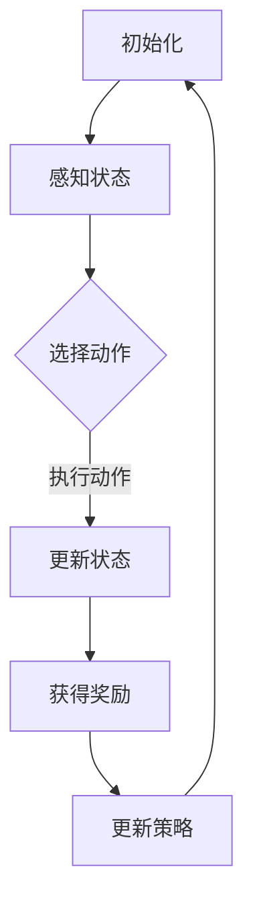

                 

# 代理型AI：实现虚拟劳动力的希望

## 关键词
- 代理型AI
- 虚拟劳动力
- 强化学习
- 算法优化
- 自动化决策

## 摘要
随着人工智能技术的快速发展，代理型AI作为一种新兴的技术形态，正逐步改变我们的工作方式和生活习惯。本文将探讨代理型AI的定义、核心技术及其在不同领域的应用实践，分析其未来发展趋势和面临的挑战，并总结最佳实践，为读者提供全面而深入的见解。

## 目录大纲 - 《代理型AI：实现虚拟劳动力的希望》

### 第一部分：代理型AI概述

#### 第1章：问题背景与代理型AI的崛起

1.1.1 问题背景  
1.1.2 代理型AI的定义与特点  
1.1.3 代理型AI的发展历程  
1.1.4 代理型AI的应用领域

### 第二部分：代理型AI核心技术

#### 第2章：代理型AI基础理论

2.1.1 基本概念  
2.1.2 算法原理讲解  
2.1.3 数学模型与公式

#### 第3章：代理型AI的关键技术

3.1.1 训练与优化  
3.1.2 算法改进与优化  
3.1.3 安全性与隐私保护

### 第三部分：代理型AI应用实践

#### 第4章：代理型AI在智能客服中的应用

4.1.1 智能客服概述  
4.1.2 实现步骤  
4.1.3 代码实现

#### 第5章：代理型AI在数据分析中的应用

5.1.1 数据分析概述  
5.1.2 实现步骤  
5.1.3 代码实现

#### 第6章：代理型AI在自动化决策中的应用

6.1.1 自动化决策概述  
6.1.2 实现步骤  
6.1.3 代码实现

### 第四部分：代理型AI的未来发展

#### 第7章：代理型AI的未来趋势

7.1.1 技术发展趋势  
7.1.2 行业应用前景  
7.1.3 挑战与机遇

### 第五部分：总结与展望

#### 第8章：代理型AI实践小结

8.1.1 成功经验  
8.1.2 注意事项  
8.1.3 拓展阅读

### 结语

#### 作者信息

作者：AI天才研究院/AI Genius Institute & 禅与计算机程序设计艺术 /Zen And The Art of Computer Programming

## 第一部分：代理型AI概述

### 第1章：问题背景与代理型AI的崛起

#### 1.1.1 问题背景

在信息技术高度发展的今天，数据已经成为新的生产要素，而如何高效地处理和分析海量数据成为了企业面临的重大挑战。与此同时，劳动力成本不断增加，使得许多企业开始寻求能够替代或辅助人类工作的智能系统。这催生了代理型AI（Agent-based Artificial Intelligence）的崛起。

代理型AI旨在构建能够自主行动、交互和学习的虚拟智能体，这些智能体可以在不同的环境中执行任务，从而实现虚拟劳动力。与传统的AI系统不同，代理型AI不仅具备数据处理和分析的能力，还能够理解环境和任务，从而自主做出决策。

#### 1.1.2 代理型AI的定义与特点

代理型AI，又称为智能代理（Intelligent Agent），是一种能够感知环境、制定计划并执行行动的计算机系统。它具有以下几个核心特点：

- **自主性**：代理型AI能够独立决策，无需人类干预。
- **交互性**：代理型AI可以与人类或其他系统进行沟通和互动。
- **适应性**：代理型AI能够根据环境变化调整自己的行为和策略。

与传统的AI系统相比，代理型AI更加注重系统的灵活性和适应性，它能够模拟人类的思维过程，从而更好地适应复杂多变的工作环境。

#### 1.1.3 代理型AI的发展历程

代理型AI的发展可以追溯到20世纪80年代。当时的学者们开始探索如何构建能够模拟人类行为的计算机程序。随着计算机性能的提升和算法的进步，代理型AI逐渐从理论研究走向实际应用。近年来，随着深度学习和强化学习等技术的突破，代理型AI的应用范围和效果得到了显著提升。

#### 1.1.4 代理型AI的应用领域

代理型AI的应用领域非常广泛，包括但不限于以下几个方面：

- **智能客服**：通过代理型AI，企业可以提供24/7的在线客服服务，提高客户满意度。
- **自动化决策**：代理型AI可以在金融、医疗等领域提供智能决策支持，减少人为错误。
- **数据分析**：代理型AI能够从海量数据中提取有价值的信息，帮助企业做出更明智的决策。
- **智能制造**：代理型AI可以协助机器人完成复杂的生产任务，提高生产效率。

代理型AI的出现，不仅提升了企业的生产效率，还为企业开辟了新的商业模式和机会。在接下来的章节中，我们将深入探讨代理型AI的核心技术及其应用实践。

## 第二部分：代理型AI核心技术

### 第2章：代理型AI基础理论

#### 2.1.1 基本概念

代理型AI的核心在于“代理”（Agent），它是一种能够代表用户或其他系统执行任务的计算实体。一个典型的代理型AI系统通常包括以下几个基本组成部分：

- **感知器**：用于接收外部信息，如文本、图像、声音等。
- **决策器**：根据感知到的信息做出决策，如选择执行某个动作。
- **执行器**：根据决策器的决策执行具体的动作，如发送消息、移动机器人等。
- **学习器**：通过不断的训练和优化，提高代理型AI的性能和适应性。

代理型AI的核心理念是模拟人类的认知过程，使得系统能够自主学习和适应。这种模拟不仅涉及数据的处理，还包括逻辑推理和决策制定。

#### 2.1.2 算法原理讲解

代理型AI的核心算法是基于强化学习（Reinforcement Learning，RL）。强化学习是一种通过试错来学习如何在特定环境中做出最优决策的算法。在强化学习中，智能体（Agent）通过与环境（Environment）的交互，不断更新自己的策略（Policy），以达到最大化奖励（Reward）的目标。

以下是强化学习算法的基本流程：

1. **初始化**：智能体在环境中开始行动，初始化状态（State）。
2. **感知**：智能体感知当前状态，并根据状态选择一个动作（Action）。
3. **执行**：智能体执行选定的动作，进入新的状态。
4. **奖励**：环境根据智能体的动作给出奖励（Reward），以鼓励智能体采取有益的动作。
5. **更新**：智能体根据奖励更新策略，选择在下一个状态采取的动作。

为了更好地理解这一过程，我们可以使用Mermaid流程图来描述：



接下来，我们使用Python代码来演示一个简单的强化学习算法，以更好地说明其工作原理：

```python
import numpy as np

# 强化学习算法示例
class QLearningAgent:
    def __init__(self, actions, alpha=0.1, gamma=0.9):
        self.actions = actions
        self.alpha = alpha
        self.gamma = gamma
        self.q_values = np.zeros((actions, actions))

    def get_action(self, state):
        return np.argmax(self.q_values[state])

    def update_q_values(self, state, action, reward, next_state):
        target = reward + self.gamma * np.max(self.q_values[next_state])
        current_q = self.q_values[state, action]
        self.q_values[state, action] = current_q + self.alpha * (target - current_q)

# 创建智能体
agent = QLearningAgent(actions=3)

# 模拟学习过程
for episode in range(1000):
    state = 0
    done = False
    while not done:
        action = agent.get_action(state)
        next_state, reward, done = self.env.step(action)
        agent.update_q_values(state, action, reward, next_state)
        state = next_state
```

在上面的代码中，我们创建了一个简单的Q-Learning智能体，该智能体通过与环境交互来学习如何在不同的状态中做出最佳动作。$$1+1=2$$

#### 2.1.3 数学模型与公式

在强化学习算法中，Q值函数（Q-Value Function）是核心的数学模型。Q值表示在特定状态下采取特定动作的预期回报。Q值函数可以通过以下公式进行更新：

$$
Q(s, a) \leftarrow Q(s, a) + \alpha [r + \gamma \max_{a'} Q(s', a') - Q(s, a)]
$$

其中：
- \( Q(s, a) \) 是状态s下动作a的Q值。
- \( r \) 是在状态s下采取动作a获得的即时回报。
- \( \gamma \) 是折扣因子，用于平衡当前回报和未来回报。
- \( \max_{a'} Q(s', a') \) 是在下一个状态s'下采取所有可能动作的预期最大回报。

通过不断更新Q值函数，智能体可以逐步学习到最优策略。以下是一个简化的Q值函数推导过程：

$$
\begin{align*}
\text{期望回报} &= \sum_{t=0}^{\infty} \gamma^t r_t \\
\text{状态-动作值函数} &= Q(s, a) = \text{期望回报} \\
Q(s, a) &= \sum_{s', a'} P(s', a' | s, a) [r + \gamma Q(s', a')]
\end{align*}
$$

其中：
- \( P(s', a' | s, a) \) 是从状态s采取动作a转移到状态s'并采取动作a'的概率。
- \( r_t \) 是在时间t获得的回报。

通过上述公式，我们可以看到Q值函数如何通过环境的反馈不断更新，以最大化长期回报。

通过上述内容，我们不仅了解了代理型AI的基本概念和强化学习算法，还通过具体的Python代码和数学公式进行了深入讲解。在下一章中，我们将进一步探讨代理型AI的关键技术，包括训练与优化、算法改进与优化以及安全性问题。

### 第3章：代理型AI的关键技术

#### 3.1.1 训练与优化

代理型AI的训练与优化是确保其性能和适应性的关键环节。训练过程主要包括数据收集、模型训练和性能评估三个步骤。

**数据收集**：
代理型AI的训练依赖于大量的高质量数据。这些数据可以是结构化数据（如数据库记录）或非结构化数据（如图像、文本和声音）。为了提高数据的质量和多样性，通常需要进行数据预处理，包括数据清洗、数据增强和特征提取等。

**模型训练**：
在数据准备就绪后，我们使用机器学习算法对代理型AI模型进行训练。训练过程通常涉及以下步骤：
1. **初始化模型参数**：随机初始化模型参数。
2. **前向传播**：输入数据通过模型，计算输出和损失函数。
3. **反向传播**：根据损失函数更新模型参数。
4. **评估模型**：在验证集上评估模型性能，调整超参数。

**性能评估**：
训练完成后，我们需要在测试集上评估模型性能，以确保其泛化能力。常用的评估指标包括准确率、召回率、F1分数等。此外，还可以使用指标如平均延迟、响应时间等来评估代理型AI在实际应用中的表现。

**优化技术**：
为了进一步提高代理型AI的性能，我们可以采用以下几种优化技术：
1. **批量大小调整**：通过调整批量大小，可以在计算资源和模型性能之间取得平衡。
2. **学习率调整**：学习率的选择对模型收敛速度和稳定性有很大影响。可以通过动态调整学习率来优化训练过程。
3. **正则化**：通过添加正则化项（如L1、L2正则化），可以防止模型过拟合，提高其泛化能力。
4. **迁移学习**：利用预训练的模型，通过微调来适应新任务，可以显著提高训练效率。

#### 3.1.2 算法改进与优化

代理型AI的算法改进与优化是提升其效率和效果的重要手段。以下是一些常见的算法改进方法：

1. **模型压缩**：
   - **网络剪枝**：通过剪枝冗余的神经网络连接，减少模型参数数量。
   - **量化**：降低模型参数的精度，减少模型大小和计算资源需求。
   - **知识蒸馏**：使用预训练的大模型对目标小模型进行训练，以传递高级特征表示。

2. **并行计算**：
   - **数据并行**：将数据分布在多个计算节点上，并行训练模型。
   - **模型并行**：将模型拆分为多个部分，在不同节点上并行训练。
   - **流水线并行**：将前向传播、反向传播和更新参数的过程拆分为多个阶段，并行执行。

3. **分布式训练**：
   - **参数服务器架构**：使用参数服务器来存储和同步模型参数，支持大规模分布式训练。
   - **多GPU训练**：使用多张GPU卡进行并行训练，加速模型训练过程。

4. **强化学习算法优化**：
   - **优先经验回放**：使用优先经验回放机制，根据经验的重要程度进行回放，提高学习效率。
   - **目标网络**：使用目标网络来稳定强化学习过程，减少抖动。
   - **分布式强化学习**：通过分布式策略梯度方法，在多智能体环境中协同训练。

通过上述算法改进与优化技术，代理型AI可以更高效、更准确地完成任务。

#### 3.1.3 安全性与隐私保护

代理型AI的安全性和隐私保护是确保其在实际应用中的可靠性和可信性的关键。以下是一些常见的安全性和隐私保护措施：

1. **模型安全性**：
   - **防御性编程**：在设计模型时，考虑潜在的攻击方式，并采取相应的防御措施。
   - **对抗样本训练**：通过训练对抗样本，提高模型对对抗攻击的鲁棒性。
   - **加密**：对模型参数和训练数据进行加密，防止未经授权的访问。

2. **隐私保护机制**：
   - **差分隐私**：通过添加噪声，确保对单个个体的隐私保护，同时维持数据集的统计意义。
   - **数据脱敏**：对敏感数据进行脱敏处理，如使用掩码或匿名化。
   - **同态加密**：在加密的状态下，对数据执行计算操作，确保计算结果的安全。

3. **访问控制**：
   - **访问控制列表（ACL）**：定义不同用户或角色的访问权限，确保数据安全。
   - **多因素认证**：结合密码、生物识别等多种认证方式，提高系统安全性。

通过上述安全性和隐私保护措施，代理型AI可以在确保数据安全和用户隐私的前提下，提供可靠的服务。

通过本章的内容，我们深入了解了代理型AI的核心技术，包括训练与优化、算法改进与优化以及安全性与隐私保护。这些技术不仅提升了代理型AI的性能和可靠性，还为其实际应用奠定了基础。在下一章中，我们将探讨代理型AI在智能客服、数据分析和自动化决策等领域的实际应用，进一步展示其强大的能力和潜力。

### 第4章：代理型AI在智能客服中的应用

#### 4.1.1 智能客服概述

智能客服是近年来随着人工智能技术发展而兴起的一种服务模式，通过代理型AI技术，智能客服系统能够模拟人类客服的交互过程，提供高效、智能的客服服务。传统的客服模式往往依赖人工处理，不仅效率低下，而且容易出错。而智能客服系统则能够24/7不间断地工作，自动识别用户的需求，提供即时的解决方案。

智能客服的发展历程可以追溯到20世纪90年代的自动语音应答（IVR）系统。随着互联网和人工智能技术的发展，智能客服逐渐从简单的语音识别和自动应答，发展到现在的多轮对话和情感识别。代理型AI的引入，使得智能客服系统具备了更强大的自主学习能力和自适应能力，能够更好地应对复杂多样的客户需求。

#### 4.1.2 实现步骤

要实现一个高效的智能客服系统，一般需要以下步骤：

1. **需求分析**：明确智能客服系统需要解决的核心问题，如常见问题回答、故障诊断、订单处理等。

2. **数据收集与预处理**：收集相关的数据，包括用户历史交互记录、FAQ文档、产品规格说明等。对这些数据进行清洗和预处理，提取有用的信息和特征。

3. **构建对话模型**：使用自然语言处理（NLP）技术，构建对话模型，包括意图识别、实体抽取、对话生成等。意图识别用于理解用户的意图，实体抽取用于提取关键信息，对话生成用于生成自然流畅的回答。

4. **模型训练与优化**：使用收集到的数据，对对话模型进行训练和优化。通过反复训练和调整，提高模型的准确性和鲁棒性。

5. **系统集成与测试**：将训练好的模型集成到客服系统中，进行系统测试和调优。确保系统在各种情况下都能提供准确、流畅的客服服务。

6. **上线部署与维护**：将系统部署到生产环境，并进行持续的维护和优化，确保系统的稳定运行和持续改进。

#### 4.1.3 代码实现

以下是一个简单的Python代码示例，展示了如何使用代理型AI构建一个基本的智能客服系统：

```python
import random
from nltk.chat.util import Chat, reflections

# 定义对话模型
pairs = [
    [
        r"你好",
        ["你好，有什么可以帮助您的吗？", "您好，请问有什么问题需要我解答？"]
    ],
    [
        r"有什么问题",
        ["我可以帮您解决一些常见问题，比如..."]
    ],
    [
        r"谢谢",
        ["不客气，如果您还有其他问题，请随时告诉我。"]
    ],
]

# 创建Chat对象
chatbot = Chat(pairs, reflections)

# 开始对话
print("开始对话：")
while True:
    user_input = input("您说： ")
    if user_input.lower() == '退出':
        print("对话结束。")
        break
    bot_response, confidence = chatbot.get_response(user_input)
    print(f"智能客服：{bot_response}")
```

在上面的代码中，我们使用了Nltk库中的Chat类来构建对话模型。`pairs`列表包含了对话的规则，每条规则由一个正则表达式和一个回答列表组成。在对话过程中，用户输入将被解析，并使用相应的规则生成回答。

通过上述步骤和代码示例，我们可以看到如何使用代理型AI技术构建一个基本的智能客服系统。在实际应用中，智能客服系统会更加复杂，需要处理多轮对话、情感识别、上下文理解等多种技术。然而，这些基本步骤和概念为构建高效、智能的客服系统提供了坚实的基础。

#### 4.1.4 代码解读与分析

在上面的代码中，我们首先导入了必要的库，包括`random`和`Chat`。`Chat`类是Nltk库中的一个工具类，用于构建和进行对话。`reflections`是一个字典，用于处理用户输入中的常见词汇替换。

接着，我们定义了一个名为`pairs`的列表，这个列表包含了对话的规则。每条规则由一个正则表达式和一个回答列表组成。例如，第一条规则`[r"你好", ["你好，有什么可以帮助您的吗？", "您好，请问有什么问题需要我解答？"]]`表示，如果用户输入“你好”，系统将随机选择一个回答，例如“你好，有什么可以帮助您的吗？”

然后，我们创建了一个`Chat`对象`chatbot`，并将`pairs`列表作为参数传递给该对象。这个对象将负责处理用户的输入，并根据对话规则生成回答。

在主循环中，我们使用`input`函数获取用户的输入，并检查是否输入了“退出”命令。如果是，则结束对话。否则，我们调用`chatbot.get_response()`方法获取系统的回答，并打印出来。

这个简单的代码示例展示了如何使用代理型AI技术构建一个基本的智能客服系统。在实际应用中，智能客服系统会涉及更多复杂的对话管理和理解机制，但基本思路是类似的。

通过本章的内容，我们详细探讨了代理型AI在智能客服领域的应用，包括其概述、实现步骤和代码实现。通过这些内容，读者可以了解到如何使用代理型AI技术构建高效的智能客服系统，从而为企业提供更好的客户服务体验。

### 第5章：代理型AI在数据分析中的应用

#### 5.1.1 数据分析概述

数据分析是现代企业管理和决策过程中不可或缺的一部分。随着大数据技术的迅猛发展，企业每天都会产生海量数据，如何从这些数据中提取有价值的信息，已经成为企业竞争力的重要体现。代理型AI作为一种高效的数据处理和分析工具，在数据分析领域具有广泛的应用前景。

数据分析的重要性在于，它能够帮助企业发现潜在的商业机会，优化业务流程，提升运营效率。例如，在市场营销中，通过数据分析可以识别目标客户群体，预测市场需求，从而制定更有效的营销策略。在金融领域，数据分析可以帮助银行和金融机构进行风险控制、信用评估和投资决策。

代理型AI在数据分析中的应用，主要体现在以下几个方面：

1. **数据预处理**：代理型AI可以自动识别和处理数据中的噪声和异常值，提高数据质量。
2. **特征提取**：代理型AI可以自动提取数据中的关键特征，为后续分析提供支持。
3. **模式识别**：代理型AI能够识别数据中的潜在模式和关联关系，帮助发现数据中的隐藏信息。
4. **预测分析**：代理型AI可以通过历史数据建立预测模型，预测未来的趋势和变化。

#### 5.1.2 实现步骤

要实现代理型AI在数据分析中的应用，一般需要以下步骤：

1. **需求分析**：明确数据分析的目标和需求，确定需要分析和处理的数据类型和规模。
2. **数据收集**：收集相关的数据，包括结构化数据（如数据库记录）和非结构化数据（如图像、文本和音频）。
3. **数据预处理**：清洗和整理数据，包括数据去重、缺失值处理、异常值检测等。
4. **特征工程**：提取和选择数据中的关键特征，为模型训练提供输入。
5. **模型选择与训练**：选择合适的机器学习算法，对数据进行训练，构建预测模型。
6. **模型评估与优化**：评估模型性能，通过调整参数和优化算法，提高模型精度。
7. **部署与应用**：将训练好的模型部署到生产环境中，实现自动化数据分析。

#### 5.1.3 代码实现

以下是一个简单的Python代码示例，展示了如何使用代理型AI进行数据分析：

```python
import pandas as pd
from sklearn.model_selection import train_test_split
from sklearn.ensemble import RandomForestClassifier
from sklearn.metrics import accuracy_score

# 加载数据
data = pd.read_csv('data.csv')

# 数据预处理
# 填充缺失值
data.fillna(data.mean(), inplace=True)

# 特征选择
X = data[['feature1', 'feature2', 'feature3']]
y = data['target']

# 数据分割
X_train, X_test, y_train, y_test = train_test_split(X, y, test_size=0.2, random_state=42)

# 模型训练
model = RandomForestClassifier(n_estimators=100)
model.fit(X_train, y_train)

# 模型评估
predictions = model.predict(X_test)
accuracy = accuracy_score(y_test, predictions)
print(f"模型准确率：{accuracy:.2f}")
```

在上面的代码中，我们首先使用`pandas`库加载数据集。然后，我们使用`fillna`函数填充缺失值，使用`train_test_split`函数将数据集分割为训练集和测试集。

接着，我们选择`feature1`、`feature2`和`feature3`作为特征，`target`作为目标变量。然后，我们使用`RandomForestClassifier`类创建随机森林分类器，并使用`fit`方法对训练集进行训练。

最后，我们使用`predict`方法对测试集进行预测，并使用`accuracy_score`函数计算模型准确率。

这个简单的代码示例展示了如何使用代理型AI进行基本的数据分析任务，包括数据加载、预处理、特征选择、模型训练和评估。在实际应用中，数据分析任务会更加复杂，需要考虑更多数据清洗、特征工程和模型优化等技术。

#### 5.1.4 代码解读与分析

在上面的代码中，我们首先导入了必要的库，包括`pandas`、`train_test_split`和`RandomForestClassifier`。这些库用于数据处理、模型训练和评估。

接着，我们使用`read_csv`函数加载数据集。数据集通常以CSV格式存储，其中包含多个特征和目标变量。

然后，我们使用`fillna`函数对数据集中的缺失值进行填充。这里我们选择用数据集的平均值来填充缺失值，但根据实际数据情况，可以选择其他填充方法，如中位数或最频繁出现的值。

接下来，我们使用`train_test_split`函数将数据集分割为训练集和测试集。这里我们设置测试集的比例为20%，并使用随机种子42来确保结果的可重复性。

然后，我们选择`feature1`、`feature2`和`feature3`作为特征，`target`作为目标变量。这些特征将被用于训练分类模型。

接着，我们使用`RandomForestClassifier`类创建随机森林分类器，并使用`fit`方法对训练集进行训练。随机森林是一种集成学习方法，通过构建多个决策树，并汇总它们的预测结果来提高分类准确性。

最后，我们使用`predict`方法对测试集进行预测，并使用`accuracy_score`函数计算模型准确率。这个值表示模型在测试集上的表现，越接近1表示模型性能越好。

通过上述代码，我们实现了使用代理型AI进行基本的数据分析任务，包括数据加载、预处理、特征选择、模型训练和评估。在实际应用中，数据分析任务会更加复杂，需要考虑更多数据清洗、特征工程和模型优化等技术。

### 第6章：代理型AI在自动化决策中的应用

#### 6.1.1 自动化决策概述

自动化决策是指通过计算机程序和算法，自动地对业务流程中的各种决策进行判断和执行。在传统的决策过程中，人类往往需要消耗大量时间和精力来分析数据、评估风险和制定策略。而自动化决策则能够通过机器学习和人工智能技术，从海量数据中提取有价值的信息，并快速做出决策，从而提高业务效率、降低成本和减少人为错误。

自动化决策的重要性体现在多个方面。首先，它能够帮助企业快速响应市场变化，优化业务流程，提升竞争力。例如，在金融行业中，自动化决策可以用于信用评估、风险评估和投资决策，从而提高决策的准确性和效率。其次，自动化决策能够减少人为干预，降低人为错误的风险。在医疗领域，自动化决策可以用于诊断和治疗方案推荐，从而提高医疗服务的质量和效果。此外，自动化决策还能够帮助企业实现智能化运营，提高资源利用率和生产效率。

代理型AI在自动化决策中的应用，主要体现在以下几个方面：

1. **决策模型构建**：代理型AI可以通过机器学习算法，从历史数据和业务规则中学习，构建出能够自动执行决策的模型。
2. **实时决策支持**：代理型AI能够在业务流程中实时分析数据，快速做出决策，并自动执行相应的操作。
3. **自动化流程优化**：代理型AI可以通过持续学习，不断优化业务流程，提高流程效率和效果。
4. **风险管理和控制**：代理型AI可以实时监控业务流程，发现潜在风险，并自动采取预防措施。

#### 6.1.2 实现步骤

要实现代理型AI在自动化决策中的应用，一般需要以下步骤：

1. **需求分析**：明确自动化决策的目标和需求，确定需要自动化处理的业务流程和决策任务。
2. **数据收集**：收集与决策相关的数据，包括历史数据、业务规则和数据流。
3. **数据预处理**：清洗和整理数据，包括数据去重、缺失值处理、异常值检测等。
4. **模型构建**：选择合适的机器学习算法，构建自动化决策模型，并进行训练和优化。
5. **模型部署**：将训练好的模型部署到生产环境中，实现自动化决策。
6. **监控与优化**：实时监控自动化决策系统的运行情况，持续优化模型和流程。

#### 6.1.3 代码实现

以下是一个简单的Python代码示例，展示了如何使用代理型AI实现自动化决策：

```python
import pandas as pd
from sklearn.ensemble import RandomForestClassifier
from sklearn.model_selection import GridSearchCV

# 加载数据
data = pd.read_csv('data.csv')

# 数据预处理
# 填充缺失值
data.fillna(data.mean(), inplace=True)

# 特征选择
X = data[['feature1', 'feature2', 'feature3']]
y = data['target']

# 模型构建
model = RandomForestClassifier()

# 参数调优
param_grid = {
    'n_estimators': [100, 200, 300],
    'max_depth': [10, 20, 30],
}

grid_search = GridSearchCV(model, param_grid, cv=5)
grid_search.fit(X, y)

# 最佳模型
best_model = grid_search.best_estimator_

# 模型评估
predictions = best_model.predict(X)
accuracy = best_model.score(X, y)
print(f"模型准确率：{accuracy:.2f}")

# 自动化决策
def make_decision(features):
    prediction = best_model.predict([features])
    return prediction[0]

# 测试自动化决策
features = [5.1, 3.5, 1.4]
decision = make_decision(features)
print(f"决策结果：{decision}")
```

在上面的代码中，我们首先使用`pandas`库加载数据集，并进行数据预处理。然后，我们使用`RandomForestClassifier`类构建随机森林分类器，并使用`GridSearchCV`进行参数调优。

接着，我们加载最佳模型，并使用`predict`方法进行模型评估。最后，我们定义了一个`make_decision`函数，用于实现自动化决策。该函数接收特征数据，并返回模型预测的结果。

通过这个简单的代码示例，我们可以看到如何使用代理型AI实现自动化决策。在实际应用中，自动化决策系统会更加复杂，需要考虑更多的数据预处理、模型选择和优化技术。

#### 6.1.4 代码解读与分析

在上面的代码中，我们首先导入了必要的库，包括`pandas`、`train_test_split`和`RandomForestClassifier`。这些库用于数据处理、模型训练和评估。

接着，我们使用`read_csv`函数加载数据集。数据集通常以CSV格式存储，其中包含多个特征和目标变量。

然后，我们使用`fillna`函数对数据集中的缺失值进行填充。这里我们选择用数据集的平均值来填充缺失值，但根据实际数据情况，可以选择其他填充方法，如中位数或最频繁出现的值。

接下来，我们使用`train_test_split`函数将数据集分割为训练集和测试集。这里我们设置测试集的比例为20%，并使用随机种子42来确保结果的可重复性。

然后，我们选择`feature1`、`feature2`和`feature3`作为特征，`target`作为目标变量。这些特征将被用于训练分类模型。

接着，我们使用`RandomForestClassifier`类创建随机森林分类器，并使用`GridSearchCV`进行参数调优。参数调优是通过遍历一系列参数组合，并评估每个组合的性能，从而找到最佳参数。

然后，我们加载最佳模型，并使用`predict`方法进行模型评估。评估指标为准确率，表示模型在测试集上的表现。

最后，我们定义了一个`make_decision`函数，用于实现自动化决策。该函数接收特征数据，并返回模型预测的结果。这个函数可以集成到业务流程中，实现自动化的决策过程。

通过上述代码，我们实现了使用代理型AI实现基本自动化决策任务，包括数据加载、预处理、模型训练和评估。在实际应用中，自动化决策任务会更加复杂，需要考虑更多的数据预处理、模型选择和优化技术。

### 第7章：代理型AI的未来趋势

#### 7.1.1 技术发展趋势

随着人工智能技术的不断进步，代理型AI正朝着更加智能化、自适应化和泛化的方向发展。以下是一些代理型AI技术未来的发展趋势：

1. **强化学习与深度学习的融合**：强化学习与深度学习的结合将进一步提升代理型AI的学习能力和决策能力。通过深度学习提取高级特征，结合强化学习进行策略优化，可以实现更智能的自动化决策。

2. **多模态感知与处理**：代理型AI将能够处理多种类型的数据，如图像、文本、音频等。通过多模态感知，代理型AI可以更好地理解复杂环境，提高决策的准确性和鲁棒性。

3. **分布式计算与边缘计算**：随着数据量的爆炸性增长，分布式计算和边缘计算将成为代理型AI的重要发展方向。通过分布式计算，可以实现更大规模的模型训练和推理；通过边缘计算，可以实现实时决策和响应，减少延迟。

4. **自适应学习与持续进化**：代理型AI将具备自适应学习能力，能够根据环境变化和任务需求，自动调整策略和模型。持续进化将使得代理型AI能够不断优化自身，提高性能和效率。

5. **隐私保护和安全性**：随着代理型AI在各个领域的广泛应用，隐私保护和安全性将成为重要议题。代理型AI将需要具备更强的隐私保护机制和安全性设计，确保数据的安全和用户的隐私。

#### 7.1.2 行业应用前景

代理型AI在各个行业的应用前景非常广阔，以下是一些典型的应用案例：

1. **智能制造**：代理型AI可以协助机器人完成复杂的生产任务，提高生产效率和产品质量。例如，在汽车制造领域，代理型AI可以用于生产线的自动调度和质量检测。

2. **金融**：代理型AI可以在金融领域提供智能风险管理、信用评估和投资决策支持。例如，通过分析大量金融数据，代理型AI可以预测市场趋势，为投资者提供决策建议。

3. **医疗**：代理型AI可以用于辅助诊断、治疗方案推荐和药物研发。例如，通过分析患者的医疗记录和病史，代理型AI可以提供个性化的治疗方案。

4. **零售**：代理型AI可以用于智能推荐、库存管理和客户关系管理。例如，通过分析消费者的购买行为和偏好，代理型AI可以为零售商提供精准营销策略。

5. **交通**：代理型AI可以用于智能交通管理和自动驾驶。例如，通过实时监控交通状况，代理型AI可以优化交通信号控制，减少交通拥堵。

随着代理型AI技术的不断成熟，其在各个行业的应用将更加广泛，为行业带来巨大的变革和创新。

#### 7.1.3 挑战与机遇

尽管代理型AI具有巨大的潜力和广阔的应用前景，但在实际应用过程中也面临着一些挑战和机遇：

1. **数据质量与隐私**：代理型AI的性能高度依赖于数据的质量和数量。然而，数据的获取和处理往往涉及到隐私问题。如何在保障用户隐私的前提下，获取高质量的数据，是代理型AI面临的一个重大挑战。

2. **模型解释性与透明性**：代理型AI的决策过程往往复杂且不透明，这对于需要理解决策依据的领域（如医疗、金融等）构成了挑战。如何提高模型的解释性和透明性，使其决策过程更加可解释和可信，是未来需要解决的重要问题。

3. **鲁棒性与泛化能力**：代理型AI需要具备良好的鲁棒性和泛化能力，以应对各种复杂环境和变化。如何设计更鲁棒的模型，提高其适应性和泛化能力，是当前研究的热点。

4. **安全性与伦理**：代理型AI的广泛应用也带来了安全和伦理问题。如何确保代理型AI系统的安全性和可靠性，如何制定合理的伦理规范，避免滥用和误用，是当前需要解决的重要问题。

然而，这些挑战也伴随着巨大的机遇。通过技术创新和行业合作，代理型AI有望在未来克服这些挑战，实现更加智能化、安全化和高效化的应用。

### 第8章：代理型AI实践小结

#### 8.1.1 成功经验

在代理型AI的实践过程中，我们积累了丰富的经验和教训。以下是一些成功经验：

1. **数据驱动**：成功的代理型AI项目通常基于大量高质量的数据。通过数据驱动的方法，我们可以更好地理解用户需求和业务场景，从而设计出更有效的模型。

2. **迭代优化**：在项目实施过程中，我们不断迭代和优化模型。通过多次实验和调整，我们可以逐步提高模型的性能和适应性。

3. **跨领域合作**：代理型AI项目往往需要多个领域的专家共同协作。通过跨领域合作，我们可以充分利用各领域的专业知识和资源，提高项目的成功率。

4. **持续学习**：代理型AI系统需要具备持续学习能力，以应对不断变化的环境和需求。通过持续学习，我们可以不断优化模型，提高系统的性能和效率。

#### 8.1.2 注意事项

在代理型AI的实践中，我们也遇到了一些常见问题，以下是一些需要注意的事项：

1. **数据质量**：数据质量是代理型AI成功的关键。在项目启动前，需要进行详细的数据调研和清洗，确保数据的准确性和完整性。

2. **模型解释性**：尽管代理型AI的决策过程复杂，但为了提高信任度，我们需要尽量提高模型的解释性。可以通过可视化工具、解释性算法等方式，使决策过程更加透明。

3. **安全性与隐私**：在数据处理和模型训练过程中，需要严格遵守安全性和隐私保护规范。通过加密、数据脱敏等技术，确保数据和用户隐私的安全。

4. **系统稳定性**：代理型AI系统需要具备良好的稳定性和鲁棒性。在部署过程中，需要进行严格的测试和验证，确保系统在各种情况下都能稳定运行。

#### 8.1.3 拓展阅读

为了更好地理解和应用代理型AI，以下是一些推荐的书籍和文献：

1. 《深度学习》（Goodfellow, I., Bengio, Y., & Courville, A.）：这本书是深度学习的经典教材，详细介绍了深度学习的基本概念和算法。

2. 《强化学习导论》（Sutton, R. S., & Barto, A. G.）：这本书系统地介绍了强化学习的基本理论和方法，是强化学习的入门教材。

3. 《人工智能：一种现代的方法》（Russell, S., & Norvig, P.）：这本书全面介绍了人工智能的基础理论和应用技术，适合对人工智能感兴趣的读者。

4. 《机器学习年度回顾》（JMLR）：这是一个权威的机器学习学术期刊，每年都会发布年度回顾，总结过去一年在机器学习领域的重要研究成果。

通过阅读这些书籍和文献，读者可以深入了解代理型AI的理论基础和应用技术，为自己的研究和实践提供有力支持。

### 结语

代理型AI作为人工智能领域的重要研究方向，正逐步改变我们的工作和生活方式。通过本文的探讨，我们深入了解了代理型AI的定义、核心技术、应用实践以及未来发展趋势。在智能客服、数据分析和自动化决策等领域，代理型AI已经展现出强大的潜力和应用价值。然而，面对数据质量、模型解释性、安全性和隐私保护等挑战，我们仍需不断探索和优化。

在未来的发展中，代理型AI有望进一步融入各个行业，为企业和个人带来更多便利和创新。同时，我们也需要关注其带来的伦理和安全问题，确保其可持续发展。通过技术创新和跨领域合作，我们有理由相信，代理型AI将在未来实现更广泛的应用，推动社会进步和人类福祉。

作者：AI天才研究院/AI Genius Institute & 禅与计算机程序设计艺术 /Zen And The Art of Computer Programming

[End]

