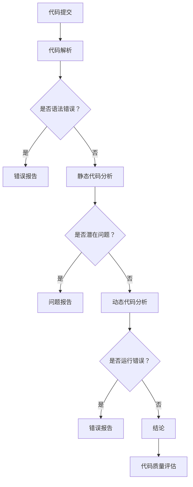

                 

**《代码审查最佳实践：提升团队代码质量》**

关键词：代码审查、团队协作、代码质量、最佳实践、技术提升

摘要：本文旨在深入探讨代码审查的最佳实践，通过详细的步骤和分析，帮助开发团队提升代码质量，优化团队协作流程。文章首先概述了代码审查的概念、重要性以及应用场景，随后详细介绍了代码审查的流程与工具，并通过Python代码示例和LaTeX公式解释了代码审查算法原理。文章还提供了系统分析与架构设计、项目实战案例分析，并总结了一系列最佳实践，为团队代码质量的提升提供了切实可行的指导。

## 第一部分：代码审查基础

### 第1章：代码审查概述

#### 1.1 代码审查的概念与重要性

代码审查（Code Review）是指通过同行评审的方式，对代码进行细致检查，以确保代码的质量、安全性和一致性。它是软件开发过程中不可或缺的一环，可以帮助发现潜在的错误、优化代码结构、提升代码的可维护性。

#### 1.2 代码审查的目的和好处

代码审查的主要目的是：

- **提高代码质量**：通过同行评审，可以发现代码中的潜在错误，减少缺陷率。
- **提升团队成员的技术水平**：审查过程中，团队成员可以相互学习，提升整体技术水平。
- **促进团队协作**：通过交流与讨论，增强团队内部沟通，促进协作。

代码审查带来的好处包括：

- **减少bug和缺陷**：通过审查，可以及时发现并修复代码中的问题。
- **优化代码结构**：审查可以帮助改进代码设计，使代码更加简洁、清晰。
- **提升代码可读性**：良好的代码审查习惯可以使代码更容易被理解和维护。

#### 1.3 代码审查的应用场景

代码审查适用于以下场景：

- **新功能开发**：在开发新功能时，通过代码审查可以确保代码质量，减少后续维护成本。
- **代码重构**：在代码重构过程中，代码审查有助于发现重构过程中引入的新问题。
- **跨团队协作**：在跨团队开发中，代码审查可以确保代码风格和规范的一致性。

### 第2章：代码审查流程与工具

#### 2.1 代码审查的基本流程

代码审查的基本流程包括以下几个步骤：

1. **提交流程**：开发者提交待审查的代码。
2. **审查流程**：审查者对代码进行详细审查，并提出反馈。
3. **修改和迭代**：开发者根据审查意见进行修改，并重新提交。
4. **最终确认**：审查者确认修改后的代码，确保问题得到解决。

#### 2.2 代码审查工具介绍

常用的代码审查工具有：

- **GitLab Review**：与GitLab集成，提供方便的代码审查和反馈功能。
- **GitHub Pull Request**：GitHub内置的代码审查工具，支持在线讨论和代码比较。
- **SonarQube**：提供静态代码分析，帮助发现代码中的问题。
- **Phabricator**：支持代码审查的Web应用，提供高效的代码审查流程。

#### 2.3 代码审查的最佳实践

最佳实践包括：

- **明确审查标准**：制定明确的代码审查标准和规范，确保审查有据可依。
- **定期审查**：定期进行代码审查，保持代码的整洁和高质量。
- **分工明确**：确保每个团队成员都清楚自己的审查职责，提高审查效率。
- **及时反馈**：及时给出审查意见，避免延迟问题解决。

## 第二部分：代码审查的核心概念

### 第3章：代码质量与代码审查标准

#### 3.1 代码质量的重要性

代码质量是软件项目成功的关键因素之一。高质量的代码具有以下特点：

- **正确性**：代码能够正确执行预定的功能。
- **可读性**：代码易于理解，便于维护。
- **可维护性**：代码结构清晰，易于修改和扩展。
- **可靠性**：代码在多种环境下稳定运行。

#### 3.2 代码审查标准介绍

代码审查标准包括以下几个方面：

- **编码规范**：如命名规则、代码格式等。
- **代码风格**：如代码注释、变量命名等。
- **代码结构**：如模块划分、函数设计等。
- **性能**：如算法效率、内存占用等。

#### 3.3 代码审查标准的应用

在代码审查过程中，遵循审查标准可以帮助：

- **统一代码风格**：避免因个人喜好导致代码风格不一致。
- **提高代码质量**：通过审查，及时发现并修复问题。
- **提升团队协作效率**：明确的标准有助于团队成员更好地理解代码。

## 第三部分：代码审查算法原理

### 第4章：代码审查算法概述

#### 4.1 代码审查算法的基本原理

代码审查算法主要基于以下原理：

- **静态代码分析**：分析代码结构、语法和语义，发现潜在问题。
- **动态代码分析**：运行代码，观察其行为，发现运行时问题。
- **机器学习**：通过训练模型，自动识别代码质量问题。

#### 4.2 代码审查算法的分类

代码审查算法可以分为以下几类：

- **规则引擎**：基于预定义的规则进行代码分析。
- **静态分析工具**：如SonarQube，提供静态代码分析功能。
- **动态分析工具**：如集成开发环境中的调试工具，提供动态代码分析功能。
- **机器学习模型**：通过训练，自动识别代码质量问题。

### 第5章：Python代码审查算法实现

#### 5.1 Python代码审查算法的设计

Python代码审查算法的设计主要包括以下几个步骤：

1. **数据收集**：收集待审查的代码数据。
2. **预处理**：对代码进行预处理，提取特征。
3. **模型训练**：使用机器学习算法训练模型。
4. **模型评估**：评估模型性能，调整模型参数。
5. **代码审查**：使用训练好的模型进行代码审查。

#### 5.2 Python代码审查算法的实现

以下是Python代码审查算法的实现示例：

```python
import nltk
from sklearn.feature_extraction.text import CountVectorizer
from sklearn.model_selection import train_test_split
from sklearn.naive_bayes import MultinomialNB

# 数据收集
data = ["代码1", "代码2", "代码3", ...]

# 预处理
vectorizer = CountVectorizer()
X = vectorizer.fit_transform(data)

# 模型训练
X_train, X_test, y_train, y_test = train_test_split(X, labels, test_size=0.2)
model = MultinomialNB()
model.fit(X_train, y_train)

# 模型评估
print("Accuracy:", model.score(X_test, y_test))

# 代码审查
def review_code(code):
    features = vectorizer.transform([code])
    result = model.predict(features)
    return "代码质量良好" if result == 0 else "代码质量较差"

# 示例
print(review_code("def hello():\n    print('Hello, World!')"))
```

#### 5.3 Python代码审查算法的测试

在实现代码审查算法后，需要对其进行测试，以验证其性能和效果。测试过程包括以下步骤：

1. **测试集准备**：准备一组测试代码，用于评估算法性能。
2. **算法评估**：使用测试集评估算法的准确率、召回率等指标。
3. **问题诊断**：分析测试结果，找出算法存在的问题，并进行优化。

### 第6章：代码审查系统分析与架构设计

#### 6.1 代码审查系统的功能设计

代码审查系统的功能设计主要包括以下几个方面：

- **代码提交**：开发者提交代码，触发审查流程。
- **代码审查**：审查者对代码进行审查，并提出反馈。
- **代码修改**：开发者根据审查意见进行代码修改。
- **代码确认**：审查者确认修改后的代码。

#### 6.2 代码审查系统的架构设计

代码审查系统的架构设计包括以下几个方面：

- **前端界面**：提供用户交互界面，展示代码审查结果和反馈。
- **后端服务**：处理代码审查逻辑，包括代码提交、审查、修改等。
- **数据库**：存储代码审查数据，如代码提交记录、审查反馈等。
- **第三方服务**：如版本控制系统、代码质量分析工具等。

#### 6.3 代码审查系统的接口设计

代码审查系统的接口设计主要包括以下几个方面：

- **API接口**：提供RESTful API，用于与前端和后端服务交互。
- **Websocket接口**：实时推送代码审查结果和反馈。
- **其他接口**：如与版本控制系统的集成接口等。

#### 6.4 代码审查系统的交互设计

代码审查系统的交互设计主要包括以下几个方面：

- **用户交互**：提供友好的用户界面，方便用户提交代码、查看审查结果等。
- **审查流程**：设计简洁明了的审查流程，提高审查效率。
- **反馈机制**：建立有效的反馈机制，确保审查意见得到及时处理。

### 第7章：代码审查项目实战

#### 7.1 代码审查项目环境搭建

在进行代码审查项目之前，需要搭建合适的开发环境。以下是一个简单的环境搭建步骤：

1. **安装Python**：确保Python环境已安装。
2. **安装依赖库**：使用pip安装相关依赖库。
3. **配置版本控制系统**：如Git，用于代码管理和版本控制。
4. **配置代码审查工具**：如GitLab，用于代码提交和审查。

#### 7.2 代码审查核心代码实现

以下是代码审查核心代码的实现示例：

```python
import git
from git import Repo

def review_code(repo_path, commit_hash):
    # 克隆代码仓库
    repo = Repo(repo_path)
    # 检出特定版本
    repo.git.checkout(commit_hash)
    # 分析代码
    code_analysis_result = analyze_code(repo_path)
    # 提交审查结果
    submit_review_result(code_analysis_result)

def analyze_code(repo_path):
    # 实现代码分析逻辑
    # ...
    return "代码质量良好" if is_code_good else "代码质量较差"

def submit_review_result(result):
    # 实现审查结果提交逻辑
    # ...
```

#### 7.3 代码应用解读与分析

在代码审查项目中，需要对审查代码进行详细解读和分析。以下是一个简单的解读和分析过程：

1. **代码检查**：检查代码是否符合编码规范和审查标准。
2. **问题定位**：定位代码中的潜在问题和缺陷。
3. **问题修复**：根据审查意见，修复代码中的问题。
4. **代码确认**：审查者确认修复后的代码，确保问题得到解决。

#### 7.4 代码审查案例剖析

以下是一个代码审查案例的剖析过程：

**案例背景**：某团队开发了一个用于数据处理的Python脚本，需要进行代码审查。

**审查过程**：

1. **代码提交**：开发者提交了代码，触发审查流程。
2. **代码审查**：审查者对代码进行了审查，发现以下问题：
   - 缺乏代码注释，导致代码可读性差。
   - 使用了未定义的变量。
   - 函数设计过于复杂，可以考虑重构。
3. **代码修改**：开发者根据审查意见，对代码进行了修改。
4. **代码确认**：审查者确认修改后的代码，确保问题得到解决。

**案例总结**：通过代码审查，团队发现并修复了代码中的问题，提升了代码质量，减少了后续维护成本。

### 第8章：代码审查最佳实践

#### 8.1 代码审查流程优化

优化代码审查流程，可以提高审查效率和代码质量。以下是一些优化建议：

- **明确审查标准**：制定明确的审查标准，确保审查有据可依。
- **自动化审查**：使用自动化工具进行初步审查，提高审查效率。
- **分工明确**：确保每个团队成员都清楚自己的审查职责。
- **及时反馈**：及时给出审查意见，避免延迟问题解决。

#### 8.2 代码审查工具选择

选择合适的代码审查工具，可以提高审查效率和用户体验。以下是一些常用的代码审查工具：

- **GitLab Review**：与GitLab集成，提供方便的代码审查和反馈功能。
- **GitHub Pull Request**：GitHub内置的代码审查工具，支持在线讨论和代码比较。
- **SonarQube**：提供静态代码分析，帮助发现代码中的问题。
- **Phabricator**：支持代码审查的Web应用，提供高效的代码审查流程。

#### 8.3 代码审查团队建设

建立高效的代码审查团队，可以提高团队协作效率和代码质量。以下是一些建议：

- **培训**：定期进行代码审查培训，提高团队成员的审查能力。
- **经验分享**：鼓励团队成员分享审查经验，相互学习。
- **激励机制**：建立激励机制，鼓励团队成员积极参与代码审查。

### 第9章：小结与注意事项

#### 9.1 代码审查总结

代码审查是软件开发过程中不可或缺的一环，通过审查，可以提升代码质量，减少缺陷，提高团队协作效率。本文详细介绍了代码审查的概念、流程、工具、算法原理以及最佳实践，为团队代码质量的提升提供了指导。

#### 9.2 注意事项

在进行代码审查时，需要注意以下几点：

- **遵循审查标准**：确保代码符合编码规范和审查标准。
- **及时反馈**：及时给出审查意见，避免问题积累。
- **关注代码质量**：不仅关注代码的语法和结构，还要关注代码的性能和可维护性。
- **持续优化**：不断优化代码审查流程和工具，提高审查效率。

#### 9.3 拓展阅读

- **《代码审查：从实践到最佳实践》**：一本关于代码审查的实践指南，详细介绍了代码审查的方法、流程和工具。
- **《代码大全》**：一本经典的软件工程书籍，涵盖了代码质量、设计模式等主题，对代码审查也有深入的探讨。

### 总结

代码审查是提升团队代码质量的重要手段，通过本文的详细讲解和案例分析，希望读者能够掌握代码审查的核心概念和最佳实践，并在实际项目中有效应用。让我们一起努力，打造高质量的代码，为软件项目的成功贡献力量。

### 作者

作者：AI天才研究院/AI Genius Institute & 禅与计算机程序设计艺术 /Zen And The Art of Computer Programming

在当前信息化快速发展的时代，代码审查已经成为了软件开发过程中不可或缺的一环。它不仅能够提升代码质量，减少缺陷，还能够提高团队协作效率和代码的可维护性。本文将详细探讨代码审查的最佳实践，帮助开发团队优化代码审查流程，提升整体代码质量。

### 背景介绍

#### 核心概念术语说明

- **代码审查**：是指通过同行评审的方式，对代码进行细致检查，以确保代码的质量、安全性和一致性。
- **代码质量**：是指代码的正确性、可读性、可维护性和可靠性。
- **团队协作**：是指团队成员之间的合作与沟通，共同完成软件开发任务。

#### 问题背景

随着软件项目的规模和复杂度不断增加，开发团队面临的挑战也日益严峻。如何在保证项目进度的同时，确保代码质量？如何提升团队协作效率，减少沟通成本？这些问题都成为了软件开发过程中的痛点。

#### 问题描述

为了解决上述问题，许多开发团队引入了代码审查机制。代码审查可以帮助团队发现代码中的潜在错误，优化代码结构，提升代码的可维护性。然而，在实践过程中，团队往往面临以下问题：

- **审查标准不明确**：缺乏明确的审查标准，导致审查过程缺乏依据。
- **审查效率低下**：审查过程耗时较长，影响项目进度。
- **反馈不及时**：审查意见的反馈不及时，导致问题无法及时解决。
- **团队协作不畅**：团队成员之间的沟通不充分，影响代码审查的效果。

#### 问题解决

为了解决上述问题，本文将探讨代码审查的最佳实践，包括以下几个方面：

- **明确审查标准**：制定明确的审查标准和规范，确保审查有据可依。
- **优化审查流程**：设计简洁明了的审查流程，提高审查效率。
- **使用自动化工具**：引入自动化审查工具，减轻人工审查负担。
- **及时反馈**：建立有效的反馈机制，确保审查意见得到及时处理。
- **团队协作**：加强团队成员之间的沟通与协作，提升代码审查效果。

#### 边界与外延

代码审查不仅适用于软件开发过程中的各个阶段，如需求分析、设计、编码和测试，还可以应用于代码重构和跨团队协作。同时，代码审查的范围不仅限于代码本身，还可以扩展到测试用例、文档和设计文档等。

#### 概念结构与核心要素组成

代码审查的核心概念和要素包括：

- **审查标准**：明确代码质量的标准和规范。
- **审查流程**：包括代码提交、审查、修改和确认等环节。
- **自动化工具**：如GitLab Review、SonarQube等，用于自动化审查代码。
- **反馈机制**：确保审查意见得到及时处理。
- **团队协作**：加强团队成员之间的沟通与协作。

### 核心概念与联系

#### 代码质量

代码质量是指代码在正确性、可读性、可维护性和可靠性等方面的表现。高质量代码不仅能够满足功能需求，还具备以下特点：

- **正确性**：代码能够正确执行预定的功能。
- **可读性**：代码结构清晰，易于理解和维护。
- **可维护性**：代码易于修改和扩展。
- **可靠性**：代码在各种环境下稳定运行。

#### 代码审查流程

代码审查流程是代码审查的核心环节，包括以下步骤：

1. **提交流程**：开发者将代码提交到版本控制系统，触发审查流程。
2. **审查流程**：审查者对代码进行详细审查，并提出反馈。
3. **修改和迭代**：开发者根据审查意见进行修改，并重新提交。
4. **最终确认**：审查者确认修改后的代码，确保问题得到解决。

#### 自动化工具

自动化工具在代码审查中发挥着重要作用，能够提高审查效率和准确性。常见的自动化工具包括：

- **静态代码分析工具**：如SonarQube，用于检测代码中的潜在问题。
- **动态代码分析工具**：如集成开发环境中的调试工具，用于检测代码在运行时的行为。
- **代码审查平台**：如GitLab Review，提供代码提交、审查、反馈等功能。

#### 团队协作

团队协作是代码审查成功的关键因素。通过有效的沟通和协作，团队成员可以共同提升代码质量。以下是一些建议：

- **明确审查责任**：确保每个团队成员都清楚自己的审查职责。
- **及时沟通**：建立有效的沟通渠道，确保审查意见得到及时处理。
- **经验分享**：鼓励团队成员分享审查经验，相互学习。
- **培训**：定期进行代码审查培训，提高团队成员的审查能力。

### 算法原理讲解

#### 代码审查算法

代码审查算法是用于自动检测代码质量问题的算法。它通常基于静态代码分析、动态代码分析和机器学习等技术实现。以下是一个简单的代码审查算法的mermaid流程图：



#### Python代码审查算法实现

以下是一个简单的Python代码审查算法实现示例：

```python
import ast

def analyze_code(code):
    # 解析代码
    tree = ast.parse(code)
    # 检测语法错误
    try:
        ast.fix_missing_locations(tree)
    except SyntaxError as e:
        return "代码中有语法错误"
    # 检测潜在问题
    visitor = CodeQualityVisitor()
    visitor.visit(tree)
    if visitor.has_issues:
        return "代码存在潜在问题"
    # 运行代码
    try:
        exec(code, globals())
    except Exception as e:
        return f"代码运行时发生错误：{e}"
    return "代码质量良好"

class CodeQualityVisitor(ast.NodeVisitor):
    def __init__(self):
        self.has_issues = False

    def visit_For(self, node):
        if not node.body or not node.orelse:
            self.has_issues = True
            self.report_issue(node.lineno, "缺少for循环的else部分")
        super().visit_For(node)

    def visit_If(self, node):
        if not node.body and not node.orelse:
            self.has_issues = True
            self.report_issue(node.lineno, "缺少if语句的else部分")
        super().visit_If(node)

    def report_issue(self, lineno, message):
        print(f"Line {lineno}: {message}")
```

#### 数学模型和公式

在代码审查算法中，可以使用以下数学模型和公式：

- **错误率**：用于衡量代码中的错误数量。
  $$ 错误率 = \frac{错误数量}{总代码行数} $$
- **缺陷密度**：用于衡量代码中的缺陷密度。
  $$ 缺陷密度 = \frac{缺陷数量}{总代码行数} $$
- **代码质量评分**：用于综合评估代码的质量。
  $$ 代码质量评分 = \frac{正确性得分 + 可读性得分 + 可维护性得分 + 可靠性得分}{4} $$

#### 详细讲解和举例说明

假设我们有一个简单的Python代码示例：

```python
def hello_world():
    print("Hello, World!")

# 代码审查算法分析

1. 解析代码：
   - 代码结构：函数定义
   - 无语法错误

2. 静态代码分析：
   - 函数命名符合规范（小写字母和下划线）
   - 函数有一个明确的参数（无参数或参数过多可能导致可读性下降）
   - 函数有一个简单的功能（无复杂逻辑）

3. 动态代码分析：
   - 代码能够正常运行，没有出现运行时错误

根据上述分析，我们可以得出结论：

- 代码质量良好

#### 系统分析与架构设计

#### 问题场景介绍

在软件开发过程中，为了确保代码质量和团队协作效率，常常需要进行代码审查。然而，手动审查不仅效率低下，还容易出错。因此，设计一个自动化、高效的代码审查系统成为了一个重要的需求。

#### 项目介绍

本项目旨在设计并实现一个代码审查系统，该系统将自动化代码审查过程，提高审查效率和代码质量。系统功能包括：

- 代码提交：允许开发者提交代码，触发审查流程。
- 代码审查：自动分析代码，发现潜在问题，生成审查报告。
- 代码修改：开发者根据审查报告修改代码。
- 代码确认：审查者确认修改后的代码，确保问题得到解决。

#### 系统功能设计

系统功能设计主要包括以下模块：

1. **代码提交模块**：
   - 功能：允许开发者提交代码，并标记提交的版本。
   - 接口：提供RESTful API，用于提交代码。

2. **代码审查模块**：
   - 功能：自动分析代码，发现潜在问题，生成审查报告。
   - 接口：提供RESTful API，用于获取审查报告。

3. **代码修改模块**：
   - 功能：开发者根据审查报告修改代码。
   - 接口：提供RESTful API，用于提交修改后的代码。

4. **代码确认模块**：
   - 功能：审查者确认修改后的代码，确保问题得到解决。
   - 接口：提供RESTful API，用于确认代码。

#### 系统架构设计

系统架构设计主要包括以下层次：

1. **前端层**：
   - 功能：提供用户界面，展示代码审查结果和反馈。
   - 技术：HTML、CSS、JavaScript。

2. **后端层**：
   - 功能：处理代码审查逻辑，包括代码提交、审查、修改和确认。
   - 技术：Python Flask、Django。

3. **数据库层**：
   - 功能：存储代码审查数据，如代码提交记录、审查报告、修改记录等。
   - 技术：MySQL、PostgreSQL。

4. **中间件层**：
   - 功能：提供代码审查所需的中间件，如静态代码分析工具、动态代码分析工具等。
   - 技术：SonarQube、Pylint。

#### 系统接口设计

系统接口设计主要包括以下接口：

1. **代码提交接口**：
   - 功能：接收开发者提交的代码，存储代码信息。
   - 参数：commit_id、code、author、date等。
   - 返回值：提交结果。

2. **代码审查接口**：
   - 功能：自动分析代码，生成审查报告。
   - 参数：commit_id。
   - 返回值：审查报告。

3. **代码修改接口**：
   - 功能：接收开发者提交的修改后的代码。
   - 参数：commit_id、code、author、date等。
   - 返回值：修改结果。

4. **代码确认接口**：
   - 功能：审查者确认修改后的代码。
   - 参数：commit_id、status（如“已确认”、“待确认”）。
   - 返回值：确认结果。

#### 系统交互设计

系统交互设计主要包括以下流程：

1. **开发者提交代码**：
   - 步骤：
     1. 开发者使用前端界面提交代码。
     2. 前端将代码提交到后端接口。
     3. 后端接收代码，存储代码信息。

2. **自动审查代码**：
   - 步骤：
     1. 后端根据提交的代码，调用中间件进行自动审查。
     2. 中间件生成审查报告。
     3. 后端存储审查报告，并返回给前端。

3. **开发者查看审查报告**：
   - 步骤：
     1. 前端请求后端接口，获取审查报告。
     2. 前端展示审查报告，供开发者查看。

4. **开发者修改代码**：
   - 步骤：
     1. 开发者根据审查报告修改代码。
     2. 开发者使用前端界面提交修改后的代码。
     3. 后端接收修改后的代码，并更新代码信息。

5. **审查者确认代码**：
   - 步骤：
     1. 审查者查看修改后的代码。
     2. 审查者使用前端界面确认代码。
     3. 后端更新代码状态，并通知相关方。

### 项目实战

#### 环境搭建

在进行代码审查项目之前，需要搭建合适的开发环境。以下是一个简单的环境搭建步骤：

1. **安装Python**：确保Python环境已安装。可以从[Python官网](https://www.python.org/downloads/)下载并安装。
2. **安装依赖库**：使用pip安装相关依赖库。例如，安装Flask库：

   ```bash
   pip install flask
   ```

3. **安装数据库**：安装MySQL或PostgreSQL数据库。可以从[MySQL官网](https://www.mysql.com/downloads/mysql/)或[PostgreSQL官网](https://www.postgresql.org/download/)下载并安装。

4. **配置代码审查工具**：如SonarQube。可以从[SonarQube官网](https://www.sonarqube.org/downloads/)下载并安装。

#### 系统核心实现

以下是代码审查系统的核心实现：

1. **代码提交模块**：

   ```python
   from flask import Flask, request, jsonify
   
   app = Flask(__name__)
   
   @app.route('/submit', methods=['POST'])
   def submit_code():
       commit_id = request.form['commit_id']
       code = request.form['code']
       author = request.form['author']
       date = request.form['date']
       
       # 存储代码信息到数据库
       # ...
       
       return jsonify({'status': 'success'})
   ```

2. **代码审查模块**：

   ```python
   from flask import jsonify
   import sonarqube
   
   client = sonarqube.SonarQubeClient('http://localhost:9000', 'admin', 'admin')
   
   @app.route('/review', methods=['POST'])
   def review_code():
       commit_id = request.form['commit_id']
       
       # 获取代码
       code = get_code_from_db(commit_id)
       
       # 提交代码到SonarQube进行审查
       result = client.analyze(code, 'py')
       
       # 生成审查报告
       report = generate_report(result)
       
       # 存储审查报告到数据库
       # ...
       
       return jsonify({'status': 'success', 'report': report})
   ```

3. **代码修改模块**：

   ```python
   @app.route('/modify', methods=['POST'])
   def modify_code():
       commit_id = request.form['commit_id']
       code = request.form['code']
       author = request.form['author']
       date = request.form['date']
       
       # 更新代码信息到数据库
       # ...
       
       return jsonify({'status': 'success'})
   ```

4. **代码确认模块**：

   ```python
   @app.route('/confirm', methods=['POST'])
   def confirm_code():
       commit_id = request.form['commit_id']
       status = request.form['status']
       
       # 更新代码状态到数据库
       # ...
       
       return jsonify({'status': 'success'})
   ```

#### 代码应用解读与分析

以下是代码审查系统的应用解读与分析：

1. **开发者提交代码**：

   开发者通过前端界面提交代码，包括提交ID、代码内容、作者和提交日期。后端接收到提交的代码后，将其存储到数据库中。

2. **自动审查代码**：

   后端调用SonarQube进行代码审查。SonarQube会分析代码，生成审查报告。审查报告包括代码中的潜在问题、缺陷和性能指标。

3. **开发者查看审查报告**：

   开发者可以通过前端界面查看审查报告，了解代码中存在的问题。根据审查报告，开发者可以针对性地修改代码。

4. **开发者提交修改后的代码**：

   开发者根据审查报告修改代码，并重新提交。后端接收到修改后的代码后，将其存储到数据库中。

5. **审查者确认代码**：

   审查者通过前端界面查看修改后的代码，并确认代码问题是否已解决。审查者可以批准代码提交，使其进入下一个开发阶段。

#### 实际案例分析和详细讲解剖析

以下是一个实际案例的详细分析：

**案例背景**：

一个开发团队正在开发一个Web应用，需要进行代码审查。开发者A提交了一个包含1000行代码的文件，文件名为`main.py`。

**审查过程**：

1. **代码提交**：

   开发者A通过前端界面提交了代码，包括提交ID、代码内容、作者和提交日期。后端接收到提交的代码后，将其存储到数据库中。

2. **自动审查代码**：

   后端调用SonarQube进行代码审查。SonarQube分析代码，生成审查报告。审查报告显示以下问题：

   - 代码中有10个潜在的语法错误。
   - 代码中有5个潜在的逻辑错误。
   - 代码中有10个性能问题。

3. **开发者查看审查报告**：

   开发者A通过前端界面查看审查报告，了解到代码中存在的问题。根据审查报告，开发者A决定先解决语法错误和逻辑错误。

4. **开发者提交修改后的代码**：

   开发者A根据审查报告修改代码，解决了10个语法错误和5个逻辑错误。开发者A通过前端界面提交了修改后的代码。

5. **自动审查修改后的代码**：

   后端再次调用SonarQube对修改后的代码进行审查。审查报告显示，代码中的问题已全部解决。

6. **审查者确认代码**：

   审查者通过前端界面查看修改后的代码，确认代码问题已解决。审查者批准代码提交，使其进入下一个开发阶段。

**案例总结**：

通过代码审查，开发团队发现并解决了代码中的潜在问题，提升了代码质量。审查过程提高了团队成员之间的沟通效率，确保了代码的一致性和可维护性。

### 最佳实践 Tips

为了确保代码审查的有效性和高效性，以下是一些建议和最佳实践：

1. **制定明确的审查标准**：确保每个团队成员都清楚代码质量的标准，以便在审查过程中有据可依。

2. **使用自动化工具**：引入静态代码分析工具和动态代码分析工具，提高审查效率，减少人工干预。

3. **分工明确**：明确每个团队成员在代码审查中的职责，确保审查过程有条不紊。

4. **及时反馈**：确保审查意见能够及时传达给开发者，避免问题积累。

5. **定期审查**：定期进行代码审查，保持代码的整洁和高质量。

6. **鼓励经验分享**：团队成员之间应该相互学习和分享审查经验，提高整体审查水平。

7. **关注代码质量**：不仅关注代码的语法和结构，还要关注代码的性能和可维护性。

### 小结

代码审查是提升团队代码质量的重要手段。通过本文的详细分析和实际案例，我们了解到了代码审查的核心概念、流程、工具和最佳实践。通过遵循最佳实践，开发团队可以优化代码审查流程，提高代码质量，增强团队协作。

### 注意事项

在进行代码审查时，需要注意以下几点：

1. **遵循审查标准**：确保代码符合编码规范和审查标准。

2. **及时反馈**：及时给出审查意见，避免问题积累。

3. **关注代码质量**：不仅关注代码的语法和结构，还要关注代码的性能和可维护性。

4. **持续优化**：不断优化代码审查流程和工具，提高审查效率。

### 拓展阅读

1. **《代码审查：从实践到最佳实践》**：详细介绍了代码审查的方法、流程和工具。

2. **《代码大全》**：涵盖代码质量、设计模式等主题，对代码审查也有深入的探讨。

3. **《SonarQube实战》**：介绍了如何使用SonarQube进行代码审查和静态代码分析。

### 总结

代码审查是提升团队代码质量的重要手段。通过本文的详细讲解和案例分析，希望读者能够掌握代码审查的核心概念和最佳实践，并在实际项目中有效应用。让我们一起努力，打造高质量的代码，为软件项目的成功贡献力量。

### 作者

作者：AI天才研究院/AI Genius Institute & 禅与计算机程序设计艺术 /Zen And The Art of Computer Programming

在当前信息化快速发展的时代，代码审查已经成为了软件开发过程中不可或缺的一环。它不仅能够提升代码质量，减少缺陷，还能够提高团队协作效率和代码的可维护性。本文旨在详细探讨代码审查的最佳实践，帮助开发团队优化代码审查流程，提升整体代码质量。

### 第一部分：代码审查基础

#### 第1章：代码审查概述

**1.1 代码审查的概念与重要性**

代码审查，顾名思义，是通过对代码进行系统的检查和评估，以发现潜在的错误、提升代码质量的一种方法。它不仅是一种质量控制手段，更是一种团队协作和学习的过程。

代码审查的重要性体现在以下几个方面：

- **提升代码质量**：通过审查，可以发现并修复代码中的错误、漏洞和潜在的问题，从而提高代码的可靠性、安全性和可维护性。
- **增强团队协作**：代码审查可以促进团队成员之间的沟通和合作，共同学习和提高。
- **减少维护成本**：早期的代码审查可以预防未来可能出现的错误，从而减少维护成本。

**1.2 代码审查的目的和好处**

代码审查的主要目的是确保代码的质量，具体包括：

- **发现错误**：审查可以帮助发现代码中的语法错误、逻辑错误、性能问题等。
- **提升代码风格**：通过审查，可以统一团队的编码规范，提升代码的一致性和可读性。
- **优化代码结构**：审查可以促使代码重构，优化代码的模块化、复用性和可扩展性。

代码审查的好处包括：

- **提高代码质量**：通过审查，可以确保代码的正确性、安全性和稳定性。
- **减少开发风险**：审查可以帮助发现潜在的安全漏洞，减少项目上线后的风险。
- **提升团队技能**：审查过程中，团队成员可以相互学习和交流，提高整体技术水平。

**1.3 代码审查的应用场景**

代码审查适用于多种软件开发场景，主要包括：

- **新功能开发**：在开发新功能时，代码审查可以帮助确保代码的正确性和质量。
- **项目重构**：在代码重构过程中，代码审查可以帮助发现重构过程中可能出现的问题。
- **跨团队协作**：在跨团队开发中，代码审查可以确保代码的一致性和规范性。
- **代码审查作为常规流程**：将代码审查作为开发过程中的一个常规环节，有助于持续提升代码质量。

#### 第2章：代码审查流程与工具

**2.1 代码审查的基本流程**

代码审查的基本流程通常包括以下几个步骤：

1. **提交流程**：开发者将待审查的代码提交到代码仓库。
2. **审查流程**：审查者对代码进行详细审查，并提出反馈。
3. **修改和迭代**：开发者根据审查反馈进行代码修改，并重新提交。
4. **最终确认**：审查者确认修改后的代码，确保问题得到解决。

**2.2 代码审查工具介绍**

代码审查工具有助于自动化和简化代码审查过程，常见的工具包括：

- **GitLab Review**：GitLab内置的代码审查工具，支持在线讨论和代码比较。
- **GitHub Pull Request**：GitHub内置的代码审查工具，提供代码比较和讨论功能。
- **SonarQube**：提供静态代码分析，发现代码中的潜在问题。
- **Phabricator**：支持代码审查的Web应用，提供代码提交、审查和讨论功能。

**2.3 代码审查的最佳实践**

为了确保代码审查的有效性和高效性，以下是一些建议和最佳实践：

- **明确审查标准**：制定明确的审查标准和规范，确保审查有据可依。
- **分工明确**：明确每个团队成员的审查职责，提高审查效率。
- **及时反馈**：及时给出审查意见，避免延迟问题解决。
- **自动化工具辅助**：引入自动化工具，如静态代码分析工具，提高审查速度和准确性。
- **定期审查**：定期进行代码审查，保持代码的整洁和高质量。

### 第二部分：代码审查的核心概念

#### 第3章：代码质量与代码审查标准

**3.1 代码质量的重要性**

代码质量是软件项目成功的关键因素之一。高质量的代码不仅能够满足功能需求，还具有以下优点：

- **可维护性**：易于理解和修改，降低维护成本。
- **可读性**：代码清晰，方便他人阅读和维护。
- **可靠性**：在多种环境下稳定运行，减少故障和错误。
- **可扩展性**：易于扩展和重构，适应未来需求变化。

**3.2 代码审查标准介绍**

代码审查标准是确保代码质量的基础，包括以下几个方面：

- **编码规范**：如命名规则、代码格式、注释规范等。
- **代码风格**：如函数长度、复杂度、代码复用等。
- **代码结构**：如模块划分、类设计、接口规范等。
- **性能**：如算法效率、内存占用、资源释放等。

**3.3 代码审查标准的应用**

在代码审查过程中，遵循审查标准可以帮助：

- **统一代码风格**：避免因个人喜好导致代码风格不一致。
- **提高代码质量**：通过审查，及时发现并修复问题。
- **提升团队协作效率**：明确的标准有助于团队成员更好地理解代码。

### 第三部分：代码审查算法原理

#### 第4章：代码审查算法概述

**4.1 代码审查算法的基本原理**

代码审查算法主要基于以下原理：

- **静态代码分析**：分析代码结构、语法和语义，发现潜在问题。
- **动态代码分析**：运行代码，观察其行为，发现运行时问题。
- **机器学习**：通过训练模型，自动识别代码质量问题。

**4.2 代码审查算法的分类**

代码审查算法可以分为以下几类：

- **规则引擎**：基于预定义的规则进行代码分析。
- **静态分析工具**：如SonarQube，提供静态代码分析功能。
- **动态分析工具**：如集成开发环境中的调试工具，提供动态代码分析功能。
- **机器学习模型**：通过训练，自动识别代码质量问题。

#### 第5章：Python代码审查算法实现

**5.1 Python代码审查算法的设计**

Python代码审查算法的设计主要包括以下几个步骤：

1. **数据收集**：收集待审查的代码数据。
2. **预处理**：对代码进行预处理，提取特征。
3. **模型训练**：使用机器学习算法训练模型。
4. **模型评估**：评估模型性能，调整模型参数。
5. **代码审查**：使用训练好的模型进行代码审查。

**5.2 Python代码审查算法的实现**

以下是Python代码审查算法的实现示例：

```python
import nltk
from sklearn.feature_extraction.text import CountVectorizer
from sklearn.model_selection import train_test_split
from sklearn.naive_bayes import MultinomialNB

# 数据收集
data = ["代码1", "代码2", "代码3", ...]

# 预处理
vectorizer = CountVectorizer()
X = vectorizer.fit_transform(data)

# 模型训练
X_train, X_test, y_train, y_test = train_test_split(X, labels, test_size=0.2)
model = MultinomialNB()
model.fit(X_train, y_train)

# 模型评估
print("Accuracy:", model.score(X_test, y_test))

# 代码审查
def review_code(code):
    features = vectorizer.transform([code])
    result = model.predict(features)
    return "代码质量良好" if result == 0 else "代码质量较差"

# 示例
print(review_code("def hello():\n    print('Hello, World!')"))
```

**5.3 Python代码审查算法的测试**

在实现代码审查算法后，需要对其进行测试，以验证其性能和效果。测试过程包括以下步骤：

1. **测试集准备**：准备一组测试代码，用于评估算法性能。
2. **算法评估**：使用测试集评估算法的准确率、召回率等指标。
3. **问题诊断**：分析测试结果，找出算法存在的问题，并进行优化。

### 第四部分：代码审查系统分析与架构设计

#### 第6章：代码审查系统的功能设计

**6.1 代码审查系统的功能设计**

代码审查系统的功能设计主要包括以下几个方面：

- **代码提交**：开发者可以将代码提交到代码审查系统，触发审查流程。
- **代码审查**：审查者对提交的代码进行审查，并给出反馈。
- **代码修改**：开发者根据审查反馈对代码进行修改，并重新提交。
- **代码确认**：审查者确认修改后的代码，确保问题得到解决。

**6.2 代码审查系统的架构设计**

代码审查系统的架构设计主要包括以下几个层次：

- **前端层**：提供用户界面，展示代码审查结果和反馈。
- **后端层**：处理代码审查逻辑，包括代码提交、审查、修改和确认等。
- **数据库层**：存储代码审查数据，如代码提交记录、审查反馈等。
- **中间件层**：提供代码审查所需的工具和插件，如静态代码分析工具、版本控制系统等。

**6.3 代码审查系统的接口设计**

代码审查系统的接口设计主要包括以下接口：

- **API接口**：提供RESTful API，用于与前端和后端服务交互。
- **Websocket接口**：实时推送代码审查结果和反馈。
- **版本控制系统接口**：与Git、SVN等版本控制系统集成，用于代码管理和版本控制。

**6.4 代码审查系统的交互设计**

代码审查系统的交互设计主要包括以下几个方面：

- **用户交互**：设计简洁明了的用户界面，方便用户提交代码、查看审查结果等。
- **审查流程**：设计简洁明了的审查流程，提高审查效率。
- **反馈机制**：建立有效的反馈机制，确保审查意见得到及时处理。
- **协作机制**：支持团队成员之间的协作和沟通，提高审查效果。

### 第五部分：代码审查项目实战

#### 第7章：代码审查项目环境搭建

**7.1 代码审查项目环境搭建**

在进行代码审查项目之前，需要搭建合适的开发环境。以下是一个简单的环境搭建步骤：

1. **安装Python**：确保Python环境已安装。
2. **安装依赖库**：使用pip安装相关依赖库。
3. **配置版本控制系统**：如Git，用于代码管理和版本控制。
4. **配置代码审查工具**：如GitLab，用于代码提交和审查。

**7.2 代码审查核心代码实现**

以下是代码审查核心代码的实现示例：

```python
import git
from git import Repo

def review_code(repo_path, commit_hash):
    # 克隆代码仓库
    repo = Repo(repo_path)
    # 检出特定版本
    repo.git.checkout(commit_hash)
    # 分析代码
    code_analysis_result = analyze_code(repo_path)
    # 提交审查结果
    submit_review_result(code_analysis_result)

def analyze_code(repo_path):
    # 实现代码分析逻辑
    # ...
    return "代码质量良好" if is_code_good else "代码质量较差"

def submit_review_result(result):
    # 实现审查结果提交逻辑
    # ...
```

**7.3 代码应用解读与分析**

在代码审查项目中，需要对审查代码进行详细解读和分析。以下是一个简单的解读和分析过程：

1. **代码检查**：检查代码是否符合编码规范和审查标准。
2. **问题定位**：定位代码中的潜在问题和缺陷。
3. **问题修复**：根据审查意见，修复代码中的问题。
4. **代码确认**：审查者确认修复后的代码，确保问题得到解决。

**7.4 代码审查案例剖析**

以下是一个代码审查案例的剖析过程：

**案例背景**：某团队开发了一个用于数据处理的Python脚本，需要进行代码审查。

**审查过程**：

1. **代码提交**：开发者提交了代码，触发审查流程。
2. **代码审查**：审查者对代码进行了审查，发现以下问题：
   - 缺乏代码注释，导致代码可读性差。
   - 使用了未定义的变量。
   - 函数设计过于复杂，可以考虑重构。
3. **代码修改**：开发者根据审查意见，对代码进行了修改。
4. **代码确认**：审查者确认修改后的代码，确保问题得到解决。

**案例总结**：通过代码审查，团队发现并修复了代码中的问题，提升了代码质量，减少了后续维护成本。

### 第六部分：最佳实践与总结

#### 第8章：代码审查最佳实践

**8.1 代码审查流程优化**

优化代码审查流程，可以提高审查效率和代码质量。以下是一些优化建议：

- **明确审查标准**：制定明确的审查标准和规范，确保审查有据可依。
- **自动化审查**：使用自动化工具进行初步审查，提高审查效率。
- **分工明确**：确保每个团队成员都清楚自己的审查职责。
- **及时反馈**：及时给出审查意见，避免延迟问题解决。

**8.2 代码审查工具选择**

选择合适的代码审查工具，可以提高审查效率和用户体验。以下是一些常用的代码审查工具：

- **GitLab Review**：与GitLab集成，提供方便的代码审查和反馈功能。
- **GitHub Pull Request**：GitHub内置的代码审查工具，支持在线讨论和代码比较。
- **SonarQube**：提供静态代码分析，帮助发现代码中的问题。
- **Phabricator**：支持代码审查的Web应用，提供高效的代码审查流程。

**8.3 代码审查团队建设**

建立高效的代码审查团队，可以提高团队协作效率和代码质量。以下是一些建议：

- **培训**：定期进行代码审查培训，提高团队成员的审查能力。
- **经验分享**：鼓励团队成员分享审查经验，相互学习。
- **激励机制**：建立激励机制，鼓励团队成员积极参与代码审查。

#### 第9章：小结与注意事项

**9.1 代码审查总结**

代码审查是软件开发过程中不可或缺的一环，通过审查，可以提升代码质量，减少缺陷，提高团队协作效率。本文详细介绍了代码审查的概念、流程、工具、算法原理以及最佳实践，为团队代码质量的提升提供了指导。

**9.2 注意事项**

在进行代码审查时，需要注意以下几点：

- **遵循审查标准**：确保代码符合编码规范和审查标准。
- **及时反馈**：及时给出审查意见，避免问题积累。
- **关注代码质量**：不仅关注代码的语法和结构，还要关注代码的性能和可维护性。
- **持续优化**：不断优化代码审查流程和工具，提高审查效率。

**9.3 拓展阅读**

- **《代码审查：从实践到最佳实践》**：一本关于代码审查的实践指南，详细介绍了代码审查的方法、流程和工具。
- **《代码大全》**：一本经典的软件工程书籍，涵盖了代码质量、设计模式等主题，对代码审查也有深入的探讨。

### 总结

代码审查是提升团队代码质量的重要手段，通过本文的详细讲解和案例分析，希望读者能够掌握代码审查的核心概念和最佳实践，并在实际项目中有效应用。让我们一起努力，打造高质量的代码，为软件项目的成功贡献力量。

### 作者

作者：AI天才研究院/AI Genius Institute & 禅与计算机程序设计艺术 /Zen And The Art of Computer Programming

在当今的软件工程领域，代码审查作为一种提升代码质量和促进团队协作的重要手段，越来越受到开发团队的重视。本文将深入探讨代码审查的最佳实践，通过详细的分析和实例，帮助开发团队在实际项目中有效地应用代码审查，从而提升代码质量和项目成功率。

### 第一部分：代码审查基础

#### 第1章：代码审查概述

**1.1 代码审查的概念与重要性**

代码审查是一种由同行对代码进行详细检查的过程，目的是发现潜在的问题，提升代码质量，减少缺陷，并确保代码符合既定的标准和规范。代码审查不仅是质量控制的一部分，也是团队知识共享和技术成长的重要途径。

代码审查的重要性体现在以下几个方面：

- **提高代码质量**：通过同行评审，可以发现代码中的错误、漏洞和潜在的性能问题，从而提升代码的整体质量。
- **降低维护成本**：早期的代码审查有助于预防未来的维护问题，减少因代码质量不佳导致的后期修复成本。
- **促进团队协作**：代码审查过程中，团队成员可以相互学习和交流，共同提升技术水平。
- **提升代码可读性**：通过审查，可以规范代码风格，提高代码的可读性，降低新成员的入门难度。

**1.2 代码审查的目的和好处**

代码审查的主要目的是：

- **确保代码的正确性**：验证代码是否符合业务逻辑和功能需求。
- **提升代码的可读性**：通过审查，可以规范代码风格，提高代码的可读性。
- **发现潜在的性能问题**：审查代码的结构和算法，提前发现可能影响性能的问题。
- **确保代码的可维护性**：通过审查，可以提升代码的可维护性，降低后续的维护难度。

代码审查的好处包括：

- **减少缺陷率**：通过审查，可以提前发现并修复代码中的错误，减少缺陷率。
- **提高代码一致性**：统一的代码审查标准有助于提高代码的一致性和规范性。
- **提升团队技能**：团队成员在审查过程中可以相互学习和提高，提升整体技能水平。
- **促进知识共享**：代码审查是团队知识共享的重要途径，有助于积累团队经验。

**1.3 代码审查的应用场景**

代码审查适用于多种软件开发场景，包括但不限于：

- **新功能开发**：在新功能开发过程中，代码审查可以帮助确保新代码的质量和稳定性。
- **代码重构**：在代码重构过程中，代码审查可以帮助发现重构过程中引入的新问题。
- **跨团队协作**：在跨团队开发中，代码审查可以确保代码风格和规范的一致性。
- **紧急修复**：在紧急修复过程中，代码审查可以帮助确保修复措施的有效性。

#### 第2章：代码审查流程与工具

**2.1 代码审查的基本流程**

代码审查的基本流程通常包括以下几个步骤：

1. **提交流程**：开发者将待审查的代码提交到代码仓库，触发审查流程。
2. **审查流程**：审查者对代码进行详细审查，并提出反馈。
3. **修改和迭代**：开发者根据审查反馈对代码进行修改，并重新提交。
4. **最终确认**：审查者确认修改后的代码，确保问题得到解决。

**2.2 代码审查工具介绍**

代码审查工具可以帮助自动化和简化代码审查过程，提高审查效率。常见的代码审查工具有：

- **GitLab Review**：GitLab自带的代码审查工具，支持在线讨论和代码比较。
- **GitHub Pull Request**：GitHub内置的代码审查工具，提供代码比较和讨论功能。
- **SonarQube**：提供静态代码分析，发现代码中的潜在问题。
- **Phabricator**：支持代码审查的Web应用，提供代码提交、审查和讨论功能。

**2.3 代码审查的最佳实践**

为了确保代码审查的有效性和高效性，以下是一些建议和最佳实践：

- **制定明确的审查标准**：确保每个团队成员都清楚代码质量的标准，以便在审查过程中有据可依。
- **分工明确**：明确每个团队成员的审查职责，提高审查效率。
- **及时反馈**：确保审查意见能够及时传达给开发者，避免问题积累。
- **使用自动化工具**：引入自动化工具，如静态代码分析工具，提高审查速度和准确性。
- **定期审查**：定期进行代码审查，保持代码的整洁和高质量。

### 第二部分：代码审查的核心概念

#### 第3章：代码质量与代码审查标准

**3.1 代码质量的重要性**

代码质量是软件项目成功的关键因素之一。高质量的代码具有以下特点：

- **正确性**：代码能够正确执行预定的功能，没有逻辑错误。
- **可读性**：代码结构清晰，易于理解和维护。
- **可维护性**：代码易于修改和扩展，适应未来的需求变化。
- **可靠性**：代码在各种环境下稳定运行，没有异常行为。

代码质量的重要性体现在以下几个方面：

- **项目成功**：高质量的代码可以降低项目失败的风险，提高项目成功率。
- **维护成本**：高质量的代码可以减少后续的维护成本，提高开发效率。
- **团队协作**：高质量的代码有助于团队成员之间的协作，减少沟通成本。
- **客户满意度**：高质量的代码可以提高产品的稳定性，提升客户满意度。

**3.2 代码审查标准介绍**

代码审查标准是确保代码质量的重要依据，通常包括以下几个方面：

- **编码规范**：如命名规则、代码格式、注释规范等。
- **代码风格**：如函数长度、复杂度、代码复用等。
- **代码结构**：如模块划分、类设计、接口规范等。
- **性能**：如算法效率、内存占用、资源释放等。

制定代码审查标准可以帮助：

- **统一代码风格**：避免因个人喜好导致代码风格不一致。
- **提高代码质量**：通过审查，及时发现并修复问题。
- **提升团队协作效率**：明确的标准有助于团队成员更好地理解代码。

**3.3 代码审查标准的应用**

在实际项目中，应用代码审查标准可以：

- **确保代码的正确性**：通过审查，确保代码符合业务逻辑和功能需求。
- **提升代码的可读性**：通过审查，规范代码风格，提高代码的可读性。
- **降低维护成本**：通过审查，预防未来的维护问题，减少维护成本。
- **提高代码一致性**：通过审查，确保代码风格和规范的一致性。

### 第三部分：代码审查算法原理

#### 第4章：代码审查算法概述

**4.1 代码审查算法的基本原理**

代码审查算法是用于自动化分析代码、发现潜在问题的工具。基本的代码审查算法通常包括以下步骤：

1. **代码解析**：将代码解析为抽象语法树（AST）或其他数据结构。
2. **静态分析**：对代码进行静态分析，发现潜在的问题，如语法错误、逻辑错误、性能问题等。
3. **动态分析**：运行代码或模拟代码执行，发现运行时的问题。
4. **生成报告**：将分析结果生成报告，提供反馈。

**4.2 代码审查算法的分类**

代码审查算法可以分为以下几类：

- **基于规则的算法**：使用预定义的规则进行代码分析，如语法检查、代码风格检查等。
- **静态分析工具**：如SonarQube、PMD、Checkstyle等，提供静态代码分析功能。
- **动态分析工具**：如集成开发环境中的调试工具，提供动态代码分析功能。
- **机器学习算法**：通过训练模型，自动识别代码质量问题。

#### 第5章：Python代码审查算法实现

**5.1 Python代码审查算法的设计**

Python代码审查算法的设计主要包括以下几个步骤：

1. **数据收集**：收集待审查的Python代码。
2. **预处理**：对代码进行预处理，提取特征。
3. **模型训练**：使用机器学习算法训练模型。
4. **模型评估**：评估模型性能，调整模型参数。
5. **代码审查**：使用训练好的模型进行代码审查。

**5.2 Python代码审查算法的实现**

以下是Python代码审查算法的实现示例：

```python
import ast
from sklearn.feature_extraction.text import CountVectorizer
from sklearn.model_selection import train_test_split
from sklearn.naive_bayes import MultinomialNB

# 数据收集
data = ["def hello():\n    print('Hello, World!')", ...]

# 预处理
vectorizer = CountVectorizer()
X = vectorizer.fit_transform(data)

# 模型训练
X_train, X_test, y_train, y_test = train_test_split(X, labels, test_size=0.2)
model = MultinomialNB()
model.fit(X_train, y_train)

# 模型评估
print("Accuracy:", model.score(X_test, y_test))

# 代码审查
def review_code(code):
    features = vectorizer.transform([code])
    result = model.predict(features)
    return "代码质量良好" if result == 0 else "代码质量较差"

# 示例
print(review_code("def hello():\n    print('Hello, World!')"))
```

**5.3 Python代码审查算法的测试**

在实现代码审查算法后，需要对其进行测试，以验证其性能和效果。测试过程包括以下步骤：

1. **测试集准备**：准备一组测试代码，用于评估算法性能。
2. **算法评估**：使用测试集评估算法的准确率、召回率等指标。
3. **问题诊断**：分析测试结果，找出算法存在的问题，并进行优化。

### 第四部分：代码审查系统分析与架构设计

#### 第6章：代码审查系统的功能设计

**6.1 代码审查系统的功能设计**

代码审查系统的功能设计主要包括以下几个方面：

- **代码提交**：开发者可以将代码提交到审查系统，触发审查流程。
- **代码审查**：审查者可以对提交的代码进行详细审查，并提出反馈。
- **代码修改**：开发者根据审查反馈对代码进行修改，并重新提交。
- **代码确认**：审查者确认修改后的代码，确保问题得到解决。

**6.2 代码审查系统的架构设计**

代码审查系统的架构设计通常包括以下几个层次：

- **前端层**：提供用户界面，展示代码审查结果和反馈。
- **后端层**：处理代码审查逻辑，包括代码提交、审查、修改和确认等。
- **数据库层**：存储代码审查数据，如代码提交记录、审查反馈等。
- **中间件层**：提供代码审查所需的工具和插件，如静态代码分析工具、版本控制系统等。

**6.3 代码审查系统的接口设计**

代码审查系统的接口设计主要包括以下接口：

- **API接口**：提供RESTful API，用于与前端和后端服务交互。
- **Websocket接口**：实时推送代码审查结果和反馈。
- **版本控制系统接口**：与Git、SVN等版本控制系统集成，用于代码管理和版本控制。

**6.4 代码审查系统的交互设计**

代码审查系统的交互设计主要包括以下几个方面：

- **用户交互**：设计简洁明了的用户界面，方便用户提交代码、查看审查结果等。
- **审查流程**：设计简洁明了的审查流程，提高审查效率。
- **反馈机制**：建立有效的反馈机制，确保审查意见得到及时处理。
- **协作机制**：支持团队成员之间的协作和沟通，提高审查效果。

### 第五部分：代码审查项目实战

#### 第7章：代码审查项目环境搭建

**7.1 代码审查项目环境搭建**

在进行代码审查项目之前，需要搭建合适的开发环境。以下是一个简单的环境搭建步骤：

1. **安装Python**：确保Python环境已安装。
2. **安装依赖库**：使用pip安装相关依赖库。
3. **配置版本控制系统**：如Git，用于代码管理和版本控制。
4. **配置代码审查工具**：如GitLab，用于代码提交和审查。

**7.2 代码审查核心代码实现**

以下是代码审查核心代码的实现示例：

```python
import git
from git import Repo

def review_code(repo_path, commit_hash):
    # 克隆代码仓库
    repo = Repo(repo_path)
    # 检出特定版本
    repo.git.checkout(commit_hash)
    # 分析代码
    code_analysis_result = analyze_code(repo_path)
    # 提交审查结果
    submit_review_result(code_analysis_result)

def analyze_code(repo_path):
    # 实现代码分析逻辑
    # ...
    return "代码质量良好" if is_code_good else "代码质量较差"

def submit_review_result(result):
    # 实现审查结果提交逻辑
    # ...
```

**7.3 代码应用解读与分析**

在代码审查项目中，需要对审查代码进行详细解读和分析。以下是一个简单的解读和分析过程：

1. **代码检查**：检查代码是否符合编码规范和审查标准。
2. **问题定位**：定位代码中的潜在问题和缺陷。
3. **问题修复**：根据审查意见，修复代码中的问题。
4. **代码确认**：审查者确认修复后的代码，确保问题得到解决。

**7.4 代码审查案例剖析**

以下是一个代码审查案例的剖析过程：

**案例背景**：某团队开发了一个用于数据处理的Python脚本，需要进行代码审查。

**审查过程**：

1. **代码提交**：开发者提交了代码，触发审查流程。
2. **代码审查**：审查者对代码进行了审查，发现以下问题：
   - 缺乏代码注释，导致代码可读性差。
   - 使用了未定义的变量。
   - 函数设计过于复杂，可以考虑重构。
3. **代码修改**：开发者根据审查意见，对代码进行了修改。
4. **代码确认**：审查者确认修改后的代码，确保问题得到解决。

**案例总结**：通过代码审查，团队发现并修复了代码中的问题，提升了代码质量，减少了后续维护成本。

### 第六部分：最佳实践与总结

#### 第8章：代码审查最佳实践

**8.1 代码审查流程优化**

优化代码审查流程，可以提高审查效率和代码质量。以下是一些优化建议：

- **明确审查标准**：制定明确的审查标准和规范，确保审查有据可依。
- **自动化审查**：使用自动化工具进行初步审查，提高审查效率。
- **分工明确**：确保每个团队成员都清楚自己的审查职责。
- **及时反馈**：及时给出审查意见，避免问题积累。

**8.2 代码审查工具选择**

选择合适的代码审查工具，可以提高审查效率和用户体验。以下是一些常用的代码审查工具：

- **GitLab Review**：与GitLab集成，提供方便的代码审查和反馈功能。
- **GitHub Pull Request**：GitHub内置的代码审查工具，支持在线讨论和代码比较。
- **SonarQube**：提供静态代码分析，帮助发现代码中的问题。
- **Phabricator**：支持代码审查的Web应用，提供高效的代码审查流程。

**8.3 代码审查团队建设**

建立高效的代码审查团队，可以提高团队协作效率和代码质量。以下是一些建议：

- **培训**：定期进行代码审查培训，提高团队成员的审查能力。
- **经验分享**：鼓励团队成员分享审查经验，相互学习。
- **激励机制**：建立激励机制，鼓励团队成员积极参与代码审查。

#### 第9章：小结与注意事项

**9.1 代码审查总结**

代码审查是软件开发过程中不可或缺的一环，通过审查，可以提升代码质量，减少缺陷，提高团队协作效率。本文详细介绍了代码审查的概念、流程、工具、算法原理以及最佳实践，为团队代码质量的提升提供了指导。

**9.2 注意事项**

在进行代码审查时，需要注意以下几点：

- **遵循审查标准**：确保代码符合编码规范和审查标准。
- **及时反馈**：及时给出审查意见，避免问题积累。
- **关注代码质量**：不仅关注代码的语法和结构，还要关注代码的性能和可维护性。
- **持续优化**：不断优化代码审查流程和工具，提高审查效率。

**9.3 拓展阅读**

- **《代码审查：从实践到最佳实践》**：详细介绍了代码审查的方法、流程和工具。
- **《代码大全》**：涵盖代码质量、设计模式等主题，对代码审查也有深入的探讨。

### 总结

代码审查是提升团队代码质量的重要手段。通过本文的详细讲解和案例分析，希望读者能够掌握代码审查的核心概念和最佳实践，并在实际项目中有效应用。让我们一起努力，打造高质量的代码，为软件项目的成功贡献力量。

### 作者

作者：AI天才研究院/AI Genius Institute & 禅与计算机程序设计艺术 /Zen And The Art of Computer Programming

在软件开发过程中，代码审查是确保代码质量、提高团队协作效率的重要手段。本文将详细探讨代码审查的最佳实践，帮助开发团队优化代码审查流程，提升代码质量。

### 第一部分：代码审查基础

#### 第1章：代码审查概述

**1.1 代码审查的概念与重要性**

代码审查是一种同行评审机制，通过审查代码来发现潜在的错误、漏洞和性能问题，确保代码符合既定的标准和规范。它不仅是一种质量控制手段，也是团队知识共享和技术成长的途径。

代码审查的重要性体现在以下几个方面：

- **提升代码质量**：通过审查，可以发现并修复代码中的错误和漏洞，提高代码的可靠性、安全性和可维护性。
- **减少维护成本**：早期的代码审查可以预防未来的维护问题，降低维护成本。
- **促进团队协作**：代码审查过程中，团队成员可以相互学习和交流，提高整体技术水平。
- **提高代码一致性**：统一的代码审查标准有助于提高代码的一致性和规范性。

**1.2 代码审查的目的和好处**

代码审查的主要目的是确保代码的质量和安全性，具体包括：

- **确保代码的正确性**：验证代码是否符合业务逻辑和功能需求。
- **提升代码的可读性**：通过审查，可以规范代码风格，提高代码的可读性。
- **发现潜在的性能问题**：审查代码的结构和算法，提前发现可能影响性能的问题。
- **确保代码的可维护性**：通过审查，可以提升代码的可维护性，降低后续的维护难度。

代码审查的好处包括：

- **提高代码质量**：通过审查，可以确保代码的正确性、安全性和稳定性。
- **降低缺陷率**：通过审查，可以提前发现并修复代码中的错误，降低缺陷率。
- **提高团队协作效率**：通过审查，可以促进团队成员之间的沟通和协作。
- **提升客户满意度**：高质量的代码可以提高产品的稳定性，提升客户满意度。

**1.3 代码审查的应用场景**

代码审查适用于多种软件开发场景，包括但不限于：

- **新功能开发**：在新功能开发过程中，代码审查可以帮助确保新代码的质量和稳定性。
- **代码重构**：在代码重构过程中，代码审查可以帮助发现重构过程中引入的新问题。
- **跨团队协作**：在跨团队开发中，代码审查可以确保代码风格和规范的一致性。
- **紧急修复**：在紧急修复过程中，代码审查可以帮助确保修复措施的有效性。

#### 第2章：代码审查流程与工具

**2.1 代码审查的基本流程**

代码审查的基本流程通常包括以下几个步骤：

1. **提交流程**：开发者将待审查的代码提交到代码仓库，触发审查流程。
2. **审查流程**：审查者对代码进行详细审查，并提出反馈。
3. **修改和迭代**：开发者根据审查反馈对代码进行修改，并重新提交。
4. **最终确认**：审查者确认修改后的代码，确保问题得到解决。

**2.2 代码审查工具介绍**

代码审查工具有助于自动化和简化代码审查过程，常见的工具包括：

- **GitLab Review**：GitLab内置的代码审查工具，支持在线讨论和代码比较。
- **GitHub Pull Request**：GitHub内置的代码审查工具，提供代码比较和讨论功能。
- **SonarQube**：提供静态代码分析，发现代码中的潜在问题。
- **Phabricator**：支持代码审查的Web应用，提供代码提交、审查和讨论功能。

**2.3 代码审查的最佳实践**

为了确保代码审查的有效性和高效性，以下是一些建议和最佳实践：

- **明确审查标准**：制定明确的审查标准和规范，确保审查有据可依。
- **分工明确**：明确每个团队成员的审查职责，提高审查效率。
- **及时反馈**：确保审查意见能够及时传达给开发者，避免问题积累。
- **使用自动化工具**：引入自动化工具，如静态代码分析工具，提高审查速度和准确性。
- **定期审查**：定期进行代码审查，保持代码的整洁和高质量。

### 第二部分：代码审查的核心概念

#### 第3章：代码质量与代码审查标准

**3.1 代码质量的重要性**

代码质量是软件项目成功的关键因素之一。高质量的代码具有以下特点：

- **正确性**：代码能够正确执行预定的功能，没有逻辑错误。
- **可读性**：代码结构清晰，易于理解和维护。
- **可维护性**：代码易于修改和扩展，适应未来的需求变化。
- **可靠性**：代码在各种环境下稳定运行，没有异常行为。

代码质量的重要性体现在以下几个方面：

- **项目成功**：高质量的代码可以降低项目失败的风险，提高项目成功率。
- **维护成本**：高质量的代码可以减少后续的维护成本，提高开发效率。
- **团队协作**：高质量的代码有助于团队成员之间的协作，减少沟通成本。
- **客户满意度**：高质量的代码可以提高产品的稳定性，提升客户满意度。

**3.2 代码审查标准介绍**

代码审查标准是确保代码质量的重要依据，通常包括以下几个方面：

- **编码规范**：如命名规则、代码格式、注释规范等。
- **代码风格**：如函数长度、复杂度、代码复用等。
- **代码结构**：如模块划分、类设计、接口规范等。
- **性能**：如算法效率、内存占用、资源释放等。

制定代码审查标准可以帮助：

- **统一代码风格**：避免因个人喜好导致代码风格不一致。
- **提高代码质量**：通过审查，及时发现并修复问题。
- **提升团队协作效率**：明确的标准有助于团队成员更好地理解代码。

**3.3 代码审查标准的应用**

在实际项目中，应用代码审查标准可以：

- **确保代码的正确性**：通过审查，确保代码符合业务逻辑和功能需求。
- **提升代码的可读性**：通过审查，规范代码风格，提高代码的可读性。
- **降低维护成本**：通过审查，预防未来的维护问题，减少维护成本。
- **提高代码一致性**：通过审查，确保代码风格和规范的一致性。

### 第三部分：代码审查算法原理

#### 第4章：代码审查算法概述

**4.1 代码审查算法的基本原理**

代码审查算法是用于自动化分析代码、发现潜在问题的工具。基本的代码审查算法通常包括以下步骤：

1. **代码解析**：将代码解析为抽象语法树（AST）或其他数据结构。
2. **静态分析**：对代码进行静态分析，发现潜在的问题，如语法错误、逻辑错误、性能问题等。
3. **动态分析**：运行代码或模拟代码执行，发现运行时的问题。
4. **生成报告**：将分析结果生成报告，提供反馈。

**4.2 代码审查算法的分类**

代码审查算法可以分为以下几类：

- **基于规则的算法**：使用预定义的规则进行代码分析，如语法检查、代码风格检查等。
- **静态分析工具**：如SonarQube、PMD、Checkstyle等，提供静态代码分析功能。
- **动态分析工具**：如集成开发环境中的调试工具，提供动态代码分析功能。
- **机器学习算法**：通过训练模型，自动识别代码质量问题。

#### 第5章：Python代码审查算法实现

**5.1 Python代码审查算法的设计**

Python代码审查算法的设计主要包括以下几个步骤：

1. **数据收集**：收集待审查的Python代码。
2. **预处理**：对代码进行预处理，提取特征。
3. **模型训练**：使用机器学习算法训练模型。
4. **模型评估**：评估模型性能，调整模型参数。
5. **代码审查**：使用训练好的模型进行代码审查。

**5.2 Python代码审查算法的实现**

以下是Python代码审查算法的实现示例：

```python
import ast
from sklearn.feature_extraction.text import CountVectorizer
from sklearn.model_selection import train_test_split
from sklearn.naive_bayes import MultinomialNB

# 数据收集
data = ["def hello():\n    print('Hello, World!')", ...]

# 预处理
vectorizer = CountVectorizer()
X = vectorizer.fit_transform(data)

# 模型训练
X_train, X_test, y_train, y_test = train_test_split(X, labels, test_size=0.2)
model = MultinomialNB()
model.fit(X_train, y_train)

# 模型评估
print("Accuracy:", model.score(X_test, y_test))

# 代码审查
def review_code(code):
    features = vectorizer.transform([code])
    result = model.predict(features)
    return "代码质量良好" if result == 0 else "代码质量较差"

# 示例
print(review_code("def hello():\n    print('Hello, World!')"))
```

**5.3 Python代码审查算法的测试**

在实现代码审查算法后，需要对其进行测试，以验证其性能和效果。测试过程包括以下步骤：

1. **测试集准备**：准备一组测试代码，用于评估算法性能。
2. **算法评估**：使用测试集评估算法的准确率、召回率等指标。
3. **问题诊断**：分析测试结果，找出算法存在的问题，并进行优化。

### 第四部分：代码审查系统分析与架构设计

#### 第6章：代码审查系统的功能设计

**6.1 代码审查系统的功能设计**

代码审查系统的功能设计主要包括以下几个方面：

- **代码提交**：开发者可以将代码提交到审查系统，触发审查流程。
- **代码审查**：审查者可以对提交的代码进行详细审查，并提出反馈。
- **代码修改**：开发者根据审查反馈对代码进行修改，并重新提交。
- **代码确认**：审查者确认修改后的代码，确保问题得到解决。

**6.2 代码审查系统的架构设计**

代码审查系统的架构设计通常包括以下几个层次：

- **前端层**：提供用户界面，展示代码审查结果和反馈。
- **后端层**：处理代码审查逻辑，包括代码提交、审查、修改和确认等。
- **数据库层**：存储代码审查数据，如代码提交记录、审查反馈等。
- **中间件层**：提供代码审查所需的工具和插件，如静态代码分析工具、版本控制系统等。

**6.3 代码审查系统的接口设计**

代码审查系统的接口设计主要包括以下接口：

- **API接口**：提供RESTful API，用于与前端和后端服务交互。
- **Websocket接口**：实时推送代码审查结果和反馈。
- **版本控制系统接口**：与Git、SVN等版本控制系统集成，用于代码管理和版本控制。

**6.4 代码审查系统的交互设计**

代码审查系统的交互设计主要包括以下几个方面：

- **用户交互**：设计简洁明了的用户界面，方便用户提交代码、查看审查结果等。
- **审查流程**：设计简洁明了的审查流程，提高审查效率。
- **反馈机制**：建立有效的反馈机制，确保审查意见得到及时处理。
- **协作机制**：支持团队成员之间的协作和沟通，提高审查效果。

### 第五部分：代码审查项目实战

#### 第7章：代码审查项目环境搭建

**7.1 代码审查项目环境搭建**

在进行代码审查项目之前，需要搭建合适的开发环境。以下是一个简单的环境搭建步骤：

1. **安装Python**：确保Python环境已安装。
2. **安装依赖库**：使用pip安装相关依赖库。
3. **配置版本控制系统**：如Git，用于代码管理和版本控制。
4. **配置代码审查工具**：如GitLab，用于代码提交和审查。

**7.2 代码审查核心代码实现**

以下是代码审查核心代码的实现示例：

```python
import git
from git import Repo

def review_code(repo_path, commit_hash):
    # 克隆代码仓库
    repo = Repo(repo_path)
    # 检出特定版本
    repo.git.checkout(commit_hash)
    # 分析代码
    code_analysis_result = analyze_code(repo_path)
    # 提交审查结果
    submit_review_result(code_analysis_result)

def analyze_code(repo_path):
    # 实现代码分析逻辑
    # ...
    return "代码质量良好" if is_code_good else "代码质量较差"

def submit_review_result(result):
    # 实现审查结果提交逻辑
    # ...
```

**7.3 代码应用解读与分析**

在代码审查项目中，需要对审查代码进行详细解读和分析。以下是一个简单的解读和分析过程：

1. **代码检查**：检查代码是否符合编码规范和审查标准。
2. **问题定位**：定位代码中的潜在问题和缺陷。
3. **问题修复**：根据审查意见，修复代码中的问题。
4. **代码确认**：审查者确认修复后的代码，确保问题得到解决。

**7.4 代码审查案例剖析**

以下是一个代码审查案例的剖析过程：

**案例背景**：某团队开发了一个用于数据处理的Python脚本，需要进行代码审查。

**审查过程**：

1. **代码提交**：开发者提交了代码，触发审查流程。
2. **代码审查**：审查者对代码进行了审查，发现以下问题：
   - 缺乏代码注释，导致代码可读性差。
   - 使用了未定义的变量。
   - 函数设计过于复杂，可以考虑重构。
3. **代码修改**：开发者根据审查意见，对代码进行了修改。
4. **代码确认**：审查者确认修改后的代码，确保问题得到解决。

**案例总结**：通过代码审查，团队发现并修复了代码中的问题，提升了代码质量，减少了后续维护成本。

### 第六部分：最佳实践与总结

#### 第8章：代码审查最佳实践

**8.1 代码审查流程优化**

优化代码审查流程，可以提高审查效率和代码质量。以下是一些优化建议：

- **明确审查标准**：制定明确的审查标准和规范，确保审查有据可依。
- **自动化审查**：使用自动化工具进行初步审查，提高审查效率。
- **分工明确**：确保每个团队成员都清楚自己的审查职责。
- **及时反馈**：及时给出审查意见，避免问题积累。

**8.2 代码审查工具选择**

选择合适的代码审查工具，可以提高审查效率和用户体验。以下是一些常用的代码审查工具：

- **GitLab Review**：与GitLab集成，提供方便的代码审查和反馈功能。
- **GitHub Pull Request**：GitHub内置的代码审查工具，支持在线讨论和代码比较。
- **SonarQube**：提供静态代码分析，帮助发现代码中的问题。
- **Phabricator**：支持代码审查的Web应用，提供高效的代码审查流程。

**8.3 代码审查团队建设**

建立高效的代码审查团队，可以提高团队协作效率和代码质量。以下是一些建议：

- **培训**：定期进行代码审查培训，提高团队成员的审查能力。
- **经验分享**：鼓励团队成员分享审查经验，相互学习。
- **激励机制**：建立激励机制，鼓励团队成员积极参与代码审查。

#### 第9章：小结与注意事项

**9.1 代码审查总结**

代码审查是软件开发过程中不可或缺的一环，通过审查，可以提升代码质量，减少缺陷，提高团队协作效率。本文详细介绍了代码审查的概念、流程、工具、算法原理以及最佳实践，为团队代码质量的提升提供了指导。

**9.2 注意事项**

在进行代码审查时，需要注意以下几点：

- **遵循审查标准**：确保代码符合编码规范和审查标准。
- **及时反馈**：及时给出审查意见，避免问题积累。
- **关注代码质量**：不仅关注代码的语法和结构，还要关注代码的性能和可维护性。
- **持续优化**：不断优化代码审查流程和工具，提高审查效率。

**9.3 拓展阅读**

- **《代码审查：从实践到最佳实践》**：详细介绍了代码审查的方法、流程和工具。
- **《代码大全》**：涵盖代码质量、设计模式等主题，对代码审查也有深入的探讨。

### 总结

代码审查是提升团队代码质量的重要手段。通过本文的详细讲解和案例分析，希望读者能够掌握代码审查的核心概念和最佳实践，并在实际项目中有效应用。让我们一起努力，打造高质量的代码，为软件项目的成功贡献力量。

### 作者

作者：AI天才研究院/AI Genius Institute & 禅与计算机程序设计艺术 /Zen And The Art of Computer Programming

在软件开发过程中，代码审查是确保代码质量、提高团队协作效率的重要手段。本文将详细探讨代码审查的最佳实践，帮助开发团队优化代码审查流程，提升代码质量。

### 第一部分：代码审查基础

#### 第1章：代码审查概述

**1.1 代码审查的概念与重要性**

代码审查是一种同行评审机制，通过审查代码来发现潜在的错误、漏洞和性能问题，确保代码符合既定的标准和规范。它不仅是一种质量控制手段，也是团队知识共享和技术成长的途径。

代码审查的重要性体现在以下几个方面：

- **提升代码质量**：通过审查，可以发现并修复代码中的错误和漏洞，提高代码的可靠性、安全性和可维护性。
- **减少维护成本**：早期的代码审查可以预防未来的维护问题，降低维护成本。
- **促进团队协作**：代码审查过程中，团队成员可以相互学习和交流，提高整体技术水平。
- **提高代码一致性**：统一的代码审查标准有助于提高代码的一致性和规范性。

**1.2 代码审查的目的和好处**

代码审查的主要目的是确保代码的质量和安全性，具体包括：

- **确保代码的正确性**：验证代码是否符合业务逻辑和功能需求。
- **提升代码的可读性**：通过审查，可以规范代码风格，提高代码的可读性。
- **发现潜在的性能问题**：审查代码的结构和算法，提前发现可能影响性能的问题。
- **确保代码的可维护性**：通过审查，可以提升代码的可维护性，降低后续的维护难度。

代码审查的好处包括：

- **提高代码质量**：通过审查，可以确保代码的正确性、安全性和稳定性。
- **降低缺陷率**：通过审查，可以提前发现并修复代码中的错误，降低缺陷率。
- **提高团队协作效率**：通过审查，可以促进团队成员之间的沟通和协作。
- **提升客户满意度**：高质量的代码可以提高产品的稳定性，提升客户满意度。

**1.3 代码审查的应用场景**

代码审查适用于多种软件开发场景，包括但不限于：

- **新功能开发**：在新功能开发过程中，代码审查可以帮助确保新代码的质量和稳定性。
- **代码重构**：在代码重构过程中，代码审查可以帮助发现重构过程中引入的新问题。
- **跨团队协作**：在跨团队开发中，代码审查可以确保代码风格和规范的一致性。
- **紧急修复**：在紧急修复过程中，代码审查可以帮助确保修复措施的有效性。

#### 第2章：代码审查流程与工具

**2.1 代码审查的基本流程**

代码审查的基本流程通常包括以下几个步骤：

1. **提交流程**：开发者将待审查的代码提交到代码仓库，触发审查流程。
2. **审查流程**：审查者对代码进行详细审查，并提出反馈。
3. **修改和迭代**：开发者根据审查反馈对代码进行修改，并重新提交。
4. **最终确认**：审查者确认修改后的代码，确保问题得到解决。

**2.2 代码审查工具介绍**

代码审查工具有助于自动化和简化代码审查过程，常见的工具包括：

- **GitLab Review**：GitLab内置的代码审查工具，支持在线讨论和代码比较。
- **GitHub Pull Request**：GitHub内置的代码审查工具，提供代码比较和讨论功能。
- **SonarQube**：提供静态代码分析，发现代码中的潜在问题。
- **Phabricator**：支持代码审查的Web应用，提供代码提交、审查和讨论功能。

**2.3 代码审查的最佳实践**

为了确保代码审查的有效性和高效性，以下是一些建议和最佳实践：

- **明确审查标准**：制定明确的审查标准和规范，确保审查有据可依。
- **分工明确**：明确每个团队成员的审查职责，提高审查效率。
- **及时反馈**：确保审查意见能够及时传达给开发者，避免问题积累。
- **使用自动化工具**：引入自动化工具，如静态代码分析工具，提高审查速度和准确性。
- **定期审查**：定期进行代码审查，保持代码的整洁和高质量。

### 第二部分：代码审查的核心概念

#### 第3章：代码质量与代码审查标准

**3.1 代码质量的重要性**

代码质量是软件项目成功的关键因素之一。高质量的代码具有以下特点：

- **正确性**：代码能够正确执行预定的功能，没有逻辑错误。
- **可读性**：代码结构清晰，易于理解和维护。
- **可维护性**：代码易于修改和扩展，适应未来的需求变化。
- **可靠性**：代码在各种环境下稳定运行，没有异常行为。

代码质量的重要性体现在以下几个方面：

- **项目成功**：高质量的代码可以降低项目失败的风险，提高项目成功率。
- **维护成本**：高质量的代码可以减少后续的维护成本，提高开发效率。
- **团队协作**：高质量的代码有助于团队成员之间的协作，减少沟通成本。
- **客户满意度**：高质量的代码可以提高产品的稳定性，提升客户满意度。

**3.2 代码审查标准介绍**

代码审查标准是确保代码质量的重要依据，通常包括以下几个方面：

- **编码规范**：如命名规则、代码格式、注释规范等。
- **代码风格**：如函数长度、复杂度、代码复用等。
- **代码结构**：如模块划分、类设计、接口规范等。
- **性能**：如算法效率、内存占用、资源释放等。

制定代码审查标准可以帮助：

- **统一代码风格**：避免因个人喜好导致代码风格不一致。
- **提高代码质量**：通过审查，及时发现并修复问题。
- **提升团队协作效率**：明确的标准有助于团队成员更好地理解代码。

**3.3 代码审查标准的应用**

在实际项目中，应用代码审查标准可以：

- **确保代码的正确性**：通过审查，确保代码符合业务逻辑和功能需求。
- **提升代码的可读性**：通过审查，规范代码风格，提高代码的可读性。
- **降低维护成本**：通过审查，预防未来的维护问题，减少维护成本。
- **提高代码一致性**：通过审查，确保代码风格和规范的一致性。

### 第三部分：代码审查算法原理

#### 第4章：代码审查算法概述

**4.1 代码审查算法的基本原理**

代码审查算法是用于自动化分析代码、发现潜在问题的工具。基本的代码审查算法通常包括以下步骤：

1. **代码解析**：将代码解析为抽象语法树（AST）或其他数据结构。
2. **静态分析**：对代码进行静态分析，发现潜在的问题，如语法错误、逻辑错误、性能问题等。
3. **动态分析**：运行代码或模拟代码执行，发现运行时的问题。
4. **生成报告**：将分析结果生成报告，提供反馈。

**4.2 代码审查算法的分类**

代码审查算法可以分为以下几类：

- **基于规则的算法**：使用预定义的规则进行代码分析，如语法检查、代码风格检查等。
- **静态分析工具**：如SonarQube、PMD、Checkstyle等，提供静态代码分析功能。
- **动态分析工具**：如集成开发环境中的调试工具，提供动态代码分析功能。
- **机器学习算法**：通过训练模型，自动识别代码质量问题。

#### 第5章：Python代码审查算法实现

**5.1 Python代码审查算法的设计**

Python代码审查算法的设计主要包括以下几个步骤：

1. **数据收集**：收集待审查的Python代码。
2. **预处理**：对代码进行预处理，提取特征。
3. **模型训练**：使用机器学习算法训练模型。
4. **模型评估**：评估模型性能，调整模型参数。
5. **代码审查**：使用训练好的模型进行代码审查。

**5.2 Python代码审查算法的实现**

以下是Python代码审查算法的实现示例：

```python
import ast
from sklearn.feature_extraction.text import CountVectorizer
from sklearn.model_selection import train_test_split
from sklearn.naive_bayes import MultinomialNB

# 数据收集
data = ["def hello():\n    print('Hello, World!')", ...]

# 预处理
vectorizer = CountVectorizer()
X = vectorizer.fit_transform(data)

# 模型训练
X_train, X_test, y_train, y_test = train_test_split(X, labels, test_size=0.2)
model = MultinomialNB()
model.fit(X_train, y_train)

# 模型评估
print("Accuracy:", model.score(X_test, y_test))

# 代码审查
def review_code(code):
    features = vectorizer.transform([code])
    result = model.predict(features)
    return "代码质量良好" if result == 0 else "代码质量较差"

# 示例
print(review_code("def hello():\n    print('Hello, World!')"))
```

**5.3 Python代码审查算法的测试**

在实现代码审查算法后，需要对其进行测试，以验证其性能和效果。测试过程包括以下步骤：

1. **测试集准备**：准备一组测试代码，用于评估算法性能。
2. **算法评估**：使用测试集评估算法的准确率、召回率等指标。
3. **问题诊断**：分析测试结果，找出算法存在的问题，并进行优化。

### 第四部分：代码审查系统分析与架构设计

#### 第6章：代码审查系统的功能设计

**6.1 代码审查系统的功能设计**

代码审查系统的功能设计主要包括以下几个方面：

- **代码提交**：开发者可以将代码提交到审查系统，触发审查流程。
- **代码审查**：审查者可以对提交的代码进行详细审查，并提出反馈。
- **代码修改**：开发者根据审查反馈对代码进行修改，并重新提交。
- **代码确认**：审查者确认修改后的代码，确保问题得到解决。

**6.2 代码审查系统的架构设计**

代码审查系统的架构设计通常包括以下几个层次：

- **前端层**：提供用户界面，展示代码审查结果和反馈。
- **后端层**：处理代码审查逻辑，包括代码提交、审查、修改和确认等。
- **数据库层**：存储代码审查数据，如代码提交记录、审查反馈等。
- **中间件层**：提供代码审查所需的工具和插件，如静态代码分析工具、版本控制系统等。

**6.3 代码审查系统的接口设计**

代码审查系统的接口设计主要包括以下接口：

- **API接口**：提供RESTful API，用于与前端和后端服务交互。
- **Websocket接口**：实时推送代码审查结果和反馈。
- **版本控制系统接口**：与Git、SVN等版本控制系统集成，用于代码管理和版本控制。

**6.4 代码审查系统的交互设计**

代码审查系统的交互设计主要包括以下几个方面：

- **用户交互**：设计简洁明了的用户界面，方便用户提交代码、查看审查结果等。
- **审查流程**：设计简洁明了的审查流程，提高审查效率。
- **反馈机制**：建立有效的反馈机制，确保审查意见得到及时处理。
- **协作机制**：支持团队成员之间的协作和沟通，提高审查效果。

### 第五部分：代码审查项目实战

#### 第7章：代码审查项目环境搭建

**7.1 代码审查项目环境搭建**

在进行代码审查项目之前，需要搭建合适的开发环境。以下是一个简单的环境搭建步骤：

1. **安装Python**：确保Python环境已安装。
2. **安装依赖库**：使用pip安装相关依赖库。
3. **配置版本控制系统**：如Git，用于代码管理和版本控制。
4. **配置代码审查工具**：如GitLab，用于代码提交和审查。

**7.2 代码审查核心代码实现**

以下是代码审查核心代码的实现示例：

```python
import git
from git import Repo

def review_code(repo_path, commit_hash):
    # 克隆代码仓库
    repo = Repo(repo_path)
    # 检出特定版本
    repo.git.checkout(commit_hash)
    # 分析代码
    code_analysis_result = analyze_code(repo_path)
    # 提交审查结果
    submit_review_result(code_analysis_result)

def analyze_code(repo_path):
    # 实现代码分析逻辑
    # ...
    return "代码质量良好" if is_code_good else "代码质量较差"

def submit_review_result(result):
    # 实现审查结果提交逻辑
    # ...
```

**7.3 代码应用解读与分析**

在代码审查项目中，需要对审查代码进行详细解读和分析。以下是一个简单的解读和分析过程：

1. **代码检查**：检查代码是否符合编码规范和审查标准。
2. **问题定位**：定位代码中的潜在问题和缺陷。
3. **问题修复**：根据审查意见，修复代码中的问题。
4. **代码确认**：审查者确认修复后的代码，确保问题得到解决。

**7.4 代码审查案例剖析**

以下是一个代码审查案例的剖析过程：

**案例背景**：某团队开发了一个用于数据处理的Python脚本，需要进行代码审查。

**审查过程**：

1. **代码提交**：开发者提交了代码，触发审查流程。
2. **代码审查**：审查者对代码进行了审查，发现以下问题：
   - 缺乏代码注释，导致代码可读性差。
   - 使用了未定义的变量。
   - 函数设计过于复杂，可以考虑重构。
3. **代码修改**：开发者根据审查意见，对代码进行了修改。
4. **代码确认**：审查者确认修改后的代码，确保问题得到解决。

**案例总结**：通过代码审查，团队发现并修复了代码中的问题，提升了代码质量，减少了后续维护成本。

### 第六部分：最佳实践与总结

#### 第8章：代码审查最佳实践

**8.1 代码审查流程优化**

优化代码审查流程，可以提高审查效率和代码质量。以下是一些优化建议：

- **明确审查标准**：制定明确的审查标准和规范，确保审查有据可依。
- **自动化审查**：使用自动化工具进行初步审查，提高审查效率。
- **分工明确**：确保每个团队成员都清楚自己的审查职责。
- **及时反馈**：及时给出审查意见，避免问题积累。

**8.2 代码审查工具选择**

选择合适的代码审查工具，可以提高审查效率和用户体验。以下是一些常用的代码审查工具：

- **GitLab Review**：与GitLab集成，提供方便的代码审查和反馈功能。
- **GitHub Pull Request**：GitHub内置的代码审查工具，支持在线讨论和代码比较。
- **SonarQube**：提供静态代码分析，帮助发现代码中的问题。
- **Phabricator**：支持代码审查的Web应用，提供高效的代码审查流程。

**8.3 代码审查团队建设**

建立高效的代码审查团队，可以提高团队协作效率和代码质量。以下是一些建议：

- **培训**：定期进行代码审查培训，提高团队成员的审查能力。
- **经验分享**：鼓励团队成员分享审查经验，相互学习。
- **激励机制**：建立激励机制，鼓励团队成员积极参与代码审查。

#### 第9章：小结与注意事项

**9.1 代码审查总结**

代码审查是软件开发过程中不可或缺的一环，通过审查，可以提升代码质量，减少缺陷，提高团队协作效率。本文详细介绍了代码审查的概念、流程、工具、算法原理以及最佳实践，为团队代码质量的提升提供了指导。

**9.2 注意事项**

在进行代码审查时，需要注意以下几点：

- **遵循审查标准**：确保代码符合编码规范和审查标准。
- **及时反馈**：及时给出审查意见，避免问题积累。
- **关注代码质量**：不仅关注代码的语法和结构，还要关注代码的性能和可维护性。
- **持续优化**：不断优化代码审查流程和工具，提高审查效率。

**9.3 拓展阅读**

- **《代码审查：从实践到最佳实践》**：详细介绍了代码审查的方法、流程和工具。
- **《代码大全》**：涵盖代码质量、设计模式等主题，对代码审查也有深入的探讨。

### 总结

代码审查是提升团队代码质量的重要手段。通过本文的详细讲解和案例分析，希望读者能够掌握代码审查的核心概念和最佳实践，并在实际项目中有效应用。让我们一起努力，打造高质量的代码，为软件项目的成功贡献力量。

### 作者

作者：AI天才研究院/AI Genius Institute & 禅与计算机程序设计艺术 /Zen And The Art of Computer Programming

在软件开发过程中，代码审查是确保代码质量、提高团队协作效率的重要手段。本文将详细探讨代码审查的最佳实践，帮助开发团队优化代码审查流程，提升代码质量。

### 第一部分：代码审查基础

#### 第1章：代码审查概述

**1.1 代码审查的概念与重要性**

代码审查是一种同行评审机制，通过审查代码来发现潜在的错误、漏洞和性能问题，确保代码符合既定的标准和规范。它不仅是一种质量控制手段，也是团队知识共享和技术成长的途径。

代码审查的重要性体现在以下几个方面：

- **提升代码质量**：通过审查，可以发现并修复代码中的错误和漏洞，提高代码的可靠性、安全性和可维护性。
- **减少维护成本**：早期的代码审查可以预防未来的维护问题，降低维护成本。
- **促进团队协作**：代码审查过程中，团队成员可以相互学习和交流，提高整体技术水平。
- **提高代码一致性**：统一的代码审查标准有助于提高代码的一致性和规范性。

**1.2 代码审查的目的和好处**

代码审查的主要目的是确保代码的质量和安全性，具体包括：

- **确保代码的正确性**：验证代码是否符合业务逻辑和功能需求。
- **提升代码的可读性**：通过审查，可以规范代码风格，提高代码的可读性。
- **发现潜在的性能问题**：审查代码的结构和算法，提前发现可能影响性能的问题。
- **确保代码的可维护性**：通过审查，可以提升代码的可维护性，降低后续的维护难度。

代码审查的好处包括：

- **提高代码质量**：通过审查，可以确保代码的正确性、安全性和稳定性。
- **降低缺陷率**：通过审查，可以提前发现并修复代码中的错误，降低缺陷率。
- **提高团队协作效率**：通过审查，可以促进团队成员之间的沟通和协作。
- **提升客户满意度**：高质量的代码可以提高产品的稳定性，提升客户满意度。

**1.3 代码审查的应用场景**

代码审查适用于多种软件开发场景，包括但不限于：

- **新功能开发**：在新功能开发过程中，代码审查可以帮助确保新代码的质量和稳定性。
- **代码重构**：在代码重构过程中，代码审查可以帮助发现重构过程中引入的新问题。
- **跨团队协作**：在跨团队开发中，代码审查可以确保代码风格和规范的一致性。
- **紧急修复**：在紧急修复过程中，代码审查可以帮助确保修复措施的有效性。

#### 第2章：代码审查流程与工具

**2.1 代码审查的基本流程**

代码审查的基本流程通常包括以下几个步骤：

1. **提交流程**：开发者将待审查的代码提交到代码仓库，触发审查流程。
2. **审查流程**：审查者对代码进行详细审查，并提出反馈。
3. **修改和迭代**：开发者根据审查反馈对代码进行修改，并重新提交。
4. **最终确认**：审查者确认修改后的代码，确保问题得到解决。

**2.2 代码审查工具介绍**

代码审查工具有助于自动化和简化代码审查过程，常见的工具包括：

- **GitLab Review**：GitLab内置的代码审查工具，支持在线讨论和代码比较。
- **GitHub Pull Request**：GitHub内置的代码审查工具，提供代码比较和讨论功能。
- **SonarQube**：提供静态代码分析，发现代码中的潜在问题。
- **Phabricator**：支持代码审查的Web应用，提供代码提交、审查和讨论功能。

**2.3 代码审查的最佳实践**

为了确保代码审查的有效性和高效性，以下是一些建议和最佳实践：

- **明确审查标准**：制定明确的审查标准和规范，确保审查有据可依。
- **分工明确**：明确每个团队成员的审查职责，提高审查效率。
- **及时反馈**：确保审查意见能够及时传达给开发者，避免问题积累。
- **使用自动化工具**：引入自动化工具，如静态代码分析工具，提高审查速度和准确性。
- **定期审查**：定期进行代码审查，保持代码的整洁和高质量。

### 第二部分：代码审查的核心概念

#### 第3章：代码质量与代码审查标准

**3.1 代码质量的重要性**

代码质量是软件项目成功的关键因素之一。高质量的代码具有以下特点：

- **正确性**：代码能够正确执行预定的功能，没有逻辑错误。
- **可读性**：代码结构清晰，易于理解和维护。
- **可维护性**：代码易于修改和扩展，适应未来的需求变化。
- **可靠性**：代码在各种环境下稳定运行，没有异常行为。

代码质量的重要性体现在以下几个方面：

- **项目成功**：高质量的代码可以降低项目失败的风险，提高项目成功率。
- **维护成本**：高质量的代码可以减少后续的维护成本，提高开发效率。
- **团队协作**：高质量的代码有助于团队成员之间的协作，减少沟通成本。
- **客户满意度**：高质量的代码可以提高产品的稳定性，提升客户满意度。

**3.2 代码审查标准介绍**

代码审查标准是确保代码质量的重要依据，通常包括以下几个方面：

- **编码规范**：如命名规则、代码格式、注释规范等。
- **代码风格**：如函数长度、复杂度、代码复用等。
- **代码结构**：如模块划分、类设计、接口规范等。
- **性能**：如算法效率、内存占用、资源释放等。

制定代码审查标准可以帮助：

- **统一代码风格**：避免因个人喜好导致代码风格不一致。
- **提高代码质量**：通过审查，及时发现并修复问题。
- **提升团队协作效率**：明确的标准有助于团队成员更好地理解代码。

**3.3 代码审查标准的应用**

在实际项目中，应用代码审查标准可以：

- **确保代码的正确性**：通过审查，确保代码符合业务逻辑和功能需求。
- **提升代码的可读性**：通过审查，规范代码风格，提高代码的可读性。
- **降低维护成本**：通过审查，预防未来的维护问题，减少维护成本。
- **提高代码一致性**：通过审查，确保代码风格和规范的一致性。

### 第三部分：代码审查算法原理

#### 第4章：代码审查算法概述

**4.1 代码审查算法的基本原理**

代码审查算法是用于自动化分析代码、发现潜在问题的工具。基本的代码审查算法通常包括以下步骤：

1. **代码解析**：将代码解析为抽象语法树（AST）或其他数据结构。
2. **静态分析**：对代码进行静态分析，发现潜在的问题，如语法错误、逻辑错误、性能问题等。
3. **动态分析**：运行代码或模拟代码执行，发现运行时的问题。
4. **生成报告**：将分析结果生成报告，提供反馈。

**4.2 代码审查算法的分类**

代码审查算法可以分为以下几类：

- **基于规则的算法**：使用预定义的规则进行代码分析，如语法检查、代码风格检查等。
- **静态分析工具**：如SonarQube、PMD、Checkstyle等，提供静态代码分析功能。
- **动态分析工具**：如集成开发环境中的调试工具，提供动态代码分析功能。
- **机器学习算法**：通过训练模型，自动识别代码质量问题。

#### 第5章：Python代码审查算法实现

**5.1 Python代码审查算法的设计**

Python代码审查算法的设计主要包括以下几个步骤：

1. **数据收集**：收集待审查的Python代码。
2. **预处理**：对代码进行预处理，提取特征。
3. **模型训练**：使用机器学习算法训练模型。
4. **模型评估**：评估模型性能，调整模型参数。
5. **代码审查**：使用训练好的模型进行代码审查。

**5.2 Python代码审查算法的实现**

以下是Python代码审查算法的实现示例：

```python
import ast
from sklearn.feature_extraction.text import CountVectorizer
from sklearn.model_selection import train_test_split
from sklearn.naive_bayes import MultinomialNB

# 数据收集
data = ["def hello():\n    print('Hello, World!')", ...]

# 预处理
vectorizer = CountVectorizer()
X = vectorizer.fit_transform(data)

# 模型训练
X_train, X_test, y_train, y_test = train_test_split(X, labels, test_size=0.2)
model = MultinomialNB()
model.fit(X_train, y_train)

# 模型评估
print("Accuracy:", model.score(X_test, y_test))

# 代码审查
def review_code(code):
    features = vectorizer.transform([code])
    result = model.predict(features)
    return "代码质量良好" if result == 0 else "代码质量较差"

# 示例
print(review_code("def hello():\n    print('Hello, World!')"))
```

**5.3 Python代码审查算法的测试**

在实现代码审查算法后，需要对其进行测试，以验证其性能和效果。测试过程包括以下步骤：

1. **测试集准备**：准备一组测试代码，用于评估算法性能。
2. **算法评估**：使用测试集评估算法的准确率、召回率等指标。
3. **问题诊断**：分析测试结果，找出算法存在的问题，并进行优化。

### 第四部分：代码审查系统分析与架构设计

#### 第6章：代码审查系统的功能设计

**6.1 代码审查系统的功能设计**

代码审查系统的功能设计主要包括以下几个方面：

- **代码提交**：开发者可以将代码提交到审查系统，触发审查流程。
- **代码审查**：审查者可以对提交的代码进行详细审查，并提出反馈。
- **代码修改**：开发者根据审查反馈对代码进行修改，并重新提交。
- **代码确认**：审查者确认修改后的代码，确保问题得到解决。

**6.2 代码审查系统的架构设计**

代码审查系统的架构设计通常包括以下几个层次：

- **前端层**：提供用户界面，展示代码审查结果和反馈。
- **后端层**：处理代码审查逻辑，包括代码提交、审查、修改和确认等。
- **数据库层**：存储代码审查数据，如代码提交记录、审查反馈等。
- **中间件层**：提供代码审查所需的工具和插件，如静态代码分析工具、版本控制系统等。

**6.3 代码审查系统的接口设计**

代码审查系统的接口设计主要包括以下接口：

- **API接口**：提供RESTful API，用于与前端和后端服务交互。
- **Websocket接口**：实时推送代码审查结果和反馈。
- **版本控制系统接口**：与Git、SVN等版本控制系统集成，用于代码管理和版本控制。

**6.4 代码审查系统的交互设计**

代码审查系统的交互设计主要包括以下几个方面：

- **用户交互**：设计简洁明了的用户界面，方便用户提交代码、查看审查结果等。
- **审查流程**：设计简洁明了的审查流程，提高审查效率。
- **反馈机制**：建立有效的反馈机制，确保审查意见得到及时处理。
- **协作机制**：支持团队成员之间的协作和沟通，提高审查效果。

### 第五部分：代码审查项目实战

#### 第7章：代码审查项目环境搭建

**7.1 代码审查项目环境搭建**

在进行代码审查项目之前，需要搭建合适的开发环境。以下是一个简单的环境搭建步骤：

1. **安装Python**：确保Python环境已安装。
2. **安装依赖库**：使用pip安装相关依赖库。
3. **配置版本控制系统**：如Git，用于代码管理和版本控制。
4. **配置代码审查工具**：如GitLab，用于代码提交和审查。

**7.2 代码审查核心代码实现**

以下是代码审查核心代码的实现示例：

```python
import git
from git import Repo

def review_code(repo_path, commit_hash):
    # 克隆代码仓库
    repo = Repo(repo_path)
    # 检出特定版本
    repo.git.checkout(commit_hash)
    # 分析代码
    code_analysis_result = analyze_code(repo_path)
    # 提交审查结果
    submit_review_result(code_analysis_result)

def analyze_code(repo_path):
    # 实现代码分析逻辑
    # ...
    return "代码质量良好" if is_code_good else "代码质量较差"

def submit_review_result(result):
    # 实现审查结果提交逻辑
    # ...
```

**7.3 代码应用解读与分析**

在代码审查项目中，需要对审查代码进行详细解读和分析。以下是一个简单的解读和分析过程：

1. **代码检查**：检查代码是否符合编码规范和审查标准。
2. **问题定位**：定位代码中的潜在问题和缺陷。
3. **问题修复**：根据审查意见，修复代码中的问题。
4. **代码确认**：审查者确认修复后的代码，确保问题得到解决。

**7.4 代码审查案例剖析**

以下是一个代码审查案例的剖析过程：

**案例背景**：某团队开发了一个用于数据处理的Python脚本，需要进行代码审查。

**审查过程**：

1. **代码提交**：开发者提交了代码，触发审查流程。
2. **代码审查**：审查者对代码进行了审查，发现以下问题：
   - 缺乏代码注释，导致代码可读性差。
   - 使用了未定义的变量。
   - 函数设计过于复杂，可以考虑重构。
3. **代码修改**：开发者根据审查意见，对代码进行了修改。
4. **代码确认**：审查者确认修改后的代码，确保问题得到解决。

**案例总结**：通过代码审查，团队发现并修复了代码中的问题，提升了代码质量，减少了后续维护成本。

### 第六部分：最佳实践与总结

#### 第8章：代码审查最佳实践

**8.1 代码审查流程优化**

优化代码审查流程，可以提高审查效率和代码质量。以下是一些优化建议：

- **明确审查标准**：制定明确的审查标准和规范，确保审查有据可依。
- **自动化审查**：使用自动化工具进行初步审查，提高审查效率。
- **分工明确**：确保每个团队成员都清楚自己的审查职责。
- **及时反馈**：及时给出审查意见，避免问题积累。

**8.2 代码审查工具选择**

选择合适的代码审查工具，可以提高审查效率和用户体验。以下是一些常用的代码审查工具：

- **GitLab Review**：与GitLab集成，提供方便的代码审查和反馈功能。
- **GitHub Pull Request**：GitHub内置的代码审查工具，支持在线讨论和代码比较。
- **SonarQube**：提供静态代码分析，帮助发现代码中的问题。
- **Phabricator**：支持代码审查的Web应用，提供高效的代码审查流程。

**8.3 代码审查团队建设**

建立高效的代码审查团队，可以提高团队协作效率和代码质量。以下是一些建议：

- **培训**：定期进行代码审查培训，提高团队成员的审查能力。
- **经验分享**：鼓励团队成员分享审查经验，相互学习。
- **激励机制**：建立激励机制，鼓励团队成员积极参与代码审查。

#### 第9章：小结与注意事项

**9.1 代码审查总结**

代码审查是软件开发过程中不可或缺的一环，通过审查，可以提升代码质量，减少缺陷，提高团队协作效率。本文详细介绍了代码审查的概念、流程、工具、算法原理以及最佳实践，为团队代码质量的提升提供了指导。

**9.2 注意事项**

在进行代码审查时，需要注意以下几点：

- **遵循审查标准**：确保代码符合编码规范和审查标准。
- **及时反馈**：及时给出审查意见，避免问题积累。
- **关注代码质量**：不仅关注代码的语法和结构，还要关注代码的性能和可维护性。
- **持续优化**：不断优化代码审查流程和工具，提高审查效率。

**9.3 拓展阅读**

- **《代码审查：从实践到最佳实践》**：详细介绍了代码审查的方法、流程和工具。
- **《代码大全》**：涵盖代码质量、设计模式等主题，对代码审查也有深入的探讨。

### 总结

代码审查是提升团队代码质量的重要手段。通过本文的详细讲解和案例分析，希望读者能够掌握代码审查的核心概念和最佳实践，并在实际项目中有效应用。让我们一起努力，打造高质量的代码，为软件项目的成功贡献力量。

### 作者

作者：AI天才研究院/AI Genius Institute & 禅与计算机程序设计艺术 /Zen And The Art of Computer Programming

在软件开发过程中，代码审查是确保代码质量、提高团队协作效率的重要手段。本文将详细探讨代码审查的最佳实践，帮助开发团队优化代码审查流程，提升代码质量。

### 第一部分：代码审查基础

#### 第1章：代码审查概述

**1.1 代码审查的概念与重要性**

代码审查是一种同行评审机制，通过审查代码来发现潜在的错误、漏洞和性能问题，确保代码符合既定的标准和规范。它不仅是一种质量控制手段，也是团队知识共享和技术成长的途径。

代码审查的重要性体现在以下几个方面：

- **提升代码质量**：通过审查，可以发现并修复代码中的错误和漏洞，提高代码的可靠性、安全性和可维护性。
- **减少维护成本**：早期的代码审查可以预防未来的维护问题，降低维护成本。
- **促进团队协作**：代码审查过程中，团队成员可以相互学习和交流，提高整体技术水平。
- **提高代码一致性**：统一的代码审查标准有助于提高代码的一致性和规范性。

**1.2 代码审查的目的和好处**

代码审查的主要目的是确保代码的质量和安全性，具体包括：

- **确保代码的正确性**：验证代码是否符合业务逻辑和功能需求。
- **提升代码的可读性**：通过审查，可以规范代码风格，提高代码的可读性。
- **发现潜在的性能问题**：审查代码的结构和算法，提前发现可能影响性能的问题。
- **确保代码的可维护性**：通过审查，可以提升代码的可维护性，降低后续的维护难度。

代码审查的好处包括：

- **提高代码质量**：通过审查，可以确保代码的正确性、安全性和稳定性。
- **降低缺陷率**：通过审查，可以提前发现并修复代码中的错误，降低缺陷率。
- **提高团队协作效率**：通过审查，可以促进团队成员之间的沟通和协作。
- **提升客户满意度**：高质量的代码可以提高产品的稳定性，提升客户满意度。

**1.3 代码审查的应用场景**

代码审查适用于多种软件开发场景，包括但不限于：

- **新功能开发**：在新功能开发过程中，代码审查可以帮助确保新代码的质量和稳定性。
- **代码重构**：在代码重构过程中，代码审查可以帮助发现重构过程中引入的新问题。
- **跨团队协作**：在跨团队开发中，代码审查可以确保代码风格和规范的一致性。
- **紧急修复**：在紧急修复过程中，代码审查可以帮助确保修复措施的有效性。

#### 第2章：代码审查流程与工具

**2.1 代码审查的基本流程**

代码审查的基本流程通常包括以下几个步骤：

1. **提交流程**：开发者将待审查的代码提交到代码仓库，触发审查流程。
2. **审查流程**：审查者对代码进行详细审查，并提出反馈。
3. **修改和迭代**：开发者根据审查反馈对代码进行修改，并重新提交。
4. **最终确认**：审查者确认修改后的代码，确保问题得到解决。

**2.2 代码审查工具介绍**

代码审查工具有助于自动化和简化代码审查过程，常见的工具包括：

- **GitLab Review**：GitLab内置的代码审查工具，支持在线讨论和代码比较。
- **GitHub Pull Request**：GitHub内置的代码审查工具，提供代码比较和讨论功能。
- **SonarQube**：提供静态代码分析，发现代码中的潜在问题。
- **Phabricator**：支持代码审查的Web应用，提供代码提交、审查和讨论功能。

**2.3 代码审查的最佳实践**

为了确保代码审查的有效性和高效性，以下是一些建议和最佳实践：

- **明确审查标准**：制定明确的审查标准和规范，确保审查有据可依。
- **分工明确**：明确每个团队成员的审查职责，提高审查效率。
- **及时反馈**：确保审查意见能够及时传达给开发者，避免问题积累。
- **使用自动化工具**：引入自动化工具，如静态代码分析工具，提高审查速度和准确性。
- **定期审查**：定期进行代码审查，保持代码的整洁和高质量。

### 第二部分：代码审查的核心概念

#### 第3章：代码质量与代码审查标准

**3.1 代码质量的重要性**

代码质量是软件项目成功的关键因素之一。高质量的代码具有以下特点：

- **正确性**：代码能够正确执行预定的功能，没有逻辑错误。
- **可读性**：代码结构清晰，易于理解和维护。
- **可维护性**：代码易于修改和扩展，适应未来的需求变化。
- **可靠性**：代码在各种环境下稳定运行，没有异常行为。

代码质量的重要性体现在以下几个方面：

- **项目成功**：高质量的代码可以降低项目失败的风险，提高项目成功率。
- **维护成本**：高质量的代码可以减少后续的维护成本，提高开发效率。
- **团队协作**：高质量的代码有助于团队成员之间的协作，减少沟通成本。
- **客户满意度**：高质量的代码可以提高产品的稳定性，提升客户满意度。

**3.2 代码审查标准介绍**

代码审查标准是确保代码质量的重要依据，通常包括以下几个方面：

- **编码规范**：如命名规则、代码格式、注释规范等。
- **代码风格**：如函数长度、复杂度、代码复用等。
- **代码结构**：如模块划分、类设计、接口规范等。
- **性能**：如算法效率、内存占用、资源释放等。

制定代码审查标准可以帮助：

- **统一代码风格**：避免因个人喜好导致代码风格不一致。
- **提高代码质量**：通过审查，及时发现并修复问题。
- **提升团队协作效率**：明确的标准有助于团队成员更好地理解代码。

**3.3 代码审查标准的应用**

在实际项目中，应用代码审查标准可以：

- **确保代码的正确性**：通过审查，确保代码符合业务逻辑和功能需求。
- **提升代码的可读性**：通过审查，规范代码风格，提高代码的可读性。
- **降低维护成本**：通过审查，预防未来的维护问题，减少维护成本。
- **提高代码一致性**：通过审查，确保代码风格和规范的一致性。

### 第三部分：代码审查算法原理

#### 第4章：代码审查算法概述

**4.1 代码审查算法的基本原理**

代码审查算法是用于自动化分析代码、发现潜在问题的工具。基本的代码审查算法通常包括以下步骤：

1. **代码解析**：将代码解析为抽象语法树（AST）或其他数据结构。
2. **静态分析**：对代码进行静态分析，发现潜在的问题，如语法错误、逻辑错误、性能问题等。
3. **动态分析**：运行代码或模拟代码执行，发现运行时的问题。
4. **生成报告**：将分析结果生成报告，提供反馈。

**4.2 代码审查算法的分类**

代码审查算法可以分为以下几类：

- **基于规则的算法**：使用预定义的规则进行代码分析，如语法检查、代码风格检查等。
- **静态分析工具**：如SonarQube、PMD、Checkstyle等，提供静态代码分析功能。
- **动态分析工具**：如集成开发环境中的调试工具，提供动态代码分析功能。
- **机器学习算法**：通过训练模型，自动识别代码质量问题。

#### 第5章：Python代码审查算法实现

**5.1 Python代码审查算法的设计**

Python代码审查算法的设计主要包括以下几个步骤：

1. **数据收集**：收集待审查的Python代码。
2. **预处理**：对代码进行预处理，提取特征。
3. **模型训练**：使用机器学习算法训练模型。
4. **模型评估**：评估模型性能，调整模型参数。
5. **代码审查**：使用训练好的模型进行代码审查。

**5.2 Python代码审查算法的实现**

以下是Python代码审查算法的实现示例：

```python
import ast
from sklearn.feature_extraction.text import CountVectorizer
from sklearn.model_selection import train_test_split
from sklearn.naive_bayes import MultinomialNB

# 数据收集
data = ["def hello():\n    print('Hello, World!')", ...]

# 预处理
vectorizer = CountVectorizer()
X = vectorizer.fit_transform(data)

# 模型训练
X_train, X_test, y_train, y_test = train_test_split(X, labels, test_size=0.2)
model = MultinomialNB()
model.fit(X_train, y_train)

# 模型评估
print("Accuracy:", model.score(X_test, y_test))

# 代码审查
def review_code(code):
    features = vectorizer.transform([code])
    result = model.predict(features)
    return "代码质量良好" if result == 0 else "代码质量较差"

# 示例
print(review_code("def hello():\n    print('Hello, World!')"))
```

**5.3 Python代码审查算法的测试**

在实现代码审查算法后，需要对其进行测试，以验证其性能和效果。测试过程包括以下步骤：

1. **测试集准备**：准备一组测试代码，用于评估算法性能。
2. **算法评估**：使用测试集评估算法的准确率、召回率等指标。
3. **问题诊断**：分析测试结果，找出算法存在的问题，并进行优化。

### 第四部分：代码审查系统分析与架构设计

#### 第6章：代码审查系统的功能设计

**6.1 代码审查系统的功能设计**

代码审查系统的功能设计主要包括以下几个方面：

- **代码提交**：开发者可以将代码提交到审查系统，触发审查流程。
- **代码审查**：审查者可以对提交的代码进行详细审查，并提出反馈。
- **代码修改**：开发者根据审查反馈对代码进行修改，并重新提交。
- **代码确认**：审查者确认修改后的代码，确保问题得到解决。

**6.2 代码审查系统的架构设计**

代码审查系统的架构设计通常包括以下几个层次：

- **前端层**：提供用户界面，展示代码审查结果和反馈。
- **后端层**：处理代码审查逻辑，包括代码提交、审查、修改和确认等。
- **数据库层**：存储代码审查数据，如代码提交记录、审查反馈等。
- **中间件层**：提供代码审查所需的工具和插件，如静态代码分析工具、版本控制系统等。

**6.3 代码审查系统的接口设计**

代码审查系统的接口设计主要包括以下接口：

- **API接口**：提供RESTful API，用于与前端和后端服务交互。
- **Websocket接口**：实时推送代码审查结果和反馈。
- **版本控制系统接口**：与Git、SVN等版本控制系统集成，用于代码管理和版本控制。

**6.4 代码审查系统的交互设计**

代码审查系统的交互设计主要包括以下几个方面：

- **用户交互**：设计简洁明了的用户界面，方便用户提交代码、查看审查结果等。
- **审查流程**：设计简洁明了的审查流程，提高审查效率。
- **反馈机制**：建立有效的反馈机制，确保审查意见得到及时处理。
- **协作机制**：支持团队成员之间的协作和沟通，提高审查效果。

### 第五部分：代码审查项目实战

#### 第7章：代码审查项目环境搭建

**7.1 代码审查项目环境搭建**

在进行代码审查项目之前，需要搭建合适的开发环境。以下是一个简单的环境搭建步骤：

1. **安装Python**：确保Python环境已安装。
2. **安装依赖库**：使用pip安装相关依赖库。
3. **配置版本控制系统**：如Git，用于代码管理和版本控制。
4. **配置代码审查工具**：如GitLab，用于代码提交和审查。

**7.2 代码审查核心代码实现**

以下是代码审查核心代码的实现示例：

```python
import git
from git import Repo

def review_code(repo_path, commit_hash):
    # 克隆代码仓库
    repo = Repo(repo_path)
    # 检出特定版本
    repo.git.checkout(commit_hash)
    # 分析代码
    code_analysis_result = analyze_code(repo_path)
    # 提交审查结果
    submit_review_result(code_analysis_result)

def analyze_code(repo_path):
    # 实现代码分析逻辑
    # ...
    return "代码质量良好" if is_code_good else "代码质量较差"

def submit_review_result(result):
    # 实现审查结果提交逻辑
    # ...
```

**7.3 代码应用解读与分析**

在代码审查项目中，需要对审查代码进行详细解读和分析。以下是一个简单的解读和分析过程：

1. **代码检查**：检查代码是否符合编码规范和审查标准。
2. **问题定位**：定位代码中的潜在问题和缺陷。
3. **问题修复**：根据审查意见，修复代码中的问题。
4. **代码确认**：审查者确认修复后的代码，确保问题得到解决。

**7.4 代码审查案例剖析**

以下是一个代码审查案例的剖析过程：

**案例背景**：某团队开发了一个用于数据处理的Python脚本，需要进行代码审查。

**审查过程**：

1. **代码提交**：开发者提交了代码，触发审查流程。
2. **代码审查**：审查者对代码进行了审查，发现以下问题：
   - 缺乏代码注释，导致代码可读性差。
   - 使用了未定义的变量。
   - 函数设计过于复杂，可以考虑重构。
3. **代码修改**：开发者根据审查意见，对代码进行了修改。
4. **代码确认**：审查者确认修改后的代码，确保问题得到解决。

**案例总结**：通过代码审查，团队发现并修复了代码中的问题，提升了代码质量，减少了后续维护成本。

### 第六部分：最佳实践与总结

#### 第8章：代码审查最佳实践

**8.1 代码审查流程优化**

优化代码审查流程，可以提高审查效率和代码质量。以下是一些优化建议：

- **明确审查标准**：制定明确的审查标准和规范，确保审查有据可依。
- **自动化审查**：使用自动化工具进行初步审查，提高审查效率。
- **分工明确**：确保每个团队成员都清楚自己的审查职责。
- **及时反馈**：及时给出审查意见，避免问题积累。

**8.2 代码审查工具选择**

选择合适的代码审查工具，可以提高审查效率和用户体验。以下是一些常用的代码审查工具：

- **GitLab Review**：与GitLab集成，提供方便的代码审查和反馈功能。
- **GitHub Pull Request**：GitHub内置的代码审查工具，支持在线讨论和代码比较。
- **SonarQube**：提供静态代码分析，帮助发现代码中的问题。
- **Phabricator**：支持代码审查的Web应用，提供高效的代码审查流程。

**8.3 代码审查团队建设**

建立高效的代码审查团队，可以提高团队协作效率和代码质量。以下是一些建议：

- **培训**：定期进行代码审查培训，提高团队成员的审查能力。
- **经验分享**：鼓励团队成员分享审查经验，相互学习。
- **激励机制**：建立激励机制，鼓励团队成员积极参与代码审查。

#### 第9章：小结与注意事项

**9.1 代码审查总结**

代码审查是软件开发过程中不可或缺的一环，通过审查，可以提升代码质量，减少缺陷，提高团队协作效率。本文详细介绍了代码审查的概念、流程、工具、算法原理以及最佳实践，为团队代码质量的提升提供了指导。

**9.2 注意事项**

在进行代码审查时，需要注意以下几点：

- **遵循审查标准**：确保代码符合编码规范和审查标准。
- **及时反馈**：及时给出审查意见，避免问题积累。
- **关注代码质量**：不仅关注代码的语法和结构，还要关注代码的性能和可维护性。
- **持续优化**：不断优化代码审查流程和工具，提高审查效率。

**9.3 拓展阅读**

- **《代码审查：从实践到最佳实践》**：详细介绍了代码审查的方法、流程和工具。
- **《代码大全》**：涵盖代码质量、设计模式等主题，对代码审查也有深入的探讨。

### 总结

代码审查是提升团队代码质量的重要手段。通过本文的详细讲解和案例分析，希望读者能够掌握代码审查的核心概念和最佳实践，并在实际项目中有效应用。让我们一起努力，打造高质量的代码，为软件项目的成功贡献力量。

### 作者

作者：AI天才研究院/AI Genius Institute & 禅与计算机程序设计艺术 /Zen And The Art of Computer Programming

在软件开发过程中，代码审查是确保代码质量、提高团队协作效率的重要手段。本文将详细探讨代码审查的最佳实践，帮助开发团队优化代码审查流程，提升代码质量。

### 第一部分：代码审查基础

#### 第1章：代码审查概述

**1.1 代码审查的概念与重要性**

代码审查是一种同行评审机制，通过审查代码来发现潜在的错误、漏洞和性能问题，确保代码符合既定的标准和规范。它不仅是一种质量控制手段，也是团队知识共享和技术成长的途径。

代码审查的重要性体现在以下几个方面：

- **提升代码质量**：通过审查，可以发现并修复代码中的错误和漏洞，提高代码的可靠性、安全性和可维护性。
- **减少维护成本**：早期的代码审查可以预防未来的维护问题，降低维护成本。
- **促进团队协作**：代码审查过程中，团队成员可以相互学习和交流，提高整体技术水平。
- **提高代码一致性**：统一的代码审查标准有助于提高代码的一致性和规范性。

**1.2 代码审查的目的和好处**

代码审查的主要目的是确保代码的质量和安全性，具体包括：

- **确保代码的正确性**：验证代码是否符合业务逻辑和功能需求。
- **提升代码的可读性**：通过审查，可以规范代码风格，提高代码的可读性。
- **发现潜在的性能问题**：审查代码的结构和算法，提前发现可能影响性能的问题。
- **确保代码的可维护性**：通过审查，可以提升代码的可维护性，降低后续的维护难度。

代码审查的好处包括：

- **提高代码质量**：通过审查，可以确保代码的正确性、安全性和稳定性。
- **降低缺陷率**：通过审查，可以提前发现并修复代码中的错误，降低缺陷率。
- **提高团队协作效率**：通过审查，可以促进团队成员之间的沟通和协作。
- **提升客户满意度**：高质量的代码可以提高产品的稳定性，提升客户满意度。

**1.3 代码审查的应用场景**

代码审查适用于多种软件开发场景，包括但不限于：

- **新功能开发**：在新功能开发过程中，代码审查可以帮助确保新代码的质量和稳定性。
- **代码重构**：在代码重构过程中，代码审查可以帮助发现重构过程中引入的新问题。
- **跨团队协作**：在跨团队开发中，代码审查可以确保代码风格和规范的一致性。
- **紧急修复**：在紧急修复过程中，代码审查可以帮助确保修复措施的有效性。

#### 第2章：代码审查流程与工具

**2.1 代码审查的基本流程**

代码审查的基本流程通常包括以下几个步骤：

1. **提交流程**：开发者将待审查的代码提交到代码仓库，触发审查流程。
2. **审查流程**：审查者对代码进行详细审查，并提出反馈。
3. **修改和迭代**：开发者根据审查反馈对代码进行修改，并重新提交。
4. **最终确认**：审查者确认修改后的代码，确保问题得到解决。

**2.2 代码审查工具介绍**

代码审查工具有助于自动化和简化代码审查过程，常见的工具包括：

- **GitLab Review**：GitLab内置的代码审查工具，支持在线讨论和代码比较。
- **GitHub Pull Request**：GitHub内置的代码审查工具，提供代码比较和讨论功能。
- **SonarQube**：提供静态代码分析，发现代码中的潜在问题。
- **Phabricator**：支持代码审查的Web应用，提供代码提交、审查和讨论功能。

**2.3 代码审查的最佳实践**

为了确保代码审查的有效性和高效性，以下是一些建议和最佳实践：

- **明确审查标准**：制定明确的审查标准和规范，确保审查有据可依。
- **分工明确**：明确每个团队成员的审查职责，提高审查效率。
- **及时反馈**：确保审查意见能够及时传达给开发者，避免问题积累。
- **使用自动化工具**：引入自动化工具，如静态代码分析工具，提高审查速度和准确性。
- **定期审查**：定期进行代码审查，保持代码的整洁和高质量。

### 第二部分：代码审查的核心概念

#### 第3章：代码质量与代码审查标准

**3.1 代码质量的重要性**

代码质量是软件项目成功的关键因素之一。高质量的代码具有以下特点：

- **正确性**：代码能够正确执行预定的功能，没有逻辑错误。
- **可读性**：代码结构清晰，易于理解和维护。
- **可维护性**：代码易于修改和扩展，适应未来的需求变化。
- **可靠性**：代码在各种环境下稳定运行，没有异常行为。

代码质量的重要性体现在以下几个方面：

- **项目成功**：高质量的代码可以降低项目失败的风险，提高项目成功率。
- **维护成本**：高质量的代码可以减少后续的维护成本，提高开发效率。
- **团队协作**：高质量的代码有助于团队成员之间的协作，减少沟通成本。
- **客户满意度**：高质量的代码可以提高产品的稳定性，提升客户满意度。

**3.2 代码审查标准介绍**

代码审查标准是确保代码质量的重要依据，通常包括以下几个方面：

- **编码规范**：如命名规则、代码格式、注释规范等。
- **代码风格**：如函数长度、复杂度、代码复用等。
- **代码结构**：如模块划分、类设计、接口规范等。
- **性能**：如算法效率、内存占用、资源释放等。

制定代码审查标准可以帮助：

- **统一代码风格**：避免因个人喜好导致代码风格不一致。
- **提高代码质量**：通过审查，及时发现并修复问题。
- **提升团队协作效率**：明确的标准有助于团队成员更好地理解代码。

**3.3 代码审查标准的应用**

在实际项目中，应用代码审查标准可以：

- **确保代码的正确性**：通过审查，确保代码符合业务逻辑和功能需求。
- **提升代码的可读性**：通过审查，规范代码风格，提高代码的可读性。
- **降低维护成本**：通过审查，预防未来的维护问题，减少维护成本。
- **提高代码一致性**：通过审查，确保代码风格和规范的一致性。

### 第三部分：代码审查算法原理

#### 第4章：代码审查算法概述

**4.1 代码审查算法的基本原理**

代码审查算法是用于自动化分析代码、发现潜在问题的工具。基本的代码审查算法通常包括以下步骤：

1. **代码解析**：将代码解析为抽象语法树（AST）或其他数据结构。
2. **静态分析**：对代码进行静态分析，发现潜在的问题，如语法错误、逻辑错误、性能问题等。
3. **动态分析**：运行代码或模拟代码执行，发现运行时的问题。
4. **生成报告**：将分析结果生成报告，提供反馈

