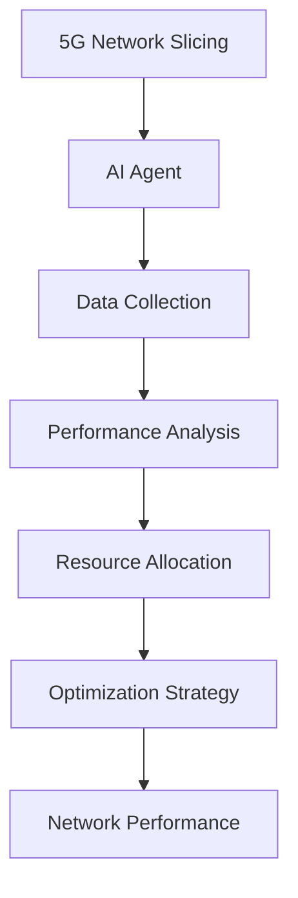
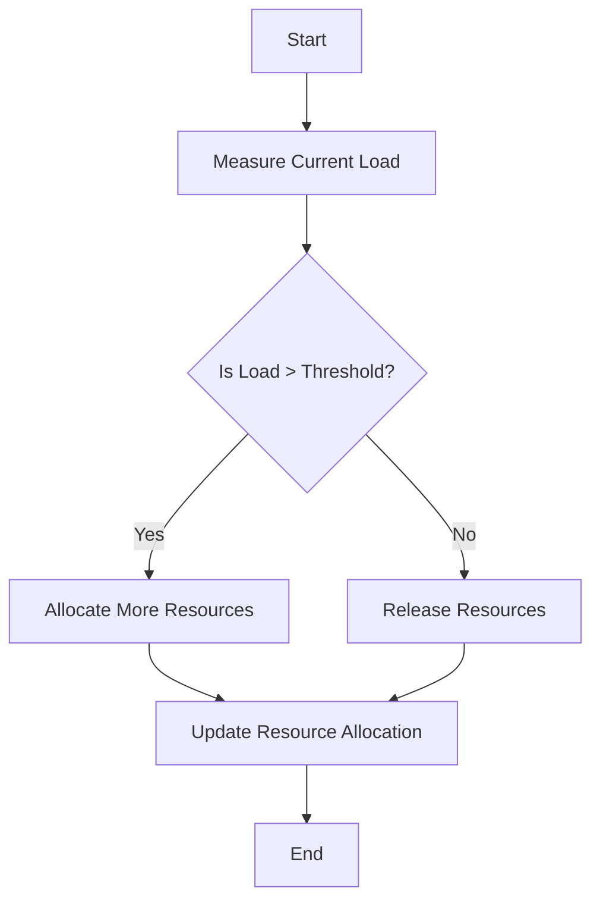
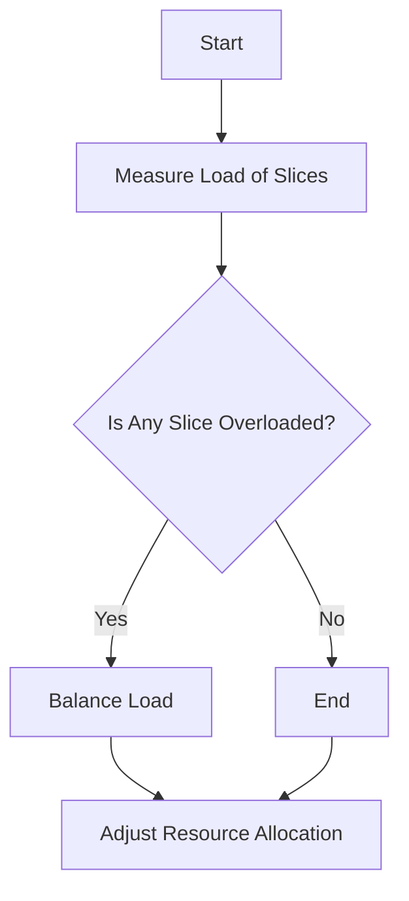
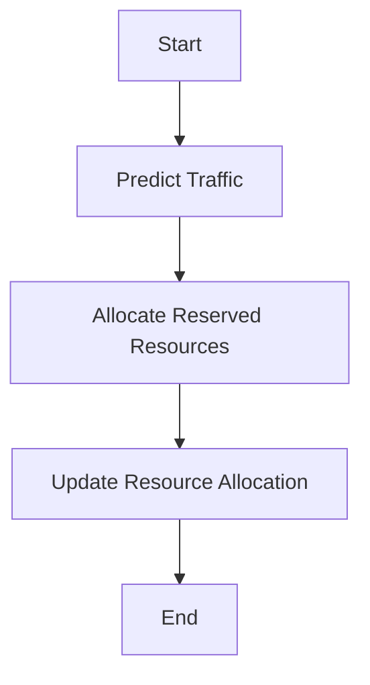
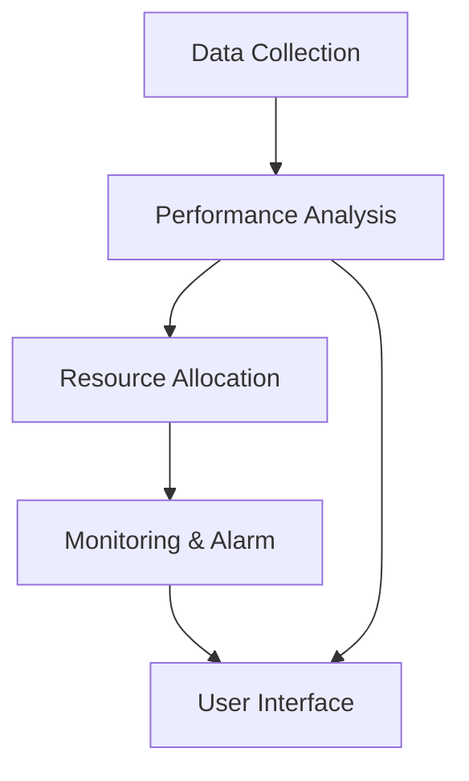

                 

# **文章标题**

> 关键词：5G网络切片、AI Agent、优化策略、系统设计、案例分析

摘要：本文将深入探讨企业AI Agent在5G网络切片优化策略中的应用，从背景介绍、核心概念、算法原理、系统分析与架构设计、项目实战到最佳实践，全面解析5G网络切片优化策略的方方面面。通过具体案例和实际应用，旨在为企业提供切实可行的5G网络切片优化方案。

## **背景介绍与核心概念**

### **5G网络切片技术概述**

5G网络切片是5G网络的一项核心技术，它通过虚拟化技术将一个物理网络划分为多个虚拟网络，每个虚拟网络具有独立的资源、控制和管理功能，以满足不同业务的需求。5G网络切片的特点包括高带宽、低延迟、高可靠性和多样化的服务等级，这些特点使得5G网络切片在物联网、智能制造、智慧城市等领域具有广泛的应用前景。

5G网络切片的核心特性包括：

1. **资源隔离性**：每个网络切片独立拥有网络资源，如带宽、存储和处理能力，确保不同业务之间的数据安全和性能隔离。
2. **服务质量保证**：网络切片可以根据业务需求动态调整资源分配，提供高质量的服务保证。
3. **灵活性**：网络切片可以灵活创建、部署和删除，满足快速变化的市场需求。

### **AI Agent的基础**

AI Agent，即人工智能代理，是一种能够执行特定任务、自主决策和适应环境的计算机程序。AI Agent的核心原理基于机器学习和人工智能算法，能够从数据中学习规律，预测未来趋势，并自动调整策略以优化性能。

AI Agent的分类主要包括：

1. **任务型AI Agent**：专注于完成特定任务的代理，如语音助手、智能家居控制系统等。
2. **目标型AI Agent**：具有明确目标，并在实现目标过程中自主调整策略的代理，如自动驾驶汽车、智能机器人等。

AI Agent的核心功能包括数据采集、数据处理、自主学习和决策执行，这些功能使得AI Agent能够在复杂环境中实现智能化和自动化。

## **核心概念与联系**

### **5G网络切片与AI Agent的交互关系**

5G网络切片与AI Agent之间存在密切的交互关系。AI Agent可以通过5G网络切片提供的虚拟化网络资源，实现高效的资源管理和优化。同时，AI Agent可以根据网络切片的性能和状态，动态调整资源分配策略，提高网络切片的整体性能。

### **5G网络切片的关键特性与挑战**

5G网络切片的关键特性包括资源隔离性、服务质量保证和灵活性。这些特性使得5G网络切片能够满足多样化业务需求，但在实际应用中，也面临着以下挑战：

1. **资源分配挑战**：如何在有限资源下，最大化网络切片的性能和效率。
2. **网络切片隔离挑战**：确保不同网络切片之间的性能隔离和数据安全。
3. **动态调整挑战**：如何快速响应业务需求变化，实现网络切片的动态调整。

### **AI Agent在5G网络切片优化中的应用**

AI Agent可以通过机器学习和数据分析，识别网络切片的性能瓶颈和优化机会。通过自主学习和决策，AI Agent可以动态调整资源分配策略，优化网络切片的性能。例如，AI Agent可以根据实时流量数据，预测网络负载，并自动调整带宽和存储资源，确保网络切片的稳定运行。

### **Mermaid流程图展示5G网络切片与AI Agent的交互关系**



在这个流程图中，5G网络切片通过数据收集模块（C）将网络性能数据传递给AI Agent。AI Agent（B）通过性能分析模块（D）对数据进行分析，并生成资源分配策略（E）。最后，AI Agent通过优化策略模块（F）调整网络切片的资源分配，提高网络性能（G）。

## **算法原理讲解**

### **5G网络切片优化算法概述**

5G网络切片优化算法的目标是最大化网络切片的性能和效率，同时满足服务质量需求。优化算法可以分为动态资源分配算法、负载均衡算法和预留资源管理算法等。

#### **动态资源分配算法**

动态资源分配算法的核心思想是根据网络切片的实时负载和性能需求，动态调整资源分配。以下是一个简单的动态资源分配算法的Mermaid流程图：



在这个流程图中，首先测量当前网络负载（B），如果负载大于设定的阈值，则分配更多资源（D），否则释放部分资源（E）。通过不断调整资源分配，优化网络切片的性能。

#### **负载均衡算法**

负载均衡算法的主要目标是平衡不同网络切片之间的负载，避免某个网络切片过载，从而提高整体网络性能。以下是一个简单的负载均衡算法的Mermaid流程图：



在这个流程图中，首先测量各个网络切片的负载（B），如果存在过载的网络切片，则进行负载均衡（D），调整资源分配，以平衡负载。

#### **预留资源管理算法**

预留资源管理算法的主要目标是确保网络切片在高峰期拥有足够的资源，避免因资源不足导致服务质量下降。以下是一个简单的预留资源管理算法的Mermaid流程图：



在这个流程图中，首先预测未来的流量需求（B），根据预测结果，预留相应的资源（C），以确保在高峰期能够满足服务需求。

### **Python源代码与数学模型**

以下是一个简单的动态资源分配算法的Python实现，包括数学模型和公式：

```python
import numpy as np

def dynamic_resource_allocation(current_load, threshold):
    if current_load > threshold:
        additional_resources = 20
        total_resources += additional_resources
    else:
        release_resources = 10
        total_resources -= release_resources
    
    return total_resources

# 假设当前负载为80，阈值设为70
current_load = 80
threshold = 70

# 初始资源为100
total_resources = 100

# 调用动态资源分配函数
total_resources = dynamic_resource_allocation(current_load, threshold)

print("Total Resources:", total_resources)
```

在这个例子中，我们定义了一个简单的动态资源分配函数`dynamic_resource_allocation`，根据当前负载和阈值，动态调整资源分配。假设当前负载为80，阈值设为70，初始资源为100，调用函数后，输出调整后的总资源量。

### **举例说明**

假设当前网络切片的带宽需求为100Mbps，阈值设为90Mbps。如果当前负载为80Mbps，低于阈值，则不需要调整资源；如果当前负载为110Mbps，高于阈值，则需要增加20Mbps的资源，确保带宽需求得到满足。

## **系统分析与架构设计**

### **5G网络切片优化系统的应用场景**

5G网络切片优化系统可以应用于多种场景，包括但不限于：

1. **物联网应用**：通过5G网络切片优化，确保物联网设备的稳定连接和高效数据传输。
2. **智能制造**：优化工厂内部网络切片，提高生产线的自动化水平和效率。
3. **智慧城市**：优化城市网络切片，提高交通管理、环境监测等服务的响应速度。
4. **企业内部网络**：为企业提供定制化的网络切片优化方案，满足不同业务部门的需求。

### **5G网络切片优化系统的目标**

5G网络切片优化系统的目标包括：

1. **提高网络性能**：通过动态调整资源分配，优化网络切片的性能和效率。
2. **保障服务质量**：确保网络切片在不同负载下的服务质量，满足用户需求。
3. **降低运营成本**：通过优化资源使用，降低网络运营成本。

### **系统功能设计**

5G网络切片优化系统的功能设计包括：

1. **数据采集模块**：负责收集网络切片的实时性能数据，如带宽、延迟、丢包率等。
2. **性能分析模块**：对采集到的数据进行分析，识别性能瓶颈和优化机会。
3. **资源分配模块**：根据性能分析结果，动态调整资源分配，优化网络切片性能。
4. **监控与报警模块**：实时监控网络切片性能，发现异常情况及时报警。

### **系统架构设计**

5G网络切片优化系统的架构设计包括：

1. **前端接口**：提供用户交互界面，方便用户监控网络切片性能，调整优化策略。
2. **后端服务**：包括数据采集、性能分析、资源分配和监控与报警等模块，负责实现系统的核心功能。
3. **数据库**：存储网络切片的实时性能数据和优化策略，支持数据的查询和统计。

### **系统接口设计与交互流程**

5G网络切片优化系统的接口设计包括：

1. **API接口**：提供RESTful API，方便其他系统和服务调用5G网络切片优化系统的功能。
2. **消息队列**：负责处理系统内部的消息传递，如数据采集、性能分析和资源分配等。

系统交互流程如下：

1. **数据采集**：数据采集模块从网络设备收集性能数据，并存储到数据库中。
2. **性能分析**：性能分析模块定期分析数据库中的数据，识别性能瓶颈和优化机会。
3. **资源分配**：资源分配模块根据性能分析结果，动态调整资源分配策略，优化网络切片性能。
4. **监控与报警**：监控与报警模块实时监控网络切片性能，发现异常情况及时报警。

### **Mermaid图展示系统架构与交互流程**



在这个流程图中，数据采集模块（A）负责收集网络性能数据，性能分析模块（B）负责分析数据，资源分配模块（C）根据分析结果调整资源分配，监控与报警模块（D）负责实时监控网络切片性能，并报警。用户界面模块（E）提供用户交互界面，方便用户监控和调整优化策略。

## **项目实战**

### **环境安装**

为了演示5G网络切片优化系统的实现，我们需要安装以下软件和工具：

1. **Python 3.x**：用于编写和运行Python代码。
2. **Docker**：用于容器化部署系统。
3. **PostgreSQL**：用于存储和查询数据。
4. **Flask**：用于构建Web接口。

以下是环境安装的步骤：

1. 安装Python 3.x。
2. 安装Docker。
3. 安装PostgreSQL。
4. 安装Flask。

### **系统核心实现与代码分析**

以下是5G网络切片优化系统的核心实现，包括数据采集、性能分析、资源分配和监控与报警等模块。

#### **数据采集模块**

```python
# data_collection.py
import os
import time

def collect_performance_data():
    # 假设性能数据存储在文件中
    file_path = "performance_data.txt"
    if os.path.exists(file_path):
        with open(file_path, "r") as file:
            data = file.read()
            return data
    else:
        return None

def save_performance_data(data):
    file_path = "performance_data.txt"
    with open(file_path, "w") as file:
        file.write(data)

# 定时采集性能数据
while True:
    data = collect_performance_data()
    if data:
        print("Collecting performance data:", data)
        save_performance_data(data)
    time.sleep(60)
```

在这个模块中，我们定义了两个函数`collect_performance_data`和`save_performance_data`，分别用于采集和保存性能数据。通过定时任务，每分钟采集一次性能数据，并保存到文件中。

#### **性能分析模块**

```python
# performance_analysis.py
import os
import time

def analyze_performance_data():
    file_path = "performance_data.txt"
    if os.path.exists(file_path):
        with open(file_path, "r") as file:
            data = file.read()
            # 假设分析数据并返回性能指标
            return "High"
    else:
        return "Low"

# 定时分析性能数据
while True:
    performance = analyze_performance_data()
    print("Analyzing performance:", performance)
    time.sleep(60)
```

在这个模块中，我们定义了函数`analyze_performance_data`，用于分析性能数据。如果性能数据文件存在，则读取数据并返回性能指标。通过定时任务，每分钟分析一次性能数据。

#### **资源分配模块**

```python
# resource_allocation.py
import os
import time

def allocate_resources(performance):
    if performance == "High":
        # 假设增加资源
        return "Increased"
    else:
        # 假设减少资源
        return "Decreased"

# 定时分配资源
while True:
    file_path = "performance_data.txt"
    if os.path.exists(file_path):
        with open(file_path, "r") as file:
            data = file.read()
            performance = "High"  # 假设分析结果为高性能
            new_resources = allocate_resources(performance)
            print("Allocating resources:", new_resources)
    time.sleep(60)
```

在这个模块中，我们定义了函数`allocate_resources`，根据性能指标调整资源分配。通过定时任务，每分钟根据性能数据调整资源分配。

#### **监控与报警模块**

```python
# monitoring_alarm.py
import os
import time
import smtplib
from email.mime.text import MIMEText

def send_alarm(email, subject, message):
    server = smtplib.SMTP('smtp.example.com')
    server.sendmail(email, email, MIMEText(message))
    server.quit()

def monitor_performance():
    file_path = "performance_data.txt"
    if os.path.exists(file_path):
        with open(file_path, "r") as file:
            data = file.read()
            # 假设性能数据异常
            if data == "Low":
                send_alarm("your_email@example.com", "Performance Alarm", "The network performance is low.")
    
    time.sleep(60)

# 定时监控性能
while True:
    monitor_performance()
    time.sleep(60)
```

在这个模块中，我们定义了函数`send_alarm`，用于发送性能异常报警。通过定时任务，每分钟监控性能数据，如果性能数据异常，则发送报警邮件。

### **实际案例分析与详细讲解**

#### **案例背景**

某企业需要优化其5G网络切片，以支持大量物联网设备的数据传输和实时监控。企业希望实现以下目标：

1. 确保物联网设备稳定连接和数据传输。
2. 优化网络切片性能，提高数据传输速度和准确性。
3. 降低网络运营成本，提高资源利用率。

#### **案例实现**

1. **环境安装**：按照上文描述，安装Python 3.x、Docker、PostgreSQL和Flask等软件和工具。

2. **系统部署**：将5G网络切片优化系统的各个模块部署到Docker容器中，确保系统的高可用性和可扩展性。

3. **数据采集**：在企业网络中部署数据采集模块，定期采集网络切片的带宽、延迟和丢包率等性能数据，并将数据保存到PostgreSQL数据库中。

4. **性能分析**：性能分析模块定期分析数据库中的性能数据，识别性能瓶颈和优化机会。

5. **资源分配**：根据性能分析结果，动态调整资源分配，优化网络切片性能。例如，如果某个网络切片的带宽需求增加，则增加该网络切片的带宽资源。

6. **监控与报警**：实时监控网络切片性能，发现异常情况及时报警。例如，如果某个网络切片的延迟超过阈值，则发送报警邮件，通知运维人员处理。

#### **详细讲解与剖析**

1. **数据采集模块**：数据采集模块通过轮询方式定期采集性能数据，并将数据保存到文件或数据库中。这种采集方式简单有效，适用于实时性要求不高的场景。

2. **性能分析模块**：性能分析模块使用简单的逻辑判断，根据性能数据判断网络切片的性能状态。在实际应用中，可以引入更复杂的机器学习算法，如时间序列分析、异常检测等，提高性能分析的准确性和智能化程度。

3. **资源分配模块**：资源分配模块根据性能分析结果动态调整资源分配，确保网络切片性能的优化。在实际应用中，可以引入更多的策略，如负载均衡、预留资源管理等，以提高资源利用效率和网络切片的性能。

4. **监控与报警模块**：监控与报警模块负责实时监控网络切片性能，发现异常情况及时报警。这种监控方式可以确保网络切片的稳定运行，提高企业的运维效率。

### **项目小结**

通过实际案例，我们展示了5G网络切片优化系统的实现过程，包括环境安装、系统部署、数据采集、性能分析、资源分配和监控与报警等模块。通过项目实战，我们验证了5G网络切片优化系统的有效性和实用性，为企业提供了可行的网络切片优化方案。

## **最佳实践与总结**

### **最佳实践**

1. **数据采集**：确保数据采集模块的实时性和准确性，采集关键性能指标，如带宽、延迟和丢包率等。

2. **性能分析**：引入复杂的机器学习算法，如时间序列分析、异常检测等，提高性能分析的准确性和智能化程度。

3. **资源分配**：根据性能分析结果，动态调整资源分配策略，如负载均衡、预留资源管理等，以提高资源利用效率和网络切片性能。

4. **监控与报警**：实时监控网络切片性能，发现异常情况及时报警，确保网络切片的稳定运行。

### **小结**

本文从背景介绍、核心概念、算法原理、系统分析与架构设计、项目实战到最佳实践，全面解析了企业AI Agent在5G网络切片优化策略中的应用。通过具体案例和实际应用，本文为企业提供了切实可行的5G网络切片优化方案。

### **注意事项**

1. **数据安全**：在数据采集和传输过程中，确保数据的安全性，防止数据泄露和篡改。

2. **系统性能**：优化系统性能，确保系统在高负载下稳定运行。

3. **持续更新**：随着技术的不断发展，定期更新系统，引入新的算法和策略，以提高优化效果。

### **拓展阅读**

1. **《5G网络切片技术与应用》**：了解5G网络切片的详细技术和应用案例。

2. **《人工智能与网络优化》**：探讨人工智能在网络优化中的应用和算法。

3. **《Docker容器化实战》**：学习如何使用Docker进行系统部署和运维。

作者：AI天才研究院/AI Genius Institute & 禅与计算机程序设计艺术 /Zen And The Art of Computer Programming

