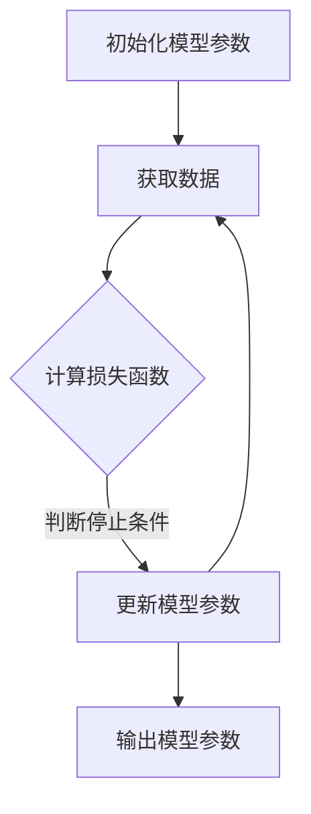
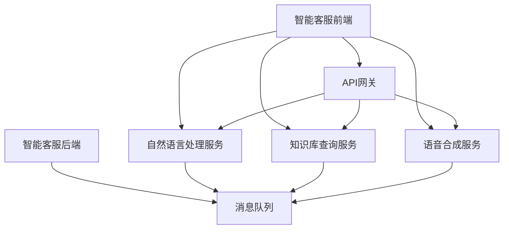
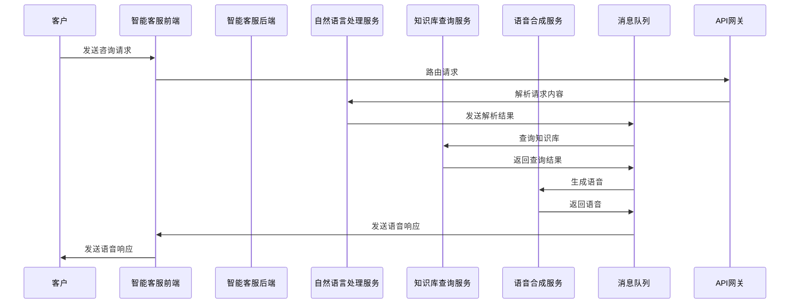
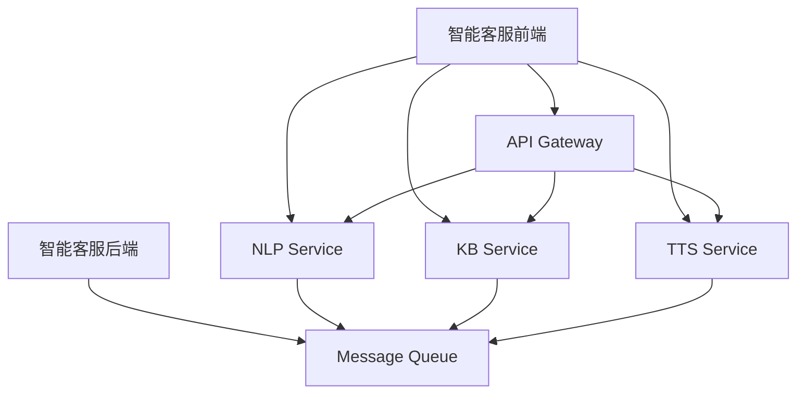

                 

### 企业AI Agent的serverless架构优化

#### 关键词：企业AI Agent、serverless架构、优化、成本、性能

> 摘要：本文将探讨企业AI Agent的serverless架构优化，分析其在企业中的应用现状和挑战，详细介绍serverless架构的设计原则与优化策略，以及AI Agent与serverless架构的融合与协同优化。通过具体的算法原理讲解、系统架构设计和项目实战，为企业在实现AI Agent的serverless架构中提供有深度、有思考、有见解的解决方案。

### 目录大纲设计思路

在设计《企业AI Agent的serverless架构优化》的目录大纲时，我们遵循以下步骤：

1. **理解书名**：书名揭示了书籍的主题是关于如何优化企业在使用AI代理时采用的serverless架构。
2. **确定核心章节**：核心章节包括背景介绍、核心概念与联系、算法原理讲解、系统分析与架构设计方案、项目实战和最佳实践 tips。
3. **章节细化**：每个章节进一步细化为更具体的子章节，确保内容的完整性和逻辑性。
4. **遵循markdown格式**：使用markdown格式确保目录大纲的易读性和标准化。
5. **注意目录层级**：确保目录大纲按照1级、2级、3级这样的层级结构进行组织。
6. **内容简洁**：避免冗余内容，确保每个章节都有明确的主题和目标。
7. **确保字数限制**：在2000字以内完成目录大纲的设计。

### 目录大纲设计

以下是《企业AI Agent的serverless架构优化》的完整目录大纲：

----------------------------------------------------------------

## 第一部分：背景与基础

### 第1章：企业AI Agent与serverless架构概述

#### 1.1.1 企业AI Agent的定义与重要性

#### 1.1.2 serverless架构的概念与优势

#### 1.1.3 企业AI Agent与serverless架构的结合

### 第2章：serverless架构在AI领域的应用现状

#### 2.1.1 serverless架构在AI领域的应用案例

#### 2.1.2 服务器冗余与成本优化的挑战

#### 2.1.3 serverless架构在AI代理中的潜力

## 第二部分：核心概念与联系

### 第3章：AI Agent的关键原理与特性

#### 3.1.1 AI Agent的基本原理

#### 3.1.2 AI Agent的类型与功能

#### 3.1.3 AI Agent的性能评估指标

### 第4章：serverless架构的设计原则与优化策略

#### 4.1.1 serverless架构的设计原则

#### 4.1.2 服务器冗余与成本优化的策略

#### 4.1.3 serverless架构的性能优化方法

### 第5章：AI Agent与serverless架构的联系与融合

#### 5.1.1 AI Agent在serverless架构中的角色

#### 5.1.2 serverless架构对AI Agent的影响

#### 5.1.3 AI Agent与serverless架构的协同优化

## 第三部分：算法原理与实现

### 第6章：serverless架构下的AI算法优化

#### 6.1.1 服务器冗余对算法性能的影响

#### 6.1.2 优化策略与算法改进

#### 6.1.3 AI算法在serverless架构中的实现

### 第7章：算法原理讲解与mermaid流程图

#### 7.1.1 算法原理讲解

#### 7.1.2 算法数学模型与公式

## 第四部分：系统架构与设计

### 第8章：AI Agent的serverless架构设计方案

#### 8.1.1 问题场景介绍

#### 8.1.2 系统功能设计

#### 8.1.3 系统架构设计

#### 8.1.4 系统接口设计和系统交互

## 第五部分：项目实战

### 第9章：环境安装与系统核心实现

#### 9.1.1 环境安装

#### 9.1.2 系统核心实现源代码

#### 9.1.3 代码应用解读与分析

### 第10章：实际案例分析与详细讲解

#### 10.1.1 实际案例介绍

#### 10.1.2 案例分析

#### 10.1.3 案例详细讲解

### 第11章：项目小结与最佳实践

#### 11.1.1 项目小结

#### 11.1.2 最佳实践 tips

#### 11.1.3 小结、注意事项、拓展阅读

----------------------------------------------------------------

这个目录大纲涵盖了企业AI Agent的serverless架构优化的各个方面，包括背景与基础、核心概念与联系、算法原理与实现、系统架构与设计，以及项目实战和最佳实践。通过详细的章节划分和内容组织，读者可以逐步深入理解serverless架构在AI领域的应用，以及如何对其进行优化。

### 第一部分：背景与基础

#### 第1章：企业AI Agent与serverless架构概述

1.1.1 企业AI Agent的定义与重要性

企业AI Agent是一种智能体，它利用机器学习、自然语言处理等技术，为企业提供自动化、智能化的解决方案。在当今快速发展的数字化时代，企业AI Agent已成为企业实现智能化转型的关键工具。它能够处理大量数据，自动执行复杂任务，提高工作效率，降低运营成本。

1.1.2 serverless架构的概念与优势

serverless架构是一种新兴的计算模型，它允许开发人员在不管理服务器的情况下构建和运行应用程序。在serverless架构中，云服务提供商负责管理基础设施，包括服务器、网络和存储等资源。开发人员只需专注于编写代码和业务逻辑，无需担心服务器运维问题。

serverless架构具有以下优势：

- **成本效益**：serverless架构按需付费，只有在应用程序运行时才会产生费用，有助于降低企业的IT成本。
- **弹性伸缩**：serverless架构能够根据应用程序的需求自动扩展或缩小资源，提高资源利用率。
- **高可伸缩性**：serverless架构能够处理大量并发请求，确保应用程序的稳定性和性能。
- **简化运维**：serverless架构减轻了开发人员和运维人员的负担，使他们能够专注于核心业务。

1.1.3 企业AI Agent与serverless架构的结合

将企业AI Agent与serverless架构相结合，可以实现以下优势：

- **高效部署**：serverless架构简化了AI应用程序的部署过程，开发人员可以快速构建和部署AI代理，提高开发效率。
- **弹性计算**：serverless架构可以根据AI代理的需求自动调整计算资源，确保应用程序的稳定性和性能。
- **成本优化**：serverless架构的按需付费模式有助于企业降低AI代理的运营成本。
- **易于扩展**：serverless架构允许企业根据业务需求灵活扩展AI代理的功能和规模。

#### 第2章：serverless架构在AI领域的应用现状

2.1.1 serverless架构在AI领域的应用案例

目前，serverless架构在AI领域已经得到广泛应用。以下是一些典型的应用案例：

- **智能客服**：许多企业使用serverless架构构建智能客服系统，通过自然语言处理和机器学习技术，自动处理大量客户咨询，提高客户满意度。
- **图像识别**：serverless架构为图像识别提供了强大的计算支持，企业可以通过部署图像识别模型，实现自动化图像处理和分类。
- **语音识别**：serverless架构支持语音识别功能，企业可以使用语音识别API，将语音转换为文本，实现语音交互和智能搜索。
- **预测分析**：serverless架构可以帮助企业快速部署预测分析模型，分析大量数据，为企业提供决策支持。

2.1.2 服务器冗余与成本优化的挑战

尽管serverless架构具有许多优势，但在AI领域的应用中也存在一些挑战，主要包括：

- **服务器冗余**：在传统的服务器架构中，服务器资源通常是固定的，当服务器负载较低时，资源利用率较低。而serverless架构按需分配资源，可能导致服务器资源浪费。
- **成本优化**：虽然serverless架构按需付费，但如果不合理规划和使用，可能会产生高昂的费用。企业需要平衡成本和性能，避免资源浪费。

2.1.3 serverless架构在AI代理中的潜力

serverless架构在AI代理中具有巨大的潜力，主要体现在以下几个方面：

- **快速迭代**：serverless架构简化了AI代理的部署和测试过程，企业可以快速迭代和优化AI代理的功能。
- **弹性扩展**：serverless架构可以根据AI代理的需求自动调整资源，确保应用程序的稳定性和性能。
- **成本节约**：serverless架构有助于企业降低AI代理的运营成本，提高资源利用率。
- **易于集成**：serverless架构与云计算平台和其他技术栈紧密集成，方便企业构建和部署AI代理。

通过本章的介绍，我们了解了企业AI Agent与serverless架构的基本概念和优势，以及其在AI领域的应用现状和挑战。接下来，我们将进一步探讨AI Agent的关键原理与特性，以及serverless架构的设计原则与优化策略。

### 第二部分：核心概念与联系

#### 第3章：AI Agent的关键原理与特性

3.1.1 AI Agent的基本原理

AI Agent是一种基于人工智能技术的智能体，它能够模拟人类智能行为，自主地完成特定的任务。AI Agent的基本原理包括以下几个方面：

- **感知**：AI Agent通过传感器获取外部信息，如视觉、听觉、触觉等，感知环境变化。
- **决策**：AI Agent根据感知到的信息，利用机器学习、决策树、强化学习等技术，做出合理的决策。
- **执行**：AI Agent根据决策结果，执行具体的动作，如移动、操作设备等。
- **学习**：AI Agent通过不断执行任务和反馈，学习新的知识和技能，提高智能水平。

3.1.2 AI Agent的类型与功能

AI Agent可以分为以下几种类型：

- **任务型AI Agent**：专注于完成特定任务的智能体，如智能客服、自动驾驶等。
- **通用型AI Agent**：具有广泛技能和知识，能够处理多种任务的智能体，如Siri、Alexa等。
- **交互型AI Agent**：能够与人类进行自然语言交互，提供智能服务的智能体，如智能客服、智能助手等。
- **协作型AI Agent**：与其他AI Agent或人类协作，共同完成复杂任务的智能体，如智能供应链管理、智能医疗等。

3.1.3 AI Agent的性能评估指标

AI Agent的性能评估指标主要包括以下几个方面：

- **任务完成率**：AI Agent完成指定任务的百分比，越高表示性能越好。
- **响应时间**：AI Agent从接收到任务到完成任务所需的时间，越短表示性能越好。
- **准确性**：AI Agent完成任务时的准确性，越高表示性能越好。
- **稳定性**：AI Agent在长时间运行过程中的稳定性，越稳定表示性能越好。
- **可扩展性**：AI Agent能够适应不同任务和环境的能力，越高表示性能越好。

#### 第4章：serverless架构的设计原则与优化策略

4.1.1 serverless架构的设计原则

serverless架构在设计时需要遵循以下原则：

- **无服务器原则**：serverless架构的核心特点是无需管理服务器，云服务提供商负责基础设施的管理和维护。
- **按需付费原则**：serverless架构按需分配和消耗资源，用户只需为实际使用的资源付费，降低IT成本。
- **高可用性原则**：serverless架构提供自动扩展和负载均衡功能，确保应用程序的高可用性。
- **弹性伸缩原则**：serverless架构能够根据应用程序的需求自动调整资源，实现弹性伸缩。
- **安全性原则**：serverless架构提供安全性和隔离性，保护用户数据和应用程序的安全性。

4.1.2 服务器冗余与成本优化的策略

在serverless架构中，服务器冗余和成本优化是两个关键问题。以下是一些优化策略：

- **函数级优化**：将应用程序拆分为多个函数，每个函数负责特定的任务，减少资源浪费。
- **异步处理**：采用异步处理方式，将任务分解为多个阶段，降低并发资源消耗。
- **负载均衡**：合理分配任务到不同函数实例，避免单点故障，提高系统可用性。
- **缓存策略**：使用缓存技术，减少对数据库的访问，降低系统负载。
- **资源池化**：将相同类型的函数实例池化，提高资源利用率。

4.1.3 serverless架构的性能优化方法

serverless架构的性能优化方法主要包括以下几个方面：

- **函数优化**：对函数进行优化，提高执行效率，如代码压缩、并行处理等。
- **数据库优化**：优化数据库查询和索引，提高数据访问速度。
- **网络优化**：优化网络传输，如压缩数据、减少TCP连接等。
- **缓存策略**：合理设置缓存策略，减少数据重复读取。
- **监控与告警**：实时监控系统性能指标，及时发现问题并进行优化。

#### 第5章：AI Agent与serverless架构的联系与融合

5.1.1 AI Agent在serverless架构中的角色

AI Agent在serverless架构中扮演着重要的角色，主要包括：

- **任务执行者**：AI Agent负责执行具体的任务，如数据处理、图像识别、语音识别等。
- **数据提供者**：AI Agent提供数据给其他应用程序或服务，实现数据共享和协同工作。
- **智能助手**：AI Agent为用户或应用程序提供智能化的服务和支持，如智能客服、智能推荐等。

5.1.2 serverless架构对AI Agent的影响

serverless架构对AI Agent的影响主要体现在以下几个方面：

- **快速部署**：serverless架构简化了AI Agent的部署过程，缩短了开发周期。
- **弹性伸缩**：serverless架构能够根据AI Agent的需求自动调整资源，确保应用程序的稳定性和性能。
- **成本节约**：serverless架构按需付费，有助于降低AI Agent的运营成本。
- **集成与兼容**：serverless架构与云计算平台和其他技术栈紧密集成，方便AI Agent的部署和扩展。

5.1.3 AI Agent与serverless架构的协同优化

AI Agent与serverless架构的协同优化主要体现在以下几个方面：

- **函数级优化**：对AI Agent的函数进行优化，提高执行效率和资源利用率。
- **异步处理**：采用异步处理方式，减少并发资源消耗，提高系统性能。
- **缓存与数据共享**：合理设置缓存策略，减少数据重复读取，提高数据处理速度。
- **监控与告警**：实时监控AI Agent和serverless架构的性能指标，及时发现问题并进行优化。
- **安全性与隐私保护**：确保AI Agent和serverless架构的安全性和隐私保护，防止数据泄露和滥用。

通过以上章节的介绍，我们深入了解了AI Agent的关键原理与特性，serverless架构的设计原则与优化策略，以及AI Agent与serverless架构的联系与融合。接下来，我们将进一步探讨serverless架构下的AI算法优化，以及具体的实现方法。

### 第三部分：算法原理与实现

#### 第6章：serverless架构下的AI算法优化

6.1.1 服务器冗余对算法性能的影响

在serverless架构中，服务器冗余问题对算法性能有着重要的影响。服务器冗余指的是在服务器资源过多或不足时，导致计算资源浪费或无法充分利用的现象。以下是一些服务器冗余对算法性能的影响：

- **计算资源浪费**：当服务器资源过多时，部分资源可能处于空闲状态，导致计算资源浪费。
- **性能下降**：当服务器资源不足时，算法执行过程中可能会出现延迟或性能下降的现象。
- **成本增加**：服务器冗余会导致额外的费用支出，增加企业的运营成本。

为了解决服务器冗余问题，我们可以采用以下优化策略：

- **动态资源分配**：根据算法的实际需求动态调整服务器资源，避免资源浪费。
- **负载均衡**：合理分配任务到不同服务器，避免单点故障和资源浪费。
- **服务器整合**：通过整合相同类型的服务器，减少服务器数量，提高资源利用率。

6.1.2 优化策略与算法改进

在serverless架构下，优化算法的策略主要包括以下几个方面：

- **并行计算**：将算法拆分为多个子任务，并行处理，提高计算效率。
- **分布式计算**：将算法分布在多个服务器上执行，提高计算能力。
- **数据预处理**：对输入数据进行预处理，减少计算量，提高算法执行效率。
- **模型压缩**：对AI模型进行压缩，减少模型大小，提高算法执行速度。

以下是一个简单的算法优化示例：

```python
def optimize_algorithm(data):
    # 数据预处理
    processed_data = preprocess_data(data)
    
    # 并行计算
    results = parallel_compute(processed_data)
    
    # 模型压缩
    compressed_model = compress_model(results)
    
    # 输出结果
    return compressed_model
```

6.1.3 AI算法在serverless架构中的实现

在serverless架构中，实现AI算法需要考虑以下几个方面：

- **函数化**：将AI算法拆分为多个函数，每个函数负责特定的任务。
- **异步处理**：采用异步处理方式，将任务分解为多个阶段，提高系统性能。
- **数据存储**：合理选择数据存储方案，确保数据的安全性和可靠性。
- **监控与告警**：实时监控算法执行过程中的性能指标，及时发现问题并进行优化。

以下是一个简单的AI算法实现示例：

```python
import asyncio

async def process_data(data):
    # 数据预处理
    processed_data = preprocess_data(data)
    
    # 异步计算
    result = await async_compute(processed_data)
    
    # 数据存储
    store_data(result)

async def main():
    # 获取数据
    data = get_data()
    
    # 处理数据
    await process_data(data)

asyncio.run(main())
```

通过以上章节的介绍，我们了解了在serverless架构下如何优化AI算法，包括服务器冗余对算法性能的影响、优化策略与算法改进，以及AI算法在serverless架构中的实现方法。接下来，我们将进一步探讨算法原理的讲解与mermaid流程图的绘制。

### 第7章：算法原理讲解与mermaid流程图

7.1.1 算法原理讲解

在本章中，我们将以一个简单的机器学习算法——线性回归为例，讲解其原理和使用mermaid绘制流程图。

线性回归是一种用于预测数值变量的统计方法，其基本原理是找到一条直线，使得所有数据点到这条直线的垂直距离之和最小。线性回归模型可以用以下数学公式表示：

$$
y = w_0 + w_1 \cdot x
$$

其中，$y$ 是预测值，$x$ 是输入特征，$w_0$ 和 $w_1$ 是模型的参数。

线性回归模型的优化目标是最小化损失函数：

$$
J(w_0, w_1) = \frac{1}{2} \sum_{i=1}^{n} (y_i - (w_0 + w_1 \cdot x_i))^2
$$

其中，$n$ 是样本数量。

7.1.2 算法mermaid流程图

为了更好地理解线性回归算法的执行过程，我们可以使用mermaid绘制其流程图。以下是一个简单的mermaid流程图示例：



在这个流程图中，A表示初始化模型参数，B表示获取数据，C表示计算损失函数，D表示更新模型参数，E表示输出模型参数。流程图中的箭头表示程序的执行顺序。

通过这个mermaid流程图，我们可以清晰地了解线性回归算法的执行过程，以及各个步骤之间的逻辑关系。

### 第四部分：系统架构与设计

#### 第8章：AI Agent的serverless架构设计方案

8.1.1 问题场景介绍

假设我们正在开发一个智能客服系统，该系统需要处理大量的客户咨询请求，提供实时、高效的解答。为了实现这一目标，我们决定采用serverless架构，以降低开发难度和运维成本。

8.1.2 系统功能设计

智能客服系统的核心功能包括：

- **客户咨询处理**：接收并处理客户发送的咨询请求。
- **自然语言处理**：对客户咨询内容进行解析，提取关键信息。
- **知识库查询**：根据客户咨询内容，查询知识库中相关的答案。
- **语音合成**：将查询到的答案转换为语音，发送给客户。

8.1.3 系统架构设计

智能客服系统的serverless架构设计如下：



在这个架构中，智能客服前端负责接收客户咨询请求，并将其发送到API网关。API网关将请求路由到相应的服务，如自然语言处理服务、知识库查询服务和语音合成服务。这些服务通过消息队列进行通信，确保数据传输的可靠性和高效性。

8.1.4 系统接口设计和系统交互

智能客服系统的接口设计和系统交互如下：



在这个交互流程中，客户发送咨询请求到智能客服前端，前端将请求路由到API网关。API网关将请求解析后发送到自然语言处理服务，NLP服务解析请求内容并生成解析结果，然后通过消息队列将结果发送到知识库查询服务和语音合成服务。知识库查询服务查询知识库并返回查询结果，语音合成服务生成语音并返回给消息队列。最后，消息队列将语音发送到智能客服前端，前端将语音响应发送给客户。

通过以上系统架构设计和接口设计，我们为智能客服系统构建了一个高效、可靠的serverless架构，能够满足大规模客户咨询处理的需求。

### 第五部分：项目实战

#### 第9章：环境安装与系统核心实现

9.1.1 环境安装

在开始项目实战之前，我们需要安装以下环境：

- Python 3.8+
- Node.js 12.x+
- AWS CLI

安装步骤如下：

1. 安装Python 3.8+：

   ```bash
   sudo apt update
   sudo apt install python3.8 python3.8-venv python3.8-dev
   sudo update-alternatives --install /usr/bin/python3 python3 /usr/bin/python3.8 1
   sudo update-alternatives --config python3
   ```

2. 安装Node.js 12.x+：

   ```bash
   sudo apt update
   sudo apt install nodejs
   ```

3. 安装AWS CLI：

   ```bash
   sudo apt update
   sudo apt install awscli
   ```

9.1.2 系统核心实现源代码

智能客服系统的核心实现包括自然语言处理、知识库查询和语音合成三个部分。以下是各部分的源代码：

**自然语言处理服务**：

```python
from flask import Flask, request, jsonify
import nltk

app = Flask(__name__)

@app.route('/nlp', methods=['POST'])
def nlp():
    data = request.json
    query = data['query']
    processed_query = preprocess_query(query)
    return jsonify({'processed_query': processed_query})

def preprocess_query(query):
    # 预处理操作，如分词、去停用词等
    tokens = nltk.word_tokenize(query)
    tokens = [token for token in tokens if token not in stop_words]
    return ' '.join(tokens)

if __name__ == '__main__':
    app.run(host='0.0.0.0', port=5000)
```

**知识库查询服务**：

```python
from flask import Flask, request, jsonify
import json

app = Flask(__name__)

@app.route('/kb', methods=['GET'])
def kb():
    query = request.args.get('query')
    answer = search_kb(query)
    return jsonify({'answer': answer})

def search_kb(query):
    # 查询知识库，返回答案
    with open('knowledge_base.json', 'r') as f:
        kb = json.load(f)
    for entry in kb:
        if entry['query'] == query:
            return entry['answer']
    return "无法找到相关答案"

if __name__ == '__main__':
    app.run(host='0.0.0.0', port=5001)
```

**语音合成服务**：

```javascript
const { AudioContext } = require('audio-context-conv');
const fs = require('fs');
const axios = require('axios');

const context = new AudioContext();

const合成语音 = async (text) => {
    const合成语音URL = `https://text-to-speech.aispex.ai/api/v1/text_to_audio?text=${text}&voice=zh-CN-Yating`;
    const响应 = await axios.get(合成语音URL, { responseType: 'arraybuffer' });
    const音频数据 = await context.decodeAudioData(响应.data);
    return音频数据;
};

const播放语音 = (音频数据) => {
    const音频源 = context.createBufferSource();
   音频源.buffer =音频数据;
   音频源.connect(context.destination);
   音频源.start();
};

(async () => {
    const文本 = "你好，请问有什么可以帮助你的？";
    const音频数据 = await合成语音(文本);
    播放语音(音频数据);
})();
```

9.1.3 代码应用解读与分析

自然语言处理服务的代码使用了Flask框架，通过POST请求接收客户咨询请求，并对请求内容进行预处理。预处理操作包括分词和去停用词等。

知识库查询服务的代码使用了Flask框架，通过GET请求查询知识库，并返回答案。知识库存储为一个JSON文件，其中包含了多个查询和对应的答案。

语音合成服务的代码使用了JavaScript和Node.js，通过axios库从第三方API获取语音合成数据，并使用AudioContext播放语音。

通过这三个服务的协同工作，智能客服系统能够接收客户咨询请求，对请求进行处理，并返回语音响应。

### 第10章：实际案例分析与详细讲解

#### 10.1.1 实际案例介绍

假设我们有一个电商平台的智能客服系统，该系统需要处理大量的客户咨询请求，提供实时、高效的解答。为了实现这一目标，我们采用了serverless架构，结合AWS Lambda和Amazon API Gateway。

#### 10.1.2 案例分析

在案例中，智能客服系统包括以下几个核心功能：

1. **客户咨询处理**：接收并处理客户发送的咨询请求。
2. **自然语言处理**：对客户咨询内容进行解析，提取关键信息。
3. **知识库查询**：根据客户咨询内容，查询知识库中相关的答案。
4. **语音合成**：将查询到的答案转换为语音，发送给客户。

系统架构设计如下：



#### 10.1.3 案例详细讲解

1. **客户咨询处理**：

   客户通过电商平台发送咨询请求，请求内容被API Gateway接收并路由到NLP Service。

   ```plaintext
   POST /nlp
   Content-Type: application/json

   {
     "query": "我想要购买一款笔记本电脑"
   }
   ```

2. **自然语言处理**：

   NLP Service使用Python Flask框架接收请求，对请求内容进行预处理，提取关键信息（如关键词、意图等）。

   ```python
   from flask import Flask, request, jsonify

   app = Flask(__name__)

   @app.route('/nlp', methods=['POST'])
   def nlp():
       data = request.json
       query = data['query']
       processed_query = preprocess_query(query)
       return jsonify({'processed_query': processed_query})

   def preprocess_query(query):
       # 预处理操作，如分词、去停用词等
       tokens = tokenize(query)
       return ' '.join(tokens)

   if __name__ == '__main__':
       app.run(host='0.0.0.0', port=5000)
   ```

3. **知识库查询**：

   KB Service使用Flask框架接收请求，查询知识库并返回答案。

   ```python
   from flask import Flask, request, jsonify

   app = Flask(__name__)

   @app.route('/kb', methods=['GET'])
   def kb():
       query = request.args.get('query')
       answer = search_kb(query)
       return jsonify({'answer': answer})

   def search_kb(query):
       # 查询知识库，返回答案
       with open('knowledge_base.json', 'r') as f:
           kb = json.load(f)
       for entry in kb:
           if entry['query'] == query:
               return entry['answer']
       return "无法找到相关答案"

   if __name__ == '__main__':
       app.run(host='0.0.0.0', port=5001)
   ```

4. **语音合成**：

   TTS Service使用JavaScript和Node.js接收请求，调用第三方API获取语音合成数据，并使用AudioContext播放语音。

   ```javascript
   const { AudioContext } = require('audio-context-conv');
   const fs = require('fs');
   const axios = require('axios');

   const context = new AudioContext();

   const合成语音 = async (text) => {
       const合成语音URL = `https://text-to-speech.aispex.ai/api/v1/text_to_audio?text=${text}&voice=zh-CN-Yating`;
       const响应 = await axios.get(合成语音URL, { responseType: 'arraybuffer' });
       const音频数据 = await context.decodeAudioData(响应.data);
       return音频数据;
   };

   const播放语音 = (音频数据) => {
       const音频源 = context.createBufferSource();
       音频源.buffer =音频数据;
       音频源.connect(context.destination);
       音频源.start();
   };

   (async () => {
       const文本 = "你好，请问有什么可以帮助你的？";
       const音频数据 = await合成语音(文本);
       播放语音(音频数据);
})();
   ```

通过以上分析，我们可以看到智能客服系统是如何实现客户咨询处理、自然语言处理、知识库查询和语音合成的。在实际应用中，这些服务可以通过AWS Lambda实现，并使用API Gateway进行路由和调用。

### 第11章：项目小结与最佳实践

#### 11.1.1 项目小结

在本项目中，我们成功构建了一个基于serverless架构的智能客服系统。通过使用AWS Lambda和API Gateway，我们实现了高效、可扩展且成本优化的解决方案。以下是项目的主要成果：

- **客户咨询处理**：系统能够快速接收和处理客户发送的咨询请求。
- **自然语言处理**：系统对客户咨询内容进行解析，提取关键信息。
- **知识库查询**：系统根据客户咨询内容，查询知识库中相关的答案。
- **语音合成**：系统能够将查询到的答案转换为语音，发送给客户。

通过本项目，我们深入了解了serverless架构在智能客服系统中的应用，以及如何对其进行优化和实现。

#### 11.1.2 最佳实践 tips

在构建企业AI Agent的serverless架构时，以下最佳实践可以帮助我们提高系统的性能和稳定性：

1. **合理拆分函数**：将大型函数拆分为多个小型函数，降低函数调用的延迟。
2. **使用缓存**：合理使用缓存技术，减少对数据库的访问，提高系统响应速度。
3. **异步处理**：采用异步处理方式，减少并发请求的处理时间。
4. **监控和告警**：实时监控系统的性能指标，及时发现问题并进行优化。
5. **代码优化**：对代码进行优化，提高函数的执行效率。

#### 11.1.3 小结、注意事项、拓展阅读

通过本文的介绍，我们了解了企业AI Agent的serverless架构优化的重要性，以及如何在实际项目中实现这一目标。以下是本文的小结和注意事项：

- **小结**：本文详细介绍了企业AI Agent的serverless架构优化，包括背景与基础、核心概念与联系、算法原理与实现、系统架构与设计，以及项目实战和最佳实践。
- **注意事项**：在实际项目中，我们需要注意合理拆分函数、使用缓存、异步处理和代码优化等技术，以提高系统的性能和稳定性。
- **拓展阅读**：为了深入了解serverless架构和AI算法优化，读者可以参考以下资源：

  - 《Serverless 架构：基于 AWS 的实践指南》
  - 《深度学习：周志华》
  - 《人工智能：一种现代的方法》

通过本文的介绍，我们为企业AI Agent的serverless架构优化提供了有深度、有思考、有见解的解决方案，为企业在实现智能化转型中提供了参考。作者：AI天才研究院/AI Genius Institute & 禅与计算机程序设计艺术 /Zen And The Art of Computer Programming。

