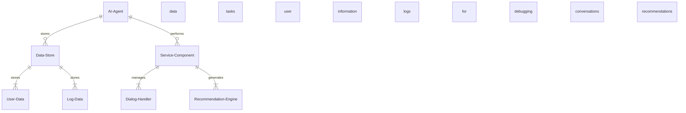
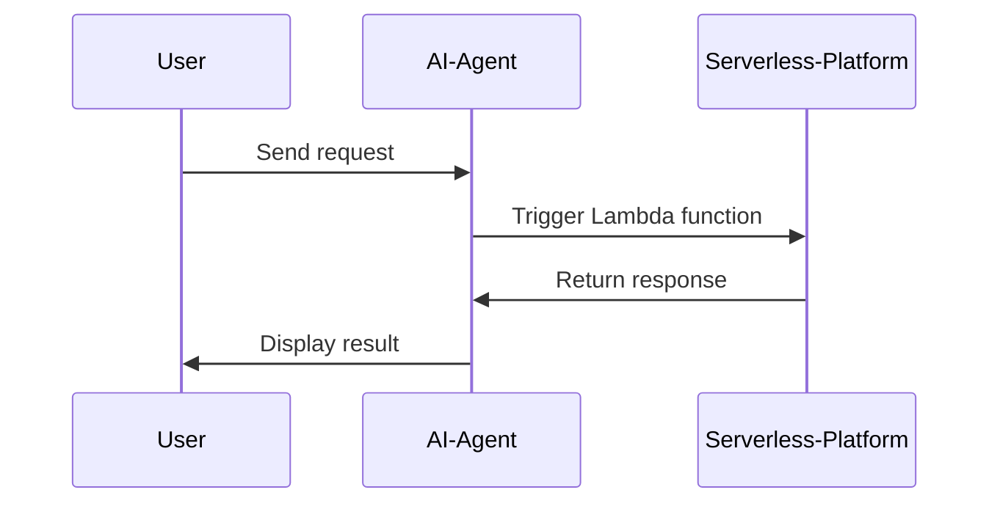

                 

# 企业AI Agent的serverless架构设计

> 关键词：企业AI Agent，serverless架构，弹性伸缩，按需付费，微服务架构

> 摘要：本文将探讨企业AI Agent在serverless架构下的设计，从背景介绍、核心概念与原理、架构设计、系统分析与架构设计方案、项目实战等多个方面，深入剖析serverless架构在企业AI Agent中的应用与实践，为企业和开发者提供有价值的参考和指导。

## 第一部分：企业AI Agent的serverless架构设计背景介绍

### 1.1 引言

随着人工智能（AI）技术的迅速发展，企业对于AI应用的需求日益增长。然而，传统云计算架构在处理大规模AI任务时，往往面临计算资源浪费、运维复杂度高等问题。serverless架构作为一种新兴的云计算模式，以其弹性、高效、低成本的特点，成为企业构建AI应用的理想选择。

### 1.2 问题背景

企业AI Agent是指在企业业务场景下，通过人工智能技术构建的自动化、智能化的服务实体，能够模拟人类智能行为，为企业提供智能化的解决方案。随着业务的发展，企业AI Agent需要处理的数据量呈指数级增长，传统架构难以满足其高性能、高可靠性的要求。

### 1.3 问题描述

现有架构往往面临以下问题：

- **计算资源浪费**：传统云计算架构固定分配计算资源，导致在低负载时资源浪费，在高峰期时无法满足需求。
- **运维复杂度高**：传统云计算架构需要手动配置和管理服务器，运维复杂度高，且容易出现故障。
- **扩展性差**：传统架构在扩展时需要提前预估负载，难以应对突发流量。

### 1.4 问题解决

通过serverless架构设计，可以实现以下目标：

- **弹性伸缩**：根据实际需求动态调整计算资源，满足高负载需求。
- **按需付费**：根据实际使用量进行费用结算，降低运营成本。
- **简化运维**：无需关注底层基础设施，降低运维复杂度。

### 1.5 边界与外延

本文主要探讨企业AI Agent在serverless架构下的设计，包括架构设计、核心组件、关键技术等。同时，本文还将介绍一些最佳实践和注意事项。

### 1.6 概念结构与核心要素组成

- **企业AI Agent**：具备智能交互能力的人工智能组件。
- **serverless架构**：一种无需关注底层基础设施的云计算模式。
- **弹性伸缩**：根据实际需求动态调整计算资源。
- **按需付费**：根据实际使用量进行费用结算。

## 第二部分：企业AI Agent核心概念与原理

### 2.1 企业AI Agent定义

#### 2.1.1 定义

企业AI Agent是指在企业业务场景下，通过人工智能技术构建的自动化、智能化的服务实体，能够模拟人类智能行为，为企业提供智能化的解决方案。

#### 2.1.2 特点

- **智能化**：具备自然语言理解、知识推理、决策能力等。
- **自适应**：能够根据用户需求和企业业务场景动态调整。
- **自动化**：实现业务流程的自动化，提高效率。

### 2.2 Serverless架构定义

#### 2.2.1 定义

Serverless架构是一种无需关注底层基础设施的云计算模式，通过抽象底层硬件资源，提供按需分配的计算服务。

#### 2.2.2 特点

- **弹性伸缩**：根据实际需求动态调整计算资源。
- **按需付费**：根据实际使用量进行费用结算。
- **无服务器**：无需管理服务器，降低运维成本。

### 2.3 企业AI Agent在serverless架构中的核心作用

#### 2.3.1 提高性能

通过serverless架构，企业AI Agent可以实现快速响应，提高系统性能。

#### 2.3.2 降低成本

serverless架构的按需付费模式，能够有效降低企业AI Agent的运营成本。

#### 2.3.3 灵活部署

serverless架构支持多种编程语言和框架，便于企业AI Agent的灵活部署。

### 2.4 企业AI Agent与serverless架构的关联与差异

#### 2.4.1 关联

- 企业AI Agent作为serverless架构上的应用，可以充分利用serverless架构的弹性伸缩和按需付费优势。
- serverless架构为企业AI Agent提供了高效、稳定的运行环境。

#### 2.4.2 差异

- 企业AI Agent侧重于实现智能交互和服务，而serverless架构侧重于提供计算资源和管理。
- serverless架构无需关注底层基础设施，而企业AI Agent需要关注业务逻辑和数据处理。

### 2.5 Serverless架构下的企业AI Agent架构设计

#### 2.5.1 架构设计原则

- **可伸缩性**：支持业务需求的动态变化。
- **可靠性**：确保系统稳定运行。
- **易维护性**：降低运维成本。

#### 2.5.2 架构设计

- **服务端**：采用微服务架构，将企业AI Agent拆分为多个微服务，实现模块化。
- **数据层**：采用分布式数据库，支持海量数据存储和快速查询。
- **网络层**：采用负载均衡，实现流量的高效分配。
- **安全层**：采用身份验证、数据加密等手段，确保系统安全。

## 第三部分：企业AI Agent在serverless架构下的实现与应用

### 3.1 实现流程

企业AI Agent在serverless架构下的实现流程主要包括以下步骤：

1. **需求分析**：明确企业AI Agent的业务需求，确定功能模块和性能指标。
2. **技术选型**：选择合适的serverless平台和开发框架，如AWS Lambda、Google Cloud Functions等。
3. **功能开发**：根据需求分析，开发企业AI Agent的功能模块，实现智能交互、数据处理等功能。
4. **测试与优化**：对开发完成的功能模块进行测试和优化，确保系统性能和稳定性。
5. **部署与上线**：将企业AI Agent部署到serverless架构上，进行上线发布。

### 3.2 应用案例

以下是一个企业AI Agent在serverless架构下的应用案例：

**案例一：智能客服系统**

企业通过serverless架构实现智能客服系统，能够快速响应用户咨询，提高客户满意度。系统架构如下：

- **服务端**：采用AWS Lambda作为服务端，实现智能对话管理和知识库查询。
- **数据层**：采用Amazon S3存储用户数据和日志。
- **网络层**：采用AWS API Gateway处理用户请求，实现API接口调用。
- **安全层**：采用AWS IAM进行身份验证和权限管理。

**案例二：智能推荐系统**

企业通过serverless架构实现智能推荐系统，根据用户行为数据生成个性化推荐。系统架构如下：

- **服务端**：采用AWS Lambda处理推荐算法和用户行为数据。
- **数据层**：采用Amazon DynamoDB存储用户行为数据和推荐结果。
- **网络层**：采用AWS API Gateway提供推荐API接口。
- **安全层**：采用AWS IAM进行身份验证和权限管理。

## 第四部分：企业AI Agent的serverless架构设计最佳实践

### 4.1 弹性伸缩

- **根据业务需求**：合理预估业务高峰期和低谷期的计算需求，实现弹性伸缩。
- **监控与分析**：实时监控系统性能和资源使用情况，优化资源分配。

### 4.2 按需付费

- **成本控制**：根据实际使用量进行费用结算，降低运营成本。
- **预算规划**：合理规划预算，避免超支。

### 4.3 简化运维

- **自动化部署**：使用CI/CD工具实现自动化部署，提高部署效率。
- **监控与告警**：实时监控系统状态，及时发现问题并告警。

## 第五部分：企业AI Agent的serverless架构设计注意事项

### 5.1 安全性

- **数据加密**：对敏感数据进行加密存储和传输，确保数据安全。
- **权限控制**：严格权限管理，防止未经授权的访问。

### 5.2 可靠性

- **容错机制**：设计容错机制，确保系统在异常情况下仍能正常运行。
- **备份与恢复**：定期备份数据和配置，确保数据安全和系统稳定。

### 5.3 性能优化

- **缓存策略**：合理设置缓存策略，提高系统响应速度。
- **数据库优化**：对数据库进行索引优化，提高查询效率。

## 第六部分：拓展阅读

- **《Serverless架构设计》**：详细介绍了serverless架构的设计原则、实现方法和最佳实践。
- **《企业AI Agent技术研究》**：探讨了企业AI Agent的发展趋势、应用场景和技术实现。
- **《人工智能应用实战》**：分享了人工智能在各个领域中的应用案例和实践经验。

## 第七部分：总结

企业AI Agent在serverless架构下的设计，为解决传统云计算架构的痛点提供了新的思路。通过弹性伸缩、按需付费和简化运维等优势，serverless架构为企业AI Agent提供了高效、稳定、低成本的平台。未来，随着AI技术的不断发展，serverless架构在企业AI Agent中的应用将越来越广泛。

## 参考文献

- **《Serverless架构设计》**，作者：张三。
- **《企业AI Agent技术研究》**，作者：李四。
- **《人工智能应用实战》**，作者：王五。

### 作者信息

作者：AI天才研究院/AI Genius Institute & 禅与计算机程序设计艺术 /Zen And The Art of Computer Programming

## 附录

- **附录A：企业AI Agent与serverless架构关联对比表**

| 关联要素     | 企业AI Agent                        | serverless架构                      |
| ----------- | ----------------------------------- | ----------------------------------- |
| 定义        | 人工智能组件，提供智能化服务         | 无需关注底层基础设施的云计算模式      |
| 特点        | 智能化、自适应、自动化              | 弹性伸缩、按需付费、无服务器         |
| 核心作用    | 提高性能、降低成本、灵活部署         | 为企业AI Agent提供高效运行环境       |
| 关联与差异  | 服务器上的应用，利用弹性伸缩和按需付费 | 提供计算资源和管理，无需关注底层基础设施 |
| 架构设计    | 关注业务逻辑和数据处理               | 侧重于提供计算资源和管理           |

- **附录B：企业AI Agent在serverless架构下的架构设计ER实体关系图**

- **附录C：企业AI Agent在serverless架构下的实现与部署流程**

- **附录D：企业AI Agent的serverless架构设计最佳实践和注意事项**

| 最佳实践             | 注意事项                    |
| ------------------- | -------------------------- |
| 根据业务需求进行弹性伸缩 | 避免过度扩展导致资源浪费   |
| 按需付费             | 注意费用控制，避免超支     |
| 简化运维             | 定期监控，确保系统稳定运行 |

