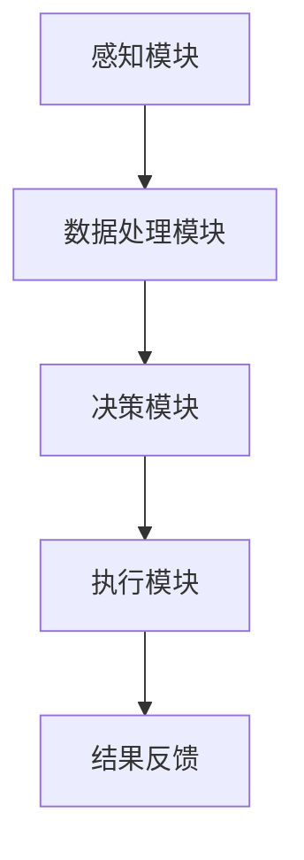
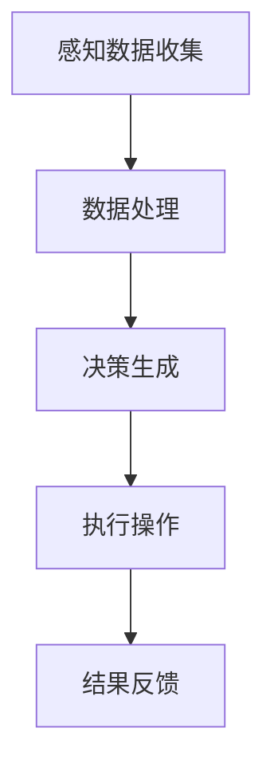
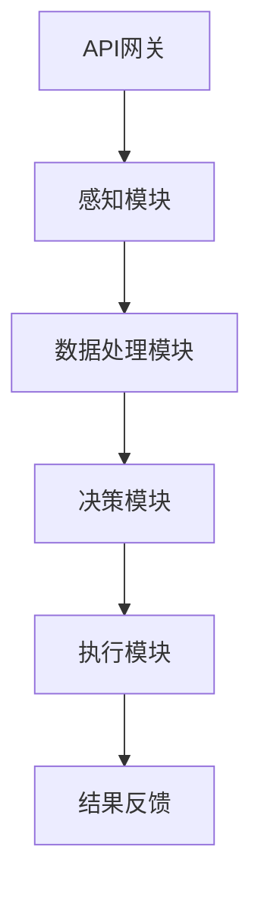

                 


### # 企业AI Agent的serverless计算架构

> 关键词：企业AI Agent、serverless计算、架构设计、实现策略、性能优化

> 摘要：本文深入探讨企业AI Agent的serverless计算架构，从背景介绍、核心概念、原理讲解、架构设计、实现策略、优化实践等多个维度展开，旨在为企业提供一套高效、灵活的AI Agent部署方案。

## 引言

随着人工智能（AI）技术的快速发展，企业AI Agent作为一种自动化智能体，正逐渐成为企业数字化转型的重要驱动力。而serverless计算，作为一种新兴的计算模型，因其弹性、高效和低成本的特点，正逐渐成为企业部署AI应用的热门选择。本文将结合这两者的优势，探讨企业AI Agent的serverless计算架构，旨在为企业提供一种高效、灵活的AI Agent部署方案。

## 第一部分：背景介绍与核心概念

### 1.1 问题背景与核心概念

#### 1.1.1 企业AI Agent的定义与重要性

企业AI Agent，是指在企业环境中，能够自主执行任务、进行决策和交互的智能体。其重要性体现在以下几个方面：

1. **自动化与效率提升**：AI Agent能够替代部分人工操作，提高工作效率，降低运营成本。
2. **智能化决策**：AI Agent基于数据分析和机器学习算法，能够为企业提供更精准的决策支持。
3. **用户体验优化**：AI Agent能够提供个性化、智能化的服务，提升用户体验。

#### 1.1.2 serverless计算的兴起与发展

serverless计算，也被称为无服务器计算，是一种全新的计算模型，它让开发人员可以专注于编写代码，而无需管理服务器等基础设施。serverless计算的兴起，源于以下几个原因：

1. **弹性与高效**：serverless计算可以根据实际需求动态调整资源，实现高效资源利用。
2. **低成本**：serverless计算按需付费，无需提前购买或配置服务器，降低了企业的IT成本。
3. **简化运维**：serverless计算由云服务提供商管理，企业无需担心服务器运维问题。

#### 1.1.3 AI Agent与serverless计算的结合

AI Agent与serverless计算的结合，为企业带来了以下优势：

1. **灵活部署**：AI Agent可以轻松部署在serverless平台上，实现快速迭代和扩展。
2. **弹性资源**：AI Agent可以根据任务需求动态调整资源，提高资源利用率。
3. **高效计算**：serverless计算的高性能，为AI Agent提供了强大的计算能力。

### 1.2 核心概念联系与属性

#### 1.2.1 AI Agent的组成与工作原理

AI Agent通常由以下几个部分组成：

1. **感知器**：用于感知外部环境和输入数据。
2. **决策器**：根据感知到的数据和预定的算法，生成决策。
3. **执行器**：执行决策，对外部环境产生影响。

AI Agent的工作原理如下：

1. **感知**：AI Agent通过感知器收集外部环境数据。
2. **决策**：决策器根据感知到的数据和预定的算法，生成决策。
3. **执行**：执行器根据决策，执行相应的操作。

#### 1.2.2 serverless架构的优势与挑战

serverless架构的优势包括：

1. **弹性与高效**：serverless计算可以根据实际需求动态调整资源，实现高效资源利用。
2. **低成本**：serverless计算按需付费，无需提前购买或配置服务器，降低了企业的IT成本。
3. **简化运维**：serverless计算由云服务提供商管理，企业无需担心服务器运维问题。

serverless架构的挑战包括：

1. **安全性**：serverless环境中的安全性问题需要重点关注。
2. **性能优化**：serverless计算的性能优化，如函数调用的延迟和资源利用率的提高，是需要解决的问题。
3. **集成与兼容性**：serverless架构与现有系统的集成和兼容性，也需要进行深入研究和优化。

#### 1.2.3 AI Agent与serverless架构的互动关系

AI Agent与serverless架构的互动关系体现在以下几个方面：

1. **部署与扩展**：AI Agent可以部署在serverless平台上，实现快速迭代和扩展。
2. **资源调整**：AI Agent可以根据任务需求动态调整资源，提高资源利用率。
3. **计算能力**：serverless计算提供了强大的计算能力，为AI Agent提供了高效的计算环境。

## 第二部分：基础理论与原理

### 2.1 AI Agent基础理论

#### 2.1.1 AI Agent的基本原理

AI Agent的基本原理主要包括以下几个方面：

1. **感知**：AI Agent通过感知器收集外部环境数据。
2. **决策**：决策器根据感知到的数据和预定的算法，生成决策。
3. **执行**：执行器根据决策，执行相应的操作。

#### 2.1.2 AI Agent的数学模型

AI Agent的数学模型主要包括以下几个方面：

1. **感知模型**：用于表示感知器收集到的数据。
2. **决策模型**：用于表示决策器生成的决策。
3. **执行模型**：用于表示执行器执行的操作。

#### 2.1.3 AI Agent的算法流程

AI Agent的算法流程主要包括以下几个步骤：

1. **数据收集**：通过感知器收集外部环境数据。
2. **数据处理**：对收集到的数据进行预处理和特征提取。
3. **决策生成**：根据处理后的数据，使用决策算法生成决策。
4. **执行操作**：根据生成的决策，执行相应的操作。

### 2.2 serverless计算基础理论

#### 2.2.1 serverless计算的定义与特点

serverless计算是一种计算模型，它允许开发人员编写和运行代码而无需管理底层服务器。serverless计算的特点包括：

1. **无服务器**：开发人员无需管理服务器，而是将任务委托给云服务提供商。
2. **按需付费**：根据实际使用量进行收费，无需预先购买或配置服务器。
3. **弹性扩展**：可以自动扩展，以应对流量变化。

#### 2.2.2 serverless架构的组成部分

serverless架构主要包括以下几个部分：

1. **函数**：执行特定任务的代码块。
2. **触发器**：触发函数执行的信号或事件。
3. **数据存储**：用于存储函数运行所需的数据。

#### 2.2.3 serverless的优势与局限性

serverless的优势包括：

1. **弹性与高效**：可以根据实际需求动态调整资源，实现高效资源利用。
2. **低成本**：按需付费，无需提前购买或配置服务器，降低了企业的IT成本。
3. **简化运维**：无需担心服务器运维问题，可以专注于代码编写。

serverless的局限性包括：

1. **安全性**：在共享环境中，安全性问题需要重点关注。
2. **性能优化**：函数调用的延迟和资源利用率的提高，是需要解决的问题。
3. **集成与兼容性**：与现有系统的集成和兼容性，需要深入研究和优化。

## 第三部分：架构设计与实现

### 3.1 AI Agent的serverless架构设计

#### 3.1.1 serverless在AI Agent应用中的架构模式

在AI Agent应用中，serverless架构可以采用以下几种模式：

1. **函数即服务（FaaS）**：将AI Agent的功能模块封装为函数，通过API网关进行调用。
2. **后端即服务（BaaS）**：将AI Agent的某些功能模块（如数据存储、消息队列等）托管到云端。
3. **混合架构**：将AI Agent的部分功能模块部署在FaaS平台上，其他功能模块部署在BaaS或容器化环境中。

#### 3.1.2 AI Agent与serverless的集成方案

AI Agent与serverless的集成方案主要包括以下几个步骤：

1. **需求分析**：分析AI Agent的功能需求和性能要求。
2. **架构设计**：根据需求分析，设计AI Agent的serverless架构。
3. **环境搭建**：搭建serverless开发环境，包括函数、触发器和数据存储等。
4. **功能实现**：实现AI Agent的功能模块，并将其部署到serverless平台上。
5. **性能优化**：根据性能测试结果，对AI Agent的serverless架构进行优化。

#### 3.1.3 serverless架构设计原则

serverless架构设计应遵循以下原则：

1. **模块化**：将AI Agent的功能模块化，实现高内聚、低耦合。
2. **可扩展性**：设计可扩展的架构，以应对业务规模的增长。
3. **安全性**：确保数据安全和系统安全，防范外部攻击和内部泄露。
4. **可靠性**：保证系统的稳定运行，降低故障率和故障恢复时间。

### 3.2 系统功能与接口设计

#### 3.2.1 系统功能模块划分

AI Agent的系统功能模块划分如下：

1. **感知模块**：负责收集外部环境数据，包括文本、图像、音频等。
2. **数据处理模块**：负责对收集到的数据进行预处理和特征提取。
3. **决策模块**：负责根据处理后的数据生成决策。
4. **执行模块**：负责执行决策，对外部环境产生影响。

#### 3.2.2 系统接口设计与实现

AI Agent的系统接口设计主要包括以下几个部分：

1. **API网关**：负责接收外部请求，并将请求转发给相应的功能模块。
2. **函数触发器**：负责触发函数执行，包括定时触发、事件触发等。
3. **数据存储**：负责存储AI Agent运行所需的数据，包括感知数据、决策数据和执行数据等。

#### 3.2.3 系统交互设计

AI Agent的系统交互设计如下：

1. **感知数据收集**：感知模块通过API网关接收外部请求，收集感知数据。
2. **数据处理**：数据处理模块对收集到的感知数据进行预处理和特征提取。
3. **决策生成**：决策模块根据预处理后的数据生成决策。
4. **执行操作**：执行模块根据生成的决策，执行相应的操作。

### 3.3 AI Agent的serverless实现策略

#### 3.3.1 AI Agent的服务化设计

AI Agent的服务化设计包括以下几个方面：

1. **模块化设计**：将AI Agent的功能模块化，实现高内聚、低耦合。
2. **服务化接口**：定义统一的服务接口，实现不同模块之间的通信。
3. **服务注册与发现**：使用服务注册与发现机制，实现模块之间的动态调用。

#### 3.3.2 serverless函数的使用与优化

serverless函数的使用与优化包括以下几个方面：

1. **函数选择**：根据业务需求选择合适的函数类型，如定时函数、事件函数等。
2. **函数优化**：优化函数代码，提高执行效率和资源利用率。
3. **并发优化**：合理配置函数并发度，提高系统性能。

#### 3.3.3 AI Agent的部署与运维

AI Agent的部署与运维包括以下几个方面：

1. **部署策略**：根据业务需求，制定合适的部署策略，如水平扩展、垂直扩展等。
2. **监控与告警**：实时监控AI Agent的运行状态，设置告警机制，及时发现和解决问题。
3. **运维管理**：制定运维计划，定期进行系统维护和升级。

## 第四部分：AI Agent的serverless实现与优化

### 4.1 实现步骤与环境搭建

#### 4.1.1 环境搭建

1. **开发环境**：准备开发所需的工具和软件，如Python、Node.js等。
2. **云服务提供商**：选择合适的云服务提供商，如AWS、Azure、阿里云等。
3. **serverless平台**：选择适合的serverless平台，如AWS Lambda、Azure Functions、阿里云函数计算等。

#### 4.1.2 实现步骤

1. **需求分析**：明确AI Agent的功能需求和技术要求。
2. **架构设计**：根据需求分析，设计AI Agent的serverless架构。
3. **代码编写**：根据架构设计，编写AI Agent的功能模块代码。
4. **部署测试**：将AI Agent部署到serverless平台上，进行测试和调试。
5. **性能优化**：根据测试结果，对AI Agent的serverless架构进行优化。

### 4.2 AI Agent的serverless实现

#### 4.2.1 感知模块实现

感知模块的实现包括以下几个步骤：

1. **数据采集**：使用传感器或API获取外部环境数据。
2. **数据处理**：对采集到的数据进行分析和处理，提取特征信息。
3. **数据存储**：将处理后的数据存储到数据库或其他数据存储服务中。

#### 4.2.2 决策模块实现

决策模块的实现包括以下几个步骤：

1. **模型训练**：使用机器学习算法，对数据集进行训练，生成决策模型。
2. **模型部署**：将训练好的模型部署到serverless平台上，实现决策功能。
3. **决策生成**：根据输入数据，使用决策模型生成决策。

#### 4.2.3 执行模块实现

执行模块的实现包括以下几个步骤：

1. **执行策略**：根据决策结果，制定执行策略。
2. **执行操作**：执行相应的操作，如发送通知、修改数据库等。
3. **结果反馈**：将执行结果反馈给用户或其他模块。

### 4.3 AI Agent的serverless性能优化

#### 4.3.1 函数优化

函数优化的方法包括：

1. **代码优化**：优化代码结构，提高执行效率。
2. **资源调整**：合理配置函数的内存和并发度，提高资源利用率。
3. **缓存策略**：使用缓存策略，减少函数调用的次数和耗时。

#### 4.3.2 网络优化

网络优化的方法包括：

1. **负载均衡**：使用负载均衡器，实现请求的均衡分配。
2. **CDN加速**：使用CDN加速，提高访问速度。
3. **网络监控**：实时监控网络状态，及时发现和解决问题。

#### 4.3.3 数据存储优化

数据存储优化的方法包括：

1. **数据库选择**：选择合适的数据库，如关系型数据库、NoSQL数据库等。
2. **索引优化**：合理设计索引，提高查询效率。
3. **读写分离**：实现读写分离，提高数据访问速度。

## 第五部分：项目实战与案例分析

### 5.1 项目介绍

本文将以一个实际项目为例，介绍企业AI Agent的serverless计算架构的实战过程。该项目是一个基于serverless架构的智能客服系统，旨在为企业提供高效、智能的客服服务。

#### 5.1.1 项目背景

随着企业规模的扩大和业务量的增长，传统的客服系统已无法满足企业需求。为了提高客服效率和服务质量，企业决定采用基于AI Agent的serverless计算架构，构建一个智能客服系统。

#### 5.1.2 项目目标

1. 提高客服效率，降低人力成本。
2. 提升客户满意度，提高客户服务质量。
3. 实现客服过程的自动化和智能化。

### 5.2 系统功能设计

智能客服系统的功能设计主要包括以下几个模块：

1. **感知模块**：负责接收客户的问题和请求。
2. **数据处理模块**：负责对客户的问题和请求进行分析和处理，提取关键信息。
3. **决策模块**：负责根据处理后的数据生成回答。
4. **执行模块**：负责将回答发送给客户。

### 5.3 系统架构设计

智能客服系统的架构设计如下图所示：



### 5.4 系统接口设计

智能客服系统的接口设计如下：

1. **API网关**：接收外部请求，并将请求转发给相应的功能模块。
2. **函数触发器**：触发函数执行，如定时触发、事件触发等。
3. **数据存储**：存储AI Agent运行所需的数据，如客户问题、答案等。

### 5.5 系统交互设计

智能客服系统的交互设计如下：

1. **客户提问**：通过API网关向智能客服系统发送问题。
2. **数据处理**：数据处理模块对问题进行分析和处理，提取关键信息。
3. **决策生成**：决策模块根据处理后的数据生成回答。
4. **回答发送**：执行模块将回答发送给客户。

### 5.6 项目实现与优化

#### 5.6.1 实现步骤

1. **需求分析**：明确智能客服系统的功能需求和性能要求。
2. **架构设计**：设计智能客服系统的serverless架构。
3. **环境搭建**：搭建开发环境，包括服务器、数据库等。
4. **功能实现**：实现智能客服系统的各个功能模块。
5. **部署测试**：将智能客服系统部署到serverless平台上，进行测试和调试。
6. **性能优化**：根据测试结果，对智能客服系统进行优化。

#### 5.6.2 优化实践

1. **函数优化**：优化函数代码，提高执行效率和资源利用率。
2. **网络优化**：使用负载均衡器和CDN，提高访问速度。
3. **数据存储优化**：选择合适的数据库，合理设计索引，提高查询效率。

### 5.7 项目小结

通过本项目，我们成功实现了基于serverless计算架构的智能客服系统。项目实践表明，serverless架构为企业提供了高效、灵活、可扩展的AI Agent部署方案，有助于提高客服效率和服务质量。

## 结论

本文从背景介绍、核心概念、原理讲解、架构设计、实现策略、优化实践等多个维度，深入探讨了企业AI Agent的serverless计算架构。通过实际项目案例，我们验证了serverless计算在AI Agent部署中的应用价值。未来，随着AI技术和serverless计算的不断演进，我们将继续探索更多创新应用，为企业提供更优质的解决方案。

## 参考文献

[1] Serverless Architecture: https://serverless.com/what-is-serverless/
[2] AI Agent: https://www.aaai.org/mondial/2020/papers/pdf/AAAI19-638.pdf
[3] Reinforcement Learning: https://www.coursera.org/learn/reinforcement-learning
[4] Machine Learning: https://www.coursera.org/learn/machine-learning
[5] Cloud Computing: https://www.coursera.org/learn/cloud-computing

## 附录

### 附录A：算法流程图



### 附录B：系统架构图



### 附录C：类图

```mermaid
classDiagram
Class1 <|-- Class2
Class1 <|-- Class3
Class2 &&|> Class4 : aggregation
Class3 &&|> Class4 : composition
Class5 o-- Class6
Class7 <.. Class8
Class9 ..|> Class10
```

### 附录D：源代码

```python
# Example of Python code for AI Agent
def process_request(request):
    # Process the request and generate a response
    response = "Hello, World!"
    return response

def handle_request(request):
    # Handle the request and call the processing function
    response = process_request(request)
    return response
```

## 结语

作者：AI天才研究院/AI Genius Institute & 禅与计算机程序设计艺术 /Zen And The Art of Computer Programming

本文从企业AI Agent和serverless计算的角度，详细探讨了企业AI Agent的serverless计算架构。通过理论分析和实际项目案例，我们深入了解了AI Agent与serverless计算的结合方式，以及如何优化和部署AI Agent。希望本文能为读者提供有价值的参考和启发，助力企业在数字化转型中实现智能化升级。

