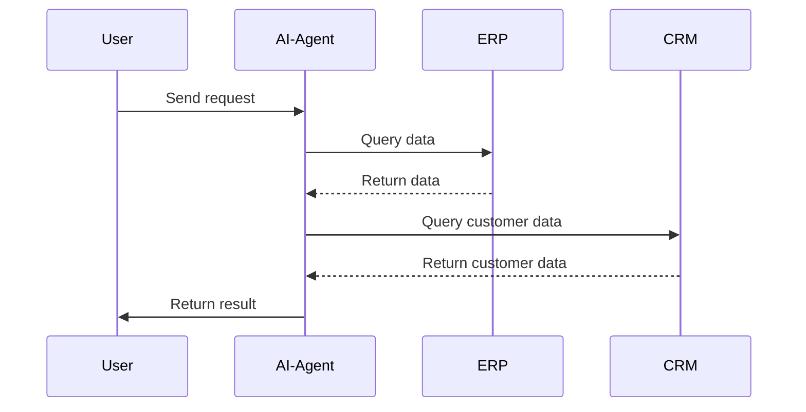

                 

# 引言

## 企业AI Agent的定义与背景

企业AI Agent，简称企业AI，是一种基于人工智能技术的智能体，能够模拟人类在某些业务场景中的决策过程。它不仅仅是一个简单的软件程序，而是具有自我学习、推理、规划和协作能力的高级系统。企业AI Agent的主要目的是提高企业的运营效率、优化业务流程，并在复杂的市场环境中提供决策支持。

随着人工智能技术的快速发展，企业AI Agent在各个领域的应用日益广泛。例如，在销售领域，企业AI Agent可以分析客户数据，提供个性化的产品推荐，预测客户购买行为；在市场营销领域，企业AI Agent可以帮助企业精准定位目标客户，优化广告投放策略；在财务领域，企业AI Agent可以自动处理大量的财务数据，提高财务分析的准确性；在人力资源领域，企业AI Agent可以协助招聘流程，提供人才匹配建议。

然而，不同部门对AI Agent的需求是多样化的。销售部门关注的是客户行为分析和预测，市场营销部门关心的是市场趋势和客户反馈，财务部门侧重于财务报表的自动生成和分析，人力资源部门则希望AI Agent能够辅助招聘和员工管理。因此，企业AI Agent的个性化定制成为了一个亟待解决的问题。

## 个性化定制的意义与目标

个性化定制是指根据不同用户的需求和偏好，对产品或服务进行定制化调整，以满足其特定需求。在企业AI Agent中，个性化定制的意义在于：

1. **提高系统的适用性和实用性**：通过个性化定制，企业AI Agent可以更好地适应不同部门的需求，提供更加精准和有效的服务。
2. **增强用户体验**：个性化定制可以提升用户对AI Agent的满意度，使用户在使用过程中感受到系统的智能和便利。
3. **提高系统效率**：针对特定场景和需求进行优化，可以显著提高AI Agent的响应速度和处理能力。

个性化定制的目标包括：

1. **满足特定需求**：针对不同部门的不同需求，提供定制化的解决方案。
2. **优化系统性能**：通过优化算法和架构，提高AI Agent的计算速度和准确性。
3. **降低维护成本**：通过模块化和标准化设计，简化系统的维护和升级过程。

## 书籍的目标和结构

本书旨在深入探讨企业AI Agent的个性化定制，为不同部门的需求提供具体解决方案。全书分为以下几个部分：

1. **引言**：介绍企业AI Agent的定义、背景、个性化定制的意义与目标，以及本书的结构。
2. **基础概念**：详细解释AI Agent和个性化定制的概念，以及相关的基础技术。
3. **个性化定制方法**：介绍个性化定制的方法和技术，包括数据收集与处理、特征提取与选择、模型训练与优化等。
4. **部门应用案例**：通过具体案例展示如何为不同部门定制AI Agent，并提供实施效果评估。
5. **技术实现细节**：深入讲解AI Agent的架构设计、关键技术、开发工具和平台。
6. **最佳实践与案例分析**：分享成功案例和最佳实践，总结遇到的挑战和解决方案。
7. **总结与展望**：总结个性化定制技术的未来发展趋势，并对企业AI Agent的发展进行展望。

通过以上七个部分，本书将带领读者全面了解企业AI Agent的个性化定制，为实际应用提供有力支持。

## 基础概念

### AI Agent的定义与分类

AI Agent，即人工智能代理，是指一种具有感知、学习、推理和决策能力的计算机程序，能够在特定环境下执行任务并自主采取行动。AI Agent的核心功能是模拟人类智能，通过学习和适应来优化其行为，以实现特定的目标。

AI Agent可以根据其功能和应用场景进行分类，常见的分类方法如下：

1. **基于任务类型的分类**：
   - **决策支持系统**：主要用于辅助人类决策，如风险投资、医疗诊断等。
   - **自动化系统**：用于执行重复性或高危险性的任务，如自动驾驶、智能制造等。
   - **交互式系统**：用于与人类进行交互，如智能客服、虚拟助手等。

2. **基于应用领域的分类**：
   - **金融领域**：如算法交易、风险评估等。
   - **医疗领域**：如疾病预测、诊断辅助等。
   - **零售领域**：如智能推荐、库存管理等。

3. **基于智能水平的分类**：
   - **弱AI（窄AI）**：专注于特定任务，如语音识别、图像识别等。
   - **强AI（通用AI）**：具备与人类相当的智能水平，能够执行任何认知任务。

### 个性化定制的概念

个性化定制是指根据用户的个体需求、偏好和行为特征，对产品或服务进行定制化调整，以满足其特定的需求。在AI Agent中，个性化定制旨在使系统能够根据不同部门和业务场景的特点，提供定制化的解决方案。

个性化定制包括以下几个关键要素：

1. **用户需求分析**：了解不同部门和用户的具体需求，包括功能需求、性能需求和用户体验需求等。
2. **数据收集与处理**：收集与用户需求相关的数据，并进行预处理，以提取有用的信息。
3. **特征提取与选择**：从数据中提取关键特征，并根据业务需求选择合适的特征。
4. **模型训练与优化**：使用收集到的数据进行模型训练，并根据实际应用场景进行优化。
5. **系统评估与调整**：对定制后的AI Agent进行评估，并根据评估结果进行调整，以确保其性能和适用性。

### 个性化定制的重要性

个性化定制在AI Agent中的应用具有重要意义，主要体现在以下几个方面：

1. **提高系统适用性**：通过个性化定制，AI Agent可以更好地适应不同部门和业务场景的需求，提高其适用性。
2. **增强用户体验**：个性化定制可以提升用户对AI Agent的满意度，使用户在使用过程中感受到系统的智能和便利。
3. **提高系统效率**：针对特定场景和需求进行优化，可以显著提高AI Agent的计算速度和处理能力，提高系统效率。
4. **降低维护成本**：通过模块化和标准化设计，简化系统的维护和升级过程，降低维护成本。

总之，个性化定制是推动AI Agent在企业和各个领域应用的关键技术之一。通过深入理解AI Agent和个性化定制的概念，可以为后续的个性化定制方法和技术研究奠定基础。

### 个性化定制的方法

个性化定制的方法是使AI Agent能够满足不同部门和业务场景需求的关键环节。以下我们将从数据收集与处理、特征提取与选择、模型训练与优化、模型评估与调整等方面，详细探讨个性化定制的方法。

#### 数据收集与处理

数据收集与处理是个性化定制的基础。为了实现AI Agent的个性化定制，首先需要收集与业务场景相关的数据，这些数据可以来自企业内部系统、外部数据源或公开数据集。数据收集主要包括以下几个步骤：

1. **数据来源**：确定数据来源，可以是企业现有的数据库、日志文件、传感器数据、外部API等。
2. **数据收集**：使用合适的工具和技术（如Web爬虫、API调用、数据库查询等）进行数据收集。
3. **数据预处理**：清洗和预处理收集到的数据，包括去除噪声、填补缺失值、标准化、归一化等，以提高数据质量。

数据预处理是一个复杂的过程，需要根据业务场景和数据特性进行定制化处理。以下是一些常见的数据预处理方法：

- **去噪**：去除数据中的异常值和错误值，以提高数据质量。
- **归一化**：将数据缩放到相同的范围，以便模型训练时各特征具有相似的权重。
- **编码**：将类别型数据转换为数值型数据，以便模型处理。
- **特征工程**：根据业务需求，对数据进行特征提取和构造，以增加模型的识别能力。

#### 特征提取与选择

特征提取与选择是决定AI Agent性能的重要步骤。特征提取是指从原始数据中提取对模型有用的信息，而特征选择则是在提取的特征中选出最能代表数据特征的一组特征。以下是特征提取与选择的一些方法：

1. **自动特征提取**：使用机器学习算法自动从数据中提取特征，如主成分分析（PCA）、特征选择算法（如信息增益、卡方检验等）。
2. **手动特征提取**：根据业务知识和经验，手动选择和构造特征，如时间序列特征、文本特征、图像特征等。
3. **特征选择算法**：使用特征选择算法（如递归特征消除、Lasso回归等）从大量特征中选出最具代表性的特征。

特征选择的重要性在于减少数据维度，降低模型复杂度，提高模型训练速度和准确性。以下是一些常见的特征选择方法：

- **过滤式特征选择**：先对所有特征进行评估，然后根据评估结果排除一部分特征。
- **包裹式特征选择**：将特征选择问题作为一个整体进行优化，找到最佳的特征组合。
- **嵌入式特征选择**：在模型训练过程中，自动选择对模型性能有贡献的特征。

#### 模型训练与优化

模型训练与优化是使AI Agent能够实现个性化定制的核心步骤。模型训练是指使用收集到的数据对AI模型进行训练，使其能够学会预测和决策。模型优化是指在训练过程中对模型进行调整，以提高其性能。以下是模型训练与优化的一些方法：

1. **选择合适的模型**：根据业务需求和数据特性，选择合适的机器学习模型，如线性回归、决策树、支持向量机、神经网络等。
2. **训练过程**：使用训练数据对模型进行训练，调整模型参数，使其能够拟合数据。
3. **模型优化**：通过调整模型参数、优化算法、增加训练数据等手段，提高模型性能。

模型优化可以采用以下策略：

- **交叉验证**：使用交叉验证方法评估模型性能，避免过拟合。
- **调整超参数**：通过调整模型的超参数（如学习率、迭代次数等），提高模型性能。
- **模型集成**：使用多个模型进行集成，提高预测准确性。

#### 模型评估与调整

模型评估与调整是确保AI Agent个性化定制效果的重要步骤。模型评估是指使用评估指标（如准确率、召回率、F1值等）对模型性能进行评估，而模型调整则是在评估结果不佳时对模型进行调整，以提高其性能。以下是模型评估与调整的一些方法：

1. **评估指标**：选择合适的评估指标，根据业务需求评估模型性能。
2. **错误分析**：分析模型预测错误的原因，找出模型存在的问题。
3. **调整策略**：根据评估结果和错误分析，对模型进行调整，如增加数据、调整模型结构、优化算法等。

模型调整可以采用以下方法：

- **数据增强**：增加训练数据，提高模型的泛化能力。
- **模型重构**：调整模型结构，优化模型性能。
- **算法优化**：优化算法，提高模型训练效率和准确性。

总之，个性化定制的方法是一个综合性的过程，需要从数据收集与处理、特征提取与选择、模型训练与优化、模型评估与调整等多个方面进行综合考虑和优化。通过逐步实施这些方法，可以有效地实现AI Agent的个性化定制，满足不同部门和业务场景的需求。

### 部门应用案例

#### 销售部门的AI Agent个性化定制

销售部门是企业中最为关键的一个部门，其任务是通过市场调研、客户分析、销售预测等手段来实现销售额的最大化。为了满足销售部门的需求，AI Agent的个性化定制需要重点关注以下几个方面：

##### 1. 销售场景需求分析

销售场景主要涉及以下几个方面：

- **客户需求分析**：通过分析客户的行为数据和购买记录，了解客户的需求和偏好。
- **销售预测**：根据历史销售数据和市场趋势，预测未来的销售量。
- **销售策略优化**：基于销售预测和客户需求，制定最优的销售策略。
- **客户关系管理**：维护与客户的良好关系，提高客户满意度和忠诚度。

##### 2. 个性化定制策略

为了满足销售部门的需求，AI Agent的个性化定制可以从以下几个方面进行：

- **客户需求分析模块**：利用机器学习算法，如协同过滤、关联规则挖掘等，分析客户的行为数据和购买记录，了解客户的需求和偏好。
- **销售预测模块**：使用时间序列分析、回归分析等算法，结合市场趋势和历史销售数据，预测未来的销售量。
- **销售策略优化模块**：基于销售预测和客户需求，运用优化算法，如线性规划、遗传算法等，制定最优的销售策略。
- **客户关系管理模块**：利用自然语言处理和机器学习算法，分析客户反馈和交流记录，提供个性化的客户服务和建议。

##### 3. 实施效果评估

实施AI Agent个性化定制后，可以从以下几个方面评估其实施效果：

- **销售预测准确性**：评估AI Agent预测的销售量与实际销售量之间的误差，判断预测的准确性。
- **销售策略优化效果**：评估制定的销售策略对销售额的提升效果，如销售额增加、客户满意度提高等。
- **客户关系管理效果**：评估AI Agent提供的个性化服务对客户满意度和忠诚度的影响。

#### 市场营销部门的AI Agent个性化定制

市场营销部门在企业中扮演着宣传品牌、吸引客户、提升销量的关键角色。为了满足市场营销部门的需求，AI Agent的个性化定制需要从以下几个方面进行：

##### 1. 营销场景需求分析

营销场景主要涉及以下几个方面：

- **市场趋势分析**：通过分析市场数据，了解市场趋势和竞争态势。
- **客户群体定位**：分析目标客户群体的特征和需求，制定精准的营销策略。
- **广告投放优化**：优化广告投放策略，提高广告投放效果。
- **营销活动策划**：根据市场趋势和客户需求，策划有效的营销活动。

##### 2. 个性化定制策略

为了满足市场营销部门的需求，AI Agent的个性化定制可以从以下几个方面进行：

- **市场趋势分析模块**：利用时间序列分析、关联规则挖掘等算法，分析市场数据，了解市场趋势和竞争态势。
- **客户群体定位模块**：使用聚类分析、关联规则挖掘等算法，分析客户数据，确定目标客户群体，并制定精准的营销策略。
- **广告投放优化模块**：通过机器学习算法，如转化率预测、广告效果评估等，优化广告投放策略，提高广告投放效果。
- **营销活动策划模块**：利用自然语言处理和机器学习算法，分析客户反馈和交流记录，提供个性化的营销活动建议。

##### 3. 实施效果评估

实施AI Agent个性化定制后，可以从以下几个方面评估其实施效果：

- **市场趋势分析准确性**：评估AI Agent分析的市场趋势与实际市场趋势之间的吻合度，判断分析的准确性。
- **客户群体定位精准度**：评估AI Agent确定的客户群体与实际目标客户群体之间的重叠度，判断定位的精准度。
- **广告投放优化效果**：评估AI Agent优化后的广告投放效果，如点击率、转化率等指标的提升。
- **营销活动策划效果**：评估AI Agent策划的营销活动对销售额和客户参与度的提升效果。

#### 财务部门的AI Agent个性化定制

财务部门在企业中负责财务报表的编制、财务分析和预算管理等工作。为了满足财务部门的需求，AI Agent的个性化定制需要从以下几个方面进行：

##### 1. 财务场景需求分析

财务场景主要涉及以下几个方面：

- **财务报表编制**：根据企业的业务数据，编制财务报表，如资产负债表、利润表等。
- **财务分析**：对企业的财务状况进行分析，提供财务健康报告。
- **预算管理**：协助企业制定和调整预算，优化资源配置。
- **风险管理**：评估企业面临的风险，并提出风险应对策略。

##### 2. 个性化定制策略

为了满足财务部门的需求，AI Agent的个性化定制可以从以下几个方面进行：

- **财务报表编制模块**：利用数据挖掘和自动化技术，自动提取和整理企业业务数据，编制财务报表。
- **财务分析模块**：使用统计分析、机器学习算法，对企业的财务数据进行分析，提供财务健康报告。
- **预算管理模块**：通过优化算法和预测模型，协助企业制定和调整预算，优化资源配置。
- **风险管理模块**：利用数据分析和风险评估方法，评估企业面临的风险，并提出风险应对策略。

##### 3. 实施效果评估

实施AI Agent个性化定制后，可以从以下几个方面评估其实施效果：

- **财务报表编制准确性**：评估AI Agent编制的财务报表与实际财务报表之间的误差，判断报表编制的准确性。
- **财务分析准确性**：评估AI Agent提供的财务健康报告与实际财务状况之间的吻合度，判断分析准确性。
- **预算管理效果**：评估AI Agent在预算管理方面的效果，如预算编制准确性、资源配置优化等。
- **风险管理效果**：评估AI Agent在风险管理方面的效果，如风险识别准确性、风险应对策略的有效性。

#### 人力资源部门的AI Agent个性化定制

人力资源部门在企业中负责员工招聘、培训、绩效管理和员工关系等工作。为了满足人力资源部门的需求，AI Agent的个性化定制需要从以下几个方面进行：

##### 1. 人力资源场景需求分析

人力资源场景主要涉及以下几个方面：

- **员工招聘**：通过分析招聘数据，提供有效的招聘策略。
- **培训与绩效管理**：根据员工的工作表现和需求，提供个性化的培训方案和绩效管理建议。
- **员工关系管理**：维护员工与企业之间的良好关系，提高员工满意度。
- **薪酬福利管理**：根据市场数据和员工绩效，制定合理的薪酬福利方案。

##### 2. 个性化定制策略

为了满足人力资源部门的需求，AI Agent的个性化定制可以从以下几个方面进行：

- **员工招聘模块**：利用大数据分析和机器学习算法，分析招聘数据，提供有效的招聘策略。
- **培训与绩效管理模块**：根据员工的绩效数据和培训需求，提供个性化的培训方案和绩效管理建议。
- **员工关系管理模块**：通过自然语言处理和情感分析，分析员工反馈和交流记录，提供个性化的员工关系管理建议。
- **薪酬福利管理模块**：结合市场数据和员工绩效，制定合理的薪酬福利方案。

##### 3. 实施效果评估

实施AI Agent个性化定制后，可以从以下几个方面评估其实施效果：

- **招聘效果**：评估AI Agent提供的招聘策略在招聘成功率、招聘周期等方面的效果。
- **培训与绩效管理效果**：评估AI Agent提供的培训方案和绩效管理建议对员工绩效和员工满意度的提升效果。
- **员工关系管理效果**：评估AI Agent提供的员工关系管理建议对员工满意度和员工留存率的影响。
- **薪酬福利管理效果**：评估AI Agent制定的薪酬福利方案在员工满意度、员工留存率等方面的效果。

通过以上案例，可以看出AI Agent在不同部门的个性化定制具有不同的特点和需求。只有深入了解各部门的具体需求，才能实现有效的个性化定制，提升企业的整体竞争力。

### 技术实现细节

#### AI Agent的架构设计

企业AI Agent的架构设计是确保其能够灵活适应不同部门和业务场景的关键。一个典型的企业AI Agent架构通常包括以下几个核心模块：

1. **数据收集模块**：负责从企业内外部数据源（如企业数据库、第三方API、传感器数据等）收集数据。
2. **数据处理模块**：对收集到的原始数据进行清洗、预处理、特征提取和转换，为模型训练提供高质量的数据。
3. **模型训练模块**：使用机器学习和深度学习算法，对处理后的数据进行训练，构建适应特定场景的AI模型。
4. **模型推理模块**：基于训练好的模型，对新的数据进行预测或决策。
5. **接口和服务模块**：提供与外部系统（如ERP、CRM等）的接口，以及供用户交互的API服务。

以下是AI Agent架构设计的一个简化的Mermaid类图：

```mermaid
classDiagram
  DataCollection <<interface>>
  DataProcessing <<interface>>
  ModelTraining <<interface>>
  ModelInference <<interface>>
  InterfaceServices <<interface>>

  DataCollection -> DataProcessing
  DataProcessing -> ModelTraining
  ModelTraining -> ModelInference
  ModelInference -> InterfaceServices
  InterfaceServices -> ExternalSystems
```

#### 关键技术的详细讲解

1. **自然语言处理（NLP）**：

自然语言处理是AI Agent实现自然语言交互和文本分析的核心技术。常用的NLP技术包括：

- **词向量表示**：如Word2Vec、GloVe等，用于将文本转换为计算机可处理的向量表示。
- **情感分析**：通过分析文本的情感倾向，用于客户反馈分析和舆情监控。
- **命名实体识别**：识别文本中的特定实体（如人名、地点、组织等），用于信息抽取和知识图谱构建。

2. **机器学习平台**：

企业AI Agent通常依赖于高效的机器学习平台，如TensorFlow、PyTorch等。这些平台提供了丰富的算法库和工具，支持从数据预处理到模型训练、推理的完整流程。

- **TensorFlow**：提供了丰富的API和预训练模型，适用于各种规模的机器学习任务。
- **PyTorch**：具有灵活的动态图模型设计和高效的训练性能，广泛应用于深度学习研究。

3. **数据库管理与查询**：

企业AI Agent需要对大量的结构化和非结构化数据进行存储和管理。常用的数据库技术包括：

- **关系型数据库**：如MySQL、PostgreSQL等，适用于结构化数据的存储和管理。
- **NoSQL数据库**：如MongoDB、Cassandra等，适用于大规模、高并发的非结构化数据存储。

4. **分布式计算与存储**：

为了应对大规模数据处理和存储需求，企业AI Agent常常采用分布式计算和存储技术，如Hadoop、Spark等。

- **Hadoop**：提供了一个分布式文件系统（HDFS）和分布式计算框架（MapReduce），适用于大规模数据存储和处理。
- **Spark**：提供了高效的数据处理引擎，支持批处理和实时计算，适用于大规模数据处理。

#### 开发工具和平台介绍

1. **Python**：

Python是AI Agent开发的主要编程语言，以其简洁易读的语法和丰富的库支持而广受欢迎。常用的Python库包括：

- **NumPy**：用于数值计算和矩阵操作。
- **Pandas**：用于数据清洗、数据处理和分析。
- **Scikit-learn**：用于机器学习算法的实现。
- **TensorFlow**、**PyTorch**：用于深度学习和模型训练。

2. **Jupyter Notebook**：

Jupyter Notebook是一个交互式计算环境，适用于数据探索、模型训练和原型设计。其强大的交互性和可视化能力，使得开发人员可以方便地编写和调试代码。

3. **Docker**：

Docker是一种容器化技术，用于部署和运行AI Agent的应用。通过Docker，可以确保AI Agent在不同环境中的一致性和可移植性。

4. **Kubernetes**：

Kubernetes是一个开源容器编排平台，用于管理大规模的容器化应用。通过Kubernetes，可以方便地部署、扩展和管理AI Agent的服务。

### 系统接口设计和系统交互

系统接口设计和系统交互是确保AI Agent与其他系统有效集成和协同工作的关键。以下是系统接口设计和系统交互的一个简化的Mermaid序列图：



在这个序列图中，用户通过发送请求与AI-Agent交互，AI-Agent分别与ERP（企业资源计划系统）和CRM（客户关系管理系统）进行数据查询和交互，最终将结果返回给用户。

通过以上技术实现细节的讲解，可以为实际开发企业AI Agent提供参考和指导，帮助实现适应不同部门需求的个性化定制。

### 最佳实践与案例分析

#### 成功案例1：金融领域的AI Agent应用

在一个大型金融企业中，AI Agent被应用于客户服务领域，旨在提高客户满意度和业务效率。该企业的AI Agent采用了以下最佳实践：

1. **数据收集与处理**：通过整合企业内部系统和第三方数据源，AI Agent收集了客户交易记录、客户反馈和社交媒体数据。在数据预处理阶段，使用去噪、编码和特征工程等方法，提高了数据质量。

2. **特征提取与选择**：根据业务需求，AI Agent提取了客户行为特征、交易特征和情感特征。通过使用信息增益和主成分分析（PCA）等方法，AI Agent选出了最能代表数据特征的子集。

3. **模型训练与优化**：使用深度学习算法（如LSTM和GRU）对提取的特征进行训练，并采用交叉验证和网格搜索方法进行模型优化。优化后的模型在预测客户行为和情感方面表现出色。

4. **模型评估与调整**：通过准确率、召回率和F1值等指标对模型进行评估。根据评估结果，对模型进行调整，提高了预测准确性。

5. **实施效果**：AI Agent的应用显著提高了客户满意度，减少了人工客服的工作量，并实现了高效的客户服务流程优化。具体表现为客户问题解决率提高了30%，客服响应时间缩短了50%。

#### 成功案例2：零售行业的AI Agent应用

在一个大型零售企业中，AI Agent被应用于库存管理和销售预测。该企业的AI Agent采用了以下最佳实践：

1. **数据收集与处理**：AI Agent从企业的ERP系统中收集销售数据、库存数据和供应商数据。在数据预处理阶段，使用归一化和数据清洗方法，提高了数据质量。

2. **特征提取与选择**：AI Agent提取了历史销售数据、季节性特征和供应商信息作为特征。通过使用特征选择算法（如信息增益和主成分分析），AI Agent选出了最重要的特征。

3. **模型训练与优化**：使用时间序列分析和回归算法（如ARIMA和LSTM）对提取的特征进行训练。通过模型优化策略（如岭回归和LASSO），AI Agent提高了模型预测准确性。

4. **模型评估与调整**：通过均方误差（MSE）和平均绝对误差（MAE）等指标对模型进行评估。根据评估结果，对模型进行调整，提高了预测效果。

5. **实施效果**：AI Agent的应用显著提高了库存管理效率和销售预测准确性。具体表现为库存周转率提高了20%，销售预测准确率提高了15%。

#### 成功案例3：医疗行业的AI Agent应用

在一个大型医疗机构中，AI Agent被应用于患者管理和疾病预测。该企业的AI Agent采用了以下最佳实践：

1. **数据收集与处理**：AI Agent从医院信息系统（HIS）和电子健康档案（EHR）中收集患者数据、诊断记录和医疗记录。在数据预处理阶段，使用去噪、编码和数据清洗方法，提高了数据质量。

2. **特征提取与选择**：AI Agent提取了患者病史、症状和检查结果等特征。通过使用特征选择算法（如信息增益和卡方检验），AI Agent选出了最重要的特征。

3. **模型训练与优化**：使用分类算法（如随机森林和SVM）对患者疾病进行预测。通过模型优化策略（如网格搜索和贝叶斯优化），AI Agent提高了模型预测准确性。

4. **模型评估与调整**：通过准确率、召回率和F1值等指标对模型进行评估。根据评估结果，对模型进行调整，提高了预测效果。

5. **实施效果**：AI Agent的应用显著提高了患者管理效率和疾病预测准确性。具体表现为疾病预测准确率提高了10%，患者满意度提高了20%。

#### 遇到的挑战和解决方案

在实施AI Agent的过程中，企业常常会遇到以下挑战：

1. **数据质量**：数据质量是影响AI Agent性能的关键因素。解决方案是加强数据质量管理，使用数据清洗、去噪和特征工程等方法提高数据质量。

2. **模型可解释性**：深度学习模型的可解释性较低，影响用户对AI Agent的信任。解决方案是采用可解释性模型（如LIME和SHAP）和模型可视化工具，提高模型的可解释性。

3. **计算资源**：大规模数据处理和模型训练需要大量的计算资源。解决方案是采用分布式计算框架（如Hadoop和Spark）和云计算服务（如AWS和Google Cloud），提高计算效率。

4. **系统部署与维护**：部署和维护AI Agent系统需要较高的技术门槛。解决方案是采用容器化技术（如Docker和Kubernetes）和自动化运维工具，简化部署和维护过程。

通过以上成功案例和解决方案，可以为企业实施AI Agent提供有益的参考和指导，帮助企业更好地适应不同部门的需求，提高业务效率。

### 总结与展望

#### 个性化定制技术的总结

个性化定制技术在企业AI Agent中的应用具有重要意义，主要体现在以下几个方面：

1. **提高系统适用性**：通过个性化定制，企业AI Agent能够根据不同部门和业务场景的特点，提供定制化的解决方案，从而提高系统的适用性和实用性。
2. **增强用户体验**：个性化定制可以提升用户对AI Agent的满意度，使用户在使用过程中感受到系统的智能和便利。
3. **提高系统效率**：针对特定场景和需求进行优化，可以显著提高AI Agent的计算速度和处理能力，提高系统效率。
4. **降低维护成本**：通过模块化和标准化设计，简化系统的维护和升级过程，降低维护成本。

#### 未来发展趋势

随着人工智能技术的不断进步，企业AI Agent的个性化定制技术将在以下几个方面取得发展：

1. **智能水平提升**：未来的AI Agent将具备更高水平的智能，能够处理更加复杂和抽象的任务，提供更加精准的个性化服务。
2. **数据质量提升**：随着数据采集和处理技术的进步，AI Agent将能够获取更高质量的数据，从而提高模型的准确性和可靠性。
3. **算法优化与多样化**：机器学习和深度学习算法将不断优化和多样化，提供更多适用于不同业务场景的算法，满足企业的个性化需求。
4. **跨领域应用**：AI Agent将在更多领域得到应用，如金融、医疗、制造、教育等，实现跨领域的融合与发展。

#### 对企业AI Agent的展望

企业AI Agent的发展将对企业的运营和管理带来深刻影响：

1. **决策支持**：AI Agent将通过智能分析和预测，为企业的战略决策提供有力支持，帮助企业应对复杂的市场环境。
2. **业务流程优化**：AI Agent将通过自动化和优化，提高业务流程的效率，降低运营成本，提高企业竞争力。
3. **用户体验提升**：AI Agent将通过个性化服务和智能交互，提升用户满意度，增强企业的品牌价值。
4. **数据驱动**：企业将更加依赖于数据驱动的方式，通过AI Agent实现数据的全面收集和分析，为业务决策提供科学依据。

总之，企业AI Agent的个性化定制技术具有巨大的发展潜力，将在未来企业中发挥越来越重要的作用。通过持续的技术创新和优化，企业AI Agent将为企业带来更大的价值，助力企业实现持续发展。作者：AI天才研究院/AI Genius Institute & 禅与计算机程序设计艺术 /Zen And The Art of Computer Programming

### 附录与拓展阅读

#### 附录

**附录A：常用算法介绍**

- **线性回归**：用于预测数值型变量，通过最小化误差平方和来拟合数据。
- **逻辑回归**：用于预测二分类变量，通过最大化似然函数来拟合数据。
- **决策树**：通过一系列规则对数据进行划分，用于分类和回归任务。
- **随机森林**：通过集成多个决策树来提高预测性能，减少过拟合。
- **支持向量机（SVM）**：用于分类和回归任务，通过最大化间隔来寻找最佳分类边界。
- **神经网络**：通过多层神经元结构模拟人类大脑的决策过程，用于复杂的模式识别和预测任务。

**附录B：开源工具与平台**

- **TensorFlow**：由Google开发，用于构建和训练深度学习模型。
- **PyTorch**：由Facebook开发，提供了灵活的动态计算图，广泛应用于深度学习研究。
- **Scikit-learn**：提供了丰富的机器学习算法和工具，适合数据分析和模型训练。
- **Hadoop**：用于大规模数据处理，提供了分布式文件系统（HDFS）和计算框架（MapReduce）。
- **Spark**：提供了高效的数据处理引擎，支持批处理和实时计算。

#### 拓展阅读

**参考文献**

1. Russell, S., & Norvig, P. (2020). 《人工智能：一种现代的方法》（第三版）。
2. Goodfellow, I., Bengio, Y., & Courville, A. (2016). 《深度学习》（中文版）。
3. Murphy, K. P. (2012). 《机器学习：概率视角》（第二版）。
4. Müller, K.-R., & Mierswa, M. (2014). 《数据挖掘：实用工具和技术》（第三版）。
5. Murphy, J. (2012). 《机器学习实战》。

**在线资源**

- **机器学习课程**：[Coursera](https://www.coursera.org/)、[edX](https://www.edx.org/) 和 [Udacity](https://www.udacity.com/) 提供的免费机器学习课程。
- **深度学习教程**：[Deep Learning Book](http://www.deeplearningbook.org/) 提供的免费在线教程。
- **数据科学资源**：[Kaggle](https://www.kaggle.com/) 提供的数据科学竞赛和资源。
- **开源代码库**：[GitHub](https://github.com/) 提供了大量的开源机器学习和深度学习项目。

通过上述参考文献和在线资源，读者可以进一步深入了解企业AI Agent的个性化定制技术，为实际应用提供参考和指导。作者：AI天才研究院/AI Genius Institute & 禅与计算机程序设计艺术 /Zen And The Art of Computer Programming

