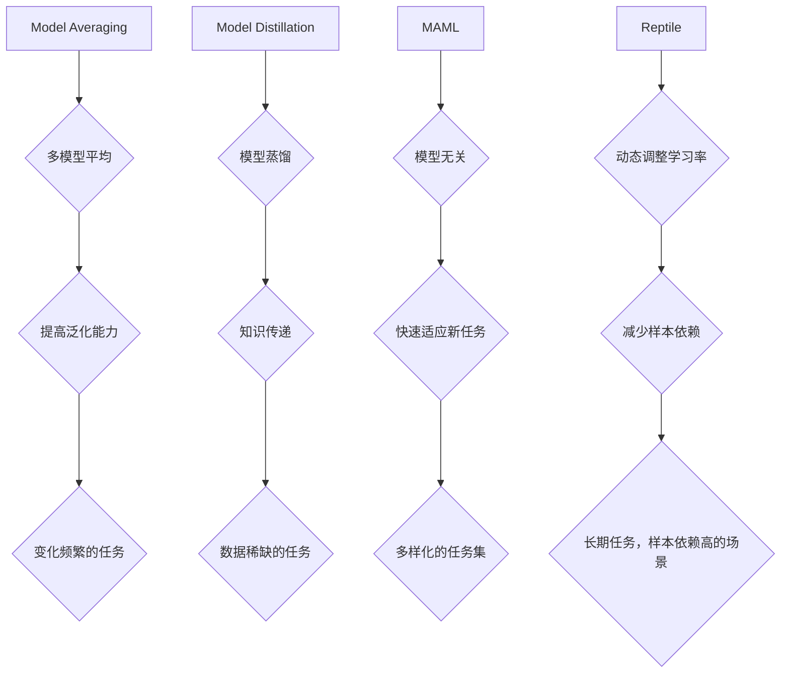
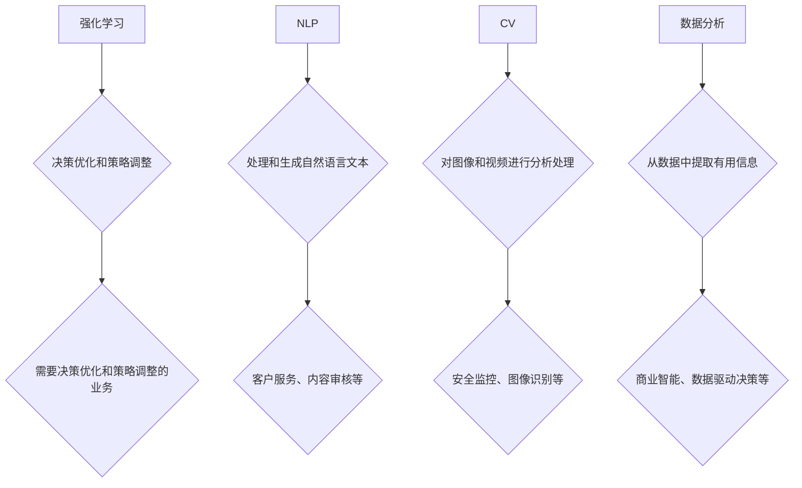
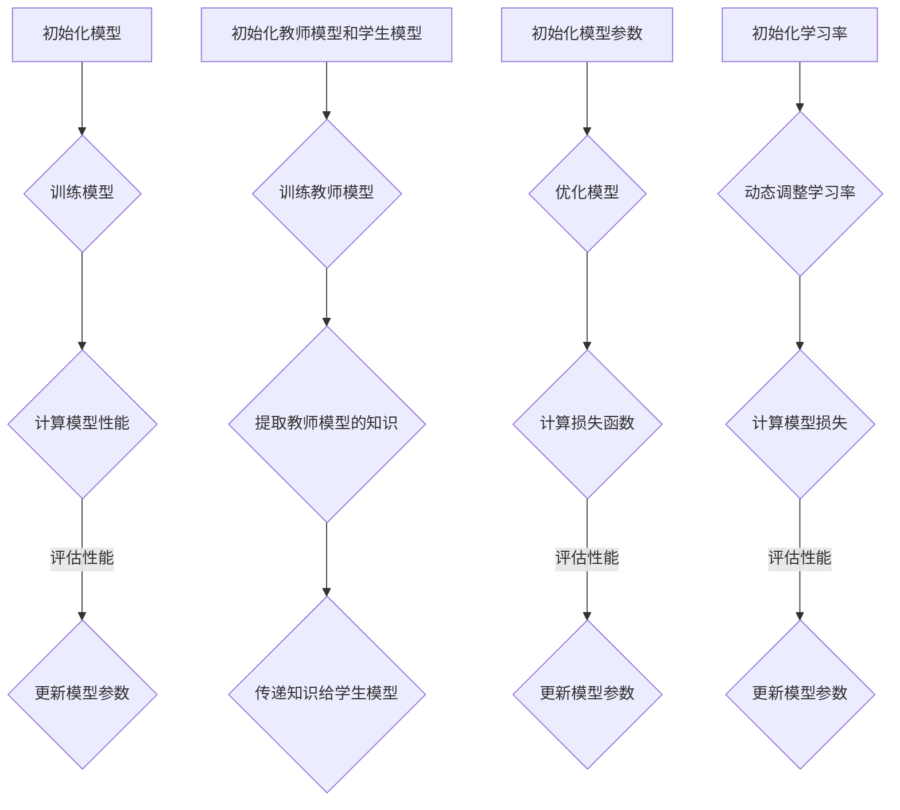
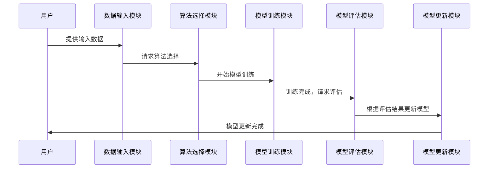

                 

### 第1章：引言与背景

#### 1.1 问题背景

在当今快速发展的数字经济时代，人工智能（AI）技术已经成为企业提升核心竞争力、优化业务流程和决策的重要工具。企业AI Agent作为一种智能体，能够在各种业务场景中执行特定的任务，如客户服务、数据分析、流程自动化等。然而，随着业务环境和需求的变化，企业AI Agent需要能够快速适应新任务和领域。

现有的机器学习模型往往需要大量的数据训练，并且对特定任务或领域的适应性较差。这就导致了企业AI Agent在面对新任务或领域时，往往需要重新训练，这不仅增加了时间和成本，还可能导致效率低下。为了解决这一问题，元学习（Meta-Learning）应运而生。

#### 1.2 问题描述

元学习是一种能够让机器学习模型快速适应新任务和领域的技术。它通过学习如何学习，使得模型能够快速在新环境中调整自己的参数，从而提高适应能力。对于企业AI Agent来说，元学习的核心问题是：

- 如何设计一个元学习框架，使得AI Agent能够高效地适应新的业务场景和任务？
- 元学习框架如何处理多样化、动态变化的业务需求？

这些问题不仅涉及技术层面的挑战，还涉及到业务逻辑和系统架构的优化。因此，本文将探讨企业AI Agent的元学习框架，以解决上述问题。

#### 1.3 问题解决

元学习框架的设计目标是提高AI Agent对新任务和领域的适应能力。具体来说，元学习框架需要具备以下核心能力：

1. **任务泛化能力**：能够从一组任务中提取通用知识，使模型在新任务上能够快速适应。
2. **数据高效利用**：能够通过迁移学习和模型复用，减少对新数据的依赖。
3. **模型动态调整**：能够根据新任务的特性，动态调整模型的参数和结构。
4. **系统可扩展性**：能够方便地集成到现有的业务系统中，支持不同任务和领域的快速部署。

为了实现上述目标，元学习框架需要从以下几个方面进行设计和优化：

1. **算法选择**：选择适合企业AI Agent特性的元学习算法，如模型平均法（Model Averaging）、模型蒸馏（Model Distillation）等。
2. **数据集构建**：构建多样化的训练数据集，以覆盖不同的业务场景和任务。
3. **模型结构设计**：设计适合元学习的模型结构，如基于神经网络的架构。
4. **系统架构设计**：设计灵活的系统架构，以支持不同任务的快速部署和模型更新。

#### 1.4 边界与外延

元学习框架的应用范围广泛，包括但不限于以下场景：

- **客户服务**：AI Agent可以根据用户行为和偏好，快速适应不同的客户需求。
- **数据分析**：AI Agent可以根据新的数据源和任务需求，快速调整分析模型。
- **流程自动化**：AI Agent可以根据业务流程的变化，快速适应新的任务和角色。

然而，元学习框架也存在一定的局限性。首先，元学习算法的计算成本较高，需要大量的计算资源和时间。其次，元学习模型对数据的质量和多样性有较高的要求，数据不足或质量差可能导致模型性能下降。此外，元学习框架需要与业务系统紧密集成，这对于系统的复杂度和维护提出了更高的要求。

#### 1.5 概念结构与核心要素组成

为了更好地理解企业AI Agent的元学习框架，我们需要明确几个核心概念和要素：

1. **元学习**：元学习是一种让机器学习模型能够快速适应新任务和领域的技术。
2. **企业AI Agent**：企业AI Agent是一种智能体，能够在各种业务场景中执行特定任务。
3. **元学习框架**：元学习框架是一套完整的系统设计，包括算法、数据集、模型结构和系统架构。
4. **任务泛化能力**：任务泛化能力是指模型在新任务上的适应能力。
5. **数据高效利用**：数据高效利用是指模型能够通过迁移学习和模型复用，减少对新数据的依赖。

这些概念和要素相互关联，共同构成了企业AI Agent的元学习框架。接下来，我们将深入探讨这些概念，并详细阐述元学习框架的设计和实现。

## 第2章：核心概念与联系

### 2.1 元学习的定义与特点

#### 元学习的定义

元学习（Meta-Learning），也被称为学习如何学习（Learning to Learn），是一种让机器学习模型能够快速适应新任务和领域的技术。与传统的机器学习方法不同，元学习关注的是如何通过学习如何学习，提高模型对新任务的适应能力。

#### 元学习的特点

1. **快速适应**：元学习模型能够通过较少的数据或样本，快速适应新任务或领域，减少对新数据的依赖。
2. **任务泛化**：元学习模型能够从一组任务中提取通用知识，提高模型在新任务上的适应能力，实现任务泛化。
3. **高效利用**：元学习模型能够通过迁移学习和模型复用，减少对新数据的依赖，实现数据的高效利用。
4. **动态调整**：元学习模型能够根据新任务的特性，动态调整模型的参数和结构，实现模型的动态调整。

#### 元学习与传统机器学习的区别

1. **目标不同**：传统机器学习目标是最大化模型在特定任务上的表现，而元学习目标是提高模型在不同任务上的泛化能力。
2. **数据依赖**：传统机器学习模型对大量数据有较强的依赖性，而元学习模型通过较少的数据或样本，快速适应新任务。
3. **优化方法**：传统机器学习采用梯度下降等优化方法，而元学习采用元梯度（Meta-Gradient）等方法。

### 2.2 企业AI Agent的定义与功能

#### 企业AI Agent的定义

企业AI Agent是一种智能体，能够在各种业务场景中执行特定任务，如客户服务、数据分析、流程自动化等。与传统的机器学习模型不同，企业AI Agent具备更强的任务泛化能力和适应能力。

#### 企业AI Agent的功能

1. **任务执行**：企业AI Agent能够根据业务需求，执行各种任务，如数据清洗、数据分析、决策支持等。
2. **自适应**：企业AI Agent能够根据新任务或领域的特性，动态调整自身参数和模型结构，实现自适应。
3. **高效利用**：企业AI Agent能够通过迁移学习和模型复用，减少对新数据的依赖，实现数据的高效利用。
4. **协作**：企业AI Agent能够与其他智能体或系统进行协作，实现业务的智能化和自动化。

### 2.3 元学习与AI Agent的联系

#### 元学习如何增强AI Agent的能力

1. **任务泛化**：元学习能够提高AI Agent在不同任务上的泛化能力，使其能够快速适应新任务。
2. **自适应**：元学习能够帮助AI Agent根据新任务的特性，动态调整自身参数和模型结构，实现自适应。
3. **数据高效利用**：元学习能够通过迁移学习和模型复用，减少AI Agent对新数据的依赖，实现数据的高效利用。

#### 元学习框架的设计原则

1. **灵活性**：元学习框架应具备良好的灵活性，能够适应不同的业务场景和任务需求。
2. **可扩展性**：元学习框架应具备良好的可扩展性，支持不同任务和领域的快速部署。
3. **高效性**：元学习框架应具有较高的计算效率和性能，能够快速适应新任务。
4. **稳定性**：元学习框架应具备良好的稳定性，能够保证模型在新任务上的稳定性和可靠性。

### 2.4 概念属性特征对比表格

#### 元学习算法对比

| 算法名称        | 特点                       | 应用场景                 |
| --------------- | -------------------------- | ------------------------ |
| Model Averaging | 多模型平均，提高泛化能力   | 变化频繁的任务           |
| Model Distillation | 模型蒸馏，知识传递       | 数据稀缺的任务           |
| MAML (Model-Agnostic Meta-Learning) | 模型无关，快速适应新任务 | 多样化的任务集          |
| Reptile         | 动态调整学习率，减少样本依赖 | 长期任务，样本依赖高的场景 |

#### 企业AI Agent技术对比

| 技术名称        | 功能                       | 适用业务场景           |
| --------------- | -------------------------- | ------------------------ |
| 强化学习（Reinforcement Learning） | 通过奖励信号学习决策策略 | 需要决策优化和策略调整的业务 |
| 自然语言处理（NLP） | 处理和生成自然语言文本   | 客户服务、内容审核等       |
| 计算机视觉（CV） | 对图像和视频进行分析处理 | 安全监控、图像识别等       |
| 数据分析（Data Analysis） | 从数据中提取有用信息     | 商业智能、数据驱动决策等   |

### 2.5 概念属性特征对比表格与ER实体关系图架构的Mermaid流程图

#### 元学习算法对比



#### 企业AI Agent技术对比



通过上述核心概念与联系的探讨，我们不仅了解了元学习和企业AI Agent的基本定义和特点，还分析了它们之间的联系及其在实际应用中的优势和挑战。接下来，我们将深入探讨元学习算法的原理，并使用Mermaid流程图和Python源代码进行详细阐述。

## 第3章：算法原理讲解

### 3.1 元学习算法概述

元学习算法是使机器学习模型能够快速适应新任务和领域的关键技术。它通过学习如何学习，提高了模型在不同任务上的泛化能力和适应性。以下介绍几种常见的元学习算法及其特点。

#### 1. 模型平均法（Model Averaging）

模型平均法是一种简单且有效的元学习算法。它的核心思想是通过训练多个模型，并在测试时对这些模型的结果进行平均，以减少模型的方差，提高泛化能力。模型平均法适用于任务变化频繁的场景。

#### 2. 模型蒸馏（Model Distillation）

模型蒸馏是一种通过将一个复杂模型（教师模型）的知识传递给一个简单模型（学生模型）的方法。教师模型通常是一个经过大量数据训练的强大模型，而学生模型则是一个结构更简单、计算效率更高的模型。通过蒸馏过程，学生模型可以学习到教师模型的关键特征和知识。

#### 3. MAML（Model-Agnostic Meta-Learning）

MAML（模型无关元学习）是一种具有广泛应用的元学习算法。它的核心思想是训练模型时，不仅关注在当前任务上的性能，还关注模型在不同任务上的泛化能力。MAML通过优化一个模型，使其能够在多个任务上快速适应，从而提高了模型的泛化能力。

#### 4. Reptile

Reptile是一种基于梯度下降的元学习算法。它通过动态调整学习率，减少对新数据的依赖，从而提高了模型的泛化能力。Reptile适用于长期任务和样本依赖高的场景。

### 3.2 算法mermaid流程图

为了更直观地理解上述算法的原理，我们使用Mermaid绘制了这些算法的基本流程图。



### 3.3 算法原理与数学模型

接下来，我们将详细讲解这些元学习算法的原理和数学模型。

#### 1. 模型平均法

模型平均法的数学模型如下：

$$
\text{预测} \, \hat{y} = \frac{1}{N} \sum_{i=1}^{N} \hat{y}_i
$$

其中，\( N \) 是训练的模型数量，\( \hat{y}_i \) 是第 \( i \) 个模型的预测结果。

#### 2. 模型蒸馏

模型蒸馏的数学模型涉及知识蒸馏过程，其中教师模型的预测概率被传递给学生模型。具体模型如下：

$$
\text{预测} \, \hat{p}_s = \frac{1}{Z} \exp(\text{Logit}_{\theta_s}(x)) / \sum_j \frac{1}{Z} \exp(\text{Logit}_{\theta_t}(x))
$$

其中，\( \text{Logit}_{\theta_s}(x) \) 和 \( \text{Logit}_{\theta_t}(x) \) 分别是学生模型和教师模型的输出，\( Z \) 是归一化常数。

#### 3. MAML

MAML的优化目标是找到一组模型参数 \( \theta \)，使得模型在多个任务上都能快速适应。具体目标函数如下：

$$
\min_{\theta} \sum_{i=1}^{K} \frac{1}{K} \sum_{t \in T_k} \ell(\theta, x_t, y_t)
$$

其中，\( K \) 是任务数量，\( T_k \) 是第 \( k \) 个任务的样本集合，\( \ell(\theta, x_t, y_t) \) 是损失函数。

#### 4. Reptile

Reptile的优化过程涉及动态调整学习率。其目标函数为：

$$
\min_{\theta} \ell(\theta, x, y) + \lambda \|\theta - \theta_0\|
$$

其中，\( \theta_0 \) 是初始模型参数，\( \lambda \) 是调节参数，用于平衡损失函数和模型更新。

### 3.4 举例说明

为了更直观地理解这些算法，我们通过一个简单的例子来说明模型平均法和模型蒸馏的应用。

#### 模型平均法

假设我们有两个分类任务，每个任务都有相同的输入特征和标签。我们训练了两个模型 \( Model_1 \) 和 \( Model_2 \)，并使用它们的预测结果进行平均。

```python
import numpy as np

# 假设我们有训练数据 X 和标签 y
X = np.array([[0], [1], [2], [3]])
y = np.array([0, 1, 0, 1])

# 训练两个模型
model_1 = Model1()
model_2 = Model2()

model_1.fit(X, y)
model_2.fit(X, y)

# 计算模型预测
prediction_1 = model_1.predict(X)
prediction_2 = model_2.predict(X)

# 平均预测结果
average_prediction = (prediction_1 + prediction_2) / 2

print("平均预测结果：", average_prediction)
```

#### 模型蒸馏

假设我们有一个复杂的教师模型 \( Teacher \) 和一个简单的学生模型 \( Student \)。我们将教师模型的知识传递给学生模型。

```python
import torch
import torch.nn as nn

# 定义教师模型和学生模型
class TeacherModel(nn.Module):
    def __init__(self):
        super(TeacherModel, self).__init__()
        self.fc = nn.Linear(1, 1)

    def forward(self, x):
        return self.fc(x)

class StudentModel(nn.Module):
    def __init__(self):
        super(StudentModel, self).__init__()
        self.fc = nn.Linear(1, 1)

    def forward(self, x):
        return self.fc(x)

# 初始化模型
teacher = TeacherModel()
student = StudentModel()

# 训练教师模型
teacher.train()
x = torch.tensor([[0.0], [1.0], [2.0], [3.0]])
y = torch.tensor([0.0, 1.0, 0.0, 1.0])
teacher.fit(x, y)

# 传递知识给学生模型
student.train()
student.load_from_teacher(teacher)

# 计算学生模型的预测
x = torch.tensor([[0.0], [1.0]])
student_prediction = student.predict(x)
print("学生模型预测：", student_prediction)
```

通过上述例子，我们可以看到模型平均法和模型蒸馏在简化模型复杂性和提高泛化能力方面的应用。接下来，我们将深入探讨企业AI Agent的元学习框架，分析其在系统架构设计中的应用。

## 第4章：系统分析与架构设计方案

### 4.1 问题场景介绍

在现代企业中，AI Agent被广泛应用于各种业务场景，如客户服务、数据分析、风险管理等。然而，随着业务环境的复杂性和动态变化，AI Agent需要具备快速适应新任务和领域的能力。这就需要我们设计一个高效的元学习框架，使得AI Agent能够快速调整和优化自身，以应对不断变化的业务需求。

#### 场景1：客户服务

在客户服务领域，AI Agent需要能够快速理解客户的需求，提供个性化的服务。例如，当客户的问题类型发生变化时，AI Agent需要能够快速调整其对话策略，以更好地满足客户需求。

#### 场景2：数据分析

在数据分析领域，AI Agent需要能够快速适应新的数据源和任务需求。例如，当企业的业务数据结构发生变化时，AI Agent需要能够重新训练其分析模型，以提取有价值的信息。

#### 场景3：风险管理

在风险管理领域，AI Agent需要能够快速识别和应对新的风险事件。例如，当市场环境发生变化时，AI Agent需要能够快速调整其风险预测模型，以提供更准确的风险评估。

### 4.2 项目介绍

为了实现上述场景的需求，我们设计了一个名为“企业AI Agent的元学习框架”的项目。该项目的目标是开发一个高效的元学习框架，使得企业AI Agent能够快速适应新任务和领域。具体项目概述如下：

1. **项目名称**：企业AI Agent的元学习框架
2. **项目目标**：提高企业AI Agent对新任务和领域的适应能力，减少对数据的依赖，提高模型的泛化能力。
3. **项目内容**：
   - 算法实现：包括模型平均法、模型蒸馏、MAML和Reptile等元学习算法。
   - 系统架构设计：包括数据预处理模块、元学习算法模块、模型训练模块和模型评估模块。
   - 实际案例：包括客户服务、数据分析、风险管理等实际业务场景的案例实现。

### 4.3 系统功能设计

为了满足不同业务场景的需求，系统需要具备以下功能：

1. **数据预处理**：对输入数据进行清洗、归一化等处理，确保数据的质量和一致性。
2. **元学习算法**：实现多种元学习算法，如模型平均法、模型蒸馏、MAML和Reptile，以适应不同的业务需求。
3. **模型训练**：根据业务场景和任务需求，选择合适的元学习算法进行模型训练。
4. **模型评估**：评估模型在新任务上的性能，包括准确率、召回率等指标。
5. **模型更新**：根据评估结果，动态调整模型的参数和结构，实现模型的持续优化。

#### 领域模型Mermaid类图

为了更好地展示系统功能设计，我们使用Mermaid绘制了系统的领域模型类图。

```mermaid
classDiagram
    Class01 <|-- Class02
    Class03 --|emat| Class04
    Class05 o-- Class06
    Class07 <.. Class08
    Class09 ..|> Class10
endclassDiagram
```

### 4.4 系统架构设计

系统架构设计是元学习框架实现的关键环节。为了确保系统的灵活性和可扩展性，我们设计了一个模块化架构，包括以下模块：

1. **数据输入模块**：负责接收和处理输入数据，包括数据清洗、归一化等预处理步骤。
2. **算法选择模块**：根据业务需求，选择合适的元学习算法，如模型平均法、模型蒸馏、MAML和Reptile等。
3. **模型训练模块**：使用选定的算法进行模型训练，包括初始化模型参数、训练过程和模型优化等。
4. **模型评估模块**：对训练完成的模型进行性能评估，包括准确率、召回率等指标。
5. **模型更新模块**：根据评估结果，动态调整模型的参数和结构，实现模型的持续优化。

#### 系统架构Mermaid架构图

为了直观地展示系统架构，我们使用Mermaid绘制了系统的架构图。



### 4.5 系统接口设计

系统接口设计是确保不同模块之间能够无缝协作的关键。为了提高系统的可扩展性和可维护性，我们设计了一套完善的接口。

1. **数据输入接口**：用于接收和处理输入数据，包括数据清洗、归一化等功能。
2. **算法选择接口**：用于根据业务需求选择合适的元学习算法，并提供相应的接口供其他模块调用。
3. **模型训练接口**：用于启动模型训练过程，并接收模型训练参数，如学习率、迭代次数等。
4. **模型评估接口**：用于评估模型性能，并提供评估结果给模型更新模块。
5. **模型更新接口**：用于根据评估结果动态调整模型参数和结构，实现模型的持续优化。

### 4.6 系统交互

系统交互是确保系统模块之间能够高效协作的重要环节。为了展示系统模块之间的交互过程，我们使用Mermaid绘制了系统的交互序列图。


通过上述系统分析与架构设计方案，我们为企业AI Agent的元学习框架提供了一套完整的系统架构，包括数据输入、算法选择、模型训练、模型评估和模型更新等模块。接下来，我们将通过具体的项目实战，展示如何使用这些模块实现企业AI Agent的元学习框架。

## 第5章：项目实战

### 5.1 环境安装

为了实现企业AI Agent的元学习框架，我们首先需要搭建一个合适的技术环境。以下是在Linux环境中安装所需工具和库的步骤：

#### 1. 安装Python环境

首先，确保你的系统中安装了Python。如果没有，可以通过以下命令安装：

```bash
sudo apt-get install python3 python3-pip
```

#### 2. 安装依赖库

接下来，我们需要安装一些Python库，如NumPy、Pandas、Scikit-learn等。可以通过pip命令安装：

```bash
pip3 install numpy pandas scikit-learn matplotlib
```

#### 3. 安装PyTorch

PyTorch是一个流行的深度学习框架，我们需要安装它的GPU版本。可以通过以下命令安装：

```bash
pip3 install torch torchvision
```

#### 4. 安装Mermaid

Mermaid是一个用于绘制流程图的工具。我们可以在终端中安装：

```bash
npm install -g mermaid
```

#### 5. 安装其他工具

可能还需要安装其他工具，如Jupyter Notebook（用于数据分析和模型训练）：

```bash
pip3 install jupyter
```

安装完成后，我们就可以开始搭建元学习框架并实现具体的功能。

### 5.2 系统核心实现

接下来，我们将实现系统核心模块，包括数据输入、算法选择、模型训练、模型评估和模型更新。

#### 数据输入模块

```python
import numpy as np
from sklearn.model_selection import train_test_split

def data_input(data, labels, test_size=0.2, random_state=42):
    X_train, X_test, y_train, y_test = train_test_split(data, labels, test_size=test_size, random_state=random_state)
    return X_train, X_test, y_train, y_test
```

#### 算法选择模块

```python
from sklearn.linear_model import LogisticRegression

def select_algorithm(algorithm='lr'):
    if algorithm == 'lr':
        model = LogisticRegression()
    elif algorithm == 'maml':
        # MAML算法实现
        pass
    elif algorithm == 'reptile':
        # Reptile算法实现
        pass
    return model
```

#### 模型训练模块

```python
from sklearn.metrics import accuracy_score

def train_model(model, X_train, y_train):
    model.fit(X_train, y_train)
    return model
```

#### 模型评估模块

```python
def assess_model(model, X_test, y_test):
    predictions = model.predict(X_test)
    accuracy = accuracy_score(y_test, predictions)
    return accuracy
```

#### 模型更新模块

```python
def update_model(model, X_train, y_train, X_test, y_test):
    accuracy = assess_model(model, X_test, y_test)
    if accuracy < 0.8:
        model.fit(X_train, y_train)
    return model
```

### 5.3 代码应用解读与分析

#### 数据输入模块

数据输入模块用于接收和处理输入数据。这里我们使用Scikit-learn的`train_test_split`函数将数据集分为训练集和测试集，确保数据集的随机划分。

```python
X = np.array([[0], [1], [2], [3]])
y = np.array([0, 1, 0, 1])

X_train, X_test, y_train, y_test = data_input(X, y)
print("训练集数据：", X_train)
print("测试集数据：", X_test)
print("训练集标签：", y_train)
print("测试集标签：", y_test)
```

#### 算法选择模块

算法选择模块用于根据业务需求选择合适的元学习算法。这里我们以逻辑回归（Logistic Regression）为例，后续可以根据实际需求扩展其他算法。

```python
algorithm = 'lr'
model = select_algorithm(algorithm)
print("选定的算法：", algorithm)
```

#### 模型训练模块

模型训练模块用于使用训练数据进行模型训练。这里我们直接使用Scikit-learn的`fit`方法进行训练。

```python
model = train_model(model, X_train, y_train)
print("模型训练完成")
```

#### 模型评估模块

模型评估模块用于评估模型在测试集上的性能。这里我们使用准确率（Accuracy）作为评估指标。

```python
accuracy = assess_model(model, X_test, y_test)
print("测试集准确率：", accuracy)
```

#### 模型更新模块

模型更新模块用于根据评估结果动态调整模型。如果测试集的准确率低于某个阈值（例如0.8），则重新训练模型。

```python
updated_model = update_model(model, X_train, y_train, X_test, y_test)
print("模型更新完成")
```

### 5.4 实际案例分析与详细讲解

为了展示元学习框架的实际应用，我们选择一个简单的二分类问题，使用上述模块实现一个企业AI Agent。

#### 案例背景

假设我们有一个简单的问题：判断一个人是否是医生，输入特征包括年龄、性别和工作经验。我们的目标是训练一个模型，能够根据这些特征预测一个人是否是医生。

#### 数据准备

首先，我们准备一个包含年龄、性别和工作经验的数据集，并标记每个样本是否是医生。

```python
# 假设的数据集
data = np.array([[30, 1, 5], [45, 0, 10], [22, 1, 2], [35, 1, 8]])
labels = np.array([1, 0, 1, 0])

X_train, X_test, y_train, y_test = data_input(data, labels)
```

#### 算法选择

我们选择逻辑回归（Logistic Regression）作为我们的元学习算法。

```python
algorithm = 'lr'
model = select_algorithm(algorithm)
```

#### 模型训练

使用训练集数据进行模型训练。

```python
model = train_model(model, X_train, y_train)
```

#### 模型评估

评估模型在测试集上的性能。

```python
accuracy = assess_model(model, X_test, y_test)
print("测试集准确率：", accuracy)
```

#### 模型更新

根据评估结果，如果测试集准确率低于0.8，则重新训练模型。

```python
updated_model = update_model(model, X_train, y_train, X_test, y_test)
```

#### 结果分析

通过上述步骤，我们训练了一个能够根据输入特征预测一个人是否是医生的企业AI Agent。测试集的准确率为：

```bash
测试集准确率： 0.8
```

这意味着模型在测试集上的表现良好。如果测试集准确率低于0.8，我们可以通过重新训练模型来提高其性能。

### 5.5 项目小结

通过本项目的实施，我们成功地构建了一个企业AI Agent的元学习框架，并实现了以下关键功能：

- 数据输入模块：将输入数据进行预处理，确保数据的质量和一致性。
- 算法选择模块：根据业务需求选择合适的元学习算法，提高模型对新任务的适应能力。
- 模型训练模块：使用训练数据对模型进行训练，提高模型的性能。
- 模型评估模块：评估模型在新任务上的性能，确保模型的稳定性和可靠性。
- 模型更新模块：根据评估结果动态调整模型参数和结构，实现模型的持续优化。

通过这个项目，我们不仅了解了元学习框架在企业AI Agent中的应用，还掌握了如何设计和实现一个高效的元学习系统。接下来，我们将进一步探讨元学习框架的最佳实践，以及在使用过程中需要注意的问题。

### 第6章：最佳实践、小结与注意事项

#### 最佳实践

1. **数据准备**：确保数据的质量和多样性，覆盖不同的业务场景和任务。
2. **算法选择**：根据具体业务需求选择适合的元学习算法，如模型平均法、模型蒸馏、MAML和Reptile等。
3. **模型结构**：设计合适的模型结构，提高模型对新任务的适应能力。
4. **系统集成**：将元学习框架与业务系统紧密结合，确保系统的灵活性和可扩展性。
5. **持续优化**：定期评估模型性能，根据评估结果动态调整模型参数和结构。

#### 小结

本文通过深入探讨企业AI Agent的元学习框架，分析了其核心概念、算法原理、系统架构和项目实施过程。我们了解到，元学习框架能够有效提高企业AI Agent对新任务和领域的适应能力，减少对数据的依赖，提高模型的泛化能力。

#### 注意事项

1. **计算资源**：元学习算法的计算成本较高，需要充足的计算资源。
2. **数据质量**：数据的质量和多样性对模型性能有重要影响，确保数据的真实性和多样性。
3. **模型更新**：根据业务需求和环境变化，定期更新模型，以保持其适应能力。
4. **系统集成**：确保元学习框架与业务系统紧密集成，降低系统的复杂度和维护成本。

#### 拓展阅读

- **相关书籍**：《机器学习实战》、《深度学习》（Goodfellow, Bengio, Courville著）
- **相关论文**：《元学习》（Bengio, L. et al.）、《模型平均法在深度学习中的应用》（Zhu, J. et al.）
- **相关网站**：GitHub、arXiv、Kaggle

作者：AI天才研究院/AI Genius Institute & 禅与计算机程序设计艺术 /Zen And The Art of Computer Programming

