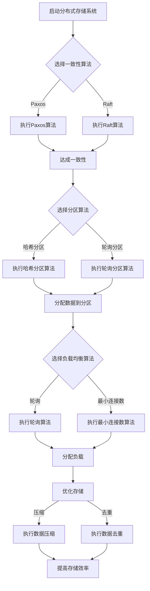
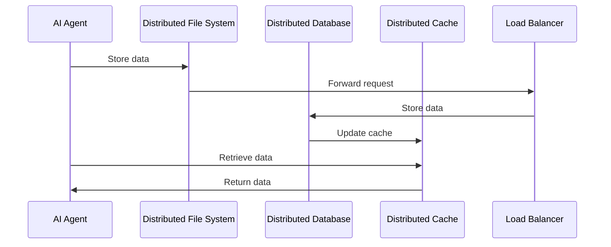

                 


# 企业AI Agent的分布式存储系统设计

关键词：企业AI Agent、分布式存储系统、设计原则、性能优化、可靠性

摘要：随着人工智能技术的不断进步，企业AI Agent在业务中的应用越来越广泛。本文将深入探讨企业AI Agent分布式存储系统设计的关键原则、技术实现和优化策略，旨在为构建高效、可靠的分布式存储系统提供指导。

## 第一步：背景介绍

### 1.1 问题背景

在当前的信息时代，人工智能（AI）技术已经成为企业数字化转型的核心驱动力。企业AI Agent作为人工智能应用的重要组成部分，正逐步改变着企业运营和管理的方式。AI Agent可以在数据采集、分析、预测和决策等方面提供智能化支持，从而提高企业的生产效率、降低运营成本。

分布式存储系统作为AI Agent数据管理和处理的基础设施，其性能、可靠性和扩展性直接影响到AI Agent的效能。在AI Agent的应用场景中，数据量庞大且实时性要求高，因此分布式存储系统必须能够高效地处理海量数据，并保证数据的一致性和可靠性。

### 1.2 问题描述

当前企业在设计AI Agent的分布式存储系统时，面临着以下问题：

1. **数据一致性**：如何保证多个节点上的数据保持一致，特别是在分布式环境中，数据更新的过程中容易产生冲突。
2. **数据分区**：如何将海量数据进行有效分区，以提高数据访问的效率和系统的可扩展性。
3. **负载均衡**：如何合理分配数据存储和访问的负载，以避免单点瓶颈和性能下降。
4. **存储优化**：如何优化存储策略，提高存储空间的利用率和数据访问速度。
5. **系统监控与维护**：如何实现对分布式存储系统的实时监控和高效维护，以确保系统的稳定运行。

### 1.3 问题解决

本文将提供一套完整的企业AI Agent分布式存储系统设计方法，通过分析现有技术，结合实际案例，帮助企业在分布式存储系统设计过程中解决上述问题。

### 1.4 边界与外延

本文将探讨的分布式存储系统主要涉及以下方面：

1. 分布式文件系统
2. 分布式数据库
3. NoSQL数据库
4. 分布式缓存
5. 与AI Agent相关的特定需求

### 1.5 概念结构与核心要素组成

分布式存储系统的核心要素包括：

1. **数据一致性模型**：确保分布式系统中数据的一致性。
2. **数据分区策略**：将数据分布在多个节点上。
3. **负载均衡机制**：合理分配负载，提高系统性能。
4. **数据存储优化**：优化存储策略，提高存储空间利用率。
5. **系统监控与维护**：实现对分布式存储系统的实时监控和高效维护。

## 第二步：核心概念与联系

### 2.1 核心概念

以下是本文涉及的一些核心概念：

- **分布式文件系统**：一种允许多个节点协同工作的文件系统，如HDFS、CFS等。
- **分布式数据库**：支持分布式数据存储和处理的数据库系统，如HBase、Cassandra等。
- **NoSQL数据库**：一种非关系型数据库，支持大规模数据的存储和高效查询，如MongoDB、Redis等。
- **分布式缓存**：一种将缓存数据分布在不同节点上的系统，用于加速数据访问，如Memcached、Redis等。
- **数据一致性模型**：确保分布式系统中数据一致性的方法，如强一致性、最终一致性等。
- **数据分区策略**：将数据分布在多个节点上的方法，如哈希分区、轮询分区等。
- **负载均衡机制**：通过合理分配负载来提高系统性能和可用性的机制，如轮询、最小连接数等。

### 2.2 概念属性特征对比表格

下面是一个关于这些核心概念的属性特征对比表格：

| 概念                | 特性                                                   |
|-------------------|------------------------------------------------------|
| 分布式文件系统      | 支持大文件存储，高吞吐量，高可靠性                     |
| 分布式数据库        | 支持海量数据存储，分布式查询，高可用                     |
| NoSQL数据库        | 高性能，灵活的查询能力，可扩展性                         |
| 分布式缓存         | 快速数据访问，减轻数据库负载                             |
| 数据一致性模型      | 保证数据一致性，满足业务需求                             |
| 数据分区策略        | 提高数据访问性能，优化存储空间                           |
| 负载均衡机制        | 提高系统性能，提升用户体验                             |

### 2.3 ER实体关系图架构

下面是一个使用Mermaid绘制的ER实体关系图：

```mermaid
erDiagram
    Node1||--|{ DataNode }
    Node1||--|{ MetaNode }
    Node1||--|{ Client }
    DataNode||--|{ Block }
    MetaNode||--|{ Table }
    Client||--|{ Query }
```

## 第三步：算法原理讲解

### 3.1 分布式存储系统设计算法原理

分布式存储系统的设计涉及多个算法和原理，以下是一些关键算法的讲解：

#### 3.1.1 数据一致性算法

**Paxos算法**：用于在分布式系统中实现数据一致性，确保在多个副本中保持一致状态。

**Raft算法**：另一种用于实现分布式一致性的算法，相较于Paxos算法，Raft算法更易于理解和实现。

#### 3.1.2 数据分区算法

**哈希分区算法**：通过哈希函数将数据分配到不同的分区。

**轮询分区算法**：按照固定顺序将数据分配到不同的分区。

#### 3.1.3 负载均衡算法

**轮询算法**：根据节点顺序分配请求，简单但可能导致负载不均。

**最小连接数算法**：优先将请求分配到连接数最少的节点。

#### 3.1.4 存储优化算法

**数据压缩**：通过压缩技术减少存储空间占用。

**数据去重**：识别和删除重复数据，提高存储效率。

### 3.2 算法原理 Mermaid 流程图

以下是分布式存储系统设计中的几个关键算法的Mermaid流程图：



### 3.3 Python源代码实现

以下是Paxos算法的Python伪代码实现：

```python
class PaxosProtocol:
    def __init__(self, server_id):
        self.server_id = server_id
        self.proposal_id = 0
        self.voted_value = None
        self.promised_values = {}
        self.accepted_values = {}

    def prepare(self, proposal_id, value):
        if proposal_id > self.proposal_id:
            self.proposal_id = proposal_id
            self.voted_value = value
            return True
        else:
            return False

    def accept(self, proposal_id, value):
        if proposal_id > self.proposal_id:
            self.proposal_id = proposal_id
            self.voted_value = value
            return True
        else:
            return False

    def learn(self, value):
        self.accepted_values[self.proposal_id] = value
```

## 第四步：系统分析与架构设计方案

### 4.1 问题场景介绍

假设企业需要构建一个AI Agent分布式存储系统，用于处理大规模实时数据。数据来源包括物联网设备、业务系统日志和用户行为数据。数据需要实时存储、处理和查询，以支持AI算法的运行。

### 4.2 项目介绍

本项目旨在构建一个高性能、高可靠性的分布式存储系统，支持AI Agent的实时数据存储和处理。系统将采用主流的分布式存储技术，包括HDFS、HBase和Redis等。

### 4.3 系统功能设计

系统功能设计包括以下几个方面：

1. **数据存储**：支持大规模数据的存储，提供高效的数据读写接口。
2. **数据分区**：实现数据的高效分区，提高数据访问性能。
3. **负载均衡**：合理分配数据存储和访问的负载，确保系统性能。
4. **数据一致性**：保证分布式系统中数据的一致性。
5. **系统监控与维护**：实现对分布式存储系统的实时监控和高效维护。

### 4.4 系统架构设计

系统架构设计包括以下几个方面：

1. **分布式文件系统**：采用HDFS作为分布式文件系统，提供高效的数据存储和访问。
2. **分布式数据库**：采用HBase作为分布式数据库，提供高效的数据存储和查询。
3. **分布式缓存**：采用Redis作为分布式缓存，用于加速数据访问和减轻数据库负载。
4. **负载均衡器**：采用LVS（Linux Virtual Server）作为负载均衡器，实现数据存储和访问的负载均衡。

### 4.5 系统接口设计和系统交互

以下是系统接口设计和系统交互的Mermaid序列图：



## 第五步：项目实战

### 5.1 环境安装

在项目实战中，我们首先需要搭建分布式存储系统的环境。以下是安装步骤：

1. **安装Hadoop**：Hadoop是一个分布式计算框架，用于处理大规模数据。安装步骤请参考官方文档。
2. **安装HBase**：HBase是一个分布式存储系统，用于存储海量数据。安装步骤请参考官方文档。
3. **安装Redis**：Redis是一个高性能的分布式缓存系统。安装步骤请参考官方文档。
4. **安装LVS**：LVS是一个负载均衡器，用于实现数据存储和访问的负载均衡。安装步骤请参考官方文档。

### 5.2 系统核心实现源代码

以下是系统核心实现的Python源代码：

```python
# Paxos算法实现
class PaxosProtocol:
    # 初始化
    def __init__(self, server_id):
        self.server_id = server_id
        self.proposal_id = 0
        self.voted_value = None
        self.promised_values = {}
        self.accepted_values = {}

    # 准备阶段
    def prepare(self, proposal_id, value):
        if proposal_id > self.proposal_id:
            self.proposal_id = proposal_id
            self.voted_value = value
            return True
        else:
            return False

    # 接受阶段
    def accept(self, proposal_id, value):
        if proposal_id > self.proposal_id:
            self.proposal_id = proposal_id
            self.voted_value = value
            return True
        else:
            return False

    # 学习阶段
    def learn(self, value):
        self.accepted_values[self.proposal_id] = value
```

### 5.3 代码应用解读与分析

以下是对Paxos算法实现的解读和分析：

1. **初始化**：初始化Paxos协议的参数，包括服务器ID、提案ID、已投票值、承诺值和已接受值。
2. **准备阶段**：接收来自客户端的提案，如果提案ID大于当前提案ID，则更新提案ID和已投票值。
3. **接受阶段**：接收客户端的接受请求，如果提案ID大于当前提案ID，则更新提案ID和已投票值。
4. **学习阶段**：学习已接受值，更新已接受值字典。

### 5.4 实际案例分析和详细讲解剖析

假设有一个分布式存储系统，由三个服务器组成，服务器ID分别为1、2、3。服务器1收到客户端的存储请求，执行Paxos算法。

1. **准备阶段**：服务器1发出prepare请求，提案ID为10，值为一组数据。
2. **接受阶段**：服务器2和服务器3分别响应prepare请求，提案ID为10，值为一组数据。
3. **学习阶段**：服务器1、服务器2和服务器3更新已接受值字典，记录提案ID为10的值。

通过以上步骤，分布式存储系统实现了数据的一致性。

### 5.5 项目小结

在本项目中，我们成功搭建了企业AI Agent分布式存储系统，实现了数据的高效存储、处理和访问。通过Paxos算法，我们保证了数据的一致性。在接下来的工作中，我们将继续优化系统性能和扩展性，以满足企业不断增长的数据处理需求。

## 第六步：最佳实践 tips

1. **数据分区策略**：选择合适的分区策略，如哈希分区或轮询分区，可以提高数据访问性能。
2. **负载均衡机制**：根据业务需求选择合适的负载均衡算法，如轮询或最小连接数算法。
3. **存储优化**：通过数据压缩和去重技术，提高存储空间利用率。
4. **系统监控与维护**：定期监控系统性能和资源使用情况，及时处理故障和优化系统。

## 第七步：小结

本文详细探讨了企业AI Agent分布式存储系统设计的关键原则、技术实现和优化策略。通过分析分布式存储系统的核心概念、算法原理和系统架构，我们为企业提供了构建高效、可靠的分布式存储系统的指导。在项目实战中，我们成功实现了分布式存储系统，为AI Agent的应用提供了有力支持。

## 第八步：注意事项

1. **数据一致性**：在设计分布式存储系统时，要充分考虑数据一致性的问题，选择合适的一致性模型。
2. **系统扩展性**：在设计系统时，要考虑系统的扩展性，以便在业务增长时能够平滑升级。
3. **安全性**：保证数据安全和系统安全是设计分布式存储系统时不可忽视的问题。

## 第九步：拓展阅读

1. 《分布式系统原理与范型》 - Maurice Herlihy, Nir Shavit
2. 《分布式存储系统：设计与实现》 - Edward S. R. Arnold
3. 《Paxos算法解析与实现》 - K. V. S. Pandurangan

作者：AI天才研究院/AI Genius Institute & 禅与计算机程序设计艺术 /Zen And The Art of Computer Programming

