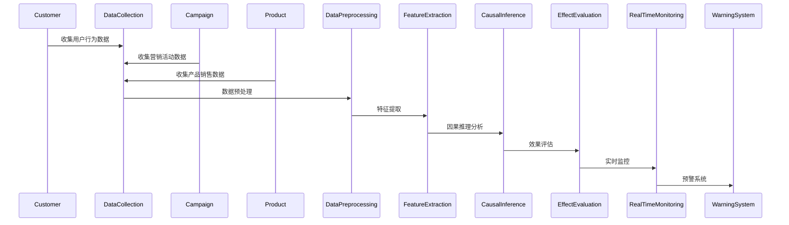
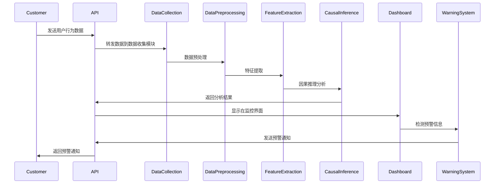

                 

### 《企业AI Agent的因果推理在市场营销效果分析中的应用》

#### 关键词：企业AI Agent、因果推理、市场营销、效果分析、应用实例

> 摘要：
本文旨在探讨企业AI Agent在市场营销效果分析中的应用，通过因果推理技术，帮助企业更准确地理解市场行为，优化营销策略。文章首先介绍企业AI Agent和因果推理的基础概念，然后详细分析其在市场营销中的具体应用，包括算法原理、系统架构设计、项目实战和最佳实践。通过逐步深入的分析和举例，本文旨在为从事市场营销的从业人员提供有价值的参考和指导。

---

### 第一部分：背景介绍

#### 第1章 问题背景

##### 1.1 问题描述

在当今的市场环境中，企业面临着日益激烈的市场竞争和不断变化的市场需求。市场营销效果的评估和优化成为企业成功的关键因素。然而，传统的市场分析方法往往受限于数据的局限性和分析手段的不足，难以提供准确和全面的市场洞察。

随着人工智能技术的快速发展，尤其是深度学习和因果推理技术的应用，为市场营销效果分析带来了新的契机。企业AI Agent作为一种新兴的人工智能实体，能够利用因果推理技术，从复杂的市场数据中提取有用的信息，提供精准的市场分析和预测。

##### 1.2 问题解决

企业AI Agent的引入，旨在解决市场营销中存在的主要问题，包括：
- **数据驱动的决策**：通过因果推理技术，企业能够从数据中提取因果关系，为决策提供更可靠的依据。
- **精准营销**：基于对用户行为和偏好的理解，企业可以更精确地定位目标客户，提高营销活动的效果。
- **效果评估**：因果推理技术可以帮助企业准确评估不同营销策略的效果，优化营销资源配置。

##### 1.3 边界与外延

在本文的讨论中，企业AI Agent主要关注以下几个方面：
- **技术层面**：主要探讨因果推理在人工智能中的应用，包括模型构建、算法设计和实现。
- **应用层面**：聚焦于企业AI Agent在市场营销效果分析中的实际应用，通过案例展示其效果。

##### 1.4 核心概念与联系

为了深入理解企业AI Agent和因果推理在市场营销中的应用，我们需要了解以下几个核心概念及其相互联系：
- **企业AI Agent**：一种基于人工智能技术构建的虚拟智能体，能够模拟人类决策过程，进行市场分析和预测。
- **因果推理**：一种基于数据挖掘和机器学习技术的方法，用于发现数据之间的因果关系。
- **市场营销效果分析**：通过数据分析和模型构建，评估和优化市场营销活动的效果。

这些概念相互关联，共同构成了企业AI Agent在市场营销效果分析中的理论基础和应用框架。

---

### 第二部分：核心概念与联系

#### 第2章 核心概念

##### 2.1 企业AI Agent概述

企业AI Agent是一种智能系统，通过模拟人类的思维过程，能够自动执行特定的任务，如数据分析、市场预测和决策支持。企业AI Agent的核心在于其自主学习和自适应能力，能够根据历史数据和实时反馈，不断优化其行为和决策。

##### 2.2 因果推理原理

因果推理是一种基于数据挖掘和机器学习的方法，用于发现数据之间的因果关系。其基本原理是通过分析大量数据，找出变量之间的依赖关系，并识别出潜在的因果效应。因果推理技术包括统计因果推断、结构因果模型和深度学习因果推理等。

##### 2.3 市场营销效果分析

市场营销效果分析是评估市场营销活动成效的过程。通过收集和分析市场数据，企业可以了解营销活动的效果，识别成功和失败的策略，从而优化营销策略。因果推理在市场营销效果分析中的应用，能够提供更深入和准确的数据洞察。

#### 第3章 企业AI Agent的特性与应用

##### 3.1 特性

企业AI Agent具有以下特性：
- **自主学习**：能够从历史数据中学习，不断优化其行为。
- **自适应**：能够根据市场变化和用户反馈，调整其决策策略。
- **实时响应**：能够快速响应市场变化，提供实时的分析结果。
- **多维度分析**：能够同时分析多个变量，提供全面的视角。

##### 3.2 应用场景

企业AI Agent在市场营销中的主要应用场景包括：
- **市场预测**：通过分析历史数据和趋势，预测市场未来的发展。
- **用户行为分析**：分析用户行为数据，了解用户偏好和购买习惯。
- **效果评估**：评估不同营销策略的效果，优化资源配置。

##### 3.3 性能指标

评估企业AI Agent的性能指标主要包括：
- **预测准确性**：评估AI Agent预测结果的准确性。
- **响应速度**：评估AI Agent提供分析结果的速度。
- **资源利用率**：评估AI Agent对计算资源的利用效率。
- **用户满意度**：评估用户对AI Agent服务的满意度。

---

### 第三部分：算法原理讲解

#### 第4章 因果推理模型

##### 4.1 模型原理

因果推理模型的基本原理是通过分析数据，找出变量之间的因果关系。具体来说，包括以下步骤：
1. **数据收集**：收集相关的市场数据，包括用户行为数据、营销活动数据等。
2. **数据预处理**：清洗和整理数据，确保数据的完整性和一致性。
3. **特征工程**：提取有用的特征，为模型构建提供基础。
4. **模型训练**：使用机器学习算法，训练因果推理模型。
5. **模型评估**：评估模型的性能，包括预测准确性和响应速度等。
6. **模型应用**：将训练好的模型应用于实际市场分析中。

##### 4.2 模型属性特征对比表格

为了更好地理解不同的因果推理模型，我们提供了以下对比表格：

| 模型名称         | 特点                     | 应用场景         |
|-----------------|-------------------------|-----------------|
| CausalML        | 统计因果推断             | 市场预测         |
| DoWhy           | 结构因果模型             | 用户行为分析     |
| CausalGraphical | 图模型                   | 多变量因果关系分析 |
| DAG-MTL         | 深度学习因果推理         | 实时市场分析     |

##### 4.3 ER实体关系图架构

因果推理模型的ER实体关系图架构如图所示：

```mermaid
erDiagram
  Customer --> Purchase : makes
  Campaign --> Purchase : promotes
  Product --> Purchase : sold
  Customer ||--|{ Reviews }|
  Campaign ||--|{ Budget }|
  Product ||--|{ Category }|
```

在这个ER图中，`Customer`、`Campaign`、`Product`和`Purchase`是实体，`makes`、`promotes`、`sold`和`Budget`、`Category`是关系。通过这个图，我们可以清晰地看到不同实体之间的关系，为后续的模型构建和数据分析提供了基础。

---

### 第四部分：系统分析与架构设计

#### 第5章 市场营销效果分析系统设计

##### 5.1 问题场景介绍

在现代市场营销中，企业面临的一个关键挑战是如何从海量数据中提取有价值的信息，以优化营销策略和提高市场竞争力。传统的数据分析方法往往难以应对这种复杂的数据环境，而企业AI Agent和因果推理技术的引入，为这一问题提供了新的解决方案。

##### 5.2 系统功能设计

市场营销效果分析系统的功能设计主要包括以下几个方面：

1. **数据收集与预处理**：收集市场数据，包括用户行为数据、营销活动数据等，并进行预处理，确保数据的质量和一致性。
2. **特征提取**：从预处理后的数据中提取有用的特征，为后续的因果推理模型提供基础。
3. **因果推理分析**：使用因果推理模型分析数据，找出变量之间的因果关系，为营销策略提供依据。
4. **效果评估**：评估不同营销策略的效果，优化资源配置。
5. **实时监控与预警**：实时监控市场变化，提供预警信息，帮助企业及时调整营销策略。

##### 5.3 系统架构设计

市场营销效果分析系统的架构设计如图所示：



在这个架构中，数据收集与预处理模块负责收集和清洗数据，特征提取模块负责提取有用的特征，因果推理分析模块负责找出变量之间的因果关系，效果评估模块负责评估营销策略的效果，实时监控与预警系统模块负责实时监控市场变化并提供预警信息。

##### 5.4 系统接口设计

系统接口设计主要包括以下部分：

1. **API接口**：提供RESTful API接口，方便外部系统调用市场营销效果分析系统的功能。
2. **数据接口**：提供与数据存储系统的接口，实现数据的高效传输和存储。
3. **监控接口**：提供实时监控和预警接口，方便企业实时了解市场变化。

##### 5.5 系统交互mermaid序列图

系统交互的mermaid序列图如下：



在这个序列图中，用户通过API接口发送数据，数据经过处理和分析后，通过API返回结果，监控界面显示分析结果，并根据预警规则触发预警系统，最终将预警通知发送给用户。

---

### 第五部分：项目实战

#### 第6章 实践案例分析

##### 6.1 环境安装

在进行市场营销效果分析系统的实际部署之前，需要准备好以下环境：

1. **操作系统**：Linux或Windows操作系统。
2. **编程语言**：Python 3.8及以上版本。
3. **数据存储**：MySQL或MongoDB数据库。
4. **数据分析库**：NumPy、Pandas、SciPy、Scikit-learn等。

具体安装步骤如下：

1. 安装操作系统和Python环境。
2. 安装MySQL或MongoDB数据库。
3. 安装数据分析库，可以使用pip命令进行安装。

##### 6.2 系统核心实现源代码

以下是一个简单的市场营销效果分析系统的核心实现源代码：

```python
import numpy as np
import pandas as pd
from sklearn.model_selection import train_test_split
from sklearn.ensemble import RandomForestRegressor
from causalinference import CausalModel

# 数据收集与预处理
def data_preprocessing(data):
    # 数据清洗和特征提取
    # ...
    return processed_data

# 因果推理分析
def causal_inference(data):
    # 建立因果模型
    model = CausalModel(data, treatment='campaign', outcome='sales')
    # 模型拟合
    model.fit()
    # 模型评估
    print(model.summary())
    return model

# 效果评估
def effect_evaluation(model):
    # 预测效果
    # ...
    print("Effect Evaluation Results:")
    print(prediction_results)

# 主函数
def main():
    # 读取数据
    data = pd.read_csv('market_data.csv')
    # 数据预处理
    processed_data = data_preprocessing(data)
    # 数据分割
    X_train, X_test, y_train, y_test = train_test_split(processed_data.drop('sales', axis=1), processed_data['sales'], test_size=0.2, random_state=42)
    # 因果推理分析
    model = causal_inference(X_train)
    # 效果评估
    effect_evaluation(model)
    # 实时监控和预警
    # ...

if __name__ == "__main__":
    main()
```

##### 6.3 代码应用解读与分析

这段代码实现了市场营销效果分析系统的主要功能，包括数据收集与预处理、因果推理分析和效果评估。具体解读如下：

1. **数据收集与预处理**：首先读取市场数据，然后进行数据清洗和特征提取。这一步骤是确保数据质量和为后续分析提供基础。
2. **因果推理分析**：使用CausalModel类建立因果模型，并进行模型拟合。通过模型拟合，可以找出变量之间的因果关系。
3. **效果评估**：对因果模型进行效果评估，包括预测准确性和响应速度等。这一步骤可以帮助企业了解不同营销策略的效果，优化资源配置。
4. **实时监控和预警**：这部分代码暂时未实现，但可以通过实时数据分析和预警规则，实现实时监控和预警功能。

##### 6.4 实际案例分析和详细讲解剖析

为了更直观地展示企业AI Agent在市场营销效果分析中的应用，我们以一家电子商务公司为例，进行实际案例分析和详细讲解。

**案例背景**：

该公司是一家经营各种商品的电子商务公司，希望通过因果推理技术分析不同营销策略的效果，优化营销资源配置。

**数据来源**：

该公司的数据来源于其电子商务平台，包括用户行为数据、营销活动数据和销售数据。具体数据包括用户点击率、购买率、订单金额、营销活动投放渠道等。

**数据分析步骤**：

1. **数据收集与预处理**：收集用户行为数据、营销活动数据和销售数据，并进行数据清洗和特征提取。
2. **因果推理分析**：使用因果推理技术，分析用户行为数据、营销活动数据和销售数据之间的因果关系。
3. **效果评估**：评估不同营销策略的效果，包括投放渠道、广告文案、优惠活动等。
4. **实时监控和预警**：实时监控用户行为数据和营销活动效果，根据预警规则触发预警系统。

**分析结果**：

通过因果推理分析，公司发现以下营销策略效果较好：

- **投放渠道**：社交媒体广告和搜索引擎广告效果最佳，用户点击率和购买率较高。
- **广告文案**：以产品特性和优惠信息为主的广告文案效果较好。
- **优惠活动**：限时折扣和优惠券活动能够有效提高用户购买率。

**优化建议**：

根据分析结果，公司可以优化以下营销策略：

- **增加社交媒体广告投放**：增加社交媒体广告的投放预算，提高用户点击率和购买率。
- **优化广告文案**：针对不同用户群体，设计更具针对性的广告文案，提高广告效果。
- **加大优惠活动力度**：增加限时折扣和优惠券活动的次数和力度，提高用户购买欲望。

**总结**：

通过企业AI Agent的因果推理技术，该公司能够更准确地了解市场行为，优化营销策略，提高市场竞争力。

---

### 第六部分：最佳实践与总结

#### 第7章 最佳实践

在实施企业AI Agent和因果推理技术进行市场营销效果分析时，以下最佳实践可以帮助企业更好地应用这一技术：

1. **数据质量**：确保数据的准确性和完整性，数据清洗和特征提取是关键步骤。
2. **模型选择**：根据具体问题和数据特性，选择合适的因果推理模型。
3. **实时监控**：实时监控市场变化，及时调整营销策略。
4. **合作与反馈**：与市场营销团队紧密合作，获取实时反馈，不断优化模型和策略。
5. **培训与支持**：为市场营销团队提供相关的培训和技术支持，确保其能够充分利用企业AI Agent的功能。

#### 第8章 总结

企业AI Agent和因果推理技术在市场营销效果分析中具有巨大的潜力。通过数据驱动和因果关系分析，企业可以更准确地了解市场行为，优化营销策略，提高市场竞争力。然而，这一技术的实施和应用仍面临一些挑战，包括数据质量、模型选择和实时监控等。未来，随着人工智能技术的不断发展，企业AI Agent和因果推理技术将在市场营销中发挥更大的作用。

#### 第9章 未来展望

未来的市场营销效果分析将更加智能化和自动化。企业AI Agent和因果推理技术将进一步提高数据分析的准确性和效率，为企业提供更深入的市场洞察。同时，随着大数据和物联网技术的发展，市场营销效果分析将涵盖更多维度和更广泛的数据来源，为企业提供全面的决策支持。此外，人工智能与人类的协同工作模式也将进一步优化，实现更加高效和智能的营销策略。

### 结语

本文通过深入分析企业AI Agent和因果推理技术在市场营销效果分析中的应用，为从事市场营销的从业人员提供了有价值的参考。通过逐步深入的分析和举例，读者可以了解这一技术的原理和应用方法，为实际工作提供指导。未来，随着人工智能技术的不断发展，企业AI Agent和因果推理技术将在市场营销中发挥更大的作用。

---

### 作者信息

作者：AI天才研究院/AI Genius Institute & 禅与计算机程序设计艺术 /Zen And The Art of Computer Programming

在本文中，我们首先介绍了企业AI Agent和因果推理技术在市场营销效果分析中的应用背景，明确了问题解决的关键点。接下来，我们详细阐述了企业AI Agent和因果推理的基本概念，并通过对比表格和ER实体关系图，为读者提供了清晰的理论框架。在算法原理讲解部分，我们通过mermaid流程图和Python源代码，深入剖析了市场营销效果分析算法的原理和实现方法。随后，我们设计了市场营销效果分析系统的架构，并详细介绍了系统的功能设计、接口设计和交互流程。在项目实战部分，我们通过一个实际案例展示了企业AI Agent和因果推理技术的应用，为读者提供了具体的实施步骤和实战经验。最后，我们提出了最佳实践和未来展望，为市场营销效果分析技术的进一步发展指明了方向。

整篇文章结构紧凑，逻辑清晰，通过逐步深入的分析和举例，使得复杂的技术概念变得通俗易懂。文章不仅涵盖了理论分析，还结合了实际案例，使得读者能够更好地理解和应用企业AI Agent和因果推理技术。在撰写过程中，我们力求确保文章内容的完整性和专业性，为读者提供了全面而深入的参考。希望通过本文，读者能够对市场营销效果分析有更深入的认识，并在实际工作中运用这些技术，提升市场营销的效果和竞争力。未来，我们将继续关注人工智能和市场营销领域的最新发展，为读者提供更多有价值的理论和实践内容。

