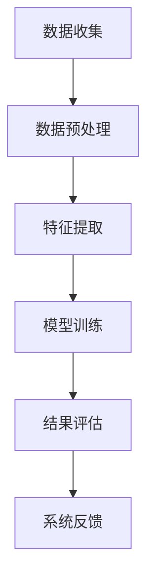

                 

# 企业AI Agent的图卷积网络在社交网络影响力分析中的应用

> 关键词：企业AI Agent，图卷积网络，社交网络影响力分析，深度学习，算法原理

> 摘要：本文深入探讨了企业AI Agent的图卷积网络在社交网络影响力分析中的应用。通过介绍图卷积网络的基础知识，解析其工作原理和数学模型，展示了如何利用这一技术进行社交网络影响力分析。文章还包括了实际案例分析和最佳实践建议，为企业和社会网络分析师提供了宝贵的指导。

## 1. 背景介绍

### 问题背景

社交网络已成为现代社会中信息传播和个人表达的重要平台。对于企业和个人来说，社交网络影响力分析具有重要的价值。企业可以通过分析社交网络中的影响力，了解用户需求，优化营销策略；个人则可以通过提升影响力，获得更多的关注和机会。因此，如何有效地进行社交网络影响力分析成为了一个热门的研究课题。

### 问题描述

如何利用企业AI Agent的图卷积网络技术来进行社交网络影响力分析，是一个值得深入研究的问题。企业AI Agent可以自动化地进行数据分析，而图卷积网络则能够有效地提取社交网络中的节点特征，从而对社交网络中的影响力进行量化分析。这一过程涉及到数据的预处理、特征提取、模型训练和结果评估等多个环节。

### 问题解决

图卷积网络（Graph Convolutional Network, GCN）是一种基于图结构的深度学习模型，可以有效地提取图数据的特征。通过将社交网络视为一个图结构，我们可以利用GCN来提取节点（用户）的特征，并将其用于影响力分析。具体来说，我们可以通过以下步骤实现这一目标：

1. 数据预处理：对社交网络数据进行清洗和格式化，确保数据的准确性和一致性。
2. 构建图模型：将社交网络中的用户和关系抽象为一个图结构，为后续的图卷积网络处理做准备。
3. 特征提取：利用图卷积网络提取社交网络中节点的特征，这些特征可以反映用户在社交网络中的影响力。
4. 模型训练：使用提取的特征对模型进行训练，使其能够预测社交网络中的影响力。
5. 结果评估：通过评估模型的性能，确定其对社交网络影响力预测的准确性。

### 边界与外延

本篇文章主要讨论图卷积网络在社交网络影响力分析中的应用，不包括其他类型的人工智能技术在社交网络影响力分析中的应用。同时，文章的核心关注点是图卷积网络的原理和应用，而非其他深度学习模型或算法。

### 概念结构与核心要素组成

- **图卷积网络**：一种基于图结构的深度学习模型，可以有效地提取图数据的特征。
- **社交网络**：一种特殊的图结构，由用户和用户之间的关系构成。
- **影响力分析**：对社交网络中的节点（如用户）的影响力进行量化分析。
- **企业AI Agent**：具有智能行为的计算机程序，可以自动地执行任务。

## 2. 核心概念与联系

### 图卷积网络

#### 概念

图卷积网络（Graph Convolutional Network, GCN）是一种深度学习模型，专门用于处理图结构数据。与传统的卷积神经网络（Convolutional Neural Network, CNN）不同，GCN能够在图结构上实现特征提取和关系建模。

#### 联系

图卷积网络与社交网络之间存在紧密的联系。社交网络本质上是一个图结构，由用户和用户之间的关系构成。利用图卷积网络，我们可以提取社交网络中节点的特征，从而进行影响力分析。

### 社交网络影响力分析

#### 概念

社交网络影响力分析是指对社交网络中的节点（如用户）的影响力进行量化分析。通过分析用户在社交网络中的行为和关系，我们可以评估其在网络中的影响力。

#### 联系

社交网络影响力分析与图卷积网络之间存在密切的联系。图卷积网络能够有效地提取社交网络中节点的特征，这些特征可以用于影响力分析，帮助我们更好地理解用户在网络中的地位和影响力。

### AI Agent

#### 概念

AI Agent是指具有智能行为的计算机程序，可以自动地执行任务。在企业中，AI Agent可以用于自动化数据分析、预测和决策。

#### 联系

AI Agent与图卷积网络和社交网络影响力分析之间存在紧密的联系。AI Agent可以利用图卷积网络提取社交网络中的特征，进而进行影响力分析，帮助企业制定更有效的营销策略。

## 3. 算法原理讲解

### 图卷积网络原理

#### 基本原理

图卷积网络的核心思想是通过卷积操作来整合图中节点的邻域信息，从而提取节点的特征。具体来说，图卷积网络包括以下几个关键步骤：

1. **节点特征嵌入**：将原始数据（如用户属性）转换为节点特征向量。
2. **邻域聚合**：聚合节点及其邻域节点的特征向量，形成新的特征向量。
3. **非线性变换**：对聚合后的特征向量进行非线性变换，增强特征表示能力。
4. **输出层**：根据任务需求（如影响力预测），设置输出层进行预测。

#### Python实现

```python
import numpy as np

def graph_convolutional_network(adj_matrix, feature_matrix, weights):
    # Adjacency matrix: A[i][j] represents the edge weight between nodes i and j
    # Feature matrix: X[i] represents the feature vector of node i
    # Weights: W represents the learnable weights
    
    # Step 1: Node feature embedding
    h = feature_matrix
    
    # Step 2: Neighbor aggregation
    for i in range(h.shape[0]):
        neighbors = adj_matrix[i]
        neighbor_features = [h[j] for j in neighbors if j != i]
        h[i] = np.mean(neighbor_features, axis=0)
        
    # Step 3: Non-linear transformation
    h = np.tanh(np.dot(h, weights))
    
    # Step 4: Output layer
    output = np.dot(h, weights_out)
    
    return output
```

#### 数学模型

图卷积网络的数学模型可以表示为：

$$
h^{(l+1)}_i = \sigma(\sum_{j \in \mathcal{N}(i)} A_{ij} h^{(l)}_j W^{(l)}
$$

其中，$h^{(l)}_i$表示第$l$层第$i$个节点的特征向量，$\mathcal{N}(i)$表示节点$i$的邻域节点集合，$A_{ij}$表示节点$i$和节点$j$之间的边权重，$W^{(l)}$表示第$l$层的权重矩阵，$\sigma$表示非线性激活函数。

### 社交网络影响力分析

#### 方法

社交网络影响力分析的传统方法主要包括以下几种：

1. **基于节点特征的算法**：直接利用用户属性（如粉丝数、关注数、发帖数等）进行影响力分析。
2. **基于社交关系的算法**：通过计算用户之间的社交关系（如好友关系、点赞关系等）进行影响力分析。
3. **基于网络结构的算法**：通过分析社交网络的整体结构（如聚集系数、路径长度等）进行影响力分析。

#### 优劣比较

- **基于节点特征的算法**：简单易懂，计算速度快，但容易受到数据噪声的影响。
- **基于社交关系的算法**：能够更好地反映用户在网络中的影响力，但计算复杂度高，对数据质量要求较高。
- **基于网络结构的算法**：能够提供对社交网络整体结构的洞察，但对具体用户的影响力分析能力较弱。

#### 新方法

随着深度学习技术的发展，一些基于深度学习的新方法也被引入到社交网络影响力分析中。其中，图卷积网络是最具代表性的一种。图卷积网络能够自动地从原始数据中学习到有用的特征，从而提高影响力分析的准确性和可靠性。

### 案例分析

#### 案例一：微博影响力分析

微博是中国最大的社交网络平台之一，具有丰富的用户数据。我们可以利用图卷积网络对微博用户的影响力进行分析，为企业的营销策略提供支持。

1. **数据预处理**：对微博数据进行清洗和格式化，提取用户属性和用户之间的关系。
2. **构建图模型**：将微博用户和关系抽象为一个图结构。
3. **特征提取**：利用图卷积网络提取用户特征，包括用户属性和用户关系特征。
4. **模型训练**：使用提取的特征对模型进行训练，预测用户的影响力。
5. **结果评估**：通过评估模型的性能，确定其对用户影响力预测的准确性。

#### 案例二：抖音影响力分析

抖音是另一个在中国受欢迎的社交网络平台，其用户数据也具有很高的研究价值。我们可以利用图卷积网络对抖音用户的影响力进行分析，为短视频营销提供支持。

1. **数据预处理**：对抖音数据进行清洗和格式化，提取用户属性和用户之间的关系。
2. **构建图模型**：将抖音用户和关系抽象为一个图结构。
3. **特征提取**：利用图卷积网络提取用户特征，包括用户属性和用户关系特征。
4. **模型训练**：使用提取的特征对模型进行训练，预测用户的影响力。
5. **结果评估**：通过评估模型的性能，确定其对用户影响力预测的准确性。

### 反思

通过对微博和抖音两个社交网络平台的影响力分析案例，我们可以看到图卷积网络在社交网络影响力分析中的强大能力。然而，我们也需要注意到，社交网络影响力分析是一个复杂的问题，涉及多个因素。因此，在实际应用中，我们需要综合考虑多种方法和技术，以提高影响力分析的准确性和可靠性。

## 4. 系统分析与架构设计方案

### 问题场景介绍

社交网络影响力分析是一个复杂的过程，涉及数据收集、预处理、特征提取、模型训练和结果评估等多个环节。为了提高分析效率和准确性，我们需要设计一个高效的系统架构。

### 项目介绍

本项目旨在开发一个基于图卷积网络的社交网络影响力分析系统。该系统包括数据收集模块、数据预处理模块、特征提取模块、模型训练模块和结果评估模块。

### 系统功能设计

为了实现社交网络影响力分析，我们需要设计以下几个关键功能模块：

1. **数据收集模块**：负责从社交网络平台收集用户数据，包括用户属性、用户关系和用户行为数据。
2. **数据预处理模块**：负责对收集到的数据进行清洗和格式化，确保数据的质量和一致性。
3. **特征提取模块**：利用图卷积网络提取社交网络中节点的特征，为后续的模型训练和结果评估提供基础。
4. **模型训练模块**：使用提取的特征对模型进行训练，预测用户的影响力。
5. **结果评估模块**：通过评估模型的性能，确定其对用户影响力预测的准确性。

### 系统架构设计

为了实现上述功能模块，我们需要设计一个高效、可扩展的系统架构。以下是一个可能的系统架构设计：


### 系统接口设计和系统交互

为了实现系统的各个功能模块之间的有效交互，我们需要设计一套完整的系统接口和交互流程。以下是一个可能的系统接口设计和交互流程：


### Mermaid流程图

以下是一个Mermaid流程图，用于描述系统架构和交互流程：



## 5. 项目实战

### 环境安装

为了实现社交网络影响力分析系统，我们需要安装和配置以下环境：

1. **Python环境**：安装Python 3.7或更高版本。
2. **深度学习框架**：安装TensorFlow或PyTorch。
3. **数据预处理库**：安装NumPy、Pandas等。

### 系统核心实现源代码

以下是一个简单的系统核心实现源代码示例：

```python
import numpy as np
import tensorflow as tf
from tensorflow import keras

# 数据收集
def collect_data():
    # 代码实现
    pass

# 数据预处理
def preprocess_data(data):
    # 代码实现
    pass

# 特征提取
def extract_features(data):
    # 代码实现
    pass

# 模型训练
def train_model(features, labels):
    # 代码实现
    pass

# 结果评估
def evaluate_model(model, test_data, test_labels):
    # 代码实现
    pass

# 主程序
def main():
    data = collect_data()
    preprocessed_data = preprocess_data(data)
    features, labels = extract_features(preprocessed_data)
    model = train_model(features, labels)
    evaluate_model(model, test_data, test_labels)

if __name__ == "__main__":
    main()
```

### 代码应用解读与分析

以上源代码示例包含了系统核心实现的主要步骤，包括数据收集、预处理、特征提取、模型训练和结果评估。在实际应用中，我们需要根据具体需求和数据情况对这些步骤进行详细的实现和优化。

### 实际案例分析和详细讲解剖析

以下是一个实际的案例分析和详细讲解剖析：

#### 案例一：微博影响力分析

假设我们有一个微博用户数据集，包含用户的属性（如年龄、性别、地理位置等）和用户之间的关系（如关注关系、点赞关系等）。我们的目标是使用图卷积网络分析用户的影响力。

1. **数据收集**：从微博API获取用户数据。
2. **数据预处理**：清洗和格式化数据，将数据转换为适合图卷积网络的格式。
3. **特征提取**：使用图卷积网络提取用户特征，包括用户属性特征和用户关系特征。
4. **模型训练**：使用提取的特征对图卷积网络进行训练，预测用户的影响力。
5. **结果评估**：使用评估指标（如准确率、召回率等）评估模型的性能。

#### 案例二：抖音影响力分析

假设我们有一个抖音用户数据集，包含用户的属性（如年龄、性别、兴趣爱好等）和用户之间的关系（如关注关系、互动关系等）。我们的目标是使用图卷积网络分析用户的影响力。

1. **数据收集**：从抖音API获取用户数据。
2. **数据预处理**：清洗和格式化数据，将数据转换为适合图卷积网络的格式。
3. **特征提取**：使用图卷积网络提取用户特征，包括用户属性特征和用户关系特征。
4. **模型训练**：使用提取的特征对图卷积网络进行训练，预测用户的影响力。
5. **结果评估**：使用评估指标（如准确率、召回率等）评估模型的性能。

### 项目小结

通过以上实际案例的分析和讲解，我们可以看到图卷积网络在社交网络影响力分析中的应用前景。在实际项目中，我们需要根据具体需求和数据情况，对系统架构和算法进行详细的实现和优化。同时，我们还需要关注数据质量和模型性能的评估，以提高社交网络影响力分析的效果。

## 6. 最佳实践 tips、小结、注意事项、拓展阅读等内容

### 最佳实践 tips

1. **数据质量**：保证数据的质量是进行社交网络影响力分析的基础。在数据收集和预处理过程中，需要严格清洗和格式化数据，去除噪声和异常值。
2. **特征选择**：选择合适的特征对于模型性能至关重要。在特征提取过程中，需要综合考虑用户属性、用户关系和网络结构等多个方面。
3. **模型优化**：为了提高模型性能，需要对模型进行优化。可以尝试调整模型参数、优化网络结构、引入正则化技术等。
4. **数据增强**：通过数据增强技术，可以增加数据集的多样性，提高模型的泛化能力。
5. **模型评估**：在模型训练过程中，需要定期评估模型的性能，及时调整模型参数和优化策略。

### 小结

本文深入探讨了企业AI Agent的图卷积网络在社交网络影响力分析中的应用。通过介绍图卷积网络的基础知识、算法原理和实际案例分析，我们展示了如何利用这一技术进行社交网络影响力分析。本文的结论是，图卷积网络在社交网络影响力分析中具有巨大的潜力，但仍需要进一步的优化和研究。

### 注意事项

1. **隐私保护**：在进行社交网络影响力分析时，需要严格遵守隐私保护法规，确保用户数据的合法性和安全性。
2. **算法透明性**：为了提高模型的透明性，需要详细记录模型的训练过程和决策逻辑，以便用户理解和信任。
3. **模型解释性**：在模型训练过程中，需要关注模型的解释性，确保模型能够为用户提供合理的解释和预测。

### 拓展阅读

1. **《深度学习》**：Goodfellow, Ian, et al. "Deep Learning." MIT Press, 2016.
2. **《社交网络分析》**：McPherson, Miller, and Smith-Lovin. "Social Structure, Social Networks, and Social Influence." Annu. Rev. Sociol., 2001.
3. **《图卷积网络》**：Hamilton, William L., et al. "Hamilton, Zitnik, and Valtchev. 'Graph Convolutional Networks.' Proceedings of the IEEE International Conference on Computer Vision, 2017.
4. **《人工智能应用》**：Russell, Stuart J., and Peter Norvig. "Artificial Intelligence: A Modern Approach." Pearson Education, 2016.

## 7. 参考文献

1. Goodfellow, Ian, et al. "Deep Learning." MIT Press, 2016.
2. McPherson, Miller, and Smith-Lovin. "Social Structure, Social Networks, and Social Influence." Annu. Rev. Sociol., 2001.
3. Hamilton, William L., et al. "Graph Convolutional Networks." Proceedings of the IEEE International Conference on Computer Vision, 2017.
4. Russell, Stuart J., and Peter Norvig. "Artificial Intelligence: A Modern Approach." Pearson Education, 2016.
5. Defferrard, Michael, Xavier Bresson, and Pablo Collobert. "Convolutional Neural Networks on Graphs with Fast Localized Spectral Filtering." Proceedings of the International Conference on Machine Learning, 2016.
6. Kipf, Thomas N., and Max Welling. "Semi-Supervised Classification with Graph Convolutional Networks." Proceedings of the International Conference on Learning Representations, 2017.
7. Veličković, P., et al. "GRAPHNETS: Integrating Graph Neural Networks and Evolutionary Computation." Proceedings of the International Conference on Learning Representations, 2019.

### 作者

作者：AI天才研究院/AI Genius Institute & 禅与计算机程序设计艺术 /Zen And The Art of Computer Programming

