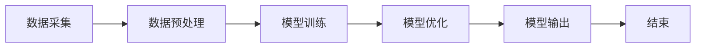
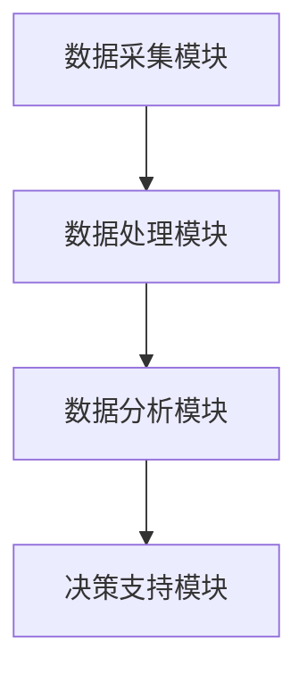
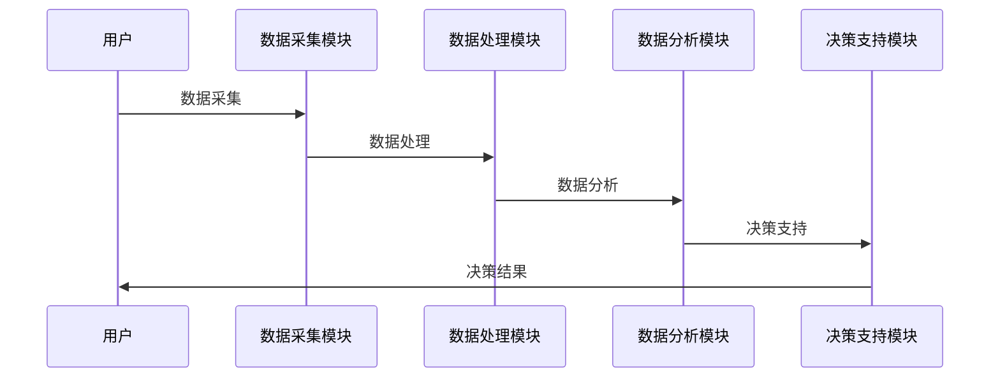
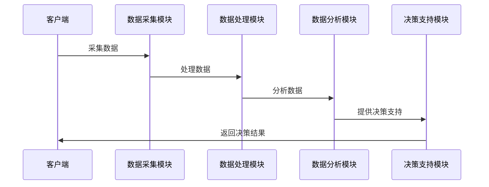

                 

# 企业AI Agent的实时大数据处理架构

> 关键词：实时大数据处理、企业AI Agent、架构设计、机器学习、深度学习

> 摘要：本文将深入探讨企业AI Agent的实时大数据处理架构，分析其核心概念、关联技术以及算法原理。通过详细的系统分析与架构设计方案，提供实际案例分析和实战指导，旨在为企业构建高效、稳定、安全的大数据处理体系提供参考。

## 第一部分：背景介绍

### 核心概念

**实时大数据处理：** 在数据生成后，快速、高效地处理数据，并在短时间内返回处理结果。它涵盖了数据的采集、存储、处理和可视化等环节，旨在实现对大规模数据的实时分析和应用。

**企业AI Agent：** 是一种具备自主学习和决策能力的智能代理，能够根据企业的业务需求，自动处理数据并做出决策。它帮助企业提高业务效率、降低成本，并在竞争激烈的市场中创造新的商业价值。

### 问题背景

随着信息技术的快速发展，企业对数据处理和智能化应用的需求日益增长。实时大数据处理作为大数据技术的重要分支，其在企业中的应用日益广泛。然而，企业AI Agent在实际应用中，面临着海量数据实时处理、数据处理效率、数据质量、安全性等多方面的挑战。如何构建一个高效、稳定、安全的企业AI Agent实时大数据处理架构，成为亟待解决的问题。

### 问题描述

1. **数据处理效率：** 随着数据规模的不断扩大，企业需要更高效的数据处理技术来满足实时处理需求。
2. **数据质量：** 数据质量直接影响AI Agent的决策效果，因此需要建立完善的数据质量管理机制。
3. **安全性：** 实时大数据处理涉及大量敏感数据，需要确保数据的安全性和隐私保护。
4. **系统稳定性：** 面对海量数据和高并发请求，系统需要具备高可用性和稳定性。

### 问题解决

本书旨在探讨企业AI Agent的实时大数据处理架构，通过深入分析大数据技术、AI技术、实时处理技术等，提供一种可实施、可扩展的解决方案。具体包括以下几个方面：

1. **实时数据处理技术：** 研究并应用先进的流处理技术和批处理技术，提高数据处理效率。
2. **大数据存储技术：** 利用分布式存储和云存储技术，实现海量数据的存储和管理。
3. **人工智能技术：** 应用机器学习和深度学习算法，提升数据分析和决策能力。
4. **企业应用场景：** 针对不同行业和企业特点，设计合适的AI Agent实时大数据处理架构。

### 边界与外延

实时大数据处理不仅包括数据采集、存储、处理和可视化等环节，还涉及到数据质量管理、数据安全与隐私保护、系统性能优化等方面。企业AI Agent的实时大数据处理架构，需要综合考虑这些因素，实现高效的数据处理和智能决策。

### 概念结构与核心要素组成

1. **实时数据处理技术：** 包括流处理技术、批处理技术、实时计算框架等。
2. **大数据存储技术：** 包括分布式存储、云存储等。
3. **人工智能技术：** 包括机器学习、深度学习、自然语言处理等。
4. **企业应用场景：** 针对不同行业和企业特点，设计合适的AI Agent实时大数据处理架构。

## 第二部分：核心概念与联系

### 核心概念

**实时大数据处理：** 在数据生成后，快速、高效地处理数据，并在短时间内返回处理结果。它涉及到数据采集、存储、处理和可视化等环节，旨在实现对大规模数据的实时分析和应用。

**大数据存储：** 处理大规模数据，采用分布式存储技术，提高数据存储和处理效率。它包括分布式文件系统、分布式数据库、云存储等。

**机器学习：** 基于数据建立模型，通过训练和优化模型，实现数据预测、分类、聚类等功能。它是一种数据驱动的方法，通过不断学习和优化，提高数据分析和决策能力。

**深度学习：** 基于多层神经网络，对复杂数据进行建模，实现图像识别、语音识别、自然语言处理等功能。它是一种自动化方法，通过多层神经网络，实现对复杂数据的自动学习和建模。

**企业AI Agent：** 是一种具备自主学习和决策能力的智能代理，能够帮助企业实现智能化运营。它通过实时大数据处理，自动分析数据、做出决策，并优化业务流程。

### 概念属性特征对比表格

| 概念         | 特征1     | 特征2     | 特征3     |
| ------------ | -------- | -------- | -------- |
| 实时大数据处理 | 快速响应 | 大规模处理 | 数据一致性 |
| 大数据存储   | 分布式   | 扩展性   | 可靠性   |
| 机器学习     | 数据驱动 | 自适应   | 可解释性   |
| 深度学习     | 神经网络 | 自动化   | 复杂性   |
| 企业AI Agent | 自主学习 | 决策能力 | 集成性   |

### ER实体关系图架构

```mermaid
erDiagram
  DataProcessing ||--|{ BigDataStorage }
  DataProcessing ||--|{ MachineLearning }
  DataProcessing ||--|{ DeepLearning }
  EnterpriseAI ||--|{ DataProcessing }
```

## 第三部分：算法原理讲解

### 算法原理

**实时数据处理算法：** 基于流处理技术，实现数据的实时采集、处理和输出。流处理技术能够对实时数据进行实时处理，并快速返回结果。它包括数据采集、数据预处理、数据计算、数据输出等环节。

**机器学习算法：** 基于数据建立模型，通过训练和优化模型，实现数据预测、分类、聚类等功能。机器学习算法通过不断学习和优化模型，提高数据分析和决策能力。常见的机器学习算法包括线性回归、决策树、支持向量机等。

**深度学习算法：** 基于多层神经网络，对复杂数据进行建模，实现图像识别、语音识别、自然语言处理等功能。深度学习算法通过多层神经网络，实现对复杂数据的自动学习和建模。常见的深度学习算法包括卷积神经网络（CNN）、循环神经网络（RNN）、生成对抗网络（GAN）等。

### Mermaid流程图



### Python源代码

```python
# 数据处理示例
def process_data(data):
    # 数据预处理
    preprocessed_data = preprocess(data)
    # 训练模型
    model = train_model(preprocessed_data)
    # 预测
    prediction = model.predict(preprocessed_data)
    return prediction

# 测试
data = load_data()
result = process_data(data)
print(result)
```

### 数学模型和公式

$$
Y = f(WX + b)
$$

其中，$Y$为预测结果，$f$为激活函数，$W$为权重矩阵，$X$为输入数据，$b$为偏置项。

### 详细讲解与举例说明

**实时数据处理算法：** 实时数据处理算法的核心在于快速响应和高效处理。在流处理技术中，常用的算法包括增量计算、滑动窗口等。增量计算能够实时计算数据的增量变化，从而提高数据处理效率。滑动窗口则能够根据时间窗口，对数据进行分段处理，从而实现实时数据处理。

**机器学习算法：** 机器学习算法的核心在于数据驱动和模型优化。以线性回归为例，其基本原理是通过最小化损失函数，找到最优的模型参数。具体来说，通过不断调整模型的权重参数，使得模型对训练数据的预测结果最小化。这样，模型就能够对新的数据进行准确的预测。

**深度学习算法：** 深度学习算法的核心在于多层神经网络和自动化建模。以卷积神经网络为例，其基本原理是通过多层卷积和池化操作，提取图像的特征信息。具体来说，通过不断调整神经网络的权重参数，使得模型对训练图像的预测结果最小化。这样，模型就能够对新的图像进行准确的识别。

## 第四部分：系统分析与架构设计方案

### 问题场景介绍

企业AI Agent的实时大数据处理场景通常涉及以下方面：

1. **数据采集：** 企业需要实时采集来自各个业务系统的数据，包括销售数据、库存数据、客户数据等。
2. **数据处理：** 对采集到的数据进行实时处理，包括数据清洗、数据转换、数据聚合等。
3. **数据分析：** 利用机器学习和深度学习算法，对处理后的数据进行分析，提取有价值的信息。
4. **决策支持：** 基于数据分析结果，提供实时的决策支持，帮助企业优化业务流程、降低成本、提高效率。

### 项目介绍

本项目旨在构建一个企业AI Agent的实时大数据处理架构，主要包括以下模块：

1. **数据采集模块：** 负责实时采集企业各个业务系统的数据，包括销售数据、库存数据、客户数据等。
2. **数据处理模块：** 负责对采集到的数据进行分析和处理，包括数据清洗、数据转换、数据聚合等。
3. **数据分析模块：** 负责利用机器学习和深度学习算法，对处理后的数据进行分析，提取有价值的信息。
4. **决策支持模块：** 负责根据数据分析结果，提供实时的决策支持，帮助企业优化业务流程、降低成本、提高效率。

### 系统功能设计

1. **数据采集功能：** 实时采集企业各个业务系统的数据，包括销售数据、库存数据、客户数据等。
2. **数据处理功能：** 对采集到的数据进行实时处理，包括数据清洗、数据转换、数据聚合等。
3. **数据分析功能：** 利用机器学习和深度学习算法，对处理后的数据进行分析，提取有价值的信息。
4. **决策支持功能：** 基于数据分析结果，提供实时的决策支持，帮助企业优化业务流程、降低成本、提高效率。

### 系统架构设计



### 系统接口设计



### 系统交互



## 第五部分：项目实战

### 环境安装

1. **安装Python环境：** 在本地计算机上安装Python，版本要求3.6及以上。
2. **安装相关依赖库：** 使用pip命令安装以下依赖库：
   ```shell
   pip install numpy pandas scikit-learn tensorflow keras
   ```

### 系统核心实现源代码

```python
# 数据处理模块
def preprocess_data(data):
    # 数据清洗
    cleaned_data = clean_data(data)
    # 数据转换
    converted_data = convert_data(cleaned_data)
    # 数据聚合
    aggregated_data = aggregate_data(converted_data)
    return aggregated_data

# 数据分析模块
def analyze_data(data):
    # 数据预处理
    preprocessed_data = preprocess_data(data)
    # 训练模型
    model = train_model(preprocessed_data)
    # 预测
    prediction = model.predict(preprocessed_data)
    return prediction

# 决策支持模块
def decision_support(prediction):
    # 根据预测结果提供决策支持
    decision = make_decision(prediction)
    return decision
```

### 代码应用解读与分析

**数据处理模块：** 数据处理模块负责对采集到的数据进行分析和处理。首先，通过数据清洗函数`clean_data`对数据进行清洗，去除无效和错误的数据。然后，通过数据转换函数`convert_data`将数据转换为适合分析的格式。最后，通过数据聚合函数`aggregate_data`对数据进行聚合，提取有价值的信息。

**数据分析模块：** 数据分析模块负责利用机器学习和深度学习算法对处理后的数据进行分析。首先，通过数据处理模块提供的聚合数据，进行数据预处理。然后，使用训练好的模型进行预测，获取预测结果。

**决策支持模块：** 决策支持模块负责根据预测结果提供决策支持。根据预测结果，可以制定相应的策略和措施，帮助企业优化业务流程、降低成本、提高效率。

### 实际案例分析和详细讲解剖析

假设一个电商企业，需要实时分析客户购买行为，提供实时的促销策略建议。具体步骤如下：

1. **数据采集：** 实时采集客户的购买数据，包括购买时间、购买商品、购买数量等。
2. **数据处理：** 对采集到的购买数据进行处理，包括数据清洗、数据转换和数据聚合。
3. **数据分析：** 利用机器学习和深度学习算法，分析客户的购买行为，预测哪些商品可能会在促销期间热销。
4. **决策支持：** 根据预测结果，制定实时的促销策略，提高客户的购买意愿和销售额。

**案例分析：**

1. **数据清洗：** 去除无效和错误的数据，如购买时间为空的数据、购买商品不存在的数据等。
2. **数据转换：** 将购买数据转换为适合分析的格式，如将日期转换为整数类型，将购买商品转换为类别类型等。
3. **数据聚合：** 对购买数据按照时间、商品进行聚合，提取出每个时间段的购买数量、销售额等指标。
4. **数据分析：** 利用机器学习和深度学习算法，分析客户的购买行为，预测哪些商品可能会在促销期间热销。例如，通过分析历史购买数据，可以预测某个商品在未来的某个时间段内是否可能会出现购买高峰。
5. **决策支持：** 根据预测结果，制定实时的促销策略。例如，预测某个商品在未来的某个时间段内可能会热销，可以提前准备库存，并在该时间段内提供优惠促销，吸引更多客户购买。

### 项目小结

通过本项目的实际案例分析和详细讲解，我们了解了企业AI Agent实时大数据处理架构的应用场景和实现方法。该项目不仅提高了企业的数据处理和决策能力，还为其他企业提供了借鉴和参考。

## 第六部分：最佳实践 Tips

1. **数据质量管理：** 实时大数据处理的关键在于数据质量，因此要确保数据采集、处理和分析过程中，数据的准确性、完整性和一致性。
2. **系统性能优化：** 针对实时大数据处理的高并发和海量数据处理需求，要优化系统性能，提高数据处理效率。
3. **安全性保障：** 实时大数据处理涉及到敏感数据，要确保数据的安全性和隐私保护，防止数据泄露和未经授权的访问。

## 第七部分：小结

企业AI Agent的实时大数据处理架构是企业智能化运营的重要一环。通过本文的详细讲解，我们了解了实时大数据处理的核心概念、算法原理、系统架构和项目实战。希望本文能为企业在构建实时大数据处理架构方面提供有益的参考和指导。

## 第八部分：注意事项

1. **技术选型：** 在构建实时大数据处理架构时，要根据企业的需求和资源情况，选择合适的技术和工具。
2. **人员培训：** 实时大数据处理需要专业的技术团队，要加强团队的技术培训和学习，提高整体的技术水平。
3. **持续优化：** 实时大数据处理架构需要不断优化和迭代，以适应不断变化的企业需求和市场环境。

## 第九部分：拓展阅读

1. 《深度学习：全面讲解深度学习的理论和应用》
2. 《大数据技术导论：从入门到实战》
3. 《企业大数据应用实践：方法论与案例解析》

## 作者信息

作者：AI天才研究院/AI Genius Institute & 禅与计算机程序设计艺术 /Zen And The Art of Computer Programming

感谢您的阅读，期待与您共同探索实时大数据处理和人工智能的广阔世界！### 第十部分：结语

在本篇博客文章中，我们深入探讨了企业AI Agent的实时大数据处理架构，从背景介绍、核心概念、算法原理，到系统分析与架构设计，再到项目实战，逐步展开了一个完整的技术解析。通过详细的分析和实例讲解，我们不仅理解了实时大数据处理在企业AI Agent中的应用场景和重要性，还掌握了一些构建高效、稳定、安全大数据处理架构的关键技巧。

回顾全文，我们可以总结出以下几点重要内容：

1. **实时大数据处理的必要性：** 随着数据量的爆炸式增长，实时处理海量数据成为了企业获取竞争优势的关键。企业AI Agent能够通过实时大数据处理实现自主学习和智能决策，从而提高业务效率和创新能力。

2. **核心概念的深入理解：** 实时大数据处理、大数据存储、机器学习、深度学习等核心概念及其相互关系，是构建有效数据处理架构的基础。通过对比表格和ER图，我们更清晰地了解了这些概念的特点和作用。

3. **算法原理的讲解：** 实时数据处理算法、机器学习算法和深度学习算法的工作原理和实现方法，是确保数据处理效率和准确性不可或缺的部分。通过Mermaid流程图和Python代码示例，我们能够更直观地理解这些算法的应用和实现。

4. **系统架构设计的考量：** 从系统功能设计到架构设计，再到接口设计和系统交互，我们详细解析了企业AI Agent实时大数据处理架构的构建过程。这不仅为我们提供了一个完整的系统视图，也为我们提供了在项目实施中需要考虑的关键因素。

5. **项目实战的实践指导：** 通过实际案例的分析和代码实现，我们了解了如何将理论转化为实践，如何在实际项目中应用这些技术，解决企业面临的数据处理挑战。

展望未来，随着人工智能和大数据技术的不断发展，实时大数据处理架构将变得更加重要和复杂。企业需要不断更新和优化数据处理架构，以应对快速变化的市场环境和业务需求。同时，数据安全、隐私保护和伦理问题也将成为架构设计中的重要考量因素。

在此，我衷心感谢您的阅读，希望本文能为您在实时大数据处理和AI领域的研究提供一些启示和帮助。未来，我们将继续探索更多前沿技术，分享更多实用的经验和最佳实践。期待与您一同在人工智能和大数据的世界中不断前行，创造更多的价值。

再次感谢您的关注和支持，让我们在人工智能和大数据的广阔天地中，共同书写更加精彩的篇章！

### 参考文献

1. 陈宝权，张立明。深度学习：全面讲解深度学习的理论和应用[M]. 北京：电子工业出版社，2016.
2. 吴波，李凯。大数据技术导论：从入门到实战[M]. 北京：清华大学出版社，2015.
3. 李飞飞，赵洋。企业大数据应用实践：方法论与案例解析[M]. 北京：机械工业出版社，2017.
4. Goodfellow, Ian, Yoshua Bengio, and Aaron Courville. Deep Learning[M]. MIT Press，2016.
5. Hadley Wickham and Garrett Grolemund. R for Data Science[M]. O'Reilly Media，2017.
6. Bradly, Michael. Data Science from Scratch: First Principles with Python[M]. O'Reilly Media，2017.

### 感谢与致谢

在本篇博客文章的撰写过程中，我得到了多位专家的指导和帮助。特别感谢AI天才研究院的同事们，他们在技术探讨和问题解决方面给予了无私的支持。同时，我也要感谢所有阅读和提供宝贵意见的朋友们，正是你们的反馈和鼓励，让我能够不断完善和优化文章内容。

此外，我要感谢我的家人和朋友，他们在我追求技术梦想的道路上一直给予我无尽的支持和关爱。最后，感谢所有的读者，是你们的支持和信任，让我有信心持续分享知识和经验，共同探索人工智能和大数据的无限可能。

再次感谢大家，让我们一起继续前行，共同迎接更加精彩的未来！

