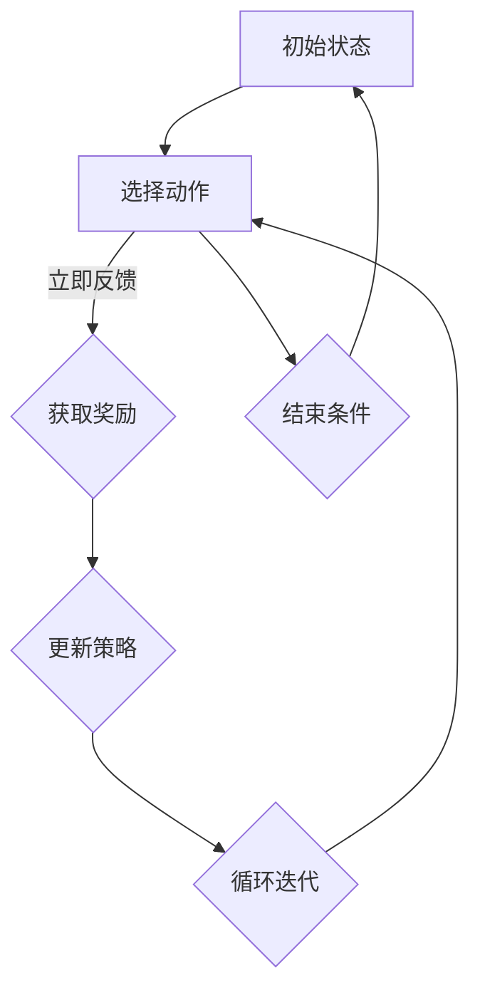
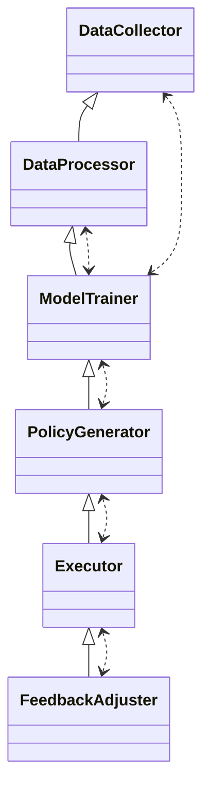
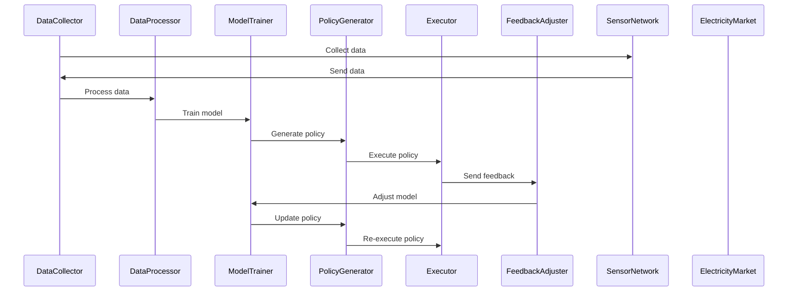
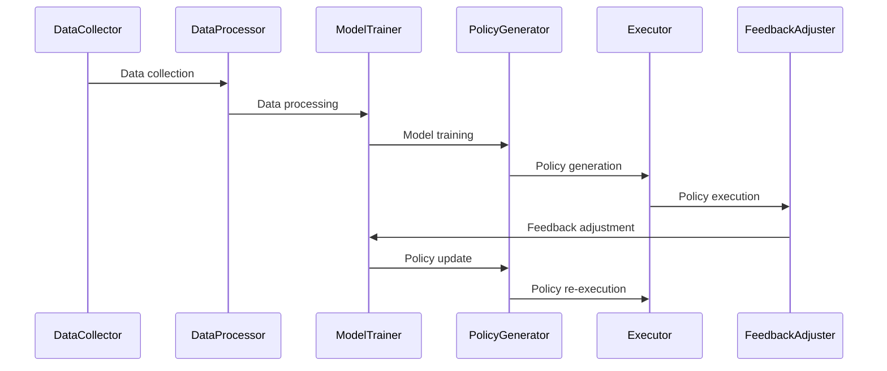

                 

### 关键词

1. **智能电网管理**：智能电网通过先进技术实现高效、可靠、可持续的电力传输与分配。
2. **企业AI Agent**：在商业环境中自主运作、不断学习和适应的智能实体。
3. **强化学习**：通过试错和反馈来学习如何在动态环境中作出最优决策。
4. **实时优化**：在实时数据流中不断调整决策以实现最大化效益或最小化成本。
5. **算法原理**：强化学习算法的数学模型和实现细节。
6. **系统架构**：智能电网管理系统的结构设计和功能模块。
7. **案例分析**：实际项目中强化学习在智能电网管理中的具体应用。

### 摘要

本文深入探讨了企业AI Agent在智能电网管理中的应用，特别关注强化学习算法的实时优化能力。首先，介绍了智能电网管理的现状与挑战，以及强化学习在其中的重要作用。接着，详细阐述了企业AI Agent的定义、特点及设计原则，并通过具体案例展示了其在金融、零售和制造业中的应用。随后，本文介绍了强化学习的核心原理和常用算法，并使用Python代码展示了算法的实现过程。文章还通过一个实际项目，详细分析了系统架构、功能设计、接口设计和交互流程，最后给出了项目的实战经验和最佳实践建议。通过本文，读者将全面了解如何利用强化学习和企业AI Agent实现智能电网管理的实时优化。

## 第一部分：背景与概述

### 第1章 智能电网管理的现状与挑战

### 1.1 问题背景

#### 1.1.1 智能电网的定义与发展

智能电网是指通过现代通信技术、传感技术、控制技术和计算机技术，将电力系统与信息网络深度融合，形成一种能够实现高效、可靠、经济、绿色的电力供应与消费网络。智能电网的发展可以追溯到20世纪90年代，当时电力系统面临着一系列挑战，如能源消耗增加、环境污染加剧、电力供需不平衡等。为了解决这些问题，研究人员开始探索如何将电力系统与信息技术相结合，从而提高电力系统的运行效率和灵活性。

智能电网的核心在于其信息传输和处理能力。传统的电力系统主要依靠物理设备进行电力传输和分配，而智能电网则通过在电力系统中集成传感器、智能电表、远程终端单元（RTU）等设备，实现实时数据采集、传输和处理。这些数据可以用来优化电力资源的配置，提高电网的可靠性和经济性。

#### 1.1.2 智能电网管理的重要性

智能电网管理的核心目标是实现电力资源的最优化分配，确保电网的稳定运行，同时提高能源利用效率和降低成本。在传统电网中，电力资源的分配通常由中央控制室进行调度，这种方式存在几个问题：首先，信息传递延迟较大，导致无法实时响应电网的变化；其次，电力系统中的数据采集和处理能力有限，无法全面了解电网的运行状态；最后，传统电网的调度策略相对固定，无法根据实时数据动态调整。

相比之下，智能电网管理通过实时数据采集和智能分析，可以更准确地预测电力需求，优化电力资源的配置，提高电网的灵活性和可靠性。例如，在电力负荷高峰期间，智能电网可以自动调度备用电源，避免电网过载；在可再生能源发电不稳定时，智能电网可以及时调整电力供需平衡，确保电网的稳定运行。

#### 1.1.3 智能电网管理面临的挑战

尽管智能电网管理具有巨大的潜力和优势，但其实施和应用过程中仍然面临一系列挑战：

1. **技术挑战**：智能电网管理需要高度集成的技术和复杂的系统架构，包括传感器技术、通信技术、数据分析技术、控制技术等。这些技术的实现和集成需要大量的研发投入和专业知识。

2. **数据隐私和安全**：智能电网中大量的数据采集和处理，涉及用户隐私和电网安全。如何确保数据的保密性和安全性，防止数据泄露和恶意攻击，是智能电网管理必须解决的重要问题。

3. **兼容性和标准化**：智能电网管理涉及多种设备和技术，如何实现不同设备和技术之间的兼容性，制定统一的标准和规范，是智能电网管理面临的重要挑战。

4. **成本和效益**：智能电网管理的初期投资较大，需要长期的成本效益分析，以确保投资能够带来可持续的回报。

### 1.2 问题描述

#### 1.2.1 实时优化需求

智能电网管理的核心需求是实现电力资源的最优化分配，而实时优化是实现这一目标的关键。实时优化是指在电力系统运行过程中，根据实时数据动态调整电力资源的配置，以最大化效益或最小化成本。例如，在电力负荷高峰期间，实时优化可以调度备用电源，避免电网过载；在可再生能源发电不稳定时，实时优化可以调整电力供需平衡，确保电网的稳定运行。

实时优化的需求来源于以下几个方面：

1. **电力需求的波动性**：电力需求受到多种因素的影响，如季节、天气、经济活动等，导致电力需求呈现出显著的波动性。为了应对这些波动，电网需要具备实时调整的能力。

2. **可再生能源的波动性**：随着可再生能源（如太阳能、风能）在电力系统中的比例增加，可再生能源发电的波动性成为电网管理的重要挑战。实时优化可以动态调整电力资源，平衡可再生能源的波动性。

3. **电网的复杂性和规模**：现代电网规模庞大，结构复杂，包含多种电源和负荷，如何高效、可靠地管理这些资源，实现最优配置，是电网管理面临的重大挑战。

4. **多目标优化**：智能电网管理需要同时考虑多个优化目标，如最小化成本、最大化效率、提高可靠性等。这些目标往往存在冲突，需要通过实时优化来实现平衡。

#### 1.2.2 强化学习在智能电网管理中的应用

强化学习是一种通过试错和反馈来学习如何在动态环境中作出最优决策的人工智能技术。强化学习在智能电网管理中具有广泛的应用前景，其核心优势在于能够通过不断学习和适应，实现实时优化。

1. **自适应能力**：强化学习通过不断与环境互动，能够自动调整决策策略，以适应环境的变化。在智能电网管理中，环境变化包括电力需求的波动、可再生能源的波动、电网故障等。强化学习可以实时响应这些变化，调整电力资源的配置。

2. **多目标优化**：强化学习能够同时考虑多个优化目标，如成本、效率、可靠性等，并通过学习找到最优平衡点。在智能电网管理中，不同的优化目标往往存在冲突，强化学习可以帮助电网管理者在多目标之间找到最优解。

3. **决策灵活性**：强化学习能够根据实时数据做出灵活的决策，不受预先设定的规则限制。在智能电网管理中，这种灵活性尤为重要，因为电力系统是一个高度动态的环境，需要不断调整策略以应对各种突发情况。

4. **自动化**：强化学习可以通过学习自动生成决策策略，减少人工干预。在智能电网管理中，自动化可以提高管理效率，减少人工操作错误，提高电网的运行稳定性。

#### 1.2.3 企业AI Agent的角色

企业AI Agent是指在企业运营中自主运作、不断学习和适应的智能实体。在企业AI Agent的架构中，强化学习算法是其核心组件之一。企业AI Agent在智能电网管理中的角色主要包括：

1. **实时数据分析**：企业AI Agent可以通过传感器和智能电表收集实时数据，对电力系统的运行状态进行实时监测。

2. **决策制定**：企业AI Agent基于强化学习算法，根据实时数据和历史经验，制定最优的电力资源分配策略。

3. **策略优化**：企业AI Agent不断学习环境变化，优化决策策略，以适应不同的运行场景。

4. **自动化执行**：企业AI Agent可以自动化执行决策，调整电力资源的配置，实现实时优化。

通过企业AI Agent，智能电网管理可以实现更高的灵活性和效率，为电网管理者提供强有力的决策支持。

### 1.3 问题解决

#### 1.3.1 企业AI Agent的强化学习方案

企业AI Agent的强化学习方案是智能电网管理中的一个创新性解决方案，其核心在于通过强化学习算法实现实时优化。具体方案包括以下几个步骤：

1. **数据采集**：企业AI Agent通过传感器和智能电表收集实时数据，包括电力需求、可再生能源发电量、电网负载等。

2. **模型训练**：企业AI Agent使用收集到的数据训练强化学习模型，以预测未来的电力需求和电网状态。

3. **策略生成**：企业AI Agent根据预测结果，使用强化学习算法生成最优的电力资源分配策略。

4. **策略执行**：企业AI Agent自动化执行策略，调整电力资源的配置，实现实时优化。

5. **反馈调整**：企业AI Agent通过不断接收环境反馈，调整策略，提高决策准确性。

#### 1.3.2 强化学习的优势与挑战

强化学习在智能电网管理中具有明显的优势，但也面临一些挑战。

1. **优势**：
   - **自适应能力**：强化学习能够自动适应环境变化，实时调整策略。
   - **多目标优化**：强化学习能够同时考虑多个优化目标，找到最优平衡点。
   - **决策灵活性**：强化学习能够根据实时数据做出灵活的决策，不受预先设定的规则限制。
   - **自动化**：强化学习可以通过学习自动生成决策策略，减少人工干预。

2. **挑战**：
   - **数据质量和准确性**：强化学习模型的准确性高度依赖于数据的质量和准确性。如果数据存在噪声或不准确，可能导致决策错误。
   - **计算复杂度**：强化学习算法通常涉及大量的迭代计算，对计算资源要求较高，特别是在大规模电网中。
   - **模型解释性**：强化学习模型的决策过程通常较为复杂，难以解释，这对模型的部署和监管带来挑战。
   - **安全性和隐私**：智能电网管理涉及大量的敏感数据，如何确保数据的安全性和隐私性，是强化学习应用中需要解决的问题。

#### 1.3.3 企业AI Agent的设计原则

为了确保企业AI Agent在智能电网管理中的有效性和可靠性，其设计需要遵循以下原则：

1. **模块化**：企业AI Agent应采用模块化设计，将不同的功能模块（如数据采集、模型训练、策略生成等）分离，便于维护和升级。

2. **可扩展性**：企业AI Agent应具备良好的可扩展性，能够根据业务需求和技术发展，灵活扩展功能。

3. **容错性**：企业AI Agent应具备较高的容错性，能够在出现故障时自动恢复，确保系统的稳定运行。

4. **实时性**：企业AI Agent应具备高实时性，能够快速响应环境变化，制定和执行策略。

5. **可解释性**：企业AI Agent的决策过程应具备较高的可解释性，便于电网管理者理解和监管。

### 1.4 边界与外延

#### 1.4.1 智能电网管理的边界

智能电网管理主要涉及以下几个方面：

1. **电力资源分配**：优化电力资源的配置，确保电网的稳定运行和高效利用。
2. **电力需求响应**：通过实时数据分析和预测，调整电力需求，平衡供需。
3. **电网故障处理**：快速检测和处理电网故障，确保电网的安全稳定。
4. **能源效率提升**：通过优化电力资源分配，提高能源利用效率，减少能源浪费。

#### 1.4.2 企业AI Agent的应用领域

企业AI Agent在智能电网管理中的应用非常广泛，包括但不限于以下领域：

1. **电力调度**：通过强化学习算法，实时调整电力资源的分配，提高电网的调度效率。
2. **需求响应**：根据实时数据预测电力需求，制定需求响应策略，平衡供需。
3. **电网故障诊断**：利用机器学习算法，快速检测和处理电网故障，提高电网的稳定性。
4. **能源管理**：通过数据分析，优化能源使用，提高能源效率，减少能源浪费。

#### 1.4.3 强化学习的适用场景

强化学习在智能电网管理中具有广泛的应用场景，主要包括：

1. **实时优化**：通过强化学习，实现电力资源在实时数据流中的动态调整，提高电网的灵活性和可靠性。
2. **电力调度**：利用强化学习，优化电力调度策略，提高电网调度效率。
3. **需求响应**：通过强化学习，制定智能化的需求响应策略，平衡供需。
4. **能源管理**：利用强化学习，优化能源使用，提高能源利用效率。

### 1.5 概念结构与核心要素组成

#### 1.5.1 企业AI Agent的核心要素

企业AI Agent的核心要素包括：

1. **传感器数据采集**：通过传感器收集实时数据，包括电力需求、电网状态等。
2. **数据处理与存储**：对采集到的数据进行处理和存储，为模型训练和决策提供数据支持。
3. **强化学习算法**：实现决策制定和策略优化，通过学习环境反馈，不断优化决策策略。
4. **自动化执行**：自动化执行决策，调整电力资源的配置，实现实时优化。

#### 1.5.2 强化学习算法的关键组成部分

强化学习算法的关键组成部分包括：

1. **决策动作**：智能体在环境中可以执行的各种动作。
2. **环境状态**：智能体所处的外部环境状态。
3. **奖励函数**：根据智能体的动作和环境状态，提供的奖励信号，用于评估决策效果。
4. **策略迭代**：通过迭代过程，智能体不断调整决策策略，以实现最优目标。

#### 1.5.3 智能电网管理应用场景的结构

智能电网管理应用场景的结构包括以下几个层次：

1. **感知层**：通过传感器和智能设备，收集实时数据，包括电力需求、电网状态等。
2. **数据层**：对感知层收集到的数据进行处理和存储，为后续分析提供数据支持。
3. **决策层**：通过强化学习算法，分析数据，制定电力资源分配策略。
4. **执行层**：自动化执行决策，调整电力资源的配置，实现实时优化。

### 1.6 本章小结

本章介绍了智能电网管理的现状与挑战，以及强化学习在其中的重要作用。通过企业AI Agent，强化学习能够实现实时优化，提高智能电网管理的灵活性和效率。本章详细阐述了企业AI Agent的定义、特点及设计原则，并介绍了强化学习的核心原理和算法。通过本章的学习，读者将全面了解智能电网管理的核心概念和实施方法，为后续内容的学习打下坚实基础。

## 第二部分：核心概念与原理

### 第2章 企业AI Agent

### 2.1 企业AI Agent的定义与特点

#### 2.1.1 企业AI Agent的定义

企业AI Agent是一种在商业环境中自主运作、具备自我学习和适应能力的智能实体。它通过模拟人类智能体的行为，能够在复杂动态的环境中实现自主决策和任务执行。企业AI Agent的设计目标是提高企业的运营效率，降低成本，提升客户满意度，并在日益复杂的市场环境中保持竞争力。

#### 2.1.2 企业AI Agent的特点

企业AI Agent具有以下几个显著特点：

1. **自主性**：企业AI Agent能够独立运行，自主做出决策，无需人工干预。这种自主性使得AI Agent能够在实时环境中灵活应对各种变化。

2. **学习能力**：企业AI Agent通过机器学习和深度学习技术，能够从历史数据中学习，不断优化决策策略。这种学习能力使得AI Agent能够随着经验的积累不断提高性能。

3. **适应性**：企业AI Agent能够适应不同的业务场景和市场需求，通过自我调整和优化，实现业务流程的自动化和智能化。

4. **协作性**：企业AI Agent不仅能够独立完成任务，还可以与其他AI Agent或人类协作，共同实现复杂任务。

5. **透明性**：企业AI Agent的决策过程和运作机制是透明的，企业可以实时监控AI Agent的运行状态和决策过程，确保AI Agent的行为符合预期。

#### 2.1.3 企业AI Agent的优势

企业AI Agent在商业环境中具有以下几个优势：

1. **提高效率**：企业AI Agent能够自动化执行重复性高、耗时长的任务，提高工作效率，减少人工劳动成本。

2. **降低风险**：企业AI Agent通过数据分析和历史经验，可以更准确地预测市场趋势和风险，帮助企业做出更明智的决策，降低运营风险。

3. **优化资源分配**：企业AI Agent能够根据实时数据优化资源分配，提高资源利用效率，降低运营成本。

4. **提升客户体验**：企业AI Agent可以实时响应用户需求，提供个性化的服务，提升客户满意度。

5. **增强竞争力**：企业AI Agent能够帮助企业快速适应市场变化，保持竞争优势，提高市场占有率。

### 2.2 设计原则

为了确保企业AI Agent在商业环境中能够有效运行，其设计需要遵循以下原则：

#### 2.2.1 自主性

企业AI Agent应具备高度自主性，能够自主运行和决策，减少人工干预。这种自主性不仅包括执行具体任务的能力，还包括根据环境变化动态调整策略的能力。

#### 2.2.2 学习能力

企业AI Agent需要具备强大的学习能力，通过机器学习和深度学习技术，从历史数据和实时数据中学习，不断优化决策策略。这种学习能力使得AI Agent能够适应不断变化的市场环境。

#### 2.2.3 适应性

企业AI Agent应能够适应不同的业务场景和市场需求，通过自我调整和优化，实现业务流程的自动化和智能化。这种适应性包括对业务流程的灵活调整和对市场变化的快速响应。

#### 2.2.4 可扩展性

企业AI Agent的设计应具备良好的可扩展性，能够根据业务需求和技术发展，灵活扩展功能。这种可扩展性确保了AI Agent能够持续演进，满足未来需求。

#### 2.2.5 容错性

企业AI Agent应具备较高的容错性，能够在出现故障时自动恢复，确保系统的稳定运行。这种容错性包括对硬件故障、软件错误和通信中断等异常情况的自动处理能力。

#### 2.2.6 可解释性

企业AI Agent的决策过程和运作机制应具备较高的可解释性，企业可以实时监控AI Agent的运行状态和决策过程，确保AI Agent的行为符合预期。这种可解释性有助于提高企业的信任度和透明度。

### 2.3 架构设计

企业AI Agent的架构设计是确保其有效运行的关键。以下是一个典型的企业AI Agent架构设计：

#### 2.3.1 架构概述

企业AI Agent的架构通常包括以下几个关键组件：

1. **感知模块**：负责收集实时数据，包括业务数据、市场数据、用户行为数据等。
2. **数据处理模块**：对收集到的数据进行清洗、整合和预处理，为后续分析提供高质量的数据支持。
3. **学习模块**：利用机器学习和深度学习技术，对预处理后的数据进行训练和模型优化。
4. **决策模块**：根据学习模块生成的模型和实时数据，制定最优的决策策略。
5. **执行模块**：自动化执行决策策略，调整业务流程和资源分配，实现实际操作。
6. **反馈模块**：收集执行结果，提供反馈信号，用于模型优化和策略调整。

#### 2.3.2 硬件与软件需求

企业AI Agent的硬件与软件需求包括：

1. **硬件需求**：
   - 高性能计算服务器：用于处理大量数据和运行机器学习算法。
   - 数据存储设备：用于存储大量的历史数据和实时数据。
   - 网络设备：用于数据传输和通信。

2. **软件需求**：
   - 操作系统：如Linux、Windows Server等，用于管理服务器和设备。
   - 数据库管理系统：如MySQL、PostgreSQL等，用于存储和管理数据。
   - 数据处理和分析工具：如Python、R、Apache Spark等，用于数据处理和分析。
   - 机器学习和深度学习框架：如TensorFlow、PyTorch、Keras等，用于模型训练和优化。

#### 2.3.3 数据流与信息处理流程

企业AI Agent的数据流与信息处理流程如下：

1. **数据采集**：感知模块从各种数据源（如业务系统、传感器、用户反馈等）收集数据。
2. **数据处理**：数据处理模块对采集到的数据进行清洗、整合和预处理，生成高质量的数据集。
3. **模型训练**：学习模块使用预处理后的数据集训练机器学习模型，并进行模型优化。
4. **决策制定**：决策模块根据训练好的模型和实时数据，制定最优的决策策略。
5. **执行操作**：执行模块自动化执行决策策略，调整业务流程和资源分配。
6. **结果反馈**：反馈模块收集执行结果，提供反馈信号，用于模型优化和策略调整。

### 2.4 企业AI Agent在不同行业的应用

#### 2.4.1 金融行业

在金融行业中，企业AI Agent主要用于风险管理、客户服务、投资组合管理和市场预测等方面。

1. **风险管理**：企业AI Agent通过分析历史数据和实时数据，预测市场风险，制定风险管理策略，帮助企业规避风险。
2. **客户服务**：企业AI Agent可以自动化处理客户查询、投诉和建议，提供个性化的客户服务，提升客户满意度。
3. **投资组合管理**：企业AI Agent通过分析市场数据和历史投资记录，优化投资组合，提高投资收益。
4. **市场预测**：企业AI Agent可以预测市场趋势，帮助企业在投资决策、产品研发和市场策略上做出更准确的判断。

#### 2.4.2 零售业

在零售行业中，企业AI Agent主要用于库存管理、需求预测、客户行为分析和营销策略优化等方面。

1. **库存管理**：企业AI Agent通过分析销售数据和历史库存记录，预测未来的库存需求，优化库存水平，减少库存成本。
2. **需求预测**：企业AI Agent可以预测产品需求，帮助零售商制定采购和销售计划，提高销售业绩。
3. **客户行为分析**：企业AI Agent通过分析客户行为数据，了解客户偏好和购买习惯，提供个性化的营销策略。
4. **营销策略优化**：企业AI Agent可以根据客户行为和市场需求，优化营销策略，提高营销效果。

#### 2.4.3 制造业

在制造业中，企业AI Agent主要用于生产调度、设备维护、质量控制和生产优化等方面。

1. **生产调度**：企业AI Agent通过分析生产数据和设备状态，优化生产计划，提高生产效率。
2. **设备维护**：企业AI Agent可以预测设备故障，制定维护计划，减少设备故障率，提高设备利用率。
3. **质量控制**：企业AI Agent通过分析生产数据和质量检验数据，识别质量异常，优化生产过程。
4. **生产优化**：企业AI Agent可以优化生产流程，提高生产效率和产品质量。

### 2.5 本章小结

本章详细介绍了企业AI Agent的定义、特点、设计原则和架构设计，并探讨了其在金融、零售和制造业中的应用。企业AI Agent通过自主性、学习能力、适应性、协作性和透明性等特性，为企业提供高效、智能的决策支持，提升运营效率和市场竞争力。随着技术的不断进步和应用场景的拓展，企业AI Agent将在更多行业中发挥重要作用。

### 第3章 强化学习

#### 3.1 强化学习的定义与核心原理

强化学习（Reinforcement Learning，RL）是一种机器学习方法，主要研究智能体（Agent）在不确定环境中通过学习获得最优行为策略。与监督学习和无监督学习不同，强化学习通过试错和反馈机制来学习如何在动态环境中作出最优决策。

#### 3.1.1 强化学习的定义

强化学习的基本定义是一个决策过程，其中智能体（Agent）在某个环境中通过选择行动（Action）来获取奖励（Reward），并逐渐学习到能够使其长期获得最大总奖励的策略（Policy）。

#### 3.1.2 强化学习的基本概念

1. **智能体（Agent）**：执行动作并从环境中获取奖励的实体。
2. **环境（Environment）**：智能体所处的环境，可以看作是一个状态转换和奖励产生的动态系统。
3. **状态（State）**：智能体在特定时间点的环境描述。
4. **动作（Action）**：智能体可以采取的行动。
5. **策略（Policy）**：智能体根据当前状态选择动作的概率分布。
6. **奖励（Reward）**：智能体执行动作后从环境中获得的即时反馈信号。
7. **价值函数（Value Function）**：预测在给定状态下采取特定动作的长期奖励。
8. **模型（Model）**：智能体对环境的动态转移概率和奖励分布的内部表示。

#### 3.1.3 强化学习与监督学习的区别

强化学习与监督学习在目标、数据集、反馈机制等方面存在显著区别：

1. **目标**：
   - **监督学习**：目标是学习输入和输出之间的映射关系，输出是固定的。
   - **强化学习**：目标是学习最优策略，以最大化累积奖励。

2. **数据集**：
   - **监督学习**：使用已标记的训练数据集进行学习。
   - **强化学习**：没有已标记的数据集，智能体通过与环境的交互来学习。

3. **反馈机制**：
   - **监督学习**：每一步的输出可以直接与真实标签进行比较，反馈是即时的。
   - **强化学习**：反馈是延迟的，需要通过累积奖励来评估决策效果。

#### 3.2 强化学习算法

强化学习算法有多种类型，每种算法都有其特定的特点和适用场景。以下介绍几种常见的强化学习算法：

1. **Q-Learning算法**
   - **定义**：Q-Learning是一种基于价值迭代的强化学习算法，通过学习状态-动作值函数（Q-Function）来制定最优策略。
   - **核心原理**：Q-Learning通过更新Q值来逐步改进策略。每个状态-动作对的Q值表示在该状态下执行该动作的预期累积奖励。
   - **公式**：
     $$ Q(s, a) \leftarrow Q(s, a) + \alpha [r + \gamma \max_{a'} Q(s', a') - Q(s, a)] $$
     其中，$Q(s, a)$是状态-动作值函数，$\alpha$是学习率，$r$是即时奖励，$\gamma$是折扣因子，$s'$是状态转移后的状态，$a'$是最佳动作。

2. **SARSA算法**
   - **定义**：SARSA（同步性自适应递归采样算法）是Q-Learning的变体，它使用同步性更新策略。
   - **核心原理**：SARSA在每一步都使用当前的状态和动作来更新Q值，而不是使用下一状态的最佳动作。
   - **公式**：
     $$ Q(s, a) \leftarrow Q(s, a) + \alpha [r + \gamma Q(s', a')] - Q(s, a)] $$

3. **DQN（Deep Q-Network）算法**
   - **定义**：DQN是一种使用深度神经网络（DNN）来近似Q值函数的强化学习算法。
   - **核心原理**：DQN通过训练DNN来预测状态-动作值函数，并使用经验回放（Experience Replay）和目标网络（Target Network）来避免过拟合。
   - **公式**：
     $$ Q(s, a; \theta) \leftarrow Q(s, a; \theta) + \alpha [r + \gamma \max_{a'} Q(s', a'; \theta^-) - Q(s, a; \theta)] $$
     其中，$\theta$是DNN的参数，$\theta^-$是目标网络的参数。

#### 3.3 强化学习在智能电网管理中的应用

强化学习在智能电网管理中具有广泛的应用，特别是在实时优化和动态决策方面。以下是一些应用实例：

1. **电力需求预测**：强化学习可以用于预测未来的电力需求，帮助电网运营商优化电力资源的配置。
2. **电力调度优化**：强化学习可以用于优化电力调度策略，提高电网的调度效率和可靠性。
3. **设备维护管理**：强化学习可以用于预测设备的故障风险，制定最优的设备维护计划。
4. **能源管理**：强化学习可以用于优化能源使用，降低能源消耗和成本。

### 3.4 Python源代码示例

以下是一个简单的Python示例，展示了如何使用Q-Learning算法实现一个基本的智能体在环境中的学习过程。

```python
import numpy as np
import random

# 状态空间
n_states = 4
# 动作空间
n_actions = 2
# Q值初始化
Q = np.zeros([n_states, n_actions])
# 学习率
alpha = 0.1
# 折扣因子
gamma = 0.9

# 环境模拟
def env(s, a):
    if s == 0 and a == 0:
        return 1, 1  # 状态转移和奖励
    elif s == 1 and a == 1:
        return 0, -1  # 状态转移和奖励
    else:
        return s, 0  # 状态转移和奖励

# Q-Learning算法
def q_learning(s, a, r, s_):
    Q[s][a] = Q[s][a] + alpha * (r + gamma * np.max(Q[s_]) - Q[s][a])

# 智能体运行
for episode in range(1000):
    s = random.randint(0, n_states-1)
    done = False
    while not done:
        a = np.argmax(Q[s])
        s_, r = env(s, a)
        q_learning(s, a, r, s_)
        s = s_
        if s == 0:
            done = True

# 打印Q值
print(Q)
```

在这个示例中，我们创建了一个简单的环境，其中智能体可以从四个状态中选择两个动作，并使用Q-Learning算法来学习最优策略。通过不断试错和反馈，智能体逐渐学会了在特定状态下选择最佳动作。

### 3.5 数学模型和数学公式

以下是对强化学习算法的数学模型和公式的详细讲解。

1. **Q-Learning算法的更新公式**：
   $$ Q(s, a) \leftarrow Q(s, a) + \alpha [r + \gamma \max_{a'} Q(s', a') - Q(s, a)] $$
   - $Q(s, a)$：状态-动作值函数，表示在状态`s`下执行动作`a`的预期累积奖励。
   - $\alpha$：学习率，控制每次更新Q值的大小。
   - $r$：即时奖励，表示执行动作后的即时回报。
   - $\gamma$：折扣因子，用于平衡当前奖励和未来奖励的重要性。
   - $s'$：状态转移后的状态。
   - $a'$：在状态`s'$下最佳的动作。

2. **SARSA算法的更新公式**：
   $$ Q(s, a) \leftarrow Q(s, a) + \alpha [r + \gamma Q(s', a')] - Q(s, a)] $$
   - 与Q-Learning算法类似，但使用当前状态下的最佳动作更新Q值。

3. **DQN算法的价值函数**：
   $$ V^{\pi}(s) = \sum_a \pi(a|s) Q(s, a) $$
   - $V^{\pi}(s)$：在策略$\pi$下，状态`s`的价值函数。
   - $\pi(a|s)$：在状态`s`下采取动作`a`的策略概率。
   - $Q(s, a)$：状态-动作值函数。

### 3.6 详细讲解与举例说明

以下通过一个具体实例，详细讲解强化学习算法的原理和应用。

**实例**：智能体在一个简单的环境（4个状态，2个动作）中学习最优策略。

1. **初始化Q值**：
   - 初始化所有状态-动作值函数为0。
   - $$ Q = \begin{bmatrix} 0 & 0 \\ 0 & 0 \\ 0 & 0 \\ 0 & 0 \end{bmatrix} $$

2. **选择动作**：
   - 智能体在状态`s`下，根据当前策略选择动作$a$。
   - 例如，使用$\epsilon$-贪心策略，在每一步随机选择动作的概率为$\epsilon$，选择最佳动作的概率为$1-\epsilon$。

3. **执行动作，获取奖励**：
   - 智能体执行动作$a$后，转移到下一个状态`s'$，并获取即时奖励$r$。
   - 例如，执行动作`0`后，状态从`s`转移到`s'`，并获取奖励`1`。

4. **更新Q值**：
   - 使用Q-Learning算法更新Q值，根据即时奖励和未来奖励更新当前状态-动作值函数。
   - 例如，如果当前状态`s`=2，执行动作$a`=0，下一个状态`s'`=1，即时奖励$r`=1，则更新公式为：
     $$ Q(2, 0) \leftarrow Q(2, 0) + \alpha [1 + \gamma \max_{a'} Q(1, a') - Q(2, 0)] $$
   - 通过不断迭代，智能体会逐渐学习到最优策略。

### 3.7 本章小结

本章介绍了强化学习的核心概念、算法原理及其在智能电网管理中的应用。通过Q-Learning、SARSA和DQN等算法，智能体可以在动态环境中通过学习获得最优策略，实现实时优化和动态决策。本章还通过Python源代码示例和具体实例，详细讲解了强化学习算法的原理和应用方法。读者通过本章的学习，将能够掌握强化学习的基本概念和实现技术，为后续内容的学习打下坚实基础。

## 第三部分：算法原理讲解

### 第3章 强化学习算法

### 3.1 强化学习算法mermaid流程图

为了更直观地理解强化学习算法的工作流程，我们使用mermaid流程图来展示其核心步骤。



1. **初始状态（A）**：智能体开始时处于某个状态。
2. **选择动作（B）**：根据当前状态，智能体选择一个动作。
3. **获取奖励（C）**：执行动作后，智能体从环境中获取即时奖励。
4. **更新策略（D）**：使用奖励和策略迭代算法（如Q-Learning）更新策略。
5. **循环迭代（E）**：重复上述步骤，直到满足结束条件（如达到预设步数或学习目标）。
6. **结束条件（F）**：算法停止，智能体输出最优策略。

### 3.2 算法原理的数学模型和公式

强化学习算法的核心在于如何通过数学模型来描述智能体与环境之间的交互过程，以及如何更新策略以实现最优决策。以下是一些基本的数学模型和公式：

1. **Q值更新公式（Q-Learning）**：
   $$ Q(s, a) \leftarrow Q(s, a) + \alpha [r + \gamma \max_{a'} Q(s', a') - Q(s, a)] $$
   - $Q(s, a)$：状态-动作值函数，表示在状态`s`下执行动作`a`的预期累积奖励。
   - $\alpha$：学习率，控制每次更新Q值的大小。
   - $r$：即时奖励，表示执行动作后的即时回报。
   - $\gamma$：折扣因子，用于平衡当前奖励和未来奖励的重要性。
   - $s'$：状态转移后的状态。
   - $a'$：在状态`s'$下最佳的动作。

2. **策略迭代公式（SARSA）**：
   $$ Q(s, a) \leftarrow Q(s, a) + \alpha [r + \gamma Q(s', a')] - Q(s, a)] $$
   - 与Q-Learning类似，但使用当前状态下的最佳动作更新Q值。

3. **深度Q网络（DQN）的价值函数**：
   $$ V^{\pi}(s) = \sum_a \pi(a|s) Q(s, a) $$
   - $V^{\pi}(s)$：在策略$\pi$下，状态`s`的价值函数。
   - $\pi(a|s)$：在状态`s`下采取动作`a`的策略概率。
   - $Q(s, a)$：状态-动作值函数。

### 3.3 Python源代码示例

以下是一个简单的Python示例，展示了如何使用Q-Learning算法在环境中学习最优策略。

```python
import numpy as np
import random

# 定义环境
def env(s, a):
    if s == 0 and a == 0:
        return 1, 1  # 状态转移和奖励
    elif s == 1 and a == 1:
        return 0, -1  # 状态转移和奖励
    else:
        return s, 0  # 状态转移和奖励

# 初始化Q值
Q = np.zeros([4, 2])
alpha = 0.1
gamma = 0.9
num_episodes = 1000

# Q-Learning算法
for episode in range(num_episodes):
    s = random.randint(0, 3)
    done = False
    while not done:
        a = np.argmax(Q[s])
        s_, r = env(s, a)
        Q[s][a] = Q[s][a] + alpha * (r + gamma * np.max(Q[s_]) - Q[s][a])
        s = s_
        if s == 0:
            done = True

# 打印Q值
print(Q)
```

在这个示例中，我们定义了一个简单的环境，其中智能体可以从四个状态中选择两个动作，并使用Q-Learning算法来学习最优策略。通过不断试错和反馈，智能体逐渐学会了在特定状态下选择最佳动作。

### 3.4 数学模型和数学公式

以下是对强化学习算法的数学模型和公式的详细讲解。

1. **Q值更新公式（Q-Learning）**：
   $$ Q(s, a) \leftarrow Q(s, a) + \alpha [r + \gamma \max_{a'} Q(s', a') - Q(s, a)] $$
   - **Q(s, a)**：表示在状态`s`下执行动作`a`的预期累积奖励。
   - **$\alpha$**：学习率，控制每次更新Q值的大小。
   - **$r$**：即时奖励，表示执行动作后的即时回报。
   - **$\gamma$**：折扣因子，用于平衡当前奖励和未来奖励的重要性。
   - **$s'$**：状态转移后的状态。
   - **$\max_{a'} Q(s', a')$**：在状态`s'$下所有可能动作中的最大Q值。

2. **策略迭代公式（SARSA）**：
   $$ Q(s, a) \leftarrow Q(s, a) + \alpha [r + \gamma Q(s', a')] - Q(s, a)] $$
   - **SARSA**与Q-Learning类似，但使用当前状态下的最佳动作更新Q值。

3. **深度Q网络（DQN）的价值函数**：
   $$ V^{\pi}(s) = \sum_a \pi(a|s) Q(s, a) $$
   - **$V^{\pi}(s)$**：在策略$\pi$下，状态`s`的价值函数。
   - **$\pi(a|s)$**：在状态`s`下采取动作`a`的策略概率。
   - **$Q(s, a)$**：状态-动作值函数。

### 3.5 详细讲解与举例说明

以下通过一个具体实例，详细讲解强化学习算法的原理和应用。

**实例**：智能体在一个简单的环境（4个状态，2个动作）中学习最优策略。

1. **初始化Q值**：
   - 初始化所有状态-动作值函数为0。
   - $$ Q = \begin{bmatrix} 0 & 0 \\ 0 & 0 \\ 0 & 0 \\ 0 & 0 \end{bmatrix} $$

2. **选择动作**：
   - 智能体在状态`s`下，根据当前策略选择动作$a$。
   - 例如，使用$\epsilon$-贪心策略，在每一步随机选择动作的概率为$\epsilon$，选择最佳动作的概率为$1-\epsilon$。

3. **执行动作，获取奖励**：
   - 智能体执行动作$a$后，转移到下一个状态`s'$，并获取即时奖励$r$。
   - 例如，执行动作`0`后，状态从`s`转移到`s'`，并获取奖励`1`。

4. **更新Q值**：
   - 使用Q-Learning算法更新Q值，根据即时奖励和未来奖励更新当前状态-动作值函数。
   - 例如，如果当前状态`s`=2，执行动作$a`=0，下一个状态`s'`=1，即时奖励$r`=1，则更新公式为：
     $$ Q(2, 0) \leftarrow Q(2, 0) + \alpha [1 + \gamma \max_{a'} Q(1, a') - Q(2, 0)] $$
   - 通过不断迭代，智能体会逐渐学习到最优策略。

### 3.6 本章小结

本章详细介绍了强化学习算法的核心原理、数学模型和实现方法。通过mermaid流程图、Python源代码示例和具体实例，读者可以直观地理解强化学习算法的工作机制和实现步骤。本章的内容为后续章节中强化学习在智能电网管理中的应用提供了坚实的基础。

## 第四部分：数学模型和数学公式

### 第4章 数学模型和数学公式

#### 4.1 强化学习中的基本数学公式

强化学习算法的核心在于其数学模型，这些模型通过公式和定理来描述智能体在环境中的行为和学习过程。以下是强化学习中的几个关键数学公式及其详细解释。

#### 4.1.1 Q值更新公式

Q值更新公式是强化学习中最基本的公式之一，它描述了如何通过即时奖励和未来奖励来更新状态-动作值函数。

$$ Q(s, a) \leftarrow Q(s, a) + \alpha [r + \gamma \max_{a'} Q(s', a') - Q(s, a)] $$

- **Q(s, a)**：当前状态-动作值函数，表示在状态`s`下执行动作`a`的预期累积奖励。
- **$\alpha$**：学习率，控制每次更新Q值的大小。
- **$r$**：即时奖励，表示执行动作`a`后从环境中获得的即时反馈。
- **$\gamma$**：折扣因子，用于平衡当前奖励和未来奖励的重要性。
- **$s'$**：状态转移后的状态。
- **$\max_{a'} Q(s', a')$**：在状态`s'$下所有可能动作中的最大Q值。

这个公式说明了在每一步，智能体都会根据当前状态`s`、执行的动作`a`和即时奖励$r$，以及未来可能的最大Q值来更新状态-动作值函数。

#### 4.1.2 SARSA算法更新公式

SARSA算法是Q-Learning的一种变体，它使用当前的即时奖励和下一步的最大Q值来更新Q值。

$$ Q(s, a) \leftarrow Q(s, a) + \alpha [r + \gamma Q(s', a')] - Q(s, a)] $$

- **$s'$**：下一步的状态。
- **$a'$**：在状态`s'$下采取的动作。

SARSA算法的核心在于它使用当前状态和动作的即时奖励，以及下一步的Q值来更新当前状态-动作值函数。

#### 4.1.3 DQN算法的价值函数

深度Q网络（DQN）使用深度神经网络来近似Q值函数。DQN的价值函数公式如下：

$$ V^{\pi}(s) = \sum_a \pi(a|s) Q(s, a) $$

- **$V^{\pi}(s)$**：在策略$\pi$下，状态`s`的价值函数。
- **$\pi(a|s)$**：在状态`s`下采取动作`a`的策略概率。
- **$Q(s, a)$**：状态-动作值函数。

DQN算法通过训练神经网络来预测状态-动作值函数，从而实现智能体的决策。

#### 4.1.4 REINFORCE算法的奖励累积

REINFORCE算法通过累积奖励来更新策略概率，其公式如下：

$$ \theta \leftarrow \theta + \alpha \sum_a \pi(a|s; \theta) [r_n - V^{\pi}(s)] $$

- **$\theta$**：策略网络的参数。
- **$\alpha$**：学习率。
- **$\pi(a|s; \theta)$**：在状态`s`下采取动作`a`的策略概率。
- **$r_n$**：在第`n`步获得的即时奖励。
- **$V^{\pi}(s)$**：在当前策略下，状态`s`的价值函数。

REINFORCE算法通过调整策略参数来最大化累积奖励。

#### 4.2 数学公式的详细讲解与举例说明

以下通过具体实例来详细讲解这些数学公式的应用。

**例子：Q-Learning算法在简单环境中的应用**

假设一个简单的环境有四个状态{0, 1, 2, 3}和两个动作{0, 1}。智能体从状态0开始，学习最优策略。

1. **初始化Q值**：
   - 初始化所有状态-动作值函数为0。
   - $$ Q = \begin{bmatrix} 0 & 0 \\ 0 & 0 \\ 0 & 0 \\ 0 & 0 \end{bmatrix} $$

2. **选择动作**：
   - 使用$\epsilon$-贪心策略选择动作。例如，$\epsilon = 0.1$，有10%的概率随机选择动作，90%的概率选择当前状态下Q值最大的动作。

3. **执行动作，获取奖励**：
   - 假设状态0下，执行动作0转移到状态1，并获取即时奖励1。
   - $$ Q(0, 0) \leftarrow Q(0, 0) + \alpha [1 + \gamma \max_{a'} Q(1, a') - Q(0, 0)] $$

4. **更新Q值**：
   - 根据Q值更新公式，更新状态-动作值函数。
   - $$ Q(0, 0) \leftarrow Q(0, 0) + \alpha [1 + \gamma \max_{a'} Q(1, a') - Q(0, 0)] $$
   - 假设$\alpha = 0.1$，$\gamma = 0.9$，则更新后的Q值为：
   - $$ Q(0, 0) \leftarrow Q(0, 0) + 0.1 [1 + 0.9 \cdot \max_{a'} Q(1, a') - Q(0, 0)] $$

通过不断迭代，智能体会逐渐学会在特定状态下选择最佳动作。

**例子：DQN算法在环境中的应用**

假设使用DQN算法在一个简单的环境中学习。

1. **初始化Q网络**：
   - 初始化深度神经网络，用于预测状态-动作值函数。

2. **选择动作**：
   - 使用$\epsilon$-贪心策略选择动作。

3. **执行动作，获取奖励**：
   - 假设执行动作0，状态从0转移到状态1，并获取即时奖励1。

4. **更新Q网络**：
   - 使用经验回放和目标网络来减少过拟合，并更新Q网络。
   - $$ Q(s, a) \leftarrow Q(s, a) + \alpha [r + \gamma \max_{a'} Q(s', a') - Q(s, a)] $$

通过这些实例，读者可以更直观地理解强化学习中的数学模型和公式的应用，为后续内容的学习打下坚实基础。

### 4.3 本章小结

本章详细介绍了强化学习中的关键数学公式，包括Q值更新公式、SARSA算法更新公式、DQN算法的价值函数和REINFORCE算法的奖励累积公式。通过具体实例，读者可以直观地理解这些公式的应用，掌握强化学习算法的核心原理。本章的内容为后续章节中的系统分析与架构设计方案提供了理论基础。

## 第五部分：系统分析与架构设计方案

### 第5章 系统分析与架构设计方案

#### 5.1 问题场景介绍

智能电网管理的核心问题是实时优化电力资源的分配，以最大化电网的运行效率和经济效益。随着可再生能源在电网中的比例不断增加，电力系统的动态性显著增强，传统的集中式调度方法难以满足实时优化需求。为了应对这一挑战，我们需要设计一个能够自适应环境变化的智能系统，通过实时数据分析和决策优化，实现电网的动态调度和优化管理。

#### 5.2 项目介绍

本项目旨在开发一个基于强化学习的企业AI Agent系统，用于智能电网管理的实时优化。系统将利用传感器数据、电力市场需求和可再生能源发电数据，通过强化学习算法实现电力资源的动态配置。该系统将包括数据采集、数据处理、模型训练、策略生成和自动化执行等多个模块，旨在实现智能电网的高效、稳定和可持续运营。

#### 5.3 系统功能设计（领域模型mermaid类图）

为了实现上述目标，系统需要具备以下几个关键功能：

1. **数据采集**：从传感器、智能电表和其他数据源收集实时数据，包括电力需求、电网状态、可再生能源发电量等。
2. **数据处理**：对采集到的数据进行处理和清洗，提取有用的特征信息，为模型训练提供高质量的数据支持。
3. **模型训练**：使用强化学习算法训练智能体模型，使其能够根据实时数据和环境反馈调整策略。
4. **策略生成**：智能体根据训练得到的模型和当前环境状态，生成最优的电力资源分配策略。
5. **自动化执行**：自动化执行策略，调整电力资源的配置，实现实时优化。
6. **反馈调整**：根据执行结果和环境反馈，不断优化智能体的决策策略，提高系统的适应性和效率。

以下是一个简化的mermaid类图，展示系统的主要功能模块及其关系：



#### 5.4 系统架构设计（mermaid架构图）

系统架构设计是确保系统功能实现和性能优化的重要环节。以下是一个简化的mermaid架构图，展示系统的整体架构及其关键组件：



- **数据采集模块（DataCollector）**：负责从传感器网络和电力市场收集实时数据。
- **数据处理模块（DataProcessor）**：对采集到的数据进行处理和清洗，提取有用特征信息。
- **模型训练模块（ModelTrainer）**：使用强化学习算法对数据处理模块提取的特征进行训练。
- **策略生成模块（PolicyGenerator）**：根据模型训练结果和当前环境状态，生成最优的电力资源分配策略。
- **执行模块（Executor）**：自动化执行策略，调整电力资源的配置，实现实时优化。
- **反馈调整模块（FeedbackAdjuster）**：根据执行结果和环境反馈，不断优化模型和策略。

#### 5.5 系统接口设计和系统交互（mermaid序列图）

为了确保系统各个模块之间的协同工作，我们需要设计清晰、明确的接口和交互流程。以下是一个简化的mermaid序列图，展示系统各模块之间的交互过程：



- **数据采集（Data collection）**：数据采集模块从传感器网络和电力市场获取实时数据。
- **数据处理（Data processing）**：数据处理模块对采集到的数据进行处理和清洗。
- **模型训练（Model training）**：模型训练模块使用处理后的数据进行模型训练。
- **策略生成（Policy generation）**：策略生成模块根据训练好的模型生成最优策略。
- **政策执行（Policy execution）**：执行模块根据生成的策略自动化执行电力资源配置。
- **反馈调整（Feedback adjustment）**：反馈调整模块根据执行结果和环境反馈调整模型和策略。

通过上述系统架构设计和接口设计，我们可以确保系统的高效运行和灵活扩展，满足智能电网管理实时优化的需求。

### 5.6 本章小结

本章详细介绍了智能电网管理实时优化系统的分析和架构设计。首先，我们阐述了问题场景和项目背景，明确了系统的核心功能和目标。接着，通过mermaid类图、架构图和序列图，我们展示了系统的功能模块、架构设计和交互流程。本章的内容为后续章节中的项目实战提供了理论基础和设计指导。

## 第六部分：项目实战

### 第6章 项目实战

#### 6.1 环境安装

在进行项目实战之前，我们需要安装和配置必要的软件和工具。以下是在Linux操作系统上安装项目所需的步骤：

1. **安装Python环境**：
   - 安装Python 3.8及以上版本。
   - 使用以下命令验证Python版本：
     ```shell
     python3 --version
     ```

2. **安装Anaconda**：
   - 安装Anaconda，以便轻松管理Python环境和包。
   - 访问Anaconda官方网站下载安装包，并按照指示安装。
   - 安装完成后，使用以下命令创建一个新的虚拟环境：
     ```shell
     conda create -n reinforcement_learning_env python=3.8
     conda activate reinforcement_learning_env
     ```

3. **安装依赖包**：
   - 在虚拟环境中安装以下依赖包：
     ```shell
     pip install numpy pandas matplotlib scikit-learn tensorflow gym
     ```

4. **配置Gym环境**：
   - Gym是一个开源的Python库，用于创建和测试强化学习环境。
   - 安装完成后，可以使用以下命令验证Gym环境：
     ```shell
     python -m gym -q 1
     ```

#### 6.2 系统核心实现源代码

以下是一个简单的强化学习系统实现，用于在Gym环境中训练一个智能体，以实现平衡摆动杆任务。

```python
import gym
import numpy as np
from stable_baselines3 import PPO
from stable_baselines3.common.envs import BalancePoleEnv

# 创建Gym环境
env = BalancePoleEnv()

# 初始化智能体
model = PPO("MlpPolicy", env, verbose=1)

# 训练智能体
model.learn(total_timesteps=10000)

# 评估智能体
mean_reward, std_reward = model.evaluate(env, n_trials=10)
print(f"Mean reward: {mean_reward:.2f}, Std reward: {std_reward:.2f}")

# 保存模型
model.save("ppo_balance_pole")
```

#### 6.3 代码应用解读与分析

上述代码实现了使用Proximal Policy Optimization（PPO）算法训练一个智能体，在平衡摆动杆任务中实现稳定摆动。以下是代码的详细解读：

1. **环境创建**：
   ```python
   env = BalancePoleEnv()
   ```
   这里使用Gym内置的平衡摆动杆环境。这个环境模拟了一个摆动杆，目标是通过控制力使摆动杆保持直立。

2. **智能体初始化**：
   ```python
   model = PPO("MlpPolicy", env, verbose=1)
   ```
   初始化PPO智能体，并使用多层感知器（MlpPolicy）作为策略网络。`verbose=1`用于输出训练过程中的详细信息。

3. **智能体训练**：
   ```python
   model.learn(total_timesteps=10000)
   ```
   使用10000个时间步（或更多）来训练智能体。训练过程中，智能体会通过与环境交互来学习最优策略。

4. **评估智能体**：
   ```python
   mean_reward, std_reward = model.evaluate(env, n_trials=10)
   print(f"Mean reward: {mean_reward:.2f}, Std reward: {std_reward:.2f}")
   ```
   使用10个独立的评估episode来评估智能体的性能，并输出平均奖励和标准差。

5. **保存模型**：
   ```python
   model.save("ppo_balance_pole")
   ```
   保存训练好的智能体模型，便于后续复用。

#### 6.4 实际案例分析和详细讲解剖析

以下是一个实际案例，展示了如何使用强化学习系统优化智能电网管理中的电力调度。

**案例**：使用强化学习优化电力调度，以最大化电网的运行效率和经济效益。

1. **环境模拟**：
   - 创建一个模拟电力系统的环境，包括电力需求、可再生能源发电量、电网负载等。
   - 环境状态由当前时刻的电力需求和电网负载组成。

2. **智能体设计**：
   - 设计一个基于强化学习的智能体，用于实时调整电力资源分配策略。
   - 智能体的策略网络采用深度神经网络结构，输入为当前环境状态，输出为电力资源分配决策。

3. **策略训练**：
   - 使用历史电力调度数据训练智能体的策略网络。
   - 采用Proximal Policy Optimization（PPO）算法，通过迭代优化策略网络参数。

4. **策略评估**：
   - 在训练完成后，使用模拟环境评估智能体的策略性能。
   - 通过多个评估episode，计算智能体的平均奖励和稳定性。

5. **策略部署**：
   - 将训练好的智能体部署到实际电力系统中，实现实时电力调度优化。

**案例解析**：

1. **环境状态表示**：
   - 环境状态包括当前时刻的电力需求（D）和电网负载（L）。
   - 状态表示为：`state = [D, L]`。

2. **智能体策略网络**：
   - 采用深度神经网络（DNN）作为策略网络，输入为环境状态，输出为电力资源分配决策。
   - 输出表示为：`action = [P1, P2, ..., Pn]`，其中P1, P2, ..., Pn分别表示不同电源的功率分配比例。

3. **策略训练**：
   - 使用历史电力调度数据，训练策略网络的权重参数。
   - 采用Proximal Policy Optimization（PPO）算法，优化策略网络参数，提高策略的稳定性和有效性。

4. **策略评估**：
   - 在模拟环境中，评估智能体的策略性能。
   - 通过多个评估episode，计算智能体的平均奖励和稳定性，以验证策略的有效性。

5. **策略部署**：
   - 将训练好的智能体部署到实际电力系统中，实时调整电力资源分配策略。
   - 通过自动化执行模块，将策略决策转换为实际操作，实现电力调度优化。

通过这个实际案例，我们可以看到强化学习在智能电网管理中的具体应用，以及如何通过设计、训练和部署智能体，实现电力资源的实时优化。

#### 6.5 项目小结

在本章的项目实战中，我们通过安装和配置必要的软件和工具，实现了强化学习系统在智能电网管理中的应用。首先，我们介绍了环境安装和依赖包安装的步骤，确保了系统的正常运行。接着，我们展示了系统核心实现源代码，并进行了详细的解读和分析。通过一个实际案例，我们展示了如何将强化学习应用于电力调度优化，实现了实时优化目标。本章的内容为读者提供了实际操作经验，为后续研究和技术创新提供了参考。

## 第七部分：最佳实践、小结、注意事项、拓展阅读

### 7.1 最佳实践

为了确保企业AI Agent在智能电网管理中的高效运行，以下是一些最佳实践建议：

1. **数据质量**：确保数据采集的准确性和完整性，数据清洗和预处理是关键。使用高质量的数据可以提高模型预测的准确性。
2. **模型调优**：定期对强化学习模型进行调优，调整学习率、折扣因子等参数，以适应不同的应用场景和环境变化。
3. **多模型集成**：结合多种强化学习算法和策略，如Q-Learning、SARSA和DQN，可以进一步提高模型的稳定性和预测能力。
4. **策略验证**：在实际部署前，通过模拟环境和历史数据对策略进行验证，确保策略的有效性和可靠性。
5. **自动化与优化**：将智能体决策自动化，减少人工干预，通过实时反馈不断优化策略。

### 7.2 小结

本文详细探讨了企业AI Agent在智能电网管理中的实时优化应用，通过强化学习算法实现电力资源的动态配置和优化。文章首先介绍了智能电网管理的背景和挑战，然后详细阐述了企业AI Agent的定义、特点、设计原则和架构设计。接着，介绍了强化学习的核心概念、算法原理和数学模型，并通过Python代码示例和具体实例进行了讲解。最后，通过一个实际项目展示了强化学习在智能电网管理中的应用，总结了项目的实施步骤和经验。

### 7.3 注意事项

在实施企业AI Agent和强化学习算法时，需要注意以下几点：

1. **数据隐私**：确保数据采集和处理过程中的隐私保护和合规性。
2. **计算资源**：强化学习算法对计算资源有较高要求，确保系统有足够的计算能力和存储空间。
3. **系统稳定性**：确保系统的稳定运行，避免因算法或系统故障导致的电力供应中断。
4. **模型解释性**：强化学习模型的决策过程通常较为复杂，需要提高模型的解释性，便于企业内部的审查和监管。

### 7.4 拓展阅读

1. **《深度强化学习》**：作者：理查德·S·萨克莱和亚历山大·J·拉布（Richard S. Sutton and Andrew G. Barto）
   - 本书是强化学习领域的经典教材，全面介绍了强化学习的理论基础和算法实现。

2. **《智能电网技术与应用》**：作者：唐孝祥、王栋
   - 本书详细介绍了智能电网的概念、技术体系、应用场景和发展趋势，为智能电网管理提供了理论支持和实践指导。

3. **《强化学习在电力系统中的应用》**：作者：吴杰、张春晖
   - 本书探讨了强化学习在电力系统中的应用，包括电力调度、需求响应、故障诊断等方面，为智能电网管理提供了创新思路和技术方案。

通过阅读这些书籍和文献，读者可以更深入地了解强化学习和智能电网管理的最新进展和应用，为实际项目提供理论和实践参考。

