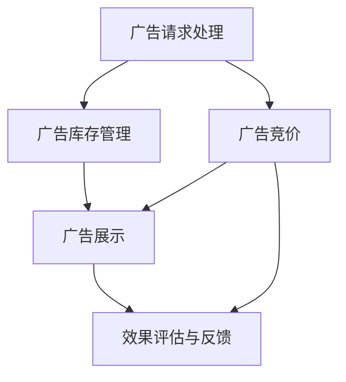

                 

### 企业AI Agent的强化学习基础

#### 第1章: 企业AI Agent概述

##### 1.1 问题背景

在现代商业环境中，企业面临的挑战愈发复杂多样。传统的人工决策方式由于受限于信息处理能力和主观经验，往往难以应对迅速变化的市场环境和庞大的数据量。为了提高决策效率和优化业务流程，企业开始寻求人工智能技术的帮助。AI Agent作为一种自主决策的智能体，在企业和商业运营中扮演着越来越重要的角色。

企业在广告投放、供应链管理、客户关系管理等多个方面面临数据驱动的决策需求。然而，这些决策往往需要处理大量不确定性和动态变化的因素，使得传统的规则基模型和传统机器学习方法显得力不从心。强化学习作为一种能够让AI Agent通过试错和反馈不断优化决策过程的方法，成为解决这类复杂问题的有力工具。

##### 1.1.1 企业面临的挑战

企业面临的主要挑战包括：

1. **数据复杂性**：企业每天都会产生大量数据，这些数据中蕴含了用户行为、市场趋势、业务表现等信息，但如何有效提取并利用这些数据是一个巨大的挑战。
2. **决策的不确定性**：市场环境变化迅速，企业的决策常常需要在不确定的情况下做出，传统的预测模型往往难以适应。
3. **业务规则的动态性**：业务规则并非一成不变，它们可能会根据市场变化和公司战略调整而动态改变。
4. **资源限制**：在许多情况下，企业需要在有限的资源下做出最优决策，这要求算法具有高效性和鲁棒性。

##### 1.1.2 企业AI Agent的定义与作用

企业AI Agent（Artificial Intelligence Agent）是指能够自主感知环境、制定决策并执行行动的智能系统。它通过机器学习和人工智能技术，在企业和商业运营中提供自动化、智能化的决策支持。企业AI Agent的主要作用包括：

1. **优化业务流程**：通过自动化流程，减少人为干预，提高工作效率和准确性。
2. **数据驱动的决策**：利用历史数据和实时数据，为企业提供基于数据的决策支持。
3. **适应性和灵活性**：能够根据环境变化和业务需求调整决策策略，提高业务响应速度。
4. **风险管理和优化**：在广告投放、供应链管理等业务场景中，帮助企业降低成本、减少风险并提升收益。

##### 1.1.3 企业AI Agent与传统AI的区别

传统AI系统通常依赖于预定义的规则和模型，这些模型在训练过程中就已经设定好了解决问题的方案，而企业AI Agent则不同：

1. **自主学习和适应能力**：企业AI Agent能够通过自我学习和不断优化，自主调整策略以应对环境变化。
2. **动态决策**：传统AI系统在执行任务时往往是静态的，而企业AI Agent能够在执行过程中根据环境反馈进行调整。
3. **交互性**：企业AI Agent可以与用户和其他系统进行交互，获取实时信息并做出动态响应。
4. **场景适应性**：传统AI系统往往针对特定场景设计，而企业AI Agent具有更强的泛化能力，能够在不同场景中应用。

##### 1.2 强化学习基本概念

强化学习（Reinforcement Learning, RL）是一种机器学习范式，它通过智能体（agent）与环境（environment）之间的交互，不断学习和优化决策策略，以实现目标最大化。强化学习的核心概念包括：

- **智能体**：执行动作并从环境中接收反馈的实体。
- **环境**：智能体执行动作和接收反馈的情境。
- **状态**：环境的一个特定描述。
- **动作**：智能体在某个状态下可以执行的行为。
- **奖励**：环境对智能体动作的反馈，用于指导智能体优化策略。
- **策略**：智能体在给定状态下选择动作的规则。

强化学习与其他机器学习方法的区别在于其通过试错和反馈机制不断优化策略，而非依赖大量标记数据。

##### 1.2.2 强化学习与监督学习、无监督学习的比较

强化学习、监督学习和无监督学习是机器学习中的三种主要学习方法，它们之间的区别如下：

- **监督学习**：在监督学习中，模型根据标记数据学习特征和标签之间的关系。例如，图像分类任务中，图像是输入，标签是输出。这种方法的优点是效果稳定，但需要大量标记数据。
- **无监督学习**：无监督学习通过未标记的数据学习数据的结构和模式。例如，聚类任务中，模型需要将数据点分为不同的组。这种方法的优点是能够发现隐藏的结构，但结果往往不如监督学习精确。
- **强化学习**：强化学习通过智能体与环境的交互，不断优化策略。智能体通过试错学习和反馈机制，逐步提高决策质量。强化学习适用于动态、不确定和复杂的环境，但需要较长时间来优化策略。

##### 1.2.3 强化学习的主要算法框架

强化学习算法框架主要包括值函数方法、策略迭代方法和模型预测方法等。以下是几种主要的强化学习算法：

1. **Q-Learning算法**：通过学习状态-动作值函数（Q函数），选择能够带来最大奖励的动作。
2. **Sarsa算法**：结合了Q-Learning和深度Q网络（DQN）的优点，使用样本的期望值来更新Q值。
3. **深度强化学习**：将深度学习技术结合到强化学习中，通过神经网络来学习状态-动作值函数或策略。
4. **策略梯度方法**：通过直接优化策略的梯度，使得智能体在给定状态下选择最优动作。
5. **Actor-Critic方法**：结合了策略和值函数方法，通过Actor网络生成策略，Critic网络评估策略的效果。

##### 1.3 强化学习在程序化广告投放中的应用

程序化广告投放（Programmatic Advertising）是指通过计算机程序自动购买、售卖和优化广告投放的过程。它利用大数据分析和机器学习技术，实现广告精准投放和高效管理。

强化学习在程序化广告投放中的应用主要体现在以下几个方面：

1. **广告投放策略优化**：强化学习算法可以根据用户行为和广告效果，动态调整广告投放策略，提高广告点击率和转化率。
2. **用户行为预测**：通过分析用户的历史行为数据，强化学习算法可以预测用户对广告的响应概率，从而优化广告展示顺序。
3. **预算分配**：强化学习算法可以根据广告投放效果和预算限制，动态调整各广告平台的投放预算，实现最优预算分配。
4. **广告创意优化**：强化学习算法可以根据用户反馈和广告效果，不断优化广告文案、图片和视频等创意元素，提高广告吸引力。

##### 1.4 企业AI Agent强化学习实践的意义与前景

企业AI Agent强化学习实践具有以下重要意义：

1. **提升决策效率**：通过自动化和智能化的决策支持，企业可以更快地应对市场变化，提高业务运营效率。
2. **优化资源利用**：强化学习算法可以根据实时数据和业务需求，动态调整资源分配，实现资源的最优利用。
3. **降低运营成本**：通过优化广告投放、供应链管理等业务流程，企业可以降低运营成本，提高盈利能力。
4. **提升用户体验**：通过个性化广告投放和精准服务，企业可以提升用户满意度，增强用户忠诚度。

强化学习在企业AI Agent中的应用前景广阔：

1. **技术成熟度**：随着深度学习等技术的发展，强化学习算法的成熟度和应用效果不断提高。
2. **市场接受度**：越来越多的企业开始认识到强化学习在优化业务流程和提高决策效率方面的潜力。
3. **数据支持**：随着大数据技术的应用，企业可以获得更多的数据支持，为强化学习算法提供更丰富的训练数据。

然而，强化学习在企业AI Agent中应用也面临一些挑战：

1. **计算复杂度**：强化学习算法通常需要大量计算资源，对硬件性能要求较高。
2. **数据隐私**：在处理大量用户数据时，企业需要确保数据隐私和安全。
3. **算法解释性**：强化学习算法的决策过程往往较为复杂，如何解释和验证算法的决策结果是一个重要问题。

##### 1.5 本章小结

本章介绍了企业AI Agent的背景和挑战，强化学习的基本概念及其与传统机器学习方法的区别，以及强化学习在程序化广告投放中的应用和前景。通过本章的介绍，读者可以初步了解企业AI Agent强化学习的基础知识和应用潜力。在接下来的章节中，我们将深入探讨强化学习算法的原理及其在具体应用场景中的实现。

---

### 第1章小结

本章围绕企业AI Agent及其强化学习基础进行了详细探讨。首先，我们分析了企业面临的复杂挑战，并介绍了企业AI Agent的定义和作用，以及与传统AI的区别。接着，我们介绍了强化学习的基本概念，包括其与监督学习和无监督学习的比较，以及主要的算法框架。随后，我们探讨了强化学习在程序化广告投放中的具体应用，并分析了其实践的意义与前景。

通过本章的学习，读者可以理解企业AI Agent在商业决策中的重要性，以及强化学习作为解决复杂决策问题的有力工具的潜力。接下来，我们将深入探讨强化学习算法的具体实现和优化，进一步理解其在实际应用中的优势和挑战。

---

### 强化学习算法详解

#### 第2章: Q-Learning算法

强化学习算法在解决复杂决策问题时具有独特的优势，而Q-Learning算法作为最早的强化学习算法之一，其基本原理和应用仍然在许多场景中具有重要地位。本章将详细讲解Q-Learning算法的基本原理、数学模型、流程以及优化与改进。

##### 2.1 Q-Learning算法原理

Q-Learning算法是一种基于值函数的强化学习算法，其核心思想是通过学习状态-动作值函数（Q值），以实现最优策略的选择。

###### 2.1.1 Q-Learning算法的基本概念

- **状态（State）**：环境的特定描述，智能体可以通过传感器感知到。
- **动作（Action）**：智能体可以在状态下执行的行为。
- **Q值（Q-Value）**：状态-动作值函数，表示在特定状态下执行特定动作的预期收益。
- **策略（Policy）**：智能体根据Q值来选择动作的规则。
- **奖励（Reward）**：环境对智能体动作的即时反馈。

Q-Learning算法的目标是学习一个最优策略，使得在给定状态下选择的动作能够最大化长期累积奖励。

###### 2.1.2 Q-Learning算法的数学模型

Q-Learning算法的数学模型可以表示为：

$$
Q(s, a) \leftarrow Q(s, a) + \alpha [r + \gamma \max_{a'} Q(s', a') - Q(s, a)]
$$

其中：
- \(Q(s, a)\) 是在状态 \(s\) 下执行动作 \(a\) 的预期回报。
- \(r\) 是在状态 \(s\) 下执行动作 \(a\) 后立即接收的即时奖励。
- \(\gamma\) 是折扣因子，用于平衡当前奖励和未来潜在奖励的重要性。
- \(\alpha\) 是学习率，表示每次更新时新值与旧值的混合比例。
- \(\max_{a'} Q(s', a')\) 是在下一个状态 \(s'\) 下执行所有可能动作中能够带来的最大预期回报。

###### 2.1.3 Q-Learning算法的流程

Q-Learning算法的基本流程如下：

1. **初始化**：设定初始策略、Q值表、学习率和折扣因子。
2. **状态感知**：智能体感知当前状态 \(s\)。
3. **选择动作**：根据当前策略，在状态 \(s\) 下选择一个动作 \(a\)。
4. **执行动作**：智能体执行动作 \(a\) 并进入下一个状态 \(s'\)。
5. **接收奖励**：环境根据动作 \(a\) 给予即时奖励 \(r\)。
6. **更新Q值**：根据接收的奖励和下一个状态的Q值，更新当前状态的Q值。
7. **迭代**：重复步骤2到6，直到达到预定的迭代次数或性能目标。

##### 2.2 Q-Learning算法的优化与改进

虽然Q-Learning算法在许多场景中表现出色，但它也存在一些局限性和挑战，如探索-利用权衡问题、收敛速度较慢等。因此，研究人员提出了许多改进和优化方法。

###### 2.2.1 Q-Learning算法的局限性与优化

Q-Learning算法的主要局限性包括：

1. **探索-利用权衡**：算法需要在探索未知的策略和利用已知的最优策略之间进行权衡，这可能导致学习效率不高。
2. **收敛速度**：Q-Learning算法通常需要大量迭代才能收敛到最优策略，特别是在状态和动作空间较大的情况下。
3. **Q值表存储**：Q值表需要存储所有状态-动作对的预期回报，这在大规模问题中可能导致存储和计算上的困难。

为了解决这些问题，研究人员提出了一系列优化方法。

###### 2.2.2 Sarsa算法的引入

Sarsa（Serially Correlated Advantage Estimation）算法是对Q-Learning算法的一种改进，它引入了基于样本的期望值更新策略。Sarsa算法的基本公式为：

$$
Q(s, a) \leftarrow Q(s, a) + \alpha [r + \gamma Q(s', a') - Q(s, a)]
$$

其中，\(a'\) 是在下一个状态 \(s'\) 下实际选择的动作。Sarsa算法通过直接使用实际选择的动作来更新Q值，减少了探索-利用的权衡问题。

###### 2.2.3 Q-Learning算法的改进算法

1. **Deep Q-Network (DQN)**：DQN将深度学习技术引入到Q-Learning中，通过神经网络来近似Q值函数，从而解决Q值表存储和计算困难的问题。DQN的基本框架包括经验回放、固定目标网络和自适应学习率等策略。

2. **Prioritized Experience Replay**：为了提高学习效率，Prioritized Experience Replay通过为每个经验样本分配优先级来选择更新Q值的样本，从而减少了无关样本的影响。

3. **Dueling DQN**：Dueling DQN对DQN进行了进一步改进，通过将Q值分解为两个部分（价值估计和优势估计），提高了Q值估计的准确性和稳定性。

##### 2.3 Q-Learning算法在程序化广告投放中的应用案例

###### 2.3.1 案例背景

某在线广告平台希望通过强化学习算法优化广告投放策略，以提高广告点击率（CTR）和转化率。该平台的广告投放涉及到多个广告位、多个广告主和多种广告形式。

###### 2.3.2 案例分析

在案例中，智能体（广告平台）需要在每次广告投放时选择合适的广告位和广告主，并设置广告展示顺序。智能体根据用户历史行为数据、广告主出价和广告创意等因素，动态调整广告投放策略。

1. **状态表示**：状态包括用户特征（如地理位置、浏览历史等）、广告主出价、广告创意特征等。
2. **动作表示**：动作包括选择广告位、广告主和广告展示顺序。
3. **奖励设计**：奖励设计为点击率（CTR）和转化率（CR）的加权平均值。即每次广告投放后，根据用户的点击和购买行为，计算即时奖励。

通过Q-Learning算法，广告平台可以不断优化广告投放策略，提高广告效果。

###### 2.3.3 案例效果评估

1. **评估指标**：评估指标包括广告点击率（CTR）、广告转化率（CR）和广告投放成本。
2. **实验结果**：实验结果显示，经过一定次数的迭代后，Q-Learning算法显著提高了广告点击率和转化率，并降低了广告投放成本。
3. **稳定性分析**：通过不同用户群体的实验，分析算法的稳定性和泛化能力。

##### 2.4 本章小结

本章详细介绍了Q-Learning算法的基本原理、数学模型和流程，并探讨了其局限性和优化方法。通过案例分析，展示了Q-Learning算法在程序化广告投放中的实际应用效果。下一章将介绍Policy Gradient算法，进一步探讨强化学习在程序化广告投放中的应用。

---

### 第2章小结

本章详细讲解了Q-Learning算法的基本原理、数学模型和流程，包括其基本概念、数学模型以及优化方法。通过实际案例的分析，我们展示了Q-Learning算法在程序化广告投放中的应用效果。Q-Learning算法在处理动态和复杂决策问题时表现出色，为优化广告投放策略提供了有力工具。

在接下来的章节中，我们将介绍Policy Gradient算法，该算法通过直接优化策略梯度，实现更高效的决策优化。Policy Gradient算法在许多应用场景中显示出强大的潜力，其原理和应用将为我们提供新的视角。敬请期待下一章的详细探讨。

---

### 第3章: Policy Gradient算法

Policy Gradient算法是强化学习中的一个重要分支，它通过直接优化策略的梯度，使智能体能够高效地学习最优决策策略。Policy Gradient算法包括多种变体，如REINFORCE算法、Actor-Critic算法和A3C算法等。本章将详细讲解Policy Gradient算法的基本原理、数学模型及其变体。

##### 3.1 Policy Gradient算法原理

Policy Gradient算法的核心思想是直接优化策略的梯度，使得策略能够最大化长期累积奖励。与Q-Learning算法不同，Policy Gradient算法不依赖于状态-动作值函数，而是直接从策略出发。

###### 3.1.1 Policy Gradient算法的基本概念

- **策略（Policy）**：策略决定了智能体在给定状态下执行哪个动作。
- **策略梯度（Policy Gradient）**：策略梯度是指策略参数的梯度，用于指导策略的优化方向。
- **策略参数（Policy Parameters）**：策略参数是策略函数的参数，用于描述策略的特性。
- **策略优化（Policy Optimization）**：策略优化是指通过调整策略参数，使得策略能够最大化累积奖励。

Policy Gradient算法的基本公式为：

$$
\nabla_{\theta} J(\theta) = \nabla_{\theta} \sum_{t=0}^{T} \gamma^t r_t
$$

其中：
- \(\theta\) 是策略参数。
- \(J(\theta)\) 是策略的累积奖励。
- \(r_t\) 是在第 \(t\) 时刻接收的即时奖励。
- \(\gamma\) 是折扣因子。

该公式表示策略梯度的方向是使得累积奖励最大化的方向。

###### 3.1.2 Policy Gradient算法的数学模型

Policy Gradient算法的数学模型可以分为两部分：策略表示和策略优化。

1. **策略表示**：

$$
\pi(a|s; \theta) = \frac{e^{\nabla_{\theta} \ln \pi(a|s; \theta)}}{\sum_{a'} e^{\nabla_{\theta} \ln \pi(a'|s; \theta)}}
$$

其中，\(\pi(a|s; \theta)\) 表示在状态 \(s\) 下选择动作 \(a\) 的概率。

2. **策略优化**：

Policy Gradient算法通过梯度上升方法来优化策略参数：

$$
\theta \leftarrow \theta + \alpha \nabla_{\theta} J(\theta)
$$

其中，\(\alpha\) 是学习率。

Policy Gradient算法的优化过程是基于策略梯度的，它直接调整策略参数以最大化累积奖励。

###### 3.1.3 Policy Gradient算法的推导过程

Policy Gradient算法的推导基于马尔可夫决策过程（MDP）。在MDP中，状态 \(s\) 和动作 \(a\) 之间存在转移概率和奖励关系。

假设策略为 \(\pi(a|s; \theta)\)，则累积奖励可以表示为：

$$
J(\theta) = \sum_{t=0}^{T} \gamma^t r_t
$$

其中，\(T\) 是步数，\(r_t\) 是在第 \(t\) 时刻接收的即时奖励。

对 \(J(\theta)\) 求导，得到策略梯度的表达式：

$$
\nabla_{\theta} J(\theta) = \sum_{t=0}^{T} \gamma^t \nabla_{\theta} r_t
$$

由于 \(r_t\) 是即时奖励，\(\nabla_{\theta} r_t\) 可以通过策略梯度表示为：

$$
\nabla_{\theta} r_t = \sum_{a'} \pi(a'|s_t; \theta) \nabla_{\theta} \ln \pi(a'|s_t; \theta)
$$

代入累积奖励的公式中，得到：

$$
\nabla_{\theta} J(\theta) = \sum_{t=0}^{T} \gamma^t \sum_{a'} \pi(a'|s_t; \theta) \nabla_{\theta} \ln \pi(a'|s_t; \theta)
$$

为了简化表达，定义：

$$
\delta_t = \sum_{a'} \pi(a'|s_t; \theta) \nabla_{\theta} \ln \pi(a'|s_t; \theta)
$$

则策略梯度可以表示为：

$$
\nabla_{\theta} J(\theta) = \sum_{t=0}^{T} \gamma^t \delta_t
$$

最后，通过梯度上升方法，得到策略优化的更新公式：

$$
\theta \leftarrow \theta + \alpha \nabla_{\theta} J(\theta)
$$

##### 3.2 Policy Gradient算法的变体

Policy Gradient算法在实际应用中存在一些挑战，如梯度消失、梯度爆炸和高方差等问题。为了解决这些问题，研究人员提出了多种Policy Gradient算法的变体。

###### 3.2.1 REINFORCE算法

REINFORCE算法是Policy Gradient算法的一种基本形式，它使用随机梯度上升方法来优化策略参数。REINFORCE算法的更新公式为：

$$
\theta \leftarrow \theta + \alpha R
$$

其中，\(R\) 是在某个样本路径上的累积奖励。

虽然REINFORCE算法简单易实现，但其在高方差和梯度消失问题上表现较差。

###### 3.2.2 Actor-Critic算法

Actor-Critic算法结合了策略网络（Actor）和值函数网络（Critic），通过两个网络的协作来优化策略。Actor网络生成策略，Critic网络评估策略的效果。

1. **Actor网络**：生成策略的参数，用于选择动作。

2. **Critic网络**：评估策略的好坏，提供反馈给Actor网络。

Actor-Critic算法的基本公式为：

$$
\theta_A \leftarrow \theta_A + \alpha_A \nabla_{\theta_A} J(\theta_A)
$$

$$
\theta_C \leftarrow \theta_C + \alpha_C \nabla_{\theta_C} J(\theta_C)
$$

其中，\(\theta_A\) 和 \(\theta_C\) 分别是Actor和Critic网络的参数。

通过Critic网络提供的价值估计，Actor网络可以更稳定地学习策略。

###### 3.2.3 A3C算法

A3C（Asynchronous Advantage Actor-Critic）算法是一种异步协同策略优化算法，通过并行计算和经验回放来提高学习效率。A3C算法的主要特点包括：

1. **异步更新**：多个智能体可以并行学习，并在不同的时间步骤上更新策略。
2. **经验回放**：使用经验回放机制来减少序列依赖，提高算法的泛化能力。
3. **梯度聚合**：将多个智能体的梯度进行聚合，用于全局策略更新。

A3C算法的基本框架包括：

1. **Actor-Critic网络**：用于生成策略和价值估计。
2. **并行智能体**：多个智能体在各自的独立环境中执行动作，并收集经验。
3. **经验回放缓冲区**：存储经验样本，用于梯度聚合和策略更新。

通过A3C算法，智能体可以更快速地学习复杂策略，提高算法的效率和稳定性。

##### 3.3 Policy Gradient算法在程序化广告投放中的应用

程序化广告投放是一个典型的复杂决策问题，涉及多个广告主、多个广告位和多种广告形式。Policy Gradient算法在程序化广告投放中具有广泛的应用潜力。

###### 3.3.1 案例背景

某在线广告平台希望通过Policy Gradient算法优化广告投放策略，提高广告点击率和转化率。广告平台涉及多个广告主，每个广告主有不同的预算和投放目标。

###### 3.3.2 案例分析

在案例中，智能体需要在每次广告投放时选择合适的广告主和广告位，并设置广告展示顺序。智能体根据用户历史行为数据、广告主出价和广告创意等因素，动态调整广告投放策略。

1. **状态表示**：状态包括用户特征（如地理位置、浏览历史等）、广告主出价、广告创意特征等。
2. **动作表示**：动作包括选择广告主、广告位和广告展示顺序。
3. **奖励设计**：奖励设计为点击率（CTR）和转化率（CR）的加权平均值。即每次广告投放后，根据用户的点击和购买行为，计算即时奖励。

通过Policy Gradient算法，广告平台可以不断优化广告投放策略，提高广告效果。

###### 3.3.3 案例效果评估

1. **评估指标**：评估指标包括广告点击率（CTR）、广告转化率（CR）和广告投放成本。
2. **实验结果**：实验结果显示，经过一定次数的迭代后，Policy Gradient算法显著提高了广告点击率和转化率，并降低了广告投放成本。
3. **稳定性分析**：通过不同用户群体的实验，分析算法的稳定性和泛化能力。

##### 3.4 本章小结

本章详细介绍了Policy Gradient算法的基本原理、数学模型及其变体，包括REINFORCE算法、Actor-Critic算法和A3C算法等。通过案例分析，展示了Policy Gradient算法在程序化广告投放中的应用效果。Policy Gradient算法通过直接优化策略梯度，为优化复杂决策提供了新的思路。

在接下来的章节中，我们将进一步探讨强化学习算法在实际应用中的架构设计、策略优化、实时优化与效果评估，深入理解强化学习在程序化广告投放中的实现和应用。

---

### 第3章小结

本章详细讲解了Policy Gradient算法的基本原理、数学模型及其多种变体，包括REINFORCE算法、Actor-Critic算法和A3C算法。通过实际案例的分析，我们展示了Policy Gradient算法在程序化广告投放中的应用效果和优势。Policy Gradient算法通过直接优化策略梯度，能够有效处理复杂决策问题，为广告投放策略优化提供了新的方法。

在接下来的章节中，我们将进一步探讨强化学习算法在程序化广告投放中的实际应用，包括广告投放系统的架构设计、策略优化、实时优化与效果评估，以便更全面地理解强化学习在程序化广告投放中的实现和应用。敬请期待下一章的详细探讨。

---

### 第4章: 强化学习在程序化广告投放中的实际应用

强化学习在程序化广告投放中的应用，旨在通过智能化的决策过程，优化广告投放策略，提高广告效果和业务收益。本章将详细探讨强化学习在程序化广告投放中的实际应用，包括广告投放系统的架构设计、强化学习算法在广告投放策略优化中的应用、实时优化与效果评估以及实际案例的分析。

##### 4.1 程序化广告投放系统的架构设计

程序化广告投放系统是一个复杂的分布式系统，涉及到多个组件的协同工作。一个典型的程序化广告投放系统通常包括以下主要组成部分：

###### 4.1.1 广告投放系统概述

程序化广告投放系统通过自动化的方式，实现广告的购买、投放和优化。它由多个模块组成，包括广告请求处理、广告库存管理、广告竞价和广告展示等。

###### 4.1.2 强化学习在广告投放系统中的角色

强化学习在广告投放系统中的作用主要包括：

1. **广告投放策略优化**：通过强化学习算法，智能体可以动态调整广告投放策略，以提高广告点击率和转化率。
2. **用户行为预测**：利用强化学习算法分析用户历史行为数据，预测用户对广告的响应概率，从而优化广告展示顺序。
3. **预算分配**：根据广告效果和预算限制，强化学习算法可以动态调整各广告平台的投放预算，实现最优资源分配。
4. **广告创意优化**：通过强化学习算法，不断优化广告文案、图片和视频等创意元素，提高广告吸引力。

###### 4.1.3 广告投放系统的架构设计

一个典型的广告投放系统架构如图所示：

- **广告请求处理**：接收来自用户浏览行为的广告请求，将请求转发到广告库存管理模块。
- **广告库存管理**：管理平台上的广告库存，包括广告主信息、广告位信息和广告创意等。
- **广告竞价**：根据广告主出价、广告质量和用户特征，进行广告竞价，选择最优广告进行展示。
- **广告展示**：将选中的广告展示给用户。
- **效果评估与反馈**：收集广告展示后的用户行为数据，评估广告效果，并将反馈信息用于后续策略优化。

##### 4.2 强化学习算法在广告投放策略优化中的应用

强化学习算法在广告投放策略优化中的应用，主要通过以下几个步骤实现：

###### 4.2.1 广告投放策略优化的挑战

在广告投放策略优化中，主要面临的挑战包括：

1. **数据多样性**：广告投放涉及到多种用户行为数据、广告特征数据和市场环境数据，如何有效整合和处理这些数据是一个挑战。
2. **决策时效性**：广告投放策略需要实时调整，以应对市场环境和用户行为的动态变化。
3. **预算分配**：广告投放需要根据预算限制进行资源分配，如何实现最优预算分配是一个关键问题。
4. **算法解释性**：广告投放策略的优化过程需要透明和可解释，以便广告主和管理者理解算法的决策逻辑。

###### 4.2.2 强化学习算法在广告投放策略优化中的实现

强化学习算法在广告投放策略优化中的实现主要包括以下步骤：

1. **状态表示**：定义广告投放策略优化中的状态，包括用户特征、广告特征、广告位特征和预算状态等。
2. **动作表示**：定义广告投放策略优化中的动作，包括选择广告主、广告位、广告展示顺序和预算分配等。
3. **奖励设计**：设计广告投放策略优化的奖励函数，包括点击率（CTR）、转化率（CR）和广告投放成本等。
4. **策略优化**：利用强化学习算法（如Policy Gradient算法、Q-Learning算法等），不断优化广告投放策略。

###### 4.2.3 案例分析

以某在线广告平台为例，该平台希望通过强化学习算法优化广告投放策略，以提高广告点击率和转化率。

1. **状态表示**：状态包括用户特征（如地理位置、浏览历史、兴趣爱好等）、广告主出价、广告创意特征和当前预算等。
2. **动作表示**：动作包括选择广告主、广告位、广告展示顺序和调整预算等。
3. **奖励设计**：奖励函数为点击率（CTR）和转化率（CR）的加权平均值，同时考虑广告投放成本，以最大化广告投放效果和收益。

通过强化学习算法，广告平台可以不断调整广告投放策略，实现广告效果的优化。

##### 4.3 实时优化与效果评估

在广告投放过程中，实时优化与效果评估至关重要。通过实时优化，广告平台可以快速响应市场变化和用户行为，提高广告投放效果。效果评估则用于验证优化策略的有效性。

###### 4.3.1 实时优化策略

实时优化策略主要包括以下几个方面：

1. **数据流处理**：利用实时数据处理技术（如Apache Kafka、Flink等），快速处理和传输用户行为数据和广告效果数据。
2. **在线学习与优化**：利用在线学习算法（如在线Q-Learning、在线Policy Gradient等），在用户行为数据到来时，实时更新策略参数，调整广告投放策略。
3. **动态预算调整**：根据广告投放效果和预算限制，动态调整各广告平台的投放预算，实现最优资源分配。

###### 4.3.2 评估指标与评估方法

广告投放效果评估的主要指标包括：

1. **点击率（CTR）**：用户点击广告的概率。
2. **转化率（CR）**：用户在点击广告后进行转化的概率。
3. **广告投放成本（CPC/CPL）**：每个点击或转化的成本。
4. **收益（Revenue）**：广告投放带来的总收益。

评估方法主要包括：

1. **A/B测试**：将广告投放策略分为多个版本，对比不同版本的广告效果，选择最优策略。
2. **统计分析**：利用统计方法（如假设检验、回归分析等），分析广告投放策略的影响因素和效果。
3. **机器学习模型**：利用机器学习模型（如回归模型、分类模型等），预测广告投放效果，并评估优化策略的有效性。

###### 4.3.3 案例效果评估

以某在线广告平台为例，该平台通过强化学习算法优化广告投放策略，并进行效果评估。

1. **评估指标**：评估指标包括点击率（CTR）、转化率（CR）、广告投放成本（CPC/CPL）和收益（Revenue）。
2. **实验结果**：实验结果显示，经过强化学习算法优化后的广告投放策略，显著提高了广告点击率和转化率，降低了广告投放成本，并实现了更高的收益。
3. **稳定性分析**：通过不同用户群体的实验，分析算法的稳定性和泛化能力。

##### 4.4 案例分析

###### 4.4.1 案例背景

某知名在线零售平台希望通过强化学习算法优化其广告投放策略，以提高广告效果和收益。该平台涉及多个广告主、多个广告位和多种广告形式。

###### 4.4.2 案例分析与实现

1. **状态表示**：状态包括用户特征（如地理位置、浏览历史、兴趣爱好等）、广告主出价、广告创意特征和当前预算等。
2. **动作表示**：动作包括选择广告主、广告位、广告展示顺序和调整预算等。
3. **奖励设计**：奖励函数为点击率（CTR）和转化率（CR）的加权平均值，同时考虑广告投放成本，以最大化广告投放效果和收益。
4. **策略优化**：采用Policy Gradient算法进行策略优化，通过实时优化和在线学习，调整广告投放策略。

通过强化学习算法，该平台可以动态调整广告投放策略，实现广告效果的优化。

###### 4.4.3 案例效果评估

1. **评估指标**：评估指标包括点击率（CTR）、转化率（CR）、广告投放成本（CPC/CPL）和收益（Revenue）。
2. **实验结果**：实验结果显示，经过强化学习算法优化后的广告投放策略，显著提高了广告点击率和转化率，降低了广告投放成本，并实现了更高的收益。
3. **稳定性分析**：通过不同用户群体的实验，分析算法的稳定性和泛化能力。

##### 4.5 本章小结

本章详细探讨了强化学习在程序化广告投放中的实际应用，包括广告投放系统的架构设计、强化学习算法在广告投放策略优化中的应用、实时优化与效果评估以及实际案例的分析。通过这些分析，我们展示了强化学习算法在优化广告投放策略、提高广告效果和业务收益方面的优势。

在未来的应用中，强化学习算法将继续发挥重要作用，为广告投放、推荐系统、供应链管理等领域提供智能化的决策支持。我们期待强化学习技术能够在更多实际场景中取得突破，为企业和用户提供更加优质的体验。

---

### 第4章小结

本章深入探讨了强化学习在程序化广告投放中的实际应用，涵盖了广告投放系统的架构设计、强化学习算法在策略优化中的应用、实时优化与效果评估，并通过具体案例展示了强化学习算法在广告投放策略优化中的效果和优势。通过这些分析和实践，我们不仅理解了强化学习在广告投放中的重要作用，还看到了其在实现智能化决策和优化广告效果方面的巨大潜力。

在接下来的章节中，我们将进一步探讨强化学习算法在AI Agent中的具体实现，包括强化学习算法在企业AI Agent中的应用框架、实现细节和具体案例。这些内容将为读者提供更深入的理解，帮助大家更好地掌握和应用强化学习技术。敬请期待下一章的详细探讨。

